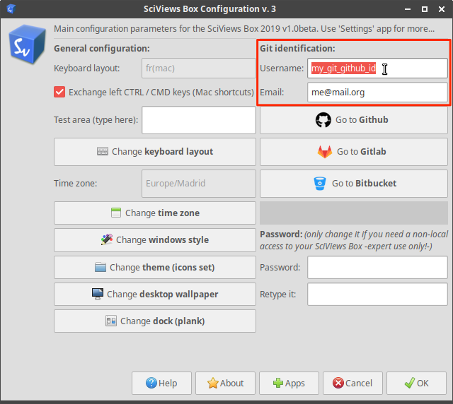

# (APPENDIX) Appendices {-}


# Installation de la SciViews Box {#svbox}

```{r echo=FALSE, out.width="256px", fig.align='right'}
knitr::include_graphics('images/sdd1_01/svBox-256.png')
```

Pour ce cours SDD 2, nous utiliserons la même SciViews Box... mais actualisée (version de l'année). Vous allez donc devoir installer la nouvelle version. La procédure n'a changé que sur des points de détails. Référez-vous à [l'appendice A1 du cours SDD 1](http://biodatascience-course.sciviews.org/sdd-umons/svbox.html). **Vous pouvez conserver l'ancienne SciViews Box en parallèle avec cette nouvelle version**, mais vérifiez si vous avez assez d'espace sur le disque dur pour contenir les deux simultanément. Comptez par sécurité 20Go par version. Si vous manquez de place, vous pouvez éliminer l'ancienne version avant d'installer la nouvelle (vos projets ne seront pas effacés).

**TODO: procédure pour éliminer une ancienne version.**


## Migration des projets

Concernant les projets réalisés dans une version précédente de la SciViews Box, ceux-ci restent disponibles, même si vous éliminez l'ancienne. Plusieurs cas de figure se présentent\ :

1. Vous conserver deux ou plusieurs version de la SciViews Box en parallèle. Dans ce cas, nous conseillons fortement de garder chaque projet accessible à partir de la version dans laquelle il a été créé. Seulement les projets que vous décidez de *migrer* explicitement (voir ci-dessous) seront à déplacer dans le dossier `shared` de la nouvelle SciViews Box. Vous aurez à faire cette manipulation, par exemple, si vous devez recommencer un cours l'année suivante afin d'être en phase (même version de la svbox) par rapport à vos nouveaux collègues.

2. Vous ne conservez que la dernière version de la SciViews Box, mais ne devez pas accéder fréquemment vos anciens projets, et dans ce cas, vous pouvez réinstaller temporairement l'ancienne version de svbox. Dans ce cas, ne migrez pas vos anciens projets. Éliminez simplement l'ancienne svbox, tout en laisant vos projets intacts dans son répertoire `shared`. Lors de la réinstallation de l'ancienne svbox, vous retrouverez alors tous vos anciens projets intactes.

3. Vous ne conservez pas d'ancienne version de la svbox et vous ne souhaitez pas devoir la réinstaller. Il est possible de *migrer* vos anciens projets en les déplaçant de l'ancien répertoire `shared` vers le nouveau. **Soyez toutefois conscients que vos documents R Markdown et scripts R ne fonctionneront pas forcément dans la nouvelle svbox et qu'une adaptation sera peut-être nécessaire\ !**


## Configuration Git et Github

A chaque nouvelle installation de la SciViews Box, vous devez la reconfigurer via la boite de dialogue `SciViews Box Configuration`. En particulier, il est très important d'indiquer correctement votre identifiant et email Git (zone encadrée en rouge dans la copie d'écran ci-dessous).



Assurez-vous (si ce n'est déjà fait) que vous possédez un compte Github valide. Vous pouvez cliquer sur le bouton `Go to Github` par facilté dans la même boite de dialogue. **Choisissez de manière judicieuse votre login**. Vous pourriez être amenés à l'utiliser bien plus longtemps que vous ne le pensez, y compris plus tard dans votre carrière. Donc, lisez les conseils ci-dessous (inspirés et adaptés de [Happy Git and Github for the UseR - Register a Github Account](https://happygitwithr.com/github-acct.html)\ :

- Incluez votre nom réel. Les gens aiment savoir à qui ils ont affaire. Rendez aussi votre nom/login facile à deviner et à retenir. Philippe Grosjean a comme login `phgrosjean`, par exemple.

- Vous pouvez réutiliser votre login d'autres contextes, par exemple Twitter ou Slack (ou Facebook).

- Choisissez un login que vous pourrez échanger de manière confortable avec votre futur boss.

- Un login plus court est préférable.

- Soyez unique dans votre login, mais à l'aide d'aussi peu de caractères que possible. Github propose parfois des logins en auto-complétion. Examinez ce qu'il propose.

- Rendez votre login invariable dans le temps. Par exemple, n'utilisez pas un login lié à votre université (numéro de matricule, ou nom de l'université inclue dans le login). Si tout va bien votre login vous suivra dans votre carrière, ... donc, potentiellement loin de l'université où vous avez fait vos études.

- N'utilisez pas de logins qui sont aussi des mots ayant une signification particulière en programmation, par exemple, n'utilisez pas `NA`, même si c'est vos initiales\ !

...

Si vous éprouvez toujours des difficultés à faire collaborer R et RStudio avec Git et Github, voyez [https://happygitwithr.com](Happy Git and Github for the UseR) (en anglais) qui explique les différentes procédures bien plus en détails.

