# (PART) Cours II: analyse et modélisation {-}

# Régression linéaire I {#lm}


##### Objectifs {-}

- Retrouver ses marques avec R, RStudio et la SciViews Box et découvrir les fonctions supplémentaires de la nouvelle version.

- Découvrir la régression linaire de manière intuitive.

- Découvrir les outils de diagnostic de la régression linéaire, en particulier l'analyse des résidus.


##### Prérequis {-}

Avant de nous lancer tête baissée dans de la matière nouvelle, nous allons **installer la dernière version de la SciViews Box**. Une nouvelle version est disponible chaque année début septembre. Reportez-vous à l'appendice \@ref(svbox) pour son installation et pour la migration éventuelle de vos projets depuis la version précédente. Une fois la box installée, consacrez un petit quart d'heure à repérer les icônes nouvelles dans le Dock et dans le menu `Applications`. Vous retrouverez R et RStudio, mais dans des version plus récentes qui apportent également leur lot de nouveautés. Lancez RStudio et repérez ici aussi les nouveaux onglets et les nouvelles entrées de menu. Aidez-vous de l'aide en ligne ou de recherches sur le net pour vous familiariser avec ces nouvelles fonctionnalités.

Une fois la nouvelle SciViews Box fonctionnelle sur votre ordinateur, vous allez réaliser une séance d'exercice couvrant les points essentiels des notions abordées dans le livre [science des données biologiques partie 1](http://biodatascience-course.sciviews.org/sdd-umons/), histoire de rafraîchir vos connaissances. Les tutoriaux `learnr` auxquels vous êtes maintenant habitués seront là pour vous aider à auto-évaluer votre progression. Pour le cours 2, ces tutoriaux sont dans le package `BioDataScience2` que vous venez normalement d'installer si vous avez bien suivi toutes les instructions de configuration de votre SciViews Box (sinon, vérifiez votre configuration).

\BeginKnitrBlock{bdd}<div class="bdd">Démarrez la SciViews Box et RStudio. Dans la fenêtre **Console** de RStudio, entrez l'instruction suivante suivie de la touche `Entrée` pour ouvrir le tutoriel concernant les bases de R\ :

    BioDataScience2::run("01a_rappel")

N’oubliez pas d’appuyer sur la touche `ESC` pour reprendre la main dans R à la fin d’un tutoriel dans la console R.</div>\EndKnitrBlock{bdd}


## Modèle 

**Qu'est-ce qu'un "modèle" en science des données et en statistique\ ?** Il s'agit d'une représentation *simplifiée* sous forme mathématique du mécanisme responsable de la distribution des observations.

Rassurez-vous, dans ce module, le côté mathématique du problème sera volontairement peu développé pour laisser une large place à une compréhension *intuitive* du modèle. Les seules notions clés à connaître ici concernent l'équation qui définit une droite quelconque dans le plan $xy$\ :

$$y = a \ x + b$$

Cette équation comporte\ :

- deux **variables** $x$ et $y$ qui sont matérialisées par les axes des abscisses et des ordonnées dans le plan $xy$. Ces variables prennent des valeurs bien définies pour les *observations* réalisées sur chaque *individu* du jeu de données.

- deux **paramètres** $a$ et $b$, respectivement la pente de la droite ($a$) et son ordonnée à l'origine ($b$). Ecrit de la sorte, $a$ et $b$ peuvent prendre n'importe quelle valeur et l'équation définit de manière généraliste *toutes* les droites possibles qui existent dans le plan $xy$. *Paramétrer* ou *paramétriser* le modèle consiste à définir **une et une seule droite** en fixant les valeurs de $a$ et de $b$. Par exemple, si je décide de fixer $a = 0.35$ et $b = -1.23$, mon équation définit maintenant **une droite bien précise** dans le plan $xy$\ :

$$y = 0,35 \ x - 1.23$$

\BeginKnitrBlock{warning}<div class="warning">La distinction entre *variable* et *paramètre* dans les équations précédentes semble difficile pour certaines personnes. C'est pourtant crucial de pouvoir le faire pour bien comprendre la suite. Alors, c'est le bon moment de **relire attentivement** ce qui est écrit ci-dessus et de le mémoriser avant d'aller plus avant\ !</div>\EndKnitrBlock{warning}


### Pourquoi modéliser ?

Le but de la modélisation consiste à découvrir l'équation mathématique de la droite (ou plus généralement, de la fonction) qui décrit au mieux la forme du nuage de points matérialisant les observations dans le plan $xy$ (ou plus généralement dans un *hyper-espace* représenté par les différentes variables mesurées). Cette équation mathématique peut ensuite être utilisée de différentes façons, toutes plus utiles les unes que les autres\ :

- Aide à la **compréhension du mécanisme sous-jacent** qui a généré les données. Par exemple, si une droite représente bien la croissance pondérale d'un organisme dans le plan représenté par le logarithme du poids (`P`) en ordonnée et le temps (`t`) en abscisse, nous pourrons déduire que la croissance de cet organisme est probablement un mécanisme de type exponentiel (puisqu'une transformation inverse, c'est-à-dire logarithmique, linéarise alors le nuage de points). Attention\ ! Le modèle *n'est pos* le mécanisme sous-jacent de génération des données, mais utilisé habilement, ce modèle peut donner des *indices utiles* pour aider à découvrir ce mécanisme.

- Effectuer des **prédictions**. Le modèle paramétré pourra être utilisé pour prédire, par exemple, le poids probable d'un individu de la même population après un certain laps de temps.

- **Comparer différents modèles**. En présence de plusieurs populations, nous pourrons ajuster un modèle linéaire pour chacune d'elles et comparer ensuite les pentes des droites pour déterminer quelle population a le meilleur ou le moins bon taux de croissance.

- **Explorer les relations** entre variables. Sans aucunes connaissances sur le contexte qui a permit d'obtenir nos données, un modèle peut fournir des informations utiles pour orienter les recherches futures.

Idéalement, un modèle devrait pouvoir servir à ces différentes applications. En pratique, comme le modèle est forcément une simplification de la réalité, des compromis doivent être concédés pour arriver à cette simplification. En fonction de son usage, les compromis possibles vont différer. Il s'en suit une *spécialisation* des modèles en modèles **mécanistiques** qui décrivent particulièrement bien le mécanisme sous-jacent (fréquents en physique, par exemple), les modèles **prédictifs** conçus pour calculer des nouvelles valeurs (que l'intelligence artificielle affectionne particulièrement), les modèles **comparatifs**, et enfin, les modèles **exploratroires** (utilisés dans la phase initiale de découverte et de description des données). Retenez simplement qu'un même modèle est rarement efficace sur les quatre tableaux simultanément.


### Quand modéliser ?

A chaque fois que deux ou plusieurs variables (quantitatives dans le cas de la régression) forment un nuage de points qui présente une forme particulière non sphérique, autrement dit, qu'une **corrélation significative** existe dans les données, un modèle peut être utile.

Etant donné deux variables quantitatives, trois niveaux d'association de force croissante peuvent être définies entre ces deux variables\ :

- La **corrélation** quantifie juste l'allongement dans une direction préférentielle du nuage de points à l'aide des coefficients de corrélation linéaire de **Pearson** ou non linéaire de **Spearman**. Ce niveau d'association a été traité dans le [module 12 du cours 1](http://biodatascience-course.sciviews.org/sdd-umons/association-de-deux-variables.html). Il est purement descriptif et n'implique aucunes autres hypothèses sur les données observées.

- La **relation** considère que la corrélation observée entre les deux variables est issue d'un mécanisme sous-jacent qui nous intéresse. Un **modèle mathématique** de l'association entre les deux variables matérialise de manière éventuellement simplifiée, ce mécanisme. Il permet de réaliser ensuite des calculs utiles. Nous verrons plus loin que des contraintes plus fortes doivent être supposées concernant le distribution des deux variables.

- La **causalité** précise encore le mécanisme sous-jacent dans le sens qu'elle exprime le fait que c'est la variation de l'une de ces variables qui est directement ou indirectement la **cause** de la variation de la seconde variable. Bien que des outils statistiques existent pour inférer une causalité (nous ne les aborderons pas dans ce cours), la causalité est plutôt étudiée via l'**expérimentation**\ : le biologiste *contrôle* et *fait varier* la variable supposée causale, toutes autres conditions par ailleurs invariables dans l'expérience. Il mesure alors et constate si la seconde variable répond ou non à ces variations^[En biologie, le vivant peut être étudié essentiellement de deux manières complémentaires\ : par l'**observation** du monde qui nous entoure sans interférer, ou le moins possible, et par l'**expérimentation** où le biologiste fixe alors très précisément les conditions dans lesquelles il étudie ses organismes cibles. Les deux approches se prêtent à la modélisation *mais seule l'expérimentation permet d'inférer avec certitude la causalité*.] et en déduit une causalité éventuelle.

La distinction entre ces trois degrés d'association de deux variables est cruciale. Il est fréquent d'observer une confusion entre corrélation (ou relation) et causalité chez ceux qui ne comprennent pas bien la différence. Cela peut mener à des **interprétations complètement erronées\ !** Comme ceci est à la fois crucial mais subtil, voici une vidéo issue de la série "les statistiques expliquées à mon chat" qui explique clairement le problème. Une troisième **variable confondante** peut en effet expliquer une corrélation, rendant alors la relation et/ou la causalité entre les deux variables fallacieuse...

<!--html_preserve--><iframe src="https://www.youtube.com/embed/aOX0pIwBCvw" width="770" height="433" frameborder="0" allowfullscreen=""></iframe><!--/html_preserve-->


### Entraînement et confirmation

En statistique, une règle universelle veut qu'une observation ne peut servir qu'une seule fois. Ainsi, toutes les données utilisées pour calculer le modèle ne *peuvent pas servir simultanément* à la confirmer. Il faut échantillonner d'autres valeurs pour effectuer cette confirmation. Il s'en suit une spécialisation des jeux de données en\ :

- jeu d'**entraînement** qui sert à établir le modèle

- jeu de **confirmation** ou de **test** qui sert à vérifier que le modèle est *génaralisable* car il est capable de prédire le comportement d'un *autre* jeu de données indépendant issu de la même population statistique.

\BeginKnitrBlock{note}<div class="note">C'est une pratique cruciale de toujours confirmer son modèle, et donc, de prendre soin de séparer ses données en jeu d'entraînement et de test. Les bonnes façons de faire cela seront abordées au cours 3 dans la partie consacrée à l'apprentissage machine. Ici, nous nous focaliserons uniquement sur l'établissement du modèle dans la phase d'entraînement. Par conséquent, nous utiliserons toutes nos données pour cet entraînement, mais qu'il soit d'emblée bien clair qu'une confirmation du modèle est une seconde phase également indispensable.</div>\EndKnitrBlock{note}


## Régression linéaire simple

Nous allons découvrir les bases de la régression linéaire de façon intuitive. Nous utilisons le jeu de données `trees` qui rassemble la mesure du diamètre, de la hauteur et du volume de bois de cerisiers noirs. 


```r
# importation des données
trees <- read("trees", package = "datasets", lang = "fr")
```

Rapellons-nous que dans le [chapitre 12 du livre science des données 1](http://biodatascience-course.sciviews.org/sdd-umons/association-de-deux-variables.html), nous avons étudié l'association de deux variables quantitatives (ou numériques). Nous utilisons donc une matrice de corrélation afin de mettre en évidence la corrélation entre nos trois variables qui composent le jeu de donnée `trees`.

La fonction `correlation()` nous renvoie un tableau de la matrice de correlation avec l'indice de Pearson (corrélation linéaire) par défaut. C'est précisement ce coefficient qui nous intéresse dans le cadre d'une régression *linéaire* comme description préalable des données autant que pour nous guider dans le choix de nos variables.


```r
(trees_corr <- correlation(trees))
```

```
# Matrix of Pearson's product-moment correlation:
# (calculation uses everything)
#          diameter height volume
# diameter 1.000    0.519  0.967 
# height   0.519    1.000  0.597 
# volume   0.967    0.597  1.000
```

Nous pouvons également observer cette matrice sous la forme d'un graphique plus convivial.


```r
plot(trees_corr, type = "lower")
```

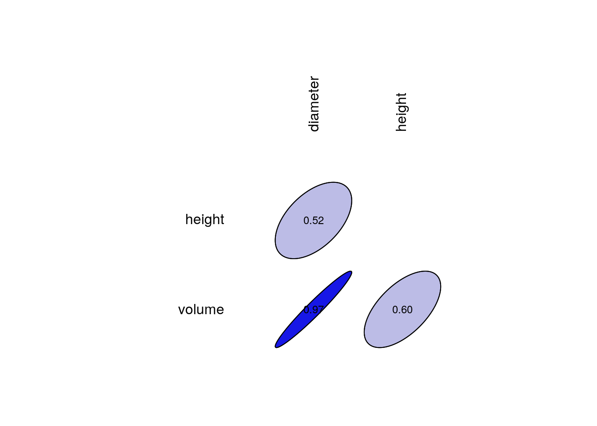

Cependant, n'oubliez pas qu'il est indispensable de visualiser les nuages de points pour ne pas tomber dans le piège mis en avant par le [jeu de données artificiel appelé “quartet d’Anscombe”](http://biodatascience-course.sciviews.org/sdd-umons/association-de-deux-variables.html#importance-des-graphiques) qui montre très bien comment des données très différentes peuvent avoir même moyenne, même variance et même coefficient de corrélation. Un graphique de type matrice de nuages de points est tout indiqué ici.


```r
GGally::ggscatmat(as.data.frame(trees), 1:3)
```

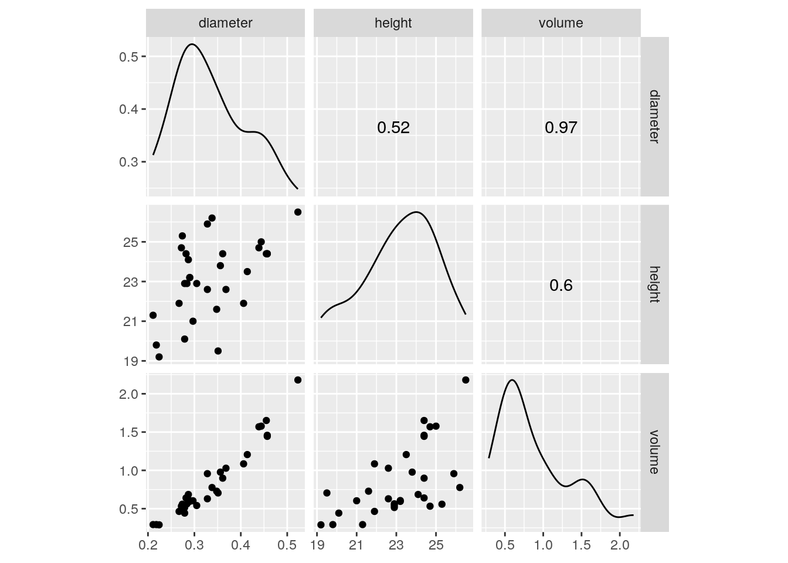

Nous observons une plus forte corrélation linéaire entre le volume et le diamètre. Intéressons nous à cette association.


```r
chart(trees, volume ~ diameter) +
  geom_point()
```

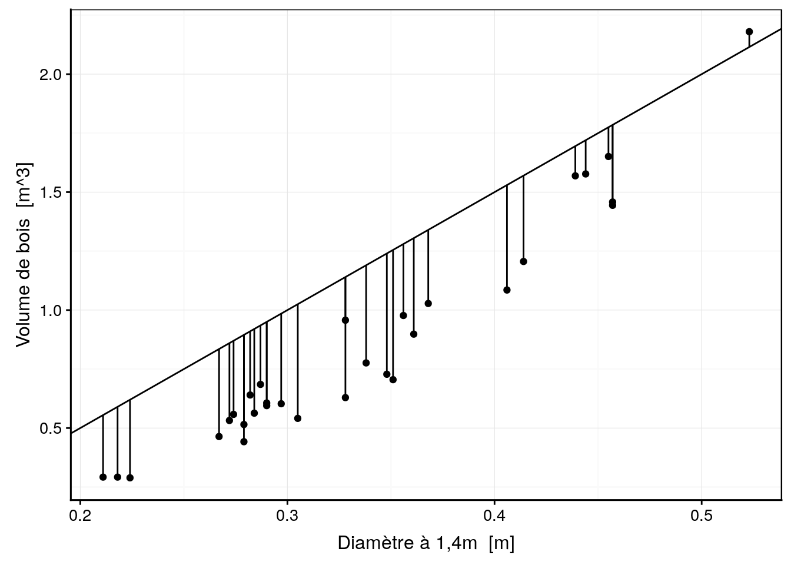

Si vous deviez ajouter une droite permettant de représenter au mieux les données, où est ce que vous la placeriez ? 

Pour rappel, une droite respecte l'équation mathématique suivante\ :

$$y = a \ x + b$$ 

dont `a` est la pente (*slope* en anglais) et `b` est l'ordonnée à l'origine (*intercept* en anglais).


```r
# Sélection de pentes et d'ordonnées à l'origine
models <- tibble(
  model = paste("model", 1:4, sep = "-"),
  slope = c(5, 5.5, 6, 0),
  intercept = c(-0.5, -0.95, -1.5, 0.85)
)

chart(trees, volume ~ diameter) +
  geom_point() +
  geom_abline(data = models,
    aes(slope = slope, intercept = intercept, color = model)) + 
  labs( color = "Modèle")
```

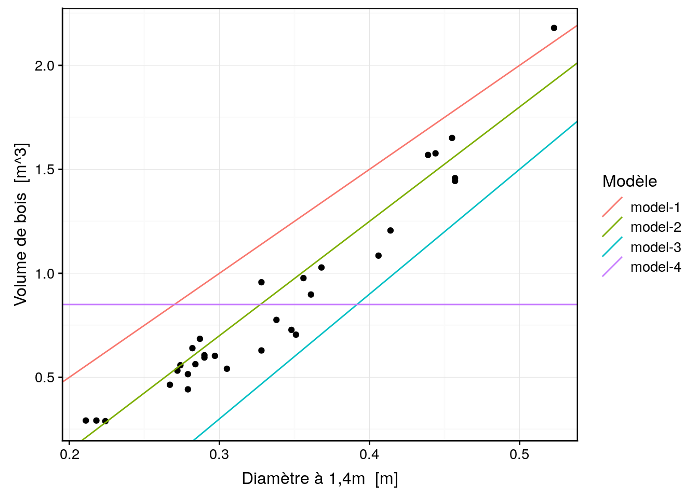

Nous avons quatre droites candidates pour représenter au mieux les observations. Quel est la meilleure d'entre elles selon vous\ ? 


### Quantifier l'ajustement d'un modèle

Nous voulons identifier la meilleure régression, c'est-à-dire la régression le plus proche de nos données. Nous avons besoin d'une règle qui va nous permettre de quantifier la distance de nos observations à notre modèle afin d'obtenir la régression avec la plus faible distance possible de l'ensemble de nos observations. 

Décomposons le problème étape par étape et intéressons nous au `model-1` (droite en rouge sur le graphique précédent).

- Calculer les valeurs de $y_i$ **prédites par le modèle** que nous noterons par convention $\hat y_i$ (prononcez "y chapeau" ou *"y hat"* en anglais) pour chaque observation $i$.


```r
# Calculer la valeur de y pour chaque valeur de x suivant le model souhaité
# Création de notre fonction 
model <- function(slope, intercept, x) {
  prediction <- intercept + slope * x
  attributes(prediction) <- NULL
  prediction
}
# Application de notre fonction 
yhat <- model(slope = 5, intercept = -0.5, x = trees$diameter)
# Affichage des résultats
yhat
```

```
#  [1] 0.555 0.590 0.620 0.835 0.860 0.870 0.895 0.895 0.910 0.920 0.935
# [12] 0.950 0.950 0.985 1.025 1.140 1.140 1.190 1.240 1.255 1.280 1.305
# [23] 1.340 1.530 1.570 1.695 1.720 1.775 1.785 1.785 2.115
```

- Calculer la distance entre les observations $y_i$ et les prédictions par notre modèle $\hat y_i$, soit $y_i - \hat y_i$

Les distances que nous souhaitons calculer, sont appelées les **résidus** du modèle et sont notés $\epsilon_i$ (epsilon). Nous pouvons premièrement visualiser ces résidus graphiquement (ici en rouge par rapport à `model-1`)\ :

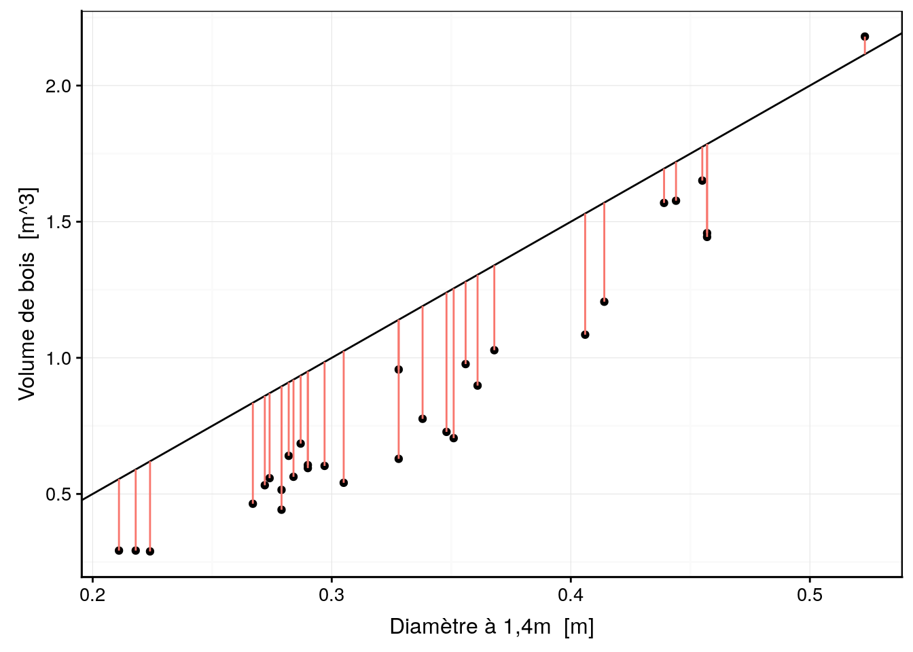

Nous pouvons ensuite facilement calculer leurs valeurs comme ci-dessous\ : 


```r
# Calculer la distance entre y et y barre
# Création de notre fonction de calcul des résidus
distance <- function(observations, predictions) {
  residus <- observations - predictions
  attributes(residus) <- NULL
  residus
}
# Utilisation de la fonction
resid <- distance(observations = trees$volume, predictions = yhat)
# Impression des résultats
resid
```

```
#  [1] -0.263 -0.298 -0.331 -0.371 -0.328 -0.312 -0.453 -0.380 -0.270 -0.357
# [11] -0.250 -0.355 -0.344 -0.382 -0.484 -0.511 -0.183 -0.414 -0.512 -0.550
# [21] -0.303 -0.407 -0.312 -0.445 -0.364 -0.126 -0.143 -0.124 -0.327 -0.341
# [31]  0.065
```

- Définir une règle pour obtenir une valeur unique qui résume l'ensemble des distances de nos observations par rapport aux prédictions du modèle. Une première idée serait de sommer l'ensemble de nos résidus comme ci-dessous\ :


```r
sum(resid)
```

```
# [1] -10.175
```

Appliquons ces calculs sur nos quatre modèles afin de les comparer... Le modèle pour lequel notree critère serait le plus proche de zéro serait alors considéré comme le meilleur.


 model-1   model-2   model-3   model-4
--------  --------  --------  --------
 -10.175    -1.441    10.393     0.135

Selon notre méthode, il en ressort que le modèle 4 est le plus approprié pour représenter au mieux nos données. Qu'en pensez vous\ ?


Intuitivement, nous nous aperçevons que le modèle 4 est loin d'être le meilleur. **Nous pouvons en déduire que la somme des résidus n'est pas un bon critère pour ajuster un modèle linéaire.** 

Le problème lorsque nous sommons des résidus, est la présence de résidus positifs et de résidus négatifs (ici par rapport à `model-4`).

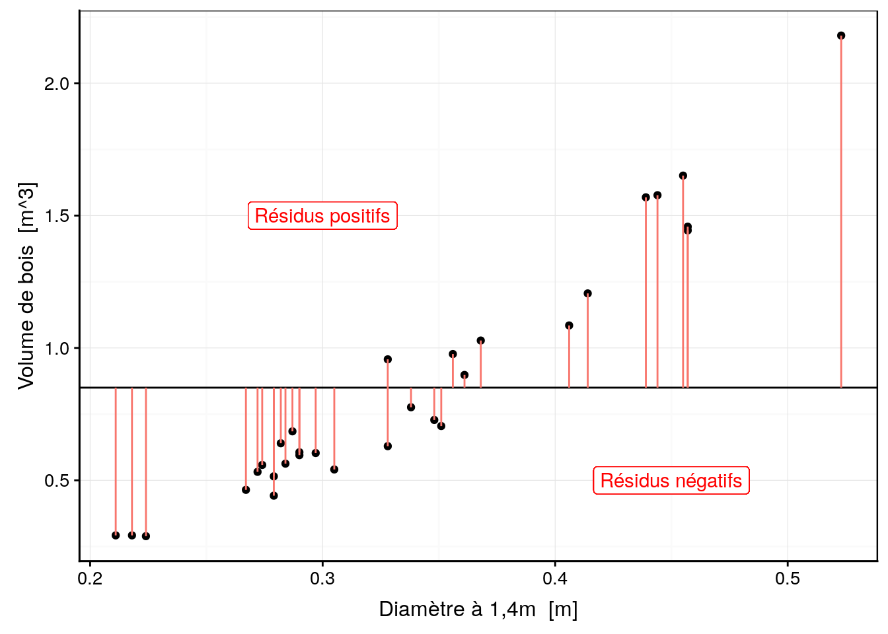

Ainsi avec notre première méthode naïve de somme des résidus, il suffit d'avoir autant de résidus positifs que négatifs pour avoir un résultat proche de zéro. Mais cela n'implique pas que les observations soient prochent de la droite pour autant. Avez-vous une autre idée que de sommer les résidus\ ?

- **Sommer le carré des résidus** aurait des propriétés intéressantes car d'une part les carrés de nombres positifs et négatifs sont tous positifs, et d'autre part, plus une observation est éloignée plus sa distance au carré pèse fortement dans la somme^[Utiliser le carré des résidus a aussi d'autres propriétés statistiques intéressantes qui rapprochent ce calcul de la variance (qui vaut la somme de la distance au carré à la moyenne pour une seule variables numérique).].

Nous obtenons les résultats suivants\ :


  model-1     model-2    model-3    model-4
---------  ----------  ---------  ---------
 3.842211   0.4931095   3.929195   6.498511

- **Sommer les valeurs absolues des résidus** mène également à des contributions toutes positives, mais sans pénaliser outre mesure les observations les plus éloignées.

Nous obtenons les résultats suivants\ :


 model-1   model-2   model-3   model-4
--------  --------  --------  --------
  10.305     3.186    10.393    11.525

Nous avons trouvé deux solutions intéressantes pour quantifier la distance de notre droite par rapport à nos observations. En effet, dans les deux cas, la valeur minimale est obtenue pour le `model-2` (en vert sur le graphique) qui est visuellement le meilleur des quatre.

\BeginKnitrBlock{note}<div class="note">La méthode utilisant les carrés des résidus s'appelle une **régression par les moindres carrés**. Notre objectif est donc de trouver les meilleures valeurs des paramètres $a$ et $b$ de la droite pour minimiser ce critère. Il en résulte une fonction dite **objective** qui dépend de $x$ et de nos paramètres $a$ et $b$ à minimiser. Cette approche s'appelle la **régression par les moindres carrés** et elle est la plus utilisée.

L'approche utilisant la somme de la valeur absolue des résidus est également utilisable (et elle est d'ailleurs préférable en présence de valeurs extrêmes potentiellement suspectes). Elle s'apppelle **régression par la médiane**, un cas particulier de la **régression quantile**, une approche intéressante dans le cas de non normalité des résidus et/ou de présence de valeurs extrêmes suspectes.</div>\EndKnitrBlock{note}


### Trouver la meilleure droite 

\BeginKnitrBlock{bdd}<div class="bdd">Essayez de trouver le meilleur modèle par vous-même dans une application interactive "shiny". Démarrez la SciViews Box et RStudio. Dans la fenêtre **Console** de RStudio, entrez l'instruction suivante suivie de la touche `Entrée` pour ouvrir l'application :

    BioDataScience2::app("01a_lin_mod") # TODO

Méthode alternative\ :

    shiny::runApp(system.file("shiny/01a_lin_mod", package = "BioDataScience2"))

N’oubliez pas d’appuyer sur la touche `ESC` pour reprendre la main dans R lorsque vous aurez fini avec l'application shiny.</div>\EndKnitrBlock{bdd}

Nous pouvons nous demander si notre modèle 2 qui est la meilleure droite de nos quatre modèles est le **meilleur modèle possible dans l'absolu**. Pour se faire nous allons devoir définir unez technique d'optimisation qui nous permet de déterminer quelle est la droite qui minimise notre fonction objective. Dans la suite, nous garderonsq le critère des moindres carrés (des résidus).

Imaginons que nous n'avons pas quatre mais 5000 modèles linéaires avec des pentes et des ordonnées à l'origine différentes. Quelle est la meilleure droite\ ? 


```r
set.seed(34643)
models1 <- tibble(
  intercept = runif(5000, -5, 4),
  slope = runif(5000, -5, 15))

chart(trees, volume ~ diameter) +
  geom_point() +
  geom_abline(aes(intercept = intercept, slope = slope),
    data = models1, alpha = 1/6) 
```


Nous voyons sur le graphique qu'un grand nombre de droites différentes sont testées, mais nous ne distinguons pas grand chose de plus. Cependant, sur ces  5000  modèles, nous pouvons maintenant calculer la somme des carrés des résidus et ensuite déterminer quel est le meilleur d'entre eux.


```r
# Fonction de calcul de la somme des carrés des résidus
measure_distance <- function(slope, intercept, x, y) {
   ybar <- x * slope + intercept
   resid <- y - ybar
   sum(resid^2)
}
# Test de la fonction
#measure_distance(slope = 0, intercept = 0.85, x = trees$diameter, y = trees$volume)

# Fonction adaptée pour être employé avec purrr:map() pour distribuer le calcul
trees_dist <- function(intercept, slope) {
  measure_distance(slope = slope, intercept = intercept,
    x = trees$diameter, y = trees$volume)
}

models1 <- models1 %>%
  mutate(dist = purrr::map2_dbl(intercept, slope, trees_dist))
```

Si nous réalisons un graphique de valeurs de pentes, d'ordonnées à l'origine et de la valeur de la fonction objective (distance) en couleur, nous obtenons le graphique ci-dessous.


```r
plot <- chart(models1, slope ~ intercept %col=%  dist) +
  geom_point() +
  geom_point(data = filter(models1, rank(dist) <= 10),
    shape = 1, color = 'red', size = 3) +
  labs( y = "Pente", x = "Ordonnée à l'origine", color = "Distance") +
  scale_color_viridis_c(direction = -1)
plotly::ggplotly(plot)
```

<!--html_preserve--><div id="htmlwidget-07b6bfaf20fdc4c7d708" style="width:672px;height:480px;" class="plotly html-widget"></div>
<script type="application/json" data-for="htmlwidget-07b6bfaf20fdc4c7d708">{"x":{"data":[{"x":[-2.04377686418593,-2.38020432926714,2.45781403989531,-3.35240751923993,3.94851981545798,2.69369916408323,2.55188119085506,2.07548006041907,-1.19516675383784,-4.67111179907806,-3.66355778998695,1.67482938244939,2.1636526233051,-3.38389900210313,-1.09918363811448,-1.37061042059213,-0.976017019245774,-0.0309352120384574,0.229862099746242,-3.62976803537458,1.94058563979343,-3.48962114541791,3.18923523230478,-2.05117966467515,0.606328185414895,-0.998495617648587,2.97316516190767,-2.03077400941402,-1.03317319182679,-1.1928178051021,1.36749442410655,-1.41214449005201,0.501180831110105,2.56979183852673,-3.2787932807114,-0.651313481386751,-1.00164888962172,-1.11224180296995,-3.20631734025665,-4.27464395482093,2.26654881006107,2.61601449316368,-3.57579319109209,-1.48868070612662,-3.86235206015408,-4.87194363656454,0.344810023671016,2.12147534126416,-1.87317187106237,3.63666845508851,2.5865634274669,-3.95117967715487,1.02274443954229,1.76505727390759,-3.99143434129655,3.21865114429966,1.59710133098997,-1.35505961603485,-4.61877969885245,3.46155369631015,-3.44328463729471,2.27432080404833,-2.68374591483735,-3.83377293450758,-0.499547085957602,1.21937869116664,0.273142498917878,3.80319417291321,2.44725053478032,-3.03688579471782,-3.40573034575209,1.45331141864881,0.0740214099641889,3.27108559804037,-0.943633209448308,1.7252259105444,-2.85417745704763,3.82263396889903,-1.7828016045969,-3.4553459151648,1.55760764726438,0.916435024468228,-3.86790055315942,-1.71452110633254,3.99343606038019,-0.726208661217242,-4.4985577033367,-2.6058217624668,3.06389083783142,-3.43065817188472,-3.31558994669467,-4.50261617684737,0.129403684753925,-4.4254180167336,3.3659811723046,-2.71188991703093,3.98711645533331,2.3526604976505,-3.52701621013694,-4.88888714672066,-0.700029829749838,2.07011482305825,-1.70473811775446,0.141683485126123,3.92888369853608,-2.36012400919572,1.59824701561593,2.84829147206619,-3.64605251420289,3.06474186293781,-4.19070922979154,3.64301230688579,-3.65771266561933,0.642708266619593,-1.71363225579262,-2.32818891201168,-0.199348377296701,-4.44310433743522,-2.70907872100361,-1.78420231491327,-4.81132809538394,3.57932117721066,-4.41951382090338,3.9463381045498,1.79573780135252,2.98089650156908,-3.60689539951272,-2.34668587800115,-1.90017657983117,-2.52504528826103,-0.418115314561874,-1.06788231339306,1.03864055965096,2.97374283219688,1.71170918643475,-1.37994215055369,-2.76518757897429,3.18860799772665,-4.44494349462911,3.48622393398546,-4.45526653341949,-0.73905079299584,0.0958183165639639,1.15244248462841,-3.01218440150842,3.02457033051178,3.20887528243475,1.77736125187948,-1.48998377355747,-4.99707038863562,-2.7790806023404,2.99920849152841,-3.21681179734878,2.14587461296469,1.53746584383771,-0.290588278789073,-1.08415511413477,-0.170081281801686,-4.47146969730966,1.89791812538169,-4.15878055104986,-4.28490204853006,-1.68277126597241,2.5873083146289,3.34536148514599,-2.17435669177212,-0.594615365145728,-3.75928358337842,-4.28506466373801,1.21720300265588,1.25880140531808,2.54763627448119,1.92827270785347,-0.237309262389317,-3.26888576429337,-1.28498560423031,-3.99267553142272,2.80851723975502,-0.551868409151211,-2.88282060157508,-0.968999075936154,1.51827152026817,1.33828469645232,-0.516623876756057,1.99179744208232,0.178949246415868,0.100125481141731,1.10271533322521,-1.70948874368332,0.53763843444176,0.346331167267635,2.83919708826579,-1.80008772294968,-1.22223196527921,2.4402506838087,-2.50885296636261,3.7373633403331,2.33798662037589,2.3071124101989,1.23237214144319,-3.39402586873621,0.548464508960024,-0.406772675924003,0.0790676320903003,2.19381499406882,-2.63999245990999,-3.40843947115354,-2.78253628080711,-0.758692129747942,-2.46555837453343,-2.65052654244937,-2.33892292599194,-2.23439244832844,-2.61047896579839,0.30694215465337,-4.70317649934441,-2.46898862230591,-1.08988166181371,-1.73532237904146,-4.44007931067608,2.94935120060109,0.448299848241732,-1.1605348191224,-1.07319917459972,2.49845141754486,0.583399168681353,-4.52819901099429,-2.61266489489935,-4.32468325248919,0.429545880528167,0.439089534338564,-3.82915605441667,2.53703721542843,-3.32635939307511,-0.480936046456918,-3.47670411714353,2.68185421265662,-0.532899095676839,-2.46994286845438,-1.9798817189876,0.248078984441236,-0.804708342300728,-4.63041356252506,2.38700336776674,1.89101276989095,3.11108800396323,-4.5607552533038,1.64634464960545,-0.96831027418375,-2.46328938077204,-2.27884029783309,2.21102574863471,2.3626129955519,-4.89531260472722,-4.48587454692461,0.134204382076859,2.10281600942835,-2.35722410748713,-0.881465765181929,-0.516610677354038,-3.20656081987545,0.740523477783427,-3.58418098674156,-1.61661804025061,-2.73214845731854,-2.26493406668305,-2.85259223170578,2.45958483009599,-1.42515546898358,2.21212910674512,-0.856972167734057,-2.5284529090859,-4.28516890946776,3.75832990207709,-1.08304746868089,-3.21974826720543,-3.61693627620116,-4.6285391615238,-4.95256489887834,-3.3243216057308,0.995557514484972,3.82521256920882,-1.28477894631214,-4.20294156554155,1.22143767843954,0.634862872306257,2.02809113520198,-0.422654033405706,-3.28038504812866,3.8523027440533,0.401357253082097,-2.37751423078589,-1.53524711099453,-2.83121426939033,-1.14817027561367,-3.71326319035143,0.827675020089373,2.78401884366758,0.366204885998741,1.84903803444467,-2.04505138495006,2.63931754394434,-3.1057475968264,-2.97952653071843,-0.263677814044058,3.84607047843747,-1.99084903486073,0.494110555388033,-2.99831761978567,-1.82867689849809,2.78781613497995,1.183770067757,-2.53487713704817,3.95842765038833,3.76104906480759,-0.303218851331621,2.91309602023102,0.593946010572836,-1.83107810840011,-4.00341282691807,2.45487301447429,2.52351790340617,0.0240193132776767,-0.530090278014541,0.934177719755098,1.41532577341422,-3.50005802093074,2.73433336080052,2.50136086414568,-0.468349227448925,1.10898331203498,2.20285818330012,-0.937425525858998,-4.96635464043356,-0.377645279513672,2.63177381642163,0.0797785054892302,-2.78836748911999,0.534214087529108,-2.60704766400158,0.705984990810975,1.59048510086723,-2.08121922798455,3.62796283443458,3.40548542141914,-0.924911719514057,1.03260701010004,-4.21352474088781,-0.952788791619241,1.89624574501067,-0.450923839583993,2.60751975909807,0.73744266317226,0.71560448827222,-3.46124343480915,2.40765678999014,2.14621983841062,0.904363141395152,-4.54601409030147,1.84204162633978,-1.32137355813757,-0.333855090895668,0.299293642863631,-4.60365208191797,-1.20106395287439,2.64256759756245,2.6220960249193,2.02125562611036,-1.33067102706991,-0.774157684063539,-1.34447417547926,-1.98293159389868,3.30752348713577,3.40384145150892,0.493271409533918,-0.763597458368167,1.2401634871494,-4.81041449937038,2.02870715060271,-0.666419537970796,-2.94441681285389,0.330911132972687,2.22364385519177,2.59019155940041,-0.0590958397369832,-1.93303993297741,-4.28537248284556,-1.04429055843502,0.471254959935322,1.27046343008988,2.08757541701198,3.29368962533772,-3.36886677332222,-0.0311696224380285,-1.62733348621987,-4.14833179628477,-1.77550430293195,0.400434036739171,-0.75030596437864,1.88752767723054,-3.95494987606071,2.4106571781449,2.83402241347358,2.46078158775344,-0.953548166900873,3.36398020246997,0.99871138157323,0.154109258437529,3.28318505338393,0.238062800839543,-3.98796120961197,2.89699690090492,-2.86073040170595,1.36019509821199,0.54048194270581,-2.81890442199074,0.664347266545519,-2.13802649755962,1.03687531827018,-1.37339905672707,1.27282081730664,3.42718088184483,3.76511887903325,3.3339357546065,-1.59417130984366,-0.177353949053213,-0.991259239846841,-0.647576020099223,-2.03024147357792,-2.74576050671749,-0.303779910784215,-3.52809814200737,-4.04164592269808,-3.4583993377164,-3.76717499853112,1.20498821651563,3.63040537759662,-0.379507122328505,3.85507132438943,-2.41097808233462,-0.0706314046401531,-0.955407838802785,-0.464547210838646,-3.73436753381975,-3.62507145386189,3.10697542107664,-0.569358262233436,3.5147664914839,-0.772468753624707,-3.18961246707477,0.935106560355052,-3.31368683138862,3.88066325080581,-2.67129915114492,0.956931085325778,0.573871027678251,-2.10891231941059,-4.95623504510149,2.78135910024866,-2.469340542797,-0.448222561739385,-0.572807805147022,3.84042459819466,-0.297284583328292,-0.887873277533799,-3.38728945469484,-0.257743485271931,-1.67837226297706,-0.454589864006266,-0.0314391383435577,1.09798836521804,2.74307881225832,-3.17974532418884,-4.60175794991665,-2.76383070810698,-1.89708842686377,3.53993550478481,-2.95284819230437,-3.00100681302138,-1.49218080658466,2.66459428146482,-0.293379984796047,-1.04307527677156,-0.57663586223498,-1.85998196783476,-4.22162311780266,0.552549873711541,-0.392642295919359,2.35439552017488,3.10148815158755,-0.198551090667024,3.61202274914831,0.11416576616466,0.539566613733768,3.28407412394881,-2.82528546638787,-4.05865500448272,3.87814279366285,1.76893115695566,-3.95004179188982,1.19054525438696,1.73892748286016,0.782956609036773,-4.1137492666021,-4.48797981697135,-1.5028725170996,0.0365093254949898,-2.40410087746568,1.84135195915587,2.52227420290001,1.18168968567625,1.32292691874318,3.44100349303335,2.75202028080821,-3.32922973390669,-3.12018186692148,-2.53744904021733,-3.94911795528606,2.3833423871547,-3.80926910485141,-1.46431372361258,-0.698859795695171,0.199179007438943,-4.6027367990464,2.81360280863009,-2.82855400000699,1.36079280124977,-4.33188472804613,-2.19634349038824,1.59656130382791,3.92053132690489,-0.134791889460757,3.09529095585458,-1.59475188865326,-4.16939884866588,0.207529346458614,-0.319630567450076,3.44644329999574,3.6863402586896,2.93197956588119,3.49514243612066,-4.13993071741425,0.457470501074567,-2.40196634829044,-1.45401005959138,-2.16745622293092,3.38119425531477,-0.306401684181765,3.76422357442789,-0.78303661942482,3.53369256691076,1.7734823061619,-3.07233791332692,1.83385519543663,2.64483951870352,2.27505118213594,0.241331378463656,2.9599796005059,1.07305105705746,0.0940979120787233,-3.96013674442656,-3.00073028355837,-2.62222026870586,-1.52467006072402,-1.5722378725186,0.870793994283304,-2.94759814115241,2.14942534640431,-1.74415809311904,2.37100004521199,2.12732698884793,-2.36476608947851,-2.43964546942152,-4.24626708240248,-1.41557157994248,2.60718660149723,3.36193098849617,-0.204905782360584,3.60413837898523,-1.7995127432514,1.84264813456684,-0.347208288265392,-3.18619756656699,2.33540452690795,3.12219638098031,2.02534443163313,-0.607908177189529,3.84809665684588,1.90223102737218,-3.28843498183414,0.311824745265767,-1.46644628723152,-0.305442115524784,1.80191523046233,0.0796970690134913,0.446224541403353,0.247962331399322,3.03782264329493,0.557818773668259,0.828784113517031,3.66490627801977,-3.63739001634531,3.57882762351073,0.309225640725344,-1.51873545954004,2.20871904469095,-0.421997713623568,-3.06645948765799,0.231611679540947,-0.809959939913824,-1.27170868846588,-3.04124450380914,-3.09339447156526,0.770020314957947,3.95749983028509,1.08187241712585,2.08595902775414,2.51426644693129,2.76946365414187,0.0316007132641971,-3.9971124373842,-0.826808246318251,-3.93302354030311,-0.638909379485995,2.69193493691273,-1.20317108579911,-2.2904612889979,-3.56142369634472,3.5906515175011,-2.76049667829648,-4.79178099846467,-3.94042020523921,-3.42225007945672,0.784744148375466,3.7763649832923,-4.46245719632134,-1.15478482516482,-2.77434915630147,2.76537652919069,1.45380055089481,-2.32839710591361,-3.52697980543599,-4.63013186352327,-0.109232180984691,-2.65573925431818,-1.26698519475758,-0.388633439084515,3.78842110210098,-4.40249233390205,-2.34937006095424,-2.26676739845425,0.976547387428582,2.23732123523951,-4.76181834121235,-3.19724064855836,-3.25038128183223,2.40387579938397,-1.96351699181832,2.81863076868467,1.5558486294467,0.937436159467325,2.18208739557303,-2.44329242501408,1.02879316662438,-1.09911594167352,1.53526540356688,-3.20809407322668,-3.65502722538076,-2.85672944062389,3.48874902841635,2.96870446181856,-0.215362489456311,-3.14708867925219,-3.35166401509196,1.40647687250748,-4.23717608698644,2.6063941156026,3.02174859005027,0.916921361349523,-0.645247745327652,-3.39297686726786,-0.102132287807763,-3.25034217815846,1.98080089851283,-4.63194798515178,2.47192124184221,-0.963013028725982,0.122175368247554,1.32206555455923,3.17236422561109,-0.609473260818049,-3.26974767120555,-2.61179924127646,-1.98175483755767,-4.87255572504364,-3.61090144841,2.33278423920274,2.70683618169278,0.902055632788688,1.47000294155441,-1.79219585098326,-3.86251859599724,2.50761493737809,-1.37418614677154,3.52592376014218,-4.3336536930874,2.374518845696,1.31573518086225,0.919009406585246,-0.937892969930544,-3.79303285339847,-0.415380737511441,-2.6852931198664,1.56626017065719,2.13253296376206,-3.16680049314164,-3.50120251742192,-4.15002568252385,3.25717586115934,-2.99443240021355,-2.81262508570217,2.86741335713305,1.39733427390456,0.176792557584122,1.25072443159297,-2.53569239238277,-3.20357717457227,-0.315400914521888,-1.24508900661021,1.31134148570709,-4.57794668758288,-2.49034076207317,-1.44977715029381,3.40823081112467,1.32226724619977,-3.13640158087946,-0.219598560826853,3.68908762442879,-2.81149450945668,-0.208530033472925,-1.459291303996,3.81092815916054,-4.71702763834037,2.52281620819122,1.71361834928393,-3.52243434335105,2.75038286764175,3.80648895446211,3.48007775470614,-0.89295271714218,-2.46416867175139,2.24844515859149,-4.81861699000001,-4.32651284174062,1.1895355284214,-3.6891996327322,-0.525363993132487,0.734080321388319,0.827665846096352,2.54828317719512,3.72710314276628,0.619674344081432,1.14794689067639,-0.520409383112565,1.43482404993847,-3.85986229754053,-0.787824025144801,-1.57655285531655,3.51021116389893,0.577136619249359,3.07829740154557,-1.64056389918551,-1.50111248716712,-4.95809092209674,-3.43003417062573,-1.99509621644393,0.905803699279204,-3.67587961722165,-3.81795554142445,1.78267644299194,3.41384815098718,-3.44892572518438,-2.04189894488081,-3.77479974762537,1.41742585925385,0.504238624824211,0.469178817002103,3.65388102014549,0.181973346974701,-0.662668521050364,-1.40796863636933,0.561613806057721,1.60344440536574,2.99174040020443,-2.02788221510127,2.72836038516834,-2.60886445199139,-2.75154607137665,0.0358605054207146,3.86627477942966,1.64196251519024,-2.26542733749375,-4.97967211413197,0.435191767057404,2.83292880980298,-4.17555372207426,-3.59762296732515,3.13905287650414,3.44561154488474,-0.224287129240111,-1.39946559164673,-2.69378389348276,-0.720501561649144,3.0819469387643,-2.48509712936357,0.967936572385952,0.556919481372461,2.34123707632534,0.0920193844940513,-0.173262595431879,-3.15650442731567,-1.61800939426757,-4.42433936009184,2.92444049660116,3.14965527155437,-1.54517505201511,-4.6039064663928,-2.3011794150807,-4.7878823322244,1.78780869278125,-0.89249097276479,2.4956927865278,0.306628204183653,-3.15066352533177,1.875041623367,-4.88445063051768,-0.391096817562357,-2.41923995665275,-1.44921257882379,-2.25335272401571,-0.829967869678512,2.49011884187348,-2.19194120587781,-3.36290362337604,0.764365373877808,-2.46594707900658,-1.98602748545818,2.44456934626214,-4.13418041961268,-0.221335305832326,3.63443068182096,-3.01458656904288,-0.297080643242225,-3.39665730856359,0.605620471993461,-4.7544921094086,-4.34832089417614,3.10257821390405,-2.92882524500601,2.7247719289735,-4.61064438079484,3.33097103773616,-3.96441969787702,-0.136797322658822,-3.4326258089859,0.67160133854486,-2.31695445021614,-0.143621543422341,0.173823725199327,2.5240227705799,-3.21462397812866,3.63535616965964,-3.22456619772129,-1.12600594409741,3.47986893844791,-4.11343207024038,-3.28899740544148,2.64250699221157,-3.83286869479343,3.1855171751231,-4.3618280524388,1.68396565690637,-4.02732359291986,0.196093375328928,3.15090942010283,3.37078072759323,-3.40343556297012,-1.35614921944216,-4.15679025347345,-1.58594178338535,-1.98249670933001,-3.98269613808952,-1.85780502622947,1.89172796835192,-2.6656356039457,-0.500228957971558,-0.183719681808725,-0.974048529285938,3.13915109355003,-0.823580934898928,1.9521294629667,-1.63306106487289,-3.01819720165804,-3.35721182916313,-4.32622970733792,2.11955924029462,2.44505022861995,1.01189804100432,-1.53262833203189,-2.74520747712813,-0.705810964573175,-2.74041971308179,-3.7984103220515,0.156237222487107,-2.3032846453134,3.07570133754052,-1.2860464095138,-0.107249613618478,-1.44653833890334,-0.434554183855653,2.21004604455084,-1.89006796479225,-4.52463351702318,-3.75082207936794,-0.984550844412297,2.11913166474551,1.81839147256687,3.96987622580491,0.417393091134727,3.64324715733528,-4.97633007541299,-3.6267087936867,1.03043468901888,-2.91531973378733,-2.2873709294945,3.14604255394079,-0.368464061291888,1.56826050346717,1.17626646440476,3.1656854916364,3.51713127573021,-2.80547770904377,-3.25996552081779,3.71847162232734,1.23325637564994,-2.28934067254886,-4.20069881551899,-4.86512417043559,-0.940291262930259,-1.09177479636855,1.69433678686619,0.657511633820832,3.29602828109637,-4.68725832225755,1.94276478374377,3.32864498416893,-2.1339594158344,-1.37598515464924,-2.68051313632168,-4.45007059792988,-3.34125344199128,2.20571219618432,3.09463606728241,-2.43411310948431,-1.62320258049294,-3.70296862907708,-4.25755628850311,3.35271311830729,-0.878383894450963,-3.91873170388862,-3.76619125227444,2.43915393063799,-4.91813469352201,-4.61492312233895,0.00714407581835985,-1.23136691958643,0.004303561989218,-4.58414287120104,1.94247589306906,-4.90661349520087,-1.40426708944142,3.62454412016086,-2.16253784997389,-4.93504253239371,-4.60135670611635,1.11401723790914,-3.94561733305454,-3.42935925559141,3.25657917233184,0.344128287862986,1.93511602887884,-4.86508129490539,-0.788311948301271,2.96950415405445,-4.2652867292054,3.93954310729168,-2.9065427412279,-0.365493213059381,1.42519874800928,-0.127434954745695,-3.71431712876074,2.06760176923126,1.91292248643003,1.28497854364105,-4.48611894017085,-1.29688129131682,-3.95304667693563,0.514012881554663,0.577747498638928,-0.713445807574317,-2.51724172383547,-0.521100039361045,1.03092199820094,-1.00736375711858,2.58055668743327,3.55715315556154,1.20544756157324,0.735359487822279,-0.106470266357064,-0.55786834936589,-3.4959334959276,-4.16371593717486,0.846610812237486,-1.50002756924368,-2.36094956169836,-2.28986064600758,-0.782245707232505,2.56696916348301,0.628697538282722,-0.126928878482431,-4.71141203981824,-1.30344331357628,3.01496053300798,0.643055960536003,-0.97039644815959,-1.40433907113038,-0.547229966614395,-2.08251834753901,3.09831480076537,-0.618210101965815,-3.33631940325722,3.35826652729884,0.747554425615817,0.990104374010116,-0.739079423481598,-2.39111687988043,-4.83442625473253,2.53220843872987,-4.79740665946156,-3.81902996101417,-2.61080142389983,2.86586602218449,-2.27373170806095,-3.84431008063257,-2.8698470373638,1.05464570317417,0.857053685002029,1.6864605974406,-0.0234120746608824,2.91193173197098,-4.67471183906309,-1.82941316068172,1.24149042624049,2.0981700734701,1.30827915109694,3.48955328250304,-0.243974937358871,0.129053501412272,-1.36628846824169,-2.66380426497199,0.847471918677911,1.02097035525367,-4.22311448468827,-0.352209195727482,2.06560219079256,-0.139727135188878,2.33392091747373,-0.264708056813106,2.51806584419683,0.972681377083063,-3.41564461379312,-1.53074449719861,-1.46318872342817,-2.73407095577568,-4.78051370894536,-4.91822203295305,-0.521235356805846,1.66853349399753,1.08249339042231,2.43765428871848,-2.33704677736387,0.76428557606414,0.975488996133208,-4.00135786924511,1.28866871003993,0.561130495043471,-3.60796813014895,0.0405074409209192,-4.56962093687616,1.11141349608079,-1.01684461580589,-3.84860977274366,3.44756658398546,-0.704797232057899,3.12475879583508,3.54194199829362,3.90382326859981,1.77156795701012,0.31520713865757,2.90180265461095,3.75657112104818,0.25154788326472,-4.27146526472643,1.41324287257157,2.21650304784998,1.51068420265801,-0.595283084316179,3.54601191729307,2.79742915532552,0.0907528642565012,-1.95698065171018,-4.97330247121863,-3.20448956778273,-4.67203801195137,-1.79619815736078,-1.03805802459829,-0.135362992528826,-0.887029875768349,-2.27165995934047,2.57871907460503,-2.13254410843365,-3.4511145753786,1.76085041766055,-4.51448094728403,-0.524251947179437,2.27547782938927,2.02839202666655,0.235062611754984,3.10594468167983,-2.22824146621861,-2.30887349089608,-1.21732414304279,-2.1968008573167,-3.76523354439996,-1.65620536659844,-0.306393111590296,-4.25556715182029,-0.731999674113467,-2.33311335765757,-3.51374203735031,-1.96214984054677,1.51641441951506,-0.329266338376328,-2.61812083702534,-4.61610325030051,-0.314027837244794,3.20141531107947,-2.64743769587949,-4.61310852202587,-4.70231735007837,-4.16199674387462,2.86112530366518,-2.90179544081911,-4.1028985241428,-1.35236329399049,-4.89906475739554,1.57446029339917,3.72590941516683,1.60322676715441,-2.47603271715343,-0.805527226999402,-0.207936789607629,-2.26525215781294,-3.58894474292174,-0.943093880079687,0.0344609140884131,-2.13996508927085,-2.7363899203483,-3.26395616168156,1.38522791396827,3.59880690183491,3.55712201469578,2.95979258767329,1.96763440594077,1.96103457501158,2.11887115519494,-3.48248766805045,0.971326224505901,1.61341771762818,1.92182301986031,3.44235918205231,0.601799151860178,2.45106251328252,-1.79826961481012,-4.80442722421139,-4.76993132568896,-1.17922306223772,0.0294429305940866,-2.65661749546416,-3.57550232438371,2.53152616438456,-3.28148960066028,-0.266429387498647,3.32000328600407,-0.42721845745109,-3.32792648626491,-2.00827762461267,2.05710789677687,1.22877688962035,1.4935312224552,-4.63104675873183,-3.16244522063062,-0.158791887108237,-2.98826848273166,-4.46767540462315,-4.85421417211182,-0.887917049927637,-2.06144318985753,-2.56235856446438,-0.119082698365673,-1.5770721079316,1.13978597009555,2.91058246977627,-3.29662475083023,0.889323972398415,-3.7893674869556,-4.70423120679334,-3.09089469886385,1.08340740553103,0.821165843633935,-2.15133302030154,-4.92345831054263,-2.08537610294297,-2.00387242948636,-3.39981994312257,-3.69891848298721,-2.00548104871996,0.154566975310445,1.59262124984525,3.45915697072633,-3.06955101224594,-4.89566055848263,-1.29950358648784,-0.955406013643369,-1.21681651193649,-4.54548987350427,-2.61787309101783,3.16564412275329,-1.60215196502395,-0.30235673696734,-3.3814855797682,-4.11441716179252,-2.44307651137933,2.24642939469777,0.988906696438789,-1.0584181305021,1.08867351850495,-4.69150895718485,0.383980318903923,1.7741058988031,0.521430090535432,-2.27533367625438,3.74497105320916,-2.19598063779995,-2.6476231329143,0.519023543456569,3.47465043677948,-3.65151695767418,-2.12323202355765,3.05807155487128,-3.67230999097228,-1.67085002874956,1.64300217083655,-0.77530964044854,-3.0638944094535,-0.606574652018026,3.74498068192042,0.693451912375167,-0.475843535270542,-3.00203371141106,-3.8296385880094,-0.275327297393233,-2.54376301262528,1.42108683777042,-1.54511724202894,1.52241185354069,-2.84623093297705,0.139863589545712,3.46357724280097,0.490675869397819,-3.10486967419274,-2.38885221118107,-2.31629218347371,-0.267347981221974,-3.29532865085639,-3.73193659959361,3.81456866278313,-3.26688755420037,-4.07297310139984,-4.16822521667928,-0.37425711308606,0.260243642609566,-2.55587292229757,-3.19969447376207,-2.12703359173611,3.9533666530624,3.99720756686293,3.72547782049514,3.03943936363794,0.864367335569113,-1.16983073530719,3.53519847220741,2.90868374239653,3.93585130851716,3.7884169279132,2.08101699687541,-2.09644673205912,-2.80996373505332,-1.8940978476312,-3.46367018646561,1.50113788759336,-4.86241997149773,-2.89020254369825,2.79727461817674,-3.07344166329131,-0.360775266075507,2.39537221193314,-0.0290755988098681,-1.08947357628495,-4.86362381395884,-2.15876597468741,-4.08351946342736,-2.41601228271611,1.99743131524883,-0.133380014449358,-4.27621866087429,-4.54903697757982,-4.57921407534741,-2.52190211438574,1.00204655970447,-0.956854852847755,-4.9325955552049,-0.109347197460011,3.8691755423788,-0.667316118720919,-2.81866211793385,-4.17704809387214,0.567668339703232,2.62346894922666,0.721692400751635,-2.78297020983882,0.840999176260084,1.49244261020795,-2.27165796863846,-4.27464334922843,1.18966710125096,2.15851590177044,0.205811236519367,2.51867628982291,-2.35650406009518,0.305654352763668,-0.18693268741481,2.92005894891918,1.26691207219847,3.19772627414204,-3.15416931710206,-0.136456149863079,3.6829650234431,1.94856468145736,-0.673361788503826,-3.80490096192807,1.22855779714882,-1.26937321992591,-3.68228562292643,1.67786005442031,-0.440894946921617,3.2406002515927,3.72348060994409,2.37130783707835,-2.72887335019186,2.61919494974427,1.10262259375304,-0.431809753878042,-1.80267586396076,-2.09316859487444,-1.48377258842811,-2.62731692893431,-0.172023398103192,-2.73820601892658,-0.450348386308178,-1.6658170898445,-2.39343964564614,-1.91849403898232,3.27191171003506,-0.771196634275839,-3.18117502750829,1.89068832318299,-2.67084863223135,1.3407018634025,2.55628142179921,-1.65758042410016,-1.7739956441801,-2.59502600529231,-1.23761639115401,-0.829833402996883,-3.20139615307562,-0.0656292419880629,0.759471463505179,3.18452709843405,0.494956054724753,2.97006214573048,-1.80497550196014,-1.89334751013666,-2.62968591670506,-0.130840633064508,0.590381970861927,1.26805929699913,-0.906670412048697,-4.72255494189449,3.30527531192638,-3.95998556423001,-0.547467423835769,-3.84506679046899,-2.0749715291895,3.62792890239507,-4.84917211788706,-2.05093046859838,1.16732569364831,3.08364306716248,0.795326942345127,-4.80970486649312,-1.12158424290828,3.83039047103375,-2.87707572686486,-0.553299026098102,1.50857202173211,-0.229458472225815,0.504099770216271,1.97548919846304,-2.59521112171933,0.50893990858458,-2.99156368966214,2.17712262249552,0.494398410897702,-1.96242786198854,1.00648726476356,3.38606448471546,1.98967443173751,3.72683149995282,-2.95549982832745,-3.47936554742046,-1.14409324037842,-2.53587486641482,-3.76659846189432,0.351425285683945,-0.328725366154686,0.619026414584368,-2.16058867820539,-1.57040572050028,1.76085605658591,1.95999440806918,-4.81924654636532,-1.39321046019904,-4.97308206278831,-4.43997152568772,-4.04140853462741,-1.98950579506345,2.27475150185637,-1.74041867256165,-1.92551399813965,2.14505604468286,-4.89412221102975,-4.68860444752499,-0.144742845091969,-1.19324168842286,1.30706917098723,-3.9953665540088,-3.80113364639692,-0.985908211907372,-2.27966229640879,3.63868250069208,-1.06778543116525,0.415786123136058,-4.3193086902611,0.81949327676557,-2.26471578306518,3.83001402090304,-1.22021929849871,-4.9212533000391,-1.1563472202979,-3.79150813701563,-1.87312537245452,-0.622043167240918,-3.76446272153407,0.459734080126509,-0.56329494016245,0.166363466763869,2.30866055190563,-0.340307431761175,-1.33560201898217,1.44921297184192,-3.2248627494555,2.52835514792241,2.12552005378529,0.0818864703178406,-0.731766613200307,0.77124910405837,3.74944891105406,-4.51653340714984,-2.48809130233712,-0.0898402100428939,0.673354755155742,0.475348266540095,-0.738846123684198,-4.80490406020544,-1.19354257779196,-2.13494817656465,-4.43517487053759,-4.40919556608424,2.28476376482286,-0.565280399285257,3.77345946989954,-0.432698648422956,-2.76249007717706,-4.75972847500816,2.48580588120967,1.20702476543374,1.58608177490532,0.366783411242068,3.40079407650046,-1.36107509420253,3.24258897127584,1.54419448366389,2.40837559476495,1.79753422969952,0.362671903334558,0.271478114882484,3.45394656597637,-4.48674536799081,2.02807953464799,2.18333068536595,1.28100835252553,0.652380031533539,-3.17160778283142,-1.66191439190879,0.640584101667628,-1.7093515235465,-4.17072341986932,2.59489963250235,-1.94096770253964,1.50492585613392,-3.6430540769361,-1.3272214778699,-4.86309305508621,-4.2235969575122,-3.68931617471389,-1.33132509631105,-3.4463446228765,-3.52586034568958,-2.10181423882023,-0.087953630136326,3.8525695358403,-1.16501466557384,1.5374846633058,-0.889834607252851,-3.40206632670015,-4.68161823390983,1.46626482857391,-0.0277221854776144,1.29261191142723,-4.05961515987292,0.536803393624723,-1.72286627371795,-3.68140654359013,2.60610391106457,-2.46437122672796,2.14831453468651,3.39341217000037,-3.09624946722761,-1.10925870877691,3.93717705737799,0.916584004415199,-4.72746739722788,-2.16363469744101,2.07278298190795,2.69690444576554,1.21303945989348,2.04248813306913,0.0844672142993659,-0.673969836905599,-1.69405892980285,-1.70377615396865,-1.4792203810066,1.05385501729324,0.837128390325233,-4.88540483266115,0.24734125752002,-3.25714643113315,3.16607877472416,-3.20008210954256,-3.73081599362195,3.6825937051326,-2.43003447749652,-1.19099607178941,-4.88076077844016,-0.933425130555406,-3.19313803385012,-1.73127015633509,1.13573854183778,3.14920037519187,-0.393125349190086,-3.14508113171905,0.201531267026439,0.736305928323418,-4.59702017344534,-1.35889518959448,-2.32932051084936,-0.224315390922129,-1.05052707367577,2.09668303374201,-3.36928097554483,2.29506454546936,-4.80248605296947,0.867403654847294,-0.463908365229145,2.96047645667568,-0.215805615531281,-2.99845287017524,0.239500129595399,1.41297129681334,-1.10493400506675,-4.91503235837445,-3.86990288924426,-1.6102924128063,-2.34863845282234,0.906468145316467,-3.95892660925165,-1.84131307015195,-2.55228580511175,0.161333298077807,0.716050990158692,-1.04052675073035,-4.70757790165953,3.35264569008723,2.34259868087247,-0.540114761795849,1.12780476245098,3.26877117436379,-0.706131276907399,-2.83535189949907,-3.2058588124346,-3.96453421143815,-0.421584280440584,-4.34632867085747,-0.929484097985551,-3.06920470762998,1.84312081732787,3.61841950123198,-1.22710135020316,-1.94575010426342,-3.22942809131928,-3.07126107555814,-1.38864997774363,0.2666309713386,-3.12535723322071,-0.869520444655791,0.350035496987402,-3.72245899727568,-0.0361929724458605,0.462785853538662,2.62361265486106,-0.217061054892838,-2.77394646871835,-1.5955569348298,-1.62897493317723,1.9421774931252,-1.60672508529387,2.66229524696246,0.691415742738172,0.17150847800076,-2.13295417837799,2.5131769629661,-1.53658329742029,-4.2671684497036,2.91400174354203,-4.00361479935236,-1.39929634844884,0.116693542804569,-4.03217517049052,-0.339458116563037,-2.90249800356105,-4.11738076596521,-0.509940503397956,-0.275839305948466,2.26493066689,2.48553727683611,-2.2330688808579,0.697950094239786,-4.35058960714377,0.869968590559438,0.900855015264824,-0.686919617466629,-3.85181761509739,-1.27306226524524,-3.30094481515698,-0.863787048961967,3.12996018165722,-1.93883428606205,-1.11392733873799,2.47335712891072,1.11487648356706,-1.17390530207194,-2.24795899656601,-4.21190690784715,3.29827373637818,-2.09297168510966,-4.56362913968042,3.96930925082415,0.539162784116343,-3.83362764050253,1.42295535467565,3.68648661719635,1.36952135688625,2.4329619652126,-1.57282054261304,0.622544257435948,-2.97181118582375,1.64981986838393,-4.83522884920239,-1.41034105862491,3.16853851126507,-3.34128590719774,0.387065728893504,-3.30219737952575,-3.66745165968314,-2.55266875540838,-0.666986085474491,-1.92990800342523,1.34336913796142,-0.649096893379465,3.98916022945195,-0.641713478136808,-1.14012927911244,1.03764875628985,-4.038237367291,-1.99022836959921,-0.147943711606786,1.03674966935068,1.97537887375802,-2.14115054393187,-0.45929360575974,-0.0948442607186735,3.80502184480429,1.65555583732203,-4.68335231975652,3.48873651842587,-4.42459245794453,-2.40332093718462,-0.0567686127033085,1.51828648825176,-4.03473643492907,3.78074620198458,-2.74805502127856,-0.82880999147892,-2.98328546644188,-2.68440004694276,-1.14294727914967,0.340501580853015,-2.06267497339286,1.77482374384999,-3.12505786097609,2.68501388002187,3.72434487636201,-2.06672913441435,-2.48356462619267,1.62798370514065,-0.275066932430491,-3.30900265090168,1.60675615817308,2.55516157648526,1.28406366100535,0.344798339297995,3.21639215643518,1.02112025092356,-1.42960789822973,-2.64028271473944,-0.30075828707777,3.58784681744874,2.01708874525502,-4.89209628617391,-4.94060172070749,3.73973498097621,1.98938802420162,0.128990903263912,-0.0730510295834392,1.07815870596096,3.49829441518523,3.21443051449023,-4.35934484237805,-4.64813169045374,2.24118932429701,3.54895505076274,2.52456003800035,0.681461880682036,-1.69163541775197,3.56147461966611,-4.06630251463503,-3.12413359899074,-2.35591525863856,-3.02667331742123,-3.94366226042621,-3.7197392184753,-4.05579892126843,3.00417444645427,3.30896046385169,-0.350890732835978,-1.34679033211432,-4.53188642393798,0.498917493037879,-2.86442846176215,-4.26823895284906,1.79324010736309,-4.59980413666926,2.47191564901732,3.02171668852679,0.407632450805977,-0.703388508642092,-3.16388731030747,-0.988209549337626,-3.68411865923554,-2.73677664040588,3.25792428129353,-3.26467106048949,-4.43136372393928,3.70723996637389,3.26822483562864,-2.75297509366646,-2.22106550936587,2.79558462323621,-4.64436111436225,-1.08700030716136,0.79650292545557,-4.22846621461213,0.873693317640573,-4.87932882038876,-3.31342006265186,3.70087866764516,-3.04706333205104,1.27552847377956,-0.775971961673349,-4.2414344730787,-4.0830733680632,-2.63210065918975,-0.329285744577646,1.66478559095412,-1.50056036491878,-2.0348115763627,0.438499580370262,-0.31452370644547,1.77000862755813,3.79793101036921,3.29486650950275,-3.73037800355814,0.157165612559766,3.17463070480153,-3.2598961039912,0.331692772684619,3.82880965457298,-0.528928948566318,1.15652401046827,-3.63737079454586,-0.818114423193038,-1.89862598013133,-4.68587864842266,2.49100705119781,0.84985082433559,3.21101464168169,0.835512659046799,3.56444225972518,-3.6641619366128,-0.172609842149541,1.51308113778941,-2.21723364270292,-4.53572459588759,0.693005638895556,1.45371002424508,2.05915352958255,1.67495883046649,-4.03781703370623,2.13821640121751,-3.98315459885634,3.10566124762408,-1.78345708409324,0.830699279904366,0.744351570494473,2.13824153225869,1.95614523277618,0.656998007558286,-2.06378490081988,1.67824042728171,-0.163109061773866,-4.29180247127078,3.0559118129313,-2.77599469991401,-0.280872077215463,0.758308262797073,-0.504741303157061,-1.89992883591913,-0.738434917991981,-0.769736756104976,-3.50088266818784,3.79036717466079,-1.93913341104053,-4.81322513590567,-1.30977559415624,-0.780236709630117,-1.62440263223834,-0.230930026387796,0.00439775781705976,3.65895650349557,2.04662914946675,-4.47580344299786,-1.77210768964142,-1.69211450847797,3.64258220628835,-4.77780846855603,2.33866692497395,0.772063927724957,-4.80529101705179,-3.77276252605952,1.36543140932918,-4.28389638988301,-3.54342323029414,2.66168019128963,-1.63976819464006,-4.49317255266942,3.69370983541012,-3.01415497856215,1.2624817439355,-0.533097642008215,1.06032519694418,2.73310025082901,3.09709489857778,-0.969772744458169,-3.87606770778075,-4.42919159983285,2.36032646684907,-2.93419072963297,0.189623675541952,-3.56112448964268,-2.93501119641587,-1.56897652428597,-3.91577373445034,-0.882782176602632,-3.57342739892192,-4.1677530137822,-3.52301687933505,-0.932859274558723,0.814638340147212,3.78795888414606,-4.75632210727781,-2.08683266397566,-2.89072194509208,0.303872552933171,-4.88795282226056,-4.09414457762614,0.600540030747652,3.42788980226032,-0.740118815097958,-2.68420719611458,1.27663919958286,-0.125411267857999,1.93373928032815,1.1379941853229,-4.07345080911182,0.132991667371243,-1.93173405760899,1.09546138904989,1.23292795801535,0.520255924202502,3.24560318118893,-4.68701694021001,3.2928589368239,-1.79129870864563,-1.67126490781084,0.249265467980877,-4.03796829772182,3.95583936059847,3.03692720038816,-3.91364008537494,3.98556349193677,-4.65741411386989,-4.05537273082882,-4.9960213766899,3.98426326597109,3.80857066507451,3.54896201193333,1.94506487855688,3.85813098517247,3.89913056371734,3.67279610270634,0.562416400527582,0.954110530903563,-4.41748674144037,-0.642590510193259,0.100811085198075,-2.33061062614433,-4.00719603034668,-3.17458902462386,-4.23976400168613,-0.620947958435863,1.71228752937168,-2.63360674679279,-4.5602213407401,-4.70916708325967,0.0747767158318311,0.450580209959298,1.71473061735742,3.85710627655499,1.01510417973623,1.49814724340104,3.46419796883129,0.927910991944373,-0.339757075998932,-2.45958616374992,3.38830094621517,-1.84443436306901,1.27355547645129,2.64511079690419,3.45475769112818,-1.38857461605221,-3.88997582066804,-4.23326968215406,1.13872657925822,-2.02757979184389,-1.27826711488888,-1.59477444225922,0.24709753273055,-2.08605137839913,-3.65055399015546,1.25591924600303,0.00534577411599457,-0.625464934622869,-1.44437099457718,2.99654015875421,0.0224898003507406,2.72632781974971,-4.60957096284255,2.58948870329186,-0.801562065025792,-4.27917160326615,-4.29725073557347,1.14264740305953,-0.833822646178305,-4.23763252561912,0.620812996290624,-2.28220248245634,0.212657090974972,-1.64522154466249,1.65351883159019,3.69741303147748,2.36060028057545,-4.02318132552318,1.24967344780453,0.291394920786843,-4.31667208089493,-4.83555860165507,2.77933373698033,0.473722221329808,-1.20798126934096,3.46298837848008,-0.331548663554713,0.0466188876889646,-4.57560727954842,2.80950372479856,-3.33406250248663,-2.78083490743302,2.29928504955024,-4.57959041441791,0.498031615978107,1.12980039301328,-1.58313191798516,1.92305747931823,-4.54000020469539,0.662166498601437,-0.903277637669817,3.72883388213813,-2.53373462497257,-4.87028886028565,1.12106528063305,1.00372651941143,0.74549673544243,-3.4697171554435,0.971729787997901,3.33232681476511,1.66020875331014,1.46994678070769,1.90635105129331,-0.37344935326837,1.8594190236181,2.22538886475377,-3.70600044727325,1.81042871274985,-0.352151262108237,2.89667251496576,-2.51211080676876,-2.77085611131042,2.91607267293148,-0.261856151977554,-3.11695560952649,0.556788000743836,-1.39215229311958,2.061546910787,1.93085615080781,-2.13256489345804,2.27885760343634,0.116543496260419,-2.11874657170847,-4.03784905048087,-2.81656634877436,-0.230496849631891,-0.126048114383593,-0.852435862878338,2.02167519275099,1.85770114208572,2.15771077177487,0.593045678921044,-1.57089264411479,-3.47435359260999,-0.460681598633528,1.80938118230551,-0.772007294232026,-2.58849829854444,-3.05670809885487,0.789144976530224,3.17353054438718,3.43919824273326,3.19336909474805,3.69954992434941,-3.64162464393303,0.597454725531861,0.75051051331684,-2.1142384132836,-0.915643492946401,-1.62475889455527,-4.95303585287184,0.0228542329277843,1.81599450181238,-0.859679717337713,2.9432575632818,-4.29639812419191,-4.21806798386388,-4.61667871614918,-2.92174365371466,-1.73209458775818,1.61950153764337,-4.97037074761465,-3.14711438654922,-4.00281849759631,-0.105262258090079,-4.94718214753084,-0.807317842496559,-2.00579798733816,-2.11437189090066,-1.66085132560693,-4.07420331332833,0.348738699220121,-0.419806156074628,-1.23361665592529,-3.75440829130821,-2.43006598297507,1.34429041389376,-2.54096948355436,-2.97395506920293,-4.20129819703288,-0.846859416225925,3.14945148024708,3.79396012984216,-2.65260014357045,0.935445365263149,0.483662330778316,3.12692364654504,-4.00865671108477,-3.92774110566825,-1.68507611122914,0.395208033267409,-1.80937460134737,-2.03863020171411,0.530419218586758,-2.60834017442539,2.84703927231021,3.89061849168502,-1.05653762537986,-0.532987321494147,-4.69196627172641,2.52296129264869,-0.371545313857496,-2.35417589428835,0.675721318461001,1.96809066226706,-0.0603550802916288,1.75234969262965,-4.95531424274668,-4.10422600805759,-1.32782136439346,-4.32799066556618,0.641551905544475,-0.109289643121883,0.819353441474959,-0.561427443753928,-3.68076006206684,-0.465609344653785,3.28359288536012,3.32685261475854,-1.10902523924597,1.1701430734247,-2.53234718111344,2.63676939718425,-0.778453340288252,-1.79013845836744,1.76517425174825,0.93362186755985,1.56959219090641,-4.35590069531463,0.680915992474183,-3.55915946350433,-3.42888540145941,-3.41268201335333,-3.02098927437328,0.288927246583626,-0.485747411847115,-3.79135336517356,2.68354583787732,-3.29641325445846,-1.47473312914371,-4.99129156512208,-0.515251650242135,-2.3588157533668,-2.17065807012841,0.273892455035821,-1.80573403905146,-3.12823394220322,-4.8452919065021,-0.577736844075844,0.066979771014303,3.19579855585471,-0.709279806818813,-4.03015249781311,0.781173453433439,2.32760012848303,-1.11517897690646,1.60041235457174,0.330294778104872,0.511629072483629,-1.77171108103357,1.7239253828302,-0.114786801161245,-0.636497076135129,1.05660666408949,-2.28645012713969,-3.40770255308598,-4.29664203966968,1.22487864247523,1.89623471652158,-2.24704603757709,3.0271399768535,-4.61713630938902,-0.216453035827726,-1.78136784234084,-1.20402780431323,-2.67379244673066,3.98903743247502,-0.889194881543517,2.33605516166426,1.83481416478753,2.88615425536409,1.9828460032586,1.16994680278003,-0.488247890723869,-3.58028332213871,-2.88913300447166,2.36540589807555,3.68964925175533,0.815797406481579,2.76956472732127,-3.31703920918517,0.945424810983241,1.29980505956337,-1.34912750846706,-1.93581878324039,2.82655227486975,-0.660667318617925,2.42244755919091,2.32158173760399,-0.0766854311805218,1.40570146893151,0.986031810520217,-2.20870041055605,3.23858169023879,0.728943805210292,2.17552665574476,-1.74784466996789,-3.11596780852415,0.052853261353448,-0.0284038290847093,0.0921975523233414,0.92445451929234,0.0163558104541153,-4.4037042146083,3.32603705138899,2.29463991825469,-1.30281223589554,-1.46035674447194,2.91331554856151,-4.44191440264694,-3.04837125679478,-3.5412592869252,1.83013592497446,-3.36933064041659,0.54180142399855,-0.876383458962664,2.61184016708285,1.64923596405424,0.718780703609809,-3.70650816219859,0.457784501835704,-4.73289528512396,1.77219924842939,-4.23344085528515,3.39766902010888,3.2150696136523,-1.13963938201778,-0.741983912186697,0.128605740144849,-3.97341902460903,0.348354076733813,2.4691642599646,0.380646670470014,-2.63242939533666,1.60210453299806,1.80929703009315,-3.7336145916488,1.4588311072439,3.10317767923698,2.10724885435775,-0.208280120743439,-4.70934304455295,-0.270134333288297,3.1554749275092,3.67940329085104,1.08085961500183,-2.62426832178608,3.10313806845807,1.66945032752119,-2.32125185406767,-3.22585444594733,-1.42372097331099,-2.74625147879124,-3.46488668140955,-1.80017734854482,-3.0883722405415,-1.63968257978559,2.34689613291994,2.66007396718487,1.81979923835024,2.62161274533719,-2.14376355195418,2.91711964597926,-1.47660723258741,-0.675177057273686,-0.61153235915117,-3.22542211576365,-0.372362658381462,-1.22034516744316,0.865050368476659,-2.54428888484836,-0.990801235893741,-0.800284822238609,-0.695571135031059,-3.6300171748735,-2.20240747043863,3.32587166386656,-3.49833352398127,3.06038167653605,3.32359496923164,3.93449281156063,0.0206576650962234,-3.93704192945734,3.04233646579087,-2.16472176532261,-0.57046167482622,2.94664790271781,3.86187251168303,-3.09595440328121,-2.40717276744545,-1.37204736587591,3.90809948928654,-3.89924779394642,-3.78526966460049,2.03109000413679,2.23543484183028,-3.53959608264267,3.47475053975359,0.590874443296343,-3.21508834185079,-1.02852848172188,2.38733878429048,-0.551006391178817,1.51303776772693,3.95002024527639,0.988529768539593,-3.74427755223587,1.07009307714179,0.659043573308736,-3.43823161744513,-3.53498948505148,0.122189803980291,-2.47896665148437,0.377902439562604,0.626837753225118,-4.53513066680171,0.318776190746576,2.20863989857025,3.69090081867762,-0.208204844966531,2.44170446204953,1.46123363310471,2.36418670206331,-4.3896822524257,1.19724765047431,3.76069750054739,3.99744035536423,-1.18791758525185,-1.25255412445404,3.68547769170254,-0.559391326503828,-0.0534398509189487,-2.24699638108723,-0.255891369655728,-1.953480303986,1.83383146417327,-3.99982152925804,-2.80851169605739,3.39016091777012,1.78602804127149,3.00118950824253,-2.93570576910861,-4.86768012284301,2.06772004417144,3.8460270119831,0.688483763486147,-4.84701593825594,-2.2536454431247,1.33052175072953,0.971576455747709,-3.68820585124195,2.24997931718826,-4.64033323060721,-1.6567798727192,2.00603097607382,-0.412551235407591,-0.772719030966982,1.5572394952178,0.366896918974817,-1.47276030783542,-1.04197093797848,0.115130500169471,-0.0255137865897268,-0.23466182150878,-4.08214243198745,2.24168088100851,-0.994117636466399,-1.94237581407651,1.48679087939672,1.41918833041564,1.62800324754789,0.897892986889929,-3.57694091042504,1.12796477088705,-4.01740849507041,2.47269721329212,-0.0698234038427472,-2.74838289618492,1.78855247143656,-3.64170367270708,3.91800187388435,-3.92711944086477,-2.89243727643043,2.04033174179494,-4.46277960413136,-1.04323516786098,1.33023568894714,-4.67099658562802,-4.51587896072306,-1.64716993272305,-4.4477352173999,3.73439016193151,1.37207417655736,0.808353274827823,-2.83988890633918,-1.29201686219312,3.5847217568662,3.49328718986362,3.07867926429026,-2.01925850869156,-4.45941495522857,-4.2688313270919,-2.75646032881923,3.45342039200477,1.71097524394281,-3.57153895823285,2.88426399161108,-2.6664767425973,-4.2291012967471,-2.43878746218979,-1.8007894558832,-0.951740270014852,-1.55375230382197,-1.79603599268012,1.01648778677918,1.322950436268,0.710359677905217,-0.882901023607701,-3.81108666188084,-2.52288307575509,0.216107566375285,0.944847911829129,-0.394400691380724,0.29503008723259,2.29281809274107,3.21796534745954,-0.787654197309166,-3.38123140274547,-0.941504514077678,2.39103754633106,-3.93471156130545,-1.50766099779867,-1.09965575090609,-4.27771673118696,2.21902942471206,3.11246478185058,-2.33681968227029,-0.539909342303872,-4.34689681092277,3.95795630034991,-0.0742995727341622,-2.85333060612902,3.52548628137447,-0.775518703972921,2.23877212591469,-1.54156071250327,2.79119802755304,-3.66783240973018,2.04727005492896,1.59566936874762,1.49699744745158,1.59506971482188,0.399476938648149,-1.31413832027465,3.23573906626552,-1.1730286073871,0.620094688143581,2.12244033301249,1.81379770557396,-4.57720217760652,3.67195105599239,2.94496910809539,2.74725281563587,-0.211487401509658,-4.81625678227283,-3.95649066055194,0.101807536324486,1.63987110252492,0.168411853024736,-4.47644169768319,-0.281568475067616,0.440503678750247,0.370731656439602,-1.44551721145399,0.897869194857776,-4.12263279734179,-1.88161268015392,2.57165874401107,-3.04577909037471,3.14695733808912,3.83291598875076,-1.35538086714223,-4.18555149063468,0.452546885237098,-3.22083692764863,-2.22223449568264,-0.0317944115959108,1.21624363935553,0.744847475318238,-0.175257224356756,-1.74821037240326,2.72901035775431,-4.55857640691102,3.49711394985206,-2.01321187289432,-3.55168678518385,1.8190702998545,0.779109361581504,0.777113341260701,0.0427279830910265,0.946067170705646,-4.35421846201643,-3.40535503765568,-2.37884234334342,0.754217483336106,0.238335422240198,3.47475337912329,0.217736105201766,3.34105344465934,-4.29654321493581,-3.19525107182562,2.62625326868147,-0.336876075481996,3.99271918344311,2.36053522233851,-4.72247537248768,1.20524822734296,-1.08505936642177,2.60905401408672,-0.860249973833561,-1.09749635891058,0.968511761631817,-4.61330090975389,2.836885019904,-4.69339259713888,1.92284460202791,-2.68345259642228,-3.4112160122022,-0.188120983541012,-3.20063880831003,3.59629673766904,3.35807886067778,1.07245377730578,-4.86552683496848,-3.57448182767257,-0.56351782544516,-1.18333664885722,2.01617886242457,0.34809952462092,-2.02237417944707,-2.13998858374543,0.0940025490708649,0.646749659907073,-3.93602988799103,-1.70996570540592,-0.165581924375147,2.01538338628598,3.2462340912316,-1.09848984912969,2.93305907328613,-0.83865707856603,-0.0808335617184639,-1.26584299490787,2.77285438333638,2.93587462999858,-2.28288636822253,-1.24286984745413,-1.95987923745997,-3.82473639212549,0.0980065506882966,-4.01221914147027,-0.331248402828351,-1.47758217784576,3.60925911413506,0.122829299187288,-4.92858366621658,2.98521287366748,-4.73923842026852,-2.90093928389251,-3.64685117756017,-1.26101187127642,-1.08164852275513,2.96809277357534,-4.61002612533048,3.54577057925053,-0.521711126202717,-3.26407770556398,-1.11892030853778,1.49580065207556,-4.63740546745248,-2.60932575212792,1.21214804449119,-0.257654970278963,3.1538239272777,-3.65605601179413,-4.92958013829775,-1.60616246261634,-3.40087445778772,-3.59739900915883,3.75159435765818,-3.14071702049114,1.72490388830192,2.97365799476393,-4.93382074008696,-1.4404980649706,1.30111136869527,0.810888855019584,2.51750881224871,3.53916751500219,-0.721468860516325,-1.30433064699173,0.0421458997298032,-3.70092460559681,-0.218040882609785,-4.46289514238015,-2.56896888324991,-4.07730294531211,2.30819338024594,3.74233932839707,-0.187499538762495,-3.05572390416637,1.60137566784397,-0.141175563680008,2.03319529723376,-0.208735740045086,-2.68686053785495,-0.342228337656707,1.14487297018059,3.37637144234031,0.161811221623793,-2.00653868145309,-4.29450288368389,3.67036245274357,1.11140793259256,0.440815722336993,3.57109053386375,-0.120614725863561,3.77481514844112,-4.77853812370449,1.31781142647378,-2.544942044653,3.3409426191356,-2.60420220484957,1.30720497248694,1.81576591474004,0.723392007639632,1.0061227211263,3.52810250385664,2.5239595961757,0.888718434376642,3.25519278668799,1.6632729654666,1.50928262481466,-0.692299879388884,-0.727997747017071,-3.36896428209729,0.657296975376084,3.11030602897517,1.59053361113183,-0.946595242014155,3.48838572530076,3.37372105522081,-3.08049884438515,2.965343125863,-0.0800136963371187,-2.43666829913855,-0.906980123370886,-2.61010069469921,-0.305380707606673,-3.95021471055225,-4.1233891886659,-2.75860211672261,2.57195057044737,-2.76811270811595,2.59988288767636,3.54924475029111,1.08449708437547,3.8316015470773,2.48517888970673,-2.83955368469469,-2.7985895301681,-0.494129298254848,3.31903577758931,3.2375305367168,-4.93674033717252,-2.5314208320342,2.2940105421003,1.93065047357231,3.9932718903292,1.46962281595916,-1.01472493307665,-0.381273627281189,0.0587771001737565,-0.839330030139536,1.03800056152977,-4.34967952314764,-1.33128146431409,-0.0466312686912715,-0.286086538806558,3.13445047615096,-1.05222645634785,-2.39048706996255,-0.598593112546951,-0.890274617355317,3.12058746628463,-4.90352535480633,3.25812287372537,1.20976105029695,3.32868406688794,-0.857281879056245,-2.71231963206083,-0.475448575802147,0.0756683722138405,3.13411281118169,-4.94242132501677,1.08599181869067,0.815524141769856,0.582102050306275,-0.938543629832566,-1.08888540347107,0.183826824650168,1.65474352613091,3.34608790907077,0.6173491475638,2.84259139024653,-4.19730006274767,-0.795193002559245,-2.36211081780493,2.88045854470693,0.891528792213649,-2.91304611531086,3.4206090841908,1.35215021041222,-0.892123185331002,-0.882833163719624,-1.11234781099483,2.39922745572403,0.674986026482657,-3.9441762806382,-0.100752337370068,1.31881818315014,1.44247404113412,-0.823633313411847,-3.75908387824893,-4.29091022815555,-1.93486642511562,-3.56478835362941,-4.87930784677155,-4.12461477168836,-0.307266499614343,3.39510593679734,-1.19349201396108,-2.81088745431043,3.85133878327906,-1.7701276158914,2.60698026209138,-3.6458854356315,-0.578283212147653,-2.94656699313782,-0.0479992015752941,1.43538073613308,3.46941001643427,3.45282223634422,-1.12123855017126,-1.2427926522214,-2.69609591993503,1.2762976558879,-1.9686635620892,3.54325191164389,-1.96106418711133,-3.34131487086415,2.15761506301351,3.10162350675091,-0.762199541321024,-2.00598596828058,3.00935451081023,3.74947240552865,-4.40483308094554,0.485690493602306,0.142675491748378,0.924274750519544,-4.14810794917867,-0.209128304384649,-3.6281244950369,-3.16951034776866,1.18532112007961,-4.89805033127777,-2.14488184452057,-2.88761518429965,3.73867461574264,0.342122416710481,-4.23367011290975,0.94208521139808,-3.89721182128415,-2.96206069388427,0.386744909454137,0.0948225338943303,0.872166792862117,-3.2909390439745,-1.07895146310329,-3.73656060011126,2.19020744389854,-3.03325535356998,2.6927071721293,0.131476795533672,2.93973448802717,-2.35394998732954,-1.50773405446671,3.17407316365279,-3.16828499315307,2.12474541715346,1.72806467255577,-0.167627165326849,3.08022629329935,-4.625092797447,2.97079389845021,-2.21375572285615,0.718125842278823,3.44474158086814,3.81316813686863,-0.371515191392973,0.937289511784911,1.55240002949722,1.5590232082177,0.0806016356218606,0.895597590133548,2.51648074458353,-3.96195383416489,2.34381132433191,-3.32560237729922,0.389604513067752,0.650723610306159,0.490434453822672,-4.3705788012594,-4.7418177749496,-0.865415707230568,-4.13905568653718,-2.43473762623034,-1.81486602406949,0.107559399446473,-3.38373521971516,2.53481573029421,-3.6569821680896,-1.565306924982,-4.50271693570539,-1.07818910805508,-1.05717505863868,-0.68727137031965,-4.0790719690267,-0.995731978444383,3.12458461360075,-1.3538066954352,1.43089028866962,-0.741061056265607,-1.74694409314543,-0.308408487820998,1.57094437419437,2.65342698805034,1.61788397072814,0.118218085262924,-1.29508202150464,2.4943909784779,2.25572170875967,-1.88435005047359,0.118696103105322,1.19616439007223,-4.55320659512654,-0.5298790729139,3.34472486074083,1.52596507640556,-3.16922137117945,0.852926412830129,-4.93039431655779,2.47812187206,-0.331524027045816,-4.20229688612744,3.93403981579468,0.107993079116568,-0.956352586159483,0.821547293569893,-4.47146321809851,-4.64032811345533,0.76157776452601,2.00764752877876,-1.60598465311341,1.41822254867293,-0.446021222509444,-1.34693111665547,-3.74684995622374,3.18608002620749,-4.33445273363031,1.35592994792387,-4.7143868652638,0.758533555781469,2.32244436535984,3.21863886481151,2.13497935212217,0.230798808857799,-0.0551832742057741,3.2288525889162,-1.74711273494177,-1.59389756107703,0.363145478768274,3.89725019689649,0.189093671040609,-4.49714009719901,-2.64589112158865,2.08868715493008,-3.04655192280188,-1.86505271540955,-4.10231045400724,2.56066248752177,-4.9616764257662,0.971098125679418,-0.353567531332374,-1.78636237955652,1.41257254243828,1.54102813382633,-3.66145481029525,1.88806868507527,-3.92044877028093,-1.87421723059379,-4.89060278399847,-4.94272699207067,-0.202280249679461,0.543519848259166,-1.14073067647405,-1.11159536545165,-4.66670893202536,-0.0178703248966485,-3.94811955536716,-3.0406292071566,-4.83640783303417,-1.88032615650445,2.35779332579114,3.90114896791056,-2.14511538529769,-1.5959116590675,-0.346980744739994,3.50037104007788,3.19806004990824,0.977088047424331,-2.88213074789383,-4.42912608687766,2.59667268581688,-0.978014829102904,0.232978801475838,-2.12207297189161,-4.67191157722846,3.10288963932544,-4.77025664411485,-0.826218923088163,-1.14582497929223,2.1883864607662,-4.28567221132107,0.260476542171091,0.187344401376322,1.90602607862093,-0.0440445295535028,2.13668944686651,3.19947233144194,-2.57781944586895,-2.17419216968119,2.69895112421364,-2.02732042223215,-1.61488171224482,-3.04235354065895,0.748787112301216,0.49578620470129,-0.919831359991804,-2.25183149660006,-4.85303278476931,-0.504233420593664,2.76439735316671,2.57611892861314,-1.304712979123,1.58699861052446,-1.64426687941886,0.0269097811542451,-3.10294338082895,-2.50082766707055,2.09078750060871,-0.301121133379638,-4.48849488701671,2.18983028130606,3.79328414611518,3.01021814858541,-1.06878167693503,0.854226228082553,-3.37975178100169,3.44385674735531,3.57323293574154,1.14491673419252,-2.40928558958694,-0.13796713668853,2.08217354235239,2.52733168820851,-4.21612287312746,3.96772933122702,-1.52493001497351,-4.81319323647767,1.87526318640448,2.25820115953684,-0.191598331322894,1.55286604654975,-2.34082227153704,-2.70560148009099,-2.88891056762077,-2.36054724082351,-1.14930648449808,3.76593558862805,-0.450447131413966,-1.58635749854147,-4.56007055658847,-0.267387782689184,3.50001538754441,-2.78511438029818,3.64942514174618,-2.31522481725551,2.8033231231384,-4.21988597465679,-4.68802767829038,-3.38982799160294,0.0477213719859719,1.36443537310697,3.76245435583405,-2.52829129132442,-0.280437142355368,-1.8634929668624,-0.740245515946299,1.28301268978976,3.216366981389,0.890963525045663,2.06228124722838,-3.1669600950554,3.09399690944701,2.2918249797076,1.8880950587336,-3.44204694242217,1.1261529030744,-1.7059585605748,3.39820450427942,-1.69095422257669,1.07751919399016,-3.96660027303733,-1.97143334941939,-3.29415455786511,0.0535447599831969,2.8607711661607,-1.72200419497676,-3.94391515292227,-4.12219759845175,2.90767731890082,1.3900569609832,-2.94568294961937,-1.01030985359102,0.860804762691259,-1.6090490182396,3.23105830140412,2.48984767054208,0.825969749130309,2.19780508172698,-3.13725567166694,-3.15245128050447,3.23949329555035,3.87494263541885,-0.850722413277254,-4.21690454217605,-2.22237878595479,-0.746982365846634,-3.48704755748622,2.43894745502621,-2.39765242161229,0.934424254577607,0.0348217277787626,1.78079954208806,1.66904971026815,-1.95913756266236,1.17291197017767,-3.5589437908493,-3.75451046042144,-1.37426142045297,-1.70709430635907,0.330790544627234,-1.81878963066265,1.31771898875013,-0.258358790306374,-0.979009639471769,-4.38858977821656,-2.30990022583865,-2.80359088606201,0.317137505626306,0.0821656002663076,-1.03567791404203,3.96271889144555,0.104617364006117,2.93855441454798,-4.94206742849201,-2.42924978258088,-2.01831896440126,0.201704441336915,1.06315586622804,-2.4791159122251,-0.389847983140498,-1.123409305932,3.29500203230418,-1.49521928629838,2.00993427541107,2.65443553216755,-2.54267874849029,2.74848656263202,-0.856197285931557,-4.95918106194586,0.830525550292805,-0.21655836282298,-3.61189679522067,1.58000112324953,1.34805793478154,-3.45662562013604,-1.52225593430921,3.57384487544186,2.14957401622087,1.12393280304968,-3.99022739962675,3.18486462300643,-4.11585655459203,-3.74172399705276,-3.6986928274855,-1.36943087307736,-2.57068925211206,-0.851239471929148,3.6820709342137,2.99928013584577,2.80934320716187,-1.60083082830533,-0.757034715265036,-1.65544342854992,-1.65428936411627,1.9693900521379,3.92419601860456,-1.47050127387047,-1.77305192989297,-3.9044823742006,-0.906418680446222,3.45904899085872,-0.413644088897854,-3.28942653583363,1.27178833237849,-0.89388244622387,-3.02021995605901,-3.83678587665781,-4.92478782916442,-2.46914795599878,-1.30205375747755,-4.90603414643556,1.27846811618656,-2.70403056894429,2.75103912665509,-3.90947856055573,0.314801094122231,3.40840972494334,2.79717049608007,1.34342569485307,1.99950790870935,-2.22558466275223,2.63919663918205,-3.14271847647615,2.87249214923941,-0.776018271688372,-1.97828470659442,-3.02221841551363,2.5121311340481,1.76203788397834,3.5411877380684,-2.82323315320536,-0.338476231088862,-4.52254057256505,0.486176509875804,-2.39393127150834,-2.02522651804611,-2.99725452205166,2.93306294991635,-2.43500801804475,-0.581999324727803,2.09417251544073,0.857389864278957,-4.36337804235518,2.89419915573671,-1.45995841128752,0.864174032118171,-0.0651754981372505,-1.46782420086674,-0.791484613902867,-3.41195264318958,-2.27706893137656,3.78606685809791,3.80963141378015,3.194490195252,-1.73985578794964,-1.27835753047839,-0.251386434072629,0.222738324431702,-3.07982630771585,-2.29028026293963,-4.37011167989112,-4.48083411040716,0.769704480655491,-1.93734072102234,-4.68446652824059,0.0207458867225796,-4.48538583586924,-4.24403145280667,3.50232366728596,-2.40782812959515,-1.00684620602988,-0.243376572150737,-0.585058782249689,-3.60208054725081,2.2797933507245,-1.60192651487887,1.57620411063544,-3.48093567066826,1.17397070722654,-3.04191812803037,0.223395400680602,0.788887130329385,-4.82404871261679,-2.21868712548167,-0.663795987609774,-1.34269004967064,-2.71449936693534,0.396772978594527,-3.49761470872909,2.96430257125758,3.41588971647434,-3.36352423625067,-1.30173793574795,-1.14837037678808,2.10770780965686,2.33466110657901,1.54884186969139,-2.17782212048769,3.63447427400388,-4.53741293121129,3.8840685414616,0.294998196186498,1.1921981824562,3.15784417511895,3.22151835658588,1.3591229878366,-1.54943244485185,2.25065051275305,-0.698972370941192,-0.76735899457708,1.7066771464888,1.28960542124696,-2.91933906800114,3.28401693422347,-1.34767853305675,-0.352277759695426,-0.247501434525475,-4.80706643406302,3.56603267975152,-3.50122200744227,-3.83561286283657,1.98178156232461,-4.76648179953918,-1.42928739939816,-4.20615446008742,0.906491063535213,3.23846533056349,-1.004386509303,-2.97204943723045,-2.71861427370459,-0.92514186562039,-4.86460190243088,-3.88762576133013,-1.99843926727772,-1.38771254569292,3.11820183205418,-4.03390296571888,0.135730186011642,0.786776340799406,1.21773609588854,-2.9797296221368,2.40490113245323,-1.14199901977554,-4.48527435655706,0.133078587707132,2.84419425739907,-4.71220476459712,-2.08519811742008,1.03444077353925,0.651726389769465,-0.683539887424558,-4.61345124128275,-1.43169067124836,-3.39113767654635,-1.41849515005015,1.2510999974329,-2.48675939068198,0.86058735079132,-0.401723836548626,2.24957607430406,-3.32214555889368,1.24850065819919,1.92361163208261,-1.56812910130247,-4.08606481482275,-1.33927647559904,0.908267371123657,-0.663104491075501,3.42453970015049,0.581633187597618,-4.59812396741472,-1.24457756173797,2.16024174820632,-2.47113559441641,2.90958941332065,-0.244123741285875,-1.05063308798708,3.81617197417654,1.8842053967528,-2.26536082709208,1.76083868509158,-0.258392684627324,-3.29919702908956,0.447133401641622,-0.674911214737222,-0.959038680186495,0.822653876617551,2.71229543047957,1.39363332628272,1.63248466770165,3.84371312474832,0.372939409920946,2.53334477334283,-4.70359746995382,2.1978069068864,-3.83133527380414,1.89587459433824,-2.56463664630428,-0.290887531591579,2.77076562354341,0.0784046927001327,-0.0888803082052618,-1.88525079283863,-2.10291641717777,-0.455760331824422,1.90924144373275,-4.07371616130695,-3.30605115229264,0.62879114318639,-2.98056336166337,-4.71950924117118,-0.869824758032337,0.163056900259107,0.873660833574831,-1.2765676882118,-0.841340165585279,1.18130107130855,-0.0836695011239499,-4.83745854650624,1.48517508944497,-3.43189496570267,-0.787122589768842,-2.32422703993507,2.18015191145241,-2.10744775575586,-2.25916472729295,0.408865367993712,1.23100698087364,-0.42798871663399,-0.146693326532841,-1.40375221217982,3.45599140669219,-0.0394926553126425,-4.04557655961253,-4.89599819830619,-1.56575044710189,-0.365650340216234,-0.517919863574207,-0.209194387309253,2.31074094446376,1.88783715595491,-1.20406169444323,-2.91806752071716,-3.36805519135669,-2.57753206812777,-2.04592993832193,-0.170232617063448,-1.67224760423414,0.713746450841427,1.24564241664484,-4.28094773064367,2.04013445484452,-0.93970219953917,3.14943452575244,-1.14617478544824,1.89798508002423,1.1992085443344,-4.30480915657245,2.55259299883619,0.0695715476758778,-0.615909728454426,-2.13052422064357,3.10509891621768,-4.50803837971762,1.07315822807141,-1.40997347026132,3.69004908949137,-2.79110254603438,0.300704989815131,-0.808929393300787,2.39704157062806,2.77625247184187,-1.15807857364416,0.461261315271258,3.01249702251516,-2.75035471585579,-1.21566071873531,-2.59970459085889,3.5545485294424,-3.50141758448444,-4.94500154093839,-2.35063320118934,2.00691623706371,-3.03461026097648,3.23876752122305,-3.52103615389206,0.572545618284494,-1.45879286364652,-0.0125141777098179,-0.135698494967073,-4.54315278935246,-3.1306793813128,-1.75599431688897,-4.70733230141923,2.63711974606849,-3.4265344850719,2.61326245451346,-1.46153230429627,-3.60756898601539,-4.69716800120659,3.38804345205426,2.0038470083382,-1.70013354229741,-1.19389779237099,0.79622222809121,0.110831960570067,-0.814265256281942,-0.0393469841219485,-1.44451716449112,-1.46519160014577,-2.310218622908,-4.27083557425067,-2.01529092225246,-0.641315851127729,-4.53840185957961,2.53023437270895,-2.01377382082865,-3.07109288219362,0.908350303769112,3.25120355817489,-4.19711461523548,3.74844584660605,-1.69580946513452,-4.29633967089467,-4.12036259449087,3.28437234996818,2.33868606085889,2.08163503231481,0.282635333249345,-0.223745662486181,-3.3742122608237,1.94708695192821,-0.775119995698333,-1.5721646125894,-0.522468198556453,-4.09940904774703,-3.41315623628907,1.00682007870637,1.44656589347869,-4.94143449212424,-1.99476683489047,0.465700675034896,-2.52287012361921,2.7756562649738,0.522250685142353,-3.90540292928927,-3.65526588540524,-3.46718851546757,-4.92672693845816,-2.73169491882436,2.76242150599137,0.0921393567696214,-1.76632154034451,-4.85305528179742,-3.05957094836049,-3.74466545833275,-3.53217908111401,1.08821253688075,0.182779952185228,-1.96359817055054,-3.82489113463089,-1.40318272891454,-2.00884281634353,0.272966774413362,-0.117438104003668,0.207782764919102,1.76240604440682,-3.73757011862472,-3.47827942040749,-2.18821745738387,-4.65672593866475,-3.41970171476714,1.31044417154044,1.18572696135379,2.23539030039683,-3.62553706439212,-1.41538479132578,-1.68509244546294,2.20592837803997,3.23042708123103,-0.184567544842139,2.40525070810691,-0.88855864899233,-0.279763551661745,1.09729527821764,-0.425442826701328,-3.20321500930004,-3.3427485304419,-4.01377327204682,-0.723079369869083,3.54212856059894,0.843390744877979,-1.94418375077657,-3.31447536102496,-3.55450708395801,-2.3730056930799,0.0334038115106523,-1.26618645177223,1.70254993927665,-3.66389267425984,1.95522065856494,2.63479495607316,-4.02693174104206,3.55066531524062,2.90315350517631,1.25458255247213,0.47104945871979,-0.0874615893699229,-2.06903119478375,0.307192417327315,1.4446922049392,1.14009534614161,-2.96103073400445,3.36505689355545,-0.601139453006908,-4.68147755833343,2.81714267493226,-0.577117809094489,-1.66830682312138,-3.08594475965947,-1.38634070474654,-1.14787662611343,-0.165542686590925,1.57966487901285,3.48128890199587,0.74664278049022,-3.318273892859,3.42064016009681,-2.01257224357687,0.859686222858727,3.05497883586213,-2.25798329384997,0.602946837665513,1.00001668278128,-2.74959206325002,0.785408196272328,0.799669474363327,-1.83115283935331,0.900151817593724,2.93341904459521,-1.85785997379571,-0.505334033630788,-3.10607175435871,-0.120658292900771,3.03057901514694,-4.06585510331206,-1.36330431583337,2.94346445170231,1.97374967276119,-3.11549589689821,-0.900442150887102,1.5391762193758,-1.2975414856337,-4.85331259365194,-4.26365299150348,3.45943818357773,-0.59648205479607,1.88164385152049,3.65383638441563,-3.43118275119923,-0.231593856355175,2.22082810150459,-4.55802392214537,-4.05367135326378,-4.08368727541529,-3.50366838322952,-2.71904619946145,3.60030164453201,-4.26489280280657,2.93026767740957,-3.7226067262236,1.76966528804041,-0.808063337346539,-4.67914263671264,3.53288274095394,-4.48431739467196,-2.68447620491497,-0.541845499072224,-4.56526182335801,-0.507675040513277,-2.16870769974776,0.94307986041531,3.15248832339421,-4.3923951308243,-0.414568308973685,-1.57023164094426,-0.974119735648856,-3.09897507354617,-3.3007469791919,-2.48394338134676,2.3801491020713,-4.35553811304271,-1.85645562154241,1.42855725297704,2.00221284525469,0.641472122399136,0.468432343564928,0.337232535937801,-1.10695822001435,0.155986614059657,0.332251692656428,1.04328480036929,-0.513046539155766,-1.53948041214608,2.4162861185614,3.56496946047992,-3.63458106666803,1.0085390037857,-4.74262462533079,3.23985661542974,3.42219179705717,-2.75031962501816,-2.96885110833682,-0.917127573862672,2.60407978622243,3.46151620615274,3.30972754629329,1.85674248915166,2.06793239130639,3.71361804986373,3.87034297175705,-4.87045292137191,-3.54011941934004,2.80039904802106,-2.91367437457666,-0.863137359265238,1.17171542625874,-1.8355594384484,3.28090250608511,2.04997281637043,-1.89484514039941,2.16997126862407,-3.4886265466921,-0.755141381639987,-2.64617122802883,-0.941709615057334,0.980062757618725,-1.00286509748548,1.88890393124893,2.89453101414256,-4.9004922520835,-0.452154621481895,-2.95413158950396,1.68010767851956,-1.59408852388151,-4.11617376143113,-3.88837009319104,3.39180773543194,0.4289378488902,0.0106718156021088,3.12439340981655,-0.0689279253128916,1.94179924298078,-2.90844063670374,-3.22532305633649,-3.94110774341971,-3.7109942950774,-1.71775100356899,-0.0977375051006675,-1.65082674962468,-3.57737437845208,0.959486874286085,1.1049575258512,0.330830440390855,3.32447152771056,-1.89658818440512,2.25411842041649,2.77321497281082,-2.95675970800221,1.96344348159619,3.79672161699273,-0.416653563035652,-4.13286687061191,-3.51203907770105,2.81060648988932,-0.812033524271101,2.856967368396,-4.54962289566174,0.856075864750892,0.587997070048004,0.731929680099711,-4.89381947135553,1.25164412334561,-4.95854012295604,2.74660635506734,-1.89888741797768,3.20246991585009,0.336229974403977,2.43451049458236,-2.11261297785677,3.96635792194866,-0.898547065444291,0.735452271299437,2.93734173756093,-0.140935107832775,-0.650173791917041,1.72578471736051,-1.60796700464562,2.29787077941,1.27875165711157,2.0554746913258,0.360325473360717,2.00879836617969,0.975766034796834,-3.21642854949459,-4.97544314432889,3.56841790117323,-1.88627371820621,1.54066158272326,1.04849238251336,-1.84663041541353,-3.09914963087067,2.36348414351232,-4.54952992149629,2.42957943771034,2.27495598257519,3.7012542586308,-0.416540803387761,-3.1253724002745,1.81909804185852,-0.954951888415962,-3.51961301569827,-3.44049409008585,3.06277412315831,-1.21066047344357,2.64411277417094,-2.81030510901473,3.09097086428665,-3.54751598578878,2.69559515267611,-3.79295151750557,3.41509081213735,0.566918117459863,2.81298107048497,1.36064180335961,-2.52757719089277,1.09422551095486,-4.61020912742242,-0.944196001859382,1.24676430714317,1.2093397800345,1.16216532676481,-4.79600528278388,-0.899655834073201,-2.26714424253441,2.51677930587903,1.04903054889292,-0.069895431632176,0.978349634911865,2.5082645767834,-2.13428646093234,3.94629473867826,1.06638045562431,-3.14597771666013,2.12165867653675,1.30653917696327,-0.0528517828788608,1.70016572368331,-0.614659196697176,0.233002543216571,-3.54091146099381,-4.45832924521528,-4.24718219973147,0.837745994096622,3.73023254307918,-4.01547067030333,-4.57935353554785,-4.05376126803458,2.50678309635259,-4.340011930326,-4.23748132656328,0.0820368877612054,-4.32908904482611,-0.238884136080742,-0.992209697375074,0.926882574334741,3.76108341803774,2.97813475248404,-4.22837820253335,0.475130819017068,1.38039070926607,-0.110836211126298,1.331081695389,1.80916688637808,0.0962208847049624,1.00953014497645,3.19666593824513,-0.415789925260469,2.50202246243134,0.551849473500624,-3.66745211230591,-3.27991252671927,-1.23678196850233,2.8281959220767,1.21105622826144,2.77609989605844,0.516314516542479,0.960654724854976,-0.111774954944849,-0.439295363379642,-0.419062941102311,-4.89852105476893,3.01985124358907,-0.710040462436154,2.68027351144701,-2.38350461563095,0.579668511403725,-0.927720579085872,2.49094745377079,2.10793213453144,-1.62583391554654,-1.47333678579889,0.605602914001793,2.99188051209785,-1.04934449191205,-4.27098916633986,2.37036249460652,0.187281635589898,-0.798696952406317,3.87321478151716,2.11123043228872,2.92954759020358,-3.30846953880973,-4.1390395492781,-1.81923972838558,-0.0877874798607081,1.14063914096914,3.8969044748228,1.33287331042811,-3.24683992983773,-0.0788159978110343,2.26386125339195,-2.50589078501798,-3.88646226515993,-4.52157201222144,-4.80238936981186,-0.283993108198047,-2.63660775101744,-1.8686053075362,2.38540329178795,2.45157326664776,2.78999499604106,-0.144757469417527,-2.77419769112021,-1.06153660290875,-0.966812790604308,2.1689498834312,0.293933887267485,0.415442131925374,-3.35726870875806,1.2399519844912,0.324233461404219,-4.10388236679137,0.320960567099974,1.54357509035617,-3.68882952979766,-4.53688149130903,2.29412275901996,3.29979692515917,3.09632658818737,1.60643788473681,2.72678753989749,-4.80398181616329,-0.400543100899085,-4.34350383328274,-4.94202240509912,-2.15571062848903,-0.816052139736712,-1.90978423994966,-4.23298450466245,-1.35740408254787,0.738250171532854,-1.60481275827624,-4.80437447689474,0.556379999034107,3.63391195307486,3.31725435703993,3.79437598749064,2.74705452076159,-1.70936155878007,-3.68378816917539,3.60587508627214,-0.534293060656637,-3.2699964188505,-3.59952724352479,-1.15090829972178,-0.728201546706259,3.41081572300754,1.38547456404194,1.15929032349959,0.25348934577778,-3.34622794855386,-0.5591641664505,-0.0928950847592205,-4.88586676353589,2.7399837798439,-3.93319929833524,3.29389352770522,2.38988307747059,-1.85611875914037,1.1935135985259,2.24279692093842,-4.70722023537382,-1.56280481792055,0.806892097461969,-4.4329416884575,-1.81288186623715,0.32632407778874,-3.70289577986114,0.500908547081053,-3.17057591606863,1.73981433012523,3.64134734449908,-3.87245776876807,-1.35966669139452,-1.13681256840937,-3.82875566347502,-0.815155531745404,-3.41136229317635,-3.80363726010546,3.0176153939683,-0.927915192209184,3.494073768612,1.31472398806363,-1.13845036714338,3.19807044346817,-3.61326199769974,-0.231753531610593,0.648800583789125,-3.35147065715864,-3.77255610493012,2.25457718293183,1.18524862709455,2.43914346792735,-0.0953501441981643,-2.89334043487906,1.12057127640583,-4.0618594752159,1.44942809129134,-0.673244900768623,-2.41055406490341,-1.91635826928541,-1.53673589834943,-2.22812551725656,-0.836789766559377,2.88403357728384,-2.46108220983297,3.73434084490873,-1.96050351951271,-4.81438541761599,3.63431509956717,1.76029127766378,-1.37444056058303,-1.12763766385615,1.08618167717941,2.63673224649392,-1.32100003538653,-3.94494796684012,1.09082452650182,-2.33131955284625,-1.32957352790982,-4.60215805587359,-1.16896772407927,0.624387429561466,-2.91914139757864,-1.94564341101795,1.01298261946067,1.52973569440655,-1.01537027256563,0.460056485841051,-2.40165762184188,-1.50753304804675,3.88825065642595,2.61628086166456,-2.93401841446757,2.73170268163085,-1.04126273840666,2.79018774209544,-2.30621470091864,-0.923713528551161,2.06117150839418,-4.15175788872875,-4.11400926904753,-4.07871751091443,-1.27155045070685,2.63533566636033,-3.85511605325155,-3.95977777056396,-0.974305059527978,1.08811824675649,-2.71722673764452,-3.4463504482992,-4.72369463765062,-0.978611488593742,3.05985366692767,3.60601545171812,-2.33264452428557,1.39711420494132,0.482510022353381,-2.58392021409236,1.01995443296619,-1.97162890969776,-0.642523918068036,1.85790540906601,1.83907787129283,3.30142514756881,0.935104525648057,0.816791200544685,0.604320857906714,1.82104033837095,-4.2524475750979,-4.10427098325454,-1.15687241358683,1.2249473426491,-4.30411687423475,-1.8729761808645,3.98462277208455,-0.513484673807397,-4.23757480364293,3.64534804993309,-3.73121015261859,-4.77245562593453,-4.19911781675182,2.25072368886322,-0.424732387065887,0.613043560879305,-2.17019814881496,2.33035458112136,-1.31169748282991,-0.76245037605986,0.46821683854796,-4.73874461930245,2.79139768658206,1.81195958773606,3.81332254828885,3.50742826098576,-4.09995857370086,-0.781291603576392,-3.65806922968477,2.92022911622189,2.83905120543204,-1.16579195088707,-3.58980061905459,-4.90936522581615,2.92747725802474,-0.100264613283798,1.39682196150534,1.55652545345947,-1.05919006606564,3.242343936814,2.62146087992005,3.04289488494396,-0.268809642642736,3.74086925992742,2.91682590218261,-3.6532812518999,3.46173937851563,-4.87933039618656,1.30826866114512,2.88911542878486,3.31438350281678,3.3113200974185,-3.58974588941783,0.79911227687262,-1.66557113965973,0.602825350360945,-3.71314720157534,-2.65012190397829,-3.07587272743694,-2.99451334844343,-2.68114126776345,-2.54111955314875,-3.92788506275974,2.876250121044,-2.0472850385122,0.28238613717258,-3.39988881512545,-0.578132262453437,-4.8127118574921,0.957692979369313,3.95590198389255,0.880735708866268,0.405482450732961,-1.32611681008711,-0.547702670330182,0.262204142520204,2.06318517890759,0.770008102525026,1.39393066801131,-2.65926896804012,-1.92069875402376,1.70409803278744,3.5503785032779,-1.55594676779583,1.53207518416457,-3.17076944373548,-0.353301196359098,0.195957372663543,-3.95951608126052,0.365840279497206,0.885319289751351,0.581741156987846,3.3376461926382,1.71293213334866,-3.39552196511067,-3.51152657042257,2.09810394444503,-1.03566751000471,-1.77763919881545,-1.20530982059427,3.92237709322944,-3.34924876550213,-1.62576921354048,-3.42553120059893,-4.28280261647888,2.68533450039104,-1.58993346360512,0.696490955771878,-3.96345379250124,2.92028227844276,0.904882190749049,-1.06285649072379,-1.51333008962683,1.64950420800596,1.24070842401125,3.01856465917081,-1.37620693980716,2.88036551396362,1.64886677474715,-1.47383174765855,0.563274514628574,2.16948021901771,-3.39500172343105,-2.18509120028466,-4.8574084630236,3.49156687967479,0.0544225024059415,-4.19206912652589,-2.32447872753255,-2.65501469117589,1.78605630295351,2.97030648030341,2.57369927014224,-0.237244392745197,-0.0572883074637502,-2.53838140750304,3.20353442803025,3.98887080233544,0.409005417022854,-0.39353418070823,-3.66069158352911,-0.677802204387262,1.70115813054144,-4.33544536679983,-0.487652086187154,-3.56453001080081,2.11037325486541,0.169975987402722,-3.62199163879268,-1.20157910045236,0.312310782494023,-2.97108918544836,-4.57486523594707,1.85769883915782,3.21234148647636,0.353724592598155,0.598976680077612,3.26736806472763,1.21421772288159,2.01996679324657,-4.6398276174441,0.355708804912865,0.569632410304621,2.79715529549867,-4.17949334019795,3.98925812589005,-4.47038835217245,2.65891927620396,1.2686082907021,1.25208438700065,2.71779396943748,2.0708104853984,1.15561379445717,2.42970323632471,3.54194213659503,1.96284683677368,-3.38788050459698,-2.50528199062683,2.98321012686938,-0.447256075916812,-3.71725510735996,1.62258383375593,-3.06925926334225,-2.40143664972857,3.95006846846081,3.21092272154056,-1.76240284764208,-4.13082258938812,-4.19422137713991,-4.15908052260056,-1.52212710236199,-1.25826672255062,0.655633416958153,0.357120122527704,1.47605666425079,1.12018433422782,-0.0958530625794083,3.74539916520007,-2.7854996251408,3.42875687452033,-0.0535523402504623,-2.83626371226273,1.49515767628327,1.50457736593671,1.54760876600631,1.17200373439118,-4.14071002695709,-4.70906176883727,-3.10188305331394,3.17257635900751,-3.30725537822582,1.20918093249202,-3.65912139532156,-1.14671365381218,0.722667668713257,3.23411671747454,3.83713094820268,-3.39142701565288,-3.00476584513672,2.3668248327449,-3.81249400018714,-2.04370823316276,1.70984649076127,3.87839932390489,-4.02137647964992,3.45222521433607,0.748342326609418,1.04319022735581,2.69184826174751,-0.589914821088314,2.92484907247126,-2.13557251729071,0.453033924102783,3.43697762722149,0.517619874328375,-3.62118049268611,3.57362572429702,-1.89995648781769,-4.78159864991903,0.603083919500932,-0.717598629882559,1.45794663834386,-1.40990249859169,0.171366434078664,-1.66752418177202,-2.14559789374471,1.52086685923859,-1.74838763917796,-0.351160131394863,2.48052862868644,3.44486308912747,-4.7176922687795,-2.46023029414937,-1.65998668619432,-0.848718949826434,-2.31243956531398,-3.35178690426983,2.99077056790702,-0.894331114832312,2.97388985287398,-3.2710971722845,-2.7670688489452,0.512892682105303,1.11016711546108,0.0467115475330502,0.774094003718346,-0.852623648941517,2.65887637343258,-3.71453550248407,-0.222618975443766,-1.35204755607992,0.502822669921443,-4.28953125630505,-4.51263522705995,-3.07016686629504,3.41101394873112,-2.68182409531437,-0.894024219829589,-4.09621501038782,-1.79846752621233,0.648470267653465,2.29563402454369,2.6792160673067,-1.8120523323305,2.08861794346012,-0.3162188436836,3.28825448919088,2.58332988829352,-4.94752257224172,1.26536691444926,3.18835142976604,2.86634124047123,-2.71933898981661,-0.847388813039288,-0.812595597933978,-3.86825870978646,-3.81398452888243,-0.827642201678827,-4.39191960659809,-0.375683624995872,1.65040817321278,-0.0972768566571176,2.13533261790872,-1.97844764660113,-3.72634414769709,2.60477513005026,1.04011272778735,-4.38267905288376,-2.89285872480832,-1.15777553850785,3.99651990504935,-1.28616845631041,1.76720600831322,-2.43704668129794,-4.16784065915272,3.93610928254202,3.91465161251836,3.42560930852778,-3.65886054839939,1.65119489445351,-2.92009701626375,1.99104795535095,3.14641336095519,-4.91814669012092,-1.86238414375111,-4.13519901572727,-0.135554447770119,-2.01926716719754,3.7337627869565,2.69399859500118,2.24827409442514,-2.03120410162956,2.63392127887346,-0.948237696895376,-1.7458368584048,0.979986155405641,-2.54790816549212,2.18416824284941,-4.85352367931046,-4.19874724652618,2.76278568711132,-0.522765609435737,-3.65063483151607,1.62757257488556,2.59770127944648,-1.22987440018915,2.92424692073837,3.08100688736886,1.6651064879261,0.881845562951639,-4.84652371518314,-2.75989242270589,-2.7466122568585,0.177120380103588,-3.21641500853002,0.479595148470253,-0.580987616442144,3.76284394459799,-2.99916737084277,0.787221660837531,2.44522944628261,-4.25711770751514,3.98353577964008,2.09612825233489,-2.21933817723766,1.58155561215244,1.94851102260873,-4.49763973406516,3.2381958628539,3.79576387559064,-2.29158159950748,0.41332850093022,-3.67421821085736,-4.90616175252944,3.73048455757089,-0.325756148202345,0.577085162745789,2.51570734218694,2.80571712879464,1.81711329519749,-0.227666915860027,2.51535185310058,3.3584754022304,-3.69217483955435,3.2431390399579,-4.27753057540394,1.15024735010229,-4.40828350395896,-3.07555270008743,-4.23635370912962,3.8882219735533,-4.11959142168052,-3.6432927956339,-4.18118557729758,2.65402411273681,-2.41249068058096,-3.97350169112906,-4.86449180613272,-4.42016365099698,3.28617293573916,-3.13767241151072,-2.80062843021005,0.715576362796128,1.87091382732615,-3.28473134362139,3.57544437726028,-0.763651018729433,-4.51797307026573,-2.91977533558384,-4.68349866988137,-3.59203726076521,-4.44114638771862,3.05717513966374,3.59276965796016,-3.1533877402544,2.35750918556005,-2.62094281846657,-4.68803229881451,0.764794699149206,1.36120439041406,-4.1683705127798,2.48609086382203,2.25321014272049,-4.88151717814617,-0.962338425917551,2.96344157587737,1.90371186239645,-0.452564125647768,2.61829424090683,3.66308981482871,3.33753089327365,-4.5744264558889,0.398587926756591,-1.38066772790626,-3.21153229638003,-1.94493543775752,1.37776869698428,1.96628546225838,3.31919857929461,-0.238185336813331,2.72626661928371,-0.301327937981114,-2.24897895473987,0.380838142475113,-4.99339767545462,0.284633440664038,1.69391876249574,2.52036364865489,3.7991043406073,0.880489396164194,-0.381997542921454,2.77447456959635,-1.90570574626327,-1.90957754221745,-0.546500705415383,-3.56521148048341,-1.46347863879055,-1.56977055664174,-2.04508790490218,2.49692221265286,1.32924634777009,-0.116779613308609,-3.64381910581142,-4.20957046491094,3.77813489548862,0.0539786848239601,-4.07243571034633,0.319277738686651,0.0562859042547643,-0.998172235442325,-2.04580909642391,2.2387151310686,0.297975043766201,-2.54987947805785,-2.88232658896595,-0.871182221919298,-4.50657104584388,-2.85695663839579,-2.29152170033194,-3.86661172658205,2.66834370372817,-1.28657079814002,0.457351019140333,-2.99378553940915,2.89215036085807,-1.08479858236387,-2.7069894708693,1.40975330187939,0.677983742905781,-3.94072753190994,3.01628871052526,-0.634513754397631,-4.88684688461944,-3.93088599992916,2.9916183303576,0.341469558654353,-1.35941332112998,-3.04224924463779,-0.57692040479742,2.7839708593674,-3.80582791240886,-1.36773148411885,0.676813417579979,-0.0510678142309189,3.4028034848161,-4.62525444664061,-2.54676387854852,3.83229523547925,0.205286537762731,-1.16494708438404,-2.85698321741074,-0.906069727148861,0.741110894130543,-2.12884641299024,1.1261943243444,-4.35876827640459,-4.79246051725931,2.34492546576075,-4.46950145252049,1.58089450630359,1.85644290107302,1.02328758477233,-4.17694480577484,0.031330518424511,0.760188726009801,-3.48673449549824,-2.3730525164865,1.02204193547368,-0.705857748165727,-2.58148142602295,-3.85758732119575,-0.934181270422414,-1.18091038335115,-3.83591770636849,0.986878975760192,-2.67752263881266,-4.30252024321817,2.93578029586934,-0.722640212625265,-0.472449388355017,-4.07765882206149,-4.40088957780972,-2.09326551482081,2.99447060818784,-3.44720574398525,-0.946306667756289,-1.35317530971952,-3.36851240741089,-1.49058952112682,1.67243928695098,-1.84037344204262,2.67942348797806,-1.531967446208,1.01014207210392,-0.525198655901477,3.20664394437335,1.95924246544018,2.68421645299532,-4.29500034544617,0.0854540450964123,-4.79505065525882,3.58442182722501,1.52952588279732,2.43798953969963,2.96589366812259,-3.83018752513453,1.27481222548522,1.9315958537627,0.882030532695353,1.91982154082507,1.69367066025734,-4.89907729881816,2.44190434319898,-3.50860796449706,-4.32722142897546,-0.834743155166507,3.67345129093155,2.81651962711476,-2.15257680043578,-0.195794861065224,-0.546695976518095,0.81203426932916,0.0685362673830241,0.955749928485602,-4.03997793025337,-3.34327718336135,-4.27442998578772,0.982257292838767,-0.866150299319997,-4.41196537436917,2.41318011842668,-0.174379433738068,-3.84151771874167,0.220856719184667,3.54670026013628,-3.65894396509975,3.81271041580476,2.56321239238605,-2.23740175692365,0.284102317178622,-4.5258680456318,-2.28832990932278,1.90854341769591,-3.67066854820587,-1.52977971080691,1.98993961000815,2.8558711076621,1.99132840544917,2.75380118377507,2.88170942850411,-0.234320466406643,1.15127236046828,0.821030911756679,1.67053433810361,-4.59910341375507,-0.869322824524716,-3.87765940604731,-2.14055126509629,0.0379504554439336,-0.736471473937854,3.04011597391218,-0.377457824535668,-0.505333547480404,-0.270821546670049,-3.08168311510235,0.139499894576147,2.82949348678812,0.562278103316203,-2.38958682422526,-0.911738425027579,-4.76997676398605,0.0390460058115423,-1.40269339759834,3.97137228446081,-1.66558437678032,2.52263442566618,-4.69212959730066,-2.07458299654536,-1.68346828618087,-3.60066469502635,1.6060744097922,-0.809845763724297,-1.1440129627008,-3.57304819114506,1.01369434781373,-3.66193226235919,-2.17527856072411,-2.56747326045297,1.96723681455478,-2.31032472942024,-4.3262197622098,-2.07874091505073,-1.02213699137792,0.665637304307893,-0.164165806025267,2.6507361268159,-1.18954066955484,-1.31795932189561,-4.95446022530086,2.05540128890425,-3.55979685904458,-4.44378487672657,2.98790261172689,-4.50455556064844,-4.40951205417514,-2.45825731148943,2.98039737599902,3.56496206973679,1.50131005817093,0.97226527845487,-1.32086299546063,-3.99362475681119,3.51844824035652,-4.21451767580584,-3.97443426796235,-4.03261103993282,1.52122486918233,0.0468127401545644,2.71192506561056,-0.703322723275051,-3.44620125042275,-4.52413351973519,3.92049134313129,-2.58875327813439,1.08096813969314,-0.325948978075758,2.87343192193657,-1.34761222172529,-3.26364341191947,-0.503769859438762,-0.827979173045605,0.778829037211835,-1.40852181473747,3.32149064005353,3.2143596727401,-1.77858225931413,-2.36445140140131,-2.16424784623086,-1.50655681197532,3.90034171938896,-3.16699375049211,3.60138410865329,1.07524135312997,-0.670663299737498,-1.41277985926718,-3.70974678290077,-4.57587338192388,-0.366849421756342,3.58854029420763,-3.22592606721446,2.16431029466912,0.334673859411851,0.963569439481944,-2.99586095102131,-2.52137810084969,0.0349693079479039,-3.62971274415031,-4.76413229550235,0.912906702142209,3.93855741224252,1.65678471652791,-2.17391965934075,-2.2407806403935,3.57248481316492,-3.04226564592682,0.462048897752538,-0.815708253299817,2.96963363769464,1.42114164703526,2.16031198855489,-1.84659929340705,3.91611140687019,1.02821480692364,-2.43325187521987,2.37271642847918,1.30254745064303,2.47499650134705,3.54583860677667,-3.1064520413056,0.537044857395813,-4.29944432363845,1.00221656356007,1.53518047812395,-1.55538673722185,-0.948815599782392,2.29111247183755,2.89278629375622,2.2753037896473,-1.49224743852392,3.4606659123674,3.00887249689549,-0.424328641267493,-4.99971355684102,3.31036757584661,1.68585376860574,3.77702906052582,-0.826231106184423,1.29319601273164,-3.12532240431756,-0.993137035518885,-0.495479939272627,-1.74607707746327,-1.21815140545368,-4.65726588200778,-4.13659146777354,0.0138250687159598,-3.2016383188311,-4.01032064459287,1.73463842319325,-2.74507906427607,-3.00171861471608,0.297320909565315,-4.55497054569423,1.67513944371603,-0.314277006080374,0.898120004450902,-1.57385104731657,2.09641010011546,-4.94436269323342,-3.32664254005067,0.673271095380187,-3.54674770263955,1.97118883579969,-1.64045028458349,3.28019896266051,-0.0975170275196433,-1.68830893584527,-4.90424884506501,-3.83684635837562,-2.19352568313479,-1.59551678132266,3.23682181956246,-2.87725676549599,1.24511926854029,0.360324322944507,2.40749383321963,2.72407015832141,1.86735493200831,2.5344058573246,-1.16802828246728,-3.67162684490904,3.09046730678529,-0.0930813243612647,-3.6786941094324,-4.20963672595099,0.249790160451084,0.620250375708565,3.9638324608095,-0.56652230815962,3.34410668071359,3.27597779640928,-2.45489190821536,0.410864179488271,-2.74091865424998,2.24141707736999,0.874453109921888,-3.84175510262139,-3.85875992220826,-1.80445233709179,-0.102090239990503,-0.540281936759129,2.48476034775376,-2.09583543566987,-4.35975900478661,3.23480952996761,-4.67658626311459,-4.52821630076505,-4.2952059158124,-2.64824072201736,3.9680145024322,-2.23086127405986,-2.52218575379811,3.09353266097605,-3.88973564980552,-0.113746877294034,-4.82818885729648,0.847443128935993,2.91555239143781,-0.416846332140267,-3.65284589794464,2.55146422050893,2.46786023699678,3.78819126822054,2.56499997782521,-3.28428166708909,-4.5348297606688,-3.54560068738647,-4.25339983054437,2.59233427559957,1.10870037670247,-4.87681652302854],"y":[-3.88128936290741,3.45475554466248,4.24879172351211,-1.25767637509853,-4.68546907883137,3.56341856066138,3.69217984378338,6.07855734415352,-4.59552623331547,0.306376316584647,10.6446383008733,0.954949934966862,13.7312282528728,9.06690801028162,8.38334901258349,4.7608818532899,4.90053304005414,-4.28227444645017,10.0068589486182,-1.8005328765139,-3.10141262598336,14.1254081437364,-1.91021954175085,-4.3586916802451,-1.94872922729701,8.35501060821116,13.9711683383211,10.6314087100327,2.5928258150816,-3.39602876454592,-4.18643149547279,-2.04743550159037,13.1962576275691,13.2730451505631,-1.88292167615145,8.74795156531036,12.4462529690936,8.62524557858706,13.8436815049499,9.2360174562782,13.8424950186163,5.63129392452538,0.554868155159056,8.01290024537593,9.4191117445007,-0.836240560747683,-2.35173770226538,13.0670509347692,4.11990431603044,-0.335694546811283,-4.50165621936321,12.1909865317866,10.4617648525164,2.15658447239548,7.70407982636243,10.4605731647462,1.20948425028473,12.298163510859,5.03315810579807,6.78246052470058,-2.7651854744181,10.9472255175933,8.99927430786192,13.6275546438992,-3.06629199068993,12.9702418018132,5.74318096973002,12.1696229837835,10.98939423915,9.56190446391702,2.04685157164931,11.6571625927463,14.3059853091836,-2.70749111194164,1.81627640966326,9.76216633804142,14.2420039605349,12.5843827100471,-1.58606256358325,4.74990351125598,-0.145677370019257,-3.54141265619546,5.86654185317457,11.477479878813,-3.32572469953448,-0.336205600760877,-3.24120610952377,7.00539123732597,-3.7038629129529,3.09703762643039,12.8218923695385,4.0997899742797,-0.445046680979431,2.58547819685191,11.9983759056777,5.89287090115249,10.3814776940271,11.0751051688567,-3.30741238314658,4.49707267340273,10.2679148456082,5.37366673350334,-0.359350247308612,6.84622908942401,-1.03614489547908,10.934164696373,3.26974011957645,6.50623498484492,-3.22135501541197,3.11437201686203,4.66545142233372,-3.79876216407865,-1.24476345721632,8.5101949935779,4.32380455546081,14.7005225718021,6.85253071598709,10.2321706432849,9.84472548123449,6.08864176087081,9.81053150258958,10.7464291993529,-0.432766727171838,13.6041467543691,6.60013858228922,14.3122617295012,4.28635359741747,14.2852443270385,4.90925148129463,12.9299839073792,14.4043053733185,3.7993938755244,6.65210215840489,10.6922034081072,-3.94612985197455,2.25602707825601,4.42228007595986,6.81787088047713,4.73714902065694,9.83683864120394,-3.57983280904591,-1.20184660889208,-4.68096658121794,-0.445985272526741,14.2985628219321,3.01669436506927,-2.39859194960445,-0.317996577359736,6.07838711701334,-3.5433455510065,7.43500560056418,13.6533415410668,2.0059282425791,14.6481109177694,8.46113476436585,12.3195951385424,13.8707785261795,10.4759128950536,1.00870741531253,2.54134708084166,12.5473387958482,-2.66518521588296,1.08841738663614,1.22200662270188,-0.0905520608648658,2.4552962416783,8.98244858719409,8.31013679970056,12.5888067530468,9.77886438369751,11.8768667802215,13.7860681721941,14.3603858118877,-4.77961316239089,-4.08867969643325,6.91650677006692,4.06583592295647,7.73928961716592,2.06511789001524,-2.22550311125815,-2.16440567746758,-1.03793630376458,8.78348920494318,7.2703453944996,-4.20630061067641,1.78758481051773,0.987830804660916,12.5694784568623,-4.28357135038823,8.01959961652756,5.02824556082487,1.66579780634493,-1.5722669987008,13.3145785424858,6.17296841926873,1.60696760751307,0.155679057352245,-2.33859903179109,13.2040081545711,10.1481769559905,-0.156852500513196,11.752509502694,2.24432805553079,-0.0368508137762547,-4.20229837298393,-1.82899337727576,-1.06606842018664,9.83978267759085,14.7001278959215,6.00466692820191,3.18429412785918,5.06258874200284,-3.99485659785569,9.56364458426833,3.98165397811681,10.1854881923646,11.9905518461019,-2.17169615440071,11.8875714344904,3.79802519455552,-3.74316266272217,0.55264282040298,1.47977989632636,6.99266533832997,5.93006954994053,12.2650079848245,-2.65710132196546,11.2883166177198,9.42240193486214,-2.60350431781262,6.16466986015439,11.7859289376065,12.4111650511622,3.78935377113521,0.444355942308903,0.672517321072519,11.1836632154882,6.47510358132422,-4.28358374163508,7.06904639489949,5.40510719642043,-2.30197516735643,0.537481429055333,9.95686777867377,2.02537486795336,11.1298171197996,12.283304175362,-3.5185067448765,4.6271091978997,0.931219169870019,-1.71658428851515,6.78834194783121,10.1879997178912,7.49610441736877,8.28393008094281,14.9747960129753,10.872892732732,11.6214758716524,8.28949982766062,5.56337096262723,-4.22485284507275,12.4442910728976,-0.460278950631618,0.0121751334518194,0.277745295315981,-4.84249975997955,10.5429235799238,3.03681166376919,-4.29119679611176,10.4805823089555,4.61992983240634,-0.178229208104312,-3.7603943888098,0.322663588449359,-1.83804989792407,5.60631765052676,9.23997024074197,-1.10124080907553,-3.38247402571142,14.0633442206308,-2.56398386321962,8.11671201139688,6.64820434525609,2.85575693007559,-2.68519207369536,12.3956201924011,6.62903301883489,-4.64766023214906,1.56507098581642,13.1483459891751,-3.57332862447947,14.4308023620397,-1.38578607700765,-3.67218799423426,-3.68733316194266,14.446544055827,11.1241234885529,13.3868248434737,11.6727405413985,3.6669653467834,5.57558654807508,13.4854678343982,7.87241985555738,2.69326756708324,9.44600044284016,7.84625802189112,-4.19295122846961,6.82581743225455,-2.46740879490972,-3.52544797118753,-3.01518483553082,11.1255296831951,1.96677884552628,13.7502144789323,13.4960584715009,13.7451962055638,-2.20752257388085,8.16835720557719,13.1803180882707,11.4701519021764,5.28684104327112,0.814958908595145,1.84386975131929,13.136866283603,12.5945536280051,8.47345490474254,12.8476495109499,1.9830219540745,7.33000400010496,6.57153542619199,2.6471145870164,6.28272855188698,14.5767082832754,13.7465891940519,9.44855938199908,13.1656120670959,2.15205739717931,9.36852923594415,4.27266870625317,4.98745081946254,12.1194514352828,7.39134894218296,4.11186400335282,10.2132051484659,4.14163685869426,-0.567974406294525,2.52474509179592,3.81987549830228,-2.83965179696679,8.01286317873746,9.19140171259642,14.9916377943009,-3.65691424813122,-1.32465266622603,7.42064988706261,1.23607964254916,-0.642820964567363,1.30190483760089,8.47897830884904,4.96047288179398,-0.315095409750938,-2.48783958610147,2.61246407404542,14.4388684630394,8.73941641300917,8.69005206972361,12.7545569092035,6.42218324355781,14.7724073566496,8.1971837207675,-1.38379415962845,5.8804545737803,12.196963923052,13.5481049818918,-2.81819183845073,-3.54568904265761,0.6871931347996,12.8544794023037,5.65555669832975,7.07667041104287,-0.0050309905782342,3.47057691309601,9.49612389784306,2.59743243455887,-1.4008881803602,10.6566711235791,13.7757865339518,2.27386117912829,2.82486926298589,-3.99520409759134,1.47902628406882,4.84070785809308,12.5186478346586,9.42749369423836,4.87604137510061,10.5134701402858,0.371993849985301,10.4767958959565,-2.35847618896514,-1.61300221923739,12.7105916850269,3.71551346033812,-0.151930279098451,0.69827466737479,1.7054495960474,6.83266591280699,-3.54575702920556,13.3639418752864,-4.12629116326571,-2.19626276753843,0.488787340000272,10.2549787471071,5.47239242121577,-1.51576883625239,-0.499642775394022,10.7732879556715,7.88440178148448,-4.64834701269865,14.62928742636,6.24628572259098,-0.444177486933768,-0.941194514743984,5.01772593241185,12.1693971147761,-1.13708670251071,11.1035972926766,11.6739072464406,0.635608956217766,13.2576915528625,13.5035281861201,11.4853613451123,7.15126361697912,-4.43689160980284,-1.67173810768872,6.90962126012892,8.33121253177524,-1.46377100609243,-4.97561185155064,5.13563400600106,4.77250979281962,5.92147363349795,-3.56200295966119,5.71514633018523,-1.27551978453994,4.680659128353,2.76157218497247,1.81466666050255,13.0133180273697,4.27558714989573,1.31003710441291,-4.94468824472278,2.26224580779672,11.6099325940013,6.58005435485393,-1.58715306315571,-4.57939076237381,13.087040190585,-4.61227508727461,0.552425943315029,8.14384335186332,-4.09933910239488,11.9781854003668,7.06485182978213,8.44421253539622,11.3186402432621,5.22323234938085,13.6091275885701,14.6923909103498,14.3464893801138,6.94760989397764,1.9130178866908,-2.80809014569968,7.97151922248304,13.1225317623466,8.35955039132386,7.97981579788029,9.96240687556565,5.20076856482774,5.21031653042883,-3.69604079984128,-4.49031833093613,12.3408538429067,-0.716005433350801,5.94547852873802,10.6119968136773,0.98068481311202,9.52539674937725,1.92957330495119,8.8080461230129,7.99410990439355,12.5598307978362,9.78600746486336,-2.56132078357041,13.4023778047413,6.54055810067803,-3.43091940041631,7.86217521876097,9.25679257139564,7.27033478673548,7.91135552804917,9.99819450546056,13.4997714357451,8.20213686674833,13.5050954436883,9.77001266553998,10.9930990822613,13.9244399219751,4.29379978682846,6.97126758750528,12.5949701759964,5.60252178926021,-3.23981988243759,9.83634002041072,-2.92989389505237,3.24439172167331,-3.75036808196455,10.5911035556346,7.32317568268627,4.8446572991088,14.1834722086787,3.97599468007684,6.9061184162274,11.3141131401062,-2.05554038286209,3.31892179325223,-1.41320089809597,5.84831784013659,2.85407481249422,-2.99712197855115,-1.81878798641264,3.20057390257716,6.95087369065732,13.7758803460747,8.19811533670872,-2.52580667845905,3.94075553398579,6.27700776327401,-0.958934561349452,4.69263472594321,4.89003153052181,6.72378143761307,13.7763493647799,8.38253200985491,-4.27603360265493,-3.50351619068533,-2.55496051628143,7.38976074382663,11.0690382774919,1.73268037382513,12.7662129560485,5.61772861517966,-0.38667491171509,14.2739782808349,13.1369294319302,2.20686646644026,9.55986091867089,14.9164917878807,-2.42998978123069,12.9383695265278,-0.512158870697021,1.26629035919905,-3.029730967246,1.59558402840048,9.29953172337264,14.2254421720281,11.4894316438586,0.190856382250786,14.0726471599191,13.9894128125161,10.2581958752126,4.99169605784118,3.61981637310237,6.87417885754257,-4.07476211898029,3.82899299729615,-3.14323951955885,14.7006550757214,7.49778769910336,4.19546651653945,11.5936697926372,-0.700291455723345,5.07580902893096,0.78625344671309,3.87135268189013,9.62982518132776,14.2044463660568,6.12404682673514,9.26724406890571,14.9773986730725,9.39427849370986,13.6048044450581,10.1671427953988,2.67979027703404,4.26131273619831,11.3143774727359,8.20544944610447,-3.96940777543932,4.47022688575089,-0.288126785308123,13.2519372599199,-3.8471676921472,0.0563525920733809,6.54024777468294,-4.60333899129182,9.2295753583312,6.27220243215561,-3.20872735697776,8.22358229663223,-4.94081850163639,-0.173599496483803,12.0623288070783,-4.85243702307343,4.63434659875929,5.25282227434218,-0.610780357383192,5.91685693245381,10.0653733033687,11.7298390250653,13.1861199252307,6.10371985472739,12.9036567127332,5.97006729338318,-3.40028389822692,2.87761032581329,4.17456653434783,-4.63771261274815,-1.65789759717882,-4.94185506366193,13.9162574056536,10.5910648172721,-2.61500728316605,9.65363616589457,10.3381221275777,10.3521993989125,12.7554507739842,-1.9412494590506,14.7666896926239,-3.9771156385541,5.67484418861568,1.65466831531376,3.77576561644673,0.288207642734051,-4.43408152554184,14.4513506814837,8.52551824878901,6.91395869478583,-2.58291207719594,13.0644707754254,-0.0841543404385448,1.56527038663626,1.11630361992866,-4.97945390176028,3.51312716957182,3.04627962876111,1.78317004349083,-0.0176299968734384,7.53896833863109,0.695649739354849,14.3719980213791,-2.73526966571808,6.79929815232754,4.27353253122419,8.28319819644094,7.05386100336909,5.12361095752567,9.28511547390372,7.33888918533921,3.32499839831144,0.684343697503209,5.5582365160808,-1.90915381070226,2.55457540042698,7.11715817917138,-1.20365576818585,1.85518715064973,6.85978015419096,13.6529062781483,-3.70407306589186,7.5771427154541,13.9402138674632,-1.92047839984298,-2.46981717646122,10.3712564706802,5.39931753184646,-1.42058899160475,11.3102046493441,5.84650631062686,-0.325563256628811,6.99880479369313,2.69526037853211,11.440410441719,12.2777166822925,8.62968188710511,2.20653400756419,-3.62286795862019,3.00446270499378,-1.79989237803966,-3.62041068263352,12.4727081181481,12.3155781580135,10.0601726258174,5.51239591091871,-1.04107682593167,0.345084806904197,-0.917027448303998,13.8271981710568,8.594611287117,-2.53018510062248,14.9226300558075,6.53918085619807,13.1702869525179,-1.82187716476619,14.4636653736234,-3.46251357346773,0.296391528099775,-1.92039244342595,-1.61352261435241,0.614544525742531,-3.08630575891584,3.37784546427429,8.70464099571109,3.78538750112057,7.98252581153065,8.99179068394005,-2.71028335671872,10.7689769426361,4.27860383410007,-0.89616546407342,-3.82734113372862,11.1696938145906,4.48242736514658,4.2289312928915,-3.96179625298828,-0.712703834287822,0.0742144742980599,12.2164891520515,-2.0759087940678,2.35780294518918,5.89687876403332,-4.42581364884973,0.59751845896244,-1.01954851299524,11.1828181659803,5.39211796130985,6.93408905062824,7.47070194687694,1.67186983395368,-2.32787618879229,7.96931394841522,11.2291160225868,14.3778538797051,11.8117340886965,8.99907975457609,-0.751249575987458,8.0499458918348,-4.5950668817386,11.4655148051679,-1.10853973310441,8.53528869803995,5.16786362510175,5.48789383843541,12.1989124361426,0.606936723925173,2.37843277398497,5.30375700909644,11.5799385774881,13.5458192927763,7.04451072029769,12.392397262156,13.5264174919575,8.02701604552567,9.74795198533684,-4.4386927690357,6.01622675545514,7.48026412911713,-1.96314138825983,0.415696469135582,4.98593802563846,10.9956690575927,11.4740378549322,14.7408662177622,5.04310274031013,2.75807075202465,-3.65144096314907,0.907733114436269,11.7558921547607,12.3897814331576,8.62521637696773,-2.62078478932381,-0.659096180461347,3.12344122678041,13.3379215514287,0.761895226314664,-2.40115906577557,7.2327616577968,14.8174676997587,10.8714972389862,-3.9458548463881,7.39246378652751,-2.8905330458656,7.11912667844445,5.75669317506254,6.39303649775684,-3.91737906262279,3.90685639344156,11.9014251185581,12.936538355425,-2.72755672223866,13.5464696679264,-0.427366127260029,-0.866786031983793,11.0249678650871,12.2404829971492,-1.5912483073771,-4.02976823505014,-2.63765559531748,10.9520589606836,10.382691770792,0.000611548312008381,1.0649789031595,5.65551220439374,7.56764047779143,7.35899113118649,14.5618939865381,-0.84724890999496,2.45650801341981,3.67103874217719,1.3257814059034,2.39206341095269,6.89218958839774,1.04602337349206,-1.87892046757042,12.9544287081808,8.64447909407318,11.3467169273645,11.5317531861365,13.8443237869069,9.08048385288566,1.95236285217106,14.021556833759,10.1442141085863,-2.18159936368465,-3.42735759913921,-2.99331632442772,13.1209138548002,10.7222576159984,7.24044014699757,5.67466190550476,11.126428572461,13.3961584838107,2.40405699238181,10.3716409998015,2.04191941767931,12.06595715601,10.9605310019106,6.80893229320645,6.26476765144616,-1.17627635598183,7.73017109371722,9.13514726795256,1.3747865986079,2.26671972312033,-3.77799813169986,1.7497788136825,5.28047950007021,9.86036410089582,-1.92926930263638,-4.41939329728484,6.78825131617486,12.8134582797065,2.33787330333143,7.43819079361856,4.97667853720486,-3.96734102163464,-0.524720167741179,7.70332949701697,6.0598870832473,-3.33479223307222,0.343954311683774,-2.08539590705186,4.03926623985171,1.34601019322872,10.7244122214615,1.75727903377265,7.75457497220486,8.45244521275163,4.81088135391474,12.1934760641307,10.2653210796416,-3.86175889521837,4.92585374973714,8.72168309986591,0.97480280790478,0.582472961395979,3.61634894739836,8.67455611005425,8.23079442139715,7.9690795019269,3.69355965405703,4.14370703976601,8.12325668986887,5.67813964560628,6.65411623194814,5.14973724260926,14.9871297879145,12.03399611637,5.52191894501448,-4.76085364818573,13.7124216277152,14.2856835387647,-2.42721857037395,11.6005232138559,14.964929879643,13.9676677063107,3.51339682005346,-2.00912541244179,10.9362232731655,14.760937448591,13.6111863609403,9.7142720548436,6.98682677000761,0.810028277337551,-0.447941892780364,6.38954197987914,3.7834461312741,-3.20095700677484,-3.50802974775434,12.294248607941,7.75760978925973,-0.53606616333127,-1.31779469083995,13.9138143649325,11.3590428698808,-2.77666762471199,11.1502867843956,-1.88983543310314,8.70554353576154,7.9812380624935,-2.15778349433094,13.4952185908332,7.34957539476454,1.80308372713625,5.39550651796162,11.4387142751366,2.19113574363291,6.85314781963825,3.82879488170147,7.36822794657201,13.4759928705171,11.3014412857592,0.647920640185475,7.26669893600047,14.7976157208905,5.75044508092105,14.5363704720512,3.5783313959837,1.67870127595961,9.53141938429326,8.99063647724688,9.93500776123255,7.12862553540617,14.1741845011711,8.94536602776498,5.83771609235555,-1.50129536166787,1.24234144110233,7.01454747002572,-1.93089408334345,-1.52610356919467,-2.292525540106,3.819276872091,-2.44279756676406,11.7569253221154,7.31109483167529,3.68060525041074,12.0889409072697,11.8929164810106,11.1459047487006,7.85981661174446,3.54655058123171,0.0482972851023078,-1.86540625058115,14.4493099488318,0.603188145905733,6.8562755221501,6.21017951983958,8.47031100653112,-2.18602886423469,4.87667263485491,0.151217463426292,0.286879977211356,-4.81338065117598,12.2825230285525,9.00519418530166,10.356708811596,-4.51366682071239,4.30272586643696,7.73345897439867,6.04779156856239,6.01221201941371,9.18046087957919,11.8522539548576,4.24160677939653,5.39543305523694,0.243970113806427,13.8159857131541,4.33914900291711,1.90398459322751,2.96551613602787,8.93760900944471,6.79058768320829,-2.49005339108407,7.28876499459147,11.1812241282314,11.4485206315294,14.3772927066311,-0.547672882676125,3.44780373387039,-4.27249658852816,-2.00780485756695,9.48310581035912,-4.84908909071237,13.1359971826896,5.29566077515483,3.96575670223683,14.0443272609264,13.8079151697457,5.76371003407985,5.24293296039104,9.28780718706548,1.6568394517526,10.9275605948642,14.7080464987084,4.90991139784455,6.17274275515229,7.86616675090045,2.75012046098709,1.99268418364227,-0.0807790411636233,10.0980883138254,2.63787724077702,5.30258923768997,1.70242552645504,4.36987842898816,13.5263100918382,4.66409847605973,-3.39659817982465,0.0457831099629402,9.73322974983603,7.0530767692253,-2.36285165417939,7.16226290911436,10.8853461546823,9.2012350494042,0.967087177559733,-2.12792990263551,-3.21612930390984,-4.13387965876609,13.7189526064321,10.9549397416413,-1.38672392815351,6.14831250160933,1.75496379379183,-3.69737700093538,13.5893248440698,0.15448787715286,4.00614162441343,-2.13843434583396,1.22190507128835,-0.254951994866133,2.2689298633486,8.22625491768122,12.8967096377164,0.842875889502466,1.98642627801746,-4.81010056566447,-0.535462810657918,-3.58898414764553,-0.422166706994176,9.95453511364758,1.78517319262028,13.5085576074198,2.63538116589189,-0.618717116303742,1.23886238783598,-4.02974065393209,10.9172440553084,13.9441275037825,11.4831585856155,-3.45895031932741,2.54675989039242,9.66474976856261,5.47449582722038,13.3911731885746,-2.75584653019905,2.14587626978755,4.58960738964379,-4.69193431083113,-1.06048505287617,1.49158104322851,13.342872816138,12.3379230545834,9.04150349088013,9.82781861443073,-3.00791627261788,9.02406982146204,2.58947044145316,8.22150209918618,3.71913972310722,3.19392014294863,5.51705347839743,11.3418498495594,14.7599127795547,12.1877836016938,2.58781162556261,-0.615660254843533,-2.5577054079622,1.99568561278284,0.509503786452115,-0.965194767341018,11.0624080477282,10.4211131902412,1.82018450461328,-0.447823354043067,9.19459147378802,-1.73649809323251,14.5258427830413,8.36727362591773,-3.76684851944447,13.2681045914069,5.84508305881172,14.0096594998613,-4.84875599388033,7.10083518177271,8.48393257707357,9.0666310954839,10.9873039741069,13.9567570155486,9.03290031477809,14.7380676167086,-0.139708663336933,11.9061004603282,10.2660970948637,10.9446044499055,8.90300096478313,-2.16465785633773,7.8651838703081,2.82540856394917,8.76500369049609,9.35847241897136,1.87942754477262,8.95219867583364,13.9669448696077,10.4618385434151,-2.85033806227148,1.40968603547662,4.71438630018383,10.3105305042118,12.7545487880707,-2.32481573242694,2.27692840155214,-3.64446235820651,2.73205110803246,1.28056541550905,14.7511496488005,2.2249790141359,4.80911279097199,0.935505218803883,11.5688106790185,0.973820840008557,7.94535927008837,4.8035242035985,4.67309847474098,8.15055396873504,1.21093659196049,13.6987648764625,10.8891018619761,-2.95551889576018,4.12620081566274,10.2714455733076,8.84994118474424,8.30878520384431,-0.0553530501201749,9.29348820354789,6.93450924940407,1.78288909140974,11.1401904234663,-0.152046768926084,3.94554279744625,10.9564277110621,-1.13860660232604,0.47698434907943,-2.27083347272128,7.88624025415629,13.439395702444,1.05226446408778,10.4398819012567,13.4660836355761,9.63693638797849,6.36182801332325,-2.41155196912587,0.600833967328072,-1.92653761710972,0.87327269371599,6.48510211613029,11.3603429635987,-3.15866761375219,-0.0408187229186296,10.9954170836136,7.54314276855439,-4.97381873894483,-3.63431567326188,11.7214110773057,5.72769465856254,-2.03450869303197,2.90107650216669,8.48166910465807,12.8719559684396,11.6942790290341,2.26465549785644,10.1431988552213,3.98003255948424,4.86124305054545,6.55004990287125,14.113126588054,5.61044444330037,3.04900230839849,1.56716119963676,-3.76067184377462,1.96572734974325,7.80076529365033,13.6724495003,7.51651438884437,-2.23765989299864,12.7880583936349,8.99625507183373,-3.32941868342459,-4.4466840615496,11.0037185996771,-4.06689075287431,11.1321578221396,5.99544967990369,2.60065792594105,-2.2296284371987,13.9775314135477,-3.89703145716339,2.46244977694005,0.667150877416134,10.2040319424123,10.867388676852,-1.00617811549455,-2.60542704258114,8.5000070091337,7.86892763804644,-2.45916578918695,-3.17443363368511,5.67565137520432,6.83684347197413,-4.37831386458129,7.72126225288957,6.04120932985097,-2.7690628869459,3.49141178652644,6.61685497034341,-4.61566351819783,0.155378491617739,12.4820095440373,1.36871745344251,5.40477307979017,7.3709328379482,5.68282660562545,2.12321108207107,3.77570291981101,6.90585402306169,13.2983289659023,0.212004701606929,2.61174803134054,-0.244699781760573,10.2410327922553,8.18772706668824,13.5938184615225,2.60219463147223,6.58425920642912,1.90832516178489,2.1669580694288,5.68045876454562,-1.96121422573924,12.1977304155007,0.830157944001257,1.96080000605434,4.5507159922272,-3.05666328407824,1.46277600433677,3.56000776402652,-2.53258255310357,9.09616062417626,0.062423855997622,8.93230982590467,12.5559560302645,11.6421872656792,11.819092174992,10.5854481086135,5.55636116769165,-2.81287034507841,3.16794972401112,11.0526997549459,4.67109221965075,-3.82227233611047,7.95227561146021,3.10343692544848,-3.22621944360435,1.25225858297199,2.36733810976148,5.79835632815957,2.72434912156314,2.08980013616383,13.6334629077464,12.7454535383731,6.60581383388489,12.0757951121777,10.9854617435485,14.9056434445083,11.7964803986251,0.0679492950439453,1.95231175050139,11.3470933726057,3.67322452832013,13.9097300171852,0.64798591658473,2.62449216097593,1.48596880026162,7.50447898171842,-3.0981247453019,11.5379893733189,6.51332857552916,11.6443356592208,-2.40011758636683,10.04232886713,4.62345491629094,13.5582424188033,-0.650319312699139,-3.84201013948768,8.44398111104965,-0.615792842581868,1.17486756294966,7.60131686925888,-0.528544886037707,6.40200197696686,5.8269937010482,11.9969627773389,-3.03592653479427,4.83176812995225,10.5570040270686,11.1121658049524,2.58460971526802,12.4697034945711,0.123574738390744,10.2377115702257,14.387312377803,3.80112664308399,0.645828386768699,14.7572239488363,4.1677083587274,8.57738772872835,3.93286394421011,5.77540830243379,0.729890298098326,-0.394808654673398,1.96567276492715,4.20757434330881,0.767192458733916,3.33299739751965,-2.43348377291113,0.210010893642902,7.19287130050361,13.6921953316778,1.88404086511582,0.155978249385953,3.46662770491093,-0.100990575738251,1.67515893466771,10.0330057600513,1.16439789067954,6.57065749634057,-3.96698850207031,13.6866844957694,2.07927328534424,5.9183476632461,-1.09988240990788,-1.90480736084282,3.03980613127351,0.543094594031572,13.8459377456456,3.53909864090383,10.9920928487554,13.5966476565227,-1.81959113106132,0.610836059786379,0.725248926319182,10.3811105806381,-2.23977901041508,-3.81060311105102,-1.6278128605336,6.55619106255472,0.230811797082424,-1.62224059924483,7.49741065781564,2.07606067880988,-0.490710707381368,0.311857438646257,0.692300833761692,-3.80789407994598,2.00912580359727,-0.296059083193541,-1.37621385976672,3.87551666237414,-2.34083329327404,0.58422090485692,7.60091955773532,4.92368270177394,10.7859120517969,1.31029912736267,-3.66281505674124,3.94083838444203,13.4562036534771,12.6902867015451,-2.15398254804313,0.573792005889118,13.536246237345,11.1671688873321,5.65262592863292,-2.30914982501417,-3.87305783107877,-3.65067936480045,13.6366420937702,-2.14230217970908,5.29642252717167,0.753561165183783,0.697289295494556,3.77837646286935,-0.957164238207042,2.34251247253269,-0.154361240565777,10.4156744107604,9.58223813679069,8.06087488308549,5.79257584642619,5.32633270137012,13.0636801570654,-3.75418674666435,4.83856237027794,9.63854056317359,7.12518428452313,5.12654248159379,4.18918718118221,0.584646365605295,-3.2651086570695,1.51517567224801,-3.62370233051479,5.76864702161402,4.28338353056461,-1.0730649670586,3.28211652114987,8.14787550829351,11.9298452790827,-3.72504372615367,4.76585197262466,3.42475165147334,6.69431847054511,14.3058574572206,0.98383188713342,-2.90810255799443,5.58243119623512,-0.631963601335883,6.97972635738552,2.46649770066142,3.21341261267662,5.6708682468161,3.41676556970924,10.8795538637787,-1.38407235965133,-0.571794044226408,-3.35004636552185,2.10521437227726,2.49489060603082,9.7527640266344,-0.347401741892099,-0.82239668816328,10.1421375386417,13.5786923952401,-0.0933314440771937,6.44213767256588,11.3880318589509,-4.19307593256235,2.01172382570803,13.399370405823,5.32833659555763,1.25034461729228,-2.57388496771455,7.57192363962531,12.0151835307479,9.49207761324942,0.757728256285191,13.3313081040978,0.328364069573581,-4.79906500782818,4.71280641853809,11.322563062422,8.02892478648573,8.65123909898102,9.72927046939731,4.11149526946247,3.54421393014491,3.27423885464668,-0.837920606136322,13.3982636174187,-1.28071597311646,14.5447232248262,9.18253664392978,9.45513231214136,-4.16639113798738,-0.933491042815149,9.1350396675989,6.53829723596573,8.35067038889974,6.32316087372601,2.94817212037742,8.73663136735559,2.54477592650801,2.98642178066075,8.05384013336152,7.47963323723525,3.96574115380645,-0.863168779760599,7.42525463923812,6.20838411152363,1.917709056288,14.6306040836498,8.71236708946526,-0.707349195145071,10.1396847935393,-4.34625764377415,11.2450092937797,14.2482454050332,4.3260717112571,2.95887271873653,2.79287782963365,0.95491798594594,2.76059553027153,0.98672918509692,-1.79341583512723,12.2721734596416,4.62735529989004,2.28008351288736,-1.63499029353261,-3.08357623405755,14.0789273707196,3.19402650929987,-2.67064284533262,3.0334079451859,-1.5621852548793,1.6967257624492,14.9330375017598,5.35513770300895,9.21023736707866,12.8626896813512,-1.00986540783197,2.04432076774538,9.13952641189098,13.5261038923636,7.92179715353996,0.779284234158695,10.1937026670203,13.2507048128173,7.12538976687938,3.14199237618595,5.38940533529967,4.89563492126763,8.65781416650862,13.2085796212777,10.7376242615283,4.75963277276605,-3.12019439414144,-4.31290870998055,13.5064752213657,-3.14986338838935,5.6733335647732,11.3924267748371,12.9848640644923,2.11878534872085,11.7197917215526,-1.04873076546937,3.02153641358018,11.3871305715293,11.6220201412216,3.06723433081061,7.7003874303773,-3.45085115171969,0.831649429164827,2.10297576151788,3.34928560070693,-3.03845454007387,5.01269482076168,5.10995787102729,14.0862545929849,12.6191921764985,4.37531515490264,13.2925929361954,-2.14609088376164,7.64357130974531,-0.761838844045997,14.7446438204497,-2.19065019395202,1.71494641341269,-4.62546493858099,-3.90642920508981,-4.39009547233582,12.5208631204441,-4.07670274376869,5.0443966826424,7.8775586374104,4.181136819534,-2.03226007986814,14.2344008991495,12.7511721663177,4.57855528220534,7.99341095145792,1.9772573467344,14.6207971638069,6.38460787944496,6.01221374236047,9.22752485610545,-1.85701536014676,12.2882220009342,8.9712006598711,1.12888460047543,13.7747594201937,-2.78548338450491,8.37531160563231,2.08807902876288,-1.81580257136375,13.448977842927,-1.19926527608186,6.42847518902272,5.52355362568051,14.3838431406766,3.72333603445441,1.68194801080972,9.76384118199348,11.2935454398394,11.4581270702183,8.11657420359552,13.437349316664,12.8984291711822,5.45022200327367,0.826721447519958,0.455550784245133,-1.80262507405132,8.37406069040298,1.63936759345233,6.35114144999534,11.0906862001866,9.97113761492074,0.599024244584143,14.4581259181723,7.90591378696263,11.8848679866642,13.7850669398904,9.84588006045669,8.91714848112315,-3.46178677864373,9.80294784996659,13.4718423197046,-3.31645614467561,-0.33273080829531,14.8035932611674,-1.08039400540292,5.04468305502087,0.956660592928529,1.03284185286611,11.6356158722192,1.31353116594255,-3.86698711197823,2.52624193672091,8.88270879629999,-2.21582885831594,10.7056023133919,13.4794978611171,-0.459718275815248,-3.37134432978928,-2.48518919572234,8.63186792470515,-4.07653416041285,13.0644957721233,12.7123445086181,-2.24282667972147,-4.94138072244823,2.12373652961105,-1.32263316307217,6.36191698722541,8.66067077498883,14.8189204977825,9.30126917548478,8.33604930900037,5.16597284469754,6.57295502722263,2.78860158286989,10.1942063029855,4.05588949564844,1.72229899093509,11.5320110227913,4.32122780010104,7.58059051819146,13.0298764025792,-1.39556454028934,8.33077781833708,1.88370375428349,11.8712061690167,-3.02361892070621,-0.0313311070203781,2.25573655683547,1.77262905519456,10.155912367627,-0.195903172716498,11.8387458147481,14.5143248792738,-2.55686542484909,12.6905817212537,14.5524762338027,2.37706931307912,14.3565748119727,9.91064785048366,9.8305338807404,8.49791893735528,4.42230477929115,9.19523281045258,14.331310777925,10.0017476454377,5.51880315877497,0.908581190742552,2.08915167953819,-4.63348178192973,12.5336514553055,9.24366493243724,7.36021570395678,9.41824808251113,9.16102680843323,11.7047915002331,6.30544398911297,3.85420468170196,13.9316290197894,7.56428904365748,3.82988080382347,10.0764319812879,14.8018256248906,1.28314239438623,1.63825621362776,3.08910909108818,9.92811683565378,2.10716702975333,-2.50260150060058,3.6800733441487,5.98288259003311,9.73025505430996,4.13198579568416,7.90697666350752,8.10983081813902,11.2006345530972,11.7673654807732,10.7072128960863,10.1706429338083,-1.40434364322573,0.21567250136286,9.36133997514844,12.9732454894111,13.0512587772682,-4.99642092734575,-2.99772765021771,4.97219413053244,3.81872043944895,10.6206745328382,-0.620394260622561,10.1352526061237,-4.30869025643915,-0.415867115370929,12.7315857447684,6.71140889171511,-3.82497039623559,8.62199168652296,-1.31939211860299,7.16484332457185,9.87871361896396,10.8244114601985,-2.37401029095054,13.4656597720459,14.1483830055222,-1.82051968295127,13.1653378577903,-4.60512336809188,6.33542770519853,5.08948949165642,-2.13513306342065,9.13739340379834,4.8612529784441,-1.75805912353098,13.4698970336467,7.11699373088777,10.4143598256633,-0.113301342353225,11.8525291141123,8.76020695548505,8.8025203673169,11.8415320571512,9.68986353836954,6.14230882376432,10.7142547378317,-4.67770271468908,-0.365660358220339,14.994889581576,-4.21711684670299,2.86821957677603,12.019396298565,12.3408454516903,-2.63211436104029,12.7828080719337,6.54256251174957,7.76726956479251,-1.4830082654953,8.32863347604871,1.06301147956401,2.1725275600329,2.24198342300951,-4.02618660591543,-0.830723396502435,3.03070365451276,9.10664034541696,8.05727129802108,10.3766816249117,-0.123923411592841,12.5734903058037,13.0581055348739,-3.22846320923418,-3.376335343346,5.31354127917439,6.92780350334942,-3.46321862656623,14.6130761224777,9.41822641529143,14.3932141689584,-3.02691082004458,3.66226652637124,-4.35472970828414,-0.536869131028652,0.870326971635222,4.6035373955965,4.02158811688423,-2.07241893745959,3.26965645886958,-1.48553918115795,14.317878447473,0.464650350622833,14.359097275883,7.74724517483264,14.0687626739964,12.5481141824275,13.4214874356985,-1.88592632301152,9.74191420245916,-4.21621460467577,3.28888630028814,13.0456307064742,3.8274862524122,-1.49352244567126,12.4237655615434,10.2362752147019,-3.63183327019215,6.82350582908839,13.6208732286468,14.7820868343115,1.44598860293627,4.64045649394393,-2.1861195191741,1.5254875458777,-1.446663280949,2.17587970197201,9.47634513955563,-0.451164916157722,12.1155595639721,2.69512271974236,2.97290224581957,5.71292080916464,14.4347490789369,-1.44494439009577,4.43300498183817,4.70537178218365,4.86105442047119,2.68404573202133,4.4557751622051,4.01818692684174,-3.60468280036002,1.78623771760613,-0.174335069023073,7.54887291230261,7.87507514003664,12.1549796871841,13.8205076241866,2.05919269472361,13.2989056361839,13.1637885281816,-3.64727484993637,12.4426491884515,4.33354094624519,4.50236143078655,11.9185267016292,-0.667632189579308,2.0268514752388,-0.865549547597766,2.78325796592981,4.07637294381857,7.37931312993169,14.8437859676778,-3.06918050162494,0.562969348393381,5.46651368495077,11.7183998087421,3.36773013230413,6.85680560767651,-0.693411282263696,-2.33263994101435,6.18142837192863,1.28020484000444,13.6098063457757,9.50952862855047,3.3743972145021,12.2681084787473,10.992387495935,6.07849304098636,-3.0084231030196,10.78994886484,-1.39865498058498,9.54533306416124,-1.97222665883601,6.97176350746304,9.78670614305884,6.55768922995776,1.07759697828442,14.8140734573826,13.8484524842352,9.22029098961502,3.57889821287245,3.56257659383118,6.11755109857768,-1.59481998998672,-0.0338420504704118,8.62231025937945,1.06185898650438,0.901554217562079,2.7834846265614,6.55417594127357,9.09685039892793,13.9594490313902,-0.726477783173323,-1.3670659950003,0.284162000752985,1.28641948569566,13.4032467473298,3.12939560972154,2.14574968442321,0.222434508614242,9.60066326893866,14.7746509499848,1.19451305828989,6.8962999433279,11.5557394828647,14.8353690467775,-3.66171699482948,1.14709220360965,-0.0214278139173985,2.11058281827718,9.95460510253906,-0.950612630695105,-1.56723762396723,3.65947358310223,13.953587654978,-3.17388714291155,-3.23816053569317,11.5043564420193,9.7623977297917,7.98498411662877,13.7913059303537,10.2816410688683,13.4400827996433,11.9769692001864,10.7785219000652,8.86409067548811,14.1311296354979,-1.11274247523397,2.46029033325613,0.412749531678855,12.8064781334251,9.31040186434984,-0.411538211628795,3.40253966394812,-0.157405594363809,8.77005448099226,1.25377516262233,9.92903215810657,3.62636702600867,-2.47572019230574,14.0584265440702,10.3089242521673,12.2481648949906,12.7892603958026,8.61791156698018,11.315301717259,6.11838672775775,12.3132043099031,-1.13385115750134,-4.92991724982858,6.39695384539664,7.1825165161863,6.52813232503831,13.6820938251913,-2.72840769495815,14.7622699895874,12.7067515486851,-4.61640905588865,8.23185834102333,12.8119031479582,7.45769500732422,3.33997492678463,9.73970219027251,9.5489731663838,6.29829463083297,7.26205444894731,4.86864660866559,11.0732180997729,12.0889929588884,-0.707766553387046,0.0548539869487286,13.1539628887549,8.24983870144933,12.5150186801329,0.975441001355648,-3.71729044709355,1.05692285113037,0.146498270332813,3.44445704948157,12.3401274392381,12.1475903969258,13.3554199058563,11.4901270950213,-3.07869471609592,13.9803266339004,6.08401553239673,8.34107153117657,0.330129493959248,-2.18442393932492,-0.265854536555707,0.233710026368499,-3.225631355308,7.77301290538162,4.66388662811369,8.21379811968654,10.7169905817136,-1.37711114250124,3.58414732385427,12.5899723125622,3.10574416071177,3.20744541008025,0.79374183434993,5.31444262247533,11.5327637223527,-0.843256493099034,6.93395960144699,13.9693603664637,12.0732752978802,8.58041330240667,1.19964350014925,3.66243047639728,12.0910492865369,3.67462642025203,1.50508162099868,4.50852522160858,3.03199861198664,14.4414330646396,0.923694944940507,2.96047915704548,-2.72064504679292,-0.956095010042191,5.46053912490606,9.97996365185827,7.20585216768086,-0.76946291141212,3.0661698197946,5.41158730629832,4.72598153632134,13.650637450628,13.2430048147216,8.00067413132638,12.2697809105739,4.75495679304004,2.91124254465103,-1.67543409857899,11.5897008171305,9.1658422164619,11.6700487118214,1.8040041346103,0.0432262476533651,3.24850550852716,-0.804984369315207,-4.20365245081484,-3.36122956126928,-4.13902180735022,0.254419180564582,9.73700374364853,-1.15519694983959,1.02171964012086,6.21317357756197,6.11502068582922,-0.550578818656504,14.3172933161259,5.51520974840969,-4.65675855986774,5.1745871687308,6.7348344810307,-4.63979807216674,-4.41006149630994,-4.9498688057065,12.8125530108809,13.9920608093962,-2.04996278975159,-3.51017045322806,4.04696819838136,4.14213224779814,13.4316220274195,1.66439380962402,0.499020395800471,-2.93619918636978,-4.02403500396758,-0.943986400961876,-2.50411650631577,4.4252447411418,7.13607753627002,-4.07657814212143,9.28321154788136,11.8855089601129,-4.76003561168909,-0.600753668695688,1.94107877090573,14.111118814908,-0.996194197796285,5.98178588785231,0.01060098875314,5.42561038862914,2.18324959278107,-1.53096886351705,14.1020753886551,9.96881193481386,13.4105931874365,-1.29911046009511,6.60351695958525,6.09294564463198,1.23507583979517,2.49783550854772,-3.20628008805215,7.83654297702014,12.1242709923536,1.25338251236826,8.97042753640562,6.25780086498708,3.11290825717151,3.22421768680215,10.9915185347199,5.28205262497067,6.51777556166053,12.8813428524882,1.56772708985955,-1.84973991475999,7.37343321554363,-2.02502836007625,9.61896360851824,8.62870246171951,-4.74241105373949,6.88524591736495,2.09321053698659,-3.95795356016606,14.6891639009118,9.13180954754353,-3.37240410503,9.68978370539844,2.48957174364477,-2.21873819362372,2.98567160964012,14.5708742039278,-1.5792210586369,-4.16176186874509,-0.262235887348652,3.82506352383643,9.61293646600097,7.11017986759543,-4.85072985291481,0.22978650406003,9.38368815463036,14.2383087193593,4.60793979465961,4.15078697260469,-3.55449247173965,9.91271995007992,8.09050938580185,0.608597416430712,7.25540121551603,10.7809946825728,2.36334383953363,13.2258621929213,8.84462686721236,14.1567033622414,10.9349079569802,-3.3979141106829,-4.48645733762532,-2.26964632049203,4.20304363593459,7.30710988864303,1.26731233205646,11.7732754861936,11.8472653999925,8.9495303388685,-0.596369677223265,-0.399363869801164,12.834235955961,10.1782964728773,5.29207703657448,4.99863529577851,14.7295297542587,4.61809812579304,-2.60705224238336,-3.91346111427993,9.56956079695374,1.15701233968139,13.638461548835,10.6196662411094,5.60539850965142,9.06152296811342,-3.05252254940569,-1.68450840283185,6.1384529620409,12.5706507731229,9.20660626143217,11.4548132847995,7.48528462368995,2.93414285872132,-0.609191036783159,5.11526542715728,2.81216474249959,0.191367263905704,-4.55545276403427,4.00004941038787,5.08509265258908,1.51841329876333,3.06179355364293,4.29744814988226,4.91595914121717,5.17915576696396,2.32217960990965,14.0662566153333,0.736868074163795,8.26127825770527,9.62297510355711,-0.377911366522312,14.0301872557029,7.86691048182547,8.78629953600466,-0.777583881281316,12.5269550457597,10.5652483878657,-2.58771198336035,3.0591608164832,9.67825389001518,7.32046379242092,-0.137037369422615,5.88712750002742,7.33114317525178,4.0326272463426,-1.06256722006947,3.29931875225157,-0.0208166008815169,-4.97244596015662,1.5213135862723,13.8398921024054,-3.80368746351451,8.06436615996063,-1.57641188707203,-3.27560836914927,10.0772966910154,9.37026974745095,3.10692184139043,12.0910874148831,-1.88069167546928,-3.53755610063672,10.6747237453237,-4.42498952150345,13.5526749771088,11.2470954144374,-3.80790974013507,2.29180012829602,-3.86379088740796,-4.89124139770865,13.5258193034679,-3.20575084071606,-0.636935601942241,3.1726102810353,2.93384517077357,-4.99078955501318,-2.89837460033596,-4.10816148854792,0.605301219038665,3.71619333513081,1.65115789044648,9.58742877468467,7.46327564120293,3.44219444319606,-1.07134470716119,1.12938966136426,5.87532190605998,10.9152496652678,2.59160438086838,-4.04032044578344,-3.45566837117076,-4.58482375834137,-1.76314628217369,2.6636068848893,12.3391371546313,-0.0715140486136079,13.2927765790373,10.0274287816137,-1.6746792383492,4.05910928733647,7.59422093629837,0.68002306856215,-3.07741844560951,-0.839347597211599,6.22030924540013,0.363289355300367,-4.20965736731887,-4.01413775514811,0.113471942022443,4.94806982111186,8.19840386044234,-2.33756176196039,6.35282419621944,11.8242762191221,14.0531424339861,7.37472489010543,12.6381090423092,0.0105476705357432,6.58209216315299,4.31756255216897,8.75012084376067,-1.05854371096939,14.8697349615395,-3.20620662998408,0.356779946014285,10.0392580358312,5.70692810695618,12.6234297733754,5.42369059287012,4.3242234736681,3.6840604012832,1.87645908910781,5.85221111774445,8.89307769015431,0.263524348847568,-1.76668153144419,9.02235284913331,-4.05256971716881,-0.446700360625982,9.41622614860535,-1.31869461387396,1.21470358222723,-4.70382713712752,14.6030050888658,-4.1149404970929,-2.25558007601649,2.07308490760624,0.455591576173902,6.3563444558531,3.42099175322801,4.26774024032056,4.45766703691334,10.8393216039985,6.4284811494872,6.85508615802974,-4.05201219022274,2.28909395169467,13.6218707868829,13.0825798260048,7.93211665004492,10.9460947895423,-2.25319138728082,-3.34194399882108,6.08277504332364,13.9571676030755,13.311083028093,5.56526317726821,14.8952897405252,10.1768142683432,6.20723945554346,8.7271968415007,13.4704125765711,4.06509105116129,7.10927204228938,14.4917819928378,9.81524364091456,0.515259755775332,-0.579187963157892,-2.83121442887932,-2.90443932637572,8.00477765966207,-1.92126262001693,2.12724065408111,-3.52819749619812,7.03500024974346,-0.526337404735386,12.5361512135714,2.65466970391572,8.16750471480191,4.16091806255281,5.13202328700572,6.5150231262669,2.25684738252312,-4.44454180076718,1.30051323678344,5.72686257306486,-0.354350577108562,-1.49416001979262,3.15335290040821,5.72401229292154,10.3117082966492,11.7799715930596,5.47718450427055,1.8967459211126,0.0802760571241379,4.1955638770014,10.5833124415949,10.8480827882886,-0.0877051567658782,-2.32017572503537,12.6603470928967,0.0624747900292277,12.4305873597041,-2.06945487763733,0.946381245739758,-3.07805255055428,5.98743352107704,0.661658700555563,13.36152497679,9.07851139549166,7.73469456005841,4.31081894785166,9.67578335665166,7.79188808985054,1.52458086144179,2.04151595011353,-4.45117673370987,14.7507986379787,10.5550905689597,8.75611794646829,7.38772850017995,13.6576660396531,5.57768129743636,12.6740320492536,1.19457153603435,12.2569086775184,11.2295112479478,-0.249767424538732,6.92167996428907,7.50018604099751,-3.57437865342945,10.3100881353021,8.90544812660664,7.98682640306652,-4.60444831755012,8.72537774033844,0.82688273396343,14.7656791750342,11.5681960945949,5.26661665178835,2.0231960946694,14.9155274545774,-0.0343464268371463,0.0285174185410142,-3.14161262474954,6.28703250084072,-1.62013527937233,-4.33643100783229,0.93596737831831,-2.58875029161572,13.0510274600238,-3.73198646586388,0.150275533087552,11.057587787509,7.5421036966145,9.10342670511454,2.42925640195608,-3.99605539161712,8.54074421338737,8.94642234314233,-4.26428633742034,-2.85537230782211,8.22518635541201,-2.34852257184684,-2.98019233159721,11.9522780226544,11.7272804165259,0.213796980679035,12.5840862421319,-3.82086044643074,4.56261548679322,-1.36066819075495,4.60478316992521,-2.86241242662072,-2.44773238431662,11.9931130157784,9.64389127679169,-3.22576962877065,14.267103113234,2.16473040636629,12.4685087660328,9.30304289795458,13.0488866847008,-2.74254783056676,0.955058042891324,11.897060116753,2.58449939079583,5.53542715962976,7.09051098674536,-4.74007465876639,0.617037247866392,-2.28284098207951,9.36209090985358,-0.146921724081039,2.75236451532692,10.7143286801875,6.34755595587194,-2.09071593359113,6.08118257019669,1.9395327847451,-2.49928728677332,12.1312867524102,13.6111735412851,13.7859722459689,1.59439391456544,5.20614252891392,12.7662203740329,14.8117426922545,8.12529815360904,9.7651308355853,4.30294174700975,6.88673365861177,9.92634333670139,-3.08219901286066,2.87877599243075,3.874247870408,14.2927148658782,5.09445096831769,7.76816418860108,8.76648051664233,14.5189232751727,-3.27947833109647,9.75649513304234,12.4517064727843,-0.501196510158479,3.90945073217154,3.75360376667231,2.88125837687403,11.3039004942402,-3.12581872567534,-3.53925259318203,-2.69470861181617,1.91487804520875,13.2428198913112,13.3299943385646,-1.57728117424995,8.69997044559568,9.09620639402419,13.8429017132148,5.09084344375879,2.68902737647295,10.0278006168082,0.394528517499566,8.87099581770599,-2.55689466837794,4.24811028409749,2.57890216074884,11.4582682354376,13.6097203427926,3.60572889912874,4.27626243326813,-1.13150597549975,-4.67986638192087,-2.92988914530724,-4.90565673913807,-1.28530054818839,2.25172197446227,-3.700030464679,1.67435095645487,1.73942404333502,10.0679058628157,4.80434794910252,13.1125262985006,-0.244195745326579,6.89049695152789,9.30706859566271,5.64302766695619,-2.12530116084963,14.2238273750991,9.3302538851276,6.14108690991998,-2.41385262459517,-2.35536554828286,11.9891265407205,4.79516827035695,-3.84949438273907,-4.45428893901408,11.2367524811998,4.10322141833603,-1.72688763588667,7.16640195809305,13.1275117397308,-2.15439790394157,-1.80721942335367,-1.25103407539427,-1.78922132123262,14.2147099785507,0.400723651982844,9.85791347455233,5.53700735792518,1.53661777731031,4.76513632107526,2.79668628703803,-1.66199295315892,13.2392637012526,-4.37751634977758,-1.73761809710413,8.6745148524642,-4.66600487940013,-0.96355841960758,-2.96579687390476,6.35000655427575,10.2993135619909,4.59744093939662,9.90130110178143,12.7793773030862,-2.86912641488016,-4.38003057148308,10.0014903722331,10.0369981117547,4.45811110548675,-3.60289820935577,8.38227923028171,10.8619607891887,6.00671989377588,-3.00197701901197,-0.0614652223885059,-3.03378554061055,11.1260366812348,2.92131712660193,11.3174090115353,5.35964219365269,5.2263157395646,5.40281869936734,10.2890674164519,-1.21572056319565,12.3284073639661,6.60325850825757,-4.16994579136372,12.5251070363447,8.25784834567457,6.87091642525047,2.485466809012,9.15921189356595,4.98154281638563,7.65202695503831,13.3059495175257,9.10179643891752,2.23216986749321,7.98561115283519,6.06667185667902,-1.44444836303592,14.7895127627999,12.0281697669998,2.79261986725032,4.01176820043474,10.4987614927813,-3.71455711778253,9.6522048022598,14.6152673242614,12.9833916015923,-0.796812269836664,13.8599007669836,-0.693748337216675,1.37449047993869,3.11080022715032,0.872741527855396,-2.26089657284319,14.2493607942015,8.06970211211592,-4.5272556738928,3.52537196595222,10.2370336512104,7.51763299573213,-1.02620794437826,6.47049431689084,1.02254444733262,11.7981717269868,5.77040338888764,12.343745441176,9.24187489785254,2.09635711275041,11.0138343321159,11.7973418300971,10.2521591400728,-3.91004605218768,13.2721887808293,5.7484526000917,10.6741842534393,7.08024949766695,2.11790449451655,-4.20731700025499,14.7196721052751,3.2773089595139,4.5771496091038,2.05496198032051,8.75857895240188,-1.42711074091494,14.2529563652351,4.57728751935065,6.02285120636225,9.62703372351825,-1.44574937410653,-3.72305974364281,12.9788176296279,7.90420168079436,-1.20993818622082,14.6325516141951,-4.34399718418717,4.72800752148032,8.95557727199048,4.14997779298574,14.4753768015653,5.92222228646278,2.30110785923898,3.71643241029233,1.25875127967447,1.65228356607258,5.23060211911798,4.25778100732714,8.08836070820689,1.86271413229406,0.363441780209541,-4.88282744772732,4.08610343001783,11.2367622181773,9.67562176287174,-0.00553484540432692,1.92746379878372,3.44833950977772,6.57459757290781,6.78931264206767,10.2242969395593,1.18275809567422,2.83269184175879,13.7422821298242,3.71590760070831,12.3785084253177,5.34679643344134,-2.16866731178015,10.6699434109032,7.38631517160684,1.13414697814733,4.70884569920599,-0.672676740214229,10.4077810840681,6.88996904529631,5.34362903796136,-1.7748717777431,-2.33082863502204,10.8152081817389,13.5060905478895,7.86834146827459,1.29105551633984,4.48804030194879,-2.8013623598963,-0.963300643488765,-1.63032112177461,14.4610239705071,3.96361270919442,-2.57877609692514,2.16851071454585,-0.879127043299377,8.52636680472642,4.50090758502483,12.7249953895807,5.82562404684722,10.7945670932531,13.5296277003363,4.5562098827213,0.806899322196841,-1.20516714639962,-1.25184422358871,12.7305223653093,5.70563434157521,11.6615524049848,1.94312680047005,8.81157685536891,13.8198000425473,5.12579835951328,6.97420755866915,-2.94503797311336,11.1630729213357,9.66841883491725,7.67950242850929,7.62516580056399,7.70526557695121,-0.0620052125304937,13.2323499629274,10.8639757242054,8.37445619981736,13.4111388633028,7.32892781961709,4.76269524544477,-2.96901983208954,3.82782895117998,3.11647742055357,2.77388483751565,5.36557764280587,4.28816054016352,6.1981447506696,12.4303928343579,-3.12680295202881,7.79121541418135,-3.03284370806068,13.761726054363,8.09632900170982,3.02242926787585,-1.41142229549587,13.3866236498579,-3.63516605924815,8.80128884222358,-2.46464380528778,9.47694225702435,3.1470998423174,2.79087921604514,13.9496520766988,-4.07018634490669,-2.36812501214445,13.1062167137861,7.65810200478882,-2.08503817208111,12.3130076471716,11.2159384647384,2.16610284522176,1.43387292977422,-1.18379944935441,11.4553816057742,5.52825016900897,-3.34520826116204,4.24082912039012,5.25131890550256,1.71080726198852,8.23397854808718,11.661562146619,14.8261986207217,-4.41259376239032,8.08597999159247,9.4455099105835,5.41820211801678,8.40533773880452,4.16197622660547,5.14246768318117,1.74471261911094,13.8332553394139,0.308470311574638,5.12319860514253,10.8966247178614,5.39112506434321,11.6023880708963,2.82210704404861,-0.0551786553114653,-4.94863518048078,2.56802938412875,-4.15458756033331,12.3267189692706,13.1491566449404,9.96809804346412,-4.45940517820418,13.7674127053469,10.9929562034085,1.61968633532524,6.81788388174027,6.06135747861117,-4.17975101619959,1.55276416335255,9.23555494751781,-4.1585452016443,3.49506574682891,-4.36790398787707,-4.75654422305524,0.891598798334599,2.07268019672483,10.2778369514272,11.4741625916213,-4.75479921791703,9.4673038367182,14.3573027523234,11.8971882062033,11.0645368415862,4.59083211608231,13.9400704298168,4.94619179982692,9.86181754618883,-2.8576101642102,2.69484721124172,8.11779514886439,14.3880113959312,9.76682939566672,-1.40405280515552,7.33196232933551,-4.43773007486016,5.88930452242494,8.81512730382383,9.83210169244558,11.285653244704,12.4313148111105,6.48714100942016,13.3410540642217,-1.34841043036431,4.62337630800903,8.06433572433889,10.9629102656618,4.84861793927848,-3.50518935360014,13.1282031908631,-3.39088975451887,6.45926041994244,6.92299161572009,-1.53428502380848,-0.551597103476524,7.31690914835781,-4.69944223761559,-2.05967409070581,0.739058661274612,1.17794267367572,1.83987286407501,6.44891164265573,11.5449648955837,2.24430745001882,1.31463550031185,-0.122691574506462,4.78985540103167,-3.11262899078429,14.2191858123988,8.65960924420506,-3.50912243127823,0.270015485584736,4.54437579028308,4.42929449025542,8.93539713229984,-3.36069992277771,-2.97342028468847,10.9135133959353,13.9579067286104,8.74954503029585,13.0937456246465,3.17683416884392,4.41377093084157,13.1498488597572,-3.69556135963649,10.3333379607648,3.38751744478941,9.24431550782174,10.3308564284816,7.4465279141441,7.7867568237707,9.27523222751915,10.7401048345491,1.65825183037668,12.968688714318,-4.96717585250735,-3.70645953342319,-3.61365467309952,10.2722592279315,9.38853519968688,10.3467307332903,-0.383151075802743,10.441055665724,9.41898440942168,6.36910328175873,14.5474758511409,-2.87369230762124,-4.69107937533408,8.8878729660064,13.5162462899461,10.9808536805212,14.861455373466,0.257335528731346,5.05880044773221,-0.594086814671755,10.8841620991006,-2.40806391462684,1.60696294158697,1.31241647992283,-0.424398509785533,-3.69300638791174,12.4323154380545,12.6830591866747,13.8068751059473,6.58487361855805,12.4063284927979,9.52345964964479,-3.76365402247757,11.8158801225945,6.92354165948927,9.33191072195768,1.13810412585735,5.8225582446903,-4.01776088867337,8.07533114217222,11.989810494706,2.63233635108918,1.26122811809182,10.7182404166088,-2.27841837797314,14.6895215474069,13.2022038893774,-3.57468395959586,9.37930468469858,-4.99511576723307,7.59131411090493,-2.22421632148325,-2.39582976792008,-3.3307839371264,12.9700171435252,0.775986802764237,12.9703545384109,1.18201577570289,5.24484290275723,6.13741970621049,12.3962216079235,-2.30653084348887,5.41373628657311,12.0192287303507,7.69564852118492,4.75753132719547,0.908243912272155,5.14391131699085,4.45229528006166,9.06998532358557,-2.93343056924641,9.29401255678385,7.15487895067781,3.25514420866966,7.65099545475096,13.0021798843518,13.5387211525813,-4.1727681690827,11.1155219515786,-4.95859163347632,11.5175384795293,-2.35738427378237,9.02170007117093,-1.57325628679246,9.54806508962065,11.4571578940377,-1.43482343759388,2.85823419224471,-2.78357613831758,10.201304750517,10.1380890561268,7.35441706608981,9.15365165099502,11.9256484601647,1.82023961562663,13.3388697169721,10.1267480989918,7.77161734644324,-3.79517578519881,0.419476516544819,-2.62807095889002,5.31910400371999,-0.251830881461501,-0.209711869247258,10.2926796628162,5.41005813982338,14.0312797063962,4.31932241655886,11.0988629283383,5.04427408333868,-4.01507671922445,2.64710168819875,0.535582480952144,7.28369303047657,4.11075086798519,11.7003684816882,-3.41831061523408,6.30727244075388,-4.53568866010755,3.32797249779105,-0.476417811587453,-4.74052815232426,-0.866115530952811,4.66117065399885,9.8548517562449,0.422353907488286,-4.22492584213614,-2.44804832153022,8.46956668887287,8.45147713087499,-4.02718733530492,6.98580891825259,10.2163585647941,8.39108364656568,8.69490054901689,-3.26221544761211,1.49105628486723,-2.14156051632017,0.78617574647069,11.1691413028166,-4.20324771665037,-4.39564800355583,-3.3422514796257,6.22485016938299,11.0825731372461,12.8251711465418,0.216682231985033,14.9192872317508,1.8730972148478,-0.996491308324039,3.95244786981493,8.33997365552932,5.56814870797098,-3.05975492112339,0.0500821368768811,-1.95873351301998,1.43460426479578,6.34688044898212,13.4784523770213,2.43516935501248,4.20905432663858,-3.09618326835334,8.82014753762633,-1.92745631095022,5.81652811262757,2.78932368382812,9.46079205255955,0.863360883668065,0.978740686550736,-2.21288815606385,10.3279284341261,1.06339254416525,10.0754890963435,-4.92889916524291,4.79797847568989,7.02338377479464,6.88219259493053,4.60989247541875,-4.15126227308065,10.0607853988186,5.41179058607668,14.2309776693583,8.4761987067759,14.1187629289925,8.65841051097959,3.6251797247678,4.12894614040852,0.172010958194733,8.11594471801072,-0.73119402397424,5.64724217168987,2.41907441057265,3.47844666335732,6.4968794118613,-4.83874049037695,-0.202665417455137,11.6330138407648,6.66914337314665,9.59686790592968,-3.01157036796212,2.68651644233614,2.10606196895242,-0.944795608520508,3.6881425185129,8.81354002282023,13.2838058331981,3.21130780037493,4.54181622713804,13.3434522571042,3.78401717171073,-0.895298640243709,0.541944429278374,8.81942116189748,-4.57572797313333,7.152193589136,11.7234258586541,0.339950039051473,-3.82426873780787,12.7595903538167,3.13276326749474,6.31631545256823,3.88619126286358,-0.0584588386118412,6.28649792633951,-0.196846695616841,0.375666813924909,8.59411435667425,13.8652595318854,13.3817762648687,9.40026004333049,4.52261895872653,-4.98465897515416,14.3687717430294,4.5467669935897,1.6042757127434,10.2274545654655,13.8083605282009,5.09727970231324,5.80982448067516,6.29554433748126,11.2306796293706,5.07919280789793,10.2515364158899,9.89914212375879,8.55749438051134,9.74598560482264,-3.6775584705174,2.23984832875431,-4.81837168801576,-2.59338716976345,4.73233991768211,-2.20112703740597,10.7840785384178,-3.06105158757418,14.1251232009381,2.86878145765513,-1.75823817960918,13.8936093263328,2.19655467197299,3.60755472443998,7.73465896490961,3.77557535190135,-1.12973295617849,2.25496576167643,6.05345056857914,0.323698711581528,6.06171125546098,-4.0690112952143,12.0597168290988,11.1104182293639,-1.47937577217817,0.663947630673647,-4.10547248553485,9.79022404644638,8.74311082996428,6.11441513989121,3.50727945566177,10.203265985474,-1.3517611566931,0.356268249452114,13.4494960587472,5.76038081198931,-3.94546372815967,14.6630972344428,4.34213169384748,-0.45042157638818,0.119413086213171,9.34615703765303,0.836487160995603,13.2352058030665,3.33246655762196,-2.58189640473574,0.861639380455017,12.4522683210671,9.74712851922959,4.16933594737202,12.2015879303217,10.5195662938058,0.741010140627623,5.1554695982486,11.1960069509223,7.03010050579906,-3.19828016217798,6.51589897461236,13.415902252309,1.46703126840293,1.61970709916204,4.40761902369559,5.17445731908083,0.266040293499827,12.0668005570769,-3.72568577993661,-0.0789661658927798,10.9815914463252,-1.36916901916265,5.58826581109315,-4.0938986139372,12.3568526329473,-1.75377102103084,8.71408150531352,5.21515953354537,13.6683608079329,-0.0822856230661273,4.13008638191968,-1.60789068322629,8.41160989366472,1.72779457643628,-2.60653336998075,-4.19845612719655,7.24872014019638,13.0187323549762,1.90838103648275,1.94859850686044,-4.47266425006092,10.967460074462,-3.41928275767714,5.40746009908617,10.008410201408,2.89616355206817,-2.50721042975783,7.57282224018127,1.23718542046845,-0.875169476494193,12.9570675175637,3.31628273241222,5.5570214940235,8.576834583655,14.790824893862,0.890842778608203,2.12427924852818,11.4110664278269,-0.610980396158993,3.90144410543144,11.0001163184643,9.34991850052029,9.3756660958752,5.54747107904404,14.886376792565,3.78882978111506,3.75207988545299,2.0533593185246,9.60164925083518,6.88838775269687,9.28607738111168,4.6905487915501,-1.99962002690881,13.4255169983953,11.1942414334044,-4.70144429709762,-0.745936064049602,6.61707961000502,6.35172853711993,11.0713535360992,0.371502707712352,3.10759824234992,0.243987734429538,5.89719205629081,10.3287251340225,3.12858730088919,7.11764891631901,3.57985616195947,-1.85275522526354,14.8273601895198,4.37637584749609,7.0467621088028,10.9872647421435,4.90892124827951,8.22778851725161,-2.03836612403393,10.4391035903245,-4.55391276162118,14.4306866498664,6.08174827415496,4.03290350921452,-0.707928272895515,13.0153183685616,10.0541045423597,-1.49782731663436,13.3750831056386,-4.50753145385534,14.2738924454898,-4.28609086200595,-4.17377284727991,13.8889364898205,14.3413163535297,1.17682025767863,5.97512427717447,7.23629308864474,11.0049864789471,2.93238797690719,-3.71717929840088,3.37451352272183,4.58957156166434,3.66748676635325,-1.61142653319985,5.87558252736926,-1.49172791279852,14.353612982668,5.51309147849679,8.88901195954531,3.43557741958648,13.958460977301,-0.295562273822725,11.0203791642562,-1.54395382385701,1.76723353099078,9.43518778309226,4.26684387028217,7.51266383565962,-2.62831862084568,0.66972816362977,13.3824666170403,-3.37817974388599,-0.775778177194297,-4.01416985318065,14.2528605321422,7.69098986405879,12.9616081574932,4.37476361636072,-2.91103220544755,14.851382621564,4.31979601737112,14.0085943229496,13.4617130365223,-1.20786401443183,10.2822877047583,0.187281388789415,8.5956336883828,3.1201794045046,12.0206787390634,13.1326030706987,13.0049095628783,0.779708232730627,-3.88957689516246,0.559586961753666,-2.66462758649141,12.361933272332,5.70900985505432,13.5276421252638,9.1960114473477,0.450594797730446,6.06751414015889,4.84422403853387,9.80868545360863,3.20772910490632,3.61146405804902,4.3593944888562,6.66761194821447,3.76888615544885,-2.23962929099798,-3.30773475579917,1.51570211164653,5.76226998120546,0.0309159932658076,6.00083899218589,8.99452856276184,8.80858955904841,14.4504021294415,7.29630680289119,9.8332480667159,-3.4587879339233,8.54522056411952,-3.39872445445508,9.9403443466872,5.15034706797451,0.0720726605504751,9.60172275081277,13.0999952508137,13.3941726339981,6.34722177870572,6.75479545723647,1.38155623804778,5.2728447271511,0.977117731235921,9.97870914638042,-0.729588624089956,9.73218969535083,-0.351454159244895,10.4639691999182,10.9801444038749,9.69890094827861,6.49247178807855,11.7813913943246,-0.831066914834082,1.37458529323339,6.26750458963215,0.761960330419242,2.15908019337803,7.18089169356972,1.53461806476116,-0.36147580947727,5.58005766477436,-4.16362726595253,4.0408703731373,7.54035823512822,12.2206011228263,-3.79182527773082,12.2800282668322,12.9152336670086,-0.244181780144572,1.93557047750801,7.17210870236158,12.4350450467318,-0.545107023790479,-3.48935442510992,-1.46703060716391,7.53883129451424,-4.1217075381428,4.69106078147888,-4.17578321415931,-3.47480271011591,4.53320289496332,-1.86479998752475,8.69136875960976,5.94799772836268,-1.47804819513112,-0.298836762085557,11.8776123784482,1.30341023206711,9.40924723632634,2.29121049400419,11.5066331950948,-4.39704236574471,-4.18404238298535,11.1910873651505,3.45910811796784,3.31280064303428,-3.65691975690424,-1.7268875380978,-3.42132815625519,8.4517732495442,9.83613015618175,14.7835603309795,2.34960460104048,-3.91804476268589,7.70895222201943,9.21491672284901,-0.0495444750413299,6.02808117400855,4.70409059431404,6.82606034912169,14.7916796943173,5.20512283779681,-2.39642214030027,8.64875931758434,1.53300819918513,14.0892907604575,10.1552864769474,6.93058845121413,-2.91798149235547,-1.86334399040788,13.0819930741563,7.75246324948967,12.9206026345491,14.8708947142586,3.65593343507499,14.5919814705849,11.7073579132557,-1.44698683172464,12.4549240758643,11.6291854623705,-0.207708361558616,11.3252601074055,12.9539696872234,12.0871488703415,3.09355690144002,13.2709894282743,12.4018371338025,13.2773236045614,9.67933685984462,-1.70316401403397,-3.98500243201852,-3.92661712598056,1.60773290321231,-3.5283754626289,4.44258531555533,1.96716445498168,11.7159070726484,6.00001718383282,12.0397091517225,10.6091709202155,13.9497144473717,12.98352453392,-1.44123425707221,3.47641333937645,-3.21795380674303,0.918990257196128,6.47899134550244,8.37456683628261,3.32513621076941,14.5063277566805,-0.37277271039784,13.2717272918671,0.636906870640814,11.3435333408415,5.132019771263,-3.84376626927406,-0.776512087322772,-1.68242565356195,0.243095508776605,11.7229257058352,-3.46951251849532,13.0392772424966,13.8099402422085,-1.9972083857283,13.0655139591545,-2.60657448787242,-4.2003513360396,4.68502521049231,-2.51556766685098,-1.38290099333972,4.21257014386356,13.9109684340656,9.73006206564605,3.6821532715112,14.6323876595125,5.47327800653875,12.0252363290638,3.20749916136265,8.93226860556751,7.38957916386425,1.56757478602231,-3.70083353482187,-2.20257736276835,14.1234779171646,5.62159837689251,2.34155702870339,12.2246970189735,7.11980082560331,3.14537207130343,10.0512833893299,10.0567140849307,-4.43421672098339,13.2729964656755,-0.193327558226883,-1.95938181597739,0.572797642089427,10.2263533044606,0.34774964209646,6.061917017214,10.360436164774,13.4020786499605,12.4881701357663,3.23185715358704,1.55455247499049,13.4685328043997,0.656951349228621,-3.66614346858114,2.32706075999886,11.3963991310447,-1.70994205400348,14.5906253345311,7.27529423311353,12.8172073559836,6.76672812085599,1.13899544812739,12.2062740195543,10.9016120247543,-3.6508025880903,3.59114982653409,5.77649581246078,7.15336604043841,14.4678707234561,7.51519748009741,5.68940518889576,0.987069457769394,10.8265797281638,9.26161543466151,0.858431798405945,-3.85113222058862,-2.30944306589663,-3.14056255389005,4.47645625565201,10.8352219546214,-4.42608507815748,10.0391265517101,-3.0169016122818,-0.432877037674189,3.59537661541253,1.0636474750936,-3.67639431264251,11.9262532284483,5.52639420609921,12.7490081638098,5.65529754851013,14.9106983048841,13.3791821775958,7.51031041610986,-2.75035336613655,7.50588152557611,11.8474626727402,10.7162424409762,7.9922053264454,14.6361109567806,-4.34385822154582,-3.62011282239109,3.87327997479588,-2.4443422909826,6.17393179330975,-0.76887983828783,10.3342944663018,0.638785762712359,12.4531648354605,6.05991572607309,12.2098585218191,11.9423564523458,2.84842205233872,3.06780799757689,0.789267020300031,13.0064972722903,13.1946851918474,-0.192452995106578,-2.41677333135158,4.76182038430125,10.9157522581518,7.1554166963324,11.9029726507142,2.98781930468976,5.57743416167796,12.1383424662054,4.29573209490627,13.5824899142608,-4.18929609470069,12.4851108435541,4.67253377661109,2.98105916474015,10.1368810841814,9.75191336125135,-2.77340744622052,-4.63365861214697,-1.88817660324275,3.49074616562575,-2.63809218071401,1.63685420528054,-0.232492554932833,-3.02675117738545,3.0177063588053,-2.60911548975855,4.58969052415341,1.39482936356217,9.88008192740381,-3.94358604215086,-0.263215177692473,3.90335097443312,13.7024802714586,0.0731272902339697,11.6036045877263,1.57807363662869,2.00586777180433,12.5136848026887,-4.60493084043264,-2.72278922609985,11.146694868803,1.49575602263212,-3.95963056944311,14.0779366670176,3.51845829281956,9.00473051704466,-1.26929487567395,-1.92997867241502,6.57168867066503,14.2225246084854,9.2175700282678,13.5540773067623,7.53358039073646,12.9641468729824,-4.16621891316026,8.89653491321951,12.0066576311365,13.1277316808701,-1.57848461531103,9.97930159326643,11.363547872752,9.19585064519197,4.42140038590878,3.62997589167207,2.19192870892584,8.30850183498114,-2.65520584303886,6.48096917197108,13.8434325437993,-3.15259616356343,6.33892403449863,-0.0341224251314998,14.5875580096617,8.9850849378854,-0.407734191976488,1.35872148908675,-1.47222598548979,0.970673845149577,-4.23070336692035,4.63617221452296,5.94300462864339,11.6665216069669,11.3392158038914,6.99908470269293,1.75490495283157,3.67920795921236,8.77649615053087,5.92226802371442,6.84455754701048,5.80645410809666,-1.29482395481318,9.15073965676129,3.17264676094055,7.20853079110384,-0.43013671413064,13.2563478080556,10.8084018342197,10.9455051412806,-0.766487778164446,3.10675629880279,-3.43275058548898,9.83329646289349,-0.353505178354681,2.06528401002288,2.8093931498006,8.31278814468533,10.8799322787672,5.41217928752303,12.2667717700824,-3.39266638737172,7.81191736459732,6.89256578218192,-2.07158166915178,-2.70023597870022,0.461807767860591,4.18799917213619,8.03038018755615,13.8271276559681,5.55924122687429,5.2596029965207,5.27441359590739,-0.931814392097294,9.38192166388035,-0.681503671221435,10.85429511033,4.86103786155581,2.83962168730795,9.61518993135542,3.5074329841882,-1.32252300158143,11.8846324179322,3.52424364537001,-0.660816766321659,11.8485422199592,12.9355036793277,11.2238269625232,-4.78873215615749,-3.00092408433557,14.3005656404421,2.15929691214114,1.52712651062757,8.57763801235706,14.3428394151852,13.3174492651597,1.18204980622977,13.7714232131839,14.8786344472319,13.4840009361506,14.8542031040415,4.24365538172424,8.65738385822624,7.40531101822853,9.79779880028218,4.54282138496637,12.103370106779,7.77757629286498,8.02303875330836,0.52446152549237,11.6418765252456,3.67336184717715,14.7392551973462,6.93711624480784,-3.21188440546393,2.59948999155313,-2.79177022632211,7.53411407116801,0.386260147206485,10.216083410196,7.13497871067375,2.74780337698758,9.61607716511935,5.81813792232424,-0.113232294097543,10.7076349714771,-3.22088346350938,2.77612899895757,-4.25472392700613,7.29393100831658,4.10153998993337,14.1310182306916,9.51182241551578,5.81087315455079,7.57177146151662,-2.96960722189397,0.331896245479584,13.0667959153652,12.2389219840989,9.22929593361914,11.7789945891127,9.5894026895985,-1.91412259824574,4.08130177296698,7.41515566594899,14.9109441647306,-3.52877699304372,13.8285977812484,12.120095086284,10.9619432594627,3.83035253267735,-1.1993930535391,-2.84985799808055,1.79146009963006,9.19344121590257,-2.05069625284523,8.06306403130293,12.030667332001,-1.72640957403928,13.0939923971891,3.05147797334939,2.10130759049207,-0.753380404785275,-1.89807579386979,2.96027609147131,-2.97163893003017,3.65076947025955,-4.48139295447618,14.8003501584753,8.36922802496701,4.74628792144358,8.90478049404919,-1.06929471250623,9.97840748634189,4.60509771015495,12.9726845119148,7.27802050299942,11.1602712282911,13.6772883217782,5.26168139651418,8.95986209623516,1.94792040623724,4.57710071001202,12.9677164601162,2.15939435642213,-4.31837817654014,-1.79638053290546,12.3933674022555,5.60404666233808,3.09770149644464,13.9662019908428,4.34513136278838,3.61445197369903,6.60602881573141,0.81454636529088,-4.64543282985687,2.66581999603659,11.8986299214885,13.149198917672,14.3685897672549,-2.41626201197505,9.86674687359482,-2.63357339892536,-0.0565824238583446,-2.57945589721203,6.9172520050779,13.6647333018482,10.8141725184396,8.25887602288276,-4.76848448161036,8.38876035995781,12.0790133392438,-2.14272590819746,3.91373149584979,1.93562091793865,1.70223597902805,5.23475848603994,0.656006960198283,3.88056164607406,9.25868970807642,5.31634571030736,1.08994225040078,10.1281084679067,2.45522542856634,1.92325371783227,-3.38691359385848,7.65546259470284,0.524388141930103,-4.06678656116128,-2.15573839843273,-3.38835910893977,-3.14390201121569,-3.73192048165947,13.8128789421171,4.07421789132059,-2.8394392086193,-3.09922821354121,3.6838121060282,9.90026180166751,1.32121378090233,7.61237022466958,12.4879577197134,-3.2424307288602,1.10679375939071,-0.0531647587195039,13.0931587191299,7.19195397105068,8.81974510382861,-1.19042824022472,3.78116510808468,-3.19959140382707,1.39743473846465,-1.76088807173073,7.97730504535139,7.41970716509968,-3.96486239973456,4.91423961240798,4.21095024328679,11.783176115714,-4.31677446700633,13.5791660193354,9.31717487517744,7.20640126150101,-4.62588136550039,-4.58096381742507,-0.356222833506763,-4.32229930069298,5.44966370332986,2.82968257553875,0.242589870467782,4.46612456347793,5.74859484098852,12.2154726460576,-0.762877180241048,-4.63175686541945,4.86027113161981,14.6922346577048,1.15145579446107,12.3440406518057,-3.08356579393148,7.18489073216915,3.50399058777839,13.6805702652782,4.19407608918846,0.651502595283091,-1.16151831578463,10.8172237081453,-0.520278611220419,-2.89074479136616,-1.58090620767325,-4.81808812357485,9.27023415453732,3.79864656832069,12.1082581393421,1.63561272900552,-3.51788191590458,0.0142268510535359,-2.70520008169115,4.66906659305096,0.692492164671421,6.09008187893778,7.18155247159302,12.4351959628984,6.969432272017,-2.85054931417108,12.9464086284861,-0.941885714419186,6.77419351879507,2.60062726214528,-4.64995477348566,-0.536883696913719,0.748128090053797,1.88197162933648,3.74146094080061,14.8681418597698,10.6550704361871,-0.237048105336726,-2.01712402049452,11.5330879250541,3.33254035562277,8.91569264233112,11.0098909074441,10.8355742879212,2.87371222861111,7.83105658367276,13.1649329001084,7.39009755663574,8.59195273835212,11.5651662368327,-0.233460138551891,-3.30996252596378,-4.43775504827499,5.25020382832736,2.63262497261167,13.5056514339522,-0.975095294415951,-1.35546027682722,10.7116905692965,5.39215421769768,12.200546474196,11.8248600093648,7.34056494664401,4.0520163346082,9.66052318923175,4.3934965506196,4.8422858864069,2.49845392536372,0.617889994755387,-4.05399595852941,-4.48161970358342,-3.12288925051689,5.63508960884064,1.44509779289365,9.85832874197513,14.4582060771063,-2.08018072880805,4.63341276627034,-4.71737530548126,2.46815478429198,14.6269680280238,14.6057880949229,-1.19913707021624,-4.12233800627291,2.85604527685791,13.8158235698938,-0.883549549616873,3.69719853624701,-0.185781409963965,12.9204643843696,12.3521912796423,13.2137366570532,8.44121613539755,12.3099179379642,6.64373705163598,0.20925659686327,7.19806119333953,-2.52615343779325,-4.62456233799458,-1.85072593390942,-0.224860636517406,-2.33686816412956,13.052624380216,4.96504666749388,1.15917007438838,-2.03769013751298,-3.88584020547569,3.86979738250375,10.3829891467467,6.04969814885408,0.777265261858702,11.0475517855957,14.1900875046849,-3.13268734607846,-3.30033023841679,6.71978147234768,-3.57095343526453,2.48985970858485,6.53130671475083,10.7672122074291,11.0519294021651,11.9391138153151,11.2868950283155,10.6868787668645,0.750108868815005,6.57593575771898,5.70371459703892,-0.0440408708527684,13.5835820809007,6.11349402461201,-1.9741642056033,3.9266151888296,13.9728322345763,3.76155463978648,-4.16931776329875,13.1802590424195,12.3545677680522,-1.09363869298249,6.58957043662667,6.59208971075714,13.8690785784274,11.1850307369605,-4.28122729063034,3.60776430461556,11.1654885578901,13.5797697259113,4.62793758604676,8.08008084073663,14.274791572243,-2.41004644427449,0.123459552414715,12.6875089714304,-4.76445913780481,-1.99186014477164,12.4053399590775,-1.41878095455468,9.02914258651435,10.1302853226662,1.5928977355361,9.64970827102661,-2.8091065492481,-0.116505133919418,11.7663503717631,1.60703846719116,10.0343561917543,12.636592304334,3.07742485310882,0.595283722504973,12.186313602142,-3.24171006213874,12.2737449407578,-0.876097064465284,11.0862305620685,-1.7812464106828,14.7476915782318,-1.5041655022651,5.33348395489156,5.23154754657298,3.92139695119113,8.27262485399842,-2.20043564680964,11.669838661328,0.0777240050956607,9.27227860316634,-2.70086844917387,5.19128329586238,9.07190617639571,2.47501190751791,11.3752813404426,5.70063075982034,2.05960367340595,5.75688121374696,13.4644328430295,5.16068572178483,4.78596218395978,10.4298108071089,4.26889444235712,3.4010559739545,8.46337056253105,0.267767678014934,1.00825762376189,2.38241790328175,12.0879258401692,-0.700969244353473,-1.18366237729788,1.29368280060589,2.88994251284748,-3.70797402225435,4.97716890648007,11.8602715106681,-3.44549687113613,13.3462818805128,8.30881242640316,12.3771027335897,1.60487503279001,-2.23415385000408,8.49351522978395,-1.12561578862369,-3.31266873981804,-0.640971446409822,2.96443830244243,-4.04455502983183,11.9426052412018,-0.411882470361888,-0.806029550731182,14.9123587552458,13.5979602579027,-0.730338059365749,9.90662944503129,1.50866286363453,0.271354708820581,7.00750422198325,1.0934554412961,9.13451871834695,-1.05338061694056,-4.83981997705996,7.22969881724566,5.68345575593412,7.66567589715123,-2.79662769753486,13.3986781071872,13.5096610663459,-2.79814978130162,2.08322644699365,5.63697024714202,4.62538866791874,12.5384497223422,8.52510868571699,-4.28211226593703,14.6190136764199,0.976451942697167,12.2530439170077,-0.42900909204036,11.7159764794633,-3.59183746390045,-3.32817674148828,11.2594773201272,9.29852908011526,9.54360506031662,7.08710379898548,8.83409332018346,0.101632103323936,0.608198381960392,-3.60155829694122,0.797266298905015,-3.23921777773649,12.683738511987,11.1298611527309,-3.22934177238494,-3.81135143805295,1.11603338737041,9.33102360926569,7.5130069302395,2.19976533669978,11.3563315663487,1.96771276183426,9.5914075197652,-4.30948559194803,-1.13719221670181,3.26809188816696,5.62131342478096,0.949334939941764,14.9033347889781,0.389639432542026,4.41240339539945,13.6003720667213,-3.86423422489315,0.997138046659529,2.74385008495301,10.9610182559118,-4.24425517674536,-2.70051358733326,10.3146798582748,5.36238265223801,2.34437727369368,5.67124579101801,1.50698185432702,0.57710109744221,5.63943416811526,8.24545308481902,3.76776264514774,3.32416307646781,-3.83088236209005,-2.85114118363708,2.77344265487045,-4.30331969633698,1.74575019162148,0.618139314465225,4.90606080275029,6.48240766953677,-4.57418019417673,-4.93778912816197,0.414813105016947,1.96445512585342,8.69141555391252,3.77848345786333,10.5055995937437,1.71452880371362,6.2216737261042,4.39770598430187,4.18616771697998,12.0282013574615,12.6396278478205,3.09216479770839,14.990897225216,3.16363996360451,11.7788560781628,2.2700161440298,6.53462640475482,3.11965019907802,11.7306792549789,0.103062982670963,8.31082390621305,1.49411437101662,2.607541391626,7.7466957969591,-2.82565845642239,9.2779164807871,-1.31991707254201,0.255509968847036,10.9445352852345,1.80834885220975,8.90541329979897,1.29083149135113,14.7691550897434,3.92009842675179,8.68264575023204,-0.876009990461171,9.41174904350191,7.40261921659112,3.08169005438685,-4.49561912566423,6.46224718075246,12.3657214967534,5.00923024024814,6.64365797769278,11.6642415104434,11.5167791908607,-2.92570815887302,-2.99623862374574,12.7347605861723,14.0730990143493,13.7889425642788,-3.7130636908114,12.9658880736679,9.114427305758,7.10979213472456,12.8865491971374,9.84663635492325,-3.04932550992817,3.47063592635095,-1.40099361073226,-1.72213736921549,7.41825731936842,8.94944691099226,6.12025900743902,9.51960258651525,9.95143102947623,-1.81481367442757,9.22723165713251,3.68451984133571,-4.94255873374641,6.39658601023257,-4.66695488896221,1.25945432111621,5.70155863650143,-2.11758313700557,4.05330788809806,12.5486752251163,0.444228532724082,3.38896567933261,-0.074237915687263,0.537674110382795,0.231393785215914,-3.12637265771627,0.89304038323462,-0.436375485733151,12.1981138177216,2.67577137798071,-2.87907850928605,4.45023997221142,3.9354035211727,6.15375716704875,11.9026577053592,13.0967174516991,7.879563360475,6.40499195549637,-4.60962552111596,-4.83600452542305,-2.39726557862014,3.9326810464263,5.71661336813122,4.41862070467323,-1.14722150377929,7.54565074574202,-0.209338474087417,8.94063063431531,0.207366952672601,-2.45309880934656,-2.2292358474806,6.35796567425132,14.4533506408334,-4.7622850863263,4.56161272712052,-2.29295300785452,0.540202180854976,1.73960885964334,-2.34227302018553,2.16869826428592,2.84274210222065,-0.223753596656024,6.97169984690845,12.6922261854634,11.2577262939885,11.9199546193704,10.1768256723881,3.85178655385971,5.88191450573504,6.55830661766231,1.87166242394596,-1.13256686832756,12.7869481081143,10.1340371789411,-2.02836406417191,9.0823067817837,5.85129683371633,5.88110643904656,11.5126946428791,6.3718920852989,-4.34061482083052,7.6768762152642,5.80245500430465,12.155259414576,4.72679642960429,5.57458248920739,5.94372412655503,6.63534895982593,14.0714146755636,12.1066961763427,8.58222235459834,0.467182216234505,4.25615371670574,1.25376387964934,-4.24341970589012,-1.87524826731533,-2.53328320104629,6.01469323039055,3.76989846117795,7.69932620692998,5.963448244147,14.6937193721533,1.07452982105315,-1.69578178785741,1.45256757736206,-2.92941230814904,-2.41025287192315,10.1572648389265,6.16015220060945,13.2792669720948,-0.543967196717858,13.8078824942932,1.15009418223053,10.9081794880331,7.56897816900164,9.08130342140794,10.1128564961255,-4.71406734082848,11.3793638208881,13.4106858447194,-0.742954085581005,13.4962032409385,2.79075293336064,0.712827383540571,9.23348802141845,0.119399302639067,-2.33516439795494,2.93499960098416,6.97167777922004,13.0390289565548,0.96267107874155,13.796325083822,-1.17256000638008,-2.06656865775585,-4.9802980851382,13.5678707342595,13.8075353624299,6.35840840637684,7.10214650258422,5.48192218411714,-4.41721494775265,9.46401139721274,5.48945472575724,4.48598004411906,13.7615671940148,3.2332161674276,14.0576764149591,-0.712647247128189,11.0932554956526,10.1169602572918,10.2475494984537,-3.47456372343004,6.18913934100419,-2.98079109285027,4.92897461168468,8.1792415259406,8.51322071161121,-0.0847057159990072,13.3003331162035,13.6364913638681,4.13950090296566,-2.28322900831699,6.16053411737084,1.15549919661134,-1.50128743145615,0.370473461225629,14.4328276393935,1.56558283604681,9.50727718416601,0.359509401023388,-2.16739845462143,1.71717926859856,-4.57350693177432,5.41755695827305,1.43693304620683,-4.93370989803225,-0.943484352901578,8.47374874632806,12.2838486265391,3.90538007486612,-4.18035306967795,-2.7560403291136,-2.764753527008,11.9533518329263,3.93644444644451,12.409147657454,-0.565261840820312,14.4775833329186,5.08581731002778,8.03923999425024,0.146509972400963,-3.1235092272982,10.1652682665735,7.23182199057192,8.27586871106178,2.24514803383499,-4.33744458947331,13.3349846024066,1.8441078113392,-4.72919861786067,6.38518884312361,12.7716538915411,11.6644476121292,-2.2016192227602,-4.69159058760852,6.47355102468282,12.8989995690063,7.36643720418215,-1.62603775039315,11.097130314447,5.96472822595388,10.2578678308055,10.6073924200609,-1.20494274888188,10.7556627783924,-0.608244137838483,13.333984897472,-0.113006345927715,4.85626131761819,8.14720923546702,1.02092862594873,5.02074067946523,1.2884923722595,-0.620865467935801,-3.30990840215236,3.24124117381871,11.4054287411273,6.1038518184796,5.72719764895737,-4.87225723918527,1.31783094257116,9.89528027828783,1.22241593431681,12.7734112832695,-3.81563176866621,14.2808773927391,-1.07274316251278,14.61154690478,1.30414969753474,1.8813219293952,-2.8597824415192,2.64524281490594,6.32394402753562,-4.03802747372538,13.0405222857371,2.1071390202269,12.0009686471894,9.64274499565363,5.6276690447703,-4.41146394703537,11.9655135227367,7.47315845452249,1.89816226251423,5.37776990327984,6.30663703195751,-3.28129397705197,-4.00886877439916,0.0462980847805738,-2.36740889959037,-1.80037036072463,9.78762718848884,5.97765587735921,-4.65573472436517,11.8784671695903,-0.574202379211783,1.36874594725668,13.6228926526383,-0.646821777336299,-3.06177613325417,10.1077695610002,-3.49050229880959,13.0635018786415,2.86665158346295,3.3239860413596,2.45880519971251,13.9660651888698,-1.22319943737239,14.8765703756362,11.1987296212465,5.2613179013133,8.7142988992855,5.03857026342303,13.8228457281366,11.6198780760169,-0.45681307092309,-3.14673651009798,-4.40443697851151,7.30939424596727,4.89214661996812,-4.58225921262056,0.44999579899013,10.2026094729081,11.8824417190626,11.5877735288814,9.79974106419832,-3.90441349241883,9.52941683586687,4.93287338409573,2.14024916756898,9.63304222095758,-3.14437017310411,12.2703217668459,2.21822675317526,11.3255903264508,8.90311491675675,11.3420799560845,11.3053768407553,3.95645162090659,12.9689423087984,-2.94004254043102,13.6657093511894,-4.09787251148373,14.0913295373321,5.95222552772611,9.88692716229707,-4.76166188716888,7.49952787999064,-2.68908338155597,0.694599379785359,4.02653271798044,2.23548518959433,-0.95328429248184,3.25825721956789,8.03433480672538,-3.63216330297291,10.9618190675974,3.15460937097669,14.2367915436625,-4.7343466989696,14.09859160427,0.702918590977788,0.404161089099944,13.0719112791121,-1.06277333106846,12.5392562383786,13.6999738635495,2.10360873956233,14.6174582932144,-2.53715398255736,9.399493210949,14.8140937788412,-4.96802463196218,7.18656613957137,0.87584478314966,0.525201233103871,0.601121513172984,11.1052822042257,-0.22518502548337,12.6684418413788,14.503798163496,5.54247246589512,-0.888409866020083,5.54748939815909,-4.10759245976806,10.555488509126,0.612685941159725,11.3313840515912,-0.939968740567565,-1.79244505707175,14.3419260205701,9.9837094405666,7.25637089926749,-4.46874424815178,6.94310700520873,12.6360458042473,8.80787602160126,13.120003012009,7.64376478735358,7.07529404666275,0.134996459819376,12.6624456141144,3.17792600952089,9.71797511447221,-4.93861613795161,10.7971242815256,1.37986466288567,13.2646604534239,11.9174769008532,9.69309427775443,-4.95694027747959,8.17154109943658,0.360805070959032,10.9412840660661,4.39908855129033,4.47966194711626,13.5091399308294,-0.756738190539181,11.0899571469054,6.03341482579708,12.7912825718522,6.79917157161981,2.24547133315355,10.6561588682234,-2.3632635595277,3.21266000159085,1.48070481605828,11.6877902951092,-4.96045069769025,9.1079377848655,-0.483027156442404,6.91781169734895,3.20929048582911,-3.548837993294,8.64900740329176,-3.43743867706507,-0.546211102046072,-0.232423054985702,14.9545451533049,-2.70776410587132,2.34577187802643,12.1668788744137,2.41029203869402,8.6955366935581,4.85650484450161,-4.92919967509806,8.58900826890022,3.29506353009492,-1.87806677538902,12.4616493424401,4.28707589861006,-1.92775138653815,9.5829220674932,13.3022523624822,12.0008231839165,-3.44290443696082,2.35073529183865,10.4002518299967,-0.511930766515434,-2.67117964103818,-4.67645602300763,2.75064292829484,9.72932016476989,0.94291371293366,-0.430988487787545,7.76193019933999,0.599589603953063,-0.119079239666462,8.23311822954565,11.1355969356373,-3.0343526462093,2.65267362818122,-1.87178278807551,-2.07309100776911,13.5609885444865,11.6274682478979,0.670686834491789,11.295258346945,5.85242392495275,9.04754966963083,7.70818950142711,12.5369186652824,3.13368684146553,-3.53044642601162,7.05708200111985,13.8128620572388,-1.7950177937746,-2.40419947076589,9.6800525765866,8.48248203285038,-3.33914547227323,12.3031903896481,6.2450140947476,9.49918138794601,3.45742972567677,-2.90814966429025,-0.272565186023712,-4.29651382379234,-0.262747639790177,12.2519442206249,4.26439582835883,-3.49326380062848,11.8638894613832,-0.281284446828067,8.1190483039245,14.4099127640948,11.483149100095,-2.31786456424743,-0.411689635366201,13.1275985296816,5.148412049748,7.37579324748367,1.71122323721647,-0.259058377705514,3.32896451465786,-0.517209330573678,9.35738904867321,-1.49039873853326,8.88209187425673,2.90721997618675,12.6454637898132,9.21604946255684,-1.22573219239712,6.93598900921643,13.4896099567413,-0.310887820087373,-1.27866769675165,11.5514220716432,7.18478597234935,3.86637130286545,10.5153699172661,8.02326252683997,5.34439781680703,-1.48665689863265,13.7021671142429,6.16256113164127,4.14619097486138,12.5744720175862,10.3535317676142,10.2762690419331,13.4549227450043,10.9906797343865,4.52811984810978,-4.30972896516323,1.93808105774224,-3.14131324179471,12.6099426066503,-3.17643281072378,0.705888750962913,4.71846930216998,9.19935543090105,-4.25026951357722,7.94848295859993,3.77868440933526,1.21669955551624,-1.45844237878919,4.75898601580411,-0.295636267401278,11.0732968943194,13.687128960155,11.1221529450268,10.3950944915414,14.9006204586476,-2.07131868228316,7.92022726964206,-2.96827845741063,0.763841904699802,3.63516428507864,14.3147121183574,-2.33785381540656,-1.39557707123458,-1.9600004516542,5.77772369608283,-2.99422606360167,6.39786451589316,1.88887936994433,4.56806772854179,7.47379895299673,5.52706895861775,3.37743912357837,7.88200724869967,-0.231915037147701,14.0309476945549,12.4884650902823,1.88085067085922,10.8389998180792,12.4133143620566,8.37239734362811,13.1294350326061,6.95975569542497,6.71206608880311,0.820223256014287,-1.22643783688545,9.92293214425445,-3.73522058594972,2.17078814283013,3.5016919625923,9.78226117324084,-1.89132271334529,5.7470596767962,-3.69713386520743,4.93643017951399,-4.66518736910075,0.317924963310361,7.83732221927494,2.37128431908786,5.89013502933085,8.57058810535818,8.3952454989776,-2.0588172134012,6.47739569656551,5.57681440375745,11.8475002422929,1.32368294056505,6.90243175253272],"text":["intercept: -2.043776864<br />slope: -3.8812893629<br />dist:  565.6563487","intercept: -2.380204329<br />slope:  3.4547555447<br />dist:  134.4257192","intercept:  2.457814040<br />slope:  4.2487917235<br />dist:  286.0141341","intercept: -3.352407519<br />slope: -1.2576763751<br />dist:  674.0444190","intercept:  3.948519815<br />slope: -4.6854690788<br />dist:   92.1296764","intercept:  2.693699164<br />slope:  3.5634185607<br />dist:  287.4567085","intercept:  2.551881191<br />slope:  3.6921798438<br />dist:  269.1045004","intercept:  2.075480060<br />slope:  6.0785573442<br />dist:  331.2590978","intercept: -1.195166754<br />slope: -4.5955262333<br />dist:  421.2626842","intercept: -4.671111799<br />slope:  0.3063763166<br />dist:  917.3206543","intercept: -3.663557790<br />slope: 10.6446383009<br />dist:   32.3131297","intercept:  1.674829382<br />slope:  0.9549499350<br />dist:   45.0350963","intercept:  2.163652623<br />slope: 13.7312282529<br />dist: 1102.9811681","intercept: -3.383899002<br />slope:  9.0669080103<br />dist:   46.3257250","intercept: -1.099183638<br />slope:  8.3833490126<br />dist:   25.1757478","intercept: -1.370610421<br />slope:  4.7608818533<br />dist:   12.5989390","intercept: -0.976017019<br />slope:  4.9005330401<br />dist:    1.5476023","intercept: -0.030935212<br />slope: -4.2822744465<br />dist:  186.9627645","intercept:  0.229862100<br />slope: 10.0068589486<br />dist:  237.2719040","intercept: -3.629768035<br />slope: -1.8005328765<br />dist:  814.1472463","intercept:  1.940585640<br />slope: -3.1014126260<br />dist:   15.0527908","intercept: -3.489621145<br />slope: 14.1254081437<br />dist:   19.2792392","intercept:  3.189235232<br />slope: -1.9102195418<br />dist:  100.0547306","intercept: -2.051179665<br />slope: -4.3586916802<br />dist:  612.1129241","intercept:  0.606328185<br />slope: -1.9487292273<br />dist:   36.7334490","intercept: -0.998495618<br />slope:  8.3550106082<br />dist:   30.3071366","intercept:  2.973165162<br />slope: 13.9711683383<br />dist: 1455.6148610","intercept: -2.030774009<br />slope: 10.6314087100<br />dist:   20.0062342","intercept: -1.033173192<br />slope:  2.5928258151<br />dist:   34.1385612","intercept: -1.192817805<br />slope: -3.3960287645<br />dist:  331.4516574","intercept:  1.367494424<br />slope: -4.1864314955<br />dist:   43.7025607","intercept: -1.412144490<br />slope: -2.0474355016<br />dist:  282.4812999","intercept:  0.501180831<br />slope: 13.1962576276<br />dist:  529.2081273","intercept:  2.569791839<br />slope: 13.2730451506<br />dist: 1196.2148152","intercept: -3.278793281<br />slope: -1.8829216762<br />dist:  715.6096033","intercept: -0.651313481<br />slope:  8.7479515653<br />dist:   66.3630120","intercept: -1.001648890<br />slope: 12.4462529691<br />dist:  177.8418529","intercept: -1.112241803<br />slope:  8.6252455786<br />dist:   29.2593768","intercept: -3.206317340<br />slope: 13.8436815049<br />dist:   24.2727199","intercept: -4.274643955<br />slope:  9.2360174563<br />dist:  129.4749237","intercept:  2.266548810<br />slope: 13.8424950186<br />dist: 1155.5339223","intercept:  2.616014493<br />slope:  5.6312939245<br />dist:  414.9326042","intercept: -3.575793191<br />slope:  0.5548681552<br />dist:  563.5699531","intercept: -1.488680706<br />slope:  8.0129002454<br />dist:    5.3549290","intercept: -3.862352060<br />slope:  9.4191117445<br />dist:   77.3138816","intercept: -4.871943637<br />slope: -0.8362405607<br />dist: 1127.2979120","intercept:  0.344810024<br />slope: -2.3517377023<br />dist:   65.0729295","intercept:  2.121475341<br />slope: 13.0670509348<br />dist: 1005.5290130","intercept: -1.873171871<br />slope:  4.1199043160<br />dist:   56.6240966","intercept:  3.636668455<br />slope: -0.3356945468<br />dist:  228.1290087","intercept:  2.586563427<br />slope: -4.5016562194<br />dist:   21.4970370","intercept: -3.951179677<br />slope: 12.1909865318<br />dist:   23.8807351","intercept:  1.022744440<br />slope: 10.4617648525<br />dist:  426.6806712","intercept:  1.765057274<br />slope:  2.1565844724<br />dist:   85.7602351","intercept: -3.991434341<br />slope:  7.7040798264<br />dist:  158.6133109","intercept:  3.218651144<br />slope: 10.4605731647<br />dist: 1078.2498942","intercept:  1.597101331<br />slope:  1.2094842503<br />dist:   45.1557023","intercept: -1.355059616<br />slope: 12.2981635109<br />dist:  124.1921529","intercept: -4.618779699<br />slope:  5.0331581058<br />dist:  443.2932799","intercept:  3.461553696<br />slope:  6.7824605247<br />dist:  741.8207885","intercept: -3.443284637<br />slope: -2.7651854744<br />dist:  861.2447057","intercept:  2.274320804<br />slope: 10.9472255176<br />dist:  813.2954119","intercept: -2.683745915<br />slope:  8.9992743079<br />dist:   10.6074304","intercept: -3.833772935<br />slope: 13.6275546439<br />dist:   12.8481073","intercept: -0.499547086<br />slope: -3.0662919907<br />dist:  191.3270962","intercept:  1.219378691<br />slope: 12.9702418018<br />dist:  704.0891687","intercept:  0.273142499<br />slope:  5.7431809697<br />dist:   57.0431814","intercept:  3.803194173<br />slope: 12.1696229838<br />dist: 1546.7097923","intercept:  2.447250535<br />slope: 10.9893942391<br />dist:  873.6786098","intercept: -3.036885795<br />slope:  9.5619044639<br />dist:   17.3925824","intercept: -3.405730346<br />slope:  2.0468515716<br />dist:  398.2703896","intercept:  1.453311419<br />slope: 11.6571625927<br />dist:  641.1244412","intercept:  0.074021410<br />slope: 14.3059853092<br />dist:  519.1036344","intercept:  3.271085598<br />slope: -2.7074911119<br />dist:   83.9875977","intercept: -0.943633209<br />slope:  1.8162764097<br />dist:   46.8819829","intercept:  1.725225911<br />slope:  9.7621663380<br />dist:  539.0780311","intercept: -2.854177457<br />slope: 14.2420039605<br />dist:   50.8961619","intercept:  3.822633969<br />slope: 12.5843827100<br />dist: 1618.0015606","intercept: -1.782801605<br />slope: -1.5860625636<br />dist:  322.0782015","intercept: -3.455345915<br />slope:  4.7499035113<br />dist:  228.4588969","intercept:  1.557607647<br />slope: -0.1456773700<br />dist:   20.0837307","intercept:  0.916435024<br />slope: -3.5414126562<br />dist:   56.0590489","intercept: -3.867900553<br />slope:  5.8665418532<br />dist:  234.5390066","intercept: -1.714521106<br />slope: 11.4774798788<br />dist:   58.7446352","intercept:  3.993436060<br />slope: -3.3257246995<br />dist:  142.2357791","intercept: -0.726208661<br />slope: -0.3362056008<br />dist:   96.1697912","intercept: -4.498557703<br />slope: -3.2412061095<br />dist: 1302.5975850","intercept: -2.605821762<br />slope:  7.0053912373<br />dist:   38.4681970","intercept:  3.063890838<br />slope: -3.7038629130<br />dist:   45.8280121","intercept: -3.430658172<br />slope:  3.0970376264<br />dist:  327.6534432","intercept: -3.315589947<br />slope: 12.8218923695<br />dist:   10.8528817","intercept: -4.502616177<br />slope:  4.0997899743<br />dist:  491.2725117","intercept:  0.129403685<br />slope: -0.4450466810<br />dist:   31.2115734","intercept: -4.425418017<br />slope:  2.5854781969<br />dist:  605.0240542","intercept:  3.365981172<br />slope: 11.9983759057<br />dist: 1337.7674108","intercept: -2.711889917<br />slope:  5.8928709012<br />dist:   78.1348949","intercept:  3.987116455<br />slope: 10.3814776940<br />dist: 1365.8197079","intercept:  2.352660498<br />slope: 11.0751051689<br />dist:  852.4203120","intercept: -3.527016210<br />slope: -3.3074123831<br />dist:  951.5214576","intercept: -4.888887147<br />slope:  4.4970726734<br />dist:  555.3301574","intercept: -0.700029830<br />slope: 10.2679148456<br />dist:  116.4959929","intercept:  2.070114823<br />slope:  5.3736667335<br />dist:  283.9343350","intercept: -1.704738118<br />slope: -0.3593502473<br />dist:  229.9529309","intercept:  0.141683485<br />slope:  6.8462290894<br />dist:   79.1822458","intercept:  3.928883699<br />slope: -1.0361448955<br />dist:  239.2680555","intercept: -2.360124009<br />slope: 10.9341646964<br />dist:   12.4348067","intercept:  1.598247016<br />slope:  3.2697401196<br />dist:  106.9356748","intercept:  2.848291472<br />slope:  6.5062349848<br />dist:  543.0839453","intercept: -3.646052514<br />slope: -3.2213550154<br />dist:  982.1657288","intercept:  3.064741863<br />slope:  3.1143720169<br />dist:  330.7833785","intercept: -4.190709230<br />slope:  4.6654514223<br />dist:  374.9649912","intercept:  3.643012307<br />slope: -3.7987621641<br />dist:   88.1239143","intercept: -3.657712666<br />slope: -1.2447634572<br />dist:  763.2117157","intercept:  0.642708267<br />slope:  8.5101949936<br />dist:  220.0307598","intercept: -1.713632256<br />slope:  4.3238045555<br />dist:   39.1560023","intercept: -2.328188912<br />slope: 14.7005225718<br />dist:  112.5076459","intercept: -0.199348377<br />slope:  6.8525307160<br />dist:   49.3108183","intercept: -4.443104337<br />slope: 10.2321706433<br />dist:  110.9895588","intercept: -2.709078721<br />slope:  9.8447254812<br />dist:    5.7123189","intercept: -1.784202315<br />slope:  6.0886417609<br />dist:   11.2357111","intercept: -4.811328095<br />slope:  9.8105315026<br />dist:  176.9968894","intercept:  3.579321177<br />slope: 10.7464291994<br />dist: 1251.9397426","intercept: -4.419513821<br />slope: -0.4327667272<br />dist:  917.9650577","intercept:  3.946338105<br />slope: 13.6041467544<br />dist: 1836.1481413","intercept:  1.795737801<br />slope:  6.6001385823<br />dist:  310.6239977","intercept:  2.980896502<br />slope: 14.3122617295<br />dist: 1508.9886825","intercept: -3.606895400<br />slope:  4.2863535974<br />dist:  283.2883915","intercept: -2.346685878<br />slope: 14.2852443270<br />dist:   94.5759391","intercept: -1.900176580<br />slope:  4.9092514813<br />dist:   38.2065256","intercept: -2.525045288<br />slope: 12.9299839074<br />dist:   39.7728768","intercept: -0.418115315<br />slope: 14.4043053733<br />dist:  411.1535275","intercept: -1.067882313<br />slope:  3.7993938755<br />dist:   13.9183902","intercept:  1.038640560<br />slope:  6.6521021584<br />dist:  182.5847801","intercept:  2.973742832<br />slope: 10.6922034081<br />dist: 1018.6347303","intercept:  1.711709186<br />slope: -3.9461298520<br />dist:   24.8104110","intercept: -1.379942151<br />slope:  2.2560270783<br />dist:   70.0693047","intercept: -2.765187579<br />slope:  4.4222800760<br />dist:  141.5346086","intercept:  3.188607998<br />slope:  6.8178708805<br />dist:  664.8159290","intercept: -4.444943495<br />slope:  4.7371490207<br />dist:  426.1579372","intercept:  3.486223934<br />slope:  9.8368386412<br />dist: 1098.3280580","intercept: -4.455266533<br />slope: -3.5798328090<br />dist: 1332.1498198","intercept: -0.739050793<br />slope: -1.2018466089<br />dist:  133.0901021","intercept:  0.095818317<br />slope: -4.6809665812<br />dist:  189.5707663","intercept:  1.152442485<br />slope: -0.4459852725<br />dist:    8.1738338","intercept: -3.012184402<br />slope: 14.2985628219<br />dist:   42.3390596","intercept:  3.024570331<br />slope:  3.0166943651<br />dist:  316.2888358","intercept:  3.208875282<br />slope: -2.3985919496<br />dist:   86.9736156","intercept:  1.777361252<br />slope: -0.3179965774<br />dist:   27.8422441","intercept: -1.489983774<br />slope:  6.0783871170<br />dist:    3.2253172","intercept: -4.997070389<br />slope: -3.5433455510<br />dist: 1554.5821672","intercept: -2.779080602<br />slope:  7.4350056006<br />dist:   40.7114393","intercept:  2.999208492<br />slope: 13.6533415411<br />dist: 1420.6170891","intercept: -3.216811797<br />slope:  2.0059282426<br />dist:  360.4967568","intercept:  2.145874613<br />slope: 14.6481109178<br />dist: 1215.4857169","intercept:  1.537465844<br />slope:  8.4611347644<br />dist:  388.3031443","intercept: -0.290588279<br />slope: 12.3195951385<br />dist:  288.0290015","intercept: -1.084155114<br />slope: 13.8707785262<br />dist:  244.1831648","intercept: -0.170081282<br />slope: 10.4759128951<br />dist:  198.7355105","intercept: -4.471469697<br />slope:  1.0087074153<br />dist:  775.3054950","intercept:  1.897918125<br />slope:  2.5413470808<br />dist:  114.0268458","intercept: -4.158780551<br />slope: 12.5473387958<br />dist:   28.8519874","intercept: -4.284902049<br />slope: -2.6651852159<br />dist: 1143.0626770","intercept: -1.682771266<br />slope:  1.0884173866<br />dist:  150.4739990","intercept:  2.587308315<br />slope:  1.2220066227<br />dist:  146.6768934","intercept:  3.345361485<br />slope: -0.0905520609<br />dist:  194.3753126","intercept: -2.174356692<br />slope:  2.4552962417<br />dist:  152.7415954","intercept: -0.594615365<br />slope:  8.9824485872<br />dist:   79.3116205","intercept: -3.759283583<br />slope:  8.3101367997<br />dist:  104.1286980","intercept: -4.285064664<br />slope: 12.5888067530<br />dist:   34.8594141","intercept:  1.217203003<br />slope:  9.7788643837<br />dist:  417.4735949","intercept:  1.258801405<br />slope: 11.8768667802<br />dist:  608.2828159","intercept:  2.547636274<br />slope: 13.7860681722<br />dist: 1256.1333282","intercept:  1.928272708<br />slope: 14.3603858119<br />dist: 1096.3096261","intercept: -0.237309262<br />slope: -4.7796131624<br />dist:  247.1248726","intercept: -3.268885764<br />slope: -4.0886796964<br />dist:  955.9291934","intercept: -1.284985604<br />slope:  6.9165067701<br />dist:    1.8238795","intercept: -3.992675531<br />slope:  4.0658359230<br />dist:  376.0660058","intercept:  2.808517240<br />slope:  7.7392896172<br />dist:  645.4449848","intercept: -0.551868409<br />slope:  2.0651178900<br />dist:   18.5520679","intercept: -2.882820602<br />slope: -2.2255031113<br />dist:  636.1015582","intercept: -0.968999076<br />slope: -2.1644056775<br />dist:  213.8913315","intercept:  1.518271520<br />slope: -1.0379363038<br />dist:   12.0035509","intercept:  1.338284696<br />slope:  8.7834892049<br />dist:  369.0687807","intercept: -0.516623877<br />slope:  7.2703453945<br />dist:   36.7853125","intercept:  1.991797442<br />slope: -4.2063006107<br />dist:   21.3050640","intercept:  0.178949246<br />slope:  1.7875848105<br />dist:    3.4311179","intercept:  0.100125481<br />slope:  0.9878308047<br />dist:   10.0750464","intercept:  1.102715333<br />slope: 12.5694784569<br />dist:  631.2066573","intercept: -1.709488744<br />slope: -4.2835713504<br />dist:  516.5232512","intercept:  0.537638434<br />slope:  8.0195996165<br />dist:  177.3814166","intercept:  0.346331167<br />slope:  5.0282455608<br />dist:   43.9577552","intercept:  2.839197088<br />slope:  1.6657978063<br />dist:  204.2963809","intercept: -1.800087723<br />slope: -1.5722669987<br />dist:  324.5308940","intercept: -1.222231965<br />slope: 13.3145785425<br />dist:  190.7461981","intercept:  2.440250684<br />slope:  6.1729684193<br />dist:  416.4633804","intercept: -2.508852966<br />slope:  1.6069676075<br />dist:  250.4844866","intercept:  3.737363340<br />slope:  0.1556790574<br />dist:  273.2810064","intercept:  2.337986620<br />slope: -2.3385990318<br />dist:   27.6121577","intercept:  2.307112410<br />slope: 13.2040081546<br />dist: 1088.9637900","intercept:  1.232372141<br />slope: 10.1481769560<br />dist:  450.2706446","intercept: -3.394025869<br />slope: -0.1568525005<br />dist:  580.3402709","intercept:  0.548464509<br />slope: 11.7525095027<br />dist:  420.2782212","intercept: -0.406772676<br />slope:  2.2443280555<br />dist:   10.5634321","intercept:  0.079067632<br />slope: -0.0368508138<br />dist:   25.8114495","intercept:  2.193814994<br />slope: -4.2022983730<br />dist:   19.0663644","intercept: -2.639992460<br />slope: -1.8289933773<br />dist:  534.6797041","intercept: -3.408439471<br />slope: -1.0660684202<br />dist:  671.1250663","intercept: -2.782536281<br />slope:  9.8397826776<br />dist:    7.0461927","intercept: -0.758692130<br />slope: 14.7001278959<br />dist:  360.5352750","intercept: -2.465558375<br />slope:  6.0046669282<br />dist:   52.7747214","intercept: -2.650526542<br />slope:  3.1842941279<br />dist:  185.1314738","intercept: -2.338922926<br />slope:  5.0625887420<br />dist:   69.2771286","intercept: -2.234392448<br />slope: -3.9948565979<br />dist:  627.3423393","intercept: -2.610478966<br />slope:  9.5636445843<br />dist:    5.2171008","intercept:  0.306942155<br />slope:  3.9816539781<br />dist:   20.4209042","intercept: -4.703176499<br />slope: 10.1854881924<br />dist:  144.9697574","intercept: -2.468988622<br />slope: 11.9905518461<br />dist:   23.7668335","intercept: -1.089881662<br />slope: -2.1716961544<br />dist:  233.8970861","intercept: -1.735322379<br />slope: 11.8875714345<br />dist:   69.5105125","intercept: -4.440079311<br />slope:  3.7980251946<br />dist:  501.1352722","intercept:  2.949351201<br />slope: -3.7431626627<br />dist:   38.8449146","intercept:  0.448299848<br />slope:  0.5526428204<br />dist:    6.8692083","intercept: -1.160534819<br />slope:  1.4797798963<br />dist:   75.0649899","intercept: -1.073199175<br />slope:  6.9926653383<br />dist:    6.3788747","intercept:  2.498451418<br />slope:  5.9300695499<br />dist:  411.0975310","intercept:  0.583399169<br />slope: 12.2650079848<br />dist:  469.7729757","intercept: -4.528199011<br />slope: -2.6571013220<br />dist: 1234.8647716","intercept: -2.612664895<br />slope: 11.2883166177<br />dist:    9.8766176","intercept: -4.324683252<br />slope:  9.4224019349<br />dist:  128.1516752","intercept:  0.429545881<br />slope: -2.6035043178<br />dist:   65.8506352","intercept:  0.439089534<br />slope:  6.1646698602<br />dist:   85.8178167","intercept: -3.829156054<br />slope: 11.7859289376<br />dist:   23.5331290","intercept:  2.537037215<br />slope: 12.4111650512<br />dist: 1073.3655618","intercept: -3.326359393<br />slope:  3.7893537711<br />dist:  262.7876943","intercept: -0.480936046<br />slope:  0.4443559423<br />dist:   49.1666793","intercept: -3.476704117<br />slope:  0.6725173211<br />dist:  527.4550086","intercept:  2.681854213<br />slope: 11.1836632155<br />dist:  975.2754968","intercept: -0.532899096<br />slope:  6.4751035813<br />dist:   19.9823669","intercept: -2.469942868<br />slope: -4.2835837416<br />dist:  723.2956665","intercept: -1.979881719<br />slope:  7.0690463949<br />dist:    7.2327469","intercept:  0.248078984<br />slope:  5.4051071964<br />dist:   46.0179196","intercept: -0.804708342<br />slope: -2.3019751674<br />dist:  196.0679023","intercept: -4.630413563<br />slope:  0.5374814291<br />dist:  877.4682507","intercept:  2.387003368<br />slope:  9.9568677787<br />dist:  743.1916947","intercept:  1.891012770<br />slope:  2.0253748680<br />dist:   94.4448650","intercept:  3.111088004<br />slope: 11.1298171198<br />dist: 1122.9109914","intercept: -4.560755253<br />slope: 12.2833041754<br />dist:   59.7043574","intercept:  1.646344650<br />slope: -3.5185067449<br />dist:   21.1834517","intercept: -0.968310274<br />slope:  4.6271091979<br />dist:    2.8077238","intercept: -2.463289381<br />slope:  0.9312191699<br />dist:  284.4560390","intercept: -2.278840298<br />slope: -1.7165842885<br />dist:  437.6330402","intercept:  2.211025749<br />slope:  6.7883419478<br />dist:  411.6438909","intercept:  2.362612996<br />slope: 10.1879997179<br />dist:  759.8331912","intercept: -4.895312605<br />slope:  7.4961044174<br />dist:  323.9099171","intercept: -4.485874547<br />slope:  8.2839300809<br />dist:  203.7213897","intercept:  0.134204382<br />slope: 14.9747960130<br />dist:  595.2538575","intercept:  2.102816009<br />slope: 10.8728927327<br />dist:  752.1572798","intercept: -2.357224107<br />slope: 11.6214758717<br />dist:   22.3586897","intercept: -0.881465765<br />slope:  8.2894998277<br />dist:   36.1663356","intercept: -0.516610677<br />slope:  5.5633709626<br />dist:    8.2104359","intercept: -3.206560820<br />slope: -4.2248528451<br />dist:  950.8200146","intercept:  0.740523478<br />slope: 12.4442910729<br />dist:  523.6893718","intercept: -3.584180987<br />slope: -0.4602789506<br />dist:  661.6147034","intercept: -1.616618040<br />slope:  0.0121751335<br />dist:  195.1215264","intercept: -2.732148457<br />slope:  0.2777452953<br />dist:  384.1560165","intercept: -2.264934067<br />slope: -4.8424997600<br />dist:  720.4758645","intercept: -2.852592232<br />slope: 10.5429235799<br />dist:    5.7578567","intercept:  2.459584830<br />slope:  3.0368116638<br />dist:  215.6844241","intercept: -1.425155469<br />slope: -4.2911967961<br />dist:  449.0418090","intercept:  2.212129107<br />slope: 10.4805823090<br />dist:  744.5148215","intercept: -0.856972168<br />slope:  4.6199298324<br />dist:    1.3848888","intercept: -2.528452909<br />slope: -0.1782292081<br />dist:  374.3229792","intercept: -4.285168909<br />slope: -3.7603943888<br />dist: 1289.0016017","intercept:  3.758329902<br />slope:  0.3226635884<br />dist:  287.1643238","intercept: -1.083047469<br />slope: -1.8380498979<br />dist:  213.6099656","intercept: -3.219748267<br />slope:  5.6063176505<br />dist:  148.7601992","intercept: -3.616936276<br />slope:  9.2399702407<br />dist:   60.3686762","intercept: -4.628539162<br />slope: -1.1012408091<br />dist: 1071.2564115","intercept: -4.952564899<br />slope: -3.3824740257<br />dist: 1511.2475982","intercept: -3.324321606<br />slope: 14.0633442206<br />dist:   23.3924846","intercept:  0.995557514<br />slope: -2.5639838632<br />dist:   29.4045723","intercept:  3.825212569<br />slope:  8.1167120114<br />dist: 1009.5674841","intercept: -1.284778946<br />slope:  6.6482043453<br />dist:    0.9090270","intercept: -4.202941566<br />slope:  2.8557569301<br />dist:  522.0755992","intercept:  1.221437678<br />slope: -2.6851920737<br />dist:   22.5671936","intercept:  0.634862872<br />slope: 12.3956201924<br />dist:  493.2010697","intercept:  2.028091135<br />slope:  6.6290330188<br />dist:  359.9154656","intercept: -0.422654033<br />slope: -4.6476602321<br />dist:  270.8144260","intercept: -3.280385048<br />slope:  1.5650709858<br />dist:  407.1614272","intercept:  3.852302744<br />slope: 13.1483459892<br />dist: 1719.0483053","intercept:  0.401357253<br />slope: -3.5733286245<br />dist:  101.5696971","intercept: -2.377514231<br />slope: 14.4308023620<br />dist:   96.8761860","intercept: -1.535247111<br />slope: -1.3857860770<br />dist:  262.6914962","intercept: -2.831214269<br />slope: -3.6721879942<br />dist:  767.7604542","intercept: -1.148170276<br />slope: -3.6873331619<br />dist:  343.1166000","intercept: -3.713263190<br />slope: 14.4465440558<br />dist:   17.8143370","intercept:  0.827675020<br />slope: 11.1241234886<br />dist:  434.3643310","intercept:  2.784018844<br />slope: 13.3868248435<br />dist: 1295.3096178","intercept:  0.366204886<br />slope: 11.6727405414<br />dist:  374.1423905","intercept:  1.849038034<br />slope:  3.6669653468<br />dist:  155.1479355","intercept: -2.045051385<br />slope:  5.5755865481<br />dist:   32.8735902","intercept:  2.639317544<br />slope: 13.4854678344<br />dist: 1251.5026774","intercept: -3.105747597<br />slope:  7.8724198556<br />dist:   54.6327981","intercept: -2.979526531<br />slope:  2.6932675671<br />dist:  267.7742295","intercept: -0.263677814<br />slope:  9.4460004428<br />dist:  134.8016666","intercept:  3.846070478<br />slope:  7.8462580219<br />dist:  984.6779585","intercept: -1.990849035<br />slope: -4.1929512285<br />dist:  580.4307258","intercept:  0.494110555<br />slope:  6.8258174323<br />dist:  116.9655068","intercept: -2.998317620<br />slope: -2.4674087949<br />dist:  692.8055061","intercept: -1.828676898<br />slope: -3.5254479712<br />dist:  480.5834030","intercept:  2.787816135<br />slope: -3.0151848355<br />dist:   40.8810681","intercept:  1.183770068<br />slope: 11.1255296832<br />dist:  520.4760609","intercept: -2.534877137<br />slope:  1.9667788455<br />dist:  233.6012091","intercept:  3.958427650<br />slope: 13.7502144789<br />dist: 1865.8342601","intercept:  3.761049065<br />slope: 13.4960584715<br />dist: 1731.9371212","intercept: -0.303218851<br />slope: 13.7451962056<br />dist:  385.7013741","intercept:  2.913096020<br />slope: -2.2075225739<br />dist:   65.8490269","intercept:  0.593946011<br />slope:  8.1683572056<br />dist:  193.5791311","intercept: -1.831078108<br />slope: 13.1803180883<br />dist:  106.1377212","intercept: -4.003412827<br />slope: 11.4701519022<br />dist:   37.7309894","intercept:  2.454873014<br />slope:  5.2868410433<br />dist:  354.5249752","intercept:  2.523517903<br />slope:  0.8149589086<br />dist:  121.9539898","intercept:  0.024019313<br />slope:  1.8438697513<br />dist:    4.5449496","intercept: -0.530090278<br />slope: 13.1368662836<br />dist:  296.8776538","intercept:  0.934177720<br />slope: 12.5945536280<br />dist:  587.6160900","intercept:  1.415325773<br />slope:  8.4734549047<br />dist:  362.9206783","intercept: -3.500058021<br />slope: 12.8476495109<br />dist:   10.3027767","intercept:  2.734333361<br />slope:  1.9830219541<br />dist:  204.1324199","intercept:  2.501360864<br />slope:  7.3300040001<br />dist:  525.5485657","intercept: -0.468349227<br />slope:  6.5715354262<br />dist:   25.0674937","intercept:  1.108983312<br />slope:  2.6471145870<br />dist:   42.8109147","intercept:  2.202858183<br />slope:  6.2827285519<br />dist:  372.2057760","intercept: -0.937425526<br />slope: 14.5767082833<br />dist:  316.0894983","intercept: -4.966354640<br />slope: 13.7465891941<br />dist:   57.1390494","intercept: -0.377645280<br />slope:  9.4485593820<br />dist:  120.7511040","intercept:  2.631773816<br />slope: 13.1656120671<br />dist: 1205.8260545","intercept:  0.079778505<br />slope:  2.1520573972<br />dist:    2.8301397","intercept: -2.788367489<br />slope:  9.3685292359<br />dist:   10.4950481","intercept:  0.534214088<br />slope:  4.2726687063<br />dist:   39.5089997","intercept: -2.607047664<br />slope:  4.9874508195<br />dist:   99.0623723","intercept:  0.705984991<br />slope: 12.1194514353<br />dist:  487.1771773","intercept:  1.590485101<br />slope:  7.3913489422<br />dist:  323.1048062","intercept: -2.081219228<br />slope:  4.1118640034<br />dist:   75.5296164","intercept:  3.627962834<br />slope: 10.2132051485<br />dist: 1200.0662606","intercept:  3.405485421<br />slope:  4.1416368587<br />dist:  483.2745500","intercept: -0.924911720<br />slope: -0.5679744063<br />dist:  128.1372434","intercept:  1.032607010<br />slope:  2.5247450918<br />dist:   35.0336719","intercept: -4.213524741<br />slope:  3.8198754983<br />dist:  444.5700471","intercept: -0.952788792<br />slope: -2.8396517970<br />dist:  250.7513242","intercept:  1.896245745<br />slope:  8.0128631787<br />dist:  434.7152578","intercept: -0.450923840<br />slope:  9.1914017126<br />dist:  101.8860222","intercept:  2.607519759<br />slope: 14.9916377943<br />dist: 1449.6536790","intercept:  0.737442663<br />slope: -3.6569142481<br />dist:   73.1956807","intercept:  0.715604488<br />slope: -1.3246526662<br />dist:   20.2715720","intercept: -3.461243435<br />slope:  7.4206498871<br />dist:  103.5244637","intercept:  2.407656790<br />slope:  1.2360796425<br />dist:  124.3485418","intercept:  2.146219838<br />slope: -0.6428209646<br />dist:   43.8195056","intercept:  0.904363141<br />slope:  1.3019048376<br />dist:   11.4070236","intercept: -4.546014090<br />slope:  8.4789783088<br />dist:  203.0549184","intercept:  1.842041626<br />slope:  4.9604728818<br />dist:  219.3561140","intercept: -1.321373558<br />slope: -0.3150954098<br />dist:  168.5940773","intercept: -0.333855091<br />slope: -2.4878395861<br />dist:  140.1955129","intercept:  0.299293643<br />slope:  2.6124640740<br />dist:    5.4345497","intercept: -4.603652082<br />slope: 14.4388684630<br />dist:   26.2377399","intercept: -1.201063953<br />slope:  8.7394164130<br />dist:   26.5450592","intercept:  2.642567598<br />slope:  8.6900520697<br />dist:  690.6316865","intercept:  2.622096025<br />slope: 12.7545569092<br />dist: 1148.3970423","intercept:  2.021255626<br />slope:  6.4221832436<br />dist:  343.8920877","intercept: -1.330671027<br />slope: 14.7724073566<br />dist:  256.8853892","intercept: -0.774157684<br />slope:  8.1971837208<br />dist:   41.2364995","intercept: -1.344474175<br />slope: -1.3837941596<br />dist:  229.9237873","intercept: -1.982931594<br />slope:  5.8804545738<br />dist:   23.2750855","intercept:  3.307523487<br />slope: 12.1969639231<br />dist: 1341.6554755","intercept:  3.403841452<br />slope: 13.5481049819<br />dist: 1578.8009117","intercept:  0.493271410<br />slope: -2.8181918385<br />dist:   67.2231794","intercept: -0.763597458<br />slope: -3.5456890427<br />dist:  261.4904450","intercept:  1.240163487<br />slope:  0.6871931348<br />dist:   16.9137715","intercept: -4.810414499<br />slope: 12.8544794023<br />dist:   65.8747648","intercept:  2.028707151<br />slope:  5.6555566983<br />dist:  294.0302739","intercept: -0.666419538<br />slope:  7.0766704110<br />dist:   23.7698357","intercept: -2.944416813<br />slope: -0.0050309906<br />dist:  454.2582267","intercept:  0.330911133<br />slope:  3.4705769131<br />dist:   14.2018843","intercept:  2.223643855<br />slope:  9.4961238978<br />dist:  649.2178751","intercept:  2.590191559<br />slope:  2.5974324346<br />dist:  213.3574943","intercept: -0.059095840<br />slope: -1.4008881804<br />dist:   69.3375477","intercept: -1.933039933<br />slope: 10.6566711236<br />dist:   24.9653736","intercept: -4.285372483<br />slope: 13.7757865340<br />dist:   20.8511328","intercept: -1.044290558<br />slope:  2.2738611791<br />dist:   42.4184075","intercept:  0.471254960<br />slope:  2.8248692630<br />dist:   11.9260083","intercept:  1.270463430<br />slope: -3.9952040976<br />dist:   44.8415890","intercept:  2.087575417<br />slope:  1.4790262841<br />dist:   96.6141710","intercept:  3.293689625<br />slope:  4.8407078581<br />dist:  513.6326285","intercept: -3.368866773<br />slope: 12.5186478347<br />dist:    9.3962578","intercept: -0.031169622<br />slope:  9.4274936942<br />dist:  165.2726342","intercept: -1.627333486<br />slope:  4.8760413751<br />dist:   22.4525831","intercept: -4.148331796<br />slope: 10.5134701403<br />dist:   71.4275247","intercept: -1.775504303<br />slope:  0.3719938500<br />dist:  200.2000065","intercept:  0.400434037<br />slope: 10.4767958960<br />dist:  297.3447524","intercept: -0.750305964<br />slope: -2.3584761890<br />dist:  190.9384732","intercept:  1.887527677<br />slope: -1.6130022192<br />dist:   17.9156632","intercept: -3.954949876<br />slope: 12.7105916850<br />dist:   18.6746262","intercept:  2.410657178<br />slope:  3.7155134603<br />dist:  245.3275770","intercept:  2.834022413<br />slope: -0.1519302791<br />dist:  122.1263380","intercept:  2.460781588<br />slope:  0.6982746674<br />dist:  110.2034230","intercept: -0.953548167<br />slope:  1.7054495960<br />dist:   50.5888642","intercept:  3.363980202<br />slope:  6.8326659128<br />dist:  717.5864914","intercept:  0.998711382<br />slope: -3.5457570292<br />dist:   50.6165426","intercept:  0.154109258<br />slope: 13.3639418753<br />dist:  458.6558385","intercept:  3.283185053<br />slope: -4.1262911633<br />dist:   52.1564047","intercept:  0.238062801<br />slope: -2.1962627675<br />dist:   69.0859606","intercept: -3.987961210<br />slope:  0.4887873400<br />dist:  683.8376023","intercept:  2.896996901<br />slope: 10.2549787471<br />dist:  940.0247484","intercept: -2.860730402<br />slope:  5.4723924212<br />dist:  109.2422220","intercept:  1.360195098<br />slope: -1.5157688363<br />dist:   10.1948754","intercept:  0.540481943<br />slope: -0.4996427754<br />dist:   14.8221470","intercept: -2.818904422<br />slope: 10.7732879557<br />dist:    5.4831906","intercept:  0.664347267<br />slope:  7.8844017815<br />dist:  189.4613820","intercept: -2.138026498<br />slope: -4.6483470127<br />dist:  664.2514144","intercept:  1.036875318<br />slope: 14.6292874264<br />dist:  823.8086530","intercept: -1.373399057<br />slope:  6.2462857226<br />dist:    0.9794735","intercept:  1.272820817<br />slope: -0.4441774869<br />dist:    9.7336334","intercept:  3.427180882<br />slope: -0.9411945147<br />dist:  166.4797184","intercept:  3.765118879<br />slope:  5.0177259324<br />dist:  656.2613339","intercept:  3.333935755<br />slope: 12.1693971148<br />dist: 1348.5629555","intercept: -1.594171310<br />slope: -1.1370867025<br />dist:  257.6708998","intercept: -0.177353949<br />slope: 11.1035972927<br />dist:  232.8759687","intercept: -0.991259240<br />slope: 11.6739072464<br />dist:  141.8068963","intercept: -0.647576020<br />slope:  0.6356089562<br />dist:   56.6383616","intercept: -2.030241474<br />slope: 13.2576915529<br />dist:   88.5059480","intercept: -2.745760507<br />slope: 13.5035281861<br />dist:   39.7781748","intercept: -0.303779911<br />slope: 11.4853613451<br />dist:  234.0384905","intercept: -3.528098142<br />slope:  7.1512636170<br />dist:  121.8838283","intercept: -4.041645923<br />slope: -4.4368916098<br />dist: 1285.2166188","intercept: -3.458399338<br />slope: -1.6717381077<br />dist:  747.4556759","intercept: -3.767174999<br />slope:  6.9096212601<br />dist:  164.1900571","intercept:  1.204988217<br />slope:  8.3312125318<br />dist:  310.2101607","intercept:  3.630405378<br />slope: -1.4637710061<br />dist:  171.6940425","intercept: -0.379507122<br />slope: -4.9756118516<br />dist:  284.0993601","intercept:  3.855071324<br />slope:  5.1356340060<br />dist:  693.7215170","intercept: -2.410978082<br />slope:  4.7725097928<br />dist:   85.9209814","intercept: -0.070631405<br />slope:  5.9214736335<br />dist:   35.7741182","intercept: -0.955407839<br />slope: -3.5620029597<br />dist:  297.1418567","intercept: -0.464547211<br />slope:  5.7151463302<br />dist:   11.7444422","intercept: -3.734367534<br />slope: -1.2755197845<br />dist:  790.1262969","intercept: -3.625071454<br />slope:  4.6806591284<br />dist:  262.0864101","intercept:  3.106975421<br />slope:  2.7615721850<br />dist:  315.8764577","intercept: -0.569358262<br />slope:  1.8146666605<br />dist:   23.7148382","intercept:  3.514766491<br />slope: 13.0133180274<br />dist: 1546.9682019","intercept: -0.772468754<br />slope:  4.2755871499<br />dist:    1.8778142","intercept: -3.189612467<br />slope:  1.3100371044<br />dist:  406.4638675","intercept:  0.935106560<br />slope: -4.9446882447<br />dist:   99.4853660","intercept: -3.313686831<br />slope:  2.2622458078<br />dist:  362.3933850","intercept:  3.880663251<br />slope: 11.6099325940<br />dist: 1497.3391313","intercept: -2.671299151<br />slope:  6.5800543549<br />dist:   53.8953524","intercept:  0.956931085<br />slope: -1.5871530632<br />dist:   16.1626160","intercept:  0.573871028<br />slope: -4.5793907624<br />dist:  123.1905833","intercept: -2.108912319<br />slope: 13.0870401906<br />dist:   75.2864351","intercept: -4.956235045<br />slope: -4.6122750873<br />dist: 1700.9500413","intercept:  2.781359100<br />slope:  0.5524259433<br />dist:  143.7634419","intercept: -2.469340543<br />slope:  8.1438433519<br />dist:   12.1458084","intercept: -0.448222562<br />slope: -4.0993391024<br />dist:  241.5081486","intercept: -0.572807805<br />slope: 11.9781854004<br />dist:  218.1915494","intercept:  3.840424598<br />slope:  7.0648518298<br />dist:  892.5849619","intercept: -0.297284583<br />slope:  8.4442125354<br />dist:   90.4418372","intercept: -0.887873278<br />slope: 11.3186402433<br />dist:  138.9372016","intercept: -3.387289455<br />slope:  5.2232323494<br />dist:  191.7257151","intercept: -0.257743485<br />slope: 13.6091275886<br />dist:  385.2183887","intercept: -1.678372263<br />slope: 14.6923909103<br />dist:  196.2464454","intercept: -0.454589864<br />slope: 14.3464893801<br />dist:  398.6622450","intercept: -0.031439138<br />slope:  6.9476098940<br />dist:   66.1157435","intercept:  1.097988365<br />slope:  1.9130178867<br />dist:   27.4921790","intercept:  2.743078812<br />slope: -2.8080901457<br />dist:   41.6471293","intercept: -3.179745324<br />slope:  7.9715192225<br />dist:   58.0734388","intercept: -4.601757950<br />slope: 13.1225317623<br />dist:   44.5805379","intercept: -2.763830708<br />slope:  8.3595503913<br />dist:   21.9087069","intercept: -1.897088427<br />slope:  7.9798157979<br />dist:    1.5884880","intercept:  3.539935505<br />slope:  9.9624068756<br />dist: 1134.1719918","intercept: -2.952848192<br />slope:  5.2007685648<br />dist:  131.6368505","intercept: -3.001006813<br />slope:  5.2103165304<br />dist:  137.4301114","intercept: -1.492180807<br />slope: -3.6960407998<br />dist:  416.6449631","intercept:  2.664594281<br />slope: -4.4903183309<br />dist:   22.7637528","intercept: -0.293379985<br />slope: 12.3408538429<br />dist:  288.8951951","intercept: -1.043075277<br />slope: -0.7160054334<br />dist:  149.8874638","intercept: -0.576635862<br />slope:  5.9454785287<br />dist:   10.5015698","intercept: -1.859981968<br />slope: 10.6119968137<br />dist:   27.8585495","intercept: -4.221623118<br />slope:  0.9806848131<br />dist:  702.8208711","intercept:  0.552549874<br />slope:  9.5253967494<br />dist:  264.6423426","intercept: -0.392642296<br />slope:  1.9295733050<br />dist:   14.1304136","intercept:  2.354395520<br />slope:  8.8080461230<br />dist:  620.0883623","intercept:  3.101488152<br />slope:  7.9941099044<br />dist:  757.1445361","intercept: -0.198551091<br />slope: 12.5598307978<br />dist:  321.7402980","intercept:  3.612022749<br />slope:  9.7860074649<br />dist: 1138.6577305","intercept:  0.114165766<br />slope: -2.5613207836<br />dist:   92.8234144","intercept:  0.539566614<br />slope: 13.4023778047<br />dist:  557.4745035","intercept:  3.284074124<br />slope:  6.5405581007<br />dist:  665.3234541","intercept: -2.825285466<br />slope: -3.4309194004<br />dist:  740.5688414","intercept: -4.058655004<br />slope:  7.8621752188<br />dist:  160.7060920","intercept:  3.878142794<br />slope:  9.2567925714<br />dist: 1171.1435270","intercept:  1.768931157<br />slope:  7.2703347867<br />dist:  351.1398288","intercept: -3.950041792<br />slope:  7.9113555280<br />dist:  143.6393464","intercept:  1.190545254<br />slope:  9.9981945055<br />dist:  428.5767244","intercept:  1.738927483<br />slope: 13.4997714357<br />dist:  925.3175668","intercept:  0.782956609<br />slope:  8.2021368667<br />dist:  225.7705557","intercept: -4.113749267<br />slope: 13.5050954437<br />dist:   17.7131816","intercept: -4.487979817<br />slope:  9.7700126655<br />dist:  134.5072587","intercept: -1.502872517<br />slope: 10.9930990823<br />dist:   61.6901962","intercept:  0.036509325<br />slope: 13.9244399220<br />dist:  477.2347083","intercept: -2.404100877<br />slope:  4.2937997868<br />dist:  102.7272678","intercept:  1.841351959<br />slope:  6.9712675875<br />dist:  345.1164820","intercept:  2.522274203<br />slope: 12.5949701760<br />dist: 1091.0201105","intercept:  1.181689686<br />slope:  5.6025217893<br />dist:  152.1958995","intercept:  1.322926919<br />slope: -3.2398198824<br />dist:   27.4422803","intercept:  3.441003493<br />slope:  9.8363400204<br />dist: 1081.6695708","intercept:  2.752020281<br />slope: -2.9298938951<br />dist:   40.1986477","intercept: -3.329229734<br />slope:  3.2443917217<br />dist:  297.8590367","intercept: -3.120181867<br />slope: -3.7503680820<br />dist:  867.3180585","intercept: -2.537449040<br />slope: 10.5911035556<br />dist:    5.9834527","intercept: -3.949117955<br />slope:  7.3231756827<br />dist:  170.5672867","intercept:  2.383342387<br />slope:  4.8446572991<br />dist:  309.9606870","intercept: -3.809269105<br />slope: 14.1834722087<br />dist:   14.6405480","intercept: -1.464313724<br />slope:  3.9759946801<br />dist:   30.7697045","intercept: -0.698859796<br />slope:  6.9061184162<br />dist:   19.1395675","intercept:  0.199179007<br />slope: 11.3141131401<br />dist:  314.5501197","intercept: -4.602736799<br />slope: -2.0555403829<br />dist: 1183.7670641","intercept:  2.813602809<br />slope:  3.3189217933<br />dist:  294.7945487","intercept: -2.828554000<br />slope: -1.4132008981<br />dist:  545.9966361","intercept:  1.360792801<br />slope:  5.8483178401<br />dist:  190.2454388","intercept: -4.331884728<br />slope:  2.8540748125<br />dist:  555.4887804","intercept: -2.196343490<br />slope: -2.9971219786<br />dist:  525.4613313","intercept:  1.596561304<br />slope: -1.8187879864<br />dist:   11.5632638","intercept:  3.920531327<br />slope:  3.2005739026<br />dist:  533.7193029","intercept: -0.134791889<br />slope:  6.9508736907<br />dist:   57.2349401","intercept:  3.095290956<br />slope: 13.7758803461<br />dist: 1478.9554123","intercept: -1.594751889<br />slope:  8.1981153367<br />dist:    4.6286328","intercept: -4.169398849<br />slope: -2.5258066785<br />dist: 1082.6639858","intercept:  0.207529346<br />slope:  3.9407555340<br />dist:   15.2835398","intercept: -0.319630567<br />slope:  6.2770077633<br />dist:   27.7904795","intercept:  3.446443300<br />slope: -0.9589345613<br />dist:  168.3890994","intercept:  3.686340259<br />slope:  4.6926347259<br />dist:  603.7975203","intercept:  2.931979566<br />slope:  4.8900315305<br />dist:  430.2606572","intercept:  3.495142436<br />slope:  6.7237814376<br />dist:  745.9984991","intercept: -4.139930717<br />slope: 13.7763493648<br />dist:   16.9600761","intercept:  0.457470501<br />slope:  8.3825320099<br />dist:  183.9855972","intercept: -2.401966348<br />slope: -4.2760336027<br />dist:  702.5849094","intercept: -1.454010060<br />slope: -3.5035161907<br />dist:  393.3774345","intercept: -2.167456223<br />slope: -2.5549605163<br />dist:  480.3041473","intercept:  3.381194255<br />slope:  7.3897607438<br />dist:  780.2223521","intercept: -0.306401684<br />slope: 11.0690382775<br />dist:  209.8264705","intercept:  3.764223574<br />slope:  1.7326803738<br />dist:  381.5636304","intercept: -0.783036619<br />slope: 12.7662129560<br />dist:  229.1715413","intercept:  3.533692567<br />slope:  5.6177286152<br />dist:  647.7955130","intercept:  1.773482306<br />slope: -0.3866749117<br />dist:   26.6562243","intercept: -3.072337913<br />slope: 14.2739782808<br />dist:   38.3936559","intercept:  1.833855195<br />slope: 13.1369294319<br />dist:  915.1377511","intercept:  2.644839519<br />slope:  2.2068664664<br />dist:  201.5983776","intercept:  2.275051182<br />slope:  9.5598609187<br />dist:  670.0963162","intercept:  0.241331378<br />slope: 14.9164917879<br />dist:  618.7180246","intercept:  2.959979601<br />slope: -2.4299897812<br />dist:   64.2651844","intercept:  1.073051057<br />slope: 12.9383695265<br />dist:  658.7105673","intercept:  0.094097912<br />slope: -0.5121588707<br />dist:   34.6115138","intercept: -3.960136744<br />slope:  1.2662903592<br />dist:  601.0701205","intercept: -3.000730284<br />slope: -3.0297309672<br />dist:  751.3840116","intercept: -2.622220269<br />slope:  1.5955840284<br />dist:  271.4364448","intercept: -1.524670061<br />slope:  9.2995317234<br />dist:   20.4103384","intercept: -1.572237873<br />slope: 14.2254421720<br />dist:  187.1369699","intercept:  0.870793994<br />slope: 11.4894316439<br />dist:  474.2698531","intercept: -2.947598141<br />slope:  0.1908563823<br />dist:  439.1830940","intercept:  2.149425346<br />slope: 14.0726471599<br />dist: 1141.3782814","intercept: -1.744158093<br />slope: 13.9894128125<br />dist:  151.5510643","intercept:  2.371000045<br />slope: 10.2581958752<br />dist:  769.7842446","intercept:  2.127326989<br />slope:  4.9916960578<br />dist:  270.7868295","intercept: -2.364766089<br />slope:  3.6198163731<br />dist:  125.3303649","intercept: -2.439645469<br />slope:  6.8741788575<br />dist:   30.5228009","intercept: -4.246267082<br />slope: -4.0747621190<br />dist: 1316.8465597","intercept: -1.415571580<br />slope:  3.8289929973<br />dist:   30.9117060","intercept:  2.607186601<br />slope: -3.1432395196<br />dist:   30.1135431","intercept:  3.361930988<br />slope: 14.7006550757<br />dist: 1738.6950314","intercept: -0.204905782<br />slope:  7.4977876991<br />dist:   67.5002133","intercept:  3.604138379<br />slope:  4.1954665165<br />dist:  537.7180682","intercept: -1.799512743<br />slope: 11.5936697926<br />dist:   55.3897057","intercept:  1.842648135<br />slope: -0.7002914557<br />dist:   25.6572260","intercept: -0.347208288<br />slope:  5.0758090289<br />dist:    8.4385183","intercept: -3.186197567<br />slope:  0.7862534467<br />dist:  446.9202342","intercept:  2.335404527<br />slope:  3.8713526819<br />dist:  241.2642965","intercept:  3.122196381<br />slope:  9.6298251813<br />dist:  944.0604803","intercept:  2.025344432<br />slope: 14.2044463661<br />dist: 1112.1900119","intercept: -0.607908177<br />slope:  6.1240468267<br />dist:   11.5713780","intercept:  3.848096657<br />slope:  9.2672440689<br />dist: 1161.0825219","intercept:  1.902231027<br />slope: 14.9773986731<br />dist: 1165.9478121","intercept: -3.288434982<br />slope:  9.3942784937<br />dist:   32.9480261","intercept:  0.311824745<br />slope: 13.6048044451<br />dist:  517.3497682","intercept: -1.466446287<br />slope: 10.1671427954<br />dist:   41.8522092","intercept: -0.305442116<br />slope:  2.6797902770<br />dist:    4.1653513","intercept:  1.801915230<br />slope:  4.2613127362<br />dist:  176.6162297","intercept:  0.079697069<br />slope: 11.3143774727<br />dist:  291.6588066","intercept:  0.446224541<br />slope:  8.2054494461<br />dist:  173.3172682","intercept:  0.247962331<br />slope: -3.9694077754<br />dist:  134.9624676","intercept:  3.037822643<br />slope:  4.4702268858<br />dist:  422.2765937","intercept:  0.557818774<br />slope: -0.2881267853<br />dist:   11.9332636","intercept:  0.828784114<br />slope: 13.2519372599<br />dist:  620.8600691","intercept:  3.664906278<br />slope: -3.8471676921<br />dist:   88.8242046","intercept: -3.637390016<br />slope:  0.0563525921<br />dist:  626.5563029","intercept:  3.578827624<br />slope:  6.5402477747<br />dist:  752.6098717","intercept:  0.309225641<br />slope: -4.6033389913<br />dist:  156.3870150","intercept: -1.518735460<br />slope:  9.2295753583<br />dist:   19.5046078","intercept:  2.208719045<br />slope:  6.2722024322<br />dist:  372.7012274","intercept: -0.421997714<br />slope: -3.2087273570<br />dist:  187.4496518","intercept: -3.066459488<br />slope:  8.2235822966<br />dist:   42.9238469","intercept:  0.231611680<br />slope: -4.9408185016<br />dist:  183.6818650","intercept: -0.809959940<br />slope: -0.1735994965<br />dist:   98.8791072","intercept: -1.271708688<br />slope: 12.0623288071<br />dist:  124.0839041","intercept: -3.041244504<br />slope: -4.8524370231<br />dist:  968.9127903","intercept: -3.093394472<br />slope:  4.6343465988<br />dist:  177.4295752","intercept:  0.770020315<br />slope:  5.2528222743<br />dist:   88.2930640","intercept:  3.957499830<br />slope: -0.6107803574<br />dist:  268.1622498","intercept:  1.081872417<br />slope:  5.9168569325<br />dist:  153.0277797","intercept:  2.085959028<br />slope: 10.0653733034<br />dist:  665.4505567","intercept:  2.514266447<br />slope: 11.7298390251<br />dist:  982.1087764","intercept:  2.769463654<br />slope: 13.1861199252<br />dist: 1262.1841334","intercept:  0.031600713<br />slope:  6.1037198547<br />dist:   47.4556280","intercept: -3.997112437<br />slope: 12.9036567127<br />dist:   18.4641321","intercept: -0.826808246<br />slope:  5.9700672934<br />dist:    3.7733347","intercept: -3.933023540<br />slope: -3.4002838982<br />dist: 1106.7197793","intercept: -0.638909379<br />slope:  2.8776103258<br />dist:   10.4267557","intercept:  2.691934937<br />slope:  4.1745665343<br />dist:  326.7424425","intercept: -1.203171086<br />slope: -4.6377126127<br />dist:  426.3924598","intercept: -2.290461289<br />slope: -1.6578975972<br />dist:  435.6011829","intercept: -3.561423696<br />slope: -4.9418550637<br />dist: 1167.2734773","intercept:  3.590651518<br />slope: 13.9162574057<br />dist: 1719.8616596","intercept: -2.760496678<br />slope: 10.5910648173<br />dist:    5.1433193","intercept: -4.791780998<br />slope: -2.6150072832<br />dist: 1333.7225251","intercept: -3.940420205<br />slope:  9.6536361659<br />dist:   77.5787254","intercept: -3.422250079<br />slope: 10.3381221276<br />dist:   24.3242674","intercept:  0.784744148<br />slope: 10.3521993989<br />dist:  365.9576818","intercept:  3.776364983<br />slope: 12.7554507740<br />dist: 1623.5080211","intercept: -4.462457196<br />slope: -1.9412494591<br />dist: 1116.2842484","intercept: -1.154784825<br />slope: 14.7666896926<br />dist:  287.8539000","intercept: -2.774349156<br />slope: -3.9771156386<br />dist:  782.8834366","intercept:  2.765376529<br />slope:  5.6748441886<br />dist:  452.9516592","intercept:  1.453800551<br />slope:  1.6546683153<br />dist:   44.9064425","intercept: -2.328397106<br />slope:  3.7757656164<br />dist:  114.4364736","intercept: -3.526979805<br />slope:  0.2882076427<br />dist:  574.9188047","intercept: -4.630131864<br />slope: -4.4340815255<br />dist: 1528.6455808","intercept: -0.109232181<br />slope: 14.4513506815<br />dist:  486.5484403","intercept: -2.655739254<br />slope:  8.5255182488<br />dist:   14.7351476","intercept: -1.266985195<br />slope:  6.9139586948<br />dist:    2.0317695","intercept: -0.388633439<br />slope: -2.5829120772<br />dist:  151.6214573","intercept:  3.788421102<br />slope: 13.0644707754<br />dist: 1676.6857661","intercept: -4.402492334<br />slope: -0.0841543404<br />dist:  872.6027466","intercept: -2.349370061<br />slope:  1.5652703866<br />dist:  225.7521675","intercept: -2.266767398<br />slope:  1.1163036199<br />dist:  238.0000715","intercept:  0.976547387<br />slope: -4.9794539018<br />dist:   96.7337599","intercept:  2.237321235<br />slope:  3.5131271696<br />dist:  205.2779228","intercept: -4.761818341<br />slope:  3.0462796288<br />dist:  655.1231833","intercept: -3.197240649<br />slope:  1.7831700435<br />dist:  372.5733640","intercept: -3.250381282<br />slope: -0.0176299969<br />dist:  530.3614542","intercept:  2.403875799<br />slope:  7.5389683386<br />dist:  518.7847800","intercept: -1.963516992<br />slope:  0.6956497394<br />dist:  212.0467557","intercept:  2.818630769<br />slope: 14.3719980214<br />dist: 1448.6175067","intercept:  1.555848629<br />slope: -2.7352696657<br />dist:   15.2891592","intercept:  0.937436159<br />slope:  6.7992981523<br />dist:  174.9659992","intercept:  2.182087396<br />slope:  4.2735325312<br />dist:  237.9298853","intercept: -2.443292425<br />slope:  8.2831981964<br />dist:    9.8092556","intercept:  1.028793167<br />slope:  7.0538610034<br />dist:  202.0851441","intercept: -1.099115942<br />slope:  5.1236109575<br />dist:    2.1046123","intercept:  1.535265404<br />slope:  9.2851154739<br />dist:  451.8705831","intercept: -3.208094073<br />slope:  7.3388891853<br />dist:   79.6102030","intercept: -3.655027225<br />slope:  3.3249983983<br />dist:  357.8046220","intercept: -2.856729441<br />slope:  0.6843436975<br />dist:  380.7087046","intercept:  3.488749028<br />slope:  5.5582365161<br />dist:  629.5218261","intercept:  2.968704462<br />slope: -1.9091538107<br />dist:   78.4566471","intercept: -0.215362489<br />slope:  2.5545754004<br />dist:    3.6142595","intercept: -3.147088679<br />slope:  7.1171581792<br />dist:   80.8270456","intercept: -3.351664015<br />slope: -1.2036557682<br />dist:  668.4822378","intercept:  1.406476873<br />slope:  1.8551871506<br />dist:   46.0665755","intercept: -4.237176087<br />slope:  6.8597801542<br />dist:  240.8152268","intercept:  2.606394116<br />slope: 13.6529062781<br />dist: 1261.2063001","intercept:  3.021748590<br />slope: -3.7040730659<br />dist:   43.3633018","intercept:  0.916921361<br />slope:  7.5771427155<br />dist:  212.6903550","intercept: -0.645247745<br />slope: 13.9402138675<br />dist:  329.2481833","intercept: -3.392976867<br />slope: -1.9204783998<br />dist:  753.6971745","intercept: -0.102132288<br />slope: -2.4698171765<br />dist:  112.0323403","intercept: -3.250342178<br />slope: 10.3712564707<br />dist:   16.3692513","intercept:  1.980800899<br />slope:  5.3993175318<br />dist:  269.0062077","intercept: -4.631947985<br />slope: -1.4205889916<br />dist: 1112.7155403","intercept:  2.471921242<br />slope: 11.3102046493<br />dist:  918.4028111","intercept: -0.963013029<br />slope:  5.8465063106<br />dist:    1.1271946","intercept:  0.122175368<br />slope: -0.3255632566<br />dist:   29.1822796","intercept:  1.322065555<br />slope:  6.9988047937<br />dist:  247.8025094","intercept:  3.172364226<br />slope:  2.6952603785<br />dist:  324.5053221","intercept: -0.609473261<br />slope: 11.4404104417<br />dist:  183.2877729","intercept: -3.269747671<br />slope: 12.2777166823<br />dist:    8.7761550","intercept: -2.611799241<br />slope:  8.6296818871<br />dist:   11.9046317","intercept: -1.981754838<br />slope:  2.2065340076<br />dist:  138.5543016","intercept: -4.872555725<br />slope: -3.6228679586<br />dist: 1512.4669588","intercept: -3.610901448<br />slope:  3.0044627050<br />dist:  371.6324916","intercept:  2.332784239<br />slope: -1.7998923780<br />dist:   34.5962190","intercept:  2.706836182<br />slope: -3.6204106826<br />dist:   29.2430229","intercept:  0.902055633<br />slope: 12.4727081181<br />dist:  567.8856336","intercept:  1.470002942<br />slope: 12.3155781580<br />dist:  711.2671626","intercept: -1.792195851<br />slope: 10.0601726258<br />dist:   21.0425558","intercept: -3.862518596<br />slope:  5.5123959109<br />dist:  254.3235490","intercept:  2.507614937<br />slope: -1.0410768259<br />dist:   61.5684010","intercept: -1.374186147<br />slope:  0.3450848069<br />dist:  144.1096817","intercept:  3.525923760<br />slope: -0.9170274483<br />dist:  181.7228463","intercept: -4.333653693<br />slope: 13.8271981711<br />dist:   22.0082904","intercept:  2.374518846<br />slope:  8.5946112871<br />dist:  605.6141063","intercept:  1.315735181<br />slope: -2.5301851006<br />dist:   17.8731152","intercept:  0.919009407<br />slope: 14.9226300558<br />dist:  818.7761844","intercept: -0.937892970<br />slope:  6.5391808562<br />dist:    5.7394225","intercept: -3.793032853<br />slope: 13.1702869525<br />dist:   12.6141675","intercept: -0.415380738<br />slope: -1.8218771648<br />dist:  120.9430155","intercept: -2.685293120<br />slope: 14.4636653736<br />dist:   69.8333028","intercept:  1.566260171<br />slope: -3.4625135735<br />dist:   22.5935482","intercept:  2.132532964<br />slope:  0.2963915281<br />dist:   64.7357675","intercept: -3.166800493<br />slope: -1.9203924434<br />dist:  686.6516976","intercept: -3.501202517<br />slope: -1.6135226144<br />dist:  754.3273258","intercept: -4.150025683<br />slope:  0.6145445257<br />dist:  718.7672439","intercept:  3.257175861<br />slope: -3.0863057589<br />dist:   72.6411579","intercept: -2.994432400<br />slope:  3.3778454643<br />dist:  229.4232437","intercept: -2.812625086<br />slope:  8.7046409957<br />dist:   19.0665632","intercept:  2.867413357<br />slope:  3.7853875011<br />dist:  335.9998249","intercept:  1.397334274<br />slope:  7.9825258115<br />dist:  324.7207598","intercept:  0.176792558<br />slope:  8.9917906839<br />dist:  173.4971555","intercept:  1.250724432<br />slope: -2.7102833567<br />dist:   21.9670277","intercept: -2.535692392<br />slope: 10.7689769426<br />dist:    7.0995434","intercept: -3.203577175<br />slope:  4.2786038341<br />dist:  213.2703005","intercept: -0.315400915<br />slope: -0.8961654641<br />dist:   75.6868644","intercept: -1.245089007<br />slope: -3.8273411337<br />dist:  373.2245216","intercept:  1.311341486<br />slope: 11.1696938146<br />dist:  557.1684074","intercept: -4.577946688<br />slope:  4.4824273651<br />dist:  477.9866609","intercept: -2.490340762<br />slope:  4.2289312929<br />dist:  115.2747531","intercept: -1.449777150<br />slope: -3.9617962530<br />dist:  428.1403810","intercept:  3.408230811<br />slope: -0.7127038343<br />dist:  174.1252226","intercept:  1.322267246<br />slope:  0.0742144743<br />dist:   13.8704482","intercept: -3.136401581<br />slope: 12.2164891521<br />dist:    9.0692961","intercept: -0.219598561<br />slope: -2.0759087941<br />dist:  109.1792605","intercept:  3.689087624<br />slope:  2.3578029452<br />dist:  410.5580677","intercept: -2.811494509<br />slope:  5.8968787640<br />dist:   88.0791786","intercept: -0.208530033<br />slope: -4.4258136488<br />dist:  221.6731671","intercept: -1.459291304<br />slope:  0.5975184590<br />dist:  143.6327313","intercept:  3.810928159<br />slope: -1.0195485130<br />dist:  220.6263913","intercept: -4.717027638<br />slope: 11.1828181660<br />dist:  107.5974864","intercept:  2.522816208<br />slope:  5.3921179613<br />dist:  376.5036627","intercept:  1.713618349<br />slope:  6.9340890506<br />dist:  316.7272911","intercept: -3.522434343<br />slope:  7.4707019469<br />dist:  108.6194627","intercept:  2.750382868<br />slope:  1.6718698340<br />dist:  190.8268005","intercept:  3.806488954<br />slope: -2.3278761888<br />dist:  158.3443427","intercept:  3.480077755<br />slope:  7.9693139484<br />dist:  874.7084004","intercept: -0.892952717<br />slope: 11.2291160226<br />dist:  134.2730608","intercept: -2.464168672<br />slope: 14.3778538797<br />dist:   86.5169531","intercept:  2.248445159<br />slope: 11.8117340887<br />dist:  901.2283831","intercept: -4.818616990<br />slope:  8.9990797546<br />dist:  219.3707154","intercept: -4.326512842<br />slope: -0.7512495760<br />dist:  923.4903170","intercept:  1.189535528<br />slope:  8.0499458918<br />dist:  288.7822343","intercept: -3.689199633<br />slope: -4.5950668817<br />dist: 1170.0768451","intercept: -0.525363993<br />slope: 11.4655148052<br />dist:  197.3012563","intercept:  0.734080321<br />slope: -1.1085397331<br />dist:   16.6595406","intercept:  0.827665846<br />slope:  8.5352886980<br />dist:  253.0196944","intercept:  2.548283177<br />slope:  5.1678636251<br />dist:  365.8159527","intercept:  3.727103143<br />slope:  5.4878938384<br />dist:  690.9147716","intercept:  0.619674344<br />slope: 12.1989124361<br />dist:  472.9688478","intercept:  1.147946891<br />slope:  0.6069367239<br />dist:   12.9459858","intercept: -0.520409383<br />slope:  2.3784327740<br />dist:   12.6872119","intercept:  1.434824050<br />slope:  5.3037570091<br />dist:  173.8741862","intercept: -3.859862298<br />slope: 11.5799385775<br />dist:   27.8193111","intercept: -0.787824025<br />slope: 13.5458192928<br />dist:  275.9096280","intercept: -1.576552855<br />slope:  7.0445107203<br />dist:    0.9036708","intercept:  3.510211164<br />slope: 12.3923972622<br />dist: 1453.5299931","intercept:  0.577136619<br />slope: 13.5264174920<br />dist:  578.6679283","intercept:  3.078297402<br />slope:  8.0270160455<br />dist:  753.4693785","intercept: -1.640563899<br />slope:  9.7479519853<br />dist:   22.7376996","intercept: -1.501112487<br />slope: -4.4386927690<br />dist:  479.0871601","intercept: -4.958090922<br />slope:  6.0162267555<br />dist:  445.2381190","intercept: -3.430034171<br />slope:  7.4802641291<br />dist:   97.8663917","intercept: -1.995096216<br />slope: -1.9631413883<br />dist:  393.3928356","intercept:  0.905803699<br />slope:  0.4156964691<br />dist:    6.7718473","intercept: -3.675879617<br />slope:  4.9859380256<br />dist:  252.7253005","intercept: -3.817955541<br />slope: 10.9956690576<br />dist:   35.1486547","intercept:  1.782676443<br />slope: 11.4740378549<br />dist:  717.9957872","intercept:  3.413848151<br />slope: 14.7408662178<br />dist: 1769.2160032","intercept: -3.448925725<br />slope:  5.0431027403<br />dist:  211.0520302","intercept: -2.041898945<br />slope:  2.7580707520<br />dist:  122.0926565","intercept: -3.774799748<br />slope: -3.6514409631<br />dist: 1080.6592038","intercept:  1.417425859<br />slope:  0.9077331144<br />dist:   28.0879013","intercept:  0.504238625<br />slope: 11.7558921548<br />dist:  410.5955332","intercept:  0.469178817<br />slope: 12.3897814332<br />dist:  452.9811066","intercept:  3.653881020<br />slope:  8.6252163770<br />dist: 1010.0188036","intercept:  0.181973347<br />slope: -2.6207847893<br />dist:   88.3329929","intercept: -0.662668521<br />slope: -0.6590961805<br />dist:  101.7261282","intercept: -1.407968636<br />slope:  3.1234412268<br />dist:   47.1174230","intercept:  0.561613806<br />slope: 13.3379215514<br />dist:  557.3779774","intercept:  1.603444405<br />slope:  0.7618952263<br />dist:   36.3107381","intercept:  2.991740400<br />slope: -2.4011590658<br />dist:   67.5407682","intercept: -2.027882215<br />slope:  7.2327616578<br />dist:    7.1274560","intercept:  2.728360385<br />slope: 14.8174676998<br />dist: 1475.3891860","intercept: -2.608864452<br />slope: 10.8714972390<br />dist:    6.7867305","intercept: -2.751546071<br />slope: -3.9458548464<br />dist:  772.5414793","intercept:  0.035860505<br />slope:  7.3924637865<br />dist:   87.3702822","intercept:  3.866274779<br />slope: -2.8905330459<br />dist:  143.2123896","intercept:  1.641962515<br />slope:  7.1191266784<br />dist:  314.9685650","intercept: -2.265427337<br />slope:  5.7566931751<br />dist:   43.7759062","intercept: -4.979672114<br />slope:  6.3930364978<br />dist:  420.9494915","intercept:  0.435191767<br />slope: -3.9173790626<br />dist:  111.4186500","intercept:  2.832928810<br />slope:  3.9068563934<br />dist:  337.2202028","intercept: -4.175553722<br />slope: 11.9014251186<br />dist:   40.4148549","intercept: -3.597622967<br />slope: 12.9365383554<br />dist:   10.8194436","intercept:  3.139052877<br />slope: -2.7275567222<br />dist:   71.6932485","intercept:  3.445611545<br />slope: 13.5464696679<br />dist: 1597.0157060","intercept: -0.224287129<br />slope: -0.4273661273<br />dist:   53.7780986","intercept: -1.399465592<br />slope: -0.8667860320<br />dist:  209.3726029","intercept: -2.693783893<br />slope: 11.0249678651<br />dist:    6.7276092","intercept: -0.720501562<br />slope: 12.2404829971<br />dist:  209.3523713","intercept:  3.081946939<br />slope: -1.5912483074<br />dist:   99.1617016","intercept: -2.485097129<br />slope: -4.0297682351<br />dist:  701.7415110","intercept:  0.967936572<br />slope: -2.6376555953<br />dist:   32.0660113","intercept:  0.556919481<br />slope: 10.9520589607<br />dist:  361.6243795","intercept:  2.341237076<br />slope: 10.3826917708<br />dist:  773.7473059","intercept:  0.092019384<br />slope:  0.0006115483<br />dist:   24.5026983","intercept: -0.173262595<br />slope:  1.0649789032<br />dist:   18.3078282","intercept: -3.156504427<br />slope:  5.6555122044<br />dist:  138.1345957","intercept: -1.618009394<br />slope:  7.5676404778<br />dist:    1.2911996","intercept: -4.424339360<br />slope:  7.3589911312<br />dist:  244.4114766","intercept:  2.924440497<br />slope: 14.5618939865<br />dist: 1521.7054199","intercept:  3.149655272<br />slope: -0.8472489100<br />dist:  133.7227646","intercept: -1.545175052<br />slope:  2.4565080134<br />dist:   79.0557829","intercept: -4.603906466<br />slope:  3.6710387422<br />dist:  553.9867174","intercept: -2.301179415<br />slope:  1.3257814059<br />dist:  231.5457016","intercept: -4.787882332<br />slope:  2.3920634110<br />dist:  727.8172617","intercept:  1.787808693<br />slope:  6.8921895884<br />dist:  328.7138601","intercept: -0.892490973<br />slope:  1.0460233735<br />dist:   64.7699580","intercept:  2.495692787<br />slope: -1.8789204676<br />dist:   42.7734106","intercept:  0.306628204<br />slope: 12.9544287082<br />dist:  460.9559376","intercept: -3.150663525<br />slope:  8.6444790941<br />dist:   39.3643453","intercept:  1.875041623<br />slope: 11.3467169274<br />dist:  732.4977012","intercept: -4.884450631<br />slope: 11.5317531861<br />dist:  114.0379427","intercept: -0.391096818<br />slope: 13.8443237869<br />dist:  374.3783033","intercept: -2.419239957<br />slope:  9.0804838529<br />dist:    4.1299407","intercept: -1.449212579<br />slope:  1.9523628522<br />dist:   87.0714975","intercept: -2.253352724<br />slope: 14.0215568338<br />dist:   94.1815188","intercept: -0.829967870<br />slope: 10.1442141086<br />dist:   96.9737738","intercept:  2.490118842<br />slope: -2.1815993637<br />dist:   37.2948777","intercept: -2.191941206<br />slope: -3.4273575991<br />dist:  562.8530777","intercept: -3.362903623<br />slope: -2.9933163244<br />dist:  860.8149755","intercept:  0.764365374<br />slope: 13.1209138548<br />dist:  591.0196633","intercept: -2.465947079<br />slope: 10.7222576160<br />dist:    7.8828632","intercept: -1.986027485<br />slope:  7.2404401470<br />dist:    5.9581612","intercept:  2.444569346<br />slope:  5.6746619055<br />dist:  380.1349196","intercept: -4.134180420<br />slope: 11.1264285725<br />dist:   54.1217587","intercept: -0.221335306<br />slope: 13.3961584838<br />dist:  377.0403212","intercept:  3.634430682<br />slope:  2.4040569924<br />dist:  401.7543343","intercept: -3.014586569<br />slope: 10.3716409998<br />dist:    9.1063619","intercept: -0.297080643<br />slope:  2.0419194177<br />dist:    9.5831407","intercept: -3.396657309<br />slope: 12.0659571560<br />dist:    9.3755034","intercept:  0.605620472<br />slope: 10.9605310019<br />dist:  372.5530139","intercept: -4.754492109<br />slope:  6.8089322932<br />dist:  341.8630485","intercept: -4.348320894<br />slope:  6.2647676514<br />dist:  297.3433697","intercept:  3.102578214<br />slope: -1.1762763560<br />dist:  115.6619660","intercept: -2.928825245<br />slope:  7.7301710937<br />dist:   44.5437826","intercept:  2.724771929<br />slope:  9.1351472680<br />dist:  760.6336039","intercept: -4.610644381<br />slope:  1.3747865986<br />dist:  779.6335094","intercept:  3.330971038<br />slope:  2.2667197231<br />dist:  327.9071829","intercept: -3.964419698<br />slope: -3.7779981317<br />dist: 1167.1178382","intercept: -0.136797323<br />slope:  1.7497788137<br />dist:    8.3356678","intercept: -3.432625809<br />slope:  5.2804795001<br />dist:  195.7532487","intercept:  0.671601339<br />slope:  9.8603641009<br />dist:  308.5479131","intercept: -2.316954450<br />slope: -1.9292693026<br />dist:  463.8466448","intercept: -0.143621543<br />slope: -4.4193932973<br />dist:  211.1750634","intercept:  0.173823725<br />slope:  6.7882513162<br />dist:   80.4074562","intercept:  2.524022771<br />slope: 12.8134582797<br />dist: 1119.3465725","intercept: -3.214623978<br />slope:  2.3378733033<br />dist:  336.4780900","intercept:  3.635356170<br />slope:  7.4381907936<br />dist:  866.5931119","intercept: -3.224566198<br />slope:  4.9766785372<br />dist:  179.6921818","intercept: -1.126005944<br />slope: -3.9673410216<br />dist:  358.7784748","intercept:  3.479868938<br />slope: -0.5247201677<br />dist:  193.5947028","intercept: -4.113432070<br />slope:  7.7033294970<br />dist:  176.1545036","intercept: -3.288997405<br />slope:  6.0598870832<br />dist:  137.6981475","intercept:  2.642506992<br />slope: -3.3347922331<br />dist:   29.5320231","intercept: -3.832868695<br />slope:  0.3439543117<br />dist:  653.6313971","intercept:  3.185517175<br />slope: -2.0853959071<br />dist:   94.1119749","intercept: -4.361828052<br />slope:  4.0392662399<br />dist:  462.0633824","intercept:  1.683965657<br />slope:  1.3460101932<br />dist:   54.9424579","intercept: -4.027323593<br />slope: 10.7244122215<br />dist:   55.5332902","intercept:  0.196093375<br />slope:  1.7572790338<br />dist:    3.4455375","intercept:  3.150909420<br />slope:  7.7545749722<br />dist:  747.4256857","intercept:  3.370780728<br />slope:  8.4524452128<br />dist:  892.8010016","intercept: -3.403435563<br />slope:  4.8108813539<br />dist:  216.4258091","intercept: -1.356149219<br />slope: 12.1934760641<br />dist:  119.6264912","intercept: -4.156790253<br />slope: 10.2653210796<br />dist:   79.5940153","intercept: -1.585941783<br />slope: -3.8617588952<br />dist:  451.2174800","intercept: -1.982496709<br />slope:  4.9258537497<br />dist:   43.6294627","intercept: -3.982696138<br />slope:  8.7216830999<br />dist:  114.3681665","intercept: -1.857805026<br />slope:  0.9748028079<br />dist:  180.7879213","intercept:  1.891727968<br />slope:  0.5824729614<br />dist:   52.4683620","intercept: -2.665635604<br />slope:  3.6163489474<br />dist:  165.6321811","intercept: -0.500228958<br />slope:  8.6745561101<br />dist:   78.0420345","intercept: -0.183719682<br />slope:  8.2307944214<br />dist:   94.6518678","intercept: -0.974048529<br />slope:  7.9690795019<br />dist:   24.0163546","intercept:  3.139151094<br />slope:  3.6935596541<br />dist:  386.9442062","intercept: -0.823580935<br />slope:  4.1437070398<br />dist:    3.3460144","intercept:  1.952129463<br />slope:  8.1232566899<br />dist:  456.6480126","intercept: -1.633061065<br />slope:  5.6781396456<br />dist:   10.7294711","intercept: -3.018197202<br />slope:  6.6541162319<br />dist:   83.3142186","intercept: -3.357211829<br />slope:  5.1497372426<br />dist:  190.9163996","intercept: -4.326229707<br />slope: 14.9871297879<br />dist:   17.5849242","intercept:  2.119559240<br />slope: 12.0339961164<br />dist:  883.8439005","intercept:  2.445050229<br />slope:  5.5219189450<br />dist:  369.1693778","intercept:  1.011898041<br />slope: -4.7608536482<br />dist:   85.7363602","intercept: -1.532628332<br />slope: 13.7124216277<br />dist:  166.5930116","intercept: -2.745207477<br />slope: 14.2856835388<br />dist:   59.8259506","intercept: -0.705810965<br />slope: -2.4272185704<br />dist:  187.9865584","intercept: -2.740419713<br />slope: 11.6005232139<br />dist:   10.1140513","intercept: -3.798410322<br />slope: 14.9649298796<br />dist:   21.4743680","intercept:  0.156237222<br />slope: 13.9676677063<br />dist:  510.1308916","intercept: -2.303284645<br />slope:  3.5133968201<br />dist:  122.2506040","intercept:  3.075701338<br />slope: -2.0091254124<br />dist:   85.6070887","intercept: -1.286046410<br />slope: 10.9362232732<br />dist:   79.2365714","intercept: -0.107249614<br />slope: 14.7609374486<br />dist:  513.6198101","intercept: -1.446538339<br />slope: 13.6111863609<br />dist:  173.5528634","intercept: -0.434554184<br />slope:  9.7142720548<br />dist:  125.1064911","intercept:  2.210046045<br />slope:  6.9868267700<br />dist:  426.7286473","intercept: -1.890067965<br />slope:  0.8100282773<br />dist:  194.2900173","intercept: -4.524633517<br />slope: -0.4479418928<br />dist:  955.4139448","intercept: -3.750822079<br />slope:  6.3895419799<br />dist:  187.3620787","intercept: -0.984550844<br />slope:  3.7834461313<br />dist:   11.0066800","intercept:  2.119131665<br />slope: -3.2009570068<br />dist:   16.4210902","intercept:  1.818391473<br />slope: -3.5080297478<br />dist:   17.8349174","intercept:  3.969876226<br />slope: 12.2942486079<br />dist: 1639.4829365","intercept:  0.417393091<br />slope:  7.7576097893<br />dist:  147.7260871","intercept:  3.643247157<br />slope: -0.5360661633<br />dist:  218.6372991","intercept: -4.976330075<br />slope: -1.3177946908<br />dist: 1229.9733049","intercept: -3.626708794<br />slope: 13.9138143649<br />dist:   14.6628029","intercept:  1.030434689<br />slope: 11.3590428699<br />dist:  502.2670215","intercept: -2.915319734<br />slope: -2.7766676247<br />dist:  699.9111528","intercept: -2.287370929<br />slope: 11.1502867844<br />dist:   17.7288230","intercept:  3.146042554<br />slope: -1.8898354331<br />dist:   96.2254622","intercept: -0.368464061<br />slope:  8.7055435358<br />dist:   92.4975762","intercept:  1.568260503<br />slope:  7.9812380625<br />dist:  359.7554657","intercept:  1.176266464<br />slope: -2.1577834943<br />dist:   17.0886351","intercept:  3.165685492<br />slope: 13.4952185908<br />dist: 1467.8657254","intercept:  3.517131276<br />slope:  7.3495753948<br />dist:  818.7122831","intercept: -2.805477709<br />slope:  1.8030837271<br />dist:  292.1968216","intercept: -3.259965521<br />slope:  5.3955065180<br />dist:  164.2311178","intercept:  3.718471622<br />slope: 11.4387142751<br />dist: 1403.9669379","intercept:  1.233256376<br />slope:  2.1911357436<br />dist:   41.3264507","intercept: -2.289340673<br />slope:  6.8531478196<br />dist:   22.4400688","intercept: -4.200698816<br />slope:  3.8287948817<br />dist:  440.8599083","intercept: -4.865124170<br />slope:  7.3682279466<br />dist:  326.3982447","intercept: -0.940291263<br />slope: 13.4759928705<br />dist:  244.8453765","intercept: -1.091774796<br />slope: 11.3014412858<br />dist:  113.3949158","intercept:  1.694336787<br />slope:  0.6479206402<br />dist:   39.8860250","intercept:  0.657511634<br />slope:  7.2666989360<br />dist:  157.6488970","intercept:  3.296028281<br />slope: 14.7976157209<br />dist: 1723.6863098","intercept: -4.687258322<br />slope:  5.7504450809<br />dist:  403.6347543","intercept:  1.942764784<br />slope: 14.5363704721<br />dist: 1124.0609176","intercept:  3.328644984<br />slope:  3.5783313960<br />dist:  420.7017133","intercept: -2.133959416<br />slope:  1.6787012760<br />dist:  185.4838835","intercept: -1.375985155<br />slope:  9.5314193843<br />dist:   32.8841613","intercept: -2.680513136<br />slope:  8.9906364772<br />dist:   10.5861433","intercept: -4.450070598<br />slope:  9.9350077612<br />dist:  123.1398410","intercept: -3.341253442<br />slope:  7.1286255354<br />dist:  100.9100795","intercept:  2.205712196<br />slope: 14.1741845012<br />dist: 1175.7811957","intercept:  3.094636067<br />slope:  8.9453660278<br />dist:  857.0993703","intercept: -2.434113109<br />slope:  5.8377160924<br />dist:   54.7691573","intercept: -1.623202580<br />slope: -1.5012953617<br />dist:  285.9588539","intercept: -3.702968629<br />slope:  1.2423414411<br />dist:  535.2566960","intercept: -4.257556289<br />slope:  7.0145474700<br />dist:  235.4519144","intercept:  3.352713118<br />slope: -1.9308940833<br />dist:  117.2939761","intercept: -0.878383894<br />slope: -1.5261035692<br />dist:  166.6439053","intercept: -3.918731704<br />slope: -2.2925255401<br />dist:  965.4332516","intercept: -3.766191252<br />slope:  3.8192768721<br />dist:  345.9109769","intercept:  2.439153931<br />slope: -2.4427975668<br />dist:   30.9216045","intercept: -4.918134694<br />slope: 11.7569253221<br />dist:  109.7571993","intercept: -4.614923122<br />slope:  7.3110948317<br />dist:  281.6178498","intercept:  0.007144076<br />slope:  3.6806052504<br />dist:    5.9090886","intercept: -1.231366920<br />slope: 12.0889409073<br />dist:  130.1326748","intercept:  0.004303562<br />slope: 11.8929164810<br />dist:  315.8415614","intercept: -4.584142871<br />slope: 11.1459047487<br />dist:   94.4651391","intercept:  1.942475893<br />slope:  7.8598166117<br />dist:  433.3610291","intercept: -4.906613495<br />slope:  3.5465505812<br />dist:  647.9875486","intercept: -1.404267089<br />slope:  0.0482972851<br />dist:  162.2693110","intercept:  3.624544120<br />slope: -1.8654062506<br />dist:  153.4638802","intercept: -2.162537850<br />slope: 14.4493099488<br />dist:  120.7320907","intercept: -4.935042532<br />slope:  0.6031881459<br />dist:  972.7190713","intercept: -4.601356706<br />slope:  6.8562755222<br />dist:  307.9955091","intercept:  1.114017238<br />slope:  6.2101795198<br />dist:  171.6040335","intercept: -3.945617333<br />slope:  8.4703110065<br />dist:  119.7595230","intercept: -3.429359256<br />slope: -2.1860288642<br />dist:  793.1170752","intercept:  3.256579172<br />slope:  4.8766726349<br />dist:  507.3333356","intercept:  0.344128288<br />slope:  0.1512174634<br />dist:   12.7178890","intercept:  1.935116029<br />slope:  0.2868799772<br />dist:   48.8638719","intercept: -4.865081295<br />slope: -4.8133806512<br />dist: 1691.0425419","intercept: -0.788311948<br />slope: 12.2825230286<br />dist:  201.0822990","intercept:  2.969504154<br />slope:  9.0051941853<br />dist:  823.3361725","intercept: -4.265286729<br />slope: 10.3567088116<br />dist:   87.4467871","intercept:  3.939543107<br />slope: -4.5136668207<br />dist:   96.1281989","intercept: -2.906542741<br />slope:  4.3027258664<br />dist:  166.6112906","intercept: -0.365493213<br />slope:  7.7334589744<br />dist:   60.5041589","intercept:  1.425198748<br />slope:  6.0477915686<br />dist:  210.9837122","intercept: -0.127434955<br />slope:  6.0122120194<br />dist:   34.0675050","intercept: -3.714317129<br />slope:  9.1804608796<br />dist:   70.6289224","intercept:  2.067601769<br />slope: 11.8522539549<br />dist:  846.5313120","intercept:  1.912922486<br />slope:  4.2416067794<br />dist:  192.3762572","intercept:  1.284978544<br />slope:  5.3954330552<br />dist:  156.8523818","intercept: -4.486118940<br />slope:  0.2439701138<br />dist:  863.1500230","intercept: -1.296881291<br />slope: 13.8159857132<br />dist:  206.5530034","intercept: -3.953046677<br />slope:  4.3391490029<br />dist:  348.0672357","intercept:  0.514012882<br />slope:  1.9039845932<br />dist:    5.8905471","intercept:  0.577747499<br />slope:  2.9655161360<br />dist:   17.9243903","intercept: -0.713445808<br />slope:  8.9376090094<br />dist:   66.7441124","intercept: -2.517241724<br />slope:  6.7905876832<br />dist:   37.2604500","intercept: -0.521100039<br />slope: -2.4900533911<br />dist:  164.9048082","intercept:  1.030921998<br />slope:  7.2887649946<br />dist:  215.2502932","intercept: -1.007363757<br />slope: 11.1812241282<br />dist:  118.2599358","intercept:  2.580556687<br />slope: 11.4485206315<br />dist:  971.6327339","intercept:  3.557153156<br />slope: 14.3772927066<br />dist: 1777.7683027","intercept:  1.205447562<br />slope: -0.5476728827<br />dist:    8.5950353","intercept:  0.735359488<br />slope:  3.4478037339<br />dist:   34.9556388","intercept: -0.106470266<br />slope: -4.2724965885<br />dist:  197.5077126","intercept: -0.557868349<br />slope: -2.0078048576<br />dist:  146.7189251","intercept: -3.495933496<br />slope:  9.4831058104<br />dist:   44.8613863","intercept: -4.163715937<br />slope: -4.8490890907<br />dist: 1392.2408203","intercept:  0.846610812<br />slope: 13.1359971827<br />dist:  614.7163505","intercept: -1.500027569<br />slope:  5.2956607752<br />dist:   10.5994503","intercept: -2.360949562<br />slope:  3.9657567022<br />dist:  110.6177739","intercept: -2.289860646<br />slope: 14.0443272609<br />dist:   91.3992055","intercept: -0.782245707<br />slope: 13.8079151697<br />dist:  293.9380309","intercept:  2.566969163<br />slope:  5.7637100341<br />dist:  413.9186912","intercept:  0.628697538<br />slope:  5.2429329604<br />dist:   73.8465866","intercept: -0.126928878<br />slope:  9.2878071871<br />dist:  145.4643295","intercept: -4.711412040<br />slope:  1.6568394518<br />dist:  781.0058269","intercept: -1.303443314<br />slope: 10.9275605949<br />dist:   77.2927984","intercept:  3.014960533<br />slope: 14.7080464987<br />dist: 1583.1845650","intercept:  0.643055961<br />slope:  4.9099113978<br />dist:   64.8942184","intercept: -0.970396448<br />slope:  6.1727427552<br />dist:    2.4495086","intercept: -1.404339071<br />slope:  7.8661667509<br />dist:    6.0312414","intercept: -0.547229967<br />slope:  2.7501204610<br />dist:    9.0507617","intercept: -2.082518348<br />slope:  1.9926841836<br />dist:  162.1884894","intercept:  3.098314801<br />slope: -0.0807790412<br />dist:  159.0099025","intercept: -0.618210102<br />slope: 10.0980883138<br />dist:  119.1296580","intercept: -3.336319403<br />slope:  2.6378772408<br />dist:  340.3507355","intercept:  3.358266527<br />slope:  5.3025892377<br />dist:  570.5248622","intercept:  0.747554426<br />slope:  1.7024255265<br />dist:   10.1231345","intercept:  0.990104374<br />slope:  4.3698784290<br />dist:   80.7188586","intercept: -0.739079423<br />slope: 13.5263100918<br />dist:  283.5325041","intercept: -2.391116880<br />slope:  4.6640984761<br />dist:   87.6779530","intercept: -4.834426255<br />slope: -3.3965981798<br />dist: 1462.8707644","intercept:  2.532208439<br />slope:  0.0457831100<br />dist:   95.2809253","intercept: -4.797406659<br />slope:  9.7332297498<br />dist:  178.6527257","intercept: -3.819029961<br />slope:  7.0530767692<br />dist:  164.7727125","intercept: -2.610801424<br />slope: -2.3628516542<br />dist:  575.2940459","intercept:  2.865866022<br />slope:  7.1622629091<br />dist:  606.9580180","intercept: -2.273731708<br />slope: 10.8853461547<br />dist:   14.5061381","intercept: -3.844310081<br />slope:  9.2012350494<br />dist:   82.4072386","intercept: -2.869847037<br />slope:  0.9670871776<br />dist:  362.6953049","intercept:  1.054645703<br />slope: -2.1279299026<br />dist:   20.1822399","intercept:  0.857053685<br />slope: -3.2161293039<br />dist:   51.5115115","intercept:  1.686460597<br />slope: -4.1338796588<br />dist:   28.3251554","intercept: -0.023412075<br />slope: 13.7189526064<br />dist:  446.1594194","intercept:  2.911931732<br />slope: 10.9549397416<br />dist: 1028.6043591","intercept: -4.674711839<br />slope: -1.3867239282<br />dist: 1124.2546024","intercept: -1.829413161<br />slope:  6.1483125016<br />dist:   12.1845956","intercept:  1.241490426<br />slope:  1.7549637938<br />dist:   32.9435631","intercept:  2.098170073<br />slope: -3.6973770009<br />dist:   17.0489530","intercept:  1.308279151<br />slope: 13.5893248441<br />dist:  795.7857751","intercept:  3.489553283<br />slope:  0.1544878772<br />dist:  230.0203169","intercept: -0.243974937<br />slope:  4.0061416244<br />dist:    2.8712168","intercept:  0.129053501<br />slope: -2.1384343458<br />dist:   76.6875913","intercept: -1.366288468<br />slope:  1.2219050713<br />dist:  105.6522049","intercept: -2.663804265<br />slope: -0.2549519949<br />dist:  409.7016475","intercept:  0.847471919<br />slope:  2.2689298633<br />dist:   20.3464909","intercept:  1.020970355<br />slope:  8.2262549177<br />dist:  268.7025591","intercept: -4.223114485<br />slope: 12.8967096377<br />dist:   27.2697626","intercept: -0.352209196<br />slope:  0.8428758895<br />dist:   31.2260400","intercept:  2.065602191<br />slope:  1.9864262780<br />dist:  112.5100400","intercept: -0.139727135<br />slope: -4.8101005657<br />dist:  232.8641842","intercept:  2.333920917<br />slope: -0.5354628107<br />dist:   60.0434313","intercept: -0.264708057<br />slope: -3.5889841476<br />dist:  184.5015836","intercept:  2.518065844<br />slope: -0.4221667070<br />dist:   79.2171189","intercept:  0.972681377<br />slope:  9.9545351136<br />dist:  376.8223659","intercept: -3.415644614<br />slope:  1.7851731926<br />dist:  420.6330856","intercept: -1.530744497<br />slope: 13.5085576074<br />dist:  156.8994795","intercept: -1.463188723<br />slope:  2.6353811659<br />dist:   65.6059457","intercept: -2.734070956<br />slope: -0.6187171163<br />dist:  454.7484987","intercept: -4.780513709<br />slope:  1.2388623878<br />dist:  848.1699893","intercept: -4.918222033<br />slope: -4.0297406539<br />dist: 1593.5991882","intercept: -0.521235357<br />slope: 10.9172440553<br />dist:  169.4355189","intercept:  1.668533494<br />slope: 13.9441275038<br />dist:  953.5066449","intercept:  1.082493390<br />slope: 11.4831585856<br />dist:  526.0728828","intercept:  2.437654289<br />slope: -3.4589503193<br />dist:   21.6620369","intercept: -2.337046777<br />slope:  2.5467598904<br />dist:  171.1842063","intercept:  0.764285576<br />slope:  9.6647497686<br />dist:  313.4851682","intercept:  0.975488996<br />slope:  5.4744958272<br />dist:  119.9296662","intercept: -4.001357869<br />slope: 13.3911731886<br />dist:   15.6011530","intercept:  1.288668710<br />slope: -2.7558465302<br />dist:   21.4052842","intercept:  0.561130495<br />slope:  2.1458762698<br />dist:    8.4622608","intercept: -3.607968130<br />slope:  4.5896073896<br />dist:  264.5648811","intercept:  0.040507441<br />slope: -4.6919343108<br />dist:  198.2589526","intercept: -4.569620937<br />slope: -1.0604850529<br />dist: 1044.9558305","intercept:  1.111413496<br />slope:  1.4915810432<br />dist:   21.5723623","intercept: -1.016844616<br />slope: 13.3428728161<br />dist:  224.2921181","intercept: -3.848609773<br />slope: 12.3379230546<br />dist:   18.3403581","intercept:  3.447566584<br />slope:  9.0415034909<br />dist:  987.2456503","intercept: -0.704797232<br />slope:  9.8278186144<br />dist:   98.4676887","intercept:  3.124758796<br />slope: -3.0079162726<br />dist:   63.7613751","intercept:  3.541941998<br />slope:  9.0240698215<br />dist: 1018.3928744","intercept:  3.903823269<br />slope:  2.5894704415<br />dist:  478.7746116","intercept:  1.771567957<br />slope:  8.2215020992<br />dist:  422.3786235","intercept:  0.315207139<br />slope:  3.7191397231<br />dist:   16.8651850","intercept:  2.901802655<br />slope:  3.1939201429<br />dist:  303.7732360","intercept:  3.756571121<br />slope:  5.5170534784<br />dist:  702.4548587","intercept:  0.251547883<br />slope: 11.3418498496<br />dist:  326.7870285","intercept: -4.271465265<br />slope: 14.7599127796<br />dist:   16.9868077","intercept:  1.413242873<br />slope: 12.1877836017<br />dist:  681.8119042","intercept:  2.216503048<br />slope:  2.5878116256<br />dist:  156.7807811","intercept:  1.510684203<br />slope: -0.6156602548<br />dist:   14.1476672","intercept: -0.595283084<br />slope: -2.5577054080<br />dist:  178.7109977","intercept:  3.546011917<br />slope:  1.9956856128<br />dist:  353.6166862","intercept:  2.797429155<br />slope:  0.5095037865<br />dist:  144.0601606","intercept:  0.090752864<br />slope: -0.9651947673<br />dist:   45.4740067","intercept: -1.956980652<br />slope: 11.0624080477<br />dist:   31.7383933","intercept: -4.973302471<br />slope: 10.4211131902<br />dist:  171.7167336","intercept: -3.204489568<br />slope:  1.8201845046<br />dist:  371.4057060","intercept: -4.672038012<br />slope: -0.4478233540<br />dist: 1006.6098193","intercept: -1.796198157<br />slope:  9.1945914738<br />dist:    8.9093905","intercept: -1.038058025<br />slope: -1.7364980932<br />dist:  200.9719711","intercept: -0.135362993<br />slope: 14.5258427830<br />dist:  486.5419326","intercept: -0.887029876<br />slope:  8.3672736259<br />dist:   37.6050598","intercept: -2.271659959<br />slope: -3.7668485194<br />dist:  615.7177981","intercept:  2.578719075<br />slope: 13.2681045914<br />dist: 1198.9865704","intercept: -2.132544108<br />slope:  5.8450830588<br />dist:   32.6771246","intercept: -3.451114575<br />slope: 14.0096594999<br />dist:   18.8973193","intercept:  1.760850418<br />slope: -4.8487559939<br />dist:   37.6995053","intercept: -4.514480947<br />slope:  7.1008351818<br />dist:  275.9826227","intercept: -0.524251947<br />slope:  8.4839325771<br />dist:   69.5179628","intercept:  2.275477829<br />slope:  9.0666310955<br />dist:  622.6556265","intercept:  2.028392027<br />slope: 10.9873039741<br />dist:  741.4973268","intercept:  0.235062612<br />slope: 13.9567570155<br />dist:  528.9199974","intercept:  3.105944682<br />slope:  9.0329003148<br />dist:  870.5325214","intercept: -2.228241466<br />slope: 14.7380676167<br />dist:  125.3458839","intercept: -2.308873491<br />slope: -0.1397086633<br />dist:  326.2774215","intercept: -1.217324143<br />slope: 11.9061004603<br />dist:  123.9246599","intercept: -2.196800857<br />slope: 10.2660970949<br />dist:    9.5211842","intercept: -3.765233544<br />slope: 10.9446044499<br />dist:   32.9426147","intercept: -1.656205367<br />slope:  8.9030009648<br />dist:    9.7382653","intercept: -0.306393112<br />slope: -2.1646578563<br />dist:  122.6841604","intercept: -4.255567152<br />slope:  7.8651838703<br />dist:  189.4359572","intercept: -0.731999674<br />slope:  2.8254085639<br />dist:   14.4631762","intercept: -2.333113358<br />slope:  8.7650036905<br />dist:    4.0203968","intercept: -3.513742037<br />slope:  9.3584724190<br />dist:   49.0870726","intercept: -1.962149841<br />slope:  1.8794275448<br />dist:  151.0005119","intercept:  1.516414420<br />slope:  8.9521986758<br />dist:  421.0818087","intercept: -0.329266338<br />slope: 13.9669448696<br />dist:  396.9107506","intercept: -2.618120837<br />slope: 10.4618385434<br />dist:    4.8953992","intercept: -4.616103250<br />slope: -2.8503380623<br />dist: 1295.7220047","intercept: -0.314027837<br />slope:  1.4096860355<br />dist:   18.7755011","intercept:  3.201415311<br />slope:  4.7143863002<br />dist:  480.2406304","intercept: -2.647437696<br />slope: 10.3105305042<br />dist:    4.5831110","intercept: -4.613108522<br />slope: 12.7545487881<br />dist:   52.8448048","intercept: -4.702317350<br />slope: -2.3248157324<br />dist: 1258.1996489","intercept: -4.161996744<br />slope:  2.2769284016<br />dist:  562.5595272","intercept:  2.861125304<br />slope: -3.6444623582<br />dist:   35.7385960","intercept: -2.901795441<br />slope:  2.7320511080<br />dist:  251.5085917","intercept: -4.102898524<br />slope:  1.2805654155<br />dist:  639.1717633","intercept: -1.352363294<br />slope: 14.7511496488<br />dist:  251.8546742","intercept: -4.899064757<br />slope:  2.2249790141<br />dist:  779.1063365","intercept:  1.574460293<br />slope:  4.8091127910<br />dist:  170.0754893","intercept:  3.725909415<br />slope:  0.9355052188<br />dist:  319.3938323","intercept:  1.603226767<br />slope: 11.5688106790<br />dist:  675.0652963","intercept: -2.476032717<br />slope:  0.9738208400<br />dist:  284.0832665","intercept: -0.805527227<br />slope:  7.9453592701<br />dist:   33.2879605","intercept: -0.207936790<br />slope:  4.8035242036<br />dist:   10.0788581","intercept: -2.265252158<br />slope:  4.6730984747<br />dist:   74.7966187","intercept: -3.588944743<br />slope:  8.1505539687<br />dist:   91.2532257","intercept: -0.943093880<br />slope:  1.2109365920<br />dist:   64.0637471","intercept:  0.034460914<br />slope: 13.6987648765<br />dist:  458.0191859","intercept: -2.139965089<br />slope: 10.8891018620<br />dist:   19.5578776","intercept: -2.736389920<br />slope: -2.9555188958<br />dist:  666.2960672","intercept: -3.263956162<br />slope:  4.1262008157<br />dist:  231.8666781","intercept:  1.385227914<br />slope: 10.2714455733<br />dist:  497.3573320","intercept:  3.598806902<br />slope:  8.8499411847<br />dist: 1017.5605299","intercept:  3.557122015<br />slope:  8.3087852038<br />dist:  939.1083929","intercept:  2.959792588<br />slope: -0.0553530501<br />dist:  141.6156571","intercept:  1.967634406<br />slope:  9.2934882035<br />dist:  560.4315770","intercept:  1.961034575<br />slope:  6.9345092494<br />dist:  367.6306569","intercept:  2.118871155<br />slope:  1.7828890914<br />dist:  111.0346306","intercept: -3.482487668<br />slope: 11.1401904235<br />dist:   16.8703873","intercept:  0.971326225<br />slope: -0.1520467689<br />dist:    6.9635028","intercept:  1.613417718<br />slope:  3.9455427974<br />dist:  135.9724050","intercept:  1.921823020<br />slope: 10.9564277111<br />dist:  706.5337203","intercept:  3.442359182<br />slope: -1.1386066023<br />dist:  159.8944306","intercept:  0.601799152<br />slope:  0.4769843491<br />dist:    5.7781874","intercept:  2.451062513<br />slope: -2.2708334727<br />dist:   33.8484062","intercept: -1.798269615<br />slope:  7.8862402542<br />dist:    1.3718336","intercept: -4.804427224<br />slope: 13.4393957024<br />dist:   51.9798958","intercept: -4.769931326<br />slope:  1.0522644641<br />dist:  865.4653456","intercept: -1.179223062<br />slope: 10.4398819013<br />dist:   72.6502653","intercept:  0.029442931<br />slope: 13.4660836356<br />dist:  437.9541786","intercept: -2.656617495<br />slope:  9.6369363880<br />dist:    5.6697254","intercept: -3.575502324<br />slope:  6.3618280133<br />dist:  162.9428054","intercept:  2.531526164<br />slope: -2.4115519691<br />dist:   36.0193454","intercept: -3.281489601<br />slope:  0.6008339673<br />dist:  484.9573200","intercept: -0.266429387<br />slope: -1.9265376171<br />dist:  108.3672102","intercept:  3.320003286<br />slope:  0.8732726937<br />dist:  240.8284899","intercept: -0.427218457<br />slope:  6.4851021161<br />dist:   25.7068233","intercept: -3.327926486<br />slope: 11.3603429636<br />dist:   10.6246401","intercept: -2.008277625<br />slope: -3.1586676138<br />dist:  492.9022762","intercept:  2.057107897<br />slope: -0.0408187229<br />dist:   50.4126082","intercept:  1.228776890<br />slope: 10.9954170836<br />dist:  520.5169097","intercept:  1.493531222<br />slope:  7.5431427686<br />dist:  314.1070777","intercept: -4.631046759<br />slope: -4.9738187389<br />dist: 1610.7652251","intercept: -3.162445221<br />slope: -3.6343156733<br />dist:  867.9479355","intercept: -0.158791887<br />slope: 11.7214110773<br />dist:  273.7983551","intercept: -2.988268483<br />slope:  5.7276946586<br />dist:  114.1260341","intercept: -4.467675405<br />slope: -2.0345086930<br />dist: 1130.1446724","intercept: -4.854214172<br />slope:  2.9010765022<br />dist:  696.0983999","intercept: -0.887917050<br />slope:  8.4816691047<br />dist:   40.2746770","intercept: -2.061443190<br />slope: 12.8719559684<br />dist:   72.4808798","intercept: -2.562358564<br />slope: 11.6942790290<br />dist:   15.7055699","intercept: -0.119082698<br />slope:  2.2646554979<br />dist:    3.9886270","intercept: -1.577072108<br />slope: 10.1431988552<br />dist:   34.1491723","intercept:  1.139785970<br />slope:  3.9800325595<br />dist:   82.7901041","intercept:  2.910582470<br />slope:  4.8612430505<br />dist:  423.1235269","intercept: -3.296624751<br />slope:  6.5500499029<br />dist:  118.0641252","intercept:  0.889323972<br />slope: 14.1131265881<br />dist:  723.6071014","intercept: -3.789367487<br />slope:  5.6104444433<br />dist:  235.8353885","intercept: -4.704231207<br />slope:  3.0490023084<br />dist:  638.5738896","intercept: -3.090894699<br />slope:  1.5671611996<br />dist:  365.7331778","intercept:  1.083407406<br />slope: -3.7606718438<br />dist:   50.5774912","intercept:  0.821165844<br />slope:  1.9657273497<br />dist:   15.2441476","intercept: -2.151333020<br />slope:  7.8007652937<br />dist:    5.7911558","intercept: -4.923458311<br />slope: 13.6724495003<br />dist:   55.5922960","intercept: -2.085376103<br />slope:  7.5165143888<br />dist:    6.3022279","intercept: -2.003872429<br />slope: -2.2376598930<br />dist:  416.5338105","intercept: -3.399819943<br />slope: 12.7880583936<br />dist:   10.1856385","intercept: -3.698918483<br />slope:  8.9962550718<br />dist:   74.7283726","intercept: -2.005481049<br />slope: -3.3294186834<br />dist:  506.8772364","intercept:  0.154566975<br />slope: -4.4466840615<br />dist:  169.3389434","intercept:  1.592621250<br />slope: 11.0037185997<br />dist:  617.3219413","intercept:  3.459156971<br />slope: -4.0668907529<br />dist:   65.7653294","intercept: -3.069551012<br />slope: 11.1321578221<br />dist:    7.1154754","intercept: -4.895660558<br />slope:  5.9954496799<br />dist:  432.3109037","intercept: -1.299503586<br />slope:  2.6006579259<br />dist:   52.8793577","intercept: -0.955406014<br />slope: -2.2296284372<br />dist:  215.4101457","intercept: -1.216816512<br />slope: 13.9775314135<br />dist:  228.4401274","intercept: -4.545489874<br />slope: -3.8970314572<br />dist: 1414.0374822","intercept: -2.617873091<br />slope:  2.4624497769<br />dist:  218.9994922","intercept:  3.165644123<br />slope:  0.6671508774<br />dist:  204.4861926","intercept: -1.602151965<br />slope: 10.2040319424<br />dist:   33.9739320","intercept: -0.302356737<br />slope: 10.8673886769<br />dist:  199.3999023","intercept: -3.381485580<br />slope: -1.0061781155<br />dist:  657.5433620","intercept: -4.114417162<br />slope: -2.6054270426<br />dist: 1072.6722333","intercept: -2.443076511<br />slope:  8.5000070091<br />dist:    7.8864812","intercept:  2.246429395<br />slope:  7.8689276380<br />dist:  507.3506765","intercept:  0.988906696<br />slope: -2.4591657892<br />dist:   27.8238513","intercept: -1.058418131<br />slope: -3.1744336337<br />dist:  290.7219342","intercept:  1.088673519<br />slope:  5.6756513752<br />dist:  142.9561665","intercept: -4.691508957<br />slope:  6.8368434720<br />dist:  327.1511336","intercept:  0.383980319<br />slope: -4.3783138646<br />dist:  136.6820856","intercept:  1.774105899<br />slope:  7.7212622529<br />dist:  384.9202611","intercept:  0.521430091<br />slope:  6.0412093299<br />dist:   90.0448217","intercept: -2.275333676<br />slope: -2.7690628869<br />dist:  525.2858463","intercept:  3.744971053<br />slope:  3.4914117865<br />dist:  513.6946460","intercept: -2.195980638<br />slope:  6.6168549703<br />dist:   21.6297686","intercept: -2.647623133<br />slope: -4.6156635182<br />dist:  812.6894673","intercept:  0.519023543<br />slope:  0.1553784916<br />dist:    8.6519399","intercept:  3.474650437<br />slope: 12.4820095440<br />dist: 1451.4748705","intercept: -3.651516958<br />slope:  1.3687174534<br />dist:  511.2032691","intercept: -2.123232024<br />slope:  5.4047730798<br />dist:   42.0602187","intercept:  3.058071555<br />slope:  7.3709328379<br />dist:  681.1645683","intercept: -3.672309991<br />slope:  5.6828266056<br />dist:  212.2937704","intercept: -1.670850029<br />slope:  2.1232110821<br />dist:  104.4288435","intercept:  1.643002171<br />slope:  3.7757029198<br />dist:  132.5447193","intercept: -0.775309640<br />slope:  6.9058540231<br />dist:   15.6632592","intercept: -3.063894409<br />slope: 13.2983289659<br />dist:   21.1582565","intercept: -0.606574652<br />slope:  0.2120047016<br />dist:   65.9100750","intercept:  3.744980682<br />slope:  2.6117480313<br />dist:  442.6676008","intercept:  0.693451912<br />slope: -0.2446997818<br />dist:    8.8697475","intercept: -0.475843535<br />slope: 10.2410327923<br />dist:  143.2397168","intercept: -3.002033711<br />slope:  8.1877270667<br />dist:   39.2295425","intercept: -3.829638588<br />slope: 13.5938184615<br />dist:   12.7933154","intercept: -0.275327297<br />slope:  2.6021946315<br />dist:    4.1907018","intercept: -2.543763013<br />slope:  6.5842592064<br />dist:   43.9280403","intercept:  1.421086838<br />slope:  1.9083251618<br />dist:   48.3929767","intercept: -1.545117242<br />slope:  2.1669580694<br />dist:   89.2140588","intercept:  1.522411854<br />slope:  5.6804587645<br />dist:  206.7100180","intercept: -2.846230933<br />slope: -1.9612142257<br />dist:  600.8973962","intercept:  0.139863590<br />slope: 12.1977304155<br />dist:  364.8798707","intercept:  3.463577243<br />slope:  0.8301579440<br />dist:  263.5053964","intercept:  0.490675869<br />slope:  1.9608000061<br />dist:    5.7321537","intercept: -3.104869674<br />slope:  4.5507159922<br />dist:  183.3781825","intercept: -2.388852211<br />slope: -3.0566632841<br />dist:  580.5507725","intercept: -2.316292183<br />slope:  1.4627760043<br />dist:  226.1481208","intercept: -0.267347981<br />slope:  3.5600077640<br />dist:    1.4344097","intercept: -3.295328651<br />slope: -2.5325825531<br />dist:  788.7648512","intercept: -3.731936600<br />slope:  9.0961606242<br />dist:   74.8004957","intercept:  3.814568663<br />slope:  0.0624238560<br />dist:  281.8823743","intercept: -3.266887554<br />slope:  8.9323098259<br />dist:   41.0353551","intercept: -4.072973101<br />slope: 12.5559560303<br />dist:   24.7695217","intercept: -4.168225217<br />slope: 11.6421872657<br />dist:   45.0868111","intercept: -0.374257113<br />slope: 11.8190921750<br />dist:  241.8746121","intercept:  0.260243643<br />slope: 10.5854481086<br />dist:  278.1441144","intercept: -2.555872922<br />slope:  5.5563611677<br />dist:   73.9834373","intercept: -3.199694474<br />slope: -2.8128703451<br />dist:  789.2454956","intercept: -2.127033592<br />slope:  3.1679497240<br />dist:  115.3174210","intercept:  3.953366653<br />slope: 11.0526997549<br />dist: 1447.1893744","intercept:  3.997207567<br />slope:  4.6710922197<br />dist:  689.6996973","intercept:  3.725477820<br />slope: -3.8222723361<br />dist:   95.3620472","intercept:  3.039439364<br />slope:  7.9522756115<br />dist:  733.9839865","intercept:  0.864367336<br />slope:  3.1034369254<br />dist:   36.1194532","intercept: -1.169830735<br />slope: -3.2262194436<br />dist:  315.2234491","intercept:  3.535198472<br />slope:  1.2522585830<br />dist:  302.4459345","intercept:  2.908683742<br />slope:  2.3673381098<br />dist:  254.4437053","intercept:  3.935851309<br />slope:  5.7983563282<br />dist:  785.6075193","intercept:  3.788416928<br />slope:  2.7243491216<br />dist:  461.7520949","intercept:  2.081016997<br />slope:  2.0898001362<br />dist:  118.2966686","intercept: -2.096446732<br />slope: 13.6334629077<br />dist:   95.6228423","intercept: -2.809963735<br />slope: 12.7454535384<br />dist:   22.0942168","intercept: -1.894097848<br />slope:  6.6058138339<br />dist:    9.1553223","intercept: -3.463670186<br />slope: 12.0757951122<br />dist:   10.2782018","intercept:  1.501137888<br />slope: 10.9854617435<br />dist:  590.6982701","intercept: -4.862419971<br />slope: 14.9056434445<br />dist:   31.9375404","intercept: -2.890202544<br />slope: 11.7964803986<br />dist:    9.1766493","intercept:  2.797274618<br />slope:  0.0679492950<br />dist:  126.1464218","intercept: -3.073441663<br />slope:  1.9523117505<br />dist:  334.6695871","intercept: -0.360775266<br />slope: 11.3470933726<br />dist:  216.6932934","intercept:  2.395372212<br />slope:  3.6732245283<br />dist:  240.2499813","intercept: -0.029075599<br />slope: 13.9097300172<br />dist:  460.4274518","intercept: -1.089473576<br />slope:  0.6479859166<br />dist:   97.5112762","intercept: -4.863623814<br />slope:  2.6244921610<br />dist:  726.7973409","intercept: -2.158765975<br />slope:  1.4859688003<br />dist:  199.5036403","intercept: -4.083519463<br />slope:  7.5044789817<br />dist:  181.4991782","intercept: -2.416012283<br />slope: -3.0981247453<br />dist:  591.6296467","intercept:  1.997431315<br />slope: 11.5379893733<br />dist:  790.0309480","intercept: -0.133380014<br />slope:  6.5133285755<br />dist:   45.5089993","intercept: -4.276218661<br />slope: 11.6443356592<br />dist:   52.7961697","intercept: -4.549036978<br />slope: -2.4001175864<br />dist: 1208.6538460","intercept: -4.579214075<br />slope: 10.0423288671<br />dist:  134.8965540","intercept: -2.521902114<br />slope:  4.6234549163<br />dist:  103.3512194","intercept:  1.002046560<br />slope: 13.5582424188<br />dist:  700.0973920","intercept: -0.956854853<br />slope: -0.6503193127<br />dist:  135.7312641","intercept: -4.932595555<br />slope: -3.8420101395<br />dist: 1571.4194104","intercept: -0.109347197<br />slope:  8.4439811110<br />dist:  111.2192381","intercept:  3.869175542<br />slope: -0.6157928426<br />dist:  252.2547205","intercept: -0.667316119<br />slope:  1.1748675629<br />dist:   43.5599636","intercept: -2.818662118<br />slope:  7.6013168693<br />dist:   39.6884912","intercept: -4.177048094<br />slope: -0.5285448860<br />dist:  848.9178646","intercept:  0.567668340<br />slope:  6.4020019770<br />dist:  108.6651929","intercept:  2.623468949<br />slope:  5.8269937010<br />dist:  431.7255428","intercept:  0.721692401<br />slope: 11.9969627773<br />dist:  480.6824909","intercept: -2.782970210<br />slope: -3.0359265348<br />dist:  687.6634878","intercept:  0.840999176<br />slope:  4.8317681300<br />dist:   81.1656669","intercept:  1.492442610<br />slope: 10.5570040271<br />dist:  549.4179043","intercept: -2.271657969<br />slope: 11.1121658050<br />dist:   17.7587939","intercept: -4.274643349<br />slope:  2.5846097153<br />dist:  564.5847941","intercept:  1.189667101<br />slope: 12.4697034946<br />dist:  645.8539559","intercept:  2.158515902<br />slope:  0.1235747384<br />dist:   62.3771065","intercept:  0.205811237<br />slope: 10.2377115702<br />dist:  246.8751370","intercept:  2.518676290<br />slope: 14.3873123778<br />dist: 1327.0618964","intercept: -2.356504060<br />slope:  3.8011266431<br />dist:  116.7507585","intercept:  0.305654353<br />slope:  0.6458283868<br />dist:    8.5925284","intercept: -0.186932687<br />slope: 14.7572239488<br />dist:  493.7101324","intercept:  2.920058949<br />slope:  4.1677083587<br />dist:  373.7224777","intercept:  1.266912072<br />slope:  8.5773877287<br />dist:  339.4329891","intercept:  3.197726274<br />slope:  3.9328639442<br />dist:  417.8016864","intercept: -3.154169317<br />slope:  5.7754083024<br />dist:  132.6164342","intercept: -0.136456150<br />slope:  0.7298902981<br />dist:   22.2444131","intercept:  3.682965023<br />slope: -0.3948086547<br />dist:  232.6557493","intercept:  1.948564681<br />slope:  1.9656727649<br />dist:   98.5621642","intercept: -0.673361789<br />slope:  4.2075743433<br />dist:    1.2058844","intercept: -3.804900962<br />slope:  0.7671924587<br />dist:  605.4157462","intercept:  1.228557797<br />slope:  3.3329973975<br />dist:   70.8053091","intercept: -1.269373220<br />slope: -2.4334837729<br />dist:  281.2891796","intercept: -3.682285623<br />slope:  0.2100108936<br />dist:  624.3458218","intercept:  1.677860054<br />slope:  7.1928713005<br />dist:  327.1078346","intercept: -0.440894947<br />slope: 13.6921953317<br />dist:  352.8517845","intercept:  3.240600252<br />slope:  1.8840408651<br />dist:  285.9022467","intercept:  3.723480610<br />slope:  0.1559782494<br />dist:  270.7780106","intercept:  2.371307837<br />slope:  3.4666277049<br />dist:  224.5711059","intercept: -2.728873350<br />slope: -0.1009905757<br />dist:  412.3281798","intercept:  2.619194950<br />slope:  1.6751589347<br />dist:  171.5173843","intercept:  1.102622594<br />slope: 10.0330057601<br />dist:  411.3289069","intercept: -0.431809754<br />slope:  1.1643978907<br />dist:   29.0464656","intercept: -1.802675864<br />slope:  6.5706574963<br />dist:    6.7460569","intercept: -2.093168595<br />slope: -3.9669885021<br />dist:  586.5502237","intercept: -1.483772588<br />slope: 13.6866844958<br />dist:  172.1153074","intercept: -2.627316929<br />slope:  2.0792732853<br />dist:  242.7682149","intercept: -0.172023398<br />slope:  5.9183476632<br />dist:   29.3177090","intercept: -2.738206019<br />slope: -1.0998824099<br />dist:  495.8831409","intercept: -0.450348386<br />slope: -1.9048073608<br />dist:  128.6424115","intercept: -1.665817090<br />slope:  3.0398061313<br />dist:   71.2118489","intercept: -2.393439646<br />slope:  0.5430945940<br />dist:  296.6137446","intercept: -1.918494039<br />slope: 13.8459377456<br />dist:  123.5250361","intercept:  3.271911710<br />slope:  3.5390986409<br />dist:  404.9347315","intercept: -0.771196634<br />slope: 10.9920928488<br />dist:  139.1246123","intercept: -3.181175028<br />slope: 13.5966476565<br />dist:   21.4687858","intercept:  1.890688323<br />slope: -1.8195911311<br />dist:   16.6137610","intercept: -2.670848632<br />slope:  0.6108360598<br />dist:  346.8772428","intercept:  1.340701863<br />slope:  0.7252489263<br />dist:   21.5767388","intercept:  2.556281422<br />slope: 10.3811105806<br />dist:  841.4147216","intercept: -1.657580424<br />slope: -2.2397790104<br />dist:  342.8683927","intercept: -1.773995644<br />slope: -3.8106031111<br />dist:  491.5500691","intercept: -2.595026005<br />slope: -1.6278128605<br />dist:  505.7996968","intercept: -1.237616391<br />slope:  6.5561910626<br />dist:    0.9823970","intercept: -0.829833403<br />slope:  0.2308117971<br />dist:   86.0194882","intercept: -3.201396153<br />slope: -1.6222405992<br />dist:  666.9206579","intercept: -0.065629242<br />slope:  7.4974106578<br />dist:   80.7293691","intercept:  0.759471464<br />slope:  2.0760606788<br />dist:   14.1534919","intercept:  3.184527098<br />slope: -0.4907107074<br />dist:  152.9082626","intercept:  0.494956055<br />slope:  0.3118574386<br />dist:    7.8529944","intercept:  2.970062146<br />slope:  0.6923008338<br />dist:  176.1053618","intercept: -1.804975502<br />slope: -3.8078940799<br />dist:  498.8587513","intercept: -1.893347510<br />slope:  2.0091258036<br />dist:  135.9828791","intercept: -2.629685917<br />slope: -0.2960590832<br />dist:  405.2744849","intercept: -0.130840633<br />slope: -1.3762138598<br />dist:   74.8434426","intercept:  0.590381971<br />slope:  3.8755166624<br />dist:   34.5643753","intercept:  1.268059297<br />slope: -2.3408332933<br />dist:   16.9104616","intercept: -0.906670412<br />slope:  0.5842209049<br />dist:   81.1768617","intercept: -4.722554942<br />slope:  7.6009195577<br />dist:  283.7044251","intercept:  3.305275312<br />slope:  4.9236827018<br />dist:  523.6220547","intercept: -3.959985564<br />slope: 10.7859120518<br />dist:   48.9462250","intercept: -0.547467424<br />slope:  1.3102991274<br />dist:   32.6293691","intercept: -3.845066790<br />slope: -3.6628150567<br />dist: 1107.7801914","intercept: -2.074971529<br />slope:  3.9408383844<br />dist:   80.6533296","intercept:  3.627928902<br />slope: 13.4562036535<br />dist: 1664.8161035","intercept: -4.849172118<br />slope: 12.6902867015<br />dist:   73.5086844","intercept: -2.050930469<br />slope: -2.1539825480<br />dist:  420.5265267","intercept:  1.167325694<br />slope:  0.5737920059<br />dist:   13.2657819","intercept:  3.083643067<br />slope: 13.5362462373<br />dist: 1439.1416363","intercept:  0.795326942<br />slope: 11.1671688873<br />dist:  430.3479519","intercept: -4.809704866<br />slope:  5.6526259286<br />dist:  439.1210472","intercept: -1.121584243<br />slope: -2.3091498250<br />dist:  247.4277745","intercept:  3.830390471<br />slope: -3.8730578311<br />dist:  104.4142859","intercept: -2.877075727<br />slope: -3.6506793648<br />dist:  779.5153456","intercept: -0.553299026<br />slope: 13.6366420938<br />dist:  326.2916835","intercept:  1.508572022<br />slope: -2.1423021797<br />dist:   12.1154649","intercept: -0.229458472<br />slope:  5.2964225272<br />dist:   15.5715099","intercept:  0.504099770<br />slope:  0.7535611652<br />dist:    5.2752852","intercept:  1.975489198<br />slope:  0.6972892955<br />dist:   62.0736704","intercept: -2.595211122<br />slope:  3.7783764629<br />dist:  148.1544375","intercept:  0.508939909<br />slope: -0.9571642382<br />dist:   22.5432856","intercept: -2.991563690<br />slope:  2.3425124725<br />dist:  292.3260377","intercept:  2.177122622<br />slope: -0.1543612406<br />dist:   56.8990777","intercept:  0.494398411<br />slope: 10.4156744108<br />dist:  311.3781334","intercept: -1.962427862<br />slope:  9.5822381368<br />dist:    8.5162109","intercept:  1.006487265<br />slope:  8.0608748831<br />dist:  255.9360800","intercept:  3.386064485<br />slope:  5.7925758464<br />dist:  622.8870797","intercept:  1.989674432<br />slope:  5.3263327014<br />dist:  266.1591097","intercept:  3.726831500<br />slope: 13.0636801571<br />dist: 1648.6894160","intercept: -2.955499828<br />slope: -3.7541867467<br />dist:  815.1094452","intercept: -3.479365547<br />slope:  4.8385623703<br />dist:  227.4534433","intercept: -1.144093240<br />slope:  9.6385405632<br />dist:   51.5024803","intercept: -2.535874866<br />slope:  7.1251842845<br />dist:   31.3710310","intercept: -3.766598462<br />slope:  5.1265424816<br />dist:  260.4276150","intercept:  0.351425286<br />slope:  4.1891871812<br />dist:   26.3194194","intercept: -0.328725366<br />slope:  0.5846463656<br />dist:   35.4644983","intercept:  0.619026415<br />slope: -3.2651086571<br />dist:   70.7205949","intercept: -2.160588678<br />slope:  1.5151756722<br />dist:  198.2121016","intercept: -1.570405721<br />slope: -3.6237023305<br />dist:  428.4727543","intercept:  1.760856057<br />slope:  5.7686470216<br />dist:  251.8233866","intercept:  1.959994408<br />slope:  4.2833835306<br />dist:  201.8919455","intercept: -4.819246546<br />slope: -1.0730649671<br />dist: 1137.9719737","intercept: -1.393210460<br />slope:  3.2821165211<br />dist:   41.9953795","intercept: -4.973082063<br />slope:  8.1478755083<br />dist:  296.7455633","intercept: -4.439971526<br />slope: 11.9298452791<br />dist:   58.6902410","intercept: -4.041408535<br />slope: -3.7250437262<br />dist: 1189.3783649","intercept: -1.989505795<br />slope:  4.7658519726<br />dist:   48.2423206","intercept:  2.274751502<br />slope:  3.4247516515<br />dist:  206.5762532","intercept: -1.740418673<br />slope:  6.6943184705<br />dist:    4.2550861","intercept: -1.925513998<br />slope: 14.3058574572<br />dist:  142.9575685","intercept:  2.145056045<br />slope:  0.9838318871<br />dist:   86.1014841","intercept: -4.894122211<br />slope: -2.9081025580<br />dist: 1417.2302836","intercept: -4.688604448<br />slope:  5.5824311962<br />dist:  416.6810317","intercept: -0.144742845<br />slope: -0.6319636013<br />dist:   53.4522965","intercept: -1.193241688<br />slope:  6.9797263574<br />dist:    3.5696066","intercept:  1.307069171<br />slope:  2.4664977007<br />dist:   53.3589487","intercept: -3.995366554<br />slope:  3.2134126127<br />dist:  441.7683816","intercept: -3.801133646<br />slope:  5.6708682468<br />dist:  234.3736309","intercept: -0.985908212<br />slope:  3.4167655697<br />dist:   16.1508986","intercept: -2.279662296<br />slope: 10.8795538638<br />dist:   14.2351584","intercept:  3.638682501<br />slope: -1.3840723597<br />dist:  176.4865353","intercept: -1.067785431<br />slope: -0.5717940442<br />dist:  146.4016793","intercept:  0.415786123<br />slope: -3.3500463655<br />dist:   91.8510549","intercept: -4.319308690<br />slope:  2.1052143723<br />dist:  620.8995084","intercept:  0.819493277<br />slope:  2.4948906060<br />dist:   22.3916361","intercept: -2.264715783<br />slope:  9.7527640266<br />dist:    4.4441169","intercept:  3.830014021<br />slope: -0.3474017419<br />dist:  260.6144014","intercept: -1.220219298<br />slope: -0.8223966882<br />dist:  179.7854080","intercept: -4.921253300<br />slope: 10.1421375386<br />dist:  177.2984775","intercept: -1.156347220<br />slope: 13.5786923952<br />dist:  215.3390266","intercept: -3.791508137<br />slope: -0.0933314441<br />dist:  684.8829108","intercept: -1.873125372<br />slope:  6.4421376726<br />dist:   10.2482785","intercept: -0.622043167<br />slope: 11.3880318590<br />dist:  178.7341175","intercept: -3.764462722<br />slope: -4.1930759326<br />dist: 1145.9926908","intercept:  0.459734080<br />slope:  2.0117238257<br />dist:    5.4135562","intercept: -0.563294940<br />slope: 13.3993704058<br />dist:  308.1113445","intercept:  0.166363467<br />slope:  5.3283365956<br />dist:   38.2988741","intercept:  2.308660552<br />slope:  1.2503446173<br />dist:  113.0988999","intercept: -0.340307432<br />slope: -2.5738849677<br />dist:  144.9486252","intercept: -1.335602019<br />slope:  7.5719236396<br />dist:    5.0990280","intercept:  1.449212972<br />slope: 12.0151835307<br />dist:  675.0143433","intercept: -3.224862749<br />slope:  9.4920776132<br />dist:   27.5066179","intercept:  2.528355148<br />slope:  0.7577282563<br />dist:  120.3286741","intercept:  2.125520054<br />slope: 13.3313081041<br />dist: 1039.2067239","intercept:  0.081886470<br />slope:  0.3283640696<br />dist:   19.3966372","intercept: -0.731766613<br />slope: -4.7990650078<br />dist:  338.8537298","intercept:  0.771249104<br />slope:  4.7128064185<br />dist:   70.6028022","intercept:  3.749448911<br />slope: 11.3225630624<br />dist: 1400.3403674","intercept: -4.516533407<br />slope:  8.0289247865<br />dist:  222.3315979","intercept: -2.488091302<br />slope:  8.6512390990<br />dist:    7.8965509","intercept: -0.089840210<br />slope:  9.7292704694<br />dist:  171.8608932","intercept:  0.673354755<br />slope:  4.1114952695<br />dist:   45.7054347","intercept:  0.475348267<br />slope:  3.5442139301<br />dist:   21.7908240","intercept: -0.738846124<br />slope:  3.2742388546<br />dist:    8.9815744","intercept: -4.804904060<br />slope: -0.8379206061<br />dist: 1102.6788722","intercept: -1.193542578<br />slope: 13.3982636174<br />dist:  199.5651500","intercept: -2.134948177<br />slope: -1.2807159731<br />dist:  372.2125918","intercept: -4.435174871<br />slope: 14.5447232248<br />dist:   20.3041017","intercept: -4.409195566<br />slope:  9.1825366439<br />dist:  149.2379383","intercept:  2.284763765<br />slope:  9.4551323121<br />dist:  662.6218943","intercept: -0.565280399<br />slope: -4.1663911380<br />dist:  265.5795962","intercept:  3.773459470<br />slope: -0.9334910428<br />dist:  219.0328594","intercept: -0.432698648<br />slope:  9.1350396676<br />dist:  101.7285388","intercept: -2.762490077<br />slope:  6.5382972360<br />dist:   62.7809873","intercept: -4.759728475<br />slope:  8.3506703889<br />dist:  245.5335654","intercept:  2.485805881<br />slope:  6.3231608737<br />dist:  438.6092238","intercept:  1.207024765<br />slope:  2.9481721204<br />dist:   57.8732617","intercept:  1.586081775<br />slope:  8.7366313674<br />dist:  420.1652993","intercept:  0.366783411<br />slope:  2.5447759265<br />dist:    6.4740367","intercept:  3.400794077<br />slope:  2.9864217807<br />dist:  392.7627221","intercept: -1.361075094<br />slope:  8.0538401334<br />dist:    9.1097979","intercept:  3.242588971<br />slope:  7.4796332372<br />dist:  746.9637382","intercept:  1.544194484<br />slope:  3.9657411538<br />dist:  128.0033768","intercept:  2.408375595<br />slope: -0.8631687798<br />dist:   57.9890671","intercept:  1.797534230<br />slope:  7.4252546392<br />dist:  368.2666371","intercept:  0.362671903<br />slope:  6.2083841115<br />dist:   79.5967493","intercept:  0.271478115<br />slope:  1.9177090563<br />dist:    3.1949010","intercept:  3.453946566<br />slope: 14.6306040836<br />dist: 1770.2329400","intercept: -4.486745368<br />slope:  8.7123670895<br />dist:  182.1428139","intercept:  2.028079535<br />slope: -0.7073491951<br />dist:   35.2551049","intercept:  2.183330685<br />slope: 10.1396847935<br />dist:  701.0854493","intercept:  1.281008353<br />slope: -4.3462576438<br />dist:   52.7049624","intercept:  0.652380032<br />slope: 11.2450092938<br />dist:  404.1599607","intercept: -3.171607783<br />slope: 14.2482454050<br />dist:   32.8037192","intercept: -1.661914392<br />slope:  4.3260717113<br />dist:   35.6188888","intercept:  0.640584102<br />slope:  2.9588727187<br />dist:   20.7552851","intercept: -1.709351524<br />slope:  2.7928778296<br />dist:   83.7207175","intercept: -4.170723420<br />slope:  0.9549179859<br />dist:  690.4962777","intercept:  2.594899633<br />slope:  2.7605955303<br />dist:  222.9297320","intercept: -1.940967703<br />slope:  0.9867291851<br />dist:  192.6604267","intercept:  1.504925856<br />slope: -1.7934158351<br />dist:   11.0347690","intercept: -3.643054077<br />slope: 12.2721734596<br />dist:   12.9500035","intercept: -1.327221478<br />slope:  4.6273552999<br />dist:   12.7073121","intercept: -4.863093055<br />slope:  2.2800835129<br />dist:  762.2116613","intercept: -4.223596958<br />slope: -1.6349902935<br />dist:  992.4812198","intercept: -3.689316175<br />slope: -3.0835762341<br />dist:  980.6307898","intercept: -1.331325096<br />slope: 14.0789273707<br />dist:  215.8432489","intercept: -3.446344623<br />slope:  3.1940265093<br />dist:  324.1616299","intercept: -3.525860346<br />slope: -2.6706428453<br />dist:  877.4773887","intercept: -2.101814239<br />slope:  3.0334079452<br />dist:  117.8421332","intercept: -0.087953630<br />slope: -1.5621852549<br />dist:   77.1278682","intercept:  3.852569536<br />slope:  1.6967257624<br />dist:  398.3098723","intercept: -1.165014666<br />slope: 14.9330375018<br />dist:  296.8970443","intercept:  1.537484663<br />slope:  5.3551377030<br />dist:  191.9043478","intercept: -0.889834607<br />slope:  9.2102373671<br />dist:   59.7649098","intercept: -3.402066327<br />slope: 12.8626896814<br />dist:   10.4753299","intercept: -4.681618234<br />slope: -1.0098654078<br />dist: 1079.1425161","intercept:  1.466264829<br />slope:  2.0443207677<br />dist:   55.2755976","intercept: -0.027722185<br />slope:  9.1395264119<br />dist:  151.8937748","intercept:  1.292611911<br />slope: 13.5261038924<br />dist:  784.1241225","intercept: -4.059615160<br />slope:  7.9217971535<br />dist:  158.0828345","intercept:  0.536803394<br />slope:  0.7792842342<br />dist:    5.0326136","intercept: -1.722866274<br />slope: 10.1937026670<br />dist:   26.9090572","intercept: -3.681406544<br />slope: 13.2507048128<br />dist:   11.5897890","intercept:  2.606103911<br />slope:  7.1253897669<br />dist:  534.6186917","intercept: -2.464371227<br />slope:  3.1419923762<br />dist:  160.1509594","intercept:  2.148314535<br />slope:  5.3894053353<br />dist:  299.8037789","intercept:  3.393412170<br />slope:  4.8956349213<br />dist:  543.8652345","intercept: -3.096249467<br />slope:  8.6578141665<br />dist:   35.4845962","intercept: -1.109258709<br />slope: 13.2085796213<br />dist:  202.1462987","intercept:  3.937177057<br />slope: 10.7376242615<br />dist: 1395.3572911","intercept:  0.916584004<br />slope:  4.7596327728<br />dist:   86.4008565","intercept: -4.727467397<br />slope: -3.1201943941<br />dist: 1378.4705659","intercept: -2.163634697<br />slope: -4.3129087100<br />dist:  638.5390610","intercept:  2.072782982<br />slope: 13.5064752214<br />dist: 1041.9421068","intercept:  2.696904446<br />slope: -3.1498633884<br />dist:   34.1433311","intercept:  1.213039460<br />slope:  5.6733335648<br />dist:  159.8597042","intercept:  2.042488133<br />slope: 11.3924267748<br />dist:  788.4856896","intercept:  0.084467214<br />slope: 12.9848640645<br />dist:  412.3517263","intercept: -0.673969837<br />slope:  2.1187853487<br />dist:   23.4030951","intercept: -1.694058930<br />slope: 11.7197917216<br />dist:   67.7957672","intercept: -1.703776154<br />slope: -1.0487307655<br />dist:  271.6620274","intercept: -1.479220381<br />slope:  3.0215364136<br />dist:   55.4887665","intercept:  1.053855017<br />slope: 11.3871305715<br />dist:  510.5111007","intercept:  0.837128390<br />slope: 11.6220201412<br />dist:  477.2080811","intercept: -4.885404833<br />slope:  3.0672343308<br />dist:  688.6945817","intercept:  0.247341258<br />slope:  7.7003874304<br />dist:  123.2800694","intercept: -3.257146431<br />slope: -3.4508511517<br />dist:  878.0482746","intercept:  3.166078775<br />slope:  0.8316494292<br />dist:  213.0473079","intercept: -3.200082110<br />slope:  2.1029757615<br />dist:  350.0404360","intercept: -3.730815994<br />slope:  3.3492856007<br />dist:  372.1383942","intercept:  3.682593705<br />slope: -3.0384545401<br />dist:  115.8704512","intercept: -2.430034477<br />slope:  5.0126948208<br />dist:   79.6152218","intercept: -1.190996072<br />slope:  5.1099578710<br />dist:    3.7674175","intercept: -4.880760778<br />slope: 14.0862545930<br />dist:   44.6384950","intercept: -0.933425131<br />slope: 12.6191921765<br />dist:  197.0713017","intercept: -3.193138034<br />slope:  4.3753151549<br />dist:  206.3015362","intercept: -1.731270156<br />slope: 13.2925929362<br />dist:  121.9767683","intercept:  1.135738542<br />slope: -2.1460908838<br />dist:   18.0125091","intercept:  3.149200375<br />slope:  7.6435713097<br />dist:  735.5042429","intercept: -0.393125349<br />slope: -0.7618388440<br />dist:   78.3551222","intercept: -3.145081132<br />slope: 14.7446438204<br />dist:   44.8625981","intercept:  0.201531267<br />slope: -2.1906501940<br />dist:   72.0175490","intercept:  0.736305928<br />slope:  1.7149464134<br />dist:    9.9025891","intercept: -4.597020173<br />slope: -4.6254649386<br />dist: 1542.9526494","intercept: -1.358895190<br />slope: -3.9064292051<br />dist:  403.6132132","intercept: -2.329320511<br />slope: -4.3900954723<br />dist:  693.0806466","intercept: -0.224315391<br />slope: 12.5208631204<br />dist:  314.0351545","intercept: -1.050527074<br />slope: -4.0767027438<br />dist:  351.2770554","intercept:  2.096683034<br />slope:  5.0443966826<br />dist:  268.4159665","intercept: -3.369280976<br />slope:  7.8775586374<br />dist:   78.0403659","intercept:  2.295064545<br />slope:  4.1811368195<br />dist:  252.2295605","intercept: -4.802486053<br />slope: -2.0322600799<br />dist: 1258.0037749","intercept:  0.867403655<br />slope: 14.2344008991<br />dist:  729.6147615","intercept: -0.463908365<br />slope: 12.7511721663<br />dist:  283.9581575","intercept:  2.960476457<br />slope:  4.5785552822<br />dist:  412.9323675","intercept: -0.215805616<br />slope:  7.9934109515<br />dist:   82.7965123","intercept: -2.998452870<br />slope:  1.9772573467<br />dist:  317.9407853","intercept:  0.239500130<br />slope: 14.6207971638<br />dist:  590.3242788","intercept:  1.412971297<br />slope:  6.3846078794<br />dist:  227.7108049","intercept: -1.104934005<br />slope:  6.0122137424<br />dist:    0.5731567","intercept: -4.915032358<br />slope:  9.2275248561<br />dist:  222.8873493","intercept: -3.869902889<br />slope: -1.8570153601<br />dist:  898.1703656","intercept: -1.610292413<br />slope: 12.2882220009<br />dist:   95.3124723","intercept: -2.348638453<br />slope:  8.9712006599<br />dist:    3.5681991","intercept:  0.906468145<br />slope:  1.1288846005<br />dist:   10.0983266","intercept: -3.958926609<br />slope: 13.7747594202<br />dist:   13.9555112","intercept: -1.841313070<br />slope: -2.7854833845<br />dist:  423.1291700","intercept: -2.552285805<br />slope:  8.3753116056<br />dist:   12.5589614","intercept:  0.161333298<br />slope:  2.0880790288<br />dist:    2.8403259","intercept:  0.716050990<br />slope: -1.8158025714<br />dist:   28.4369510","intercept: -1.040526751<br />slope: 13.4489778429<br />dist:  226.5615833","intercept: -4.707577902<br />slope: -1.1992652761<br />dist: 1112.5549661","intercept:  3.352645690<br />slope:  6.4284751890<br />dist:  674.1757335","intercept:  2.342598681<br />slope:  5.5235536257<br />dist:  347.7013637","intercept: -0.540114762<br />slope: 14.3838431407<br />dist:  383.0344977","intercept:  1.127804762<br />slope:  3.7233360345<br />dist:   73.3570465","intercept:  3.268771174<br />slope:  1.6819480108<br />dist:  278.7892668","intercept: -0.706131277<br />slope:  9.7638411820<br />dist:   95.9050655","intercept: -2.835351899<br />slope: 11.2935454398<br />dist:    6.8577147","intercept: -3.205858812<br />slope: 11.4581270702<br />dist:    8.1306785","intercept: -3.964534211<br />slope:  8.1165742036<br />dist:  136.6690669","intercept: -0.421584280<br />slope: 13.4373493167<br />dist:  338.5748198","intercept: -4.346328671<br />slope: 12.8984291712<br />dist:   33.3483777","intercept: -0.929484098<br />slope:  5.4502220033<br />dist:    0.5077404","intercept: -3.069204708<br />slope:  0.8267214475<br />dist:  416.7971496","intercept:  1.843120817<br />slope:  0.4555507842<br />dist:   45.9916139","intercept:  3.618419501<br />slope: -1.8026250741<br />dist:  155.2848309","intercept: -1.227101350<br />slope:  8.3740606904<br />dist:   18.6495240","intercept: -1.945750104<br />slope:  1.6393675935<br />dist:  160.2028515","intercept: -3.229428091<br />slope:  6.3511414500<br />dist:  117.9721811","intercept: -3.071261076<br />slope: 11.0906862002<br />dist:    7.2095837","intercept: -1.388649978<br />slope:  9.9711376149<br />dist:   42.3348655","intercept:  0.266630971<br />slope:  0.5990242446<br />dist:    9.9004099","intercept: -3.125357233<br />slope: 14.4581259182<br />dist:   39.4931714","intercept: -0.869520445<br />slope:  7.9059137870<br />dist:   28.5819429","intercept:  0.350035497<br />slope: 11.8848679867<br />dist:  386.5073758","intercept: -3.722458997<br />slope: 13.7850669399<br />dist:   13.1262947","intercept: -0.036192972<br />slope:  9.8458800605<br />dist:  185.7297100","intercept:  0.462785854<br />slope:  8.9171484811<br />dist:  213.4954008","intercept:  2.623612655<br />slope: -3.4617867786<br />dist:   27.5424397","intercept: -0.217061055<br />slope:  9.8029478500<br />dist:  157.5057104","intercept: -2.773946469<br />slope: 13.4718423197<br />dist:   37.4566544","intercept: -1.595556935<br />slope: -3.3164561447<br />dist:  409.9181949","intercept: -1.628974933<br />slope: -0.3327308083<br />dist:  216.0373384","intercept:  1.942177493<br />slope: 14.8035932612<br />dist: 1158.3487594","intercept: -1.606725085<br />slope: -1.0803940054<br />dist:  256.3811823","intercept:  2.662295247<br />slope:  5.0446830550<br />dist:  381.4487781","intercept:  0.691415743<br />slope:  0.9566605929<br />dist:    5.3985877","intercept:  0.171508478<br />slope:  1.0328418529<br />dist:    7.9647322","intercept: -2.132954178<br />slope: 11.6356158722<br />dist:   33.9458838","intercept:  2.513176963<br />slope:  1.3135311659<br />dist:  140.8219477","intercept: -1.536583297<br />slope: -3.8669871120<br />dist:  440.2698341","intercept: -4.267168450<br />slope:  2.5262419367<br />dist:  567.8710582","intercept:  2.914001744<br />slope:  8.8827087963<br />dist:  792.6165439","intercept: -4.003614799<br />slope: -2.2158288583<br />dist:  985.6179684","intercept: -1.399296348<br />slope: 10.7056023134<br />dist:   61.6913196","intercept:  0.116693543<br />slope: 13.4794978611<br />dist:  459.3437575","intercept: -4.032175170<br />slope: -0.4597182758<br />dist:  795.3614642","intercept: -0.339458117<br />slope: -3.3713443298<br />dist:  183.9634339","intercept: -2.902498004<br />slope: -2.4851891957<br />dist:  667.0271155","intercept: -4.117380766<br />slope:  8.6318679247<br />dist:  134.5551985","intercept: -0.509940503<br />slope: -4.0765341604<br />dist:  250.5010271","intercept: -0.275839306<br />slope: 13.0644957721<br />dist:  341.5895632","intercept:  2.264930667<br />slope: 12.7123445086<br />dist: 1013.0307019","intercept:  2.485537277<br />slope: -2.2428266797<br />dist:   36.0898472","intercept: -2.233068881<br />slope: -4.9413807224<br />dist:  721.2876932","intercept:  0.697950094<br />slope:  2.1237365296<br />dist:   12.4508541","intercept: -4.350589607<br />slope: -1.3226331631<br />dist:  999.2833893","intercept:  0.869968591<br />slope:  6.3619169872<br />dist:  144.6832107","intercept:  0.900855015<br />slope:  8.6606707750<br />dist:  273.9293372","intercept: -0.686919617<br />slope: 14.8189204978<br />dist:  384.4317839","intercept: -3.851817615<br />slope:  9.3012691755<br />dist:   79.9670902","intercept: -1.273062265<br />slope:  8.3360493090<br />dist:   16.0344395","intercept: -3.300944815<br />slope:  5.1659728447<br />dist:  181.5451598","intercept: -0.863787049<br />slope:  6.5729550272<br />dist:    8.1411464","intercept:  3.129960182<br />slope:  2.7886015829<br />dist:  322.2076363","intercept: -1.938834286<br />slope: 10.1942063030<br />dist:   16.9391834","intercept: -1.113927339<br />slope:  4.0558894956<br />dist:   12.1933298","intercept:  2.473357129<br />slope:  1.7222989909<br />dist:  153.2056951","intercept:  1.114876484<br />slope: 11.5320110228<br />dist:  538.6433753","intercept: -1.173905302<br />slope:  4.3212278001<br />dist:   10.9756436","intercept: -2.247958997<br />slope:  7.5805905182<br />dist:   10.5523445","intercept: -4.211906908<br />slope: 13.0298764026<br />dist:   25.1759174","intercept:  3.298273736<br />slope: -1.3955645403<br />dist:  130.7015907","intercept: -2.092971685<br />slope:  8.3307778183<br />dist:    2.4291425","intercept: -4.563629140<br />slope:  1.8837037543<br />dist:  712.6347034","intercept:  3.969309251<br />slope: 11.8712061690<br />dist: 1574.8108894","intercept:  0.539162784<br />slope: -3.0236189207<br />dist:   69.7965523","intercept: -3.833627641<br />slope: -0.0313311070<br />dist:  690.9259954","intercept:  1.422955355<br />slope:  2.2557365568<br />dist:   57.2612428","intercept:  3.686486617<br />slope:  1.7726290552<br />dist:  367.7089339","intercept:  1.369521357<br />slope: 10.1559123676<br />dist:  483.7547014","intercept:  2.432961965<br />slope: -0.1959031727<br />dist:   77.8609322","intercept: -1.572820543<br />slope: 11.8387458147<br />dist:   82.8322863","intercept:  0.622544257<br />slope: 14.5143248793<br />dist:  686.3814171","intercept: -2.971811186<br />slope: -2.5568654248<br />dist:  694.1281878","intercept:  1.649819868<br />slope: 12.6905817213<br />dist:  805.4585775","intercept: -4.835228849<br />slope: 14.5524762338<br />dist:   34.9605066","intercept: -1.410341059<br />slope:  2.3770693131<br />dist:   68.9739360","intercept:  3.168538511<br />slope: 14.3565748120<br />dist: 1597.5976906","intercept: -3.341285907<br />slope:  9.9106478505<br />dist:   26.8295010","intercept:  0.387065729<br />slope:  9.8305338807<br />dist:  253.9263261","intercept: -3.302197380<br />slope:  8.4979189374<br />dist:   54.1007034","intercept: -3.667451660<br />slope:  4.4223047793<br />dist:  285.9993760","intercept: -2.552668755<br />slope:  9.1952328105<br />dist:    5.8415452","intercept: -0.666986085<br />slope: 14.3313107779<br />dist:  352.6256345","intercept: -1.929908003<br />slope: 10.0017476454<br />dist:   14.5038080","intercept:  1.343369138<br />slope:  5.5188031588<br />dist:  171.0665714","intercept: -0.649096893<br />slope:  0.9085811907<br />dist:   49.1702800","intercept:  3.989160229<br />slope:  2.0891516795<br />dist:  459.4351497","intercept: -0.641713478<br />slope: -4.6334817819<br />dist:  309.9278388","intercept: -1.140129279<br />slope: 12.5336514553<br />dist:  162.6659001","intercept:  1.037648756<br />slope:  9.2436649324<br />dist:  339.2269689","intercept: -4.038237367<br />slope:  7.3602157040<br />dist:  181.8900975","intercept: -1.990228370<br />slope:  9.4182480825<br />dist:    6.3914057","intercept: -0.147943712<br />slope:  9.1610268084<br />dist:  136.9521943","intercept:  1.036749669<br />slope: 11.7047915002<br />dist:  533.9171475","intercept:  1.975378874<br />slope:  6.3054439891<br />dist:  326.5130512","intercept: -2.141150544<br />slope:  3.8542046817<br />dist:   90.4686231","intercept: -0.459293606<br />slope: 13.9316290198<br />dist:  366.4837309","intercept: -0.094844261<br />slope:  7.5642890437<br />dist:   80.1117616","intercept:  3.805021845<br />slope:  3.8298808038<br />dist:  558.2229227","intercept:  1.655555837<br />slope: 10.0764319813<br />dist:  548.9268836","intercept: -4.683352320<br />slope: 14.8018256249<br />dist:   25.9557250","intercept:  3.488736518<br />slope:  1.2831423944<br />dist:  295.4972513","intercept: -4.424592458<br />slope:  1.6382562136<br />dist:  696.3560283","intercept: -2.403320937<br />slope:  3.0891090911<br />dist:  154.1954632","intercept: -0.056768613<br />slope:  9.9281168357<br />dist:  186.9300439","intercept:  1.518286488<br />slope:  2.1071670298<br />dist:   61.2529549","intercept: -4.034736435<br />slope: -2.5026015006<br />dist: 1031.3371815","intercept:  3.780746202<br />slope:  3.6800733441<br />dist:  538.8722900","intercept: -2.748055021<br />slope:  5.9828825900<br />dist:   78.7224237","intercept: -0.828809991<br />slope:  9.7302550543<br />dist:   82.0782475","intercept: -2.983285466<br />slope:  4.1319857957<br />dist:  186.5074434","intercept: -2.684400047<br />slope:  7.9069766635<br />dist:   25.2830778","intercept: -1.142947279<br />slope:  8.1098308181<br />dist:   18.1722733","intercept:  0.340501581<br />slope: 11.2006345531<br />dist:  334.7942345","intercept: -2.062674973<br />slope: 11.7673654808<br />dist:   41.2527525","intercept:  1.774823744<br />slope: 10.7072128961<br />dist:  639.6411329","intercept: -3.125057861<br />slope: 10.1706429338<br />dist:   13.9186127","intercept:  2.685013880<br />slope: -1.4043436432<br />dist:   67.0682035","intercept:  3.724344876<br />slope:  0.2156725014<br />dist:  274.4627918","intercept: -2.066729134<br />slope:  9.3613399751<br />dist:    4.6678472","intercept: -2.483564626<br />slope: 12.9732454894<br />dist:   43.3666386","intercept:  1.627983705<br />slope: 13.0512587773<br />dist:  838.0206626","intercept: -0.275066932<br />slope: -4.9964209273<br />dist:  266.9088650","intercept: -3.309002651<br />slope: -2.9977276502<br />dist:  843.9357764","intercept:  1.606756158<br />slope:  4.9721941305<br />dist:  182.9028853","intercept:  2.555161576<br />slope:  3.8187204394<br />dist:  277.4384007","intercept:  1.284063661<br />slope: 10.6206745328<br />dist:  502.0464083","intercept:  0.344798339<br />slope: -0.6203942606<br />dist:   23.9010600","intercept:  3.216392156<br />slope: 10.1352526061<br />dist: 1037.2970253","intercept:  1.021120251<br />slope: -4.3086902564<br />dist:   70.3374485","intercept: -1.429607898<br />slope: -0.4158671154<br />dist:  189.5603900","intercept: -2.640282715<br />slope: 12.7315857448<br />dist:   29.2925073","intercept: -0.300758287<br />slope:  6.7114088917<br />dist:   38.3766164","intercept:  3.587846817<br />slope: -3.8249703962<br />dist:   82.3536812","intercept:  2.017088745<br />slope:  8.6219916865<br />dist:  514.1429527","intercept: -4.892096286<br />slope: -1.3193921186<br />dist: 1197.6371216","intercept: -4.940601721<br />slope:  7.1648433246<br />dist:  355.8255386","intercept:  3.739734981<br />slope:  9.8787136190<br />dist: 1199.2029643","intercept:  1.989388024<br />slope: 10.8244114602<br />dist:  713.1081616","intercept:  0.128990903<br />slope: -2.3740102910<br />dist:   84.6989654","intercept: -0.073051030<br />slope: 13.4656597720<br />dist:  414.6923766","intercept:  1.078158706<br />slope: 14.1483830055<br />dist:  784.5017653","intercept:  3.498294415<br />slope: -1.8205196830<br />dist:  138.9552794","intercept:  3.214430514<br />slope: 13.1653378578<br />dist: 1440.5677425","intercept: -4.359344842<br />slope: -4.6051233681<br />dist: 1438.4847025","intercept: -4.648131690<br />slope:  6.3354277052<br />dist:  352.6818118","intercept:  2.241189324<br />slope:  5.0894894917<br />dist:  298.3014852","intercept:  3.548955051<br />slope: -2.1351330634<br />dist:  133.0096025","intercept:  2.524560038<br />slope:  9.1373934038<br />dist:  700.7242917","intercept:  0.681461881<br />slope:  4.8612529784<br />dist:   66.8917439","intercept: -1.691635418<br />slope: -1.7580591235<br />dist:  316.0478254","intercept:  3.561474620<br />slope: 13.4698970336<br />dist: 1636.9768512","intercept: -4.066302515<br />slope:  7.1169937309<br />dist:  198.5802372","intercept: -3.124133599<br />slope: 10.4143598257<br />dist:   11.6988815","intercept: -2.355915259<br />slope: -0.1133013424<br />dist:  333.8587354","intercept: -3.026673317<br />slope: 11.8525291141<br />dist:    8.0953452","intercept: -3.943662260<br />slope:  8.7602069555<br />dist:  108.3652740","intercept: -3.719739218<br />slope:  8.8025203673<br />dist:   82.8558400","intercept: -4.055798921<br />slope: 11.8415320572<br />dist:   34.2517686","intercept:  3.004174446<br />slope:  9.6898635384<br />dist:  911.0415601","intercept:  3.308960464<br />slope:  6.1423088238<br />dist:  634.2560906","intercept: -0.350890733<br />slope: 10.7142547378<br />dist:  183.8985330","intercept: -1.346790332<br />slope: -4.6777027147<br />dist:  462.5508280","intercept: -4.531886424<br />slope: -0.3656603582<br />dist:  948.2308325","intercept:  0.498917493<br />slope: 14.9948895816<br />dist:  699.0783570","intercept: -2.864428462<br />slope: -4.2171168467<br />dist:  837.2911244","intercept: -4.268238953<br />slope:  2.8682195768<br />dist:  537.6965637","intercept:  1.793240107<br />slope: 12.0193962986<br />dist:  778.0620191","intercept: -4.599804137<br />slope: 12.3408454517<br />dist:   61.4263450","intercept:  2.471915649<br />slope: -2.6321143610<br />dist:   30.0776606","intercept:  3.021716689<br />slope: 12.7828080719<br />dist: 1307.3762566","intercept:  0.407632451<br />slope:  6.5425625117<br />dist:   96.0487177","intercept: -0.703388509<br />slope:  7.7672695648<br />dist:   35.8470024","intercept: -3.163887310<br />slope: -1.4830082655<br />dist:  642.6907005","intercept: -0.988209549<br />slope:  8.3286334760<br />dist:   30.3639969","intercept: -3.684118659<br />slope:  1.0630114796<br />dist:  546.2666905","intercept: -2.736776640<br />slope:  2.1725275600<br />dist:  256.2991544","intercept:  3.257924281<br />slope:  2.2419834230<br />dist:  311.8016303","intercept: -3.264671060<br />slope: -4.0261866059<br />dist:  947.1110120","intercept: -4.431363724<br />slope: -0.8307233965<br />dist:  968.5547545","intercept:  3.707239966<br />slope:  3.0307036545<br />dist:  466.6762157","intercept:  3.268224836<br />slope:  9.1066403454<br />dist:  933.0920919","intercept: -2.752975094<br />slope:  8.0572712980<br />dist:   26.4060779","intercept: -2.221065509<br />slope: 10.3766816249<br />dist:   10.0468470","intercept:  2.795584623<br />slope: -0.1239234116<br />dist:  118.6216667","intercept: -4.644361114<br />slope: 12.5734903058<br />dist:   59.3425959","intercept: -1.087000307<br />slope: 13.0581055349<br />dist:  197.3771678","intercept:  0.796502925<br />slope: -3.2284632092<br />dist:   56.0136458","intercept: -4.228466215<br />slope: -3.3763353433<br />dist: 1214.8861539","intercept:  0.873693318<br />slope:  5.3135412792<br />dist:  101.7144820","intercept: -4.879328820<br />slope:  6.9278035033<br />dist:  359.5905636","intercept: -3.313420063<br />slope: -3.4632186266<br />dist:  897.9614248","intercept:  3.700878668<br />slope: 14.6130761225<br />dist: 1884.3988856","intercept: -3.047063332<br />slope:  9.4182264153<br />dist:   19.7328887","intercept:  1.275528474<br />slope: 14.3932141690<br />dist:  874.1954902","intercept: -0.775971962<br />slope: -3.0269108200<br />dist:  232.2715119","intercept: -4.241434473<br />slope:  3.6622665264<br />dist:  463.8708353","intercept: -4.083073368<br />slope: -4.3547297083<br />dist: 1290.3664594","intercept: -2.632100659<br />slope: -0.5368691310<br />dist:  424.5881518","intercept: -0.329285745<br />slope:  0.8703269716<br />dist:   29.3677224","intercept:  1.664785591<br />slope:  4.6035373956<br />dist:  173.2290906","intercept: -1.500560365<br />slope:  4.0215881169<br />dist:   32.0255739","intercept: -2.034811576<br />slope: -2.0724189375<br />dist:  410.5389921","intercept:  0.438499580<br />slope:  3.2696564589<br />dist:   16.0231115","intercept: -0.314523706<br />slope: -1.4855391812<br />dist:   96.4423498","intercept:  1.770008628<br />slope: 14.3178784475<br />dist: 1033.8980611","intercept:  3.797931010<br />slope:  0.4646503506<br />dist:  303.4380530","intercept:  3.294866510<br />slope: 14.3590972759<br />dist: 1654.4486856","intercept: -3.730378004<br />slope:  7.7472451748<br />dist:  122.5025792","intercept:  0.157165613<br />slope: 14.0687626740<br />dist:  519.1626219","intercept:  3.174630705<br />slope: 12.5481141824<br />dist: 1336.5733268","intercept: -3.259896104<br />slope: 13.4214874357<br />dist:   16.9239259","intercept:  0.331692773<br />slope: -1.8859263230<br />dist:   52.7499193","intercept:  3.828809655<br />slope:  9.7419142025<br />dist: 1215.6142537","intercept: -0.528928949<br />slope: -4.2162146047<br />dist:  262.3517677","intercept:  1.156524010<br />slope:  3.2888863003<br />dist:   63.0214968","intercept: -3.637370795<br />slope: 13.0456307065<br />dist:   11.1429391","intercept: -0.818114423<br />slope:  3.8274862524<br />dist:    5.6367645","intercept: -1.898625980<br />slope: -1.4935224457<br />dist:  338.6956152","intercept: -4.685878648<br />slope: 12.4237655615<br />dist:   66.4367035","intercept:  2.491007051<br />slope: 10.2362752147<br />dist:  804.8359619","intercept:  0.849850824<br />slope: -3.6318332702<br />dist:   63.4632631","intercept:  3.211014642<br />slope:  6.8235058291<br />dist:  671.8109895","intercept:  0.835512659<br />slope: 13.6208732286<br />dist:  658.4635759","intercept:  3.564442260<br />slope: 14.7820868343<br />dist: 1846.8781262","intercept: -3.664161937<br />slope:  1.4459886029<br />dist:  507.7337386","intercept: -0.172609842<br />slope:  4.6404564939<br />dist:    9.4767342","intercept:  1.513081138<br />slope: -2.1861195192<br />dist:   12.2913444","intercept: -2.217233643<br />slope:  1.5254875459<br />dist:  206.5423400","intercept: -4.535724596<br />slope: -1.4466632809<br />dist: 1080.6851467","intercept:  0.693005639<br />slope:  2.1758797020<br />dist:   12.8225129","intercept:  1.453710024<br />slope:  9.4763451396<br />dist:  448.0920717","intercept:  2.059153530<br />slope: -0.4511649162<br />dist:   41.8781816","intercept:  1.674958830<br />slope: 12.1155595640<br />dist:  751.9775063","intercept: -4.037817034<br />slope:  2.6951227197<br />dist:  494.4257421","intercept:  2.138216401<br />slope:  2.9729022458<br />dist:  163.5442912","intercept: -3.983154599<br />slope:  5.7129208092<br />dist:  263.8399633","intercept:  3.105661248<br />slope: 14.4347490789<br />dist: 1581.6980121","intercept: -1.783457084<br />slope: -1.4449443901<br />dist:  312.5542219","intercept:  0.830699280<br />slope:  4.4330049818<br />dist:   67.5210850","intercept:  0.744351570<br />slope:  4.7053717822<br />dist:   67.8929594","intercept:  2.138241532<br />slope:  4.8610544205<br />dist:  264.8065145","intercept:  1.956145233<br />slope:  2.6840457320<br />dist:  126.7196392","intercept:  0.656998008<br />slope:  4.4557751622<br />dist:   53.2518227","intercept: -2.063784901<br />slope:  4.0181869268<br />dist:   76.9479490","intercept:  1.678240427<br />slope: -3.6046828004<br />dist:   21.4153948","intercept: -0.163109062<br />slope:  1.7862377176<br />dist:    8.6381923","intercept: -4.291802471<br />slope: -0.1743350690<br />dist:  846.6745104","intercept:  3.055911813<br />slope:  7.5488729123<br />dist:  698.1531695","intercept: -2.775994700<br />slope:  7.8750751400<br />dist:   31.1505015","intercept: -0.280872077<br />slope: 12.1549796872<br />dist:  279.1825463","intercept:  0.758308263<br />slope: 13.8205076242<br />dist:  656.2425651","intercept: -0.504741303<br />slope:  2.0591926947<br />dist:   16.6329687","intercept: -1.899928836<br />slope: 13.2989056362<br />dist:  103.3657056","intercept: -0.738434918<br />slope: 13.1637885282<br />dist:  260.6698425","intercept: -0.769736756<br />slope: -3.6472748499<br />dist:  268.9264771","intercept: -3.500882668<br />slope: 12.4426491885<br />dist:   10.0712089","intercept:  3.790367175<br />slope:  4.3335409462<br />dist:  599.3633799","intercept: -1.939133411<br />slope:  4.5023614308<br />dist:   51.3341915","intercept: -4.813225136<br />slope: 11.9185267016<br />dist:   92.9883130","intercept: -1.309775594<br />slope: -0.6676321896<br />dist:  184.9155528","intercept: -0.780236710<br />slope:  2.0268514752<br />dist:   31.0474865","intercept: -1.624402632<br />slope: -0.8655495476<br />dist:  246.3664659","intercept: -0.230930026<br />slope:  2.7832579659<br />dist:    2.6720662","intercept:  0.004397758<br />slope:  4.0763729438<br />dist:    9.3345602","intercept:  3.658956503<br />slope:  7.3793131299<br />dist:  867.7948772","intercept:  2.046629149<br />slope: 14.8437859677<br />dist: 1203.3161481","intercept: -4.475803443<br />slope: -3.0691805016<br />dist: 1270.0052261","intercept: -1.772107690<br />slope:  0.5629693484<br />dist:  189.4578735","intercept: -1.692114508<br />slope:  5.4665136850<br />dist:   15.9191765","intercept:  3.642582206<br />slope: 11.7183998087<br />dist: 1412.1955734","intercept: -4.777808469<br />slope:  3.3677301323<br />dist:  628.8481492","intercept:  2.338666925<br />slope:  6.8568056077<br />dist:  446.3936458","intercept:  0.772063928<br />slope: -0.6934112823<br />dist:   11.1688039","intercept: -4.805291017<br />slope: -2.3326399410<br />dist: 1300.0745179","intercept: -3.772762526<br />slope:  6.1814283719<br />dist:  201.5734446","intercept:  1.365431409<br />slope:  1.2802048400<br />dist:   31.5585565","intercept: -4.283896390<br />slope: 13.6098063458<br />dist:   22.1340588","intercept: -3.543423230<br />slope:  9.5095286286<br />dist:   47.7199682","intercept:  2.661680191<br />slope:  3.3743972145<br />dist:  269.8821933","intercept: -1.639768195<br />slope: 12.2681084787<br />dist:   91.5485401","intercept: -4.493172553<br />slope: 10.9923874959<br />dist:   90.0833280","intercept:  3.693709835<br />slope:  6.0784930410<br />dist:  740.1758112","intercept: -3.014154979<br />slope: -3.0084231030<br />dist:  753.2051389","intercept:  1.262481744<br />slope: 10.7899488648<br />dist:  511.1935442","intercept: -0.533097642<br />slope: -1.3986549806<br />dist:  116.9087489","intercept:  1.060325197<br />slope:  9.5453330642<br />dist:  365.4978366","intercept:  2.733100251<br />slope: -1.9722266588<br />dist:   57.2461523","intercept:  3.097094899<br />slope:  6.9717635075<br />dist:  653.5374807","intercept: -0.969772744<br />slope:  9.7867061431<br />dist:   70.5949438","intercept: -3.876067708<br />slope:  6.5576892300<br />dist:  198.0117347","intercept: -4.429191600<br />slope:  1.0775969783<br />dist:  755.0800585","intercept:  2.360326467<br />slope: 14.8140734574<br />dist: 1322.5769988","intercept: -2.934190730<br />slope: 13.8484524842<br />dist:   36.7584449","intercept:  0.189623676<br />slope:  9.2202909896<br />dist:  187.1106659","intercept: -3.561124490<br />slope:  3.5788982129<br />dist:  320.8894961","intercept: -2.935011196<br />slope:  3.5625765938<br />dist:  209.2835543","intercept: -1.568976524<br />slope:  6.1175510986<br />dist:    4.5857349","intercept: -3.915773734<br />slope: -1.5948199900<br />dist:  883.4406840","intercept: -0.882782177<br />slope: -0.0338420505<br />dist:  101.3484851","intercept: -3.573427399<br />slope:  8.6223102594<br />dist:   74.3119657","intercept: -4.167753014<br />slope:  1.0618589865<br />dist:  678.9930914","intercept: -3.523016879<br />slope:  0.9015542176<br />dist:  519.2317235","intercept: -0.932859275<br />slope:  2.7834846266<br />dist:   24.4118619","intercept:  0.814638340<br />slope:  6.5541759413<br />dist:  145.9974564","intercept:  3.787958884<br />slope:  9.0968503989<br />dist: 1116.7615674","intercept: -4.756322107<br />slope: 13.9594490314<br />dist:   39.3983799","intercept: -2.086832664<br />slope: -0.7264777832<br />dist:  322.7615687","intercept: -2.890721945<br />slope: -1.3670659950<br />dist:  557.9661732","intercept:  0.303872553<br />slope:  0.2841620008<br />dist:   12.3160062","intercept: -4.887952822<br />slope:  1.2864194857<br />dist:  877.9303956","intercept: -4.094144578<br />slope: 13.4032467473<br />dist:   17.8025866","intercept:  0.600540031<br />slope:  3.1293956097<br />dist:   21.4360657","intercept:  3.427889802<br />slope:  2.1457496844<br />dist:  339.4531716","intercept: -0.740118815<br />slope:  0.2224345086<br />dist:   77.6157149","intercept: -2.684207196<br />slope:  9.6006632689<br />dist:    6.3252923","intercept:  1.276639200<br />slope: 14.7746509500<br />dist:  918.2722442","intercept: -0.125411268<br />slope:  1.1945130583<br />dist:   14.5500339","intercept:  1.933739280<br />slope:  6.8962999433<br />dist:  359.0977270","intercept:  1.137994185<br />slope: 11.5557394829<br />dist:  546.7123753","intercept: -4.073450809<br />slope: 14.8353690468<br />dist:   16.5960509","intercept:  0.132991667<br />slope: -3.6617169948<br />dist:  135.2342764","intercept: -1.931734058<br />slope:  1.1470922036<br />dist:  182.8526749","intercept:  1.095461389<br />slope: -0.0214278139<br />dist:    8.2400099","intercept:  1.232927958<br />slope:  2.1105828183<br />dist:   39.5583068","intercept:  0.520255924<br />slope:  9.9546051025<br />dist:  285.8882476","intercept:  3.245603181<br />slope: -0.9506126307<br />dist:  141.7193629","intercept: -4.687016940<br />slope: -1.5672376240<br />dist: 1152.0651724","intercept:  3.292858937<br />slope:  3.6594735831<br />dist:  418.7071153","intercept: -1.791298709<br />slope: 13.9535876550<br />dist:  143.8053403","intercept: -1.671264908<br />slope: -3.1738871429<br />dist:  415.5905076","intercept:  0.249265468<br />slope: -3.2381605357<br />dist:  104.4965494","intercept: -4.037968298<br />slope: 11.5043564420<br />dist:   39.2491604","intercept:  3.955839361<br />slope:  9.7623977298<br />dist: 1268.1202365","intercept:  3.036927200<br />slope:  7.9849841166<br />dist:  736.5753128","intercept: -3.913640085<br />slope: 13.7913059304<br />dist:   13.5261076","intercept:  3.985563492<br />slope: 10.2816410689<br />dist: 1351.2397133","intercept: -4.657414114<br />slope: 13.4400827996<br />dist:   42.2814221","intercept: -4.055372731<br />slope: 11.9769692002<br />dist:   32.0007466","intercept: -4.996021377<br />slope: 10.7785219001<br />dist:  158.6476114","intercept:  3.984263266<br />slope:  8.8640906755<br />dist: 1160.7479350","intercept:  3.808570665<br />slope: 14.1311296355<br />dist: 1856.6615380","intercept:  3.548962012<br />slope: -1.1127424752<br />dist:  176.0023478","intercept:  1.945064879<br />slope:  2.4602903333<br />dist:  116.4754034","intercept:  3.858130985<br />slope:  0.4127495317<br />dist:  311.8110145","intercept:  3.899130564<br />slope: 12.8064781334<br />dist: 1686.8465699","intercept:  3.672796103<br />slope:  9.3104018643<br />dist: 1101.0148201","intercept:  0.562416401<br />slope: -0.4115382116<br />dist:   13.1583687","intercept:  0.954110531<br />slope:  3.4025396639<br />dist:   49.4166269","intercept: -4.417486741<br />slope: -0.1574055944<br />dist:  885.8031124","intercept: -0.642590510<br />slope:  8.7700544810<br />dist:   67.8382463","intercept:  0.100811085<br />slope:  1.2537751626<br />dist:    7.5103067","intercept: -2.330610626<br />slope:  9.9290321581<br />dist:    4.6599899","intercept: -4.007196030<br />slope:  3.6263670260<br />dist:  412.2149287","intercept: -3.174589025<br />slope: -2.4757201923<br />dist:  745.8169426","intercept: -4.239764002<br />slope: 14.0584265441<br />dist:   17.9570183","intercept: -0.620947958<br />slope: 10.3089242522<br />dist:  127.7826860","intercept:  1.712287529<br />slope: 12.2481648950<br />dist:  777.4006016","intercept: -2.633606747<br />slope: 12.7892603958<br />dist:   30.7468002","intercept: -4.560221341<br />slope:  8.6179115670<br />dist:  198.1013007","intercept: -4.709167083<br />slope: 11.3153017173<br />dist:  102.0856053","intercept:  0.074776716<br />slope:  6.1183867278<br />dist:   51.2026596","intercept:  0.450580210<br />slope: 12.3132043099<br />dist:  442.4373150","intercept:  1.714730617<br />slope: -1.1338511575<br />dist:   16.2878078","intercept:  3.857106277<br />slope: -4.9299172498<br />dist:   77.6981167","intercept:  1.015104180<br />slope:  6.3969538454<br />dist:  166.4378120","intercept:  1.498147243<br />slope:  7.1825165162<br />dist:  291.2958081","intercept:  3.464197969<br />slope:  6.5281323250<br />dist:  716.7928069","intercept:  0.927910992<br />slope: 13.6820938252<br />dist:  691.0267703","intercept: -0.339757076<br />slope: -2.7284076950<br />dist:  152.0924883","intercept: -2.459586164<br />slope: 14.7622699896<br />dist:  100.9993191","intercept:  3.388300946<br />slope: 12.7067515487<br />dist: 1447.5387256","intercept: -1.844434363<br />slope: -4.6164090559<br />dist:  581.0184931","intercept:  1.273555476<br />slope:  8.2318583410<br />dist:  317.0196693","intercept:  2.645110797<br />slope: 12.8119031480<br />dist: 1164.5054993","intercept:  3.454757691<br />slope:  7.4576950073<br />dist:  810.5293371","intercept: -1.388574616<br />slope:  3.3399749268<br />dist:   40.2534460","intercept: -3.889975821<br />slope:  9.7397021903<br />dist:   70.2944974","intercept: -4.233269682<br />slope:  9.5489731664<br />dist:  112.2076364","intercept:  1.138726579<br />slope:  6.2982946308<br />dist:  179.6345942","intercept: -2.027579792<br />slope:  7.2620544489<br />dist:    6.8660537","intercept: -1.278267115<br />slope:  4.8686466087<br />dist:    8.1109436","intercept: -1.594774442<br />slope: 11.0732180998<br />dist:   56.5811507","intercept:  0.247097533<br />slope: 12.0889929589<br />dist:  379.6145924","intercept: -2.086051378<br />slope: -0.7077665534<br />dist:  321.3198169","intercept: -3.650553990<br />slope:  0.0548539869<br />dist:  630.3556688","intercept:  1.255919246<br />slope: 13.1539628888<br />dist:  733.7521308","intercept:  0.005345774<br />slope:  8.2498387014<br />dist:  116.8425513","intercept: -0.625464935<br />slope: 12.5150186801<br />dist:  240.7087020","intercept: -1.444370995<br />slope:  0.9754410014<br />dist:  124.9472955","intercept:  2.996540159<br />slope: -3.7172904471<br />dist:   41.7443733","intercept:  0.022489800<br />slope:  1.0569228511<br />dist:   11.4673311","intercept:  2.726327820<br />slope:  0.1464982703<br />dist:  120.6168655","intercept: -4.609570963<br />slope:  3.4444570495<br />dist:  575.8216258","intercept:  2.589488703<br />slope: 12.3401274392<br />dist: 1083.5791379","intercept: -0.801562065<br />slope: 12.1475903969<br />dist:  191.7943278","intercept: -4.279171603<br />slope: 13.3554199059<br />dist:   24.3786975","intercept: -4.297250736<br />slope: 11.4901270950<br />dist:   58.0941775","intercept:  1.142647403<br />slope: -3.0786947161<br />dist:   32.2535613","intercept: -0.833822646<br />slope: 13.9803266339<br />dist:  295.6822736","intercept: -4.237632526<br />slope:  6.0840155324<br />dist:  287.8180030","intercept:  0.620812996<br />slope:  8.3410715312<br />dist:  207.0860152","intercept: -2.282202482<br />slope:  0.3301294940<br />dist:  289.5650849","intercept:  0.212657091<br />slope: -2.1844239393<br />dist:   70.8649962","intercept: -1.645221545<br />slope: -0.2658545366<br />dist:  214.8801159","intercept:  1.653518832<br />slope:  0.2337100264<br />dist:   29.8929010","intercept:  3.697413031<br />slope: -3.2256313553<br />dist:  111.1751133","intercept:  2.360600281<br />slope:  7.7730129054<br />dist:  527.9927149","intercept: -4.023181326<br />slope:  4.6638866281<br />dist:  339.8490488","intercept:  1.249673448<br />slope:  8.2137981197<br />dist:  311.1056195","intercept:  0.291394921<br />slope: 10.7169905817<br />dist:  292.4489733","intercept: -4.316672081<br />slope: -1.3771111425<br />dist:  993.9766518","intercept: -4.835558602<br />slope:  3.5841473239<br />dist:  624.4704232","intercept:  2.779333737<br />slope: 12.5899723126<br />dist: 1186.5460400","intercept:  0.473722221<br />slope:  3.1057441607<br />dist:   15.3430823","intercept: -1.207981269<br />slope:  3.2074454101<br />dist:   31.5118362","intercept:  3.462988378<br />slope:  0.7937418343<br />dist:  261.2773987","intercept: -0.331548664<br />slope:  5.3144426225<br />dist:   11.6962756","intercept:  0.046618888<br />slope: 11.5327637224<br />dist:  299.7879412","intercept: -4.575607280<br />slope: -0.8432564931<br />dist: 1020.4949949","intercept:  2.809503725<br />slope:  6.9339596014<br />dist:  570.8729632","intercept: -3.334062502<br />slope: 13.9693603665<br />dist:   21.7258585","intercept: -2.780834907<br />slope: 12.0732752979<br />dist:   13.9366650","intercept:  2.299285050<br />slope:  8.5804133024<br />dist:  583.9080667","intercept: -4.579590414<br />slope:  1.1996435001<br />dist:  788.5967222","intercept:  0.498031616<br />slope:  3.6624304764<br />dist:   24.9709022","intercept:  1.129800393<br />slope: 12.0910492865<br />dist:  593.3658792","intercept: -1.583131918<br />slope:  3.6746264203<br />dist:   45.8733930","intercept:  1.923057479<br />slope:  1.5050816210<br />dist:   80.6101553","intercept: -4.540000205<br />slope:  4.5085252216<br />dist:  466.6746203","intercept:  0.662166499<br />slope:  3.0319986120<br />dist:   22.9868445","intercept: -0.903277638<br />slope: 14.4414330646<br />dist:  313.4419284","intercept:  3.728833882<br />slope:  0.9236949449<br />dist:  319.2076757","intercept: -2.533734625<br />slope:  2.9604791570<br />dist:  179.1473453","intercept: -4.870288860<br />slope: -2.7206450468<br />dist: 1380.6097819","intercept:  1.121065281<br />slope: -0.9560950100<br />dist:    8.8215664","intercept:  1.003726519<br />slope:  5.4605391249<br />dist:  122.8134572","intercept:  0.745496735<br />slope:  9.9799636519<br />dist:  331.3348909","intercept: -3.469717155<br />slope:  7.2058521677<br />dist:  112.6955455","intercept:  0.971729788<br />slope: -0.7694629114<br />dist:    8.8863427","intercept:  3.332326815<br />slope:  3.0661698198<br />dist:  383.5702022","intercept:  1.660208753<br />slope:  5.4115873063<br />dist:  214.3579907","intercept:  1.469946781<br />slope:  4.7259815363<br />dist:  151.4389007","intercept:  1.906351051<br />slope: 13.6506374506<br />dist: 1000.6705824","intercept: -0.373449353<br />slope: 13.2430048147<br />dist:  334.5409526","intercept:  1.859419024<br />slope:  8.0006741313<br />dist:  425.2699470","intercept:  2.225388865<br />slope: 12.2697809106<br />dist:  946.5088963","intercept: -3.706000447<br />slope:  4.7549567930<br />dist:  272.2275260","intercept:  1.810428713<br />slope:  2.9112425447<br />dist:  118.0117355","intercept: -0.352151262<br />slope: -1.6754340986<br />dist:  107.7892299","intercept:  2.896672515<br />slope: 11.5897008171<br />dist: 1101.8198790","intercept: -2.512110807<br />slope:  9.1658422165<br />dist:    5.2367132","intercept: -2.770856111<br />slope: 11.6700487118<br />dist:   10.1390080","intercept:  2.916072673<br />slope:  1.8040041346<br />dist:  224.0342987","intercept: -0.261856152<br />slope:  0.0432262477<br />dist:   44.0289462","intercept: -3.116955610<br />slope:  3.2485055085<br />dist:  258.3139585","intercept:  0.556788001<br />slope: -0.8049843693<br />dist:   18.3695777","intercept: -1.392152293<br />slope: -4.2036524508<br />dist:  434.4126999","intercept:  2.061546911<br />slope: -3.3612295613<br />dist:   16.0542091","intercept:  1.930856151<br />slope: -4.1390218074<br />dist:   21.7593225","intercept: -2.132564893<br />slope:  0.2544191806<br />dist:  266.9076023","intercept:  2.278857603<br />slope:  9.7370037436<br />dist:  688.7255500","intercept:  0.116543496<br />slope: -1.1551969498<br />dist:   48.5786014","intercept: -2.118746572<br />slope:  1.0217196401<br />dist:  218.8054458","intercept: -4.037849050<br />slope:  6.2131735776<br />dist:  243.7597895","intercept: -2.816566349<br />slope:  6.1150206858<br />dist:   81.1292743","intercept: -0.230496850<br />slope: -0.5505788187<br />dist:   57.7496483","intercept: -0.126048114<br />slope: 14.3172933161<br />dist:  471.2494434","intercept: -0.852435863<br />slope:  5.5152097484<br />dist:    1.1150618","intercept:  2.021675193<br />slope: -4.6567585599<br />dist:   25.5904972","intercept:  1.857701142<br />slope:  5.1745871687<br />dist:  233.9960691","intercept:  2.157710772<br />slope:  6.7348344810<br />dist:  395.6785574","intercept:  0.593045679<br />slope: -4.6397980722<br />dist:  123.5567178","intercept: -1.570892644<br />slope: -4.4100614963<br />dist:  493.4430796","intercept: -3.474353593<br />slope: -4.9498688057<br />dist: 1135.7274124","intercept: -0.460681599<br />slope: 12.8125530109<br />dist:  288.5440826","intercept:  1.809381182<br />slope: 13.9920608094<br />dist: 1008.0159865","intercept: -0.772007294<br />slope: -2.0499627898<br />dist:  178.0147009","intercept: -2.588498299<br />slope: -3.5101704532<br />dist:  679.2359115","intercept: -3.056708099<br />slope:  4.0469681984<br />dist:  202.3614629","intercept:  0.789144977<br />slope:  4.1421322478<br />dist:   55.5826492","intercept:  3.173530544<br />slope: 13.4316220274<br />dist: 1461.9228130","intercept:  3.439198243<br />slope:  1.6643938096<br />dist:  310.0558589","intercept:  3.193369095<br />slope:  0.4990203958<br />dist:  200.2998752","intercept:  3.699549924<br />slope: -2.9361991864<br />dist:  121.3669918","intercept: -3.641624644<br />slope: -4.0240350040<br />dist: 1079.1766170","intercept:  0.597454726<br />slope: -0.9439864010<br />dist:   18.9312081","intercept:  0.750510513<br />slope: -2.5041165063<br />dist:   40.8482547","intercept: -2.114238413<br />slope:  4.4252447411<br />dist:   68.5576689","intercept: -0.915643493<br />slope:  7.1360775363<br />dist:   13.1999294","intercept: -1.624758895<br />slope: -4.0765781421<br />dist:  478.1489558","intercept: -4.953035853<br />slope:  9.2832115479<br />dist:  226.1572203","intercept:  0.022854233<br />slope: 11.8855089601<br />dist:  318.9701844","intercept:  1.815994502<br />slope: -4.7600356117<br />dist:   33.7487875","intercept: -0.859679717<br />slope: -0.6007536687<br />dist:  121.6846046","intercept:  2.943257563<br />slope:  1.9410787709<br />dist:  236.1345350","intercept: -4.296398124<br />slope: 14.1111188149<br />dist:   19.0490981","intercept: -4.218067984<br />slope: -0.9961941978<br />dist:  915.3545988","intercept: -4.616678716<br />slope:  5.9817858879<br />dist:  371.1473669","intercept: -2.921743654<br />slope:  0.0106009888<br />dist:  447.6668648","intercept: -1.732094588<br />slope:  5.4256103886<br />dist:   18.3674271","intercept:  1.619501538<br />slope:  2.1832495928<br />dist:   72.4457518","intercept: -4.970370748<br />slope: -1.5309688635<br />dist: 1256.2684778","intercept: -3.147114387<br />slope: 14.1020753887<br />dist:   31.1714779","intercept: -4.002818498<br />slope:  9.9688119348<br />dist:   73.9509526","intercept: -0.105262258<br />slope: 13.4105931874<br />dist:  403.2708315","intercept: -4.947182148<br />slope: -1.2991104601<br />dist: 1216.1784627","intercept: -0.807317842<br />slope:  6.6035169596<br />dist:   10.3337328","intercept: -2.005797987<br />slope:  6.0929456446<br />dist:   20.7867942","intercept: -2.114371891<br />slope:  1.2350758398<br />dist:  206.2008744","intercept: -1.660851326<br />slope:  2.4978355085<br />dist:   89.2512607","intercept: -4.074203313<br />slope: -3.2062800881<br />dist: 1134.1483348","intercept:  0.348738699<br />slope:  7.8365429770<br />dist:  142.1729826","intercept: -0.419806156<br />slope: 12.1242709924<br />dist:  252.4489414","intercept: -1.233616656<br />slope:  1.2533825124<br />dist:   90.1633314","intercept: -3.754408291<br />slope:  8.9704275364<br />dist:   80.8951945","intercept: -2.430065983<br />slope:  6.2578008650<br />dist:   43.5515184","intercept:  1.344290414<br />slope:  3.1129082572<br />dist:   74.9269004","intercept: -2.540969484<br />slope:  3.2242176868<br />dist:  167.0079870","intercept: -2.973955069<br />slope: 10.9915185347<br />dist:    6.3662375","intercept: -4.201298197<br />slope:  5.2820526250<br />dist:  333.5834685","intercept: -0.846859416<br />slope:  6.5177755617<br />dist:    8.0722235","intercept:  3.149451480<br />slope: 12.8813428525<br />dist: 1372.9785488","intercept:  3.793960130<br />slope:  1.5677270899<br />dist:  376.2539076","intercept: -2.652600144<br />slope: -1.8497399148<br />dist:  539.7422542","intercept:  0.935445365<br />slope:  7.3734332155<br />dist:  204.5236975","intercept:  0.483662331<br />slope: -2.0250283601<br />dist:   45.9498241","intercept:  3.126923647<br />slope:  9.6189636085<br />dist:  944.4102688","intercept: -4.008656711<br />slope:  8.6287024617<br />dist:  121.1141863","intercept: -3.927741106<br />slope: -4.7424110537<br />dist: 1282.0168595","intercept: -1.685076111<br />slope:  6.8852459174<br />dist:    2.2450999","intercept:  0.395208033<br />slope:  2.0932105370<br />dist:    4.6950958","intercept: -1.809374601<br />slope: -3.9579535602<br />dist:  512.9092056","intercept: -2.038630202<br />slope: 14.6891639009<br />dist:  146.2574041","intercept:  0.530419219<br />slope:  9.1318095475<br />dist:  237.0041845","intercept: -2.608340174<br />slope: -3.3724041050<br />dist:  671.1783616","intercept:  2.847039272<br />slope:  9.6897837054<br />dist:  859.0858509","intercept:  3.890618492<br />slope:  2.4895717436<br />dist:  467.5786496","intercept: -1.056537625<br />slope: -2.2187381936<br />dist:  231.1423514","intercept: -0.532987321<br />slope:  2.9856716096<br />dist:    6.3119784","intercept: -4.691966272<br />slope: 14.5708742039<br />dist:   28.3724442","intercept:  2.522961293<br />slope: -1.5792210586<br />dist:   50.4561593","intercept: -0.371545314<br />slope: -4.1617618687<br />dist:  232.5791146","intercept: -2.354175894<br />slope: -0.2622358873<br />dist:  344.0058489","intercept:  0.675721318<br />slope:  3.8250635238<br />dist:   39.1525952","intercept:  1.968090662<br />slope:  9.6129364660<br />dist:  589.6389430","intercept: -0.060355080<br />slope:  7.1101798676<br />dist:   68.5437136","intercept:  1.752349693<br />slope: -4.8507298529<br />dist:   38.1220681","intercept: -4.955314243<br />slope:  0.2297865041<br />dist: 1024.6660308","intercept: -4.104226008<br />slope:  9.3836881546<br />dist:  103.6029305","intercept: -1.327821364<br />slope: 14.2383087194<br />dist:  225.5013312","intercept: -4.327990666<br />slope:  4.6079397947<br />dist:  409.4954101","intercept:  0.641551906<br />slope:  4.1507869726<br />dist:   44.3080372","intercept: -0.109289643<br />slope: -3.5544924717<br />dist:  161.1498680","intercept:  0.819353441<br />slope:  9.9127199501<br />dist:  341.6274338","intercept: -0.561427444<br />slope:  8.0905093858<br />dist:   54.4932926","intercept: -3.680760062<br />slope:  0.6085974164<br />dist:  586.5594133","intercept: -0.465609345<br />slope:  7.2554012155<br />dist:   39.9083826","intercept:  3.283592885<br />slope: 10.7809946826<br />dist: 1142.8132480","intercept:  3.326852615<br />slope:  2.3633438395<br />dist:  333.5128912","intercept: -1.109025239<br />slope: 13.2258621929<br />dist:  203.1278100","intercept:  1.170143073<br />slope:  8.8446268672<br />dist:  338.3467477","intercept: -2.532347181<br />slope: 14.1567033622<br />dist:   72.9850951","intercept:  2.636769397<br />slope: 10.9349079570<br />dist:  930.6323049","intercept: -0.778453340<br />slope: -3.3979141107<br />dist:  254.9372024","intercept: -1.790138458<br />slope: -4.4864573376<br />dist:  554.9679708","intercept:  1.765174252<br />slope: -2.2696463205<br />dist:   13.0285533","intercept:  0.933621868<br />slope:  4.2030436359<br />dist:   69.9824348","intercept:  1.569592191<br />slope:  7.3071098886<br />dist:  313.2846451","intercept: -4.355900695<br />slope:  1.2673123321<br />dist:  713.5008123","intercept:  0.680915992<br />slope: 11.7732754862<br />dist:  452.4759432","intercept: -3.559159464<br />slope: 11.8472654000<br />dist:   13.3691742","intercept: -3.428885401<br />slope:  8.9495303389<br />dist:   52.6152327","intercept: -3.412682013<br />slope: -0.5963696772<br />dist:  626.6254688","intercept: -3.020989274<br />slope: -0.3993638698<br />dist:  505.8045947","intercept:  0.288927247<br />slope: 12.8342359560<br />dist:  446.9879347","intercept: -0.485747412<br />slope: 10.1782964729<br />dist:  139.0915876","intercept: -3.791353365<br />slope:  5.2920770366<br />dist:  254.8727025","intercept:  2.683545838<br />slope:  4.9986352958<br />dist:  382.7116098","intercept: -3.296413254<br />slope: 14.7295297543<br />dist:   36.2357762","intercept: -1.474733129<br />slope:  4.6180981258<br />dist:   19.2454327","intercept: -4.991291565<br />slope: -2.6070522424<br />dist: 1414.5413488","intercept: -0.515251650<br />slope: -3.9134611143<br />dist:  241.5704056","intercept: -2.358815753<br />slope:  9.5695607970<br />dist:    3.3436636","intercept: -2.170658070<br />slope:  1.1570123397<br />dist:  219.6124470","intercept:  0.273892455<br />slope: 13.6384615488<br />dist:  510.8165547","intercept: -1.805734039<br />slope: 10.6196662411<br />dist:   30.9918868","intercept: -3.128233942<br />slope:  5.6053985097<br />dist:  136.6484782","intercept: -4.845291907<br />slope:  9.0615229681<br />dist:  220.3803279","intercept: -0.577736844<br />slope: -3.0525225494<br />dist:  202.3293888","intercept:  0.066979771<br />slope: -1.6845084028<br />dist:   67.5127725","intercept:  3.195798556<br />slope:  6.1384529620<br />dist:  602.5740874","intercept: -0.709279807<br />slope: 12.5706507731<br />dist:  229.9613445","intercept: -4.030152498<br />slope:  9.2066062614<br />dist:  101.7469504","intercept:  0.781173453<br />slope: 11.4548132848<br />dist:  450.1318641","intercept:  2.327600128<br />slope:  7.4852846237<br />dist:  495.1201069","intercept: -1.115178977<br />slope:  2.9341428587<br />dist:   31.7295356","intercept:  1.600412355<br />slope: -0.6091910368<br />dist:   16.9534013","intercept:  0.330294778<br />slope:  5.1152654272<br />dist:   44.9165008","intercept:  0.511629072<br />slope:  2.8121647425<br />dist:   13.2502686","intercept: -1.771711081<br />slope:  0.1913672639<br />dist:  209.5197898","intercept:  1.723925383<br />slope: -4.5554527640<br />dist:   33.8848338","intercept: -0.114786801<br />slope:  4.0000494104<br />dist:    5.3451984","intercept: -0.636497076<br />slope:  5.0850926526<br />dist:    1.9881631","intercept:  1.056606664<br />slope:  1.5184132988<br />dist:   19.4408032","intercept: -2.286450127<br />slope:  3.0617935536<br />dist:  139.7731893","intercept: -3.407702553<br />slope:  4.2974481499<br />dist:  246.5780828","intercept: -4.296642040<br />slope:  4.9159591412<br />dist:  379.5583506","intercept:  1.224878642<br />slope:  5.1791557670<br />dist:  138.9235704","intercept:  1.896234717<br />slope:  2.3221796099<br />dist:  105.5910570","intercept: -2.247046038<br />slope: 14.0662566153<br />dist:   96.4704463","intercept:  3.027139977<br />slope:  0.7368680742<br />dist:  186.6781688","intercept: -4.617136309<br />slope:  8.2612782577<br />dist:  226.2763761","intercept: -0.216453036<br />slope:  9.6229751036<br />dist:  149.0590997","intercept: -1.781367842<br />slope: -0.3779113665<br />dist:  243.9791192","intercept: -1.204027804<br />slope: 14.0301872557<br />dist:  233.6157046","intercept: -2.673792447<br />slope:  7.8669104818<br />dist:   25.4057653","intercept:  3.989037432<br />slope:  8.7862995360<br />dist: 1152.5562746","intercept: -0.889194882<br />slope: -0.7775838813<br />dist:  132.9329936","intercept:  2.336055162<br />slope: 12.5269550458<br />dist: 1015.6233181","intercept:  1.834814165<br />slope: 10.5652483879<br />dist:  642.8029704","intercept:  2.886154255<br />slope: -2.5877119834<br />dist:   55.1211024","intercept:  1.982846003<br />slope:  3.0591608165<br />dist:  146.0591755","intercept:  1.169946803<br />slope:  9.6782538900<br />dist:  399.1474849","intercept: -0.488247891<br />slope:  7.3204637924<br />dist:   39.8971755","intercept: -3.580283322<br />slope: -0.1370373694<br />dist:  629.1878578","intercept: -2.889133004<br />slope:  5.8871275000<br />dist:   96.7171954","intercept:  2.365405898<br />slope:  7.3311431753<br />dist:  491.5418510","intercept:  3.689649252<br />slope:  4.0326272463<br />dist:  545.7671162","intercept:  0.815797406<br />slope: -1.0625672201<br />dist:   13.8619679","intercept:  2.769564727<br />slope:  3.2993187523<br />dist:  285.2344594","intercept: -3.317039209<br />slope: -0.0208166009<br />dist:  547.7723752","intercept:  0.945424811<br />slope: -4.9724459602<br />dist:   99.5015161","intercept:  1.299805060<br />slope:  1.5213135863<br />dist:   32.0818389","intercept: -1.349127508<br />slope: 13.8398921024<br />dist:  199.8420347","intercept: -1.935818783<br />slope: -3.8036874635<br />dist:  530.9855107","intercept:  2.826552275<br />slope:  8.0643661600<br />dist:  682.2418924","intercept: -0.660667319<br />slope: -1.5764118871<br />dist:  140.0678595","intercept:  2.422447559<br />slope: -3.2756083691<br />dist:   22.3085360","intercept:  2.321581738<br />slope: 10.0772966910<br />dist:  735.8735124","intercept: -0.076685431<br />slope:  9.3702697475<br />dist:  156.1368248","intercept:  1.405701469<br />slope:  3.1069218414<br />dist:   80.7039542","intercept:  0.986031811<br />slope: 12.0910874149<br />dist:  555.2866771","intercept: -2.208700411<br />slope: -1.8806916755<br />dist:  434.6735550","intercept:  3.238581690<br />slope: -3.5375561006<br />dist:   60.6639106","intercept:  0.728943805<br />slope: 10.6747237453<br />dist:  377.8029070","intercept:  2.175526656<br />slope: -4.4249895215<br />dist:   20.6117959","intercept: -1.747844670<br />slope: 13.5526749771<br />dist:  131.2046080","intercept: -3.115967809<br />slope: 11.2470954144<br />dist:    7.4448017","intercept:  0.052853261<br />slope: -3.8079097401<br />dist:  151.9402650","intercept: -0.028403829<br />slope:  2.2918001283<br />dist:    2.9547412","intercept:  0.092197552<br />slope: -3.8637908874<br />dist:  149.5025748","intercept:  0.924454519<br />slope: -4.8912413977<br />dist:   98.5522304","intercept:  0.016355810<br />slope: 13.5258193035<br />dist:  439.7460977","intercept: -4.403704215<br />slope: -3.2057508407<br />dist: 1260.1702990","intercept:  3.326037051<br />slope: -0.6369356019<br />dist:  165.9082193","intercept:  2.294639918<br />slope:  3.1726102810<br />dist:  196.5702659","intercept: -1.302812236<br />slope:  2.9338451708<br />dist:   44.2540810","intercept: -1.460356744<br />slope: -4.9907895550<br />dist:  516.5287605","intercept:  2.913315549<br />slope: -2.8983746003<br />dist:   50.7289101","intercept: -4.441914403<br />slope: -4.1081614885<br />dist: 1401.3114527","intercept: -3.048371257<br />slope:  0.6053012190<br />dist:  429.4341410","intercept: -3.541259287<br />slope:  3.7161933351<br />dist:  307.7668274","intercept:  1.830135925<br />slope:  1.6511578904<br />dist:   76.1690228","intercept: -3.369330640<br />slope:  9.5874287747<br />dist:   34.2053812","intercept:  0.541801424<br />slope:  7.4632756412<br />dist:  150.9442651","intercept: -0.876383459<br />slope:  3.4421944432<br />dist:   11.5066830","intercept:  2.611840167<br />slope: -1.0713447072<br />dist:   69.5164177","intercept:  1.649235964<br />slope:  1.1293896614<br />dist:   47.1070104","intercept:  0.718780704<br />slope:  5.8753219061<br />dist:  105.5636616","intercept: -3.706508162<br />slope: 10.9152496653<br />dist:   30.1212648","intercept:  0.457784502<br />slope:  2.5916043809<br />dist:    9.2134615","intercept: -4.732895285<br />slope: -4.0403204458<br />dist: 1514.3259202","intercept:  1.772199248<br />slope: -3.4556683712<br />dist:   18.0617361","intercept: -4.233440855<br />slope: -4.5848237583<br />dist: 1383.2918278","intercept:  3.397669020<br />slope: -1.7631462822<br />dist:  128.7564846","intercept:  3.215069614<br />slope:  2.6636068849<br />dist:  330.9820750","intercept: -1.139639382<br />slope: 12.3391371546<br />dist:  153.3392514","intercept: -0.741983912<br />slope: -0.0715140486<br />dist:   88.0496917","intercept:  0.128605740<br />slope: 13.2927765790<br />dist:  446.8823373","intercept: -3.973419025<br />slope: 10.0274287816<br />dist:   69.5464420","intercept:  0.348354077<br />slope: -1.6746792383<br />dist:   46.0950079","intercept:  2.469164260<br />slope:  4.0591092873<br />dist:  276.3379568","intercept:  0.380646670<br />slope:  7.5942209363<br />dist:  135.4993405","intercept: -2.632429395<br />slope:  0.6800230686<br />dist:  334.1641373","intercept:  1.602104533<br />slope: -3.0774184456<br />dist:   17.4854616","intercept:  1.809297030<br />slope: -0.8393475972<br />dist:   22.4562221","intercept: -3.733614592<br />slope:  6.2203092454<br />dist:  193.4180912","intercept:  1.458831107<br />slope:  0.3632893553<br />dist:   22.1140461","intercept:  3.103177679<br />slope: -4.2096573673<br />dist:   40.3906021","intercept:  2.107248854<br />slope: -4.0141377551<br />dist:   18.4920510","intercept: -0.208280121<br />slope:  0.1134719420<br />dist:   38.7907977","intercept: -4.709343045<br />slope:  4.9480698211<br />dist:  471.6856470","intercept: -0.270134333<br />slope:  8.1984038604<br />dist:   84.4655104","intercept:  3.155474928<br />slope: -2.3375617620<br />dist:   83.6681563","intercept:  3.679403291<br />slope:  6.3528241962<br />dist:  764.0496815","intercept:  1.080859615<br />slope: 11.8242762191<br />dist:  555.9602747","intercept: -2.624268322<br />slope: 14.0531424340<br />dist:   62.3252367","intercept:  3.103138068<br />slope:  7.3747248901<br />dist:  694.6923343","intercept:  1.669450328<br />slope: 12.6381090423<br />dist:  805.9382607","intercept: -2.321251854<br />slope:  0.0105476705<br />dist:  318.3956234","intercept: -3.225854446<br />slope:  6.5820921632<br />dist:  108.4379600","intercept: -1.423720973<br />slope:  4.3175625522<br />dist:   21.8671455","intercept: -2.746251479<br />slope:  8.7501208438<br />dist:   15.5907048","intercept: -3.464886681<br />slope: -1.0585437110<br />dist:  686.6445356","intercept: -1.800177349<br />slope: 14.8697349615<br />dist:  187.6934743","intercept: -3.088372241<br />slope: -3.2062066300<br />dist:  797.0791575","intercept: -1.639682580<br />slope:  0.3567799460<br />dist:  180.4634729","intercept:  2.346896133<br />slope: 10.0392580358<br />dist:  739.5839980","intercept:  2.660073967<br />slope:  5.7069281070<br />dist:  430.8421647","intercept:  1.819799238<br />slope: 12.6234297734<br />dist:  852.2448123","intercept:  2.621612745<br />slope:  5.4236905929<br />dist:  400.5009508","intercept: -2.143763552<br />slope:  4.3242234737<br />dist:   74.5582019","intercept:  2.917119646<br />slope:  3.6840604013<br />dist:  339.2620145","intercept: -1.476607233<br />slope:  1.8764590891<br />dist:   92.6705319","intercept: -0.675177057<br />slope:  5.8522111177<br />dist:    6.4264240","intercept: -0.611532359<br />slope:  8.8930776902<br />dist:   74.6831763","intercept: -3.225422116<br />slope:  0.2635243488<br />dist:  499.7389395","intercept: -0.372362658<br />slope: -1.7666815314<br />dist:  113.7142584","intercept: -1.220345167<br />slope:  9.0223528491<br />dist:   31.2403146","intercept:  0.865050368<br />slope: -4.0525697172<br />dist:   75.0902544","intercept: -2.544288885<br />slope: -0.4467003606<br />dist:  397.9462717","intercept: -0.990801236<br />slope:  9.4162261486<br />dist:   57.4237845","intercept: -0.800284822<br />slope: -1.3186946139<br />dist:  146.1662647","intercept: -0.695571135<br />slope:  1.2147035822<br />dist:   44.5362117","intercept: -3.630017175<br />slope: -4.7038271371<br />dist: 1161.9922566","intercept: -2.202407470<br />slope: 14.6030050889<br />dist:  122.6114670","intercept:  3.325871664<br />slope: -4.1149404971<br />dist:   55.1807449","intercept: -3.498333524<br />slope: -2.2555800760<br />dist:  822.3383717","intercept:  3.060381677<br />slope:  2.0730849076<br />dist:  264.2250960","intercept:  3.323594969<br />slope:  0.4555915762<br />dist:  218.7692455","intercept:  3.934492812<br />slope:  6.3563444559<br />dist:  844.9417186","intercept:  0.020657665<br />slope:  3.4209917532<br />dist:    4.4936739","intercept: -3.937041929<br />slope:  4.2677402403<br />dist:  349.7713563","intercept:  3.042336466<br />slope:  4.4576670369<br />dist:  422.3479443","intercept: -2.164721765<br />slope: 10.8393216040<br />dist:   17.7881968","intercept: -0.570461675<br />slope:  6.4284811495<br />dist:   17.4421194","intercept:  2.946647903<br />slope:  6.8550861580<br />dist:  600.6227720","intercept:  3.861872512<br />slope: -4.0520121902<br />dist:  102.1140636","intercept: -3.095954403<br />slope:  2.2890939517<br />dist:  316.0554514","intercept: -2.407172767<br />slope: 13.6218707869<br />dist:   66.7220746","intercept: -1.372047366<br />slope: 13.0825798260<br />dist:  157.7240977","intercept:  3.908099489<br />slope:  7.9321166500<br />dist: 1016.7563813","intercept: -3.899247794<br />slope: 10.9460947895<br />dist:   41.2507952","intercept: -3.785269665<br />slope: -2.2531913873<br />dist:  915.5522922","intercept:  2.031090004<br />slope: -3.3419439988<br />dist:   15.8928964","intercept:  2.235434842<br />slope:  6.0827750433<br />dist:  364.7506229","intercept: -3.539596083<br />slope: 13.9571676031<br />dist:   16.3884984","intercept:  3.474750540<br />slope: 13.3110830281<br />dist: 1574.2002399","intercept:  0.590874443<br />slope:  5.5652631773<br />dist:   80.7104530","intercept: -3.215088342<br />slope: 14.8952897405<br />dist:   44.2473490","intercept: -1.028528482<br />slope: 10.1768142683<br />dist:   78.0070148","intercept:  2.387338784<br />slope:  6.2072394555<br />dist:  407.1255193","intercept: -0.551006391<br />slope:  8.7271968415<br />dist:   74.9298297","intercept:  1.513037768<br />slope: 13.4704125766<br />dist:  847.6162045","intercept:  3.950020245<br />slope:  4.0650910512<br />dist:  618.5454631","intercept:  0.988529769<br />slope:  7.1092720423<br />dist:  198.7146240","intercept: -3.744277552<br />slope: 14.4917819928<br />dist:   17.6861162","intercept:  1.070093077<br />slope:  9.8152436409<br />dist:  387.5442281","intercept:  0.659043573<br />slope:  0.5152597558<br />dist:    5.4553743","intercept: -3.438231617<br />slope: -0.5791879632<br />dist:  632.0724212","intercept: -3.534989485<br />slope: -2.8312144289<br />dist:  898.7876028","intercept:  0.122189804<br />slope: -2.9044393264<br />dist:  104.9480580","intercept: -2.478966651<br />slope:  8.0047776597<br />dist:   14.1563729","intercept:  0.377902440<br />slope: -1.9212626200<br />dist:   50.4255543","intercept:  0.626837753<br />slope:  2.1272406541<br />dist:   10.1771988","intercept: -4.535130667<br />slope: -3.5281974962<br />dist: 1357.3280605","intercept:  0.318776191<br />slope:  7.0350002497<br />dist:  104.8075053","intercept:  2.208639899<br />slope: -0.5263374047<br />dist:   50.6395628","intercept:  3.690900819<br />slope: 12.5361512136<br />dist: 1552.4737337","intercept: -0.208204845<br />slope:  2.6546697039<br />dist:    3.0180247","intercept:  2.441704462<br />slope:  8.1675047148<br />dist:  584.4125452","intercept:  1.461233633<br />slope:  4.1609180626<br />dist:  125.7257745","intercept:  2.364186702<br />slope:  5.1320232870<br />dist:  325.2643255","intercept: -4.389682252<br />slope:  6.5150231263<br />dist:  289.2487975","intercept:  1.197247650<br />slope:  2.2568473825<br />dist:   40.2850521","intercept:  3.760697501<br />slope: -4.4445418008<br />dist:   81.5036306","intercept:  3.997440355<br />slope:  1.3005132368<br />dist:  401.4934924","intercept: -1.187917585<br />slope:  5.7268625731<br />dist:    0.8334599","intercept: -1.252554124<br />slope: -0.3543505771<br />dist:  160.9123218","intercept:  3.685477692<br />slope: -1.4941600198<br />dist:  178.1878951","intercept: -0.559391327<br />slope:  3.1533529004<br />dist:    5.4629713","intercept: -0.053439851<br />slope:  5.7240122929<br />dist:   32.5758059","intercept: -2.246996381<br />slope: 10.3117082966<br />dist:    8.7674345","intercept: -0.255891370<br />slope: 11.7799715931<br />dist:  260.0545061","intercept: -1.953480304<br />slope:  5.4771845043<br />dist:   29.2760273","intercept:  1.833831464<br />slope:  1.8967459211<br />dist:   84.2356066","intercept: -3.999821529<br />slope:  0.0802760571<br />dist:  728.6728699","intercept: -2.808511696<br />slope:  4.1955638770<br />dist:  157.9008953","intercept:  3.390160918<br />slope: 10.5833124416<br />dist: 1157.5233005","intercept:  1.786028041<br />slope: 10.8480827883<br />dist:  656.4601831","intercept:  3.001189508<br />slope: -0.0877051568<br />dist:  145.6624014","intercept: -2.935705769<br />slope: -2.3201757250<br />dist:  660.1801427","intercept: -4.867680123<br />slope: 12.6603470929<br />dist:   75.9935736","intercept:  2.067720044<br />slope:  0.0624747900<br />dist:   53.5995287","intercept:  3.846027012<br />slope: 12.4305873597<br />dist: 1604.9592134","intercept:  0.688483763<br />slope: -2.0694548776<br />dist:   34.8116496","intercept: -4.847015938<br />slope:  0.9463812457<br />dist:  902.8767232","intercept: -2.253645443<br />slope: -3.0780525506<br />dist:  547.2261445","intercept:  1.330521751<br />slope:  5.9874335211<br />dist:  192.8061173","intercept:  0.971576456<br />slope:  0.6616587006<br />dist:    8.7395426","intercept: -3.688205851<br />slope: 13.3615249768<br />dist:   11.7963836","intercept:  2.249979317<br />slope:  9.0785113955<br />dist:  616.7238244","intercept: -4.640333231<br />slope:  7.7346945601<br />dist:  260.4919490","intercept: -1.656779873<br />slope:  4.3108189479<br />dist:   35.6265122","intercept:  2.006030976<br />slope:  9.6757833567<br />dist:  605.7740742","intercept: -0.412551235<br />slope:  7.7918880899<br />dist:   58.2259911","intercept: -0.772719031<br />slope:  1.5245808614<br />dist:   42.1346376","intercept:  1.557239495<br />slope:  2.0415159501<br />dist:   62.7864042","intercept:  0.366896919<br />slope: -4.4511767337<br />dist:  142.0284707","intercept: -1.472760308<br />slope: 14.7507986380<br />dist:  231.7014613","intercept: -1.041970938<br />slope: 10.5550905690<br />dist:   89.9706789","intercept:  0.115130500<br />slope:  8.7561179465<br />dist:  153.2996454","intercept: -0.025513787<br />slope:  7.3877285002<br />dist:   80.9735442","intercept: -0.234661822<br />slope: 13.6576660397<br />dist:  393.8879533","intercept: -4.082142432<br />slope:  5.5776812974<br />dist:  290.6028725","intercept:  2.241680881<br />slope: 12.6740320493<br />dist: 1000.2215787","intercept: -0.994117636<br />slope:  1.1945715360<br />dist:   69.0621663","intercept: -1.942375814<br />slope: 12.2569086775<br />dist:   63.3862672","intercept:  1.486790879<br />slope: 11.2295112479<br />dist:  609.6004233","intercept:  1.419188330<br />slope: -0.2497674245<br />dist:   14.2125713","intercept:  1.628003248<br />slope:  6.9216799643<br />dist:  299.1973334","intercept:  0.897892987<br />slope:  7.5001860410<br />dist:  205.4211394","intercept: -3.576940910<br />slope: -3.5743786534<br />dist: 1000.6609981","intercept:  1.127964771<br />slope: 10.3100881353<br />dist:  438.8898909","intercept: -4.017408495<br />slope:  8.9054481266<br />dist:  111.4129672","intercept:  2.472697213<br />slope:  7.9868264031<br />dist:  576.2601709","intercept: -0.069823404<br />slope: -4.6044483176<br />dist:  210.1191298","intercept: -2.748382896<br />slope:  8.7253777403<br />dist:   15.9904157","intercept:  1.788552471<br />slope:  0.8268827340<br />dist:   50.4215856","intercept: -3.641703673<br />slope: 14.7656791750<br />dist:   23.1549885","intercept:  3.918001874<br />slope: 11.5681960946<br />dist: 1507.2746776","intercept: -3.927119441<br />slope:  5.2666166518<br />dist:  281.1586988","intercept: -2.892437276<br />slope:  2.0231960947<br />dist:  294.3284996","intercept:  2.040331742<br />slope: 14.9155274546<br />dist: 1210.4235474","intercept: -4.462779604<br />slope: -0.0343464268<br />dist:  886.8159011","intercept: -1.043235168<br />slope:  0.0285174185<br />dist:  116.9368532","intercept:  1.330235689<br />slope: -3.1416126247<br />dist:   25.6068458","intercept: -4.670996586<br />slope:  6.2870325008<br />dist:  360.8985650","intercept: -4.515878961<br />slope: -1.6201352794<br />dist: 1095.2446700","intercept: -1.647169933<br />slope: -4.3364310078<br />dist:  505.7267307","intercept: -4.447735217<br />slope:  0.9359673783<br />dist:  775.6649365","intercept:  3.734390162<br />slope: -2.5887502916<br />dist:  138.4427913","intercept:  1.372074177<br />slope: 13.0510274600<br />dist:  758.0672597","intercept:  0.808353275<br />slope: -3.7319864659<br />dist:   69.7135330","intercept: -2.839888906<br />slope:  0.1502755331<br />dist:  417.7461635","intercept: -1.292016862<br />slope: 11.0575877875<br />dist:   82.8501447","intercept:  3.584721757<br />slope:  7.5421036966<br />dist:  861.5410199","intercept:  3.493287190<br />slope:  9.1034267051<br />dist: 1010.7206149","intercept:  3.078679264<br />slope:  2.4292564020<br />dist:  289.2275579","intercept: -2.019258509<br />slope: -3.9960553916<br />dist:  569.7572205","intercept: -4.459414955<br />slope:  8.5407442134<br />dist:  186.5216975","intercept: -4.268831327<br />slope:  8.9464223431<br />dist:  140.8386425","intercept: -2.756460329<br />slope: -4.2642863374<br />dist:  808.3947280","intercept:  3.453420392<br />slope: -2.8553723078<br />dist:   97.3821107","intercept:  1.710975244<br />slope:  8.2251863554<br />dist:  408.9351941","intercept: -3.571538958<br />slope: -2.3485225718<br />dist:  856.0712446","intercept:  2.884263992<br />slope: -2.9801923316<br />dist:   47.2940263","intercept: -2.666476743<br />slope: 11.9522780227<br />dist:   15.7645120","intercept: -4.229101297<br />slope: 11.7272804165<br />dist:   47.5227790","intercept: -2.438787462<br />slope:  0.2137969807<br />dist:  327.7061448","intercept: -1.800789456<br />slope: 12.5840862421<br />dist:   86.9142164","intercept: -0.951740270<br />slope: -3.8208604464<br />dist:  313.8417491","intercept: -1.553752304<br />slope:  4.5626154868<br />dist:   24.2578228","intercept: -1.796035993<br />slope: -1.3606681908<br />dist:  309.2790209","intercept:  1.016487787<br />slope:  4.6047831699<br />dist:   91.4594012","intercept:  1.322950436<br />slope: -2.8624124266<br />dist:   21.7966888","intercept:  0.710359678<br />slope: -2.4477323843<br />dist:   41.9305367","intercept: -0.882901024<br />slope: 11.9931130158<br />dist:  171.8655701","intercept: -3.811086662<br />slope:  9.6438912768<br />dist:   65.9725998","intercept: -2.522883076<br />slope: -3.2257696288<br />dist:  632.8171618","intercept:  0.216107566<br />slope: 14.2671031132<br />dist:  551.7550158","intercept:  0.944847912<br />slope:  2.1647304064<br />dist:   23.5261801","intercept: -0.394400691<br />slope: 12.4685087660<br />dist:  278.5094468","intercept:  0.295030087<br />slope:  9.3030428980<br />dist:  207.9172662","intercept:  2.292818093<br />slope: 13.0488866847<br />dist: 1064.3517483","intercept:  3.217965347<br />slope: -2.7425478306<br />dist:   78.1700450","intercept: -0.787654197<br />slope:  0.9550580429<br />dist:   58.6826869","intercept: -3.381231403<br />slope: 11.8970601168<br />dist:    9.5113091","intercept: -0.941504514<br />slope:  2.5844993908<br />dist:   28.8006971","intercept:  2.391037546<br />slope:  5.5354271596<br />dist:  358.6669645","intercept: -3.934711561<br />slope:  7.0905109867<br />dist:  179.8216212","intercept: -1.507660998<br />slope: -4.7400746588<br />dist:  506.3892646","intercept: -1.099655751<br />slope:  0.6170372479<br />dist:   99.7873502","intercept: -4.277716731<br />slope: -2.2828409821<br />dist: 1091.6120758","intercept:  2.219029425<br />slope:  9.3620909099<br />dist:  635.0303275","intercept:  3.112464782<br />slope: -0.1469217241<br />dist:  158.0426520","intercept: -2.336819682<br />slope:  2.7523645153<br />dist:  161.0520257","intercept: -0.539909342<br />slope: 10.7143286802<br />dist:  156.8804762","intercept: -4.346896811<br />slope:  6.3475559559<br />dist:  291.7722708","intercept:  3.957956300<br />slope: -2.0907159336<br />dist:  190.3912993","intercept: -0.074299573<br />slope:  6.0811825702<br />dist:   39.1879964","intercept: -2.853330606<br />slope:  1.9395327847<br />dist:  292.3670730","intercept:  3.525486281<br />slope: -2.4992872868<br />dist:  116.8854611","intercept: -0.775518704<br />slope: 12.1312867524<br />dist:  194.8667651","intercept:  2.238772126<br />slope: 13.6111735413<br />dist: 1115.4172266","intercept: -1.541560713<br />slope: 13.7859722460<br />dist:  169.0119700","intercept:  2.791198028<br />slope:  1.5943939146<br />dist:  193.1993907","intercept: -3.667832410<br />slope:  5.2061425289<br />dist:  238.3599831","intercept:  2.047270055<br />slope: 12.7662203740<br />dist:  944.0385445","intercept:  1.595669369<br />slope: 14.8117426923<br />dist: 1032.6790675","intercept:  1.496997447<br />slope:  8.1252981536<br />dist:  355.1006201","intercept:  1.595069715<br />slope:  9.7651308356<br />dist:  506.3192761","intercept:  0.399476939<br />slope:  4.3029417470<br />dist:   31.3433534","intercept: -1.314138320<br />slope:  6.8867336586<br />dist:    1.4002724","intercept:  3.235739066<br />slope:  9.9263433367<br />dist: 1018.7924181","intercept: -1.173028607<br />slope: -3.0821990129<br />dist:  306.0763964","intercept:  0.620094688<br />slope:  2.8787759924<br />dist:   18.6082854","intercept:  2.122440333<br />slope:  3.8742478704<br />dist:  206.0666486","intercept:  1.813797706<br />slope: 14.2927148659<br />dist: 1046.4105004","intercept: -4.577202178<br />slope:  5.0944509683<br />dist:  428.8238264","intercept:  3.671951056<br />slope:  7.7681641886<br />dist:  915.8813068","intercept:  2.944969108<br />slope:  8.7664805166<br />dist:  789.9285750","intercept:  2.747252816<br />slope: 14.5189232752<br />dist: 1439.8751888","intercept: -0.211487402<br />slope: -3.2794783311<br />dist:  161.4962045","intercept: -4.816256782<br />slope:  9.7564951330<br />dist:  180.3164970","intercept: -3.956490661<br />slope: 12.4517064728<br />dist:   21.1600173","intercept:  0.101807536<br />slope: -0.5011965102<br />dist:   33.9307688","intercept:  1.639871103<br />slope:  3.9094507322<br />dist:  137.8535964","intercept:  0.168411853<br />slope:  3.7536037667<br />dist:   11.4351636","intercept: -4.476441698<br />slope:  2.8812583769<br />dist:  591.5055437","intercept: -0.281568475<br />slope: 11.3039004942<br />dist:  227.1682119","intercept:  0.440503679<br />slope: -3.1258187257<br />dist:   81.6782112","intercept:  0.370731656<br />slope: -3.5392525932<br />dist:  103.4281155","intercept: -1.445517211<br />slope: -2.6947086118<br />dist:  332.4413603","intercept:  0.897869195<br />slope:  1.9148780452<br />dist:   17.7474442","intercept: -4.122632797<br />slope: 13.2428198913<br />dist:   19.7853328","intercept: -1.881612680<br />slope: 13.3299943386<br />dist:  106.5527128","intercept:  2.571658744<br />slope: -1.5772811742<br />dist:   54.0057485","intercept: -3.045779090<br />slope:  8.6999704456<br />dist:   31.5052721","intercept:  3.146957338<br />slope:  9.0962063940<br />dist:  891.1786174","intercept:  3.832915989<br />slope: 13.8429017132<br />dist: 1821.1857834","intercept: -1.355380867<br />slope:  5.0908434438<br />dist:    8.1260535","intercept: -4.185551491<br />slope:  2.6890273765<br />dist:  532.1376904","intercept:  0.452546885<br />slope: 10.0278006168<br />dist:  278.0120397","intercept: -3.220836928<br />slope:  0.3945285175<br />dist:  487.5037329","intercept: -2.222234496<br />slope:  8.8709958177<br />dist:    2.6522823","intercept: -0.031794412<br />slope: -2.5568946684<br />dist:  107.8070511","intercept:  1.216243639<br />slope:  4.2481102841<br />dist:  100.2841400","intercept:  0.744847475<br />slope:  2.5789021607<br />dist:   20.0450287","intercept: -0.175257224<br />slope: 11.4582682354<br />dist:  254.4598413","intercept: -1.748210372<br />slope: 13.6097203428<br />dist:  133.6742921","intercept:  2.729010358<br />slope:  3.6057288991<br />dist:  296.8339644","intercept: -4.558576407<br />slope:  4.2762624333<br />dist:  490.3298777","intercept:  3.497113950<br />slope: -1.1315059755<br />dist:  167.7889650","intercept: -2.013211873<br />slope: -4.6798663819<br />dist:  632.5145240","intercept: -3.551686785<br />slope: -2.9298891453<br />dist:  915.7134660","intercept:  1.819070300<br />slope: -4.9056567391<br />dist:   36.2180323","intercept:  0.779109362<br />slope: -1.2853005482<br />dist:   17.5686760","intercept:  0.777113341<br />slope:  2.2517219745<br />dist:   16.9761214","intercept:  0.042727983<br />slope: -3.7000304647<br />dist:  148.1948150","intercept:  0.946067171<br />slope:  1.6743509565<br />dist:   16.7371474","intercept: -4.354218462<br />slope:  1.7394240433<br />dist:  665.9349269","intercept: -3.405355038<br />slope: 10.0679058628<br />dist:   27.6877518","intercept: -2.378842343<br />slope:  4.8043479491<br />dist:   81.5591874","intercept:  0.754217483<br />slope: 13.1125262985<br />dist:  587.5227026","intercept:  0.238335422<br />slope: -0.2441957453<br />dist:   22.1461279","intercept:  3.474753379<br />slope:  6.8904969515<br />dist:  756.9687067","intercept:  0.217736105<br />slope:  9.3070685957<br />dist:  195.9953519","intercept:  3.341053445<br />slope:  5.6430276670<br />dist:  596.6784872","intercept: -4.296543215<br />slope: -2.1253011608<br />dist: 1078.6707954","intercept: -3.195251072<br />slope: 14.2238273751<br />dist:   31.2367866","intercept:  2.626253269<br />slope:  9.3302538851<br />dist:  750.8586547","intercept: -0.336876075<br />slope:  6.1410869099<br />dist:   24.2203845","intercept:  3.992719183<br />slope: -2.4138526246<br />dist:  180.5246010","intercept:  2.360535222<br />slope: -2.3553655483<br />dist:   28.4022749","intercept: -4.722475372<br />slope: 11.9891265407<br />dist:   81.8016308","intercept:  1.205248227<br />slope:  4.7951682704<br />dist:  120.2038023","intercept: -1.085059366<br />slope: -3.8494943827<br />dist:  341.9825466","intercept:  2.609054014<br />slope: -4.4542889390<br />dist:   21.8780922","intercept: -0.860249974<br />slope: 11.2367524812<br />dist:  138.7704646","intercept: -1.097496359<br />slope:  4.1032214183<br />dist:   10.9868871","intercept:  0.968511762<br />slope: -1.7268876359<br />dist:   17.5383651","intercept: -4.613300910<br />slope:  7.1664019581<br />dist:  290.3802326","intercept:  2.836885020<br />slope: 13.1275117397<br />dist: 1280.8735558","intercept: -4.693392597<br />slope: -2.1543979039<br />dist: 1231.7775812","intercept:  1.922844602<br />slope: -1.8072194234<br />dist:   17.5743099","intercept: -2.683452596<br />slope: -1.2510340754<br />dist:  495.3208863","intercept: -3.411216012<br />slope: -1.7892213212<br />dist:  745.4756018","intercept: -0.188120984<br />slope: 14.2147099786<br />dist:  448.2197925","intercept: -3.200638808<br />slope:  0.4007236520<br />dist:  482.0601264","intercept:  3.596296738<br />slope:  9.8579134746<br />dist: 1141.9521483","intercept:  3.358078861<br />slope:  5.5370073579<br />dist:  591.6200266","intercept:  1.072453777<br />slope:  1.5366177773<br />dist:   20.3988571","intercept: -4.865526835<br />slope:  4.7651363211<br />dist:  525.8422257","intercept: -3.574481828<br />slope:  2.7966862870<br />dist:  379.0592486","intercept: -0.563517825<br />slope: -1.6619929532<br />dist:  131.7811602","intercept: -1.183336649<br />slope: 13.2392637013<br />dist:  192.5530661","intercept:  2.016178862<br />slope: -4.3775163498<br />dist:   22.5599956","intercept:  0.348099525<br />slope: -1.7376180971<br />dist:   47.7068186","intercept: -2.022374179<br />slope:  8.6745148525<br />dist:    2.2159189","intercept: -2.139988584<br />slope: -4.6660048794<br />dist:  666.5556428","intercept:  0.094002549<br />slope: -0.9635584196<br />dist:   45.2138840","intercept:  0.646749660<br />slope: -2.9657968739<br />dist:   59.6093868","intercept: -3.936029888<br />slope:  6.3500065543<br />dist:  218.7883367","intercept: -1.709965705<br />slope: 10.2993135620<br />dist:   29.7286234","intercept: -0.165581924<br />slope:  4.5974409394<br />dist:    9.2484931","intercept:  2.015383386<br />slope:  9.9013011018<br />dist:  629.6494003","intercept:  3.246234091<br />slope: 12.7793773031<br />dist: 1398.4992771","intercept: -1.098489849<br />slope: -2.8691264149<br />dist:  278.2534676","intercept:  2.933059073<br />slope: -4.3800305715<br />dist:   30.9033454","intercept: -0.838657079<br />slope: 10.0014903722<br />dist:   90.7520499","intercept: -0.080833562<br />slope: 10.0369981118<br />dist:  189.0088507","intercept: -1.265842995<br />slope:  4.4581111055<br />dist:   12.6080122","intercept:  2.772854383<br />slope: -3.6028982094<br />dist:   32.1689950","intercept:  2.935874630<br />slope:  8.3822792303<br />dist:  746.8468108","intercept: -2.282886368<br />slope: 10.8619607892<br />dist:   13.9039570","intercept: -1.242869847<br />slope:  6.0067198938<br />dist:    0.6241852","intercept: -1.959879237<br />slope: -3.0019770190<br />dist:  468.0858044","intercept: -3.824736392<br />slope: -0.0614652224<br />dist:  691.3553238","intercept:  0.098006551<br />slope: -3.0337855406<br />dist:  112.6912171","intercept: -4.012219141<br />slope: 11.1260366812<br />dist:   45.1822378","intercept: -0.331248403<br />slope:  2.9213171266<br />dist:    3.1114143","intercept: -1.477582178<br />slope: 11.3174090115<br />dist:   74.1153250","intercept:  3.609259114<br />slope:  5.3596421937<br />dist:  644.6184727","intercept:  0.122829299<br />slope:  5.2263157396<br />dist:   33.1663818","intercept: -4.928583666<br />slope:  5.4028186994<br />dist:  487.7430417","intercept:  2.985212874<br />slope: 10.2890674165<br />dist:  974.3466223","intercept: -4.739238420<br />slope: -1.2157205632<br />dist: 1126.3989000","intercept: -2.900939284<br />slope: 12.3284073640<br />dist:   13.7006813","intercept: -3.646851178<br />slope:  6.6032585083<br />dist:  161.6176992","intercept: -1.261011871<br />slope: -4.1699457914<br />dist:  402.5738204","intercept: -1.081648523<br />slope: 12.5251070363<br />dist:  170.4042701","intercept:  2.968092774<br />slope:  8.2578483457<br />dist:  743.7888474","intercept: -4.610026125<br />slope:  6.8709164253<br />dist:  308.7332528","intercept:  3.545770579<br />slope:  2.4854668090<br />dist:  388.1386276","intercept: -0.521711126<br />slope:  9.1592118936<br />dist:   93.0024811","intercept: -3.264077706<br />slope:  4.9815428164<br />dist:  185.3809821","intercept: -1.118920309<br />slope:  7.6520269550<br />dist:   12.4084772","intercept:  1.495800652<br />slope: 13.3059495175<br />dist:  823.9324746","intercept: -4.637405467<br />slope:  9.1017964389<br />dist:  185.5664428","intercept: -2.609325752<br />slope:  2.2321698675<br />dist:  230.7366400","intercept:  1.212148044<br />slope:  7.9856111528<br />dist:  288.9060643","intercept: -0.257654970<br />slope:  6.0666718567<br />dist:   27.2389532","intercept:  3.153823927<br />slope: -1.4444483630<br />dist:  111.9405562","intercept: -3.656056012<br />slope: 14.7895127628<br />dist:   23.0533630","intercept: -4.929580138<br />slope: 12.0281697670<br />dist:  101.6098647","intercept: -1.606162463<br />slope:  2.7926198673<br />dist:   73.6702789","intercept: -3.400874458<br />slope:  4.0117682004<br />dist:  262.5799012","intercept: -3.597399009<br />slope: 10.4987614928<br />dist:   31.0587288","intercept:  3.751594358<br />slope: -3.7145571178<br />dist:  101.2245971","intercept: -3.140717020<br />slope:  9.6522048023<br />dist:   20.7625098","intercept:  1.724903888<br />slope: 14.6152673243<br />dist: 1054.5314220","intercept:  2.973657995<br />slope: 12.9833916016<br />dist: 1315.7371615","intercept: -4.933820740<br />slope: -0.7968122698<br />dist: 1145.3798468","intercept: -1.440498065<br />slope: 13.8599007670<br />dist:  187.2498270","intercept:  1.301111369<br />slope: -0.6937483372<br />dist:    9.4916194","intercept:  0.810888855<br />slope:  1.3744904799<br />dist:    9.3460659","intercept:  2.517508812<br />slope:  3.1108002272<br />dist:  229.3149612","intercept:  3.539167515<br />slope:  0.8727415279<br />dist:  279.7823120","intercept: -0.721468861<br />slope: -2.2608965728<br />dist:  181.5900917","intercept: -1.304330647<br />slope: 14.2493607942<br />dist:  229.9622482","intercept:  0.042145900<br />slope:  8.0697021121<br />dist:  113.8422224","intercept: -3.700924606<br />slope: -4.5272556739<br />dist: 1165.6281624","intercept: -0.218040883<br />slope:  3.5253719660<br />dist:    1.6842552","intercept: -4.462895142<br />slope: 10.2370336512<br />dist:  113.0952488","intercept: -2.568968883<br />slope:  7.5176329957<br />dist:   25.8338871","intercept: -4.077302945<br />slope: -1.0262079444<br />dist:  872.1512977","intercept:  2.308193380<br />slope:  6.4704943169<br />dist:  409.3178289","intercept:  3.742339328<br />slope:  1.0225444473<br />dist:  328.3361033","intercept: -0.187499539<br />slope: 11.7981717270<br />dist:  273.4542384","intercept: -3.055723904<br />slope:  5.7704033889<br />dist:  120.5180772","intercept:  1.601375668<br />slope: 12.3437454412<br />dist:  753.5221701","intercept: -0.141175564<br />slope:  9.2418748979<br />dist:  141.4796962","intercept:  2.033195297<br />slope:  2.0963571128<br />dist:  112.8942271","intercept: -0.208735740<br />slope: 11.0138343321<br />dist:  222.4805297","intercept: -2.686860538<br />slope: 11.7973418301<br />dist:   13.3066480","intercept: -0.342228338<br />slope: 10.2521591401<br />dist:  161.8651513","intercept:  1.144872970<br />slope: -3.9100460522<br />dist:   50.4009034","intercept:  3.376371442<br />slope: 13.2721887808<br />dist: 1525.4057532","intercept:  0.161811222<br />slope:  5.7484526001<br />dist:   48.2355904","intercept: -2.006538681<br />slope: 10.6741842534<br />dist:   21.7924970","intercept: -4.294502884<br />slope:  7.0802494977<br />dist:  238.0245976","intercept:  3.670362453<br />slope:  2.1179044945<br />dist:  388.8042444","intercept:  1.111407933<br />slope: -4.2073170003<br />dist:   60.5379735","intercept:  0.440815722<br />slope: 14.7196721053<br />dist:  654.9876517","intercept:  3.571090534<br />slope:  3.2773089595<br />dist:  453.7645027","intercept: -0.120614726<br />slope:  4.5771496091<br />dist:   10.5483663","intercept:  3.774815148<br />slope:  2.0549619803<br />dist:  407.3227603","intercept: -4.778538124<br />slope:  8.7585789524<br />dist:  225.8257921","intercept:  1.317811426<br />slope: -1.4271107409<br />dist:    9.9627824","intercept: -2.544942045<br />slope: 14.2529563652<br />dist:   75.0008453","intercept:  3.340942619<br />slope:  4.5772875194<br />dist:  503.3396339","intercept: -2.604202205<br />slope:  6.0228512064<br />dist:   63.9969540","intercept:  1.307204972<br />slope:  9.6270337235<br />dist:  426.1001472","intercept:  1.815765915<br />slope: -1.4457493741<br />dist:   16.9955357","intercept:  0.723392008<br />slope: -3.7230597436<br />dist:   76.5051903","intercept:  1.006122721<br />slope: 12.9788176296<br />dist:  643.7955196","intercept:  3.528102504<br />slope:  7.9042016808<br />dist:  883.2659807","intercept:  2.523959596<br />slope: -1.2099381862<br />dist:   58.7845953","intercept:  0.888718434<br />slope: 14.6325516142<br />dist:  777.9400871","intercept:  3.255192787<br />slope: -4.3439971842<br />dist:   46.7626362","intercept:  1.663272965<br />slope:  4.7280075215<br />dist:  179.1393870","intercept:  1.509282625<br />slope:  8.9555772720<br />dist:  419.7213846","intercept: -0.692299879<br />slope:  4.1499777930<br />dist:    1.5493009","intercept: -0.727997747<br />slope: 14.4753768016<br />dist:  350.5452838","intercept: -3.368964282<br />slope:  5.9222222865<br />dist:  154.6503252","intercept:  0.657296975<br />slope:  2.3011078592<br />dist:   12.8888530","intercept:  3.110306029<br />slope:  3.7164324103<br />dist:  382.3156417","intercept:  1.590533611<br />slope:  1.2587512797<br />dist:   45.7896698","intercept: -0.946595242<br />slope:  1.6522835661<br />dist:   51.5097958","intercept:  3.488385725<br />slope:  5.2306021191<br />dist:  599.0377726","intercept:  3.373721055<br />slope:  4.2577810073<br />dist:  485.0023925","intercept: -3.080498844<br />slope:  8.0883607082<br />dist:   47.1630874","intercept:  2.965343126<br />slope:  1.8627141323<br />dist:  235.5183389","intercept: -0.080013696<br />slope:  0.3634417802<br />dist:   26.1844654","intercept: -2.436668299<br />slope: -4.8828274477<br />dist:  776.2610324","intercept: -0.906980123<br />slope:  4.0861034300<br />dist:    5.5138948","intercept: -2.610100695<br />slope: 11.2367622182<br />dist:    9.4692974","intercept: -0.305380708<br />slope:  9.6756217629<br />dist:  139.7267552","intercept: -3.950214711<br />slope: -0.0055348454<br />dist:  722.6653100","intercept: -4.123389189<br />slope:  1.9274637988<br />dist:  584.0401569","intercept: -2.758602117<br />slope:  3.4483395098<br />dist:  187.8079652","intercept:  2.571950570<br />slope:  6.5745975729<br />dist:  479.3888716","intercept: -2.768112708<br />slope:  6.7893126421<br />dist:   56.1452144","intercept:  2.599882888<br />slope: 10.2242969396<br />dist:  838.1864336","intercept:  3.549244750<br />slope:  1.1827580957<br />dist:  300.7691017","intercept:  1.084497084<br />slope:  2.8326918418<br />dist:   45.3460400","intercept:  3.831601547<br />slope: 13.7422821298<br />dist: 1804.2577040","intercept:  2.485178890<br />slope:  3.7159076007<br />dist:  258.4907518","intercept: -2.839553685<br />slope: 12.3785084253<br />dist:   15.9267627","intercept: -2.798589530<br />slope:  5.3467964334<br />dist:  106.9572716","intercept: -0.494129298<br />slope: -2.1686673118<br />dist:  145.9519773","intercept:  3.319035778<br />slope: 10.6699434109<br />dist: 1141.8750532","intercept:  3.237530537<br />slope:  7.3863151716<br />dist:  735.8528349","intercept: -4.936740337<br />slope:  1.1341469781<br />dist:  911.4259765","intercept: -2.531420832<br />slope:  4.7088456992<br />dist:  101.1617807","intercept:  2.294010542<br />slope: -0.6726767402<br />dist:   53.6646275","intercept:  1.930650474<br />slope: 10.4077810841<br />dist:  654.6194403","intercept:  3.993271890<br />slope:  6.8899690453<br />dist:  924.0279578","intercept:  1.469622816<br />slope:  5.3436290380<br />dist:  181.0120490","intercept: -1.014724933<br />slope: -1.7748717777<br />dist:  199.4834318","intercept: -0.381273627<br />slope: -2.3308286350<br />dist:  139.0344864","intercept:  0.058777100<br />slope: 10.8152081817<br />dist:  256.2174618","intercept: -0.839330030<br />slope: 13.5060905479<br />dist:  264.1912895","intercept:  1.038000562<br />slope:  7.8683414683<br />dist:  249.8904414","intercept: -4.349679523<br />slope:  1.2910555163<br />dist:  709.2526275","intercept: -1.331281464<br />slope:  4.4880403019<br />dist:   14.8178252","intercept: -0.046631269<br />slope: -2.8013623599<br />dist:  119.3894718","intercept: -0.286086539<br />slope: -0.9633006435<br />dist:   75.2431473","intercept:  3.134450476<br />slope: -1.6303211218<br />dist:  103.4464369","intercept: -1.052226456<br />slope: 14.4610239705<br />dist:  286.7559777","intercept: -2.390487070<br />slope:  3.9636127092<br />dist:  114.1759544","intercept: -0.598593113<br />slope: -2.5787760969<br />dist:  180.2700537","intercept: -0.890274617<br />slope:  2.1685107145<br />dist:   34.6597119","intercept:  3.120587466<br />slope: -0.8791270433<br />dist:  128.8911200","intercept: -4.903525355<br />slope:  8.5263668047<br />dist:  260.6619412","intercept:  3.258122874<br />slope:  4.5009075850<br />dist:  476.6422735","intercept:  1.209761050<br />slope: 12.7249953896<br />dist:  676.6594933","intercept:  3.328684067<br />slope:  5.8256240468<br />dist:  610.1035704","intercept: -0.857281879<br />slope: 10.7945670933<br />dist:  119.8403522","intercept: -2.712319632<br />slope: 13.5296277003<br />dist:   42.3829222","intercept: -0.475448576<br />slope:  4.5562098827<br />dist:    1.9329492","intercept:  0.075668372<br />slope:  0.8068993222<br />dist:   12.8600247","intercept:  3.134112811<br />slope: -1.2051671464<br />dist:  118.2570356","intercept: -4.942421325<br />slope: -1.2518442236<br />dist: 1208.0732623","intercept:  1.085991819<br />slope: 12.7305223653<br />dist:  642.0825690","intercept:  0.815524142<br />slope:  5.7056343416<br />dist:  110.1294810","intercept:  0.582102050<br />slope: 11.6615524050<br />dist:  420.7542243","intercept: -0.938543630<br />slope:  1.9431268005<br />dist:   43.2552644","intercept: -1.088885403<br />slope:  8.8115768554<br />dist:   34.7002908","intercept:  0.183826825<br />slope: 13.8198000425<br />dist:  504.1811378","intercept:  1.654743526<br />slope:  5.1257983595<br />dist:  198.1660751","intercept:  3.346087909<br />slope:  6.9742075587<br />dist:  726.5480402","intercept:  0.617349148<br />slope: -2.9450379731<br />dist:   61.2324868","intercept:  2.842591390<br />slope: 11.1630729213<br />dist: 1029.2818227","intercept: -4.197300063<br />slope:  9.6684188349<br />dist:  103.7167097","intercept: -0.795193003<br />slope:  7.6795024285<br />dist:   28.2893827","intercept: -2.362110818<br />slope:  7.6251658006<br />dist:   14.2793996","intercept:  2.880458545<br />slope:  7.7052655770<br />dist:  662.6284114","intercept:  0.891528792<br />slope: -0.0620052125<br />dist:    6.6402272","intercept: -2.913046115<br />slope: 13.2323499629<br />dist:   25.9216258","intercept:  3.420609084<br />slope: 10.8639757242<br />dist: 1205.7629150","intercept:  1.352150210<br />slope:  8.3744561998<br />dist:  342.6904005","intercept: -0.892123185<br />slope: 13.4111388633<br />dist:  249.1502763","intercept: -0.882833164<br />slope:  7.3289278196<br />dist:   17.4368622","intercept: -1.112347811<br />slope:  4.7626952454<br />dist:    4.6789520","intercept:  2.399227456<br />slope: -2.9690198321<br />dist:   23.7921999","intercept:  0.674986026<br />slope:  3.8278289512<br />dist:   39.1641005","intercept: -3.944176281<br />slope:  3.1164774206<br />dist:  437.5321175","intercept: -0.100752337<br />slope:  2.7738848375<br />dist:    2.0116229","intercept:  1.318818183<br />slope:  5.3655776428<br />dist:  160.1866102","intercept:  1.442474041<br />slope:  4.2881605402<br />dist:  128.6686026","intercept: -0.823633313<br />slope:  6.1981447507<br />dist:    5.6336081","intercept: -3.759083878<br />slope: 12.4303928344<br />dist:   14.9065989","intercept: -4.290910228<br />slope: -3.1268029520<br />dist: 1205.7546424","intercept: -1.934866425<br />slope:  7.7912154142<br />dist:    2.1609135","intercept: -3.564788354<br />slope: -3.0328437081<br />dist:  932.0844555","intercept: -4.879307847<br />slope: 13.7617260544<br />dist:   50.6235724","intercept: -4.124614772<br />slope:  8.0963290017<br />dist:  159.1141107","intercept: -0.307266500<br />slope:  3.0224292679<br />dist:    2.3842319","intercept:  3.395105937<br />slope: -1.4114222955<br />dist:  142.2033013","intercept: -1.193492014<br />slope: 13.3866236499<br />dist:  198.9414166","intercept: -2.810887454<br />slope: -3.6351660592<br />dist:  757.6591945","intercept:  3.851338783<br />slope:  8.8012888422<br />dist: 1103.0203901","intercept: -1.770127616<br />slope: -2.4646438053<br />dist:  382.7599629","intercept:  2.606980262<br />slope:  9.4769422570<br />dist:  760.2592597","intercept: -3.645885436<br />slope:  3.1470998423<br />dist:  368.7105027","intercept: -0.578283212<br />slope:  2.7908792160<br />dist:    9.5271931","intercept: -2.946566993<br />slope: 13.9496520767<br />dist:   38.2622042","intercept: -0.047999202<br />slope: -4.0701863449<br />dist:  178.4282545","intercept:  1.435380736<br />slope: -2.3681250121<br />dist:   14.1017037","intercept:  3.469410016<br />slope: 13.1062167138<br />dist: 1541.0845587","intercept:  3.452822236<br />slope:  7.6581020048<br />dist:  831.5610757","intercept: -1.121238550<br />slope: -2.0850381721<br />dist:  234.0047829","intercept: -1.242792652<br />slope: 12.3130076472<br />dist:  138.6811714","intercept: -2.696095920<br />slope: 11.2159384647<br />dist:    7.8659859","intercept:  1.276297656<br />slope:  2.1661028452<br />dist:   43.7924631","intercept: -1.968663562<br />slope:  1.4338729298<br />dist:  173.6215526","intercept:  3.543251912<br />slope: -1.1837994494<br />dist:  171.9522900","intercept: -1.961064187<br />slope: 11.4553816058<br />dist:   40.3273200","intercept: -3.341314871<br />slope:  5.5282501690<br />dist:  169.4905855","intercept:  2.157615063<br />slope: -3.3452082612<br />dist:   16.7970407","intercept:  3.101623507<br />slope:  4.2408291204<br />dist:  419.3325725","intercept: -0.762199541<br />slope:  5.2513189055<br />dist:    1.1553118","intercept: -2.005985968<br />slope:  1.7108072620<br />dist:  165.1810994","intercept:  3.009354511<br />slope:  8.2339785481<br />dist:  753.8793664","intercept:  3.749472406<br />slope: 11.6615621466<br />dist: 1448.9329462","intercept: -4.404833081<br />slope: 14.8261986207<br />dist:   18.6936921","intercept:  0.485690494<br />slope: -4.4125937624<br />dist:  126.1980652","intercept:  0.142675492<br />slope:  8.0859799916<br />dist:  126.7154693","intercept:  0.924274751<br />slope:  9.4455099106<br />dist:  330.2926554","intercept: -4.148107949<br />slope:  5.4182021180<br />dist:  313.7490274","intercept: -0.209128304<br />slope:  8.4053377388<br />dist:   98.4417027","intercept: -3.628124495<br />slope:  4.1619762266<br />dist:  295.2865673","intercept: -3.169510348<br />slope:  5.1424676832<br />dist:  163.5129825","intercept:  1.185321120<br />slope:  1.7447126191<br />dist:   29.4549858","intercept: -4.898050331<br />slope: 13.8332553394<br />dist:   50.4818920","intercept: -2.144881845<br />slope:  0.3084703116<br />dist:  265.7419517","intercept: -2.887615184<br />slope:  5.1231986051<br />dist:  126.7082794","intercept:  3.738674616<br />slope: 10.8966247179<br />dist: 1336.1242047","intercept:  0.342122417<br />slope:  5.3911250643<br />dist:   52.9834087","intercept: -4.233670113<br />slope: 11.6023880709<br />dist:   50.5892698","intercept:  0.942085211<br />slope:  2.8221070440<br />dist:   35.3078580","intercept: -3.897211821<br />slope: -0.0551786553<br />dist:  711.9970264","intercept: -2.962060694<br />slope: -4.9486351805<br />dist:  953.3214081","intercept:  0.386744909<br />slope:  2.5680293841<br />dist:    7.1059238","intercept:  0.094822534<br />slope: -4.1545875603<br />dist:  163.0298102","intercept:  0.872166793<br />slope: 12.3267189693<br />dist:  546.9081476","intercept: -3.290939044<br />slope: 13.1491566449<br />dist:   13.5394682","intercept: -1.078951463<br />slope:  9.9680980435<br />dist:   66.5733998","intercept: -3.736560600<br />slope: -4.4594051782<br />dist: 1170.1966739","intercept:  2.190207444<br />slope: 13.7674127053<br />dist: 1117.3793561","intercept: -3.033255354<br />slope: 10.9929562034<br />dist:    6.9485884","intercept:  2.692707172<br />slope:  1.6196863353<br />dist:  179.6131180","intercept:  0.131476796<br />slope:  6.8178838817<br />dist:   77.2336448","intercept:  2.939734488<br />slope:  6.0613574786<br />dist:  527.9698499","intercept: -2.353949987<br />slope: -4.1797510162<br />dist:  679.0135093","intercept: -1.507734054<br />slope:  1.5527641634<br />dist:  108.5210011","intercept:  3.174073164<br />slope:  9.2355549475<br />dist:  916.1001022","intercept: -3.168284993<br />slope: -4.1585452016<br />dist:  930.0896851","intercept:  2.124745417<br />slope:  3.4950657468<br />dist:  186.8582095","intercept:  1.728064673<br />slope: -4.3679039879<br />dist:   30.5371863","intercept: -0.167627165<br />slope: -4.7565442231<br />dist:  234.2546382","intercept:  3.080226293<br />slope:  0.8915987983<br />dist:  202.5186516","intercept: -4.625092797<br />slope:  2.0726801967<br />dist:  711.7389517","intercept:  2.970793898<br />slope: 10.2778369514<br />dist:  968.0262442","intercept: -2.213755723<br />slope: 11.4741625916<br />dist:   26.3721075","intercept:  0.718125842<br />slope: -4.7547992179<br />dist:  114.4793424","intercept:  3.444741581<br />slope:  9.4673038367<br />dist: 1037.5219381","intercept:  3.813168137<br />slope: 14.3573027523<br />dist: 1896.1809553","intercept: -0.371515191<br />slope: 11.8971882062<br />dist:  247.0311464","intercept:  0.937289512<br />slope: 11.0645368416<br />dist:  455.1283733","intercept:  1.552400029<br />slope:  4.5908321161<br />dist:  156.5891673","intercept:  1.559023208<br />slope: 13.9400704298<br />dist:  916.0209904","intercept:  0.080601636<br />slope:  4.9461917998<br />dist:   25.1112549","intercept:  0.895597590<br />slope:  9.8618175462<br />dist:  353.7514828","intercept:  2.516480745<br />slope: -2.8576101642<br />dist:   29.4074745","intercept: -3.961953834<br />slope:  2.6948472112<br />dist:  475.8823824","intercept:  2.343811324<br />slope:  8.1177951489<br />dist:  553.9599495","intercept: -3.325602377<br />slope: 14.3880113959<br />dist:   28.5208721","intercept:  0.389604513<br />slope:  9.7668293957<br />dist:  250.5081895","intercept:  0.650723610<br />slope: -1.4040528052<br />dist:   24.0632316","intercept:  0.490434454<br />slope:  7.3319623293<br />dist:  138.1124130","intercept: -4.370578801<br />slope: -4.4377300749<br />dist: 1418.9894600","intercept: -4.741817775<br />slope:  5.8893045224<br />dist:  405.3965846","intercept: -0.865415707<br />slope:  8.8151273038<br />dist:   50.5048651","intercept: -4.139055687<br />slope:  9.8321016924<br />dist:   91.7363991","intercept: -2.434737626<br />slope: 11.2856532447<br />dist:   14.4829496","intercept: -1.814866024<br />slope: 12.4313148111<br />dist:   80.2351797","intercept:  0.107559399<br />slope:  6.4871410094<br />dist:   64.5002345","intercept: -3.383735220<br />slope: 13.3410540642<br />dist:   13.6293698","intercept:  2.534815730<br />slope: -1.3484104304<br />dist:   56.3917688","intercept: -3.656982168<br />slope:  4.6233763080<br />dist:  271.4065716","intercept: -1.565306925<br />slope:  8.0643357243<br />dist:    4.2109011","intercept: -4.502716936<br />slope: 10.9629102657<br />dist:   92.0245829","intercept: -1.078189108<br />slope:  4.8486179393<br />dist:    3.3512730","intercept: -1.057175059<br />slope: -3.5051893536<br />dist:  312.5709073","intercept: -0.687271370<br />slope: 13.1282031909<br />dist:  267.5090946","intercept: -4.079071969<br />slope: -3.3908897545<br />dist: 1159.8686794","intercept: -0.995731978<br />slope:  6.4592604199<br />dist:    3.7912658","intercept:  3.124584614<br />slope:  6.9229916157<br />dist:  656.6687948","intercept: -1.353806695<br />slope: -1.5342850238<br />dist:  240.3502559","intercept:  1.430890289<br />slope: -0.5515971035<br />dist:   12.4791173","intercept: -0.741061056<br />slope:  7.3169091484<br />dist:   24.2432457","intercept: -1.746944093<br />slope: -4.6994422376<br />dist:  563.1583143","intercept: -0.308408488<br />slope: -2.0596740907<br />dist:  118.5064659","intercept:  1.570944374<br />slope:  0.7390586613<br />dist:   33.8982656","intercept:  2.653426988<br />slope:  1.1779426737<br />dist:  153.6515804","intercept:  1.617883971<br />slope:  1.8398728641<br />dist:   62.4512612","intercept:  0.118218085<br />slope:  6.4489116427<br />dist:   64.2920629","intercept: -1.295082022<br />slope: 11.5449648956<br />dist:  100.4139528","intercept:  2.494390978<br />slope:  2.2443074500<br />dist:  180.4888874","intercept:  2.255721709<br />slope:  1.3146355003<br />dist:  109.3831953","intercept: -1.884350050<br />slope: -0.1226915745<br />dist:  246.3437285","intercept:  0.118696103<br />slope:  4.7898554010<br />dist:   24.3627917","intercept:  1.196164390<br />slope: -3.1126289908<br />dist:   30.4698040","intercept: -4.553206595<br />slope: 14.2191858124<br />dist:   26.4017194","intercept: -0.529879073<br />slope:  8.6596092442<br />dist:   74.6981509","intercept:  3.344724861<br />slope: -3.5091224313<br />dist:   69.5440505","intercept:  1.525965076<br />slope:  0.2700154856<br />dist:   23.9535893","intercept: -3.169221371<br />slope:  4.5443757903<br />dist:  193.5256230","intercept:  0.852926413<br />slope:  4.4292944903<br />dist:   69.4459882","intercept: -4.930394317<br />slope:  8.9353971323<br />dist:  241.6821526","intercept:  2.478121872<br />slope: -3.3606999228<br />dist:   23.4024872","intercept: -0.331524027<br />slope: -2.9734202847<br />dist:  162.7754280","intercept: -4.202296886<br />slope: 10.9135133959<br />dist:   65.0750062","intercept:  3.934039816<br />slope: 13.9579067286<br />dist: 1888.3583573","intercept:  0.107993079<br />slope:  8.7495450303<br />dist:  152.0150921","intercept: -0.956352586<br />slope: 13.0937456246<br />dist:  219.8014992","intercept:  0.821547294<br />slope:  3.1768341688<br />dist:   34.8749341","intercept: -4.471463218<br />slope:  4.4137709308<br />dist:  457.9489446","intercept: -4.640328113<br />slope: 13.1498488598<br />dist:   46.5796544","intercept:  0.761577765<br />slope: -3.6955613596<br />dist:   72.4068303","intercept:  2.007647529<br />slope: 10.3333379608<br />dist:  669.3156968","intercept: -1.605984653<br />slope:  3.3875174448<br />dist:   55.4428062","intercept:  1.418222549<br />slope:  9.2443155078<br />dist:  421.4899852","intercept: -0.446021223<br />slope: 10.3308564285<br />dist:  151.3881645","intercept: -1.346931117<br />slope:  7.4465279141<br />dist:    3.9107456","intercept: -3.746849956<br />slope:  7.7867568238<br />dist:  122.9240756","intercept:  3.186080026<br />slope:  9.2752322275<br />dist:  924.7080481","intercept: -4.334452734<br />slope: 10.7401048345<br />dist:   82.2069390","intercept:  1.355929948<br />slope:  1.6582518304<br />dist:   38.2609017","intercept: -4.714386865<br />slope: 12.9686887143<br />dist:   55.5877903","intercept:  0.758533556<br />slope: -4.9671758525<br />dist:  118.7023723","intercept:  2.322444365<br />slope: -3.7064595334<br />dist:   18.5926858","intercept:  3.218638865<br />slope: -3.6136546731<br />dist:   57.6239415","intercept:  2.134979352<br />slope: 10.2722592279<br />dist:  700.2168559","intercept:  0.230798809<br />slope:  9.3885351997<br />dist:  202.4230853","intercept: -0.055183274<br />slope: 10.3467307333<br />dist:  209.7346521","intercept:  3.228852589<br />slope: -0.3831510758<br />dist:  163.6686322","intercept: -1.747112735<br />slope: 10.4410556657<br />dist:   30.5763445","intercept: -1.593897561<br />slope:  9.4189844094<br />dist:   19.2543399","intercept:  0.363145479<br />slope:  6.3691032818<br />dist:   85.1318326","intercept:  3.897250197<br />slope: 14.5474758511<br />dist: 1969.0189340","intercept:  0.189093671<br />slope: -2.8736923076<br />dist:   96.8451489","intercept: -4.497140097<br />slope: -4.6910793753<br />dist: 1509.5943757","intercept: -2.645891122<br />slope:  8.8878729660<br />dist:   10.4563198","intercept:  2.088687155<br />slope: 13.5162462899<br />dist: 1048.8409519","intercept: -3.046551923<br />slope: 10.9808536805<br />dist:    7.1361556","intercept: -1.865052715<br />slope: 14.8614553735<br />dist:  177.9507050","intercept: -4.102310454<br />slope:  0.2573355287<br />dist:  741.2015325","intercept:  2.560662488<br />slope:  5.0588004477<br />dist:  360.6797432","intercept: -4.961676426<br />slope: -0.5940868147<br />dist: 1129.7841946","intercept:  0.971098126<br />slope: 10.8841620991<br />dist:  448.4395639","intercept: -0.353567531<br />slope: -2.4080639146<br />dist:  139.0554753","intercept: -1.786362380<br />slope:  1.6069629416<br />dist:  140.2370393","intercept:  1.412572542<br />slope:  1.3124164799<br />dist:   34.9953006","intercept:  1.541028134<br />slope: -0.4243985098<br />dist:   16.6139309","intercept: -3.661454810<br />slope: -3.6930063879<br />dist: 1045.0269098","intercept:  1.888068685<br />slope: 12.4323154381<br />dist:  853.0241245","intercept: -3.920448770<br />slope: 12.6830591867<br />dist:   17.7882053","intercept: -1.874217231<br />slope: 13.8068751059<br />dist:  127.0748907","intercept: -4.890602784<br />slope:  6.5848736186<br />dist:  386.6656164","intercept: -4.942726992<br />slope: 12.4063284928<br />dist:   90.6744888","intercept: -0.202280250<br />slope:  9.5234596496<br />dist:  146.3264545","intercept:  0.543519848<br />slope: -3.7636540225<br />dist:   94.4160502","intercept: -1.140730676<br />slope: 11.8158801226<br />dist:  129.3240880","intercept: -1.111595365<br />slope:  6.9235416595<br />dist:    4.8354319","intercept: -4.666708932<br />slope:  9.3319107220<br />dist:  178.7020003","intercept: -0.017870325<br />slope:  1.1381041259<br />dist:   11.7169730","intercept: -3.948119555<br />slope:  5.8225582447<br />dist:  251.0052405","intercept: -3.040629207<br />slope: -4.0177608887<br />dist:  871.6776285","intercept: -4.836407833<br />slope:  8.0753311422<br />dist:  275.5922209","intercept: -1.880326157<br />slope: 11.9898104947<br />dist:   60.4610579","intercept:  2.357793326<br />slope:  2.6323363511<br />dist:  179.1216606","intercept:  3.901148968<br />slope:  1.2612281181<br />dist:  377.6184809","intercept: -2.145115385<br />slope: 10.7182404166<br />dist:   16.7420678","intercept: -1.595911659<br />slope: -2.2784183780<br />dist:  333.2046696","intercept: -0.346980745<br />slope: 14.6895215474<br />dist:  450.0235287","intercept:  3.500371040<br />slope: 13.2022038894<br />dist: 1569.0384979","intercept:  3.198060050<br />slope: -3.5746839596<br />dist:   56.9571760","intercept:  0.977088047<br />slope:  9.3793046847<br />dist:  336.3765933","intercept: -2.882130748<br />slope: -4.9951157672<br />dist:  931.7879297","intercept: -4.429126087<br />slope:  7.5913141109<br />dist:  231.9881587","intercept:  2.596672686<br />slope: -2.2242163215<br />dist:   42.8405587","intercept: -0.978014829<br />slope: -2.3958297679<br />dist:  228.5709014","intercept:  0.232978801<br />slope: -3.3307839371<br />dist:  109.8677813","intercept: -2.122072972<br />slope: 12.9700171435<br />dist:   70.3503257","intercept: -4.671911577<br />slope:  0.7759868028<br />dist:  864.3147226","intercept:  3.102889639<br />slope: 12.9703545384<br />dist: 1366.4067109","intercept: -4.770256644<br />slope:  1.1820157757<br />dist:  851.1389418","intercept: -0.826218923<br />slope:  5.2448429028<br />dist:    0.6740495","intercept: -1.145824979<br />slope:  6.1374197062<br />dist:    0.5982941","intercept:  2.188386461<br />slope: 12.3962216079<br />dist:  948.7227870","intercept: -4.285672211<br />slope: -2.3065308435<br />dist: 1097.5181232","intercept:  0.260476542<br />slope:  5.4137362866<br />dist:   47.1747877","intercept:  0.187344401<br />slope: 12.0192287304<br />dist:  361.8003459","intercept:  1.906026079<br />slope:  7.6956485212<br />dist:  412.2659906","intercept: -0.044044530<br />slope:  4.7575313272<br />dist:   15.8762724","intercept:  2.136689447<br />slope:  0.9082439123<br />dist:   82.8733199","intercept:  3.199472331<br />slope:  5.1439113170<br />dist:  515.5298329","intercept: -2.577819446<br />slope:  4.4522952801<br />dist:  116.6350117","intercept: -2.174192170<br />slope:  9.0699853236<br />dist:    2.6621761","intercept:  2.698951124<br />slope: -2.9334305692<br />dist:   37.2344049","intercept: -2.027320422<br />slope:  9.2940125568<br />dist:    4.8203853","intercept: -1.614881712<br />slope:  7.1548789507<br />dist:    0.9689696","intercept: -3.042353541<br />slope:  3.2551442087<br />dist:  244.7799408","intercept:  0.748787112<br />slope:  7.6509954548<br />dist:  190.1747925","intercept:  0.495786205<br />slope: 13.0021798844<br />dist:  510.8944093","intercept: -0.919831360<br />slope: 13.5387211526<br />dist:  252.1487999","intercept: -2.251831497<br />slope: -4.1727681691<br />dist:  649.4351145","intercept: -4.853032785<br />slope: 11.1155219516<br />dist:  126.0229964","intercept: -0.504233421<br />slope: -4.9585916335<br />dist:  305.9263092","intercept:  2.764397353<br />slope: 11.5175384795<br />dist: 1044.7364584","intercept:  2.576118929<br />slope: -2.3573842738<br />dist:   39.3476755","intercept: -1.304712979<br />slope:  9.0217000712<br />dist:   26.4189420","intercept:  1.586998611<br />slope: -1.5732562868<br />dist:   11.6319340","intercept: -1.644266879<br />slope:  9.5480650896<br />dist:   19.1340037","intercept:  0.026909781<br />slope: 11.4571578940<br />dist:  291.0798468","intercept: -3.102943381<br />slope: -1.4348234376<br />dist:  621.1348157","intercept: -2.500827667<br />slope:  2.8582341922<br />dist:  179.4765497","intercept:  2.090787501<br />slope: -2.7835761383<br />dist:   16.7420738","intercept: -0.301121133<br />slope: 10.2013047505<br />dist:  165.1467281","intercept: -4.488494887<br />slope: 10.1380890561<br />dist:  119.8689250","intercept:  2.189830281<br />slope:  7.3544170661<br />dist:  451.0564681","intercept:  3.793284146<br />slope:  9.1536516510<br />dist: 1125.9389440","intercept:  3.010218149<br />slope: 11.9256484602<br />dist: 1187.6776707","intercept: -1.068781677<br />slope:  1.8202396156<br />dist:   56.4617856","intercept:  0.854226228<br />slope: 13.3388697170<br />dist:  636.2418130","intercept: -3.379751781<br />slope: 10.1267480990<br />dist:   25.3972905","intercept:  3.443856747<br />slope:  7.7716173464<br />dist:  841.0574775","intercept:  3.573232936<br />slope: -3.7951757852<br />dist:   81.8357026","intercept:  1.144916734<br />slope:  0.4194765165<br />dist:   11.4073235","intercept: -2.409285590<br />slope: -2.6280709589<br />dist:  546.8533163","intercept: -0.137967137<br />slope:  5.3191040037<br />dist:   20.1660122","intercept:  2.082173542<br />slope: -0.2518308815<br />dist:   47.5566237","intercept:  2.527331688<br />slope: -0.2097118692<br />dist:   86.5560242","intercept: -4.216122873<br />slope: 10.2926796628<br />dist:   84.5580042","intercept:  3.967729331<br />slope:  5.4100581398<br />dist:  755.0914644","intercept: -1.524930015<br />slope: 14.0312797064<br />dist:  183.8819865","intercept: -4.813193236<br />slope:  4.3193224166<br />dist:  551.2579677","intercept:  1.875263186<br />slope: 11.0988629283<br />dist:  707.2295369","intercept:  2.258201160<br />slope:  5.0442740833<br />dist:  298.6568053","intercept: -0.191598331<br />slope: -4.0150767192<br />dist:  196.3256567","intercept:  1.552866047<br />slope:  2.6471016882<br />dist:   80.4414279","intercept: -2.340822272<br />slope:  0.5355824810<br />dist:  287.1875330","intercept: -2.705601480<br />slope:  7.2836930305<br />dist:   39.0463343","intercept: -2.888910568<br />slope:  4.1107508680<br />dist:  173.5209534","intercept: -2.360547241<br />slope: 11.7003684817<br />dist:   23.5626793","intercept: -1.149306484<br />slope: -3.4183106152<br />dist:  324.4460050","intercept:  3.765935589<br />slope:  6.3072724408<br />dist:  786.1042560","intercept: -0.450447131<br />slope: -4.5356886601<br />dist:  268.6395166","intercept: -1.586357499<br />slope:  3.3279724978<br />dist:   55.5283981","intercept: -4.560070557<br />slope: -0.4764178116<br />dist:  970.9776895","intercept: -0.267387783<br />slope: -4.7405281523<br />dist:  249.8123850","intercept:  3.500015388<br />slope: -0.8661155310<br />dist:  180.3128114","intercept: -2.785114380<br />slope:  4.6611706540<br />dist:  133.5570769","intercept:  3.649425142<br />slope:  9.8548517562<br />dist: 1161.6033863","intercept: -2.315224817<br />slope:  0.4223539075<br />dist:  289.7528831","intercept:  2.803323123<br />slope: -4.2249258421<br />dist:   27.5949472","intercept: -4.219885975<br />slope: -2.4480483215<br />dist: 1091.2982537","intercept: -4.688027678<br />slope:  8.4695666889<br />dist:  226.6247882","intercept: -3.389827992<br />slope:  8.4514771309<br />dist:   62.6839634","intercept:  0.047721372<br />slope: -4.0271873353<br />dist:  163.1238373","intercept:  1.364435373<br />slope:  6.9858089183<br />dist:  254.4908253","intercept:  3.762454356<br />slope: 10.2163585648<br />dist: 1252.8361842","intercept: -2.528291291<br />slope:  8.3910836466<br />dist:   11.5333475","intercept: -0.280437142<br />slope:  8.6949005490<br />dist:  101.6421078","intercept: -1.863492967<br />slope: -3.2622154476<br />dist:  466.8684904","intercept: -0.740245516<br />slope:  1.4910562849<br />dist:   40.7376915","intercept:  1.283012690<br />slope: -2.1415605163<br />dist:   14.6187393","intercept:  3.216366981<br />slope:  0.7861757465<br />dist:  218.7904644","intercept:  0.890963525<br />slope: 11.1691413028<br />dist:  452.7243340","intercept:  2.062281247<br />slope: -4.2032477167<br />dist:   20.2193771","intercept: -3.166960095<br />slope: -4.3956480036<br />dist:  957.5532772","intercept:  3.093996909<br />slope: -3.3422514796<br />dist:   54.3442288","intercept:  2.291824980<br />slope:  6.2248501694<br />dist:  387.2609736","intercept:  1.888095059<br />slope: 11.0825731372<br />dist:  709.3647713","intercept: -3.442046942<br />slope: 12.8251711465<br />dist:   10.2233496","intercept:  1.126152903<br />slope:  0.2166822320<br />dist:    9.7246137","intercept: -1.705958561<br />slope: 14.9192872318<br />dist:  204.4018947","intercept:  3.398204504<br />slope:  1.8730972148<br />dist:  315.4751110","intercept: -1.690954223<br />slope: -0.9964913083<br />dist:  266.0710417","intercept:  1.077519194<br />slope:  3.9524478698<br />dist:   75.7588743","intercept: -3.966600273<br />slope:  8.3399736555<br />dist:  127.5911980","intercept: -1.971433349<br />slope:  5.5681487080<br />dist:   28.5194690","intercept: -3.294154558<br />slope: -3.0597549211<br />dist:  846.0738353","intercept:  0.053544760<br />slope:  0.0500821369<br />dist:   25.4429381","intercept:  2.860771166<br />slope: -1.9587335130<br />dist:   67.7089093","intercept: -1.722004195<br />slope:  1.4346042648<br />dist:  139.6815561","intercept: -3.943915153<br />slope:  6.3468804490<br />dist:  220.2603162","intercept: -4.122197598<br />slope: 13.4784523770<br />dist:   18.1002646","intercept:  2.907677319<br />slope:  2.4351693550<br />dist:  258.2314754","intercept:  1.390056961<br />slope:  4.2090543266<br />dist:  118.9511542","intercept: -2.945682950<br />slope: -3.0961832684<br />dist:  741.7591344","intercept: -1.010309854<br />slope:  8.8201475376<br />dist:   40.0779169","intercept:  0.860804763<br />slope: -1.9274563110<br />dist:   24.1330858","intercept: -1.609049018<br />slope:  5.8165281126<br />dist:    8.3655689","intercept:  3.231058301<br />slope:  2.7893236838<br />dist:  342.7193552","intercept:  2.489847671<br />slope:  9.4607920526<br />dist:  723.1481213","intercept:  0.825969749<br />slope:  0.8633608837<br />dist:    6.9136628","intercept:  2.197805082<br />slope:  0.9787406866<br />dist:   91.3229284","intercept: -3.137255672<br />slope: -2.2128881561<br />dist:  707.5914977","intercept: -3.152451281<br />slope: 10.3279284341<br />dist:   13.3323953","intercept:  3.239493296<br />slope:  1.0633925442<br />dist:  237.6698049","intercept:  3.874942635<br />slope: 10.0754890963<br />dist: 1278.3340927","intercept: -0.850722413<br />slope: -4.9288991652<br />dist:  372.4733750","intercept: -4.216904542<br />slope:  4.7979784757<br />dist:  370.9642858","intercept: -2.222378786<br />slope:  7.0233837748<br />dist:   16.5503470","intercept: -0.746982366<br />slope:  6.8821925949<br />dist:   16.5415245","intercept: -3.487047557<br />slope:  4.6098924754<br />dist:  241.9524338","intercept:  2.438947455<br />slope: -4.1512622731<br />dist:   19.7939313","intercept: -2.397652422<br />slope: 10.0607853988<br />dist:    4.6736570","intercept:  0.934424255<br />slope:  5.4117905861<br />dist:  112.4869536","intercept:  0.034821728<br />slope: 14.2309776694<br />dist:  502.8698044","intercept:  1.780799542<br />slope:  8.4761987068<br />dist:  444.6040449","intercept:  1.669049710<br />slope: 14.1187629290<br />dist:  974.4124577","intercept: -1.959137563<br />slope:  8.6584105110<br />dist:    2.4530101","intercept:  1.172911970<br />slope:  3.6251797248<br />dist:   74.5782567","intercept: -3.558943791<br />slope:  4.1289461404<br />dist:  284.3149512","intercept: -3.754510460<br />slope:  0.1720109582<br />dist:  648.1879057","intercept: -1.374261420<br />slope:  8.1159447180<br />dist:    9.4057610","intercept: -1.707094306<br />slope: -0.7311940240<br />dist:  252.5169866","intercept:  0.330790545<br />slope:  5.6472421717<br />dist:   59.1867168","intercept: -1.818789631<br />slope:  2.4190744106<br />dist:  109.5518433","intercept:  1.317718989<br />slope:  3.4784466634<br />dist:   84.0804043","intercept: -0.258358790<br />slope:  6.4968794119<br />dist:   36.2882351","intercept: -0.979009639<br />slope: -4.8387404904<br />dist:  392.8364404","intercept: -4.388589778<br />slope: -0.2026654175<br />dist:  881.3975535","intercept: -2.309900226<br />slope: 11.6330138408<br />dist:   24.6861460","intercept: -2.803590886<br />slope:  6.6691433731<br />dist:   62.5712267","intercept:  0.317137506<br />slope:  9.5968679059<br />dist:  228.0830364","intercept:  0.082165600<br />slope: -3.0115703680<br />dist:  113.5418331","intercept: -1.035677914<br />slope:  2.6865164423<br />dist:   32.2308498","intercept:  3.962718891<br />slope:  2.1060619690<br />dist:  454.4880738","intercept:  0.104617364<br />slope: -0.9447956085<br />dist:   44.0372250","intercept:  2.938554415<br />slope:  3.6881425185<br />dist:  343.9452515","intercept: -4.942067428<br />slope:  8.8135400228<br />dist:  250.6916380","intercept: -2.429249783<br />slope: 13.2838058332<br />dist:   55.1527656","intercept: -2.018318964<br />slope:  3.2113078004<br />dist:  101.1056338","intercept:  0.201704441<br />slope:  4.5418162271<br />dist:   24.4307863","intercept:  1.063155866<br />slope: 13.3434522571<br />dist:  696.2015336","intercept: -2.479115912<br />slope:  3.7840171717<br />dist:  132.6480675","intercept: -0.389847983<br />slope: -0.8952986402<br />dist:   82.6198092","intercept: -1.123409306<br />slope:  0.5419444293<br />dist:  105.3147751","intercept:  3.295002032<br />slope:  8.8194211619<br />dist:  909.1471988","intercept: -1.495219286<br />slope: -4.5757279731<br />dist:  489.2657131","intercept:  2.009934275<br />slope:  7.1521935891<br />dist:  394.2634282","intercept:  2.654435532<br />slope: 11.7234258587<br />dist: 1030.6633493","intercept: -2.542678748<br />slope:  0.3399500391<br />dist:  339.8353753","intercept:  2.748486563<br />slope: -3.8242687378<br />dist:   28.9329519","intercept: -0.856197286<br />slope: 12.7595903538<br />dist:  216.9029454","intercept: -4.959181062<br />slope:  3.1327632675<br />dist:  703.8108057","intercept:  0.830525550<br />slope:  6.3163154526<br />dist:  137.4389194","intercept: -0.216558363<br />slope:  3.8861912629<br />dist:    2.7536996","intercept: -3.611896795<br />slope: -0.0584588386<br />dist:  630.4532070","intercept:  1.580001123<br />slope:  6.2864979263<br />dist:  250.7353358","intercept:  1.348057935<br />slope: -0.1968466956<br />dist:   12.5929785","intercept: -3.456625620<br />slope:  0.3756668139<br />dist:  548.5444524","intercept: -1.522255934<br />slope:  8.5941143567<br />dist:   10.3052471","intercept:  3.573844875<br />slope: 13.8652595319<br />dist: 1704.1121924","intercept:  2.149574016<br />slope: 13.3817762649<br />dist: 1054.0554224","intercept:  1.123932803<br />slope:  9.4002600433<br />dist:  368.4276681","intercept: -3.990227400<br />slope:  4.5226189587<br />dist:  342.9038912","intercept:  3.184864623<br />slope: -4.9846589752<br />dist:   35.1654823","intercept: -4.115856555<br />slope: 14.3687717430<br />dist:   15.4420014","intercept: -3.741723997<br />slope:  4.5467669936<br />dist:  292.0684806","intercept: -3.698692827<br />slope:  1.6042757127<br />dist:  502.8126860","intercept: -1.369430873<br />slope: 10.2274545655<br />dist:   50.3881828","intercept: -2.570689252<br />slope: 13.8083605282<br />dist:   59.3474644","intercept: -0.851239472<br />slope:  5.0972797023<br />dist:    0.4831291","intercept:  3.682070934<br />slope:  5.8098244807<br />dist:  709.5616428","intercept:  2.999280136<br />slope:  6.2955443375<br />dist:  563.9951127","intercept:  2.809343207<br />slope: 11.2306796294<br />dist: 1025.6889346","intercept: -1.600830828<br />slope:  5.0791928079<br />dist:   17.7340067","intercept: -0.757034715<br />slope: 10.2515364159<br />dist:  109.2203702","intercept: -1.655443429<br />slope:  9.8991421238<br />dist:   24.7708521","intercept: -1.654289364<br />slope:  8.5574943805<br />dist:    6.2971961","intercept:  1.969390052<br />slope:  9.7459856048<br />dist:  602.3305465","intercept:  3.924196019<br />slope: -3.6775584705<br />dist:  121.0536680","intercept: -1.470501274<br />slope:  2.2398483288<br />dist:   79.1561359","intercept: -1.773051930<br />slope: -4.8183716880<br />dist:  580.9142976","intercept: -3.904482374<br />slope: -2.5933871698<br />dist:  996.5002340","intercept: -0.906418680<br />slope:  4.7323399177<br />dist:    1.4601980","intercept:  3.459048991<br />slope: -2.2011270374<br />dist:  119.8596318","intercept: -0.413644089<br />slope: 10.7840785384<br />dist:  178.2396941","intercept: -3.289426536<br />slope: -3.0610515876<br />dist:  844.7008786","intercept:  1.271788332<br />slope: 14.1251232009<br />dist:  842.9223689","intercept: -0.893882446<br />slope:  2.8687814577<br />dist:   20.8931917","intercept: -3.020219956<br />slope: -1.7582381796<br />dist:  629.2358565","intercept: -3.836785877<br />slope: 13.8936093263<br />dist:   13.3526048","intercept: -4.924787829<br />slope:  2.1965546720<br />dist:  790.1317659","intercept: -2.469147956<br />slope:  3.6075547244<br />dist:  139.1665612","intercept: -1.302053757<br />slope:  7.7346589649<br />dist:    7.4255378","intercept: -4.906034146<br />slope:  3.7755753519<br />dist:  626.0117512","intercept:  1.278468116<br />slope: -1.1297329562<br />dist:    9.2298067","intercept: -2.704030569<br />slope:  2.2549657617<br />dist:  245.5788878","intercept:  2.751039127<br />slope:  6.0534505686<br />dist:  480.1629489","intercept: -3.909478561<br />slope:  0.3236987116<br />dist:  677.5337588","intercept:  0.314801094<br />slope:  6.0617112555<br />dist:   70.2325844","intercept:  3.408409725<br />slope: -4.0690112952<br />dist:   61.9109919","intercept:  2.797170496<br />slope: 12.0597168291<br />dist: 1124.6448846","intercept:  1.343425695<br />slope: 11.1104182294<br />dist:  560.2215374","intercept:  1.999507909<br />slope: -1.4793757722<br />dist:   23.0850157","intercept: -2.225584663<br />slope:  0.6639476307<br />dist:  258.1033221","intercept:  2.639196639<br />slope: -4.1054724855<br />dist:   23.5740188","intercept: -3.142718476<br />slope:  9.7902240464<br />dist:   18.9792037","intercept:  2.872492149<br />slope:  8.7431108300<br />dist:  764.9926799","intercept: -0.776018272<br />slope:  6.1144151399<br />dist:    6.1207068","intercept: -1.978284707<br />slope:  3.5072794557<br />dist:   85.9379412","intercept: -3.022218416<br />slope: 10.2032659855<br />dist:   10.4471362","intercept:  2.512131134<br />slope: -1.3517611567<br />dist:   54.6072299","intercept:  1.762037884<br />slope:  0.3562682495<br />dist:   38.4890943","intercept:  3.541187738<br />slope: 13.4494960587<br />dist: 1624.7511178","intercept: -2.823233153<br />slope:  5.7603808120<br />dist:   94.1854495","intercept: -0.338476231<br />slope: -3.9454637282<br />dist:  214.8903954","intercept: -4.522540573<br />slope: 14.6630972344<br />dist:   21.9413575","intercept:  0.486176510<br />slope:  4.3421316938<br />dist:   37.7833356","intercept: -2.393931272<br />slope: -0.4504215764<br />dist:  365.8355850","intercept: -2.025226518<br />slope:  0.1194130862<br />dist:  256.1712876","intercept: -2.997254522<br />slope:  9.3461570377<br />dist:   18.4909390","intercept:  2.933062950<br />slope:  0.8364871610<br />dist:  177.5191576","intercept: -2.435008018<br />slope: 13.2352058031<br />dist:   53.4003994","intercept: -0.581999325<br />slope:  3.3324665576<br />dist:    4.5193902","intercept:  2.094172515<br />slope: -2.5818964047<br />dist:   17.5839924","intercept:  0.857389864<br />slope:  0.8616393805<br />dist:    7.4475498","intercept: -4.363378042<br />slope: 12.4522683211<br />dist:   41.9387380","intercept:  2.894199156<br />slope:  9.7471285192<br />dist:  880.9575891","intercept: -1.459958411<br />slope:  4.1693359474<br />dist:   26.5821842","intercept:  0.864174032<br />slope: 12.2015879303<br />dist:  533.7305062","intercept: -0.065175498<br />slope: 10.5195662938<br />dist:  217.8032642","intercept: -1.467824201<br />slope:  0.7410101406<br />dist:  138.2027119","intercept: -0.791484614<br />slope:  5.1554695982<br />dist:    0.7144496","intercept: -3.411952643<br />slope: 11.1960069509<br />dist:   13.9787299","intercept: -2.277068931<br />slope:  7.0301005058<br />dist:   18.9576094","intercept:  3.786066858<br />slope: -3.1982801622<br />dist:  122.0433209","intercept:  3.809631414<br />slope:  6.5158989746<br />dist:  822.1170643","intercept:  3.194490195<br />slope: 13.4159022523<br />dist: 1468.5283004","intercept: -1.739855788<br />slope:  1.4670312684<br />dist:  140.5319724","intercept: -1.278357530<br />slope:  1.6197070992<br />dist:   81.6542752","intercept: -0.251386434<br />slope:  4.4076190237<br />dist:    5.1336624","intercept:  0.222738324<br />slope:  5.1744573191<br />dist:   38.6375754","intercept: -3.079826308<br />slope:  0.2660402935<br />dist:  464.1616955","intercept: -2.290280263<br />slope: 12.0668005571<br />dist:   34.2640006","intercept: -4.370111680<br />slope: -3.7256857799<br />dist: 1318.1371108","intercept: -4.480834110<br />slope: -0.0789661659<br />dist:  897.8722643","intercept:  0.769704481<br />slope: 10.9815914463<br />dist:  410.0077203","intercept: -1.937340721<br />slope: -1.3691690192<br />dist:  337.7285844","intercept: -4.684466528<br />slope:  5.5882658111<br />dist:  415.2958606","intercept:  0.020745887<br />slope: -4.0938986139<br />dist:  170.0707200","intercept: -4.485385836<br />slope: 12.3568526329<br />dist:   52.2464035","intercept: -4.244031453<br />slope: -1.7537710210<br />dist: 1014.0047636","intercept:  3.502323667<br />slope:  8.7140815053<br />dist:  967.5720630","intercept: -2.407828130<br />slope:  5.2151595335<br />dist:   70.8789729","intercept: -1.006846206<br />slope: 13.6683608079<br />dist:  245.1159871","intercept: -0.243376572<br />slope: -0.0822856231<br />dist:   45.9399521","intercept: -0.585058782<br />slope:  4.1300863819<br />dist:    0.9383032","intercept: -3.602080547<br />slope: -1.6078906832<br />dist:  784.6774642","intercept:  2.279793351<br />slope:  8.4116098937<br />dist:  563.4119578","intercept: -1.601926515<br />slope:  1.7277945764<br />dist:  112.3176182","intercept:  1.576204111<br />slope: -2.6065333700<br />dist:   14.1427301","intercept: -3.480935671<br />slope: -4.1984561272<br />dist: 1043.1531258","intercept:  1.173970707<br />slope:  7.2487201402<br />dist:  236.8690970","intercept: -3.041918128<br />slope: 13.0187323550<br />dist:   18.0311963","intercept:  0.223395401<br />slope:  1.9083810365<br />dist:    3.0911352","intercept:  0.788887130<br />slope:  1.9485985069<br />dist:   13.8311219","intercept: -4.824048713<br />slope: -4.4726642501<br />dist: 1619.6159746","intercept: -2.218687125<br />slope: 10.9674600745<br />dist:   17.6252837","intercept: -0.663795988<br />slope: -3.4192827577<br />dist:  236.8708771","intercept: -1.342690050<br />slope:  5.4074600991<br />dist:    4.8472125","intercept: -2.714499367<br />slope: 10.0084102014<br />dist:    5.2836400","intercept:  0.396772979<br />slope:  2.8961635521<br />dist:   10.1527815","intercept: -3.497614709<br />slope: -2.5072104298<br />dist:  849.9347970","intercept:  2.964302571<br />slope:  7.5728222402<br />dist:  673.8236091","intercept:  3.415889716<br />slope:  1.2371854205<br />dist:  279.0274048","intercept: -3.363524236<br />slope: -0.8751694765<br />dist:  639.7364124","intercept: -1.301737936<br />slope: 12.9570675176<br />dist:  161.1841475","intercept: -1.148370377<br />slope:  3.3162827324<br />dist:   25.8348861","intercept:  2.107707810<br />slope:  5.5570214940<br />dist:  302.8441030","intercept:  2.334661107<br />slope:  8.5768345837<br />dist:  593.1190684","intercept:  1.548841870<br />slope: 14.7908248939<br />dist: 1013.5738670","intercept: -2.177822120<br />slope:  0.8908427786<br />dist:  236.1786282","intercept:  3.634474274<br />slope:  2.1242792485<br />dist:  381.4486759","intercept: -4.537412931<br />slope: 11.4110664278<br />dist:   81.3790812","intercept:  3.884068541<br />slope: -0.6109803962<br />dist:  255.1260428","intercept:  0.294998196<br />slope:  3.9014441054<br />dist:   18.6070241","intercept:  1.192198182<br />slope: 11.0001163185<br />dist:  511.7233208","intercept:  3.157844175<br />slope:  9.3499185005<br />dist:  923.7633968","intercept:  3.221518357<br />slope:  9.3756660959<br />dist:  948.4047034","intercept:  1.359122988<br />slope:  5.5474710790<br />dist:  174.7802021","intercept: -1.549432445<br />slope: 14.8863767926<br />dist:  227.1285231","intercept:  2.250650513<br />slope:  3.7888297811<br />dist:  222.2926445","intercept: -0.698972371<br />slope:  3.7520798855<br />dist:    3.7276761","intercept: -0.767358995<br />slope:  2.0533593185<br />dist:   29.7384786","intercept:  1.706677146<br />slope:  9.6016492508<br />dist:  520.2970742","intercept:  1.289605421<br />slope:  6.8883877527<br />dist:  235.7139827","intercept: -2.919339068<br />slope:  9.2860773811<br />dist:   15.9831222","intercept:  3.284016934<br />slope:  4.6905487916<br />dist:  498.6101187","intercept: -1.347678533<br />slope: -1.9996200269<br />dist:  267.7815905","intercept: -0.352277760<br />slope: 13.4255169984<br />dist:  351.8186000","intercept: -0.247501435<br />slope: 11.1942414334<br />dist:  226.4659589","intercept: -4.807066434<br />slope: -4.7014442971<br />dist: 1647.3441643","intercept:  3.566032680<br />slope: -0.7459360640<br />dist:  195.9077608","intercept: -3.501222007<br />slope:  6.6170796100<br />dist:  141.0875978","intercept: -3.835612863<br />slope:  6.3517285371<br />dist:  202.4893308","intercept:  1.981781562<br />slope: 11.0713535361<br />dist:  736.1445925","intercept: -4.766481800<br />slope:  0.3715027077<br />dist:  942.0505038","intercept: -1.429287399<br />slope:  3.1075982423<br />dist:   49.1560645","intercept: -4.206154460<br />slope:  0.2439877344<br />dist:  774.3041491","intercept:  0.906491064<br />slope:  5.8971920563<br />dist:  129.0177693","intercept:  3.238465331<br />slope: 10.3287251340<br />dist: 1069.0721770","intercept: -1.004386509<br />slope:  3.1285873009<br />dist:   21.7674532","intercept: -2.972049437<br />slope:  7.1176489163<br />dist:   64.3290629","intercept: -2.718614274<br />slope:  3.5798561620<br />dist:  175.1109207","intercept: -0.925141866<br />slope: -1.8527552253<br />dist:  190.1383864","intercept: -4.864601902<br />slope: 14.8273601895<br />dist:   32.9276948","intercept: -3.887625761<br />slope:  4.3763758475<br />dist:  332.0608867","intercept: -1.998439267<br />slope:  7.0467621088<br />dist:    7.9775535","intercept: -1.387712546<br />slope: 10.9872647421<br />dist:   71.4948717","intercept:  3.118201832<br />slope:  4.9089212483<br />dist:  475.8595482","intercept: -4.033902966<br />slope:  8.2277885173<br />dist:  140.9416866","intercept:  0.135730186<br />slope: -2.0383661240<br />dist:   72.8285134","intercept:  0.786776341<br />slope: 10.4391035903<br />dist:  372.7653187","intercept:  1.217736096<br />slope: -4.5539127616<br />dist:   62.6047090","intercept: -2.979729622<br />slope: 14.4306866499<br />dist:   47.4677612","intercept:  2.404901132<br />slope:  6.0817482742<br />dist:  401.5816973","intercept: -1.141999020<br />slope:  4.0329035092<br />dist:   13.5867157","intercept: -4.485274357<br />slope: -0.7079282729<br />dist:  972.6031615","intercept:  0.133078588<br />slope: 13.0153183686<br />dist:  425.6807764","intercept:  2.844194257<br />slope: 10.0541045424<br />dist:  899.1212735","intercept: -4.712204765<br />slope: -1.4978273166<br />dist: 1152.5641671","intercept: -2.085198117<br />slope: 13.3750831056<br />dist:   87.3450079","intercept:  1.034440774<br />slope: -4.5075314539<br />dist:   75.4512219","intercept:  0.651726390<br />slope: 14.2738924455<br />dist:  670.7436384","intercept: -0.683539887<br />slope: -4.2860908620<br />dist:  294.5444857","intercept: -4.613451241<br />slope: -4.1737728473<br />dist: 1482.8908399","intercept: -1.431690671<br />slope: 13.8889364898<br />dist:  190.0803856","intercept: -3.391137677<br />slope: 14.3413163535<br />dist:   25.2367363","intercept: -1.418495150<br />slope:  1.1768202577<br />dist:  113.4282341","intercept:  1.251099997<br />slope:  5.9751242772<br />dist:  180.1150704","intercept: -2.486759391<br />slope:  7.2362930886<br />dist:   26.3445990","intercept:  0.860587351<br />slope: 11.0049864789<br />dist:  432.4661931","intercept: -0.401723837<br />slope:  2.9323879769<br />dist:    4.0762409","intercept:  2.249576074<br />slope: -3.7171792984<br />dist:   17.7652294","intercept: -3.322145559<br />slope:  3.3745135227<br />dist:  288.0715447","intercept:  1.248500658<br />slope:  4.5895715617<br />dist:  117.1408535","intercept:  1.923611632<br />slope:  3.6674867664<br />dist:  165.6494223","intercept: -1.568129101<br />slope: -1.6114265332<br />dist:  282.9398468","intercept: -4.086064815<br />slope:  5.8755825274<br />dist:  272.6269024","intercept: -1.339276476<br />slope: -1.4917279128<br />dist:  235.3865552","intercept:  0.908267371<br />slope: 14.3536129827<br />dist:  754.3256890","intercept: -0.663104491<br />slope:  5.5130914785<br />dist:    3.9624613","intercept:  3.424539700<br />slope:  8.8890119595<br />dist:  961.2478026","intercept:  0.581633188<br />slope:  3.4355774196<br />dist:   25.5484815","intercept: -4.598123967<br />slope: 13.9584609773<br />dist:   31.2307313","intercept: -1.244577562<br />slope: -0.2955622738<br />dist:  156.9710848","intercept:  2.160241748<br />slope: 11.0203791643<br />dist:  785.3826070","intercept: -2.471135594<br />slope: -1.5439538239<br />dist:  468.5894058","intercept:  2.909589413<br />slope:  1.7672335310<br />dist:  220.9792027","intercept: -0.244123741<br />slope:  9.4351877831<br />dist:  136.8273404","intercept: -1.050633088<br />slope:  4.2668438703<br />dist:    7.6089736","intercept:  3.816171974<br />slope:  7.5126638357<br />dist:  935.4066781","intercept:  1.884205397<br />slope: -2.6283186208<br />dist:   14.1188792","intercept: -2.265360827<br />slope:  0.6697281636<br />dist:  264.8367197","intercept:  1.760838685<br />slope: 13.3824666170<br />dist:  919.0692145","intercept: -0.258392685<br />slope: -3.3781797439<br />dist:  172.8089911","intercept: -3.299197029<br />slope: -0.7757781772<br />dist:  612.4337951","intercept:  0.447133402<br />slope: -4.0141698532<br />dist:  114.0082885","intercept: -0.674911215<br />slope: 14.2528605321<br />dist:  345.3784481","intercept: -0.959038680<br />slope:  7.6909898641<br />dist:   19.8203260","intercept:  0.822653877<br />slope: 12.9616081575<br />dist:  591.8273812","intercept:  2.712295430<br />slope:  4.3747636164<br />dist:  344.5123649","intercept:  1.393633326<br />slope: -2.9110322054<br />dist:   20.3801531","intercept:  1.632484668<br />slope: 14.8513826216<br />dist: 1050.7001304","intercept:  3.843713125<br />slope:  4.3197960174<br />dist:  612.7177005","intercept:  0.372939410<br />slope: 14.0085943229<br />dist:  569.0969300","intercept:  2.533344773<br />slope: 13.4617130365<br />dist: 1207.1564501","intercept: -4.703597470<br />slope: -1.2078640144<br />dist: 1112.1754582","intercept:  2.197806907<br />slope: 10.2822877048<br />dist:  719.8152529","intercept: -3.831335274<br />slope:  0.1872813888<br />dist:  668.5424185","intercept:  1.895874594<br />slope:  8.5956336884<br />dist:  481.8594604","intercept: -2.564636646<br />slope:  3.1201794045<br />dist:  175.6178632","intercept: -0.290887532<br />slope: 12.0206787391<br />dist:  268.8327413","intercept:  2.770765624<br />slope: 13.1326030707<br />dist: 1255.4597046","intercept:  0.078404693<br />slope: 13.0049095629<br />dist:  412.5602063","intercept: -0.088880308<br />slope:  0.7797082327<br />dist:   19.3072835","intercept: -1.885250793<br />slope: -3.8895768952<br />dist:  525.8433153","intercept: -2.102916417<br />slope:  0.5595869618<br />dist:  243.0357632","intercept: -0.455760332<br />slope: -2.6646275865<br />dist:  164.5480101","intercept:  1.909241444<br />slope: 12.3619332723<br />dist:  852.0311131","intercept: -4.073716161<br />slope:  5.7090098551<br />dist:  280.7067221","intercept: -3.306051152<br />slope: 13.5276421253<br />dist:   16.9830604","intercept:  0.628791143<br />slope:  9.1960114473<br />dist:  257.9853209","intercept: -2.980563362<br />slope:  0.4505947977<br />dist:  426.1320664","intercept: -4.719509241<br />slope:  6.0675141402<br />dist:  387.1908677","intercept: -0.869824758<br />slope:  4.8442240385<br />dist:    0.8197786","intercept:  0.163056900<br />slope:  9.8086854536<br />dist:  214.8008615","intercept:  0.873660834<br />slope:  3.2077291049<br />dist:   38.9832762","intercept: -1.276567688<br />slope:  3.6114640580<br />dist:   27.2019066","intercept: -0.841340166<br />slope:  4.3593944889<br />dist:    2.3606346","intercept:  1.181301071<br />slope:  6.6676119482<br />dist:  205.4824427","intercept: -0.083669501<br />slope:  3.7688861554<br />dist:    4.4773880","intercept: -4.837458547<br />slope: -2.2396292910<br />dist: 1300.1404426","intercept:  1.485175089<br />slope: -3.3077347558<br />dist:   22.9024487","intercept: -3.431894966<br />slope:  1.5157021116<br />dist:  445.7241089","intercept: -0.787122590<br />slope:  5.7622699812<br />dist:    3.1699863","intercept: -2.324227040<br />slope:  0.0309159933<br />dist:  317.5895633","intercept:  2.180151911<br />slope:  6.0008389922<br />dist:  347.3412835","intercept: -2.107447756<br />slope:  8.9945285628<br />dist:    2.6787598","intercept: -2.259164727<br />slope:  8.8085895590<br />dist:    3.0087416","intercept:  0.408865368<br />slope: 14.4504021294<br />dist:  620.0397653","intercept:  1.231006981<br />slope:  7.2963068029<br />dist:  249.5593196","intercept: -0.427988717<br />slope:  9.8332480667<br />dist:  131.0816712","intercept: -0.146693327<br />slope: -3.4587879339<br />dist:  161.5132162","intercept: -1.403752212<br />slope:  8.5452205641<br />dist:   13.8350951","intercept:  3.455991407<br />slope: -3.3987244545<br />dist:   81.8942354","intercept: -0.039492655<br />slope:  9.9403443467<br />dist:  190.1866756","intercept: -4.045576560<br />slope:  5.1503470680<br />dist:  311.3483000","intercept: -4.895998198<br />slope:  0.0720726606<br />dist: 1022.7785887","intercept: -1.565750447<br />slope:  9.6017227508<br />dist:   23.7810474","intercept: -0.365650340<br />slope: 13.0999952508<br />dist:  326.1098026","intercept: -0.517919864<br />slope: 13.3941726340<br />dist:  316.5168194","intercept: -0.209194387<br />slope:  6.3472217787<br />dist:   36.1646766","intercept:  2.310740944<br />slope:  6.7547954572<br />dist:  431.8338265","intercept:  1.887837156<br />slope:  1.3815562380<br />dist:   73.4914287","intercept: -1.204061694<br />slope:  5.2728447272<br />dist:    2.9497139","intercept: -2.918067521<br />slope:  0.9771177312<br />dist:  372.1896806","intercept: -3.368055191<br />slope:  9.9787091464<br />dist:   27.1473810","intercept: -2.577532068<br />slope: -0.7295886241<br />dist:  427.3905893","intercept: -2.045929938<br />slope:  9.7321896954<br />dist:    7.9432052","intercept: -0.170232617<br />slope: -0.3514541592<br />dist:   47.7669604","intercept: -1.672247604<br />slope: 10.4639691999<br />dist:   35.4993479","intercept:  0.713746451<br />slope: 10.9801444039<br />dist:  397.4671246","intercept:  1.245642417<br />slope:  9.6989009483<br />dist:  417.6959904","intercept: -4.280947731<br />slope:  6.4924717881<br />dist:  270.4217885","intercept:  2.040134455<br />slope: 11.7813913943<br />dist:  829.8976960","intercept: -0.939702200<br />slope: -0.8310669148<br />dist:  141.7266609","intercept:  3.149434526<br />slope:  1.3745852932<br />dist:  239.6452505","intercept: -1.146174785<br />slope:  6.2675045896<br />dist:    0.8594611","intercept:  1.897985080<br />slope:  0.7619603304<br />dist:   57.3633510","intercept:  1.199208544<br />slope:  2.1590801934<br />dist:   38.3282336","intercept: -4.304809157<br />slope:  7.1808916936<br />dist:  234.0574920","intercept:  2.552592999<br />slope:  1.5346180648<br />dist:  155.6926448","intercept:  0.069571548<br />slope: -0.3614758095<br />dist:   32.7698871","intercept: -0.615909728<br />slope:  5.5800576648<br />dist:    5.5708484","intercept: -2.130524221<br />slope: -4.1636272660<br />dist:  615.0974928","intercept:  3.105098916<br />slope:  4.0408703731<br />dist:  405.0362070","intercept: -4.508038380<br />slope:  7.5403582351<br />dist:  248.4895105","intercept:  1.073158228<br />slope: 12.2206011228<br />dist:  590.1779133","intercept: -1.409973470<br />slope: -3.7918252777<br />dist:  405.9405359","intercept:  3.690049089<br />slope: 12.2800282668<br />dist: 1513.9765939","intercept: -2.791102546<br />slope: 12.9152336670<br />dist:   25.6805215","intercept:  0.300704990<br />slope: -0.2441817801<br />dist:   19.5666398","intercept: -0.808929393<br />slope:  1.9355704775<br />dist:   34.7929303","intercept:  2.397041571<br />slope:  7.1721087024<br />dist:  486.0628536","intercept:  2.776252472<br />slope: 12.4350450467<br />dist: 1165.1418865","intercept: -1.158078574<br />slope: -0.5451070238<br />dist:  157.2038728","intercept:  0.461261315<br />slope: -3.4893544251<br />dist:   92.4682521","intercept:  3.012497023<br />slope: -1.4670306072<br />dist:   95.9453824","intercept: -2.750354716<br />slope:  7.5388312945<br />dist:   36.4435604","intercept: -1.215660719<br />slope: -4.1217075381<br />dist:  389.0767272","intercept: -2.599704591<br />slope:  4.6910607815<br />dist:  109.6329963","intercept:  3.554548529<br />slope: -4.1757832142<br />dist:   70.7799850","intercept: -3.501417584<br />slope: -3.4748027101<br />dist:  962.5951547","intercept: -4.945001541<br />slope:  4.5332028950<br />dist:  566.9020699","intercept: -2.350633201<br />slope: -1.8647999875<br />dist:  466.5045788","intercept:  2.006916237<br />slope:  8.6913687596<br />dist:  517.5472244","intercept: -3.034610261<br />slope:  5.9479977284<br />dist:  110.8653664","intercept:  3.238767521<br />slope: -1.4780481951<br />dist:  120.4785622","intercept: -3.521036154<br />slope: -0.2988367621<br />dist:  628.2166887","intercept:  0.572545618<br />slope: 11.8776123784<br />dist:  435.6799337","intercept: -1.458792864<br />slope:  1.3034102321<br />dist:  112.9480731","intercept: -0.012514178<br />slope:  9.4092472363<br />dist:  167.0259057","intercept: -0.135698495<br />slope:  2.2912104940<br />dist:    4.0569987","intercept: -4.543152789<br />slope: 11.5066331951<br />dist:   79.0700431","intercept: -3.130679381<br />slope: -4.3970423657<br />dist:  945.3854889","intercept: -1.755994317<br />slope: -4.1840423830<br />dist:  519.3855552","intercept: -4.707332301<br />slope: 11.1910873652<br />dist:  106.2208466","intercept:  2.637119746<br />slope:  3.4591081180<br />dist:  270.5306513","intercept: -3.426534485<br />slope:  3.3128006430<br />dist:  312.2079376","intercept:  2.613262455<br />slope: -3.6569197569<br />dist:   25.5573197","intercept: -1.461532304<br />slope: -1.7268875381<br />dist:  270.9516660","intercept: -3.607568986<br />slope: -3.4213281563<br />dist:  992.8494368","intercept: -4.697168001<br />slope:  8.4517732495<br />dist:  229.1380279","intercept:  3.388043452<br />slope:  9.8361301562<br />dist: 1062.3685323","intercept:  2.003847008<br />slope: 14.7835603310<br />dist: 1179.0424507","intercept: -1.700133542<br />slope:  2.3496046010<br />dist:   98.9375088","intercept: -1.193897792<br />slope: -3.9180447627<br />dist:  369.2257777","intercept:  0.796222228<br />slope:  7.7089522220<br />dist:  200.6057176","intercept:  0.110831961<br />slope:  9.2149167228<br />dist:  175.1213250","intercept: -0.814265256<br />slope: -0.0495444750<br />dist:   94.6514707","intercept: -0.039346984<br />slope:  6.0280811740<br />dist:   40.3727797","intercept: -1.444517164<br />slope:  4.7040905943<br />dist:   16.4790749","intercept: -1.465191600<br />slope:  6.8260603491<br />dist:    0.6998403","intercept: -2.310218623<br />slope: 14.7916796943<br />dist:  118.2180274","intercept: -4.270835574<br />slope:  5.2051228378<br />dist:  353.2725206","intercept: -2.015290922<br />slope: -2.3964221403<br />dist:  431.6639787","intercept: -0.641315851<br />slope:  8.6487593176<br />dist:   64.1800831","intercept: -4.538401860<br />slope:  1.5330081992<br />dist:  740.9497370","intercept:  2.530234373<br />slope: 14.0892907605<br />dist: 1290.5413499","intercept: -2.013773821<br />slope: 10.1552864769<br />dist:   13.6337690","intercept: -3.071092882<br />slope:  6.9305884512<br />dist:   79.4191568","intercept:  0.908350304<br />slope: -2.9179814924<br />dist:   41.0861381","intercept:  3.251203558<br />slope: -1.8633439904<br />dist:  108.2634598","intercept: -4.197114615<br />slope: 13.0819930742<br />dist:   23.9890905","intercept:  3.748445847<br />slope:  7.7524632495<br />dist:  940.0074086","intercept: -1.695809465<br />slope: 12.9206026345<br />dist:  110.6714206","intercept: -4.296339671<br />slope: 14.8708947143<br />dist:   17.2557256","intercept: -4.120362594<br />slope:  3.6559334351<br />dist:  435.8243964","intercept:  3.284372350<br />slope: 14.5919814706<br />dist: 1685.9782602","intercept:  2.338686061<br />slope: 11.7073579133<br />dist:  919.4268654","intercept:  2.081635032<br />slope: -1.4469868317<br />dist:   26.9991190","intercept:  0.282635333<br />slope: 12.4549240759<br />dist:  415.3655208","intercept: -0.223745662<br />slope: 11.6291854624<br />dist:  256.4275007","intercept: -3.374212261<br />slope: -0.2077083616<br />dist:  579.7334187","intercept:  1.947086952<br />slope: 11.3252601074<br />dist:  752.0303208","intercept: -0.775119996<br />slope: 12.9539696872<br />dist:  241.5630134","intercept: -1.572164613<br />slope: 12.0871488703<br />dist:   91.7802802","intercept: -0.522468199<br />slope:  3.0935569014<br />dist:    5.1619602","intercept: -4.099409048<br />slope: 13.2709894283<br />dist:   18.8445016","intercept: -3.413156236<br />slope: 12.4018371338<br />dist:    9.3646974","intercept:  1.006820079<br />slope: 13.2773236046<br />dist:  673.3038652","intercept:  1.446565893<br />slope:  9.6793368598<br />dist:  462.8775919","intercept: -4.941434492<br />slope: -1.7031640140<br />dist: 1268.1739610","intercept: -1.994766835<br />slope: -3.9850024320<br />dist:  562.3630579","intercept:  0.465700675<br />slope: -3.9266171260<br />dist:  108.5240208","intercept: -2.522870124<br />slope:  1.6077329032<br />dist:  252.8969899","intercept:  2.775656265<br />slope: -3.5283754626<br />dist:   33.1522239","intercept:  0.522250685<br />slope:  4.4425853156<br />dist:   42.6220473","intercept: -3.905402929<br />slope:  1.9671644550<br />dist:  523.5487663","intercept: -3.655265885<br />slope: 11.7159070726<br />dist:   17.3852355","intercept: -3.467188515<br />slope:  6.0000171838<br />dist:  164.7831026","intercept: -4.926726938<br />slope: 12.0397091517<br />dist:  100.9141327","intercept: -2.731694919<br />slope: 10.6091709202<br />dist:    5.1052795","intercept:  2.762421506<br />slope: 13.9497144474<br />dist: 1364.8516994","intercept:  0.092139357<br />slope: 12.9835245339<br />dist:  413.9612937","intercept: -1.766321540<br />slope: -1.4412342571<br />dist:  308.9938445","intercept: -4.853055282<br />slope:  3.4764133394<br />dist:  639.5894193","intercept: -3.059570948<br />slope: -3.2179538067<br />dist:  789.4015984","intercept: -3.744665458<br />slope:  0.9189902572<br />dist:  575.1471730","intercept: -3.532179081<br />slope:  6.4789913455<br />dist:  151.4455616","intercept:  1.088212537<br />slope:  8.3745668363<br />dist:  290.5947063","intercept:  0.182779952<br />slope:  3.3251362108<br />dist:    7.6561609","intercept: -1.963598171<br />slope: 14.5063277567<br />dist:  147.3572977","intercept: -3.824891135<br />slope: -0.3727727104<br />dist:  722.9623474","intercept: -1.403182729<br />slope: 13.2717272919<br />dist:  162.6854301","intercept: -2.008842816<br />slope:  0.6369068706<br />dist:  222.7171593","intercept:  0.272966774<br />slope: 11.3435333408<br />dist:  331.1865225","intercept: -0.117438104<br />slope:  5.1320197713<br />dist:   18.1539188","intercept:  0.207782765<br />slope: -3.8437662693<br />dist:  134.2527235","intercept:  1.762406044<br />slope: -0.7765120873<br />dist:   21.2488883","intercept: -3.737570119<br />slope: -1.6824256536<br />dist:  835.4362026","intercept: -3.478279420<br />slope:  0.2430955088<br />dist:  566.1423278","intercept: -2.188217457<br />slope: 11.7229257058<br />dist:   32.6773112","intercept: -4.656725939<br />slope: -3.4695125185<br />dist: 1398.9744106","intercept: -3.419701715<br />slope: 13.0392772425<br />dist:   11.2066538","intercept:  1.310444172<br />slope: 13.8099402422<br />dist:  820.4557220","intercept:  1.185726961<br />slope: -1.9972083857<br />dist:   15.1500985","intercept:  2.235390300<br />slope: 13.0655139592<br />dist: 1045.7477352","intercept: -3.625537064<br />slope: -2.6065744879<br />dist:  903.0315663","intercept: -1.415384791<br />slope: -4.2003513360<br />dist:  439.4368464","intercept: -1.685092445<br />slope:  4.6850252105<br />dist:   29.3395916","intercept:  2.205928378<br />slope: -2.5155676669<br />dist:   21.0180808","intercept:  3.230427081<br />slope: -1.3829009933<br />dist:  123.0098019","intercept: -0.184567545<br />slope:  4.2125701439<br />dist:    5.2609152","intercept:  2.405250708<br />slope: 13.9109684341<br />dist: 1217.4342390","intercept: -0.888558649<br />slope:  9.7300620656<br />dist:   76.2878957","intercept: -0.279763552<br />slope:  3.6821532715<br />dist:    1.5012695","intercept:  1.097295278<br />slope: 14.6323876595<br />dist:  843.3920336","intercept: -0.425442827<br />slope:  5.4732780065<br />dist:   10.2206624","intercept: -3.203215009<br />slope: 12.0252363291<br />dist:    8.1536603","intercept: -3.342748530<br />slope:  3.2074991614<br />dist:  302.8852041","intercept: -4.013773272<br />slope:  8.9322686056<br />dist:  109.9795159","intercept: -0.723079370<br />slope:  7.3895791639<br />dist:   26.6268289","intercept:  3.542128561<br />slope:  1.5675747860<br />dist:  324.0750513","intercept:  0.843390745<br />slope: -3.7008335348<br />dist:   65.9924526","intercept: -1.944183751<br />slope: -2.2025773628<br />dist:  400.5798138","intercept: -3.314475361<br />slope: 14.1234779172<br />dist:   24.6466958","intercept: -3.554507084<br />slope:  5.6215983769<br />dist:  196.8320233","intercept: -2.373005693<br />slope:  2.3415570287<br />dist:  186.9751472","intercept:  0.033403812<br />slope: 12.2246970190<br />dist:  344.7713172","intercept: -1.266186452<br />slope:  7.1198008256<br />dist:    3.1828429","intercept:  1.702549939<br />slope:  3.1453720713<br />dist:  114.3129542","intercept: -3.663892674<br />slope: 10.0512833893<br />dist:   44.0976390","intercept:  1.955220659<br />slope: 10.0567140849<br />dist:  627.7166420","intercept:  2.634794956<br />slope: -4.4342167210<br />dist:   22.3490099","intercept: -4.026931741<br />slope: 13.2729964657<br />dist:   16.8035297","intercept:  3.550665315<br />slope: -0.1933275582<br />dist:  221.5489432","intercept:  2.903153505<br />slope: -1.9593818160<br />dist:   71.2879060","intercept:  1.254582552<br />slope:  0.5727976421<br />dist:   16.2291768","intercept:  0.471049459<br />slope: 10.2263533045<br />dist:  294.3007239","intercept: -0.087461589<br />slope:  0.3477496421<br />dist:   26.8619642","intercept: -2.069031195<br />slope:  6.0619170172<br />dist:   24.6489717","intercept:  0.307192417<br />slope: 10.3604361648<br />dist:  272.4625028","intercept:  1.444692205<br />slope: 13.4020786500<br />dist:  818.2711350","intercept:  1.140095346<br />slope: 12.4881701358<br />dist:  633.7786166","intercept: -2.961030734<br />slope:  3.2318571536<br />dist:  232.2055334","intercept:  3.365056894<br />slope:  1.5545524750<br />dist:  288.9435671","intercept: -0.601139453<br />slope: 13.4685328044<br />dist:  305.5300343","intercept: -4.681477558<br />slope:  0.6569513492<br />dist:  880.8135262","intercept:  2.817142675<br />slope: -3.6661434686<br />dist:   33.4159342","intercept: -0.577117809<br />slope:  2.3270607600<br />dist:   15.5565523","intercept: -1.668306823<br />slope: 11.3963991310<br />dist:   60.0953191","intercept: -3.085944760<br />slope: -1.7099420540<br />dist:  642.8752886","intercept: -1.386340705<br />slope: 14.5906253345<br />dist:  236.5007380","intercept: -1.147876626<br />slope:  7.2752942331<br />dist:    7.0903524","intercept: -0.165542687<br />slope: 12.8172073560<br />dist:  346.4103329","intercept:  1.579664879<br />slope:  6.7667281209<br />dist:  280.1092440","intercept:  3.481288902<br />slope:  1.1389954481<br />dist:  285.2005516","intercept:  0.746642780<br />slope: 12.2062740196<br />dist:  504.5694606","intercept: -3.318273893<br />slope: 10.9016120248<br />dist:   13.5417239","intercept:  3.420640160<br />slope: -3.6508025881<br />dist:   72.3589752","intercept: -2.012572244<br />slope:  3.5911498265<br />dist:   86.4932180","intercept:  0.859686223<br />slope:  5.7764958125<br />dist:  118.2073887","intercept:  3.054978836<br />slope:  7.1533660404<br />dist:  659.0507247","intercept: -2.257983294<br />slope: 14.4678707235<br />dist:  110.8344652","intercept:  0.602946838<br />slope:  7.5151974801<br />dist:  161.8905884","intercept:  1.000016683<br />slope:  5.6894051889<br />dist:  132.0040878","intercept: -2.749592063<br />slope:  0.9870694578<br />dist:  336.4021096","intercept:  0.785408196<br />slope: 10.8265797282<br />dist:  401.5767348","intercept:  0.799669474<br />slope:  9.2616154347<br />dist:  293.5517754","intercept: -1.831152839<br />slope:  0.8584317984<br />dist:  182.8513733","intercept:  0.900151818<br />slope: -3.8511322206<br />dist:   66.0511207","intercept:  2.933419045<br />slope: -2.3094430659<br />dist:   65.0216896","intercept: -1.857859974<br />slope: -3.1405625539<br />dist:  455.5086483","intercept: -0.505334034<br />slope:  4.4764562557<br />dist:    1.3516865","intercept: -3.106071754<br />slope: 10.8352219546<br />dist:    8.5939253","intercept: -0.120658293<br />slope: -4.4260850782<br />dist:  208.0227890","intercept:  3.030579015<br />slope: 10.0391265517<br />dist:  960.5285647","intercept: -4.065855103<br />slope: -3.0169016123<br />dist: 1106.8316577","intercept: -1.363304316<br />slope: -0.4328770377<br />dist:  180.6094540","intercept:  2.943464452<br />slope:  3.5953766154<br />dist:  338.6138943","intercept:  1.973749673<br />slope:  1.0636474751<br />dist:   72.0835815","intercept: -3.115495897<br />slope: -3.6763943126<br />dist:  857.4781117","intercept: -0.900442151<br />slope: 11.9262532284<br />dist:  166.0484477","intercept:  1.539176219<br />slope:  5.5263942061<br />dist:  201.1402769","intercept: -1.297541486<br />slope: 12.7490081638<br />dist:  151.7536523","intercept: -4.853312594<br />slope:  5.6552975485<br />dist:  449.1387680","intercept: -4.263652992<br />slope: 14.9106983049<br />dist:   17.0432094","intercept:  3.459438184<br />slope: 13.3791821776<br />dist: 1577.7486024","intercept: -0.596482055<br />slope:  7.5103104161<br />dist:   37.0037041","intercept:  1.881643852<br />slope: -2.7503533661<br />dist:   14.1719195","intercept:  3.653836384<br />slope:  7.5058815256<br />dist:  880.2098122","intercept: -3.431182751<br />slope: 11.8474626727<br />dist:   10.4903078","intercept: -0.231593856<br />slope: 10.7162424410<br />dist:  202.2014522","intercept:  2.220828102<br />slope:  7.9922053264<br />dist:  511.4440211","intercept: -4.558023922<br />slope: 14.6361109568<br />dist:   23.1332405","intercept: -4.053671353<br />slope: -4.3438582215<br />dist: 1277.2347182","intercept: -4.083687275<br />slope: -3.6201128224<br />dist: 1191.6641372","intercept: -3.503668383<br />slope:  3.8732799748<br />dist:  290.2717281","intercept: -2.719046199<br />slope: -2.4443422910<br />dist:  611.9493968","intercept:  3.600301645<br />slope:  6.1739317933<br />dist:  721.7466532","intercept: -4.264892803<br />slope: -0.7688798383<br />dist:  904.8691258","intercept:  2.930267677<br />slope: 10.3342944663<br />dist:  960.6995327","intercept: -3.722606726<br />slope:  0.6387857627<br />dist:  595.0403110","intercept:  1.769665288<br />slope: 12.4531648355<br />dist:  817.4312867","intercept: -0.808063337<br />slope:  6.0599157261<br />dist:    4.8557728","intercept: -4.679142637<br />slope: 12.2098585218<br />dist:   71.5255724","intercept:  3.532882741<br />slope: 11.9423564523<br />dist: 1398.4286984","intercept: -4.484317395<br />slope:  2.8484220523<br />dist:  596.6688602","intercept: -2.684476205<br />slope:  3.0678079976<br />dist:  196.4449598","intercept: -0.541845499<br />slope:  0.7892670203<br />dist:   44.5451875","intercept: -4.565261823<br />slope: 13.0064972723<br />dist:   44.4180073","intercept: -0.507675041<br />slope: 13.1946851918<br />dist:  304.9798397","intercept: -2.168707700<br />slope: -0.1924529951<br />dist:  302.4935612","intercept:  0.943079860<br />slope: -2.4167733314<br />dist:   29.0803006","intercept:  3.152488323<br />slope:  4.7618203843<br />dist:  472.2184550","intercept: -4.392395131<br />slope: 10.9157522582<br />dist:   82.4391071","intercept: -0.414568309<br />slope:  7.1554166963<br />dist:   41.0682542","intercept: -1.570231641<br />slope: 11.9029726507<br />dist:   85.3383964","intercept: -0.974119736<br />slope:  2.9878193047<br />dist:   22.7700517","intercept: -3.098975074<br />slope:  5.5774341617<br />dist:  134.0816426","intercept: -3.300746979<br />slope: 12.1383424662<br />dist:    8.5801477","intercept: -2.483943381<br />slope:  4.2957320949<br />dist:  111.8249354","intercept:  2.380149102<br />slope: 13.5824899143<br />dist: 1164.5824094","intercept: -4.355538113<br />slope: -4.1892960947<br />dist: 1377.2610570","intercept: -1.856455622<br />slope: 12.4851108436<br />dist:   78.1868106","intercept:  1.428557253<br />slope:  4.6725337766<br />dist:  143.4467845","intercept:  2.002212845<br />slope:  2.9810591647<br />dist:  145.2135923","intercept:  0.641472122<br />slope: 10.1368810842<br />dist:  321.3600154","intercept:  0.468432344<br />slope:  9.7519133613<br />dist:  263.5673074","intercept:  0.337232536<br />slope: -2.7734074462<br />dist:   79.1399095","intercept: -1.106958220<br />slope: -4.6336586121<br />dist:  404.7824914","intercept:  0.155986614<br />slope: -1.8881766032<br />dist:   66.3834751","intercept:  0.332251693<br />slope:  3.4907461656<br />dist:   14.5120340","intercept:  1.043284800<br />slope: -2.6380921807<br />dist:   28.6337913","intercept: -0.513046539<br />slope:  1.6368542053<br />dist:   24.1585085","intercept: -1.539480412<br />slope: -0.2324925549<br />dist:  196.4535813","intercept:  2.416286119<br />slope: -3.0267511774<br />dist:   23.9022074","intercept:  3.564969460<br />slope:  3.0177063588<br />dist:  432.1448683","intercept: -3.634581067<br />slope: -2.6091154898<br />dist:  906.3304420","intercept:  1.008539004<br />slope:  4.5896905242<br />dist:   90.0881332","intercept: -4.742624625<br />slope:  1.3948293636<br />dist:  818.9285239","intercept:  3.239856615<br />slope:  9.8800819274<br />dist: 1014.6597134","intercept:  3.422191797<br />slope: -3.9435860422<br />dist:   65.6600421","intercept: -2.750319625<br />slope: -0.2632151777<br />dist:  429.9201906","intercept: -2.968851108<br />slope:  3.9033509744<br />dist:  196.2541836","intercept: -0.917127574<br />slope: 13.7024802715<br />dist:  262.7197920","intercept:  2.604079786<br />slope:  0.0731272902<br />dist:  103.9377330","intercept:  3.461516206<br />slope: 11.6036045877<br />dist: 1321.7362409","intercept:  3.309727546<br />slope:  1.5780736366<br />dist:  280.0582155","intercept:  1.856742489<br />slope:  2.0058677718<br />dist:   90.1734096","intercept:  2.067932391<br />slope: 12.5136848027<br />dist:  921.6062644","intercept:  3.713618050<br />slope: -4.6049308404<br />dist:   73.6028652","intercept:  3.870342972<br />slope: -2.7227892261<br />dist:  150.4372808","intercept: -4.870452921<br />slope: 11.1466948688<br />dist:  126.9345398","intercept: -3.540119419<br />slope:  1.4957560226<br />dist:  473.0745054","intercept:  2.800399048<br />slope: -3.9596305694<br />dist:   29.6651853","intercept: -2.913674375<br />slope: 14.0779366670<br />dist:   43.0626859","intercept: -0.863137359<br />slope:  3.5184582928<br />dist:   10.1097804","intercept:  1.171715426<br />slope:  9.0047305170<br />dist:  349.9594850","intercept: -1.835559438<br />slope: -1.2692948757<br />dist:  310.7302446","intercept:  3.280902506<br />slope: -1.9299786724<br />dist:  109.2547721","intercept:  2.049972816<br />slope:  6.5716886707<br />dist:  360.4404821","intercept: -1.894845140<br />slope: 14.2225246085<br />dist:  143.0159154","intercept:  2.169971269<br />slope:  9.2175700283<br />dist:  607.7782438","intercept: -3.488626547<br />slope: 13.5540773068<br />dist:   13.7778723","intercept: -0.755141382<br />slope:  7.5335803907<br />dist:   27.6587033","intercept: -2.646171228<br />slope: 12.9641468730<br />dist:   33.6352807","intercept: -0.941709615<br />slope: -4.1662189132<br />dist:  335.8145264","intercept:  0.980062758<br />slope:  8.8965349132<br />dist:  304.1015018","intercept: -1.002865097<br />slope: 12.0066576311<br />dist:  155.8641259","intercept:  1.888903931<br />slope: 13.1277316809<br />dist:  932.5902237","intercept:  2.894531014<br />slope: -1.5784846153<br />dist:   80.9547268","intercept: -4.900492252<br />slope:  9.9793015933<br />dist:  182.0468657","intercept: -0.452154621<br />slope: 11.3635478728<br />dist:  203.1018540","intercept: -2.954131590<br />slope:  9.1958506452<br />dist:   18.6123275","intercept:  1.680107679<br />slope:  4.4214003859<br />dist:  166.6483664","intercept: -1.594088524<br />slope:  3.6299758917<br />dist:   47.8628371","intercept: -4.116173761<br />slope:  2.1919287089<br />dist:  558.1418287","intercept: -3.888370093<br />slope:  8.3085018350<br />dist:  119.2532658","intercept:  3.391807735<br />slope: -2.6552058430<br />dist:   97.3265508","intercept:  0.428937849<br />slope:  6.4809691720<br />dist:   96.0914861","intercept:  0.010671816<br />slope: 13.8434325438<br />dist:  464.3348281","intercept:  3.124393410<br />slope: -3.1525961636<br />dist:   60.4901441","intercept: -0.068927925<br />slope:  6.3389240345<br />dist:   45.8887997","intercept:  1.941799243<br />slope: -0.0341224251<br />dist:   42.4600152","intercept: -2.908440637<br />slope: 14.5875580097<br />dist:   56.3363905","intercept: -3.225323056<br />slope:  8.9850849379<br />dist:   37.1083984","intercept: -3.941107743<br />slope: -0.4077341920<br />dist:  761.6750459","intercept: -3.710994295<br />slope:  1.3587214891<br />dist:  527.1030020","intercept: -1.717751004<br />slope: -1.4722259855<br />dist:  301.7785782","intercept: -0.097737505<br />slope:  0.9706738451<br />dist:   16.7165776","intercept: -1.650826750<br />slope: -4.2307033669<br />dist:  497.5195245","intercept: -3.577374378<br />slope:  4.6361722145<br />dist:  256.2434517","intercept:  0.959486874<br />slope:  5.9430046286<br />dist:  137.8060826","intercept:  1.104957526<br />slope: 11.6665216070<br />dist:  548.0618091","intercept:  0.330830440<br />slope: 11.3392158039<br />dist:  342.5932525","intercept:  3.324471528<br />slope:  6.9990847027<br />dist:  722.5927046","intercept: -1.896588184<br />slope:  1.7549049528<br />dist:  147.9960026","intercept:  2.254118420<br />slope:  3.6792079592<br />dist:  216.8719463","intercept:  2.773214973<br />slope:  8.7764961505<br />dist:  738.1958059","intercept: -2.956759708<br />slope:  5.9222680237<br />dist:  102.9143660","intercept:  1.963443482<br />slope:  6.8445575470<br />dist:  361.6696559","intercept:  3.796721617<br />slope:  5.8064541081<br />dist:  743.6224745","intercept: -0.416653563<br />slope: -1.2948239548<br />dist:   99.9026364","intercept: -4.132866871<br />slope:  9.1507396568<br />dist:  115.5877773","intercept: -3.512039078<br />slope:  3.1726467609<br />dist:  338.9244548","intercept:  2.810606490<br />slope:  7.2085307911<br />dist:  596.1530505","intercept: -0.812033524<br />slope: -0.4301367141<br />dist:  109.1446869","intercept:  2.856967368<br />slope: 13.2563478081<br />dist: 1306.5406260","intercept: -4.549622896<br />slope: 10.8084018342<br />dist:  102.2472429","intercept:  0.856075865<br />slope: 10.9455051413<br />dist:  426.7230768","intercept:  0.587997070<br />slope: -0.7664877782<br />dist:   16.7792310","intercept:  0.731929680<br />slope:  3.1067562988<br />dist:   28.0662899","intercept: -4.893819471<br />slope: -3.4327505855<br />dist: 1493.4645694","intercept:  1.251644123<br />slope:  9.8332964629<br />dist:  429.5969023","intercept: -4.958540123<br />slope: -0.3535051784<br />dist: 1098.0759014","intercept:  2.746606355<br />slope:  2.0652840100<br />dist:  210.3786473","intercept: -1.898887418<br />slope:  2.8093931498<br />dist:  103.2748728","intercept:  3.202469916<br />slope:  8.3127881447<br />dist:  822.5311045","intercept:  0.336229974<br />slope: 10.8799322788<br />dist:  311.8828491","intercept:  2.434510495<br />slope:  5.4121792875<br />dist:  359.0965429","intercept: -2.112612978<br />slope: 12.2667717701<br />dist:   50.5322787","intercept:  3.966357922<br />slope: -3.3926663874<br />dist:  136.3292601","intercept: -0.898547065<br />slope:  7.8119173646<br />dist:   25.0947322","intercept:  0.735452271<br />slope:  6.8925657822<br />dist:  150.8307366","intercept:  2.937341738<br />slope: -2.0715816692<br />dist:   71.3081638","intercept: -0.140935108<br />slope: -2.7002359787<br />dist:  126.0685539","intercept: -0.650173792<br />slope:  0.4618077679<br />dist:   61.9695907","intercept:  1.725784717<br />slope:  4.1879991721<br />dist:  162.0869664","intercept: -1.607967005<br />slope:  8.0303801876<br />dist:    3.2843502","intercept:  2.297870779<br />slope: 13.8271276560<br />dist: 1165.3494691","intercept:  1.278751657<br />slope:  5.5592412269<br />dist:  163.7255081","intercept:  2.055474691<br />slope:  5.2596029965<br />dist:  274.0943050","intercept:  0.360325473<br />slope:  5.2744135959<br />dist:   51.3103356","intercept:  2.008798366<br />slope: -0.9318143921<br />dist:   30.5858426","intercept:  0.975766035<br />slope:  9.3819216639<br />dist:  336.2905848","intercept: -3.216428549<br />slope: -0.6815036712<br />dist:  581.2737857","intercept: -4.975443144<br />slope: 10.8542951103<br />dist:  152.5110459","intercept:  3.568417901<br />slope:  4.8610378616<br />dist:  587.1059618","intercept: -1.886273718<br />slope:  2.8396216873<br />dist:  100.7044558","intercept:  1.540661583<br />slope:  9.6151899314<br />dist:  480.2485957","intercept:  1.048492383<br />slope:  3.5074329842<br />dist:   59.8584116","intercept: -1.846630415<br />slope: -1.3225230016<br />dist:  316.4981791","intercept: -3.099149631<br />slope: 11.8846324179<br />dist:    7.8779937","intercept:  2.363484144<br />slope:  3.5242436454<br />dist:  226.4521581","intercept: -4.549529921<br />slope: -0.6608167663<br />dist:  989.3008708","intercept:  2.429579438<br />slope: 11.8485422200<br />dist:  966.8938435","intercept:  2.274955983<br />slope: 12.9355036793<br />dist: 1043.8856373","intercept:  3.701254259<br />slope: 11.2238269625<br />dist: 1366.4855797","intercept: -0.416540803<br />slope: -4.7887321562<br />dist:  278.7092886","intercept: -3.125372400<br />slope: -3.0009240843<br />dist:  786.4391228","intercept:  1.819098042<br />slope: 14.3005656404<br />dist: 1049.2791313","intercept: -0.954951888<br />slope:  2.1592969121<br />dist:   39.0791486","intercept: -3.519613016<br />slope:  1.5271265106<br />dist:  465.5610366","intercept: -3.440494090<br />slope:  8.5776380124<br />dist:   63.5362536","intercept:  3.062774123<br />slope: 14.3428394152<br />dist: 1549.0270724","intercept: -1.210660473<br />slope: 13.3174492652<br />dist:  192.6281244","intercept:  2.644112774<br />slope:  1.1820498062<br />dist:  152.5668337","intercept: -2.810305109<br />slope: 13.7714232132<br />dist:   42.1112421","intercept:  3.090970864<br />slope: 14.8786344472<br />dist: 1643.1429446","intercept: -3.547515986<br />slope: 13.4840009362<br />dist:   12.6633293","intercept:  2.695595153<br />slope: 14.8542031040<br />dist: 1466.8521723","intercept: -3.792951518<br />slope:  4.2436553817<br />dist:  322.0690961","intercept:  3.415090812<br />slope:  8.6573838582<br />dist:  931.0744778","intercept:  0.566918117<br />slope:  7.4053110182<br />dist:  151.6708562","intercept:  2.812981070<br />slope:  9.7977988003<br />dist:  860.0002806","intercept:  1.360641803<br />slope:  4.5428213850<br />dist:  129.0360589","intercept: -2.527577191<br />slope: 12.1033701068<br />dist:   23.1445611","intercept:  1.094225511<br />slope:  7.7775762929<br />dist:  254.3442273","intercept: -4.610209127<br />slope:  8.0230387533<br />dist:  238.4391274","intercept: -0.944196002<br />slope:  0.5244615255<br />dist:   86.9860620","intercept:  1.246764307<br />slope: 11.6418765252<br />dist:  583.1310850","intercept:  1.209339780<br />slope:  3.6733618472<br />dist:   79.6487700","intercept:  1.162165327<br />slope: 14.7392551973<br />dist:  876.3765576","intercept: -4.796005283<br />slope:  6.9371162448<br />dist:  341.5889157","intercept: -0.899655834<br />slope: -3.2118844055<br />dist:  264.4965202","intercept: -2.267144243<br />slope:  2.5994899916<br />dist:  158.6753141","intercept:  2.516779306<br />slope: -2.7917702263<br />dist:   30.1859961","intercept:  1.049030549<br />slope:  7.5341140712<br />dist:  232.1403845","intercept: -0.069895432<br />slope:  0.3862601472<br />dist:   25.2524289","intercept:  0.978349635<br />slope: 10.2160834102<br />dist:  397.6801968","intercept:  2.508264577<br />slope:  7.1349787107<br />dist:  510.5603822","intercept: -2.134286461<br />slope:  2.7478033770<br />dist:  134.0837814","intercept:  3.946294739<br />slope:  9.6160771651<br />dist: 1244.7256553","intercept:  1.066380456<br />slope:  5.8181379223<br />dist:  146.3925611","intercept: -3.145977717<br />slope: -0.1132322941<br />dist:  512.3220300","intercept:  2.121658677<br />slope: 10.7076349715<br />dist:  740.6888023","intercept:  1.306539177<br />slope: -3.2208834635<br />dist:   27.7674295","intercept: -0.052851783<br />slope:  2.7761289990<br />dist:    2.0172445","intercept:  1.700165724<br />slope: -4.2547239270<br />dist:   29.7348143","intercept: -0.614659197<br />slope:  7.2939310083<br />dist:   31.0431311","intercept:  0.233002543<br />slope:  4.1015399899<br />dist:   18.7317629","intercept: -3.540911461<br />slope: 14.1310182307<br />dist:   18.1188610","intercept: -4.458329245<br />slope:  9.5118224155<br />dist:  141.5076396","intercept: -4.247182200<br />slope:  5.8108731546<br />dist:  307.2598654","intercept:  0.837745994<br />slope:  7.5717714615<br />dist:  199.7730440","intercept:  3.730232543<br />slope: -2.9696072219<br />dist:  123.7264554","intercept: -4.015470670<br />slope:  0.3318962455<br />dist:  707.6411315","intercept: -4.579353536<br />slope: 13.0667959154<br />dist:   44.1878233","intercept: -4.053761268<br />slope: 12.2389219841<br />dist:   28.0005383","intercept:  2.506783096<br />slope:  9.2292959336<br />dist:  704.7217399","intercept: -4.340011930<br />slope: 11.7789945891<br />dist:   54.5058568","intercept: -4.237481327<br />slope:  9.5894026896<br />dist:  111.1790776","intercept:  0.082036888<br />slope: -1.9141225982<br />dist:   73.5071536","intercept: -4.329089045<br />slope:  4.0813017730<br />dist:  450.8946410","intercept: -0.238884136<br />slope:  7.4151556659<br />dist:   61.9541872","intercept: -0.992209697<br />slope: 14.9109441647<br />dist:  328.4856030","intercept:  0.926882574<br />slope: -3.5287769930<br />dist:   54.9920321","intercept:  3.761083418<br />slope: 13.8285977812<br />dist: 1785.0322755","intercept:  2.978134752<br />slope: 12.1200950863<br />dist: 1200.9396275","intercept: -4.228378203<br />slope: 10.9619432595<br />dist:   66.0149623","intercept:  0.475130819<br />slope:  3.8303525327<br />dist:   26.7097958","intercept:  1.380390709<br />slope: -1.1993930535<br />dist:    9.8152002","intercept: -0.110836211<br />slope: -2.8498579981<br />dist:  128.9515539","intercept:  1.331081695<br />slope:  1.7914600996<br />dist:   39.3867557","intercept:  1.809166886<br />slope:  9.1934412159<br />dist:  510.9226068","intercept:  0.096220885<br />slope: -2.0506962528<br />dist:   76.7256359","intercept:  1.009530145<br />slope:  8.0630640313<br />dist:  256.6098351","intercept:  3.196665938<br />slope: 12.0306673320<br />dist: 1274.2850147","intercept: -0.415789925<br />slope: -1.7264095740<br />dist:  117.0019625","intercept:  2.502022462<br />slope: 13.0939923972<br />dist: 1147.1401787","intercept:  0.551849474<br />slope:  3.0514779733<br />dist:   17.9737194","intercept: -3.667452112<br />slope:  2.1013075905<br />dist:  453.9255477","intercept: -3.279912527<br />slope: -0.7533804048<br />dist:  605.0601543","intercept: -1.236781969<br />slope: -1.8980757939<br />dist:  242.2825519","intercept:  2.828195922<br />slope:  2.9602760915<br />dist:  275.2515285","intercept:  1.211056228<br />slope: -2.9716389300<br />dist:   27.3966745","intercept:  2.776099896<br />slope:  3.6507694703<br />dist:  308.8370148","intercept:  0.516314517<br />slope: -4.4813929545<br />dist:  125.6054470","intercept:  0.960654725<br />slope: 14.8003501585<br />dist:  818.5041698","intercept: -0.111774955<br />slope:  8.3692280250<br />dist:  107.9530515","intercept: -0.439295363<br />slope:  4.7462879214<br />dist:    3.4341153","intercept: -0.419062941<br />slope:  8.9047804940<br />dist:   94.4854663","intercept: -4.898521055<br />slope: -1.0692947125<br />dist: 1167.3369495","intercept:  3.019851244<br />slope:  9.9784074863<br />dist:  949.7268070","intercept: -0.710040462<br />slope:  4.6050977102<br />dist:    0.6367781","intercept:  2.680273511<br />slope: 12.9726845119<br />dist: 1198.9687205","intercept: -2.383504616<br />slope:  7.2780205030<br />dist:   20.2079228","intercept:  0.579668511<br />slope: 11.1602712283<br />dist:  381.8167376","intercept: -0.927720579<br />slope: 13.6772883218<br />dist:  259.2965307","intercept:  2.490947454<br />slope:  5.2616813965<br />dist:  360.3370667","intercept:  2.107932135<br />slope:  8.9598620962<br />dist:  567.3837823","intercept: -1.625833916<br />slope:  1.9479204062<br />dist:  106.2446139","intercept: -1.473336786<br />slope:  4.5771007100<br />dist:   19.8624746","intercept:  0.605602914<br />slope: 12.9677164601<br />dist:  535.5584313","intercept:  2.991880512<br />slope:  2.1593943564<br />dist:  257.0540218","intercept: -1.049344492<br />slope: -4.3183781765<br />dist:  368.6640124","intercept: -4.270989166<br />slope: -1.7963805329<br />dist: 1028.7429194","intercept:  2.370362495<br />slope: 12.3933674023<br />dist: 1011.5199325","intercept:  0.187281636<br />slope:  5.6040466623<br />dist:   46.4702680","intercept: -0.798696952<br />slope:  3.0977014964<br />dist:   13.2212612","intercept:  3.873214782<br />slope: 13.9662019908<br />dist: 1860.5076397","intercept:  2.111230432<br />slope:  4.3451313628<br />dist:  229.9421136","intercept:  2.929547590<br />slope:  3.6144519737<br />dist:  337.0672140","intercept: -3.308469539<br />slope:  6.6060288157<br />dist:  117.2413136","intercept: -4.139039549<br />slope:  0.8145463653<br />dist:  695.2942354","intercept: -1.819239728<br />slope: -4.6454328299<br />dist:  577.0720429","intercept: -0.087787480<br />slope:  2.6658199960<br />dist:    2.1805485","intercept:  1.140639141<br />slope: 11.8986299215<br />dist:  578.4702480","intercept:  3.896904475<br />slope: 13.1491989177<br />dist: 1739.7710021","intercept:  1.332873310<br />slope: 14.3685897673<br />dist:  890.2015788","intercept: -3.246839930<br />slope: -2.4162620120<br />dist:  761.4666887","intercept: -0.078815998<br />slope:  9.8667468736<br />dist:  180.4547393","intercept:  2.263861253<br />slope: -2.6335733989<br />dist:   21.9682946","intercept: -2.505890785<br />slope: -0.0565824239<br />dist:  360.6270990","intercept: -3.886462265<br />slope: -2.5794558972<br />dist:  988.5438398","intercept: -4.521572012<br />slope:  6.9172520051<br />dist:  288.7561837","intercept: -4.802389370<br />slope: 13.6647333018<br />dist:   47.3598378","intercept: -0.283993108<br />slope: 10.8141725184<br />dist:  199.3654570","intercept: -2.636607751<br />slope:  8.2588760229<br />dist:   17.4178371","intercept: -1.868605308<br />slope: -4.7684844816<br />dist:  601.6575490","intercept:  2.385403292<br />slope:  8.3887603600<br />dist:  589.5243277","intercept:  2.451573267<br />slope: 12.0790133392<br />dist: 1002.0869485","intercept:  2.789994996<br />slope: -2.1427259082<br />dist:   57.7100134","intercept: -0.144757469<br />slope:  3.9137314958<br />dist:    4.1295644","intercept: -2.774197691<br />slope:  1.9356209179<br />dist:  277.8210869","intercept: -1.061536603<br />slope:  1.7022359790<br />dist:   59.3071359","intercept: -0.966812791<br />slope:  5.2347584860<br />dist:    0.5648715","intercept:  2.168949883<br />slope:  0.6560069602<br />dist:   78.2456741","intercept:  0.293933887<br />slope:  3.8805616461<br />dist:   18.2450055","intercept:  0.415442132<br />slope:  9.2586897081<br />dist:  225.0176826","intercept: -3.357268709<br />slope:  5.3163457103<br />dist:  182.3799627","intercept:  1.239951984<br />slope:  1.0899422504<br />dist:   21.9286090","intercept:  0.324233461<br />slope: 10.1281084679<br />dist:  261.0303219","intercept: -4.103882367<br />slope:  2.4552254286<br />dist:  531.6450963","intercept:  0.320960567<br />slope:  1.9232537178<br />dist:    3.4676241","intercept:  1.543575090<br />slope: -3.3869135939<br />dist:   22.2552741","intercept: -3.688829530<br />slope:  7.6554625947<br />dist:  121.1271824","intercept: -4.536881491<br />slope:  0.5243881419<br />dist:  848.4316777","intercept:  2.294122759<br />slope: -4.0667865612<br />dist:   18.5461890","intercept:  3.299796925<br />slope: -2.1557383984<br />dist:  103.7279619","intercept:  3.096326588<br />slope: -3.3883591089<br />dist:   53.5962971","intercept:  1.606437885<br />slope: -3.1439020112<br />dist:   18.0391385","intercept:  2.726787540<br />slope: -3.7319204817<br />dist:   28.9573933","intercept: -4.803981816<br />slope: 13.8128789421<br />dist:   44.7211400","intercept: -0.400543101<br />slope:  4.0742178913<br />dist:    1.3132146","intercept: -4.343503833<br />slope: -2.8394392086<br />dist: 1187.9222932","intercept: -4.942022405<br />slope: -3.0992282135<br />dist: 1465.0535676","intercept: -2.155710628<br />slope:  3.6838121060<br />dist:   98.3225066","intercept: -0.816052140<br />slope:  9.9002618017<br />dist:   89.4020690","intercept: -1.909784240<br />slope:  1.3212137809<br />dist:  170.7757419","intercept: -4.232984505<br />slope:  7.6123702247<br />dist:  198.8999671","intercept: -1.357404083<br />slope: 12.4879577197<br />dist:  132.1549458","intercept:  0.738250172<br />slope: -3.2424307289<br />dist:   60.6499636","intercept: -1.604812758<br />slope:  1.1067937594<br />dist:  139.3366457","intercept: -4.804374477<br />slope: -0.0531647587<br />dist: 1005.5572730","intercept:  0.556379999<br />slope: 13.0931587191<br />dist:  534.1237397","intercept:  3.633911953<br />slope:  7.1919539711<br />dist:  839.0376101","intercept:  3.317254357<br />slope:  8.8197451038<br />dist:  916.6614843","intercept:  3.794375987<br />slope: -1.1904282402<br />dist:  209.2359756","intercept:  2.747054521<br />slope:  3.7811651081<br />dist:  311.6453219","intercept: -1.709361559<br />slope: -3.1995914038<br />dist:  426.1602111","intercept: -3.683788169<br />slope:  1.3974347385<br />dist:  516.8425674","intercept:  3.605875086<br />slope: -1.7608880717<br />dist:  155.3676054","intercept: -0.534293061<br />slope:  7.9773050454<br />dist:   53.5063477","intercept: -3.269996419<br />slope:  7.4197071651<br />dist:   83.1279793","intercept: -3.599527244<br />slope: -3.9648623997<br />dist: 1056.5871402","intercept: -1.150908300<br />slope:  4.9142396124<br />dist:    4.3562125","intercept: -0.728201547<br />slope:  4.2109502433<br />dist:    1.6656913","intercept:  3.410815723<br />slope: 11.7831761157<br />dist: 1326.0796619","intercept:  1.385474564<br />slope: -4.3167744670<br />dist:   45.6517224","intercept:  1.159290323<br />slope: 13.5791660193<br />dist:  748.9742075","intercept:  0.253489346<br />slope:  9.3171748752<br />dist:  202.1145839","intercept: -3.346227949<br />slope:  7.2064012615<br />dist:   98.6074652","intercept: -0.559164166<br />slope: -4.6258813655<br />dist:  294.0009009","intercept: -0.092895085<br />slope: -4.5809638174<br />dist:  212.3611047","intercept: -4.885866764<br />slope: -0.3562228335<br />dist: 1071.8506381","intercept:  2.739983780<br />slope: -4.3222993007<br />dist:   25.1075203","intercept: -3.933199298<br />slope:  5.4496637033<br />dist:  270.8758147","intercept:  3.293893528<br />slope:  2.8296825755<br />dist:  358.5643378","intercept:  2.389883077<br />slope:  0.2425898705<br />dist:   87.0592504","intercept: -1.856118759<br />slope:  4.4661245635<br />dist:   45.8926152","intercept:  1.193513599<br />slope:  5.7485948410<br />dist:  160.6780775","intercept:  2.242796921<br />slope: 12.2154726461<br />dist:  946.0768926","intercept: -4.707220235<br />slope: -0.7628771802<br />dist: 1057.6784866","intercept: -1.562804818<br />slope: -4.6317568654<br />dist:  510.5602767","intercept:  0.806892097<br />slope:  4.8602711316<br />dist:   78.7244688","intercept: -4.432941688<br />slope: 14.6922346577<br />dist:   19.6204224","intercept: -1.812881866<br />slope:  1.1514557945<br />dist:  165.3897308","intercept:  0.326324078<br />slope: 12.3440406518<br />dist:  416.5126567","intercept: -3.702895780<br />slope: -3.0835657939<br />dist:  985.3343848","intercept:  0.500908547<br />slope:  7.1848907322<br />dist:  132.9813306","intercept: -3.170575916<br />slope:  3.5039905878<br />dist:  252.3517506","intercept:  1.739814330<br />slope: 13.6805702653<br />dist:  946.7536171","intercept:  3.641347344<br />slope:  4.1940760892<br />dist:  547.2406445","intercept: -3.872457769<br />slope:  0.6515025953<br />dist:  635.0419826","intercept: -1.359666691<br />slope: -1.1615183158<br />dist:  219.6013557","intercept: -1.136812568<br />slope: 10.8172237081<br />dist:   89.7936473","intercept: -3.828755663<br />slope: -0.5202786112<br />dist:  739.3312678","intercept: -0.815155532<br />slope: -2.8907447914<br />dist:  230.7365291","intercept: -3.411362293<br />slope: -1.5809062077<br />dist:  723.9336638","intercept: -3.803637260<br />slope: -4.8180881236<br />dist: 1243.6141359","intercept:  3.017615394<br />slope:  9.2702341545<br />dist:  868.0745368","intercept: -0.927915192<br />slope:  3.7986465683<br />dist:    8.9482585","intercept:  3.494073769<br />slope: 12.1082581393<br />dist: 1405.9071266","intercept:  1.314723988<br />slope:  1.6356127290<br />dist:   35.1617558","intercept: -1.138450367<br />slope: -3.5178819159<br />dist:  329.2367746","intercept:  3.198070443<br />slope:  0.0142268511<br />dist:  177.4468513","intercept: -3.613261998<br />slope: -2.7052000817<br />dist:  910.3031810","intercept: -0.231753532<br />slope:  4.6690665931<br />dist:    7.9006021","intercept:  0.648800584<br />slope:  0.6924921647<br />dist:    5.1235157","intercept: -3.351470657<br />slope:  6.0900818789<br />dist:  144.6122022","intercept: -3.772556105<br />slope:  7.1815524716<br />dist:  152.3019713","intercept:  2.254577183<br />slope: 12.4351959629<br />dist:  976.0888258","intercept:  1.185248627<br />slope:  6.9694322720<br />dist:  222.7789571","intercept:  2.439143468<br />slope: -2.8505493142<br />dist:   26.3032075","intercept: -0.095350144<br />slope: 12.9464086285<br />dist:  370.3761453","intercept: -2.893340435<br />slope: -0.9418857144<br />dist:  520.8560319","intercept:  1.120571276<br />slope:  6.7741935188<br />dist:  201.5821535","intercept: -4.061859475<br />slope:  2.6006272621<br />dist:  508.4279663","intercept:  1.449428091<br />slope: -4.6499547735<br />dist:   49.7604738","intercept: -0.673244901<br />slope: -0.5368836969<br />dist:   98.1709563","intercept: -2.410554065<br />slope:  0.7481280901<br />dist:  286.4473051","intercept: -1.916358269<br />slope:  1.8819716293<br />dist:  144.7477109","intercept: -1.536735898<br />slope:  3.7414609408<br />dist:   40.8419824","intercept: -2.228125517<br />slope: 14.8681418598<br />dist:  130.9659353","intercept: -0.836789767<br />slope: 10.6550704362<br />dist:  116.4425865","intercept:  2.884033577<br />slope: -0.2370481053<br />dist:  124.8847355","intercept: -2.461082210<br />slope: -2.0171240205<br />dist:  506.1798447","intercept:  3.734340845<br />slope: 11.5330879251<br />dist: 1424.0708591","intercept: -1.960503520<br />slope:  3.3325403556<br />dist:   90.3410185","intercept: -4.814385418<br />slope:  8.9156926423<br />dist:  223.1907031","intercept:  3.634315100<br />slope: 11.0098909074<br />dist: 1309.5822159","intercept:  1.760291278<br />slope: 10.8355742879<br />dist:  647.9556570","intercept: -1.374440561<br />slope:  2.8737122286<br />dist:   51.2416943","intercept: -1.127637664<br />slope:  7.8310565837<br />dist:   14.5556401","intercept:  1.086181677<br />slope: 13.1649329001<br />dist:  684.9337606","intercept:  2.636732246<br />slope:  7.3900975566<br />dist:  566.0219523","intercept: -1.321000035<br />slope:  8.5919527384<br />dist:   17.9578255","intercept: -3.944947967<br />slope: 11.5651662368<br />dist:   32.6013136","intercept:  1.090824527<br />slope: -0.2334601386<br />dist:    7.7832634","intercept: -2.331319553<br />slope: -3.3099625260<br />dist:  588.7642045","intercept: -1.329573528<br />slope: -4.4377550483<br />dist:  438.9864006","intercept: -4.602158056<br />slope:  5.2502038283<br />dist:  422.4907887","intercept: -1.168967724<br />slope:  2.6326249726<br />dist:   42.2597187","intercept:  0.624387430<br />slope: 13.5056514340<br />dist:  589.3267725","intercept: -2.919141398<br />slope: -0.9750952944<br />dist:  530.3003395","intercept: -1.945643411<br />slope: -1.3554602768<br />dist:  338.4364117","intercept:  1.012982619<br />slope: 10.7116905693<br />dist:  444.3244276","intercept:  1.529735694<br />slope:  5.3921542177<br />dist:  192.6264983","intercept: -1.015370273<br />slope: 12.2005464742<br />dist:  163.5653836","intercept:  0.460056486<br />slope: 11.8248600094<br />dist:  406.0812935","intercept: -2.401657622<br />slope:  7.3405649466<br />dist:   20.1061086","intercept: -1.507533048<br />slope:  4.0520163346<br />dist:   31.8043414","intercept:  3.888250656<br />slope:  9.6605231892<br />dist: 1227.9461893","intercept:  2.616280862<br />slope:  4.3934965506<br />dist:  326.2304994","intercept: -2.934018414<br />slope:  4.8422858864<br />dist:  145.0281096","intercept:  2.731702682<br />slope:  2.4984539254<br />dist:  231.3461969","intercept: -1.041262738<br />slope:  0.6178899948<br />dist:   93.5388983","intercept:  2.790187742<br />slope: -4.0539959585<br />dist:   28.4700948","intercept: -2.306214701<br />slope: -4.4816197036<br />dist:  695.6570617","intercept: -0.923713529<br />slope: -3.1228892505<br />dist:  263.1636409","intercept:  2.061171508<br />slope:  5.6350896088<br />dist:  298.9308538","intercept: -4.151757889<br />slope:  1.4450977929<br />dist:  637.0781265","intercept: -4.114009269<br />slope:  9.8583287420<br />dist:   88.2757063","intercept: -4.078717511<br />slope: 14.4582060771<br />dist:   15.3179958","intercept: -1.271550451<br />slope: -2.0801807288<br />dist:  259.3545412","intercept:  2.635335666<br />slope:  4.6334127663<br />dist:  346.4837543","intercept: -3.855116053<br />slope: -4.7173753055<br />dist: 1250.0715627","intercept: -3.959777771<br />slope:  2.4681547843<br />dist:  494.2805515","intercept: -0.974305060<br />slope: 14.6269680280<br />dist:  312.4187502","intercept:  1.088118247<br />slope: 14.6057880949<br />dist:  837.5040476","intercept: -2.717226738<br />slope: -1.1991370702<br />dist:  499.1965591","intercept: -3.446350448<br />slope: -4.1223380063<br />dist: 1021.5268842","intercept: -4.723694638<br />slope:  2.8560452769<br />dist:  662.7098001","intercept: -0.978611489<br />slope: 13.8158235699<br />dist:  258.9767923","intercept:  3.059853667<br />slope: -0.8835495496<br />dist:  121.4208181","intercept:  3.606015452<br />slope:  3.6971985362<br />dist:  496.1141308","intercept: -2.332644524<br />slope: -0.1857814100<br />dist:  334.2443141","intercept:  1.397114205<br />slope: 12.9204643844<br />dist:  751.9619741","intercept:  0.482510022<br />slope: 12.3521912796<br />dist:  453.0449146","intercept: -2.583920214<br />slope: 13.2137366571<br />dist:   42.8213775","intercept:  1.019954433<br />slope:  8.4412161354<br />dist:  282.0575670","intercept: -1.971628910<br />slope: 12.3099179380<br />dist:   62.5842871","intercept: -0.642523918<br />slope:  6.6437370516<br />dist:   17.5317321","intercept:  1.857905409<br />slope:  0.2092565969<br />dist:   41.8119728","intercept:  1.839077871<br />slope:  7.1980611933<br />dist:  360.7110717","intercept:  3.301425148<br />slope: -2.5261534378<br />dist:   92.2044226","intercept:  0.935104526<br />slope: -4.6245623380<br />dist:   87.9997226","intercept:  0.816791201<br />slope: -1.8507259339<br />dist:   24.6475329","intercept:  0.604320858<br />slope: -0.2248606365<br />dist:   10.2796132","intercept:  1.821040338<br />slope: -2.3368681641<br />dist:   13.5693591","intercept: -4.252447575<br />slope: 13.0526243802<br />dist:   26.6629129","intercept: -4.104270983<br />slope:  4.9650466675<br />dist:  335.6114409","intercept: -1.156872414<br />slope:  1.1591700744<br />dist:   85.7327399","intercept:  1.224947343<br />slope: -2.0376901375<br />dist:   14.7477894","intercept: -4.304116874<br />slope: -3.8858402055<br />dist: 1313.8578643","intercept: -1.872976181<br />slope:  3.8697973825<br />dist:   63.9822855","intercept:  3.984622772<br />slope: 10.3829891467<br />dist: 1365.0070297","intercept: -0.513484674<br />slope:  6.0496981489<br />dist:   14.2840943","intercept: -4.237574804<br />slope:  0.7772652619<br />dist:  728.2474323","intercept:  3.645348050<br />slope: 11.0475517856<br />dist: 1319.2082876","intercept: -3.731210153<br />slope: 14.1900875047<br />dist:   15.4061227","intercept: -4.772455626<br />slope: -3.1326873461<br />dist: 1398.8138414","intercept: -4.199117817<br />slope: -3.3003302384<br />dist: 1193.5416594","intercept:  2.250723689<br />slope:  6.7197814723<br />dist:  415.3769989","intercept: -0.424732387<br />slope: -3.5709534353<br />dist:  207.3832096","intercept:  0.613043561<br />slope:  2.4898597086<br />dist:   13.3560566","intercept: -2.170198149<br />slope:  6.5313067148<br />dist:   21.7535212","intercept:  2.330354581<br />slope: 10.7672122074<br />dist:  811.5017291","intercept: -1.311697483<br />slope: 11.0519294022<br />dist:   80.7456252","intercept: -0.762450376<br />slope: 11.9391138153<br />dist:  186.6363674","intercept:  0.468216839<br />slope: 11.2868950283<br />dist:  367.3750720","intercept: -4.738744619<br />slope: 10.6868787669<br />dist:  128.8477501","intercept:  2.791397687<br />slope:  0.7501088688<br />dist:  153.5987070","intercept:  1.811959588<br />slope:  6.5759357577<br />dist:  312.2010905","intercept:  3.813322548<br />slope:  5.7037145970<br />dist:  738.1724600","intercept:  3.507428261<br />slope: -0.0440408709<br />dist:  222.3647308","intercept: -4.099958574<br />slope: 13.5835820809<br />dist:   16.9435751","intercept: -0.781291604<br />slope:  6.1134940246<br />dist:    5.9736205","intercept: -3.658069230<br />slope: -1.9741642056<br />dist:  842.2491905","intercept:  2.920229116<br />slope:  3.9266151888<br />dist:  356.6637814","intercept:  2.839051205<br />slope: 13.9728322346<br />dist: 1399.6983160","intercept: -1.165791951<br />slope:  3.7615546398<br />dist:   18.7403902","intercept: -3.589800619<br />slope: -4.1693177633<br />dist: 1078.6515333","intercept: -4.909365226<br />slope: 13.1802590424<br />dist:   65.9047038","intercept:  2.927477258<br />slope: 12.3545677681<br />dist: 1212.4139631","intercept: -0.100264613<br />slope: -1.0936386930<br />dist:   63.3082829","intercept:  1.396821962<br />slope:  6.5895704366<br />dist:  236.7285653","intercept:  1.556525453<br />slope:  6.5920897108<br />dist:  265.0017169","intercept: -1.059190066<br />slope: 13.8690785784<br />dist:  248.3238886","intercept:  3.242343937<br />slope: 11.1850307370<br />dist: 1179.4811747","intercept:  2.621460880<br />slope: -4.2812272906<br />dist:   22.4932972","intercept:  3.042894885<br />slope:  3.6077643046<br />dist:  360.1269751","intercept: -0.268809643<br />slope: 11.1654885579<br />dist:  221.3153935","intercept:  3.740869260<br />slope: 13.5797697259<br />dist: 1735.8802153","intercept:  2.916825902<br />slope:  4.6279375860<br />dist:  406.8230751","intercept: -3.653281252<br />slope:  8.0800808407<br />dist:  100.7109421","intercept:  3.461739379<br />slope: 14.2747915722<br />dist: 1717.2162347","intercept: -4.879330396<br />slope: -2.4100464443<br />dist: 1340.6130998","intercept:  1.308268661<br />slope:  0.1234595524<br />dist:   13.8452488","intercept:  2.889115429<br />slope: 12.6875089714<br />dist: 1241.9143051","intercept:  3.314383503<br />slope: -4.7644591378<br />dist:   43.8137927","intercept:  3.311320097<br />slope: -1.9918601448<br />dist:  110.4938543","intercept: -3.589745889<br />slope: 12.4053399591<br />dist:   11.3508391","intercept:  0.799112277<br />slope: -1.4187809546<br />dist:   18.7279836","intercept: -1.665571140<br />slope:  9.0291425865<br />dist:   10.9269837","intercept:  0.602825350<br />slope: 10.1302853227<br />dist:  313.2968579","intercept: -3.713147202<br />slope:  1.5928977355<br />dist:  507.3897830","intercept: -2.650121904<br />slope:  9.6497082710<br />dist:    5.5133974","intercept: -3.075872727<br />slope: -2.8091065492<br />dist:  750.9362048","intercept: -2.994513348<br />slope: -0.1165051339<br />dist:  475.3817357","intercept: -2.681141268<br />slope: 11.7663503718<br />dist:   13.1098415","intercept: -2.541119553<br />slope:  1.6070384672<br />dist:  256.1587981","intercept: -3.927885063<br />slope: 10.0343561918<br />dist:   65.3158936","intercept:  2.876250121<br />slope: 12.6365923043<br />dist: 1230.0805337","intercept: -2.047285039<br />slope:  3.0774248531<br />dist:  109.6271726","intercept:  0.282386137<br />slope:  0.5952837225<br />dist:    9.5670613","intercept: -3.399888815<br />slope: 12.1863136021<br />dist:    9.2745697","intercept: -0.578132262<br />slope: -3.2417100621<br />dist:  212.8576608","intercept: -4.812711857<br />slope: 12.2737449408<br />dist:   81.9743357","intercept:  0.957692979<br />slope: -0.8760970645<br />dist:    9.6644189","intercept:  3.955901984<br />slope: 11.0862305621<br />dist: 1453.1062847","intercept:  0.880735709<br />slope: -1.7812464107<br />dist:   21.1112020","intercept:  0.405482451<br />slope: 14.7476915782<br />dist:  647.8139548","intercept: -1.326116810<br />slope: -1.5041655023<br />dist:  233.9230368","intercept: -0.547702670<br />slope:  5.3334839549<br />dist:    5.2227304","intercept:  0.262204143<br />slope:  5.2315475466<br />dist:   42.7715661","intercept:  2.063185179<br />slope:  3.9213969512<br />dist:  199.1750595","intercept:  0.770008103<br />slope:  8.2726248540<br />dist:  227.6391968","intercept:  1.393930668<br />slope: -2.2004356468<br />dist:   13.4018337","intercept: -2.659268968<br />slope: 11.6698386613<br />dist:   12.6117198","intercept: -1.920698754<br />slope:  0.0777240051<br />dist:  240.5816274","intercept:  1.704098033<br />slope:  9.2722786032<br />dist:  491.5072014","intercept:  3.550378503<br />slope: -2.7008684492<br />dist:  112.7029613","intercept: -1.555946768<br />slope:  5.1912832959<br />dist:   14.1031292","intercept:  1.532075184<br />slope:  9.0719061764<br />dist:  434.0774683","intercept: -3.170769444<br />slope:  2.4750119075<br />dist:  318.2441619","intercept: -0.353301196<br />slope: 11.3752813404<br />dist:  219.5008832","intercept:  0.195957373<br />slope:  5.7006307598<br />dist:   49.6344362","intercept: -3.959516081<br />slope:  2.0596036734<br />dist:  529.2821341","intercept:  0.365840279<br />slope:  5.7568812137<br />dist:   65.4907331","intercept:  0.885319290<br />slope: 13.4644328430<br />dist:  657.1909052","intercept:  0.581741157<br />slope:  5.1606857218<br />dist:   66.9134265","intercept:  3.337646193<br />slope:  4.7859621840<br />dist:  520.1108153","intercept:  1.712932133<br />slope: 10.4298108071<br />dist:  596.3294565","intercept: -3.395521965<br />slope:  4.2688944424<br />dist:  246.1441537","intercept: -3.511526570<br />slope:  3.4010559740<br />dist:  323.0794551","intercept:  2.098103944<br />slope:  8.4633705625<br />dist:  520.9559889","intercept: -1.035667510<br />slope:  0.2677676780<br />dist:  106.3662157","intercept: -1.777639199<br />slope:  1.0082576238<br />dist:  167.4738308","intercept: -1.205309821<br />slope:  2.3824179033<br />dist:   51.5098609","intercept:  3.922377093<br />slope: 12.0879258402<br />dist: 1586.8135384","intercept: -3.349248766<br />slope: -0.7009692444<br />dist:  619.0801788","intercept: -1.625769214<br />slope: -1.1836623773<br />dist:  266.1585608","intercept: -3.425531201<br />slope:  1.2936828006<br />dist:  462.2298790","intercept: -4.282802616<br />slope:  2.8899425128<br />dist:  539.5449417","intercept:  2.685334500<br />slope: -3.7079740223<br />dist:   27.6299679","intercept: -1.589933464<br />slope:  4.9771689065<br />dist:   18.8590952","intercept:  0.696490956<br />slope: 11.8602715107<br />dist:  463.2770604","intercept: -3.963453793<br />slope: -3.4454968711<br />dist: 1123.7269733","intercept:  2.920282278<br />slope: 13.3462818805<br />dist: 1344.5749981","intercept:  0.904882191<br />slope:  8.3088124264<br />dist:  252.9580240","intercept: -1.062856491<br />slope: 12.3771027336<br />dist:  165.6691996","intercept: -1.513330090<br />slope:  1.6048750328<br />dist:  107.0828699","intercept:  1.649504208<br />slope: -2.2341538500<br />dist:   12.3096963","intercept:  1.240708424<br />slope:  8.4935152298<br />dist:  328.3002255","intercept:  3.018564659<br />slope: -1.1256157886<br />dist:  107.9790130","intercept: -1.376206940<br />slope: -3.3126687398<br />dist:  362.6365354","intercept:  2.880365514<br />slope: -0.6409714464<br />dist:  109.5486212","intercept:  1.648866775<br />slope:  2.9644383024<br />dist:  101.3549111","intercept: -1.473831748<br />slope: -4.0445550298<br />dist:  440.2330956","intercept:  0.563274515<br />slope: 11.9426052412<br />dist:  438.7419417","intercept:  2.169480219<br />slope: -0.4118824704<br />dist:   50.3260546","intercept: -3.395001723<br />slope: -0.8060295507<br />dist:  641.8648357","intercept: -2.185091200<br />slope: 14.9123587552<br />dist:  138.1226145","intercept: -4.857408463<br />slope: 13.5979602579<br />dist:   52.4278756","intercept:  3.491566880<br />slope: -0.7303380594<br />dist:  185.4585857","intercept:  0.054422502<br />slope:  9.9066294450<br />dist:  202.8918819","intercept: -4.192069127<br />slope:  1.5086628636<br />dist:  642.2903416","intercept: -2.324478728<br />slope:  0.2713547088<br />dist:  301.4442975","intercept: -2.655014691<br />slope:  7.0075042220<br />dist:   41.8568799","intercept:  1.786056303<br />slope:  1.0934554413<br />dist:   56.7373068","intercept:  2.970306480<br />slope:  9.1345187183<br />dist:  837.7050710","intercept:  2.573699270<br />slope: -1.0533806169<br />dist:   66.7226053","intercept: -0.237244393<br />slope: -4.8398199771<br />dist:  250.7580153","intercept: -0.057288307<br />slope:  7.2296988172<br />dist:   72.6374265","intercept: -2.538381408<br />slope:  5.6834557559<br />dist:   68.3391915","intercept:  3.203534428<br />slope:  7.6656758972<br />dist:  754.2796280","intercept:  3.988870802<br />slope: -2.7966276975<br />dist:  163.1411799","intercept:  0.409005417<br />slope: 13.3986781072<br />dist:  523.7179981","intercept: -0.393534181<br />slope: 13.5096610663<br />dist:  349.4173341","intercept: -3.660691584<br />slope: -2.7981497813<br />dist:  937.0365145","intercept: -0.677802204<br />slope:  2.0832264470<br />dist:   24.2574801","intercept:  1.701158131<br />slope:  5.6369702471<br />dist:  233.7922812","intercept: -4.335445367<br />slope:  4.6253886679<br />dist:  409.8450257","intercept: -0.487652086<br />slope: 12.5384497223<br />dist:  266.1040908","intercept: -3.564530011<br />slope:  8.5251086857<br />dist:   76.4747708","intercept:  2.110373255<br />slope: -4.2821122659<br />dist:   20.2546770","intercept:  0.169975987<br />slope: 14.6190136764<br />dist:  571.7525378","intercept: -3.621991639<br />slope:  0.9764519427<br />dist:  537.8995985","intercept: -1.201579100<br />slope: 12.2530439170<br />dist:  141.2123904","intercept:  0.312310782<br />slope: -0.4290090920<br />dist:   22.0614490","intercept: -2.971089185<br />slope: 11.7159764795<br />dist:    7.8438167","intercept: -4.574865236<br />slope: -3.5918374639<br />dist: 1382.6017553","intercept:  1.857698839<br />slope: -3.3281767415<br />dist:   16.1833817","intercept:  3.212341486<br />slope: 11.2594773201<br />dist: 1177.7517072","intercept:  0.353724593<br />slope:  9.2985290801<br />dist:  217.1272943","intercept:  0.598976680<br />slope:  9.5436050603<br />dist:  274.2159836","intercept:  3.267368065<br />slope:  7.0871037990<br />dist:  714.4402800","intercept:  1.214217723<br />slope:  8.8340933202<br />dist:  346.6575892","intercept:  2.019966793<br />slope:  0.1016321033<br />dist:   50.9074247","intercept: -4.639827617<br />slope:  0.6081983820<br />dist:  872.6081752","intercept:  0.355708805<br />slope: -3.6015582969<br />dist:  107.4236090","intercept:  0.569632410<br />slope:  0.7972662989<br />dist:    4.9128740","intercept:  2.797155295<br />slope: -3.2392177777<br />dist:   38.0019286","intercept: -4.179493340<br />slope: 12.6837385120<br />dist:   27.9981831","intercept:  3.989258126<br />slope: 11.1298611527<br />dist: 1473.6174826","intercept: -4.470388352<br />slope: -3.2293417724<br />dist: 1289.7406952","intercept:  2.658919276<br />slope: -3.8113514381<br />dist:   25.9032902","intercept:  1.268608291<br />slope:  1.1160333874<br />dist:   23.6732186","intercept:  1.252084387<br />slope:  9.3310236093<br />dist:  390.9875196","intercept:  2.717793969<br />slope:  7.5130069302<br />dist:  598.9753402","intercept:  2.070810485<br />slope:  2.1997653367<br />dist:  121.3787836","intercept:  1.155613794<br />slope: 11.3563315663<br />dist:  533.5470545","intercept:  2.429703236<br />slope:  1.9677127618<br />dist:  158.2041295","intercept:  3.541942137<br />slope:  9.5914075198<br />dist: 1088.0706307","intercept:  1.962846837<br />slope: -4.3094855919<br />dist:   22.9174521","intercept: -3.387880505<br />slope: -1.1371922167<br />dist:  672.2753208","intercept: -2.505281991<br />slope:  3.2680918882<br />dist:  159.8200137","intercept:  2.983210127<br />slope:  5.6213134248<br />dist:  501.5234268","intercept: -0.447256076<br />slope:  0.9493349399<br />dist:   34.5308813","intercept: -3.717255107<br />slope: 14.9033347890<br />dist:   22.8055891","intercept:  1.622583834<br />slope:  0.3896394325<br />dist:   30.7626590","intercept: -3.069259263<br />slope:  4.4124033954<br />dist:  185.0893083","intercept: -2.401436650<br />slope: 13.6003720667<br />dist:   66.5341679","intercept:  3.950068468<br />slope: -3.8642342249<br />dist:  117.5679868","intercept:  3.210922722<br />slope:  0.9971380467<br />dist:  229.2159230","intercept: -1.762402848<br />slope:  2.7438500850<br />dist:   90.9266856","intercept: -4.130822589<br />slope: 10.9610182559<br />dist:   57.9024405","intercept: -4.194221377<br />slope: -4.2442551767<br />dist: 1319.4828644","intercept: -4.159080523<br />slope: -2.7005135873<br />dist: 1100.9387959","intercept: -1.522127102<br />slope: 10.3146798583<br />dist:   41.6993345","intercept: -1.258266723<br />slope:  5.3623826522<br />dist:    3.3802296","intercept:  0.655633417<br />slope:  2.3443772737<br />dist:   13.3008372","intercept:  0.357120123<br />slope:  5.6712457910<br />dist:   62.1605896","intercept:  1.476056664<br />slope:  1.5069818543<br />dist:   43.1911922","intercept:  1.120184334<br />slope:  0.5771010974<br />dist:   11.8809078","intercept: -0.095853063<br />slope:  5.6394341681<br />dist:   28.2553227","intercept:  3.745399165<br />slope:  8.2454530848<br />dist:  996.8319968","intercept: -2.785499625<br />slope:  3.7677626451<br />dist:  175.5061456","intercept:  3.428756875<br />slope:  3.3241630765<br />dist:  424.2462937","intercept: -0.053552340<br />slope: -3.8308823621<br />dist:  167.1665935","intercept: -2.836263712<br />slope: -2.8511411836<br />dist:  684.4937954","intercept:  1.495157676<br />slope:  2.7734426549<br />dist:   78.8101674","intercept:  1.504577366<br />slope: -4.3033196963<br />dist:   39.0108215","intercept:  1.547608766<br />slope:  1.7457501916<br />dist:   54.1719776","intercept:  1.172003734<br />slope:  0.6181393145<br />dist:   13.8074064","intercept: -4.140710027<br />slope:  4.9060608028<br />dist:  347.1998560","intercept: -4.709061769<br />slope:  6.4824076695<br />dist:  355.1249310","intercept: -3.101883053<br />slope: -4.5741801942<br />dist:  956.5380845","intercept:  3.172576359<br />slope: -4.9377891282<br />dist:   35.1176841","intercept: -3.307255378<br />slope:  0.4148131050<br />dist:  507.1144180","intercept:  1.209180932<br />slope:  1.9644551259<br />dist:   35.0014000","intercept: -3.659121395<br />slope:  8.6914155539<br />dist:   80.4202283","intercept: -1.146713654<br />slope:  3.7784834579<br />dist:   17.5886161","intercept:  0.722667669<br />slope: 10.5055995937<br />dist:  364.0268998","intercept:  3.234116717<br />slope:  1.7145288037<br />dist:  274.3799882","intercept:  3.837130948<br />slope:  6.2216737261<br />dist:  799.3704690","intercept: -3.391427016<br />slope:  4.3977059843<br />dist:  237.8741761","intercept: -3.004765845<br />slope:  4.1861677170<br />dist:  186.9696948","intercept:  2.366824833<br />slope: 12.0282013575<br />dist:  966.5317829","intercept: -3.812494000<br />slope: 12.6396278478<br />dist:   15.0098684","intercept: -2.043708233<br />slope:  3.0921647977<br />dist:  108.6273511","intercept:  1.709846491<br />slope: 14.9908972252<br />dist: 1096.1873113","intercept:  3.878399324<br />slope:  3.1636399636<br />dist:  519.8307074","intercept: -4.021376480<br />slope: 11.7788560782<br />dist:   33.3456461","intercept:  3.452225214<br />slope:  2.2700161440<br />dist:  352.9429501","intercept:  0.748342327<br />slope:  6.5346264048<br />dist:  136.3695421","intercept:  1.043190227<br />slope:  3.1196501991<br />dist:   49.2029806","intercept:  2.691848262<br />slope: 11.7306792550<br />dist: 1044.9253133","intercept: -0.589914821<br />slope:  0.1030629827<br />dist:   67.8733579","intercept:  2.924849072<br />slope:  8.3108239062<br />dist:  736.1519885","intercept: -2.135572517<br />slope:  1.4941143710<br />dist:  195.4707216","intercept:  0.453033924<br />slope:  2.6075413916<br />dist:    9.2130255","intercept:  3.436977627<br />slope:  7.7466957970<br />dist:  836.1185594","intercept:  0.517619874<br />slope: -2.8256584564<br />dist:   65.4892703","intercept: -3.621180493<br />slope:  9.2779164808<br />dist:   59.7031578","intercept:  3.573625724<br />slope: -1.3199170725<br />dist:  170.1256585","intercept: -1.899956488<br />slope:  0.2555099688<br />dist:  226.6801477","intercept: -4.781598650<br />slope: 10.9445352852<br />dist:  123.9847453","intercept:  0.603083920<br />slope:  1.8083488522<br />dist:    7.1884300","intercept: -0.717598630<br />slope:  8.9054132998<br />dist:   65.3731026","intercept:  1.457946638<br />slope:  1.2908314914<br />dist:   37.4385795","intercept: -1.409902499<br />slope: 14.7691550897<br />dist:  243.1986346","intercept:  0.171366434<br />slope:  3.9200984268<br />dist:   13.5388546","intercept: -1.667524182<br />slope:  8.6826457502<br />dist:    7.1288806","intercept: -2.145597894<br />slope: -0.8760099905<br />dist:  345.0430933","intercept:  1.520866859<br />slope:  9.4117490435<br />dist:  458.7306252","intercept: -1.748387639<br />slope:  7.4026192166<br />dist:    1.3914628","intercept: -0.351160131<br />slope:  3.0816900544<br />dist:    2.5580227","intercept:  2.480528629<br />slope: -4.4956191257<br />dist:   20.4076605","intercept:  3.444863089<br />slope:  6.4622471808<br />dist:  704.4556400","intercept: -4.717692269<br />slope: 12.3657214968<br />dist:   70.6972458","intercept: -2.460230294<br />slope:  5.0092302402<br />dist:   82.7528477","intercept: -1.659986686<br />slope:  6.6436579777<br />dist:    3.0159177","intercept: -0.848718950<br />slope: 11.6642415104<br />dist:  160.3732896","intercept: -2.312439565<br />slope: 11.5167791909<br />dist:   22.5399161","intercept: -3.351786904<br />slope: -2.9257081589<br />dist:  849.6584336","intercept:  2.990770568<br />slope: -2.9962386237<br />dist:   54.1017095","intercept: -0.894331115<br />slope: 12.7347605862<br />dist:  209.4570751","intercept:  2.973889853<br />slope: 14.0730990143<br />dist: 1470.7886440","intercept: -3.271097172<br />slope: 13.7889425643<br />dist:   21.2327863","intercept: -2.767068849<br />slope: -3.7130636908<br />dist:  752.6093750","intercept:  0.512892682<br />slope: 12.9658880737<br />dist:  512.0126604","intercept:  1.110167115<br />slope:  9.1144273058<br />dist:  345.0078136","intercept:  0.046711548<br />slope:  7.1097921347<br />dist:   78.6970642","intercept:  0.774094004<br />slope: 12.8865491971<br />dist:  571.9709128","intercept: -0.852623649<br />slope:  9.8466363549<br />dist:   83.7831546","intercept:  2.658876373<br />slope: -3.0493255099<br />dist:   33.6055661","intercept: -3.714535502<br />slope:  3.4706359264<br />dist:  359.8901196","intercept: -0.222618975<br />slope: -1.4009936107<br />dist:   84.2106064","intercept: -1.352047556<br />slope: -1.7221373692<br />dist:  251.3686640","intercept:  0.502822670<br />slope:  7.4182573194<br />dist:  143.6248578","intercept: -4.289531256<br />slope:  8.9494469110<br />dist:  143.4323960","intercept: -4.512635227<br />slope:  6.1202590074<br />dist:  339.5742526","intercept: -3.070166866<br />slope:  9.5196025865<br />dist:   19.3841340","intercept:  3.411013949<br />slope:  9.9514310295<br />dist: 1085.0531914","intercept: -2.681824095<br />slope: -1.8148136744<br />dist:  544.1251908","intercept: -0.894024220<br />slope:  9.2272316571<br />dist:   59.9165382","intercept: -4.096215010<br />slope:  3.6845198413<br />dist:  427.9989273","intercept: -1.798467526<br />slope: -4.9425587337<br />dist:  599.2561548","intercept:  0.648470268<br />slope:  6.3965860102<br />dist:  118.0025806","intercept:  2.295634025<br />slope: -4.6669548890<br />dist:   21.1942896","intercept:  2.679216067<br />slope:  1.2594543211<br />dist:  160.8460337","intercept: -1.812052332<br />slope:  5.7015586365<br />dist:   17.7548360","intercept:  2.088617943<br />slope: -2.1175831370<br />dist:   20.3404319","intercept: -0.316218844<br />slope:  4.0533078881<br />dist:    2.0675557","intercept:  3.288254489<br />slope: 12.5486752251<br />dist: 1383.1456735","intercept:  2.583329888<br />slope:  0.4442285327<br />dist:  114.9678198","intercept: -4.947522572<br />slope:  3.3889656793<br />dist:  674.9941219","intercept:  1.265366914<br />slope: -0.0742379157<br />dist:   11.2781928","intercept:  3.188351430<br />slope:  0.5376741104<br />dist:  201.4682404","intercept:  2.866341240<br />slope:  0.2313937852<br />dist:  141.4027502","intercept: -2.719338990<br />slope: -3.1263726577<br />dist:  678.4096980","intercept: -0.847388813<br />slope:  0.8930403832<br />dist:   65.5954060","intercept: -0.812595598<br />slope: -0.4363754857<br />dist:  109.4582134","intercept: -3.868258710<br />slope: 12.1981138177<br />dist:   20.4050325","intercept: -3.813984529<br />slope:  2.6757713780<br />dist:  442.2153277","intercept: -0.827642202<br />slope: -2.8790785093<br />dist:  232.1033549","intercept: -4.391919607<br />slope:  4.4502399722<br />dist:  436.3308777","intercept: -0.375683625<br />slope:  3.9354035212<br />dist:    1.2576274","intercept:  1.650408173<br />slope:  6.1537571670<br />dist:  255.2608806","intercept: -0.097276857<br />slope: 11.9026577054<br />dist:  296.9529875","intercept:  2.135332618<br />slope: 13.0967174517<br />dist: 1014.0031180","intercept: -1.978447647<br />slope:  7.8795633605<br />dist:    2.3839814","intercept: -3.726344148<br />slope:  6.4049919555<br />dist:  182.8766269","intercept:  2.604775130<br />slope: -4.6096255211<br />dist:   21.6823460","intercept:  1.040112728<br />slope: -4.8360045254<br />dist:   85.7734326","intercept: -4.382679053<br />slope: -2.3972655786<br />dist: 1145.0812112","intercept: -2.892858725<br />slope:  3.9326810464<br />dist:  183.1032523","intercept: -1.157775539<br />slope:  5.7166133681<br />dist:    0.6648027","intercept:  3.996519905<br />slope:  4.4186207047<br />dist:  664.9971371","intercept: -1.286168456<br />slope: -1.1472215038<br />dist:  207.1072238","intercept:  1.767206008<br />slope:  7.5456507457<br />dist:  370.5277457","intercept: -2.437046681<br />slope: -0.2093384741<br />dist:  357.3189280","intercept: -4.167840659<br />slope:  8.9406306343<br />dist:  128.1630586","intercept:  3.936109283<br />slope:  0.2073669527<br />dist:  313.9579125","intercept:  3.914651613<br />slope: -2.4530988093<br />dist:  167.7403435","intercept:  3.425609309<br />slope: -2.2292358475<br />dist:  115.0431455","intercept: -3.658860548<br />slope:  6.3579656743<br />dist:  175.1784263","intercept:  1.651194894<br />slope: 14.4533506408<br />dist: 1008.4830176","intercept: -2.920097016<br />slope: -4.7622850863<br />dist:  917.3411281","intercept:  1.991047955<br />slope:  4.5616127271<br />dist:  221.9333334","intercept:  3.146413361<br />slope: -2.2929530079<br />dist:   84.0927334","intercept: -4.918146690<br />slope:  0.5402021809<br />dist:  974.3307021","intercept: -1.862384144<br />slope:  1.7396088596<br />dist:  144.1529288","intercept: -4.135199016<br />slope: -2.3422730202<br />dist: 1047.4382936","intercept: -0.135554448<br />slope:  2.1686982643<br />dist:    4.8267017","intercept: -2.019267167<br />slope:  2.8427421022<br />dist:  115.8433832","intercept:  3.733762787<br />slope: -0.2237535967<br />dist:  250.7428159","intercept:  2.693998595<br />slope:  6.9716998469<br />dist:  543.8845462","intercept:  2.248274094<br />slope: 12.6922261855<br />dist: 1004.7314699","intercept: -2.031204102<br />slope: 11.2577262940<br />dist:   31.6699553","intercept:  2.633921279<br />slope: 11.9199546194<br />dist: 1047.4394995","intercept: -0.948237697<br />slope: 10.1768256724<br />dist:   85.8822845","intercept: -1.745836858<br />slope:  3.8517865539<br />dist:   53.7511266","intercept:  0.979986155<br />slope:  5.8819145057<br />dist:  137.7923790","intercept: -2.547908165<br />slope:  6.5583066177<br />dist:   44.8682227","intercept:  2.184168243<br />slope:  1.8716624239<br />dist:  122.1878115","intercept: -4.853523679<br />slope: -1.1325668683<br />dist: 1158.5329089","intercept: -4.198747247<br />slope: 12.7869481081<br />dist:   27.5491274","intercept:  2.762785687<br />slope: 10.1340371789<br />dist:  881.1891097","intercept: -0.522765609<br />slope: -2.0283640642<br />dist:  143.1551319","intercept: -3.650634832<br />slope:  9.0823067818<br />dist:   67.7168102","intercept:  1.627572575<br />slope:  5.8512968337<br />dist:  233.5513310","intercept:  2.597701279<br />slope:  5.8811064390<br />dist:  429.9836562","intercept: -1.229874400<br />slope: 11.5126946429<br />dist:  106.2817111","intercept:  2.924246921<br />slope:  6.3718920853<br />dist:  551.0478252","intercept:  3.081006887<br />slope: -4.3406148208<br />dist:   37.6034581","intercept:  1.665106488<br />slope:  7.6768762153<br />dist:  358.3287989","intercept:  0.881845563<br />slope:  5.8024550043<br />dist:  121.9720465","intercept: -4.846523715<br />slope: 12.1552594146<br />dist:   88.8673130","intercept: -2.759892423<br />slope:  4.7267964296<br />dist:  127.5286088","intercept: -2.746612257<br />slope:  5.5745824892<br />dist:   92.6704866","intercept:  0.177120380<br />slope:  5.9437241266<br />dist:   54.6920117","intercept: -3.216415009<br />slope:  6.6353489598<br />dist:  105.3163979","intercept:  0.479595148<br />slope: 14.0714146756<br />dist:  603.3408522","intercept: -0.580987616<br />slope: 12.1066961763<br />dist:  224.2028363","intercept:  3.762843945<br />slope:  8.5822223546<br />dist: 1043.6537740","intercept: -2.999167371<br />slope:  0.4671822162<br />dist:  429.0783214","intercept:  0.787221661<br />slope:  4.2561537167<br />dist:   58.5632464","intercept:  2.445229446<br />slope:  1.2537638796<br />dist:  129.6916094","intercept: -4.257117708<br />slope: -4.2434197059<br />dist: 1344.7452534","intercept:  3.983535780<br />slope: -1.8752482673<br />dist:  204.6594007","intercept:  2.096128252<br />slope: -2.5332832010<br />dist:   17.8637958","intercept: -2.219338177<br />slope:  6.0146932304<br />dist:   34.6016786","intercept:  1.581555612<br />slope:  3.7698984612<br />dist:  124.5790628","intercept:  1.948511023<br />slope:  7.6993262069<br />dist:  422.1991627","intercept: -4.497639734<br />slope:  5.9634482441<br />dist:  347.3411166","intercept:  3.238195863<br />slope: 14.6937193722<br />dist: 1680.8967116","intercept:  3.795763876<br />slope:  1.0745298211<br />dist:  342.6122810","intercept: -2.291581600<br />slope: -1.6957817879<br />dist:  438.8966580","intercept:  0.413328501<br />slope:  1.4525675774<br />dist:    3.8466911","intercept: -3.674218211<br />slope: -2.9294123081<br />dist:  957.0851996","intercept: -4.906161753<br />slope: -2.4102528719<br />dist: 1351.5517586","intercept:  3.730484558<br />slope: 10.1572648389<br />dist: 1232.4145880","intercept: -0.325756148<br />slope:  6.1601522006<br />dist:   25.1852232","intercept:  0.577085163<br />slope: 13.2792669721<br />dist:  556.0977145","intercept:  2.515707342<br />slope: -0.5439671967<br />dist:   75.4702759","intercept:  2.805717129<br />slope: 13.8078824943<br />dist: 1362.5936530","intercept:  1.817113295<br />slope:  1.1500941822<br />dist:   60.7559370","intercept: -0.227666916<br />slope: 10.9081794880<br />dist:  213.4299454","intercept:  2.515351853<br />slope:  7.5689781690<br />dist:  550.0673042","intercept:  3.358475402<br />slope:  9.0813034214<br />dist:  961.0244934","intercept: -3.692174840<br />slope: 10.1128564961<br />dist:   44.7357199","intercept:  3.243139040<br />slope: -4.7140673408<br />dist:   40.8224266","intercept: -4.277530575<br />slope: 11.3793638209<br />dist:   59.2584858","intercept:  1.150247350<br />slope: 13.4106858447<br />dist:  728.7375620","intercept: -4.408283504<br />slope: -0.7429540856<br />dist:  950.2705892","intercept: -3.075552700<br />slope: 13.4962032409<br />dist:   23.7313768","intercept: -4.236353709<br />slope:  2.7907529334<br />dist:  536.2815470","intercept:  3.888221974<br />slope:  0.7128273835<br />dist:  337.3014210","intercept: -4.119591422<br />slope:  9.2334880214<br />dist:  110.8875285","intercept: -3.643292796<br />slope:  0.1193993026<br />dist:  622.1835011","intercept: -4.181185577<br />slope: -2.3351643980<br />dist: 1063.0920481","intercept:  2.654024113<br />slope:  2.9349996010<br />dist:  242.6735100","intercept: -2.412490681<br />slope:  6.9716777792<br />dist:   27.0352677","intercept: -3.973501691<br />slope: 13.0390289566<br />dist:   16.8059484","intercept: -4.864491806<br />slope:  0.9626710787<br />dist:  906.8549706","intercept: -4.420163651<br />slope: 13.7963250838<br />dist:   25.4172576","intercept:  3.286172936<br />slope: -1.1725600064<br />dist:  137.9406364","intercept: -3.137672412<br />slope: -2.0665686578<br />dist:  692.8950451","intercept: -2.800628430<br />slope: -4.9802980851<br />dist:  902.9099931","intercept:  0.715576363<br />slope: 13.5678707343<br />dist:  619.8997674","intercept:  1.870913827<br />slope: 13.8075353624<br />dist: 1007.2391637","intercept: -3.284731344<br />slope:  6.3584084064<br />dist:  124.4398464","intercept:  3.575444377<br />slope:  7.1021465026<br />dist:  810.6382269","intercept: -0.763651019<br />slope:  5.4819221841<br />dist:    2.0211044","intercept: -4.517973070<br />slope: -4.4172149478<br />dist: 1478.0418612","intercept: -2.919775336<br />slope:  9.4640113972<br />dist:   13.9537448","intercept: -4.683498670<br />slope:  5.4894547258<br />dist:  422.6547722","intercept: -3.592037261<br />slope:  4.4859800441<br />dist:  268.0465376","intercept: -4.441146388<br />slope: 13.7615671940<br />dist:   26.6230501","intercept:  3.057175140<br />slope:  3.2332161674<br />dist:  337.2547612","intercept:  3.592769658<br />slope: 14.0576764150<br />dist: 1743.2523589","intercept: -3.153387740<br />slope: -0.7126472471<br />dist:  567.4216337","intercept:  2.357509186<br />slope: 11.0932554957<br />dist:  856.0111041","intercept: -2.620942818<br />slope: 10.1169602573<br />dist:    4.3703946","intercept: -4.688032299<br />slope: 10.2475494985<br />dist:  140.3599335","intercept:  0.764794699<br />slope: -3.4745637234<br />dist:   65.3882754","intercept:  1.361204390<br />slope:  6.1891393410<br />dist:  208.3627724","intercept: -4.168370513<br />slope: -2.9807910929<br />dist: 1140.2195482","intercept:  2.486090864<br />slope:  4.9289746117<br />dist:  336.1529351","intercept:  2.253210143<br />slope:  8.1792415259<br />dist:  535.8698009","intercept: -4.881517178<br />slope:  8.5132207116<br />dist:  257.5079289","intercept: -0.962338426<br />slope: -0.0847057160<br />dist:  112.2288656","intercept:  2.963441576<br />slope: 13.3003331162<br />dist: 1355.7246335","intercept:  1.903711862<br />slope: 13.6364913639<br />dist:  998.0391865","intercept: -0.452564126<br />slope:  4.1395009030<br />dist:    1.0864439","intercept:  2.618294241<br />slope: -2.2832290083<br />dist:   43.1267725","intercept:  3.663089815<br />slope:  6.1605341174<br />dist:  739.2785186","intercept:  3.337530893<br />slope:  1.1554991966<br />dist:  259.9707842","intercept: -4.574426456<br />slope: -1.5012874315<br />dist: 1101.7337569","intercept:  0.398587927<br />slope:  0.3704734612<br />dist:    9.1257892","intercept: -1.380667728<br />slope: 14.4328276394<br />dist:  228.1893110","intercept: -3.211532296<br />slope:  1.5655828360<br />dist:  391.8674214","intercept: -1.944935438<br />slope:  9.5072771842<br />dist:    8.2115076","intercept:  1.377768697<br />slope:  0.3595094010<br />dist:   18.6220435","intercept:  1.966285462<br />slope: -2.1673984546<br />dist:   16.5891413","intercept:  3.319198579<br />slope:  1.7171792686<br />dist:  290.3656263","intercept: -0.238185337<br />slope: -4.5735069318<br />dist:  234.9961133","intercept:  2.726266619<br />slope:  5.4175569583<br />dist:  423.6775688","intercept: -0.301327938<br />slope:  1.4369330462<br />dist:   17.8055154","intercept: -2.248978955<br />slope: -4.9337098980<br />dist:  725.1878328","intercept:  0.380838142<br />slope: -0.9434843529<br />dist:   28.0928295","intercept: -4.993397675<br />slope:  8.4737487463<br />dist:  280.2305141","intercept:  0.284633441<br />slope: 12.2838486265<br />dist:  402.5530178","intercept:  1.693918762<br />slope:  3.9053800749<br />dist:  144.8045967","intercept:  2.520363649<br />slope: -4.1803530697<br />dist:   20.8948539","intercept:  3.799104341<br />slope: -2.7560403291<br />dist:  140.0233183","intercept:  0.880489396<br />slope: -2.7647535270<br />dist:   39.2447299","intercept: -0.381997543<br />slope: 11.9533518329<br />dist:  248.6170787","intercept:  2.774474570<br />slope:  3.9364444464<br />dist:  327.3712392","intercept: -1.905705746<br />slope: 12.4091476575<br />dist:   71.2497628","intercept: -1.909577542<br />slope: -0.5652618408<br />dist:  278.3116289","intercept: -0.546500705<br />slope: 14.4775833329<br />dist:  388.7424222","intercept: -3.565211480<br />slope:  5.0858173100<br />dist:  227.8317507","intercept: -1.463478639<br />slope:  8.0392399943<br />dist:    6.1611830","intercept: -1.569770557<br />slope:  0.1465099724<br />dist:  181.0201988","intercept: -2.045087905<br />slope: -3.1235092273<br />dist:  498.8835103","intercept:  2.496922213<br />slope: 10.1652682666<br />dist:  799.0586789","intercept:  1.329246348<br />slope:  7.2318219906<br />dist:  263.1403099","intercept: -0.116779613<br />slope:  8.2758687111<br />dist:  103.7211772","intercept: -3.643819106<br />slope:  2.2451480338<br />dist:  436.8584133","intercept: -4.209570465<br />slope: -4.3374445895<br />dist: 1338.6595952","intercept:  3.778134895<br />slope: 13.3349846024<br />dist: 1714.3629871","intercept:  0.053978685<br />slope:  1.8441078113<br />dist:    4.1817554","intercept: -4.072435710<br />slope: -4.7291986179<br />dist: 1338.0336151","intercept:  0.319277739<br />slope:  6.3851888431<br />dist:   81.2432017","intercept:  0.056285904<br />slope: 12.7716538915<br />dist:  389.7723634","intercept: -0.998172235<br />slope: 11.6644476121<br />dist:  140.4845968","intercept: -2.045809096<br />slope: -2.2016192228<br />dist:  423.1274213","intercept:  2.238715131<br />slope: -4.6915905876<br />dist:   21.9454012","intercept:  0.297975044<br />slope:  6.4735510247<br />dist:   82.1152032","intercept: -2.549879478<br />slope: 12.8989995690<br />dist:   37.6013855","intercept: -2.882326589<br />slope:  7.3664372042<br />dist:   50.0217192","intercept: -0.871182222<br />slope: -1.6260377504<br />dist:  170.6209780","intercept: -4.506571046<br />slope: 11.0971303144<br />dist:   88.0800412","intercept: -2.856956638<br />slope:  5.9647282260<br />dist:   90.4614125","intercept: -2.291521700<br />slope: 10.2578678308<br />dist:    7.3621608","intercept: -3.866611727<br />slope: 10.6073924201<br />dist:   46.1920423","intercept:  2.668343704<br />slope: -1.2049427489<br />dist:   70.8656606","intercept: -1.286570798<br />slope: 10.7556627784<br />dist:   73.1452838","intercept:  0.457351019<br />slope: -0.6082441378<br />dist:   19.0990670","intercept: -2.993785539<br />slope: 13.3339848975<br />dist:   24.3059855","intercept:  2.892150361<br />slope: -0.1130063459<br />dist:  130.7144644","intercept: -1.084798582<br />slope:  4.8562613176<br />dist:    3.4247760","intercept: -2.706989471<br />slope:  8.1472092355<br />dist:   22.4346140","intercept:  1.409753302<br />slope:  1.0209286259<br />dist:   29.5527914","intercept:  0.677983743<br />slope:  5.0207406795<br />dist:   71.4794347","intercept: -3.940727532<br />slope:  1.2884923723<br />dist:  593.7419484","intercept:  3.016288711<br />slope: -0.6208654679<br />dist:  126.1470808","intercept: -0.634513754<br />slope: -3.3099084022<br />dist:  225.6957297","intercept: -4.886846885<br />slope:  3.2412411738<br />dist:  671.9604714","intercept: -3.930886000<br />slope: 11.4054287411<br />dist:   34.5287325","intercept:  2.991618330<br />slope:  6.1038518185<br />dist:  545.0396441","intercept:  0.341469559<br />slope:  5.7271976490<br />dist:   62.4399933","intercept: -1.359413321<br />slope: -4.8722572392<br />dist:  481.7908217","intercept: -3.042249245<br />slope:  1.3178309426<br />dist:  373.6425038","intercept: -0.576920405<br />slope:  9.8952802783<br />dist:  115.5983957","intercept:  2.783970859<br />slope:  1.2224159343<br />dist:  174.0392897","intercept: -3.805827912<br />slope: 12.7734112833<br />dist:   14.1269966","intercept: -1.367731484<br />slope: -3.8156317687<br />dist:  398.5488269","intercept:  0.676813418<br />slope: 14.2808773927<br />dist:  678.6164004","intercept: -0.051067814<br />slope: -1.0727431625<br />dist:   58.7417860","intercept:  3.402803485<br />slope: 14.6115469048<br />dist: 1743.4248299","intercept: -4.625254447<br />slope:  1.3041496975<br />dist:  791.6986448","intercept: -2.546763879<br />slope:  1.8813219294<br />dist:  240.6464785","intercept:  3.832295235<br />slope: -2.8597824415<br />dist:  140.1421911","intercept:  0.205286538<br />slope:  2.6452428149<br />dist:    3.9430716","intercept: -1.164947084<br />slope:  6.3239440275<br />dist:    0.8747802","intercept: -2.856983217<br />slope: -4.0380274737<br />dist:  815.1973183","intercept: -0.906069727<br />slope: 13.0405222857<br />dist:  224.8933082","intercept:  0.741110894<br />slope:  2.1071390202<br />dist:   13.8175364","intercept: -2.128846413<br />slope: 12.0009686472<br />dist:   42.6158457","intercept:  1.126194324<br />slope:  9.6427449957<br />dist:  386.8519046","intercept: -4.358768276<br />slope:  5.6276690448<br />dist:  341.9766618","intercept: -4.792460517<br />slope: -4.4114639470<br />dist: 1596.2241246","intercept:  2.344925466<br />slope: 11.9655135227<br />dist:  951.6161555","intercept: -4.469501453<br />slope:  7.4731584545<br />dist:  245.6610606","intercept:  1.580894506<br />slope:  1.8981622625<br />dist:   60.8873172","intercept:  1.856442901<br />slope:  5.3777699033<br />dist:  245.5278312","intercept:  1.023287585<br />slope:  6.3066370320<br />dist:  163.2434530","intercept: -4.176944806<br />slope: -3.2812939771<br />dist: 1182.5800699","intercept:  0.031330518<br />slope: -4.0088687744<br />dist:  164.4303702","intercept:  0.760188726<br />slope:  0.0462980848<br />dist:    6.5902263","intercept: -3.486734495<br />slope: -2.3674088996<br />dist:  830.9488117","intercept: -2.373052516<br />slope: -1.8003703607<br />dist:  466.4964220","intercept:  1.022041935<br />slope:  9.7876271885<br />dist:  375.0922244","intercept: -0.705857748<br />slope:  5.9776558774<br />dist:    6.7576326","intercept: -2.581481426<br />slope: -4.6557347244<br />dist:  796.4282732","intercept: -3.857587321<br />slope: 11.8784671696<br />dist:   23.6304678","intercept: -0.934181270<br />slope: -0.5742023792<br />dist:  129.5444396","intercept: -1.180910383<br />slope:  1.3687459473<br />dist:   80.7773434","intercept: -3.835917706<br />slope: 13.6228926526<br />dist:   12.8579305","intercept:  0.986878976<br />slope: -0.6468217773<br />dist:    8.1930794","intercept: -2.677522639<br />slope: -3.0617761333<br />dist:  660.0927929","intercept: -4.302520243<br />slope: 10.1077695610<br />dist:   99.7289875","intercept:  2.935780296<br />slope: -3.4905022988<br />dist:   41.8129538","intercept: -0.722640213<br />slope: 13.0635018786<br />dist:  257.2371741","intercept: -0.472449388<br />slope:  2.8666515835<br />dist:    5.9624376","intercept: -4.077658822<br />slope:  3.3239860414<br />dist:  452.2641350","intercept: -4.400889578<br />slope:  2.4588051997<br />dist:  610.1333636","intercept: -2.093265515<br />slope: 13.9660651889<br />dist:  108.7479724","intercept:  2.994470608<br />slope: -1.2231994374<br />dist:  102.0307168","intercept: -3.447205744<br />slope: 14.8765703756<br />dist:   32.0035062","intercept: -0.946306668<br />slope: 11.1987296212<br />dist:  126.3261549","intercept: -1.353175310<br />slope:  5.2613179013<br />dist:    6.3710844","intercept: -3.368512407<br />slope:  8.7142988993<br />dist:   53.8225928","intercept: -1.490589521<br />slope:  5.0385702634<br />dist:   13.5659301","intercept:  1.672439287<br />slope: 13.8228457281<br />dist:  940.5684515","intercept: -1.840373442<br />slope: 11.6198780760<br />dist:   53.0025117","intercept:  2.679423488<br />slope: -0.4568130709<br />dist:   94.1149742","intercept: -1.531967446<br />slope: -3.1467365101<br />dist:  383.1101306","intercept:  1.010142072<br />slope: -4.4044369785<br />dist:   74.1966309","intercept: -0.525198656<br />slope:  7.3093942460<br />dist:   37.1147821","intercept:  3.206643944<br />slope:  4.8921466200<br />dist:  496.1782119","intercept:  1.959242465<br />slope: -4.5822592126<br />dist:   26.2686574","intercept:  2.684216453<br />slope:  0.4499957990<br />dist:  127.2599468","intercept: -4.295000345<br />slope: 10.2026094729<br />dist:   95.6476844","intercept:  0.085454045<br />slope: 11.8824417191<br />dist:  331.1739170","intercept: -4.795050655<br />slope: 11.5877735289<br />dist:  102.0557403","intercept:  3.584421827<br />slope:  9.7997410642<br />dist: 1130.0750234","intercept:  1.529525883<br />slope: -3.9044134924<br />dist:   30.4406779","intercept:  2.437989540<br />slope:  9.5294168359<br />dist:  714.6794819","intercept:  2.965893668<br />slope:  4.9328733841<br />dist:  441.4776724","intercept: -3.830187525<br />slope:  2.1402491676<br />dist:  489.9565737","intercept:  1.274812225<br />slope:  9.6330422210<br />dist:  419.1848951","intercept:  1.931595854<br />slope: -3.1443701731<br />dist:   15.1513833","intercept:  0.882030533<br />slope: 12.2703217668<br />dist:  544.4138338","intercept:  1.919821541<br />slope:  2.2182267532<br />dist:  104.4406554","intercept:  1.693670660<br />slope: 11.3255903265<br />dist:  677.0052960","intercept: -4.899077299<br />slope:  8.9031149168<br />dist:  238.1323488","intercept:  2.441904343<br />slope: 11.3420799561<br />dist:  911.9964952","intercept: -3.508607964<br />slope: 11.3053768408<br />dist:   16.1732051","intercept: -4.327221429<br />slope:  3.9564516209<br />dist:  460.5056101","intercept: -0.834743155<br />slope: 12.9689423088<br />dist:  232.4588886","intercept:  3.673451291<br />slope: -2.9400425404<br />dist:  118.2488656","intercept:  2.816519627<br />slope: 13.6657093512<br />dist: 1347.0463630","intercept: -2.152576800<br />slope: -4.0978725115<br />dist:  614.8323762","intercept: -0.195794861<br />slope: 14.0913295373<br />dist:  436.4857024","intercept: -0.546695977<br />slope:  5.9522255277<br />dist:   11.6723280","intercept:  0.812034269<br />slope:  9.8869271623<br />dist:  338.3195286","intercept:  0.068536267<br />slope: -4.7616618872<br />dist:  197.8578023","intercept:  0.955749928<br />slope:  7.4995278800<br />dist:  214.6982534","intercept: -4.039977930<br />slope: -2.6890833816<br />dist: 1056.2271094","intercept: -3.343277183<br />slope:  0.6945993798<br />dist:  492.1808118","intercept: -4.274429986<br />slope:  4.0265327180<br />dist:  442.4107051","intercept:  0.982257293<br />slope:  2.2354851896<br />dist:   26.6579002","intercept: -0.866150299<br />slope: -0.9532842925<br />dist:  137.8947833","intercept: -4.411965374<br />slope:  3.2582572196<br />dist:  540.5321644","intercept:  2.413180118<br />slope:  8.0343348067<br />dist:  564.7402245","intercept: -0.174379434<br />slope: -3.6321633030<br />dist:  173.8970267","intercept: -3.841517719<br />slope: 10.9618190676<br />dist:   37.2245370","intercept:  0.220856719<br />slope:  3.1546093710<br />dist:    7.2886171","intercept:  3.546700260<br />slope: 14.2367915437<br />dist: 1750.4159931","intercept: -3.658943965<br />slope: -4.7343466990<br />dist: 1176.9051545","intercept:  3.812710416<br />slope: 14.0985916043<br />dist: 1853.3031514","intercept:  2.563212392<br />slope:  0.7029185910<br />dist:  122.4025895","intercept: -2.237401757<br />slope:  0.4041610891<br />dist:  276.4901182","intercept:  0.284102317<br />slope: 13.0719112791<br />dist:  465.3135436","intercept: -4.525868046<br />slope: -1.0627733311<br />dist: 1029.6133600","intercept: -2.288329909<br />slope: 12.5392562384<br />dist:   45.4030473","intercept:  1.908543418<br />slope: 13.6999738635<br />dist: 1007.4109288","intercept: -3.670668548<br />slope:  2.1036087396<br />dist:  454.5001982","intercept: -1.529779711<br />slope: 14.6174582932<br />dist:  214.9080221","intercept:  1.989939610<br />slope: -2.5371539826<br />dist:   15.6396803","intercept:  2.855871108<br />slope:  9.3994932109<br />dist:  829.9590991","intercept:  1.991328405<br />slope: 14.8140937788<br />dist: 1178.2969475","intercept:  2.753801184<br />slope: -4.9680246320<br />dist:   23.4820499","intercept:  2.881709429<br />slope:  7.1865661396<br />dist:  613.5755059","intercept: -0.234320466<br />slope:  0.8758447831<br />dist:   24.3010853","intercept:  1.151272360<br />slope:  0.5252012331<br />dist:   12.3759291","intercept:  0.821030912<br />slope:  0.6011215132<br />dist:    6.1590960","intercept:  1.670534338<br />slope: 11.1052822042<br />dist:  648.7849040","intercept: -4.599103414<br />slope: -0.2251850255<br />dist:  954.7379728","intercept: -0.869322825<br />slope: 12.6684418414<br />dist:  209.7026411","intercept: -3.877659406<br />slope: 14.5037981635<br />dist:   16.0151766","intercept: -2.140551265<br />slope:  5.5424724659<br />dist:   39.9921394","intercept:  0.037950455<br />slope: -0.8884098660<br />dist:   47.1238569","intercept: -0.736471474<br />slope:  5.5474893982<br />dist:    2.7851594","intercept:  3.040115974<br />slope: -4.1075924598<br />dist:   38.5535925","intercept: -0.377457825<br />slope: 10.5554885091<br />dist:  171.8913403","intercept: -0.505333547<br />slope:  0.6126859412<br />dist:   46.5000171","intercept: -0.270821547<br />slope: 11.3313840516<br />dist:  230.5474729","intercept: -3.081683115<br />slope: -0.9399687406<br />dist:  569.2447737","intercept:  0.139499895<br />slope: -1.7924450571<br />dist:   64.8176169","intercept:  2.829493487<br />slope: 14.3419260206<br />dist: 1448.8312017","intercept:  0.562278103<br />slope:  9.9837094406<br />dist:  295.7078305","intercept: -2.389586824<br />slope:  7.2563708993<br />dist:   20.8538141","intercept: -0.911738425<br />slope: -4.4687442482<br />dist:  351.3650948","intercept: -4.769976764<br />slope:  6.9431070052<br />dist:  335.8506669","intercept:  0.039046006<br />slope: 12.6360458042<br />dist:  375.8881257","intercept: -1.402693398<br />slope:  8.8078760216<br />dist:   17.8098679","intercept:  3.971372284<br />slope: 13.1200030120<br />dist: 1769.7459867","intercept: -1.665584377<br />slope:  7.6437647874<br />dist:    1.2616367","intercept:  2.522634426<br />slope:  7.0752940467<br />dist:  509.0915960","intercept: -4.692129597<br />slope:  0.1349964598<br />dist:  944.3212246","intercept: -2.074582997<br />slope: 12.6624456141<br />dist:   64.7882436","intercept: -1.683468286<br />slope:  3.1779260095<br />dist:   68.4279077","intercept: -3.600664695<br />slope:  9.7179751145<br />dist:   47.0811663","intercept:  1.606074410<br />slope: -4.9386161380<br />dist:   47.4398039","intercept: -0.809845764<br />slope: 10.7971242815<br />dist:  125.6696227","intercept: -1.144012963<br />slope:  1.3798646629<br />dist:   76.8428998","intercept: -3.573048191<br />slope: 13.2646604534<br />dist:   11.4888795","intercept:  1.013694348<br />slope: 11.9174769009<br />dist:  546.8854277","intercept: -3.661932262<br />slope:  9.6930942778<br />dist:   52.3085918","intercept: -2.175278561<br />slope: -4.9569402775<br />dist:  705.9579291","intercept: -2.567473260<br />slope:  8.1715410994<br />dist:   15.6278165","intercept:  1.967236815<br />slope:  0.3608050710<br />dist:   52.9751516","intercept: -2.310324729<br />slope: 10.9412840661<br />dist:   14.0385055","intercept: -4.326219762<br />slope:  4.3990885513<br />dist:  425.1584249","intercept: -2.078740915<br />slope:  4.4796619471<br />dist:   63.6869303","intercept: -1.022136991<br />slope: 13.5091399308<br />dist:  233.0890926","intercept:  0.665637304<br />slope: -0.7567381905<br />dist:   14.3279997","intercept: -0.164165806<br />slope: 11.0899571469<br />dist:  234.2918838","intercept:  2.650736127<br />slope:  6.0334148258<br />dist:  454.4075035","intercept: -1.189540670<br />slope: 12.7912825719<br />dist:  168.5358291","intercept: -1.317959322<br />slope:  6.7991715716<br />dist:    1.0874153","intercept: -4.954460225<br />slope:  2.2454713332<br />dist:  794.2015220","intercept:  2.055401289<br />slope: 10.6561588682<br />dist:  715.5676244","intercept: -3.559796859<br />slope: -2.3632635595<br />dist:  853.9244035","intercept: -4.443784877<br />slope:  3.2126600016<br />dist:  552.8363429","intercept:  2.987902612<br />slope:  1.4807048161<br />dist:  218.4533128","intercept: -4.504555561<br />slope: 11.6877902951<br />dist:   70.3716781","intercept: -4.409512054<br />slope: -4.9604506977<br />dist: 1511.9659571","intercept: -2.458257311<br />slope:  9.1079377849<br />dist:    4.5956313","intercept:  2.980397376<br />slope: -0.4830271564<br />dist:  127.0957736","intercept:  3.564962070<br />slope:  6.9178116973<br />dist:  787.7272524","intercept:  1.501310058<br />slope:  3.2092904858<br />dist:   94.0076921","intercept:  0.972265278<br />slope: -3.5488379933<br />dist:   52.4379138","intercept: -1.320862995<br />slope:  8.6490074033<br />dist:   18.8922391","intercept: -3.993624757<br />slope: -3.4374386771<br />dist: 1133.8986202","intercept:  3.518448240<br />slope: -0.5462111020<br />dist:  198.4353374","intercept: -4.214517676<br />slope: -0.2324230550<br />dist:  828.2754936","intercept: -3.974434268<br />slope: 14.9545451533<br />dist:   18.1718274","intercept: -4.032611040<br />slope: -2.7077641059<br />dist: 1055.8979866","intercept:  1.521224869<br />slope:  2.3457718780<br />dist:   68.2421876","intercept:  0.046812740<br />slope: 12.1668788744<br />dist:  343.3937847","intercept:  2.711925066<br />slope:  2.4102920387<br />dist:  223.1965099","intercept: -0.703322723<br />slope:  8.6955366936<br />dist:   60.2419650","intercept: -3.446201250<br />slope:  4.8565048445<br />dist:  220.9198572","intercept: -4.524133520<br />slope: -4.9291996751<br />dist: 1556.9259459","intercept:  3.920491343<br />slope:  8.5890082689<br />dist: 1101.9311856","intercept: -2.588753278<br />slope:  3.2950635301<br />dist:  170.3908842","intercept:  1.080968140<br />slope: -1.8780667754<br />dist:   16.3017528","intercept: -0.325948978<br />slope: 12.4616493424<br />dist:  290.7130195","intercept:  2.873431922<br />slope:  4.2870758986<br />dist:  372.2704518","intercept: -1.347612222<br />slope: -1.9277513865<br />dist:  263.2688949","intercept: -3.263643412<br />slope:  9.5829220675<br />dist:   28.0934971","intercept: -0.503769859<br />slope: 13.3022523625<br />dist:  312.9942444","intercept: -0.827979173<br />slope: 12.0008231839<br />dist:  180.1836616","intercept:  0.778829037<br />slope: -3.4429044370<br />dist:   63.3706159","intercept: -1.408521815<br />slope:  2.3507352918<br />dist:   69.6479925","intercept:  3.321490640<br />slope: 10.4002518300<br />dist: 1108.4651037","intercept:  3.214359673<br />slope: -0.5119307665<br />dist:  156.0198623","intercept: -1.778582259<br />slope: -2.6711796410<br />dist:  400.2880509","intercept: -2.364451401<br />slope: -4.6764560230<br />dist:  732.7263774","intercept: -2.164247846<br />slope:  2.7506429283<br />dist:  137.8184755","intercept: -1.506556812<br />slope:  9.7293201648<br />dist:   29.4348758","intercept:  3.900341719<br />slope:  0.9429137129<br />dist:  355.3033820","intercept: -3.166993750<br />slope: -0.4309884878<br />dist:  545.5812113","intercept:  3.601384109<br />slope:  7.7619301993<br />dist:  891.5689542","intercept:  1.075241353<br />slope:  0.5995896040<br />dist:   10.8148707","intercept: -0.670663300<br />slope: -0.1190792397<br />dist:   82.6914028","intercept: -1.412779859<br />slope:  8.2331182295<br />dist:    9.5466917","intercept: -3.709746783<br />slope: 11.1355969356<br />dist:   26.8248526","intercept: -4.575873382<br />slope: -3.0343526462<br />dist: 1304.9863303","intercept: -0.366849422<br />slope:  2.6526736282<br />dist:    5.4786278","intercept:  3.588540294<br />slope: -1.8717827881<br />dist:  148.4597539","intercept: -3.225926067<br />slope: -2.0730910078<br />dist:  719.4542009","intercept:  2.164310295<br />slope: 13.5609885445<br />dist: 1081.7416328","intercept:  0.334673859<br />slope: 11.6274682479<br />dist:  364.1328810","intercept:  0.963569439<br />slope:  0.6706868345<br />dist:    8.6184757","intercept: -2.995860951<br />slope: 11.2952583469<br />dist:    6.5561124","intercept: -2.521378101<br />slope:  5.8524239250<br />dist:   61.7373219","intercept:  0.034969308<br />slope:  9.0475496696<br />dist:  156.1211161","intercept: -3.629712744<br />slope:  7.7081895014<br />dist:  111.9776421","intercept: -4.764132296<br />slope: 12.5369186653<br />dist:   70.1669529","intercept:  0.912906702<br />slope:  3.1336868415<br />dist:   40.0356954","intercept:  3.938557412<br />slope: -3.5304464260<br />dist:  127.9174490","intercept:  1.656784717<br />slope:  7.0570820011<br />dist:  313.7403822","intercept: -2.173919659<br />slope: 13.8128620572<br />dist:   94.4469982","intercept: -2.240780640<br />slope: -1.7950177938<br />dist:  435.1743891","intercept:  3.572484813<br />slope: -2.4041994708<br />dist:  125.7491621","intercept: -3.042265646<br />slope:  9.6800525766<br />dist:   16.1720864","intercept:  0.462048898<br />slope:  8.4824820329<br />dist:  189.8795410","intercept: -0.815708253<br />slope: -3.3391454723<br />dist:  257.7534949","intercept:  2.969633638<br />slope: 12.3031903896<br />dist: 1221.9087339","intercept:  1.421141647<br />slope:  6.2450140947<br />dist:  221.2090878","intercept:  2.160311989<br />slope:  9.4991813879<br />dist:  631.7095037","intercept: -1.846599293<br />slope:  3.4574297257<br />dist:   74.6161264","intercept:  3.916111407<br />slope: -2.9081496643<br />dist:  148.8808445","intercept:  1.028214807<br />slope: -0.2725651860<br />dist:    7.3072882","intercept: -2.433251875<br />slope: -4.2965138238<br />dist:  713.8212565","intercept:  2.372716428<br />slope: -0.2627476398<br />dist:   70.4628611","intercept:  1.302547451<br />slope: 12.2519442206<br />dist:  656.4728362","intercept:  2.474996501<br />slope:  4.2643958284<br />dist:  290.2403247","intercept:  3.545838607<br />slope: -3.4932638006<br />dist:   87.5715235","intercept: -3.106452041<br />slope: 11.8638894614<br />dist:    7.7945910","intercept:  0.537044857<br />slope: -0.2812844468<br />dist:   12.3790269","intercept: -4.299444324<br />slope:  8.1190483039<br />dist:  183.3698561","intercept:  1.002216564<br />slope: 14.4099127641<br />dist:  789.0942458","intercept:  1.535180478<br />slope: 11.4831491001<br />dist:  647.2845934","intercept: -1.555386737<br />slope: -2.3178645642<br />dist:  327.9117665","intercept: -0.948815600<br />slope: -0.4116896354<br />dist:  124.2928569","intercept:  2.291112472<br />slope: 13.1275985297<br />dist: 1073.5506919","intercept:  2.892786294<br />slope:  5.1484120497<br />dist:  441.2930980","intercept:  2.275303790<br />slope:  7.3757932475<br />dist:  473.2284328","intercept: -1.492247439<br />slope:  1.7112232372<br />dist:  100.5774095","intercept:  3.460665912<br />slope: -0.2590583777<br />dist:  203.7948164","intercept:  3.008872497<br />slope:  3.3289645147<br />dist:  333.8952148","intercept: -0.424328641<br />slope: -0.5172093306<br />dist:   73.0843596","intercept: -4.999713557<br />slope:  9.3573890487<br />dist:  229.8883074","intercept:  3.310367576<br />slope: -1.4903987385<br />dist:  128.5437412","intercept:  1.685853769<br />slope:  8.8820918743<br />dist:  454.8819722","intercept:  3.777029061<br />slope:  2.9072199762<br />dist:  473.6064735","intercept: -0.826231106<br />slope: 12.6454637898<br />dist:  215.2473366","intercept:  1.293196013<br />slope:  9.2160494626<br />dist:  391.3602773","intercept: -3.125322404<br />slope: -1.2257321924<br />dist:  607.4414317","intercept: -0.993137036<br />slope:  6.9359890092<br />dist:    8.0751881","intercept: -0.495479939<br />slope: 13.4896099567<br />dist:  327.4963125","intercept: -1.746077077<br />slope: -0.3108878201<br />dist:  234.0210777","intercept: -1.218151405<br />slope: -1.2786676968<br />dist:  203.7424594","intercept: -4.657265882<br />slope: 11.5514220716<br />dist:   88.8406899","intercept: -4.136591468<br />slope:  7.1847859723<br />dist:  206.1230992","intercept:  0.013825069<br />slope:  3.8663713029<br />dist:    7.6037770","intercept: -3.201638319<br />slope: 10.5153699173<br />dist:   13.2210267","intercept: -4.010320645<br />slope:  8.0232625268<br />dist:  146.7580184","intercept:  1.734638423<br />slope:  5.3443978168<br />dist:  222.8880547","intercept: -2.745079064<br />slope: -1.4866568986<br />dist:  531.1533912","intercept: -3.001718615<br />slope: 13.7021671142<br />dist:   30.4189221","intercept:  0.297320910<br />slope:  6.1625611316<br />dist:   71.7895111","intercept: -4.554970546<br />slope:  4.1461909749<br />dist:  500.3471624","intercept:  1.675139444<br />slope: 12.5744720176<br />dist:  800.8362255","intercept: -0.314277006<br />slope: 10.3535317676<br />dist:  170.8352253","intercept:  0.898120004<br />slope: 10.2762690419<br />dist:  384.6520163","intercept: -1.573851047<br />slope: 13.4549227450<br />dist:  148.6628429","intercept:  2.096410100<br />slope: 10.9906797344<br />dist:  762.5389968","intercept: -4.944362693<br />slope:  4.5281198481<br />dist:  567.1882462","intercept: -3.326642540<br />slope: -4.3097289652<br />dist: 1002.3529166","intercept:  0.673271095<br />slope:  1.9380810577<br />dist:    9.9254233","intercept: -3.546747703<br />slope: -3.1413132418<br />dist:  938.6819289","intercept:  1.971188836<br />slope: 12.6099426067<br />dist:  900.3446336","intercept: -1.640450285<br />slope: -3.1764328107<br />dist:  408.9519923","intercept:  3.280198963<br />slope:  0.7058887510<br />dist:  224.9774146","intercept: -0.097517028<br />slope:  4.7184693022<br />dist:   13.1255410","intercept: -1.688308936<br />slope:  9.1993554309<br />dist:   12.2986859","intercept: -4.904248845<br />slope: -4.2502695136<br />dist: 1621.1571567","intercept: -3.836846358<br />slope:  7.9484829586<br />dist:  127.4684441","intercept: -2.193525683<br />slope:  3.7786844093<br />dist:   98.9006714","intercept: -1.595516781<br />slope:  1.2166995555<br />dist:  133.2276302","intercept:  3.236821820<br />slope: -1.4584423788<br />dist:  120.9703830","intercept: -2.877256765<br />slope:  4.7589860158<br />dist:  141.2351772","intercept:  1.245119269<br />slope: -0.2956362674<br />dist:    9.7803781","intercept:  0.360324323<br />slope: 11.0732968943<br />dist:  329.8970562","intercept:  2.407493833<br />slope: 13.6871289602<br />dist: 1188.6672985","intercept:  2.724070158<br />slope: 11.1221529450<br />dist:  982.6196844","intercept:  1.867354932<br />slope: 10.3950944915<br />dist:  635.5578534","intercept:  2.534405857<br />slope: 14.9006204586<br />dist: 1405.9397908","intercept: -1.168028282<br />slope: -2.0713186823<br />dist:  241.0198085","intercept: -3.671626845<br />slope:  7.9202272696<br />dist:  108.7289508","intercept:  3.090467307<br />slope: -2.9682784574<br />dist:   62.0102108","intercept: -0.093081324<br />slope:  0.7638419047<br />dist:   19.7422849","intercept: -3.678694109<br />slope:  3.6351642851<br />dist:  340.7845604","intercept: -4.209636726<br />slope: 14.3147121184<br />dist:   16.5883570","intercept:  0.249790160<br />slope: -2.3378538154<br />dist:   72.5710380","intercept:  0.620250376<br />slope: -1.3955770712<br />dist:   25.2219963","intercept:  3.963832461<br />slope: -1.9600004517<br />dist:  197.5064722","intercept: -0.566522308<br />slope:  5.7777236961<br />dist:    8.9178126","intercept:  3.344106681<br />slope: -2.9942260636<br />dist:   82.7413786","intercept:  3.275977796<br />slope:  6.3978645159<br />dist:  649.2657854","intercept: -2.454891908<br />slope:  1.8888793699<br />dist:  224.7086976","intercept:  0.410864179<br />slope:  4.5680677285<br />dist:   37.7292126","intercept: -2.740918654<br />slope:  7.4737989530<br />dist:   37.2265757","intercept:  2.241417077<br />slope:  5.5270689586<br />dist:  327.2600151","intercept:  0.874453110<br />slope:  3.3774391236<br />dist:   42.8793804","intercept: -3.841755103<br />slope:  7.8820072487<br />dist:  130.8445920","intercept: -3.858759922<br />slope: -0.2319150371<br />dist:  718.6178532","intercept: -1.804452337<br />slope: 14.0309476946<br />dist:  145.6928988","intercept: -0.102090240<br />slope: 12.4884650903<br />dist:  335.9712793","intercept: -0.540281937<br />slope:  1.8808506709<br />dist:   21.1123725","intercept:  2.484760348<br />slope: 10.8389998181<br />dist:  869.0853296","intercept: -2.095835436<br />slope: 12.4133143621<br />dist:   55.7980052","intercept: -4.359759005<br />slope:  8.3723973436<br />dist:  179.8945136","intercept:  3.234809530<br />slope: 13.1294350326<br />dist: 1443.9606287","intercept: -4.676586263<br />slope:  6.9597556954<br />dist:  315.9831954","intercept: -4.528216301<br />slope:  6.7120660888<br />dist:  303.1478381","intercept: -4.295205916<br />slope:  0.8202232560<br />dist:  741.1560877","intercept: -2.648240722<br />slope: -1.2264378369<br />dist:  484.6408731","intercept:  3.968014502<br />slope:  9.9229321443<br />dist: 1294.7246338","intercept: -2.230861274<br />slope: -3.7352205859<br />dist:  601.6736574","intercept: -2.522185754<br />slope:  2.1707881428<br />dist:  219.7732009","intercept:  3.093532661<br />slope:  3.5016919626<br />dist:  363.3708644","intercept: -3.889735650<br />slope:  9.7822611732<br />dist:   69.0433590","intercept: -0.113746877<br />slope: -1.8913227133<br />dist:   91.0585054","intercept: -4.828188857<br />slope:  5.7470596768<br />dist:  436.0275177","intercept:  0.847443129<br />slope: -3.6971338652<br />dist:   65.5675263","intercept:  2.915552391<br />slope:  4.9364301795<br />dist:  430.0599076","intercept: -0.416846332<br />slope: -4.6651873691<br />dist:  270.8991009","intercept: -3.652845898<br />slope:  0.3179249633<br />dist:  606.0518690","intercept:  2.551464221<br />slope:  7.8373222193<br />dist:  583.7538279","intercept:  2.467860237<br />slope:  2.3712843191<br />dist:  182.7411567","intercept:  3.788191268<br />slope:  5.8901350293<br />dist:  749.5997021","intercept:  2.564999978<br />slope:  8.5705881054<br />dist:  656.5166361","intercept: -3.284281667<br />slope:  8.3952454990<br />dist:   55.3376874","intercept: -4.534829761<br />slope: -2.0588172134<br />dist: 1158.4474422","intercept: -3.545600687<br />slope:  6.4773956966<br />dist:  153.3604565","intercept: -4.253399831<br />slope:  5.5768144038<br />dist:  324.0563673","intercept:  2.592334276<br />slope: 11.8475002423<br />dist: 1023.7176608","intercept:  1.108700377<br />slope:  1.3236829406<br />dist:   19.1656914","intercept: -4.876816523<br />slope:  6.9024317525<br />dist:  360.8505942"],"type":"scatter","mode":"markers","marker":{"autocolorscale":false,"color":["rgba(94,191,106,1)","rgba(212,224,57,1)","rgba(163,216,72,1)","rgba(72,180,119,1)","rgba(225,227,51,1)","rgba(162,216,72,1)","rgba(168,217,71,1)","rgba(146,213,76,1)","rgba(118,206,85,1)","rgba(41,152,136,1)","rgba(243,229,43,1)","rgba(240,229,45,1)","rgba(43,129,140,1)","rgba(239,229,45,1)","rgba(246,230,41,1)","rgba(249,230,39,1)","rgba(253,231,37,1)","rgba(196,221,63,1)","rgba(179,219,68,1)","rgba(36,165,133,1)","rgba(249,230,40,1)","rgba(247,230,40,1)","rgba(223,226,52,1)","rgba(85,186,112,1)","rgba(242,229,43,1)","rgba(244,230,42,1)","rgba(62,84,137,1)","rgba(247,230,41,1)","rgba(243,229,43,1)","rgba(146,213,76,1)","rgba(240,229,44,1)","rgba(164,216,72,1)","rgba(101,195,101,1)","rgba(44,118,142,1)","rgba(61,175,124,1)","rgba(233,228,48,1)","rgba(198,222,62,1)","rgba(244,230,42,1)","rgba(246,230,41,1)","rgba(214,225,56,1)","rgba(43,123,141,1)","rgba(119,207,84,1)","rgba(95,191,106,1)","rgba(252,231,38,1)","rgba(230,227,49,1)","rgba(43,126,141,1)","rgba(234,228,48,1)","rgba(43,141,138,1)","rgba(236,228,46,1)","rgba(182,219,67,1)","rgba(247,230,41,1)","rgba(246,230,41,1)","rgba(117,206,86,1)","rgba(227,227,51,1)","rgba(205,223,60,1)","rgba(44,132,140,1)","rgba(240,229,45,1)","rgba(215,225,55,1)","rgba(115,204,89,1)","rgba(53,173,127,1)","rgba(39,159,134,1)","rgba(36,165,133,1)","rgba(250,231,39,1)","rgba(249,230,39,1)","rgba(194,221,63,1)","rgba(64,176,123,1)","rgba(236,228,46,1)","rgba(65,72,136,1)","rgba(40,157,135,1)","rgba(248,230,40,1)","rgba(121,209,82,1)","rgba(79,183,115,1)","rgba(103,196,100,1)","rgba(228,227,50,1)","rgba(239,229,45,1)","rgba(99,194,102,1)","rgba(238,229,46,1)","rgba(67,62,129,1)","rgba(150,214,75,1)","rgba(182,219,67,1)","rgba(247,230,41,1)","rgba(236,228,46,1)","rgba(180,219,67,1)","rgba(235,228,47,1)","rgba(210,224,58,1)","rgba(224,226,52,1)","rgba(54,104,140,1)","rgba(242,229,44,1)","rgba(239,229,45,1)","rgba(148,213,76,1)","rgba(250,231,39,1)","rgba(107,199,96,1)","rgba(244,230,42,1)","rgba(87,187,111,1)","rgba(56,100,139,1)","rgba(230,227,50,1)","rgba(58,96,139,1)","rgba(38,160,134,1)","rgba(42,148,137,1)","rgba(96,192,104,1)","rgba(218,225,55,1)","rgba(163,216,72,1)","rgba(182,219,67,1)","rgba(229,227,50,1)","rgba(178,218,68,1)","rgba(249,230,39,1)","rgba(221,226,53,1)","rgba(98,193,103,1)","rgba(43,144,137,1)","rgba(147,213,76,1)","rgba(130,210,80,1)","rgba(226,227,51,1)","rgba(45,170,129,1)","rgba(185,220,66,1)","rgba(241,229,44,1)","rgba(219,225,54,1)","rgba(238,229,45,1)","rgba(219,226,54,1)","rgba(251,231,38,1)","rgba(250,230,39,1)","rgba(199,222,62,1)","rgba(50,111,141,1)","rgba(41,152,136,1)","rgba(70,30,101,1)","rgba(154,214,74,1)","rgba(64,77,136,1)","rgba(163,216,72,1)","rgba(224,226,52,1)","rgba(242,229,44,1)","rgba(241,229,44,1)","rgba(120,207,84,1)","rgba(249,230,39,1)","rgba(197,222,62,1)","rgba(43,140,138,1)","rgba(246,230,41,1)","rgba(232,228,48,1)","rgba(210,224,58,1)","rgba(74,181,118,1)","rgba(117,206,86,1)","rgba(43,130,140,1)","rgba(56,100,140,1)","rgba(213,224,57,1)","rgba(195,221,63,1)","rgba(251,231,38,1)","rgba(240,229,44,1)","rgba(152,214,75,1)","rgba(227,227,51,1)","rgba(245,230,42,1)","rgba(252,231,38,1)","rgba(65,71,135,1)","rgba(241,229,44,1)","rgba(61,89,138,1)","rgba(135,211,78,1)","rgba(46,116,141,1)","rgba(124,209,81,1)","rgba(162,216,72,1)","rgba(177,218,68,1)","rgba(192,221,64,1)","rgba(40,169,131,1)","rgba(218,225,54,1)","rgba(244,230,42,1)","rgba(43,125,141,1)","rgba(207,223,59,1)","rgba(208,224,58,1)","rgba(193,221,63,1)","rgba(206,223,59,1)","rgba(229,227,50,1)","rgba(222,226,53,1)","rgba(243,229,43,1)","rgba(119,207,85,1)","rgba(86,186,111,1)","rgba(50,110,141,1)","rgba(43,130,140,1)","rgba(176,218,69,1)","rgba(42,147,137,1)","rgba(253,231,37,1)","rgba(129,210,80,1)","rgba(78,183,116,1)","rgba(248,230,40,1)","rgba(80,183,115,1)","rgba(187,220,65,1)","rgba(250,230,39,1)","rgba(132,211,79,1)","rgba(242,229,43,1)","rgba(247,230,41,1)","rgba(252,231,38,1)","rgba(250,231,39,1)","rgba(81,184,114,1)","rgba(103,196,99,1)","rgba(199,222,62,1)","rgba(240,229,44,1)","rgba(190,220,64,1)","rgba(149,213,75,1)","rgba(194,221,63,1)","rgba(119,207,85,1)","rgba(175,218,69,1)","rgba(167,216,71,1)","rgba(245,230,42,1)","rgba(43,131,140,1)","rgba(114,203,90,1)","rgba(92,189,108,1)","rgba(118,206,85,1)","rgba(250,231,39,1)","rgba(245,230,42,1)","rgba(247,230,40,1)","rgba(100,194,102,1)","rgba(73,180,119,1)","rgba(251,231,38,1)","rgba(135,211,78,1)","rgba(237,228,46,1)","rgba(196,222,62,1)","rgba(232,228,48,1)","rgba(82,184,114,1)","rgba(252,231,38,1)","rgba(247,230,41,1)","rgba(209,224,58,1)","rgba(246,230,41,1)","rgba(180,219,67,1)","rgba(232,228,48,1)","rgba(106,198,97,1)","rgba(241,229,44,1)","rgba(251,231,38,1)","rgba(230,227,49,1)","rgba(251,231,38,1)","rgba(120,207,84,1)","rgba(111,201,93,1)","rgba(48,113,141,1)","rgba(250,231,39,1)","rgba(214,225,56,1)","rgba(233,228,48,1)","rgba(227,227,51,1)","rgba(246,230,41,1)","rgba(44,133,140,1)","rgba(171,217,70,1)","rgba(238,229,45,1)","rgba(101,195,101,1)","rgba(43,145,137,1)","rgba(247,230,41,1)","rgba(59,175,125,1)","rgba(251,231,38,1)","rgba(239,229,45,1)","rgba(193,221,64,1)","rgba(40,157,135,1)","rgba(52,173,127,1)","rgba(225,226,52,1)","rgba(43,127,141,1)","rgba(235,228,47,1)","rgba(247,230,41,1)","rgba(252,231,37,1)","rgba(163,216,72,1)","rgba(116,204,88,1)","rgba(119,207,84,1)","rgba(46,171,129,1)","rgba(149,213,75,1)","rgba(190,221,64,1)","rgba(89,188,110,1)","rgba(49,172,128,1)","rgba(246,230,41,1)","rgba(242,229,43,1)","rgba(251,231,38,1)","rgba(42,148,137,1)","rgba(102,195,100,1)","rgba(75,181,118,1)","rgba(193,221,63,1)","rgba(126,210,80,1)","rgba(59,175,124,1)","rgba(251,231,38,1)","rgba(186,220,66,1)","rgba(114,203,90,1)","rgba(52,172,127,1)","rgba(253,231,37,1)","rgba(130,210,79,1)","rgba(53,106,140,1)","rgba(162,216,72,1)","rgba(187,220,65,1)","rgba(208,224,58,1)","rgba(235,228,47,1)","rgba(44,133,140,1)","rgba(64,77,136,1)","rgba(246,230,41,1)","rgba(244,230,42,1)","rgba(43,141,138,1)","rgba(253,231,37,1)","rgba(102,195,100,1)","rgba(246,230,41,1)","rgba(107,198,96,1)","rgba(136,211,78,1)","rgba(168,217,71,1)","rgba(120,208,83,1)","rgba(69,48,116,1)","rgba(222,226,53,1)","rgba(224,226,52,1)","rgba(171,217,70,1)","rgba(43,170,130,1)","rgba(142,212,77,1)","rgba(248,230,40,1)","rgba(116,205,87,1)","rgba(54,105,140,1)","rgba(130,210,79,1)","rgba(206,223,59,1)","rgba(243,229,43,1)","rgba(50,111,141,1)","rgba(237,228,46,1)","rgba(169,217,71,1)","rgba(212,224,57,1)","rgba(43,144,137,1)","rgba(92,189,108,1)","rgba(218,225,55,1)","rgba(67,178,121,1)","rgba(109,200,94,1)","rgba(241,229,44,1)","rgba(102,196,100,1)","rgba(180,219,67,1)","rgba(69,25,97,1)","rgba(69,46,114,1)","rgba(125,210,80,1)","rgba(233,228,48,1)","rgba(193,221,63,1)","rgba(221,226,53,1)","rgba(242,229,43,1)","rgba(138,212,78,1)","rgba(216,225,55,1)","rgba(252,231,38,1)","rgba(159,215,73,1)","rgba(90,189,109,1)","rgba(134,211,79,1)","rgba(250,231,39,1)","rgba(190,220,64,1)","rgba(101,195,100,1)","rgba(246,230,41,1)","rgba(240,229,44,1)","rgba(131,210,79,1)","rgba(152,214,75,1)","rgba(236,228,46,1)","rgba(216,225,55,1)","rgba(45,117,142,1)","rgba(252,231,37,1)","rgba(250,231,39,1)","rgba(241,229,44,1)","rgba(223,226,52,1)","rgba(108,199,95,1)","rgba(149,213,75,1)","rgba(230,227,49,1)","rgba(44,118,142,1)","rgba(108,199,95,1)","rgba(214,225,56,1)","rgba(243,229,43,1)","rgba(115,204,89,1)","rgba(175,218,69,1)","rgba(116,205,87,1)","rgba(222,226,53,1)","rgba(62,85,137,1)","rgba(231,227,49,1)","rgba(247,230,41,1)","rgba(222,226,53,1)","rgba(215,225,56,1)","rgba(240,229,44,1)","rgba(250,230,39,1)","rgba(190,221,64,1)","rgba(185,220,66,1)","rgba(201,222,61,1)","rgba(210,224,57,1)","rgba(252,231,38,1)","rgba(245,230,42,1)","rgba(245,230,42,1)","rgba(68,178,121,1)","rgba(43,124,141,1)","rgba(142,212,77,1)","rgba(173,217,70,1)","rgba(241,229,44,1)","rgba(182,219,67,1)","rgba(246,230,41,1)","rgba(57,99,139,1)","rgba(65,68,135,1)","rgba(233,228,48,1)","rgba(171,217,70,1)","rgba(248,230,40,1)","rgba(233,228,48,1)","rgba(160,215,73,1)","rgba(246,230,41,1)","rgba(113,203,90,1)","rgba(249,230,40,1)","rgba(78,182,116,1)","rgba(187,220,65,1)","rgba(232,228,48,1)","rgba(246,230,41,1)","rgba(247,230,41,1)","rgba(240,229,44,1)","rgba(250,230,39,1)","rgba(240,229,45,1)","rgba(224,226,52,1)","rgba(103,196,99,1)","rgba(250,231,39,1)","rgba(202,223,60,1)","rgba(246,230,41,1)","rgba(232,228,49,1)","rgba(191,221,64,1)","rgba(159,215,73,1)","rgba(194,221,63,1)","rgba(248,230,40,1)","rgba(248,230,40,1)","rgba(176,218,68,1)","rgba(216,225,55,1)","rgba(220,226,54,1)","rgba(238,229,46,1)","rgba(60,175,124,1)","rgba(238,229,46,1)","rgba(112,202,91,1)","rgba(237,229,46,1)","rgba(232,228,48,1)","rgba(69,179,120,1)","rgba(42,149,136,1)","rgba(220,226,54,1)","rgba(250,231,39,1)","rgba(249,230,40,1)","rgba(252,231,38,1)","rgba(195,221,63,1)","rgba(74,181,118,1)","rgba(37,164,133,1)","rgba(253,231,37,1)","rgba(250,231,39,1)","rgba(202,223,60,1)","rgba(76,181,117,1)","rgba(57,98,139,1)","rgba(172,217,70,1)","rgba(181,219,67,1)","rgba(210,224,58,1)","rgba(236,228,46,1)","rgba(226,227,51,1)","rgba(241,229,44,1)","rgba(180,219,67,1)","rgba(216,225,55,1)","rgba(53,107,140,1)","rgba(51,172,128,1)","rgba(203,223,60,1)","rgba(154,214,74,1)","rgba(200,222,61,1)","rgba(163,216,72,1)","rgba(67,178,121,1)","rgba(227,227,51,1)","rgba(242,229,43,1)","rgba(159,215,73,1)","rgba(250,230,39,1)","rgba(34,168,132,1)","rgba(171,217,70,1)","rgba(152,214,75,1)","rgba(246,230,41,1)","rgba(65,72,136,1)","rgba(253,231,37,1)","rgba(120,208,83,1)","rgba(223,226,52,1)","rgba(135,211,79,1)","rgba(63,79,137,1)","rgba(237,228,46,1)","rgba(248,230,40,1)","rgba(216,225,55,1)","rgba(230,227,49,1)","rgba(69,50,118,1)","rgba(209,224,58,1)","rgba(250,230,39,1)","rgba(178,218,68,1)","rgba(185,220,66,1)","rgba(40,155,135,1)","rgba(226,227,51,1)","rgba(211,224,57,1)","rgba(194,221,63,1)","rgba(126,210,80,1)","rgba(193,221,64,1)","rgba(121,209,82,1)","rgba(233,228,48,1)","rgba(245,230,42,1)","rgba(241,229,44,1)","rgba(236,228,47,1)","rgba(240,229,45,1)","rgba(247,230,41,1)","rgba(253,231,37,1)","rgba(43,126,141,1)","rgba(213,224,56,1)","rgba(211,224,57,1)","rgba(119,207,85,1)","rgba(246,230,41,1)","rgba(162,216,72,1)","rgba(207,223,59,1)","rgba(250,231,39,1)","rgba(245,230,42,1)","rgba(64,177,122,1)","rgba(170,217,70,1)","rgba(249,230,40,1)","rgba(84,185,113,1)","rgba(47,171,129,1)","rgba(150,214,75,1)","rgba(43,125,141,1)","rgba(225,226,52,1)","rgba(96,192,105,1)","rgba(74,180,118,1)","rgba(53,173,127,1)","rgba(204,223,60,1)","rgba(42,121,142,1)","rgba(139,212,78,1)","rgba(209,224,58,1)","rgba(117,205,87,1)","rgba(42,151,136,1)","rgba(183,219,67,1)","rgba(248,230,40,1)","rgba(212,224,57,1)","rgba(235,228,47,1)","rgba(109,200,94,1)","rgba(222,226,53,1)","rgba(141,212,77,1)","rgba(43,131,140,1)","rgba(207,223,59,1)","rgba(245,230,42,1)","rgba(44,132,140,1)","rgba(241,229,44,1)","rgba(158,215,73,1)","rgba(39,158,134,1)","rgba(251,231,38,1)","rgba(201,222,61,1)","rgba(154,214,74,1)","rgba(249,230,40,1)","rgba(244,230,42,1)","rgba(247,230,40,1)","rgba(152,214,75,1)","rgba(42,120,142,1)","rgba(159,215,73,1)","rgba(98,193,103,1)","rgba(194,221,63,1)","rgba(96,192,104,1)","rgba(101,195,100,1)","rgba(250,230,39,1)","rgba(100,194,102,1)","rgba(236,228,47,1)","rgba(63,81,137,1)","rgba(252,231,38,1)","rgba(44,132,140,1)","rgba(249,230,40,1)","rgba(245,230,42,1)","rgba(201,222,61,1)","rgba(87,187,111,1)","rgba(117,205,87,1)","rgba(51,172,127,1)","rgba(248,230,40,1)","rgba(196,222,62,1)","rgba(65,177,122,1)","rgba(122,209,81,1)","rgba(109,200,94,1)","rgba(38,169,131,1)","rgba(188,220,65,1)","rgba(127,210,80,1)","rgba(182,219,67,1)","rgba(78,182,116,1)","rgba(245,230,42,1)","rgba(242,229,44,1)","rgba(41,152,136,1)","rgba(191,221,64,1)","rgba(73,180,119,1)","rgba(84,185,112,1)","rgba(234,228,48,1)","rgba(75,181,117,1)","rgba(243,229,43,1)","rgba(88,187,110,1)","rgba(49,172,128,1)","rgba(168,217,71,1)","rgba(247,230,41,1)","rgba(195,221,63,1)","rgba(110,200,93,1)","rgba(115,204,88,1)","rgba(43,125,141,1)","rgba(207,223,59,1)","rgba(42,170,130,1)","rgba(168,217,71,1)","rgba(215,225,56,1)","rgba(244,230,42,1)","rgba(55,102,140,1)","rgba(244,230,42,1)","rgba(244,230,42,1)","rgba(69,45,113,1)","rgba(233,228,48,1)","rgba(99,194,102,1)","rgba(236,228,46,1)","rgba(245,230,42,1)","rgba(251,231,38,1)","rgba(114,203,89,1)","rgba(178,218,68,1)","rgba(42,149,136,1)","rgba(43,128,140,1)","rgba(250,230,39,1)","rgba(42,122,142,1)","rgba(42,122,142,1)","rgba(243,229,43,1)","rgba(103,196,99,1)","rgba(241,229,44,1)","rgba(252,231,38,1)","rgba(199,222,61,1)","rgba(161,215,73,1)","rgba(200,222,61,1)","rgba(212,224,57,1)","rgba(118,206,86,1)","rgba(250,230,39,1)","rgba(84,185,113,1)","rgba(226,227,51,1)","rgba(82,184,113,1)","rgba(49,172,128,1)","rgba(205,223,59,1)","rgba(247,230,40,1)","rgba(131,210,79,1)","rgba(195,221,63,1)","rgba(240,229,44,1)","rgba(197,222,62,1)","rgba(223,226,52,1)","rgba(215,225,55,1)","rgba(43,146,137,1)","rgba(199,222,62,1)","rgba(226,227,51,1)","rgba(169,217,71,1)","rgba(206,223,59,1)","rgba(74,180,118,1)","rgba(43,144,137,1)","rgba(51,110,141,1)","rgba(239,229,45,1)","rgba(248,230,40,1)","rgba(252,231,38,1)","rgba(43,129,140,1)","rgba(250,231,39,1)","rgba(148,213,76,1)","rgba(117,206,86,1)","rgba(116,205,88,1)","rgba(42,122,142,1)","rgba(69,48,116,1)","rgba(252,231,38,1)","rgba(56,100,139,1)","rgba(230,227,49,1)","rgba(246,230,41,1)","rgba(133,211,79,1)","rgba(67,61,129,1)","rgba(43,128,141,1)","rgba(162,216,72,1)","rgba(37,169,131,1)","rgba(113,203,90,1)","rgba(240,229,45,1)","rgba(218,225,54,1)","rgba(93,190,107,1)","rgba(64,74,136,1)","rgba(108,199,95,1)","rgba(249,230,40,1)","rgba(253,231,37,1)","rgba(207,223,59,1)","rgba(68,54,121,1)","rgba(39,157,134,1)","rgba(183,219,67,1)","rgba(179,219,68,1)","rgba(224,226,52,1)","rgba(190,220,64,1)","rgba(76,182,117,1)","rgba(131,210,79,1)","rgba(101,195,101,1)","rgba(103,196,100,1)","rgba(187,220,65,1)","rgba(62,85,137,1)","rgba(249,230,40,1)","rgba(199,222,61,1)","rgba(179,219,68,1)","rgba(250,231,39,1)","rgba(191,221,64,1)","rgba(253,231,37,1)","rgba(113,203,90,1)","rgba(229,227,50,1)","rgba(136,211,78,1)","rgba(127,210,80,1)","rgba(82,184,114,1)","rgba(229,227,50,1)","rgba(252,231,38,1)","rgba(229,227,50,1)","rgba(73,180,118,1)","rgba(239,229,45,1)","rgba(178,218,68,1)","rgba(51,110,141,1)","rgba(240,229,44,1)","rgba(187,220,65,1)","rgba(147,213,76,1)","rgba(49,171,128,1)","rgba(219,225,54,1)","rgba(248,230,40,1)","rgba(168,217,71,1)","rgba(43,128,140,1)","rgba(41,152,136,1)","rgba(253,231,37,1)","rgba(244,230,42,1)","rgba(176,218,69,1)","rgba(149,213,75,1)","rgba(197,222,62,1)","rgba(251,231,39,1)","rgba(250,230,39,1)","rgba(211,224,57,1)","rgba(64,77,136,1)","rgba(131,210,79,1)","rgba(243,229,43,1)","rgba(244,230,42,1)","rgba(94,191,106,1)","rgba(62,176,123,1)","rgba(247,230,41,1)","rgba(173,218,69,1)","rgba(235,228,47,1)","rgba(209,224,58,1)","rgba(197,222,62,1)","rgba(247,230,41,1)","rgba(87,187,111,1)","rgba(248,230,40,1)","rgba(36,164,133,1)","rgba(251,231,38,1)","rgba(249,230,39,1)","rgba(216,225,55,1)","rgba(232,228,48,1)","rgba(246,230,41,1)","rgba(234,228,48,1)","rgba(69,178,121,1)","rgba(48,171,128,1)","rgba(60,175,124,1)","rgba(231,227,49,1)","rgba(182,219,67,1)","rgba(247,230,40,1)","rgba(145,213,76,1)","rgba(149,213,75,1)","rgba(200,222,61,1)","rgba(247,230,41,1)","rgba(251,231,38,1)","rgba(187,220,65,1)","rgba(230,227,49,1)","rgba(130,210,79,1)","rgba(96,192,105,1)","rgba(109,200,94,1)","rgba(218,225,54,1)","rgba(117,205,86,1)","rgba(200,222,61,1)","rgba(249,230,39,1)","rgba(250,231,39,1)","rgba(220,226,54,1)","rgba(120,207,84,1)","rgba(226,227,51,1)","rgba(184,219,66,1)","rgba(209,224,58,1)","rgba(185,220,66,1)","rgba(220,226,53,1)","rgba(129,210,80,1)","rgba(152,214,75,1)","rgba(220,226,54,1)","rgba(194,221,63,1)","rgba(205,223,59,1)","rgba(40,157,135,1)","rgba(212,224,57,1)","rgba(227,227,51,1)","rgba(41,154,135,1)","rgba(185,220,66,1)","rgba(41,151,136,1)","rgba(162,216,72,1)","rgba(42,121,142,1)","rgba(192,221,64,1)","rgba(248,230,40,1)","rgba(174,218,69,1)","rgba(133,211,79,1)","rgba(68,178,121,1)","rgba(110,201,93,1)","rgba(249,230,39,1)","rgba(249,230,39,1)","rgba(200,222,61,1)","rgba(245,230,42,1)","rgba(166,216,71,1)","rgba(253,231,37,1)","rgba(62,84,137,1)","rgba(92,189,107,1)","rgba(49,171,128,1)","rgba(246,230,41,1)","rgba(109,200,94,1)","rgba(114,204,89,1)","rgba(223,226,52,1)","rgba(122,209,81,1)","rgba(251,231,38,1)","rgba(174,218,69,1)","rgba(243,229,43,1)","rgba(60,175,124,1)","rgba(70,40,109,1)","rgba(188,220,65,1)","rgba(216,225,55,1)","rgba(44,132,140,1)","rgba(245,230,42,1)","rgba(120,207,84,1)","rgba(113,203,90,1)","rgba(43,141,138,1)","rgba(226,227,51,1)","rgba(222,226,53,1)","rgba(239,229,45,1)","rgba(96,192,105,1)","rgba(242,229,43,1)","rgba(233,228,48,1)","rgba(251,231,38,1)","rgba(63,82,137,1)","rgba(251,231,38,1)","rgba(41,170,130,1)","rgba(227,227,51,1)","rgba(209,224,58,1)","rgba(152,214,75,1)","rgba(240,229,44,1)","rgba(118,206,85,1)","rgba(219,226,54,1)","rgba(144,213,76,1)","rgba(241,229,44,1)","rgba(250,231,39,1)","rgba(231,228,49,1)","rgba(66,65,132,1)","rgba(237,228,46,1)","rgba(188,220,65,1)","rgba(251,231,38,1)","rgba(188,220,65,1)","rgba(223,226,52,1)","rgba(65,177,122,1)","rgba(244,229,43,1)","rgba(135,211,78,1)","rgba(41,169,130,1)","rgba(246,230,41,1)","rgba(248,230,40,1)","rgba(211,224,57,1)","rgba(253,231,37,1)","rgba(177,218,68,1)","rgba(64,75,136,1)","rgba(212,224,57,1)","rgba(229,227,50,1)","rgba(96,192,104,1)","rgba(181,219,67,1)","rgba(57,174,125,1)","rgba(147,213,76,1)","rgba(234,228,48,1)","rgba(240,229,44,1)","rgba(112,202,91,1)","rgba(241,229,44,1)","rgba(56,174,126,1)","rgba(218,225,54,1)","rgba(130,210,79,1)","rgba(252,231,38,1)","rgba(227,227,51,1)","rgba(225,226,52,1)","rgba(224,226,52,1)","rgba(242,229,43,1)","rgba(95,191,105,1)","rgba(39,159,134,1)","rgba(90,188,109,1)","rgba(251,231,38,1)","rgba(251,231,38,1)","rgba(128,210,80,1)","rgba(237,228,46,1)","rgba(129,210,80,1)","rgba(121,208,82,1)","rgba(250,231,39,1)","rgba(250,231,39,1)","rgba(250,231,39,1)","rgba(131,210,79,1)","rgba(142,212,77,1)","rgba(159,215,73,1)","rgba(218,225,54,1)","rgba(240,229,45,1)","rgba(46,171,129,1)","rgba(38,169,131,1)","rgba(148,213,76,1)","rgba(42,122,142,1)","rgba(251,231,38,1)","rgba(193,221,64,1)","rgba(155,214,74,1)","rgba(112,202,92,1)","rgba(188,220,65,1)","rgba(229,227,50,1)","rgba(43,127,141,1)","rgba(144,213,76,1)","rgba(39,158,134,1)","rgba(198,222,62,1)","rgba(136,211,78,1)","rgba(193,221,63,1)","rgba(199,222,61,1)","rgba(211,224,57,1)","rgba(244,230,42,1)","rgba(77,182,117,1)","rgba(225,226,52,1)","rgba(112,202,92,1)","rgba(237,228,46,1)","rgba(236,228,46,1)","rgba(252,231,38,1)","rgba(51,172,128,1)","rgba(40,155,135,1)","rgba(186,220,66,1)","rgba(217,225,55,1)","rgba(229,227,50,1)","rgba(113,203,90,1)","rgba(240,229,44,1)","rgba(218,225,54,1)","rgba(197,222,62,1)","rgba(237,228,46,1)","rgba(202,223,60,1)","rgba(230,227,49,1)","rgba(224,226,52,1)","rgba(246,230,41,1)","rgba(125,209,80,1)","rgba(252,231,38,1)","rgba(113,202,91,1)","rgba(250,231,39,1)","rgba(228,227,50,1)","rgba(194,221,63,1)","rgba(248,230,40,1)","rgba(40,156,135,1)","rgba(132,211,79,1)","rgba(227,227,51,1)","rgba(202,223,60,1)","rgba(235,228,47,1)","rgba(195,221,63,1)","rgba(250,231,39,1)","rgba(247,230,41,1)","rgba(104,197,98,1)","rgba(216,225,55,1)","rgba(227,227,51,1)","rgba(229,227,50,1)","rgba(103,196,99,1)","rgba(200,222,61,1)","rgba(215,225,56,1)","rgba(117,206,86,1)","rgba(193,221,63,1)","rgba(42,147,137,1)","rgba(195,221,63,1)","rgba(250,231,39,1)","rgba(248,230,40,1)","rgba(248,230,40,1)","rgba(67,59,126,1)","rgba(208,224,58,1)","rgba(185,220,66,1)","rgba(48,114,141,1)","rgba(249,230,40,1)","rgba(105,197,97,1)","rgba(65,177,122,1)","rgba(248,230,40,1)","rgba(224,226,52,1)","rgba(225,226,51,1)","rgba(136,211,78,1)","rgba(248,230,40,1)","rgba(63,83,137,1)","rgba(36,164,133,1)","rgba(160,215,73,1)","rgba(203,223,60,1)","rgba(60,91,138,1)","rgba(241,229,44,1)","rgba(246,230,41,1)","rgba(115,204,88,1)","rgba(148,213,76,1)","rgba(177,218,68,1)","rgba(219,225,54,1)","rgba(241,229,44,1)","rgba(205,223,59,1)","rgba(69,47,115,1)","rgba(121,208,83,1)","rgba(43,127,141,1)","rgba(118,206,85,1)","rgba(196,222,62,1)","rgba(243,229,43,1)","rgba(250,231,39,1)","rgba(216,225,55,1)","rgba(223,226,53,1)","rgba(42,121,142,1)","rgba(39,159,134,1)","rgba(237,228,46,1)","rgba(163,216,72,1)","rgba(100,194,102,1)","rgba(180,219,67,1)","rgba(217,225,55,1)","rgba(202,223,60,1)","rgba(43,146,137,1)","rgba(141,212,77,1)","rgba(244,230,42,1)","rgba(220,226,54,1)","rgba(164,216,72,1)","rgba(251,231,38,1)","rgba(213,225,56,1)","rgba(152,214,75,1)","rgba(225,226,52,1)","rgba(116,205,87,1)","rgba(78,182,116,1)","rgba(203,223,60,1)","rgba(206,223,59,1)","rgba(216,225,55,1)","rgba(43,145,137,1)","rgba(155,214,74,1)","rgba(200,222,61,1)","rgba(217,225,55,1)","rgba(34,167,132,1)","rgba(105,197,98,1)","rgba(249,230,39,1)","rgba(238,229,45,1)","rgba(69,52,120,1)","rgba(191,221,64,1)","rgba(37,164,133,1)","rgba(227,227,51,1)","rgba(224,226,52,1)","rgba(202,223,60,1)","rgba(235,228,47,1)","rgba(188,220,65,1)","rgba(243,229,43,1)","rgba(232,228,48,1)","rgba(38,161,134,1)","rgba(194,221,63,1)","rgba(205,223,59,1)","rgba(39,159,134,1)","rgba(189,220,65,1)","rgba(140,212,77,1)","rgba(251,231,38,1)","rgba(248,230,40,1)","rgba(233,228,48,1)","rgba(242,229,43,1)","rgba(203,223,60,1)","rgba(186,220,65,1)","rgba(217,225,55,1)","rgba(43,145,137,1)","rgba(70,39,108,1)","rgba(251,231,39,1)","rgba(243,229,43,1)","rgba(192,221,64,1)","rgba(208,224,58,1)","rgba(240,229,45,1)","rgba(59,93,138,1)","rgba(85,186,112,1)","rgba(250,231,39,1)","rgba(220,226,54,1)","rgba(225,227,51,1)","rgba(160,215,73,1)","rgba(119,207,84,1)","rgba(231,227,49,1)","rgba(209,224,58,1)","rgba(37,169,131,1)","rgba(230,227,49,1)","rgba(65,67,134,1)","rgba(234,228,48,1)","rgba(252,231,37,1)","rgba(251,231,38,1)","rgba(250,231,39,1)","rgba(203,223,60,1)","rgba(204,223,60,1)","rgba(217,225,55,1)","rgba(143,212,77,1)","rgba(93,190,106,1)","rgba(250,231,39,1)","rgba(229,227,50,1)","rgba(163,216,72,1)","rgba(227,227,51,1)","rgba(62,83,137,1)","rgba(224,226,52,1)","rgba(198,222,62,1)","rgba(203,223,60,1)","rgba(93,190,107,1)","rgba(86,187,111,1)","rgba(249,230,40,1)","rgba(228,227,50,1)","rgba(135,211,79,1)","rgba(247,230,41,1)","rgba(238,229,46,1)","rgba(245,230,42,1)","rgba(114,203,89,1)","rgba(43,138,139,1)","rgba(43,127,141,1)","rgba(249,230,39,1)","rgba(243,229,43,1)","rgba(248,230,40,1)","rgba(35,167,132,1)","rgba(181,219,67,1)","rgba(252,231,37,1)","rgba(230,227,49,1)","rgba(221,226,53,1)","rgba(120,207,84,1)","rgba(247,230,41,1)","rgba(169,217,71,1)","rgba(245,230,42,1)","rgba(244,230,42,1)","rgba(219,225,54,1)","rgba(181,219,67,1)","rgba(235,228,47,1)","rgba(196,222,62,1)","rgba(229,227,50,1)","rgba(129,210,80,1)","rgba(118,206,85,1)","rgba(205,223,59,1)","rgba(233,228,48,1)","rgba(113,203,90,1)","rgba(38,161,134,1)","rgba(66,65,133,1)","rgba(201,222,61,1)","rgba(42,148,137,1)","rgba(101,195,101,1)","rgba(247,230,41,1)","rgba(201,222,61,1)","rgba(153,214,75,1)","rgba(217,225,55,1)","rgba(248,230,40,1)","rgba(247,230,41,1)","rgba(251,231,38,1)","rgba(170,217,70,1)","rgba(192,221,64,1)","rgba(44,136,139,1)","rgba(247,230,41,1)","rgba(183,219,66,1)","rgba(248,230,40,1)","rgba(43,143,138,1)","rgba(223,226,52,1)","rgba(234,228,47,1)","rgba(43,140,138,1)","rgba(109,200,94,1)","rgba(118,206,86,1)","rgba(248,230,40,1)","rgba(156,215,74,1)","rgba(65,177,122,1)","rgba(148,213,76,1)","rgba(248,230,40,1)","rgba(70,179,120,1)","rgba(205,223,59,1)","rgba(249,230,40,1)","rgba(198,222,62,1)","rgba(138,212,78,1)","rgba(209,224,58,1)","rgba(239,229,45,1)","rgba(244,230,43,1)","rgba(200,222,61,1)","rgba(131,210,79,1)","rgba(43,141,138,1)","rgba(250,231,39,1)","rgba(191,221,64,1)","rgba(108,199,95,1)","rgba(242,229,43,1)","rgba(85,186,112,1)","rgba(44,118,142,1)","rgba(243,229,43,1)","rgba(247,230,40,1)","rgba(242,229,43,1)","rgba(166,216,71,1)","rgba(232,228,48,1)","rgba(83,185,113,1)","rgba(53,173,127,1)","rgba(101,195,101,1)","rgba(39,158,134,1)","rgba(215,225,56,1)","rgba(148,213,76,1)","rgba(215,225,55,1)","rgba(250,231,39,1)","rgba(243,229,43,1)","rgba(250,231,39,1)","rgba(216,225,55,1)","rgba(195,221,63,1)","rgba(249,230,40,1)","rgba(252,231,38,1)","rgba(238,229,45,1)","rgba(207,223,59,1)","rgba(118,206,85,1)","rgba(122,209,81,1)","rgba(252,231,38,1)","rgba(54,105,140,1)","rgba(248,230,40,1)","rgba(109,200,94,1)","rgba(252,231,38,1)","rgba(237,228,46,1)","rgba(50,110,141,1)","rgba(95,191,105,1)","rgba(242,229,43,1)","rgba(174,218,69,1)","rgba(80,183,115,1)","rgba(174,218,69,1)","rgba(38,169,131,1)","rgba(201,222,61,1)","rgba(151,214,75,1)","rgba(72,179,119,1)","rgba(163,216,72,1)","rgba(243,229,43,1)","rgba(250,231,39,1)","rgba(231,227,49,1)","rgba(226,227,51,1)","rgba(234,228,48,1)","rgba(112,202,91,1)","rgba(247,230,40,1)","rgba(74,180,118,1)","rgba(181,219,67,1)","rgba(106,198,97,1)","rgba(43,140,138,1)","rgba(42,149,136,1)","rgba(210,224,58,1)","rgba(95,191,105,1)","rgba(133,211,79,1)","rgba(219,226,54,1)","rgba(248,230,40,1)","rgba(251,231,38,1)","rgba(212,224,57,1)","rgba(63,176,123,1)","rgba(204,223,60,1)","rgba(251,231,38,1)","rgba(243,229,43,1)","rgba(253,231,37,1)","rgba(237,229,46,1)","rgba(39,158,134,1)","rgba(231,227,49,1)","rgba(116,204,88,1)","rgba(251,231,38,1)","rgba(203,223,60,1)","rgba(242,229,43,1)","rgba(108,199,95,1)","rgba(220,226,54,1)","rgba(178,218,68,1)","rgba(245,230,42,1)","rgba(250,231,39,1)","rgba(107,198,96,1)","rgba(238,229,45,1)","rgba(102,196,100,1)","rgba(153,214,75,1)","rgba(66,63,130,1)","rgba(39,158,134,1)","rgba(167,216,71,1)","rgba(218,225,54,1)","rgba(43,126,141,1)","rgba(66,177,122,1)","rgba(241,229,44,1)","rgba(231,227,49,1)","rgba(248,230,40,1)","rgba(252,231,38,1)","rgba(243,229,43,1)","rgba(228,227,50,1)","rgba(118,206,86,1)","rgba(217,225,55,1)","rgba(59,175,125,1)","rgba(180,219,68,1)","rgba(80,183,115,1)","rgba(133,211,79,1)","rgba(238,229,46,1)","rgba(249,230,40,1)","rgba(251,231,38,1)","rgba(236,228,46,1)","rgba(251,231,38,1)","rgba(119,207,85,1)","rgba(250,231,39,1)","rgba(231,227,49,1)","rgba(105,197,98,1)","rgba(201,222,61,1)","rgba(84,185,112,1)","rgba(233,228,48,1)","rgba(251,231,38,1)","rgba(116,205,87,1)","rgba(237,228,46,1)","rgba(186,220,66,1)","rgba(182,219,67,1)","rgba(60,90,138,1)","rgba(185,220,66,1)","rgba(190,220,64,1)","rgba(243,229,43,1)","rgba(191,221,64,1)","rgba(76,181,117,1)","rgba(44,133,140,1)","rgba(251,231,38,1)","rgba(105,197,98,1)","rgba(245,230,42,1)","rgba(161,215,73,1)","rgba(209,224,58,1)","rgba(148,213,76,1)","rgba(211,224,57,1)","rgba(126,210,80,1)","rgba(226,227,51,1)","rgba(102,195,100,1)","rgba(103,196,99,1)","rgba(247,230,41,1)","rgba(36,165,133,1)","rgba(251,231,39,1)","rgba(62,85,137,1)","rgba(104,197,99,1)","rgba(240,229,44,1)","rgba(70,179,120,1)","rgba(187,220,65,1)","rgba(221,226,53,1)","rgba(213,224,56,1)","rgba(248,230,40,1)","rgba(247,230,41,1)","rgba(233,228,48,1)","rgba(115,204,89,1)","rgba(250,231,39,1)","rgba(209,224,58,1)","rgba(241,229,44,1)","rgba(249,230,39,1)","rgba(252,231,38,1)","rgba(240,229,44,1)","rgba(239,229,45,1)","rgba(226,227,51,1)","rgba(189,220,65,1)","rgba(88,187,110,1)","rgba(134,211,79,1)","rgba(170,217,70,1)","rgba(251,231,38,1)","rgba(197,222,62,1)","rgba(92,189,108,1)","rgba(183,219,67,1)","rgba(253,231,37,1)","rgba(34,168,132,1)","rgba(231,227,49,1)","rgba(164,216,72,1)","rgba(241,229,44,1)","rgba(246,230,41,1)","rgba(240,229,45,1)","rgba(178,218,68,1)","rgba(165,216,71,1)","rgba(231,227,49,1)","rgba(34,168,132,1)","rgba(218,225,54,1)","rgba(62,85,137,1)","rgba(68,178,121,1)","rgba(224,226,52,1)","rgba(55,173,126,1)","rgba(242,229,43,1)","rgba(152,214,75,1)","rgba(157,215,74,1)","rgba(173,218,69,1)","rgba(35,168,132,1)","rgba(112,202,92,1)","rgba(217,225,55,1)","rgba(224,226,52,1)","rgba(247,230,41,1)","rgba(250,231,39,1)","rgba(250,231,39,1)","rgba(90,188,109,1)","rgba(244,230,43,1)","rgba(250,231,39,1)","rgba(215,225,56,1)","rgba(145,213,76,1)","rgba(186,220,66,1)","rgba(178,218,68,1)","rgba(112,202,91,1)","rgba(224,226,52,1)","rgba(58,174,125,1)","rgba(191,221,64,1)","rgba(197,222,62,1)","rgba(89,188,109,1)","rgba(34,168,132,1)","rgba(239,229,45,1)","rgba(237,228,46,1)","rgba(45,116,142,1)","rgba(212,224,57,1)","rgba(222,226,53,1)","rgba(65,177,122,1)","rgba(212,224,57,1)","rgba(65,69,135,1)","rgba(219,226,54,1)","rgba(174,218,69,1)","rgba(240,229,44,1)","rgba(241,229,44,1)","rgba(38,160,134,1)","rgba(220,226,54,1)","rgba(116,205,87,1)","rgba(109,200,94,1)","rgba(68,178,121,1)","rgba(229,227,50,1)","rgba(97,193,104,1)","rgba(248,230,40,1)","rgba(95,191,106,1)","rgba(78,182,116,1)","rgba(234,228,47,1)","rgba(176,218,69,1)","rgba(56,101,140,1)","rgba(218,225,55,1)","rgba(251,231,39,1)","rgba(107,198,96,1)","rgba(130,210,79,1)","rgba(143,212,77,1)","rgba(119,206,85,1)","rgba(213,224,57,1)","rgba(246,230,41,1)","rgba(181,219,67,1)","rgba(223,226,52,1)","rgba(253,231,37,1)","rgba(87,187,111,1)","rgba(232,228,48,1)","rgba(164,216,72,1)","rgba(83,185,113,1)","rgba(148,213,76,1)","rgba(138,212,78,1)","rgba(163,216,72,1)","rgba(168,217,71,1)","rgba(183,219,66,1)","rgba(119,207,84,1)","rgba(200,222,61,1)","rgba(119,207,84,1)","rgba(244,230,42,1)","rgba(251,231,38,1)","rgba(90,189,108,1)","rgba(200,222,61,1)","rgba(177,218,68,1)","rgba(244,230,42,1)","rgba(106,198,96,1)","rgba(214,225,56,1)","rgba(232,228,49,1)","rgba(159,215,73,1)","rgba(216,225,55,1)","rgba(120,208,83,1)","rgba(211,224,57,1)","rgba(247,230,41,1)","rgba(248,230,40,1)","rgba(141,212,77,1)","rgba(247,230,41,1)","rgba(38,161,134,1)","rgba(142,212,77,1)","rgba(107,199,96,1)","rgba(105,197,98,1)","rgba(253,231,37,1)","rgba(227,227,51,1)","rgba(74,180,118,1)","rgba(229,227,50,1)","rgba(249,230,40,1)","rgba(206,223,59,1)","rgba(251,231,38,1)","rgba(199,222,61,1)","rgba(106,198,97,1)","rgba(212,224,57,1)","rgba(120,208,83,1)","rgba(231,227,49,1)","rgba(243,229,43,1)","rgba(248,230,40,1)","rgba(229,227,50,1)","rgba(163,216,72,1)","rgba(102,195,100,1)","rgba(238,229,45,1)","rgba(243,229,43,1)","rgba(43,129,140,1)","rgba(229,227,50,1)","rgba(68,56,123,1)","rgba(231,227,49,1)","rgba(118,206,85,1)","rgba(249,230,39,1)","rgba(61,86,138,1)","rgba(117,205,87,1)","rgba(115,204,88,1)","rgba(176,218,69,1)","rgba(221,226,53,1)","rgba(38,169,131,1)","rgba(148,213,76,1)","rgba(250,230,39,1)","rgba(248,230,40,1)","rgba(252,231,38,1)","rgba(234,228,47,1)","rgba(208,224,58,1)","rgba(246,230,41,1)","rgba(160,215,73,1)","rgba(236,228,46,1)","rgba(154,214,74,1)","rgba(251,231,38,1)","rgba(173,218,69,1)","rgba(83,185,113,1)","rgba(169,217,70,1)","rgba(68,58,125,1)","rgba(36,165,133,1)","rgba(182,219,67,1)","rgba(238,229,46,1)","rgba(244,230,42,1)","rgba(171,217,70,1)","rgba(245,230,42,1)","rgba(242,229,43,1)","rgba(232,228,48,1)","rgba(192,221,64,1)","rgba(117,205,86,1)","rgba(174,218,69,1)","rgba(191,221,64,1)","rgba(43,125,141,1)","rgba(241,229,44,1)","rgba(159,215,73,1)","rgba(235,228,47,1)","rgba(43,119,142,1)","rgba(239,229,45,1)","rgba(189,220,65,1)","rgba(252,231,38,1)","rgba(209,224,58,1)","rgba(227,227,51,1)","rgba(61,89,138,1)","rgba(119,207,85,1)","rgba(237,228,46,1)","rgba(252,231,38,1)","rgba(237,228,46,1)","rgba(115,204,89,1)","rgba(180,219,67,1)","rgba(248,230,40,1)","rgba(249,230,40,1)","rgba(199,222,61,1)","rgba(208,224,58,1)","rgba(225,227,51,1)","rgba(84,185,113,1)","rgba(246,230,41,1)","rgba(252,231,38,1)","rgba(171,217,70,1)","rgba(198,222,62,1)","rgba(199,222,62,1)","rgba(186,220,66,1)","rgba(69,178,120,1)","rgba(250,231,39,1)","rgba(198,222,62,1)","rgba(43,124,141,1)","rgba(252,231,38,1)","rgba(155,214,74,1)","rgba(242,229,44,1)","rgba(219,225,54,1)","rgba(209,224,58,1)","rgba(252,231,38,1)","rgba(72,179,119,1)","rgba(245,230,42,1)","rgba(217,225,55,1)","rgba(44,137,139,1)","rgba(247,230,40,1)","rgba(144,213,77,1)","rgba(232,228,48,1)","rgba(60,91,138,1)","rgba(184,219,66,1)","rgba(251,231,38,1)","rgba(200,222,61,1)","rgba(239,229,45,1)","rgba(247,230,41,1)","rgba(250,231,39,1)","rgba(43,129,140,1)","rgba(191,221,64,1)","rgba(131,210,79,1)","rgba(247,230,41,1)","rgba(207,224,58,1)","rgba(75,181,118,1)","rgba(170,217,70,1)","rgba(185,220,66,1)","rgba(222,226,53,1)","rgba(234,228,47,1)","rgba(176,218,68,1)","rgba(115,204,88,1)","rgba(236,228,47,1)","rgba(118,206,85,1)","rgba(251,231,38,1)","rgba(123,209,81,1)","rgba(250,231,39,1)","rgba(51,172,127,1)","rgba(214,225,56,1)","rgba(236,228,47,1)","rgba(132,211,79,1)","rgba(229,227,50,1)","rgba(252,231,38,1)","rgba(70,40,109,1)","rgba(197,222,62,1)","rgba(243,229,43,1)","rgba(65,177,122,1)","rgba(237,228,46,1)","rgba(121,208,83,1)","rgba(243,229,43,1)","rgba(242,229,43,1)","rgba(247,230,41,1)","rgba(228,227,50,1)","rgba(68,178,121,1)","rgba(184,219,66,1)","rgba(194,221,63,1)","rgba(250,231,39,1)","rgba(249,230,39,1)","rgba(249,230,39,1)","rgba(45,171,129,1)","rgba(43,143,138,1)","rgba(43,144,137,1)","rgba(186,220,66,1)","rgba(149,213,75,1)","rgba(40,157,135,1)","rgba(217,225,55,1)","rgba(230,227,49,1)","rgba(121,209,82,1)","rgba(159,215,73,1)","rgba(194,221,63,1)","rgba(235,228,47,1)","rgba(250,231,39,1)","rgba(44,132,140,1)","rgba(236,228,46,1)","rgba(207,223,59,1)","rgba(36,168,132,1)","rgba(205,223,59,1)","rgba(252,231,38,1)","rgba(245,230,42,1)","rgba(250,230,39,1)","rgba(100,194,102,1)","rgba(204,223,60,1)","rgba(158,215,73,1)","rgba(98,193,103,1)","rgba(242,229,43,1)","rgba(191,221,64,1)","rgba(60,92,138,1)","rgba(227,227,51,1)","rgba(59,94,139,1)","rgba(80,183,115,1)","rgba(44,137,139,1)","rgba(243,229,43,1)","rgba(204,223,60,1)","rgba(34,168,132,1)","rgba(119,207,84,1)","rgba(246,230,41,1)","rgba(233,228,48,1)","rgba(167,217,71,1)","rgba(236,228,46,1)","rgba(104,197,98,1)","rgba(109,200,94,1)","rgba(68,178,121,1)","rgba(216,225,55,1)","rgba(40,157,135,1)","rgba(187,220,65,1)","rgba(139,212,78,1)","rgba(131,210,79,1)","rgba(218,225,54,1)","rgba(229,227,50,1)","rgba(252,231,38,1)","rgba(240,229,45,1)","rgba(192,221,64,1)","rgba(189,220,65,1)","rgba(216,225,55,1)","rgba(248,230,40,1)","rgba(55,173,126,1)","rgba(229,227,50,1)","rgba(240,229,45,1)","rgba(231,228,49,1)","rgba(250,231,39,1)","rgba(64,72,136,1)","rgba(121,208,83,1)","rgba(67,178,121,1)","rgba(153,214,75,1)","rgba(139,212,78,1)","rgba(169,217,71,1)","rgba(230,227,49,1)","rgba(174,218,69,1)","rgba(50,110,141,1)","rgba(57,174,126,1)","rgba(163,216,72,1)","rgba(119,207,84,1)","rgba(228,227,50,1)","rgba(151,214,75,1)","rgba(90,188,109,1)","rgba(182,219,67,1)","rgba(253,231,37,1)","rgba(184,219,66,1)","rgba(41,154,135,1)","rgba(224,226,52,1)","rgba(252,231,38,1)","rgba(250,231,39,1)","rgba(249,230,39,1)","rgba(118,206,86,1)","rgba(249,230,39,1)","rgba(252,231,37,1)","rgba(245,230,42,1)","rgba(183,219,67,1)","rgba(43,128,140,1)","rgba(72,180,119,1)","rgba(140,212,77,1)","rgba(127,210,80,1)","rgba(231,227,49,1)","rgba(165,216,71,1)","rgba(224,226,52,1)","rgba(251,231,38,1)","rgba(251,231,38,1)","rgba(211,224,57,1)","rgba(144,213,77,1)","rgba(243,229,43,1)","rgba(253,231,37,1)","rgba(119,207,85,1)","rgba(239,229,45,1)","rgba(206,223,59,1)","rgba(248,230,40,1)","rgba(204,223,60,1)","rgba(217,225,55,1)","rgba(251,231,38,1)","rgba(240,229,44,1)","rgba(250,231,39,1)","rgba(241,229,44,1)","rgba(245,230,42,1)","rgba(125,209,80,1)","rgba(249,230,39,1)","rgba(196,222,62,1)","rgba(187,220,65,1)","rgba(245,230,42,1)","rgba(205,223,59,1)","rgba(242,229,43,1)","rgba(120,207,84,1)","rgba(186,220,66,1)","rgba(43,123,142,1)","rgba(173,217,69,1)","rgba(127,210,80,1)","rgba(252,231,38,1)","rgba(251,231,38,1)","rgba(243,229,43,1)","rgba(210,224,57,1)","rgba(115,204,88,1)","rgba(94,191,106,1)","rgba(34,167,132,1)","rgba(43,144,137,1)","rgba(235,228,47,1)","rgba(112,202,91,1)","rgba(35,167,132,1)","rgba(196,222,62,1)","rgba(73,180,118,1)","rgba(212,224,57,1)","rgba(175,218,69,1)","rgba(143,212,77,1)","rgba(43,140,138,1)","rgba(242,229,43,1)","rgba(59,175,125,1)","rgba(249,230,39,1)","rgba(43,142,138,1)","rgba(209,224,58,1)","rgba(167,216,71,1)","rgba(126,210,80,1)","rgba(229,227,50,1)","rgba(248,230,40,1)","rgba(197,222,62,1)","rgba(251,231,38,1)","rgba(150,214,75,1)","rgba(248,230,40,1)","rgba(249,230,39,1)","rgba(206,223,59,1)","rgba(99,194,102,1)","rgba(250,231,39,1)","rgba(250,231,39,1)","rgba(246,230,41,1)","rgba(213,224,56,1)","rgba(252,231,37,1)","rgba(62,176,124,1)","rgba(65,68,135,1)","rgba(232,228,48,1)","rgba(68,178,121,1)","rgba(236,228,47,1)","rgba(133,211,79,1)","rgba(108,199,95,1)","rgba(230,227,49,1)","rgba(228,227,50,1)","rgba(69,178,121,1)","rgba(67,178,121,1)","rgba(35,166,133,1)","rgba(243,229,43,1)","rgba(232,228,48,1)","rgba(66,65,132,1)","rgba(245,230,42,1)","rgba(174,218,69,1)","rgba(237,228,46,1)","rgba(163,216,72,1)","rgba(251,231,38,1)","rgba(138,212,78,1)","rgba(249,230,40,1)","rgba(201,222,61,1)","rgba(238,229,45,1)","rgba(112,202,91,1)","rgba(154,214,74,1)","rgba(203,223,60,1)","rgba(143,212,77,1)","rgba(197,222,62,1)","rgba(251,231,38,1)","rgba(211,224,57,1)","rgba(100,194,102,1)","rgba(148,213,76,1)","rgba(226,227,51,1)","rgba(133,211,79,1)","rgba(229,227,50,1)","rgba(96,192,105,1)","rgba(97,193,104,1)","rgba(245,230,42,1)","rgba(159,215,73,1)","rgba(66,177,122,1)","rgba(206,223,59,1)","rgba(196,221,63,1)","rgba(235,228,47,1)","rgba(44,138,139,1)","rgba(99,194,102,1)","rgba(229,227,50,1)","rgba(228,227,50,1)","rgba(196,221,63,1)","rgba(246,230,41,1)","rgba(248,230,40,1)","rgba(145,213,76,1)","rgba(241,229,44,1)","rgba(80,183,115,1)","rgba(249,230,39,1)","rgba(233,228,48,1)","rgba(167,216,71,1)","rgba(252,231,38,1)","rgba(240,229,44,1)","rgba(38,162,133,1)","rgba(169,217,70,1)","rgba(38,161,134,1)","rgba(197,222,62,1)","rgba(166,216,71,1)","rgba(105,198,97,1)","rgba(246,230,41,1)","rgba(44,137,139,1)","rgba(232,228,48,1)","rgba(195,221,63,1)","rgba(244,230,42,1)","rgba(242,229,44,1)","rgba(228,227,50,1)","rgba(103,196,99,1)","rgba(44,118,142,1)","rgba(137,211,78,1)","rgba(44,118,142,1)","rgba(62,176,124,1)","rgba(228,227,50,1)","rgba(119,207,84,1)","rgba(36,168,132,1)","rgba(211,224,57,1)","rgba(62,86,138,1)","rgba(61,86,138,1)","rgba(138,212,78,1)","rgba(158,215,73,1)","rgba(213,224,57,1)","rgba(65,177,122,1)","rgba(233,228,48,1)","rgba(152,214,75,1)","rgba(67,59,127,1)","rgba(192,221,64,1)","rgba(250,230,39,1)","rgba(145,213,76,1)","rgba(251,231,38,1)","rgba(220,226,54,1)","rgba(228,227,50,1)","rgba(243,229,43,1)","rgba(41,153,136,1)","rgba(81,184,114,1)","rgba(196,222,62,1)","rgba(112,202,92,1)","rgba(42,148,137,1)","rgba(65,177,122,1)","rgba(38,162,133,1)","rgba(99,194,102,1)","rgba(39,169,131,1)","rgba(235,228,47,1)","rgba(244,230,42,1)","rgba(54,104,140,1)","rgba(224,226,52,1)","rgba(242,229,43,1)","rgba(79,183,115,1)","rgba(244,230,42,1)","rgba(98,193,103,1)","rgba(173,217,69,1)","rgba(153,214,74,1)","rgba(42,148,136,1)","rgba(43,146,137,1)","rgba(111,201,92,1)","rgba(42,150,136,1)","rgba(245,230,42,1)","rgba(250,231,39,1)","rgba(217,225,55,1)","rgba(235,228,47,1)","rgba(192,221,64,1)","rgba(236,228,46,1)","rgba(46,116,141,1)","rgba(222,226,53,1)","rgba(136,211,78,1)","rgba(41,154,135,1)","rgba(69,21,95,1)","rgba(247,230,40,1)","rgba(40,157,135,1)","rgba(181,219,67,1)","rgba(112,202,92,1)","rgba(53,106,140,1)","rgba(118,206,86,1)","rgba(244,230,42,1)","rgba(200,222,61,1)","rgba(244,229,43,1)","rgba(120,207,84,1)","rgba(248,230,40,1)","rgba(224,226,52,1)","rgba(44,138,139,1)","rgba(156,215,74,1)","rgba(68,57,124,1)","rgba(216,225,55,1)","rgba(103,196,100,1)","rgba(56,100,139,1)","rgba(248,230,40,1)","rgba(237,228,46,1)","rgba(46,116,141,1)","rgba(171,217,70,1)","rgba(234,228,47,1)","rgba(250,230,39,1)","rgba(251,231,38,1)","rgba(144,213,77,1)","rgba(233,228,48,1)","rgba(35,166,133,1)","rgba(234,228,47,1)","rgba(72,180,119,1)","rgba(75,181,117,1)","rgba(70,28,99,1)","rgba(104,197,98,1)","rgba(250,231,39,1)","rgba(249,230,39,1)","rgba(189,220,65,1)","rgba(44,132,140,1)","rgba(249,230,39,1)","rgba(114,203,89,1)","rgba(241,229,44,1)","rgba(49,172,128,1)","rgba(107,198,96,1)","rgba(203,223,60,1)","rgba(170,217,70,1)","rgba(65,67,134,1)","rgba(153,214,74,1)","rgba(233,228,48,1)","rgba(233,228,48,1)","rgba(170,217,70,1)","rgba(215,225,56,1)","rgba(237,228,46,1)","rgba(230,227,49,1)","rgba(247,230,41,1)","rgba(251,231,39,1)","rgba(38,161,134,1)","rgba(66,177,122,1)","rgba(244,230,42,1)","rgba(165,216,72,1)","rgba(76,181,117,1)","rgba(248,230,40,1)","rgba(222,226,53,1)","rgba(171,217,70,1)","rgba(168,217,71,1)","rgba(250,231,39,1)","rgba(88,187,110,1)","rgba(238,229,46,1)","rgba(225,226,52,1)","rgba(196,222,62,1)","rgba(244,230,42,1)","rgba(176,218,69,1)","rgba(252,231,37,1)","rgba(250,231,39,1)","rgba(39,158,134,1)","rgba(45,117,142,1)","rgba(52,109,141,1)","rgba(195,221,63,1)","rgba(248,230,40,1)","rgba(60,90,138,1)","rgba(82,184,114,1)","rgba(114,203,89,1)","rgba(250,230,39,1)","rgba(54,105,140,1)","rgba(191,221,64,1)","rgba(244,230,42,1)","rgba(247,230,41,1)","rgba(239,229,45,1)","rgba(168,217,71,1)","rgba(225,227,51,1)","rgba(226,227,51,1)","rgba(53,173,127,1)","rgba(49,172,128,1)","rgba(104,197,99,1)","rgba(218,225,55,1)","rgba(133,211,79,1)","rgba(236,228,47,1)","rgba(77,182,117,1)","rgba(232,228,48,1)","rgba(192,221,64,1)","rgba(48,171,128,1)","rgba(55,102,140,1)","rgba(242,229,43,1)","rgba(195,221,63,1)","rgba(150,214,75,1)","rgba(188,220,65,1)","rgba(252,231,38,1)","rgba(40,156,135,1)","rgba(222,226,53,1)","rgba(231,227,49,1)","rgba(71,179,120,1)","rgba(103,196,100,1)","rgba(246,230,41,1)","rgba(209,224,58,1)","rgba(43,128,141,1)","rgba(241,229,44,1)","rgba(150,213,75,1)","rgba(96,192,105,1)","rgba(249,230,39,1)","rgba(40,157,135,1)","rgba(248,230,40,1)","rgba(247,230,41,1)","rgba(143,212,77,1)","rgba(230,227,49,1)","rgba(251,231,38,1)","rgba(41,152,136,1)","rgba(249,230,40,1)","rgba(136,211,78,1)","rgba(98,193,103,1)","rgba(248,230,40,1)","rgba(212,224,57,1)","rgba(197,222,62,1)","rgba(251,231,38,1)","rgba(241,229,44,1)","rgba(163,216,72,1)","rgba(210,224,58,1)","rgba(43,124,141,1)","rgba(118,206,85,1)","rgba(209,224,58,1)","rgba(119,207,84,1)","rgba(221,226,53,1)","rgba(241,229,44,1)","rgba(51,109,141,1)","rgba(55,173,126,1)","rgba(249,230,39,1)","rgba(57,98,139,1)","rgba(240,229,44,1)","rgba(244,229,43,1)","rgba(205,223,60,1)","rgba(42,122,142,1)","rgba(70,26,98,1)","rgba(199,222,61,1)","rgba(218,225,55,1)","rgba(153,214,74,1)","rgba(68,52,120,1)","rgba(43,130,140,1)","rgba(249,230,39,1)","rgba(238,229,45,1)","rgba(40,156,135,1)","rgba(233,228,48,1)","rgba(251,231,38,1)","rgba(252,231,38,1)","rgba(119,207,84,1)","rgba(51,172,127,1)","rgba(248,230,40,1)","rgba(214,225,56,1)","rgba(39,169,131,1)","rgba(244,230,42,1)","rgba(192,221,64,1)","rgba(222,226,53,1)","rgba(238,229,46,1)","rgba(115,204,89,1)","rgba(248,230,40,1)","rgba(230,227,49,1)","rgba(202,223,60,1)","rgba(161,215,73,1)","rgba(61,175,124,1)","rgba(68,178,121,1)","rgba(207,223,59,1)","rgba(223,226,53,1)","rgba(62,85,137,1)","rgba(92,189,108,1)","rgba(152,214,75,1)","rgba(42,122,142,1)","rgba(36,165,133,1)","rgba(241,229,44,1)","rgba(232,228,48,1)","rgba(219,225,54,1)","rgba(198,222,62,1)","rgba(251,231,38,1)","rgba(251,231,38,1)","rgba(236,228,46,1)","rgba(128,210,80,1)","rgba(150,214,75,1)","rgba(82,184,114,1)","rgba(55,173,126,1)","rgba(218,225,55,1)","rgba(178,218,68,1)","rgba(215,225,56,1)","rgba(241,229,44,1)","rgba(250,230,39,1)","rgba(216,225,55,1)","rgba(92,190,107,1)","rgba(44,132,140,1)","rgba(194,221,63,1)","rgba(246,230,41,1)","rgba(236,228,47,1)","rgba(243,229,43,1)","rgba(159,215,73,1)","rgba(162,216,72,1)","rgba(189,220,65,1)","rgba(161,216,72,1)","rgba(232,228,48,1)","rgba(186,220,65,1)","rgba(244,230,42,1)","rgba(219,226,54,1)","rgba(101,195,101,1)","rgba(143,212,77,1)","rgba(154,214,74,1)","rgba(160,215,73,1)","rgba(43,143,138,1)","rgba(83,185,113,1)","rgba(43,119,142,1)","rgba(249,230,40,1)","rgba(244,230,42,1)","rgba(171,217,70,1)","rgba(250,230,39,1)","rgba(158,215,73,1)","rgba(43,139,138,1)","rgba(93,190,106,1)","rgba(247,230,41,1)","rgba(249,230,39,1)","rgba(91,189,108,1)","rgba(34,168,132,1)","rgba(246,230,41,1)","rgba(89,188,109,1)","rgba(239,229,45,1)","rgba(229,227,50,1)","rgba(111,201,92,1)","rgba(246,230,41,1)","rgba(153,214,75,1)","rgba(151,214,75,1)","rgba(198,222,62,1)","rgba(59,94,139,1)","rgba(251,231,39,1)","rgba(216,225,55,1)","rgba(146,213,76,1)","rgba(219,225,54,1)","rgba(250,231,39,1)","rgba(126,210,80,1)","rgba(187,220,65,1)","rgba(207,223,59,1)","rgba(43,142,138,1)","rgba(145,213,76,1)","rgba(117,206,86,1)","rgba(42,148,136,1)","rgba(167,217,71,1)","rgba(217,225,55,1)","rgba(220,226,53,1)","rgba(43,130,140,1)","rgba(252,231,38,1)","rgba(250,231,39,1)","rgba(183,219,66,1)","rgba(240,229,44,1)","rgba(172,217,70,1)","rgba(248,230,40,1)","rgba(116,205,87,1)","rgba(248,230,40,1)","rgba(247,230,41,1)","rgba(169,217,70,1)","rgba(68,178,121,1)","rgba(239,229,45,1)","rgba(185,220,66,1)","rgba(177,218,68,1)","rgba(229,227,50,1)","rgba(236,228,47,1)","rgba(110,201,93,1)","rgba(253,231,37,1)","rgba(245,230,41,1)","rgba(180,219,67,1)","rgba(122,209,81,1)","rgba(216,225,55,1)","rgba(107,198,96,1)","rgba(43,125,141,1)","rgba(162,216,72,1)","rgba(43,141,138,1)","rgba(198,222,62,1)","rgba(71,179,120,1)","rgba(191,221,64,1)","rgba(236,228,46,1)","rgba(62,83,137,1)","rgba(154,214,74,1)","rgba(191,221,64,1)","rgba(216,225,55,1)","rgba(44,132,140,1)","rgba(247,230,40,1)","rgba(241,229,44,1)","rgba(232,228,48,1)","rgba(249,230,39,1)","rgba(109,200,94,1)","rgba(183,219,67,1)","rgba(151,214,75,1)","rgba(243,229,43,1)","rgba(216,225,55,1)","rgba(179,219,68,1)","rgba(247,230,40,1)","rgba(41,152,136,1)","rgba(131,210,79,1)","rgba(114,203,89,1)","rgba(248,230,40,1)","rgba(231,228,49,1)","rgba(50,110,141,1)","rgba(244,230,42,1)","rgba(231,227,49,1)","rgba(121,208,82,1)","rgba(46,116,141,1)","rgba(250,231,39,1)","rgba(247,230,41,1)","rgba(189,220,65,1)","rgba(226,227,51,1)","rgba(43,126,141,1)","rgba(210,224,58,1)","rgba(174,218,69,1)","rgba(226,227,51,1)","rgba(229,227,50,1)","rgba(240,229,44,1)","rgba(231,227,49,1)","rgba(202,223,60,1)","rgba(251,231,38,1)","rgba(146,213,76,1)","rgba(251,231,38,1)","rgba(58,95,139,1)","rgba(129,210,80,1)","rgba(99,194,102,1)","rgba(190,220,64,1)","rgba(239,229,45,1)","rgba(42,149,136,1)","rgba(216,225,55,1)","rgba(53,107,140,1)","rgba(252,231,37,1)","rgba(252,231,38,1)","rgba(104,196,99,1)","rgba(208,224,58,1)","rgba(179,219,68,1)","rgba(73,180,119,1)","rgba(39,159,134,1)","rgba(111,201,92,1)","rgba(181,219,67,1)","rgba(251,231,38,1)","rgba(245,230,42,1)","rgba(238,229,45,1)","rgba(181,219,67,1)","rgba(142,212,77,1)","rgba(241,229,44,1)","rgba(90,188,109,1)","rgba(232,228,48,1)","rgba(242,229,44,1)","rgba(43,139,138,1)","rgba(222,226,53,1)","rgba(183,219,67,1)","rgba(120,207,83,1)","rgba(240,229,45,1)","rgba(204,223,60,1)","rgba(143,212,77,1)","rgba(237,228,46,1)","rgba(90,189,108,1)","rgba(241,229,44,1)","rgba(43,125,141,1)","rgba(146,213,76,1)","rgba(190,221,64,1)","rgba(144,213,77,1)","rgba(231,227,49,1)","rgba(42,150,136,1)","rgba(173,218,69,1)","rgba(96,192,104,1)","rgba(249,230,39,1)","rgba(232,228,48,1)","rgba(153,214,75,1)","rgba(61,176,124,1)","rgba(113,203,90,1)","rgba(249,230,39,1)","rgba(237,228,46,1)","rgba(82,184,113,1)","rgba(105,197,98,1)","rgba(114,203,89,1)","rgba(211,224,57,1)","rgba(173,218,69,1)","rgba(127,210,80,1)","rgba(242,229,43,1)","rgba(247,230,40,1)","rgba(60,90,138,1)","rgba(178,218,68,1)","rgba(252,231,38,1)","rgba(185,220,66,1)","rgba(104,197,98,1)","rgba(244,230,42,1)","rgba(211,224,57,1)","rgba(185,220,66,1)","rgba(191,221,64,1)","rgba(233,228,48,1)","rgba(87,187,110,1)","rgba(182,219,67,1)","rgba(222,226,53,1)","rgba(114,203,90,1)","rgba(107,198,96,1)","rgba(244,230,43,1)","rgba(248,230,40,1)","rgba(240,229,45,1)","rgba(249,230,39,1)","rgba(188,220,65,1)","rgba(243,229,43,1)","rgba(252,231,38,1)","rgba(253,231,37,1)","rgba(247,230,40,1)","rgba(210,224,57,1)","rgba(176,218,69,1)","rgba(128,210,80,1)","rgba(211,224,57,1)","rgba(221,226,53,1)","rgba(224,226,52,1)","rgba(196,221,63,1)","rgba(183,219,67,1)","rgba(208,224,58,1)","rgba(177,218,68,1)","rgba(180,219,67,1)","rgba(246,230,41,1)","rgba(43,123,141,1)","rgba(213,224,57,1)","rgba(43,140,138,1)","rgba(79,183,115,1)","rgba(237,228,46,1)","rgba(208,224,58,1)","rgba(121,208,82,1)","rgba(241,229,44,1)","rgba(82,184,114,1)","rgba(224,226,52,1)","rgba(107,199,96,1)","rgba(98,193,103,1)","rgba(249,230,39,1)","rgba(163,216,72,1)","rgba(98,193,103,1)","rgba(223,226,52,1)","rgba(244,229,43,1)","rgba(191,221,64,1)","rgba(101,194,101,1)","rgba(70,179,120,1)","rgba(210,224,57,1)","rgba(246,230,41,1)","rgba(55,173,126,1)","rgba(205,223,59,1)","rgba(229,227,50,1)","rgba(96,192,104,1)","rgba(116,205,87,1)","rgba(235,228,47,1)","rgba(129,210,80,1)","rgba(247,230,41,1)","rgba(213,224,56,1)","rgba(251,231,38,1)","rgba(207,223,59,1)","rgba(252,231,37,1)","rgba(207,223,58,1)","rgba(223,226,52,1)","rgba(115,204,88,1)","rgba(51,110,141,1)","rgba(202,223,60,1)","rgba(192,221,64,1)","rgba(240,229,45,1)","rgba(103,196,99,1)","rgba(238,229,46,1)","rgba(60,91,138,1)","rgba(117,205,87,1)","rgba(155,214,74,1)","rgba(230,227,49,1)","rgba(243,229,43,1)","rgba(207,223,59,1)","rgba(250,230,39,1)","rgba(232,228,48,1)","rgba(239,229,45,1)","rgba(221,226,53,1)","rgba(244,230,42,1)","rgba(250,231,39,1)","rgba(64,76,136,1)","rgba(248,230,40,1)","rgba(59,94,139,1)","rgba(214,225,56,1)","rgba(147,213,76,1)","rgba(206,223,59,1)","rgba(226,227,51,1)","rgba(114,203,89,1)","rgba(232,228,48,1)","rgba(239,229,45,1)","rgba(166,216,71,1)","rgba(212,224,57,1)","rgba(145,213,76,1)","rgba(248,230,40,1)","rgba(246,230,41,1)","rgba(193,221,63,1)","rgba(247,230,41,1)","rgba(241,229,44,1)","rgba(248,230,40,1)","rgba(241,229,44,1)","rgba(110,201,93,1)","rgba(228,227,50,1)","rgba(228,227,50,1)","rgba(45,170,129,1)","rgba(96,192,105,1)","rgba(234,228,47,1)","rgba(67,177,122,1)","rgba(35,166,133,1)","rgba(151,214,75,1)","rgba(220,226,54,1)","rgba(247,230,41,1)","rgba(248,230,40,1)","rgba(69,178,121,1)","rgba(195,221,63,1)","rgba(35,167,132,1)","rgba(198,222,62,1)","rgba(54,173,127,1)","rgba(117,205,87,1)","rgba(38,160,134,1)","rgba(121,208,82,1)","rgba(231,227,49,1)","rgba(143,212,77,1)","rgba(225,226,51,1)","rgba(251,231,38,1)","rgba(231,227,49,1)","rgba(106,198,97,1)","rgba(219,225,54,1)","rgba(244,230,42,1)","rgba(230,227,49,1)","rgba(121,209,82,1)","rgba(236,228,47,1)","rgba(208,224,58,1)","rgba(240,229,45,1)","rgba(42,122,142,1)","rgba(216,225,55,1)","rgba(237,228,46,1)","rgba(37,164,133,1)","rgba(170,217,70,1)","rgba(185,220,66,1)","rgba(38,161,134,1)","rgba(252,231,38,1)","rgba(140,212,78,1)","rgba(118,206,86,1)","rgba(248,230,40,1)","rgba(248,230,40,1)","rgba(88,187,110,1)","rgba(222,226,53,1)","rgba(152,214,75,1)","rgba(233,228,48,1)","rgba(205,223,59,1)","rgba(43,140,138,1)","rgba(241,229,44,1)","rgba(41,152,136,1)","rgba(248,230,40,1)","rgba(134,211,79,1)","rgba(248,230,40,1)","rgba(65,68,135,1)","rgba(229,227,50,1)","rgba(240,229,45,1)","rgba(230,227,49,1)","rgba(120,208,83,1)","rgba(231,227,49,1)","rgba(38,161,134,1)","rgba(84,185,112,1)","rgba(192,221,64,1)","rgba(248,230,40,1)","rgba(125,209,80,1)","rgba(252,231,38,1)","rgba(81,184,114,1)","rgba(41,154,135,1)","rgba(221,226,53,1)","rgba(249,230,40,1)","rgba(238,229,45,1)","rgba(250,231,39,1)","rgba(58,97,139,1)","rgba(221,226,53,1)","rgba(238,229,46,1)","rgba(65,71,135,1)","rgba(252,231,37,1)","rgba(91,189,108,1)","rgba(215,225,56,1)","rgba(149,213,76,1)","rgba(161,216,72,1)","rgba(241,229,44,1)","rgba(228,227,50,1)","rgba(121,208,82,1)","rgba(253,231,37,1)","rgba(204,223,60,1)","rgba(198,222,62,1)","rgba(252,231,38,1)","rgba(243,229,43,1)","rgba(251,231,39,1)","rgba(171,217,70,1)","rgba(244,230,42,1)","rgba(228,227,50,1)","rgba(57,174,125,1)","rgba(205,223,59,1)","rgba(43,123,141,1)","rgba(76,181,117,1)","rgba(209,224,58,1)","rgba(75,181,117,1)","rgba(230,227,49,1)","rgba(237,228,46,1)","rgba(66,64,131,1)","rgba(243,229,43,1)","rgba(41,154,135,1)","rgba(98,193,103,1)","rgba(194,221,63,1)","rgba(251,231,39,1)","rgba(250,230,39,1)","rgba(85,185,112,1)","rgba(171,217,70,1)","rgba(242,229,43,1)","rgba(87,187,111,1)","rgba(236,228,47,1)","rgba(240,229,44,1)","rgba(234,228,47,1)","rgba(210,224,58,1)","rgba(181,219,67,1)","rgba(226,227,51,1)","rgba(206,223,59,1)","rgba(229,227,50,1)","rgba(122,209,81,1)","rgba(161,215,73,1)","rgba(43,142,138,1)","rgba(232,228,48,1)","rgba(234,228,47,1)","rgba(86,186,111,1)","rgba(249,230,40,1)","rgba(158,215,73,1)","rgba(190,220,65,1)","rgba(43,142,138,1)","rgba(115,204,88,1)","rgba(219,226,54,1)","rgba(92,190,107,1)","rgba(188,220,65,1)","rgba(248,230,40,1)","rgba(238,229,45,1)","rgba(246,230,41,1)","rgba(64,77,136,1)","rgba(164,216,72,1)","rgba(160,215,73,1)","rgba(46,116,142,1)","rgba(40,156,135,1)","rgba(218,225,55,1)","rgba(245,230,41,1)","rgba(135,211,78,1)","rgba(43,130,140,1)","rgba(105,197,98,1)","rgba(40,169,131,1)","rgba(211,224,57,1)","rgba(47,171,129,1)","rgba(232,228,48,1)","rgba(119,206,85,1)","rgba(228,227,50,1)","rgba(39,159,134,1)","rgba(43,141,138,1)","rgba(161,216,72,1)","rgba(94,190,106,1)","rgba(196,221,63,1)","rgba(210,224,57,1)","rgba(36,165,133,1)","rgba(224,226,52,1)","rgba(120,207,83,1)","rgba(39,160,134,1)","rgba(239,229,45,1)","rgba(248,230,40,1)","rgba(239,229,45,1)","rgba(148,213,76,1)","rgba(227,227,51,1)","rgba(153,214,75,1)","rgba(246,230,41,1)","rgba(154,214,74,1)","rgba(225,227,51,1)","rgba(247,230,41,1)","rgba(241,229,44,1)","rgba(200,222,61,1)","rgba(233,228,48,1)","rgba(81,184,114,1)","rgba(97,192,104,1)","rgba(246,230,41,1)","rgba(165,216,71,1)","rgba(189,220,65,1)","rgba(44,134,139,1)","rgba(230,227,50,1)","rgba(235,228,47,1)","rgba(250,231,39,1)","rgba(244,230,42,1)","rgba(136,211,78,1)","rgba(198,222,62,1)","rgba(105,197,98,1)","rgba(223,226,52,1)","rgba(43,131,140,1)","rgba(81,184,114,1)","rgba(205,223,59,1)","rgba(204,223,60,1)","rgba(205,223,59,1)","rgba(161,215,73,1)","rgba(194,221,63,1)","rgba(241,229,44,1)","rgba(160,215,73,1)","rgba(218,225,55,1)","rgba(193,221,63,1)","rgba(43,128,141,1)","rgba(201,222,61,1)","rgba(194,221,63,1)","rgba(179,219,68,1)","rgba(42,149,136,1)","rgba(44,138,139,1)","rgba(137,211,78,1)","rgba(105,197,98,1)","rgba(244,230,42,1)","rgba(253,231,37,1)","rgba(43,140,138,1)","rgba(155,215,74,1)","rgba(248,230,40,1)","rgba(189,220,65,1)","rgba(44,136,139,1)","rgba(117,205,87,1)","rgba(41,152,136,1)","rgba(34,168,132,1)","rgba(62,86,138,1)","rgba(204,223,60,1)","rgba(198,222,62,1)","rgba(247,230,41,1)","rgba(243,229,43,1)","rgba(211,224,57,1)","rgba(250,230,39,1)","rgba(90,188,109,1)","rgba(182,219,67,1)","rgba(228,227,50,1)","rgba(222,226,53,1)","rgba(146,213,76,1)","rgba(248,230,40,1)","rgba(247,230,41,1)","rgba(221,226,53,1)","rgba(237,228,46,1)","rgba(244,230,42,1)","rgba(40,155,135,1)","rgba(70,32,103,1)","rgba(251,231,38,1)","rgba(100,194,101,1)","rgba(165,216,71,1)","rgba(108,199,95,1)","rgba(252,231,37,1)","rgba(220,226,53,1)","rgba(223,226,52,1)","rgba(247,230,41,1)","rgba(173,218,69,1)","rgba(212,224,57,1)","rgba(159,215,73,1)","rgba(107,199,96,1)","rgba(202,222,61,1)","rgba(81,184,114,1)","rgba(41,152,136,1)","rgba(242,229,43,1)","rgba(248,230,40,1)","rgba(248,230,40,1)","rgba(208,224,58,1)","rgba(248,230,40,1)","rgba(74,180,118,1)","rgba(245,230,42,1)","rgba(228,227,50,1)","rgba(90,189,109,1)","rgba(247,230,41,1)","rgba(47,171,129,1)","rgba(193,221,64,1)","rgba(89,188,110,1)","rgba(44,132,140,1)","rgba(244,230,42,1)","rgba(50,172,128,1)","rgba(246,230,41,1)","rgba(198,222,62,1)","rgba(245,230,42,1)","rgba(228,227,50,1)","rgba(217,225,55,1)","rgba(142,212,77,1)","rgba(247,230,41,1)","rgba(211,224,57,1)","rgba(250,231,39,1)","rgba(248,230,40,1)","rgba(161,215,73,1)","rgba(52,107,140,1)","rgba(48,113,141,1)","rgba(248,230,40,1)","rgba(107,198,96,1)","rgba(52,172,127,1)","rgba(114,203,89,1)","rgba(109,200,94,1)","rgba(43,125,141,1)","rgba(89,188,109,1)","rgba(247,230,41,1)","rgba(101,195,101,1)","rgba(128,210,80,1)","rgba(213,224,56,1)","rgba(194,221,63,1)","rgba(246,230,41,1)","rgba(239,229,45,1)","rgba(252,231,37,1)","rgba(74,180,118,1)","rgba(240,229,45,1)","rgba(235,228,47,1)","rgba(185,220,66,1)","rgba(244,230,42,1)","rgba(250,231,39,1)","rgba(82,184,114,1)","rgba(60,92,138,1)","rgba(165,216,71,1)","rgba(244,230,42,1)","rgba(226,227,51,1)","rgba(195,221,63,1)","rgba(249,230,39,1)","rgba(243,229,43,1)","rgba(51,172,127,1)","rgba(249,230,39,1)","rgba(253,231,37,1)","rgba(111,201,92,1)","rgba(67,178,121,1)","rgba(219,225,54,1)","rgba(240,229,45,1)","rgba(252,231,37,1)","rgba(231,227,49,1)","rgba(79,183,116,1)","rgba(243,229,43,1)","rgba(108,199,95,1)","rgba(43,145,137,1)","rgba(43,127,141,1)","rgba(249,230,39,1)","rgba(204,223,60,1)","rgba(121,208,82,1)","rgba(201,222,61,1)","rgba(52,172,127,1)","rgba(155,214,74,1)","rgba(124,209,81,1)","rgba(225,226,52,1)","rgba(196,222,62,1)","rgba(249,230,39,1)","rgba(37,164,133,1)","rgba(196,222,62,1)","rgba(181,219,67,1)","rgba(162,216,72,1)","rgba(245,230,42,1)","rgba(219,225,54,1)","rgba(246,230,41,1)","rgba(222,226,53,1)","rgba(231,227,49,1)","rgba(171,217,70,1)","rgba(244,230,42,1)","rgba(222,226,53,1)","rgba(247,230,41,1)","rgba(44,135,139,1)","rgba(55,103,140,1)","rgba(43,124,141,1)","rgba(195,221,63,1)","rgba(250,231,39,1)","rgba(250,231,39,1)","rgba(182,219,67,1)","rgba(165,216,72,1)","rgba(197,222,62,1)","rgba(182,219,67,1)","rgba(219,225,54,1)","rgba(42,122,142,1)","rgba(253,231,37,1)","rgba(219,225,54,1)","rgba(245,230,42,1)","rgba(39,158,134,1)","rgba(120,207,83,1)","rgba(147,213,76,1)","rgba(167,216,71,1)","rgba(216,225,55,1)","rgba(49,171,128,1)","rgba(210,224,58,1)","rgba(219,225,54,1)","rgba(184,219,66,1)","rgba(249,230,39,1)","rgba(204,223,60,1)","rgba(238,229,45,1)","rgba(64,75,136,1)","rgba(239,229,45,1)","rgba(247,230,41,1)","rgba(179,219,68,1)","rgba(124,209,81,1)","rgba(235,228,47,1)","rgba(76,182,117,1)","rgba(113,203,90,1)","rgba(250,231,39,1)","rgba(120,208,83,1)","rgba(183,219,67,1)","rgba(250,231,39,1)","rgba(230,227,49,1)","rgba(105,197,97,1)","rgba(234,228,48,1)","rgba(117,206,86,1)","rgba(248,230,40,1)","rgba(230,227,49,1)","rgba(79,183,116,1)","rgba(40,156,135,1)","rgba(235,228,47,1)","rgba(39,169,131,1)","rgba(239,229,45,1)","rgba(198,222,62,1)","rgba(118,206,85,1)","rgba(253,231,37,1)","rgba(139,212,78,1)","rgba(206,223,59,1)","rgba(249,230,39,1)","rgba(127,210,80,1)","rgba(239,229,45,1)","rgba(238,229,46,1)","rgba(88,187,110,1)","rgba(108,199,95,1)","rgba(239,229,45,1)","rgba(180,219,67,1)","rgba(245,230,42,1)","rgba(40,169,131,1)","rgba(251,231,38,1)","rgba(250,231,39,1)","rgba(210,224,57,1)","rgba(59,175,125,1)","rgba(91,189,108,1)","rgba(195,221,63,1)","rgba(109,200,94,1)","rgba(236,228,46,1)","rgba(38,162,133,1)","rgba(157,215,73,1)","rgba(240,229,45,1)","rgba(70,35,105,1)","rgba(172,217,70,1)","rgba(248,230,40,1)","rgba(221,226,53,1)","rgba(209,224,58,1)","rgba(43,125,141,1)","rgba(55,173,126,1)","rgba(41,153,136,1)","rgba(222,226,53,1)","rgba(237,228,46,1)","rgba(76,182,117,1)","rgba(42,151,136,1)","rgba(197,222,62,1)","rgba(191,221,64,1)","rgba(211,224,57,1)","rgba(173,217,69,1)","rgba(170,217,70,1)","rgba(175,218,69,1)","rgba(63,176,123,1)","rgba(249,230,40,1)","rgba(217,225,55,1)","rgba(230,227,49,1)","rgba(222,226,53,1)","rgba(162,216,72,1)","rgba(218,225,54,1)","rgba(198,222,62,1)","rgba(243,229,43,1)","rgba(214,225,56,1)","rgba(171,217,70,1)","rgba(110,200,94,1)","rgba(71,179,119,1)","rgba(86,186,111,1)","rgba(217,225,55,1)","rgba(240,229,44,1)","rgba(253,231,37,1)","rgba(249,230,39,1)","rgba(217,225,55,1)","rgba(45,117,142,1)","rgba(79,183,115,1)","rgba(220,226,54,1)","rgba(118,206,85,1)","rgba(240,229,44,1)","rgba(243,229,43,1)","rgba(105,197,98,1)","rgba(192,221,64,1)","rgba(58,174,125,1)","rgba(235,228,47,1)","rgba(43,138,139,1)","rgba(222,226,53,1)","rgba(245,230,42,1)","rgba(249,230,40,1)","rgba(75,181,118,1)","rgba(251,231,38,1)","rgba(245,230,42,1)","rgba(45,117,142,1)","rgba(142,212,77,1)","rgba(175,218,69,1)","rgba(248,230,40,1)","rgba(252,231,38,1)","rgba(246,230,41,1)","rgba(241,229,44,1)","rgba(116,204,88,1)","rgba(253,231,37,1)","rgba(204,223,60,1)","rgba(214,225,56,1)","rgba(251,231,38,1)","rgba(249,230,40,1)","rgba(45,117,142,1)","rgba(252,231,37,1)","rgba(42,150,136,1)","rgba(238,229,46,1)","rgba(204,223,60,1)","rgba(252,231,37,1)","rgba(210,224,58,1)","rgba(192,221,64,1)","rgba(47,171,129,1)","rgba(43,129,140,1)","rgba(127,210,80,1)","rgba(46,171,129,1)","rgba(132,211,79,1)","rgba(250,231,39,1)","rgba(242,229,44,1)","rgba(198,222,62,1)","rgba(249,230,40,1)","rgba(64,73,136,1)","rgba(37,163,133,1)","rgba(180,219,67,1)","rgba(211,224,57,1)","rgba(251,231,38,1)","rgba(240,229,44,1)","rgba(200,222,61,1)","rgba(200,222,61,1)","rgba(241,229,44,1)","rgba(201,222,61,1)","rgba(248,230,40,1)","rgba(118,206,85,1)","rgba(253,231,37,1)","rgba(202,223,60,1)","rgba(49,171,128,1)","rgba(62,85,137,1)","rgba(248,230,40,1)","rgba(215,225,56,1)","rgba(215,225,56,1)","rgba(147,213,76,1)","rgba(153,214,75,1)","rgba(223,226,52,1)","rgba(159,215,73,1)","rgba(203,223,60,1)","rgba(244,230,42,1)","rgba(238,229,45,1)","rgba(170,217,70,1)","rgba(215,225,56,1)","rgba(56,100,139,1)","rgba(237,228,46,1)","rgba(238,229,46,1)","rgba(243,229,43,1)","rgba(62,176,124,1)","rgba(42,148,137,1)","rgba(251,231,38,1)","rgba(203,223,60,1)","rgba(98,193,103,1)","rgba(249,230,39,1)","rgba(233,228,48,1)","rgba(42,121,142,1)","rgba(43,128,141,1)","rgba(251,231,38,1)","rgba(198,222,62,1)","rgba(230,227,49,1)","rgba(101,195,101,1)","rgba(71,179,120,1)","rgba(220,226,54,1)","rgba(41,152,136,1)","rgba(42,150,136,1)","rgba(196,221,63,1)","rgba(244,230,42,1)","rgba(180,219,67,1)","rgba(190,221,64,1)","rgba(62,176,123,1)","rgba(43,146,137,1)","rgba(245,230,42,1)","rgba(218,225,54,1)","rgba(44,137,139,1)","rgba(69,19,93,1)","rgba(176,218,69,1)","rgba(113,202,91,1)","rgba(205,223,59,1)","rgba(41,152,136,1)","rgba(246,230,41,1)","rgba(138,212,78,1)","rgba(244,230,42,1)","rgba(110,200,94,1)","rgba(96,192,104,1)","rgba(245,230,42,1)","rgba(175,218,69,1)","rgba(246,230,41,1)","rgba(211,224,57,1)","rgba(61,89,138,1)","rgba(120,208,83,1)","rgba(238,229,45,1)","rgba(225,227,51,1)","rgba(249,230,40,1)","rgba(229,227,50,1)","rgba(234,228,48,1)","rgba(249,230,39,1)","rgba(236,228,46,1)","rgba(168,217,71,1)","rgba(252,231,38,1)","rgba(225,227,51,1)","rgba(252,231,38,1)","rgba(153,214,74,1)","rgba(169,217,70,1)","rgba(43,123,142,1)","rgba(252,231,38,1)","rgba(76,181,117,1)","rgba(178,218,68,1)","rgba(249,230,39,1)","rgba(246,230,41,1)","rgba(95,191,105,1)","rgba(217,225,55,1)","rgba(243,229,43,1)","rgba(206,223,59,1)","rgba(234,228,47,1)","rgba(234,228,48,1)","rgba(223,226,53,1)","rgba(198,222,62,1)","rgba(220,226,54,1)","rgba(176,218,69,1)","rgba(246,230,41,1)","rgba(244,230,42,1)","rgba(245,230,42,1)","rgba(231,227,49,1)","rgba(232,228,48,1)","rgba(246,230,41,1)","rgba(193,221,63,1)","rgba(232,228,48,1)","rgba(178,218,68,1)","rgba(246,230,41,1)","rgba(203,223,60,1)","rgba(234,228,48,1)","rgba(69,20,94,1)","rgba(207,223,59,1)","rgba(185,220,66,1)","rgba(243,229,43,1)","rgba(112,202,91,1)","rgba(239,229,45,1)","rgba(231,228,49,1)","rgba(73,180,119,1)","rgba(236,228,46,1)","rgba(118,206,85,1)","rgba(207,223,59,1)","rgba(252,231,38,1)","rgba(216,225,55,1)","rgba(42,151,136,1)","rgba(228,227,50,1)","rgba(242,229,44,1)","rgba(236,228,46,1)","rgba(217,225,55,1)","rgba(248,230,40,1)","rgba(236,228,47,1)","rgba(65,177,122,1)","rgba(191,221,64,1)","rgba(188,220,65,1)","rgba(203,223,60,1)","rgba(244,230,42,1)","rgba(247,230,40,1)","rgba(227,227,50,1)","rgba(68,1,84,1)","rgba(224,226,52,1)","rgba(64,77,136,1)","rgba(250,231,39,1)","rgba(44,136,139,1)","rgba(251,231,38,1)","rgba(198,222,62,1)","rgba(53,173,127,1)","rgba(135,211,78,1)","rgba(43,126,141,1)","rgba(114,203,90,1)","rgba(211,224,57,1)","rgba(210,224,57,1)","rgba(243,229,43,1)","rgba(248,230,40,1)","rgba(44,136,139,1)","rgba(38,160,134,1)","rgba(248,230,40,1)","rgba(214,225,56,1)","rgba(125,209,80,1)","rgba(226,227,51,1)","rgba(208,224,58,1)","rgba(225,226,52,1)","rgba(214,225,56,1)","rgba(252,231,38,1)","rgba(198,222,62,1)","rgba(250,230,39,1)","rgba(174,218,69,1)","rgba(39,158,134,1)","rgba(166,216,71,1)","rgba(235,228,47,1)","rgba(198,222,62,1)","rgba(129,210,80,1)","rgba(248,230,40,1)","rgba(146,213,76,1)","rgba(114,203,90,1)","rgba(65,69,135,1)","rgba(236,228,46,1)","rgba(145,213,76,1)","rgba(42,150,136,1)","rgba(181,219,67,1)","rgba(240,229,44,1)","rgba(182,219,67,1)","rgba(220,226,54,1)","rgba(232,228,48,1)","rgba(39,159,134,1)","rgba(58,96,139,1)","rgba(38,160,134,1)","rgba(253,231,37,1)","rgba(253,231,37,1)","rgba(42,148,137,1)","rgba(43,130,140,1)","rgba(239,229,45,1)","rgba(135,211,78,1)","rgba(119,207,84,1)","rgba(248,230,40,1)","rgba(228,227,50,1)","rgba(103,196,99,1)","rgba(218,225,55,1)","rgba(252,231,37,1)","rgba(242,229,43,1)","rgba(252,231,38,1)","rgba(253,231,37,1)","rgba(177,218,68,1)","rgba(194,221,63,1)","rgba(104,197,98,1)","rgba(174,218,69,1)","rgba(78,182,116,1)","rgba(215,225,56,1)","rgba(156,215,74,1)","rgba(44,136,139,1)","rgba(241,229,44,1)","rgba(245,230,42,1)","rgba(250,230,39,1)","rgba(247,230,40,1)","rgba(161,215,73,1)","rgba(84,185,113,1)","rgba(198,222,62,1)","rgba(248,230,40,1)","rgba(202,223,60,1)","rgba(217,225,55,1)","rgba(114,203,90,1)","rgba(43,127,141,1)","rgba(43,119,142,1)","rgba(236,228,46,1)","rgba(80,183,115,1)","rgba(246,230,41,1)","rgba(38,161,134,1)","rgba(228,227,50,1)","rgba(250,230,39,1)","rgba(98,193,103,1)","rgba(247,230,41,1)","rgba(239,229,45,1)","rgba(227,227,51,1)","rgba(228,227,50,1)","rgba(48,171,128,1)","rgba(196,222,62,1)","rgba(97,192,104,1)","rgba(63,176,123,1)","rgba(158,215,73,1)","rgba(192,221,64,1)","rgba(229,227,50,1)","rgba(162,216,72,1)","rgba(241,229,44,1)","rgba(200,222,61,1)","rgba(246,230,41,1)","rgba(149,213,75,1)","rgba(35,168,132,1)","rgba(169,217,71,1)","rgba(236,228,46,1)","rgba(43,145,137,1)","rgba(175,218,69,1)","rgba(198,222,62,1)","rgba(212,224,57,1)","rgba(42,122,142,1)","rgba(161,216,72,1)","rgba(245,230,42,1)","rgba(43,131,140,1)","rgba(183,219,67,1)","rgba(234,228,47,1)","rgba(203,223,60,1)","rgba(173,218,69,1)","rgba(50,111,141,1)","rgba(250,230,39,1)","rgba(222,226,53,1)","rgba(111,201,92,1)","rgba(241,229,44,1)","rgba(249,230,40,1)","rgba(185,220,66,1)","rgba(113,203,90,1)","rgba(247,230,41,1)","rgba(42,147,137,1)","rgba(237,228,46,1)","rgba(125,209,80,1)","rgba(63,176,123,1)","rgba(250,231,39,1)","rgba(250,231,39,1)","rgba(190,220,64,1)","rgba(152,214,75,1)","rgba(169,217,70,1)","rgba(230,227,49,1)","rgba(214,225,56,1)","rgba(245,230,42,1)","rgba(38,161,134,1)","rgba(246,230,41,1)","rgba(233,228,48,1)","rgba(210,224,57,1)","rgba(185,220,66,1)","rgba(248,230,40,1)","rgba(172,217,70,1)","rgba(217,225,55,1)","rgba(53,173,127,1)","rgba(241,229,44,1)","rgba(246,230,41,1)","rgba(251,231,38,1)","rgba(142,212,77,1)","rgba(59,175,125,1)","rgba(251,231,38,1)","rgba(225,227,51,1)","rgba(63,176,123,1)","rgba(249,230,39,1)","rgba(179,219,68,1)","rgba(52,107,140,1)","rgba(131,210,79,1)","rgba(131,210,79,1)","rgba(248,230,40,1)","rgba(248,230,40,1)","rgba(178,218,68,1)","rgba(247,230,41,1)","rgba(252,231,38,1)","rgba(219,225,54,1)","rgba(105,197,97,1)","rgba(115,204,89,1)","rgba(43,145,137,1)","rgba(252,231,37,1)","rgba(231,227,49,1)","rgba(163,216,72,1)","rgba(78,182,116,1)","rgba(250,231,39,1)","rgba(174,218,69,1)","rgba(235,228,47,1)","rgba(220,226,54,1)","rgba(228,227,50,1)","rgba(242,229,43,1)","rgba(123,209,81,1)","rgba(40,156,135,1)","rgba(246,230,41,1)","rgba(234,228,47,1)","rgba(182,219,67,1)","rgba(219,225,54,1)","rgba(243,229,43,1)","rgba(113,203,90,1)","rgba(240,229,44,1)","rgba(142,212,77,1)","rgba(175,218,69,1)","rgba(237,228,46,1)","rgba(222,226,53,1)","rgba(246,230,41,1)","rgba(66,177,122,1)","rgba(213,224,57,1)","rgba(228,227,50,1)","rgba(221,226,53,1)","rgba(41,153,135,1)","rgba(107,199,95,1)","rgba(122,209,81,1)","rgba(44,138,139,1)","rgba(143,212,77,1)","rgba(244,230,42,1)","rgba(186,220,66,1)","rgba(64,177,123,1)","rgba(211,224,57,1)","rgba(252,231,37,1)","rgba(82,184,114,1)","rgba(175,218,69,1)","rgba(249,230,39,1)","rgba(97,193,104,1)","rgba(250,231,39,1)","rgba(69,50,118,1)","rgba(44,135,139,1)","rgba(132,211,79,1)","rgba(142,212,77,1)","rgba(243,229,43,1)","rgba(249,230,40,1)","rgba(160,215,73,1)","rgba(105,197,97,1)","rgba(238,229,45,1)","rgba(235,228,47,1)","rgba(253,231,37,1)","rgba(63,176,123,1)","rgba(95,191,106,1)","rgba(43,139,138,1)","rgba(248,230,40,1)","rgba(220,226,54,1)","rgba(246,230,41,1)","rgba(251,231,38,1)","rgba(87,187,110,1)","rgba(216,225,55,1)","rgba(229,227,50,1)","rgba(92,189,108,1)","rgba(43,142,138,1)","rgba(253,231,37,1)","rgba(217,225,55,1)","rgba(198,222,62,1)","rgba(38,161,134,1)","rgba(38,161,134,1)","rgba(247,230,41,1)","rgba(82,184,114,1)","rgba(249,230,39,1)","rgba(34,168,132,1)","rgba(211,224,57,1)","rgba(251,231,38,1)","rgba(83,185,113,1)","rgba(250,231,39,1)","rgba(176,218,68,1)","rgba(109,200,94,1)","rgba(71,179,120,1)","rgba(232,228,48,1)","rgba(234,228,47,1)","rgba(43,127,141,1)","rgba(95,191,105,1)","rgba(246,230,41,1)","rgba(172,217,70,1)","rgba(246,230,41,1)","rgba(247,230,40,1)","rgba(44,170,129,1)","rgba(251,231,38,1)","rgba(227,227,51,1)","rgba(250,231,39,1)","rgba(237,228,46,1)","rgba(242,229,44,1)","rgba(67,61,128,1)","rgba(225,226,52,1)","rgba(186,220,65,1)","rgba(247,230,41,1)","rgba(242,229,44,1)","rgba(133,211,79,1)","rgba(173,217,69,1)","rgba(248,230,40,1)","rgba(199,222,62,1)","rgba(237,228,46,1)","rgba(252,231,38,1)","rgba(248,230,40,1)","rgba(251,231,38,1)","rgba(241,229,44,1)","rgba(40,156,135,1)","rgba(245,230,42,1)","rgba(100,194,102,1)","rgba(186,220,66,1)","rgba(211,224,57,1)","rgba(253,231,37,1)","rgba(249,230,39,1)","rgba(247,230,40,1)","rgba(216,225,55,1)","rgba(37,164,133,1)","rgba(63,82,137,1)","rgba(210,224,57,1)","rgba(228,227,50,1)","rgba(252,231,38,1)","rgba(242,229,44,1)","rgba(111,202,92,1)","rgba(243,229,43,1)","rgba(55,102,140,1)","rgba(41,154,135,1)","rgba(120,207,84,1)","rgba(144,213,77,1)","rgba(119,207,84,1)","rgba(201,222,61,1)","rgba(237,229,46,1)","rgba(43,140,138,1)","rgba(43,146,137,1)","rgba(232,228,48,1)","rgba(176,218,68,1)","rgba(239,229,45,1)","rgba(253,231,37,1)","rgba(36,168,132,1)","rgba(95,191,105,1)","rgba(219,225,54,1)","rgba(249,230,40,1)","rgba(44,137,139,1)","rgba(179,219,68,1)","rgba(248,230,40,1)","rgba(252,231,37,1)","rgba(249,230,39,1)","rgba(67,62,129,1)","rgba(248,230,40,1)","rgba(179,219,68,1)","rgba(252,231,38,1)","rgba(252,231,38,1)","rgba(250,231,39,1)","rgba(38,160,134,1)","rgba(72,180,119,1)","rgba(165,216,72,1)","rgba(80,183,115,1)","rgba(204,223,60,1)","rgba(245,230,42,1)","rgba(157,215,74,1)","rgba(89,188,109,1)","rgba(43,140,138,1)","rgba(179,219,68,1)","rgba(127,210,80,1)","rgba(229,227,50,1)","rgba(173,218,69,1)","rgba(248,230,40,1)","rgba(104,196,99,1)","rgba(42,151,136,1)","rgba(42,148,137,1)","rgba(199,222,61,1)","rgba(182,219,67,1)","rgba(184,219,66,1)","rgba(252,231,38,1)","rgba(244,230,42,1)","rgba(102,196,100,1)","rgba(180,219,68,1)","rgba(248,230,40,1)","rgba(106,198,97,1)","rgba(169,217,71,1)","rgba(139,212,78,1)","rgba(183,219,67,1)","rgba(68,58,125,1)","rgba(193,221,64,1)","rgba(210,224,58,1)","rgba(190,221,64,1)","rgba(55,173,126,1)","rgba(42,149,136,1)","rgba(238,229,45,1)","rgba(40,169,131,1)","rgba(214,225,56,1)","rgba(44,134,139,1)","rgba(247,230,41,1)","rgba(234,228,48,1)","rgba(199,222,61,1)","rgba(194,221,63,1)","rgba(243,229,43,1)","rgba(146,213,76,1)","rgba(251,231,38,1)","rgba(232,228,49,1)","rgba(110,200,94,1)","rgba(210,224,57,1)","rgba(231,227,49,1)","rgba(131,210,79,1)","rgba(234,228,47,1)","rgba(239,229,45,1)","rgba(121,208,82,1)","rgba(249,230,39,1)","rgba(43,145,137,1)","rgba(117,206,86,1)","rgba(41,154,135,1)","rgba(43,123,141,1)","rgba(227,227,51,1)","rgba(230,227,49,1)","rgba(73,180,119,1)","rgba(160,215,73,1)","rgba(63,81,137,1)","rgba(195,221,63,1)","rgba(246,230,41,1)","rgba(219,225,54,1)","rgba(198,222,62,1)","rgba(245,230,42,1)","rgba(116,205,87,1)","rgba(252,231,38,1)","rgba(248,230,40,1)","rgba(162,216,72,1)","rgba(218,225,55,1)","rgba(202,223,60,1)","rgba(164,216,72,1)","rgba(167,217,71,1)","rgba(180,219,67,1)","rgba(48,171,128,1)","rgba(252,231,38,1)","rgba(43,147,137,1)","rgba(245,230,41,1)","rgba(244,230,42,1)","rgba(205,223,59,1)","rgba(35,168,132,1)","rgba(111,201,93,1)","rgba(184,220,66,1)","rgba(211,224,57,1)","rgba(251,231,38,1)","rgba(42,150,136,1)","rgba(249,230,40,1)","rgba(170,217,70,1)","rgba(41,152,136,1)","rgba(200,222,61,1)","rgba(85,186,112,1)","rgba(218,225,54,1)","rgba(141,212,77,1)","rgba(247,230,41,1)","rgba(89,188,109,1)","rgba(141,212,77,1)","rgba(247,230,41,1)","rgba(44,136,139,1)","rgba(85,186,112,1)","rgba(94,190,106,1)","rgba(45,117,142,1)","rgba(43,128,140,1)","rgba(60,175,124,1)","rgba(73,180,118,1)","rgba(109,200,94,1)","rgba(199,222,61,1)","rgba(168,217,71,1)","rgba(50,110,141,1)","rgba(119,207,84,1)","rgba(247,230,40,1)","rgba(101,195,101,1)","rgba(177,218,68,1)","rgba(203,223,60,1)","rgba(38,160,134,1)","rgba(164,216,72,1)","rgba(248,230,40,1)","rgba(172,217,70,1)","rgba(117,206,86,1)","rgba(125,209,80,1)","rgba(253,231,37,1)","rgba(186,220,65,1)","rgba(241,229,44,1)","rgba(245,230,42,1)","rgba(252,231,37,1)","rgba(190,220,65,1)","rgba(252,231,38,1)","rgba(54,105,140,1)","rgba(246,230,41,1)","rgba(114,203,89,1)","rgba(252,231,38,1)","rgba(151,214,75,1)","rgba(140,212,77,1)","rgba(252,231,37,1)","rgba(252,231,37,1)","rgba(84,185,113,1)","rgba(175,218,69,1)","rgba(213,224,56,1)","rgba(204,223,60,1)","rgba(249,230,39,1)","rgba(228,227,50,1)","rgba(194,221,63,1)","rgba(154,214,74,1)","rgba(43,139,138,1)","rgba(246,230,41,1)","rgba(148,213,76,1)","rgba(152,214,75,1)","rgba(242,229,43,1)","rgba(116,205,87,1)","rgba(231,227,49,1)","rgba(252,231,37,1)","rgba(131,210,79,1)","rgba(245,230,42,1)","rgba(117,205,86,1)","rgba(251,231,38,1)","rgba(239,229,45,1)","rgba(242,229,43,1)","rgba(122,209,82,1)","rgba(119,206,85,1)","rgba(168,217,71,1)","rgba(37,163,133,1)","rgba(210,224,58,1)","rgba(178,218,68,1)","rgba(253,231,37,1)","rgba(236,228,47,1)","rgba(242,229,44,1)","rgba(180,219,67,1)","rgba(205,223,59,1)","rgba(243,229,43,1)","rgba(251,231,38,1)","rgba(85,186,112,1)","rgba(120,208,83,1)","rgba(175,218,69,1)","rgba(90,188,109,1)","rgba(120,208,83,1)","rgba(64,76,136,1)","rgba(245,230,42,1)","rgba(247,230,40,1)","rgba(243,229,43,1)","rgba(108,199,95,1)","rgba(42,122,142,1)","rgba(205,223,59,1)","rgba(225,226,51,1)","rgba(224,226,52,1)","rgba(242,229,43,1)","rgba(124,209,81,1)","rgba(220,226,54,1)","rgba(232,228,48,1)","rgba(43,146,137,1)","rgba(94,191,106,1)","rgba(111,201,92,1)","rgba(103,196,99,1)","rgba(219,226,54,1)","rgba(216,225,55,1)","rgba(82,184,114,1)","rgba(116,205,88,1)","rgba(219,225,54,1)","rgba(202,223,60,1)","rgba(252,231,38,1)","rgba(229,227,50,1)","rgba(42,149,136,1)","rgba(103,196,100,1)","rgba(221,226,53,1)","rgba(168,217,71,1)","rgba(153,214,74,1)","rgba(245,230,41,1)","rgba(168,217,71,1)","rgba(43,143,138,1)","rgba(182,219,67,1)","rgba(44,134,139,1)","rgba(42,120,142,1)","rgba(223,226,52,1)","rgba(132,211,79,1)","rgba(191,221,64,1)","rgba(199,222,61,1)","rgba(224,226,52,1)","rgba(241,229,44,1)","rgba(248,230,40,1)","rgba(253,231,37,1)","rgba(217,225,55,1)","rgba(138,212,78,1)","rgba(116,205,87,1)","rgba(234,228,48,1)","rgba(53,173,127,1)","rgba(53,106,140,1)","rgba(249,230,39,1)","rgba(229,227,50,1)","rgba(241,229,44,1)","rgba(220,226,54,1)","rgba(246,230,41,1)","rgba(42,149,136,1)","rgba(220,226,54,1)","rgba(248,230,40,1)","rgba(116,205,88,1)","rgba(68,53,120,1)","rgba(41,152,136,1)","rgba(245,230,42,1)","rgba(119,207,84,1)","rgba(173,217,69,1)","rgba(92,189,108,1)","rgba(49,172,128,1)","rgba(178,218,68,1)","rgba(225,227,51,1)","rgba(252,231,38,1)","rgba(247,230,40,1)","rgba(250,231,39,1)","rgba(72,180,119,1)","rgba(112,202,92,1)","rgba(51,109,141,1)","rgba(95,191,105,1)","rgba(220,226,54,1)","rgba(174,218,69,1)","rgba(243,229,43,1)","rgba(240,229,44,1)","rgba(102,195,100,1)","rgba(248,230,40,1)","rgba(203,223,60,1)","rgba(223,226,53,1)","rgba(252,231,38,1)","rgba(58,96,139,1)","rgba(119,207,84,1)","rgba(154,214,74,1)","rgba(80,183,115,1)","rgba(34,168,132,1)","rgba(93,190,107,1)","rgba(207,223,59,1)","rgba(161,215,73,1)","rgba(251,231,38,1)","rgba(208,224,58,1)","rgba(59,175,125,1)","rgba(203,223,60,1)","rgba(184,219,66,1)","rgba(146,213,76,1)","rgba(248,230,40,1)","rgba(212,224,57,1)","rgba(247,230,41,1)","rgba(37,162,133,1)","rgba(94,191,106,1)","rgba(243,229,43,1)","rgba(60,92,138,1)","rgba(250,230,39,1)","rgba(36,164,133,1)","rgba(249,230,40,1)","rgba(44,136,139,1)","rgba(41,154,135,1)","rgba(115,204,88,1)","rgba(244,230,42,1)","rgba(247,230,41,1)","rgba(216,225,55,1)","rgba(252,231,38,1)","rgba(46,115,141,1)","rgba(230,227,49,1)","rgba(253,231,37,1)","rgba(38,161,134,1)","rgba(250,231,39,1)","rgba(251,231,38,1)","rgba(157,215,74,1)","rgba(220,226,54,1)","rgba(245,230,42,1)","rgba(149,213,75,1)","rgba(233,228,48,1)","rgba(121,208,82,1)","rgba(246,230,41,1)","rgba(192,221,64,1)","rgba(196,221,63,1)","rgba(141,212,77,1)","rgba(252,231,38,1)","rgba(218,225,54,1)","rgba(240,229,45,1)","rgba(82,184,114,1)","rgba(246,230,41,1)","rgba(248,230,40,1)","rgba(184,219,66,1)","rgba(232,228,49,1)","rgba(248,230,40,1)","rgba(160,215,73,1)","rgba(245,230,42,1)","rgba(246,230,41,1)","rgba(167,217,71,1)","rgba(36,164,133,1)","rgba(81,184,114,1)","rgba(181,219,67,1)","rgba(162,216,72,1)","rgba(156,215,74,1)","rgba(40,156,135,1)","rgba(243,229,43,1)","rgba(248,230,40,1)","rgba(235,228,47,1)","rgba(79,183,115,1)","rgba(179,219,68,1)","rgba(251,231,38,1)","rgba(141,212,77,1)","rgba(165,216,72,1)","rgba(163,216,72,1)","rgba(105,197,98,1)","rgba(249,230,39,1)","rgba(231,228,49,1)","rgba(227,227,51,1)","rgba(217,225,55,1)","rgba(75,181,117,1)","rgba(219,226,54,1)","rgba(203,223,60,1)","rgba(213,224,56,1)","rgba(145,213,76,1)","rgba(121,208,82,1)","rgba(160,215,73,1)","rgba(197,222,62,1)","rgba(233,228,48,1)","rgba(234,228,48,1)","rgba(113,202,91,1)","rgba(253,231,37,1)","rgba(251,231,39,1)","rgba(189,220,65,1)","rgba(43,147,137,1)","rgba(43,129,140,1)","rgba(198,222,62,1)","rgba(144,213,77,1)","rgba(231,228,49,1)","rgba(39,159,134,1)","rgba(202,223,60,1)","rgba(191,221,64,1)","rgba(207,223,59,1)","rgba(114,203,90,1)","rgba(248,230,40,1)","rgba(65,68,135,1)","rgba(242,229,43,1)","rgba(249,230,40,1)","rgba(40,157,135,1)","rgba(250,231,39,1)","rgba(191,221,64,1)","rgba(104,197,99,1)","rgba(246,230,41,1)","rgba(52,108,140,1)","rgba(43,119,142,1)","rgba(161,215,73,1)","rgba(85,186,112,1)","rgba(59,175,125,1)","rgba(41,154,135,1)","rgba(43,147,137,1)","rgba(89,188,110,1)","rgba(36,164,133,1)","rgba(252,231,38,1)","rgba(232,228,49,1)","rgba(60,92,138,1)","rgba(89,188,110,1)","rgba(192,221,64,1)","rgba(240,229,45,1)","rgba(240,229,45,1)","rgba(156,215,74,1)","rgba(157,215,74,1)","rgba(244,230,42,1)","rgba(110,201,93,1)","rgba(228,227,50,1)","rgba(241,229,44,1)","rgba(227,227,51,1)","rgba(246,230,41,1)","rgba(212,224,57,1)","rgba(251,231,39,1)","rgba(219,225,54,1)","rgba(42,122,142,1)","rgba(59,95,139,1)","rgba(230,227,50,1)","rgba(209,224,58,1)","rgba(209,224,58,1)","rgba(150,214,75,1)","rgba(170,217,70,1)","rgba(229,227,50,1)","rgba(120,208,83,1)","rgba(233,228,48,1)","rgba(249,230,40,1)","rgba(245,230,42,1)","rgba(246,230,41,1)","rgba(192,221,64,1)","rgba(246,230,41,1)","rgba(116,205,87,1)","rgba(41,153,135,1)","rgba(226,227,51,1)","rgba(36,164,133,1)","rgba(43,140,138,1)","rgba(233,228,48,1)","rgba(117,205,87,1)","rgba(193,221,64,1)","rgba(171,217,70,1)","rgba(222,226,53,1)","rgba(55,102,140,1)","rgba(165,216,72,1)","rgba(226,227,51,1)","rgba(41,151,136,1)","rgba(231,227,49,1)","rgba(207,223,59,1)","rgba(214,225,56,1)","rgba(110,201,93,1)","rgba(244,230,42,1)","rgba(240,229,44,1)","rgba(250,231,39,1)","rgba(139,212,78,1)","rgba(154,214,74,1)","rgba(220,226,54,1)","rgba(135,211,78,1)","rgba(209,224,58,1)","rgba(86,186,111,1)","rgba(249,230,39,1)","rgba(245,230,42,1)","rgba(243,229,43,1)","rgba(145,213,76,1)","rgba(156,215,74,1)","rgba(205,223,59,1)","rgba(42,150,136,1)","rgba(229,227,50,1)","rgba(197,222,62,1)","rgba(190,221,64,1)","rgba(248,230,40,1)","rgba(202,223,60,1)","rgba(239,229,45,1)","rgba(96,192,105,1)","rgba(217,225,55,1)","rgba(224,226,52,1)","rgba(224,226,52,1)","rgba(111,202,92,1)","rgba(235,228,47,1)","rgba(239,229,45,1)","rgba(240,229,44,1)","rgba(236,228,46,1)","rgba(242,229,43,1)","rgba(46,171,129,1)","rgba(101,195,101,1)","rgba(157,215,74,1)","rgba(248,230,40,1)","rgba(106,198,97,1)","rgba(173,217,69,1)","rgba(211,224,57,1)","rgba(98,193,103,1)","rgba(142,212,77,1)","rgba(59,175,125,1)","rgba(208,224,58,1)","rgba(186,220,66,1)","rgba(54,173,126,1)","rgba(222,226,53,1)","rgba(135,211,78,1)","rgba(52,172,127,1)","rgba(223,226,52,1)","rgba(218,225,54,1)","rgba(144,213,77,1)","rgba(89,188,110,1)","rgba(220,226,54,1)","rgba(54,104,140,1)","rgba(222,226,53,1)","rgba(117,206,86,1)","rgba(248,230,40,1)","rgba(245,230,42,1)","rgba(63,79,137,1)","rgba(117,205,87,1)","rgba(43,130,140,1)","rgba(188,220,65,1)","rgba(222,226,53,1)","rgba(37,164,133,1)","rgba(153,214,74,1)","rgba(136,211,78,1)","rgba(238,229,45,1)","rgba(212,224,57,1)","rgba(246,230,41,1)","rgba(207,223,59,1)","rgba(232,228,49,1)","rgba(215,225,56,1)","rgba(234,228,47,1)","rgba(203,223,60,1)","rgba(252,231,38,1)","rgba(42,122,142,1)","rgba(203,223,60,1)","rgba(167,216,71,1)","rgba(238,229,46,1)","rgba(244,230,42,1)","rgba(145,213,76,1)","rgba(91,189,108,1)","rgba(206,223,59,1)","rgba(90,189,109,1)","rgba(223,226,53,1)","rgba(109,200,94,1)","rgba(235,228,47,1)","rgba(152,214,75,1)","rgba(251,231,38,1)","rgba(183,219,67,1)","rgba(43,143,138,1)","rgba(43,146,137,1)","rgba(44,137,139,1)","rgba(58,96,139,1)","rgba(165,216,71,1)","rgba(35,168,132,1)","rgba(44,136,139,1)","rgba(241,229,44,1)","rgba(111,201,92,1)","rgba(234,228,47,1)","rgba(65,72,136,1)","rgba(194,221,63,1)","rgba(206,223,59,1)","rgba(240,229,44,1)","rgba(67,59,126,1)","rgba(249,230,39,1)","rgba(62,83,137,1)","rgba(150,214,75,1)","rgba(42,150,136,1)","rgba(207,223,59,1)","rgba(39,159,134,1)","rgba(214,225,56,1)","rgba(246,230,41,1)","rgba(173,218,69,1)","rgba(179,219,68,1)","rgba(227,227,51,1)","rgba(91,189,108,1)","rgba(229,227,50,1)","rgba(40,157,135,1)","rgba(143,212,77,1)","rgba(170,217,70,1)","rgba(205,223,60,1)","rgba(244,230,42,1)","rgba(181,219,67,1)","rgba(246,230,41,1)","rgba(121,209,82,1)","rgba(104,197,98,1)","rgba(212,224,57,1)","rgba(49,112,141,1)","rgba(208,224,58,1)","rgba(104,196,99,1)","rgba(53,173,127,1)","rgba(245,230,42,1)","rgba(253,231,37,1)","rgba(244,230,42,1)","rgba(244,230,42,1)","rgba(248,230,40,1)","rgba(248,230,40,1)","rgba(210,224,58,1)","rgba(155,214,74,1)","rgba(191,221,64,1)","rgba(215,225,55,1)","rgba(63,176,123,1)","rgba(240,229,45,1)","rgba(245,230,42,1)","rgba(64,176,123,1)","rgba(237,228,46,1)","rgba(219,226,54,1)","rgba(231,227,49,1)","rgba(114,203,90,1)","rgba(234,228,47,1)","rgba(147,213,76,1)","rgba(237,228,46,1)","rgba(70,38,107,1)","rgba(44,117,142,1)","rgba(233,228,48,1)","rgba(245,230,42,1)","rgba(250,231,39,1)","rgba(214,225,56,1)","rgba(241,229,44,1)","rgba(104,197,98,1)","rgba(230,227,49,1)","rgba(173,217,69,1)","rgba(52,108,140,1)","rgba(218,225,55,1)","rgba(43,124,141,1)","rgba(248,230,40,1)","rgba(113,203,90,1)","rgba(87,187,111,1)","rgba(177,218,68,1)","rgba(166,216,71,1)","rgba(245,230,42,1)","rgba(155,214,74,1)","rgba(215,225,56,1)","rgba(36,164,133,1)","rgba(220,226,53,1)","rgba(252,231,38,1)","rgba(225,226,52,1)","rgba(42,122,142,1)","rgba(42,148,137,1)","rgba(253,231,37,1)","rgba(44,118,142,1)","rgba(247,230,41,1)","rgba(127,210,80,1)","rgba(172,217,70,1)","rgba(135,211,78,1)","rgba(94,191,106,1)","rgba(221,226,53,1)","rgba(247,230,41,1)","rgba(100,194,102,1)","rgba(172,217,70,1)","rgba(132,211,79,1)","rgba(43,138,139,1)","rgba(43,140,138,1)","rgba(239,229,45,1)","rgba(249,230,39,1)","rgba(69,26,98,1)","rgba(182,219,67,1)","rgba(144,213,76,1)","rgba(217,225,55,1)","rgba(66,177,122,1)","rgba(92,190,107,1)","rgba(252,231,37,1)","rgba(92,189,107,1)","rgba(69,45,113,1)","rgba(40,155,135,1)","rgba(46,171,129,1)","rgba(198,222,62,1)","rgba(247,230,41,1)","rgba(135,211,78,1)","rgba(43,143,138,1)","rgba(162,216,72,1)","rgba(239,229,45,1)","rgba(192,221,64,1)","rgba(248,230,40,1)","rgba(88,187,110,1)","rgba(90,188,109,1)","rgba(43,142,138,1)","rgba(236,228,47,1)","rgba(252,231,38,1)","rgba(165,216,71,1)","rgba(235,228,47,1)","rgba(253,231,37,1)","rgba(229,227,50,1)","rgba(248,230,40,1)","rgba(183,219,66,1)","rgba(197,222,62,1)","rgba(247,230,41,1)","rgba(171,217,70,1)","rgba(100,194,101,1)","rgba(252,231,38,1)","rgba(246,230,41,1)","rgba(216,225,55,1)","rgba(38,160,134,1)","rgba(248,230,40,1)","rgba(222,226,53,1)","rgba(237,228,46,1)","rgba(248,230,40,1)","rgba(244,230,42,1)","rgba(240,229,45,1)","rgba(253,231,37,1)","rgba(43,119,142,1)","rgba(62,83,137,1)","rgba(223,226,52,1)","rgba(226,227,51,1)","rgba(201,222,61,1)","rgba(192,221,64,1)","rgba(213,224,56,1)","rgba(235,228,47,1)","rgba(211,224,57,1)","rgba(43,141,138,1)","rgba(100,194,102,1)","rgba(38,162,134,1)","rgba(41,152,136,1)","rgba(188,220,65,1)","rgba(154,214,74,1)","rgba(117,206,86,1)","rgba(103,196,99,1)","rgba(206,223,59,1)","rgba(237,228,46,1)","rgba(228,227,50,1)","rgba(44,135,139,1)","rgba(252,231,38,1)","rgba(253,231,37,1)","rgba(56,101,140,1)","rgba(239,229,45,1)","rgba(50,172,128,1)","rgba(191,221,64,1)","rgba(223,226,52,1)","rgba(160,215,73,1)","rgba(187,220,65,1)","rgba(44,133,140,1)","rgba(246,230,41,1)","rgba(168,217,71,1)","rgba(136,211,78,1)","rgba(227,227,51,1)","rgba(239,229,45,1)","rgba(204,223,60,1)","rgba(42,148,136,1)","rgba(44,135,139,1)","rgba(104,197,98,1)","rgba(229,227,50,1)","rgba(247,230,40,1)","rgba(202,223,60,1)","rgba(119,207,85,1)","rgba(43,144,137,1)","rgba(213,224,57,1)","rgba(174,218,69,1)","rgba(42,148,136,1)","rgba(98,193,103,1)","rgba(81,184,114,1)","rgba(185,220,66,1)","rgba(226,227,51,1)","rgba(54,173,127,1)","rgba(181,219,67,1)","rgba(58,174,125,1)","rgba(49,112,141,1)","rgba(39,158,134,1)","rgba(250,231,39,1)","rgba(60,91,138,1)","rgba(243,229,43,1)","rgba(147,213,76,1)","rgba(199,222,62,1)","rgba(41,153,136,1)","rgba(251,231,38,1)","rgba(252,231,38,1)","rgba(209,224,58,1)","rgba(207,223,59,1)","rgba(43,145,137,1)","rgba(184,219,66,1)","rgba(245,230,42,1)","rgba(132,211,79,1)","rgba(102,196,100,1)","rgba(191,221,64,1)","rgba(104,197,98,1)","rgba(238,229,45,1)","rgba(223,226,52,1)","rgba(162,216,72,1)","rgba(209,224,58,1)","rgba(241,229,44,1)","rgba(213,224,56,1)","rgba(218,225,55,1)","rgba(215,225,56,1)","rgba(105,197,98,1)","rgba(61,88,138,1)","rgba(226,227,51,1)","rgba(184,219,66,1)","rgba(55,103,140,1)","rgba(78,182,116,1)","rgba(238,229,46,1)","rgba(249,230,40,1)","rgba(69,178,120,1)","rgba(94,191,106,1)","rgba(248,230,40,1)","rgba(243,229,43,1)","rgba(251,231,38,1)","rgba(90,188,109,1)","rgba(115,204,88,1)","rgba(118,206,86,1)","rgba(240,229,44,1)","rgba(90,188,109,1)","rgba(101,195,101,1)","rgba(144,213,77,1)","rgba(115,204,89,1)","rgba(194,221,63,1)","rgba(203,223,60,1)","rgba(120,208,83,1)","rgba(247,230,41,1)","rgba(244,230,43,1)","rgba(48,114,141,1)","rgba(148,213,76,1)","rgba(209,224,58,1)","rgba(181,219,67,1)","rgba(225,226,52,1)","rgba(245,230,42,1)","rgba(66,177,122,1)","rgba(170,217,70,1)","rgba(158,215,73,1)","rgba(80,183,115,1)","rgba(226,227,51,1)","rgba(249,230,40,1)","rgba(172,217,70,1)","rgba(141,212,77,1)","rgba(50,111,141,1)","rgba(107,198,96,1)","rgba(153,214,74,1)","rgba(38,162,133,1)","rgba(106,198,97,1)","rgba(43,139,138,1)","rgba(75,181,118,1)","rgba(172,217,70,1)","rgba(216,225,55,1)","rgba(106,198,96,1)","rgba(145,213,76,1)","rgba(49,172,128,1)","rgba(113,203,90,1)","rgba(240,229,44,1)","rgba(164,216,72,1)","rgba(234,228,47,1)","rgba(248,230,40,1)","rgba(241,229,44,1)","rgba(135,211,78,1)","rgba(225,226,51,1)","rgba(227,227,51,1)","rgba(246,230,41,1)","rgba(250,231,39,1)","rgba(249,230,39,1)","rgba(245,230,42,1)","rgba(145,213,76,1)","rgba(227,227,51,1)","rgba(249,230,40,1)","rgba(55,103,140,1)","rgba(234,228,48,1)","rgba(58,96,139,1)","rgba(249,230,40,1)","rgba(57,174,125,1)","rgba(55,102,140,1)","rgba(249,230,40,1)","rgba(60,92,138,1)","rgba(44,118,142,1)","rgba(119,207,84,1)","rgba(189,220,65,1)","rgba(249,230,39,1)","rgba(247,230,41,1)","rgba(36,165,133,1)","rgba(229,227,50,1)","rgba(196,221,63,1)","rgba(133,211,79,1)","rgba(214,225,56,1)","rgba(206,223,59,1)","rgba(153,214,74,1)","rgba(54,173,126,1)","rgba(184,219,66,1)","rgba(248,230,40,1)","rgba(251,231,38,1)","rgba(38,161,134,1)","rgba(137,211,78,1)","rgba(60,92,138,1)","rgba(248,230,40,1)","rgba(44,132,140,1)","rgba(233,228,48,1)","rgba(46,116,142,1)","rgba(234,228,47,1)","rgba(179,219,68,1)","rgba(170,217,70,1)","rgba(175,218,69,1)","rgba(42,120,142,1)","rgba(246,230,41,1)","rgba(136,211,78,1)","rgba(184,220,66,1)","rgba(69,45,114,1)","rgba(120,208,83,1)","rgba(223,226,53,1)","rgba(69,48,116,1)","rgba(57,99,139,1)","rgba(249,230,39,1)","rgba(49,112,141,1)","rgba(240,229,44,1)","rgba(220,226,54,1)","rgba(250,230,39,1)","rgba(248,230,40,1)","rgba(250,231,39,1)","rgba(153,214,75,1)","rgba(105,197,98,1)","rgba(251,231,38,1)","rgba(50,172,128,1)","rgba(110,200,93,1)","rgba(249,230,39,1)","rgba(173,217,69,1)","rgba(233,228,48,1)","rgba(48,114,141,1)","rgba(220,226,54,1)","rgba(250,231,39,1)","rgba(250,231,39,1)","rgba(187,220,65,1)","rgba(228,227,50,1)","rgba(250,231,39,1)","rgba(62,84,137,1)","rgba(247,230,41,1)","rgba(78,182,116,1)","rgba(180,219,67,1)","rgba(252,231,38,1)","rgba(240,229,44,1)","rgba(192,221,64,1)","rgba(182,219,67,1)","rgba(249,230,39,1)","rgba(249,230,39,1)","rgba(178,218,68,1)","rgba(107,199,96,1)","rgba(219,225,54,1)","rgba(249,230,40,1)","rgba(116,205,87,1)","rgba(151,214,75,1)","rgba(185,220,66,1)","rgba(238,229,45,1)","rgba(101,195,101,1)","rgba(233,228,48,1)","rgba(76,181,117,1)","rgba(233,228,48,1)","rgba(102,196,100,1)","rgba(89,188,110,1)","rgba(176,218,68,1)","rgba(149,213,75,1)","rgba(102,196,100,1)","rgba(221,226,53,1)","rgba(202,223,60,1)","rgba(238,229,46,1)","rgba(65,66,133,1)","rgba(84,185,113,1)","rgba(169,217,70,1)","rgba(112,202,92,1)","rgba(99,194,102,1)","rgba(245,230,42,1)","rgba(247,230,40,1)","rgba(112,202,92,1)","rgba(43,127,141,1)","rgba(57,99,139,1)","rgba(174,218,69,1)","rgba(202,223,60,1)","rgba(221,226,53,1)","rgba(249,230,39,1)","rgba(147,213,76,1)","rgba(220,226,53,1)","rgba(135,211,79,1)","rgba(220,226,54,1)","rgba(222,226,53,1)","rgba(115,204,88,1)","rgba(115,204,88,1)","rgba(238,229,45,1)","rgba(79,183,115,1)","rgba(211,224,57,1)","rgba(237,228,46,1)","rgba(196,222,62,1)","rgba(190,221,64,1)","rgba(79,183,115,1)","rgba(157,215,73,1)","rgba(241,229,44,1)","rgba(236,228,46,1)","rgba(38,162,133,1)","rgba(233,228,48,1)","rgba(175,218,69,1)","rgba(231,227,49,1)","rgba(233,228,48,1)","rgba(48,171,128,1)","rgba(203,223,60,1)","rgba(102,195,100,1)","rgba(140,212,77,1)","rgba(42,150,136,1)","rgba(246,230,41,1)","rgba(180,219,67,1)","rgba(120,207,84,1)","rgba(169,217,70,1)","rgba(230,227,49,1)","rgba(247,230,41,1)","rgba(93,190,107,1)","rgba(99,194,102,1)","rgba(210,224,58,1)","rgba(247,230,41,1)","rgba(251,231,38,1)","rgba(59,94,139,1)","rgba(248,230,40,1)","rgba(42,120,142,1)","rgba(186,220,66,1)","rgba(167,216,71,1)","rgba(61,175,124,1)","rgba(141,212,77,1)","rgba(238,229,46,1)","rgba(39,157,134,1)","rgba(221,226,53,1)","rgba(252,231,38,1)","rgba(242,229,44,1)","rgba(245,230,42,1)","rgba(63,82,137,1)","rgba(53,106,140,1)","rgba(245,230,42,1)","rgba(246,230,41,1)","rgba(123,209,81,1)","rgba(88,187,110,1)","rgba(216,225,55,1)","rgba(100,194,102,1)","rgba(205,223,59,1)","rgba(43,131,140,1)","rgba(246,230,41,1)","rgba(72,180,119,1)","rgba(204,223,60,1)","rgba(105,198,97,1)","rgba(243,229,43,1)","rgba(246,230,41,1)","rgba(244,230,42,1)","rgba(196,222,62,1)","rgba(233,228,48,1)","rgba(217,225,55,1)","rgba(182,219,67,1)","rgba(226,227,51,1)","rgba(236,228,47,1)","rgba(55,102,140,1)","rgba(43,130,140,1)","rgba(241,229,44,1)","rgba(252,231,38,1)","rgba(249,230,39,1)","rgba(234,228,47,1)","rgba(240,229,44,1)","rgba(250,230,39,1)","rgba(245,230,42,1)","rgba(43,142,138,1)","rgba(199,222,61,1)","rgba(118,206,86,1)","rgba(202,223,60,1)","rgba(69,179,120,1)","rgba(229,227,50,1)","rgba(241,229,44,1)","rgba(237,228,46,1)","rgba(249,230,39,1)","rgba(140,212,77,1)","rgba(137,211,78,1)","rgba(42,147,137,1)","rgba(243,229,43,1)","rgba(105,197,98,1)","rgba(243,229,43,1)","rgba(229,227,50,1)","rgba(248,230,40,1)","rgba(134,211,79,1)","rgba(167,216,71,1)","rgba(35,167,132,1)","rgba(179,219,68,1)","rgba(196,221,63,1)","rgba(43,146,137,1)","rgba(249,230,40,1)","rgba(220,226,54,1)","rgba(43,130,140,1)","rgba(102,196,100,1)","rgba(243,229,43,1)","rgba(138,212,78,1)","rgba(212,224,57,1)","rgba(238,229,45,1)","rgba(44,136,139,1)","rgba(233,228,48,1)","rgba(55,173,126,1)","rgba(193,221,63,1)","rgba(250,231,39,1)","rgba(37,162,133,1)","rgba(233,228,48,1)","rgba(235,228,47,1)","rgba(201,222,61,1)","rgba(183,219,67,1)","rgba(215,225,55,1)","rgba(251,231,38,1)","rgba(233,228,48,1)","rgba(242,229,43,1)","rgba(177,218,68,1)","rgba(249,230,39,1)","rgba(251,231,38,1)","rgba(141,212,77,1)","rgba(112,202,91,1)","rgba(253,231,37,1)","rgba(252,231,37,1)","rgba(247,230,41,1)","rgba(64,176,123,1)","rgba(232,228,48,1)","rgba(228,227,50,1)","rgba(252,231,37,1)","rgba(204,223,60,1)","rgba(246,230,41,1)","rgba(38,160,134,1)","rgba(237,228,46,1)","rgba(188,220,65,1)","rgba(63,82,137,1)","rgba(247,230,41,1)","rgba(49,172,128,1)","rgba(104,196,99,1)","rgba(141,212,77,1)","rgba(229,227,50,1)","rgba(93,190,107,1)","rgba(228,227,50,1)","rgba(243,229,43,1)","rgba(136,211,78,1)","rgba(228,227,50,1)","rgba(174,218,69,1)","rgba(209,224,58,1)","rgba(209,224,58,1)","rgba(143,212,77,1)","rgba(247,230,40,1)","rgba(44,132,140,1)","rgba(98,193,103,1)","rgba(235,228,47,1)","rgba(117,205,86,1)","rgba(88,187,110,1)","rgba(217,225,55,1)","rgba(247,230,41,1)","rgba(204,223,60,1)","rgba(248,230,40,1)","rgba(247,230,41,1)","rgba(253,231,37,1)","rgba(59,94,139,1)","rgba(218,225,54,1)","rgba(72,179,119,1)","rgba(250,230,39,1)","rgba(191,221,64,1)","rgba(210,224,58,1)","rgba(71,179,120,1)","rgba(233,228,48,1)","rgba(220,226,54,1)","rgba(247,230,41,1)","rgba(115,204,89,1)","rgba(181,219,67,1)","rgba(116,204,88,1)","rgba(253,231,37,1)","rgba(173,218,69,1)","rgba(159,215,73,1)","rgba(43,140,138,1)","rgba(252,231,37,1)","rgba(197,222,62,1)","rgba(247,230,41,1)","rgba(227,227,51,1)","rgba(43,124,141,1)","rgba(197,222,62,1)","rgba(253,231,37,1)","rgba(74,181,118,1)","rgba(189,220,65,1)","rgba(132,211,79,1)","rgba(137,211,78,1)","rgba(214,225,56,1)","rgba(153,214,75,1)","rgba(202,223,61,1)","rgba(218,225,54,1)","rgba(199,222,61,1)","rgba(43,141,138,1)","rgba(41,152,136,1)","rgba(184,219,66,1)","rgba(228,227,50,1)","rgba(43,145,137,1)","rgba(209,224,58,1)","rgba(44,136,139,1)","rgba(252,231,38,1)","rgba(218,225,54,1)","rgba(175,218,69,1)","rgba(98,193,103,1)","rgba(43,141,138,1)","rgba(244,230,43,1)","rgba(44,136,139,1)","rgba(227,227,51,1)","rgba(237,228,46,1)","rgba(211,224,57,1)","rgba(240,229,45,1)","rgba(216,225,55,1)","rgba(43,123,142,1)","rgba(245,230,42,1)","rgba(40,156,135,1)","rgba(209,224,58,1)","rgba(233,228,48,1)","rgba(180,219,67,1)","rgba(117,205,87,1)","rgba(221,226,53,1)","rgba(97,192,104,1)","rgba(242,229,43,1)","rgba(136,211,78,1)","rgba(216,225,55,1)","rgba(226,227,51,1)","rgba(214,225,56,1)","rgba(225,226,51,1)","rgba(237,228,46,1)","rgba(221,226,53,1)","rgba(87,187,111,1)","rgba(183,219,66,1)","rgba(44,137,139,1)","rgba(117,205,87,1)","rgba(235,228,47,1)","rgba(214,225,56,1)","rgba(57,99,139,1)","rgba(190,220,64,1)","rgba(248,230,40,1)","rgba(243,229,43,1)","rgba(215,225,56,1)","rgba(118,206,86,1)","rgba(140,212,77,1)","rgba(68,53,121,1)","rgba(142,212,77,1)","rgba(115,204,88,1)","rgba(252,231,38,1)","rgba(42,147,137,1)","rgba(57,98,139,1)","rgba(48,113,141,1)","rgba(246,230,41,1)","rgba(96,192,105,1)","rgba(230,227,49,1)","rgba(58,96,139,1)","rgba(235,228,47,1)","rgba(187,220,65,1)","rgba(97,192,104,1)","rgba(43,147,137,1)","rgba(240,229,45,1)","rgba(241,229,44,1)","rgba(235,228,47,1)","rgba(57,174,125,1)","rgba(42,148,137,1)","rgba(246,230,41,1)","rgba(100,194,102,1)","rgba(144,213,77,1)","rgba(219,226,54,1)","rgba(83,185,113,1)","rgba(44,134,139,1)","rgba(177,218,68,1)","rgba(245,230,42,1)","rgba(248,230,40,1)","rgba(41,153,135,1)","rgba(246,230,41,1)","rgba(211,224,57,1)","rgba(67,178,121,1)","rgba(41,154,135,1)","rgba(84,185,113,1)","rgba(43,141,138,1)","rgba(215,225,56,1)","rgba(36,165,133,1)","rgba(253,231,37,1)","rgba(63,81,137,1)","rgba(249,230,39,1)","rgba(118,206,86,1)","rgba(169,217,71,1)","rgba(245,230,42,1)","rgba(144,213,77,1)","rgba(69,44,113,1)","rgba(94,191,106,1)","rgba(39,160,134,1)","rgba(252,231,38,1)","rgba(210,224,57,1)","rgba(233,228,48,1)","rgba(189,220,65,1)","rgba(43,125,141,1)","rgba(145,213,76,1)","rgba(100,194,102,1)","rgba(172,217,70,1)","rgba(219,225,54,1)","rgba(58,97,139,1)","rgba(43,142,138,1)","rgba(253,231,37,1)","rgba(240,229,44,1)","rgba(54,173,127,1)","rgba(171,217,70,1)","rgba(43,130,140,1)","rgba(250,231,39,1)","rgba(182,219,67,1)","rgba(123,209,81,1)","rgba(251,231,38,1)","rgba(248,230,40,1)","rgba(248,230,40,1)","rgba(161,215,73,1)","rgba(180,219,67,1)","rgba(118,206,86,1)","rgba(248,230,40,1)","rgba(58,174,125,1)","rgba(245,230,42,1)","rgba(165,216,72,1)","rgba(121,208,82,1)","rgba(209,224,58,1)","rgba(247,230,41,1)","rgba(210,224,57,1)","rgba(241,229,44,1)","rgba(175,218,69,1)","rgba(148,213,76,1)","rgba(232,228,49,1)","rgba(165,216,71,1)","rgba(124,209,81,1)","rgba(182,219,67,1)","rgba(251,231,38,1)","rgba(197,222,62,1)","rgba(106,198,97,1)","rgba(35,167,132,1)","rgba(170,217,70,1)","rgba(222,226,53,1)","rgba(116,204,88,1)","rgba(57,100,139,1)","rgba(69,49,117,1)","rgba(252,231,38,1)","rgba(56,100,139,1)","rgba(229,227,50,1)","rgba(124,209,81,1)","rgba(210,224,57,1)","rgba(118,206,86,1)","rgba(247,230,41,1)","rgba(228,227,50,1)","rgba(242,229,43,1)","rgba(238,229,45,1)","rgba(201,222,61,1)","rgba(226,227,51,1)","rgba(226,227,51,1)","rgba(251,231,38,1)","rgba(239,229,45,1)","rgba(232,228,48,1)","rgba(231,227,49,1)","rgba(247,230,40,1)","rgba(246,230,41,1)","rgba(213,224,56,1)","rgba(252,231,38,1)","rgba(246,230,41,1)","rgba(244,230,42,1)","rgba(232,228,49,1)","rgba(89,188,109,1)","rgba(215,225,56,1)","rgba(183,219,67,1)","rgba(72,180,119,1)","rgba(243,229,43,1)","rgba(98,193,103,1)","rgba(234,228,47,1)","rgba(109,200,94,1)","rgba(130,210,79,1)","rgba(218,225,54,1)","rgba(200,222,61,1)","rgba(249,230,40,1)","rgba(121,209,82,1)","rgba(71,179,120,1)","rgba(235,228,47,1)","rgba(69,44,113,1)","rgba(34,168,132,1)","rgba(178,218,68,1)","rgba(210,224,57,1)","rgba(252,231,38,1)","rgba(253,231,37,1)","rgba(36,165,133,1)","rgba(183,219,66,1)","rgba(249,230,39,1)","rgba(240,229,44,1)","rgba(125,209,80,1)","rgba(142,212,77,1)","rgba(66,65,132,1)","rgba(42,148,137,1)","rgba(176,218,68,1)","rgba(235,228,47,1)","rgba(176,218,68,1)","rgba(203,223,60,1)","rgba(42,120,142,1)","rgba(203,223,60,1)","rgba(251,231,38,1)","rgba(37,163,133,1)","rgba(111,201,92,1)","rgba(130,210,80,1)","rgba(251,231,38,1)","rgba(35,167,132,1)","rgba(246,230,41,1)","rgba(214,225,56,1)","rgba(229,227,50,1)","rgba(249,230,39,1)","rgba(251,231,38,1)","rgba(75,181,117,1)","rgba(223,226,52,1)","rgba(241,229,44,1)","rgba(172,217,70,1)","rgba(251,231,38,1)","rgba(113,203,90,1)","rgba(86,186,111,1)","rgba(220,226,54,1)","rgba(222,226,53,1)","rgba(244,229,43,1)","rgba(215,225,56,1)","rgba(251,231,38,1)","rgba(237,228,46,1)","rgba(249,230,39,1)","rgba(42,149,136,1)","rgba(237,228,46,1)","rgba(225,226,52,1)","rgba(127,210,80,1)","rgba(231,227,49,1)","rgba(242,229,43,1)","rgba(106,198,96,1)","rgba(245,230,42,1)","rgba(214,225,56,1)","rgba(224,226,52,1)","rgba(146,213,76,1)","rgba(222,226,53,1)","rgba(43,126,141,1)","rgba(244,230,42,1)","rgba(61,175,124,1)","rgba(115,204,88,1)","rgba(107,199,96,1)","rgba(118,206,85,1)","rgba(249,230,40,1)","rgba(98,193,103,1)","rgba(221,226,53,1)","rgba(71,179,119,1)","rgba(179,219,68,1)","rgba(41,153,136,1)","rgba(248,230,40,1)","rgba(112,202,91,1)","rgba(181,219,67,1)","rgba(217,225,55,1)","rgba(57,98,139,1)","rgba(85,186,112,1)","rgba(116,204,88,1)","rgba(250,230,39,1)","rgba(144,213,77,1)","rgba(192,221,64,1)","rgba(187,220,65,1)","rgba(44,135,139,1)","rgba(107,199,96,1)","rgba(115,204,89,1)","rgba(245,230,42,1)","rgba(211,224,57,1)","rgba(99,193,102,1)","rgba(95,191,106,1)","rgba(200,222,61,1)","rgba(242,229,43,1)","rgba(251,231,38,1)","rgba(69,43,112,1)","rgba(42,121,142,1)","rgba(70,27,99,1)","rgba(216,225,55,1)","rgba(166,216,71,1)","rgba(111,201,92,1)","rgba(43,138,139,1)","rgba(239,229,45,1)","rgba(43,141,138,1)","rgba(113,203,90,1)","rgba(186,220,65,1)","rgba(248,230,40,1)","rgba(37,163,133,1)","rgba(42,120,142,1)","rgba(246,230,41,1)","rgba(85,186,112,1)","rgba(246,230,41,1)","rgba(249,230,39,1)","rgba(251,231,38,1)","rgba(78,182,116,1)","rgba(42,147,137,1)","rgba(188,220,65,1)","rgba(248,230,40,1)","rgba(241,229,44,1)","rgba(239,229,45,1)","rgba(252,231,37,1)","rgba(242,229,44,1)","rgba(200,222,61,1)","rgba(239,229,45,1)","rgba(181,219,67,1)","rgba(94,190,106,1)","rgba(234,228,48,1)","rgba(62,85,137,1)","rgba(159,215,73,1)","rgba(247,230,41,1)","rgba(139,212,78,1)","rgba(145,213,76,1)","rgba(129,210,80,1)","rgba(248,230,40,1)","rgba(70,40,109,1)","rgba(253,231,37,1)","rgba(104,197,98,1)","rgba(42,149,136,1)","rgba(234,228,48,1)","rgba(232,228,48,1)","rgba(239,229,45,1)","rgba(239,229,45,1)","rgba(215,225,56,1)","rgba(230,227,49,1)","rgba(250,230,39,1)","rgba(98,193,103,1)","rgba(237,229,46,1)","rgba(64,176,123,1)","rgba(248,230,40,1)","rgba(237,228,46,1)","rgba(249,230,39,1)","rgba(117,206,86,1)","rgba(234,228,47,1)","rgba(180,219,67,1)","rgba(249,230,40,1)","rgba(180,219,67,1)","rgba(113,203,90,1)","rgba(201,222,61,1)","rgba(253,231,37,1)","rgba(35,167,132,1)","rgba(61,175,124,1)","rgba(39,160,134,1)","rgba(97,192,104,1)","rgba(185,220,66,1)","rgba(232,228,48,1)","rgba(64,77,136,1)","rgba(252,231,38,1)","rgba(214,225,56,1)","rgba(34,168,132,1)","rgba(225,226,52,1)","rgba(237,228,46,1)","rgba(247,230,40,1)","rgba(43,126,141,1)","rgba(192,221,64,1)","rgba(37,163,133,1)","rgba(248,230,40,1)","rgba(44,135,139,1)","rgba(233,228,48,1)","rgba(142,212,77,1)","rgba(184,219,66,1)","rgba(235,228,47,1)","rgba(184,220,66,1)","rgba(65,71,135,1)","rgba(43,130,140,1)","rgba(201,222,61,1)","rgba(248,230,40,1)","rgba(161,215,73,1)","rgba(131,210,79,1)","rgba(170,217,70,1)","rgba(245,230,42,1)","rgba(153,214,74,1)","rgba(198,222,62,1)","rgba(234,228,47,1)","rgba(232,228,48,1)","rgba(43,129,140,1)","rgba(205,223,59,1)","rgba(121,208,82,1)","rgba(56,174,126,1)","rgba(211,224,57,1)","rgba(244,230,42,1)","rgba(137,211,78,1)","rgba(98,193,103,1)","rgba(40,155,135,1)","rgba(250,231,39,1)","rgba(228,227,50,1)","rgba(250,231,39,1)","rgba(245,230,42,1)","rgba(54,104,140,1)","rgba(252,231,38,1)","rgba(208,224,58,1)","rgba(60,175,124,1)","rgba(44,132,140,1)","rgba(134,211,79,1)","rgba(251,231,39,1)","rgba(251,231,38,1)","rgba(235,228,47,1)","rgba(205,223,59,1)","rgba(219,225,54,1)","rgba(232,228,48,1)","rgba(241,229,44,1)","rgba(214,225,56,1)","rgba(153,214,75,1)","rgba(225,226,52,1)","rgba(116,205,88,1)","rgba(215,225,56,1)","rgba(248,230,40,1)","rgba(195,221,63,1)","rgba(172,217,70,1)","rgba(47,115,141,1)","rgba(184,220,66,1)","rgba(81,184,114,1)","rgba(231,227,49,1)","rgba(208,224,58,1)","rgba(251,231,38,1)","rgba(61,176,124,1)","rgba(232,228,48,1)","rgba(76,181,117,1)","rgba(161,215,73,1)","rgba(227,227,51,1)","rgba(251,231,38,1)","rgba(249,230,39,1)","rgba(197,222,62,1)","rgba(34,168,132,1)","rgba(78,182,116,1)","rgba(148,213,76,1)","rgba(215,225,56,1)","rgba(44,133,140,1)","rgba(115,204,88,1)","rgba(110,201,93,1)","rgba(223,226,53,1)","rgba(190,221,64,1)","rgba(145,213,76,1)","rgba(231,227,49,1)","rgba(182,219,67,1)","rgba(214,225,56,1)","rgba(113,203,90,1)","rgba(110,201,93,1)","rgba(186,220,65,1)","rgba(123,209,81,1)","rgba(86,186,111,1)","rgba(251,231,38,1)","rgba(148,213,76,1)","rgba(180,219,67,1)","rgba(190,221,64,1)","rgba(226,227,51,1)","rgba(189,220,65,1)","rgba(251,231,38,1)","rgba(249,230,39,1)","rgba(208,224,58,1)","rgba(184,219,66,1)","rgba(101,194,101,1)","rgba(244,230,42,1)","rgba(231,228,49,1)","rgba(106,198,97,1)","rgba(35,166,132,1)","rgba(201,222,61,1)","rgba(126,210,80,1)","rgba(208,224,58,1)","rgba(45,171,129,1)","rgba(94,191,106,1)","rgba(43,142,138,1)","rgba(250,231,39,1)","rgba(42,149,136,1)","rgba(41,154,135,1)","rgba(120,207,83,1)","rgba(183,219,66,1)","rgba(249,230,39,1)","rgba(249,230,39,1)","rgba(67,62,129,1)","rgba(214,225,56,1)","rgba(223,226,52,1)","rgba(213,224,57,1)","rgba(216,225,55,1)","rgba(210,224,58,1)","rgba(250,231,39,1)","rgba(147,213,76,1)","rgba(43,119,142,1)","rgba(43,144,137,1)","rgba(81,184,115,1)","rgba(60,91,138,1)","rgba(178,218,68,1)","rgba(220,226,54,1)","rgba(234,228,47,1)","rgba(247,230,40,1)","rgba(143,212,77,1)","rgba(248,230,40,1)","rgba(231,227,49,1)","rgba(246,230,41,1)","rgba(192,221,64,1)","rgba(250,231,39,1)","rgba(228,227,50,1)","rgba(78,182,116,1)","rgba(183,219,66,1)","rgba(242,229,43,1)","rgba(242,229,43,1)","rgba(148,213,76,1)","rgba(240,229,44,1)","rgba(213,224,56,1)","rgba(60,175,124,1)","rgba(209,224,58,1)","rgba(145,213,76,1)","rgba(247,230,41,1)","rgba(39,158,134,1)","rgba(236,228,46,1)","rgba(198,222,62,1)","rgba(62,86,138,1)","rgba(152,214,75,1)","rgba(157,215,74,1)","rgba(53,173,127,1)","rgba(108,199,95,1)","rgba(54,105,140,1)","rgba(88,187,110,1)","rgba(185,220,66,1)","rgba(134,211,79,1)","rgba(232,228,48,1)","rgba(226,227,51,1)","rgba(116,205,88,1)","rgba(233,228,48,1)","rgba(117,205,87,1)","rgba(168,217,71,1)","rgba(87,187,111,1)","rgba(91,189,108,1)","rgba(197,222,62,1)","rgba(50,172,128,1)","rgba(76,181,117,1)","rgba(236,228,46,1)","rgba(43,123,142,1)","rgba(206,223,59,1)","rgba(149,213,75,1)","rgba(43,139,138,1)","rgba(247,230,40,1)","rgba(135,211,78,1)"],"opacity":1,"size":5.66929133858268,"symbol":"circle","line":{"width":1.88976377952756,"color":["rgba(94,191,106,1)","rgba(212,224,57,1)","rgba(163,216,72,1)","rgba(72,180,119,1)","rgba(225,227,51,1)","rgba(162,216,72,1)","rgba(168,217,71,1)","rgba(146,213,76,1)","rgba(118,206,85,1)","rgba(41,152,136,1)","rgba(243,229,43,1)","rgba(240,229,45,1)","rgba(43,129,140,1)","rgba(239,229,45,1)","rgba(246,230,41,1)","rgba(249,230,39,1)","rgba(253,231,37,1)","rgba(196,221,63,1)","rgba(179,219,68,1)","rgba(36,165,133,1)","rgba(249,230,40,1)","rgba(247,230,40,1)","rgba(223,226,52,1)","rgba(85,186,112,1)","rgba(242,229,43,1)","rgba(244,230,42,1)","rgba(62,84,137,1)","rgba(247,230,41,1)","rgba(243,229,43,1)","rgba(146,213,76,1)","rgba(240,229,44,1)","rgba(164,216,72,1)","rgba(101,195,101,1)","rgba(44,118,142,1)","rgba(61,175,124,1)","rgba(233,228,48,1)","rgba(198,222,62,1)","rgba(244,230,42,1)","rgba(246,230,41,1)","rgba(214,225,56,1)","rgba(43,123,141,1)","rgba(119,207,84,1)","rgba(95,191,106,1)","rgba(252,231,38,1)","rgba(230,227,49,1)","rgba(43,126,141,1)","rgba(234,228,48,1)","rgba(43,141,138,1)","rgba(236,228,46,1)","rgba(182,219,67,1)","rgba(247,230,41,1)","rgba(246,230,41,1)","rgba(117,206,86,1)","rgba(227,227,51,1)","rgba(205,223,60,1)","rgba(44,132,140,1)","rgba(240,229,45,1)","rgba(215,225,55,1)","rgba(115,204,89,1)","rgba(53,173,127,1)","rgba(39,159,134,1)","rgba(36,165,133,1)","rgba(250,231,39,1)","rgba(249,230,39,1)","rgba(194,221,63,1)","rgba(64,176,123,1)","rgba(236,228,46,1)","rgba(65,72,136,1)","rgba(40,157,135,1)","rgba(248,230,40,1)","rgba(121,209,82,1)","rgba(79,183,115,1)","rgba(103,196,100,1)","rgba(228,227,50,1)","rgba(239,229,45,1)","rgba(99,194,102,1)","rgba(238,229,46,1)","rgba(67,62,129,1)","rgba(150,214,75,1)","rgba(182,219,67,1)","rgba(247,230,41,1)","rgba(236,228,46,1)","rgba(180,219,67,1)","rgba(235,228,47,1)","rgba(210,224,58,1)","rgba(224,226,52,1)","rgba(54,104,140,1)","rgba(242,229,44,1)","rgba(239,229,45,1)","rgba(148,213,76,1)","rgba(250,231,39,1)","rgba(107,199,96,1)","rgba(244,230,42,1)","rgba(87,187,111,1)","rgba(56,100,139,1)","rgba(230,227,50,1)","rgba(58,96,139,1)","rgba(38,160,134,1)","rgba(42,148,137,1)","rgba(96,192,104,1)","rgba(218,225,55,1)","rgba(163,216,72,1)","rgba(182,219,67,1)","rgba(229,227,50,1)","rgba(178,218,68,1)","rgba(249,230,39,1)","rgba(221,226,53,1)","rgba(98,193,103,1)","rgba(43,144,137,1)","rgba(147,213,76,1)","rgba(130,210,80,1)","rgba(226,227,51,1)","rgba(45,170,129,1)","rgba(185,220,66,1)","rgba(241,229,44,1)","rgba(219,225,54,1)","rgba(238,229,45,1)","rgba(219,226,54,1)","rgba(251,231,38,1)","rgba(250,230,39,1)","rgba(199,222,62,1)","rgba(50,111,141,1)","rgba(41,152,136,1)","rgba(70,30,101,1)","rgba(154,214,74,1)","rgba(64,77,136,1)","rgba(163,216,72,1)","rgba(224,226,52,1)","rgba(242,229,44,1)","rgba(241,229,44,1)","rgba(120,207,84,1)","rgba(249,230,39,1)","rgba(197,222,62,1)","rgba(43,140,138,1)","rgba(246,230,41,1)","rgba(232,228,48,1)","rgba(210,224,58,1)","rgba(74,181,118,1)","rgba(117,206,86,1)","rgba(43,130,140,1)","rgba(56,100,140,1)","rgba(213,224,57,1)","rgba(195,221,63,1)","rgba(251,231,38,1)","rgba(240,229,44,1)","rgba(152,214,75,1)","rgba(227,227,51,1)","rgba(245,230,42,1)","rgba(252,231,38,1)","rgba(65,71,135,1)","rgba(241,229,44,1)","rgba(61,89,138,1)","rgba(135,211,78,1)","rgba(46,116,141,1)","rgba(124,209,81,1)","rgba(162,216,72,1)","rgba(177,218,68,1)","rgba(192,221,64,1)","rgba(40,169,131,1)","rgba(218,225,54,1)","rgba(244,230,42,1)","rgba(43,125,141,1)","rgba(207,223,59,1)","rgba(208,224,58,1)","rgba(193,221,63,1)","rgba(206,223,59,1)","rgba(229,227,50,1)","rgba(222,226,53,1)","rgba(243,229,43,1)","rgba(119,207,85,1)","rgba(86,186,111,1)","rgba(50,110,141,1)","rgba(43,130,140,1)","rgba(176,218,69,1)","rgba(42,147,137,1)","rgba(253,231,37,1)","rgba(129,210,80,1)","rgba(78,183,116,1)","rgba(248,230,40,1)","rgba(80,183,115,1)","rgba(187,220,65,1)","rgba(250,230,39,1)","rgba(132,211,79,1)","rgba(242,229,43,1)","rgba(247,230,41,1)","rgba(252,231,38,1)","rgba(250,231,39,1)","rgba(81,184,114,1)","rgba(103,196,99,1)","rgba(199,222,62,1)","rgba(240,229,44,1)","rgba(190,220,64,1)","rgba(149,213,75,1)","rgba(194,221,63,1)","rgba(119,207,85,1)","rgba(175,218,69,1)","rgba(167,216,71,1)","rgba(245,230,42,1)","rgba(43,131,140,1)","rgba(114,203,90,1)","rgba(92,189,108,1)","rgba(118,206,85,1)","rgba(250,231,39,1)","rgba(245,230,42,1)","rgba(247,230,40,1)","rgba(100,194,102,1)","rgba(73,180,119,1)","rgba(251,231,38,1)","rgba(135,211,78,1)","rgba(237,228,46,1)","rgba(196,222,62,1)","rgba(232,228,48,1)","rgba(82,184,114,1)","rgba(252,231,38,1)","rgba(247,230,41,1)","rgba(209,224,58,1)","rgba(246,230,41,1)","rgba(180,219,67,1)","rgba(232,228,48,1)","rgba(106,198,97,1)","rgba(241,229,44,1)","rgba(251,231,38,1)","rgba(230,227,49,1)","rgba(251,231,38,1)","rgba(120,207,84,1)","rgba(111,201,93,1)","rgba(48,113,141,1)","rgba(250,231,39,1)","rgba(214,225,56,1)","rgba(233,228,48,1)","rgba(227,227,51,1)","rgba(246,230,41,1)","rgba(44,133,140,1)","rgba(171,217,70,1)","rgba(238,229,45,1)","rgba(101,195,101,1)","rgba(43,145,137,1)","rgba(247,230,41,1)","rgba(59,175,125,1)","rgba(251,231,38,1)","rgba(239,229,45,1)","rgba(193,221,64,1)","rgba(40,157,135,1)","rgba(52,173,127,1)","rgba(225,226,52,1)","rgba(43,127,141,1)","rgba(235,228,47,1)","rgba(247,230,41,1)","rgba(252,231,37,1)","rgba(163,216,72,1)","rgba(116,204,88,1)","rgba(119,207,84,1)","rgba(46,171,129,1)","rgba(149,213,75,1)","rgba(190,221,64,1)","rgba(89,188,110,1)","rgba(49,172,128,1)","rgba(246,230,41,1)","rgba(242,229,43,1)","rgba(251,231,38,1)","rgba(42,148,137,1)","rgba(102,195,100,1)","rgba(75,181,118,1)","rgba(193,221,63,1)","rgba(126,210,80,1)","rgba(59,175,124,1)","rgba(251,231,38,1)","rgba(186,220,66,1)","rgba(114,203,90,1)","rgba(52,172,127,1)","rgba(253,231,37,1)","rgba(130,210,79,1)","rgba(53,106,140,1)","rgba(162,216,72,1)","rgba(187,220,65,1)","rgba(208,224,58,1)","rgba(235,228,47,1)","rgba(44,133,140,1)","rgba(64,77,136,1)","rgba(246,230,41,1)","rgba(244,230,42,1)","rgba(43,141,138,1)","rgba(253,231,37,1)","rgba(102,195,100,1)","rgba(246,230,41,1)","rgba(107,198,96,1)","rgba(136,211,78,1)","rgba(168,217,71,1)","rgba(120,208,83,1)","rgba(69,48,116,1)","rgba(222,226,53,1)","rgba(224,226,52,1)","rgba(171,217,70,1)","rgba(43,170,130,1)","rgba(142,212,77,1)","rgba(248,230,40,1)","rgba(116,205,87,1)","rgba(54,105,140,1)","rgba(130,210,79,1)","rgba(206,223,59,1)","rgba(243,229,43,1)","rgba(50,111,141,1)","rgba(237,228,46,1)","rgba(169,217,71,1)","rgba(212,224,57,1)","rgba(43,144,137,1)","rgba(92,189,108,1)","rgba(218,225,55,1)","rgba(67,178,121,1)","rgba(109,200,94,1)","rgba(241,229,44,1)","rgba(102,196,100,1)","rgba(180,219,67,1)","rgba(69,25,97,1)","rgba(69,46,114,1)","rgba(125,210,80,1)","rgba(233,228,48,1)","rgba(193,221,63,1)","rgba(221,226,53,1)","rgba(242,229,43,1)","rgba(138,212,78,1)","rgba(216,225,55,1)","rgba(252,231,38,1)","rgba(159,215,73,1)","rgba(90,189,109,1)","rgba(134,211,79,1)","rgba(250,231,39,1)","rgba(190,220,64,1)","rgba(101,195,100,1)","rgba(246,230,41,1)","rgba(240,229,44,1)","rgba(131,210,79,1)","rgba(152,214,75,1)","rgba(236,228,46,1)","rgba(216,225,55,1)","rgba(45,117,142,1)","rgba(252,231,37,1)","rgba(250,231,39,1)","rgba(241,229,44,1)","rgba(223,226,52,1)","rgba(108,199,95,1)","rgba(149,213,75,1)","rgba(230,227,49,1)","rgba(44,118,142,1)","rgba(108,199,95,1)","rgba(214,225,56,1)","rgba(243,229,43,1)","rgba(115,204,89,1)","rgba(175,218,69,1)","rgba(116,205,87,1)","rgba(222,226,53,1)","rgba(62,85,137,1)","rgba(231,227,49,1)","rgba(247,230,41,1)","rgba(222,226,53,1)","rgba(215,225,56,1)","rgba(240,229,44,1)","rgba(250,230,39,1)","rgba(190,221,64,1)","rgba(185,220,66,1)","rgba(201,222,61,1)","rgba(210,224,57,1)","rgba(252,231,38,1)","rgba(245,230,42,1)","rgba(245,230,42,1)","rgba(68,178,121,1)","rgba(43,124,141,1)","rgba(142,212,77,1)","rgba(173,217,70,1)","rgba(241,229,44,1)","rgba(182,219,67,1)","rgba(246,230,41,1)","rgba(57,99,139,1)","rgba(65,68,135,1)","rgba(233,228,48,1)","rgba(171,217,70,1)","rgba(248,230,40,1)","rgba(233,228,48,1)","rgba(160,215,73,1)","rgba(246,230,41,1)","rgba(113,203,90,1)","rgba(249,230,40,1)","rgba(78,182,116,1)","rgba(187,220,65,1)","rgba(232,228,48,1)","rgba(246,230,41,1)","rgba(247,230,41,1)","rgba(240,229,44,1)","rgba(250,230,39,1)","rgba(240,229,45,1)","rgba(224,226,52,1)","rgba(103,196,99,1)","rgba(250,231,39,1)","rgba(202,223,60,1)","rgba(246,230,41,1)","rgba(232,228,49,1)","rgba(191,221,64,1)","rgba(159,215,73,1)","rgba(194,221,63,1)","rgba(248,230,40,1)","rgba(248,230,40,1)","rgba(176,218,68,1)","rgba(216,225,55,1)","rgba(220,226,54,1)","rgba(238,229,46,1)","rgba(60,175,124,1)","rgba(238,229,46,1)","rgba(112,202,91,1)","rgba(237,229,46,1)","rgba(232,228,48,1)","rgba(69,179,120,1)","rgba(42,149,136,1)","rgba(220,226,54,1)","rgba(250,231,39,1)","rgba(249,230,40,1)","rgba(252,231,38,1)","rgba(195,221,63,1)","rgba(74,181,118,1)","rgba(37,164,133,1)","rgba(253,231,37,1)","rgba(250,231,39,1)","rgba(202,223,60,1)","rgba(76,181,117,1)","rgba(57,98,139,1)","rgba(172,217,70,1)","rgba(181,219,67,1)","rgba(210,224,58,1)","rgba(236,228,46,1)","rgba(226,227,51,1)","rgba(241,229,44,1)","rgba(180,219,67,1)","rgba(216,225,55,1)","rgba(53,107,140,1)","rgba(51,172,128,1)","rgba(203,223,60,1)","rgba(154,214,74,1)","rgba(200,222,61,1)","rgba(163,216,72,1)","rgba(67,178,121,1)","rgba(227,227,51,1)","rgba(242,229,43,1)","rgba(159,215,73,1)","rgba(250,230,39,1)","rgba(34,168,132,1)","rgba(171,217,70,1)","rgba(152,214,75,1)","rgba(246,230,41,1)","rgba(65,72,136,1)","rgba(253,231,37,1)","rgba(120,208,83,1)","rgba(223,226,52,1)","rgba(135,211,79,1)","rgba(63,79,137,1)","rgba(237,228,46,1)","rgba(248,230,40,1)","rgba(216,225,55,1)","rgba(230,227,49,1)","rgba(69,50,118,1)","rgba(209,224,58,1)","rgba(250,230,39,1)","rgba(178,218,68,1)","rgba(185,220,66,1)","rgba(40,155,135,1)","rgba(226,227,51,1)","rgba(211,224,57,1)","rgba(194,221,63,1)","rgba(126,210,80,1)","rgba(193,221,64,1)","rgba(121,209,82,1)","rgba(233,228,48,1)","rgba(245,230,42,1)","rgba(241,229,44,1)","rgba(236,228,47,1)","rgba(240,229,45,1)","rgba(247,230,41,1)","rgba(253,231,37,1)","rgba(43,126,141,1)","rgba(213,224,56,1)","rgba(211,224,57,1)","rgba(119,207,85,1)","rgba(246,230,41,1)","rgba(162,216,72,1)","rgba(207,223,59,1)","rgba(250,231,39,1)","rgba(245,230,42,1)","rgba(64,177,122,1)","rgba(170,217,70,1)","rgba(249,230,40,1)","rgba(84,185,113,1)","rgba(47,171,129,1)","rgba(150,214,75,1)","rgba(43,125,141,1)","rgba(225,226,52,1)","rgba(96,192,105,1)","rgba(74,180,118,1)","rgba(53,173,127,1)","rgba(204,223,60,1)","rgba(42,121,142,1)","rgba(139,212,78,1)","rgba(209,224,58,1)","rgba(117,205,87,1)","rgba(42,151,136,1)","rgba(183,219,67,1)","rgba(248,230,40,1)","rgba(212,224,57,1)","rgba(235,228,47,1)","rgba(109,200,94,1)","rgba(222,226,53,1)","rgba(141,212,77,1)","rgba(43,131,140,1)","rgba(207,223,59,1)","rgba(245,230,42,1)","rgba(44,132,140,1)","rgba(241,229,44,1)","rgba(158,215,73,1)","rgba(39,158,134,1)","rgba(251,231,38,1)","rgba(201,222,61,1)","rgba(154,214,74,1)","rgba(249,230,40,1)","rgba(244,230,42,1)","rgba(247,230,40,1)","rgba(152,214,75,1)","rgba(42,120,142,1)","rgba(159,215,73,1)","rgba(98,193,103,1)","rgba(194,221,63,1)","rgba(96,192,104,1)","rgba(101,195,100,1)","rgba(250,230,39,1)","rgba(100,194,102,1)","rgba(236,228,47,1)","rgba(63,81,137,1)","rgba(252,231,38,1)","rgba(44,132,140,1)","rgba(249,230,40,1)","rgba(245,230,42,1)","rgba(201,222,61,1)","rgba(87,187,111,1)","rgba(117,205,87,1)","rgba(51,172,127,1)","rgba(248,230,40,1)","rgba(196,222,62,1)","rgba(65,177,122,1)","rgba(122,209,81,1)","rgba(109,200,94,1)","rgba(38,169,131,1)","rgba(188,220,65,1)","rgba(127,210,80,1)","rgba(182,219,67,1)","rgba(78,182,116,1)","rgba(245,230,42,1)","rgba(242,229,44,1)","rgba(41,152,136,1)","rgba(191,221,64,1)","rgba(73,180,119,1)","rgba(84,185,112,1)","rgba(234,228,48,1)","rgba(75,181,117,1)","rgba(243,229,43,1)","rgba(88,187,110,1)","rgba(49,172,128,1)","rgba(168,217,71,1)","rgba(247,230,41,1)","rgba(195,221,63,1)","rgba(110,200,93,1)","rgba(115,204,88,1)","rgba(43,125,141,1)","rgba(207,223,59,1)","rgba(42,170,130,1)","rgba(168,217,71,1)","rgba(215,225,56,1)","rgba(244,230,42,1)","rgba(55,102,140,1)","rgba(244,230,42,1)","rgba(244,230,42,1)","rgba(69,45,113,1)","rgba(233,228,48,1)","rgba(99,194,102,1)","rgba(236,228,46,1)","rgba(245,230,42,1)","rgba(251,231,38,1)","rgba(114,203,89,1)","rgba(178,218,68,1)","rgba(42,149,136,1)","rgba(43,128,140,1)","rgba(250,230,39,1)","rgba(42,122,142,1)","rgba(42,122,142,1)","rgba(243,229,43,1)","rgba(103,196,99,1)","rgba(241,229,44,1)","rgba(252,231,38,1)","rgba(199,222,61,1)","rgba(161,215,73,1)","rgba(200,222,61,1)","rgba(212,224,57,1)","rgba(118,206,86,1)","rgba(250,230,39,1)","rgba(84,185,113,1)","rgba(226,227,51,1)","rgba(82,184,113,1)","rgba(49,172,128,1)","rgba(205,223,59,1)","rgba(247,230,40,1)","rgba(131,210,79,1)","rgba(195,221,63,1)","rgba(240,229,44,1)","rgba(197,222,62,1)","rgba(223,226,52,1)","rgba(215,225,55,1)","rgba(43,146,137,1)","rgba(199,222,62,1)","rgba(226,227,51,1)","rgba(169,217,71,1)","rgba(206,223,59,1)","rgba(74,180,118,1)","rgba(43,144,137,1)","rgba(51,110,141,1)","rgba(239,229,45,1)","rgba(248,230,40,1)","rgba(252,231,38,1)","rgba(43,129,140,1)","rgba(250,231,39,1)","rgba(148,213,76,1)","rgba(117,206,86,1)","rgba(116,205,88,1)","rgba(42,122,142,1)","rgba(69,48,116,1)","rgba(252,231,38,1)","rgba(56,100,139,1)","rgba(230,227,49,1)","rgba(246,230,41,1)","rgba(133,211,79,1)","rgba(67,61,129,1)","rgba(43,128,141,1)","rgba(162,216,72,1)","rgba(37,169,131,1)","rgba(113,203,90,1)","rgba(240,229,45,1)","rgba(218,225,54,1)","rgba(93,190,107,1)","rgba(64,74,136,1)","rgba(108,199,95,1)","rgba(249,230,40,1)","rgba(253,231,37,1)","rgba(207,223,59,1)","rgba(68,54,121,1)","rgba(39,157,134,1)","rgba(183,219,67,1)","rgba(179,219,68,1)","rgba(224,226,52,1)","rgba(190,220,64,1)","rgba(76,182,117,1)","rgba(131,210,79,1)","rgba(101,195,101,1)","rgba(103,196,100,1)","rgba(187,220,65,1)","rgba(62,85,137,1)","rgba(249,230,40,1)","rgba(199,222,61,1)","rgba(179,219,68,1)","rgba(250,231,39,1)","rgba(191,221,64,1)","rgba(253,231,37,1)","rgba(113,203,90,1)","rgba(229,227,50,1)","rgba(136,211,78,1)","rgba(127,210,80,1)","rgba(82,184,114,1)","rgba(229,227,50,1)","rgba(252,231,38,1)","rgba(229,227,50,1)","rgba(73,180,118,1)","rgba(239,229,45,1)","rgba(178,218,68,1)","rgba(51,110,141,1)","rgba(240,229,44,1)","rgba(187,220,65,1)","rgba(147,213,76,1)","rgba(49,171,128,1)","rgba(219,225,54,1)","rgba(248,230,40,1)","rgba(168,217,71,1)","rgba(43,128,140,1)","rgba(41,152,136,1)","rgba(253,231,37,1)","rgba(244,230,42,1)","rgba(176,218,69,1)","rgba(149,213,75,1)","rgba(197,222,62,1)","rgba(251,231,39,1)","rgba(250,230,39,1)","rgba(211,224,57,1)","rgba(64,77,136,1)","rgba(131,210,79,1)","rgba(243,229,43,1)","rgba(244,230,42,1)","rgba(94,191,106,1)","rgba(62,176,123,1)","rgba(247,230,41,1)","rgba(173,218,69,1)","rgba(235,228,47,1)","rgba(209,224,58,1)","rgba(197,222,62,1)","rgba(247,230,41,1)","rgba(87,187,111,1)","rgba(248,230,40,1)","rgba(36,164,133,1)","rgba(251,231,38,1)","rgba(249,230,39,1)","rgba(216,225,55,1)","rgba(232,228,48,1)","rgba(246,230,41,1)","rgba(234,228,48,1)","rgba(69,178,121,1)","rgba(48,171,128,1)","rgba(60,175,124,1)","rgba(231,227,49,1)","rgba(182,219,67,1)","rgba(247,230,40,1)","rgba(145,213,76,1)","rgba(149,213,75,1)","rgba(200,222,61,1)","rgba(247,230,41,1)","rgba(251,231,38,1)","rgba(187,220,65,1)","rgba(230,227,49,1)","rgba(130,210,79,1)","rgba(96,192,105,1)","rgba(109,200,94,1)","rgba(218,225,54,1)","rgba(117,205,86,1)","rgba(200,222,61,1)","rgba(249,230,39,1)","rgba(250,231,39,1)","rgba(220,226,54,1)","rgba(120,207,84,1)","rgba(226,227,51,1)","rgba(184,219,66,1)","rgba(209,224,58,1)","rgba(185,220,66,1)","rgba(220,226,53,1)","rgba(129,210,80,1)","rgba(152,214,75,1)","rgba(220,226,54,1)","rgba(194,221,63,1)","rgba(205,223,59,1)","rgba(40,157,135,1)","rgba(212,224,57,1)","rgba(227,227,51,1)","rgba(41,154,135,1)","rgba(185,220,66,1)","rgba(41,151,136,1)","rgba(162,216,72,1)","rgba(42,121,142,1)","rgba(192,221,64,1)","rgba(248,230,40,1)","rgba(174,218,69,1)","rgba(133,211,79,1)","rgba(68,178,121,1)","rgba(110,201,93,1)","rgba(249,230,39,1)","rgba(249,230,39,1)","rgba(200,222,61,1)","rgba(245,230,42,1)","rgba(166,216,71,1)","rgba(253,231,37,1)","rgba(62,84,137,1)","rgba(92,189,107,1)","rgba(49,171,128,1)","rgba(246,230,41,1)","rgba(109,200,94,1)","rgba(114,204,89,1)","rgba(223,226,52,1)","rgba(122,209,81,1)","rgba(251,231,38,1)","rgba(174,218,69,1)","rgba(243,229,43,1)","rgba(60,175,124,1)","rgba(70,40,109,1)","rgba(188,220,65,1)","rgba(216,225,55,1)","rgba(44,132,140,1)","rgba(245,230,42,1)","rgba(120,207,84,1)","rgba(113,203,90,1)","rgba(43,141,138,1)","rgba(226,227,51,1)","rgba(222,226,53,1)","rgba(239,229,45,1)","rgba(96,192,105,1)","rgba(242,229,43,1)","rgba(233,228,48,1)","rgba(251,231,38,1)","rgba(63,82,137,1)","rgba(251,231,38,1)","rgba(41,170,130,1)","rgba(227,227,51,1)","rgba(209,224,58,1)","rgba(152,214,75,1)","rgba(240,229,44,1)","rgba(118,206,85,1)","rgba(219,226,54,1)","rgba(144,213,76,1)","rgba(241,229,44,1)","rgba(250,231,39,1)","rgba(231,228,49,1)","rgba(66,65,132,1)","rgba(237,228,46,1)","rgba(188,220,65,1)","rgba(251,231,38,1)","rgba(188,220,65,1)","rgba(223,226,52,1)","rgba(65,177,122,1)","rgba(244,229,43,1)","rgba(135,211,78,1)","rgba(41,169,130,1)","rgba(246,230,41,1)","rgba(248,230,40,1)","rgba(211,224,57,1)","rgba(253,231,37,1)","rgba(177,218,68,1)","rgba(64,75,136,1)","rgba(212,224,57,1)","rgba(229,227,50,1)","rgba(96,192,104,1)","rgba(181,219,67,1)","rgba(57,174,125,1)","rgba(147,213,76,1)","rgba(234,228,48,1)","rgba(240,229,44,1)","rgba(112,202,91,1)","rgba(241,229,44,1)","rgba(56,174,126,1)","rgba(218,225,54,1)","rgba(130,210,79,1)","rgba(252,231,38,1)","rgba(227,227,51,1)","rgba(225,226,52,1)","rgba(224,226,52,1)","rgba(242,229,43,1)","rgba(95,191,105,1)","rgba(39,159,134,1)","rgba(90,188,109,1)","rgba(251,231,38,1)","rgba(251,231,38,1)","rgba(128,210,80,1)","rgba(237,228,46,1)","rgba(129,210,80,1)","rgba(121,208,82,1)","rgba(250,231,39,1)","rgba(250,231,39,1)","rgba(250,231,39,1)","rgba(131,210,79,1)","rgba(142,212,77,1)","rgba(159,215,73,1)","rgba(218,225,54,1)","rgba(240,229,45,1)","rgba(46,171,129,1)","rgba(38,169,131,1)","rgba(148,213,76,1)","rgba(42,122,142,1)","rgba(251,231,38,1)","rgba(193,221,64,1)","rgba(155,214,74,1)","rgba(112,202,92,1)","rgba(188,220,65,1)","rgba(229,227,50,1)","rgba(43,127,141,1)","rgba(144,213,76,1)","rgba(39,158,134,1)","rgba(198,222,62,1)","rgba(136,211,78,1)","rgba(193,221,63,1)","rgba(199,222,61,1)","rgba(211,224,57,1)","rgba(244,230,42,1)","rgba(77,182,117,1)","rgba(225,226,52,1)","rgba(112,202,92,1)","rgba(237,228,46,1)","rgba(236,228,46,1)","rgba(252,231,38,1)","rgba(51,172,128,1)","rgba(40,155,135,1)","rgba(186,220,66,1)","rgba(217,225,55,1)","rgba(229,227,50,1)","rgba(113,203,90,1)","rgba(240,229,44,1)","rgba(218,225,54,1)","rgba(197,222,62,1)","rgba(237,228,46,1)","rgba(202,223,60,1)","rgba(230,227,49,1)","rgba(224,226,52,1)","rgba(246,230,41,1)","rgba(125,209,80,1)","rgba(252,231,38,1)","rgba(113,202,91,1)","rgba(250,231,39,1)","rgba(228,227,50,1)","rgba(194,221,63,1)","rgba(248,230,40,1)","rgba(40,156,135,1)","rgba(132,211,79,1)","rgba(227,227,51,1)","rgba(202,223,60,1)","rgba(235,228,47,1)","rgba(195,221,63,1)","rgba(250,231,39,1)","rgba(247,230,41,1)","rgba(104,197,98,1)","rgba(216,225,55,1)","rgba(227,227,51,1)","rgba(229,227,50,1)","rgba(103,196,99,1)","rgba(200,222,61,1)","rgba(215,225,56,1)","rgba(117,206,86,1)","rgba(193,221,63,1)","rgba(42,147,137,1)","rgba(195,221,63,1)","rgba(250,231,39,1)","rgba(248,230,40,1)","rgba(248,230,40,1)","rgba(67,59,126,1)","rgba(208,224,58,1)","rgba(185,220,66,1)","rgba(48,114,141,1)","rgba(249,230,40,1)","rgba(105,197,97,1)","rgba(65,177,122,1)","rgba(248,230,40,1)","rgba(224,226,52,1)","rgba(225,226,51,1)","rgba(136,211,78,1)","rgba(248,230,40,1)","rgba(63,83,137,1)","rgba(36,164,133,1)","rgba(160,215,73,1)","rgba(203,223,60,1)","rgba(60,91,138,1)","rgba(241,229,44,1)","rgba(246,230,41,1)","rgba(115,204,88,1)","rgba(148,213,76,1)","rgba(177,218,68,1)","rgba(219,225,54,1)","rgba(241,229,44,1)","rgba(205,223,59,1)","rgba(69,47,115,1)","rgba(121,208,83,1)","rgba(43,127,141,1)","rgba(118,206,85,1)","rgba(196,222,62,1)","rgba(243,229,43,1)","rgba(250,231,39,1)","rgba(216,225,55,1)","rgba(223,226,53,1)","rgba(42,121,142,1)","rgba(39,159,134,1)","rgba(237,228,46,1)","rgba(163,216,72,1)","rgba(100,194,102,1)","rgba(180,219,67,1)","rgba(217,225,55,1)","rgba(202,223,60,1)","rgba(43,146,137,1)","rgba(141,212,77,1)","rgba(244,230,42,1)","rgba(220,226,54,1)","rgba(164,216,72,1)","rgba(251,231,38,1)","rgba(213,225,56,1)","rgba(152,214,75,1)","rgba(225,226,52,1)","rgba(116,205,87,1)","rgba(78,182,116,1)","rgba(203,223,60,1)","rgba(206,223,59,1)","rgba(216,225,55,1)","rgba(43,145,137,1)","rgba(155,214,74,1)","rgba(200,222,61,1)","rgba(217,225,55,1)","rgba(34,167,132,1)","rgba(105,197,98,1)","rgba(249,230,39,1)","rgba(238,229,45,1)","rgba(69,52,120,1)","rgba(191,221,64,1)","rgba(37,164,133,1)","rgba(227,227,51,1)","rgba(224,226,52,1)","rgba(202,223,60,1)","rgba(235,228,47,1)","rgba(188,220,65,1)","rgba(243,229,43,1)","rgba(232,228,48,1)","rgba(38,161,134,1)","rgba(194,221,63,1)","rgba(205,223,59,1)","rgba(39,159,134,1)","rgba(189,220,65,1)","rgba(140,212,77,1)","rgba(251,231,38,1)","rgba(248,230,40,1)","rgba(233,228,48,1)","rgba(242,229,43,1)","rgba(203,223,60,1)","rgba(186,220,65,1)","rgba(217,225,55,1)","rgba(43,145,137,1)","rgba(70,39,108,1)","rgba(251,231,39,1)","rgba(243,229,43,1)","rgba(192,221,64,1)","rgba(208,224,58,1)","rgba(240,229,45,1)","rgba(59,93,138,1)","rgba(85,186,112,1)","rgba(250,231,39,1)","rgba(220,226,54,1)","rgba(225,227,51,1)","rgba(160,215,73,1)","rgba(119,207,84,1)","rgba(231,227,49,1)","rgba(209,224,58,1)","rgba(37,169,131,1)","rgba(230,227,49,1)","rgba(65,67,134,1)","rgba(234,228,48,1)","rgba(252,231,37,1)","rgba(251,231,38,1)","rgba(250,231,39,1)","rgba(203,223,60,1)","rgba(204,223,60,1)","rgba(217,225,55,1)","rgba(143,212,77,1)","rgba(93,190,106,1)","rgba(250,231,39,1)","rgba(229,227,50,1)","rgba(163,216,72,1)","rgba(227,227,51,1)","rgba(62,83,137,1)","rgba(224,226,52,1)","rgba(198,222,62,1)","rgba(203,223,60,1)","rgba(93,190,107,1)","rgba(86,187,111,1)","rgba(249,230,40,1)","rgba(228,227,50,1)","rgba(135,211,79,1)","rgba(247,230,41,1)","rgba(238,229,46,1)","rgba(245,230,42,1)","rgba(114,203,89,1)","rgba(43,138,139,1)","rgba(43,127,141,1)","rgba(249,230,39,1)","rgba(243,229,43,1)","rgba(248,230,40,1)","rgba(35,167,132,1)","rgba(181,219,67,1)","rgba(252,231,37,1)","rgba(230,227,49,1)","rgba(221,226,53,1)","rgba(120,207,84,1)","rgba(247,230,41,1)","rgba(169,217,71,1)","rgba(245,230,42,1)","rgba(244,230,42,1)","rgba(219,225,54,1)","rgba(181,219,67,1)","rgba(235,228,47,1)","rgba(196,222,62,1)","rgba(229,227,50,1)","rgba(129,210,80,1)","rgba(118,206,85,1)","rgba(205,223,59,1)","rgba(233,228,48,1)","rgba(113,203,90,1)","rgba(38,161,134,1)","rgba(66,65,133,1)","rgba(201,222,61,1)","rgba(42,148,137,1)","rgba(101,195,101,1)","rgba(247,230,41,1)","rgba(201,222,61,1)","rgba(153,214,75,1)","rgba(217,225,55,1)","rgba(248,230,40,1)","rgba(247,230,41,1)","rgba(251,231,38,1)","rgba(170,217,70,1)","rgba(192,221,64,1)","rgba(44,136,139,1)","rgba(247,230,41,1)","rgba(183,219,66,1)","rgba(248,230,40,1)","rgba(43,143,138,1)","rgba(223,226,52,1)","rgba(234,228,47,1)","rgba(43,140,138,1)","rgba(109,200,94,1)","rgba(118,206,86,1)","rgba(248,230,40,1)","rgba(156,215,74,1)","rgba(65,177,122,1)","rgba(148,213,76,1)","rgba(248,230,40,1)","rgba(70,179,120,1)","rgba(205,223,59,1)","rgba(249,230,40,1)","rgba(198,222,62,1)","rgba(138,212,78,1)","rgba(209,224,58,1)","rgba(239,229,45,1)","rgba(244,230,43,1)","rgba(200,222,61,1)","rgba(131,210,79,1)","rgba(43,141,138,1)","rgba(250,231,39,1)","rgba(191,221,64,1)","rgba(108,199,95,1)","rgba(242,229,43,1)","rgba(85,186,112,1)","rgba(44,118,142,1)","rgba(243,229,43,1)","rgba(247,230,40,1)","rgba(242,229,43,1)","rgba(166,216,71,1)","rgba(232,228,48,1)","rgba(83,185,113,1)","rgba(53,173,127,1)","rgba(101,195,101,1)","rgba(39,158,134,1)","rgba(215,225,56,1)","rgba(148,213,76,1)","rgba(215,225,55,1)","rgba(250,231,39,1)","rgba(243,229,43,1)","rgba(250,231,39,1)","rgba(216,225,55,1)","rgba(195,221,63,1)","rgba(249,230,40,1)","rgba(252,231,38,1)","rgba(238,229,45,1)","rgba(207,223,59,1)","rgba(118,206,85,1)","rgba(122,209,81,1)","rgba(252,231,38,1)","rgba(54,105,140,1)","rgba(248,230,40,1)","rgba(109,200,94,1)","rgba(252,231,38,1)","rgba(237,228,46,1)","rgba(50,110,141,1)","rgba(95,191,105,1)","rgba(242,229,43,1)","rgba(174,218,69,1)","rgba(80,183,115,1)","rgba(174,218,69,1)","rgba(38,169,131,1)","rgba(201,222,61,1)","rgba(151,214,75,1)","rgba(72,179,119,1)","rgba(163,216,72,1)","rgba(243,229,43,1)","rgba(250,231,39,1)","rgba(231,227,49,1)","rgba(226,227,51,1)","rgba(234,228,48,1)","rgba(112,202,91,1)","rgba(247,230,40,1)","rgba(74,180,118,1)","rgba(181,219,67,1)","rgba(106,198,97,1)","rgba(43,140,138,1)","rgba(42,149,136,1)","rgba(210,224,58,1)","rgba(95,191,105,1)","rgba(133,211,79,1)","rgba(219,226,54,1)","rgba(248,230,40,1)","rgba(251,231,38,1)","rgba(212,224,57,1)","rgba(63,176,123,1)","rgba(204,223,60,1)","rgba(251,231,38,1)","rgba(243,229,43,1)","rgba(253,231,37,1)","rgba(237,229,46,1)","rgba(39,158,134,1)","rgba(231,227,49,1)","rgba(116,204,88,1)","rgba(251,231,38,1)","rgba(203,223,60,1)","rgba(242,229,43,1)","rgba(108,199,95,1)","rgba(220,226,54,1)","rgba(178,218,68,1)","rgba(245,230,42,1)","rgba(250,231,39,1)","rgba(107,198,96,1)","rgba(238,229,45,1)","rgba(102,196,100,1)","rgba(153,214,75,1)","rgba(66,63,130,1)","rgba(39,158,134,1)","rgba(167,216,71,1)","rgba(218,225,54,1)","rgba(43,126,141,1)","rgba(66,177,122,1)","rgba(241,229,44,1)","rgba(231,227,49,1)","rgba(248,230,40,1)","rgba(252,231,38,1)","rgba(243,229,43,1)","rgba(228,227,50,1)","rgba(118,206,86,1)","rgba(217,225,55,1)","rgba(59,175,125,1)","rgba(180,219,68,1)","rgba(80,183,115,1)","rgba(133,211,79,1)","rgba(238,229,46,1)","rgba(249,230,40,1)","rgba(251,231,38,1)","rgba(236,228,46,1)","rgba(251,231,38,1)","rgba(119,207,85,1)","rgba(250,231,39,1)","rgba(231,227,49,1)","rgba(105,197,98,1)","rgba(201,222,61,1)","rgba(84,185,112,1)","rgba(233,228,48,1)","rgba(251,231,38,1)","rgba(116,205,87,1)","rgba(237,228,46,1)","rgba(186,220,66,1)","rgba(182,219,67,1)","rgba(60,90,138,1)","rgba(185,220,66,1)","rgba(190,220,64,1)","rgba(243,229,43,1)","rgba(191,221,64,1)","rgba(76,181,117,1)","rgba(44,133,140,1)","rgba(251,231,38,1)","rgba(105,197,98,1)","rgba(245,230,42,1)","rgba(161,215,73,1)","rgba(209,224,58,1)","rgba(148,213,76,1)","rgba(211,224,57,1)","rgba(126,210,80,1)","rgba(226,227,51,1)","rgba(102,195,100,1)","rgba(103,196,99,1)","rgba(247,230,41,1)","rgba(36,165,133,1)","rgba(251,231,39,1)","rgba(62,85,137,1)","rgba(104,197,99,1)","rgba(240,229,44,1)","rgba(70,179,120,1)","rgba(187,220,65,1)","rgba(221,226,53,1)","rgba(213,224,56,1)","rgba(248,230,40,1)","rgba(247,230,41,1)","rgba(233,228,48,1)","rgba(115,204,89,1)","rgba(250,231,39,1)","rgba(209,224,58,1)","rgba(241,229,44,1)","rgba(249,230,39,1)","rgba(252,231,38,1)","rgba(240,229,44,1)","rgba(239,229,45,1)","rgba(226,227,51,1)","rgba(189,220,65,1)","rgba(88,187,110,1)","rgba(134,211,79,1)","rgba(170,217,70,1)","rgba(251,231,38,1)","rgba(197,222,62,1)","rgba(92,189,108,1)","rgba(183,219,67,1)","rgba(253,231,37,1)","rgba(34,168,132,1)","rgba(231,227,49,1)","rgba(164,216,72,1)","rgba(241,229,44,1)","rgba(246,230,41,1)","rgba(240,229,45,1)","rgba(178,218,68,1)","rgba(165,216,71,1)","rgba(231,227,49,1)","rgba(34,168,132,1)","rgba(218,225,54,1)","rgba(62,85,137,1)","rgba(68,178,121,1)","rgba(224,226,52,1)","rgba(55,173,126,1)","rgba(242,229,43,1)","rgba(152,214,75,1)","rgba(157,215,74,1)","rgba(173,218,69,1)","rgba(35,168,132,1)","rgba(112,202,92,1)","rgba(217,225,55,1)","rgba(224,226,52,1)","rgba(247,230,41,1)","rgba(250,231,39,1)","rgba(250,231,39,1)","rgba(90,188,109,1)","rgba(244,230,43,1)","rgba(250,231,39,1)","rgba(215,225,56,1)","rgba(145,213,76,1)","rgba(186,220,66,1)","rgba(178,218,68,1)","rgba(112,202,91,1)","rgba(224,226,52,1)","rgba(58,174,125,1)","rgba(191,221,64,1)","rgba(197,222,62,1)","rgba(89,188,109,1)","rgba(34,168,132,1)","rgba(239,229,45,1)","rgba(237,228,46,1)","rgba(45,116,142,1)","rgba(212,224,57,1)","rgba(222,226,53,1)","rgba(65,177,122,1)","rgba(212,224,57,1)","rgba(65,69,135,1)","rgba(219,226,54,1)","rgba(174,218,69,1)","rgba(240,229,44,1)","rgba(241,229,44,1)","rgba(38,160,134,1)","rgba(220,226,54,1)","rgba(116,205,87,1)","rgba(109,200,94,1)","rgba(68,178,121,1)","rgba(229,227,50,1)","rgba(97,193,104,1)","rgba(248,230,40,1)","rgba(95,191,106,1)","rgba(78,182,116,1)","rgba(234,228,47,1)","rgba(176,218,69,1)","rgba(56,101,140,1)","rgba(218,225,55,1)","rgba(251,231,39,1)","rgba(107,198,96,1)","rgba(130,210,79,1)","rgba(143,212,77,1)","rgba(119,206,85,1)","rgba(213,224,57,1)","rgba(246,230,41,1)","rgba(181,219,67,1)","rgba(223,226,52,1)","rgba(253,231,37,1)","rgba(87,187,111,1)","rgba(232,228,48,1)","rgba(164,216,72,1)","rgba(83,185,113,1)","rgba(148,213,76,1)","rgba(138,212,78,1)","rgba(163,216,72,1)","rgba(168,217,71,1)","rgba(183,219,66,1)","rgba(119,207,84,1)","rgba(200,222,61,1)","rgba(119,207,84,1)","rgba(244,230,42,1)","rgba(251,231,38,1)","rgba(90,189,108,1)","rgba(200,222,61,1)","rgba(177,218,68,1)","rgba(244,230,42,1)","rgba(106,198,96,1)","rgba(214,225,56,1)","rgba(232,228,49,1)","rgba(159,215,73,1)","rgba(216,225,55,1)","rgba(120,208,83,1)","rgba(211,224,57,1)","rgba(247,230,41,1)","rgba(248,230,40,1)","rgba(141,212,77,1)","rgba(247,230,41,1)","rgba(38,161,134,1)","rgba(142,212,77,1)","rgba(107,199,96,1)","rgba(105,197,98,1)","rgba(253,231,37,1)","rgba(227,227,51,1)","rgba(74,180,118,1)","rgba(229,227,50,1)","rgba(249,230,40,1)","rgba(206,223,59,1)","rgba(251,231,38,1)","rgba(199,222,61,1)","rgba(106,198,97,1)","rgba(212,224,57,1)","rgba(120,208,83,1)","rgba(231,227,49,1)","rgba(243,229,43,1)","rgba(248,230,40,1)","rgba(229,227,50,1)","rgba(163,216,72,1)","rgba(102,195,100,1)","rgba(238,229,45,1)","rgba(243,229,43,1)","rgba(43,129,140,1)","rgba(229,227,50,1)","rgba(68,56,123,1)","rgba(231,227,49,1)","rgba(118,206,85,1)","rgba(249,230,39,1)","rgba(61,86,138,1)","rgba(117,205,87,1)","rgba(115,204,88,1)","rgba(176,218,69,1)","rgba(221,226,53,1)","rgba(38,169,131,1)","rgba(148,213,76,1)","rgba(250,230,39,1)","rgba(248,230,40,1)","rgba(252,231,38,1)","rgba(234,228,47,1)","rgba(208,224,58,1)","rgba(246,230,41,1)","rgba(160,215,73,1)","rgba(236,228,46,1)","rgba(154,214,74,1)","rgba(251,231,38,1)","rgba(173,218,69,1)","rgba(83,185,113,1)","rgba(169,217,70,1)","rgba(68,58,125,1)","rgba(36,165,133,1)","rgba(182,219,67,1)","rgba(238,229,46,1)","rgba(244,230,42,1)","rgba(171,217,70,1)","rgba(245,230,42,1)","rgba(242,229,43,1)","rgba(232,228,48,1)","rgba(192,221,64,1)","rgba(117,205,86,1)","rgba(174,218,69,1)","rgba(191,221,64,1)","rgba(43,125,141,1)","rgba(241,229,44,1)","rgba(159,215,73,1)","rgba(235,228,47,1)","rgba(43,119,142,1)","rgba(239,229,45,1)","rgba(189,220,65,1)","rgba(252,231,38,1)","rgba(209,224,58,1)","rgba(227,227,51,1)","rgba(61,89,138,1)","rgba(119,207,85,1)","rgba(237,228,46,1)","rgba(252,231,38,1)","rgba(237,228,46,1)","rgba(115,204,89,1)","rgba(180,219,67,1)","rgba(248,230,40,1)","rgba(249,230,40,1)","rgba(199,222,61,1)","rgba(208,224,58,1)","rgba(225,227,51,1)","rgba(84,185,113,1)","rgba(246,230,41,1)","rgba(252,231,38,1)","rgba(171,217,70,1)","rgba(198,222,62,1)","rgba(199,222,62,1)","rgba(186,220,66,1)","rgba(69,178,120,1)","rgba(250,231,39,1)","rgba(198,222,62,1)","rgba(43,124,141,1)","rgba(252,231,38,1)","rgba(155,214,74,1)","rgba(242,229,44,1)","rgba(219,225,54,1)","rgba(209,224,58,1)","rgba(252,231,38,1)","rgba(72,179,119,1)","rgba(245,230,42,1)","rgba(217,225,55,1)","rgba(44,137,139,1)","rgba(247,230,40,1)","rgba(144,213,77,1)","rgba(232,228,48,1)","rgba(60,91,138,1)","rgba(184,219,66,1)","rgba(251,231,38,1)","rgba(200,222,61,1)","rgba(239,229,45,1)","rgba(247,230,41,1)","rgba(250,231,39,1)","rgba(43,129,140,1)","rgba(191,221,64,1)","rgba(131,210,79,1)","rgba(247,230,41,1)","rgba(207,224,58,1)","rgba(75,181,118,1)","rgba(170,217,70,1)","rgba(185,220,66,1)","rgba(222,226,53,1)","rgba(234,228,47,1)","rgba(176,218,68,1)","rgba(115,204,88,1)","rgba(236,228,47,1)","rgba(118,206,85,1)","rgba(251,231,38,1)","rgba(123,209,81,1)","rgba(250,231,39,1)","rgba(51,172,127,1)","rgba(214,225,56,1)","rgba(236,228,47,1)","rgba(132,211,79,1)","rgba(229,227,50,1)","rgba(252,231,38,1)","rgba(70,40,109,1)","rgba(197,222,62,1)","rgba(243,229,43,1)","rgba(65,177,122,1)","rgba(237,228,46,1)","rgba(121,208,83,1)","rgba(243,229,43,1)","rgba(242,229,43,1)","rgba(247,230,41,1)","rgba(228,227,50,1)","rgba(68,178,121,1)","rgba(184,219,66,1)","rgba(194,221,63,1)","rgba(250,231,39,1)","rgba(249,230,39,1)","rgba(249,230,39,1)","rgba(45,171,129,1)","rgba(43,143,138,1)","rgba(43,144,137,1)","rgba(186,220,66,1)","rgba(149,213,75,1)","rgba(40,157,135,1)","rgba(217,225,55,1)","rgba(230,227,49,1)","rgba(121,209,82,1)","rgba(159,215,73,1)","rgba(194,221,63,1)","rgba(235,228,47,1)","rgba(250,231,39,1)","rgba(44,132,140,1)","rgba(236,228,46,1)","rgba(207,223,59,1)","rgba(36,168,132,1)","rgba(205,223,59,1)","rgba(252,231,38,1)","rgba(245,230,42,1)","rgba(250,230,39,1)","rgba(100,194,102,1)","rgba(204,223,60,1)","rgba(158,215,73,1)","rgba(98,193,103,1)","rgba(242,229,43,1)","rgba(191,221,64,1)","rgba(60,92,138,1)","rgba(227,227,51,1)","rgba(59,94,139,1)","rgba(80,183,115,1)","rgba(44,137,139,1)","rgba(243,229,43,1)","rgba(204,223,60,1)","rgba(34,168,132,1)","rgba(119,207,84,1)","rgba(246,230,41,1)","rgba(233,228,48,1)","rgba(167,217,71,1)","rgba(236,228,46,1)","rgba(104,197,98,1)","rgba(109,200,94,1)","rgba(68,178,121,1)","rgba(216,225,55,1)","rgba(40,157,135,1)","rgba(187,220,65,1)","rgba(139,212,78,1)","rgba(131,210,79,1)","rgba(218,225,54,1)","rgba(229,227,50,1)","rgba(252,231,38,1)","rgba(240,229,45,1)","rgba(192,221,64,1)","rgba(189,220,65,1)","rgba(216,225,55,1)","rgba(248,230,40,1)","rgba(55,173,126,1)","rgba(229,227,50,1)","rgba(240,229,45,1)","rgba(231,228,49,1)","rgba(250,231,39,1)","rgba(64,72,136,1)","rgba(121,208,83,1)","rgba(67,178,121,1)","rgba(153,214,75,1)","rgba(139,212,78,1)","rgba(169,217,71,1)","rgba(230,227,49,1)","rgba(174,218,69,1)","rgba(50,110,141,1)","rgba(57,174,126,1)","rgba(163,216,72,1)","rgba(119,207,84,1)","rgba(228,227,50,1)","rgba(151,214,75,1)","rgba(90,188,109,1)","rgba(182,219,67,1)","rgba(253,231,37,1)","rgba(184,219,66,1)","rgba(41,154,135,1)","rgba(224,226,52,1)","rgba(252,231,38,1)","rgba(250,231,39,1)","rgba(249,230,39,1)","rgba(118,206,86,1)","rgba(249,230,39,1)","rgba(252,231,37,1)","rgba(245,230,42,1)","rgba(183,219,67,1)","rgba(43,128,140,1)","rgba(72,180,119,1)","rgba(140,212,77,1)","rgba(127,210,80,1)","rgba(231,227,49,1)","rgba(165,216,71,1)","rgba(224,226,52,1)","rgba(251,231,38,1)","rgba(251,231,38,1)","rgba(211,224,57,1)","rgba(144,213,77,1)","rgba(243,229,43,1)","rgba(253,231,37,1)","rgba(119,207,85,1)","rgba(239,229,45,1)","rgba(206,223,59,1)","rgba(248,230,40,1)","rgba(204,223,60,1)","rgba(217,225,55,1)","rgba(251,231,38,1)","rgba(240,229,44,1)","rgba(250,231,39,1)","rgba(241,229,44,1)","rgba(245,230,42,1)","rgba(125,209,80,1)","rgba(249,230,39,1)","rgba(196,222,62,1)","rgba(187,220,65,1)","rgba(245,230,42,1)","rgba(205,223,59,1)","rgba(242,229,43,1)","rgba(120,207,84,1)","rgba(186,220,66,1)","rgba(43,123,142,1)","rgba(173,217,69,1)","rgba(127,210,80,1)","rgba(252,231,38,1)","rgba(251,231,38,1)","rgba(243,229,43,1)","rgba(210,224,57,1)","rgba(115,204,88,1)","rgba(94,191,106,1)","rgba(34,167,132,1)","rgba(43,144,137,1)","rgba(235,228,47,1)","rgba(112,202,91,1)","rgba(35,167,132,1)","rgba(196,222,62,1)","rgba(73,180,118,1)","rgba(212,224,57,1)","rgba(175,218,69,1)","rgba(143,212,77,1)","rgba(43,140,138,1)","rgba(242,229,43,1)","rgba(59,175,125,1)","rgba(249,230,39,1)","rgba(43,142,138,1)","rgba(209,224,58,1)","rgba(167,216,71,1)","rgba(126,210,80,1)","rgba(229,227,50,1)","rgba(248,230,40,1)","rgba(197,222,62,1)","rgba(251,231,38,1)","rgba(150,214,75,1)","rgba(248,230,40,1)","rgba(249,230,39,1)","rgba(206,223,59,1)","rgba(99,194,102,1)","rgba(250,231,39,1)","rgba(250,231,39,1)","rgba(246,230,41,1)","rgba(213,224,56,1)","rgba(252,231,37,1)","rgba(62,176,124,1)","rgba(65,68,135,1)","rgba(232,228,48,1)","rgba(68,178,121,1)","rgba(236,228,47,1)","rgba(133,211,79,1)","rgba(108,199,95,1)","rgba(230,227,49,1)","rgba(228,227,50,1)","rgba(69,178,121,1)","rgba(67,178,121,1)","rgba(35,166,133,1)","rgba(243,229,43,1)","rgba(232,228,48,1)","rgba(66,65,132,1)","rgba(245,230,42,1)","rgba(174,218,69,1)","rgba(237,228,46,1)","rgba(163,216,72,1)","rgba(251,231,38,1)","rgba(138,212,78,1)","rgba(249,230,40,1)","rgba(201,222,61,1)","rgba(238,229,45,1)","rgba(112,202,91,1)","rgba(154,214,74,1)","rgba(203,223,60,1)","rgba(143,212,77,1)","rgba(197,222,62,1)","rgba(251,231,38,1)","rgba(211,224,57,1)","rgba(100,194,102,1)","rgba(148,213,76,1)","rgba(226,227,51,1)","rgba(133,211,79,1)","rgba(229,227,50,1)","rgba(96,192,105,1)","rgba(97,193,104,1)","rgba(245,230,42,1)","rgba(159,215,73,1)","rgba(66,177,122,1)","rgba(206,223,59,1)","rgba(196,221,63,1)","rgba(235,228,47,1)","rgba(44,138,139,1)","rgba(99,194,102,1)","rgba(229,227,50,1)","rgba(228,227,50,1)","rgba(196,221,63,1)","rgba(246,230,41,1)","rgba(248,230,40,1)","rgba(145,213,76,1)","rgba(241,229,44,1)","rgba(80,183,115,1)","rgba(249,230,39,1)","rgba(233,228,48,1)","rgba(167,216,71,1)","rgba(252,231,38,1)","rgba(240,229,44,1)","rgba(38,162,133,1)","rgba(169,217,70,1)","rgba(38,161,134,1)","rgba(197,222,62,1)","rgba(166,216,71,1)","rgba(105,198,97,1)","rgba(246,230,41,1)","rgba(44,137,139,1)","rgba(232,228,48,1)","rgba(195,221,63,1)","rgba(244,230,42,1)","rgba(242,229,44,1)","rgba(228,227,50,1)","rgba(103,196,99,1)","rgba(44,118,142,1)","rgba(137,211,78,1)","rgba(44,118,142,1)","rgba(62,176,124,1)","rgba(228,227,50,1)","rgba(119,207,84,1)","rgba(36,168,132,1)","rgba(211,224,57,1)","rgba(62,86,138,1)","rgba(61,86,138,1)","rgba(138,212,78,1)","rgba(158,215,73,1)","rgba(213,224,57,1)","rgba(65,177,122,1)","rgba(233,228,48,1)","rgba(152,214,75,1)","rgba(67,59,127,1)","rgba(192,221,64,1)","rgba(250,230,39,1)","rgba(145,213,76,1)","rgba(251,231,38,1)","rgba(220,226,54,1)","rgba(228,227,50,1)","rgba(243,229,43,1)","rgba(41,153,136,1)","rgba(81,184,114,1)","rgba(196,222,62,1)","rgba(112,202,92,1)","rgba(42,148,137,1)","rgba(65,177,122,1)","rgba(38,162,133,1)","rgba(99,194,102,1)","rgba(39,169,131,1)","rgba(235,228,47,1)","rgba(244,230,42,1)","rgba(54,104,140,1)","rgba(224,226,52,1)","rgba(242,229,43,1)","rgba(79,183,115,1)","rgba(244,230,42,1)","rgba(98,193,103,1)","rgba(173,217,69,1)","rgba(153,214,74,1)","rgba(42,148,136,1)","rgba(43,146,137,1)","rgba(111,201,92,1)","rgba(42,150,136,1)","rgba(245,230,42,1)","rgba(250,231,39,1)","rgba(217,225,55,1)","rgba(235,228,47,1)","rgba(192,221,64,1)","rgba(236,228,46,1)","rgba(46,116,141,1)","rgba(222,226,53,1)","rgba(136,211,78,1)","rgba(41,154,135,1)","rgba(69,21,95,1)","rgba(247,230,40,1)","rgba(40,157,135,1)","rgba(181,219,67,1)","rgba(112,202,92,1)","rgba(53,106,140,1)","rgba(118,206,86,1)","rgba(244,230,42,1)","rgba(200,222,61,1)","rgba(244,229,43,1)","rgba(120,207,84,1)","rgba(248,230,40,1)","rgba(224,226,52,1)","rgba(44,138,139,1)","rgba(156,215,74,1)","rgba(68,57,124,1)","rgba(216,225,55,1)","rgba(103,196,100,1)","rgba(56,100,139,1)","rgba(248,230,40,1)","rgba(237,228,46,1)","rgba(46,116,141,1)","rgba(171,217,70,1)","rgba(234,228,47,1)","rgba(250,230,39,1)","rgba(251,231,38,1)","rgba(144,213,77,1)","rgba(233,228,48,1)","rgba(35,166,133,1)","rgba(234,228,47,1)","rgba(72,180,119,1)","rgba(75,181,117,1)","rgba(70,28,99,1)","rgba(104,197,98,1)","rgba(250,231,39,1)","rgba(249,230,39,1)","rgba(189,220,65,1)","rgba(44,132,140,1)","rgba(249,230,39,1)","rgba(114,203,89,1)","rgba(241,229,44,1)","rgba(49,172,128,1)","rgba(107,198,96,1)","rgba(203,223,60,1)","rgba(170,217,70,1)","rgba(65,67,134,1)","rgba(153,214,74,1)","rgba(233,228,48,1)","rgba(233,228,48,1)","rgba(170,217,70,1)","rgba(215,225,56,1)","rgba(237,228,46,1)","rgba(230,227,49,1)","rgba(247,230,41,1)","rgba(251,231,39,1)","rgba(38,161,134,1)","rgba(66,177,122,1)","rgba(244,230,42,1)","rgba(165,216,72,1)","rgba(76,181,117,1)","rgba(248,230,40,1)","rgba(222,226,53,1)","rgba(171,217,70,1)","rgba(168,217,71,1)","rgba(250,231,39,1)","rgba(88,187,110,1)","rgba(238,229,46,1)","rgba(225,226,52,1)","rgba(196,222,62,1)","rgba(244,230,42,1)","rgba(176,218,69,1)","rgba(252,231,37,1)","rgba(250,231,39,1)","rgba(39,158,134,1)","rgba(45,117,142,1)","rgba(52,109,141,1)","rgba(195,221,63,1)","rgba(248,230,40,1)","rgba(60,90,138,1)","rgba(82,184,114,1)","rgba(114,203,89,1)","rgba(250,230,39,1)","rgba(54,105,140,1)","rgba(191,221,64,1)","rgba(244,230,42,1)","rgba(247,230,41,1)","rgba(239,229,45,1)","rgba(168,217,71,1)","rgba(225,227,51,1)","rgba(226,227,51,1)","rgba(53,173,127,1)","rgba(49,172,128,1)","rgba(104,197,99,1)","rgba(218,225,55,1)","rgba(133,211,79,1)","rgba(236,228,47,1)","rgba(77,182,117,1)","rgba(232,228,48,1)","rgba(192,221,64,1)","rgba(48,171,128,1)","rgba(55,102,140,1)","rgba(242,229,43,1)","rgba(195,221,63,1)","rgba(150,214,75,1)","rgba(188,220,65,1)","rgba(252,231,38,1)","rgba(40,156,135,1)","rgba(222,226,53,1)","rgba(231,227,49,1)","rgba(71,179,120,1)","rgba(103,196,100,1)","rgba(246,230,41,1)","rgba(209,224,58,1)","rgba(43,128,141,1)","rgba(241,229,44,1)","rgba(150,213,75,1)","rgba(96,192,105,1)","rgba(249,230,39,1)","rgba(40,157,135,1)","rgba(248,230,40,1)","rgba(247,230,41,1)","rgba(143,212,77,1)","rgba(230,227,49,1)","rgba(251,231,38,1)","rgba(41,152,136,1)","rgba(249,230,40,1)","rgba(136,211,78,1)","rgba(98,193,103,1)","rgba(248,230,40,1)","rgba(212,224,57,1)","rgba(197,222,62,1)","rgba(251,231,38,1)","rgba(241,229,44,1)","rgba(163,216,72,1)","rgba(210,224,58,1)","rgba(43,124,141,1)","rgba(118,206,85,1)","rgba(209,224,58,1)","rgba(119,207,84,1)","rgba(221,226,53,1)","rgba(241,229,44,1)","rgba(51,109,141,1)","rgba(55,173,126,1)","rgba(249,230,39,1)","rgba(57,98,139,1)","rgba(240,229,44,1)","rgba(244,229,43,1)","rgba(205,223,60,1)","rgba(42,122,142,1)","rgba(70,26,98,1)","rgba(199,222,61,1)","rgba(218,225,55,1)","rgba(153,214,74,1)","rgba(68,52,120,1)","rgba(43,130,140,1)","rgba(249,230,39,1)","rgba(238,229,45,1)","rgba(40,156,135,1)","rgba(233,228,48,1)","rgba(251,231,38,1)","rgba(252,231,38,1)","rgba(119,207,84,1)","rgba(51,172,127,1)","rgba(248,230,40,1)","rgba(214,225,56,1)","rgba(39,169,131,1)","rgba(244,230,42,1)","rgba(192,221,64,1)","rgba(222,226,53,1)","rgba(238,229,46,1)","rgba(115,204,89,1)","rgba(248,230,40,1)","rgba(230,227,49,1)","rgba(202,223,60,1)","rgba(161,215,73,1)","rgba(61,175,124,1)","rgba(68,178,121,1)","rgba(207,223,59,1)","rgba(223,226,53,1)","rgba(62,85,137,1)","rgba(92,189,108,1)","rgba(152,214,75,1)","rgba(42,122,142,1)","rgba(36,165,133,1)","rgba(241,229,44,1)","rgba(232,228,48,1)","rgba(219,225,54,1)","rgba(198,222,62,1)","rgba(251,231,38,1)","rgba(251,231,38,1)","rgba(236,228,46,1)","rgba(128,210,80,1)","rgba(150,214,75,1)","rgba(82,184,114,1)","rgba(55,173,126,1)","rgba(218,225,55,1)","rgba(178,218,68,1)","rgba(215,225,56,1)","rgba(241,229,44,1)","rgba(250,230,39,1)","rgba(216,225,55,1)","rgba(92,190,107,1)","rgba(44,132,140,1)","rgba(194,221,63,1)","rgba(246,230,41,1)","rgba(236,228,47,1)","rgba(243,229,43,1)","rgba(159,215,73,1)","rgba(162,216,72,1)","rgba(189,220,65,1)","rgba(161,216,72,1)","rgba(232,228,48,1)","rgba(186,220,65,1)","rgba(244,230,42,1)","rgba(219,226,54,1)","rgba(101,195,101,1)","rgba(143,212,77,1)","rgba(154,214,74,1)","rgba(160,215,73,1)","rgba(43,143,138,1)","rgba(83,185,113,1)","rgba(43,119,142,1)","rgba(249,230,40,1)","rgba(244,230,42,1)","rgba(171,217,70,1)","rgba(250,230,39,1)","rgba(158,215,73,1)","rgba(43,139,138,1)","rgba(93,190,106,1)","rgba(247,230,41,1)","rgba(249,230,39,1)","rgba(91,189,108,1)","rgba(34,168,132,1)","rgba(246,230,41,1)","rgba(89,188,109,1)","rgba(239,229,45,1)","rgba(229,227,50,1)","rgba(111,201,92,1)","rgba(246,230,41,1)","rgba(153,214,75,1)","rgba(151,214,75,1)","rgba(198,222,62,1)","rgba(59,94,139,1)","rgba(251,231,39,1)","rgba(216,225,55,1)","rgba(146,213,76,1)","rgba(219,225,54,1)","rgba(250,231,39,1)","rgba(126,210,80,1)","rgba(187,220,65,1)","rgba(207,223,59,1)","rgba(43,142,138,1)","rgba(145,213,76,1)","rgba(117,206,86,1)","rgba(42,148,136,1)","rgba(167,217,71,1)","rgba(217,225,55,1)","rgba(220,226,53,1)","rgba(43,130,140,1)","rgba(252,231,38,1)","rgba(250,231,39,1)","rgba(183,219,66,1)","rgba(240,229,44,1)","rgba(172,217,70,1)","rgba(248,230,40,1)","rgba(116,205,87,1)","rgba(248,230,40,1)","rgba(247,230,41,1)","rgba(169,217,70,1)","rgba(68,178,121,1)","rgba(239,229,45,1)","rgba(185,220,66,1)","rgba(177,218,68,1)","rgba(229,227,50,1)","rgba(236,228,47,1)","rgba(110,201,93,1)","rgba(253,231,37,1)","rgba(245,230,41,1)","rgba(180,219,67,1)","rgba(122,209,81,1)","rgba(216,225,55,1)","rgba(107,198,96,1)","rgba(43,125,141,1)","rgba(162,216,72,1)","rgba(43,141,138,1)","rgba(198,222,62,1)","rgba(71,179,120,1)","rgba(191,221,64,1)","rgba(236,228,46,1)","rgba(62,83,137,1)","rgba(154,214,74,1)","rgba(191,221,64,1)","rgba(216,225,55,1)","rgba(44,132,140,1)","rgba(247,230,40,1)","rgba(241,229,44,1)","rgba(232,228,48,1)","rgba(249,230,39,1)","rgba(109,200,94,1)","rgba(183,219,67,1)","rgba(151,214,75,1)","rgba(243,229,43,1)","rgba(216,225,55,1)","rgba(179,219,68,1)","rgba(247,230,40,1)","rgba(41,152,136,1)","rgba(131,210,79,1)","rgba(114,203,89,1)","rgba(248,230,40,1)","rgba(231,228,49,1)","rgba(50,110,141,1)","rgba(244,230,42,1)","rgba(231,227,49,1)","rgba(121,208,82,1)","rgba(46,116,141,1)","rgba(250,231,39,1)","rgba(247,230,41,1)","rgba(189,220,65,1)","rgba(226,227,51,1)","rgba(43,126,141,1)","rgba(210,224,58,1)","rgba(174,218,69,1)","rgba(226,227,51,1)","rgba(229,227,50,1)","rgba(240,229,44,1)","rgba(231,227,49,1)","rgba(202,223,60,1)","rgba(251,231,38,1)","rgba(146,213,76,1)","rgba(251,231,38,1)","rgba(58,95,139,1)","rgba(129,210,80,1)","rgba(99,194,102,1)","rgba(190,220,64,1)","rgba(239,229,45,1)","rgba(42,149,136,1)","rgba(216,225,55,1)","rgba(53,107,140,1)","rgba(252,231,37,1)","rgba(252,231,38,1)","rgba(104,196,99,1)","rgba(208,224,58,1)","rgba(179,219,68,1)","rgba(73,180,119,1)","rgba(39,159,134,1)","rgba(111,201,92,1)","rgba(181,219,67,1)","rgba(251,231,38,1)","rgba(245,230,42,1)","rgba(238,229,45,1)","rgba(181,219,67,1)","rgba(142,212,77,1)","rgba(241,229,44,1)","rgba(90,188,109,1)","rgba(232,228,48,1)","rgba(242,229,44,1)","rgba(43,139,138,1)","rgba(222,226,53,1)","rgba(183,219,67,1)","rgba(120,207,83,1)","rgba(240,229,45,1)","rgba(204,223,60,1)","rgba(143,212,77,1)","rgba(237,228,46,1)","rgba(90,189,108,1)","rgba(241,229,44,1)","rgba(43,125,141,1)","rgba(146,213,76,1)","rgba(190,221,64,1)","rgba(144,213,77,1)","rgba(231,227,49,1)","rgba(42,150,136,1)","rgba(173,218,69,1)","rgba(96,192,104,1)","rgba(249,230,39,1)","rgba(232,228,48,1)","rgba(153,214,75,1)","rgba(61,176,124,1)","rgba(113,203,90,1)","rgba(249,230,39,1)","rgba(237,228,46,1)","rgba(82,184,113,1)","rgba(105,197,98,1)","rgba(114,203,89,1)","rgba(211,224,57,1)","rgba(173,218,69,1)","rgba(127,210,80,1)","rgba(242,229,43,1)","rgba(247,230,40,1)","rgba(60,90,138,1)","rgba(178,218,68,1)","rgba(252,231,38,1)","rgba(185,220,66,1)","rgba(104,197,98,1)","rgba(244,230,42,1)","rgba(211,224,57,1)","rgba(185,220,66,1)","rgba(191,221,64,1)","rgba(233,228,48,1)","rgba(87,187,110,1)","rgba(182,219,67,1)","rgba(222,226,53,1)","rgba(114,203,90,1)","rgba(107,198,96,1)","rgba(244,230,43,1)","rgba(248,230,40,1)","rgba(240,229,45,1)","rgba(249,230,39,1)","rgba(188,220,65,1)","rgba(243,229,43,1)","rgba(252,231,38,1)","rgba(253,231,37,1)","rgba(247,230,40,1)","rgba(210,224,57,1)","rgba(176,218,69,1)","rgba(128,210,80,1)","rgba(211,224,57,1)","rgba(221,226,53,1)","rgba(224,226,52,1)","rgba(196,221,63,1)","rgba(183,219,67,1)","rgba(208,224,58,1)","rgba(177,218,68,1)","rgba(180,219,67,1)","rgba(246,230,41,1)","rgba(43,123,141,1)","rgba(213,224,57,1)","rgba(43,140,138,1)","rgba(79,183,115,1)","rgba(237,228,46,1)","rgba(208,224,58,1)","rgba(121,208,82,1)","rgba(241,229,44,1)","rgba(82,184,114,1)","rgba(224,226,52,1)","rgba(107,199,96,1)","rgba(98,193,103,1)","rgba(249,230,39,1)","rgba(163,216,72,1)","rgba(98,193,103,1)","rgba(223,226,52,1)","rgba(244,229,43,1)","rgba(191,221,64,1)","rgba(101,194,101,1)","rgba(70,179,120,1)","rgba(210,224,57,1)","rgba(246,230,41,1)","rgba(55,173,126,1)","rgba(205,223,59,1)","rgba(229,227,50,1)","rgba(96,192,104,1)","rgba(116,205,87,1)","rgba(235,228,47,1)","rgba(129,210,80,1)","rgba(247,230,41,1)","rgba(213,224,56,1)","rgba(251,231,38,1)","rgba(207,223,59,1)","rgba(252,231,37,1)","rgba(207,223,58,1)","rgba(223,226,52,1)","rgba(115,204,88,1)","rgba(51,110,141,1)","rgba(202,223,60,1)","rgba(192,221,64,1)","rgba(240,229,45,1)","rgba(103,196,99,1)","rgba(238,229,46,1)","rgba(60,91,138,1)","rgba(117,205,87,1)","rgba(155,214,74,1)","rgba(230,227,49,1)","rgba(243,229,43,1)","rgba(207,223,59,1)","rgba(250,230,39,1)","rgba(232,228,48,1)","rgba(239,229,45,1)","rgba(221,226,53,1)","rgba(244,230,42,1)","rgba(250,231,39,1)","rgba(64,76,136,1)","rgba(248,230,40,1)","rgba(59,94,139,1)","rgba(214,225,56,1)","rgba(147,213,76,1)","rgba(206,223,59,1)","rgba(226,227,51,1)","rgba(114,203,89,1)","rgba(232,228,48,1)","rgba(239,229,45,1)","rgba(166,216,71,1)","rgba(212,224,57,1)","rgba(145,213,76,1)","rgba(248,230,40,1)","rgba(246,230,41,1)","rgba(193,221,63,1)","rgba(247,230,41,1)","rgba(241,229,44,1)","rgba(248,230,40,1)","rgba(241,229,44,1)","rgba(110,201,93,1)","rgba(228,227,50,1)","rgba(228,227,50,1)","rgba(45,170,129,1)","rgba(96,192,105,1)","rgba(234,228,47,1)","rgba(67,177,122,1)","rgba(35,166,133,1)","rgba(151,214,75,1)","rgba(220,226,54,1)","rgba(247,230,41,1)","rgba(248,230,40,1)","rgba(69,178,121,1)","rgba(195,221,63,1)","rgba(35,167,132,1)","rgba(198,222,62,1)","rgba(54,173,127,1)","rgba(117,205,87,1)","rgba(38,160,134,1)","rgba(121,208,82,1)","rgba(231,227,49,1)","rgba(143,212,77,1)","rgba(225,226,51,1)","rgba(251,231,38,1)","rgba(231,227,49,1)","rgba(106,198,97,1)","rgba(219,225,54,1)","rgba(244,230,42,1)","rgba(230,227,49,1)","rgba(121,209,82,1)","rgba(236,228,47,1)","rgba(208,224,58,1)","rgba(240,229,45,1)","rgba(42,122,142,1)","rgba(216,225,55,1)","rgba(237,228,46,1)","rgba(37,164,133,1)","rgba(170,217,70,1)","rgba(185,220,66,1)","rgba(38,161,134,1)","rgba(252,231,38,1)","rgba(140,212,78,1)","rgba(118,206,86,1)","rgba(248,230,40,1)","rgba(248,230,40,1)","rgba(88,187,110,1)","rgba(222,226,53,1)","rgba(152,214,75,1)","rgba(233,228,48,1)","rgba(205,223,59,1)","rgba(43,140,138,1)","rgba(241,229,44,1)","rgba(41,152,136,1)","rgba(248,230,40,1)","rgba(134,211,79,1)","rgba(248,230,40,1)","rgba(65,68,135,1)","rgba(229,227,50,1)","rgba(240,229,45,1)","rgba(230,227,49,1)","rgba(120,208,83,1)","rgba(231,227,49,1)","rgba(38,161,134,1)","rgba(84,185,112,1)","rgba(192,221,64,1)","rgba(248,230,40,1)","rgba(125,209,80,1)","rgba(252,231,38,1)","rgba(81,184,114,1)","rgba(41,154,135,1)","rgba(221,226,53,1)","rgba(249,230,40,1)","rgba(238,229,45,1)","rgba(250,231,39,1)","rgba(58,97,139,1)","rgba(221,226,53,1)","rgba(238,229,46,1)","rgba(65,71,135,1)","rgba(252,231,37,1)","rgba(91,189,108,1)","rgba(215,225,56,1)","rgba(149,213,76,1)","rgba(161,216,72,1)","rgba(241,229,44,1)","rgba(228,227,50,1)","rgba(121,208,82,1)","rgba(253,231,37,1)","rgba(204,223,60,1)","rgba(198,222,62,1)","rgba(252,231,38,1)","rgba(243,229,43,1)","rgba(251,231,39,1)","rgba(171,217,70,1)","rgba(244,230,42,1)","rgba(228,227,50,1)","rgba(57,174,125,1)","rgba(205,223,59,1)","rgba(43,123,141,1)","rgba(76,181,117,1)","rgba(209,224,58,1)","rgba(75,181,117,1)","rgba(230,227,49,1)","rgba(237,228,46,1)","rgba(66,64,131,1)","rgba(243,229,43,1)","rgba(41,154,135,1)","rgba(98,193,103,1)","rgba(194,221,63,1)","rgba(251,231,39,1)","rgba(250,230,39,1)","rgba(85,185,112,1)","rgba(171,217,70,1)","rgba(242,229,43,1)","rgba(87,187,111,1)","rgba(236,228,47,1)","rgba(240,229,44,1)","rgba(234,228,47,1)","rgba(210,224,58,1)","rgba(181,219,67,1)","rgba(226,227,51,1)","rgba(206,223,59,1)","rgba(229,227,50,1)","rgba(122,209,81,1)","rgba(161,215,73,1)","rgba(43,142,138,1)","rgba(232,228,48,1)","rgba(234,228,47,1)","rgba(86,186,111,1)","rgba(249,230,40,1)","rgba(158,215,73,1)","rgba(190,220,65,1)","rgba(43,142,138,1)","rgba(115,204,88,1)","rgba(219,226,54,1)","rgba(92,190,107,1)","rgba(188,220,65,1)","rgba(248,230,40,1)","rgba(238,229,45,1)","rgba(246,230,41,1)","rgba(64,77,136,1)","rgba(164,216,72,1)","rgba(160,215,73,1)","rgba(46,116,142,1)","rgba(40,156,135,1)","rgba(218,225,55,1)","rgba(245,230,41,1)","rgba(135,211,78,1)","rgba(43,130,140,1)","rgba(105,197,98,1)","rgba(40,169,131,1)","rgba(211,224,57,1)","rgba(47,171,129,1)","rgba(232,228,48,1)","rgba(119,206,85,1)","rgba(228,227,50,1)","rgba(39,159,134,1)","rgba(43,141,138,1)","rgba(161,216,72,1)","rgba(94,190,106,1)","rgba(196,221,63,1)","rgba(210,224,57,1)","rgba(36,165,133,1)","rgba(224,226,52,1)","rgba(120,207,83,1)","rgba(39,160,134,1)","rgba(239,229,45,1)","rgba(248,230,40,1)","rgba(239,229,45,1)","rgba(148,213,76,1)","rgba(227,227,51,1)","rgba(153,214,75,1)","rgba(246,230,41,1)","rgba(154,214,74,1)","rgba(225,227,51,1)","rgba(247,230,41,1)","rgba(241,229,44,1)","rgba(200,222,61,1)","rgba(233,228,48,1)","rgba(81,184,114,1)","rgba(97,192,104,1)","rgba(246,230,41,1)","rgba(165,216,71,1)","rgba(189,220,65,1)","rgba(44,134,139,1)","rgba(230,227,50,1)","rgba(235,228,47,1)","rgba(250,231,39,1)","rgba(244,230,42,1)","rgba(136,211,78,1)","rgba(198,222,62,1)","rgba(105,197,98,1)","rgba(223,226,52,1)","rgba(43,131,140,1)","rgba(81,184,114,1)","rgba(205,223,59,1)","rgba(204,223,60,1)","rgba(205,223,59,1)","rgba(161,215,73,1)","rgba(194,221,63,1)","rgba(241,229,44,1)","rgba(160,215,73,1)","rgba(218,225,55,1)","rgba(193,221,63,1)","rgba(43,128,141,1)","rgba(201,222,61,1)","rgba(194,221,63,1)","rgba(179,219,68,1)","rgba(42,149,136,1)","rgba(44,138,139,1)","rgba(137,211,78,1)","rgba(105,197,98,1)","rgba(244,230,42,1)","rgba(253,231,37,1)","rgba(43,140,138,1)","rgba(155,215,74,1)","rgba(248,230,40,1)","rgba(189,220,65,1)","rgba(44,136,139,1)","rgba(117,205,87,1)","rgba(41,152,136,1)","rgba(34,168,132,1)","rgba(62,86,138,1)","rgba(204,223,60,1)","rgba(198,222,62,1)","rgba(247,230,41,1)","rgba(243,229,43,1)","rgba(211,224,57,1)","rgba(250,230,39,1)","rgba(90,188,109,1)","rgba(182,219,67,1)","rgba(228,227,50,1)","rgba(222,226,53,1)","rgba(146,213,76,1)","rgba(248,230,40,1)","rgba(247,230,41,1)","rgba(221,226,53,1)","rgba(237,228,46,1)","rgba(244,230,42,1)","rgba(40,155,135,1)","rgba(70,32,103,1)","rgba(251,231,38,1)","rgba(100,194,101,1)","rgba(165,216,71,1)","rgba(108,199,95,1)","rgba(252,231,37,1)","rgba(220,226,53,1)","rgba(223,226,52,1)","rgba(247,230,41,1)","rgba(173,218,69,1)","rgba(212,224,57,1)","rgba(159,215,73,1)","rgba(107,199,96,1)","rgba(202,222,61,1)","rgba(81,184,114,1)","rgba(41,152,136,1)","rgba(242,229,43,1)","rgba(248,230,40,1)","rgba(248,230,40,1)","rgba(208,224,58,1)","rgba(248,230,40,1)","rgba(74,180,118,1)","rgba(245,230,42,1)","rgba(228,227,50,1)","rgba(90,189,109,1)","rgba(247,230,41,1)","rgba(47,171,129,1)","rgba(193,221,64,1)","rgba(89,188,110,1)","rgba(44,132,140,1)","rgba(244,230,42,1)","rgba(50,172,128,1)","rgba(246,230,41,1)","rgba(198,222,62,1)","rgba(245,230,42,1)","rgba(228,227,50,1)","rgba(217,225,55,1)","rgba(142,212,77,1)","rgba(247,230,41,1)","rgba(211,224,57,1)","rgba(250,231,39,1)","rgba(248,230,40,1)","rgba(161,215,73,1)","rgba(52,107,140,1)","rgba(48,113,141,1)","rgba(248,230,40,1)","rgba(107,198,96,1)","rgba(52,172,127,1)","rgba(114,203,89,1)","rgba(109,200,94,1)","rgba(43,125,141,1)","rgba(89,188,109,1)","rgba(247,230,41,1)","rgba(101,195,101,1)","rgba(128,210,80,1)","rgba(213,224,56,1)","rgba(194,221,63,1)","rgba(246,230,41,1)","rgba(239,229,45,1)","rgba(252,231,37,1)","rgba(74,180,118,1)","rgba(240,229,45,1)","rgba(235,228,47,1)","rgba(185,220,66,1)","rgba(244,230,42,1)","rgba(250,231,39,1)","rgba(82,184,114,1)","rgba(60,92,138,1)","rgba(165,216,71,1)","rgba(244,230,42,1)","rgba(226,227,51,1)","rgba(195,221,63,1)","rgba(249,230,39,1)","rgba(243,229,43,1)","rgba(51,172,127,1)","rgba(249,230,39,1)","rgba(253,231,37,1)","rgba(111,201,92,1)","rgba(67,178,121,1)","rgba(219,225,54,1)","rgba(240,229,45,1)","rgba(252,231,37,1)","rgba(231,227,49,1)","rgba(79,183,116,1)","rgba(243,229,43,1)","rgba(108,199,95,1)","rgba(43,145,137,1)","rgba(43,127,141,1)","rgba(249,230,39,1)","rgba(204,223,60,1)","rgba(121,208,82,1)","rgba(201,222,61,1)","rgba(52,172,127,1)","rgba(155,214,74,1)","rgba(124,209,81,1)","rgba(225,226,52,1)","rgba(196,222,62,1)","rgba(249,230,39,1)","rgba(37,164,133,1)","rgba(196,222,62,1)","rgba(181,219,67,1)","rgba(162,216,72,1)","rgba(245,230,42,1)","rgba(219,225,54,1)","rgba(246,230,41,1)","rgba(222,226,53,1)","rgba(231,227,49,1)","rgba(171,217,70,1)","rgba(244,230,42,1)","rgba(222,226,53,1)","rgba(247,230,41,1)","rgba(44,135,139,1)","rgba(55,103,140,1)","rgba(43,124,141,1)","rgba(195,221,63,1)","rgba(250,231,39,1)","rgba(250,231,39,1)","rgba(182,219,67,1)","rgba(165,216,72,1)","rgba(197,222,62,1)","rgba(182,219,67,1)","rgba(219,225,54,1)","rgba(42,122,142,1)","rgba(253,231,37,1)","rgba(219,225,54,1)","rgba(245,230,42,1)","rgba(39,158,134,1)","rgba(120,207,83,1)","rgba(147,213,76,1)","rgba(167,216,71,1)","rgba(216,225,55,1)","rgba(49,171,128,1)","rgba(210,224,58,1)","rgba(219,225,54,1)","rgba(184,219,66,1)","rgba(249,230,39,1)","rgba(204,223,60,1)","rgba(238,229,45,1)","rgba(64,75,136,1)","rgba(239,229,45,1)","rgba(247,230,41,1)","rgba(179,219,68,1)","rgba(124,209,81,1)","rgba(235,228,47,1)","rgba(76,182,117,1)","rgba(113,203,90,1)","rgba(250,231,39,1)","rgba(120,208,83,1)","rgba(183,219,67,1)","rgba(250,231,39,1)","rgba(230,227,49,1)","rgba(105,197,97,1)","rgba(234,228,48,1)","rgba(117,206,86,1)","rgba(248,230,40,1)","rgba(230,227,49,1)","rgba(79,183,116,1)","rgba(40,156,135,1)","rgba(235,228,47,1)","rgba(39,169,131,1)","rgba(239,229,45,1)","rgba(198,222,62,1)","rgba(118,206,85,1)","rgba(253,231,37,1)","rgba(139,212,78,1)","rgba(206,223,59,1)","rgba(249,230,39,1)","rgba(127,210,80,1)","rgba(239,229,45,1)","rgba(238,229,46,1)","rgba(88,187,110,1)","rgba(108,199,95,1)","rgba(239,229,45,1)","rgba(180,219,67,1)","rgba(245,230,42,1)","rgba(40,169,131,1)","rgba(251,231,38,1)","rgba(250,231,39,1)","rgba(210,224,57,1)","rgba(59,175,125,1)","rgba(91,189,108,1)","rgba(195,221,63,1)","rgba(109,200,94,1)","rgba(236,228,46,1)","rgba(38,162,133,1)","rgba(157,215,73,1)","rgba(240,229,45,1)","rgba(70,35,105,1)","rgba(172,217,70,1)","rgba(248,230,40,1)","rgba(221,226,53,1)","rgba(209,224,58,1)","rgba(43,125,141,1)","rgba(55,173,126,1)","rgba(41,153,136,1)","rgba(222,226,53,1)","rgba(237,228,46,1)","rgba(76,182,117,1)","rgba(42,151,136,1)","rgba(197,222,62,1)","rgba(191,221,64,1)","rgba(211,224,57,1)","rgba(173,217,69,1)","rgba(170,217,70,1)","rgba(175,218,69,1)","rgba(63,176,123,1)","rgba(249,230,40,1)","rgba(217,225,55,1)","rgba(230,227,49,1)","rgba(222,226,53,1)","rgba(162,216,72,1)","rgba(218,225,54,1)","rgba(198,222,62,1)","rgba(243,229,43,1)","rgba(214,225,56,1)","rgba(171,217,70,1)","rgba(110,200,94,1)","rgba(71,179,119,1)","rgba(86,186,111,1)","rgba(217,225,55,1)","rgba(240,229,44,1)","rgba(253,231,37,1)","rgba(249,230,39,1)","rgba(217,225,55,1)","rgba(45,117,142,1)","rgba(79,183,115,1)","rgba(220,226,54,1)","rgba(118,206,85,1)","rgba(240,229,44,1)","rgba(243,229,43,1)","rgba(105,197,98,1)","rgba(192,221,64,1)","rgba(58,174,125,1)","rgba(235,228,47,1)","rgba(43,138,139,1)","rgba(222,226,53,1)","rgba(245,230,42,1)","rgba(249,230,40,1)","rgba(75,181,118,1)","rgba(251,231,38,1)","rgba(245,230,42,1)","rgba(45,117,142,1)","rgba(142,212,77,1)","rgba(175,218,69,1)","rgba(248,230,40,1)","rgba(252,231,38,1)","rgba(246,230,41,1)","rgba(241,229,44,1)","rgba(116,204,88,1)","rgba(253,231,37,1)","rgba(204,223,60,1)","rgba(214,225,56,1)","rgba(251,231,38,1)","rgba(249,230,40,1)","rgba(45,117,142,1)","rgba(252,231,37,1)","rgba(42,150,136,1)","rgba(238,229,46,1)","rgba(204,223,60,1)","rgba(252,231,37,1)","rgba(210,224,58,1)","rgba(192,221,64,1)","rgba(47,171,129,1)","rgba(43,129,140,1)","rgba(127,210,80,1)","rgba(46,171,129,1)","rgba(132,211,79,1)","rgba(250,231,39,1)","rgba(242,229,44,1)","rgba(198,222,62,1)","rgba(249,230,40,1)","rgba(64,73,136,1)","rgba(37,163,133,1)","rgba(180,219,67,1)","rgba(211,224,57,1)","rgba(251,231,38,1)","rgba(240,229,44,1)","rgba(200,222,61,1)","rgba(200,222,61,1)","rgba(241,229,44,1)","rgba(201,222,61,1)","rgba(248,230,40,1)","rgba(118,206,85,1)","rgba(253,231,37,1)","rgba(202,223,60,1)","rgba(49,171,128,1)","rgba(62,85,137,1)","rgba(248,230,40,1)","rgba(215,225,56,1)","rgba(215,225,56,1)","rgba(147,213,76,1)","rgba(153,214,75,1)","rgba(223,226,52,1)","rgba(159,215,73,1)","rgba(203,223,60,1)","rgba(244,230,42,1)","rgba(238,229,45,1)","rgba(170,217,70,1)","rgba(215,225,56,1)","rgba(56,100,139,1)","rgba(237,228,46,1)","rgba(238,229,46,1)","rgba(243,229,43,1)","rgba(62,176,124,1)","rgba(42,148,137,1)","rgba(251,231,38,1)","rgba(203,223,60,1)","rgba(98,193,103,1)","rgba(249,230,39,1)","rgba(233,228,48,1)","rgba(42,121,142,1)","rgba(43,128,141,1)","rgba(251,231,38,1)","rgba(198,222,62,1)","rgba(230,227,49,1)","rgba(101,195,101,1)","rgba(71,179,120,1)","rgba(220,226,54,1)","rgba(41,152,136,1)","rgba(42,150,136,1)","rgba(196,221,63,1)","rgba(244,230,42,1)","rgba(180,219,67,1)","rgba(190,221,64,1)","rgba(62,176,123,1)","rgba(43,146,137,1)","rgba(245,230,42,1)","rgba(218,225,54,1)","rgba(44,137,139,1)","rgba(69,19,93,1)","rgba(176,218,69,1)","rgba(113,202,91,1)","rgba(205,223,59,1)","rgba(41,152,136,1)","rgba(246,230,41,1)","rgba(138,212,78,1)","rgba(244,230,42,1)","rgba(110,200,94,1)","rgba(96,192,104,1)","rgba(245,230,42,1)","rgba(175,218,69,1)","rgba(246,230,41,1)","rgba(211,224,57,1)","rgba(61,89,138,1)","rgba(120,208,83,1)","rgba(238,229,45,1)","rgba(225,227,51,1)","rgba(249,230,40,1)","rgba(229,227,50,1)","rgba(234,228,48,1)","rgba(249,230,39,1)","rgba(236,228,46,1)","rgba(168,217,71,1)","rgba(252,231,38,1)","rgba(225,227,51,1)","rgba(252,231,38,1)","rgba(153,214,74,1)","rgba(169,217,70,1)","rgba(43,123,142,1)","rgba(252,231,38,1)","rgba(76,181,117,1)","rgba(178,218,68,1)","rgba(249,230,39,1)","rgba(246,230,41,1)","rgba(95,191,105,1)","rgba(217,225,55,1)","rgba(243,229,43,1)","rgba(206,223,59,1)","rgba(234,228,47,1)","rgba(234,228,48,1)","rgba(223,226,53,1)","rgba(198,222,62,1)","rgba(220,226,54,1)","rgba(176,218,69,1)","rgba(246,230,41,1)","rgba(244,230,42,1)","rgba(245,230,42,1)","rgba(231,227,49,1)","rgba(232,228,48,1)","rgba(246,230,41,1)","rgba(193,221,63,1)","rgba(232,228,48,1)","rgba(178,218,68,1)","rgba(246,230,41,1)","rgba(203,223,60,1)","rgba(234,228,48,1)","rgba(69,20,94,1)","rgba(207,223,59,1)","rgba(185,220,66,1)","rgba(243,229,43,1)","rgba(112,202,91,1)","rgba(239,229,45,1)","rgba(231,228,49,1)","rgba(73,180,119,1)","rgba(236,228,46,1)","rgba(118,206,85,1)","rgba(207,223,59,1)","rgba(252,231,38,1)","rgba(216,225,55,1)","rgba(42,151,136,1)","rgba(228,227,50,1)","rgba(242,229,44,1)","rgba(236,228,46,1)","rgba(217,225,55,1)","rgba(248,230,40,1)","rgba(236,228,47,1)","rgba(65,177,122,1)","rgba(191,221,64,1)","rgba(188,220,65,1)","rgba(203,223,60,1)","rgba(244,230,42,1)","rgba(247,230,40,1)","rgba(227,227,50,1)","rgba(68,1,84,1)","rgba(224,226,52,1)","rgba(64,77,136,1)","rgba(250,231,39,1)","rgba(44,136,139,1)","rgba(251,231,38,1)","rgba(198,222,62,1)","rgba(53,173,127,1)","rgba(135,211,78,1)","rgba(43,126,141,1)","rgba(114,203,90,1)","rgba(211,224,57,1)","rgba(210,224,57,1)","rgba(243,229,43,1)","rgba(248,230,40,1)","rgba(44,136,139,1)","rgba(38,160,134,1)","rgba(248,230,40,1)","rgba(214,225,56,1)","rgba(125,209,80,1)","rgba(226,227,51,1)","rgba(208,224,58,1)","rgba(225,226,52,1)","rgba(214,225,56,1)","rgba(252,231,38,1)","rgba(198,222,62,1)","rgba(250,230,39,1)","rgba(174,218,69,1)","rgba(39,158,134,1)","rgba(166,216,71,1)","rgba(235,228,47,1)","rgba(198,222,62,1)","rgba(129,210,80,1)","rgba(248,230,40,1)","rgba(146,213,76,1)","rgba(114,203,90,1)","rgba(65,69,135,1)","rgba(236,228,46,1)","rgba(145,213,76,1)","rgba(42,150,136,1)","rgba(181,219,67,1)","rgba(240,229,44,1)","rgba(182,219,67,1)","rgba(220,226,54,1)","rgba(232,228,48,1)","rgba(39,159,134,1)","rgba(58,96,139,1)","rgba(38,160,134,1)","rgba(253,231,37,1)","rgba(253,231,37,1)","rgba(42,148,137,1)","rgba(43,130,140,1)","rgba(239,229,45,1)","rgba(135,211,78,1)","rgba(119,207,84,1)","rgba(248,230,40,1)","rgba(228,227,50,1)","rgba(103,196,99,1)","rgba(218,225,55,1)","rgba(252,231,37,1)","rgba(242,229,43,1)","rgba(252,231,38,1)","rgba(253,231,37,1)","rgba(177,218,68,1)","rgba(194,221,63,1)","rgba(104,197,98,1)","rgba(174,218,69,1)","rgba(78,182,116,1)","rgba(215,225,56,1)","rgba(156,215,74,1)","rgba(44,136,139,1)","rgba(241,229,44,1)","rgba(245,230,42,1)","rgba(250,230,39,1)","rgba(247,230,40,1)","rgba(161,215,73,1)","rgba(84,185,113,1)","rgba(198,222,62,1)","rgba(248,230,40,1)","rgba(202,223,60,1)","rgba(217,225,55,1)","rgba(114,203,90,1)","rgba(43,127,141,1)","rgba(43,119,142,1)","rgba(236,228,46,1)","rgba(80,183,115,1)","rgba(246,230,41,1)","rgba(38,161,134,1)","rgba(228,227,50,1)","rgba(250,230,39,1)","rgba(98,193,103,1)","rgba(247,230,41,1)","rgba(239,229,45,1)","rgba(227,227,51,1)","rgba(228,227,50,1)","rgba(48,171,128,1)","rgba(196,222,62,1)","rgba(97,192,104,1)","rgba(63,176,123,1)","rgba(158,215,73,1)","rgba(192,221,64,1)","rgba(229,227,50,1)","rgba(162,216,72,1)","rgba(241,229,44,1)","rgba(200,222,61,1)","rgba(246,230,41,1)","rgba(149,213,75,1)","rgba(35,168,132,1)","rgba(169,217,71,1)","rgba(236,228,46,1)","rgba(43,145,137,1)","rgba(175,218,69,1)","rgba(198,222,62,1)","rgba(212,224,57,1)","rgba(42,122,142,1)","rgba(161,216,72,1)","rgba(245,230,42,1)","rgba(43,131,140,1)","rgba(183,219,67,1)","rgba(234,228,47,1)","rgba(203,223,60,1)","rgba(173,218,69,1)","rgba(50,111,141,1)","rgba(250,230,39,1)","rgba(222,226,53,1)","rgba(111,201,92,1)","rgba(241,229,44,1)","rgba(249,230,40,1)","rgba(185,220,66,1)","rgba(113,203,90,1)","rgba(247,230,41,1)","rgba(42,147,137,1)","rgba(237,228,46,1)","rgba(125,209,80,1)","rgba(63,176,123,1)","rgba(250,231,39,1)","rgba(250,231,39,1)","rgba(190,220,64,1)","rgba(152,214,75,1)","rgba(169,217,70,1)","rgba(230,227,49,1)","rgba(214,225,56,1)","rgba(245,230,42,1)","rgba(38,161,134,1)","rgba(246,230,41,1)","rgba(233,228,48,1)","rgba(210,224,57,1)","rgba(185,220,66,1)","rgba(248,230,40,1)","rgba(172,217,70,1)","rgba(217,225,55,1)","rgba(53,173,127,1)","rgba(241,229,44,1)","rgba(246,230,41,1)","rgba(251,231,38,1)","rgba(142,212,77,1)","rgba(59,175,125,1)","rgba(251,231,38,1)","rgba(225,227,51,1)","rgba(63,176,123,1)","rgba(249,230,39,1)","rgba(179,219,68,1)","rgba(52,107,140,1)","rgba(131,210,79,1)","rgba(131,210,79,1)","rgba(248,230,40,1)","rgba(248,230,40,1)","rgba(178,218,68,1)","rgba(247,230,41,1)","rgba(252,231,38,1)","rgba(219,225,54,1)","rgba(105,197,97,1)","rgba(115,204,89,1)","rgba(43,145,137,1)","rgba(252,231,37,1)","rgba(231,227,49,1)","rgba(163,216,72,1)","rgba(78,182,116,1)","rgba(250,231,39,1)","rgba(174,218,69,1)","rgba(235,228,47,1)","rgba(220,226,54,1)","rgba(228,227,50,1)","rgba(242,229,43,1)","rgba(123,209,81,1)","rgba(40,156,135,1)","rgba(246,230,41,1)","rgba(234,228,47,1)","rgba(182,219,67,1)","rgba(219,225,54,1)","rgba(243,229,43,1)","rgba(113,203,90,1)","rgba(240,229,44,1)","rgba(142,212,77,1)","rgba(175,218,69,1)","rgba(237,228,46,1)","rgba(222,226,53,1)","rgba(246,230,41,1)","rgba(66,177,122,1)","rgba(213,224,57,1)","rgba(228,227,50,1)","rgba(221,226,53,1)","rgba(41,153,135,1)","rgba(107,199,95,1)","rgba(122,209,81,1)","rgba(44,138,139,1)","rgba(143,212,77,1)","rgba(244,230,42,1)","rgba(186,220,66,1)","rgba(64,177,123,1)","rgba(211,224,57,1)","rgba(252,231,37,1)","rgba(82,184,114,1)","rgba(175,218,69,1)","rgba(249,230,39,1)","rgba(97,193,104,1)","rgba(250,231,39,1)","rgba(69,50,118,1)","rgba(44,135,139,1)","rgba(132,211,79,1)","rgba(142,212,77,1)","rgba(243,229,43,1)","rgba(249,230,40,1)","rgba(160,215,73,1)","rgba(105,197,97,1)","rgba(238,229,45,1)","rgba(235,228,47,1)","rgba(253,231,37,1)","rgba(63,176,123,1)","rgba(95,191,106,1)","rgba(43,139,138,1)","rgba(248,230,40,1)","rgba(220,226,54,1)","rgba(246,230,41,1)","rgba(251,231,38,1)","rgba(87,187,110,1)","rgba(216,225,55,1)","rgba(229,227,50,1)","rgba(92,189,108,1)","rgba(43,142,138,1)","rgba(253,231,37,1)","rgba(217,225,55,1)","rgba(198,222,62,1)","rgba(38,161,134,1)","rgba(38,161,134,1)","rgba(247,230,41,1)","rgba(82,184,114,1)","rgba(249,230,39,1)","rgba(34,168,132,1)","rgba(211,224,57,1)","rgba(251,231,38,1)","rgba(83,185,113,1)","rgba(250,231,39,1)","rgba(176,218,68,1)","rgba(109,200,94,1)","rgba(71,179,120,1)","rgba(232,228,48,1)","rgba(234,228,47,1)","rgba(43,127,141,1)","rgba(95,191,105,1)","rgba(246,230,41,1)","rgba(172,217,70,1)","rgba(246,230,41,1)","rgba(247,230,40,1)","rgba(44,170,129,1)","rgba(251,231,38,1)","rgba(227,227,51,1)","rgba(250,231,39,1)","rgba(237,228,46,1)","rgba(242,229,44,1)","rgba(67,61,128,1)","rgba(225,226,52,1)","rgba(186,220,65,1)","rgba(247,230,41,1)","rgba(242,229,44,1)","rgba(133,211,79,1)","rgba(173,217,69,1)","rgba(248,230,40,1)","rgba(199,222,62,1)","rgba(237,228,46,1)","rgba(252,231,38,1)","rgba(248,230,40,1)","rgba(251,231,38,1)","rgba(241,229,44,1)","rgba(40,156,135,1)","rgba(245,230,42,1)","rgba(100,194,102,1)","rgba(186,220,66,1)","rgba(211,224,57,1)","rgba(253,231,37,1)","rgba(249,230,39,1)","rgba(247,230,40,1)","rgba(216,225,55,1)","rgba(37,164,133,1)","rgba(63,82,137,1)","rgba(210,224,57,1)","rgba(228,227,50,1)","rgba(252,231,38,1)","rgba(242,229,44,1)","rgba(111,202,92,1)","rgba(243,229,43,1)","rgba(55,102,140,1)","rgba(41,154,135,1)","rgba(120,207,84,1)","rgba(144,213,77,1)","rgba(119,207,84,1)","rgba(201,222,61,1)","rgba(237,229,46,1)","rgba(43,140,138,1)","rgba(43,146,137,1)","rgba(232,228,48,1)","rgba(176,218,68,1)","rgba(239,229,45,1)","rgba(253,231,37,1)","rgba(36,168,132,1)","rgba(95,191,105,1)","rgba(219,225,54,1)","rgba(249,230,40,1)","rgba(44,137,139,1)","rgba(179,219,68,1)","rgba(248,230,40,1)","rgba(252,231,37,1)","rgba(249,230,39,1)","rgba(67,62,129,1)","rgba(248,230,40,1)","rgba(179,219,68,1)","rgba(252,231,38,1)","rgba(252,231,38,1)","rgba(250,231,39,1)","rgba(38,160,134,1)","rgba(72,180,119,1)","rgba(165,216,72,1)","rgba(80,183,115,1)","rgba(204,223,60,1)","rgba(245,230,42,1)","rgba(157,215,74,1)","rgba(89,188,109,1)","rgba(43,140,138,1)","rgba(179,219,68,1)","rgba(127,210,80,1)","rgba(229,227,50,1)","rgba(173,218,69,1)","rgba(248,230,40,1)","rgba(104,196,99,1)","rgba(42,151,136,1)","rgba(42,148,137,1)","rgba(199,222,61,1)","rgba(182,219,67,1)","rgba(184,219,66,1)","rgba(252,231,38,1)","rgba(244,230,42,1)","rgba(102,196,100,1)","rgba(180,219,68,1)","rgba(248,230,40,1)","rgba(106,198,97,1)","rgba(169,217,71,1)","rgba(139,212,78,1)","rgba(183,219,67,1)","rgba(68,58,125,1)","rgba(193,221,64,1)","rgba(210,224,58,1)","rgba(190,221,64,1)","rgba(55,173,126,1)","rgba(42,149,136,1)","rgba(238,229,45,1)","rgba(40,169,131,1)","rgba(214,225,56,1)","rgba(44,134,139,1)","rgba(247,230,41,1)","rgba(234,228,48,1)","rgba(199,222,61,1)","rgba(194,221,63,1)","rgba(243,229,43,1)","rgba(146,213,76,1)","rgba(251,231,38,1)","rgba(232,228,49,1)","rgba(110,200,94,1)","rgba(210,224,57,1)","rgba(231,227,49,1)","rgba(131,210,79,1)","rgba(234,228,47,1)","rgba(239,229,45,1)","rgba(121,208,82,1)","rgba(249,230,39,1)","rgba(43,145,137,1)","rgba(117,206,86,1)","rgba(41,154,135,1)","rgba(43,123,141,1)","rgba(227,227,51,1)","rgba(230,227,49,1)","rgba(73,180,119,1)","rgba(160,215,73,1)","rgba(63,81,137,1)","rgba(195,221,63,1)","rgba(246,230,41,1)","rgba(219,225,54,1)","rgba(198,222,62,1)","rgba(245,230,42,1)","rgba(116,205,87,1)","rgba(252,231,38,1)","rgba(248,230,40,1)","rgba(162,216,72,1)","rgba(218,225,55,1)","rgba(202,223,60,1)","rgba(164,216,72,1)","rgba(167,217,71,1)","rgba(180,219,67,1)","rgba(48,171,128,1)","rgba(252,231,38,1)","rgba(43,147,137,1)","rgba(245,230,41,1)","rgba(244,230,42,1)","rgba(205,223,59,1)","rgba(35,168,132,1)","rgba(111,201,93,1)","rgba(184,220,66,1)","rgba(211,224,57,1)","rgba(251,231,38,1)","rgba(42,150,136,1)","rgba(249,230,40,1)","rgba(170,217,70,1)","rgba(41,152,136,1)","rgba(200,222,61,1)","rgba(85,186,112,1)","rgba(218,225,54,1)","rgba(141,212,77,1)","rgba(247,230,41,1)","rgba(89,188,109,1)","rgba(141,212,77,1)","rgba(247,230,41,1)","rgba(44,136,139,1)","rgba(85,186,112,1)","rgba(94,190,106,1)","rgba(45,117,142,1)","rgba(43,128,140,1)","rgba(60,175,124,1)","rgba(73,180,118,1)","rgba(109,200,94,1)","rgba(199,222,61,1)","rgba(168,217,71,1)","rgba(50,110,141,1)","rgba(119,207,84,1)","rgba(247,230,40,1)","rgba(101,195,101,1)","rgba(177,218,68,1)","rgba(203,223,60,1)","rgba(38,160,134,1)","rgba(164,216,72,1)","rgba(248,230,40,1)","rgba(172,217,70,1)","rgba(117,206,86,1)","rgba(125,209,80,1)","rgba(253,231,37,1)","rgba(186,220,65,1)","rgba(241,229,44,1)","rgba(245,230,42,1)","rgba(252,231,37,1)","rgba(190,220,65,1)","rgba(252,231,38,1)","rgba(54,105,140,1)","rgba(246,230,41,1)","rgba(114,203,89,1)","rgba(252,231,38,1)","rgba(151,214,75,1)","rgba(140,212,77,1)","rgba(252,231,37,1)","rgba(252,231,37,1)","rgba(84,185,113,1)","rgba(175,218,69,1)","rgba(213,224,56,1)","rgba(204,223,60,1)","rgba(249,230,39,1)","rgba(228,227,50,1)","rgba(194,221,63,1)","rgba(154,214,74,1)","rgba(43,139,138,1)","rgba(246,230,41,1)","rgba(148,213,76,1)","rgba(152,214,75,1)","rgba(242,229,43,1)","rgba(116,205,87,1)","rgba(231,227,49,1)","rgba(252,231,37,1)","rgba(131,210,79,1)","rgba(245,230,42,1)","rgba(117,205,86,1)","rgba(251,231,38,1)","rgba(239,229,45,1)","rgba(242,229,43,1)","rgba(122,209,82,1)","rgba(119,206,85,1)","rgba(168,217,71,1)","rgba(37,163,133,1)","rgba(210,224,58,1)","rgba(178,218,68,1)","rgba(253,231,37,1)","rgba(236,228,47,1)","rgba(242,229,44,1)","rgba(180,219,67,1)","rgba(205,223,59,1)","rgba(243,229,43,1)","rgba(251,231,38,1)","rgba(85,186,112,1)","rgba(120,208,83,1)","rgba(175,218,69,1)","rgba(90,188,109,1)","rgba(120,208,83,1)","rgba(64,76,136,1)","rgba(245,230,42,1)","rgba(247,230,40,1)","rgba(243,229,43,1)","rgba(108,199,95,1)","rgba(42,122,142,1)","rgba(205,223,59,1)","rgba(225,226,51,1)","rgba(224,226,52,1)","rgba(242,229,43,1)","rgba(124,209,81,1)","rgba(220,226,54,1)","rgba(232,228,48,1)","rgba(43,146,137,1)","rgba(94,191,106,1)","rgba(111,201,92,1)","rgba(103,196,99,1)","rgba(219,226,54,1)","rgba(216,225,55,1)","rgba(82,184,114,1)","rgba(116,205,88,1)","rgba(219,225,54,1)","rgba(202,223,60,1)","rgba(252,231,38,1)","rgba(229,227,50,1)","rgba(42,149,136,1)","rgba(103,196,100,1)","rgba(221,226,53,1)","rgba(168,217,71,1)","rgba(153,214,74,1)","rgba(245,230,41,1)","rgba(168,217,71,1)","rgba(43,143,138,1)","rgba(182,219,67,1)","rgba(44,134,139,1)","rgba(42,120,142,1)","rgba(223,226,52,1)","rgba(132,211,79,1)","rgba(191,221,64,1)","rgba(199,222,61,1)","rgba(224,226,52,1)","rgba(241,229,44,1)","rgba(248,230,40,1)","rgba(253,231,37,1)","rgba(217,225,55,1)","rgba(138,212,78,1)","rgba(116,205,87,1)","rgba(234,228,48,1)","rgba(53,173,127,1)","rgba(53,106,140,1)","rgba(249,230,39,1)","rgba(229,227,50,1)","rgba(241,229,44,1)","rgba(220,226,54,1)","rgba(246,230,41,1)","rgba(42,149,136,1)","rgba(220,226,54,1)","rgba(248,230,40,1)","rgba(116,205,88,1)","rgba(68,53,120,1)","rgba(41,152,136,1)","rgba(245,230,42,1)","rgba(119,207,84,1)","rgba(173,217,69,1)","rgba(92,189,108,1)","rgba(49,172,128,1)","rgba(178,218,68,1)","rgba(225,227,51,1)","rgba(252,231,38,1)","rgba(247,230,40,1)","rgba(250,231,39,1)","rgba(72,180,119,1)","rgba(112,202,92,1)","rgba(51,109,141,1)","rgba(95,191,105,1)","rgba(220,226,54,1)","rgba(174,218,69,1)","rgba(243,229,43,1)","rgba(240,229,44,1)","rgba(102,195,100,1)","rgba(248,230,40,1)","rgba(203,223,60,1)","rgba(223,226,53,1)","rgba(252,231,38,1)","rgba(58,96,139,1)","rgba(119,207,84,1)","rgba(154,214,74,1)","rgba(80,183,115,1)","rgba(34,168,132,1)","rgba(93,190,107,1)","rgba(207,223,59,1)","rgba(161,215,73,1)","rgba(251,231,38,1)","rgba(208,224,58,1)","rgba(59,175,125,1)","rgba(203,223,60,1)","rgba(184,219,66,1)","rgba(146,213,76,1)","rgba(248,230,40,1)","rgba(212,224,57,1)","rgba(247,230,41,1)","rgba(37,162,133,1)","rgba(94,191,106,1)","rgba(243,229,43,1)","rgba(60,92,138,1)","rgba(250,230,39,1)","rgba(36,164,133,1)","rgba(249,230,40,1)","rgba(44,136,139,1)","rgba(41,154,135,1)","rgba(115,204,88,1)","rgba(244,230,42,1)","rgba(247,230,41,1)","rgba(216,225,55,1)","rgba(252,231,38,1)","rgba(46,115,141,1)","rgba(230,227,49,1)","rgba(253,231,37,1)","rgba(38,161,134,1)","rgba(250,231,39,1)","rgba(251,231,38,1)","rgba(157,215,74,1)","rgba(220,226,54,1)","rgba(245,230,42,1)","rgba(149,213,75,1)","rgba(233,228,48,1)","rgba(121,208,82,1)","rgba(246,230,41,1)","rgba(192,221,64,1)","rgba(196,221,63,1)","rgba(141,212,77,1)","rgba(252,231,38,1)","rgba(218,225,54,1)","rgba(240,229,45,1)","rgba(82,184,114,1)","rgba(246,230,41,1)","rgba(248,230,40,1)","rgba(184,219,66,1)","rgba(232,228,49,1)","rgba(248,230,40,1)","rgba(160,215,73,1)","rgba(245,230,42,1)","rgba(246,230,41,1)","rgba(167,217,71,1)","rgba(36,164,133,1)","rgba(81,184,114,1)","rgba(181,219,67,1)","rgba(162,216,72,1)","rgba(156,215,74,1)","rgba(40,156,135,1)","rgba(243,229,43,1)","rgba(248,230,40,1)","rgba(235,228,47,1)","rgba(79,183,115,1)","rgba(179,219,68,1)","rgba(251,231,38,1)","rgba(141,212,77,1)","rgba(165,216,72,1)","rgba(163,216,72,1)","rgba(105,197,98,1)","rgba(249,230,39,1)","rgba(231,228,49,1)","rgba(227,227,51,1)","rgba(217,225,55,1)","rgba(75,181,117,1)","rgba(219,226,54,1)","rgba(203,223,60,1)","rgba(213,224,56,1)","rgba(145,213,76,1)","rgba(121,208,82,1)","rgba(160,215,73,1)","rgba(197,222,62,1)","rgba(233,228,48,1)","rgba(234,228,48,1)","rgba(113,202,91,1)","rgba(253,231,37,1)","rgba(251,231,39,1)","rgba(189,220,65,1)","rgba(43,147,137,1)","rgba(43,129,140,1)","rgba(198,222,62,1)","rgba(144,213,77,1)","rgba(231,228,49,1)","rgba(39,159,134,1)","rgba(202,223,60,1)","rgba(191,221,64,1)","rgba(207,223,59,1)","rgba(114,203,90,1)","rgba(248,230,40,1)","rgba(65,68,135,1)","rgba(242,229,43,1)","rgba(249,230,40,1)","rgba(40,157,135,1)","rgba(250,231,39,1)","rgba(191,221,64,1)","rgba(104,197,99,1)","rgba(246,230,41,1)","rgba(52,108,140,1)","rgba(43,119,142,1)","rgba(161,215,73,1)","rgba(85,186,112,1)","rgba(59,175,125,1)","rgba(41,154,135,1)","rgba(43,147,137,1)","rgba(89,188,110,1)","rgba(36,164,133,1)","rgba(252,231,38,1)","rgba(232,228,49,1)","rgba(60,92,138,1)","rgba(89,188,110,1)","rgba(192,221,64,1)","rgba(240,229,45,1)","rgba(240,229,45,1)","rgba(156,215,74,1)","rgba(157,215,74,1)","rgba(244,230,42,1)","rgba(110,201,93,1)","rgba(228,227,50,1)","rgba(241,229,44,1)","rgba(227,227,51,1)","rgba(246,230,41,1)","rgba(212,224,57,1)","rgba(251,231,39,1)","rgba(219,225,54,1)","rgba(42,122,142,1)","rgba(59,95,139,1)","rgba(230,227,50,1)","rgba(209,224,58,1)","rgba(209,224,58,1)","rgba(150,214,75,1)","rgba(170,217,70,1)","rgba(229,227,50,1)","rgba(120,208,83,1)","rgba(233,228,48,1)","rgba(249,230,40,1)","rgba(245,230,42,1)","rgba(246,230,41,1)","rgba(192,221,64,1)","rgba(246,230,41,1)","rgba(116,205,87,1)","rgba(41,153,135,1)","rgba(226,227,51,1)","rgba(36,164,133,1)","rgba(43,140,138,1)","rgba(233,228,48,1)","rgba(117,205,87,1)","rgba(193,221,64,1)","rgba(171,217,70,1)","rgba(222,226,53,1)","rgba(55,102,140,1)","rgba(165,216,72,1)","rgba(226,227,51,1)","rgba(41,151,136,1)","rgba(231,227,49,1)","rgba(207,223,59,1)","rgba(214,225,56,1)","rgba(110,201,93,1)","rgba(244,230,42,1)","rgba(240,229,44,1)","rgba(250,231,39,1)","rgba(139,212,78,1)","rgba(154,214,74,1)","rgba(220,226,54,1)","rgba(135,211,78,1)","rgba(209,224,58,1)","rgba(86,186,111,1)","rgba(249,230,39,1)","rgba(245,230,42,1)","rgba(243,229,43,1)","rgba(145,213,76,1)","rgba(156,215,74,1)","rgba(205,223,59,1)","rgba(42,150,136,1)","rgba(229,227,50,1)","rgba(197,222,62,1)","rgba(190,221,64,1)","rgba(248,230,40,1)","rgba(202,223,60,1)","rgba(239,229,45,1)","rgba(96,192,105,1)","rgba(217,225,55,1)","rgba(224,226,52,1)","rgba(224,226,52,1)","rgba(111,202,92,1)","rgba(235,228,47,1)","rgba(239,229,45,1)","rgba(240,229,44,1)","rgba(236,228,46,1)","rgba(242,229,43,1)","rgba(46,171,129,1)","rgba(101,195,101,1)","rgba(157,215,74,1)","rgba(248,230,40,1)","rgba(106,198,97,1)","rgba(173,217,69,1)","rgba(211,224,57,1)","rgba(98,193,103,1)","rgba(142,212,77,1)","rgba(59,175,125,1)","rgba(208,224,58,1)","rgba(186,220,66,1)","rgba(54,173,126,1)","rgba(222,226,53,1)","rgba(135,211,78,1)","rgba(52,172,127,1)","rgba(223,226,52,1)","rgba(218,225,54,1)","rgba(144,213,77,1)","rgba(89,188,110,1)","rgba(220,226,54,1)","rgba(54,104,140,1)","rgba(222,226,53,1)","rgba(117,206,86,1)","rgba(248,230,40,1)","rgba(245,230,42,1)","rgba(63,79,137,1)","rgba(117,205,87,1)","rgba(43,130,140,1)","rgba(188,220,65,1)","rgba(222,226,53,1)","rgba(37,164,133,1)","rgba(153,214,74,1)","rgba(136,211,78,1)","rgba(238,229,45,1)","rgba(212,224,57,1)","rgba(246,230,41,1)","rgba(207,223,59,1)","rgba(232,228,49,1)","rgba(215,225,56,1)","rgba(234,228,47,1)","rgba(203,223,60,1)","rgba(252,231,38,1)","rgba(42,122,142,1)","rgba(203,223,60,1)","rgba(167,216,71,1)","rgba(238,229,46,1)","rgba(244,230,42,1)","rgba(145,213,76,1)","rgba(91,189,108,1)","rgba(206,223,59,1)","rgba(90,189,109,1)","rgba(223,226,53,1)","rgba(109,200,94,1)","rgba(235,228,47,1)","rgba(152,214,75,1)","rgba(251,231,38,1)","rgba(183,219,67,1)","rgba(43,143,138,1)","rgba(43,146,137,1)","rgba(44,137,139,1)","rgba(58,96,139,1)","rgba(165,216,71,1)","rgba(35,168,132,1)","rgba(44,136,139,1)","rgba(241,229,44,1)","rgba(111,201,92,1)","rgba(234,228,47,1)","rgba(65,72,136,1)","rgba(194,221,63,1)","rgba(206,223,59,1)","rgba(240,229,44,1)","rgba(67,59,126,1)","rgba(249,230,39,1)","rgba(62,83,137,1)","rgba(150,214,75,1)","rgba(42,150,136,1)","rgba(207,223,59,1)","rgba(39,159,134,1)","rgba(214,225,56,1)","rgba(246,230,41,1)","rgba(173,218,69,1)","rgba(179,219,68,1)","rgba(227,227,51,1)","rgba(91,189,108,1)","rgba(229,227,50,1)","rgba(40,157,135,1)","rgba(143,212,77,1)","rgba(170,217,70,1)","rgba(205,223,60,1)","rgba(244,230,42,1)","rgba(181,219,67,1)","rgba(246,230,41,1)","rgba(121,209,82,1)","rgba(104,197,98,1)","rgba(212,224,57,1)","rgba(49,112,141,1)","rgba(208,224,58,1)","rgba(104,196,99,1)","rgba(53,173,127,1)","rgba(245,230,42,1)","rgba(253,231,37,1)","rgba(244,230,42,1)","rgba(244,230,42,1)","rgba(248,230,40,1)","rgba(248,230,40,1)","rgba(210,224,58,1)","rgba(155,214,74,1)","rgba(191,221,64,1)","rgba(215,225,55,1)","rgba(63,176,123,1)","rgba(240,229,45,1)","rgba(245,230,42,1)","rgba(64,176,123,1)","rgba(237,228,46,1)","rgba(219,226,54,1)","rgba(231,227,49,1)","rgba(114,203,90,1)","rgba(234,228,47,1)","rgba(147,213,76,1)","rgba(237,228,46,1)","rgba(70,38,107,1)","rgba(44,117,142,1)","rgba(233,228,48,1)","rgba(245,230,42,1)","rgba(250,231,39,1)","rgba(214,225,56,1)","rgba(241,229,44,1)","rgba(104,197,98,1)","rgba(230,227,49,1)","rgba(173,217,69,1)","rgba(52,108,140,1)","rgba(218,225,55,1)","rgba(43,124,141,1)","rgba(248,230,40,1)","rgba(113,203,90,1)","rgba(87,187,111,1)","rgba(177,218,68,1)","rgba(166,216,71,1)","rgba(245,230,42,1)","rgba(155,214,74,1)","rgba(215,225,56,1)","rgba(36,164,133,1)","rgba(220,226,53,1)","rgba(252,231,38,1)","rgba(225,226,52,1)","rgba(42,122,142,1)","rgba(42,148,137,1)","rgba(253,231,37,1)","rgba(44,118,142,1)","rgba(247,230,41,1)","rgba(127,210,80,1)","rgba(172,217,70,1)","rgba(135,211,78,1)","rgba(94,191,106,1)","rgba(221,226,53,1)","rgba(247,230,41,1)","rgba(100,194,102,1)","rgba(172,217,70,1)","rgba(132,211,79,1)","rgba(43,138,139,1)","rgba(43,140,138,1)","rgba(239,229,45,1)","rgba(249,230,39,1)","rgba(69,26,98,1)","rgba(182,219,67,1)","rgba(144,213,76,1)","rgba(217,225,55,1)","rgba(66,177,122,1)","rgba(92,190,107,1)","rgba(252,231,37,1)","rgba(92,189,107,1)","rgba(69,45,113,1)","rgba(40,155,135,1)","rgba(46,171,129,1)","rgba(198,222,62,1)","rgba(247,230,41,1)","rgba(135,211,78,1)","rgba(43,143,138,1)","rgba(162,216,72,1)","rgba(239,229,45,1)","rgba(192,221,64,1)","rgba(248,230,40,1)","rgba(88,187,110,1)","rgba(90,188,109,1)","rgba(43,142,138,1)","rgba(236,228,47,1)","rgba(252,231,38,1)","rgba(165,216,71,1)","rgba(235,228,47,1)","rgba(253,231,37,1)","rgba(229,227,50,1)","rgba(248,230,40,1)","rgba(183,219,66,1)","rgba(197,222,62,1)","rgba(247,230,41,1)","rgba(171,217,70,1)","rgba(100,194,101,1)","rgba(252,231,38,1)","rgba(246,230,41,1)","rgba(216,225,55,1)","rgba(38,160,134,1)","rgba(248,230,40,1)","rgba(222,226,53,1)","rgba(237,228,46,1)","rgba(248,230,40,1)","rgba(244,230,42,1)","rgba(240,229,45,1)","rgba(253,231,37,1)","rgba(43,119,142,1)","rgba(62,83,137,1)","rgba(223,226,52,1)","rgba(226,227,51,1)","rgba(201,222,61,1)","rgba(192,221,64,1)","rgba(213,224,56,1)","rgba(235,228,47,1)","rgba(211,224,57,1)","rgba(43,141,138,1)","rgba(100,194,102,1)","rgba(38,162,134,1)","rgba(41,152,136,1)","rgba(188,220,65,1)","rgba(154,214,74,1)","rgba(117,206,86,1)","rgba(103,196,99,1)","rgba(206,223,59,1)","rgba(237,228,46,1)","rgba(228,227,50,1)","rgba(44,135,139,1)","rgba(252,231,38,1)","rgba(253,231,37,1)","rgba(56,101,140,1)","rgba(239,229,45,1)","rgba(50,172,128,1)","rgba(191,221,64,1)","rgba(223,226,52,1)","rgba(160,215,73,1)","rgba(187,220,65,1)","rgba(44,133,140,1)","rgba(246,230,41,1)","rgba(168,217,71,1)","rgba(136,211,78,1)","rgba(227,227,51,1)","rgba(239,229,45,1)","rgba(204,223,60,1)","rgba(42,148,136,1)","rgba(44,135,139,1)","rgba(104,197,98,1)","rgba(229,227,50,1)","rgba(247,230,40,1)","rgba(202,223,60,1)","rgba(119,207,85,1)","rgba(43,144,137,1)","rgba(213,224,57,1)","rgba(174,218,69,1)","rgba(42,148,136,1)","rgba(98,193,103,1)","rgba(81,184,114,1)","rgba(185,220,66,1)","rgba(226,227,51,1)","rgba(54,173,127,1)","rgba(181,219,67,1)","rgba(58,174,125,1)","rgba(49,112,141,1)","rgba(39,158,134,1)","rgba(250,231,39,1)","rgba(60,91,138,1)","rgba(243,229,43,1)","rgba(147,213,76,1)","rgba(199,222,62,1)","rgba(41,153,136,1)","rgba(251,231,38,1)","rgba(252,231,38,1)","rgba(209,224,58,1)","rgba(207,223,59,1)","rgba(43,145,137,1)","rgba(184,219,66,1)","rgba(245,230,42,1)","rgba(132,211,79,1)","rgba(102,196,100,1)","rgba(191,221,64,1)","rgba(104,197,98,1)","rgba(238,229,45,1)","rgba(223,226,52,1)","rgba(162,216,72,1)","rgba(209,224,58,1)","rgba(241,229,44,1)","rgba(213,224,56,1)","rgba(218,225,55,1)","rgba(215,225,56,1)","rgba(105,197,98,1)","rgba(61,88,138,1)","rgba(226,227,51,1)","rgba(184,219,66,1)","rgba(55,103,140,1)","rgba(78,182,116,1)","rgba(238,229,46,1)","rgba(249,230,40,1)","rgba(69,178,120,1)","rgba(94,191,106,1)","rgba(248,230,40,1)","rgba(243,229,43,1)","rgba(251,231,38,1)","rgba(90,188,109,1)","rgba(115,204,88,1)","rgba(118,206,86,1)","rgba(240,229,44,1)","rgba(90,188,109,1)","rgba(101,195,101,1)","rgba(144,213,77,1)","rgba(115,204,89,1)","rgba(194,221,63,1)","rgba(203,223,60,1)","rgba(120,208,83,1)","rgba(247,230,41,1)","rgba(244,230,43,1)","rgba(48,114,141,1)","rgba(148,213,76,1)","rgba(209,224,58,1)","rgba(181,219,67,1)","rgba(225,226,52,1)","rgba(245,230,42,1)","rgba(66,177,122,1)","rgba(170,217,70,1)","rgba(158,215,73,1)","rgba(80,183,115,1)","rgba(226,227,51,1)","rgba(249,230,40,1)","rgba(172,217,70,1)","rgba(141,212,77,1)","rgba(50,111,141,1)","rgba(107,198,96,1)","rgba(153,214,74,1)","rgba(38,162,133,1)","rgba(106,198,97,1)","rgba(43,139,138,1)","rgba(75,181,118,1)","rgba(172,217,70,1)","rgba(216,225,55,1)","rgba(106,198,96,1)","rgba(145,213,76,1)","rgba(49,172,128,1)","rgba(113,203,90,1)","rgba(240,229,44,1)","rgba(164,216,72,1)","rgba(234,228,47,1)","rgba(248,230,40,1)","rgba(241,229,44,1)","rgba(135,211,78,1)","rgba(225,226,51,1)","rgba(227,227,51,1)","rgba(246,230,41,1)","rgba(250,231,39,1)","rgba(249,230,39,1)","rgba(245,230,42,1)","rgba(145,213,76,1)","rgba(227,227,51,1)","rgba(249,230,40,1)","rgba(55,103,140,1)","rgba(234,228,48,1)","rgba(58,96,139,1)","rgba(249,230,40,1)","rgba(57,174,125,1)","rgba(55,102,140,1)","rgba(249,230,40,1)","rgba(60,92,138,1)","rgba(44,118,142,1)","rgba(119,207,84,1)","rgba(189,220,65,1)","rgba(249,230,39,1)","rgba(247,230,41,1)","rgba(36,165,133,1)","rgba(229,227,50,1)","rgba(196,221,63,1)","rgba(133,211,79,1)","rgba(214,225,56,1)","rgba(206,223,59,1)","rgba(153,214,74,1)","rgba(54,173,126,1)","rgba(184,219,66,1)","rgba(248,230,40,1)","rgba(251,231,38,1)","rgba(38,161,134,1)","rgba(137,211,78,1)","rgba(60,92,138,1)","rgba(248,230,40,1)","rgba(44,132,140,1)","rgba(233,228,48,1)","rgba(46,116,142,1)","rgba(234,228,47,1)","rgba(179,219,68,1)","rgba(170,217,70,1)","rgba(175,218,69,1)","rgba(42,120,142,1)","rgba(246,230,41,1)","rgba(136,211,78,1)","rgba(184,220,66,1)","rgba(69,45,114,1)","rgba(120,208,83,1)","rgba(223,226,53,1)","rgba(69,48,116,1)","rgba(57,99,139,1)","rgba(249,230,39,1)","rgba(49,112,141,1)","rgba(240,229,44,1)","rgba(220,226,54,1)","rgba(250,230,39,1)","rgba(248,230,40,1)","rgba(250,231,39,1)","rgba(153,214,75,1)","rgba(105,197,98,1)","rgba(251,231,38,1)","rgba(50,172,128,1)","rgba(110,200,93,1)","rgba(249,230,39,1)","rgba(173,217,69,1)","rgba(233,228,48,1)","rgba(48,114,141,1)","rgba(220,226,54,1)","rgba(250,231,39,1)","rgba(250,231,39,1)","rgba(187,220,65,1)","rgba(228,227,50,1)","rgba(250,231,39,1)","rgba(62,84,137,1)","rgba(247,230,41,1)","rgba(78,182,116,1)","rgba(180,219,67,1)","rgba(252,231,38,1)","rgba(240,229,44,1)","rgba(192,221,64,1)","rgba(182,219,67,1)","rgba(249,230,39,1)","rgba(249,230,39,1)","rgba(178,218,68,1)","rgba(107,199,96,1)","rgba(219,225,54,1)","rgba(249,230,40,1)","rgba(116,205,87,1)","rgba(151,214,75,1)","rgba(185,220,66,1)","rgba(238,229,45,1)","rgba(101,195,101,1)","rgba(233,228,48,1)","rgba(76,181,117,1)","rgba(233,228,48,1)","rgba(102,196,100,1)","rgba(89,188,110,1)","rgba(176,218,68,1)","rgba(149,213,75,1)","rgba(102,196,100,1)","rgba(221,226,53,1)","rgba(202,223,60,1)","rgba(238,229,46,1)","rgba(65,66,133,1)","rgba(84,185,113,1)","rgba(169,217,70,1)","rgba(112,202,92,1)","rgba(99,194,102,1)","rgba(245,230,42,1)","rgba(247,230,40,1)","rgba(112,202,92,1)","rgba(43,127,141,1)","rgba(57,99,139,1)","rgba(174,218,69,1)","rgba(202,223,60,1)","rgba(221,226,53,1)","rgba(249,230,39,1)","rgba(147,213,76,1)","rgba(220,226,53,1)","rgba(135,211,79,1)","rgba(220,226,54,1)","rgba(222,226,53,1)","rgba(115,204,88,1)","rgba(115,204,88,1)","rgba(238,229,45,1)","rgba(79,183,115,1)","rgba(211,224,57,1)","rgba(237,228,46,1)","rgba(196,222,62,1)","rgba(190,221,64,1)","rgba(79,183,115,1)","rgba(157,215,73,1)","rgba(241,229,44,1)","rgba(236,228,46,1)","rgba(38,162,133,1)","rgba(233,228,48,1)","rgba(175,218,69,1)","rgba(231,227,49,1)","rgba(233,228,48,1)","rgba(48,171,128,1)","rgba(203,223,60,1)","rgba(102,195,100,1)","rgba(140,212,77,1)","rgba(42,150,136,1)","rgba(246,230,41,1)","rgba(180,219,67,1)","rgba(120,207,84,1)","rgba(169,217,70,1)","rgba(230,227,49,1)","rgba(247,230,41,1)","rgba(93,190,107,1)","rgba(99,194,102,1)","rgba(210,224,58,1)","rgba(247,230,41,1)","rgba(251,231,38,1)","rgba(59,94,139,1)","rgba(248,230,40,1)","rgba(42,120,142,1)","rgba(186,220,66,1)","rgba(167,216,71,1)","rgba(61,175,124,1)","rgba(141,212,77,1)","rgba(238,229,46,1)","rgba(39,157,134,1)","rgba(221,226,53,1)","rgba(252,231,38,1)","rgba(242,229,44,1)","rgba(245,230,42,1)","rgba(63,82,137,1)","rgba(53,106,140,1)","rgba(245,230,42,1)","rgba(246,230,41,1)","rgba(123,209,81,1)","rgba(88,187,110,1)","rgba(216,225,55,1)","rgba(100,194,102,1)","rgba(205,223,59,1)","rgba(43,131,140,1)","rgba(246,230,41,1)","rgba(72,180,119,1)","rgba(204,223,60,1)","rgba(105,198,97,1)","rgba(243,229,43,1)","rgba(246,230,41,1)","rgba(244,230,42,1)","rgba(196,222,62,1)","rgba(233,228,48,1)","rgba(217,225,55,1)","rgba(182,219,67,1)","rgba(226,227,51,1)","rgba(236,228,47,1)","rgba(55,102,140,1)","rgba(43,130,140,1)","rgba(241,229,44,1)","rgba(252,231,38,1)","rgba(249,230,39,1)","rgba(234,228,47,1)","rgba(240,229,44,1)","rgba(250,230,39,1)","rgba(245,230,42,1)","rgba(43,142,138,1)","rgba(199,222,61,1)","rgba(118,206,86,1)","rgba(202,223,60,1)","rgba(69,179,120,1)","rgba(229,227,50,1)","rgba(241,229,44,1)","rgba(237,228,46,1)","rgba(249,230,39,1)","rgba(140,212,77,1)","rgba(137,211,78,1)","rgba(42,147,137,1)","rgba(243,229,43,1)","rgba(105,197,98,1)","rgba(243,229,43,1)","rgba(229,227,50,1)","rgba(248,230,40,1)","rgba(134,211,79,1)","rgba(167,216,71,1)","rgba(35,167,132,1)","rgba(179,219,68,1)","rgba(196,221,63,1)","rgba(43,146,137,1)","rgba(249,230,40,1)","rgba(220,226,54,1)","rgba(43,130,140,1)","rgba(102,196,100,1)","rgba(243,229,43,1)","rgba(138,212,78,1)","rgba(212,224,57,1)","rgba(238,229,45,1)","rgba(44,136,139,1)","rgba(233,228,48,1)","rgba(55,173,126,1)","rgba(193,221,63,1)","rgba(250,231,39,1)","rgba(37,162,133,1)","rgba(233,228,48,1)","rgba(235,228,47,1)","rgba(201,222,61,1)","rgba(183,219,67,1)","rgba(215,225,55,1)","rgba(251,231,38,1)","rgba(233,228,48,1)","rgba(242,229,43,1)","rgba(177,218,68,1)","rgba(249,230,39,1)","rgba(251,231,38,1)","rgba(141,212,77,1)","rgba(112,202,91,1)","rgba(253,231,37,1)","rgba(252,231,37,1)","rgba(247,230,41,1)","rgba(64,176,123,1)","rgba(232,228,48,1)","rgba(228,227,50,1)","rgba(252,231,37,1)","rgba(204,223,60,1)","rgba(246,230,41,1)","rgba(38,160,134,1)","rgba(237,228,46,1)","rgba(188,220,65,1)","rgba(63,82,137,1)","rgba(247,230,41,1)","rgba(49,172,128,1)","rgba(104,196,99,1)","rgba(141,212,77,1)","rgba(229,227,50,1)","rgba(93,190,107,1)","rgba(228,227,50,1)","rgba(243,229,43,1)","rgba(136,211,78,1)","rgba(228,227,50,1)","rgba(174,218,69,1)","rgba(209,224,58,1)","rgba(209,224,58,1)","rgba(143,212,77,1)","rgba(247,230,40,1)","rgba(44,132,140,1)","rgba(98,193,103,1)","rgba(235,228,47,1)","rgba(117,205,86,1)","rgba(88,187,110,1)","rgba(217,225,55,1)","rgba(247,230,41,1)","rgba(204,223,60,1)","rgba(248,230,40,1)","rgba(247,230,41,1)","rgba(253,231,37,1)","rgba(59,94,139,1)","rgba(218,225,54,1)","rgba(72,179,119,1)","rgba(250,230,39,1)","rgba(191,221,64,1)","rgba(210,224,58,1)","rgba(71,179,120,1)","rgba(233,228,48,1)","rgba(220,226,54,1)","rgba(247,230,41,1)","rgba(115,204,89,1)","rgba(181,219,67,1)","rgba(116,204,88,1)","rgba(253,231,37,1)","rgba(173,218,69,1)","rgba(159,215,73,1)","rgba(43,140,138,1)","rgba(252,231,37,1)","rgba(197,222,62,1)","rgba(247,230,41,1)","rgba(227,227,51,1)","rgba(43,124,141,1)","rgba(197,222,62,1)","rgba(253,231,37,1)","rgba(74,181,118,1)","rgba(189,220,65,1)","rgba(132,211,79,1)","rgba(137,211,78,1)","rgba(214,225,56,1)","rgba(153,214,75,1)","rgba(202,223,61,1)","rgba(218,225,54,1)","rgba(199,222,61,1)","rgba(43,141,138,1)","rgba(41,152,136,1)","rgba(184,219,66,1)","rgba(228,227,50,1)","rgba(43,145,137,1)","rgba(209,224,58,1)","rgba(44,136,139,1)","rgba(252,231,38,1)","rgba(218,225,54,1)","rgba(175,218,69,1)","rgba(98,193,103,1)","rgba(43,141,138,1)","rgba(244,230,43,1)","rgba(44,136,139,1)","rgba(227,227,51,1)","rgba(237,228,46,1)","rgba(211,224,57,1)","rgba(240,229,45,1)","rgba(216,225,55,1)","rgba(43,123,142,1)","rgba(245,230,42,1)","rgba(40,156,135,1)","rgba(209,224,58,1)","rgba(233,228,48,1)","rgba(180,219,67,1)","rgba(117,205,87,1)","rgba(221,226,53,1)","rgba(97,192,104,1)","rgba(242,229,43,1)","rgba(136,211,78,1)","rgba(216,225,55,1)","rgba(226,227,51,1)","rgba(214,225,56,1)","rgba(225,226,51,1)","rgba(237,228,46,1)","rgba(221,226,53,1)","rgba(87,187,111,1)","rgba(183,219,66,1)","rgba(44,137,139,1)","rgba(117,205,87,1)","rgba(235,228,47,1)","rgba(214,225,56,1)","rgba(57,99,139,1)","rgba(190,220,64,1)","rgba(248,230,40,1)","rgba(243,229,43,1)","rgba(215,225,56,1)","rgba(118,206,86,1)","rgba(140,212,77,1)","rgba(68,53,121,1)","rgba(142,212,77,1)","rgba(115,204,88,1)","rgba(252,231,38,1)","rgba(42,147,137,1)","rgba(57,98,139,1)","rgba(48,113,141,1)","rgba(246,230,41,1)","rgba(96,192,105,1)","rgba(230,227,49,1)","rgba(58,96,139,1)","rgba(235,228,47,1)","rgba(187,220,65,1)","rgba(97,192,104,1)","rgba(43,147,137,1)","rgba(240,229,45,1)","rgba(241,229,44,1)","rgba(235,228,47,1)","rgba(57,174,125,1)","rgba(42,148,137,1)","rgba(246,230,41,1)","rgba(100,194,102,1)","rgba(144,213,77,1)","rgba(219,226,54,1)","rgba(83,185,113,1)","rgba(44,134,139,1)","rgba(177,218,68,1)","rgba(245,230,42,1)","rgba(248,230,40,1)","rgba(41,153,135,1)","rgba(246,230,41,1)","rgba(211,224,57,1)","rgba(67,178,121,1)","rgba(41,154,135,1)","rgba(84,185,113,1)","rgba(43,141,138,1)","rgba(215,225,56,1)","rgba(36,165,133,1)","rgba(253,231,37,1)","rgba(63,81,137,1)","rgba(249,230,39,1)","rgba(118,206,86,1)","rgba(169,217,71,1)","rgba(245,230,42,1)","rgba(144,213,77,1)","rgba(69,44,113,1)","rgba(94,191,106,1)","rgba(39,160,134,1)","rgba(252,231,38,1)","rgba(210,224,57,1)","rgba(233,228,48,1)","rgba(189,220,65,1)","rgba(43,125,141,1)","rgba(145,213,76,1)","rgba(100,194,102,1)","rgba(172,217,70,1)","rgba(219,225,54,1)","rgba(58,97,139,1)","rgba(43,142,138,1)","rgba(253,231,37,1)","rgba(240,229,44,1)","rgba(54,173,127,1)","rgba(171,217,70,1)","rgba(43,130,140,1)","rgba(250,231,39,1)","rgba(182,219,67,1)","rgba(123,209,81,1)","rgba(251,231,38,1)","rgba(248,230,40,1)","rgba(248,230,40,1)","rgba(161,215,73,1)","rgba(180,219,67,1)","rgba(118,206,86,1)","rgba(248,230,40,1)","rgba(58,174,125,1)","rgba(245,230,42,1)","rgba(165,216,72,1)","rgba(121,208,82,1)","rgba(209,224,58,1)","rgba(247,230,41,1)","rgba(210,224,57,1)","rgba(241,229,44,1)","rgba(175,218,69,1)","rgba(148,213,76,1)","rgba(232,228,49,1)","rgba(165,216,71,1)","rgba(124,209,81,1)","rgba(182,219,67,1)","rgba(251,231,38,1)","rgba(197,222,62,1)","rgba(106,198,97,1)","rgba(35,167,132,1)","rgba(170,217,70,1)","rgba(222,226,53,1)","rgba(116,204,88,1)","rgba(57,100,139,1)","rgba(69,49,117,1)","rgba(252,231,38,1)","rgba(56,100,139,1)","rgba(229,227,50,1)","rgba(124,209,81,1)","rgba(210,224,57,1)","rgba(118,206,86,1)","rgba(247,230,41,1)","rgba(228,227,50,1)","rgba(242,229,43,1)","rgba(238,229,45,1)","rgba(201,222,61,1)","rgba(226,227,51,1)","rgba(226,227,51,1)","rgba(251,231,38,1)","rgba(239,229,45,1)","rgba(232,228,48,1)","rgba(231,227,49,1)","rgba(247,230,40,1)","rgba(246,230,41,1)","rgba(213,224,56,1)","rgba(252,231,38,1)","rgba(246,230,41,1)","rgba(244,230,42,1)","rgba(232,228,49,1)","rgba(89,188,109,1)","rgba(215,225,56,1)","rgba(183,219,67,1)","rgba(72,180,119,1)","rgba(243,229,43,1)","rgba(98,193,103,1)","rgba(234,228,47,1)","rgba(109,200,94,1)","rgba(130,210,79,1)","rgba(218,225,54,1)","rgba(200,222,61,1)","rgba(249,230,40,1)","rgba(121,209,82,1)","rgba(71,179,120,1)","rgba(235,228,47,1)","rgba(69,44,113,1)","rgba(34,168,132,1)","rgba(178,218,68,1)","rgba(210,224,57,1)","rgba(252,231,38,1)","rgba(253,231,37,1)","rgba(36,165,133,1)","rgba(183,219,66,1)","rgba(249,230,39,1)","rgba(240,229,44,1)","rgba(125,209,80,1)","rgba(142,212,77,1)","rgba(66,65,132,1)","rgba(42,148,137,1)","rgba(176,218,68,1)","rgba(235,228,47,1)","rgba(176,218,68,1)","rgba(203,223,60,1)","rgba(42,120,142,1)","rgba(203,223,60,1)","rgba(251,231,38,1)","rgba(37,163,133,1)","rgba(111,201,92,1)","rgba(130,210,80,1)","rgba(251,231,38,1)","rgba(35,167,132,1)","rgba(246,230,41,1)","rgba(214,225,56,1)","rgba(229,227,50,1)","rgba(249,230,39,1)","rgba(251,231,38,1)","rgba(75,181,117,1)","rgba(223,226,52,1)","rgba(241,229,44,1)","rgba(172,217,70,1)","rgba(251,231,38,1)","rgba(113,203,90,1)","rgba(86,186,111,1)","rgba(220,226,54,1)","rgba(222,226,53,1)","rgba(244,229,43,1)","rgba(215,225,56,1)","rgba(251,231,38,1)","rgba(237,228,46,1)","rgba(249,230,39,1)","rgba(42,149,136,1)","rgba(237,228,46,1)","rgba(225,226,52,1)","rgba(127,210,80,1)","rgba(231,227,49,1)","rgba(242,229,43,1)","rgba(106,198,96,1)","rgba(245,230,42,1)","rgba(214,225,56,1)","rgba(224,226,52,1)","rgba(146,213,76,1)","rgba(222,226,53,1)","rgba(43,126,141,1)","rgba(244,230,42,1)","rgba(61,175,124,1)","rgba(115,204,88,1)","rgba(107,199,96,1)","rgba(118,206,85,1)","rgba(249,230,40,1)","rgba(98,193,103,1)","rgba(221,226,53,1)","rgba(71,179,119,1)","rgba(179,219,68,1)","rgba(41,153,136,1)","rgba(248,230,40,1)","rgba(112,202,91,1)","rgba(181,219,67,1)","rgba(217,225,55,1)","rgba(57,98,139,1)","rgba(85,186,112,1)","rgba(116,204,88,1)","rgba(250,230,39,1)","rgba(144,213,77,1)","rgba(192,221,64,1)","rgba(187,220,65,1)","rgba(44,135,139,1)","rgba(107,199,96,1)","rgba(115,204,89,1)","rgba(245,230,42,1)","rgba(211,224,57,1)","rgba(99,193,102,1)","rgba(95,191,106,1)","rgba(200,222,61,1)","rgba(242,229,43,1)","rgba(251,231,38,1)","rgba(69,43,112,1)","rgba(42,121,142,1)","rgba(70,27,99,1)","rgba(216,225,55,1)","rgba(166,216,71,1)","rgba(111,201,92,1)","rgba(43,138,139,1)","rgba(239,229,45,1)","rgba(43,141,138,1)","rgba(113,203,90,1)","rgba(186,220,65,1)","rgba(248,230,40,1)","rgba(37,163,133,1)","rgba(42,120,142,1)","rgba(246,230,41,1)","rgba(85,186,112,1)","rgba(246,230,41,1)","rgba(249,230,39,1)","rgba(251,231,38,1)","rgba(78,182,116,1)","rgba(42,147,137,1)","rgba(188,220,65,1)","rgba(248,230,40,1)","rgba(241,229,44,1)","rgba(239,229,45,1)","rgba(252,231,37,1)","rgba(242,229,44,1)","rgba(200,222,61,1)","rgba(239,229,45,1)","rgba(181,219,67,1)","rgba(94,190,106,1)","rgba(234,228,48,1)","rgba(62,85,137,1)","rgba(159,215,73,1)","rgba(247,230,41,1)","rgba(139,212,78,1)","rgba(145,213,76,1)","rgba(129,210,80,1)","rgba(248,230,40,1)","rgba(70,40,109,1)","rgba(253,231,37,1)","rgba(104,197,98,1)","rgba(42,149,136,1)","rgba(234,228,48,1)","rgba(232,228,48,1)","rgba(239,229,45,1)","rgba(239,229,45,1)","rgba(215,225,56,1)","rgba(230,227,49,1)","rgba(250,230,39,1)","rgba(98,193,103,1)","rgba(237,229,46,1)","rgba(64,176,123,1)","rgba(248,230,40,1)","rgba(237,228,46,1)","rgba(249,230,39,1)","rgba(117,206,86,1)","rgba(234,228,47,1)","rgba(180,219,67,1)","rgba(249,230,40,1)","rgba(180,219,67,1)","rgba(113,203,90,1)","rgba(201,222,61,1)","rgba(253,231,37,1)","rgba(35,167,132,1)","rgba(61,175,124,1)","rgba(39,160,134,1)","rgba(97,192,104,1)","rgba(185,220,66,1)","rgba(232,228,48,1)","rgba(64,77,136,1)","rgba(252,231,38,1)","rgba(214,225,56,1)","rgba(34,168,132,1)","rgba(225,226,52,1)","rgba(237,228,46,1)","rgba(247,230,40,1)","rgba(43,126,141,1)","rgba(192,221,64,1)","rgba(37,163,133,1)","rgba(248,230,40,1)","rgba(44,135,139,1)","rgba(233,228,48,1)","rgba(142,212,77,1)","rgba(184,219,66,1)","rgba(235,228,47,1)","rgba(184,220,66,1)","rgba(65,71,135,1)","rgba(43,130,140,1)","rgba(201,222,61,1)","rgba(248,230,40,1)","rgba(161,215,73,1)","rgba(131,210,79,1)","rgba(170,217,70,1)","rgba(245,230,42,1)","rgba(153,214,74,1)","rgba(198,222,62,1)","rgba(234,228,47,1)","rgba(232,228,48,1)","rgba(43,129,140,1)","rgba(205,223,59,1)","rgba(121,208,82,1)","rgba(56,174,126,1)","rgba(211,224,57,1)","rgba(244,230,42,1)","rgba(137,211,78,1)","rgba(98,193,103,1)","rgba(40,155,135,1)","rgba(250,231,39,1)","rgba(228,227,50,1)","rgba(250,231,39,1)","rgba(245,230,42,1)","rgba(54,104,140,1)","rgba(252,231,38,1)","rgba(208,224,58,1)","rgba(60,175,124,1)","rgba(44,132,140,1)","rgba(134,211,79,1)","rgba(251,231,39,1)","rgba(251,231,38,1)","rgba(235,228,47,1)","rgba(205,223,59,1)","rgba(219,225,54,1)","rgba(232,228,48,1)","rgba(241,229,44,1)","rgba(214,225,56,1)","rgba(153,214,75,1)","rgba(225,226,52,1)","rgba(116,205,88,1)","rgba(215,225,56,1)","rgba(248,230,40,1)","rgba(195,221,63,1)","rgba(172,217,70,1)","rgba(47,115,141,1)","rgba(184,220,66,1)","rgba(81,184,114,1)","rgba(231,227,49,1)","rgba(208,224,58,1)","rgba(251,231,38,1)","rgba(61,176,124,1)","rgba(232,228,48,1)","rgba(76,181,117,1)","rgba(161,215,73,1)","rgba(227,227,51,1)","rgba(251,231,38,1)","rgba(249,230,39,1)","rgba(197,222,62,1)","rgba(34,168,132,1)","rgba(78,182,116,1)","rgba(148,213,76,1)","rgba(215,225,56,1)","rgba(44,133,140,1)","rgba(115,204,88,1)","rgba(110,201,93,1)","rgba(223,226,53,1)","rgba(190,221,64,1)","rgba(145,213,76,1)","rgba(231,227,49,1)","rgba(182,219,67,1)","rgba(214,225,56,1)","rgba(113,203,90,1)","rgba(110,201,93,1)","rgba(186,220,65,1)","rgba(123,209,81,1)","rgba(86,186,111,1)","rgba(251,231,38,1)","rgba(148,213,76,1)","rgba(180,219,67,1)","rgba(190,221,64,1)","rgba(226,227,51,1)","rgba(189,220,65,1)","rgba(251,231,38,1)","rgba(249,230,39,1)","rgba(208,224,58,1)","rgba(184,219,66,1)","rgba(101,194,101,1)","rgba(244,230,42,1)","rgba(231,228,49,1)","rgba(106,198,97,1)","rgba(35,166,132,1)","rgba(201,222,61,1)","rgba(126,210,80,1)","rgba(208,224,58,1)","rgba(45,171,129,1)","rgba(94,191,106,1)","rgba(43,142,138,1)","rgba(250,231,39,1)","rgba(42,149,136,1)","rgba(41,154,135,1)","rgba(120,207,83,1)","rgba(183,219,66,1)","rgba(249,230,39,1)","rgba(249,230,39,1)","rgba(67,62,129,1)","rgba(214,225,56,1)","rgba(223,226,52,1)","rgba(213,224,57,1)","rgba(216,225,55,1)","rgba(210,224,58,1)","rgba(250,231,39,1)","rgba(147,213,76,1)","rgba(43,119,142,1)","rgba(43,144,137,1)","rgba(81,184,115,1)","rgba(60,91,138,1)","rgba(178,218,68,1)","rgba(220,226,54,1)","rgba(234,228,47,1)","rgba(247,230,40,1)","rgba(143,212,77,1)","rgba(248,230,40,1)","rgba(231,227,49,1)","rgba(246,230,41,1)","rgba(192,221,64,1)","rgba(250,231,39,1)","rgba(228,227,50,1)","rgba(78,182,116,1)","rgba(183,219,66,1)","rgba(242,229,43,1)","rgba(242,229,43,1)","rgba(148,213,76,1)","rgba(240,229,44,1)","rgba(213,224,56,1)","rgba(60,175,124,1)","rgba(209,224,58,1)","rgba(145,213,76,1)","rgba(247,230,41,1)","rgba(39,158,134,1)","rgba(236,228,46,1)","rgba(198,222,62,1)","rgba(62,86,138,1)","rgba(152,214,75,1)","rgba(157,215,74,1)","rgba(53,173,127,1)","rgba(108,199,95,1)","rgba(54,105,140,1)","rgba(88,187,110,1)","rgba(185,220,66,1)","rgba(134,211,79,1)","rgba(232,228,48,1)","rgba(226,227,51,1)","rgba(116,205,88,1)","rgba(233,228,48,1)","rgba(117,205,87,1)","rgba(168,217,71,1)","rgba(87,187,111,1)","rgba(91,189,108,1)","rgba(197,222,62,1)","rgba(50,172,128,1)","rgba(76,181,117,1)","rgba(236,228,46,1)","rgba(43,123,142,1)","rgba(206,223,59,1)","rgba(149,213,75,1)","rgba(43,139,138,1)","rgba(247,230,40,1)","rgba(135,211,78,1)"]}},"hoveron":"points","showlegend":false,"xaxis":"x","yaxis":"y","hoverinfo":"text","frame":null},{"x":[-1.10493400506675,-0.929484097985551,-1.24286984745413,-0.826218923088163,-1.14582497929223,-0.851239471929148,-1.46519160014577,-0.710040462436154,-0.966812790604308,-1.15777553850785],"y":[6.01221374236047,5.45022200327367,6.00671989377588,5.24484290275723,6.13741970621049,5.09727970231324,6.82606034912169,4.60509771015495,5.23475848603994,5.71661336813122],"text":["intercept: -1.1049340<br />slope: 6.012214<br />dist: red","intercept: -0.9294841<br />slope: 5.450222<br />dist: red","intercept: -1.2428698<br />slope: 6.006720<br />dist: red","intercept: -0.8262189<br />slope: 5.244843<br />dist: red","intercept: -1.1458250<br />slope: 6.137420<br />dist: red","intercept: -0.8512395<br />slope: 5.097280<br />dist: red","intercept: -1.4651916<br />slope: 6.826060<br />dist: red","intercept: -0.7100405<br />slope: 4.605098<br />dist: red","intercept: -0.9668128<br />slope: 5.234758<br />dist: red","intercept: -1.1577755<br />slope: 5.716613<br />dist: red"],"type":"scatter","mode":"markers","marker":{"autocolorscale":false,"color":"rgba(255,0,0,1)","opacity":1,"size":11.3385826771654,"symbol":"circle-open","line":{"width":1.88976377952756,"color":"rgba(255,0,0,1)"}},"hoveron":"points","showlegend":false,"xaxis":"x","yaxis":"y","hoverinfo":"text","frame":null},{"x":[-5],"y":[-5],"name":"99_54bb676843d7a9f369db67981d853b6d","type":"scatter","mode":"markers","opacity":0,"hoverinfo":"none","showlegend":false,"marker":{"color":[0,1],"colorscale":[[0,"#FDE725"],[0.0526315789473684,"#DEE235"],[0.105263157894737,"#BDDC41"],[0.157894736842105,"#9AD64A"],[0.210526315789474,"#77CF54"],[0.263157894736842,"#67C464"],[0.315789473684211,"#53B971"],[0.368421052631579,"#3AAE7D"],[0.421052631578947,"#25A385"],[0.473684210526316,"#2A9688"],[0.526315789473684,"#2C898B"],[0.578947368421053,"#2B7D8D"],[0.631578947368421,"#31708D"],[0.684210526315789,"#39628B"],[0.736842105263158,"#3E5589"],[0.789473684210526,"#414787"],[0.842105263157895,"#44397C"],[0.894736842105263,"#452A6E"],[0.947368421052632,"#451961"],[1,"#440154"]],"colorbar":{"bgcolor":null,"bordercolor":null,"borderwidth":0,"thickness":19.2,"title":"Distance","titlefont":{"color":"rgba(0,0,0,1)","family":"","size":15.9402241594022},"tickmode":"array","ticktext":["500","1000","1500"],"tickvals":[0.253750462494224,0.507746350585867,0.761742238677511],"tickfont":{"color":"rgba(0,0,0,1)","family":"","size":13.6607721046077},"ticklen":2,"len":0.5}},"xaxis":"x","yaxis":"y","frame":null}],"layout":{"margin":{"t":27.1581569115816,"r":7.97011207970112,"b":44.7442092154421,"l":41.5561643835616},"plot_bgcolor":"rgba(255,255,255,1)","paper_bgcolor":"transparent","font":{"color":"rgba(0,0,0,1)","family":"","size":15.9402241594022},"xaxis":{"domain":[0,1],"automargin":true,"type":"linear","autorange":false,"range":[-5.44957125245128,4.4472980509745],"tickmode":"array","ticktext":["-5.0","-2.5","0.0","2.5"],"tickvals":[-5,-2.5,0,2.5],"categoryorder":"array","categoryarray":["-5.0","-2.5","0.0","2.5"],"nticks":null,"ticks":"outside","tickcolor":"rgba(0,0,0,1)","ticklen":3.98505603985056,"tickwidth":0.66417600664176,"showticklabels":true,"tickfont":{"color":"rgba(0,0,0,1)","family":"","size":13.6607721046077},"tickangle":-0,"showline":true,"linecolor":"rgba(0,0,0,1)","linewidth":0.66417600664176,"showgrid":true,"gridcolor":"rgba(229,229,229,1)","gridwidth":0.265670402656704,"zeroline":false,"anchor":"y","title":"Ordonnée à l'origine","titlefont":{"color":"rgba(0,0,0,1)","family":"","size":15.9402241594022},"hoverformat":".2f"},"yaxis":{"domain":[0,1],"automargin":true,"type":"linear","autorange":false,"range":[-5.99598645279184,15.9944551070221],"tickmode":"array","ticktext":["-5","0","5","10","15"],"tickvals":[-5,0,5,10,15],"categoryorder":"array","categoryarray":["-5","0","5","10","15"],"nticks":null,"ticks":"outside","tickcolor":"rgba(0,0,0,1)","ticklen":3.98505603985056,"tickwidth":0.66417600664176,"showticklabels":true,"tickfont":{"color":"rgba(0,0,0,1)","family":"","size":13.6607721046077},"tickangle":-0,"showline":true,"linecolor":"rgba(0,0,0,1)","linewidth":0.66417600664176,"showgrid":true,"gridcolor":"rgba(229,229,229,1)","gridwidth":0.265670402656704,"zeroline":false,"anchor":"x","title":"Pente","titlefont":{"color":"rgba(0,0,0,1)","family":"","size":15.9402241594022},"hoverformat":".2f"},"shapes":[{"type":"rect","fillcolor":"transparent","line":{"color":"rgba(0,0,0,1)","width":0.66417600664176,"linetype":"solid"},"yref":"paper","xref":"paper","x0":0,"x1":1,"y0":0,"y1":1}],"showlegend":false,"legend":{"bgcolor":null,"bordercolor":null,"borderwidth":0,"font":{"color":"rgba(0,0,0,1)","family":"","size":13.6607721046077}},"hovermode":"closest","barmode":"relative"},"config":{"doubleClick":"reset","modeBarButtonsToAdd":[{"name":"Collaborate","icon":{"width":1000,"ascent":500,"descent":-50,"path":"M487 375c7-10 9-23 5-36l-79-259c-3-12-11-23-22-31-11-8-22-12-35-12l-263 0c-15 0-29 5-43 15-13 10-23 23-28 37-5 13-5 25-1 37 0 0 0 3 1 7 1 5 1 8 1 11 0 2 0 4-1 6 0 3-1 5-1 6 1 2 2 4 3 6 1 2 2 4 4 6 2 3 4 5 5 7 5 7 9 16 13 26 4 10 7 19 9 26 0 2 0 5 0 9-1 4-1 6 0 8 0 2 2 5 4 8 3 3 5 5 5 7 4 6 8 15 12 26 4 11 7 19 7 26 1 1 0 4 0 9-1 4-1 7 0 8 1 2 3 5 6 8 4 4 6 6 6 7 4 5 8 13 13 24 4 11 7 20 7 28 1 1 0 4 0 7-1 3-1 6-1 7 0 2 1 4 3 6 1 1 3 4 5 6 2 3 3 5 5 6 1 2 3 5 4 9 2 3 3 7 5 10 1 3 2 6 4 10 2 4 4 7 6 9 2 3 4 5 7 7 3 2 7 3 11 3 3 0 8 0 13-1l0-1c7 2 12 2 14 2l218 0c14 0 25-5 32-16 8-10 10-23 6-37l-79-259c-7-22-13-37-20-43-7-7-19-10-37-10l-248 0c-5 0-9-2-11-5-2-3-2-7 0-12 4-13 18-20 41-20l264 0c5 0 10 2 16 5 5 3 8 6 10 11l85 282c2 5 2 10 2 17 7-3 13-7 17-13z m-304 0c-1-3-1-5 0-7 1-1 3-2 6-2l174 0c2 0 4 1 7 2 2 2 4 4 5 7l6 18c0 3 0 5-1 7-1 1-3 2-6 2l-173 0c-3 0-5-1-8-2-2-2-4-4-4-7z m-24-73c-1-3-1-5 0-7 2-2 3-2 6-2l174 0c2 0 5 0 7 2 3 2 4 4 5 7l6 18c1 2 0 5-1 6-1 2-3 3-5 3l-174 0c-3 0-5-1-7-3-3-1-4-4-5-6z"},"click":"function(gd) { \n        // is this being viewed in RStudio?\n        if (location.search == '?viewer_pane=1') {\n          alert('To learn about plotly for collaboration, visit:\\n https://cpsievert.github.io/plotly_book/plot-ly-for-collaboration.html');\n        } else {\n          window.open('https://cpsievert.github.io/plotly_book/plot-ly-for-collaboration.html', '_blank');\n        }\n      }"}],"cloud":false},"source":"A","attrs":{"3bfe758a49b9":{"x":{},"y":{},"colour":{},"type":"scatter"},"3bfe1f3fa4ab":{"x":{},"y":{},"colour":{}}},"cur_data":"3bfe758a49b9","visdat":{"3bfe758a49b9":["function (y) ","x"],"3bfe1f3fa4ab":["function (y) ","x"]},"highlight":{"on":"plotly_click","persistent":false,"dynamic":false,"selectize":false,"opacityDim":0.2,"selected":{"opacity":1},"debounce":0},"base_url":"https://plot.ly"},"evals":["config.modeBarButtonsToAdd.0.click"],"jsHooks":[]}</script><!--/html_preserve-->

Les 10 valeurs les plus faibles sont mises en évidence sur le graphique par des cercles rouges. Le modèle optimal que nous recherchons se trouve dans cette région.


```r
best_models <- models1 %>.%
  filter(., rank(dist) <= 10)
```


Nous pouvons afficher les 10 meilleurs modèles sur notre graphique\ :


```r
chart(trees, volume ~ diameter) +
  geom_abline(data = best_models, 
    aes(slope = slope, intercept = intercept, color = dist), alpha = 3/4) +
  geom_point() +
  labs(color = "Distance")  +
  scale_color_viridis_c(direction = -1)
```

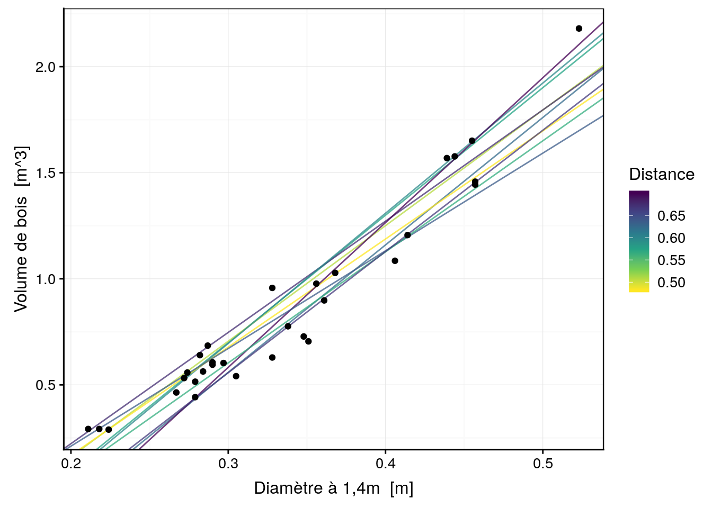

**En résumé, nous avons besoin d'une fonction qui calcule la distance d'un modèle par rapport à nos observations et d'un algorithme pour la minimiser.** 

Il n'est cependant pas nécessaire de chercher pendant des heures la meilleure fonction et le meilleur algorithme. Il existe dans R, un outil spécifiquement conçu pour adapter des modèles linéaires sur des observations, la fonction `lm()`. Dans le cas particulier de la régression par les moindres carrés, la solution s'obtient très facilement par un simple calcul\ :

$$a = \frac{cov_{x, y}}{var_x} \ \ \ \textrm{et} \ \ \ b = \bar y - a \ \bar x$$

où $\bar x$ et $\bar y$ sont les moyennes pour les deux variables, $cov$ est la covariance et $var$ est la variance.

\BeginKnitrBlock{note}<div class="note">Vous avez à votre disposition des snippets dédiés aux modèles linéaires (tapez `...`, ensuite choisissez `models`, ensuite `models : linear` et choisissez le snippet qui vous convient dans la liste.</div>\EndKnitrBlock{note}


```r
(lm. <- lm(data = trees, volume ~ diameter))
```

```
# 
# Call:
# lm(formula = volume ~ diameter, data = trees)
# 
# Coefficients:
# (Intercept)     diameter  
#      -1.047        5.652
```

Nous pouvons reporter ces valeurs sur notre graphique afin d'observer ce résultat par rapport à nos modèles aléatoires. nous avons en rouge la droite calculée par la fonction `lm()`. 


```r
chart(trees, volume ~ diameter) +
  geom_abline(data = best_models, 
    aes(slope = slope, intercept = intercept, color = dist), alpha = 3/4) +
  geom_point() + 
  geom_abline(
    aes(intercept = lm.$coefficients[1], slope = lm.$coefficients[2]), 
    color = "red", size = 1.5) +
  labs( color = "Distance")  +
  scale_color_viridis_c(direction = -1)
```

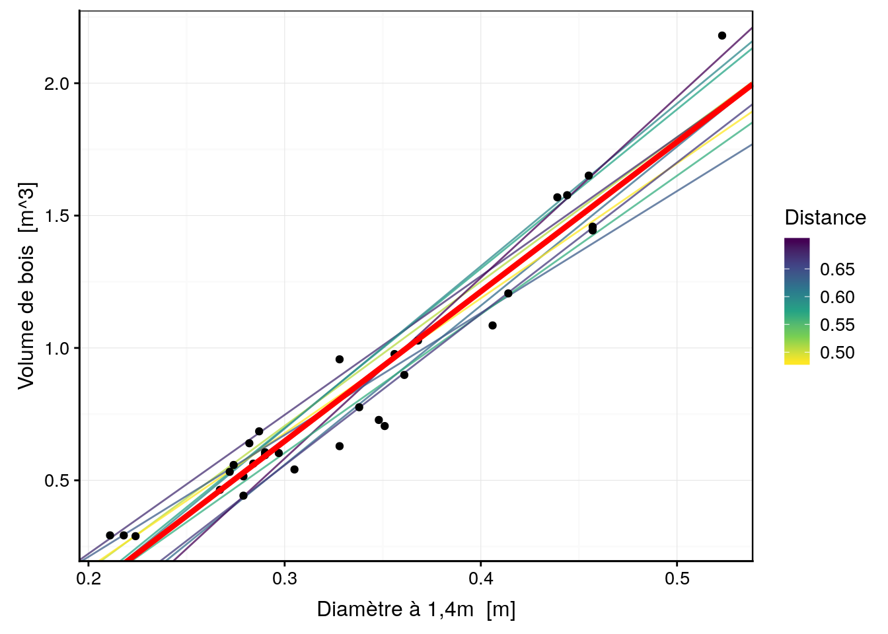


### La fonction `lm()`

Suite à notre découverte de manière intuitive de la régression linéaire simple, nous pouvons récapituler quelques points clés\ : 

- Une droite suit l'équation mathématique suivante :

$$y = a \ x + b$$
dont $a$ est la pente (*slope* en anglais) et $b$ est l'ordonnée à l'origine (*intercept* en anglais), tous deux les **paramètres** du modèle, alors que $x$ et $y$ en sont les **variables**.

- La distance entre une valeur observée $y_i$ et une valeur prédite $\hat y_i$ se nomme le résidu ($\epsilon_i$) et **se mesure toujours parallèlement** à l'axe $y$. Cela revient à considérer que toute l'erreur du modèle se situe sur $y$ et non sur $x$. Cela donne l'équation complète de notre modèle statistique\ :

$$y_i = a \ x_i + b + \epsilon_i$$

avec $y_i$ est la valeur mesurée pour le point i sur l'axe y, $a$ est la pente, $x_i$  est la valeur mesurée pour le point i sur l'axe x, `b` est l'ordonnée à l'origine et $\epsilon_i$ les résidus. On peut montrer (nous ne le ferons pas ici pour limiter les développements mathématiques) que le choix des moindres carrés des résidus comme fonction objective revient à considérer que nos résidus suivent **une distribution normale** centrée autour de zéro et avec un écart type $\sigma$ constant/ :

$$\epsilon_i \approx N(0, \sigma)$$

- Dans le cas de la régression linéaire simple, la meilleure droite s'obtient très facilement par la minimisation de la somme des carrés des résidus. En effet, la pente $a = \frac{cov_{x, y}}{var_x}$ et l'ordonnée à l'origine $b = \bar y - a \ \bar x$.

- La fonction `lm()` permet de faire ce calcul très facilement dans R.


```r
# Régression linéaire
lm. <- lm(data = trees, volume ~ diameter)

# Graphique de nos observations et de la droite obtenue avec la fonction lm()
chart(trees, volume ~ diameter) +
  geom_point() + 
  geom_abline(
    aes(intercept = lm.$coefficients[1], slope = lm.$coefficients[2]), 
    color = "red", size = 1.5) +
  labs( color = "Modèle")  +
  scale_color_viridis_c(direction = -1)
```

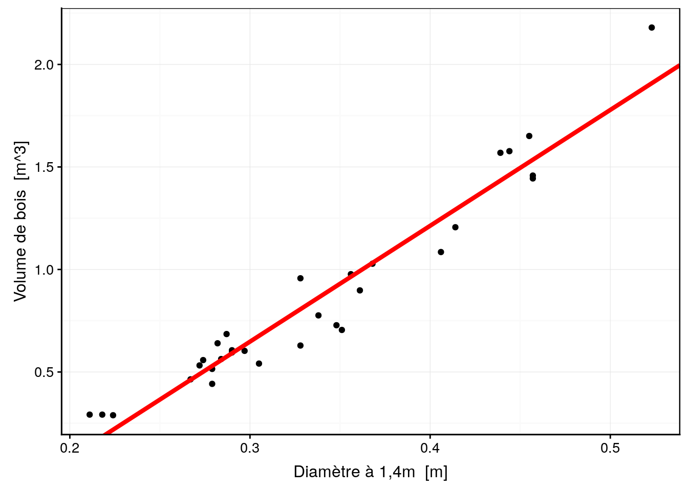

La fonction `lm()` crée un objet spécifique qui contient de nombreuses informations pour pouvoir ensuite analyser notre modèle linéaire. La fonction `class()` permet de mettre en avant la classe de notre objet.


```r
class(lm.)
```

```
# [1] "lm"
```


### Résumé avec `summary()`

Avec la fonction `summary()` nous obtenons un résumé condensé des informations les plus utiles pour interpréter notre régression linéaire. 


```r
summary(lm.)
```

```
# 
# Call:
# lm(formula = volume ~ diameter, data = trees)
# 
# Residuals:
#       Min        1Q    Median        3Q       Max 
# -0.231211 -0.087021  0.003533  0.100594  0.271725 
# 
# Coefficients:
#             Estimate Std. Error t value Pr(>|t|)    
# (Intercept) -1.04748    0.09553  -10.96 7.85e-12 ***
# diameter     5.65154    0.27649   20.44  < 2e-16 ***
# ---
# Signif. codes:  0 '***' 0.001 '**' 0.01 '*' 0.05 '.' 0.1 ' ' 1
# 
# Residual standard error: 0.1206 on 29 degrees of freedom
# Multiple R-squared:  0.9351,	Adjusted R-squared:  0.9329 
# F-statistic: 417.8 on 1 and 29 DF,  p-value: < 2.2e-16
```


- Call\ : 

Il s'agit de la formule employée dans la fonction `lm()`. C'est à dire le volume en fonction du diamètre du jeu de données `trees`.

- Residuals\ :

La tableau nous fournit un résumé via les 5 nombres de l'ensemble des résidus (que vous pouvez récupérer à partir de `lm.$residuals`).


```r
fivenum(lm.$residuals)
```

```
#           20            7           12            9           31 
# -0.231210947 -0.087020695  0.003532709  0.100594122  0.271724973
```


- Coefficients\ :

Il s'agit des résultats associés à la pente et à l'ordonnée à l'origine dont les valeurs estimées des paramètres *(Estimate*). Les mêmes valeurs peuvent être obtenues à partir de `lm.$coefficients`\ :


```r
lm.$coefficients
```

```
# (Intercept)    diameter 
#   -1.047478    5.651535
```

On retrouve également les écart-types calculés sur ces valeurs (*Std.Error*) qui donnent une indication de la précision de leur estimation, les valeurs des distibutions de Student sur les valeurs estimées (*t value*) et enfin les valeurs p (*PR(>|t|)*) liées à un test de Student pour déterminer si le paramètre `p` correspondant est significativement différent de zéro (avec $H_0: p = 0$ et $H_a: p \neq 0$).

*Pour l'instant, nous nous contenterons d'interpréter et d'utiliser les informations issues de `summary()` dans sa partie supérieure. Le contenu des trois dernières lignes sera détaillé dans le module suivant.*

A partir des données de ce résumé, nous pouvons maintenant **paramétrer** l'équation de notre modèle\ :

$$y = ax + b$$

devient^[Lors de la paramétrisation du modèle, pensez à arrondir la valeur des paramètres à un nombre de chiffres significatifs raisonnables. Inutile de garder 5, ou même 3 chiffres derrière la virgule si vous n'avez que quelques dizaines d'obserrvations pour ajuster votre modèle.]\ :

$$volume \ de \ bois = 5.65 \ diamètre \ à \ 1.4 \ m  - 1.05 $$


## Outils de diagnostic

Une fois la meilleure droite de régression obtenue, le travail est loin d'être terminé. Il se peut que le nuage de point ne soit pas tout-à-fait linéaire, que sa dispersion ne soit pas homogène, que les résidus n'aient pas une distribution normale, qu'il existe des valeurs extrêmes aberrantes, ou qui tirent la droite vers elle de manière excessive.

Nous allons maintenant devoir diagnostiquer ces possibles problèmes. L'**analyse des résidus** permet de le faire. Ensuite, si deux ou plusieurs modèles sont utilisable, il nous faut décider lequel conserver. Enfin, nous pouvons aussi calculer et visualiser l'**enveloppe de confiance** 
du modèle et extraire une série de données de ce modèle.


### Analyse des résidus

Le tableau numérique obtenu à l'aide de `summary()` peut faire penser que l'étude d'une régression linéaire se limite à quelques valeurs numériques et divers tests d'hypothèses associés. C'est un premier pas, mais c'est oublier que la technique est **essentiellement visuelle**. Le graphique du nuage de points avec la droite superposée est un premier outil diagnostic visuel indispensable, mais il n'est pas le seul\ ! Plusieurs graphiques spécifiques existent pour mettre en évidence diverses propriétés des résidus qui peuvent révéler des problèmes. Leur inspection est indispensable et s'appelle l'**analyse des résidus**. Les différents graphiques sont faciles à obtenir à partir des snippets.

Le premier de ces graphique permet de vérifier la distribution homogène des résidus. Dans une bonne régression, nous aurons une distribution équilibrée de part et d'autre du zéro sur l'axe Y. Que pensez-vous de notre graphique d'anayse des résidus\ ? Nous avons une valeur plus éloignée du zéro qui est mise en avant par la courbe en bleu qui montre l'influence générale des résidus. 


```r
#plot(lm., which = 1)
lm. %>.%
  chart(broom::augment(.), .resid ~ .fitted) +
  geom_point() +
  geom_hline(yintercept = 0) +
  geom_smooth(se = FALSE, method = "loess", formula = y ~ x) +
  labs(x = "Fitted values", y = "Residuals") +
  ggtitle("Residuals vs Fitted")
```


Le second graphique permet de vérifier la normalité des résidus (comparaison par graphique quantile-quantile à une distribution normale).


```r
#plot(lm., which = 2)
lm. %>.%
  chart(broom::augment(.), aes(sample = .std.resid)) +
  geom_qq() +
  geom_qq_line(colour = "darkgray") +
  labs(x = "Theoretical quantiles", y = "Standardized residuals") +
  ggtitle("Normal Q-Q")
```

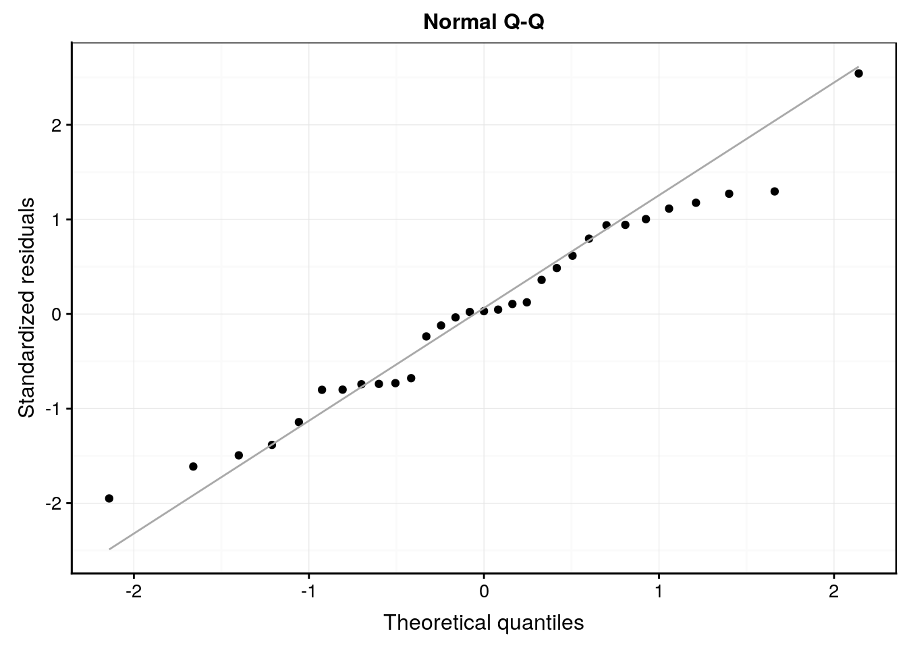

Le troisième graphique va standardiser les résidus, et surtout, en prendre la racine carrée. Cela a pour effet de superposer les résidus négatifs sur les résidus positifs. Nous y diagnostiquons beaucoup plus facilement des problèmes de distribution de ces résidus. A nouveau, nous pouvons observer qu'une valeur influence fortement la régression.


```r
#plot(lm., which = 3)
lm. %>.%
  chart(broom::augment(.), sqrt(abs(.std.resid)) ~ .fitted) +
  geom_point() +
  geom_smooth(se = FALSE, method = "loess", formula = y ~ x) +
  labs(x = "Fitted values",
    y = expression(bold(sqrt(abs("Standardized residuals"))))) +
  ggtitle("Scale-Location")
```


Le quatrième graphique met en évidence l'influence des individus sur la régression linéaire. Effectivement, la régression linéaire est sensible aux valeurs extrêmes. Nous pouvons observer que nous avons une valeur qui influence fortement notre régression. On utilise pour ce faire la distance de Cook que nous ne détaillerons pas dans le cadre de ce cours.


```r
#plot(lm., which = 4)
lm. %>.%
  chart(broom::augment(.), .cooksd ~ seq_along(.cooksd)) +
  geom_bar(stat = "identity") +
  geom_hline(yintercept = seq(0, 0.1, by = 0.05), colour = "darkgray") +
  labs(x = "Obs. number", y = "Cook's distance") +
  ggtitle("Cook's distance")
```

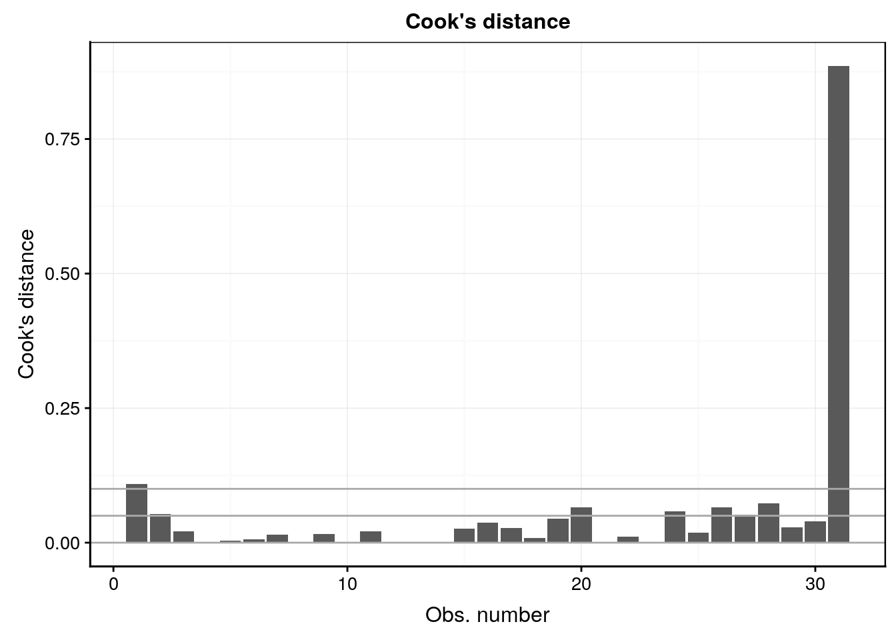

Le cinquième graphique utilise l'effet de levier (*Leverage*) qui met également en avant l'influence des individus sur notre régression. Il répond à la question suivante\ : "est-ce qu'un ou plusieurs points sont tellement influents qu'ils tirent la régression vers eux de manière abusive\ ?" Nous avons à nouveau une valeur qui influence fortement notre modèle.


```r
#plot(lm., which = 5)
lm. %>.%
  chart(broom::augment(.), .std.resid ~ .hat %size=% .cooksd) +
  geom_point() +
  geom_smooth(se = FALSE, size = 0.5, method = "loess", formula = y ~ x) +
  geom_vline(xintercept = 0) +
  geom_hline(yintercept = 0) +
  labs(x = "Leverage", y = "Standardized residuals") +
  ggtitle("Residuals vs Leverage")
```

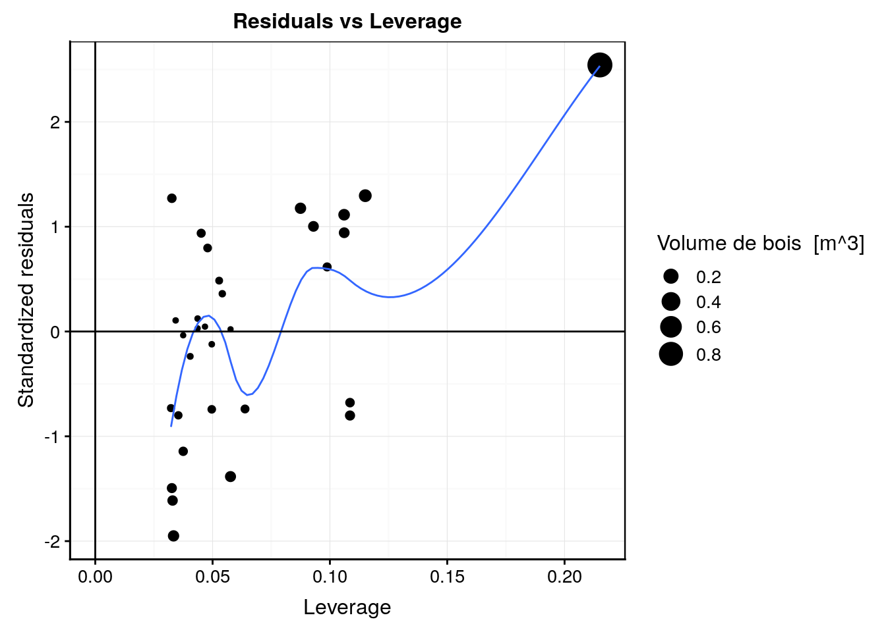

Le sixième graphique met en relation la distance de Cooks et l'effet de levier. Notre unique point d'une valeur supérieur à 0.5 m de diamètre influence fortement notre modèle.


```r
#plot(lm., which = 6)
lm. %>.%
  chart(broom::augment(.), .cooksd ~ .hat %size=% .cooksd) +
  geom_point() +
  geom_vline(xintercept = 0, colour = NA) +
  geom_abline(slope = seq(0, 3, by = 0.5), colour = "darkgray") +
  geom_smooth(se = FALSE, size = 0.5, method = "loess", formula = y ~ x) +
  labs(x = expression("Leverage h"[ii]), y = "Cook's distance") +
  ggtitle(expression("Cook's dist vs Leverage h"[ii] / (1 - h[ii])))
```

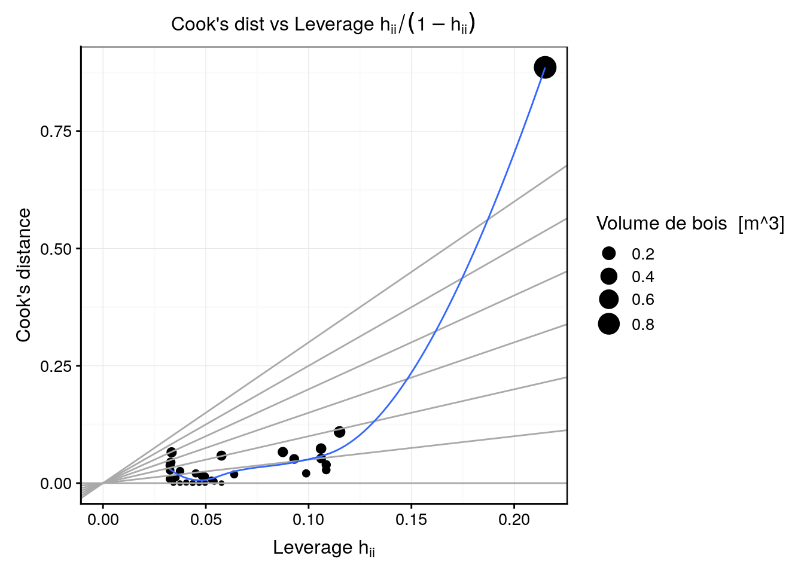

A l'issue de l'analyse des résidus, nous abservons donc différents problèmes qui suggèrent que le modèle choisi n'est peut être pas le plus adapté. Nous comprendrons pourquoi plus loin.

##### A vous de jouer {-}

\BeginKnitrBlock{bdd}<div class="bdd">Démarrez la SciViews Box et RStudio. Dans la fenêtre **Console** de RStudio, entrez l'instruction suivante suivie de la touche `Entrée` pour ouvrir le tutoriel concernant les bases de R\ :

    BioDataScience2::run("01b_reg_lin")

N’oubliez pas d’appuyer sur la touche `ESC` pour reprendre la main dans R à la fin d’un tutoriel dans la console R.</div>\EndKnitrBlock{bdd}


##### Pièges et astuces : extrapolation {-}

Notre régression linéaire a été réalisée sur des cerisiers noirs dont le diamètre est compris entre 0.211  et 0.523 mètre. Pensez vous qu'il soit acceptable de prédire des volumes de bois pour des arbres dont le diamètre est inférieur ou supérieur à nos valeurs minimales et maximales mesurées (extrapolation)\ ?

Utilisons notre régression linéaire afin de prédire 10 volumes de bois à partir d'arbre dont le diamètre varie entre 0.1 et 0.8m.


```r
new <- data.frame(diameter = seq(0.1, 0.7, length.out = 8))
```

Ajoutons une variable `pred` qui contient les prédictions en volume de bois. Observez-vous un problème particulier sur base du tableau ci-dessous\ ?


```r
new %>.%
  modelr::add_predictions(., lm.) -> new
new
```

```
#    diameter         pred
# 1 0.1000000 -0.482324424
# 2 0.1857143  0.002092891
# 3 0.2714286  0.486510206
# 4 0.3571429  0.970927522
# 5 0.4428571  1.455344837
# 6 0.5285714  1.939762152
# 7 0.6142857  2.424179468
# 8 0.7000000  2.908596783
```

Il est peut-être plus simple de voir le problème sur un nuage de points. Pour un diamètre de 0.1857143 m de diamètre, le volume de bois est de 0 mis en avant par l'intersection des lignes pointillées bleues.


```r
chart(trees, volume~diameter) +
  geom_hline(yintercept = 0, linetype = "dashed", color = "grey") +
  geom_vline(xintercept = new$diameter[2], linetype = "twodash", color = "blue") +
  geom_hline(yintercept = new$pred[2], linetype = "twodash", color = "blue") +
  geom_point() +
  geom_abline(aes(intercept = lm.$coefficients[1], slope = lm.$coefficients[2])) +
  geom_point(data = new, f_aes(pred~diameter), color = "red") 
```

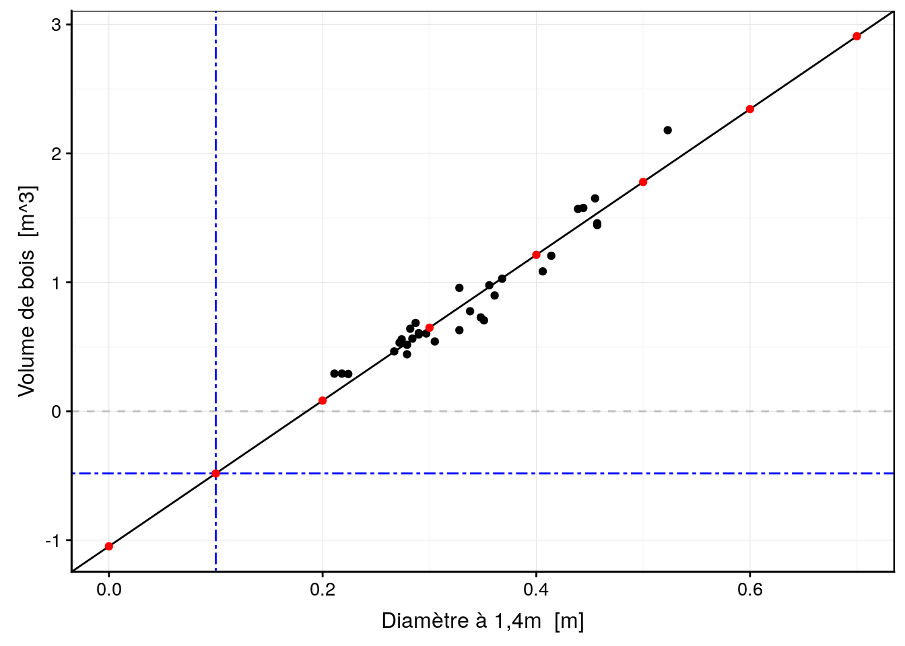

Le volume de bois prédit est négatif\ ! Notre modèle est-il alors complètement faux\ ? Rappelons-nous qu'un modèle est nécessairement une vision simplifiée de la réalité. En particulier, notre modèle a été entraîné avec des données comprises dans un intervalle. Il est alors valable pour effectuer des **interpolations** à l'intérieur de cet intervalle, mais **ne peut pas être utilisé pour effectuer des extrapolations** en dehors, comme nous venons de le faire.


```r
trees %>.%
  modelr::add_predictions(., lm.) -> trees

chart(trees, volume~diameter) +
  geom_point() +
  geom_line(f_aes(pred ~ diameter))
```

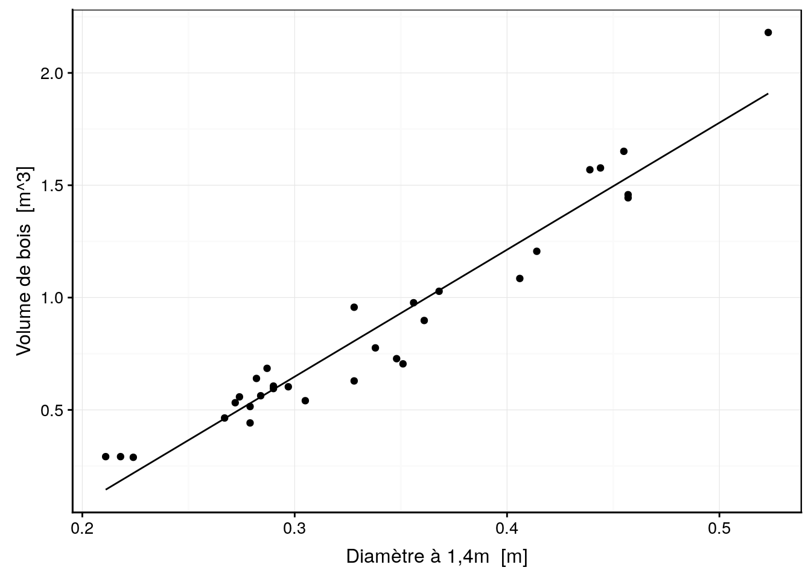


##### Pièges et astuces : significativité fortuite {-}

Gardez toujours à l'esprit qu'il est possible que votre jeu de données donne une régression significative, mais purement **fortuite**. Les données supplémentaires de test devraient alors démasquer le problème. D'où l'importance de vérifier/valider votre modèle.

Le **principe de parcimonie** veut que l'on ne teste pas toutes les combinaisons possibles deux à deux des variables d'un gros jeu de données, mais que l'on restreigne les explorations à des relations qui ont un sens biologique afin de minimiser le risque d'obtenir une telle régression de manière fortuite.


### Enveloppe de confiance

De même que l'on peut définir un intervalle de confiance dans lequel la moyenne d'un échantillon se situe avec une probabilité donnée, il est aussi possible de calculer et de tracer une **enveloppe de confiance** qui indique la région dans laquelle le "vrai" modèle se trouve avec une probabilité donnée (généralement, on choisi cette probabilité à 95%). Voici ce que cela donne\ :


```r
lm. %>.% (function(lm, model = lm[["model"]], vars = names(model))
  chart(model, aes_string(x = vars[2], y = vars[1])) +
  geom_point() +
  stat_smooth(method = "lm", formula = y ~ x))(.)
```

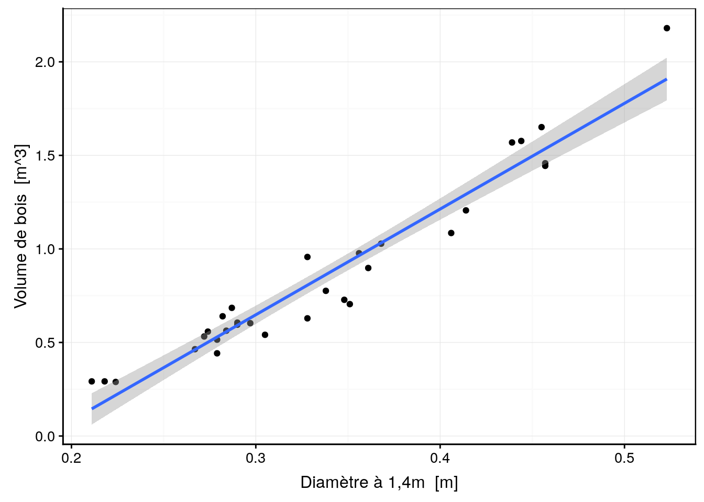

Cette enveloppe de confiance est en réalité basée sur l'écart type *conditionnel* (écart type de $y$ sachant quelle est la valeur de $x$) qui se calcule comme suit\ :


$$s_{y|x}\ =\ \sqrt{ \frac{\sum_{i = 0}^n\left(y_i - \hat y_i\right)^2}{n-2}}$$

A partir de là, il est possible de définir également un intervalle de confiance conditionnel à $x$\ :

$$CI_{1-\alpha}\ =\ \hat y_i\ \ \pm \  t_{\frac{\alpha}{2}}^{n-2}  \frac{s_{y|x}\ }{\sqrt{n}}$$

C'est cet intervalle de confiance conditionnel qui est matérialisé par l'enveloppe de confiance autour de la droite de régression représentée sur le graphique.


### Extraire les données d'un modèle

La fonction `tidy()` du package `broom` extrait facilement et rapidement sous la forme d'un tableau différentes valeurs associées à votre régression linéaire.


```r
(DF <- broom::tidy(lm.))
```

```
# # A tibble: 2 x 5
#   term        estimate std.error statistic  p.value
#   <chr>          <dbl>     <dbl>     <dbl>    <dbl>
# 1 (Intercept)    -1.05    0.0955     -11.0 7.85e-12
# 2 diameter        5.65    0.276       20.4 9.09e-19
```


Pour extraire facilement et rapidement sous la forme d'un tableau de données les paramètres de votre modèle vouys pouvez aussi utiliser la fonction `glance()`. 


```r
(DF <- broom::glance(lm.))
```

```
# # A tibble: 1 x 11
#   r.squared adj.r.squared sigma statistic  p.value    df logLik   AIC   BIC
#       <dbl>         <dbl> <dbl>     <dbl>    <dbl> <int>  <dbl> <dbl> <dbl>
# 1     0.935         0.933 0.121      418. 9.09e-19     2   22.6 -39.2 -34.9
# # … with 2 more variables: deviance <dbl>, df.residual <int>
```

Vous avez des snippets à votre disposition pour ces deux fonctions\ :

`... -> models ..m -> .models tools .mt -> .mtmoddf` ou encore `... -> models ..m -> .models tools .mt -> .mtpardf`

##### A vous de jouer {-}

\BeginKnitrBlock{bdd}<div class="bdd">
Vous avez à votre disposition la première assignation GitHub Classroom : 
  
- <https://classroom.github.com/a/bvqsukEO>
  </div>\EndKnitrBlock{bdd}
