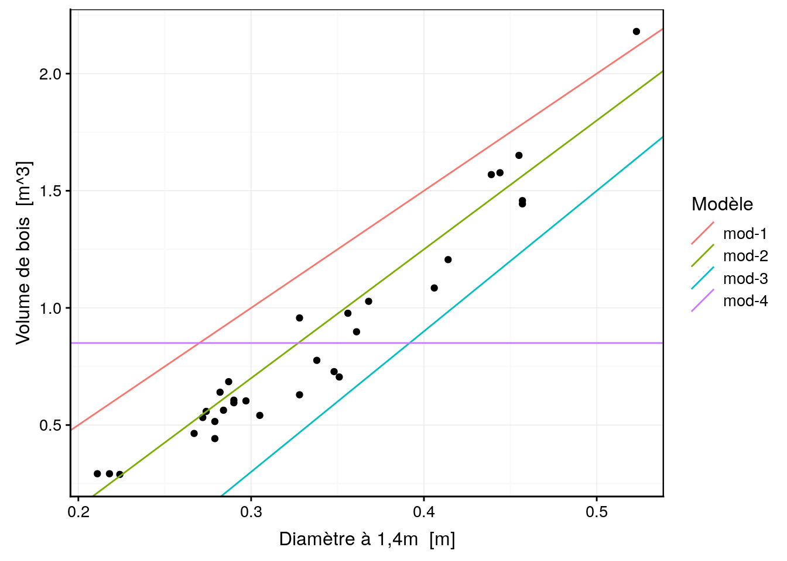
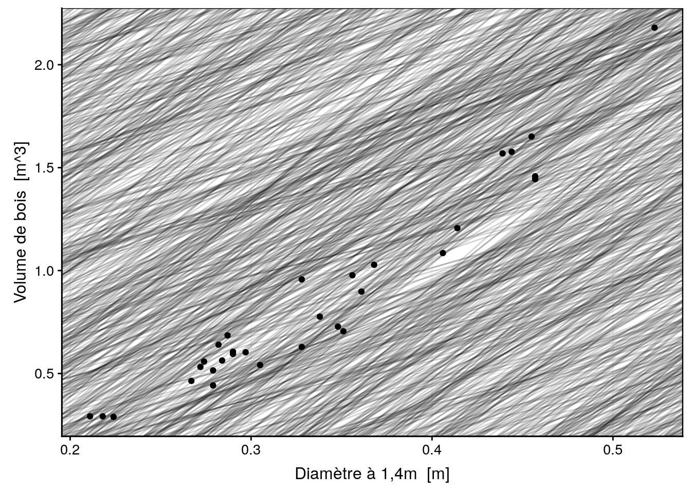
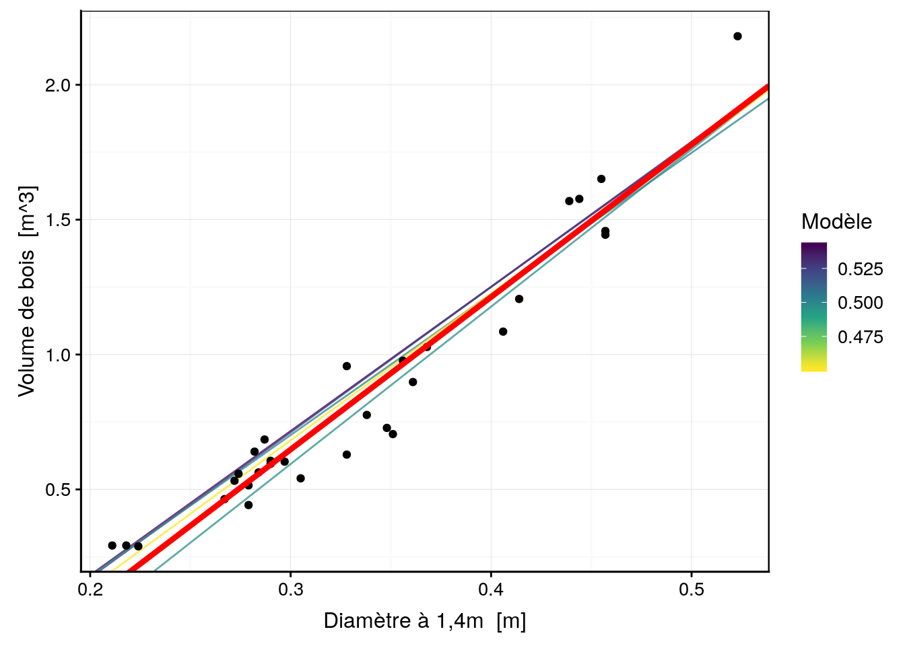
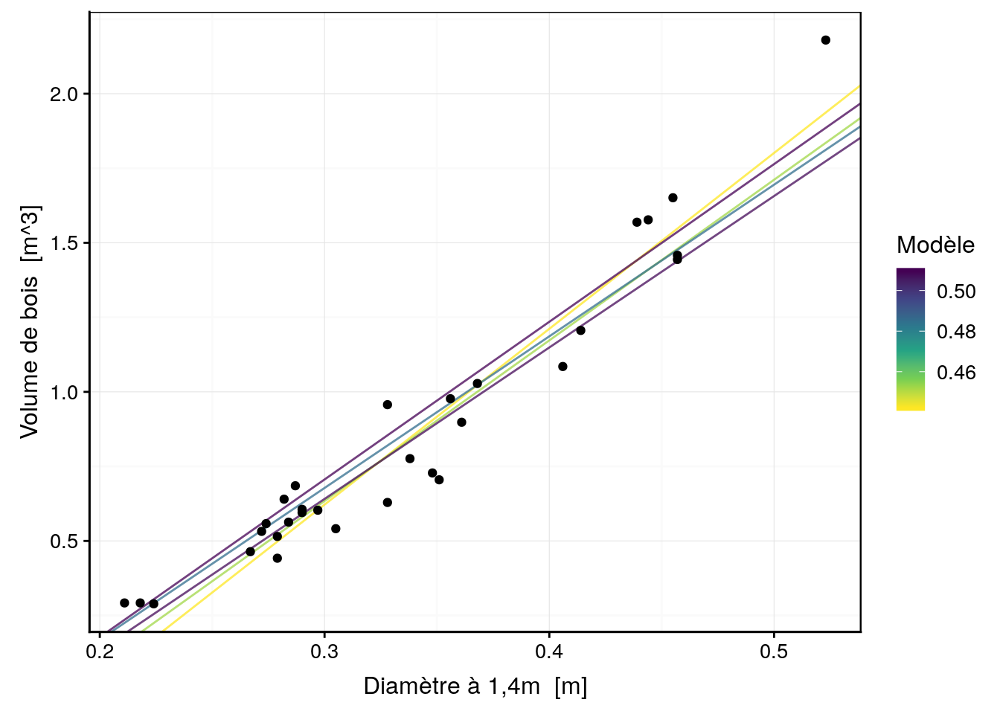
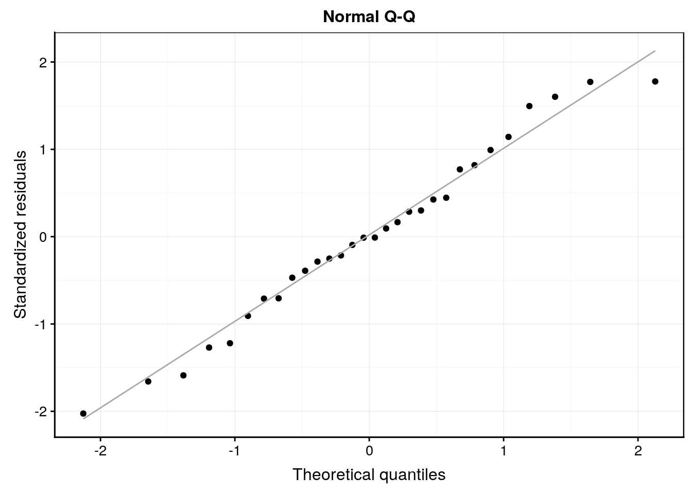
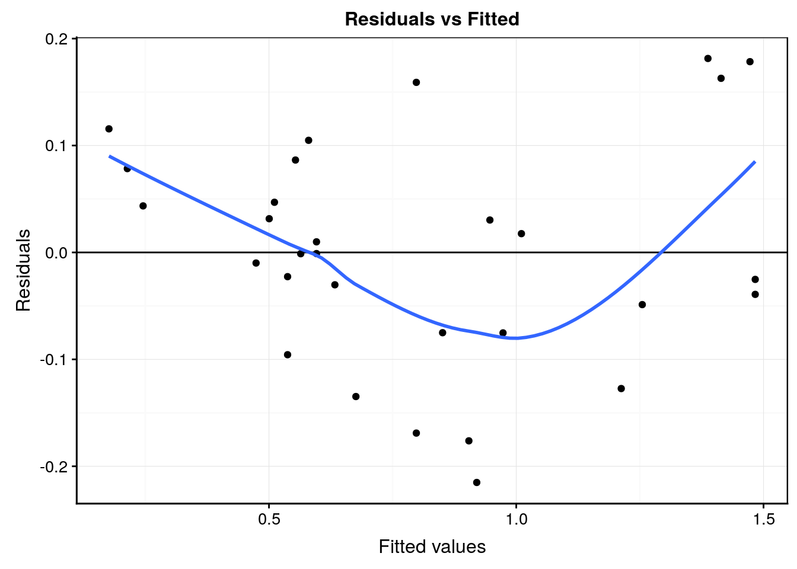

# (PART) Cours II: analyse et modélisation {-}

# Régression linéaire {#lm}


##### Objectifs {-}

- Découvrir la régression linaire de manière intuitive.


##### Prérequis {-}

Avant de poursuivre, vous allez réaliser une séance d'exercice couvrant les points essentiels des notions abordées dans le livre [science des données biologiques partie 1](http://biodatascience-course.sciviews.org/sdd-umons/). 

\BeginKnitrBlock{bdd}<div class="bdd">Démarrez la SciViews Box et RStudio. Dans la fenêtre **Console** de RStudio, entrez l'instruction suivante suivie de la touche `Entrée` pour ouvrir le tutoriel concernant les bases de R\ :

    BioDataScience2::run("01a_rappel")

N’oubliez pas d’appuyer sur la touche `ESC` pour reprendre la main dans R à la fin d’un tutoriel dans la console R.</div>\EndKnitrBlock{bdd}


## Modèle 

TODO 

Un modèle a pour objectif de fournir une description des données. 
On retrouve deux grandes catégories au sein des modèles, les modèles prédictifs et les modèles exploratoires. 

une observation peut être employé pour explorer et pour confirmer un modèle mais pas les deux. Pour réaliser une analyse confirmatoire, il est proposé de divisé les observations en 2 groupes

- jeu d'entrainement 

- jeu de confirmation


Qu'est ce qu'un modèle 

TODO


## Régression linéaire simple

Nous allons découvrir les base de la régression linéaire de façon intuitive. Nous utilisons le jeu de données `trees` qui rassemble la mesure du diamètre, de la hauteur et du volume de bois de cerisiers noirs. 


```r
# importation des données
trees <- read("trees", package = "datasets", lang = "fr")
```

Rapellons nous que dans le [chapitre 12 du livre science des données 1](http://biodatascience-course.sciviews.org/sdd-umons/association-de-deux-variables.html), nous avons étudié l'association de deux variables numériques. Nous utilisons donc une matrice de corrélation afin de mettre en évidence la corrélation entre nos 3 variables qui composent le jeu de donnée `trees`.

La fonction `correlation()` nous renvoie un tableau de la matrice de correlation avec l'indice de Pearson.


```r
(trees_corr <- correlation(trees))
```

```
# Matrix of Pearson's product-moment correlation:
# (calculation uses everything)
#          diameter height volume
# diameter 1.000    0.519  0.967 
# height   0.519    1.000  0.597 
# volume   0.967    0.597  1.000
```

Nous pouvons également observer cette matrice sous la forme d'un graphique plus convivial.


```r
plot(trees_corr, type = "lower")
```


Cependant, n'oubliez pas qu'il est indispensable de visualiser les nuages de points pour ne pas tobmer dans le piège mis en avant par le [jeu de données artificiel appelé “quartet d’Anscombe”](http://biodatascience-course.sciviews.org/sdd-umons/association-de-deux-variables.html#importance-des-graphiques) qui montre très bien comment des données très différentes peuvent avoir même moyenne, même variance et même coefficient de corrélation.


```r
GGally::ggscatmat(as.data.frame(trees), 1:3)
```


Nous observons une forte corrélation linéaire entre le volume et la hauteur des cerisiers noirs.  Interessons nous à cette association.


```r
chart(trees, volume ~ diameter) +
  geom_point()
```


Si vous deviez ajouter une droite permettant de représenter au mieux les données, où est ce que vous la placeriez ? 

Pour rappel, une droite respecte l'équation mathématique suivante: $$y = ax + b$$ 

dont  `a` est la pente (*slope* en anglais) et `b` est l'ordonnée à l'origine (*intercept* en anglais).


```r
# Sélection de pente et d'ordonnée à l'origine
models <- tibble(
  model = paste("mod", 1:4, sep = "-"),
  slope = c(5, 5.5, 6, 0),
  intercept = c(-0.5, -0.95, -1.5, 0.85)
)

chart(trees, volume ~ diameter) +
  geom_point() +
  geom_abline(data = models, aes(slope = slope, intercept = intercept, color = model)) + 
  labs( color = "Modèle")
```


Nous avons 4 droites qui veulent représenter au mieux les observations. Quel est la meilleure régression selon vous ? 

### Quantifier la qualité d'un modèle

Nous voulons identifier la meilleure régression, c'est à dire la régression le plus proche de nos données. Nous avons besoin d'une règle qui va nous permettre de quantifier la distance de nos observations à notre modèle afin d'obtenir la régression avec la plus faible distance possible de l'ensemble de nos observations. 

Décomposons le problème étape par étape et intéressons nous au `mod-1`

- Connaitre les valeurs de y prédite par le modèle 


```r
# Calculer la valeur de y pour chaque valeur de x suivant le model souhaité
## Création de notre fonction 
model <- function(slope, intercept, x) {
  prediction <- intercept + slope * x
  attributes(prediction) <- NULL
  prediction
}
## Application de notre fonction 
mod1 <- model(slope = 5, intercept = -0.5, x = trees$diameter)
## Affichage des résultats
mod1
```

```
#  [1] 0.555 0.590 0.620 0.835 0.860 0.870 0.895 0.895 0.910 0.920 0.935
# [12] 0.950 0.950 0.985 1.025 1.140 1.140 1.190 1.240 1.255 1.280 1.305
# [23] 1.340 1.530 1.570 1.695 1.720 1.775 1.785 1.785 2.115
```

- Connaitre la distance entre les observations mesurées en y et les observations prédites en y par la régression

Les distances que nous souhaitons calculer, sont les `résidus`. Nous pouvons premièrement visualiser ces résidus graphiquement :


```r
chart(trees, volume ~ diameter) +
  geom_point() +
  geom_abline(slope = 5, intercept = -0.5) +
  geom_segment(
    aes(x = diameter, y = volume, 
      xend = diameter, yend = mod1))
```


Nous pouvons ensuite facilement calculer cette distance comme ci-dessous : 


```r
# Calculer la distance entre y observé et y prédit
## création de notre fonction
distance <- function(observation, prediction) {
  diff <- observation - prediction
  attributes(diff) <- NULL
  diff
}
## Application de la fonction
dist1 <- distance(observation = trees$volume, prediction = mod1)
## affichage des résultats
dist1
```

```
#  [1] -0.263 -0.298 -0.331 -0.371 -0.328 -0.312 -0.453 -0.380 -0.270 -0.357
# [11] -0.250 -0.355 -0.344 -0.382 -0.484 -0.511 -0.183 -0.414 -0.512 -0.550
# [21] -0.303 -0.407 -0.312 -0.445 -0.364 -0.126 -0.143 -0.124 -0.327 -0.341
# [31]  0.065
```

- Définir une règle pour obtenir une valeur unique de la distance de nos observations mesurées en y par rapport aux observations prédites en y par la régression

Une première idée serait de sommer l'ensemble de nos distances comme ci-dessous :


```r
sum(dist1)
```

```
# [1] -10.175
```

Appliquons la suite d'étapes ci-dessus pour nos 4 modèles afin de les comparer


   mod-1    mod-2    mod-3   mod-4
--------  -------  -------  ------
 -10.175   -1.441   10.393   0.135

Selon notre méthode, il en ressort que le modèle 4 est le modèle le plus approprié pour représenter au mieux nos données. Qu'en pensez vous ? 


```r
chart(trees, volume ~ diameter) +
  geom_point() +
  geom_abline(data = models, aes(slope = slope, intercept = intercept, color = model)) + 
  labs( color = "Modèle")
```



Intuitivement, nous nous apperçevons que le modèle 4 n'est pas la meilleuire solution pour représenter nos observartions. Nous pouvons en déduire que la somme des résidus n'est pas la meilleur fonction pour ajuster une droite avec nos observations. 

Le problème lorsque nous sommons des résidus, est la présence de résidus positifs et de résidus négatifs.


```r
mod2 <- model(slope = models$slope[4], intercept = models$intercept[4], x = trees$diameter)

chart(trees, volume ~ diameter) +
  geom_point() +
  geom_abline(data = models, 
    aes(slope = slope[4], intercept = intercept[4])) +
  geom_segment(
    aes(x = diameter, y = volume, 
      xend = diameter, yend = mod2)) +
  geom_label(aes(x = 0.3, y = 1.5),
    label = "Résidus postifis", color = "red") +
  geom_label(aes(x = 0.45, y = 0.5), 
    label = "Résidus négatifs", color = "blue")
```


Avez vous une autre idée que de sommer les résidus ?

- Sommer le carré des résidus 

Nous obtenons les résultats suivants :


    mod-1       mod-2      mod-3      mod-4
---------  ----------  ---------  ---------
 3.842211   0.4931095   3.929195   6.498511

- Sommer les valeurs absolues des résidus 

Nous obtenons les résultats suivants :


  mod-1   mod-2    mod-3    mod-4
-------  ------  -------  -------
 10.305   3.186   10.393   11.525

Nous avons trouvé deux solutions intéressantes pour quantifier la distance de notre droite par rapport à nos observations.

\BeginKnitrBlock{bdd}<div class="bdd">Essayez de trouver le meilleur modèle par vous même dans l'application shiny 

Démarrez la SciViews Box et RStudio. Dans la fenêtre **Console** de RStudio, entrez l'instruction suivante suivie de la touche `Entrée` pour ouvrir le tutoriel concernant les bases de R :

    BioDataScience2::app("01a_lin_mod") # TODO

    méthode alternative
    shiny::runApp(system.file("shiny/01a_lin_mod", package = "BioDataScience2"))

N’oubliez pas d’appuyer sur la touche ESC pour reprendre la main dans R à la fin d’un tutoriel dans la console R</div>\EndKnitrBlock{bdd}


### Trouver la meilleure droite 

Nous pouvons maintenant nous demander si notre modèle 2 qui est le meilleur modèle de nos 4 modèles est le meilleur modèle possible pour se faire nous allons devoir optimiser notre modèle afin d'avoir le meilleur modèle possible.

Nous allons prendre la somme du carré des résidus comme fonction à minimiser.

Imaginons que nous avons pas 4 mais 500 modèle linéaire avec une pente et une ordonnée à l'origine différente, quelle est la meilleure droite ? 


```r
models1 <- tibble(
  intercept = runif(5000, -10, 10),
  slope = runif(5000, 2, 8))

chart(trees, volume ~ diameter) +
  geom_point() +
  geom_abline(aes(intercept = intercept, slope = slope), data = models1, alpha = 1/6) 
```



Sur ces  4  modèles, nous pouvons calculer la somme des carrés des résidus et observer quel est le meilleur modèle.


```r
# fonction de calcule de la somme des carrés des résidus
measure_distance <- function(slope, intercept, x, y){
   predict <- x * slope + intercept
   dist <- y - predict
   sum(dist ^ 2)
}
# test de la fonction
#measure_distance(slope = 0, intercept = 0.85, x = trees$diameter, y = trees$volume)

# fonction adaptée pour être employé avec purrr:map
trees_dist <- function(intercept, slope){
  measure_distance(slope = slope, intercept = intercept, x = trees$diameter, y = trees$volume)
}

models1 <- models1 %>%
  mutate(dist = purrr::map2_dbl(intercept, slope, trees_dist))
```

si nous réalisons un graphique de valeurs de pentes, d'ordonnée à l'origine et des distances calculées, nous obtenons le graphique ci-dessous.


```r
plot <- chart(models1, slope ~ intercept %col=%  dist) +
    geom_point() +
  geom_point(data = filter(models1, rank(dist) <= 10), shape = 1, color = 'red', size = 3) +
  labs( y = "Pente", x = "Ordonnée à l'origine", color = "Distance") +
  scale_color_viridis_c(direction = -1)
#plot
plotly::ggplotly(plot)
```

<!--html_preserve--><div id="htmlwidget-f6e99dafd22903405cee" style="width:672px;height:480px;" class="plotly html-widget"></div>
<script type="application/json" data-for="htmlwidget-f6e99dafd22903405cee">{"x":{"data":[{"x":[3.18043318111449,5.22837519645691,2.73386668413877,-6.3352607935667,-9.10234853159636,-1.87231320887804,1.08329834416509,-5.02553493715823,-8.89916005078703,-6.16168599575758,1.02641460020095,-1.05541327502578,-4.48221865110099,-4.12386747077107,-4.52343772631139,-1.14421406295151,-2.02516085933894,-9.13915063254535,4.52451906166971,-4.05582560691983,-0.902245254255831,3.99324699304998,6.90905808936805,1.83366291224957,7.93158056214452,-8.71655180118978,6.93758913315833,-6.69882253743708,-0.355986100621521,9.04444702900946,-8.98970598354936,3.69330737739801,-8.44657483510673,-3.59817212447524,-6.58479669131339,-2.51399024855345,1.3125304877758,6.59061861224473,-0.121051762253046,-2.15614929329604,-2.32662511523813,3.88551488518715,-0.847267666831613,-5.38442238699645,-1.20161537081003,-0.931800189428031,-3.2830347167328,-9.13301055785269,-6.97333356365561,9.26813467405736,5.21171249449253,9.13091404363513,-2.82168705016375,2.8578164614737,4.14402723312378,-6.03578849229962,-4.39978366717696,0.154663915745914,-6.21189249679446,-7.31196186039597,9.81799678411335,6.89831727184355,8.31940654665232,-7.84792360384017,7.67520724795759,-4.30683598853648,8.07265118695796,-4.18446656316519,9.66824920848012,-3.7577413674444,-7.2272288100794,6.41151214949787,-2.06285753753036,9.7745448583737,-0.318281147629023,7.53373436629772,-5.19733050838113,4.38477735966444,-1.39801261946559,3.87906222138554,9.83255807776004,3.62916551996022,-7.83930328674614,-8.49704558495432,-7.03774297144264,-2.92281797155738,9.25511058885604,-1.31934848148376,-0.675266832113266,-2.95069115236402,-4.34075115714222,7.00138011015952,3.26699531171471,-3.80476915743202,-0.625217938795686,-3.28872498590499,-8.02862933836877,3.82530000526458,-0.451194262132049,3.92146942205727,-3.76522842794657,7.12714392691851,6.96633222978562,-8.87297420296818,-5.59610589407384,3.3356423350051,-1.9443922303617,0.600964305922389,-3.92618570011109,-5.17635560594499,-3.93779412843287,9.41952684894204,4.53438925091177,-4.75675725843757,-7.62557186651975,9.54223861917853,0.0694756302982569,-0.887091695331037,-7.86136920563877,-7.79649948701262,0.355567187070847,-4.53800938092172,0.65821950789541,-6.38059037271887,0.796237178146839,0.289984038099647,6.56659797765315,5.28472414240241,4.65030592866242,-5.64389592502266,-5.1434861542657,-9.41217536572367,4.8007603129372,-3.43920659273863,-5.60610422398895,6.67733173817396,-4.23108671791852,-8.62527377903461,8.96870056632906,-5.49497569445521,-9.07385966274887,2.97701050061733,-2.37344428896904,-2.41173267364502,-6.91036619711667,7.25941300392151,-3.30956948921084,-9.55560008529574,-8.46223241183907,8.01293055061251,-0.766389537602663,2.17091884464025,-0.77883574180305,5.10808716993779,4.71803430933505,7.91000219993293,7.42693421430886,-3.77248946577311,6.95570609997958,8.70642418973148,2.04301594756544,5.43095486238599,6.62872002925724,8.43416679184884,2.0532357133925,0.849253893829882,4.58210929762572,-0.413175681605935,-2.91849530301988,8.93404864706099,-5.5836628889665,-4.8697445448488,-3.11364585533738,7.01569470111281,9.14977421518415,7.4700558045879,-8.81615784484893,8.79945954773575,-9.30725984741002,5.69784738589078,5.90209652669728,8.13084493391216,6.95252920500934,-1.51163970120251,9.34692074079067,3.01145714242011,-8.78531933762133,-2.8877992881462,2.12663058191538,2.48771022073925,-0.0588055746629834,-8.4578065527603,6.058907979168,-4.5992150856182,-7.70258457399905,-1.67723783757538,-5.31592904124409,-2.71037735976279,-6.16590230725706,-9.54665547702461,2.01275277417153,0.812963717617095,-1.71134411357343,-4.75410466082394,1.09600756783038,-2.83665945287794,4.61904010735452,9.62682898156345,-5.04578841850162,-1.23047299683094,-9.83980800490826,-2.07173241302371,9.04932350385934,3.82700608111918,0.472944164648652,-3.10321911703795,6.26059872098267,5.24635536596179,8.476028656587,-8.63313084002584,-4.07634700648487,8.85018932167441,-3.06257486343384,-1.74101948738098,-8.83874587714672,5.0947448099032,2.06978301983327,4.1842445731163,2.17462700325996,1.09352605417371,-1.42697770148516,8.93686860334128,-1.43100668210536,9.67134970705956,-2.68332145642489,-2.45956832543015,-7.94256177265197,-3.81668746471405,-4.09264258109033,-9.24216515850276,-0.0503628654405475,6.24934934079647,-7.15017897542566,9.42131017334759,7.74669705890119,4.41641963552684,0.410207882523537,2.24236160516739,3.21769489441067,-0.129644013941288,-7.30093729216605,-2.64647372532636,3.73119491618127,-9.08326488453895,-6.48922508116812,0.175832542590797,-9.3872730853036,-0.488027646206319,-9.06472905538976,-9.328225213103,2.1862350217998,7.10260965395719,7.6561696594581,5.5706415977329,4.73582125734538,-3.25304094702005,8.00790725741535,2.66135591547936,1.21085687540472,-0.99290122743696,5.99503264762461,1.45817442331463,9.05920442193747,-0.323357926681638,-9.68698638491333,2.57311669178307,0.0267162593081594,-9.92372068576515,4.67638041358441,-6.21261556632817,-4.7316687554121,-8.07536198757589,-9.83964552171528,0.791521603241563,7.16914938297123,-2.1991464542225,-1.13439979497343,-5.67679413128644,1.16602004505694,-2.13386090006679,5.12148324400187,-1.24534441158175,-8.05260756984353,-9.50302127283067,-2.2437119949609,-8.17424146924168,8.8157722260803,4.96185506228358,3.63776952493936,-4.98992447275668,-1.64527988061309,-8.65447209682316,6.44880201667547,-1.66582649573684,4.16596295312047,3.45117313787341,2.51773060765117,-0.573060717433691,5.77521778643131,-5.91057805810124,2.30832951609045,3.20715778972954,-9.56633185967803,-0.212634354829788,-7.32783946208656,-4.95422180742025,-4.87682260107249,-9.94385024998337,1.67482987511903,-1.39478964265436,7.61460611131042,7.16256621759385,-6.21286912821233,-3.41004268731922,-5.99105739966035,-2.51686585135758,-7.21366974990815,2.28099864907563,3.56949764303863,1.12409776542336,-4.40773946698755,-3.05840936023742,-8.73092426918447,5.22013066802174,-6.5053759329021,2.23660667426884,-5.86702773347497,-8.29104505479336,-1.31422901991755,-5.04254832398146,8.06579288095236,-7.33083483763039,2.98223732970655,2.13099447079003,-6.46175978239626,1.5235693147406,8.33812640514225,2.93103339616209,-8.6606709100306,-4.09812687430531,5.99732467904687,3.12062916345894,-7.95889011584222,4.22533330041915,-5.83243458531797,-2.99331865273416,-7.03203306533396,4.4250160921365,-0.94084813259542,-8.5592481913045,0.238690953701735,4.44507947191596,8.08987565338612,-4.60092455614358,-3.4550842596218,0.541166779585183,8.91134762205184,-3.89598394744098,-3.29576367046684,3.55554707814008,-7.68166221212596,1.94665989838541,-5.59317449573427,-0.225124396383762,-3.02815383300185,-9.68419978395104,7.36909326631576,2.48985135462135,-3.14640585333109,-4.01492583565414,-2.87947816308588,-4.28018957842141,-2.73947034962475,-0.7024703361094,7.66847904771566,2.76388074271381,2.74330084677786,-3.02214313764125,7.64480584301054,-7.33328382484615,-0.688690561801195,8.12105684075505,9.80311969295144,-8.6699020722881,4.19471110682935,-4.14645310956985,-2.69632586278021,3.70720114558935,-3.21931228972971,-2.62232298962772,-3.6052137799561,-0.291997650638223,-6.5012844465673,1.96275076363236,-6.58579508773983,-4.00503636803478,-6.63588278926909,-9.54238648992032,-1.33087020367384,5.19930140115321,2.89513060357422,-1.03899158537388,-8.37492106948048,-5.57291083503515,1.00760332774371,-3.18932067602873,-5.69401022978127,1.43082462716848,-2.01580164488405,6.88828679732978,-4.93523844983429,-9.55509815365076,-5.98360394127667,8.37519142311066,2.21455954015255,-1.95787092670798,-9.4382286304608,-7.77307540178299,-9.01113495230675,-1.58596538007259,1.23708256520331,0.257327808067203,2.99267210997641,-8.91719072125852,-8.44938755966723,9.43683946039528,5.32894518692046,7.02530826907605,9.98475152999163,-3.92507974989712,3.14737319946289,5.19970354624093,-2.45600854977965,-7.50449340324849,3.80710452329367,-9.8485888633877,-7.09971494972706,1.37949447613209,-3.8519270485267,9.26597442477942,0.902030244469643,-2.66267376486212,1.44335279241204,0.988298123702407,-5.27820860035717,-9.18345281388611,-5.52337313536555,-1.70653712004423,2.59186801034957,-7.3209079913795,3.07506846729666,3.23606550693512,4.41902762744576,-7.38025892525911,-0.226797261275351,-0.666677830740809,0.900996550917625,1.93567563779652,2.54839340690523,8.4929657028988,-7.3252138774842,-0.385346673429012,-3.78451901953667,-7.94108851347119,3.15452646929771,9.51966704800725,3.8890812639147,2.92402390390635,-3.9328835112974,8.36891276761889,-2.16701715253294,9.98593050520867,2.81816803850234,3.23307344224304,7.3389088967815,6.02739406283945,5.66986764315516,-2.33934506773949,9.12017112597823,-9.68837982974946,4.57295180298388,-0.265264986082911,5.34546619746834,-4.18295308947563,-3.64153081085533,9.20487669762224,7.23489243071526,8.92240712884814,-6.51555938646197,8.59689584933221,8.87665498070419,4.011853877455,-4.59361326415092,-9.72750249318779,6.13369297701865,-7.33450804837048,0.327774682082236,7.62337202671915,5.76539881527424,-4.80005382560194,2.336191018112,8.7670838739723,4.7042626934126,-1.33647975046188,3.8227750826627,2.66196631360799,-9.08567121252418,-1.57678136136383,-2.83037171233445,-5.472675957717,4.15047940332443,6.57088828738779,-7.05564690753818,-2.9661656357348,6.42242173198611,-1.59217237494886,-3.37157619185746,5.92573783360422,0.113498042337596,3.94203488714993,-8.19060747046024,9.31932480540127,-2.93971466366202,8.04866479244083,-1.30929334554821,-6.0538422409445,3.41296090744436,-7.40054294001311,-4.01679101865739,-8.10957643669099,-4.18447587639093,9.12847812753171,-8.83035556878895,-5.41766254696995,2.1983724925667,-7.09263178519905,-9.46239951997995,-3.38129136245698,7.12605672422796,-6.53011606540531,-2.77000752743334,9.81917862314731,2.7766982652247,3.48886400926858,4.08227756619453,-7.54634674172848,0.667187226936221,-8.89193449635059,2.3724364163354,-4.31866363156587,2.81809052918106,-0.156434853561223,0.353827737271786,-1.94597905501723,1.07125633396208,3.19284841418266,2.78143648989499,-7.50983031000942,-7.00207502115518,-7.96839238144457,-4.69908208120614,-9.30937900673598,2.88276847451925,-6.22243222780526,6.59157366026193,7.82914668787271,5.84798441734165,1.21853358112276,-1.42975009512156,5.60329149011523,-6.76012410316616,5.68636642303318,-8.71024554595351,-7.12407084181905,4.9394513387233,5.39681751281023,-7.45258980896324,6.68019309174269,-0.81768199801445,5.97252468112856,-8.2666647201404,-2.35810752958059,0.339510831981897,-2.92382341809571,-1.30663465242833,-2.43337291758507,2.29974048212171,-0.0636689271777868,-4.91472678259015,-8.06130546145141,8.03590909112245,0.278704250231385,-2.1905355527997,7.20933068543673,1.48950710892677,-6.80732576176524,-2.50080437399447,-2.66909759957343,4.1521745081991,-1.89617892261595,-6.6517280600965,2.48679802753031,8.53519022930413,6.20872767176479,9.36763381585479,-4.57170424982905,-4.84192702919245,3.98411014117301,3.30548855476081,-9.9577281344682,-4.78032680228353,-8.3433427195996,6.09201568644494,-2.56063555832952,-3.83351857308298,1.55312336049974,-6.69828018173575,1.50267300661653,-7.9989650240168,8.11702481936663,-7.74942314717919,9.94605829007924,-7.68512098584324,-0.566488266922534,7.16342066414654,9.44856375455856,-0.0684240879490972,-2.4319528369233,-1.65270377416164,4.24924829043448,6.39619274996221,-8.62980116624385,-2.85746628884226,-4.69265149440616,-1.68458106461912,-3.43691802583635,-9.06589073128998,7.22791319247335,-6.39435958117247,0.991762992925942,-7.22825623117387,1.06513080652803,8.97152917925268,6.02996877394617,-0.33497482072562,9.19713633600622,-6.32932090200484,-7.01072857249528,5.70478207897395,3.07013390120119,7.28906292933971,8.42566526960582,-1.37522352859378,5.64749964978546,4.84265698585659,-3.57687493786216,9.72022048197687,-6.34416632819921,-4.71497167367488,-7.62855783570558,9.22890754416585,4.41765702329576,-6.14979802630842,-9.69791386742145,-2.19684813637286,2.12971423286945,8.69480407331139,0.0255671795457602,-0.42807218618691,-7.01112648006529,-8.01557247061282,0.512032494880259,8.46433639526367,8.75753548927605,5.59861474204808,-2.0405763015151,9.85721848439425,-4.84883673023432,-0.775874541141093,2.3348276456818,3.95423542242497,4.29622832685709,6.15831978153437,2.39476484246552,-2.44620599783957,-3.50264893379062,1.86431163456291,7.67359491903335,2.33339733444154,6.43689942546189,-4.15008226409554,6.18961128871888,-7.60131125804037,-2.66687700990587,3.96788983605802,-3.21038455702364,-3.61562986392528,-1.3856779364869,8.41593226417899,8.20492004975677,-5.39854682050645,9.89768723957241,-3.01424812525511,5.65548069309443,-7.16124603524804,3.22767396923155,4.50067332480103,7.83839562907815,7.24246076308191,-7.1488417359069,9.62432590313256,6.93824828136712,4.58724659401923,9.73335996735841,-3.98518876638263,6.1776601197198,-0.92194402590394,8.91036074608564,9.53419709112495,5.10685844346881,-8.52836390491575,-7.61383421719074,8.49970297887921,-7.38593391608447,9.28309304639697,8.7647764198482,6.94223803468049,-8.03474134299904,-6.77775108255446,-6.9820838002488,-6.01045980583876,3.47448665648699,6.6452004481107,6.06462113559246,3.1030582357198,4.95201613288373,6.37276479974389,-1.48321850690991,-5.64650347921997,8.99270366411656,-4.06449398957193,9.14661407936364,9.46848944295198,-0.679871719330549,-2.8196730138734,-8.19173080381006,-0.3928397083655,-1.1791965411976,-9.87649295944721,0.257762363180518,-1.63968399167061,-4.48261685203761,-1.73646383453161,8.35076823364943,-2.6377373887226,1.25194753985852,8.25506744440645,8.88404182624072,8.89591679908335,-9.44829263258725,-1.39694952405989,1.19410553947091,8.43730207998306,0.334525345824659,-9.43636239040643,-1.64994799997658,-1.51614421978593,5.55743507109582,8.55487289838493,-4.88776153884828,-8.33377839997411,2.44942885357887,-0.111476918682456,-7.39067171700299,6.98553359601647,5.2738723019138,0.157614932395518,-0.589169231243432,-6.95693928748369,0.909618744626641,3.72317106463015,-1.74986576661468,5.2244192129001,-2.8242715774104,2.71196817513555,1.51493662502617,-1.15564181935042,8.10866670683026,-8.64084303379059,5.76065201777965,-4.12115862593055,-5.65415362361819,5.67199304234236,-3.93644933588803,-2.12867546826601,-1.97263196110725,0.714972303248942,-8.26613999437541,-1.42422517761588,4.83360188081861,-3.81000481545925,-9.53412796370685,0.982127119787037,0.330636706203222,8.43942564446479,-1.85816312208772,-6.07184936758131,3.06613621301949,6.93844515830278,-1.18239845149219,-6.70685531571507,-9.16155593469739,5.40187048725784,-0.682611595839262,-5.23315117228776,-7.8419474279508,6.58119170926511,-5.52258744370192,8.59209208283573,-1.53369687963277,1.8693374004215,5.0668970355764,4.74151242990047,-1.00863587111235,6.91773852333426,-4.61162804160267,-7.31564993504435,3.22416313923895,-8.48343988414854,7.07500768359751,3.27692435123026,6.54337087646127,1.79812050424516,8.14015318639576,8.49421330261976,-6.81610827799886,7.01241203583777,-5.39299442432821,7.77961585205048,6.93447532132268,7.51412615645677,4.61120146792382,4.20487485360354,-0.40697434451431,7.52771876752377,-9.15863764937967,-7.83710141200572,-3.61713267862797,0.0940261874347925,-8.9234176883474,3.60574059654027,4.71943887881935,-2.5299804424867,-7.0056563289836,4.10016070585698,9.93202591314912,9.13372788112611,7.60864992626011,2.59136203676462,-9.31191636715084,-2.96388527844101,9.14949243888259,6.8515694513917,-2.37196854781359,-7.90552745573223,2.9861125536263,-6.4855042938143,-6.40067094936967,3.43183742370456,7.48424449004233,-6.72964399680495,-5.51783671136945,1.29298984538764,3.19939119741321,5.80804399680346,-0.904624285176396,2.55973680876195,-2.13572544977069,6.83962336275727,6.88008468132466,-6.79397187195718,-2.59464703500271,4.71720323897898,6.10975428950042,6.99067991226912,7.0691250404343,-4.78610989637673,-4.80719717219472,7.53602795768529,-4.15990118868649,4.6607481315732,9.96298558078706,7.02083979733288,-4.5127642666921,-1.41266343649477,-3.69179128669202,4.924067822285,-6.61577409598976,8.24073689058423,1.42934659961611,3.62474348396063,-6.79820481222123,-8.32469415385276,-1.71774141024798,0.245269765146077,5.40597528219223,-8.00055887084454,8.03700843825936,-6.18905389681458,-2.69953026436269,0.542466812767088,5.92567059211433,0.651674256660044,6.22707030270249,4.27988698706031,1.4422144414857,0.414913292042911,0.609951983205974,1.90961509011686,-0.703041413798928,1.83333127759397,9.32301318272948,6.24362030997872,-9.95405614841729,8.668188364245,-2.09937944542617,-9.20093017164618,-6.90331790596247,8.30901321955025,-6.78276977036148,-6.56269718427211,9.52730832155794,-7.93834693264216,1.24547369778156,-4.20869201887399,8.40505059808493,4.68999489676207,3.80819002632052,-6.71503158751875,-7.6934483833611,-9.93343445938081,1.13006961531937,-9.00931322947145,3.11612289398909,-8.98791001178324,-3.85997935198247,-7.09270580671728,-9.1174826445058,1.37469405774027,6.64729144889861,-2.30619728099555,-2.46933586429805,-5.26211332995445,-6.5553260454908,0.984472455456853,-1.07679610140622,-9.07163532450795,-0.0485967565327883,-0.547143891453743,0.305948504246771,-9.96474419720471,-0.457936832681298,1.56967026181519,-7.82375266775489,9.58070281893015,1.93844081368297,-7.57360050454736,6.58521736040711,-4.5086425030604,-1.34614208713174,8.19087082054466,-9.72972751129419,6.91403436474502,-1.43716285005212,-7.29804332368076,-1.39007908292115,-8.25773804448545,4.47401900310069,1.07294459361583,-9.87715810071677,-9.09569158218801,3.89422895386815,-3.3297519851476,-3.7371248472482,-7.24386143963784,-3.75785386189818,-0.198384905233979,6.70131313148886,9.27397621795535,0.0383808417245746,-6.01437061093748,8.56844552792609,3.83360288571566,-3.97316058166325,8.86229040101171,6.74201184418052,8.30986950546503,9.31207491550595,-7.36469735391438,0.240883403457701,0.20646262448281,-2.56399021483958,2.52200766466558,-2.78116882778704,3.29303169157356,2.77547866106033,-5.86184803862125,-9.36618744395673,9.13367594592273,2.84398174379021,0.92642483767122,-8.40975862927735,6.48130073677748,3.82888366002589,8.91190359834582,-3.09481329284608,6.63128917571157,2.34840092714876,-7.84410977736115,-9.40456572920084,-5.89426898863167,6.80309939663857,1.92588206846267,-2.56602426525205,9.2935264762491,-6.12135967239738,2.26644337642938,-7.1811605244875,-7.32600223273039,-5.15237932093441,6.49719682522118,-9.17260411661118,3.80422954913229,9.07030693255365,-3.99391245562583,9.09756593871862,-5.18127045128495,-6.13962085917592,2.17319511808455,-8.44859360717237,-1.38866688124835,-4.21860890928656,1.23395114205778,-5.49908292945474,-6.06837591156363,7.53163275308907,-8.62151930574328,8.12855915632099,4.46911479346454,-4.24830708652735,9.68320514541119,-8.61348324920982,5.14002000913024,-0.53261355496943,7.71228701807559,9.54085320234299,9.95689160190523,-6.32555028423667,-3.02450996357948,-9.10498495679349,0.766841825097799,6.26976077910513,3.93824972212315,-6.95685711223632,-2.75955241639167,-7.19208943191916,-0.361126069910824,8.71041759848595,2.16384612955153,6.47396851796657,4.53235614579171,9.96103211771697,7.90431911125779,-4.61153856478631,-7.39518919494003,8.08543996885419,0.0267534423619509,5.48087305389345,5.83909105975181,0.470505179837346,-6.65143932681531,9.55251682549715,1.16187879815698,-2.73853796068579,-1.25066990964115,-6.19147542398423,-1.09828770626336,-8.50171136204153,8.20447915699333,1.25472753774375,5.29691417701542,-2.78164485003799,0.66206764895469,7.07472243346274,-2.34272997826338,0.486844540573657,-4.40691247116774,-7.53055671229959,-3.55230598244816,5.9695706423372,-5.77740735374391,4.68690647277981,-0.148465386591852,-1.82926105801016,-7.93579901568592,-5.90557058341801,0.369540946558118,-8.74781938735396,1.86333233024925,-2.10905796382576,-0.424905177205801,8.31956725567579,7.414695546031,-5.60334272217005,-5.50625968724489,2.12394976057112,-5.67200893070549,-8.60758079681545,-9.72097384743392,2.29089739266783,-2.90503022260964,-4.54795216675848,-0.79690155107528,3.16367694642395,-2.60786447208375,-9.1056553972885,5.91892526019365,8.87652224861085,1.20835423469543,-2.17762825079262,-7.54563474096358,-0.573721956461668,-7.95746722258627,-4.56410247832537,-8.20476102642715,0.244095614179969,-4.90989238023758,3.30394855700433,-1.71052062418312,0.629609837196767,1.5222524991259,2.7344003226608,4.9681351473555,9.84078146051615,1.67118898127228,6.81890934240073,8.85418900754303,-6.09536836389452,-4.30922868195921,-3.42394788749516,-0.415786802768707,6.60281523130834,8.48099924623966,-2.44173481594771,-7.79217551928014,-2.55158748477697,-8.1543021928519,3.33283997140825,1.09940790105611,0.486266347579658,-6.33232640568167,-5.89411686640233,0.614757090806961,1.53275941032916,-0.648987707681954,4.02708325535059,-7.4957902636379,-2.26620387285948,1.37668971437961,-3.28254478983581,7.95565129257739,-8.85326896328479,-7.34680532477796,-4.60375969298184,-6.12858888227493,7.83852492459118,6.02849445305765,3.88934751506895,3.46552593633533,-0.948716634884477,3.43821325805038,-5.6635084701702,-2.0362586248666,2.7090892707929,4.11812726873904,-3.70307296514511,6.4837669627741,-7.67782606650144,8.64051843993366,-8.72468840330839,5.90113906655461,-6.25789765734226,8.2390458136797,8.59863815829158,3.6393700633198,-8.70416154153645,-8.10229923576117,4.66849217657,-5.12844289187342,-9.07883034087718,-1.47307487204671,7.2333122882992,0.0812435336410999,-7.92425311170518,1.06050626374781,-4.73382358904928,3.33634436130524,-7.2961008688435,1.97713206522167,-9.79054173920304,3.56750806327909,-7.94837405905128,0.534381936304271,9.76414955686778,-1.64164233487099,4.59918016567826,1.08162519522011,-2.1792993042618,-6.46654960233718,-4.93485153652728,-3.23907157406211,-1.87390772160143,-7.73843493312597,-5.47849421389401,9.42276714835316,-3.77660101745278,-7.41101749707013,-8.36114744655788,5.9764691023156,6.46588821429759,0.162877277471125,8.94900733139366,-1.91931910812855,-7.98138208221644,6.12000384368002,-3.46921202726662,4.46114826016128,-3.62076436635107,-9.86099409870803,1.47974694613367,-7.80915893148631,1.68900744523853,-2.61877869255841,8.99363839998841,-5.49955690745264,3.79853912163526,1.51784514077008,-1.83289994485676,-4.34764112345874,-0.420697559602559,1.9672328652814,-6.75006864126772,2.33994564507157,-6.17899966426194,4.21850435435772,-4.51174851506948,-9.74846001714468,-1.97761426214129,-7.07325778435916,-3.1910532573238,-0.813517193309963,-9.5341886812821,8.67347116582096,-7.48791986145079,1.75260568037629,9.0429548965767,2.83284961711615,-4.88411301746964,0.555163254030049,-7.95260079205036,-8.32628772594035,3.99091710802168,5.06222816649824,-0.430457442998886,2.5283478340134,9.3932539736852,5.00922061968595,1.77981555927545,5.40366204455495,-9.15296588093042,-7.04644773155451,7.66665350645781,-7.88086929824203,-5.98040740936995,9.7977110138163,0.340865566395223,6.9977543503046,2.48250472825021,8.6199697945267,-2.2552036633715,9.97848682571203,0.360921286046505,3.54875217657536,-7.99403301440179,9.55494166817516,-5.81023728009313,-0.749185592867434,2.27015778422356,-4.46976097300649,-1.55956872273237,-6.02311335504055,-9.5243336353451,8.00141355022788,6.77324087359011,7.62746690306813,2.07262785639614,1.18646308779716,9.83853789046407,-1.47534479852766,-4.6086461795494,2.38567381165922,2.43198547512293,-7.39743108861148,9.53715773299336,-0.896895248442888,-6.53494413942099,-7.35144401434809,-6.58893888350576,-2.72203953936696,-0.152284125797451,-9.33588551357388,-7.96311287209392,8.69053991045803,0.797267314046621,8.25675858184695,-3.14300592057407,5.68286381661892,0.248513291589916,9.96295238379389,-4.40077563282102,1.65532482322305,1.5953799104318,-9.62783515453339,5.10735053569078,-2.37894237041473,2.47826557606459,7.44340856093913,-6.62145480513573,-9.93822584860027,4.08478017896414,-8.96597324870527,-3.39422850869596,6.19895507581532,-1.64022573735565,1.87208180315793,1.45979027729481,-8.87063218746334,-9.45191529579461,0.140699874609709,-0.181885473430157,9.06777034047991,-0.378989139571786,-7.45058504864573,-6.01881001610309,9.39777482766658,-2.78484315145761,9.91402206476778,-4.62906691711396,1.38734970707446,-8.83844658266753,-0.827006851322949,-0.272041326388717,6.76073727197945,7.0272041996941,-5.35614578984678,1.34609663393348,-2.83005001954734,-9.36616515740752,-5.45769836753607,-1.21302793268114,-1.40179368667305,-6.18835248518735,1.15947446785867,-5.98427854944021,-0.128647200763226,1.55446708668023,5.55524260271341,-2.00958227738738,0.311762178316712,2.32596253044903,-7.68144531175494,5.47207527328283,-4.49951149057597,5.98117040004581,-1.65467518381774,3.64369313698262,5.90356493368745,7.9441303992644,-0.878351032733917,5.957006867975,-9.07331283204257,-1.73832104541361,8.28428889159113,-4.63081083260477,2.26803552359343,-2.88903618231416,8.87254084926099,-2.99160383176059,9.32929832488298,5.1144806528464,-1.25876598991454,-5.62721475493163,9.17257097084075,7.87241816986352,-8.76901865005493,-3.31376697402447,-7.32151662465185,8.05834516882896,-3.21164457127452,5.69388379342854,0.550094544887543,2.42517088539898,1.34002333506942,0.978869209066033,-7.49232065863907,3.93201030790806,9.85529744997621,-8.47732888069004,5.71518051438034,9.55927536357194,-5.93567263800651,-9.10675310529768,1.36883822735399,-1.66581217665225,-9.96825078036636,2.4325495492667,5.51588543690741,-4.08382330555469,-7.87905761040747,9.42215071059763,-3.6977253574878,8.26154759619385,-3.07431436609477,8.95181564148515,8.63530818372965,-2.13141412008554,2.85184354521334,5.96417633350939,9.87592067103833,-9.96568922419101,4.85025273635983,-6.13890071865171,7.63927111402154,-4.90724017377943,-5.02587356138974,6.98834981303662,2.57723585702479,4.7804325260222,0.224401229061186,-0.90199657715857,2.00918351765722,9.71957686822861,3.94143593031913,2.00562091078609,5.25020484812558,-8.1850678101182,-5.84500353783369,-2.14786448515952,8.62636760342866,9.95350004639477,-9.406832982786,9.75219772662967,0.741013758815825,1.6781094763428,9.68607615679502,0.504622543230653,3.35920684039593,7.64547626953572,9.12467343732715,-8.96960857324302,-6.69112766627222,-2.89128744974732,-6.38875834643841,-2.63503288384527,8.83272357285023,-2.58450761903077,3.22771007660776,7.86007776856422,1.57678137533367,4.14780513849109,-1.51511336676776,5.32449296675622,3.3921137265861,4.96214753948152,-1.85515110846609,-3.35297318641096,9.40992523916066,-8.44233164098114,6.7210498964414,9.28483754396439,3.44272858463228,-2.45662212371826,-4.96951517648995,-8.44337364193052,3.36616958491504,2.73120483849198,-4.42851535975933,-2.72752856835723,0.632985825650394,-8.01172690466046,-3.71504021808505,-4.54230306204408,-0.213076188229024,-4.1274239262566,4.56828425172716,-3.13124567270279,-7.79593154788017,-0.883490573614836,-5.30413251370192,4.08986616879702,6.55292255803943,7.75541696231812,9.36341438442469,2.77703597210348,7.60299233719707,3.01711938343942,8.30569436773658,-6.66695321910083,0.115535366348922,-8.06248496286571,-6.80564212147146,-9.08826225437224,-7.66352647449821,1.6248016199097,2.82223648391664,-6.16764418780804,2.01050941832364,-4.29840395692736,5.7949126791209,-3.22319862432778,-8.71010397560894,-0.868226168677211,-9.97121168766171,7.68105232622474,5.8631675131619,-8.46730917226523,-7.27958922740072,-6.47535265889019,1.44878946710378,-1.89413137268275,4.04498266987503,-7.81982963439077,-0.0204382929950953,-7.22004693932831,8.82992067374289,-1.82088879868388,1.19087871629745,7.02948407735676,3.90858067199588,3.32919836509973,-9.3469348596409,-7.1058407286182,6.0814714524895,-6.46307981107384,-0.26754985563457,-1.20518648531288,8.82562188897282,-7.77428707573563,6.37821356765926,3.11858998611569,-5.94333085697144,4.07262860797346,8.92671913374215,6.36206528637558,-2.54286650102586,-5.12993783690035,8.84532088413835,-1.15594915580004,-8.18435975816101,8.41219295281917,8.33314118906856,4.91575902793556,-5.97254943102598,-4.32974746450782,-2.41397118195891,1.39360933098942,-5.66678388044238,6.79363471921533,1.74514140002429,-4.90044434554875,-4.25254255533218,2.10328299086541,2.14258710388094,4.7679893206805,8.08224238920957,-4.01091163512319,-1.45372901577502,3.60252690967172,0.761896604672074,2.49020185321569,-9.43641334306449,8.26222554780543,-2.71243675611913,1.30965568590909,-1.53750420082361,2.90347008965909,1.77791301626712,5.95191704574972,-8.94517254084349,0.771426279097795,-9.93567095138133,6.47988010197878,1.17258684244007,-0.974715147167444,6.27707989420742,7.82844427507371,-0.755153819918633,-4.7201978508383,-6.60376633051783,4.14590551983565,-7.30807499028742,-6.63746596779674,2.4385075410828,-4.57186930347234,-3.71587086003274,1.26327462028712,7.64238741248846,0.00601753126829863,8.76833412330598,0.224515376612544,-5.81465873401612,6.5839415229857,8.40819519944489,5.12470700778067,-0.0320011982694268,-6.8113426445052,2.90307339280844,4.58849286660552,5.63661641906947,-1.64995492435992,-1.57622721977532,-3.24085880536586,-6.55651896260679,4.42982168868184,2.27634809911251,-0.836395365186036,4.96078379452229,9.35483174864203,9.35598409269005,-9.36272461898625,7.36028053797781,8.36446817964315,-0.240700575523078,-6.66820804588497,-4.76540016941726,7.33489959966391,-5.20340785384178,5.39835121948272,3.94637515302747,7.1953513706103,5.79343932680786,0.793972942046821,-8.00349780358374,-8.78570326603949,-6.36811327189207,-2.02686492819339,4.26155039574951,2.36200110986829,-2.05236157868057,4.95145867113024,-3.13313858117908,-1.63521045353264,8.42011403758079,-7.9891697363928,3.60453551169485,7.32181956991553,-0.668392484076321,-0.304775470867753,0.252154432237148,-9.34733695816249,0.286337900906801,-7.92986911255866,-3.80324475467205,7.24926622118801,0.359134254977107,-0.991052016615868,-7.83151745796204,2.35511135309935,-0.0250511383637786,2.74123687762767,-3.55560095980763,-0.310068782418966,6.41414591576904,4.63833868969232,-1.60818986594677,0.165693578310311,-6.18884047027677,7.72769520990551,-0.273658065125346,2.97452436760068,-1.71844689641148,4.09512889571488,3.85448122862726,3.55957873631269,6.67283403221518,-2.29031941387802,2.92945622932166,-0.954436538740993,0.900477687828243,0.740458322688937,9.50600868090987,-1.97961608413607,4.97727590147406,-3.75058721750975,-6.90997708123177,2.42583963088691,-4.95436914265156,-2.73951513692737,9.12103788461536,6.43263158854097,-3.02938099950552,-4.9046096438542,-5.57002955581993,-9.05105131678283,-1.73652711324394,-0.559735051356256,-6.23908844776452,1.3370031863451,-3.4124990273267,5.59713272377849,-3.6782682640478,-4.67038033064455,7.57459137123078,-0.0954651646316051,-9.60408953949809,-0.251693017780781,2.69251138903201,-8.72108363546431,-6.42430586740375,7.0496404543519,8.43161337543279,-5.85110005922616,-6.01102188229561,3.7558122491464,6.32544587366283,4.02909564785659,-9.31376459077001,-6.6711724223569,-6.85083422344178,-2.27037235628814,0.363104781135917,6.39974670484662,5.98248752299696,3.35010267794132,-9.99628663063049,2.74059682618827,5.65750958863646,-2.59139381349087,-3.62061864230782,5.17159310169518,5.55623401887715,-2.48685040976852,1.73975619021803,0.157365379855037,-1.68138799723238,-7.54954505246133,7.61325558181852,9.82698350679129,1.12456060014665,0.504643232561648,-0.47749116551131,2.98966092057526,-4.88149755634367,-3.40592646040022,5.85046170745045,9.46792072150856,-5.52624195348471,-7.79239849653095,3.54093155823648,8.97012076806277,-2.63644002377987,-7.51979457680136,-0.810542786493897,5.51008661743253,-5.29035482089967,-3.62888541538268,-3.89059477951378,7.9966485965997,-1.35432312265038,1.69771722983569,4.38000777736306,-5.27020663488656,1.41163796186447,-0.363808842375875,-7.42356021422893,-2.17901753727347,-5.20719160325825,2.37984088249505,-1.31385635584593,-7.03295280225575,1.51699817739427,9.95772696565837,5.1693015685305,-4.28885363973677,5.9234970016405,-2.0596614992246,4.37269555870444,4.27749587688595,-6.00783188361675,-9.16652998421341,-2.24229984916747,6.98541941121221,-9.28681095596403,-8.69374425150454,4.38232028391212,3.55866409372538,3.01187022123486,-2.70466127432883,-3.99855005089194,-0.60380585025996,-1.99259593617171,-0.385405416600406,1.79854735732079,3.93582411110401,-5.80277176573873,4.09951743669808,7.10009341593832,-8.30725515261292,1.62394516170025,-9.95637567248195,2.82497685868293,-2.32210563030094,-6.48570185061544,8.30457903444767,0.839644679799676,4.87108403816819,-6.76030674949288,-4.62331445422024,-1.39760790392756,-1.3285061577335,-2.72893556859344,-8.55808745138347,8.18517360370606,-6.74163221847266,-1.20502172037959,-9.45824569556862,4.3727825442329,4.29329829290509,4.6876586554572,2.73067215457559,-2.44033755268902,-6.25820358283818,-4.09542823210359,-4.03481736313552,-0.185090522281826,4.25775604322553,-4.47167017031461,-0.113910352811217,8.94719693809748,-0.912303985096514,8.43487148173153,2.44047882501036,-3.35475823841989,-2.29444355238229,-9.34629818424582,-4.35208379756659,1.61418608389795,8.86931982357055,-2.97616307623684,-6.87053402420133,-8.45243995543569,0.95291227567941,6.49032341782004,7.31638162862509,7.60200493969023,9.13120578974485,-3.04780027363449,-2.65954048838466,-5.76242550741881,-2.5035184668377,9.94431436993182,1.14214611239731,-9.56847629509866,-6.48185270838439,5.36128599662334,2.49662830494344,-6.22726254630834,-8.34372354671359,2.88307424169034,3.54534174315631,9.91739791352302,5.37389938719571,2.25590780377388,-4.97567303478718,1.46373524796218,5.77964939642698,3.0614242516458,6.60782143007964,6.33219397161156,-9.83428049832582,-3.9921548217535,-9.80666411109269,-9.56623301375657,-6.2509158346802,-3.45621563959867,4.57053861115128,-8.3158006425947,6.80560735054314,-3.48195236176252,-4.04651115182787,-6.21590378694236,-5.12170634232461,9.7728971298784,-6.9984903652221,-3.39523794595152,-4.62088645901531,-5.06318676285446,7.72819003555924,0.404307637363672,0.89100013487041,7.68150005955249,-6.15790913812816,-7.91166710201651,-6.268195733428,-1.56313469167799,0.505350935272872,-6.06934634037316,8.41060777660459,-9.21554101165384,-7.27080007083714,7.34285039361566,-3.09620060492307,3.25523333624005,8.57377407606691,-5.99672283045948,-8.72848896309733,-8.20546283852309,2.29999207425863,0.0504273921251297,5.89347637724131,-2.55748085211962,-6.87915218062699,7.15642091818154,-8.40468969196081,9.83168408274651,2.7945859497413,-7.82725961413234,9.32341291103512,-4.4578277785331,2.30560970027,9.57162915263325,-4.82461154926568,9.27241743542254,0.963315390981734,4.14608594961464,5.7329441094771,-1.0878274217248,-1.14549795165658,-3.73672401066869,5.58415220119059,5.34389320295304,9.36298350337893,2.17944211792201,2.79110056348145,7.17932011932135,0.874426071532071,-0.117590543814003,-9.34240504633635,-7.44555775541812,-4.13992479909211,3.80887374747545,2.3961635120213,1.51244390755892,7.49822839628905,-3.41290028765798,-3.17266476806253,-0.552328559570014,-9.20278128236532,0.324729578569531,-1.719851042144,1.53111642692238,2.93023863807321,-9.43550740834326,8.70241946540773,-1.59402515739202,-8.21836695540696,-2.30306016746908,4.37435797881335,-5.80377564765513,-2.40159908309579,-4.52485754620284,-7.73223099298775,-4.92259505204856,6.7781481705606,-9.53450683038682,0.833670906722546,-3.8342142989859,7.27246889378875,-9.5884476415813,9.62734422180802,6.84404865372926,-3.28773335088044,8.63648809958249,-0.566252782009542,7.54261360038072,2.29512947611511,4.77865734603256,-4.3986456701532,8.7022490054369,-6.46440910175443,-8.35464137140661,-2.41186009719968,5.2898163953796,-2.14212893042713,-4.25469603855163,-8.40525090694427,1.24061889946461,-1.32447821553797,6.0557991778478,1.47450936492532,-4.18720757123083,-5.23332346230745,-5.29239145573229,-4.64775846339762,2.90945507586002,-9.38395972829312,9.89133112132549,7.32992681208998,-2.15050576720387,-6.66558983270079,3.82564415689558,-6.23392594046891,-4.29231605026871,8.73980503063649,-0.864688828587532,-0.635479581542313,8.8180838059634,9.93323104921728,-2.25648459978402,-7.62519915122539,-1.86745791696012,-7.35623991116881,-6.90381625201553,9.10083313006908,6.46533792372793,-0.0873989379033446,-5.86284751072526,4.75513748824596,-2.37618113402277,6.34306275751442,8.8415162730962,-3.91488464083523,-0.428514485247433,2.43830116465688,5.32385190948844,-3.48451022990048,1.32784522604197,8.26791429892182,-8.82050921674818,6.52710405644029,-1.04654341936111,3.16067771520466,-3.16169097553939,-8.81625894922763,-3.10542426537722,0.0620820978656411,0.41227777954191,-1.47770229261369,6.39504317194223,-9.19354277662933,2.56911133415997,8.17582055460662,9.1129813529551,2.6115843700245,-6.54685876332223,-3.58337295707315,9.39173908438534,4.88681143149734,7.16021412517875,4.56368768587708,2.84759967587888,-3.81752241402864,-7.61094250716269,8.43309693038464,4.50301180593669,6.05996045283973,2.35453777946532,8.72494279872626,6.19822593405843,-6.57058767974377,4.58319959230721,5.08382090833038,-9.94349110405892,4.02674266602844,4.97181547340006,-3.63214942160994,9.34371646028012,5.93073047231883,-2.32080895453691,4.15532679762691,9.79555680416524,-0.70476483553648,7.85512752830982,7.91710983496159,-3.64986850880086,-1.92925966344774,-3.60844357404858,-4.240802093409,-0.197123209945858,3.6786128859967,-5.92483717948198,4.30902664083987,-0.543265515007079,8.49010616540909,0.616353317163885,-5.14450372662395,-5.12586473952979,-3.53246910031885,-7.37183612771332,-4.29492010734975,3.45654955599457,-1.37281441129744,1.78099024109542,-1.56416093464941,8.59427710529417,-1.80125595536083,-5.85702359676361,-1.74445989541709,8.80392322782427,0.330912549979985,1.87311384361237,-5.62546690460294,-1.27346291672438,2.73977790493518,7.69800833892077,-3.60907797701657,-7.0350943878293,-7.49415501952171,7.92313281912357,8.60364241525531,3.20414628833532,6.82582926470786,-7.57687332108617,-1.72485918737948,-2.84629709552974,4.00297112297267,-3.97476588375866,8.08283268008381,7.72059984970838,6.14481493830681,-8.27412234153599,-5.08282936178148,7.16070982161909,-8.60959921497852,-6.37063039466739,1.03213917464018,3.36506877094507,-1.01834675297141,5.40380575694144,-1.26706388313323,1.48048704024404,9.70428111962974,-8.11379730235785,-9.23778721597046,1.51556303724647,6.52604538947344,8.56070269830525,-2.01870850753039,6.81993403472006,-0.282158982008696,6.95950062479824,-7.90584785398096,-0.272821174003184,1.36666574981064,-0.0214801309630275,-2.84184793010354,0.751359118148685,-8.56426054146141,-2.35543104354292,-4.9773434875533,-8.47063055727631,-7.10614296142012,4.82476908247918,1.50191209744662,8.18788887467235,6.65196365211159,8.83213076274842,8.38435577228665,-1.35552559513599,6.772964685224,5.55226042401046,-6.25069003552198,-9.55855234526098,2.96478229109198,5.28655306901783,-1.20543555356562,7.72686997428536,-8.72384861577302,1.87232456635684,7.04959886614233,3.5750066768378,6.69317134656012,-3.56428214814514,-4.54297144897282,-6.70126188080758,9.38089031726122,9.14786224253476,5.70191578939557,0.1041722856462,-8.50458198226988,4.36291498597711,-0.398515989072621,3.76023254357278,4.44922043476254,-9.41021443810314,-2.1675149910152,5.3648010827601,-4.43409243132919,4.14446522947401,7.66801205929369,-9.50059636496007,-4.2277162335813,-6.58767939545214,9.82605889905244,-1.32658724207431,-1.8739908374846,8.35001339670271,-6.10342617146671,-0.281033148057759,1.35652743279934,0.560304750688374,-5.51889471244067,-9.22156801912934,-7.83639803528786,-7.89570071734488,-6.86932803597301,-4.64451521635056,-7.61378753464669,6.52190930675715,-5.11097569484264,-3.70505155064166,8.52576840203255,-4.25136647187173,6.13318134564906,-0.79455791041255,-9.50241877697408,6.46933074574918,6.68731217738241,3.61158265266567,-0.3112972388044,-0.525005152449012,-6.3983261724934,2.46791342739016,-2.16490431223065,-3.55687455739826,4.30774842854589,-4.93137957993895,6.85653320048004,-9.97446484398097,-7.03892894089222,0.937076988629997,9.03177517931908,4.12485562264919,-3.20535329170525,2.39488731604069,-5.00328526366502,-0.574312121607363,-1.3265499798581,2.13503948878497,-7.93428335804492,6.86139869969338,-4.28277500905097,-6.99795759748667,-5.76632878743112,6.97595988865942,0.789239001460373,-7.691116835922,-6.84745690785348,-5.09464522823691,2.98504791222513,6.28283517900854,-5.73579174932092,2.04084031749517,-3.18678299896419,-7.54444395657629,-3.44931940548122,-3.14189592376351,3.90502528753132,-9.19882343616337,1.07848038431257,-1.79889162536711,-8.10966780874878,5.9227649262175,-5.99765427876264,-3.93643439281732,-8.61734193749726,2.59151300881058,-1.85978621710092,-9.82827248517424,-9.41725752782077,-1.80942951701581,-7.66951892059296,2.7313502272591,1.10920833889395,-7.20914354547858,-6.08662606682628,-3.08245724067092,-1.77813568618149,3.36379956454039,-9.2977732187137,0.387386647053063,-3.59111277852207,-6.3926010299474,5.33376422710717,5.39097747765481,7.14776637032628,5.40066690649837,-5.59785108081996,-5.39774685166776,-2.76726737152785,-7.35313613899052,4.93631427176297,-7.79441071208566,0.53009451366961,-6.72260344028473,-2.34875526279211,8.03926860913634,9.65622812043875,-6.03851550258696,3.86843861546367,5.5153176933527,-7.39741428289562,3.98334504570812,5.37343246396631,4.21423679217696,-1.99193383101374,9.02948828879744,2.53961868118495,8.47978010773659,-7.47914060018957,5.59181754011661,1.91911600530148,-9.22472659498453,-1.51169946882874,-2.26862478535622,7.79418042860925,-3.41287122108042,-7.13470989838243,8.5646384395659,0.993220913223922,6.25775861553848,8.07222886942327,-1.73975491896272,6.68458938598633,-4.22670820727944,9.89712349604815,3.62712840549648,-1.42129628453404,-0.612930995412171,3.38844830635935,-4.28064627107233,3.4758722409606,1.37773386202753,-6.91913518123329,-2.75594098959118,-5.89092174079269,-4.23809802625328,0.51601146813482,8.50106352008879,-5.29748638160527,8.20315530523658,-7.24162510130554,-3.52895325981081,-9.78538701310754,-4.50514215044677,-5.22911123465747,-8.71819832362235,-0.28954888228327,5.16508573666215,-9.65812865644693,0.720429350621998,-5.70657700300217,9.2951076477766,-6.62882259581238,-6.43605133518577,7.4232425680384,-9.05257322825491,-4.37189642339945,-0.356892654672265,-1.0230383137241,2.67215485684574,-8.02938692271709,-6.54677931685001,4.29150339681655,-5.91757454909384,0.843141400255263,4.62712623178959,5.10543165262789,5.81492504570633,3.79634297452867,0.930791315622628,-3.37263994384557,-6.27339373342693,7.93105311691761,8.79818320740014,2.72135042585433,-0.639169467613101,3.74918951187283,-6.92133072763681,-6.76936238538474,-5.96135704312474,0.813031536526978,5.77851913869381,2.00896296650171,6.84692095033824,-8.78425792325288,-1.69375325087458,-8.36530676111579,-2.62533515691757,5.15873779077083,-3.77466689795256,-4.02575366664678,4.35768126975745,-5.32498083077371,8.91990006435663,-0.666993022896349,-0.460503809154034,-1.96839664131403,4.48907346930355,1.34922221302986,-7.83431936055422,-9.39643390011042,9.64822175912559,-9.47371774353087,8.8323214231059,-7.66292044427246,7.79412711970508,-3.55428860057145,-0.853395294398069,9.15839474182576,4.19539749156684,1.17448122240603,-6.18219050578773,-5.68322143983096,-4.35784306842834,1.13414329010993,-9.94353614281863,3.66354843135923,-9.27224843297154,-1.24560979194939,1.91395292524248,-0.856467983685434,7.19693428371102,0.438032578676939,9.13507941178977,-9.31136217433959,8.80326496437192,1.82346872985363,7.47883387375623,2.80132070183754,-6.01835431531072,4.66169803403318,-7.77424178551883,5.71176968514919,-4.4329960970208,-1.96935645770282,4.67603740748018,-7.38502224907279,-5.82421855069697,-4.99466075561941,7.84514884464443,7.86230095662177,-4.0600251685828,-9.48862220626324,1.92290434613824,-1.80352748837322,-6.99325845576823,-1.35641020257026,-7.31698635034263,-6.08875247184187,4.61077377665788,1.97143875528127,-0.364962015300989,5.9314072271809,5.82114048767835,-3.32507170271128,7.29941852390766,0.406352528370917,-4.23418051563203,1.6492124600336,-2.95648474711925,0.834088707342744,1.36795446276665,8.21687636431307,-7.76452365797013,5.41985003743321,-3.92052771057934,-0.601850338280201,-1.48833274841309,9.85173267312348,-7.65798777341843,-2.14269442949444,-6.94655789993703,9.14529515430331,1.97015716694295,8.0692489631474,4.11114130169153,-2.66382693778723,-5.93302792869508,-7.28599388618022,8.87752332724631,8.00085467286408,3.6872937111184,-2.85055512562394,6.61477287765592,-3.08077612891793,-8.53582405019552,3.24257531668991,-8.18903206381947,-9.59016454871744,9.61573582608253,2.44226790498942,1.17176705505699,9.16482899803668,8.49325289484113,5.58490976225585,-8.30695030279458,0.154017684981227,2.28098935913295,-5.92016607057303,-4.36155965086073,-4.54770989250392,-2.08126055076718,7.00288865249604,-3.8375592790544,-6.5283834701404,-3.84453781414777,-8.39303848799318,-0.496304868720472,3.82685396820307,-9.85924652311951,1.07735881116241,0.981633146293461,-7.10354190319777,1.6346202371642,4.07535810023546,9.16393283288926,-8.98918100632727,1.5042985836044,9.33710590470582,7.32926385942847,-5.42214468121529,3.44026837032288,-8.58559324871749,9.88505771849304,-7.0950057823211,-4.81878524180502,8.55551643762738,-0.174530539661646,1.46666095592082,2.56439432967454,4.69303563702852,9.47258609812707,5.82098588813096,-7.99604559782892,-5.51776758395135,5.93822935130447,-8.11277100816369,-1.11395534593612,8.47573035396636,-2.91288471315056,-9.62085985112935,-0.571799832396209,3.30003013368696,-6.8212095182389,9.1237106313929,-9.41137962043285,-1.65075834840536,2.09563296288252,7.92977670673281,5.39578000549227,9.07868001144379,4.42583525087684,1.02006915956736,6.11904556397349,7.79126217123121,-3.18991752807051,6.83358832728118,-1.52480904944241,-9.94682926684618,-6.13157318439335,-5.14219293836504,-8.79117718432099,-1.1586881801486,4.35418284032494,0.430586007423699,5.2600561035797,4.97244697064161,-1.1866314522922,-8.56411413289607,6.11192914657295,5.69522358011454,-9.47508340701461,-5.784070212394,-3.53805311955512,-2.0317131979391,-5.0700300745666,-9.21871676575392,-2.28542709257454,7.72429721429944,-2.6337757287547,-3.31447043456137,-9.87623140215874,3.96376275457442,-5.04611073527485,-4.95884456206113,7.24498406983912,-0.942495157942176,8.32545967306942,-8.35614613257349,-5.14475564938039,8.26844417024404,-4.00454442482442,-7.32481277547777,-1.79532618261874,6.77846695296466,5.85832097567618,2.26380521897227,7.6598310796544,6.84333821758628,-8.49864239804447,-3.62853362690657,5.41886474005878,9.01054671965539,7.09400379098952,-8.28021249268204,-6.05920482426882,-7.07207570783794,-3.23563761077821,1.83842577971518,6.36469186283648,0.677024577744305,-0.474667735397816,3.5135519085452,5.34320333506912,-7.65715596731752,4.43298531230539,-0.866326098330319,-3.62466153688729,6.7553248628974,7.9302979959175,-8.042844501324,4.8610818432644,-5.65251002088189,0.673758503980935,-4.66354188974947,-0.468667293898761,-7.45042986236513,-0.366441328078508,-0.300534176640213,-9.83719668351114,-5.7319781370461,8.36795984767377,5.06733426358551,5.99638483952731,5.26115044020116,5.85647339932621,9.86153129953891,-1.8802004121244,-0.190347800962627,8.57770544011146,-7.79662984423339,3.38170478586107,3.83097993209958,1.40745159704238,1.16882654372603,-0.816467246040702,-9.27603628020734,-8.21463619358838,2.45938675943762,-3.55677811428905,-0.346014532260597,-9.44738971535116,-6.32484645582736,-3.19081224501133,-9.26313856150955,-0.254796268418431,-6.81415431201458,5.59394745156169,5.31806792598218,3.40931535232812,9.13296791724861,-5.96216631121933,-9.1520374501124,-8.95900825038552,-7.10059883538634,6.20305208023638,1.92022862844169,-5.10105054825544,-6.38249909039587,-8.98085330147296,9.97183362953365,5.51329402718693,-4.91209409665316,9.58384430035949,-1.73761716578156,3.85875810403377,-0.624977205879986,-1.90290507860482,9.26871201023459,-7.95235664118081,-0.217247018590569,-7.14516493026167,2.81991174444556,3.14635576214641,8.03184081334621,6.98957538697869,3.02002314012498,-1.97442087344825,-1.3714306615293,-9.0370560111478,3.14718563575298,-1.66544762440026,8.44137147068977,7.0672773802653,6.63736828137189,4.20609385240823,-2.31678761541843,9.78273384273052,-9.74228041246533,-4.6932423627004,5.29731101356447,4.58979323972017,7.25328975822777,-1.69155773241073,1.44621977582574,-3.77889645751566,-1.07617072761059,5.01981244888157,-6.20928433723748,-7.05315347295254,-7.28699412196875,-8.28993692528456,-0.638090162537992,-4.56954810302705,0.967220305465162,8.53384256828576,-5.36485688760877,-1.86031317804009,2.21983938943595,-4.52494342345744,-3.68379035964608,-6.1253847181797,-3.16801080480218,-2.42926901206374,-8.60197459813207,-3.97070790175349,-7.03952427953482,-1.98169186711311,8.76912529580295,2.24549574311823,-0.345971579663455,0.7633719407022,-1.91637312062085,3.54017389472574,9.15792966261506,-2.800109279342,-9.79755011387169,-6.60756814293563,-0.762140997685492,-5.76535943895578,3.6828702269122,-5.64151590690017,-5.31926049850881,-4.54006352927536,-4.89395020063967,3.93462920561433,-7.24517738446593,4.42039195913821,1.75984611269087,6.12698108423501,6.49944486562163,-0.0573774520307779,-4.38314168248326,9.83830426819623,9.16804256848991,-0.584124377928674,-8.72467211447656,-9.12724970374256,-2.87687851116061,7.68465020693839,5.39507139474154,1.30975251551718,-5.62951365485787,-1.78224243689328,5.79551898874342,-1.61580771673471,-0.379991582594812,-4.70520356204361,3.93340090755373,-7.71710887551308,3.39043099898845,4.53242613002658,-9.00743497535586,-1.17988768033683,8.20093773305416,-4.52008778229356,-3.75194732565433,9.92474929895252,-0.411079535260797,-4.95048555079848,-1.85018932912499,-3.67181083653122,5.56893411558121,4.47885180823505,8.07459754403681,9.16646690573543,7.83831896260381,-3.26459694188088,-7.79893550556153,-1.09667456243187,-7.14646557811648,-9.65235787909478,0.386309903115034,6.90601149573922,-6.0203107399866,-7.64098993036896,-2.55063762422651,1.05437546502799,-6.11055039335042,-5.39837723132223,8.55650189798325,-4.35574962757528,-3.37465178687125,3.57059787493199,5.15519178472459,-5.38901179097593,2.84882485866547,-2.53205066081136,-0.149770979769528,9.01567308232188,6.58793933689594,-0.434111901558936,7.45299994945526,-1.94517284631729,4.90868010092527,-3.61069618258625,-9.1472965432331,7.88370721507818,-9.99124750029296,-1.87081658281386,6.43683971837163,-4.40807808190584,-3.81633031647652,-7.80960424337536,1.76454409025609,-8.63962699659169,5.70288890041411,5.12661881744862,7.45622968301177,5.31130236107856,3.66662689484656,-5.77237078454345,2.22449122928083,-2.45975075755268,-3.27862136997283,3.27414981089532,2.31556064914912,-2.87523658480495,1.69842618983239,-5.14707837253809,-8.16237254999578,4.7452904516831,-3.1791875930503,-8.47545225173235,-0.119598885066807,9.56337324343622,0.662229103036225,-6.42298222519457,0.240080254152417,-4.9741129996255,7.62539611663669,5.90102311689407,-1.95351006928831,-7.4773834599182,4.7934540733695,2.10230700206012,8.51940275169909,0.948405177332461,1.83691235259175,7.18683592043817,2.35502605792135,0.236815358512104,6.32128056138754,3.04810980334878,-1.90843329764903,3.62564582843333,3.18433206062764,-0.477762259542942,0.888432720676064,-9.99489839654416,-0.19471897277981,0.912642786279321,-5.48045619856566,1.87627893406898,-5.03017415758222,1.91997488960624,1.72520149499178,-6.45877164322883,-7.41818192414939,6.48121970705688,0.670318379998207,9.49348313268274,-5.93129403889179,8.02211737260222,-4.69552403781563,-4.67368852347136,-9.26725895609707,-6.13764934707433,7.96019944362342,1.26759247388691,-0.427545448765159,-4.05493145342916,1.58432499039918,3.81125926040113,-1.09103079885244,4.28365665953606,-4.95081469416618,-2.21627278719097,6.87778078019619,6.86429872643203,3.706294442527,-8.40902581810951,5.04397630225867,5.08192716166377,0.319860493764281,-8.61227944027632,2.44993370957673,8.1105237128213,0.0985667668282986,-0.934128211811185,-5.27037946041673,8.05977848824114,-6.38151782564819,-3.92640336416662,-6.25239272601902,-4.25618026405573,2.73670656606555,-1.62012315355241,7.30042999144644,2.29306943714619,-8.87076212093234,5.29812678694725,-8.3594111353159,9.4704441446811,7.01621157117188,-8.25123528484255,-2.33521558344364,6.16581880953163,-0.560156204737723,4.55678468570113,6.63709363434464,0.150442225858569,3.08300427626818,-1.26911976840347,-5.90725971851498,-1.62348931655288,-8.13546741846949,0.0479400809854269,4.70593434758484,8.34787009749562,9.72411428578198,7.56788015831262,-2.13289129547775,-7.61222168337554,-3.08287499006838,6.30146114621311,1.90140115097165,-6.74468623939902,7.70993386860937,2.12467717006803,-7.96352465637028,-7.32443469110876,7.23023812752217,7.97014777548611,-0.966770783998072,-5.50155562814325,7.45737033896148,-2.418336966075,0.344081544317305,-0.735417925752699,-1.77214566618204,4.21683713793755,0.286242221482098,0.125128799118102,-4.54073092434555,-2.72802602034062,-3.36352896410972,-2.06734542734921,-5.20282382145524,2.92060723528266,-2.41489455103874,8.93857297021896,-4.72479896154255,7.43842612486333,4.34001788962632,-4.84562444966286,-5.20759870298207,4.13006130140275,-0.372706935741007,-0.490178316831589,2.17782524880022,-3.17275734618306,4.16883553843945,-0.464323894120753,1.70289430301636,-4.17717495933175,0.708269318565726,1.85209153685719,5.67012496292591,-6.73784822691232,0.532209631055593,-3.11685203108937,-7.74551270063967,-9.33311934117228,9.48018223047256,1.06895931065083,3.56042452156544,7.53553143702447,-3.63153948448598,3.13797914423048,2.62146528810263,4.92840622086078,-9.90693916101009,4.70653581432998,6.7963730590418,8.03118728101254,-9.29107531439513,-3.28065756242722,-7.39810325670987,4.63362314272672,-9.1135113267228,-5.6564261438325,2.36848325934261,-0.629441235214472,-7.06670675426722,4.58528252318501,-4.17963991407305,2.41653087548912,0.275252847932279,8.18517887964845,9.57824902608991,-6.4130671042949,7.30817708186805,4.33478546328843,4.75915640126914,5.71821678429842,3.18619972560555,7.16233703307807,-2.05554673913866,-6.26878859940916,4.50126311276108,-2.46762909926474,3.40071604587138,-2.74381948169321,5.80894768238068,4.1412448277697,6.36005801614374,3.76679296139628,8.43248230405152,-6.02585622109473,4.98268751427531,9.76292693056166,-5.817731176503,-5.80127571709454,-9.56921589095145,-9.95344718918204,-4.39088564366102,-6.37199643999338,5.86111557669938,-7.67709923442453,-7.44428250007331,1.3764977036044,4.62334326468408,-8.73714311048388,-4.45694575086236,-7.77227515820414,-9.69878660049289,3.46248766407371,-0.370133835822344,5.83962236531079,-7.34850362874568,-5.8291493030265,5.3384219435975,3.88052862603217,-2.3718442581594,-6.09287054743618,5.17523039598018,8.65113231353462,3.01124919205904,1.317297834903,-6.73687402624637,-8.62764833960682,-7.81698305159807,-6.55847831629217,-8.44649105798453,4.78913638740778,-2.87157254293561,2.85278541501611,7.83769981469959,2.56634361110628,9.73353098146617,6.36559194419533,0.975990802980959,3.94253954291344,8.14535314682871,-4.21331379562616,-3.12546103727072,-6.69826519209892,9.24587907735258,-0.494423788040876,-8.09106129687279,2.32357882894576,0.179107477888465,-7.36084716394544,0.631071138195693,3.9958439162001,-3.3755971537903,-6.7596269864589,-4.36214169487357,2.86506980657578,-9.62967090774328,5.46318823937327,4.47011273354292,1.60530495923012,-6.04760031215847,2.53385225310922,-8.78480292391032,-3.84084520861506,4.2551492061466,7.31283758766949,7.07388535607606,-3.66044477093965,9.69224351923913,-1.62931872997433,-0.578986927866936,-4.55801177304238,7.0878641307354,-5.73774974327534,-2.11611186154187,-7.45432544033974,-6.93721245508641,5.57066618464887,-4.86641444265842,1.6102587338537,2.09295372013003,-1.31052503827959,6.49983560200781,-4.4416000880301,-1.97831369005144,9.72631676588207,3.23551981709898,-8.18437745328993,3.24465666897595,5.52108600270003,-4.99992513097823,-7.9485151451081,-4.03434684034437,4.82749855611473,4.34422461781651,4.75908050313592,8.76411303877831,0.875377710908651,-6.50001669768244,6.17693630047143,7.21585999708623,-0.223475224338472,-3.11140849255025,-5.94997851643711,-0.838154572993517,7.69583635497838,7.01415782328695,4.01597447693348,-2.05916471779346,-8.65777772851288,4.63814989663661,-1.59588804934174,-2.15973929036409,6.27426046878099,-1.63513422012329,2.59138261433691,-6.91152929328382,-8.63808621652424,4.03227933682501,-4.29486423265189,6.88730173744261,0.626185419969261,-0.474422001279891,8.10252988245338,2.73302432149649,9.15796298068017,8.90075356233865,5.34892395138741,4.73247551359236,6.34475332219154,-9.05084585305303,4.55292148981243,-2.64749486930668,3.39755303692073,-4.59994534496218,-1.40316491015255,-9.173743003048,-2.69323992542922,-1.87614616006613,1.08498001005501,3.82863881997764,-9.91924100089818,7.93821443337947,7.9725164314732,-5.58463221881539,-5.44510394334793,-0.813822131603956,4.78415525518358,-5.49771562218666,3.66268374491483,-3.74864406418055,3.8798553775996,1.98207711335272,7.7878126502037,-5.58071889448911,8.40563972014934,-7.21386730205268,-1.43254201859236,7.00479611754417,-7.58009872864932,-6.32122356910259,9.67168119270355,-7.75504497811198,7.06065190955997,2.67293355893344,6.21155927423388,-4.39687645062804,2.44228395167738,6.25898666679859,7.36408997327089,-7.99764486495405,-4.56840007565916,9.07124187331647,8.82158912252635,8.8087195623666,9.60061329882592,-6.32630477659404,-8.95170763134956,-3.59735054429621,-2.45186827145517,-6.6821499587968,-5.66871433518827,8.78547000233084,0.660375570878386,-5.22252049762756,-0.0632914295420051,4.06540662050247,9.18751981575042,2.9851483181119,3.87098596896976,-1.16206358652562,2.42769850417972,-7.28732824325562,9.9146256223321,6.36269416194409,-5.5776350479573,-8.34363055881113,-3.73681693337858,3.647281806916,3.05170555599034,-9.16651301085949,1.70949072111398,9.44106894079596,2.45131142903119,-4.43235015496612,2.03562860377133,-2.65543675981462,-3.10202386695892,-8.52677173912525,7.08719175308943,2.62512399815023,8.15455349162221,-6.34295348543674,9.01233203709126,-8.25788850430399,0.624643815681338,1.28010389860719,7.74975445587188,-4.17967044282705,2.50973841641098,7.48136093374342,-4.40494256094098,-9.7308576432988,-1.04250005912036,-3.02937998902053,1.92002547904849,5.22114830557257,1.31859780289233,3.657242259942,-6.48185596335679,-2.99025783315301,-8.4758179821074,4.29143400862813,9.91668473463506,7.87663668394089,4.63739146478474,8.67955806199461,3.39961990714073,-4.27503522951156,-5.47518622595817,-6.62862543482333,-8.43306187540293,1.76536976825446,8.78450557589531,7.55550255067647,7.30437187477946,-8.2145592244342,-6.17492548190057,-2.87589783314615,-9.27958075422794,3.35226222407073,3.17706840578467,-5.98203054629266,-6.40930409543216,-6.90574817359447,-9.86872375011444,-6.46681509446353,4.46297550108284,-7.55990231409669,6.01614327169955,0.305978083051741,2.7364090224728,2.6341743580997,-1.94159854669124,3.31462383270264,-5.18836345523596,-5.76566732488573,-3.40696967672557,-8.61009538639337,-4.7203913051635,8.25109439902008,-8.19377986248583,-7.4137725122273,-2.29643853846937,7.18557205516845,-6.74791262485087,-5.25844801682979,4.87583491485566,-8.78413501661271,-8.73865625355393,-0.993211101740599,3.22244582232088,-9.87646129913628,-1.68109072372317,-1.23095956165344,-9.89799167495221,6.24584734905511,-1.7466672277078,3.31920017488301,7.973588607274,-1.98185791727155,0.598753415979445,5.97171018365771,2.18602854758501,-9.27617176901549,-9.24380476120859,1.67297742795199,8.67879976984113,6.48079175036401,3.71636736672372,3.37207914795727,-2.74463220033795,-9.85506964381784,-3.09498360846192,0.45468342024833,3.28067490365356,-9.88797490485013,-6.17463000584394,-0.508364993147552,-2.50995630864054,6.48202853742987,3.17098945844918,7.03489533625543,-4.76323924493045,-7.72756598424166,1.19017581921071,-9.126145998016,4.11814064253122,0.881148581393063,0.522854258306324,5.30842099804431,-3.14082392957062,-5.80185065511614,-1.68223843444139,4.98711815103889,7.72890143562108,2.33046123757958,7.8425263799727,-2.47507175430655,8.76332855783403,4.35414444189519,7.72075684741139,-8.06135894265026,-9.2984409397468,5.71360518690199,5.68882662337273,1.96408331859857,2.12533998303115,8.72477053664625,7.35275430139154,3.30792930908501,7.96366404276341,6.34510069154203,5.3652064409107,4.90117948036641,-5.10655938182026,-7.07127157598734,6.48239842616022,-1.30083419848233,0.969844022765756,8.04767794907093,7.11318958550692,2.20281066372991,8.42859002295882,-2.75030909106135,9.48668454308063,2.85486641339958,-3.71948176529258,-7.85898526664823,5.37929682526737,9.49748365674168,9.61985233705491,-8.28848302830011,-2.21524380147457,3.0058594699949,5.33381301444024,2.91902313940227,8.50959232542664,3.36746444925666,-6.04814601130784,-5.88477935176343,6.38878123369068,-5.16745324246585,-9.14845594204962,7.63692139647901,-9.49596704915166,-9.77386668324471,-8.35965834092349,-9.30293601006269,8.39375761337578,9.19630107004195,-2.18916818965226,5.01828580629081,7.65565397683531,-8.33400059957057,-4.98111183289438,-8.35108172148466,-5.91298373881727,-8.14256514888257,-7.88858335465193,5.9913279581815,9.70633570104837,7.25045117083937,-6.2259394582361,-7.14328225236386,3.33620119374245,-2.94788205996156,8.38497920427471,-8.2263297913596,-0.886705974116921,3.72687506489456,1.90201765391976,3.43194389715791,-9.56281043589115,7.29348750319332,-7.95869116671383,3.5570367379114,0.428474340587854,-5.31502403318882,-1.27829698845744,-3.46832882612944,9.33774839155376,-3.10884138569236,6.02508218493313,-9.72878182772547,7.22977994475514,1.2168843857944,-2.03900994732976,9.71403641160578,-7.1093498962,1.94789802655578,5.73823845479637,-0.753996674902737,6.77383164409548,8.12522881664336,-3.17282521631569,-5.40458428207785,8.34322288166732,0.0401840731501579,6.49217440746725,-6.33473307825625,9.76987278554589,2.10678091738373,-8.37780507281423,-3.19762291852385,-5.59831774327904,-5.3337199985981,8.34550901316106,5.99183108657598,2.19081378541887,7.42891004309058,-8.21789293084294,-7.0318261301145,0.258151651360095,2.44152216240764,-0.925187366083264,2.48883167747408,-4.58256707992405,-5.57955849915743,-8.87060470879078,-3.71904673054814,-1.70000731013715,8.92165489960462,3.7049397174269,-5.7802611682564,6.35390991810709,-1.3672703737393,-0.540836630389094,-7.52228552475572,-2.34230989124626,-6.81176895741373,0.815684921108186,-6.91575367003679,-1.86888332478702,5.22871618159115,7.72107102442533,-2.01507720630616,2.71127017680556,8.52393766399473,2.581009240821,5.44829653110355,3.25607954058796,3.44110670965165,4.69037770759314,-4.49720805510879,-9.89420732017606,-2.76547255925834,1.99768584221601,2.72006574086845,-9.21091121155769,4.81579261366278,6.18242484517395,3.27960313763469,-5.96675987355411,-9.30901015177369,-9.59976850543171,6.32282759528607,-8.95649054087698,4.1816644044593,8.91647522337735,-6.24612284358591,-0.108817429281771,1.56210957560688,-7.0042330538854,-8.77661027945578,3.12225013040006,4.27906916942447,3.03083937615156,4.28009280469269,4.93120477069169,-0.480429939925671,8.88687488157302,4.11040374077857,-8.29456883482635,-9.79051717091352,-3.64664963446558,7.32811914756894,-7.71043981425464,4.02669501490891,5.10471697431058,-2.87295038346201,6.09271008055657,1.48804574273527,8.87025793548673,-9.97843034565449,-6.75550903193653,8.96697195246816,-4.21166616026312,-5.70164556149393,-2.68351251725107,6.31555162835866,6.9098851038143,8.16010947804898,-7.89420294109732,1.3329707365483,-7.04928803257644,-3.68345522787422,-4.10831849090755,9.71945711877197,8.88066776562482,6.63110327441245,-3.6672838171944,4.34026275761425,6.9474116852507,8.76182524021715,-6.3189880317077,7.91475825943053,7.49857232905924,-5.07055857684463,0.0969534926116467,8.75057975761592,-5.18953566905111,9.77498232852668,6.37128876056522,-7.87376706022769,7.88888575043529,4.29417298641056,2.91562766768038,8.10560131445527,8.64698721561581,9.33979701716453,5.19943854305893,9.25884726922959,-0.0553259905427694,-5.48403659835458,-4.71504777204245,8.04587353952229,-4.9518184736371,-6.42048339359462,0.0251895003020763,-8.76146629918367,6.81208054535091,0.460115158930421,1.07756570447236,-1.35591829195619,-1.736870855093,2.29931506328285,-7.22112111281604,-3.72841644100845,-2.91096790228039,4.73123295698315,7.67024000175297,3.82454783655703,6.65107271168381,-7.78643078636378,-6.91325585357845,4.81943504884839,6.18808964733034,8.86941860429943,0.0888419756665826,-5.00830645207316,1.84574422426522,2.10470301099122,8.13679520972073,-6.02848361711949,6.24289250466973,-7.1577422041446,6.09649288002402,7.99560529645532,3.02273872774094,9.64587299153209,0.0445255171507597,-5.46724353916943,-7.70546855870634,-3.2236143341288,-8.15519108902663,3.15106604248285,7.66420541796833,-9.5681146485731,-3.45585374161601,-0.0292075052857399,-2.34070618171245,5.37981832865626,4.73372067790478,-6.81121617089957,0.309291710145772,-6.74890835303813,-0.611248780041933,2.02023067511618,4.10810374189168,-6.49299345444888,-3.04777419194579,-4.00221518240869,-9.65927066747099,-9.24786795396358,0.882107811048627,1.45850628148764,-6.95322643499821,3.55013757012784,-3.23280100245029,-8.25813086237758,7.99431491177529,2.64803036581725,1.11713266465813,-0.396101167425513,-9.95530301705003,-9.29665440693498,6.28507760353386,-0.588679001666605,7.12951580062509,0.809427797794342,-8.57388631440699,9.68401739373803,8.23494223877788,-7.98097888473421,-8.95325552672148,-0.176492487080395,-5.93022977933288,6.36086180340499,-5.30913828406483,-4.18140125926584,-2.8055740473792,-2.37029442563653,4.35719947796315,-4.97787381988019,-0.898266597650945,-3.33856652490795,-4.69273343682289,-8.37434596382082,6.19567416608334,-8.97490644827485,-1.85408655554056,6.89634511247277,-0.546057848259807,8.01699019037187,-7.69610595423728,6.26393160782754,4.65936719439924,-9.1042371885851,6.48368983995169,-6.23369708191603,-3.71137760579586,-3.92290572635829,0.837310068309307,-1.23025903012604,5.48516042064875,4.37443528324366,7.01494378503412,-7.82129094470292,5.95514255110174,8.68467622902244,0.929010226391256,8.02889936603606,6.33011256810278,-1.31198971997947,3.90362768899649,-0.196001017466187,-5.96024495083839,2.77553625404835,-7.63470845296979,-7.54024986177683,-3.14633479807526,0.62844455242157,-3.91680529341102,0.294767059385777,7.94307430740446,-9.61801895871758,0.752348862588406,-6.27105359919369,-5.23683222942054,2.4864237755537,-0.68007058929652,-0.495234047994018,8.00519344396889,6.52402933686972,5.89883164968342,-2.7617465518415,1.152786584571,2.45289068669081,-4.55975980032235,4.15323484688997,-1.62664084229618,7.2415813896805,-3.81403042003512,-7.91747981216758,-9.83736158814281,0.331288748420775,-8.01897481549531,-4.5725036971271,6.12652940675616,-5.93775335233659,-9.3329626088962,-3.29905935097486,2.86060309037566,8.43986379448324,7.71733140107244,4.78331515099853,-1.94364512339234,7.77848042082042,-0.700196078978479,8.19902181159705,9.51990938745439,-9.60339162498713,4.75144552998245,1.47751334123313,-6.10196569934487,-7.10691303480417,7.33574625104666,-9.6038899756968,-8.6324579641223,9.44084643386304,9.16083376854658,8.39012820739299,-1.46451747044921,4.08267104066908,-0.187362194992602,8.76013129018247,-3.42529368121177,-1.80558905005455,-0.744646373204887,6.72416255809367,9.1106122545898,2.9721362888813,-8.72453203424811,3.31299184821546,9.28289740346372,-7.76340854819864,-3.73043034691364,-8.53135598823428,-4.0288214199245,-9.5749737136066,5.15831398777664,-4.06707958783954,-0.289208339527249,1.0494607873261,7.99887504894286,-1.93888920824975,-9.61949095129967,8.16870692651719,-1.8748349417001,-2.23402169998735,-1.20668183080852,3.45102375373244,-8.62099478486925,-6.83641654904932,1.68749065604061,-8.53562732692808,7.98033143393695,-4.37981007620692,-8.63473460543901,1.62006336264312,-5.79411143902689,0.253711710684001,-1.25931070186198,8.71645575389266,-4.17975382879376,-1.77787793334574,-2.75992831215262,-8.13012978527695,9.2724623857066,6.97321962565184,-2.11464714258909,2.85708991345018,7.35962312668562,-6.17072212509811,-9.06519343145192,0.849089417606592,1.83798708021641,-5.6690082186833,-2.54517780151218,-8.87416298501194,-4.69993519131094,-1.76218516658992,1.5153275616467,1.09784237109125,1.63608300499618,8.42789623420686,-0.973138506524265,-5.29341351240873,7.04003772232682,-9.89455976523459,6.45361921750009,2.13770440779626,-5.28939992655069,-3.20483665447682,3.37358866352588,-2.11774898227304,6.84046755544841,4.70227553509176,-2.73137891665101,-9.45038985926658,6.74858271609992,4.81546769849956,-3.28989555127919,-1.66910420171916,4.94406377431005,7.27523637935519,-5.30002881307155,5.03029683604836,-9.08360509201884,2.22074282355607,-6.34961628355086,-3.03727896884084,-5.20713583100587,-9.30522755719721,1.79959156550467,-0.482104811817408,8.57075097970665,-0.614217445254326,-8.43641179148108,-6.32395389024168,3.34235599730164,8.94968522712588,0.929695614613593,-6.70586532447487,1.5389479836449,-4.06930798199028,-7.78915942180902,-6.17014807183295,-1.19780487846583,7.88242178969085,-4.21012398786843,-6.27258718013763,5.74829636607319,8.54650148190558,7.30133192613721,-3.63724999129772,-7.52741716336459,-8.11402597464621,-3.6983054690063,-4.19835409615189,-3.08692321181297,6.09903962351382,8.36791695095599,0.95055234618485,-5.47938008792698,-3.3789569279179,9.2579639563337,-2.90575365535915,1.56985140405595,-9.52582909725606,-1.04217097628862,-6.04909381829202,-2.07806557882577,4.63172804098576,7.12741869967431,-0.921366577968001,-0.0434714369475842,9.62944126222283,0.410813605412841,2.73012699559331,8.09618301689625,-2.95570830348879,-6.31251660641283,-2.43484541773796,-2.43539712857455,4.59545871242881,-5.45904491562396,-4.69289132393897,1.34630656335503,-8.2943747099489,-1.61976255476475,9.15837465785444,5.35230153705925,-4.57783308345824,7.98114255070686,-6.55268978793174,5.14899888075888,-7.72496954537928,1.49104000069201,9.93411705829203,3.8417112082243,-6.74629065208137,-5.46360066626221,0.20261085126549,2.51149763353169,2.49120904598385,-2.09412530530244,-7.78715690132231,-7.39315986633301,0.679535274393857,4.04846007935703,-8.8611930096522,-1.47403026465327,7.24601327907294,4.96127818245441,8.72223925311118,-4.03107842896134,0.622910028323531,5.03633186686784,7.55846632178873,6.87468169257045,2.66247503459454,-1.04298068676144,-0.615556538105011,-4.56022566184402,5.68759873043746,8.89589076396078,-9.05928302556276,7.62001022696495,5.66672337707132,3.01756256259978,7.40174638107419,-9.24343737307936,-5.38963168859482,8.19861619267613,-2.70204063504934,7.77253718115389,7.29602533392608,-1.35742947924882,-4.79938163422048,-7.7758901193738,-2.70561240147799,4.80959330685437,-8.31692445557564,-3.29698622692376,-6.01714137475938,-0.0136647000908852,-2.01667885761708,-3.65213775541633,-2.54702595993876,-2.21999928355217,9.03309337794781,2.87670222111046,8.45092091243714,3.35696413181722,-5.74229940772057,9.47154849767685,-5.8007569424808,5.9637612849474,-6.80773097090423,3.63245700486004,3.74698580708355,7.60314712766558,-4.24144045915455,7.61591860093176,2.62132025789469,-2.80474921222776,1.23817055486143,-8.59837367665023,-6.51269632857293,2.46689205989242,-0.147029212675989,-4.26623917650431,-8.91213993541896,4.14654603227973,2.9307360528037,3.58529527671635,-5.06383506115526,-0.950797777622938,-1.12420377321541,-6.06221374124289,-3.37380214594305,1.88001710921526,0.980333467014134,-9.03096909634769,-3.57596047688276,-4.66377470176667,-0.905232443474233,-8.57704580761492,-3.65128696430475,6.86085777357221,-9.85114143695682,2.25165967829525,-6.94232500623912,9.68007604591548,-8.06267130654305,-8.21027402300388,-6.25901172868907,-3.93721222411841,-4.99925866723061,8.71539058629423,-1.43209584988654,-1.7145526362583,-6.11893152818084,-4.36551567167044,-7.67099458258599,-9.76392381358892,-4.85293716657907,1.82470676489174,-7.36315559595823,-5.30284800101072,-0.65468926448375,-2.81813911162317,-0.946884197182953,5.18204259220511,-6.86618160456419,3.56187852565199,4.32815969455987,6.47613101173192,-3.4060617024079,7.52102504950017,-0.599510362371802,-2.90066857356578,7.09751846268773,7.99135148525238,-3.481076201424,5.67565905861557,0.156056825071573,-9.14275055751204,-0.908590340986848,-1.8902656622231,-6.06042909435928,-1.69351794756949,-2.71283452399075,2.8927144780755,6.46166583523154,-3.4144826233387,8.2000953424722,8.9271394116804,5.36559672560543,-2.68049524631351,-8.20448054466397,3.22421999182552,3.05212085135281,-3.26226450037211,-8.46360959578305,-3.92708211671561,9.10036995075643,9.56402309704572,8.53407402522862,-0.196957313455641,3.09434484690428,-8.8206122117117,7.15356346219778,-5.6030362425372,-9.73595556337386,3.3346660155803,-8.69408693630248,-3.55305099394172,-6.70404898934066,-3.73190273996443,5.48520918935537,-5.88391813915223,5.56984215043485,-7.98623352777213,-1.99746214319021,1.51413142215461,8.51644909009337,-9.39691056497395,-9.47175174951553,2.45226965285838,-8.03077830001712,0.576098547317088,0.902573722414672,-3.82726995740086,9.91134633310139,-0.906943157315254,3.41398109681904,6.11075546592474,-9.49050532188267,-9.06248500104994,-9.89615428261459,-2.19744503498077,0.949173262342811,5.94973047729582,7.90009512100369,-5.61226666439325,9.72029415890574,-8.06647168938071,-1.99968240223825,-3.17513857968152,3.61867335624993,6.98193323332816,1.83312621898949,3.28357168473303,4.75238913204521,8.34373893216252,8.42539243865758,9.43278343882412,-9.02240934316069,4.90305100567639,-4.90289396140724,-7.86675496492535,9.47995580267161,-7.94652728363872,-8.71223674155772,8.28569596633315,8.00093163736165,-9.49236351530999,-1.36988515965641,1.67419566772878,-8.99014824070036,8.52642620913684,-3.48312033805996,3.44055041670799,5.78495170921087,0.155897759832442,-4.26739590708166,-0.977911199443042,6.1504688905552,-6.46723890677094,-4.15833017323166,-4.3107072962448,-0.151149528101087,-1.35361823253334,6.05335135012865,7.2926981234923,0.590866464190185,-4.52911562286317,-1.79663608316332,4.1287902649492,5.42770734988153,-9.29778249934316,1.86389431823045,-1.95306526962668,6.59453251864761,-7.03814061358571,2.98469739500433,-9.55106913112104,-1.20379550848156,6.15933042485267,-7.90204369463027,-3.50985427387059,3.63667550031096,4.40014553256333,-4.28881810046732,5.16558052506298,-5.05281413439661,-2.77414250653237,4.67013909015805,6.81986537296325,-7.84172473009676,-9.94548136834055,-7.18099664896727,-6.93219516891986,-3.34291686769575,-4.56102335825562,-4.7534493682906,-7.9524469608441,-7.25161178503186,-4.43691934924573,1.90771239809692,-3.90265911817551,1.77064769435674,3.9077173685655,2.37760587595403,-5.79787356778979,-4.75934837013483,3.28007861971855,8.7331581953913,-4.42643629852682,3.33782219327986,-6.47608055267483,8.71533412020653,-8.1210616370663,3.64202645607293,-1.7944013979286,6.90848350524902,1.99611403979361,7.83194457180798,-4.53772266861051,6.39884357806295,-5.44917481485754,7.08869001828134,-3.59947537537664,-8.98726760875434,7.41955185774714,-0.879403734579682,4.54368333797902,-1.77416676655412,5.67373149562627,-0.942156296223402,-0.402065450325608,0.493871881626546,7.57586122956127,9.3256511259824,7.09974048193544,-8.41382137034088,-6.23653267044574,5.58947078883648,-4.06075795646757,-4.92574798408896,-9.39754644408822,2.56617451552302,-5.26968168560416,-6.02600013837218,2.31624868698418,-5.32607133965939,-6.99054914526641,-0.034556076861918,6.53889732901007,6.20538313873112,-1.20716425124556,0.58295841794461,-2.82006276771426,1.13037186209112,-6.23628164641559,-2.00655684340745,-8.97469317074865,-4.47598710656166,7.68995886668563,-6.25489979516715,3.96972287911922,-1.68346486520022,3.83624049834907,4.42096808925271,5.55612604133785,-7.41907161194831,-5.53360681515187,1.52141828089952,-7.79142447281629,-9.97995791491121,-3.59014257788658,-8.27508463989943,5.69090390112251,-1.72156799584627,7.2288686176762,3.98383640218526,0.650738165713847,-5.76607849914581,5.40349855087698,-9.13724634796381,-6.3791879825294,7.54251244943589,8.85195505805314,6.44414979964495,7.91917161550373,-4.26033389288932,-8.23441597633064,-9.77956567890942,-7.72352064494044,-8.22714139707386,-2.67883567139506,-1.53741314075887,8.11802496667951,4.89751670975238,4.92745462805033,6.30464791320264,-1.37882057577372,-2.96467258129269,-0.258171986788511,-9.43767451681197,2.38075076136738,4.43271005060524,9.42678406834602,-4.55948469694704,-9.60003669839352,-2.10077025927603,2.57856967393309,-6.30637100897729,-4.87969663459808,8.41125080361962,2.34272456727922,-4.08263862598687,6.70766854658723,0.663880473002791,-0.252731214277446,-5.73480611667037,-1.48914952762425,8.87648169882596,6.58920575398952,-6.89598050434142,-1.01351904217154,1.96316691115499,3.99029778782278,5.45911316294223,-0.242514186538756,0.783179174177349,-5.53647853899747,-2.44587366934866,9.10923038609326,-4.243093598634,7.7156184380874,8.95439821761101,-1.72104612924159,-0.016753557138145,-1.91642838995904,-6.43097597640008,7.82616820652038,6.40958426520228,9.27167957648635,-7.66724328976125,6.69922944158316,6.13279567100108,-1.75529716070741,5.96577006857842,-3.78630719613284,2.79182502068579,-4.93441983126104,5.54508137051016,0.413544313050807,6.49104183074087,0.187343773432076,0.962381805293262,-8.47515699453652,-1.55168348457664,-1.59128442872316,-2.25636061746627,4.1506520146504,9.26780364476144,-2.59920353069901,-8.85526928585023,4.65952208731323,3.5323388967663,2.59358550887555,-7.3194139637053,6.93862010724843,-9.35274119954556,-5.24347740225494,5.57086023502052,3.11191521119326,-1.80078592151403,0.431229695677757,4.23514343332499,6.0837807925418,0.0453367689624429,-2.66178791411221,-0.330347116105258,-9.64240131899714,6.68553661089391,-2.29652135632932,8.45967215485871,9.37831875868142,-4.96622713748366,-2.38743472378701,9.33516273740679,4.82075836975127,9.91148471832275,-2.43351316545159,8.91619123984128,8.51717061828822,-8.92270512413234,-2.08086575847119,5.13068764004856,-0.846825325861573,-5.89174245484173,-1.29601873923093,5.83352558780462,-7.5089964736253,0.273447232320905,-5.00045706983656,-0.518428976647556,2.48574506491423,1.27924097701907,9.19691919349134,-4.47648110799491,-4.50741676613688,-9.67979516368359,-0.645402912050486,6.28355260472745,-3.71974087320268,-6.7586279194802,-2.71427276078612,8.9960940182209,-9.79517083149403,-7.16193693224341,4.68507960438728,-3.05414041504264,-9.5712818345055,-6.19030682370067,5.79779928084463,-8.24075598269701,2.7381784375757,0.413933149538934,-0.171637521125376,4.26019003614783,8.92996409907937,-5.53405840415508,2.1526314271614,1.57110187690705,3.07999917306006,-4.3452003179118,-4.84867456834763,-3.74910625163466,-4.69292605295777,-6.14417552482337,-8.77318877261132,-3.15593334846199,3.99971357081085,7.63706566300243,-6.02794615551829,-3.89170067384839,-9.42700979765505,5.23439700715244,9.999955506064,1.77326429169625,-4.58597137592733,-5.30787283089012,-2.25609700661153,-3.22120809927583,6.66877274867147,5.96094798762351,-4.15908082854003,-0.509283263236284,2.42988023906946,-4.99281353317201,-0.807482823729515,7.82527849078178,3.49672429263592,-1.98310729581863,-4.96895403601229,5.23556898813695,-0.707576870918274,5.72664014063776,-5.67265149671584,5.470658140257,4.80905714910477,9.42043999675661,-6.10238398890942,2.70375902764499,-4.44855934474617,6.59411428961903,-8.01308793947101,-2.31857834849507,-8.36237420793623,3.91713785473257,-8.70316533371806,9.60681761149317,-2.52765179146081,0.255011594854295,5.12382305692881,-2.33555423095822,-6.880769347772,-1.10753380227834,-8.68850552011281,-2.68474800512195,1.64189598057419,-0.330779058858752,-3.59076039865613,-6.26503985840827,2.33494856860489,-4.4337363820523,-1.39731765259057,2.65358994249254,-6.29310248419642,8.88608817011118,-2.15012597385794,2.81159047503024,-4.16019936092198,-1.74693078268319,-7.34007581137121,9.92993345949799,1.27819887362421,-7.80724674463272,9.91020671091974,-9.17359633836895,-1.05449337977916,8.36976853664964,8.92012239899486,-7.23219722975045,-8.61105331219733,-5.60049060266465,-0.863005761057138,5.42348108254373,-8.74145864043385,4.87037899438292,3.29856921453029,7.9312230553478,5.87180505506694,-4.88297923002392,4.22524441499263,9.86431851517409,7.33118113130331,-5.68071513902396,5.72425861377269,-7.39097585435957,-4.94745521340519,-8.13131312374026,9.1093165287748,2.9687791550532,8.31435149069875,-5.23128224071115,8.94206439144909,1.9816163321957,4.35366569086909,-3.21883613243699,7.52852409612387,4.35534893535078,-8.28897643834352,5.46622951049358,-9.94930298067629,9.6998234000057,-4.72647705581039,-3.30732450820506,9.41912196110934,-2.70871526561677,-4.97360798064619,7.78969125356525,1.47818575613201,8.99005658458918,-5.62820590101182,0.256041814573109,6.55965882353485,-9.81954514514655,3.75712731387466,-6.56159338075668,-4.85658092889935,-8.83383839391172,-2.97025445383042,-0.765110915526748,9.5747860474512,-4.75224103312939,-2.19148511998355,7.05066425725818,-4.44749638903886,-0.63775388058275,6.93701174110174,-5.46887170057744,-3.84907184634358,-2.21576169133186,-1.92757546901703,-1.95495582185686,4.80613622348756,5.01279529184103,-5.81206080969423,-4.41289932001382,4.57893921528012,3.20448526646942,-9.70362542197108,-0.141244977712631,-4.748953175731,5.3272787714377,-4.04168215114623,-1.89737486187369,0.789559166878462,-0.15253528021276,6.78810874000192,0.232705301605165,9.48642114177346,-6.77195590455085,-2.82048063818365,6.96090842131525,-9.98111808672547,-5.84446433931589,5.21657563280314,8.01136333495378,-0.0471668876707554,-9.29134268779308,1.92760854493827,-6.70452943071723,-7.28128519374877,2.51120013650507,4.02501505799592,1.78482584655285,7.58003590162843,3.16625400912017,9.33862855657935,5.42475667316467,4.0995985083282,0.181392477825284,-8.73334859963506,0.45646040700376,1.63412540219724,2.99227016512305,7.65055838506669,4.43740274757147,-9.60573887452483,4.44534442387521,-0.528999185189605,6.85133750084788,-6.38570928946137,7.00475012883544,-9.61342948954552,0.34624254796654,-5.85612424183637,8.07934815064073,2.72259107325226,-4.42633025348186,-3.8192477170378,4.34873304795474,8.72591169085354,-7.19219455961138,4.33492176700383,-2.45844092220068,8.06872717104852,5.74241488240659,0.44175258371979,8.45970859751105,4.00445437990129,2.99562676344067,8.24041359126568,-6.02582599967718,1.72865717671812,-2.74583290796727,5.56905775330961,3.9655019948259,2.21077512484044,-1.73526973929256,2.50840432476252,-0.29270377010107,-9.86866171937436,7.23118977155536,1.40117094386369,7.54002905916423,0.496609774418175,5.56019980926067,6.48550925776362,2.56152945104986,-0.0567661738023162,4.34657519683242,-0.383383971638978,-6.655168607831,-0.863776677288115,0.471109519712627,-0.0409799395129085,-1.99494005646557,6.38838725164533,-1.36024373583496,1.96602527052164,5.47662552446127,0.435038437135518,-5.52338019944727,-3.139285473153,-1.96501812431961,1.87311128247529,8.81643017753959,-3.56283231172711,9.32688115164638,3.21342790964991,-4.19989731628448,4.17430649045855,6.71559437178075,-6.60290270578116,-1.87648561317474,0.46359864063561,-1.97679629083723,1.21257733553648,-8.50970609579235,-7.3920327750966,0.422123721800745,9.08233243972063,8.15352609846741,7.70178654231131,-9.7930775443092,-7.91193411685526,1.18131180759519,7.4810349335894,9.61849504616112,-2.17119823675603,1.45430133212358,-2.59325355757028,-6.86381813604385,-5.50809708423913,7.48558092396706,9.34905084315687,3.00404043402523,-4.99278128147125,3.66456571035087,7.95452626887709,-4.73257759585977,-9.54624500125647,-0.23003610316664,-3.18366713356227,1.7993382923305,-9.06843975652009,6.64555776398629,-9.6342996135354,1.97661245241761,3.14691440202296,1.11605284269899,-4.26370200701058,7.79192958027124,0.0241291057318449,4.89304706454277,-0.0974646396934986,-9.51472850050777,9.50418088585138,0.428188028745353,-1.08216821681708,6.03340140078217,6.61272601224482,-6.04301063343883,-8.29559265635908,0.612502838484943,-4.67601281125098,6.03847927879542,-0.61896322760731,-9.13942266721278,-8.80986297037452,3.7415817193687,5.02068925183266,-8.03928129374981,-3.15696551464498,-7.07017390057445,1.48310355376452,-7.57498336490244,0.329223140142858,0.635166708379984,-1.71613797545433,-2.54867148585618,7.65869384165853,0.718440893106163,1.01912752725184,7.90721101686358,-9.40834297798574,-1.68193357530981,-3.29841823317111,-1.55876270029694,4.19094489887357,-3.60238106455654,1.54363143723458,2.18436044175178,-6.85203403234482,1.50809980463237,7.31616723351181,6.51185843162239,-1.9336147652939,-3.01730790641159,-6.74086335580796,1.98860805016011,3.55469724163413,-5.63851614948362,-8.03793414495885,6.98989638127387,4.13053648080677,-8.86068646796048,-4.13212857674807,-0.845287758857012,-8.58257507905364,4.71443053800613,-2.21037209965289,3.26490410603583,4.18789639603347,3.45328522380441,1.09063590411097,4.07148425467312,-3.06238586083055,9.20623027253896,4.25328927114606,7.3050260450691,-9.27855106070638,-0.444182460196316,3.17431213334203,5.09405934251845,-0.674057486467063,-0.997919836081564,0.717298095114529,-8.11212155036628,0.725668906234205,-0.226727114059031,4.27432239986956,-0.903299450874329,4.9648582469672,-3.76415468286723,0.780421276576817,-3.97107424214482,-4.36578903347254,6.67086338624358,-7.6933287223801,-6.85369992628694,-4.94121875148267,5.89495675638318,-8.90826508402824,4.41858914680779,1.18946118745953,-9.69078138004988,2.48222975526005,-0.113693801686168,-0.614369371905923,-7.13703696615994,7.89651542901993,0.0877407705411315,8.24554184917361,-1.81501311250031,-9.20007253531367,8.28069837298244,-4.87125086132437,8.2613994833082,-1.86845930293202,-1.24792687129229,0.886114449240267,-4.55656097270548,6.32535097189248,7.55923253018409,1.25618298072368,-0.442741042934358,2.70626856479794,-8.99097552523017,4.65832756832242,1.1251517990604,7.93768445029855,-0.0285020237788558,-9.97050828766078,4.64907232671976,8.20161588490009,-4.15300486143678,-3.56887189671397,8.90342238359153,-7.8688184497878,0.344668864272535,-3.00482785329223,9.50820493977517,-4.1754216933623,-2.79246494174004,9.6641723299399,-6.5252762939781,-0.913752629421651,-2.85710944328457,9.25700664054602,0.923210317268968,5.39828705135733,-6.65980417281389,7.70794151816517,2.54158919677138,1.51787906419486,-7.65605987049639,2.94978523161262,-6.28432292491198,-4.68857165426016,7.26597706787288,-9.44486835040152,4.56980741582811,3.715566014871,-0.0662205694243312,1.31308412645012,3.14755986910313,6.10891908872873,1.46745636127889,-2.11441648192704,6.52242800220847,6.74950984306633,-8.74922026880085,6.48187034297734,6.78095462266356,4.9049099907279,6.7413314525038,-3.3161474391818,2.34641872346401,6.28994832281023,-5.09675309527665,3.01833370700479,6.22918606270105,8.88160936534405,-4.47973757982254,-7.05291616264731,1.12804266624153,-9.05670311301947,2.07663622684777,-5.34805377945304,0.0978679163381457,4.94845505338162,-3.75124459620565,-3.92969182226807,-9.85089762602001,-8.63157875370234,9.86867964267731,-7.93744350783527,2.87495888769627,-1.59220621455461,9.43360785488039,4.06287631485611,-5.07279275916517,9.65727458707988,-0.50922789145261,-5.74155619833618,9.86048572231084,-4.49178959708661,-9.20227443799376,-2.22291095647961,5.66814296878874,8.01391727756709,5.41322095319629,-6.70338623225689,-1.00254470016807,6.28325543366373,0.345314512960613,-6.37658912222832,3.22911957744509,-3.08892679866403,-2.33292286284268,0.960914436727762,2.20008525531739,6.88001302070916,6.91035514231771,-9.66496400069445,6.77397227380425,0.903474176302552,3.38522139005363,-8.37952226866037,0.574264680035412,-4.06001900788397,-4.45411392487586,-7.57936074398458,-7.287891167216,-3.69476665277034,-5.10335149243474,2.2899683797732,6.43470686860383,1.31744757760316,6.2841723067686,5.29916116502136,0.901770130731165,-8.12823724001646,-8.47672879230231,-5.45085427351296,-6.0385849326849,8.97258026525378,7.22192678134888,2.39910988137126,-3.23369073681533,-1.80053316988051,0.146509138867259,5.4831762611866,9.29874966386706,-2.68593420274556,-1.13574585411698,-4.80757099576294,-4.19888572301716,-7.64319537207484,-2.48053304385394,-6.92581469193101,1.39236378949136,4.41936633549631,-3.99664943572134],"y":[5.33466065349057,5.52021472621709,5.55423789517954,7.46375407092273,3.78193660220131,5.94199198205024,7.51084928726777,6.42273955605924,6.49836428277194,3.90655539557338,2.54624635260552,4.30546158924699,4.20791407022625,5.38019639579579,5.47234751563519,2.24577166419476,7.1567949578166,6.8635577284731,4.07295901421458,7.11071251565591,4.27453551255167,3.68280971888453,7.77984652481973,7.69910350069404,4.29984131641686,6.08610850432888,4.68914055125788,3.83991873590276,7.37134810909629,6.26175566762686,5.63650200283155,3.19991866312921,7.54027185309678,3.16049835458398,6.95789480675012,5.75931166019291,7.36810438800603,7.24344142340124,3.53704275516793,5.63839438790455,5.09114628611133,7.72143541788682,7.27711364487186,6.21011455124244,5.66761523066089,6.9355818843469,5.43724807398394,6.25312803499401,7.30859540402889,3.10698983957991,6.42488510673866,6.73637390928343,2.60558019531891,7.56167365424335,6.10993560776114,7.13092620996758,2.22394988080487,2.57290013553575,2.68152803881094,2.83058366039768,4.8109296518378,2.03480549249798,2.28901758231223,3.3700371873565,5.03648313460872,5.80365147115663,4.22989976871759,6.42452831985429,3.39802814368159,6.51190262380987,7.47070108586922,7.64037293707952,7.82429804559797,5.79355828370899,6.3774273772724,3.22542550275102,3.16993465926498,2.72407037438825,7.85369879193604,7.34703807253391,5.54178097331896,7.26752058882266,3.69465267891064,4.35105023533106,7.49468641029671,5.51873362017795,2.89113902160898,2.51631038961932,6.76845036027953,4.98298115469515,3.71120215160772,4.74426125129685,2.2113201492466,6.6184975146316,2.08460702840239,2.60814826516435,6.63800881523639,2.69705782923847,5.98709100484848,6.63924634736031,2.22419614251703,2.00488991849124,5.48076377203688,2.07031202781945,2.45123665174469,2.5065307719633,7.88696842361242,7.64836496720091,5.59079569717869,2.48226603120565,6.57135876407847,6.32487467024475,6.64803399331868,3.3573664710857,5.36525359144434,4.97191640827805,7.784326038789,5.3454899257049,3.71816195733845,4.20189874852076,3.64478698652238,7.74381265742704,2.16161557100713,7.69333831313998,2.58364058751613,3.48206522222608,7.25980784231797,2.89658912224695,2.30782424286008,5.44592808932066,4.92001869110391,4.61753198551014,6.16935322899371,5.77832736819983,7.55317178647965,3.82605604594573,2.46455843234435,6.94935106718913,5.44546298589557,4.94418751215562,7.75536843668669,4.34502485813573,7.82580250361934,3.9931717296131,7.68611375661567,2.56628140481189,2.27455760492012,4.98247314011678,2.01787738129497,6.69233184447512,7.71542199887335,5.54041147232056,5.09142025141045,6.54741772124544,6.84684921335429,7.7081652530469,3.69285222375765,5.36849179025739,5.16388774430379,2.12837535422295,7.93646841216832,6.05330517329276,2.97165902005509,5.1325376117602,4.34406195068732,3.99918246641755,2.55036607896909,3.10240010777488,5.80966794257984,7.7193994843401,6.68522361898795,7.29117779666558,4.89211914082989,3.46972159575671,2.58333130925894,7.84381469665095,4.83492670254782,3.71901594195515,5.77991851884872,3.48327717976645,4.11042153229937,2.95343990018591,5.76418596040457,6.69698204332963,5.16865117568523,5.83307597180828,4.06544295186177,7.44197973469272,5.00730144232512,5.13358611240983,7.02511376142502,3.14655978186056,2.62588959699497,4.81784223951399,3.25759263476357,3.89950056141242,7.9678904293105,5.8860424766317,2.53724209731445,7.36682799179107,5.60754365194589,2.93405248550698,2.93784263543785,7.26584789762273,7.79664301499724,2.85132005717605,7.73432755609974,3.75064257252961,2.47884263843298,6.85734056355432,4.26470001833513,7.25262235663831,4.2370411879383,5.89418460149318,3.69068562472239,4.3222793219611,3.6915873568505,3.74100692523643,5.32865242706612,3.3577052843757,2.91632432304323,5.03530555544421,2.18188832420856,6.12092074844986,7.60126290144399,5.00279373442754,2.62370176101103,6.93966200202703,5.24648320116103,4.6357179437764,4.03988302825019,6.68745994148776,7.81387410964817,6.47240788117051,4.92039409140125,2.7784519623965,6.83282401924953,5.72711874265224,5.46247849240899,7.97905638022348,7.30490178707987,4.53966502286494,7.54286072542891,4.29688069690019,2.90778222633526,4.14090720424429,3.50912412209436,2.56840787269175,7.34584498265758,2.11501460056752,3.26073468476534,2.36389425769448,5.17304336419329,6.82388352928683,5.51621730299667,3.89056800771505,5.06248286087066,3.18275868752971,5.04670592024922,7.41019953647628,5.57806824380532,2.68895411724225,2.78915602015331,2.83953840378672,4.42781567480415,5.2455288823694,5.1683740853332,7.37361910613254,6.32349863834679,4.41435014735907,4.31242003431544,6.50182090280578,4.9494643365033,2.33307054638863,3.15165318641812,6.52831586962566,2.42294774809852,2.18187622074038,4.75317334756255,5.25734396278858,2.20593379158527,7.20495297573507,4.48284541582689,5.06671898113564,2.81874668644741,2.92254322720692,6.48942591343075,3.39788746600971,3.4207031307742,7.13432355877012,6.60436352901161,7.92483715945855,7.57614084146917,2.41174481762573,2.57608366757631,6.84363157534972,7.97728280723095,5.19341398030519,2.63612658716738,7.68925026617944,5.63632734073326,7.20063478965312,2.6072184368968,5.14612376317382,3.27837136154994,7.1388038774021,3.51444564433768,7.8526382506825,7.52825163118541,2.71613061660901,5.61422614939511,7.04596367571503,2.35020584706217,7.77309726551175,6.31503308238462,7.30237752385437,6.31050641462207,4.20023718429729,6.17966451216489,2.14835932850838,6.38711470458657,5.02471405966207,5.88450274057686,3.14617316937074,2.05979018146172,4.35487080179155,7.01146349683404,4.3321196413599,4.83772755181417,2.38622830947861,5.2877828120254,6.1484550209716,5.00887304916978,7.09625004744157,2.18916941806674,6.82680027373135,6.49811261473224,6.25646718544886,2.59612579829991,5.22164419805631,7.18033943325281,3.2773550809361,3.83802770869806,2.24688934488222,5.76700544683263,6.15608931006864,7.26057116268203,4.51966109406203,2.27334901830181,2.34557115612552,3.99335692217574,5.21908129565418,6.92405355721712,6.36881535174325,2.49365720385686,5.43734726682305,6.54395898897201,2.56098124664277,2.43206100165844,2.2924925419502,2.1886369464919,4.08978830976412,3.67722869012505,6.70296982210129,7.02384691219777,2.43676704214886,2.49135149037465,6.78714682534337,3.97323723509908,6.65724863996729,4.94338167319074,2.36428164131939,6.05453534470871,6.75687708379701,5.73685047589242,7.75690764188766,7.9785011629574,2.22091473080218,4.2249451726675,6.92155780363828,3.74484792677686,7.44495669472963,3.58546477928758,2.14666370023042,3.78412861935794,5.52743987925351,2.99692983366549,4.86009440757334,3.42130121868104,6.87906870851293,7.18837198289111,2.28654639329761,5.09383647888899,5.51609944785014,5.65413927612826,5.98403276409954,4.32055064663291,3.36275482783094,3.7142822383903,3.05143554788083,7.77312591904774,4.14267499791458,6.00477976817638,6.83410560525954,7.71370707964525,3.61219875188544,6.6006619897671,3.92134103225544,5.61609353544191,2.84918772056699,6.60587639687583,4.97160203522071,5.6799562308006,3.99568066373467,5.70568087277934,5.90925721079111,3.53603696031496,3.77456180984154,5.9989316444844,7.47166007617489,6.61630338523537,5.77764702867717,7.71110571268946,2.90171222109348,3.93200637120754,3.96185335330665,5.77727751946077,3.43859220342711,4.43757421476766,4.45483786892146,4.9027745751664,3.95062123704702,4.40293431095779,2.69846062315628,5.35409335838631,6.25166528252885,2.94605663930997,3.87607762776315,5.48367676697671,4.6647364795208,3.16999466111884,6.09707078756765,2.65354745090008,4.15240049920976,3.94253959320486,4.95995421288535,2.69109605113044,4.85955255525187,2.91809724085033,6.09785184962675,2.96786339813843,7.637493501883,3.75755170406774,4.94416887080297,4.68823382491246,5.23396550072357,2.47916331887245,6.15785079076886,7.04784412216395,5.62832259247079,2.61953692184761,4.60192860756069,5.06664618849754,4.9505595844239,5.21864842204377,6.69561708811671,5.05557463457808,7.84854110237211,2.58261821325868,3.60384403401986,4.53554024221376,6.13996190950274,5.97165719280019,2.85441312473267,2.73103101272136,3.43259682087228,4.59250230947509,6.78016142966226,3.55214464524761,4.00170287676156,3.82151481742039,2.76521285250783,2.14953468367457,3.36217720992863,6.51902244985104,6.52352810977027,2.80821355106309,7.87812198838219,7.33063204353675,6.83390019554645,5.12068103812635,2.38946984149516,2.9767918754369,5.42300636554137,6.5018592486158,4.93670837348327,5.07144606299698,5.44618477113545,4.8288495503366,3.54158896673471,4.31410923087969,5.54931149026379,6.52435168344527,2.4766359012574,6.85114935878664,5.01296393200755,2.74853513389826,5.29150669043884,3.75125103024766,3.55145187536255,2.26052690530196,2.96068510971963,4.14342136448249,7.82850304944441,3.10118341585621,2.94016115786508,2.35535010462627,2.56201444892213,2.4232208612375,2.44142861524597,4.38016459019855,4.1406327248551,3.81718793371692,6.49393282225356,3.1457373467274,3.02194357849658,6.59327793540433,4.33087960863486,2.87975086225197,3.08984790043905,4.79543907754123,2.66319584706798,5.47811484336853,5.05257919663563,3.21078123524785,7.18791966885328,3.83872767165303,3.46035918733105,6.4618206503801,6.55174179142341,2.32307256758213,2.50735634192824,5.87942525465041,2.98745614290237,3.37164552649483,3.9423037013039,5.33702349942178,7.63909309869632,6.93278595386073,7.84263856476173,7.28291091276333,3.69082635687664,7.89902935083956,2.26208094367757,6.11467979848385,3.82416427275166,3.48650386882946,6.33997278148308,2.46495581418276,6.85755742434412,7.86001177597791,4.28129195794463,5.50170669332147,2.92471927823499,5.03882161993533,2.89481967315078,5.54566816892475,7.6674258117564,3.04145185602829,7.35146032273769,6.45909473812208,5.24778072535992,6.04737179866061,5.61761565832421,4.7105327732861,5.64994230074808,7.88613713579252,2.44934512861073,5.07504198327661,6.14527418091893,3.32206789497286,4.7612880258821,6.87224708124995,6.2801446467638,4.42697659041733,7.18971567880362,4.13805017946288,4.3191565964371,6.92886342573911,2.45128487283364,5.99289248604327,6.74984971433878,6.04227036843076,6.38987096073106,3.68662102753296,3.11031349748373,5.11062688939273,7.67496025562286,2.78933348599821,5.21821427159011,4.66821282915771,2.49588289251551,5.10232595121488,7.82589825987816,6.05631604371592,7.91332332603633,2.12205180898309,6.54878705181181,2.48428009916097,6.2918179417029,2.32270061224699,2.35954134818166,6.47899232571945,2.06960358098149,7.4704136592336,6.4605654058978,5.906959886197,6.1042474093847,4.5974590764381,2.99386275140569,6.54080079263076,5.31473758071661,4.97000278066844,3.2140840543434,7.95219015236944,7.69875916233286,2.04930262686685,6.94388531753793,7.68677772348747,2.97066342877224,3.51436153892428,6.68426735000685,3.9221145408228,5.2900734632276,3.79861814854667,6.79759289091453,3.84798652306199,5.59453607816249,3.75202079070732,3.40883100312203,2.84473326429725,7.39752030698583,4.06216876674443,7.5302682123147,3.87155000725761,7.72398193366826,4.53403403935954,3.23682510480285,2.03329770127311,4.16233186144382,5.99679619539529,7.2051347233355,2.72079331707209,3.35899399779737,4.00172932026908,3.33419755799696,2.59685997618362,6.23287799535319,2.04417699947953,3.7036378220655,3.28582667885348,3.36928609060124,6.31175542576239,2.09813720965758,5.21993054589257,6.808389255777,4.9250560933724,2.65649701328948,6.16688092378899,6.88594414480031,4.60756402648985,7.021151102148,4.8850202569738,6.27246768120676,2.18399673746899,3.91699848137796,2.41307518212125,2.70836995355785,3.43412831053138,5.84249314060435,4.99725305056199,5.14162540948018,4.18350676447153,6.19241792429239,3.46166588412598,6.40499374829233,5.95320479338989,4.90341519284993,6.44147533643991,6.60796192055568,4.0568082574755,4.90513674076647,5.91046123905107,3.22767009958625,2.39347786502913,6.2488100444898,3.88846231857315,7.70010308176279,5.08591884933412,6.7735361806117,2.51395914703608,6.29702147608623,3.49958076933399,5.29480204544961,3.46998639544472,5.30545437708497,6.31465534493327,5.64227265259251,2.06185499066487,4.75806155754253,6.93893826799467,7.3175926534459,6.0827733897604,3.09682639641687,7.73897281521931,7.23880872735754,3.61661844560876,2.74415175197646,3.49789602076635,3.6911815428175,7.18582423916087,4.55361797474325,4.5391247770749,5.70520495809615,6.08080884767696,6.26000884128734,3.23049753624946,4.70775646343827,2.4505326920189,7.54557624971494,5.67234044056386,3.0970978345722,7.45642058597878,5.03845287906006,6.01819966034964,5.07122575305402,6.75656331144273,2.67385478224605,2.25846664747223,5.80373731441796,7.66667398018762,5.44935738574713,7.309098766651,5.10914628766477,5.52368625206873,5.73691063560545,4.82734610093758,3.2548624239862,3.95133579289541,3.38556517846882,5.91603174433112,4.53711488749832,4.43755381600931,7.87589688925073,6.71574199292809,7.27419179026037,4.96485492028296,5.7152233608067,3.32027899846435,6.10990585479885,2.37982472684234,6.3894125293009,2.2916429634206,2.63577824644744,2.55941637046635,4.5735096517019,4.47373548569158,2.69340076856315,6.57257208507508,3.192649171222,4.53401205223054,2.82723579276353,5.19624840049073,2.13487730268389,4.93655581725761,5.82353788148612,6.91375040449202,6.38732889294624,2.73596800118685,7.86123261833563,7.51532056601718,6.00867275428027,3.8007111013867,3.96665955753997,5.76774067385122,6.08044695481658,7.4003114332445,3.50748665025458,2.18052297644317,6.23601198755205,4.95975333498791,3.76973995938897,7.80986296385527,6.42760376445949,3.98806919995695,2.14831882435828,3.84995814785361,2.33372209267691,2.65978620201349,5.47157128155231,6.81310939602554,4.29435251513496,7.7775526130572,4.51440773904324,5.79023050749674,7.13152452837676,7.95897054905072,2.95215262286365,2.02099621621892,6.22418369725347,7.58957562968135,7.34987776353955,3.50101738562807,3.51745212823153,6.35757015971467,7.45293726958334,6.38643879909068,6.7912191869691,6.55722248461097,2.68654810730368,6.24432000983506,5.48763355612755,3.29014039738104,7.43630634434521,4.40593409491703,7.83678767783567,7.73553294083104,4.04748767754063,4.44810641696677,4.08254948584363,7.59139572223648,5.00981167564169,2.11191451316699,3.26739225164056,5.7213806733489,7.19340607570484,6.97512612771243,6.30308101093397,6.28934478713199,3.87265304476023,6.6218214854598,2.70579029992223,3.77116033155471,4.59675698867068,7.77653884142637,5.80317234061658,3.13342949282378,5.67662546643987,3.57397627318278,2.54964957153425,3.44376717228442,2.37840020423755,2.46798741305247,2.11239871755242,4.48195745097473,6.85736681427807,3.43535599252209,6.20463521592319,7.3175384812057,6.21014854125679,5.6341380099766,3.64360726997256,5.84000215074047,7.57878523413092,7.90841266512871,5.55399268539622,5.75853877468035,2.07533447118476,5.55897480202839,4.65454055229202,2.15860230894759,6.26848587067798,5.97984356991947,2.0409106570296,2.12985799694434,3.04231817880645,4.82794205844402,3.58009292371571,5.82877511670813,3.28000285569578,5.80150946462527,6.08457533968613,3.49546687677503,2.63527120416984,7.22564944252372,5.38793750526384,5.03982711443678,2.64096952509135,6.75152669008821,5.08406666666269,5.38366415258497,3.7365779960528,3.67209269013256,7.54936911677942,7.19426131621003,6.72684769751504,3.53314562700689,6.28197653684765,4.96538283769041,4.419139332138,7.94959957152605,6.18074728641659,3.68432735884562,3.34250453673303,6.52704919781536,5.56608233042061,5.75573450280353,5.14437365951017,3.87047230964527,5.91046168748289,6.08051902800798,7.55565130151808,5.64972557127476,2.81003009108827,5.99685057858005,2.96140689915046,6.96746877860278,2.77666089916602,6.5157837648876,6.37796219578013,6.5890763765201,4.50352360028774,2.86511832941324,3.01320141833276,2.88085846649483,3.1299471417442,3.5211152783595,5.6394404117018,2.68132474832237,7.00853262329474,3.52792162401602,6.41942543117329,3.42897434253246,3.10595216695219,7.54112128913403,3.34960595751181,5.91949122259393,5.52963537350297,3.84171782899648,6.95960377342999,6.66895732609555,3.51319147413597,2.05194763839245,2.40612940909341,3.79519172152504,5.88569942628965,7.1739795091562,4.10123182879761,6.80572618404403,4.92270248988643,3.24982634186745,2.22833286877722,2.20334419980645,7.91081559192389,3.44001998659223,6.13861148012802,2.72020576940849,6.04828145727515,5.14464456541464,6.61208550399169,6.49282725760713,4.88811759930104,6.17382962629199,5.802761902567,7.86583470506594,6.45779896713793,2.51346923876554,3.26157750329003,4.3654648065567,2.22573913773522,5.97441340144724,4.54925239318982,6.74241638137028,7.4836073294282,3.76792849600315,2.02172532305121,2.30120049417019,3.79045009426773,4.50762745691463,6.03476640954614,3.00689429184422,5.94629794592038,4.67891017580405,3.65347025403753,4.77566119469702,7.28698392119259,6.57080739689991,6.32429790310562,7.6554666031152,4.50137299252674,6.21269551385194,4.99522122414783,5.93947372026742,5.32986691594124,2.52986896038055,5.45329931657761,7.91291288519278,2.12011576676741,3.54727017879486,3.94141918281093,4.80184997338802,3.94458403997123,6.53413413558155,5.67287854617462,6.57763184886426,2.16621854482219,3.08926891209558,7.43880832009017,4.83202700968832,5.03009769041091,5.81667487695813,6.82387412898242,4.75918357865885,5.86373701132834,5.26423570606858,6.19828181853518,4.32934212451801,6.96557106403634,2.09199089556932,5.88569771219045,3.37204629043117,3.06342056160793,4.09991303551942,3.33603776292875,4.4530001715757,6.12222550762817,3.09504033718258,6.26266408711672,4.99348148331046,4.28975101234391,6.68990164715797,2.28566052252427,3.0088287317194,7.59708369709551,7.5134107270278,2.58073006244376,2.25895525095984,4.05286065349355,2.33717883005738,6.61968177417293,5.40412890724838,2.03436135780066,7.85405000904575,3.1531323143281,6.98981311917305,6.27036652667448,5.99153172457591,6.42193095805123,5.6132552693598,4.03772287350148,5.06149934092537,4.73615371575579,4.02377135911956,5.13911283342168,7.66628863755614,2.86867222841829,6.51092795236036,4.72420973144472,3.00416389107704,2.69688741257414,4.31883675418794,6.79392218030989,4.89017660124227,7.69366095773876,4.41185896331444,6.14290249347687,3.81781587796286,7.61030127806589,2.03119507990777,5.46088418876752,7.46117705339566,7.26666876534,6.74710348853841,2.37107728468254,3.47269352804869,2.20546871470287,7.52742683235556,7.75787557009608,5.78579999832436,2.92061805911362,6.74144802987576,4.08166973106563,4.97339196689427,3.28288288181648,5.47032439243048,3.55939237913117,4.87939831055701,5.99996167421341,2.49535116553307,2.97615122282878,2.70164475589991,2.01084909820929,6.85717726033181,6.00730796530843,2.92217008164153,2.68388138106093,5.07524228421971,2.11111423699185,6.82711810572073,2.52846378460526,4.10170598188415,4.47563643706962,4.91469584591687,4.75951210036874,2.89521885709837,4.91217969078571,3.26470542699099,4.32237402070314,6.33387257903814,5.82823686301708,2.34398750029504,6.00625478057191,5.76404240215197,3.54877354716882,4.96336609171703,2.78909977339208,6.68937767343596,5.25097854435444,4.88083301717415,6.5944004803896,2.95065373880789,6.13281073793769,5.12922928715125,5.57603039080277,2.369253332261,6.37493757065386,6.36264884565026,3.22339342627674,3.40584790892899,7.8915550862439,5.18285620911047,2.06194018851966,5.24185017123818,3.78634798247367,3.54709456674755,4.31686157826334,5.06605113204569,4.76978042768314,7.38115680636838,6.11094344500452,4.9796200254932,3.072412524838,7.40383901447058,7.5480456603691,2.18452968401834,5.16268721269444,2.08135781716555,7.65941274305806,7.35396560234949,7.05107442941517,4.70255368482322,7.27828345820308,2.57989305257797,2.73381295939907,6.78111442411318,6.64532363926992,2.6800226517953,3.99337872769684,4.10933297174051,6.23898522742093,7.40031960839406,7.3246364290826,5.75175878731534,3.34075118787587,7.07366406917572,2.95400251448154,2.37952414061874,4.5403699814342,4.84571005171165,7.35434650816023,2.91244486393407,7.89584579644725,3.24225760344416,5.39508641092107,5.25536982621998,5.77373654255643,2.3683679420501,5.47666998207569,3.48711661668494,5.11350416764617,3.2941359039396,2.53241933882236,3.18989095510915,6.18020583502948,6.41962888790295,7.01654541818425,4.628391336184,5.9138097227551,2.39650096464902,6.26880940794945,3.15297563141212,6.27145139081404,6.69318584306166,3.64770617987961,3.99672672944143,5.61063628504053,5.68708022683859,4.27965286979452,2.08028689911589,7.85093297204003,3.51441660523415,4.90180617617443,2.3274732818827,6.65062594320625,4.19208384025842,6.51359830517322,4.70943006686866,4.55717193800956,3.0272816689685,3.61901075392962,2.93626235192642,7.2010268336162,7.53123535262421,2.19298328179866,4.72383899567649,4.61227098759264,5.38789357012138,2.90588580397889,5.32820306764916,4.74489050032571,6.57266507390887,5.31551602063701,3.72595874778926,5.0385170201771,2.41655416227877,4.70207392983139,6.40747772948816,2.84661872172728,7.62593325506896,3.89289451530203,4.80407113581896,5.30928044626489,3.86613693926483,3.77426052233204,4.99664759496227,4.16955498047173,4.08541003242135,3.11382989864796,7.71128489822149,5.32220231089741,7.17027196288109,3.12423695484176,2.71968359220773,2.7695187353529,4.78942169109359,7.47685254085809,3.11575429560617,5.8838899647817,3.58168399892747,2.19015256641433,3.00849302532151,6.56935399165377,5.8766298214905,4.16679787216708,4.0756203760393,3.61178672825918,3.51194136636332,7.42718124436215,7.91356999846175,5.45719532715157,7.90297791315243,2.82891894457862,2.34736437909305,2.63072880497202,3.14584099315107,3.0452556880191,4.78784858668223,3.92159680044279,3.07976947631687,5.69592066202313,5.27997123729438,7.36523775896057,7.78335457760841,7.52584597747773,7.9783269604668,5.38888477068394,3.08666718332097,6.6707440293394,7.82545422296971,7.84703702153638,3.77648045122623,6.96104532666504,6.66957015916705,2.19804407795891,7.4781534653157,2.1801455183886,2.37930631171912,2.2423453615047,5.2220339034684,5.76430018199608,5.04989619273692,3.557502778247,4.87929613376036,6.48230578145012,2.44329004036263,4.68314441014081,7.26662294147536,3.70812153955922,5.55630495492369,2.51813958073035,7.3437912305817,7.20176243782043,5.12103197583929,3.40758629888296,5.02196181984618,6.51170048583299,4.05804290063679,4.28064036834985,5.07267895014957,7.11605784669518,7.55993468733504,4.3494025641121,3.0808797669597,5.15499261301011,6.92328604729846,4.07690147170797,5.96361129358411,2.46991173876449,7.86958307959139,5.3203172152862,5.11140586575493,3.43744454486296,6.19587308447808,7.12266525765881,3.52895403560251,3.88677801564336,2.21766790002584,4.88855951977894,2.71346681006253,7.73839996382594,6.54810472717509,7.51324032852426,7.56334752449766,2.47074554394931,7.51187178306282,4.93243426084518,4.07273200852796,6.19394305767491,4.98438530229032,7.90586341405287,2.13766973791644,4.58607872901484,6.36429815553129,5.71509930724278,3.81262370524928,2.49900179868564,3.38716272870079,3.48246951494366,3.87622006423771,4.180705670733,7.37630428094417,3.30942013813183,2.62576061906293,3.13192591210827,7.73048383882269,7.32109943218529,6.42432249523699,7.42880989424884,6.6593805057928,4.55625046370551,2.20270948577672,3.84408678952605,5.50756475934759,6.64227989083156,3.8759837099351,6.75272009009495,7.01404300238937,4.94770943978801,6.03720198245719,2.08024110039696,6.18509775120765,4.82179208705202,5.65720798587427,6.90858614072204,7.30970598803833,4.15860748989508,5.14839514438063,2.0141949346289,7.85293907439336,5.24308904865757,6.83115221653134,4.5491588274017,6.78388710599393,3.60189739149064,4.62044719746336,2.28938460210338,5.89870073320344,2.87403182964772,3.50013604387641,3.27282974030823,7.62064938573167,3.05309763038531,6.15147339738905,5.68487918796018,6.94500409206375,4.54694908671081,4.10610325820744,7.83731168648228,7.52793770236894,6.22883075708523,4.47990703070536,5.994987542741,4.39050294831395,7.95291842101142,7.41299482434988,7.6692099836655,3.586293943692,3.45903659285977,7.973881858401,5.78513763658702,6.93021949473768,4.6574489120394,2.62583862105384,6.29412490827963,3.42166984919459,3.2940901722759,6.77031902037561,2.68074747407809,3.37032570224255,2.39999109972268,2.94615974090993,3.45853060670197,4.80919213360175,6.31390235666186,4.84300881717354,5.9920075442642,6.75454192329198,7.39512030268088,2.53435074724257,3.70991997607052,5.64669251115993,4.45733411284164,7.4598213727586,2.76793518429622,6.78398952167481,7.4529554261826,3.07997025782242,6.09633910749108,3.01951255975291,2.77403821283951,2.31670714216307,3.91872750176117,6.70592597965151,5.86710846424103,3.75908435601741,6.51772996177897,3.73413164820522,5.88961846055463,3.19864492537454,7.07100648619235,4.52685782965273,7.45971380639821,2.87500183517113,7.21321480115876,5.77658229367808,6.05003616819158,5.66429612692446,4.2324382700026,6.90266940835863,7.77536180289462,6.86893184296787,2.07930275332183,6.00344442203641,6.05362443579361,3.54284879332408,4.86311010457575,3.4002998964861,3.07826295495033,3.21810341719538,2.15763849625364,4.0093633509241,4.32260682526976,6.28074266482145,3.51795104285702,7.43780418206006,6.34559941478074,6.63194846594706,6.31380563369021,6.80134581401944,5.03521082596853,3.9880514931865,4.96394331566989,5.66954569052905,3.77890805294737,6.07967451913282,5.69255363196135,4.46083961892873,4.88220273191109,2.69840303389356,5.48438019724563,5.67285424983129,2.81689901184291,6.02620321838185,7.93966827914119,5.31625075312331,6.27973601501435,6.14989978587255,6.01164001086727,2.04217533394694,2.93654199037701,7.03289483720437,2.55848510190845,6.89781222259626,3.50328465271741,4.02362337661907,2.8684597807005,4.31307415524498,5.49637503596023,7.8541648411192,6.94583290303126,7.1295659430325,6.18330844957381,3.78968585748225,2.89342719456181,3.68648500461131,4.77811025967821,5.86707123881206,5.96609477186576,5.30533940671012,5.09412627760321,5.82437171181664,4.00241985917091,5.73020031582564,5.34201204637066,2.94259008672088,4.16252965480089,3.44456192757934,6.68278487911448,3.83431656379253,3.80182591825724,7.10960695380345,6.42810468096286,4.13351035490632,4.70091560529545,6.10418762965128,5.71692182356492,2.58265726175159,6.84769423911348,4.28562321839854,4.43955855909735,4.92585912579671,5.23242288129404,6.65722000179812,2.76932334760204,7.8954212628305,6.52385075576603,6.63026808155701,4.70493728853762,7.88319615228102,4.1303708544001,3.05358100915328,6.44221623102203,3.93758323276415,5.45301061030477,6.20703893480822,6.35069322725758,6.2720169541426,2.72206559218466,5.98568180855364,4.22262564860284,2.65883826324716,5.41051683248952,6.94875728618354,2.30223720008507,4.51365030417219,3.76752547733486,6.98147731786594,3.12303495081142,4.08575910376385,3.86108900932595,6.50042228866369,4.04679636331275,6.80230468558148,3.38675510697067,4.58275605738163,4.07735978299752,6.88512568129227,5.83375575533137,2.76685067079961,3.76795188430697,2.63963261293247,2.63015967095271,7.49677252070978,3.04148049140349,4.20815669978037,5.64093989506364,3.38803588273004,2.48629651265219,6.34949500625953,6.63708341540769,3.36730958055705,7.8630499644205,2.05077955173329,2.69137159362435,7.90093861706555,3.42773242807016,6.85586108500138,2.20741037419066,3.75288779102266,7.94712090585381,3.79957697261125,7.27536410978064,5.97838719747961,4.33246854646131,2.96879832679406,6.04595215572044,6.74809231143445,2.34581661038101,7.03333357116207,2.57450138637796,6.08159395540133,5.19326925557107,2.8188141817227,4.78017913829535,3.97012865962461,5.04719788767397,3.91733586415648,6.70684322947636,3.75834147492424,4.81416622456163,2.50563886761665,2.53383833775297,6.8329094783403,2.86968094017357,2.29576610540971,6.86677899304777,3.39914021687582,7.37626619217917,7.87784041231498,3.87491592112929,4.35842156037688,7.64546542940661,5.26787615660578,3.45882507553324,4.07865150133148,3.00865536462516,7.46046053618193,7.66572298062965,3.62613131618127,5.14385278429836,4.50101241841912,5.04728360101581,3.04896234441549,6.80296515580267,3.60503249429166,2.64707617042586,4.67952912207693,3.31830962840468,6.62735448870808,4.48860222985968,6.21271529793739,3.28613540250808,4.37700364319608,6.47077974118292,5.91044890647754,4.04599234182388,4.12037575617433,4.75580386538059,3.89539465960115,6.64306183159351,6.71819020155817,3.49238513875753,5.95463586365804,4.32810276653618,6.7984746308066,7.03668838180602,2.98388503305614,7.94835808314383,6.01623676111922,5.39741185959429,2.75298349233344,2.13859523832798,2.92079321993515,3.20733961462975,4.75165555253625,6.51735224947333,3.37874872563407,2.26622890587896,5.98488716222346,7.44548728596419,7.17177206231281,3.6649017771706,6.89767349231988,6.3667618217878,3.31050268886611,3.69943181378767,2.6306270766072,6.73576661804691,5.59109836770222,3.26967511605471,3.19916668068618,4.47119937464595,6.07210854953155,7.76444906089455,2.32913655322045,4.41591022210196,6.71444836491719,4.05448180157691,4.14974529948086,4.91965314652771,6.11406057141721,6.36540001258254,2.48038545483723,3.82334633730352,7.45884663006291,4.01430532941595,5.00386905716732,4.68570137536153,2.63134277518839,4.75847359094769,7.84646812221035,7.97035126807168,5.82557117613032,4.44469339121133,2.62638628901914,5.57235895376652,7.74794784141704,6.91670830408111,2.35176423704252,5.11644170479849,7.56438231095672,5.22711157239974,6.4188843597658,7.43590595619753,3.78885889891535,2.98906066687778,7.27140161814168,7.04571370920166,4.37019737856463,3.43122003180906,4.22559722745791,5.2916687852703,6.7743167844601,5.82551250280812,5.69432803057134,5.43449546955526,5.13469297904521,6.93203951604664,6.18014297634363,6.03594848420471,4.72525111725554,6.60813027666882,2.57992797298357,5.4679806320928,2.29316745419055,7.89747700560838,2.6800866657868,7.28916719602421,3.18732814490795,5.11585749313235,2.05428369017318,3.25846847938374,7.84309403039515,5.96476991148666,3.52998969936743,5.33860334567726,5.90626462828368,6.81923679914325,7.80081221275032,5.07088280329481,3.73526561353356,5.67710682377219,6.98876412259415,4.46420171763748,3.52113055856898,7.24726968724281,6.1135128531605,2.87746983487159,6.30788618838415,7.26755706965923,7.76191749423742,5.49208352388814,2.96214560465887,3.22212138865143,6.08449099399149,3.65437990287319,4.62729626847431,4.55976302595809,4.81580058950931,7.15198127832264,2.37380472803488,2.27730908896774,7.3585543576628,4.65817051846534,5.83389458758757,3.41159453894943,2.2919237781316,6.11933338362724,2.67627982469276,4.78850848833099,2.82953820796683,5.08190441224724,3.2139846701175,2.99410575954244,4.413420278579,2.13137606158853,3.79134352132678,4.302225548774,6.90126100275666,5.87121012201533,2.23680344270542,7.33057629549876,4.2209941111505,2.82739289617166,6.8391252043657,4.26375690195709,6.08217131067067,4.3581278109923,6.38767463667318,3.24724192731082,3.31662769475952,7.71774195460603,7.23443727288395,5.80249441927299,4.97342679509893,2.33848068071529,2.69741429900751,5.99711072910577,7.36936370329931,3.33648790465668,7.94496615603566,2.75472476147115,5.86760388920084,5.32968489872292,7.11002476932481,5.66167604457587,2.42200630530715,2.0222329297103,4.97832334367558,6.80781162949279,7.47769901109859,6.20282334741205,3.66423172224313,7.93684891844168,5.24996192986146,4.60578395193443,2.28445016453043,2.24904442299157,3.12191379582509,2.39492380339652,5.50087546557188,2.27638683933765,7.53581500099972,4.17431910755113,7.94799809297547,4.04759408999234,4.22447435837239,7.20300484262407,6.33988324040547,6.60631928546354,3.21277323784307,2.12139226077124,6.5447073224932,6.48758836276829,5.94992110319436,6.84297412680462,3.59833028819412,2.96900338726118,2.08340724138543,7.12948386743665,2.34395381622016,5.37561369780451,6.38274076487869,4.04811720736325,5.31855020392686,4.7888810345903,5.14170224359259,6.33384895324707,3.08601515227929,4.11378476535901,6.29903123155236,7.8885347484611,5.62072758376598,7.81323331175372,4.06133016850799,3.61682169837877,4.81547145592049,7.03761530015618,5.51756334025413,4.01307873846963,7.84977852134034,3.31882200855762,2.0206433548592,4.29211426340044,6.34456352889538,7.22801131475717,6.77280374895781,6.6221644715406,7.91752609331161,5.286224859301,4.6313793938607,4.95234706159681,4.64837352652103,2.66643562028185,3.63689127424732,2.86645855102688,7.50462344288826,4.99834357667714,2.84290856448933,5.20259094890207,3.80163103761151,3.83048401260749,6.86875538993627,5.89008904714137,2.77976630348712,7.2918365765363,2.89998095994815,4.96960566285998,2.72700061090291,6.15926830749959,4.45444481354207,3.1224543559365,5.84646944981068,4.06404450675473,4.9193039285019,5.98411731375381,5.14040992036462,5.18595900665969,4.29209921229631,3.76561616640538,7.78927153209224,6.7319050389342,2.95302545838058,4.10750881955028,5.31343811331317,7.26546636177227,3.90588816674426,4.09685458103195,5.34864433482289,7.15499615948647,2.08187541086227,3.14600111683831,7.96922531304881,2.01699821045622,2.75020417338237,5.60903754038736,6.84760967968032,5.66697427770123,2.41008588392287,7.78693674877286,2.16750102350488,5.19402129808441,4.64158481918275,3.70868060272187,6.70712567027658,5.36975002288818,5.3284548628144,6.60377159621567,4.40193016873673,6.93347212160006,2.44754115026444,4.94732571067289,3.15947495494038,3.05895004700869,6.74438604339957,2.09683499718085,6.63720769388601,6.36343130189925,6.13692809501663,3.34313798230141,3.00975825125352,7.01663841819391,7.15427428483963,4.87572542205453,4.30437467712909,5.72193212434649,5.62304178252816,2.07748563075438,5.4315436957404,5.69713296601549,3.44315525423735,2.16312802396715,4.2199427341111,5.52431462379172,5.03923288779333,2.16578522836789,7.71264474885538,2.81109946966171,7.34258767170832,6.28248800057918,6.55656242929399,4.16097662504762,5.72405319986865,6.15071444539353,7.99828614806756,2.00050067761913,4.71124793263152,5.11938504641876,7.98890759469941,4.62612339714542,2.92584652407095,4.75720650982112,3.55201333714649,7.41855594329536,5.14428223669529,2.66181905940175,7.87978321453556,5.55478627281263,6.21925763739273,7.69227512041107,3.84810399124399,2.63958581117913,4.9198258696124,4.9601557389833,6.39525503851473,5.81285409117118,4.02495569549501,2.5244302158244,3.96678995480761,3.46801028493792,6.69787710905075,7.51011959509924,2.28608919121325,7.12264421349391,5.18988704029471,6.09941742010415,2.36943879444152,3.66186803672463,2.28874844359234,4.10482413088903,2.04979818454012,2.06546221254393,5.72848183987662,6.6554025746882,3.50928017636761,3.42375412397087,2.47264136141166,2.9605731847696,7.48333098646253,5.26973550021648,4.0891656880267,4.22264488087967,3.18123482260853,4.36885903030634,2.94970859121531,7.8615124928765,7.86492746602744,7.98609403148293,3.57030484871939,3.72107057552785,3.45765868201852,3.96185681642964,4.44012890290469,6.02091226633638,7.1556521942839,3.24433233402669,5.50490431394428,6.14172704750672,7.61898000398651,6.60314074205235,6.65952431410551,5.38799206027761,2.51002575038001,4.36991180293262,5.54440447408706,2.81543662259355,2.78462499380112,7.70872962195426,4.76082442700863,5.81611807551235,3.94441059883684,3.79169737314805,4.8337355083786,7.20653858454898,5.62138492334634,5.74046821286902,7.52894889796153,3.47191109415144,4.59352761600167,3.81401373771951,3.16887488635257,4.32472219970077,6.54991142265499,7.79510962823406,4.77457798179239,3.22589615080506,6.06150742992759,2.8309508129023,4.31771237915382,6.53562721377239,2.25363500695676,2.83239135192707,6.23491241317242,2.75488450238481,6.54092373419553,5.22060234146193,5.13362390641123,3.74569121608511,3.91602633846924,5.21362714515999,3.2158201476559,4.88233184814453,4.75856909854338,2.91745946323499,3.54121905239299,4.95167187415063,3.29840542189777,5.36460640514269,5.88764732610434,7.9611903228797,5.77133989520371,4.01365474145859,6.05227810377255,2.42220012983307,7.90521924104542,4.52002172544599,6.24607906816527,2.94124098168686,5.67869183467701,4.65302695659921,2.94091725023463,4.22431436320767,5.46624744310975,2.83992926729843,2.1728084878996,6.25979173043743,3.2723384462297,7.79873344069347,3.3836988680996,5.37824392644688,6.6851686113514,3.74604145810008,2.04294004430994,6.86762917786837,2.8454736978747,4.55259143328294,2.58337322017178,5.32308845827356,7.36973842605948,6.71408702805638,2.58200623095036,2.83038223767653,7.72106404649094,2.11469363654032,3.30229119816795,5.31004562461749,4.33424607571214,4.85338436858729,7.12880175933242,7.10347812017426,3.45689475815743,6.58663228759542,6.58608342241496,5.72745225578547,3.6189389503561,7.55484582856297,2.59613965079188,7.87847365811467,7.64764907723293,6.44311637477949,4.67990037892014,7.32112021092325,4.78785377228633,4.7582158097066,5.26193034183234,4.58858985221013,4.11812426941469,7.13862760458142,7.11544886371121,6.91955035319552,3.2829676005058,2.3847125750035,2.20221519377083,5.56030292715877,2.41436293441802,6.66862977249548,3.17104541929439,3.25475946208462,2.62805993156508,7.21973030874506,7.43978273589164,6.86992448661476,4.29541811905801,4.7559407572262,7.80556917469949,3.23486242070794,2.30780902970582,5.29012949066237,5.48339786892757,5.19991793623194,3.04670965485275,7.53818159364164,3.9206140069291,7.01091920398176,4.169651044067,6.81316494150087,2.29218104528263,7.21915678679943,5.52289593080059,5.91116492915899,7.02296083746478,3.42178738024086,4.01764115644619,3.9991362108849,3.68974367901683,7.68115692958236,5.44202950969338,3.97108406666666,5.58117690868676,6.67318077152595,3.46772361546755,5.37785113649443,7.28561910288408,5.90659706713632,2.52880976162851,7.4943265975453,3.83056892827153,6.30102905677631,5.10413685999811,2.39830920659006,2.61650361167267,4.01819176645949,7.36469402490184,4.65983217768371,4.59183426061645,7.36097839288414,5.67669724067673,6.24005139991641,3.75091296155006,7.88522027852014,7.82504641264677,2.82253855047747,5.20948485750705,4.34614792698994,3.59707397501916,4.90871082479134,6.07084311405197,2.7872692104429,4.27772862371057,5.5749122868292,3.65314137889072,6.62881391914561,2.60074712987989,5.76354972505942,4.40100125968456,6.6664837342687,2.80719713494182,7.07229786226526,7.47759638447315,4.04324199492112,3.42006934434175,7.88961183838546,5.06309011019766,3.09069785196334,3.15558055788279,4.64188046148047,7.45532030053437,5.59909600671381,4.01501357648522,4.93065993627533,2.19098148774356,4.13938733749092,6.12179064750671,2.12531623197719,5.63029145682231,4.74999728240073,2.74612347455695,2.29467399651185,7.87698273966089,6.48733578808606,6.62008887762204,5.43745425343513,5.88687122054398,2.67501473007724,4.03813854884356,2.43948644446209,5.91937670344487,4.31466205930337,7.58331733755767,2.72402825253084,5.25098526244983,4.03664090530947,2.89973849384114,2.83338097669184,3.97190735116601,2.53728654235601,4.14622393762693,6.29518140805885,6.3763156812638,3.66573056997731,2.12269337102771,7.70370959257707,6.3764964020811,7.43359972164035,5.48634223034605,7.667901604902,4.95603270176798,5.58665919164196,7.06835347553715,7.82048257952556,7.08610406098887,7.70468852482736,5.82263727113605,4.66093757888302,4.38644655561075,5.66280156094581,5.99863001750782,5.1467733788304,5.16680854838341,6.56965847406536,7.21088129468262,4.98590806080028,6.9149701599963,2.32354870298877,4.02561834361404,2.41636932035908,5.1222128868103,3.10902779176831,2.97151967091486,7.51312894281,2.30619018664584,3.35453874105588,6.70985640352592,7.0864163832739,4.57268352713436,5.38467044336721,6.72274795919657,4.47997895861045,5.96658904571086,7.16590356780216,6.68440756527707,5.66056588944048,3.62543941801414,4.71815220266581,3.02344966959208,5.14054975146428,6.26389306411147,3.86165515100583,5.18249876704067,2.84967443812639,5.49212934076786,5.6449499190785,4.9000593079254,5.87198152951896,4.19950811937451,4.75988932093605,6.03616321878508,6.49973051901907,3.84817803697661,7.80149540631101,6.54435986746103,7.65896236663684,4.76335689611733,3.66736349882558,6.60982208698988,3.82398225693032,4.00302231684327,5.51575071597472,3.60656522866338,7.51004806393757,7.78546462533996,4.29511360591277,6.56505876081064,3.01538894837722,3.45979374833405,5.38042546901852,4.05510215042159,7.49307288136333,5.26681628311053,6.67381744692102,2.67104057781398,2.39802917698398,7.12696149852127,4.372488620691,7.7642872678116,6.35487215500325,5.18523963680491,4.26455811411142,7.9094793908298,4.75145558686927,4.48179033817723,7.28667787415907,4.44759189104661,6.66664002323523,6.44845087779686,3.13755705347285,5.06424146099016,7.23890624940395,2.59088752232492,5.08261103043333,6.83808575198054,4.89201201172546,2.57839068025351,4.49137800885364,7.91500215837732,3.37477513356134,4.67214409261942,4.88833149150014,2.07030516164377,5.78085850318894,7.94359378842637,5.25090675614774,2.34032947430387,2.87247730093077,4.86607088753954,7.80915295379236,7.00977415917441,5.16436218935996,4.89356997422874,6.45435107545927,5.19383820379153,6.88497816119343,4.7443922450766,2.02923346869648,6.10745614720508,3.35499381273985,4.44227751437575,3.75387638341635,7.8441803236492,5.81922818766907,5.17459151847288,4.07112324610353,4.56914502568543,2.72061704285443,3.27974438434467,3.59246851596981,6.39964954322204,2.73580984445289,6.12540196115151,4.9244796000421,5.3678166475147,3.11733550392091,2.61145794903859,5.2417425098829,6.99119892716408,6.10481999116018,3.29353933176026,4.3429365796037,3.93600474717095,3.12863447144628,2.87663527950644,4.55567992571741,4.79869469534606,7.442936248146,4.98723198939115,7.1721466188319,2.83233482018113,3.77180580096319,5.60141002805904,5.75055454811081,5.32085348805413,4.8006458026357,4.51683565089479,5.71798402164131,2.21836107503623,3.13376000942662,7.81853410135955,7.57440209249035,4.07574445893988,3.02711546700448,5.87019843189046,3.65620652772486,7.64716585492715,5.30082707758993,6.39239861024544,2.20847464958206,3.67777334200218,5.33770956518129,6.20760569674894,2.464183465112,2.37784785497934,5.1288288962096,3.45270329806954,3.0135793723166,5.15535873454064,6.17080841539428,7.94713122816756,3.77422988926992,2.2423786977306,7.36661042552441,3.46506664296612,3.14415694028139,5.88399315020069,5.7530637239106,3.35879958374426,5.83023991435766,3.22947744745761,4.3646742310375,4.46083378093317,3.52388203842565,2.33419845439494,6.30981343379244,6.91982523910701,2.66663105972111,7.95304521266371,3.71246227016672,6.56869706278667,7.17250344902277,4.36358502646908,2.18891147198156,5.49203458614647,5.89417203003541,7.7838781028986,2.94866172084585,7.30035110656172,6.96842471929267,4.31366824358702,7.12142944941297,5.56912857107818,7.28719695284963,3.67638704227284,3.93348179291934,3.14303624350578,7.43327216384932,6.16297196038067,4.58620174741372,2.49701993539929,5.00715977558866,7.06884790584445,7.46268628770486,7.33570676762611,4.31830303650349,4.33754662470892,5.58703720569611,2.31048780214041,3.58862650580704,6.71993824327365,6.38449866510928,7.3007478681393,6.85548013309017,2.23409642884508,6.77295313961804,5.51327865663916,7.64808072289452,5.31270461156964,2.79520090902224,6.5366060663946,3.86594556784257,6.76614028401673,3.28084867913276,5.50188293959945,2.99349416140467,4.47829188546166,2.98353850701824,4.35918113403022,2.68685122206807,7.64172815810889,4.83337430562824,4.2941447137855,2.60610564565286,7.0464459718205,2.54435850214213,5.72764859208837,7.20289126783609,6.79698467208073,3.86561745544896,6.07419437076896,3.61777044320479,2.92668314976618,5.7760143680498,6.67658302513883,6.7082444280386,6.51161870500073,2.95801223115996,6.21901336777955,7.28256475972012,7.25983192073181,4.0008321646601,7.43103673122823,5.06720243114978,3.86585826193914,5.59495470533147,6.87052348675206,6.1561273150146,2.34518045885488,6.99772035935894,6.60966160567477,7.83255661884323,7.11156324669719,4.92954133776948,5.33095310581848,4.88493804447353,7.18591007543728,3.05278160749003,4.12304348545149,4.08956233365461,6.7588587612845,7.60741376690567,3.4548330642283,5.32644147798419,4.94011659221724,4.46930058021098,5.90801794920117,4.36538585601375,6.12660076050088,3.74033525120467,2.27361326478422,2.57189579075202,2.05315298400819,7.89964771037921,5.32900776527822,6.52160562388599,5.21425821026787,5.59293342893943,6.28795241052285,5.48207900160924,4.7877137567848,5.33050055010244,3.02070477791131,7.19355945615098,5.01177175017074,4.38413437269628,2.44341937592253,6.37735794298351,6.21560419909656,2.50074597634375,5.5238797175698,4.66604388039559,5.83462860481814,4.53111853823066,5.46079158829525,5.26576106436551,2.21519964607432,5.11663075722754,7.04325464740396,3.77443299256265,3.8354615624994,7.01822266774252,6.85964857367799,7.44999873358756,3.85911420499906,4.28359269537032,3.85212968662381,6.12600978882983,5.42985101370141,2.990868978668,2.68280886206776,2.75307600200176,2.13060024240986,2.22432862827554,6.57996227219701,4.10742883803323,7.21137968404219,4.45401802798733,7.85728429909796,7.42343216575682,4.1380305015482,7.32781886868179,4.06959282094613,2.68505045818165,2.57035405701026,4.95019161188975,5.14949499536306,3.14483956247568,3.02702964609489,3.77414950821549,5.57876381604001,3.5143997115083,3.4104613265954,6.04043756751344,4.25953032728285,7.15273876627907,5.50032671494409,2.5465113632381,6.08466215943918,3.48683238495141,3.61807393794879,2.47697282303125,5.06127589056268,4.37378285638988,3.2648206166923,6.98562607774511,2.44999562716112,4.51995560200885,7.40272113960236,3.52853299165145,2.38376663671806,6.87470994284377,2.30275013903156,4.97000195644796,7.84846049919724,5.67991579789668,2.58808787306771,2.88665703777224,2.00487979874015,2.4651768351905,6.02226169547066,3.10410446720198,7.36330610327423,4.06687581166625,6.3352526370436,4.03438507951796,5.53527647955343,2.59985926281661,3.6862971954979,4.29435083456337,4.66552222566679,5.22609824920073,3.39874630095437,5.47779005859047,7.05935588805005,2.53846889641136,7.84710410051048,6.03853262774646,7.08058850187808,3.15950009645894,4.30876636551693,4.9987999740988,2.68988029239699,7.32017733622342,5.9986931597814,3.31727064121515,6.00791049841791,4.92410478368402,3.93016312504187,4.71431847661734,2.05405128095299,2.42767087789252,2.13563790451735,4.96406883606687,3.18969920650125,4.72426858358085,4.74520787131041,4.9923958578147,3.77211392251775,4.18540244502947,6.18593757320195,4.99976619658992,6.69839592371136,4.06076581217349,7.6042947601527,2.6076116473414,4.77476094616577,6.66801489843056,3.22526152478531,5.75987184094265,2.87983425799757,3.85245069535449,5.12964708032086,3.61796978721395,4.80935184378177,6.52459399309009,3.15605966048315,5.06882509496063,6.99716389738023,5.55563743971288,6.93998099910095,3.32896977476776,6.40447515575215,3.18151073809713,3.71908587915823,2.34483593609184,6.19506528135389,2.5026609506458,2.05761944735423,4.42270384682342,4.65388134215027,3.02468876075,4.55892629269511,3.10246090730652,5.14127919217572,5.95039393752813,6.24944913107902,5.31474770605564,5.94177436130121,5.84253899520263,5.1539345625788,2.98123233672231,7.90270267380401,2.99087216099724,5.13463603937998,2.40942459786311,2.45636662375182,5.32865605922416,4.8078748001717,4.54736002767459,5.42742979899049,2.06737881572917,5.89525888068601,6.63822722248733,7.32358373329043,2.56973937992007,2.10746962903067,2.25916374800727,5.59022631589323,7.05619311658666,6.66105817584321,7.8966783345677,7.655991201289,2.08054632600397,4.01524381479248,7.99191704997793,2.57691000169143,6.56465662783012,7.86500908341259,6.42337515158579,3.53970409743488,2.10179269453511,4.66992911463603,4.22137013170868,7.02684748824686,4.32723206840456,6.93753870110959,5.16940680565313,2.00187521893531,3.38005086546764,5.02590933023021,5.50880580767989,7.45113243488595,2.01229729969054,5.41100267134607,6.96197545109317,7.83009641431272,5.84688585158437,3.10131725529209,5.05022156145424,5.82734651910141,3.87851514806971,7.04460554057732,7.24456391390413,6.84629570739344,6.93776872567832,7.38950385339558,7.79448091425002,2.6357754804194,3.04915613261983,4.81161194294691,7.57256950810552,6.0289856554009,3.46966899232939,7.0722673535347,6.09579434804618,4.95329436194152,5.45571716735139,6.84162600105628,7.13303096871823,3.86059696786106,4.61101601691917,2.06154998019338,6.45341318659484,6.59295820770785,5.95518974820152,5.70932727167383,6.94287650519982,6.75646301917732,6.25269962893799,2.94289753772318,5.85618431447074,7.33894133428112,4.92202495411038,7.77719973353669,3.57579536549747,2.613613282796,7.67924901423976,6.34707889053971,4.34298494178802,2.44783389102668,4.64017831906676,6.50899123121053,7.59207383636385,7.25830477708951,7.32803932530805,5.17910242965445,5.19145842501894,4.61420563561842,3.44301311532035,4.74327767267823,7.9744990975596,5.58217773307115,7.38629779778421,7.92264639260247,5.65573467779905,5.95780188031495,3.29961780551821,7.84840669855475,5.99646390043199,7.53870206931606,2.34565347479656,4.90081957448274,3.65663276286796,6.19593238364905,4.12500961031765,3.57844856195152,5.10095886001363,4.35835977038369,4.05268827266991,7.75630685361102,7.05817898642272,3.58980415621772,5.29283272568136,3.62777614593506,7.48434366425499,3.43788035912439,4.44975243555382,4.51523026078939,3.18339260946959,7.89227912202477,7.57434269273654,4.57062434637919,7.99175380682573,6.21384398965165,3.67376149771735,7.70725812297314,4.23918585432693,2.44278897438198,4.29118322674185,4.89911482250318,4.91208415804431,7.65341649297625,3.00770303793252,3.62388259824365,4.76979581685737,3.2932230560109,4.86916193226352,4.08251829398796,6.36698910687119,5.39789216639474,7.58990097325295,6.7166960015893,4.09720731247216,2.35827399045229,2.2386102178134,4.50552371935919,4.81608790438622,3.36487340275198,2.34921847144142,3.47499104402959,2.29789447179064,7.7596298228018,2.10615344671533,3.87037330400199,2.92286947323009,2.38828576914966,4.45342292822897,2.54834364447743,4.21373990923166,6.09356468496844,7.95542567875236,2.88882592087612,6.02290314435959,2.19800044875592,4.3537325868383,2.49823174625635,3.15855831978843,7.92714427132159,2.98740383284166,4.9925378235057,2.97033874876797,6.6833319044672,4.20059967087582,3.23692260170355,2.1888651563786,4.91247222898528,5.86067448602989,3.0050058295019,7.08661664230749,6.15875031985343,2.83171787858009,7.53701032046229,6.60149509087205,7.17839428829029,3.30570088373497,3.84088467760012,7.03075499879196,6.60939223505557,3.81287263100967,4.92981277033687,7.70508904568851,7.04637209372595,6.69087973563001,3.79662789078429,2.67902293941006,3.94014057237655,5.17019617697224,3.44414000911638,6.22221634723246,2.80944777512923,7.3524921014905,6.68709964258596,5.14820782002062,2.02801378304139,7.26745348190889,7.83357776375487,5.76638540253043,7.66308286832646,2.44536976655945,5.19261313974857,4.81209289655089,4.00707744527608,2.46822442254052,2.46702097821981,4.70416225725785,2.03286883840337,6.32361610373482,6.79348628921434,3.26023165741935,7.68350005149841,4.95459011895582,6.9137199013494,6.94761374313384,5.38865968026221,3.70740022091195,3.28344868123531,6.22051464486867,5.93965343525633,4.06227461481467,3.72962081665173,5.50890501309186,4.64261369360611,4.60201944364235,3.87447510426864,2.22725777514279,3.82946572173387,6.96206709463149,2.63015337754041,3.81129421247169,4.52021022047848,2.26444091042504,6.56233213888481,5.75238075107336,3.17564709112048,6.2032582690008,2.43665989488363,7.13208569120616,7.1333356439136,6.9631943013519,2.69109572004527,2.033826620318,6.51709138089791,6.8279291652143,7.18984655803069,3.28143285028636,5.29893453745171,7.76201090076938,4.35773658705875,4.39462236873806,6.15943069709465,2.19116351474077,3.1328179561533,2.67328186938539,7.81411612732336,3.06480897776783,6.92514387518167,2.51111332047731,7.50418804353103,3.0083537097089,4.69375508651137,2.06499312771484,2.51593643100932,7.71918404009193,7.97597003495321,4.60788910742849,4.59165977872908,2.06109491828829,3.42491844855249,2.44521274138242,6.86647471319884,3.51490119798109,4.17157681845129,7.93161034211516,4.36284520616755,6.02621257118881,4.41408957215026,6.95694869803265,4.9244602099061,6.10365871479735,6.63345074187964,4.5223438241519,2.83785066008568,2.83312019333243,3.67961942823604,6.21052986197174,3.50787401990965,2.63980065751821,5.80204109800979,5.3412275086157,4.94707707967609,5.3903460688889,2.62192387413234,7.63147530239075,2.8385307174176,7.15760737797245,7.79622923117131,7.12410508561879,3.20942948712036,7.35638900194317,7.59163515688851,2.68061849055812,2.73659287765622,4.87550434377044,7.16915082605556,7.92768489429727,5.92203299002722,4.123109490145,2.33114785095677,6.50283250352368,7.14622993627563,3.28969159256667,3.26930661406368,3.14037249423563,5.42405457003042,4.36700870422646,4.27047678269446,7.66311247320846,5.67812323151156,6.17515298351645,2.82870509568602,4.27595694502816,5.28009117394686,4.25532384542748,6.8290004953742,6.01675712503493,4.66475536394864,4.52444142336026,2.84414248820394,6.15530958632007,4.16523429518566,4.0663812821731,6.34643885120749,2.58523516915739,2.96899274364114,3.32367636403069,7.7378360084258,3.94128439901397,3.27802257938311,7.90389513783157,5.97825957322493,3.35240166448057,7.92299160547554,5.75993674481288,4.72342074848711,5.10852280817926,6.38503094250336,4.32145886775106,7.24210426677018,7.34960388066247,7.60269015096128,4.35292485915124,7.03825394110754,2.22416319185868,2.47673221910372,4.88246772438288,4.77137157134712,3.92419254174456,3.4122905107215,6.90522129554302,3.78662115428597,5.49130222573876,2.41135689616203,7.64050302142277,7.67647124873474,7.5456544039771,4.87069192575291,4.29057529568672,4.44614761089906,3.50196428364143,5.42512968461961,3.91816747467965,5.04964028624818,5.89771587494761,7.64144247351214,5.96132036717609,3.00466374307871,3.42382532125339,2.35061849374324,2.40609350940213,7.54585786769167,6.16935052862391,3.67724039684981,2.02181025408208,5.17456455947831,3.94847270380706,3.06898240419105,6.76826380006969,2.85132972989231,4.69428278598934,2.40683559002355,6.51066931895912,4.88689328404143,3.53309790184721,5.1046873582527,5.46539875725284,6.11603837227449,3.2489657048136,4.54459093743935,5.18663323717192,2.33879719814286,6.65419306047261,6.09661943046376,6.67936465749517,7.28221450513229,6.29092000517994,7.73396595101804,5.52756770187989,5.19159412104636,6.73858959274366,4.61767391487956,4.88727212371305,3.92782010370865,3.29354736302048,2.49609016720206,4.64045069599524,2.24726804206148,4.96431714575738,4.24756225058809,2.36005071783438,6.60196893941611,4.47739423951134,3.55090307863429,5.88778117112815,6.92050500167534,4.52211275883019,6.25830460898578,2.42790039116517,5.39754099259153,5.77052625548095,6.68375327950343,5.90110104344785,4.57060606963933,7.08524448284879,6.49616489093751,7.16969087626785,5.94208694761619,6.21183965727687,3.92639318527654,4.60492438776419,2.44248596159741,6.68795096455142,3.33207658166066,6.0704692476429,7.85644825454801,4.39330854592845,3.38811913179234,4.98605697927997,4.49733625538647,2.72235898254439,5.73677717475221,6.94393961550668,3.47153771389276,4.37728605326265,3.39641783479601,5.59051310829818,7.82277838140726,7.17641214979813,2.89789805002511,7.71014217240736,5.77535038720816,6.53501364169642,6.43205471290275,4.69704493461177,2.43275576923043,7.98334831837565,7.66163964290172,3.83754699956626,7.63750953506678,2.40378850977868,5.5341009106487,5.32331702299416,6.15573989367113,3.0124762901105,6.52124449098483,5.60039647435769,5.36889370111749,4.34404775174335,3.7567734066397,4.95766604412347,3.18053515022621,4.27027140650898,2.10388728324324,3.1149104014039,2.47810939513147,3.03729384951293,7.69765719771385,6.20305827399716,4.02110847877339,3.0193931707181,5.5870049437508,2.63336953893304,3.48245737794787,4.87796084489673,5.77334453491494,5.49353902740404,2.7337331189774,7.89808062138036,2.63752475287765,7.22149855503812,7.21877547865734,2.62757916515693,6.37433474976569,3.71835983591154,4.53927811561152,3.26615616260096,4.24523660494015,6.2639255062677,2.84327301103622,4.06661118799821,3.09427917096764,2.92687985207886,5.99098155321553,2.71149787167087,3.03900865558535,7.49128781538457,3.39903054246679,3.28122351365164,2.47882215864956,4.21791806723922,4.65936208982021,7.04937738459557,3.08027244219556,2.00918482523412,2.69232921209186,5.66570530505851,2.48781673982739,2.35468455636874,4.56868835026398,6.38841965375468,4.96349187195301,7.55543355364352,2.27417445834726,4.33500893367454,6.76072108466178,3.21526413690299,3.36847535520792,3.07206510752439,2.57197034358978,3.48709756880999,5.51258555427194,6.5941506633535,4.36671276437119,5.28027088614181,2.35858810087666,4.37009230302647,3.87084634788334,2.04003312345594,5.29095375724137,6.80550429550931,4.26083416165784,4.79487278498709,3.76938821282238,4.19687738502398,7.46140421135351,2.00872543407604,2.22602308867499,4.79039294132963,3.15891716023907,3.45834479946643,7.4877820382826,4.50430483836681,4.14752814220265,6.84542434010655,7.29314403189346,7.49432466831058,2.67642003297806,6.60161983035505,6.72073132917285,6.73785480577499,2.26129831280559,6.00603800360113,3.05493934266269,5.43123829271644,4.86264302581549,3.85869463765994,2.01251334324479,5.80834735138342,4.73946179589257,7.06343074049801,3.81087908195332,4.51497337920591,2.56806916557252,5.02491861861199,5.34631470497698,3.66138770757243,3.08460483280942,7.07255046488717,6.64978161314502,3.68627319810912,2.83683671243489,2.47744055418298,7.7627092320472,2.9587390399538,6.9284978909418,6.18214905075729,3.55530514242128,7.76635273080319,5.6093642055057,2.9143295083195,5.15527055272833,4.28949053632095,4.52592302113771,3.22227953420952,4.6814057296142,5.11177170928568,3.69641431607306,3.50724217388779,4.30313724977896,4.95540946116671,5.2121641356498,6.03053518012166,6.66389298858121,5.14891530573368,4.79448650358245,7.268648667261,7.43044148758054,7.40947469184175,6.34489739965647,3.93139974493533,3.46960842609406,4.04593665944412,5.74601830122992,6.48979180026799,2.36952005000785,5.19862150168046,2.79478148557246,3.72009993996471,3.72455223510042,2.53592829266563,5.15019047260284,2.02931879647076,6.876294830814,2.10262086847797,6.87706372514367,5.15254566026852,7.7589079188183,7.2972384407185,4.0502715324983,3.32691531442106,2.9417933546938,4.30703593697399,3.46206152252853,7.06835983321071,4.50912229530513,2.84399700211361,4.52857312047854,2.74765107501298,5.23189395107329,2.21722531598061,7.92312831711024,6.78583614714444,2.11609741533175,7.32328411377966,5.15880165155977,7.40146106155589,5.81807327875867,6.81479437928647,7.50675457390025,5.58392437500879,5.0858528194949,4.23612887365744,7.36315863905475,3.20121658267453,7.51740383636206,5.93037144979462,3.64369872072712,4.31058554165065,3.76711063319817,4.00694206776097,4.1189799667336,3.21210265904665,7.13906185980886,5.15272560017183,3.71222941111773,7.55356118874624,4.7366292392835,5.42246064776555,2.46294273808599,3.30155510082841,2.43265881435946,4.47081755660474,7.08522403798997,5.83597134659067,5.96246169880033,7.62825179984793,5.15269642136991,6.63548698136583,4.89966382458806,2.48932183068246,7.19552659103647,2.56979595078155,7.41004679864272,7.47364887129515,6.99551970046014,6.99027929827571,7.68198099220172,6.72108239261433,5.66715230094269,5.10635285638273,3.50180294178426,7.47006867686287,3.14247969491407,5.34615654964,4.34967561578378,5.59196933545172,2.15036263829097,5.99572228360921,5.79850576631725,7.43690688395873,4.56383473798633,3.97973384149373,2.14440757967532,7.71699860831723,3.66973047703505,6.42997016431764,6.75786976097152,2.48645936325192,3.61527774902061,7.88810572773218,7.27961304876953,5.29095594631508,2.62958538485691,7.23079578997567,6.90408367011696,5.09950971556827,5.95911965938285,5.29850080888718,5.05382493324578,2.81851586280391,2.58577041514218,5.81997962249443,3.80709728039801,7.02565711690113,5.16058845119551,4.59265202423558,7.68964768014848,2.38820165535435,5.11661081947386,5.98355071805418,7.90063803922385,7.6947661829181,4.89339946676046,3.8741772826761,3.76529134251177,4.88858885644004,7.30224662227556,3.38095622835681,7.59916078578681,4.54406534321606,5.81537405448034,5.3067963141948,7.60385628603399,2.71904636919498,5.30909211467952,7.48097975924611,4.31238421564922,2.48118952102959,4.87238799547777,5.01582897407934,6.33144645672292,7.4505180218257,6.54506666166708,2.38423586124554,6.69407797371969,3.21341515891254,2.48228124994785,7.23095898004249,7.6622739713639,4.19179181195796,2.39759849384427,6.48047656659037,2.69574863603339,2.64145987061784,6.04322396358475,4.42177533032373,5.32672762358561,7.55959867639467,7.08748399605975,7.42424340266734,7.41093217907473,2.24698593653738,7.07920211413875,5.46348766097799,4.78094095829874,6.78458925243467,4.11473288852721,4.46209603128955,4.40777850616723,2.58759644767269,3.88287548953667,4.37836460862309,5.06844621896744,6.16984294168651,2.65654708677903,6.99899800447747,3.71159242838621,7.6727722575888,4.69465311383829,3.34802329633385,5.10370179032907,3.3990781516768,2.90567516814917,2.25930585619062,6.03137013642117,2.2290550339967,7.12590397614986,7.23347756592557,7.28491215500981,5.305596599821,2.63642316544428,7.56494706962258,7.76391766779125,3.562867956236,7.27682179259136,5.57253655791283,7.22829319816083,7.7482794392854,7.63535436056554,7.56450779782608,5.29666289081797,2.83597776992247,5.98295182548463,4.71697508310899,6.06649096449837,3.49483685381711,6.53782307682559,7.60798693122342,5.97103361971676,2.24711396172643,6.73372010793537,4.04014807939529,2.17408038163558,5.72920327587053,3.88354925345629,5.07187130488455,4.21707992581651,5.65152210509405,6.95237958570942,2.60102692060173,5.42468742607161,4.92972321808338,7.11189193464816,5.95527607062832,2.05303525738418,2.57618083618581,7.73919434612617,5.54231913620606,3.02299582725391,4.36620730068535,2.83638819679618,4.78536441130564,4.47762485360727,7.96385965729132,7.53526349132881,2.30107632465661,5.41092355176806,3.79674671962857,6.69975711824372,7.20010456023738,3.99508764687926,3.37626227037981,5.69863522239029,6.12535761250183,5.86510623712093,6.95032565481961,6.70169609272853,7.79765361826867,3.68331423820928,6.31673068320379,2.93839477235451,5.0040420065634,3.32032955810428,4.89631251478568,2.59371768450364,4.79378613969311,5.19080323399976,5.83229454793036,5.95686377491802,5.25617503933609,7.5531855635345,3.13159369537607,2.80622887425125,4.08184816222638,5.55462815240026,4.47615855420008,7.73415996134281,6.39732016064227,3.22364594507962,7.711779743433,2.20118830446154,2.08793318690732,2.47710034670308,3.36056233709678,3.76639384776354,3.40795848472044,7.35831527085975,4.38294566376135,3.22114343568683,6.78413645364344,3.19780460605398,3.76518456824124,6.49999285023659,6.91003180947155,7.305773046799,4.60775313619524,2.14432018436491,7.41704484121874,7.69896760350093,4.82546095782891,3.65598629461601,7.05011905590072,7.28800803748891,4.59804197913036,7.52080399729311,7.86808010935783,3.20115367509425,5.79459103057161,5.1669065929018,2.92383828992024,3.17227725731209,2.82609258918092,4.44144550990313,5.80817877873778,2.02827504836023,7.1837602625601,6.39679119409993,2.30359035916626,5.4707657485269,4.34195147547871,6.59091659402475,6.33298226865008,5.90743507724255,3.53126417892054,6.4095950499177,6.09206537762657,4.67694470752031,5.1477614780888,5.96856680465862,5.25111046154052,5.77188705606386,4.46298632770777,7.03051527636126,7.6302253161557,2.30692851357162,7.06435184599832,4.44493826013058,6.60584547603503,5.20963573316112,5.86260105669498,7.97706085024402,4.38808989338577,2.1792446244508,4.97425186634064,7.16967424377799,6.68622347107157,7.04745301418006,5.35126608517021,6.32513342518359,4.07303305715322,2.50541274482384,2.24967907974496,7.59780634148046,7.05164355086163,2.19742071302608,2.73120457399637,6.44014268647879,7.03418354084715,3.23062808858231,4.12951574660838,6.16976207587868,7.92349898023531,4.45321235526353,3.10892338259146,3.03042587451637,4.9050206723623,5.28634737338871,5.52738906955346,3.55130100529641,5.93457874888554,6.40299758547917,2.21078130463138,6.24979749275371,7.6750257560052,5.69894571881741,3.87672092625871,6.03937635431066,6.09306220384315,3.08731602225453,6.79912200151011,4.91231806343421,4.94688602676615,7.28458693437278,5.93676227377728,3.78478293446824,5.53904815297574,7.67647586297244,5.38788847113028,5.24052565731108,5.72866927040741,7.92904096329585,6.12862596660852,2.24487401545048,4.89900827314705,4.28004441643134,5.59210335789248,5.02338138176128,7.68521172692999,3.00752999074757,6.33307152753696,7.84472946124151,4.64565924415365,2.20323118520901,5.68119185883552,2.80242867721245,7.49874335061759,6.0047744163312,5.48383279331028,6.07153415726498,4.74862334458157,5.18988518510014,3.67745197983459,6.56935637071729,5.90376778645441,3.67320941947401,6.72217124793679,5.69421142013744,5.06239937711507,6.59085448132828,7.23927669180557,4.35951794404536,5.49386623175815,6.98660829849541,3.08077803440392,3.6881590411067,2.64761359291151,2.84136160602793,2.62663805205375,6.10293927649036,6.56028380570933,4.21497276425362,5.15319901006296,2.62038815580308,7.55973453586921,6.95046791248024,5.36158243659884,2.46071966318414,7.45777718862519,3.20930809481069,6.46518849907443,2.46899742260575,7.49979177163914,7.74970357073471,2.95614775363356,4.48098896816373,7.03628251887858,5.64223018568009,6.67370780743659,6.99642320955172,5.92529202764854,2.14888430247083,6.61852190038189,5.38983260188252,3.1098147155717,6.2364205326885,6.86015257053077,6.08597426954657,6.6458849851042,4.21070551639423,4.67219239613041,6.67553915129974,6.89490880258381,6.70542705245316,6.89166003838181,7.47572606196627,7.09360015066341,7.75221257610247,2.35573953902349,2.49060702789575,5.41211284184828,2.33557937154546,7.25849210005254,4.17369273211807,3.44753897562623,4.98405927140266,6.42849152255803,5.93186683300883,3.06285602645949,2.3530193711631,2.50324136950076,3.08447388932109,6.52604814153165,5.8573924456723,3.78486460354179,4.10357343079522,6.4099534614943,7.65699278563261,7.49195020506158,7.60248711612076,5.4986722599715,4.03789622941986,6.53967225318775,2.33501919079572,2.91151877678931,4.8194274851121,6.11142796929926,2.88441318692639,2.17467403551564,5.49857764923945,6.47987290192395,2.90854703588411,6.13684241240844,4.57985381642357,7.50192509731278,2.75283530866727,2.24368587508798,3.27370417956263,5.92588257463649,5.57918384997174,2.25118407979608,7.3600862538442,2.35515486774966,2.30216649034992,7.61891856463626,6.89665329456329,5.90569178946316,3.45148658240214,6.37352261738852,6.09649446187541,2.36168877221644,4.21860301820561,5.96354210516438,3.91741804312915,7.69733857084066,3.06323431432247,6.14115777937695,7.68428867682815,3.76642465544865,5.7488355259411,3.15042011905462,5.23464108491316,7.03395072231069,5.55667855450884,5.51141024241224,3.1770203136839,5.54649790469557,5.36869357759133,3.26331961620599,5.65375663805753,7.6672608461231,2.77869737753645,4.13897888734937,2.23427120968699,7.51247064489871,7.50567935593426,2.41068519139662,4.73457154771313,5.10154298087582,3.95974854007363,4.05553953070194,7.89318402670324,5.57672485383227,4.41528300149366,5.08541698567569,7.33472145535052,6.048232301604,5.76616605510935,4.1445830585435,3.20052489964291,4.07276248093694,7.89660488115624,7.36612024484202,5.05535379657522,4.74465306196362,6.8249972872436,6.55604322766885,2.02779254270718,4.49742868123576,4.41643443610519,3.92871219245717,5.03360928175971,4.02103225095198,4.33124766638502,5.51250911410898,4.6762394499965,7.90953265083954,2.44981357641518,6.08730754675344,6.07911295397207,4.6901825433597,5.61306109558791,4.52030964102596,5.79143263027072,6.66492811171338,6.29255555896088,7.27640333026648,4.9564813291654,4.02506654476747,6.7980990880169,5.62636092538014,3.54785154480487,4.39241421362385,3.67044397257268,6.40166123211384,4.65501831378788,2.3396730106324,7.20564217772335,4.23730229958892,4.78279548091814,5.36979653406888,3.79874956561252,4.09094321867451,7.0337769431062,5.67260803980753,5.83989375736564,2.35713224532083,5.12203712388873,4.52847984805703,4.52501492155716,2.36060794815421,2.89339952170849,6.22095963312313,3.28355619730428,2.97975629335269,6.80405169632286,5.30726796668023,3.80216073617339,3.62481843493879,4.57084536319599,3.06283988431096,2.59074188536033,7.0732338456437,3.1989923287183,5.75077864388004,4.73057339945808,3.05968181788921,3.65355217456818,2.57989512570202,3.39225411741063,7.63324633147568,6.10829268489033,3.77577480394393,5.56289732316509,4.33550227293745,5.90426865406334,6.6935542835854,7.99691362399608,3.69113750150427,6.42657088907436,2.1708558704704,2.59560416592285,3.01715574180707,3.17444057064131,6.27326594851911,6.35999473975971,7.93063655216247,4.19031389802694,4.61838240781799,3.74259876739234,3.74148290837184,2.5519729219377,5.00378957157955,4.24168232874945,4.7379859467037,2.29298312216997,5.63709127297625,7.37029124610126,4.50737843615934,5.44216043781489,4.01432193815708,2.82041507074609,5.5371504900977,5.91761462204158,4.64563595643267,2.77158284885809,6.44422253733501,4.30169838573784,6.17225972516462,5.93434244766831,6.62479414278641,5.00798442773521,4.81199369812384,7.38902165507898,3.59445446962491,4.0161441876553,6.75633333297446,7.72397055244073,3.15978535916656,6.24029290908948,4.46828660741448,3.70080618886277,6.75116916978732,5.83137169620022,3.27722665760666,2.29129792237654,5.40128444973379,2.29450114211068,7.28263634396717,6.62707428308204,5.96700757509097,4.58798494003713,4.38974779611453,4.3516677999869,2.61267836950719,4.58593075349927,7.65439900150523,4.83316687867045,4.50253394059837,7.9147429340519,7.72938857134432,7.60777952242643,3.04888952663168,6.95570050831884,5.14336117031053,5.81298607541248,6.72972769569606,3.64535246882588,3.75044012302533,5.43718905700371,3.37355556944385,6.79145527305081,7.73429223196581,7.33424712205306,4.71772943343967,7.45413778163493,5.21117687039077,7.11647838493809,4.90434520272538,4.92303368682042,6.23047483665869,7.68948122672737,2.59684275835752,4.77137019392103,5.17667510453612,5.59635466337204,7.53163314796984,7.67641369858757,3.45773655269295,2.18333445675671,3.93576278537512,4.58714302675799,3.34441833756864,4.04066881211475,5.35546742891893,5.64524264307693,5.29446992231533,4.92041542613879,6.54076134599745,4.49256906751543,4.55977328959852,3.46036215871572,5.50554218655452,4.04258053842932,7.70621897652745,5.55122420703992,4.70940583758056,2.20274817943573,6.21296457573771,7.66550894873217,6.91148642590269,5.83195374254137,5.32505741342902,6.80317601654679,3.32464637374505,6.85393505217507,7.74248016392812,2.19868013029918,2.90693942317739,3.24273962713778,4.74411589512601,2.53856219956651,4.72099515702575,5.49050494749099,5.32533969916403,4.8667774470523,5.89431891031563,3.33111202716827,6.39322744356468,5.58088151924312,4.48147184122354,6.37861573696136,6.10142433969304,4.28908733325079,5.49168086005375,4.48499174881727,5.80962279485539,5.1266388068907,4.87995617650449,3.92778275394812,4.41746483044699,6.20280966255814,4.1422694590874,7.08464156836271,4.5734830419533,5.28576714871451,4.68714568484575,3.63153687817976,4.28002428868786,7.16840463550761,4.55200848309323,7.87351779919118,5.37274543149397,7.19940097350627,5.95276842312887,2.73192086908966,3.05497040040791,7.6591218742542,3.13471639435738,4.3539161211811,4.50327743077651,4.68680125148967,6.2160467132926,2.5996918049641,3.31960903154686,6.78888136800379,4.05310689844191,7.0026528313756,2.40662203170359,4.35102007864043,3.92888787435368,4.5603404622525,4.35736253904179,6.44702312536538,5.5131555153057,2.70238977856934,5.75109243998304,5.60874796798453,2.54447158239782,4.50381508935243,5.15949218068272,2.22459947830066,2.43111686268821,3.30826393840834,4.57794396905228,5.90795497456565,7.45249656168744,5.10282470099628,4.92462999373674,6.81535338796675,6.66569486446679,7.37025228980929,2.6292766625993,7.48943589394912,4.66099218698218,5.23119586706161,4.24873482715338,2.64190916717052,6.89388850145042,5.59239701367915,6.47422819305211,7.70874959463254,3.51621581288055,3.63161069760099,3.81722302734852,3.77424369566143,4.38388731190935,3.60813190415502,2.42441386729479,5.67837147274986,6.08163394685835,6.65792221808806,3.13340130448341,5.78135021636263,5.5709623596631,6.10414741747081,6.97197690978646,7.20114852627739,6.06242472585291,4.05121087003499,5.71543991565704,4.15491158468649,3.30977982655168,3.48732567811385,4.50666928105056,6.42533352039754,5.23568785749376,6.2071230513975,7.86393490480259,6.90760464780033,4.46529632853344,2.77308047423139,5.87199188116938,2.60227822698653,6.43645017454401,6.57721959473565,5.86611215630546,5.03048565797508,2.77077326318249,6.04421643679962,3.93239057529718,5.41642456827685,4.56972168665379,3.3542414335534,2.76517205778509,2.76577083999291,6.57836479181424,4.71822936506942,6.78634516475722,7.17854760866612,6.6841335692443,7.52310821879655,3.79051872109994,7.13378434674814,5.83781702211127,7.45292727416381,5.95655046217144,3.34619564888999,6.10801481222734,6.55621205735952,6.30074546625838,7.31238662824035,2.32306214328855,2.19989359239116,2.78702089097351,6.41727203782648,7.44518616469577,6.55949850659817,3.72163612628356,4.59221867425367,6.01143981469795,3.70889956317842,4.45101994136348,2.17459919070825,5.2509515825659,3.86250611953437,7.12316065328196,5.61598843475804,2.28272893792018,4.7314558881335,6.83224563719705,2.05690503958613,5.95740369241685,4.24408977059647,3.95633418718353,2.18655534973368,4.99548315862194,7.16556707909331,2.37226056074724,7.74295350536704,7.32569649955258,3.19706375198439,2.18540061684325,5.11456407466903,3.14809942012653,2.04201065609232,4.56044671544805,2.33838341850787,2.25608539069071,5.5620803697966,6.8366590347141,5.15477020060644,5.16881636762992,7.88185188779607,7.07635614508763,7.25201036036015,4.0901320585981,3.16880612261593,6.932310778182,7.21653836406767,6.74562582047656,7.44160871114582,3.89311609230936,5.55601190682501,4.04335076827556,7.87269974080846,2.66279982030392,2.03665080340579,5.96525072678924,5.97360496269539,2.92030828772113,3.96181602589786,5.40289531741291,6.03266158234328,6.64640339463949,6.29621759150177,6.79535283707082,5.13648966373876,2.39925322402269,4.82241868739948,5.72549345251173,2.45737198833376,5.3825555969961,7.33246142603457,6.51732278708369,2.10254454286769,7.04759544786066,2.20872709993273,2.99199467664585,2.18829362792894,6.73975593177602,7.43073425767943,5.28355400357395,7.73235100274906,4.28580185770988,2.69197287643328,4.37498875381425,7.9799174098298,7.33511782018468,3.00197509257123,4.20434787077829,4.68797885300592,4.22984342975542,5.63543467083946,7.64064403017983,4.19402674585581,2.39782420173287,2.39921230496839,7.04601975344121,3.97067826520652,2.03742241906002,7.43403690075502,6.61501868115738,7.90299860527739,4.529799612239,7.6221015532501,7.08846395788714,2.43489563139156,5.52258746977895,5.53299303399399,3.72558985184878,4.2051269672811,4.9351808889769,5.38975642854348,2.87464527459815,3.12135126255453,2.18137013819069,7.83283651992679,3.97272602282465,2.65531617635861,6.68598081357777,6.63797703385353,3.1139346039854,4.12939857738093,2.74090336356312,3.68624178413302,3.63912867102772,7.49755081953481,2.8312035901472,5.66825867723674,3.83465065667406,3.3252686127089,7.04380497103557,6.49041937431321,2.29140360001475,4.74872151762247,5.1697954130359,2.06759413005784,5.94218569761142,7.43033006135374,5.71419539023191,2.56756440876052,5.93441316578537,6.41927813179791,7.67531035793945,7.0596382394433,3.88038479583338,4.7084993403405,7.95848098304123,3.94037756649777,3.4660127335228,7.4512633071281,4.80590333463624,5.11657166201621,2.76593213994056,3.32939004898071,3.75065172975883,5.2630522903055,5.10518191708252,2.73635156685486,2.6247687744908,4.20725447311997,6.24061302654445,2.42452941322699,7.96281788730994,2.42769244452938,5.59765222948045,2.9871454006061,2.68149833893403,4.28435555612668,5.73456785595044,7.29182593431324,3.9008841230534,4.35122588090599,7.86343149468303,6.3935016086325,7.85445796186104,5.07040851050988,6.12089960370213,6.88866248261184,4.61758865555748,2.86910888087004,5.5630391757004,6.98421489354223,2.39661181392148,4.0847955592908,4.76543879741803,2.00774006033316,3.11842939537019,5.27488889126107,3.23377101309597,6.91205107001588,5.65994673222303,2.18834971962497,5.24539117887616,3.17268109181896,2.28323957743123,4.36439353926107,7.09778389520943,2.9266074821353,4.11100413743407,6.41465578041971,7.45327233895659,3.34816525923088,3.36835260363296,6.48588414024562,5.35411522816867,6.00007389253005,7.343721952755,2.36015620827675,7.94704213831574,7.58917891420424,6.12633118312806,2.06978295231238,6.13193071354181,3.80087930941954,7.23326239269227,4.21502777608112,7.28662724047899,3.88477869983763,6.42821495048702,2.52896839194,2.15134356124327,7.26214282261208,2.44907377287745,2.5206336020492,2.9181968010962,7.23432756913826,6.03885016357526,2.59600681718439,7.09979341598228,5.94197825249285,4.34877328574657,2.27533776592463,4.43804570939392,7.13207746855915,2.45727899670601,5.37339745974168,7.1770953615196,4.99952394003049,6.2943057785742,4.84244145173579,3.99140839930624,2.51296890480444,6.13155594607815,4.11693760426715,4.99826340936124,7.87874566763639,4.04215067112818,2.47081166878343,5.888524859678,3.90274156676605,2.17653468530625,7.35709931515157,7.30058079585433,5.24988461239263,2.1544591858983,4.57972929487005,7.31431949092075,3.51410493114963,3.8201431944035,7.6916523729451,5.84322900464758,6.54710902553052,5.07700699334964,3.86267788568512,4.34040463995188,6.92207262571901,4.30111710075289,4.63675633445382,5.0767630324699,3.59569552354515,4.2972183492966,6.19990181550384,7.85691830748692,3.80660993838683,7.38703115843236,4.06544502358884,7.29720351053402,5.23194085201249,5.17522053001449,6.48934641107917,6.64007923612371,5.60999951185659,7.56641116738319,7.95100053399801,4.04252588702366,7.47166572278365,4.23241017526016,6.15380286239088,4.550494317431,2.1875664643012,4.00064291385934,2.97122699161991,5.60116363642737,4.78460394497961,6.55317111266777,4.02035171864554,5.28675339696929,2.37116002105176,4.89467967115343,7.38801296986639,3.94713158113882,3.48272004863247,5.42851200327277,3.01172424759716,5.20790639705956,3.70572382910177,4.45197609020397,6.45317402435467,2.52489673299715,7.50825204700232,3.35388759570196,6.79517237050459,7.4866799255833,3.64367764303461,3.97752710431814,7.93210403621197,7.09742748411372,2.8148855320178,7.9089554771781,3.77035150583833,3.94614391773939,7.97561823390424,2.45956651028246,4.31775237619877,6.08376122638583,5.83165286714211,6.72115384833887,5.46587644610554,5.97947697201744,4.15778919123113,6.8387628113851,4.97844877187163,4.35403251508251,5.18105636024848,5.97481692722067,2.64941647322848,3.57965132314712,7.22719559632242,6.25249263923615,2.76769011560827,4.84118550736457,5.66509222891182,4.1739148106426,3.91831311304122,2.60253936378285,4.85539186932147,7.98490281775594,3.71630065655336,5.86609597643837,7.26212592050433,2.25257993629202,6.10793377738446,5.00003914069384,7.82221303181723,7.44884367939085,2.20846540294588,7.35513202240691,2.08263351209462,3.75712180603296,3.3890980235301,5.86962449504063,7.59582540858537,2.55079229874536,7.96774962591007,4.46524339262396,5.06512125348672,6.0394686376676,2.758943666704,2.85571341216564,6.30147765902802,6.79930121498182,2.56263417610899,5.05190086737275,7.17911793570966,4.74100887449458,4.85013199038804,4.89013270661235,3.07799240387976,7.16565745556727,2.30887555005029,2.14726148778573,4.90366277750582,7.33124092733487,6.91155833704397,4.3537111543119,5.56884739594534,5.46049859328195,2.04494933318347,5.7104317843914,6.31170134292915,6.55253691831604,3.67885847715661,4.8511342536658,4.4321391931735,4.54077729443088,3.87778803473338,3.18359064031392,4.5380942709744,3.44634821871296,5.03601140808314,5.10620399238542,3.73061467567459,2.94863389013335,6.87033263919875,6.03822532342747,6.6904408717528,4.94146183878183,4.92378590535372,2.73791643045843,5.47968478919938,5.10507208481431,3.61285765469074,3.01092392392457,5.89665616909042,6.99167331634089,6.76227966044098,5.64575200853869,3.45892634429038,3.22878847457469,6.92679316550493,2.86090305354446,4.7726414212957,7.59110454609618,3.34755096491426,6.19525486463681,4.2535238317214,3.92126777442172,6.70649007475004,4.84693322842941,6.41969911148772,5.79805049905553,3.10017607174814,2.96118647465482,2.15356380725279,5.5899841110222,6.02073333784938,6.7620674460195,7.43157783476636,3.78556628059596,2.21081825485453,3.95443709427491,6.68915823940188,5.40766865899786,2.75431185215712,2.6528504062444,2.3689359431155,7.78188204066828,5.07011517882347,4.06962170219049,4.76310187671334,4.72493027895689,4.80990360071883,5.22702792938799,7.15887077804655,6.49067612178624,5.05655459500849,4.8279316816479,5.80298637552187,6.73125452222303,7.30003451230004,5.71070303954184,3.91831848444417,7.41566664958373,4.53126113815233,4.60204032156616,4.54352434864268,5.11069319723174,6.90502109238878,4.67295473860577,7.20350552164018,2.63362295040861,6.33137305779383,2.34592444077134,3.70124535448849,7.34027930675074,6.33968369662762,7.41766111087054,4.14671064680442,2.31161373620853,4.81293658958748,4.93211389053613,3.07300756173208,7.41140095936134,2.15543585084379,2.9441043138504,5.21689168130979,3.26778056286275,5.1573932110332,3.64397390978411,3.63319674925879,3.49887851113454,2.7948200199753,7.52816303307191,2.28369493829086,5.46756901778281,2.0691471346654,6.67512008687481,6.75544949341565,3.74988309806213,7.75538442097604,6.19293538248166,2.53961717244238,2.96043465984985,2.75973611976951,5.93004275066778,2.85234584007412,4.10200117295608,3.44946031738073,7.26416249526665,4.16791497310624,5.33920440636575,4.93683332391083,4.43885902501643,4.04670082218945,4.149526365567,3.88151436904445,5.85750145232305,4.80747381830588,3.67025044001639,7.8385946736671,7.41520896973088,4.69708917709067,4.20621541468427,3.04053348163143,7.95040182303637,4.77820077445358,2.22836220962927,5.17679644096643,3.90736335376278,6.06683611590415,4.38883435167372,3.22910867165774,5.14260777272284,4.07983519788831,4.47613793192431,5.29081135150045,4.90100556751713,7.44563046004623,6.1625632350333,5.0539213558659,3.03614803636447,5.28257409343496,3.84896655753255,3.75845267344266,5.15779345529154,4.63702511275187,2.22100175451487,3.01718141138554,6.09941967763007,6.69973726011813,6.93176674377173,2.56569936405867,7.48635308723897,3.66228697123006,6.6010995991528,4.86086778482422,7.65032518142834,6.31044543208554,5.52998883416876,6.63682422740385,2.75567896431312,4.91909734113142,3.35003814240918,5.37045877706259,2.995876299683,7.13270105421543,7.36951497150585,7.95844205329195,6.74053448764607,4.53365756338462,6.0746046663262,3.97756964107975,5.4496806547977,7.25351110799238,4.42557866079733,4.28525890456513,5.29970647441223,2.69786400347948,4.95033167907968,3.40417524287477,2.23230949230492,4.82866803184152,3.64283792162314,6.58227330679074,5.37407059781253,5.97377126384526,6.03662637341768,5.32637956785038,2.25417150184512,3.09588087443262,5.98994673741981,3.97029364621267,6.16136222006753,4.95573292160407,3.52627093112096,2.64787674415857,6.42220502952114,6.99045380949974,6.08579828729853,3.04208218632266,6.21631305664778,6.41103129880503,3.07809155341238,2.15018973080441,4.96181165240705,7.83254022244364,4.88237983873114,6.41908099222928,2.57839099178091,6.6121156187728,2.97833379218355,5.33991644065827,2.02980277314782,4.52223151223734,7.54205349087715,3.97820465965196,3.74597137561068,6.0305374362506,2.03864482743666,6.87583649437875,5.57794895535335,5.46006682189181,2.40086710220203,7.23061995441094,7.29527049977332,3.75841191224754,4.85952805774286,5.27805414237082,6.98435495793819,6.80710251769051,3.7317807325162,7.89406296983361,3.42055994132534,6.28050915338099,3.58417872991413,6.93571358779445,3.28697392111644,4.28390946425498,4.25560808973387,6.89104352146387,5.50374266598374,7.70147453714162,2.35240653250366,4.58555444097146,5.19196737278253,2.51211977889761,2.91150320600718,7.93874060781673,6.66058190632612,6.49752572225407,7.62547147646546,4.25191326858476,4.80012151738629,5.26054220367223,3.91916074976325,7.63408545218408,6.64716523559764,5.61171486135572,2.66820365702733,6.84925135364756,5.63578359689564,6.53138944786042,7.75709305657074,4.91483956202865,6.09311998309568,4.44946756958961,3.56731411861256,4.90407780604437,3.28015960147604,6.54447927325964,3.51006915373728,5.64004228124395,5.21444310806692,5.60921954642981,3.71427264250815,3.42749061854556,7.93000717740506,2.72418834408745,3.21739522600546,5.25344209186733,5.07997308345512,5.00012257136405,5.08274285541847,2.60819835681468,5.73522527934983,7.41601478774101,4.79333821218461,5.82711728941649,2.45655836677179,7.33485649060458,6.33080751262605,6.76278293645009,7.02104874514043,4.761110750027,7.38353410549462,4.55127233546227,7.88150915456936,5.81365991476923,4.57348641427234,4.50352795468643,5.79478278756142,2.28338946262375,5.26879151770845,3.23508908692747,7.6247006948106,7.40377792855725,5.58654637262225,7.84333581198007,3.30220779124647,4.20323570957407,2.19806234771386,6.76197963859886,3.29449246730655],"text":["intercept:  3.180433181<br />slope: 5.334661<br />dist:  526.9736846","intercept:  5.228375196<br />slope: 5.520215<br />dist: 1204.2668526","intercept:  2.733866684<br />slope: 5.554238<br />dist:  436.0361963","intercept: -6.335260794<br />slope: 7.463754<br />dist:  679.4239078","intercept: -9.102348532<br />slope: 3.781937<br />dist: 2338.8653983","intercept: -1.872313209<br />slope: 5.941992<br />dist:   16.8263491","intercept:  1.083298344<br />slope: 7.510849<br />dist:  236.6205711","intercept: -5.025534937<br />slope: 6.422740<br />dist:  429.1873256","intercept: -8.899160051<br />slope: 6.498364<br />dist: 1775.4665206","intercept: -6.161685996<br />slope: 3.906555<br />dist: 1008.6935977","intercept:  1.026414600<br />slope: 2.546246<br />dist:   35.0746895","intercept: -1.055413275<br />slope: 4.305462<br />dist:    7.3520554","intercept: -4.482218651<br />slope: 4.207914<br />dist:  477.3084883","intercept: -4.123867471<br />slope: 5.380196<br />dist:  311.4996770","intercept: -4.523437726<br />slope: 5.472348<br />dist:  388.0869046","intercept: -1.144214063<br />slope: 2.245772<br />dist:   50.5118268","intercept: -2.025160859<br />slope: 7.156795<br />dist:    7.7339235","intercept: -9.139150633<br />slope: 6.863558<br />dist: 1830.9690897","intercept:  4.524519062<br />slope: 4.072959<br />dist:  788.5893602","intercept: -4.055825607<br />slope: 7.110713<br />dist:  197.2693057","intercept: -0.902245254<br />slope: 4.274536<br />dist:    3.9202741","intercept:  3.993246993<br />slope: 3.682810<br />dist:  595.3914104","intercept:  6.909058089<br />slope: 7.779847<br />dist: 2332.9962828","intercept:  1.833662912<br />slope: 7.699104<br />dist:  396.3512070","intercept:  7.931580562<br />slope: 4.299841<br />dist: 2253.2864938","intercept: -8.716551801<br />slope: 6.086109<br />dist: 1754.8411754","intercept:  6.937589133<br />slope: 4.689141<br />dist: 1820.1142229","intercept: -6.698822537<br />slope: 3.839919<br />dist: 1216.2431788","intercept: -0.355986101<br />slope: 7.371348<br />dist:   51.0029656","intercept:  9.044447029<br />slope: 6.261756<br />dist: 3287.5419831","intercept: -8.989705984<br />slope: 5.636502<br />dist: 1958.3622849","intercept:  3.693307377<br />slope: 3.199919<br />dist:  476.8977090","intercept: -8.446574835<br />slope: 7.540272<br />dist: 1419.1960559","intercept: -3.598172124<br />slope: 3.160498<br />dist:  357.6405219","intercept: -6.584796691<br />slope: 6.957895<br />dist:  806.3317515","intercept: -2.513990249<br />slope: 5.759312<br />dist:   63.8374866","intercept:  1.312530488<br />slope: 7.368104<br />dist:  268.5078430","intercept:  6.590618612<br />slope: 7.243441<br />dist: 2072.0443632","intercept: -0.121051762<br />slope: 3.537043<br />dist:    2.7035063","intercept: -2.156149293<br />slope: 5.638394<br />dist:   38.8300805","intercept: -2.326625115<br />slope: 5.091146<br />dist:   67.2624086","intercept:  3.885514885<br />slope: 7.721435<br />dist:  983.6828218","intercept: -0.847267667<br />slope: 7.277114<br />dist:   18.2340253","intercept: -5.384422387<br />slope: 6.210115<br />dist:  534.1145324","intercept: -1.201615371<br />slope: 5.667615<br />dist:    1.1075116","intercept: -0.931800189<br />slope: 6.935582<br />dist:   10.0373727","intercept: -3.283034717<br />slope: 5.437248<br />dist:  165.5157559","intercept: -9.133010558<br />slope: 6.253128<br />dist: 1926.9254661","intercept: -6.973333564<br />slope: 7.308595<br />dist:  894.2982054","intercept:  9.268134674<br />slope: 3.106990<br />dist: 2775.5013279","intercept:  5.211712494<br />slope: 6.424885<br />dist: 1318.1295966","intercept:  9.130914044<br />slope: 6.736374<br />dist: 3446.7451369","intercept: -2.821687050<br />slope: 2.605580<br />dist:  245.0917338","intercept:  2.857816461<br />slope: 7.561674<br />dist:  642.3537559","intercept:  4.144027233<br />slope: 6.109936<br />dist:  886.3547984","intercept: -6.035788492<br />slope: 7.130926<br />dist:  625.9325155","intercept: -4.399783667<br />slope: 2.223950<br />dist:  632.0101953","intercept:  0.154663916<br />slope: 2.572900<br />dist:    3.0804198","intercept: -6.211892497<br />slope: 2.681528<br />dist: 1179.8918906","intercept: -7.311961860<br />slope: 2.830584<br />dist: 1615.1327445","intercept:  9.817996784<br />slope: 4.810930<br />dist: 3472.2885625","intercept:  6.898317272<br />slope: 2.034805<br />dist: 1406.4507674","intercept:  8.319406547<br />slope: 2.289018<br />dist: 2105.0198124","intercept: -7.847923604<br />slope: 3.370037<br />dist: 1777.0222627","intercept:  7.675207248<br />slope: 5.036483<br />dist: 2248.5306585","intercept: -4.306835989<br />slope: 5.803651<br />dist:  319.4888586","intercept:  8.072651187<br />slope: 4.229900<br />dist: 2315.8684301","intercept: -4.184466563<br />slope: 6.424528<br />dist:  257.1021692","intercept:  9.668249208<br />slope: 3.398028<br />dist: 3075.0232378","intercept: -3.757741367<br />slope: 6.511903<br />dist:  182.2214155","intercept: -7.227228810<br />slope: 7.470701<br />dist:  961.9850032","intercept:  6.411512149<br />slope: 7.640373<br />dist: 2049.3042097","intercept: -2.062857538<br />slope: 7.824298<br />dist:    3.8238838","intercept:  9.774544858<br />slope: 5.793558<br />dist: 3663.1653743","intercept: -0.318281148<br />slope: 6.377427<br />dist:   29.8990285","intercept:  7.533734366<br />slope: 3.225426<br />dist: 1870.5910425","intercept: -5.197330508<br />slope: 3.169935<br />dist:  771.9352013","intercept:  4.384777360<br />slope: 2.724070<br />dist:  615.1342054","intercept: -1.398012619<br />slope: 7.853699<br />dist:    6.0722167","intercept:  3.879062221<br />slope: 7.347038<br />dist:  937.7314302","intercept:  9.832558078<br />slope: 5.541781<br />dist: 3645.1826862","intercept:  3.629165520<br />slope: 7.267521<br />dist:  845.7641301","intercept: -7.839303287<br />slope: 3.694653<br />dist: 1721.8884547","intercept: -8.497045585<br />slope: 4.351050<br />dist: 1929.1900390","intercept: -7.037742971<br />slope: 7.494686<br />dist:  895.0169124","intercept: -2.922817972<br />slope: 5.518734<br />dist:  114.7070764","intercept:  9.255110589<br />slope: 2.891139<br />dist: 2725.7080812","intercept: -1.319348481<br />slope: 2.516310<br />dist:   56.8742956","intercept: -0.675266832<br />slope: 6.768450<br />dist:   18.0069981","intercept: -2.950691152<br />slope: 4.982981<br />dist:  140.9120852","intercept: -4.340751157<br />slope: 3.711202<br />dist:  483.8918216","intercept:  7.001380110<br />slope: 4.744261<br />dist: 1859.4158529","intercept:  3.266995312<br />slope: 2.211320<br />dist:  311.5973468","intercept: -3.804769157<br />slope: 6.618498<br />dist:  183.9368183","intercept: -0.625217939<br />slope: 2.084607<br />dist:   21.6092755","intercept: -3.288724986<br />slope: 2.608148<br />dist:  332.7308939","intercept: -8.028629338<br />slope: 6.638009<br />dist: 1371.1692647","intercept:  3.825300005<br />slope: 2.697058<br />dist:  468.4196542","intercept: -0.451194262<br />slope: 5.987091<br />dist:   16.0352398","intercept:  3.921469422<br />slope: 6.639246<br />dist:  871.8338051","intercept: -3.765228428<br />slope: 2.224196<br />dist:  467.2055800","intercept:  7.127143927<br />slope: 2.004890<br />dist: 1499.2377223","intercept:  6.966332230<br />slope: 5.480764<br />dist: 1962.8324189","intercept: -8.872974203<br />slope: 2.070312<br />dist: 2530.9853761","intercept: -5.596105894<br />slope: 2.451237<br />dist:  983.4318385","intercept:  3.335642335<br />slope: 2.506531<br />dist:  344.9815114","intercept: -1.944392230<br />slope: 7.886968<br />dist:    2.0210835","intercept:  0.600964306<br />slope: 7.648365<br />dist:  168.0933382","intercept: -3.926185700<br />slope: 5.590796<br />dist:  260.9792229","intercept: -5.176355606<br />slope: 2.482266<br />dist:  839.0862714","intercept: -3.937794128<br />slope: 6.571359<br />dist:  207.0560214","intercept:  9.419526849<br />slope: 6.324875<br />dist: 3545.4497733","intercept:  4.534389251<br />slope: 6.648034<br />dist: 1086.0234595","intercept: -4.756757258<br />slope: 3.357366<br />dist:  623.9677066","intercept: -7.625571867<br />slope: 5.365254<br />dist: 1381.4268062","intercept:  9.542238619<br />slope: 4.971916<br />dist: 3328.3784694","intercept:  0.069475630<br />slope: 7.784326<br />dist:  105.6337788","intercept: -0.887091695<br />slope: 5.345490<br />dist:    0.5417032","intercept: -7.861369206<br />slope: 3.718162<br />dist: 1728.4156133","intercept: -7.796499487<br />slope: 4.201899<br />dist: 1624.3524019","intercept:  0.355567187<br />slope: 3.644787<br />dist:   17.6057116","intercept: -4.538009381<br />slope: 7.743813<br />dist:  241.9473301","intercept:  0.658219508<br />slope: 2.161616<br />dist:   11.4888821","intercept: -6.380590373<br />slope: 7.693338<br />dist:  670.3633294","intercept:  0.796237178<br />slope: 2.583641<br />dist:   22.6176689","intercept:  0.289984038<br />slope: 3.482065<br />dist:   12.7541201","intercept:  6.566597978<br />slope: 7.259808<br />dist: 2062.6829808","intercept:  5.284724142<br />slope: 2.896589<br />dist:  907.5400171","intercept:  4.650305929<br />slope: 2.307824<br />dist:  650.7093130","intercept: -5.643895925<br />slope: 5.445928<br />dist:  675.2346742","intercept: -5.143486154<br />slope: 4.920019<br />dist:  585.0126466","intercept: -9.412175366<br />slope: 4.617532<br />dist: 2353.8468809","intercept:  4.800760313<br />slope: 6.169353<br />dist: 1124.8556014","intercept: -3.439206593<br />slope: 5.778327<br />dist:  171.4855418","intercept: -5.606104224<br />slope: 7.553172<br />dist:  477.1509684","intercept:  6.677331738<br />slope: 3.826056<br />dist: 1568.3940711","intercept: -4.231086718<br />slope: 2.464558<br />dist:  563.8941387","intercept: -8.625273779<br />slope: 6.949351<br />dist: 1581.5790103","intercept:  8.968700566<br />slope: 5.445463<br />dist: 3067.5532173","intercept: -5.494975694<br />slope: 4.944188<br />dist:  681.0973654","intercept: -9.073859663<br />slope: 7.755368<br />dist: 1661.5957079","intercept:  2.977010501<br />slope: 4.345025<br />dist:  399.1269239","intercept: -2.373444289<br />slope: 7.825803<br />dist:   12.2697070","intercept: -2.411732674<br />slope: 3.993172<br />dist:  115.4997812","intercept: -6.910366197<br />slope: 7.686114<br />dist:  832.4420138","intercept:  7.259413004<br />slope: 2.566281<br />dist: 1640.0655132","intercept: -3.309569489<br />slope: 2.274558<br />dist:  360.6348856","intercept: -9.555600085<br />slope: 4.982473<br />dist: 2364.8783407","intercept: -8.462232412<br />slope: 2.017877<br />dist: 2315.7530169","intercept:  8.012930551<br />slope: 6.692332<br />dist: 2746.0001065","intercept: -0.766389538<br />slope: 7.715422<br />dist:   30.7389397","intercept:  2.170918845<br />slope: 5.540411<br />dist:  314.1060585","intercept: -0.778835742<br />slope: 5.091420<br />dist:    0.6806077","intercept:  5.108087170<br />slope: 6.547418<br />dist: 1293.0703766","intercept:  4.718034309<br />slope: 6.846849<br />dist: 1179.9706902","intercept:  7.910002200<br />slope: 7.708165<br />dist: 2887.7662259","intercept:  7.426934214<br />slope: 3.692852<br />dist: 1894.5900374","intercept: -3.772489466<br />slope: 5.368492<br />dist:  247.0068989","intercept:  6.955706100<br />slope: 5.163888<br />dist: 1905.4547781","intercept:  8.706424190<br />slope: 2.128375<br />dist: 2278.6728803","intercept:  2.043015948<br />slope: 7.936468<br />dist:  463.1615621","intercept:  5.430954862<br />slope: 6.053305<br />dist: 1356.3976090","intercept:  6.628720029<br />slope: 2.971659<br />dist: 1424.4454311","intercept:  8.434166792<br />slope: 5.132538<br />dist: 2685.6970504","intercept:  2.053235713<br />slope: 4.344062<br />dist:  220.2106097","intercept:  0.849253894<br />slope: 3.999182<br />dist:   56.6619700","intercept:  4.582109298<br />slope: 2.550366<br />dist:  654.2228292","intercept: -0.413175682<br />slope: 3.102400<br />dist:    3.2067762","intercept: -2.918495303<br />slope: 5.809668<br />dist:  102.8631747","intercept:  8.934048647<br />slope: 7.719399<br />dist: 3535.4457315","intercept: -5.583662889<br />slope: 6.685224<br />dist:  544.4309421","intercept: -4.869744545<br />slope: 7.291178<br />dist:  332.5145683","intercept: -3.113645855<br />slope: 4.892119<br />dist:  167.6338992","intercept:  7.015694701<br />slope: 3.469722<br />dist: 1666.4493454","intercept:  9.149774215<br />slope: 2.583331<br />dist: 2605.9857045","intercept:  7.470055805<br />slope: 7.843815<br />dist: 2656.7974085","intercept: -8.816157845<br />slope: 4.834927<br />dist: 2006.1742339","intercept:  8.799459548<br />slope: 3.719016<br />dist: 2623.0409544","intercept: -9.307259847<br />slope: 5.779919<br />dist: 2093.3021166","intercept:  5.697847386<br />slope: 3.483277<br />dist: 1123.1535423","intercept:  5.902096527<br />slope: 4.110422<br />dist: 1282.9501468","intercept:  8.130844934<br />slope: 2.953440<br />dist: 2122.1763853","intercept:  6.952529205<br />slope: 5.764186<br />dist: 2003.2750308","intercept: -1.511639701<br />slope: 6.696982<br />dist:    1.0209924","intercept:  9.346920741<br />slope: 5.168651<br />dist: 3245.9114690","intercept:  3.011457142<br />slope: 5.833076<br />dist:  526.6411839","intercept: -8.785319338<br />slope: 4.065443<br />dist: 2121.8940596","intercept: -2.887799288<br />slope: 7.441980<br />dist:   48.5288227","intercept:  2.126630582<br />slope: 5.007301<br />dist:  271.6175001","intercept:  2.487710221<br />slope: 5.133586<br />dist:  350.6358035","intercept: -0.058805575<br />slope: 7.025114<br />dist:   66.0394485","intercept: -8.457806553<br />slope: 3.146560<br />dist: 2113.2378269","intercept:  6.058907979<br />slope: 2.625890<br />dist: 1151.2176235","intercept: -4.599215086<br />slope: 4.817842<br />dist:  455.8334244","intercept: -7.702584574<br />slope: 3.257593<br />dist: 1727.0385967","intercept: -1.677237838<br />slope: 3.899501<br />dist:   47.0968005","intercept: -5.315929041<br />slope: 7.967890<br />dist:  378.8006280","intercept: -2.710377360<br />slope: 5.886042<br />dist:   78.2113813","intercept: -6.165902307<br />slope: 2.537242<br />dist: 1181.0390947","intercept: -9.546655477<br />slope: 7.366828<br />dist: 1946.4594308","intercept:  2.012752774<br />slope: 5.607544<br />dist:  287.9354857","intercept:  0.812963718<br />slope: 2.934052<br />dist:   29.5669442","intercept: -1.711344114<br />slope: 2.937843<br />dist:   78.9240939","intercept: -4.754104661<br />slope: 7.265848<br />dist:  311.1345629","intercept:  1.096007568<br />slope: 7.796643<br />dist:  255.8140804","intercept: -2.836659453<br />slope: 2.851320<br />dist:  233.2071590","intercept:  4.619040107<br />slope: 7.734328<br />dist: 1258.1087159","intercept:  9.626828982<br />slope: 3.750643<br />dist: 3122.6143640","intercept: -5.045788419<br />slope: 2.478843<br />dist:  797.9231571","intercept: -1.230472997<br />slope: 6.857341<br />dist:    2.2368864","intercept: -9.839808005<br />slope: 4.264700<br />dist: 2658.4020728","intercept: -2.071732413<br />slope: 7.252622<br />dist:    8.2153280","intercept:  9.049323504<br />slope: 4.237041<br />dist: 2870.1567699","intercept:  3.827006081<br />slope: 5.894185<br />dist:  761.8958178","intercept:  0.472944165<br />slope: 3.690686<br />dist:   24.1109215","intercept: -3.103219117<br />slope: 4.322279<br />dist:  194.9820564","intercept:  6.260598721<br />slope: 3.691587<br />dist: 1371.4409595","intercept:  5.246355366<br />slope: 3.741007<br />dist:  991.0323405","intercept:  8.476028657<br />slope: 5.328652<br />dist: 2748.2637690","intercept: -8.633130840<br />slope: 3.357705<br />dist: 2166.7377213","intercept: -4.076347006<br />slope: 2.916324<br />dist:  485.3539419","intercept:  8.850189322<br />slope: 5.035306<br />dist: 2911.4509423","intercept: -3.062574863<br />slope: 2.181888<br />dist:  316.7267305","intercept: -1.741019487<br />slope: 6.120921<br />dist:    9.3560871","intercept: -8.838745877<br />slope: 7.601263<br />dist: 1579.3676587","intercept:  5.094744810<br />slope: 5.002794<br />dist: 1088.3760993","intercept:  2.069783020<br />slope: 2.623702<br />dist:  138.6605673","intercept:  4.184244573<br />slope: 6.939662<br />dist:  995.6659082","intercept:  2.174627003<br />slope: 5.246483<br />dist:  295.6396710","intercept:  1.093526054<br />slope: 4.635718<br />dist:  100.9649051","intercept: -1.426977701<br />slope: 4.039883<br />dist:   27.2597296","intercept:  8.936868603<br />slope: 6.687460<br />dist: 3310.4926517","intercept: -1.431006682<br />slope: 7.813874<br />dist:    4.9825104","intercept:  9.671349707<br />slope: 6.472408<br />dist: 3748.1846997","intercept: -2.683321456<br />slope: 4.920394<br />dist:  110.3095994","intercept: -2.459568325<br />slope: 2.778452<br />dist:  177.4305337","intercept: -7.942561773<br />slope: 6.832824<br />dist: 1309.4545403","intercept: -3.816687465<br />slope: 5.727119<br />dist:  233.8000938","intercept: -4.092642581<br />slope: 5.462478<br />dist:  300.0294852","intercept: -9.242165159<br />slope: 7.979056<br />dist: 1704.2645349","intercept: -0.050362865<br />slope: 7.304902<br />dist:   75.7559838","intercept:  6.249349341<br />slope: 4.539665<br />dist: 1486.2789532","intercept: -7.150178975<br />slope: 7.542861<br />dist:  927.3752690","intercept:  9.421310173<br />slope: 4.296881<br />dist: 3108.7895358","intercept:  7.746697059<br />slope: 2.907782<br />dist: 1922.3163988","intercept:  4.416419636<br />slope: 4.140907<br />dist:  762.1366649","intercept:  0.410207883<br />slope: 3.509124<br />dist:   18.1208347","intercept:  2.242361605<br />slope: 2.568408<br />dist:  159.4910456","intercept:  3.217694894<br />slope: 7.345845<br />dist:  725.7623840","intercept: -0.129644014<br />slope: 2.115015<br />dist:    5.0989873","intercept: -7.300937292<br />slope: 3.260735<br />dist: 1545.7864409","intercept: -2.646473725<br />slope: 2.363894<br />dist:  229.3627616","intercept:  3.731194916<br />slope: 5.173043<br />dist:  661.4694968","intercept: -9.083264885<br />slope: 6.823884<br />dist: 1810.7437959","intercept: -6.489225081<br />slope: 5.516217<br />dist:  933.8440387","intercept:  0.175832543<br />slope: 3.890568<br />dist:   13.3435921","intercept: -9.387273085<br />slope: 5.062483<br />dist: 2260.3195355","intercept: -0.488027646<br />slope: 3.182759<br />dist:    3.8634969","intercept: -9.064729055<br />slope: 5.046706<br />dist: 2095.5123228","intercept: -9.328225213<br />slope: 7.410200<br />dist: 1833.7183567","intercept:  2.186235022<br />slope: 5.578068<br />dist:  319.6489291","intercept:  7.102609654<br />slope: 2.688954<br />dist: 1588.2773384","intercept:  7.656169659<br />slope: 2.789156<br />dist: 1859.3131604","intercept:  5.570641598<br />slope: 2.839538<br />dist:  999.1878946","intercept:  4.735821257<br />slope: 4.427816<br />dist:  895.1492872","intercept: -3.253040947<br />slope: 5.245529<br />dist:  170.5146940","intercept:  8.007907257<br />slope: 5.168374<br />dist: 2452.0013189","intercept:  2.661355915<br />slope: 7.373619<br />dist:  571.0723341","intercept:  1.210856875<br />slope: 6.323499<br />dist:  191.8566464","intercept: -0.992901227<br />slope: 4.414350<br />dist:    4.7698313","intercept:  5.995032648<br />slope: 4.312420<br />dist: 1347.8008914","intercept:  1.458174423<br />slope: 6.501821<br />dist:  242.1756435","intercept:  9.059204422<br />slope: 4.949464<br />dist: 3020.6989943","intercept: -0.323357927<br />slope: 2.333071<br />dist:    7.2947975","intercept: -9.686986385<br />slope: 3.151653<br />dist: 2788.0392141","intercept:  2.573116692<br />slope: 6.528316<br />dist:  475.8686572","intercept:  0.026716259<br />slope: 2.422948<br />dist:    2.4094267","intercept: -9.923720686<br />slope: 2.181876<br />dist: 3129.9516895","intercept:  4.676380414<br />slope: 4.753173<br />dist:  911.7629695","intercept: -6.212615566<br />slope: 5.257344<br />dist:  870.5150553","intercept: -4.731668755<br />slope: 2.205934<br />dist:  729.9819984","intercept: -8.075361988<br />slope: 7.204953<br />dist: 1312.7006170","intercept: -9.839645522<br />slope: 4.482845<br />dist: 2616.2291611","intercept:  0.791521603<br />slope: 5.066719<br />dist:   84.0882084","intercept:  7.169149383<br />slope: 2.818747<br />dist: 1637.3914269","intercept: -2.199146454<br />slope: 2.922543<br />dist:  134.6727902","intercept: -1.134399795<br />slope: 6.489426<br />dist:    1.7345973","intercept: -5.676794131<br />slope: 3.397887<br />dist:  901.2362930","intercept:  1.166020045<br />slope: 3.420703<br />dist:   67.7006158","intercept: -2.133860900<br />slope: 7.134324<br />dist:   11.5362565","intercept:  5.121483244<br />slope: 6.604364<br />dist: 1306.1579337","intercept: -1.245344412<br />slope: 7.924837<br />dist:   11.3758378","intercept: -8.052607570<br />slope: 7.576141<br />dist: 1254.0661222","intercept: -9.503021273<br />slope: 2.411745<br />dist: 2827.2009367","intercept: -2.243711995<br />slope: 2.576084<br />dist:  156.5432426","intercept: -8.174241469<br />slope: 6.843632<br />dist: 1402.9382865","intercept:  8.815772226<br />slope: 7.977283<br />dist: 3514.8426980","intercept:  4.961855062<br />slope: 5.193414<br />dist: 1063.2343703","intercept:  3.637769525<br />slope: 2.636127<br />dist:  419.8043491","intercept: -4.989924473<br />slope: 7.689250<br />dist:  330.0051788","intercept: -1.645279881<br />slope: 5.636327<br />dist:   11.6906775","intercept: -8.654472097<br />slope: 7.200635<br />dist: 1557.2985176","intercept:  6.448802017<br />slope: 2.607218<br />dist: 1300.6022244","intercept: -1.665826496<br />slope: 5.146124<br />dist:   19.7405170","intercept:  4.165962953<br />slope: 3.278371<br />dist:  605.7064097","intercept:  3.451173138<br />slope: 7.138804<br />dist:  775.5762737","intercept:  2.517730608<br />slope: 3.514446<br />dist:  252.3894589","intercept: -0.573060717<br />slope: 7.852638<br />dist:   47.1157386","intercept:  5.775217786<br />slope: 7.528252<br />dist: 1723.6287836","intercept: -5.910578058<br />slope: 2.716131<br />dist: 1063.2889552","intercept:  2.308329516<br />slope: 5.614226<br />dist:  346.9194428","intercept:  3.207157790<br />slope: 7.045964<br />dist:  692.5589595","intercept: -9.566331860<br />slope: 2.350206<br />dist: 2877.2223069","intercept: -0.212634355<br />slope: 7.773097<br />dist:   75.6386541","intercept: -7.327839462<br />slope: 6.315033<br />dist: 1137.8417000","intercept: -4.954221807<br />slope: 7.302378<br />dist:  349.0888280","intercept: -4.876822601<br />slope: 6.310506<br />dist:  403.9602967","intercept: -9.943850250<br />slope: 4.200237<br />dist: 2731.1063402","intercept:  1.674829875<br />slope: 6.179665<br />dist:  261.1905397","intercept: -1.394789643<br />slope: 2.148359<br />dist:   74.9630431","intercept:  7.614606111<br />slope: 6.387115<br />dist: 2461.3449859","intercept:  7.162566218<br />slope: 5.024714<br />dist: 1984.0544448","intercept: -6.212869128<br />slope: 5.884503<br />dist:  802.6347926","intercept: -3.410042687<br />slope: 3.146173<br />dist:  320.1796893","intercept: -5.991057400<br />slope: 2.059790<br />dist: 1176.2351965","intercept: -2.516865851<br />slope: 4.354871<br />dist:  113.3283830","intercept: -7.213669750<br />slope: 7.011463<br />dist: 1010.9888482","intercept:  2.280998649<br />slope: 4.332120<br />dist:  258.6784647","intercept:  3.569497643<br />slope: 4.837728<br />dist:  585.2901446","intercept:  1.124097765<br />slope: 2.386228<br />dist:   38.1245023","intercept: -4.407739467<br />slope: 5.287783<br />dist:  376.4456517","intercept: -3.058409360<br />slope: 6.148455<br />dist:  105.8459869","intercept: -8.730924269<br />slope: 5.008873<br />dist: 1935.0695328","intercept:  5.220130668<br />slope: 7.096250<br />dist: 1414.8380360","intercept: -6.505375933<br />slope: 2.189169<br />dist: 1362.5067285","intercept:  2.236606674<br />slope: 6.826800<br />dist:  420.4031557","intercept: -5.867027733<br />slope: 6.498113<br />dist:  638.0162873","intercept: -8.291045055<br />slope: 6.256467<br />dist: 1536.9000027","intercept: -1.314229020<br />slope: 2.596126<br />dist:   54.1811392","intercept: -5.042548324<br />slope: 5.221644<br />dist:  531.7166689","intercept:  8.065792881<br />slope: 7.180339<br />dist: 2874.3599422","intercept: -7.330834838<br />slope: 3.277355<br />dist: 1556.4252485","intercept:  2.982237330<br />slope: 3.838028<br />dist:  363.5172333","intercept:  2.130994471<br />slope: 2.246889<br />dist:  130.7216912","intercept: -6.461759782<br />slope: 5.767005<br />dist:  896.1750636","intercept:  1.523569315<br />slope: 6.156089<br />dist:  233.3481383","intercept:  8.338126405<br />slope: 7.260571<br />dist: 3055.8630996","intercept:  2.931033396<br />slope: 4.519661<br />dist:  401.8938615","intercept: -8.660670910<br />slope: 2.273349<br />dist: 2376.0341500","intercept: -4.098126874<br />slope: 2.345571<br />dist:  539.7896690","intercept:  5.997324679<br />slope: 3.993357<br />dist: 1305.3801675","intercept:  3.120629163<br />slope: 5.219081<br />dist:  502.0728212","intercept: -7.958890116<br />slope: 6.924054<br />dist: 1303.7138404","intercept:  4.225333300<br />slope: 6.368815<br />dist:  943.1138279","intercept: -5.832434585<br />slope: 2.493657<br />dist: 1062.3582094","intercept: -2.993318653<br />slope: 5.437347<br />dist:  126.6623246","intercept: -7.032033065<br />slope: 6.543959<br />dist: 1002.2014378","intercept:  4.425016092<br />slope: 2.560981<br />dist:  611.2900731","intercept: -0.940848133<br />slope: 2.432061<br />dist:   31.9703595","intercept: -8.559248191<br />slope: 2.292493<br />dist: 2317.8535793","intercept:  0.238690954<br />slope: 2.188637<br />dist:    3.1557547","intercept:  4.445079472<br />slope: 4.089788<br />dist:  765.6908607","intercept:  8.089875653<br />slope: 3.677229<br />dist: 2226.6898505","intercept: -4.600924556<br />slope: 6.702970<br />dist:  317.9970652","intercept: -3.455084260<br />slope: 7.023847<br />dist:  118.1504476","intercept:  0.541166780<br />slope: 2.436767<br />dist:   10.3507818","intercept:  8.911347622<br />slope: 2.491351<br />dist: 2455.2789602","intercept: -3.895983947<br />slope: 6.787147<br />dist:  189.2371172","intercept: -3.295763670<br />slope: 3.973237<br />dist:  246.2701176","intercept:  3.555547078<br />slope: 6.657249<br />dist:  757.5741690","intercept: -7.681662212<br />slope: 4.943382<br />dist: 1464.6815797","intercept:  1.946659898<br />slope: 2.364282<br />dist:  112.9694378","intercept: -5.593174496<br />slope: 6.054535<br />dist:  603.3657748","intercept: -0.225124396<br />slope: 6.756877<br />dist:   44.8725122","intercept: -3.028153833<br />slope: 5.736850<br />dist:  118.5384465","intercept: -9.684199784<br />slope: 7.756908<br />dist: 1949.8268072","intercept:  7.369093266<br />slope: 7.978501<br />dist: 2625.0823787","intercept:  2.489851355<br />slope: 2.220915<br />dist:  178.6808696","intercept: -3.146405853<br />slope: 4.224945<br />dist:  206.9971527","intercept: -4.014925836<br />slope: 6.921558<br />dist:  200.7384135","intercept: -2.879478163<br />slope: 3.744848<br />dist:  190.7977610","intercept: -4.280189578<br />slope: 7.444957<br />dist:  215.3265174","intercept: -2.739470350<br />slope: 3.585465<br />dist:  177.9029073","intercept: -0.702470336<br />slope: 2.146664<br />dist:   24.3435633","intercept:  7.668479048<br />slope: 3.784129<br />dist: 2028.7448255","intercept:  2.763880743<br />slope: 5.527440<br />dist:  440.9307635","intercept:  2.743300847<br />slope: 2.996930<br />dist:  262.0160798","intercept: -3.022143138<br />slope: 4.860094<br />dist:  156.2251267","intercept:  7.644805843<br />slope: 3.421301<br />dist: 1956.5930150","intercept: -7.333283825<br />slope: 6.879069<br />dist: 1069.8628585","intercept: -0.688690562<br />slope: 7.188372<br />dist:   24.6574334","intercept:  8.121056841<br />slope: 2.286546<br />dist: 2004.5526109","intercept:  9.803119693<br />slope: 5.093836<br />dist: 3525.1166532","intercept: -8.669902072<br />slope: 5.516099<br />dist: 1823.1704183","intercept:  4.194711107<br />slope: 5.654139<br />dist:  852.6035149","intercept: -4.146453110<br />slope: 5.984033<br />dist:  277.0456603","intercept: -2.696325863<br />slope: 4.320551<br />dist:  137.0453892","intercept:  3.707201146<br />slope: 3.362755<br />dist:  493.5737513","intercept: -3.219312290<br />slope: 3.714282<br />dist:  248.3164148","intercept: -2.622322990<br />slope: 3.051436<br />dist:  187.7581062","intercept: -3.605213780<br />slope: 7.773126<br />dist:  106.6640397","intercept: -0.291997651<br />slope: 4.142675<br />dist:    2.7572541","intercept: -6.501284447<br />slope: 6.004780<br />dist:  882.7526542","intercept:  1.962750764<br />slope: 6.834106<br />dist:  360.7747865","intercept: -6.585795088<br />slope: 7.713707<br />dist:  728.7342168","intercept: -4.005036368<br />slope: 3.612199<br />dist:  412.8149085","intercept: -6.635882789<br />slope: 6.600662<br />dist:  861.2290690","intercept: -9.542386490<br />slope: 3.921341<br />dist: 2555.2236766","intercept: -1.330870204<br />slope: 5.616094<br />dist:    3.1256092","intercept:  5.199301401<br />slope: 2.849188<br />dist:  873.9364976","intercept:  2.895130604<br />slope: 6.605876<br />dist:  564.1640752","intercept: -1.038991585<br />slope: 4.971602<br />dist:    2.0145039","intercept: -8.374921069<br />slope: 5.679956<br />dist: 1660.5138673","intercept: -5.572910835<br />slope: 3.995681<br />dist:  801.7780998","intercept:  1.007603328<br />slope: 5.705681<br />dist:  133.6783489","intercept: -3.189320676<br />slope: 5.909257<br />dist:  131.3628405","intercept: -5.694010230<br />slope: 3.536037<br />dist:  891.3696002","intercept:  1.430824627<br />slope: 3.774562<br />dist:  106.8079459","intercept: -2.015801645<br />slope: 5.998932<br />dist:   22.9170723","intercept:  6.888286797<br />slope: 7.471660<br />dist: 2266.3104325","intercept: -4.935238450<br />slope: 6.616303<br />dist:  394.1650638","intercept: -9.555098154<br />slope: 5.777647<br />dist: 2221.8630577","intercept: -5.983603941<br />slope: 7.711106<br />dist:  559.3356853","intercept:  8.375191423<br />slope: 2.901712<br />dist: 2240.1926022","intercept:  2.214559540<br />slope: 3.932006<br />dist:  224.2019989","intercept: -1.957870927<br />slope: 3.961853<br />dist:   68.7753983","intercept: -9.438228630<br />slope: 5.777278<br />dist: 2161.0128668","intercept: -7.773075402<br />slope: 3.438592<br />dist: 1731.3148942","intercept: -9.011134952<br />slope: 4.437574<br />dist: 2173.5945900","intercept: -1.585965380<br />slope: 4.454838<br />dist:   28.1555080","intercept:  1.237082565<br />slope: 4.902775<br />dist:  128.6025550","intercept:  0.257327808<br />slope: 3.950621<br />dist:   17.6017804","intercept:  2.992672110<br />slope: 4.402934<br />dist:  406.9492814","intercept: -8.917190721<br />slope: 2.698461<br />dist: 2437.4748885","intercept: -8.449387560<br />slope: 5.354093<br />dist: 1745.1203995","intercept:  9.436839460<br />slope: 6.251665<br />dist: 3540.5781800","intercept:  5.328945187<br />slope: 2.946057<br />dist:  928.0012907","intercept:  7.025308269<br />slope: 3.876078<br />dist: 1733.3122953","intercept:  9.984751530<br />slope: 5.483677<br />dist: 3734.9016556","intercept: -3.925079750<br />slope: 4.664736<br />dist:  319.9695324","intercept:  3.147373199<br />slope: 3.169995<br />dist:  351.5234993","intercept:  5.199703546<br />slope: 6.097071<br />dist: 1269.0735696","intercept: -2.456008550<br />slope: 2.653547<br />dist:  183.2903877","intercept: -7.504493403<br />slope: 4.152400<br />dist: 1503.1856014","intercept:  3.807104523<br />slope: 3.942540<br />dist:  568.7092288","intercept: -9.848588863<br />slope: 4.959954<br />dist: 2530.4304667","intercept: -7.099714950<br />slope: 2.691096<br />dist: 1542.1989690","intercept:  1.379494476<br />slope: 4.859553<br />dist:  145.2359504","intercept: -3.851927049<br />slope: 2.918097<br />dist:  431.8247477","intercept:  9.265974425<br />slope: 6.097852<br />dist: 3394.5835759","intercept:  0.902030244<br />slope: 2.967863<br />dist:   35.7360138","intercept: -2.662673765<br />slope: 7.637494<br />dist:   28.9666147","intercept:  1.443352792<br />slope: 3.757552<br />dist:  107.6005970","intercept:  0.988298124<br />slope: 4.944169<br />dist:  100.7044269","intercept: -5.278208600<br />slope: 4.688234<br />dist:  643.7580156","intercept: -9.183452814<br />slope: 5.233966<br />dist: 2123.9657888","intercept: -5.523373135<br />slope: 2.479163<br />dist:  954.9611136","intercept: -1.706537120<br />slope: 6.157851<br />dist:    7.8734529","intercept:  2.591868010<br />slope: 7.047844<br />dist:  524.2506484","intercept: -7.320907991<br />slope: 5.628323<br />dist: 1223.4956979","intercept:  3.075068467<br />slope: 2.619537<br />dist:  300.5093866","intercept:  3.236065507<br />slope: 4.601929<br />dist:  479.5045919","intercept:  4.419027627<br />slope: 5.066646<br />dist:  861.3424944","intercept: -7.380258925<br />slope: 4.950560<br />dist: 1338.0856779","intercept: -0.226797261<br />slope: 5.218648<br />dist:   14.5820858","intercept: -0.666677831<br />slope: 6.695617<br />dist:   17.2465111","intercept:  0.900996551<br />slope: 5.055575<br />dist:   95.2017248","intercept:  1.935675638<br />slope: 7.848541<br />dist:  430.9029209","intercept:  2.548393407<br />slope: 2.582618<br />dist:  205.8723612","intercept:  8.492965703<br />slope: 3.603844<br />dist: 2429.9645980","intercept: -7.325213877<br />slope: 4.535540<br />dist: 1372.9114527","intercept: -0.385346673<br />slope: 6.139962<br />dist:   21.6430393","intercept: -3.784519020<br />slope: 5.971657<br />dist:  214.7534545","intercept: -7.941088513<br />slope: 2.854413<br />dist: 1904.8593851","intercept:  3.154526469<br />slope: 2.731031<br />dist:  323.3065890","intercept:  9.519667048<br />slope: 3.432597<br />dist: 2991.0285352","intercept:  3.889081264<br />slope: 4.592502<br />dist:  650.9539301","intercept:  2.924023904<br />slope: 6.780161<br />dist:  587.6129846","intercept: -3.932883511<br />slope: 3.552145<br />dist:  401.2108558","intercept:  8.368912768<br />slope: 4.001703<br />dist: 2435.0839261","intercept: -2.167017153<br />slope: 3.821515<br />dist:   94.4157059","intercept:  9.985930505<br />slope: 2.765213<br />dist: 3140.6371282","intercept:  2.818168039<br />slope: 2.149535<br />dist:  226.6015780","intercept:  3.233073442<br />slope: 3.362177<br />dist:  383.3735808","intercept:  7.338908897<br />slope: 6.519022<br />dist: 2335.2700551","intercept:  6.027394063<br />slope: 6.523528<br />dist: 1683.6189234","intercept:  5.669867643<br />slope: 2.808214<br />dist: 1030.6517410","intercept: -2.339345068<br />slope: 7.878122<br />dist:   10.4912431","intercept:  9.120171126<br />slope: 7.330632<br />dist: 3571.8692492","intercept: -9.688379830<br />slope: 6.833900<br />dist: 2107.0549293","intercept:  4.572951803<br />slope: 5.120681<br />dist:  918.4803684","intercept: -0.265264986<br />slope: 2.389470<br />dist:    5.5323218","intercept:  5.345466197<br />slope: 2.976792<br />dist:  937.0961462","intercept: -4.182953089<br />slope: 5.423006<br />dist:  320.3324009","intercept: -3.641530811<br />slope: 6.501859<br />dist:  165.6785201","intercept:  9.204876698<br />slope: 4.936708<br />dist: 3107.8416719","intercept:  7.234892431<br />slope: 5.071446<br />dist: 2027.9531326","intercept:  8.922407129<br />slope: 5.446185<br />dist: 3039.2193653","intercept: -6.515559386<br />slope: 4.828850<br />dist: 1023.6808087","intercept:  8.596895849<br />slope: 3.541589<br />dist: 2475.7656028","intercept:  8.876654981<br />slope: 4.314109<br />dist: 2783.2586311","intercept:  4.011853877<br />slope: 5.549311<br />dist:  783.1718920","intercept: -4.593613264<br />slope: 6.524352<br />dist:  328.4916976","intercept: -9.727502493<br />slope: 2.476636<br />dist: 2948.3275037","intercept:  6.133692977<br />slope: 6.851149<br />dist: 1784.1288499","intercept: -7.334508048<br />slope: 5.012964<br />dist: 1311.0230728","intercept:  0.327774682<br />slope: 2.748535<br />dist:    6.9440410","intercept:  7.623372027<br />slope: 5.291507<br />dist: 2266.4619931","intercept:  5.765398815<br />slope: 3.751251<br />dist: 1182.5457891","intercept: -4.800053826<br />slope: 3.551452<br />dist:  617.7034585","intercept:  2.336191018<br />slope: 2.260527<br />dist:  158.5078372","intercept:  8.767083874<br />slope: 2.960685<br />dist: 2462.3040604","intercept:  4.704262693<br />slope: 4.143421<br />dist:  853.4167753","intercept: -1.336479750<br />slope: 7.828503<br />dist:    7.4230712","intercept:  3.822775083<br />slope: 3.101183<br />dist:  500.6441816","intercept:  2.661966314<br />slope: 2.940161<br />dist:  244.3437896","intercept: -9.085671213<br />slope: 2.355350<br />dist: 2596.4186213","intercept: -1.576781361<br />slope: 2.562014<br />dist:   78.5499587","intercept: -2.830371712<br />slope: 2.423221<br />dist:  257.6190874","intercept: -5.472675958<br />slope: 2.441429<br />dist:  941.9917230","intercept:  4.150479403<br />slope: 4.380165<br />dist:  706.1048208","intercept:  6.570888287<br />slope: 4.140633<br />dist: 1567.9372586","intercept: -7.055646908<br />slope: 3.817188<br />dist: 1361.8587393","intercept: -2.966165636<br />slope: 6.493933<br />dist:   83.4477512","intercept:  6.422421732<br />slope: 3.145737<br />dist: 1362.9068508","intercept: -1.592172375<br />slope: 3.021944<br />dist:   65.0931546","intercept: -3.371576192<br />slope: 6.593278<br />dist:  125.4832229","intercept:  5.925737834<br />slope: 4.330880<br />dist: 1322.1331751","intercept:  0.113498042<br />slope: 2.879751<br />dist:    3.4980120","intercept:  3.942034887<br />slope: 3.089848<br />dist:  529.7847993","intercept: -8.190607470<br />slope: 4.795439<br />dist: 1712.4750027","intercept:  9.319324805<br />slope: 2.663196<br />dist: 2718.7020618","intercept: -2.939714664<br />slope: 5.478115<br />dist:  118.3769862","intercept:  8.048664792<br />slope: 5.052579<br />dist: 2453.0125570","intercept: -1.309293346<br />slope: 3.210781<br />dist:   37.9259322","intercept: -6.053842241<br />slope: 7.187920<br />dist:  625.6519116","intercept:  3.412960907<br />slope: 3.838728<br />dist:  460.6398787","intercept: -7.400542940<br />slope: 3.460359<br />dist: 1559.8357460","intercept: -4.016791019<br />slope: 6.461821<br />dist:  225.9743771","intercept: -8.109576437<br />slope: 6.551742<br />dist: 1416.8513635","intercept: -4.184475876<br />slope: 2.323073<br />dist:  564.3337943","intercept:  9.128478128<br />slope: 2.507356<br />dist: 2579.5153948","intercept: -8.830355569<br />slope: 5.879425<br />dist: 1841.3774440","intercept: -5.417662547<br />slope: 2.987456<br />dist:  861.6507340","intercept:  2.198372493<br />slope: 3.371646<br />dist:  191.8625171","intercept: -7.092631785<br />slope: 3.942304<br />dist: 1359.6726000","intercept: -9.462399520<br />slope: 5.337023<br />dist: 2251.1443874","intercept: -3.381291362<br />slope: 7.639093<br />dist:   87.1089587","intercept:  7.126056724<br />slope: 6.932786<br />dist: 2295.9987385","intercept: -6.530116065<br />slope: 7.842639<br />dist:  699.3880913","intercept: -2.770007527<br />slope: 7.282911<br />dist:   43.6215253","intercept:  9.819178623<br />slope: 3.690826<br />dist: 3230.7242096","intercept:  2.776698265<br />slope: 7.899029<br />dist:  651.7914348","intercept:  3.488864009<br />slope: 2.262081<br />dist:  360.0689753","intercept:  4.082277566<br />slope: 6.114680<br />dist:  866.5307912","intercept: -7.546346742<br />slope: 3.824164<br />dist: 1569.8514825","intercept:  0.667187227<br />slope: 3.486504<br />dist:   31.4574876","intercept: -8.891934496<br />slope: 6.339973<br />dist: 1797.1018630","intercept:  2.372436416<br />slope: 2.464956<br />dist:  173.1984240","intercept: -4.318663632<br />slope: 6.857557<br />dist:  255.2137923","intercept:  2.818090529<br />slope: 7.860012<br />dist:  659.8093274","intercept: -0.156434854<br />slope: 4.281292<br />dist:    6.5090853","intercept:  0.353827737<br />slope: 5.501707<br />dist:   56.9977057","intercept: -1.945979055<br />slope: 2.924719<br />dist:  104.0831747","intercept:  1.071256334<br />slope: 5.038822<br />dist:  113.8860034","intercept:  3.192848414<br />slope: 2.894820<br />dist:  342.0500182","intercept:  2.781436490<br />slope: 5.545668<br />dist:  446.4840420","intercept: -7.509830310<br />slope: 7.667426<br />dist: 1038.2793929","intercept: -7.002075021<br />slope: 3.041452<br />dist: 1449.0756183","intercept: -7.968392381<br />slope: 7.351460<br />dist: 1250.5211042","intercept: -4.699082081<br />slope: 6.459095<br />dist:  354.6702356","intercept: -9.309379007<br />slope: 5.247781<br />dist: 2186.6520554","intercept:  2.882768475<br />slope: 6.047372<br />dist:  512.3124180","intercept: -6.222432228<br />slope: 5.617616<br />dist:  834.2730350","intercept:  6.591573660<br />slope: 4.710533<br />dist: 1662.7290459","intercept:  7.829146688<br />slope: 5.649942<br />dist: 2442.7551510","intercept:  5.847984417<br />slope: 7.886137<br />dist: 1814.3561053","intercept:  1.218533581<br />slope: 2.449345<br />dist:   46.1552773","intercept: -1.429750095<br />slope: 5.075042<br />dist:   10.7797346","intercept:  5.603291490<br />slope: 6.145274<br />dist: 1441.0507047","intercept: -6.760124103<br />slope: 3.322068<br />dist: 1309.8138905","intercept:  5.686366423<br />slope: 4.761288<br />dist: 1283.9640011","intercept: -8.710245546<br />slope: 6.872247<br />dist: 1631.0321499","intercept: -7.124070842<br />slope: 6.280145<br />dist: 1066.8621647","intercept:  4.939451339<br />slope: 4.426977<br />dist:  964.1530094","intercept:  5.396817513<br />slope: 7.189716<br />dist: 1503.3892136","intercept: -7.452589809<br />slope: 4.138050<br />dist: 1482.9445687","intercept:  6.680193092<br />slope: 4.319157<br />dist: 1643.3957930","intercept: -0.817681998<br />slope: 6.928863<br />dist:   14.2209125","intercept:  5.972524681<br />slope: 2.451285<br />dist: 1097.2914074","intercept: -8.266664720<br />slope: 5.992892<br />dist: 1565.0537794","intercept: -2.358107530<br />slope: 6.749850<br />dist:   28.1028476","intercept:  0.339510832<br />slope: 6.042270<br />dist:   71.9297869","intercept: -2.923823418<br />slope: 6.389871<br />dist:   82.6756210","intercept: -1.306634652<br />slope: 3.686621<br />dist:   27.4164414","intercept: -2.433372918<br />slope: 3.110313<br />dist:  157.3427211","intercept:  2.299740482<br />slope: 5.110627<br />dist:  311.0494669","intercept: -0.063668927<br />slope: 7.674960<br />dist:   87.1111397","intercept: -4.914726783<br />slope: 2.789333<br />dist:  725.3036732","intercept: -8.061305461<br />slope: 5.218214<br />dist: 1589.5343930","intercept:  8.035909091<br />slope: 4.668213<br />dist: 2375.3905103","intercept:  0.278704250<br />slope: 2.495883<br />dist:    4.4809121","intercept: -2.190535553<br />slope: 5.102326<br />dist:   55.1399859","intercept:  7.209330685<br />slope: 7.825898<br />dist: 2505.9176560","intercept:  1.489507109<br />slope: 6.056316<br />dist:  221.9789232","intercept: -6.807325762<br />slope: 7.913323<br />dist:  775.9981018","intercept: -2.500804374<br />slope: 2.122052<br />dist:  219.0218413","intercept: -2.669097600<br />slope: 6.548787<br />dist:   54.5631226","intercept:  4.152174508<br />slope: 2.484280<br />dist:  532.0726283","intercept: -1.896178923<br />slope: 6.291818<br />dist:   12.9303529","intercept: -6.651728060<br />slope: 2.322701<br />dist: 1404.2976558","intercept:  2.486798028<br />slope: 2.359541<br />dist:  185.0033985","intercept:  8.535190229<br />slope: 6.478992<br />dist: 3015.0448221","intercept:  6.208727672<br />slope: 2.069604<br />dist: 1137.8505888","intercept:  9.367633816<br />slope: 7.470414<br />dist: 3770.6201280","intercept: -4.571704250<br />slope: 6.460565<br />dist:  328.3817822","intercept: -4.841927029<br />slope: 5.906960<br />dist:  426.7750657","intercept:  3.984110141<br />slope: 6.104247<br />dist:  833.5287521","intercept:  3.305488555<br />slope: 4.597459<br />dist:  496.1999275","intercept: -9.957728134<br />slope: 2.993863<br />dist: 2981.8009860","intercept: -4.780326802<br />slope: 6.540801<br />dist:  366.0493670","intercept: -8.343342720<br />slope: 5.314738<br />dist: 1702.2281340","intercept:  6.092015686<br />slope: 4.970003<br />dist: 1480.7641755","intercept: -2.560635558<br />slope: 3.214084<br />dist:  170.3393095","intercept: -3.833518573<br />slope: 7.952190<br />dist:  126.9003417","intercept:  1.553123360<br />slope: 7.698759<br />dist:  336.6693158","intercept: -6.698280182<br />slope: 2.049303<br />dist: 1463.0190871","intercept:  1.502673007<br />slope: 6.943885<br />dist:  276.9652667","intercept: -7.998965024<br />slope: 7.686778<br />dist: 1218.5864319","intercept:  8.117024819<br />slope: 2.970663<br />dist: 2118.0462856","intercept: -7.749423147<br />slope: 3.514362<br />dist: 1708.5629333","intercept:  9.946058290<br />slope: 6.684267<br />dist: 3987.8386333","intercept: -7.685120986<br />slope: 3.922115<br />dist: 1616.8014978","intercept: -0.566488267<br />slope: 5.290073<br />dist:    4.4497616","intercept:  7.163420664<br />slope: 3.798618<br />dist: 1785.6848744","intercept:  9.448563755<br />slope: 6.797593<br />dist: 3671.4306434","intercept: -0.068424088<br />slope: 3.847987<br />dist:    5.3334777","intercept: -2.431952837<br />slope: 5.594536<br />dist:   61.5001355","intercept: -1.652703774<br />slope: 3.752021<br />dist:   49.1159627","intercept:  4.249248290<br />slope: 3.408831<br />dist:  640.9069354","intercept:  6.396192750<br />slope: 2.844733<br />dist: 1311.3225247","intercept: -8.629801166<br />slope: 7.397520<br />dist: 1517.7331986","intercept: -2.857466289<br />slope: 4.062169<br />dist:  171.3482203","intercept: -4.692651494<br />slope: 7.530268<br />dist:  282.5070565","intercept: -1.684581065<br />slope: 3.871550<br />dist:   48.3904977","intercept: -3.436918026<br />slope: 7.723982<br />dist:   89.9905950","intercept: -9.065890731<br />slope: 4.534034<br />dist: 2185.1402453","intercept:  7.227913192<br />slope: 3.236825<br />dist: 1728.0269218","intercept: -6.394359581<br />slope: 2.033298<br />dist: 1338.7753683","intercept:  0.991762993<br />slope: 4.162332<br />dist:   74.1819493","intercept: -7.228256231<br />slope: 5.996796<br />dist: 1140.6021558","intercept:  1.065130807<br />slope: 7.205135<br />dist:  216.1895273","intercept:  8.971529179<br />slope: 2.720793<br />dist: 2531.3720053","intercept:  6.029968774<br />slope: 3.358994<br />dist: 1234.1444267","intercept: -0.334974821<br />slope: 4.001729<br />dist:    1.7067642","intercept:  9.197136336<br />slope: 3.334198<br />dist: 2778.4947024","intercept: -6.329320902<br />slope: 2.596860<br />dist: 1236.4140047","intercept: -7.010728572<br />slope: 6.232878<br />dist: 1031.7145030","intercept:  5.704782079<br />slope: 2.044177<br />dist:  953.7619509","intercept:  3.070133901<br />slope: 3.703638<br />dist:  372.7165810","intercept:  7.289062929<br />slope: 3.285827<br />dist: 1764.0925606","intercept:  8.425665270<br />slope: 3.369286<br />dist: 2350.5703334","intercept: -1.375223529<br />slope: 6.311755<br />dist:    0.8501821","intercept:  5.647499650<br />slope: 2.098137<br />dist:  940.3016624","intercept:  4.842656986<br />slope: 5.219931<br />dist: 1023.5748475","intercept: -3.576874938<br />slope: 6.808389<br />dist:  142.6568226","intercept:  9.720220482<br />slope: 4.925056<br />dist: 3433.4093058","intercept: -6.344166328<br />slope: 2.656497<br />dist: 1234.3027850","intercept: -4.714971674<br />slope: 6.166881<br />dist:  378.9369115","intercept: -7.628557836<br />slope: 6.885944<br />dist: 1179.1960787","intercept:  9.228907544<br />slope: 4.607564<br />dist: 3054.3479682","intercept:  4.417657023<br />slope: 7.021151<br />dist: 1089.4324127","intercept: -6.149798026<br />slope: 4.885020<br />dist:  891.2391176","intercept: -9.697913867<br />slope: 6.272468<br />dist: 2209.5123594","intercept: -2.196848136<br />slope: 2.183997<br />dist:  169.0249878","intercept:  2.129714233<br />slope: 3.916998<br />dist:  209.5064240","intercept:  8.694804073<br />slope: 2.413075<br />dist: 2323.2488814","intercept:  0.025567180<br />slope: 2.708370<br />dist:    2.2812603","intercept: -0.428072186<br />slope: 3.434128<br />dist:    1.8554635","intercept: -7.011126480<br />slope: 5.842493<br />dist: 1079.3148892","intercept: -8.015572471<br />slope: 4.997253<br />dist: 1602.3116602","intercept:  0.512032495<br />slope: 5.141625<br />dist:   60.1869889","intercept:  8.464336395<br />slope: 4.183507<br />dist: 2521.7734364","intercept:  8.757535489<br />slope: 6.192418<br />dist: 3092.4407072","intercept:  5.598614742<br />slope: 3.461666<br />dist: 1083.7996879","intercept: -2.040576302<br />slope: 6.404994<br />dist:   17.4845985","intercept:  9.857218484<br />slope: 5.953205<br />dist: 3755.6775862","intercept: -4.848836730<br />slope: 4.903415<br />dist:  509.7877732","intercept: -0.775874541<br />slope: 6.441475<br />dist:    9.4942605","intercept:  2.334827646<br />slope: 6.607962<br />dist:  425.9402909","intercept:  3.954235422<br />slope: 4.056808<br />dist:  618.9456989","intercept:  4.296228327<br />slope: 4.905137<br />dist:  804.4778097","intercept:  6.158319782<br />slope: 5.910461<br />dist: 1649.2263963","intercept:  2.394764842<br />slope: 3.227670<br />dist:  215.4048937","intercept: -2.446205998<br />slope: 2.393478<br />dist:  195.4349832","intercept: -3.502648934<br />slope: 6.248810<br />dist:  158.0105514","intercept:  1.864311635<br />slope: 3.888462<br />dist:  167.6499509","intercept:  7.673594919<br />slope: 7.700103<br />dist: 2746.4731552","intercept:  2.333397334<br />slope: 5.085919<br />dist:  316.0477815","intercept:  6.436899425<br />slope: 6.773536<br />dist: 1916.7786339","intercept: -4.150082264<br />slope: 2.513959<br />dist:  538.3682498","intercept:  6.189611289<br />slope: 6.297021<br />dist: 1723.0679176","intercept: -7.601311258<br />slope: 3.499581<br />dist: 1643.3508616","intercept: -2.666877010<br />slope: 5.294802<br />dist:   94.2417638","intercept:  3.967889836<br />slope: 3.469986<br />dist:  569.5269911","intercept: -3.210384557<br />slope: 5.305454<br />dist:  161.5056760","intercept: -3.615629864<br />slope: 6.314655<br />dist:  170.9753790","intercept: -1.385677936<br />slope: 5.642273<br />dist:    4.0331908","intercept:  8.415932264<br />slope: 2.061855<br />dist: 2115.5863655","intercept:  8.204920050<br />slope: 4.758062<br />dist: 2484.7110093","intercept: -5.398546821<br />slope: 6.938938<br />dist:  476.5699119","intercept:  9.897687240<br />slope: 7.317593<br />dist: 4104.8507725","intercept: -3.014248125<br />slope: 6.082773<br />dist:  103.3279877","intercept:  5.655480693<br />slope: 3.096826<br />dist: 1060.1168959","intercept: -7.161246035<br />slope: 7.738973<br />dist:  909.0018224","intercept:  3.227673969<br />slope: 7.238809<br />dist:  717.9099267","intercept:  4.500673325<br />slope: 3.616618<br />dist:  734.4325873","intercept:  7.838395629<br />slope: 2.744152<br />dist: 1940.4111927","intercept:  7.242460763<br />slope: 3.497896<br />dist: 1775.5059354","intercept: -7.148841736<br />slope: 3.691182<br />dist: 1418.2204147","intercept:  9.624325903<br />slope: 7.185824<br />dist: 3881.2622837","intercept:  6.938248281<br />slope: 4.553618<br />dist: 1798.8806694","intercept:  4.587246594<br />slope: 4.539125<br />dist:  858.4768472","intercept:  9.733359967<br />slope: 5.705205<br />dist: 3615.5248570","intercept: -3.985188766<br />slope: 6.080809<br />dist:  242.3270067","intercept:  6.177660120<br />slope: 6.260009<br />dist: 1711.7976683","intercept: -0.921944026<br />slope: 3.230498<br />dist:   16.2610485","intercept:  8.910360746<br />slope: 4.707756<br />dist: 2881.5533801","intercept:  9.534197091<br />slope: 2.450533<br />dist: 2802.7639076","intercept:  5.106858443<br />slope: 7.545576<br />dist: 1431.0520038","intercept: -8.528363905<br />slope: 5.672340<br />dist: 1732.0493661","intercept: -7.613834217<br />slope: 3.097098<br />dist: 1711.1570431","intercept:  8.499702979<br />slope: 7.456421<br />dist: 3197.6054108","intercept: -7.385933916<br />slope: 5.038453<br />dist: 1328.3469347","intercept:  9.283093046<br />slope: 6.018200<br />dist: 3388.2906548","intercept:  8.764776420<br />slope: 5.071226<br />dist: 2867.5557950","intercept:  6.942238035<br />slope: 6.756563<br />dist: 2168.0484625","intercept: -8.034741343<br />slope: 2.673855<br />dist: 1980.8053216","intercept: -6.777751083<br />slope: 2.258467<br />dist: 1466.6085284","intercept: -6.982083800<br />slope: 5.803737<br />dist: 1073.4678398","intercept: -6.010459806<br />slope: 7.666674<br />dist:  570.3537772","intercept:  3.474486656<br />slope: 5.449357<br />dist:  615.3913775","intercept:  6.645200448<br />slope: 7.309099<br />dist: 2111.1250279","intercept:  6.064621136<br />slope: 5.109146<br />dist: 1489.0676368","intercept:  3.103058236<br />slope: 5.523686<br />dist:  523.4463995","intercept:  4.952016133<br />slope: 5.736911<br />dist: 1126.9472618","intercept:  6.372764800<br />slope: 4.827346<br />dist: 1582.1980927","intercept: -1.483218507<br />slope: 3.254862<br />dist:   49.3539708","intercept: -5.646503479<br />slope: 3.951336<br />dist:  829.9426778","intercept:  8.992703664<br />slope: 3.385565<br />dist: 2669.7147963","intercept: -4.064493990<br />slope: 5.916032<br />dist:  266.2053547","intercept:  9.146614079<br />slope: 4.537115<br />dist: 2989.4971876","intercept:  9.468489443<br />slope: 4.437554<br />dist: 3167.6746679","intercept: -0.679871719<br />slope: 7.875897<br />dist:   39.9818211","intercept: -2.819673014<br />slope: 6.715742<br />dist:   62.6248281","intercept: -8.191730804<br />slope: 7.274192<br />dist: 1350.5473339","intercept: -0.392839708<br />slope: 4.964855<br />dist:    6.0729352","intercept: -1.179196541<br />slope: 5.715223<br />dist:    0.7995862","intercept: -9.876492959<br />slope: 3.320279<br />dist: 2866.4686400","intercept:  0.257762363<br />slope: 6.109906<br />dist:   66.4951152","intercept: -1.639683992<br />slope: 2.379825<br />dist:   91.3316832","intercept: -4.482616852<br />slope: 6.389413<br />dist:  315.3580448","intercept: -1.736463835<br />slope: 2.291643<br />dist:  105.2135447","intercept:  8.350768234<br />slope: 2.635778<br />dist: 2180.8727432","intercept: -2.637737389<br />slope: 2.559416<br />dist:  216.7962236","intercept:  1.251947540<br />slope: 4.573510<br />dist:  116.9121465","intercept:  8.255067444<br />slope: 4.473735<br />dist: 2459.6162171","intercept:  8.884041826<br />slope: 2.693401<br />dist: 2477.5345453","intercept:  8.895916799<br />slope: 6.572572<br />dist: 3259.6425853","intercept: -9.448292633<br />slope: 3.192649<br />dist: 2641.5616728","intercept: -1.396949524<br />slope: 4.534012<br />dist:   16.9778229","intercept:  1.194105539<br />slope: 2.827236<br />dist:   53.6192313","intercept:  8.437302080<br />slope: 5.196248<br />dist: 2699.8845624","intercept:  0.334525346<br />slope: 2.134877<br />dist:    3.9969977","intercept: -9.436362390<br />slope: 4.936556<br />dist: 2309.0282014","intercept: -1.649948000<br />slope: 5.823538<br />dist:    9.6212587","intercept: -1.516144220<br />slope: 6.913750<br />dist:    0.7846143","intercept:  5.557435071<br />slope: 6.387329<br />dist: 1456.1924482","intercept:  8.554872898<br />slope: 2.735968<br />dist: 2306.1248952","intercept: -4.887761539<br />slope: 7.861233<br />dist:  298.6238041","intercept: -8.333778400<br />slope: 7.515321<br />dist: 1375.7373298","intercept:  2.449428854<br />slope: 6.008673<br />dist:  406.0294096","intercept: -0.111476919<br />slope: 3.800711<br />dist:    4.1137430","intercept: -7.390671717<br />slope: 3.966660<br />dist: 1481.2307236","intercept:  6.985533596<br />slope: 5.767741<br />dist: 2020.3553463","intercept:  5.273872302<br />slope: 6.080447<br />dist: 1296.4146879","intercept:  0.157614932<br />slope: 7.400311<br />dist:  100.7288247","intercept: -0.589169231<br />slope: 3.507487<br />dist:    3.4437429","intercept: -6.956939287<br />slope: 2.180523<br />dist: 1555.5406154","intercept:  0.909618745<br />slope: 6.236012<br />dist:  144.2888990","intercept:  3.723171065<br />slope: 4.959753<br />dist:  638.8682654","intercept: -1.749865767<br />slope: 3.769740<br />dist:   56.3975705","intercept:  5.224419213<br />slope: 7.809863<br />dist: 1519.5308611","intercept: -2.824271577<br />slope: 6.427604<br />dist:   71.7478811","intercept:  2.711968175<br />slope: 3.988069<br />dist:  318.3213004","intercept:  1.514936625<br />slope: 2.148319<br />dist:   62.0949015","intercept: -1.155641819<br />slope: 3.849958<br />dist:   16.8616442","intercept:  8.108666707<br />slope: 2.333722<br />dist: 2006.2295099","intercept: -8.640843034<br />slope: 2.659786<br />dist: 2294.9574968","intercept:  5.760652018<br />slope: 5.471571<br />dist: 1411.8482984","intercept: -4.121158626<br />slope: 6.813109<br />dist:  223.7970412","intercept: -5.654153624<br />slope: 4.294353<br />dist:  795.5474997","intercept:  5.671993042<br />slope: 7.777553<br />dist: 1714.8961579","intercept: -3.936449336<br />slope: 4.514408<br />dist:  332.4788355","intercept: -2.128675468<br />slope: 5.790231<br />dist:   33.6028769","intercept: -1.972631961<br />slope: 7.131525<br />dist:    6.4936599","intercept:  0.714972303<br />slope: 7.958971<br />dist:  201.2672480","intercept: -8.266139994<br />slope: 2.952153<br />dist: 2049.3240715","intercept: -1.424225178<br />slope: 2.020996<br />dist:   82.1387511","intercept:  4.833601881<br />slope: 6.224184<br />dist: 1144.1010255","intercept: -3.810004815<br />slope: 7.589576<br />dist:  139.1965329","intercept: -9.534127964<br />slope: 7.349878<br />dist: 1943.0984344","intercept:  0.982127120<br />slope: 3.501017<br />dist:   54.1698830","intercept:  0.330636706<br />slope: 3.517452<br />dist:   14.7901738","intercept:  8.439425644<br />slope: 6.357570<br />dist: 2932.0569073","intercept: -1.858163122<br />slope: 7.452937<br />dist:    2.3353181","intercept: -6.071849368<br />slope: 6.386439<br />dist:  707.9552172","intercept:  3.066136213<br />slope: 6.791219<br />dist:  627.6200984","intercept:  6.938445158<br />slope: 6.557222<br />dist: 2131.3854491","intercept: -1.182398451<br />slope: 2.686548<br />dist:   41.8665076","intercept: -6.706855316<br />slope: 6.244320<br />dist:  924.6129179","intercept: -9.161555935<br />slope: 5.487634<br />dist: 2069.2545599","intercept:  5.401870487<br />slope: 3.290140<br />dist:  992.7274899","intercept: -0.682611596<br />slope: 7.436306<br />dist:   29.9238799","intercept: -5.233151172<br />slope: 4.405934<br />dist:  658.0574747","intercept: -7.841947428<br />slope: 7.836788<br />dist: 1139.4224854","intercept:  6.581191709<br />slope: 7.735533<br />dist: 2152.2875861","intercept: -5.522587444<br />slope: 4.047488<br />dist:  780.5363065","intercept:  8.592092083<br />slope: 4.448106<br />dist: 2644.3083861","intercept: -1.533696880<br />slope: 4.082549<br />dist:   32.7772212","intercept:  1.869337400<br />slope: 7.591396<br />dist:  396.1431413","intercept:  5.066897036<br />slope: 5.009812<br />dist: 1079.0339058","intercept:  4.741512430<br />slope: 2.111915<br />dist:  658.1524469","intercept: -1.008635871<br />slope: 3.267392<br />dist:   19.5721263","intercept:  6.917738523<br />slope: 5.721381<br />dist: 1978.8320284","intercept: -4.611628042<br />slope: 7.193406<br />dist:  288.3607398","intercept: -7.315649935<br />slope: 6.975126<br />dist: 1051.7964295","intercept:  3.224163139<br />slope: 6.303081<br />dist:  625.7152707","intercept: -8.483439884<br />slope: 6.289345<br />dist: 1617.0744080","intercept:  7.075007684<br />slope: 3.872653<br />dist: 1755.8877245","intercept:  3.276924351<br />slope: 6.621821<br />dist:  671.1634029","intercept:  6.543370876<br />slope: 2.705790<br />dist: 1352.2517163","intercept:  1.798120504<br />slope: 3.771160<br />dist:  152.8884118","intercept:  8.140153186<br />slope: 4.596757<br />dist: 2419.1373894","intercept:  8.494213303<br />slope: 7.776539<br />dist: 3262.5342761","intercept: -6.816108278<br />slope: 5.803172<br />dist: 1013.8462923","intercept:  7.012412036<br />slope: 3.133429<br />dist: 1614.2558951","intercept: -5.392994424<br />slope: 5.676625<br />dist:  583.5382092","intercept:  7.779615852<br />slope: 3.573976<br />dist: 2049.2194620","intercept:  6.934475321<br />slope: 2.549650<br />dist: 1494.5143857","intercept:  7.514126156<br />slope: 3.443767<br />dist: 1896.4211339","intercept:  4.611201468<br />slope: 2.378400<br />dist:  646.2747875","intercept:  4.204874854<br />slope: 2.467987<br />dist:  544.2631471","intercept: -0.406974345<br />slope: 2.112399<br />dist:   12.1982127","intercept:  7.527718768<br />slope: 4.481957<br />dist: 2075.7854803","intercept: -9.158637649<br />slope: 6.857367<br />dist: 1841.2567002","intercept: -7.837101412<br />slope: 3.435356<br />dist: 1761.6076078","intercept: -3.617132679<br />slope: 6.204635<br />dist:  176.5972873","intercept:  0.094026187<br />slope: 7.317538<br />dist:   90.7655865","intercept: -8.923417688<br />slope: 6.210149<br />dist: 1832.7264699","intercept:  3.605740597<br />slope: 5.634138<br />dist:  669.9595926","intercept:  4.719438879<br />slope: 3.643607<br />dist:  804.7238513","intercept: -2.529980442<br />slope: 5.840002<br />dist:   62.8559765","intercept: -7.005656329<br />slope: 7.578785<br />dist:  875.0848914","intercept:  4.100160706<br />slope: 7.908413<br />dist: 1083.1047069","intercept:  9.932025913<br />slope: 5.553993<br />dist: 3715.1469142","intercept:  9.133727881<br />slope: 5.758539<br />dist: 3236.5593948","intercept:  7.608649926<br />slope: 2.075334<br />dist: 1724.6697213","intercept:  2.591362037<br />slope: 5.558975<br />dist:  403.9020494","intercept: -9.311916367<br />slope: 4.654541<br />dist: 2293.3405878","intercept: -2.963885278<br />slope: 2.158602<br />dist:  299.0856421","intercept:  9.149492439<br />slope: 6.268486<br />dist: 3356.4107114","intercept:  6.851569451<br />slope: 5.979844<br />dist: 1989.1711752","intercept: -2.371968548<br />slope: 2.040911<br />dist:  202.8264649","intercept: -7.905527456<br />slope: 2.129858<br />dist: 2008.2416081","intercept:  2.986112554<br />slope: 3.042318<br />dist:  310.3986530","intercept: -6.485504294<br />slope: 4.827942<br />dist: 1013.1121132","intercept: -6.400670949<br />slope: 3.580093<br />dist: 1136.0156138","intercept:  3.431837424<br />slope: 5.828775<br />dist:  639.0944662","intercept:  7.484244490<br />slope: 3.280003<br />dist: 1855.5877790","intercept: -6.729643997<br />slope: 5.801509<br />dist:  983.6224953","intercept: -5.517836711<br />slope: 6.084575<br />dist:  580.2336172","intercept:  1.292989845<br />slope: 3.495467<br />dist:   82.1526661","intercept:  3.199391197<br />slope: 2.635271<br />dist:  325.9425230","intercept:  5.808043997<br />slope: 7.225649<br />dist: 1691.6865077","intercept: -0.904624285<br />slope: 5.387938<br />dist:    0.5258710","intercept:  2.559736809<br />slope: 5.039827<br />dist:  359.1407593","intercept: -2.135725450<br />slope: 2.640970<br />dist:  139.0319939","intercept:  6.839623363<br />slope: 6.751527<br />dist: 2114.3077147","intercept:  6.880084681<br />slope: 5.084067<br />dist: 1855.9875176","intercept: -6.793971872<br />slope: 5.383664<br />dist: 1056.4916441","intercept: -2.594647035<br />slope: 3.736578<br />dist:  150.0135038","intercept:  4.717203239<br />slope: 3.672093<br />dist:  807.0240375","intercept:  6.109754290<br />slope: 7.549369<br />dist: 1885.1569412","intercept:  6.990679912<br />slope: 7.194261<br />dist: 2270.9287346","intercept:  7.069125040<br />slope: 6.726848<br />dist: 2229.0560826","intercept: -4.786109896<br />slope: 3.533146<br />dist:  615.5680554","intercept: -4.807197172<br />slope: 6.281977<br />dist:  390.6392377","intercept:  7.536027958<br />slope: 4.965383<br />dist: 2163.2573986","intercept: -4.159901189<br />slope: 4.419139<br />dist:  386.3738596","intercept:  4.660748132<br />slope: 7.949600<br />dist: 1303.7563537","intercept:  9.962985581<br />slope: 6.180747<br />dist: 3881.1695344","intercept:  7.020839797<br />slope: 3.684327<br />dist: 1701.6190622","intercept: -4.512764267<br />slope: 3.342505<br />dist:  559.3496879","intercept: -1.412663436<br />slope: 6.527049<br />dist:    0.7219240","intercept: -3.691791287<br />slope: 5.566082<br />dist:  221.9274882","intercept:  4.924067822<br />slope: 5.755735<br />dist: 1118.8842759","intercept: -6.615774096<br />slope: 5.144374<br />dist: 1021.4777109","intercept:  8.240736891<br />slope: 3.870472<br />dist: 2341.4093023","intercept:  1.429346600<br />slope: 5.910462<br />dist:  204.2247237","intercept:  3.624743484<br />slope: 6.080519<br />dist:  719.6399059","intercept: -6.798204812<br />slope: 7.555651<br />dist:  810.5742776","intercept: -8.324694154<br />slope: 5.649726<br />dist: 1642.3906933","intercept: -1.717741410<br />slope: 2.810030<br />dist:   83.9658957","intercept:  0.245269765<br />slope: 5.996851<br />dist:   61.9839488","intercept:  5.405975282<br />slope: 2.961407<br />dist:  956.0503699","intercept: -8.000558871<br />slope: 6.967469<br />dist: 1314.6344237","intercept:  8.037008438<br />slope: 2.776661<br />dist: 2044.4729476","intercept: -6.189053897<br />slope: 6.515784<br />dist:  729.9846096","intercept: -2.699530264<br />slope: 6.377962<br />dist:   61.9434375","intercept:  0.542466813<br />slope: 6.589076<br />dist:  113.1410125","intercept:  5.925670592<br />slope: 4.503524<br />dist: 1345.6462743","intercept:  0.651674257<br />slope: 2.865118<br />dist:   19.8740950","intercept:  6.227070303<br />slope: 3.013201<br />dist: 1266.2365204","intercept:  4.279886987<br />slope: 2.880858<br />dist:  600.6755120","intercept:  1.442214441<br />slope: 3.129947<br />dist:   85.1246475","intercept:  0.414913292<br />slope: 3.521115<br />dist:   18.5127038","intercept:  0.609951983<br />slope: 5.639440<br />dist:   85.1633433","intercept:  1.909615090<br />slope: 2.681325<br />dist:  120.8944655","intercept: -0.703041414<br />slope: 7.008533<br />dist:   20.6660718","intercept:  1.833331278<br />slope: 3.527922<br />dist:  146.7419505","intercept:  9.323013183<br />slope: 6.419425<br />dist: 3502.7119424","intercept:  6.243620310<br />slope: 3.428974<br />dist: 1328.5670341","intercept: -9.954056148<br />slope: 3.105952<br />dist: 2956.5816333","intercept:  8.668188364<br />slope: 7.541121<br />dist: 3322.8883853","intercept: -2.099379445<br />slope: 3.349606<br />dist:  104.8532610","intercept: -9.200930172<br />slope: 5.919491<br />dist: 2015.9468012","intercept: -6.903317906<br />slope: 5.529635<br />dist: 1078.3867367","intercept:  8.309013220<br />slope: 3.841718<br />dist: 2373.1037487","intercept: -6.782769770<br />slope: 6.959604<br />dist:  869.9297343","intercept: -6.562697184<br />slope: 6.668957<br />dist:  830.1252679","intercept:  9.527308322<br />slope: 3.513191<br />dist: 3012.1650377","intercept: -7.938346933<br />slope: 2.051948<br />dist: 2037.8957845","intercept:  1.245473698<br />slope: 2.406129<br />dist:   47.1265120","intercept: -4.208692019<br />slope: 3.795192<br />dist:  445.4023746","intercept:  8.405050598<br />slope: 5.885699<br />dist: 2816.6651291","intercept:  4.689994897<br />slope: 7.173980<br />dist: 1211.7226495","intercept:  3.808190026<br />slope: 4.101232<br />dist:  583.1600418","intercept: -6.715031588<br />slope: 6.805726<br />dist:  864.6272837","intercept: -7.693448383<br />slope: 4.922702<br />dist: 1472.6852851","intercept: -9.933434459<br />slope: 3.249826<br />dist: 2914.8041708","intercept:  1.130069615<br />slope: 2.228333<br />dist:   35.2575687","intercept: -9.009313229<br />slope: 2.203344<br />dist: 2582.3382830","intercept:  3.116122894<br />slope: 7.910816<br />dist:  752.9767748","intercept: -8.987910012<br />slope: 3.440020<br />dist: 2339.4657244","intercept: -3.859979352<br />slope: 6.138611<br />dist:  217.9331861","intercept: -7.092705807<br />slope: 2.720206<br />dist: 1534.8312081","intercept: -9.117482645<br />slope: 6.048281<br />dist: 1953.0773662","intercept:  1.374694058<br />slope: 5.144645<br />dist:  157.6307316","intercept:  6.647291449<br />slope: 6.612086<br />dist: 1993.5403114","intercept: -2.306197281<br />slope: 6.492827<br />dist:   30.0627258","intercept: -2.469335864<br />slope: 4.888118<br />dist:   87.8979491","intercept: -5.262113330<br />slope: 6.173830<br />dist:  506.1614826","intercept: -6.555326045<br />slope: 5.802762<br />dist:  923.5561874","intercept:  0.984472455<br />slope: 7.865835<br />dist:  240.4349654","intercept: -1.076796101<br />slope: 6.457799<br />dist:    2.3609465","intercept: -9.071635325<br />slope: 2.513469<br />dist: 2558.2276578","intercept: -0.048596757<br />slope: 3.261578<br />dist:    2.6825840","intercept: -0.547143891<br />slope: 4.365465<br />dist:    0.8778623","intercept:  0.305948504<br />slope: 2.225739<br />dist:    3.9017397","intercept: -9.964744197<br />slope: 5.974413<br />dist: 2405.7829050","intercept: -0.457936833<br />slope: 4.549252<br />dist:    2.1343363","intercept:  1.569670262<br />slope: 6.742416<br />dist:  276.7258322","intercept: -7.823752668<br />slope: 7.483607<br />dist: 1177.2795320","intercept:  9.580702819<br />slope: 3.767928<br />dist: 3097.5740670","intercept:  1.938440814<br />slope: 2.021725<br />dist:   99.4377566","intercept: -7.573600505<br />slope: 2.301200<br />dist: 1818.4455504","intercept:  6.585217360<br />slope: 3.790450<br />dist: 1522.8639361","intercept: -4.508642503<br />slope: 4.507627<br />dist:  459.2396376","intercept: -1.346142087<br />slope: 6.034766<br />dist:    1.3424454","intercept:  8.190870821<br />slope: 3.006894<br />dist: 2162.3134942","intercept: -9.729727511<br />slope: 5.946298<br />dist: 2284.1732755","intercept:  6.914034365<br />slope: 4.678910<br />dist: 1807.3169342","intercept: -1.437162850<br />slope: 3.653470<br />dist:   36.1487484","intercept: -7.298043324<br />slope: 4.775661<br />dist: 1328.6417367","intercept: -1.390079083<br />slope: 7.286984<br />dist:    2.2685948","intercept: -8.257738044<br />slope: 6.570807<br />dist: 1476.8819353","intercept:  4.474019003<br />slope: 6.324298<br />dist: 1024.6941444","intercept:  1.072944594<br />slope: 7.655467<br />dist:  243.3199647","intercept: -9.877158101<br />slope: 4.501373<br />dist: 2634.0639296","intercept: -9.095691582<br />slope: 6.212696<br />dist: 1915.3442993","intercept:  3.894228954<br />slope: 4.995221<br />dist:  691.3818810","intercept: -3.329751985<br />slope: 5.939474<br />dist:  148.4897334","intercept: -3.737124847<br />slope: 5.329867<br />dist:  243.1158915","intercept: -7.243861440<br />slope: 2.529869<br />dist: 1630.3085083","intercept: -3.757853862<br />slope: 5.453299<br />dist:  239.5075580","intercept: -0.198384905<br />slope: 7.912913<br />dist:   81.7579932","intercept:  6.701313131<br />slope: 2.120116<br />dist: 1337.0031459","intercept:  9.273976218<br />slope: 3.547270<br />dist: 2866.1666271","intercept:  0.038380842<br />slope: 3.941419<br />dist:    9.0531368","intercept: -6.014370611<br />slope: 4.801850<br />dist:  855.9165455","intercept:  8.568445528<br />slope: 3.944584<br />dist: 2535.1902749","intercept:  3.833602886<br />slope: 6.534134<br />dist:  831.7609097","intercept: -3.973160582<br />slope: 5.672879<br />dist:  264.4688070","intercept:  8.862290401<br />slope: 6.577632<br />dist: 3239.3818332","intercept:  6.742011844<br />slope: 2.166219<br />dist: 1359.9039648","intercept:  8.309869505<br />slope: 3.089269<br />dist: 2238.8409870","intercept:  9.312074916<br />slope: 7.438808<br />dist: 3725.4779531","intercept: -7.364697354<br />slope: 4.832027<br />dist: 1348.0454817","intercept:  0.240883403<br />slope: 5.030098<br />dist:   36.6025903","intercept:  0.206462624<br />slope: 5.816675<br />dist:   53.5864746","intercept: -2.563990215<br />slope: 6.823874<br />dist:   39.7087141","intercept:  2.522007665<br />slope: 4.759184<br />dist:  331.8899288","intercept: -2.781168828<br />slope: 5.863737<br />dist:   86.0889063","intercept:  3.293031692<br />slope: 5.264236<br />dist:  549.9436148","intercept:  2.775478661<br />slope: 6.198282<br />dist:  498.2026368","intercept: -5.861848039<br />slope: 4.329342<br />dist:  858.2247347","intercept: -9.366187444<br />slope: 6.965571<br />dist: 1923.9745170","intercept:  9.133675946<br />slope: 2.091991<br />dist: 2504.5276336","intercept:  2.843981744<br />slope: 5.885698<br />dist:  489.0838698","intercept:  0.926424838<br />slope: 3.372046<br />dist:   46.5589440","intercept: -8.409758629<br />slope: 3.063421<br />dist: 2103.0608444","intercept:  6.481300737<br />slope: 4.099913<br />dist: 1522.7597438","intercept:  3.828883660<br />slope: 3.336038<br />dist:  521.8298763","intercept:  8.911903598<br />slope: 4.453000<br />dist: 2831.5589168","intercept: -3.094813293<br />slope: 6.122226<br />dist:  111.0748877","intercept:  6.631289176<br />slope: 3.095040<br />dist: 1442.9006416","intercept:  2.348400927<br />slope: 6.262664<br />dist:  402.5951720","intercept: -7.844109777<br />slope: 4.993481<br />dist: 1527.3599278","intercept: -9.404565729<br />slope: 4.289751<br />dist: 2409.7968987","intercept: -5.894268989<br />slope: 6.689902<br />dist:  627.6416504","intercept:  6.803099397<br />slope: 2.285661<br />dist: 1401.6151534","intercept:  1.925882068<br />slope: 3.008829<br />dist:  136.3911196","intercept: -2.566024265<br />slope: 7.597084<br />dist:   24.2745316","intercept:  9.293526476<br />slope: 7.513411<br />dist: 3729.9867364","intercept: -6.121359672<br />slope: 2.580730<br />dist: 1158.4719837","intercept:  2.266443376<br />slope: 2.258955<br />dist:  148.8918967","intercept: -7.181160524<br />slope: 4.052861<br />dist: 1380.7514082","intercept: -7.326002233<br />slope: 2.337179<br />dist: 1697.2550518","intercept: -5.152379321<br />slope: 6.619682<br />dist:  443.3306184","intercept:  6.497196825<br />slope: 5.404129<br />dist: 1726.2891618","intercept: -9.172604117<br />slope: 2.034361<br />dist: 2708.5832740","intercept:  3.804229549<br />slope: 7.854050<br />dist:  971.0373181","intercept:  9.070306933<br />slope: 3.153132<br />dist: 2669.5722152","intercept: -3.993912456<br />slope: 6.989813<br />dist:  193.9057253","intercept:  9.097565939<br />slope: 6.270367<br />dist: 3323.4040049","intercept: -5.181270451<br />slope: 5.991532<br />dist:  501.2611901","intercept: -6.139620859<br />slope: 6.421931<br />dist:  724.5969685","intercept:  2.173195118<br />slope: 5.613255<br />dist:  319.4096952","intercept: -8.448593607<br />slope: 4.037723<br />dist: 1957.3317990","intercept: -1.388666881<br />slope: 5.061499<br />dist:    9.5190708","intercept: -4.218608909<br />slope: 4.736154<br />dist:  375.8248553","intercept:  1.233951142<br />slope: 4.023771<br />dist:   94.0987301","intercept: -5.499082929<br />slope: 5.139113<br />dist:  663.3068113","intercept: -6.068375912<br />slope: 7.666289<br />dist:  585.8784317","intercept:  7.531632753<br />slope: 2.868672<br />dist: 1812.5997456","intercept: -8.621519306<br />slope: 6.510928<br />dist: 1645.6988138","intercept:  8.128559156<br />slope: 4.724210<br />dist: 2436.2581345","intercept:  4.469114793<br />slope: 3.004164<br />dist:  665.0679099","intercept: -4.248307087<br />slope: 2.696887<br />dist:  547.6514199","intercept:  9.683205145<br />slope: 4.318837<br />dist: 3278.1978182","intercept: -8.613483249<br />slope: 6.793922<br />dist: 1599.4950499","intercept:  5.140020009<br />slope: 4.890177<br />dist: 1091.1177029","intercept: -0.532613555<br />slope: 7.693661<br />dist:   46.0094372","intercept:  7.712287018<br />slope: 4.411859<br />dist: 2158.2791665","intercept:  9.540853202<br />slope: 6.142902<br />dist: 3585.3610837","intercept:  9.956891602<br />slope: 3.817816<br />dist: 3345.8332165","intercept: -6.325550284<br />slope: 7.610301<br />dist:  662.5175895","intercept: -3.024509964<br />slope: 2.031195<br />dist:  319.4302961","intercept: -9.104984957<br />slope: 5.460884<br />dist: 2045.2329768","intercept:  0.766841825<br />slope: 7.461177<br />dist:  183.0876279","intercept:  6.269760779<br />slope: 7.266669<br />dist: 1916.4546315","intercept:  3.938249722<br />slope: 6.747103<br />dist:  889.4090129","intercept: -6.956857112<br />slope: 2.371077<br />dist: 1527.2493634","intercept: -2.759552416<br />slope: 3.472694<br />dist:  186.6876025","intercept: -7.192089432<br />slope: 2.205469<br />dist: 1656.6033795","intercept: -0.361126070<br />slope: 7.527427<br />dist:   54.9109647","intercept:  8.710417598<br />slope: 7.757876<br />dist: 3397.3803020","intercept:  2.163846130<br />slope: 5.785800<br />dist:  329.1750209","intercept:  6.473968518<br />slope: 2.920618<br />dist: 1353.2027533","intercept:  4.532356146<br />slope: 6.741448<br />dist: 1096.8740337","intercept:  9.961032118<br />slope: 4.081670<br />dist: 3405.7791771","intercept:  7.904319111<br />slope: 4.973392<br />dist: 2359.6414201","intercept: -4.611538565<br />slope: 3.282883<br />dist:  591.0976969","intercept: -7.395189195<br />slope: 5.470324<br />dist: 1273.6391912","intercept:  8.085439969<br />slope: 3.559392<br />dist: 2203.6799941","intercept:  0.026753442<br />slope: 4.879398<br />dist:   21.0955841","intercept:  5.480873054<br />slope: 5.999962<br />dist: 1369.5296950","intercept:  5.839091060<br />slope: 2.495351<br />dist: 1053.9719451","intercept:  0.470505180<br />slope: 2.976151<br />dist:   13.6105455","intercept: -6.651439327<br />slope: 2.701645<br />dist: 1351.0655332","intercept:  9.552516825<br />slope: 2.010849<br />dist: 2727.4626465","intercept:  1.161878798<br />slope: 6.857177<br />dist:  212.6953696","intercept: -2.738537961<br />slope: 6.007308<br />dist:   76.9879143","intercept: -1.250669910<br />slope: 2.922170<br />dist:   40.8411908","intercept: -6.191475424<br />slope: 2.683881<br />dist: 1171.7979428","intercept: -1.098287706<br />slope: 5.075242<br />dist:    2.3417912","intercept: -8.501711362<br />slope: 2.111114<br />dist: 2319.9673141","intercept:  8.204479157<br />slope: 6.827118<br />dist: 2886.0223040","intercept:  1.254727538<br />slope: 2.528464<br />dist:   50.8110236","intercept:  5.296914177<br />slope: 4.101706<br />dist: 1051.9515895","intercept: -2.781644850<br />slope: 4.475636<br />dist:  141.3123107","intercept:  0.662067649<br />slope: 4.914696<br />dist:   66.7483984","intercept:  7.074722433<br />slope: 4.759512<br />dist: 1897.2771230","intercept: -2.342729978<br />slope: 2.895219<br />dist:  155.0326654","intercept:  0.486844541<br />slope: 4.912180<br />dist:   51.7549549","intercept: -4.406912471<br />slope: 3.264705<br />dist:  538.6605885","intercept: -7.530556712<br />slope: 4.322374<br />dist: 1489.6857060","intercept: -3.552305982<br />slope: 6.333873<br />dist:  160.9844024","intercept:  5.969570642<br />slope: 5.828237<br />dist: 1552.8151682","intercept: -5.777407354<br />slope: 2.343988<br />dist: 1060.8531247","intercept:  4.686906473<br />slope: 6.006255<br />dist: 1062.7049325","intercept: -0.148465387<br />slope: 5.764042<br />dist:   27.6338280","intercept: -1.829261058<br />slope: 3.548774<br />dist:   70.0302614","intercept: -7.935799016<br />slope: 4.963366<br />dist: 1571.9945964","intercept: -5.905570583<br />slope: 2.789100<br />dist: 1052.5114775","intercept:  0.369540947<br />slope: 6.689378<br />dist:   97.3376221","intercept: -8.747819387<br />slope: 5.250979<br />dist: 1903.5219579","intercept:  1.863332330<br />slope: 4.880833<br />dist:  218.4716284","intercept: -2.109057964<br />slope: 6.594400<br />dist:   17.7639052","intercept: -0.424905177<br />slope: 2.950654<br />dist:    4.3508048","intercept:  8.319567256<br />slope: 6.132811<br />dist: 2815.3241610","intercept:  7.414695546<br />slope: 5.129229<br />dist: 2129.0755002","intercept: -5.603342722<br />slope: 5.576030<br />dist:  651.0528868","intercept: -5.506259687<br />slope: 2.369253<br />dist:  961.9385575","intercept:  2.123949761<br />slope: 6.374938<br />dist:  362.0215415","intercept: -5.672008931<br />slope: 6.362649<br />dist:  596.6554126","intercept: -8.607580797<br />slope: 3.223393<br />dist: 2177.0513571","intercept: -9.720973847<br />slope: 3.405848<br />dist: 2757.5888077","intercept:  2.290897393<br />slope: 7.891555<br />dist:  520.4998872","intercept: -2.905030223<br />slope: 5.182856<br />dist:  126.3642979","intercept: -4.547952167<br />slope: 2.061940<br />dist:  690.1219683","intercept: -0.796901551<br />slope: 5.241850<br />dist:    0.8475027","intercept:  3.163676946<br />slope: 3.786348<br />dist:  399.1668371","intercept: -2.607864472<br />slope: 3.547095<br />dist:  160.8022289","intercept: -9.105655397<br />slope: 4.316862<br />dist: 2244.3681928","intercept:  5.918925260<br />slope: 5.066051<br />dist: 1421.0459453","intercept:  8.876522249<br />slope: 4.769780<br />dist: 2873.7870798","intercept:  1.208354235<br />slope: 7.381157<br />dist:  250.6509184","intercept: -2.177628251<br />slope: 6.110943<br />dist:   29.9646649","intercept: -7.545634741<br />slope: 4.979620<br />dist: 1402.1964638","intercept: -0.573721956<br />slope: 3.072413<br />dist:    6.5034311","intercept: -7.957467223<br />slope: 7.403839<br />dist: 1239.3420890","intercept: -4.564102478<br />slope: 7.548046<br />dist:  257.9500288","intercept: -8.204761026<br />slope: 2.184530<br />dist: 2150.6596730","intercept:  0.244095614<br />slope: 5.162687<br />dist:   39.8459904","intercept: -4.909892380<br />slope: 2.081358<br />dist:  797.7622794","intercept:  3.303948557<br />slope: 7.659413<br />dist:  784.6154879","intercept: -1.710520624<br />slope: 7.353966<br />dist:    1.2250412","intercept:  0.629609837<br />slope: 7.051074<br />dist:  143.8327632","intercept:  1.522252499<br />slope: 4.702554<br />dist:  157.5839879","intercept:  2.734400323<br />slope: 7.278283<br />dist:  581.9545906","intercept:  4.968135147<br />slope: 2.579893<br />dist:  771.6330805","intercept:  9.840781461<br />slope: 2.733813<br />dist: 3044.2801097","intercept:  1.671188981<br />slope: 6.781114<br />dist:  298.3416903","intercept:  6.818909342<br />slope: 6.645324<br />dist: 2085.4630354","intercept:  8.854189008<br />slope: 2.680023<br />dist: 2458.5524544","intercept: -6.095368364<br />slope: 3.993379<br />dist:  975.1498024","intercept: -4.309228682<br />slope: 4.109333<br />dist:  443.9849419","intercept: -3.423947887<br />slope: 6.238985<br />dist:  147.6474413","intercept: -0.415786803<br />slope: 7.400320<br />dist:   47.1579663","intercept:  6.602815231<br />slope: 7.324636<br />dist: 2092.1710053","intercept:  8.480999246<br />slope: 5.751759<br />dist: 2834.9317800","intercept: -2.441734816<br />slope: 3.340751<br />dist:  147.6655765","intercept: -7.792175519<br />slope: 7.073664<br />dist: 1218.0017871","intercept: -2.551587485<br />slope: 2.954003<br />dist:  182.1371049","intercept: -8.154302193<br />slope: 2.379524<br />dist: 2090.9212162","intercept:  3.332839971<br />slope: 4.540370<br />dist:  498.2433392","intercept:  1.099407901<br />slope: 4.845710<br />dist:  109.6125260","intercept:  0.486266348<br />slope: 7.354347<br />dist:  138.5659426","intercept: -6.332326406<br />slope: 2.912445<br />dist: 1196.0261102","intercept: -5.894116866<br />slope: 7.895846<br />dist:  520.3041768","intercept:  0.614757091<br />slope: 3.242258<br />dist:   24.0012748","intercept:  1.532759410<br />slope: 5.395086<br />dist:  193.2458239","intercept: -0.648987708<br />slope: 5.255370<br />dist:    2.6314525","intercept:  4.027083255<br />slope: 5.773737<br />dist:  811.7014696","intercept: -7.495790264<br />slope: 2.368368<br />dist: 1771.0251995","intercept: -2.266203873<br />slope: 5.476670<br />dist:   51.0253867","intercept:  1.376689714<br />slope: 3.487117<br />dist:   90.4614492","intercept: -3.282544790<br />slope: 5.113504<br />dist:  181.4439883","intercept:  7.955651293<br />slope: 3.294136<br />dist: 2090.9176648","intercept: -8.853268963<br />slope: 2.532419<br />dist: 2433.2470368","intercept: -7.346805325<br />slope: 3.189891<br />dist: 1576.5064653","intercept: -4.603759693<br />slope: 6.180206<br />dist:  354.2909977","intercept: -6.128588882<br />slope: 6.419629<br />dist:  721.5260679","intercept:  7.838524925<br />slope: 7.016545<br />dist: 2708.1792413","intercept:  6.028494453<br />slope: 4.628391<br />dist: 1405.3968584","intercept:  3.889347515<br />slope: 5.913810<br />dist:  783.2307108","intercept:  3.465525936<br />slope: 2.396501<br />dist:  364.5239061","intercept: -0.948716635<br />slope: 6.268809<br />dist:    3.4061493","intercept:  3.438213258<br />slope: 3.152976<br />dist:  413.4502903","intercept: -5.663508470<br />slope: 6.271451<br />dist:  602.6804102","intercept: -2.036258625<br />slope: 6.693186<br />dist:   13.2563671","intercept:  2.709089271<br />slope: 3.647706<br />dist:  295.6931535","intercept:  4.118127269<br />slope: 3.996727<br />dist:  659.3964157","intercept: -3.703072965<br />slope: 5.610636<br />dist:  221.3117452","intercept:  6.483766963<br />slope: 5.687080<br />dist: 1764.3208202","intercept: -7.677826067<br />slope: 4.279653<br />dist: 1559.9740010","intercept:  8.640518440<br />slope: 2.080287<br />dist: 2235.3385245","intercept: -8.724688403<br />slope: 7.850933<br />dist: 1493.1564485","intercept:  5.901139067<br />slope: 3.514417<br />dist: 1204.2750412","intercept: -6.257897657<br />slope: 4.901806<br />dist:  925.6078219","intercept:  8.239045814<br />slope: 2.327473<br />dist: 2070.6878576","intercept:  8.598638158<br />slope: 6.650626<br />dist: 3089.6635879","intercept:  3.639370063<br />slope: 4.192084<br />dist:  546.5527730","intercept: -8.704161542<br />slope: 6.513598<br />dist: 1682.8271699","intercept: -8.102299236<br />slope: 4.709430<br />dist: 1685.2621896","intercept:  4.668492177<br />slope: 4.557172<br />dist:  887.1840805","intercept: -5.128442892<br />slope: 3.027282<br />dist:  765.6331652","intercept: -9.078830341<br />slope: 3.619011<br />dist: 2355.8737793","intercept: -1.473074872<br />slope: 2.936262<br />dist:   57.4322812","intercept:  7.233312288<br />slope: 7.201027<br />dist: 2402.7294112","intercept:  0.081243534<br />slope: 7.531235<br />dist:   97.2582461","intercept: -7.924253112<br />slope: 2.192983<br />dist: 2006.9028042","intercept:  1.060506264<br />slope: 4.723839<br />dist:  100.5572446","intercept: -4.733823589<br />slope: 4.612271<br />dist:  505.6141338","intercept:  3.336344361<br />slope: 5.387894<br />dist:  572.3200801","intercept: -7.296100869<br />slope: 2.905886<br />dist: 1596.6781306","intercept:  1.977132065<br />slope: 5.328203<br />dist:  264.0008571","intercept: -9.790541739<br />slope: 4.744891<br />dist: 2538.5257801","intercept:  3.567508063<br />slope: 6.572665<br />dist:  752.4956471","intercept: -7.948374059<br />slope: 5.315516<br />dist: 1525.5131470","intercept:  0.534381936<br />slope: 3.725959<br />dist:   28.1627723","intercept:  9.764149557<br />slope: 5.038517<br />dist: 3487.1615818","intercept: -1.641642335<br />slope: 2.416554<br />dist:   90.1976254","intercept:  4.599180166<br />slope: 4.702074<br />dist:  880.3272779","intercept:  1.081625195<br />slope: 6.407478<br />dist:  176.6422249","intercept: -2.179299304<br />slope: 2.846619<br />dist:  135.4856158","intercept: -6.466549602<br />slope: 7.625933<br />dist:  701.9723918","intercept: -4.934851537<br />slope: 3.892895<br />dist:  622.9660586","intercept: -3.239071574<br />slope: 4.804071<br />dist:  190.7258449","intercept: -1.873907722<br />slope: 5.309280<br />dist:   27.9292061","intercept: -7.738434933<br />slope: 3.866137<br />dist: 1649.2964259","intercept: -5.478494214<br />slope: 3.774261<br />dist:  795.6665974","intercept:  9.422767148<br />slope: 4.996648<br />dist: 3257.3549380","intercept: -3.776601017<br />slope: 4.169555<br />dist:  323.8257235","intercept: -7.411017497<br />slope: 4.085410<br />dist: 1472.7652425","intercept: -8.361147447<br />slope: 3.113830<br />dist: 2069.6717212","intercept:  5.976469102<br />slope: 7.711285<br />dist: 1847.3847642","intercept:  6.465888214<br />slope: 5.322202<br />dist: 1699.1680785","intercept:  0.162877277<br />slope: 7.170272<br />dist:   92.7240027","intercept:  8.949007331<br />slope: 3.124237<br />dist: 2594.7705348","intercept: -1.919319108<br />slope: 2.719684<br />dist:  109.1266782","intercept: -7.981382082<br />slope: 2.769519<br />dist: 1938.5486686","intercept:  6.120003844<br />slope: 4.789422<br />dist: 1466.8064845","intercept: -3.469212027<br />slope: 7.476853<br />dist:  102.3326953","intercept:  4.461148260<br />slope: 3.115754<br />dist:  673.4699383","intercept: -3.620764366<br />slope: 5.883890<br />dist:  193.4225505","intercept: -9.860994099<br />slope: 3.581684<br />dist: 2804.9120264","intercept:  1.479746946<br />slope: 2.190153<br />dist:   60.2423385","intercept: -7.809158931<br />slope: 3.008493<br />dist: 1816.4734473","intercept:  1.689007445<br />slope: 6.569354<br />dist:  288.0801468","intercept: -2.618778693<br />slope: 5.876630<br />dist:   69.7684213","intercept:  8.993638400<br />slope: 4.166798<br />dist: 2823.0751506","intercept: -5.499556907<br />slope: 4.075620<br />dist:  770.4477413","intercept:  3.798539122<br />slope: 3.611787<br />dist:  537.5859552","intercept:  1.517845141<br />slope: 3.511941<br />dist:  106.8534757","intercept: -1.832899945<br />slope: 7.427181<br />dist:    2.1159266","intercept: -4.347641123<br />slope: 7.913570<br />dist:  201.2297645","intercept: -0.420697560<br />slope: 5.457195<br />dist:   10.1985797","intercept:  1.967232865<br />slope: 7.902978<br />dist:  442.5372005","intercept: -6.750068641<br />slope: 2.828919<br />dist: 1373.8438430","intercept:  2.339945645<br />slope: 2.347364<br />dist:  163.0159623","intercept: -6.178999664<br />slope: 2.630729<br />dist: 1173.9201326","intercept:  4.218504354<br />slope: 3.145841<br />dist:  608.0054714","intercept: -4.511748515<br />slope: 3.045256<br />dist:  585.9743578","intercept: -9.748460017<br />slope: 4.787849<br />dist: 2506.8934735","intercept: -1.977614262<br />slope: 3.921597<br />dist:   71.8885941","intercept: -7.073257784<br />slope: 3.079769<br />dist: 1473.8365145","intercept: -3.191053257<br />slope: 5.695921<br />dist:  140.8863463","intercept: -0.813517193<br />slope: 5.279971<br />dist:    0.8158159","intercept: -9.534188681<br />slope: 7.365238<br />dist: 1940.6024406","intercept:  8.673471166<br />slope: 7.783355<br />dist: 3379.0139634","intercept: -7.487919861<br />slope: 7.525846<br />dist: 1047.4233206","intercept:  1.752605680<br />slope: 7.978327<br />dist:  399.4454824","intercept:  9.042954897<br />slope: 5.388885<br />dist: 3101.7039657","intercept:  2.832849617<br />slope: 3.086667<br />dist:  283.8831268","intercept: -4.884113017<br />slope: 6.670744<br />dist:  378.9937351","intercept:  0.555163254<br />slope: 7.825454<br />dist:  170.2239825","intercept: -7.952600792<br />slope: 7.847037<br />dist: 1180.0600970","intercept: -8.326287726<br />slope: 3.776480<br />dist: 1940.6016482","intercept:  3.990917108<br />slope: 6.961045<br />dist:  931.3731726","intercept:  5.062228166<br />slope: 6.669570<br />dist: 1291.2128569","intercept: -0.430457443<br />slope: 2.198044<br />dist:   11.9029848","intercept:  2.528347834<br />slope: 7.478153<br />dist:  545.4286734","intercept:  9.393253974<br />slope: 2.180146<br />dist: 2668.1017927","intercept:  5.009220620<br />slope: 2.379306<br />dist:  763.7376271","intercept:  1.779815559<br />slope: 2.242345<br />dist:   90.1320125","intercept:  5.403662045<br />slope: 5.222034<br />dist: 1233.4284454","intercept: -9.152965881<br />slope: 5.764300<br />dist: 2018.0657961","intercept: -7.046447732<br />slope: 5.049896<br />dist: 1192.6807778","intercept:  7.666653506<br />slope: 3.557503<br />dist: 1989.9487597","intercept: -7.880869298<br />slope: 4.879296<br />dist: 1560.2806739","intercept: -5.980407409<br />slope: 6.482306<br />dist:  671.8201131","intercept:  9.797711014<br />slope: 2.443290<br />dist: 2958.7324932","intercept:  0.340865566<br />slope: 4.683144<br />dist:   35.5939049","intercept:  6.997754350<br />slope: 7.266623<br />dist: 2287.6756088","intercept:  2.482504728<br />slope: 3.708122<br />dist:  257.5515944","intercept:  8.619969795<br />slope: 5.556305<br />dist: 2878.4931225","intercept: -2.255203663<br />slope: 2.518140<br />dist:  160.9284975","intercept:  9.978486826<br />slope: 7.343791<br />dist: 4169.0448968","intercept:  0.360921286<br />slope: 7.201762<br />dist:  116.3598922","intercept:  3.548752177<br />slope: 5.121032<br />dist:  605.4755398","intercept: -7.994033014<br />slope: 3.407586<br />dist: 1840.1718317","intercept:  9.554941668<br />slope: 5.021962<br />dist: 3347.3717110","intercept: -5.810237280<br />slope: 6.511700<br />dist:  620.8852774","intercept: -0.749185593<br />slope: 4.058043<br />dist:    2.6599440","intercept:  2.270157784<br />slope: 4.280640<br />dist:  253.6925453","intercept: -4.469760973<br />slope: 5.072679<br />dist:  406.0662467","intercept: -1.559568723<br />slope: 7.116058<br />dist:    0.8412785","intercept: -6.023113355<br />slope: 7.559935<br />dist:  583.2512103","intercept: -9.524333635<br />slope: 4.349403<br />dist: 2464.5628093","intercept:  8.001413550<br />slope: 3.080880<br />dist: 2077.9033590","intercept:  6.773240874<br />slope: 5.154993<br />dist: 1816.3855243","intercept:  7.627466903<br />slope: 6.923286<br />dist: 2569.4812328","intercept:  2.072627856<br />slope: 4.076901<br />dist:  208.8792528","intercept:  1.186463088<br />slope: 5.963611<br />dist:  170.0329830","intercept:  9.838537890<br />slope: 2.469912<br />dist: 2988.9203452","intercept: -1.475344799<br />slope: 7.869583<br />dist:    4.5032164","intercept: -4.608646180<br />slope: 5.320317<br />dist:  418.5768228","intercept:  2.385673812<br />slope: 5.111406<br />dist:  328.1947996","intercept:  2.431985475<br />slope: 3.437445<br />dist:  233.1372402","intercept: -7.397431089<br />slope: 6.195873<br />dist: 1179.3805425","intercept:  9.537157733<br />slope: 7.122665<br />dist: 3806.3821042","intercept: -0.896895248<br />slope: 3.528954<br />dist:   11.1293388","intercept: -6.534944139<br />slope: 3.886778<br />dist: 1147.4761083","intercept: -7.351444014<br />slope: 2.217668<br />dist: 1727.6415325","intercept: -6.588938884<br />slope: 4.888560<br />dist: 1042.7305689","intercept: -2.722039539<br />slope: 2.713467<br />dist:  221.9469968","intercept: -0.152284126<br />slope: 7.738400<br />dist:   80.3582220","intercept: -9.335885514<br />slope: 6.548105<br />dist: 1977.9821221","intercept: -7.963112872<br />slope: 7.513240<br />dist: 1227.2333035","intercept:  8.690539910<br />slope: 7.563348<br />dist: 3342.0774719","intercept:  0.797267314<br />slope: 2.470746<br />dist:   20.9350230","intercept:  8.256758582<br />slope: 7.511872<br />dist: 3057.9981235","intercept: -3.143005921<br />slope: 4.932434<br />dist:  169.9036993","intercept:  5.682863817<br />slope: 4.072732<br />dist: 1192.1704072","intercept:  0.248513292<br />slope: 6.193943<br />dist:   68.2444078","intercept:  9.962952384<br />slope: 4.984385<br />dist: 3606.9270107","intercept: -4.400775633<br />slope: 7.905863<br />dist:  210.0918254","intercept:  1.655324823<br />slope: 2.137670<br />dist:   74.4242047","intercept:  1.595379910<br />slope: 4.586079<br />dist:  162.3985947","intercept: -9.627835155<br />slope: 6.364298<br />dist: 2157.0010765","intercept:  5.107350536<br />slope: 5.715099<br />dist: 1182.9385624","intercept: -2.378942370<br />slope: 3.812624<br />dist:  118.9773672","intercept:  2.478265576<br />slope: 2.499002<br />dist:  190.6547958","intercept:  7.443408561<br />slope: 3.387163<br />dist: 1853.2044742","intercept: -6.621454805<br />slope: 3.482470<br />dist: 1233.2315793","intercept: -9.938225849<br />slope: 3.876220<br />dist: 2791.8078752","intercept:  4.084780179<br />slope: 4.180706<br />dist:  667.4744626","intercept: -8.965973249<br />slope: 7.376304<br />dist: 1670.2588825","intercept: -3.394228509<br />slope: 3.309420<br />dist:  306.1228077","intercept:  6.198955076<br />slope: 2.625761<br />dist: 1204.6724380","intercept: -1.640225737<br />slope: 3.131926<br />dist:   65.9679523","intercept:  1.872081803<br />slope: 7.730484<br />dist:  407.2917419","intercept:  1.459790277<br />slope: 7.321099<br />dist:  292.9533162","intercept: -8.870632187<br />slope: 6.424322<br />dist: 1773.7497765","intercept: -9.451915296<br />slope: 7.428810<br />dist: 1890.1375729","intercept:  0.140699875<br />slope: 6.659381<br />dist:   72.9302144","intercept: -0.181885473<br />slope: 4.556250<br />dist:    8.3076084","intercept:  9.067770340<br />slope: 2.202709<br />dist: 2488.4500674","intercept: -0.378989140<br />slope: 3.844087<br />dist:    1.1557838","intercept: -7.450585049<br />slope: 5.507565<br />dist: 1290.7253261","intercept: -6.018810016<br />slope: 6.642280<br />dist:  667.4308803","intercept:  9.397774828<br />slope: 3.875984<br />dist: 3007.3457049","intercept: -2.784843151<br />slope: 6.752720<br />dist:   58.5647464","intercept:  9.914022065<br />slope: 7.014043<br />dist: 4043.6874454","intercept: -4.629066917<br />slope: 4.947709<br />dist:  452.5104631","intercept:  1.387349707<br />slope: 6.037202<br />dist:  204.3441244","intercept: -8.838446583<br />slope: 2.080241<br />dist: 2509.8135393","intercept: -0.827006851<br />slope: 6.185098<br />dist:    5.4364983","intercept: -0.272041326<br />slope: 4.821792<br />dist:    8.1858297","intercept:  6.760737272<br />slope: 5.657208<br />dist: 1891.3609880","intercept:  7.027204200<br />slope: 6.908586<br />dist: 2239.2604448","intercept: -5.356145790<br />slope: 7.309706<br />dist:  437.0373356","intercept:  1.346096634<br />slope: 4.158607<br />dist:  111.7192156","intercept: -2.830050020<br />slope: 5.148395<br />dist:  118.5756475","intercept: -9.366165157<br />slope: 2.014195<br />dist: 2825.9019288","intercept: -5.457698368<br />slope: 7.852939<br />dist:  418.7459256","intercept: -1.213027933<br />slope: 5.243089<br />dist:    3.2995502","intercept: -1.401793687<br />slope: 6.831152<br />dist:    0.7428477","intercept: -6.188352485<br />slope: 4.549159<br />dist:  942.4454121","intercept:  1.159474468<br />slope: 6.783887<br />dist:  208.2968810","intercept: -5.984278549<br />slope: 3.601897<br />dist:  982.6163640","intercept: -0.128647201<br />slope: 4.620447<br />dist:   10.7614979","intercept:  1.554467087<br />slope: 2.289385<br />dist:   69.6081640","intercept:  5.555242603<br />slope: 5.898701<br />dist: 1386.1706207","intercept: -2.009582277<br />slope: 2.874032<br />dist:  113.4202455","intercept:  0.311762178<br />slope: 3.500136<br />dist:   13.8124733","intercept:  2.325962530<br />slope: 3.272830<br />dist:  206.7232129","intercept: -7.681445312<br />slope: 7.620649<br />dist: 1106.5191541","intercept:  5.472075273<br />slope: 3.053098<br />dist:  989.6009549","intercept: -4.499511491<br />slope: 6.151473<br />dist:  334.7521706","intercept:  5.981170400<br />slope: 5.684879<br />dist: 1536.7744345","intercept: -1.654675184<br />slope: 6.945004<br />dist:    1.6563323","intercept:  3.643693137<br />slope: 4.546949<br />dist:  579.0436454","intercept:  5.903564934<br />slope: 4.106103<br />dist: 1282.9587581","intercept:  7.944130399<br />slope: 7.837312<br />dist: 2934.4759354","intercept: -0.878351033<br />slope: 7.527938<br />dist:   20.9596757","intercept:  5.957006868<br />slope: 6.228831<br />dist: 1606.9690117","intercept: -9.073312832<br />slope: 4.479907<br />dist: 2198.5270008","intercept: -1.738321045<br />slope: 5.994988<br />dist:   10.7030541","intercept:  8.284288892<br />slope: 4.390503<br />dist: 2460.3243228","intercept: -4.630810833<br />slope: 7.952918<br />dist:  246.0133996","intercept:  2.268035524<br />slope: 7.412995<br />dist:  474.5245510","intercept: -2.889036182<br />slope: 7.669210<br />dist:   43.0954454","intercept:  8.872540849<br />slope: 3.586294<br />dist: 2639.3707077","intercept: -2.991603832<br />slope: 3.459037<br />dist:  224.3126195","intercept:  9.329298325<br />slope: 7.973882<br />dist: 3861.1736675","intercept:  5.114480653<br />slope: 5.785138<br />dist: 1194.7258923","intercept: -1.258765990<br />slope: 6.930219<br />dist:    2.2197270","intercept: -5.627214755<br />slope: 4.657449<br />dist:  749.2591321","intercept:  9.172570971<br />slope: 2.625839<br />dist: 2627.0605146","intercept:  7.872418170<br />slope: 6.294125<br />dist: 2588.0397878","intercept: -8.769018650<br />slope: 3.421670<br />dist: 2226.3473198","intercept: -3.313766974<br />slope: 3.294090<br />dist:  291.6761223","intercept: -7.321516625<br />slope: 6.770319<br />dist: 1078.8738188","intercept:  8.058345169<br />slope: 2.680747<br />dist: 2039.0778495","intercept: -3.211644571<br />slope: 3.370326<br />dist:  267.8762629","intercept:  5.693883793<br />slope: 2.399991<br />dist:  991.0375868","intercept:  0.550094545<br />slope: 2.946160<br />dist:   16.4523987","intercept:  2.425170885<br />slope: 3.458531<br />dist:  233.1672383","intercept:  1.340023335<br />slope: 4.809192<br />dist:  137.7931513","intercept:  0.978869209<br />slope: 6.313902<br />dist:  157.3373254","intercept: -7.492320659<br />slope: 4.843009<br />dist: 1399.1756098","intercept:  3.932010308<br />slope: 5.992008<br />dist:  804.8775142","intercept:  9.855297450<br />slope: 6.754542<br />dist: 3940.8170461","intercept: -8.477328881<br />slope: 7.395120<br />dist: 1452.6713847","intercept:  5.715180514<br />slope: 2.534351<br />dist: 1014.2990147","intercept:  9.559275364<br />slope: 3.709920<br />dist: 3072.2947682","intercept: -5.935672638<br />slope: 5.646693<br />dist:  741.6436160","intercept: -9.106753105<br />slope: 4.457334<br />dist: 2220.0122902","intercept:  1.368838227<br />slope: 7.459821<br />dist:  284.6819835","intercept: -1.665812177<br />slope: 2.767935<br />dist:   80.2478114","intercept: -9.968250780<br />slope: 6.783990<br />dist: 2261.3778709","intercept:  2.432549549<br />slope: 7.452955<br />dist:  518.6557649","intercept:  5.515885437<br />slope: 3.079970<br />dist: 1008.1596755","intercept: -4.083823306<br />slope: 6.096339<br />dist:  258.7766865","intercept: -7.879057610<br />slope: 3.019513<br />dist: 1847.9968696","intercept:  9.422150711<br />slope: 2.774038<br />dist: 2800.5153118","intercept: -3.697725357<br />slope: 2.316707<br />dist:  443.7150388","intercept:  8.261547596<br />slope: 3.918728<br />dist: 2361.3784272","intercept: -3.074314366<br />slope: 6.705926<br />dist:   87.2981140","intercept:  8.951815641<br />slope: 5.867108<br />dist: 3145.1297853","intercept:  8.635308184<br />slope: 3.759084<br />dist: 2537.8063019","intercept: -2.131414120<br />slope: 6.517730<br />dist:   20.0316661","intercept:  2.851843545<br />slope: 3.734132<br />dist:  329.3821452","intercept:  5.964176334<br />slope: 5.889618<br />dist: 1559.5231582","intercept:  9.875920671<br />slope: 3.198645<br />dist: 3162.5999388","intercept: -9.965689224<br />slope: 7.071006<br />dist: 2209.3273282","intercept:  4.850252736<br />slope: 4.526858<br />dist:  944.9910599","intercept: -6.138900719<br />slope: 7.459714<br />dist:  624.0434533","intercept:  7.639271114<br />slope: 2.875002<br />dist: 1864.9795726","intercept: -4.907240174<br />slope: 7.213215<br />dist:  345.5158889","intercept: -5.025873561<br />slope: 5.776582<br />dist:  480.7566519","intercept:  6.988349813<br />slope: 6.050036<br />dist: 2069.6322718","intercept:  2.577235857<br />slope: 5.664296<br />dist:  408.6824653","intercept:  4.780432526<br />slope: 4.232438<br />dist:  888.2222560","intercept:  0.224401229<br />slope: 6.902669<br />dist:   89.5633942","intercept: -0.901996577<br />slope: 7.775362<br />dist:   24.2172230","intercept:  2.009183518<br />slope: 6.868932<br />dist:  373.1835359","intercept:  9.719576868<br />slope: 2.079303<br />dist: 2838.9803049","intercept:  3.941435930<br />slope: 6.003444<br />dist:  809.0769353","intercept:  2.005620911<br />slope: 6.053624<br />dist:  315.5968934","intercept:  5.250204848<br />slope: 3.542849<br />dist:  969.2919767","intercept: -8.185067810<br />slope: 4.863110<br />dist: 1699.4343095","intercept: -5.845003538<br />slope: 3.400300<br />dist:  958.0200122","intercept: -2.147864485<br />slope: 3.078263<br />dist:  121.5420355","intercept:  8.626367603<br />slope: 3.218103<br />dist: 2432.2661443","intercept:  9.953500046<br />slope: 2.157638<br />dist: 2995.3307059","intercept: -9.406832983<br />slope: 4.009363<br />dist: 2463.0555839","intercept:  9.752197727<br />slope: 4.322607<br />dist: 3323.1402898","intercept:  0.741013759<br />slope: 6.280743<br />dist:  124.5256109","intercept:  1.678109476<br />slope: 3.517951<br />dist:  126.2321823","intercept:  9.686076157<br />slope: 7.437804<br />dist: 3983.7404764","intercept:  0.504622543<br />slope: 6.345599<br />dist:   99.3599020","intercept:  3.359206840<br />slope: 6.631948<br />dist:  696.1042098","intercept:  7.645476270<br />slope: 6.313806<br />dist: 2464.7518019","intercept:  9.124673437<br />slope: 6.801346<br />dist: 3456.9933103","intercept: -8.969608573<br />slope: 5.035211<br />dist: 2049.2629125","intercept: -6.691127666<br />slope: 3.988051<br />dist: 1193.9104417","intercept: -2.891287450<br />slope: 4.963943<br />dist:  134.0112004","intercept: -6.388758346<br />slope: 5.669546<br />dist:  882.8234384","intercept: -2.635032884<br />slope: 3.778908<br />dist:  153.5561920","intercept:  8.832723573<br />slope: 6.079675<br />dist: 3115.5268068","intercept: -2.584507619<br />slope: 5.692554<br />dist:   72.3488514","intercept:  3.227710077<br />slope: 4.460840<br />dist:  466.0556588","intercept:  7.860077769<br />slope: 4.882203<br />dist: 2319.3148200","intercept:  1.576781375<br />slope: 2.698403<br />dist:   84.4935062","intercept:  4.147805138<br />slope: 5.484380<br />dist:  819.1264411","intercept: -1.515113367<br />slope: 5.672854<br />dist:    6.9946058","intercept:  5.324492967<br />slope: 2.816899<br />dist:  911.9703341","intercept:  3.392113727<br />slope: 6.026203<br />dist:  646.6550633","intercept:  4.962147539<br />slope: 7.939668<br />dist: 1426.2780619","intercept: -1.855151108<br />slope: 5.316251<br />dist:   26.7101753","intercept: -3.352973186<br />slope: 6.279736<br />dist:  136.4391564","intercept:  9.409925239<br />slope: 6.149900<br />dist: 3500.1514178","intercept: -8.442331641<br />slope: 6.011640<br />dist: 1640.5421572","intercept:  6.721049896<br />slope: 2.042175<br />dist: 1334.4699628","intercept:  9.284837544<br />slope: 2.936542<br />dist: 2751.8794835","intercept:  3.442728585<br />slope: 7.032895<br />dist:  761.9148294","intercept: -2.456622124<br />slope: 2.558485<br />dist:  188.3200840","intercept: -4.969515176<br />slope: 6.897812<br />dist:  381.0414067","intercept: -8.443373642<br />slope: 3.503285<br />dist: 2044.6704194","intercept:  3.366169585<br />slope: 4.023623<br />dist:  464.2095343","intercept:  2.731204838<br />slope: 2.868460<br />dist:  252.3045625","intercept: -4.428515360<br />slope: 4.313074<br />dist:  455.8431270","intercept: -2.727528568<br />slope: 5.496375<br />dist:   93.4492930","intercept:  0.632985826<br />slope: 7.854165<br />dist:  183.1458865","intercept: -8.011726905<br />slope: 6.945833<br />dist: 1322.0808418","intercept: -3.715040218<br />slope: 7.129566<br />dist:  146.8376158","intercept: -4.542303062<br />slope: 6.183308<br />dist:  341.3213659","intercept: -0.213076188<br />slope: 3.789686<br />dist:    2.4205851","intercept: -4.127423926<br />slope: 2.893427<br />dist:  499.8782315","intercept:  4.568284252<br />slope: 3.686485<br />dist:  762.1127828","intercept: -3.131245673<br />slope: 4.778110<br />dist:  175.8224897","intercept: -7.795931548<br />slope: 5.867071<br />dist: 1382.0366843","intercept: -0.883490574<br />slope: 5.966095<br />dist:    2.6978323","intercept: -5.304132514<br />slope: 5.305339<br />dist:  593.3036019","intercept:  4.089866169<br />slope: 5.094126<br />dist:  759.9868552","intercept:  6.552922558<br />slope: 5.824372<br />dist: 1818.6885221","intercept:  7.755416962<br />slope: 4.002420<br />dist: 2109.8235581","intercept:  9.363414384<br />slope: 5.730200<br />dist: 3377.5187628","intercept:  2.777035972<br />slope: 5.342012<br />dist:  429.5121143","intercept:  7.602992337<br />slope: 2.942590<br />dist: 1858.4095028","intercept:  3.017119383<br />slope: 4.162530<br />dist:  394.5031028","intercept:  8.305694368<br />slope: 3.444562<br />dist: 2299.7051275","intercept: -6.666953219<br />slope: 6.682785<br />dist:  862.3824339","intercept:  0.115535366<br />slope: 3.834317<br />dist:   10.4783511","intercept: -8.062484963<br />slope: 3.801826<br />dist: 1809.3292174","intercept: -6.805642121<br />slope: 7.109607<br />dist:  860.9692946","intercept: -9.088262254<br />slope: 6.428105<br />dist: 1876.6545790","intercept: -7.663526474<br />slope: 4.133510<br />dist: 1575.4288320","intercept:  1.624801620<br />slope: 4.700916<br />dist:  172.1382157","intercept:  2.822236484<br />slope: 6.104188<br />dist:  501.9415248","intercept: -6.167644188<br />slope: 5.716922<br />dist:  806.1516977","intercept:  2.010509418<br />slope: 2.582657<br />dist:  129.3654901","intercept: -4.298403957<br />slope: 6.847694<br />dist:  252.2086739","intercept:  5.794912679<br />slope: 4.285623<br />dist: 1263.6968286","intercept: -3.223198624<br />slope: 4.439559<br />dist:  207.6211124","intercept: -8.710103976<br />slope: 4.925859<br />dist: 1938.5776247","intercept: -0.868226169<br />slope: 5.232423<br />dist:    0.5004429","intercept: -9.971211688<br />slope: 6.657220<br />dist: 2285.5452832","intercept:  7.681052326<br />slope: 2.769323<br />dist: 1868.0835444","intercept:  5.863167513<br />slope: 7.895421<br />dist: 1823.0546797","intercept: -8.467309172<br />slope: 6.523851<br />dist: 1574.8677111","intercept: -7.279589227<br />slope: 6.630268<br />dist: 1080.7208759","intercept: -6.475352659<br />slope: 4.704937<br />dist: 1024.2539235","intercept:  1.448789467<br />slope: 7.883196<br />dist:  328.2542763","intercept: -1.894131373<br />slope: 4.130371<br />dist:   58.0773411","intercept:  4.044982670<br />slope: 3.053581<br />dist:  553.2971453","intercept: -7.819829634<br />slope: 6.442216<br />dist: 1312.8206568","intercept: -0.020438293<br />slope: 3.937583<br />dist:    7.2655616","intercept: -7.220046939<br />slope: 5.453011<br />dist: 1207.2533600","intercept:  8.829920674<br />slope: 6.207039<br />dist: 3140.4961902","intercept: -1.820888799<br />slope: 6.350693<br />dist:    9.4919489","intercept:  1.190878716<br />slope: 6.272017<br />dist:  186.1411624","intercept:  7.029484077<br />slope: 2.722066<br />dist: 1560.8702118","intercept:  3.908580672<br />slope: 5.985682<br />dist:  796.8248112","intercept:  3.329198365<br />slope: 4.222626<br />dist:  471.3112470","intercept: -9.346934860<br />slope: 2.658838<br />dist: 2687.0923269","intercept: -7.105840729<br />slope: 5.410517<br />dist: 1168.9184236","intercept:  6.081471452<br />slope: 6.948757<br />dist: 1775.0755915","intercept: -6.463079811<br />slope: 2.302237<br />dist: 1329.5682781","intercept: -0.267549856<br />slope: 4.513650<br />dist:    5.5542347","intercept: -1.205186485<br />slope: 3.767525<br />dist:   20.5278652","intercept:  8.825621889<br />slope: 6.981477<br />dist: 3302.7464837","intercept: -7.774287076<br />slope: 3.123035<br />dist: 1781.7010978","intercept:  6.378213568<br />slope: 4.085759<br />dist: 1476.2773832","intercept:  3.118589986<br />slope: 3.861089<br />dist:  394.6980053","intercept: -5.943330857<br />slope: 6.500422<br />dist:  659.4278945","intercept:  4.072628608<br />slope: 4.046796<br />dist:  651.2044811","intercept:  8.926719134<br />slope: 6.802305<br />dist: 3328.8224153","intercept:  6.362065286<br />slope: 3.386755<br />dist: 1371.2266261","intercept: -2.542866501<br />slope: 4.582756<br />dist:  107.3165912","intercept: -5.129937837<br />slope: 4.077360<br />dist:  660.3358953","intercept:  8.845320884<br />slope: 6.885126<br />dist: 3294.5621140","intercept: -1.155949156<br />slope: 5.833756<br />dist:    0.4969945","intercept: -8.184359758<br />slope: 2.766851<br />dist: 2039.7457396","intercept:  8.412192953<br />slope: 3.767952<br />dist: 2415.8418566","intercept:  8.333141189<br />slope: 2.639633<br />dist: 2172.3887440","intercept:  4.915759028<br />slope: 2.630160<br />dist:  760.6606839","intercept: -5.972549431<br />slope: 7.496773<br />dist:  575.3582567","intercept: -4.329747465<br />slope: 3.041480<br />dist:  538.3448201","intercept: -2.413971182<br />slope: 4.208157<br />dist:  107.1696190","intercept:  1.393609331<br />slope: 5.640940<br />dist:  184.6086599","intercept: -5.666783880<br />slope: 3.388036<br />dist:  899.0097544","intercept:  6.793634719<br />slope: 2.486297<br />dist: 1425.6498297","intercept:  1.745141400<br />slope: 6.349495<br />dist:  284.6517571","intercept: -4.900444346<br />slope: 6.637083<br />dist:  384.9956627","intercept: -4.252542555<br />slope: 3.367310<br />dist:  490.9240959","intercept:  2.103282991<br />slope: 7.863050<br />dist:  471.6470135","intercept:  2.142587104<br />slope: 2.050780<br />dist:  124.2185311","intercept:  4.767989321<br />slope: 2.691372<br />dist:  722.0912568","intercept:  8.082242389<br />slope: 7.900939<br />dist: 3031.5245183","intercept: -4.010911635<br />slope: 3.427732<br />dist:  428.4589961","intercept: -1.453729016<br />slope: 6.855861<br />dist:    0.6977083","intercept:  3.602526910<br />slope: 2.207410<br />dist:  380.4781422","intercept:  0.761896605<br />slope: 3.752888<br />dist:   43.5760182","intercept:  2.490201853<br />slope: 7.947121<br />dist:  577.3318252","intercept: -9.436413343<br />slope: 3.799577<br />dist: 2518.8580812","intercept:  8.262225548<br />slope: 7.275364<br />dist: 3012.3766826","intercept: -2.712436756<br />slope: 5.978387<br />dist:   75.3977594","intercept:  1.309655686<br />slope: 4.332469<br />dist:  114.2286240","intercept: -1.537504201<br />slope: 2.968798<br />dist:   61.9284690","intercept:  2.903470090<br />slope: 6.045952<br />dist:  517.4199676","intercept:  1.777913016<br />slope: 6.748092<br />dist:  316.9804549","intercept:  5.951917046<br />slope: 2.345817<br />dist: 1076.8485488","intercept: -8.945172541<br />slope: 7.033334<br />dist: 1713.3796053","intercept:  0.771426279<br />slope: 2.574501<br />dist:   21.2497248","intercept: -9.935670951<br />slope: 6.081594<br />dist: 2370.3539623","intercept:  6.479880102<br />slope: 5.193269<br />dist: 1685.7225945","intercept:  1.172586842<br />slope: 2.818814<br />dist:   51.6971967","intercept: -0.974715147<br />slope: 4.780179<br />dist:    2.0729146","intercept:  6.277079894<br />slope: 3.970129<br />dist: 1417.0560461","intercept:  7.828444275<br />slope: 5.047198<br />dist: 2332.0996423","intercept: -0.755153820<br />slope: 3.917336<br />dist:    3.6237273","intercept: -4.720197851<br />slope: 6.706843<br />dist:  341.8324901","intercept: -6.603766331<br />slope: 3.758341<br />dist: 1190.1997148","intercept:  4.145905520<br />slope: 4.814166<br />dist:  748.3919591","intercept: -7.308074990<br />slope: 2.505639<br />dist: 1663.0148552","intercept: -6.637465968<br />slope: 2.533838<br />dist: 1368.6958272","intercept:  2.438507541<br />slope: 6.832909<br />dist:  468.2248987","intercept: -4.571869303<br />slope: 2.869681<br />dist:  618.6801786","intercept: -3.715870860<br />slope: 2.295766<br />dist:  449.6537212","intercept:  1.263274620<br />slope: 6.866779<br />dist:  230.0027961","intercept:  7.642387412<br />slope: 3.399140<br />dist: 1951.7521104","intercept:  0.006017531<br />slope: 7.376266<br />dist:   83.7456805","intercept:  8.768334123<br />slope: 7.877840<br />dist: 3461.5604013","intercept:  0.224515377<br />slope: 3.874916<br />dist:   15.1103025","intercept: -5.814658734<br />slope: 4.358422<br />dist:  839.7326487","intercept:  6.583941523<br />slope: 7.645465<br />dist: 2138.0080075","intercept:  8.408195199<br />slope: 5.267876<br />dist: 2696.9793931","intercept:  5.124707008<br />slope: 3.458825<br />dist:  916.8174021","intercept: -0.032001198<br />slope: 4.078652<br />dist:    8.2197786","intercept: -6.811342645<br />slope: 3.008655<br />dist: 1373.9827365","intercept:  2.903073393<br />slope: 7.460461<br />dist:  645.4434030","intercept:  4.588492867<br />slope: 7.665723<br />dist: 1236.9709001","intercept:  5.636616419<br />slope: 3.626131<br />dist: 1118.1372892","intercept: -1.649954924<br />slope: 5.143853<br />dist:   19.0095446","intercept: -1.576227220<br />slope: 4.501012<br />dist:   26.6796998","intercept: -3.240858805<br />slope: 5.047284<br />dist:  178.5636808","intercept: -6.556518963<br />slope: 3.048962<br />dist: 1265.4654299","intercept:  4.429821689<br />slope: 6.802965<br />dist: 1066.9368968","intercept:  2.276348099<br />slope: 3.605032<br />dist:  216.4821448","intercept: -0.836395365<br />slope: 2.647076<br />dist:   21.9773235","intercept:  4.960783795<br />slope: 4.679529<br />dist: 1001.1465479","intercept:  9.354831749<br />slope: 3.318310<br />dist: 2868.6292028","intercept:  9.355984093<br />slope: 6.627354<br />dist: 3570.9476102","intercept: -9.362724619<br />slope: 4.488602<br />dist: 2350.6263314","intercept:  7.360280538<br />slope: 6.212715<br />dist: 2291.4315993","intercept:  8.364468180<br />slope: 3.286135<br />dist: 2302.7590707","intercept: -0.240700576<br />slope: 4.377004<br />dist:    5.1573056","intercept: -6.668208046<br />slope: 6.470780<br />dist:  886.2028446","intercept: -4.765400169<br />slope: 5.910449<br />dist:  409.0970426","intercept:  7.334899600<br />slope: 4.045992<br />dist: 1907.3600593","intercept: -5.203407854<br />slope: 4.120376<br />dist:  677.2881972","intercept:  5.398351219<br />slope: 4.755804<br />dist: 1170.9379988","intercept:  3.946375153<br />slope: 3.895395<br />dist:  601.9553186","intercept:  7.195351371<br />slope: 6.643062<br />dist: 2280.8525062","intercept:  5.793439327<br />slope: 6.718190<br />dist: 1607.6174240","intercept:  0.793972942<br />slope: 3.492385<br />dist:   39.8390706","intercept: -8.003497804<br />slope: 5.954636<br />dist: 1456.7452233","intercept: -8.785703266<br />slope: 4.328103<br />dist: 2076.8562549","intercept: -6.368113272<br />slope: 6.798475<br />dist:  755.5525518","intercept: -2.026864928<br />slope: 7.036688<br />dist:    8.9532880","intercept:  4.261550396<br />slope: 2.983885<br />dist:  605.0278991","intercept:  2.362001110<br />slope: 7.948358<br />dist:  543.6911127","intercept: -2.052361579<br />slope: 6.016237<br />dist:   24.5712205","intercept:  4.951458671<br />slope: 5.397412<br />dist: 1084.4586541","intercept: -3.133138581<br />slope: 2.752983<br />dist:  292.4947093","intercept: -1.635210454<br />slope: 2.138595<br />dist:   99.8776471","intercept:  8.420114038<br />slope: 2.920793<br />dist: 2267.3039835","intercept: -7.989169736<br />slope: 3.207340<br />dist: 1870.3265813","intercept:  3.604535512<br />slope: 4.751656<br />dist:  586.9547124","intercept:  7.321819570<br />slope: 6.517352<br />dist: 2325.7817477","intercept: -0.668392484<br />slope: 3.378749<br />dist:    6.0171907","intercept: -0.304775471<br />slope: 2.266229<br />dist:    7.4757091","intercept:  0.252154432<br />slope: 5.984887<br />dist:   62.2323867","intercept: -9.347336958<br />slope: 7.445487<br />dist: 1837.1937329","intercept:  0.286337901<br />slope: 7.171772<br />dist:  106.4319600","intercept: -7.929869113<br />slope: 3.664902<br />dist: 1768.6832741","intercept: -3.803244755<br />slope: 6.897673<br />dist:  169.9419567","intercept:  7.249266221<br />slope: 6.366762<br />dist: 2260.0378106","intercept:  0.359134255<br />slope: 3.310503<br />dist:   13.3353108","intercept: -0.991052017<br />slope: 3.699432<br />dist:   12.3248735","intercept: -7.831517458<br />slope: 2.630627<br />dist: 1888.4995547","intercept:  2.355111353<br />slope: 6.735767<br />dist:  440.6496033","intercept: -0.025051138<br />slope: 5.591098<br />dist:   31.5520937","intercept:  2.741236878<br />slope: 3.269675<br />dist:  278.1216843","intercept: -3.555600960<br />slope: 3.199167<br />dist:  346.0209108","intercept: -0.310068782<br />slope: 4.471199<br />dist:    4.2747624","intercept:  6.414145916<br />slope: 6.072109<br />dist: 1792.5016643","intercept:  4.638338690<br />slope: 7.764449<br />dist: 1269.7799338","intercept: -1.608189866<br />slope: 2.329137<br />dist:   89.8861937","intercept:  0.165693578<br />slope: 4.415910<br />dist:   20.4216646","intercept: -6.188840470<br />slope: 6.714448<br />dist:  710.0266676","intercept:  7.727695210<br />slope: 4.054482<br />dist: 2104.5775782","intercept: -0.273658065<br />slope: 4.149745<br />dist:    3.0847313","intercept:  2.974524368<br />slope: 4.919653<br />dist:  442.4597312","intercept: -1.718446896<br />slope: 6.114061<br />dist:    8.6947066","intercept:  4.095128896<br />slope: 6.365400<br />dist:  898.7406044","intercept:  3.854481229<br />slope: 2.480385<br />dist:  458.2150756","intercept:  3.559578736<br />slope: 3.823346<br />dist:  495.0363666","intercept:  6.672834032<br />slope: 7.458847<br />dist: 2151.3251422","intercept: -2.290319414<br />slope: 4.014305<br />dist:  100.6804946","intercept:  2.929456229<br />slope: 5.003869<br />dist:  438.5303476","intercept: -0.954436539<br />slope: 4.685701<br />dist:    2.2674356","intercept:  0.900477688<br />slope: 2.631343<br />dist:   29.0619596","intercept:  0.740458323<br />slope: 4.758474<br />dist:   69.1572136","intercept:  9.506008681<br />slope: 7.846468<br />dist: 3954.2073133","intercept: -1.979616084<br />slope: 7.970351<br />dist:    2.1591694","intercept:  4.977275901<br />slope: 5.825571<br />dist: 1147.6376648","intercept: -3.750587218<br />slope: 4.444693<br />dist:  300.3856807","intercept: -6.909977081<br />slope: 2.626386<br />dist: 1469.7469216","intercept:  2.425839631<br />slope: 5.572359<br />dist:  368.6892459","intercept: -4.954369143<br />slope: 7.747948<br />dist:  318.9785542","intercept: -2.739515137<br />slope: 6.916708<br />dist:   50.4341571","intercept:  9.121037885<br />slope: 2.351764<br />dist: 2546.0117870","intercept:  6.432631589<br />slope: 5.116442<br />dist: 1652.4851947","intercept: -3.029381000<br />slope: 7.564382<br />dist:   56.6319234","intercept: -4.904609644<br />slope: 5.227112<br />dist:  496.4453947","intercept: -5.570029556<br />slope: 6.418884<br />dist:  564.2526110","intercept: -9.051051317<br />slope: 7.435906<br />dist: 1700.0118237","intercept: -1.736527113<br />slope: 3.788859<br />dist:   54.7587148","intercept: -0.559735051<br />slope: 2.989061<br />dist:    6.9363303","intercept: -6.239088448<br />slope: 7.271402<br />dist:  670.2095811","intercept:  1.337003186<br />slope: 7.045714<br />dist:  253.2334509","intercept: -3.412499027<br />slope: 4.370197<br />dist:  243.1169366","intercept:  5.597132724<br />slope: 3.431220<br />dist: 1079.5328966","intercept: -3.678268264<br />slope: 4.225597<br />dist:  300.7673712","intercept: -4.670380331<br />slope: 5.291669<br />dist:  434.9907703","intercept:  7.574591371<br />slope: 6.774317<br />dist: 2511.6076727","intercept: -0.095465165<br />slope: 5.825513<br />dist:   32.0856248","intercept: -9.604089539<br />slope: 5.694328<br />dist: 2262.4726185","intercept: -0.251693018<br />slope: 5.434495<br />dist:   16.6240026","intercept:  2.692511389<br />slope: 5.134693<br />dist:  394.6936630","intercept: -8.721083635<br />slope: 6.932040<br />dist: 1626.8894118","intercept: -6.424305867<br />slope: 6.180143<br />dist:  838.3741456","intercept:  7.049640454<br />slope: 6.035948<br />dist: 2098.3738524","intercept:  8.431613375<br />slope: 4.725251<br />dist: 2605.8525157","intercept: -5.851100059<br />slope: 6.608130<br />dist:  623.2539880","intercept: -6.011021882<br />slope: 2.579928<br />dist: 1117.1712892","intercept:  3.755812249<br />slope: 5.467981<br />dist:  697.3708560","intercept:  6.325445874<br />slope: 2.293167<br />dist: 1210.7083084","intercept:  4.029095648<br />slope: 7.897477<br />dist: 1055.8938104","intercept: -9.313764591<br />slope: 2.680087<br />dist: 2663.8533332","intercept: -6.671172422<br />slope: 7.289167<br />dist:  798.6028894","intercept: -6.850834223<br />slope: 3.187328<br />dist: 1365.3105199","intercept: -2.270372356<br />slope: 5.115857<br />dist:   61.5108255","intercept:  0.363104781<br />slope: 2.054284<br />dist:    4.1240903","intercept:  6.399746705<br />slope: 3.258468<br />dist: 1369.0789604","intercept:  5.982487523<br />slope: 7.843094<br />dist: 1871.6720942","intercept:  3.350102678<br />slope: 5.964770<br />dist:  629.0246647","intercept: -9.996286631<br />slope: 3.529990<br />dist: 2895.7046804","intercept:  2.740596826<br />slope: 5.338603<br />dist:  420.8865989","intercept:  5.657509589<br />slope: 5.906265<br />dist: 1429.9592963","intercept: -2.591393813<br />slope: 6.819237<br />dist:   41.7475198","intercept: -3.620618642<br />slope: 7.800812<br />dist:  107.3836290","intercept:  5.171593102<br />slope: 5.070883<br />dist: 1125.3092960","intercept:  5.556234019<br />slope: 3.735266<br />dist: 1101.8673504","intercept: -2.486850410<br />slope: 5.677107<br />dist:   63.8818236","intercept:  1.739756190<br />slope: 6.988764<br />dist:  325.6319800","intercept:  0.157365380<br />slope: 4.464202<br />dist:   20.7930205","intercept: -1.681387997<br />slope: 3.521131<br />dist:   57.8518002","intercept: -7.549545052<br />slope: 7.247270<br />dist: 1103.9525328","intercept:  7.613255582<br />slope: 6.113513<br />dist: 2409.9472595","intercept:  9.826983507<br />slope: 2.877470<br />dist: 3065.3789185","intercept:  1.124560600<br />slope: 6.307886<br />dist:  178.0104565","intercept:  0.504643233<br />slope: 7.267557<br />dist:  137.1002814","intercept: -0.477491166<br />slope: 7.761917<br />dist:   52.0724717","intercept:  2.989660921<br />slope: 5.492084<br />dist:  492.3382849","intercept: -4.881497556<br />slope: 2.962146<br />dist:  698.0119870","intercept: -3.405926460<br />slope: 3.222121<br />dist:  314.2379482","intercept:  5.850461707<br />slope: 6.084491<br />dist: 1538.4545674","intercept:  9.467920722<br />slope: 3.654380<br />dist: 3004.8021878","intercept: -5.526241953<br />slope: 4.627296<br />dist:  721.8531982","intercept: -7.792398497<br />slope: 4.559763<br />dist: 1568.7862780","intercept:  3.540931558<br />slope: 4.815801<br />dist:  575.6580906","intercept:  8.970120768<br />slope: 7.151981<br />dist: 3433.2782357","intercept: -2.636440024<br />slope: 2.373805<br />dist:  227.1135717","intercept: -7.519794577<br />slope: 2.277309<br />dist: 1796.8240770","intercept: -0.810542786<br />slope: 7.358554<br />dist:   21.3842853","intercept:  5.510086617<br />slope: 4.658171<br />dist: 1201.2156099","intercept: -5.290354821<br />slope: 5.833895<br />dist:  542.4638957","intercept: -3.628885415<br />slope: 3.411595<br />dist:  346.2031969","intercept: -3.890594780<br />slope: 2.291924<br />dist:  492.0631583","intercept:  7.996648597<br />slope: 6.119333<br />dist: 2625.1865221","intercept: -1.354323123<br />slope: 2.676280<br />dist:   55.1479579","intercept:  1.697717230<br />slope: 4.788508<br />dist:  187.3666339","intercept:  4.380007777<br />slope: 2.829538<br />dist:  623.5188267","intercept: -5.270206635<br />slope: 5.081904<br />dist:  604.5833448","intercept:  1.411637962<br />slope: 3.213985<br />dist:   84.8118590","intercept: -0.363808842<br />slope: 2.994106<br />dist:    3.1401113","intercept: -7.423560214<br />slope: 4.413420<br />dist: 1431.0891197","intercept: -2.179017537<br />slope: 2.131376<br />dist:  169.0772898","intercept: -5.207191603<br />slope: 3.791344<br />dist:  711.0701641","intercept:  2.379840882<br />slope: 4.302226<br />dist:  274.8155926","intercept: -1.313856356<br />slope: 6.901261<br />dist:    1.4557364","intercept: -7.032952802<br />slope: 5.871210<br />dist: 1083.7703341","intercept:  1.516998177<br />slope: 2.236803<br />dist:   64.7408979","intercept:  9.957726966<br />slope: 7.330576<br />dist: 4150.9344493","intercept:  5.169301569<br />slope: 4.220994<br />dist: 1020.5429269","intercept: -4.288853640<br />slope: 2.827393<br />dist:  546.6316059","intercept:  5.923497002<br />slope: 6.839125<br />dist: 1684.7964110","intercept: -2.059661499<br />slope: 4.263757<br />dist:   68.6165460","intercept:  4.372695559<br />slope: 6.082171<br />dist:  960.5338805","intercept:  4.277495877<br />slope: 4.358128<br />dist:  741.9306251","intercept: -6.007831884<br />slope: 6.387675<br />dist:  689.0005197","intercept: -9.166529984<br />slope: 3.247242<br />dist: 2472.5811818","intercept: -2.242299849<br />slope: 3.316628<br />dist:  123.0595558","intercept:  6.985419411<br />slope: 7.717742<br />dist: 2362.8646444","intercept: -9.286810956<br />slope: 7.234437<br />dist: 1842.0697349","intercept: -8.693744252<br />slope: 5.802494<br />dist: 1788.8503705","intercept:  4.382320284<br />slope: 4.973427<br />dist:  839.2663729","intercept:  3.558664094<br />slope: 2.338481<br />dist:  380.3625676","intercept:  3.011870221<br />slope: 2.697414<br />dist:  293.3482866","intercept: -2.704661274<br />slope: 5.997111<br />dist:   74.0492335","intercept: -3.998550051<br />slope: 7.369364<br />dist:  175.5474213","intercept: -0.603805850<br />slope: 3.336488<br />dist:    4.9281714","intercept: -1.992595936<br />slope: 7.944966<br />dist:    2.3538408","intercept: -0.385405417<br />slope: 2.754725<br />dist:    5.0503477","intercept:  1.798547357<br />slope: 5.867604<br />dist:  264.5202299","intercept:  3.935824111<br />slope: 5.329685<br />dist:  737.1740871","intercept: -5.802771766<br />slope: 7.110025<br />dist:  564.5881813","intercept:  4.099517437<br />slope: 5.661676<br />dist:  822.7495264","intercept:  7.100093416<br />slope: 2.422006<br />dist: 1547.9001607","intercept: -8.307255153<br />slope: 2.022233<br />dist: 2232.7262051","intercept:  1.623945162<br />slope: 4.978323<br />dist:  185.8080188","intercept: -9.956375672<br />slope: 6.807812<br />dist: 2250.8686782","intercept:  2.824976859<br />slope: 7.477699<br />dist:  625.1811734","intercept: -2.322105630<br />slope: 6.202823<br />dist:   37.2505777","intercept: -6.485701851<br />slope: 3.664232<br />dist: 1157.3257930","intercept:  8.304579034<br />slope: 7.936849<br />dist: 3176.9530998","intercept:  0.839644680<br />slope: 5.249962<br />dist:   95.6056159","intercept:  4.871084038<br />slope: 4.605784<br />dist:  961.2450861","intercept: -6.760306749<br />slope: 2.284450<br />dist: 1455.4383664","intercept: -4.623314454<br />slope: 2.249044<br />dist:  693.4973162","intercept: -1.397607904<br />slope: 3.121914<br />dist:   46.3824428","intercept: -1.328506158<br />slope: 2.394924<br />dist:   61.2133942","intercept: -2.728935569<br />slope: 5.500875<br />dist:   93.4374896","intercept: -8.558087451<br />slope: 2.276387<br />dist: 2320.1568490","intercept:  8.185173604<br />slope: 7.535815<br />dist: 3019.0277629","intercept: -6.741632218<br />slope: 4.174319<br />dist: 1189.1201186","intercept: -1.205021720<br />slope: 7.947998<br />dist:   13.1596460","intercept: -9.458245696<br />slope: 4.047594<br />dist: 2484.3771358","intercept:  4.372782544<br />slope: 4.224474<br />dist:  757.3304143","intercept:  4.293298293<br />slope: 7.203005<br />dist: 1066.4505315","intercept:  4.687658655<br />slope: 6.339883<br />dist: 1104.1870774","intercept:  2.730672155<br />slope: 6.606319<br />dist:  521.5654588","intercept: -2.440337553<br />slope: 3.212773<br />dist:  153.4460739","intercept: -6.258203583<br />slope: 2.121392<br />dist: 1272.0270595","intercept: -4.095428232<br />slope: 6.544707<br />dist:  234.5651196","intercept: -4.034817363<br />slope: 6.487588<br />dist:  227.5492537","intercept: -0.185090522<br />slope: 5.949921<br />dist:   29.1751382","intercept:  4.257756043<br />slope: 6.842974<br />dist: 1010.0643015","intercept: -4.471670170<br />slope: 3.598330<br />dist:  526.1865775","intercept: -0.113910353<br />slope: 2.969003<br />dist:    1.8202122","intercept:  8.947196938<br />slope: 2.083407<br />dist: 2400.1798003","intercept: -0.912303985<br />slope: 7.129484<br />dist:   13.2401219","intercept:  8.434871482<br />slope: 2.343954<br />dist: 2173.9009918","intercept:  2.440478825<br />slope: 5.375614<br />dist:  357.7650546","intercept: -3.354758238<br />slope: 6.382741<br />dist:  132.2306619","intercept: -2.294443552<br />slope: 4.048117<br />dist:   99.8545135","intercept: -9.346298184<br />slope: 5.318550<br />dist: 2193.4702676","intercept: -4.352083798<br />slope: 4.788881<br />dist:  401.1864664","intercept:  1.614186084<br />slope: 5.141702<br />dist:  192.6892785","intercept:  8.869319824<br />slope: 6.333849<br />dist: 3191.9473477","intercept: -2.976163076<br />slope: 3.086015<br />dist:  243.3312282","intercept: -6.870534024<br />slope: 4.113785<br />dist: 1247.1450978","intercept: -8.452439955<br />slope: 6.299031<br />dist: 1601.7743838","intercept:  0.952912276<br />slope: 7.888535<br />dist:  236.3531647","intercept:  6.490323418<br />slope: 5.620728<br />dist: 1756.9521114","intercept:  7.316381629<br />slope: 7.813233<br />dist: 2563.5178135","intercept:  7.602004940<br />slope: 4.061330<br />dist: 2042.0273895","intercept:  9.131205790<br />slope: 3.616822<br />dist: 2795.4086860","intercept: -3.047800274<br />slope: 4.815471<br />dist:  161.9414759","intercept: -2.659540488<br />slope: 7.037615<br />dist:   41.4733498","intercept: -5.762425507<br />slope: 5.517563<br />dist:  702.8200064","intercept: -2.503518467<br />slope: 4.013079<br />dist:  125.8527000","intercept:  9.944314370<br />slope: 7.849779<br />dist: 4267.8385289","intercept:  1.142146112<br />slope: 3.318822<br />dist:   62.6193563","intercept: -9.568476295<br />slope: 2.020643<br />dist: 2945.5478841","intercept: -6.481852708<br />slope: 4.292114<br />dist: 1076.9011412","intercept:  5.361285997<br />slope: 6.344564<br />dist: 1368.1056111","intercept:  2.496628305<br />slope: 7.228011<br />dist:  515.5718764","intercept: -6.227262546<br />slope: 6.772804<br />dist:  715.6331226","intercept: -8.343723547<br />slope: 6.622164<br />dist: 1506.4417513","intercept:  2.883074242<br />slope: 7.917526<br />dist:  684.1778292","intercept:  3.545341743<br />slope: 5.286225<br />dist:  619.8236822","intercept:  9.917397914<br />slope: 4.631379<br />dist: 3497.9745395","intercept:  5.373899387<br />slope: 4.952347<br />dist: 1186.8134499","intercept:  2.255907804<br />slope: 4.648374<br />dist:  273.2892946","intercept: -4.975673035<br />slope: 2.666436<br />dist:  756.4032949","intercept:  1.463735248<br />slope: 3.636891<br />dist:  105.3792044","intercept:  5.779649396<br />slope: 2.866459<br />dist: 1077.3174430","intercept:  3.061424252<br />slope: 7.504623<br />dist:  695.3671636","intercept:  6.607821430<br />slope: 4.998344<br />dist: 1714.3847009","intercept:  6.332193972<br />slope: 2.842909<br />dist: 1285.4183861","intercept: -9.834280498<br />slope: 5.202591<br />dist: 2476.9165279","intercept: -3.992154822<br />slope: 3.801631<br />dist:  395.5450595","intercept: -9.806664111<br />slope: 3.830484<br />dist: 2723.9181254","intercept: -9.566233014<br />slope: 6.868755<br />dist: 2039.2067576","intercept: -6.250915835<br />slope: 5.890089<br />dist:  814.0826286","intercept: -3.456215640<br />slope: 2.779766<br />dist:  355.1281335","intercept:  4.570538611<br />slope: 7.291837<br />dist: 1181.0711889","intercept: -8.315800643<br />slope: 2.899981<br />dist: 2083.3874613","intercept:  6.805607351<br />slope: 4.969606<br />dist: 1802.2101597","intercept: -3.481952362<br />slope: 2.727001<br />dist:  364.3462787","intercept: -4.046511152<br />slope: 6.159268<br />dist:  248.4262136","intercept: -6.215903787<br />slope: 4.454445<br />dist:  962.9035581","intercept: -5.121706342<br />slope: 3.122454<br />dist:  753.6560538","intercept:  9.772897130<br />slope: 5.846469<br />dist: 3674.0660168","intercept: -6.998490365<br />slope: 4.064045<br />dist: 1304.7051024","intercept: -3.395237946<br />slope: 4.919304<br />dist:  209.1446390","intercept: -4.620886459<br />slope: 5.984117<br />dist:  371.8819543","intercept: -5.063186763<br />slope: 5.140410<br />dist:  544.1160193","intercept:  7.728190036<br />slope: 5.185959<br />dist: 2303.3618039","intercept:  0.404307637<br />slope: 4.292099<br />dist:   31.4217638","intercept:  0.891000135<br />slope: 3.765616<br />dist:   53.7980021","intercept:  7.681500060<br />slope: 7.789272<br />dist: 2768.7082603","intercept: -6.157909138<br />slope: 6.731905<br />dist:  699.1596311","intercept: -7.911667102<br />slope: 2.953025<br />dist: 1874.4660887","intercept: -6.268195733<br />slope: 4.107509<br />dist: 1022.3603611","intercept: -1.563134692<br />slope: 5.313438<br />dist:   12.7252240","intercept:  0.505350935<br />slope: 7.265466<br />dist:  137.0995355","intercept: -6.069346340<br />slope: 3.905888<br />dist:  976.3954768","intercept:  8.410607777<br />slope: 4.096855<br />dist: 2475.6930093","intercept: -9.215541012<br />slope: 5.348644<br />dist: 2120.6143747","intercept: -7.270800071<br />slope: 7.154996<br />dist: 1014.1943955","intercept:  7.342850394<br />slope: 2.081875<br />dist: 1605.0149589","intercept: -3.096200605<br />slope: 3.146001<br />dist:  260.8672435","intercept:  3.255233336<br />slope: 7.969225<br />dist:  802.2773429","intercept:  8.573774076<br />slope: 2.016998<br />dist: 2189.3426798","intercept: -5.996722830<br />slope: 2.750204<br />dist: 1090.5141041","intercept: -8.728488963<br />slope: 5.609038<br />dist: 1836.1748275","intercept: -8.205462839<br />slope: 6.847610<br />dist: 1415.4284754","intercept:  2.299992074<br />slope: 5.666974<br />dist:  348.8731442","intercept:  0.050427392<br />slope: 2.410086<br />dist:    2.4221498","intercept:  5.893476377<br />slope: 7.786937<br />dist: 1820.0197638","intercept: -2.557480852<br />slope: 2.167501<br />dist:  225.7904133","intercept: -6.879152181<br />slope: 5.194021<br />dist: 1111.1242241","intercept:  7.156420918<br />slope: 4.641585<br />dist: 1917.7498685","intercept: -8.404689692<br />slope: 3.708681<br />dist: 1990.6063961","intercept:  9.831684083<br />slope: 6.707126<br />dist: 3913.1874777","intercept:  2.794585950<br />slope: 5.369750<br />dist:  435.7325748","intercept: -7.827259614<br />slope: 5.328455<br />dist: 1471.4374877","intercept:  9.323412911<br />slope: 6.603772<br />dist: 3544.0373793","intercept: -4.457827779<br />slope: 4.401930<br />dist:  455.6594578","intercept:  2.305609700<br />slope: 6.933472<br />dist:  444.7253565","intercept:  9.571629153<br />slope: 2.447541<br />dist: 2824.2733516","intercept: -4.824611549<br />slope: 4.947326<br />dist:  500.0219217","intercept:  9.272417435<br />slope: 3.159475<br />dist: 2788.3361522","intercept:  0.963315391<br />slope: 3.058950<br />dist:   41.8712616","intercept:  4.146085950<br />slope: 6.744386<br />dist:  959.4276456","intercept:  5.732944109<br />slope: 2.096835<br />dist:  969.5103538","intercept: -1.087827422<br />slope: 6.637208<br />dist:    3.2379257","intercept: -1.145497952<br />slope: 6.363431<br />dist:    1.1392495","intercept: -3.736724011<br />slope: 6.136928<br />dist:  198.2524320","intercept:  5.584152201<br />slope: 3.343138<br />dist: 1064.0809007","intercept:  5.343893203<br />slope: 3.009758<br />dist:  940.3079597","intercept:  9.362983503<br />slope: 7.016638<br />dist: 3663.5327849","intercept:  2.179442118<br />slope: 7.154274<br />dist:  432.7564381","intercept:  2.791100563<br />slope: 4.875725<br />dist:  397.2912762","intercept:  7.179320119<br />slope: 4.304375<br />dist: 1873.9925512","intercept:  0.874426072<br />slope: 5.721932<br />dist:  117.7680786","intercept: -0.117590544<br />slope: 5.623042<br />dist:   26.6773627","intercept: -9.342405046<br />slope: 2.077486<br />dist: 2799.2192939","intercept: -7.445557755<br />slope: 5.431544<br />dist: 1298.9656227","intercept: -4.139924799<br />slope: 5.697133<br />dist:  293.9475081","intercept:  3.808873747<br />slope: 3.443155<br />dist:  525.8194053","intercept:  2.396163512<br />slope: 2.163128<br />dist:  162.4395250","intercept:  1.512443908<br />slope: 4.219943<br />dist:  134.6938736","intercept:  7.498228396<br />slope: 5.524315<br />dist: 2241.7005141","intercept: -3.412900288<br />slope: 5.039233<br />dist:  205.4795934","intercept: -3.172664768<br />slope: 2.165785<br />dist:  339.9546330","intercept: -0.552328560<br />slope: 7.712645<br />dist:   45.0365459","intercept: -9.202781282<br />slope: 2.811099<br />dist: 2575.3645759","intercept:  0.324729579<br />slope: 7.342588<br />dist:  117.7906501","intercept: -1.719851042<br />slope: 6.282488<br />dist:    7.0584419","intercept:  1.531116427<br />slope: 6.556562<br />dist:  258.2668549","intercept:  2.930238638<br />slope: 4.160977<br />dist:  375.4300415","intercept: -9.435507408<br />slope: 5.724053<br />dist: 2168.8802055","intercept:  8.702419465<br />slope: 6.150714<br />dist: 3049.7633500","intercept: -1.594025157<br />slope: 7.998286<br />dist:    3.3025583","intercept: -8.218366955<br />slope: 2.000501<br />dist: 2190.0682071","intercept: -2.303060167<br />slope: 4.711248<br />dist:   77.1970572","intercept:  4.374357979<br />slope: 5.119385<br />dist:  852.5577381","intercept: -5.803775648<br />slope: 7.988908<br />dist:  489.9835703","intercept: -2.401599083<br />slope: 4.626123<br />dist:   90.1263052","intercept: -4.524857546<br />slope: 2.925847<br />dist:  600.5277505","intercept: -7.732230993<br />slope: 4.757207<br />dist: 1513.3780003","intercept: -4.922595052<br />slope: 3.552013<br />dist:  651.9945341","intercept:  6.778148171<br />slope: 7.418556<br />dist: 2198.9383470","intercept: -9.534506830<br />slope: 5.144282<br />dist: 2324.1144368","intercept:  0.833670907<br />slope: 2.661819<br />dist:   25.8598701","intercept: -3.834214299<br />slope: 7.879783<br />dist:  129.9834826","intercept:  7.272468894<br />slope: 5.554786<br />dist: 2129.5289658","intercept: -9.588447642<br />slope: 6.219258<br />dist: 2161.8401796","intercept:  9.627344222<br />slope: 7.692275<br />dist: 4002.8532790","intercept:  6.844048654<br />slope: 3.848104<br />dist: 1646.0871563","intercept: -3.287733351<br />slope: 2.639586<br />dist:  330.3562532","intercept:  8.636488100<br />slope: 4.919826<br />dist: 2761.7191361","intercept: -0.566252782<br />slope: 4.960156<br />dist:    2.4280106","intercept:  7.542613600<br />slope: 6.395255<br />dist: 2423.2407621","intercept:  2.295129476<br />slope: 5.812854<br />dist:  358.1322196","intercept:  4.778657346<br />slope: 4.024956<br />dist:  864.7512449","intercept: -4.398645670<br />slope: 2.524430<br />dist:  603.3942354","intercept:  8.702249005<br />slope: 3.966790<br />dist: 2614.9903159","intercept: -6.464409102<br />slope: 3.468010<br />dist: 1174.4831678","intercept: -8.354641371<br />slope: 6.697877<br />dist: 1500.1854637","intercept: -2.411860097<br />slope: 7.510120<br />dist:   18.0058389","intercept:  5.289816395<br />slope: 2.286089<br />dist:  842.3541617","intercept: -2.142128930<br />slope: 7.122644<br />dist:   11.9785549","intercept: -4.254696039<br />slope: 5.189887<br />dist:  350.9755259","intercept: -8.405250907<br />slope: 6.099417<br />dist: 1610.6501019","intercept:  1.240618899<br />slope: 2.369439<br />dist:   45.9005591","intercept: -1.324478216<br />slope: 3.661868<br />dist:   28.9498472","intercept:  6.055799178<br />slope: 2.288748<br />dist: 1108.0499334","intercept:  1.474509365<br />slope: 4.104824<br />dist:  125.0621983","intercept: -4.187207571<br />slope: 2.049798<br />dist:  589.9651947","intercept: -5.233323462<br />slope: 2.065462<br />dist:  904.3580456","intercept: -5.292391456<br />slope: 5.728482<br />dist:  552.2268441","intercept: -4.647758463<br />slope: 6.655403<br />dist:  330.5670775","intercept:  2.909455076<br />slope: 3.509280<br />dist:  325.9233261","intercept: -9.383959728<br />slope: 3.423754<br />dist: 2560.6767459","intercept:  9.891331121<br />slope: 2.472641<br />dist: 3021.6928728","intercept:  7.329926812<br />slope: 2.960573<br />dist: 1732.4853422","intercept: -2.150505767<br />slope: 7.483331<br />dist:    8.4002330","intercept: -6.665589833<br />slope: 5.269736<br />dist: 1024.1729956","intercept:  3.825644157<br />slope: 4.089166<br />dist:  586.7717084","intercept: -6.233925940<br />slope: 4.222645<br />dist:  996.4745638","intercept: -4.292316050<br />slope: 3.181235<br />dist:  516.6435971","intercept:  8.739805031<br />slope: 4.368859<br />dist: 2714.1037405","intercept: -0.864688829<br />slope: 2.949709<br />dist:   18.1686964","intercept: -0.635479582<br />slope: 7.861512<br />dist:   42.7551749","intercept:  8.818083806<br />slope: 7.864927<br />dist: 3491.3545597","intercept:  9.933231049<br />slope: 7.986094<br />dist: 4293.2975905","intercept: -2.256484600<br />slope: 3.570305<br />dist:  114.2627898","intercept: -7.625199151<br />slope: 3.721071<br />dist: 1620.4046131","intercept: -1.867457917<br />slope: 3.457659<br />dist:   76.6102927","intercept: -7.356239911<br />slope: 3.961857<br />dist: 1467.2079581","intercept: -6.903816252<br />slope: 4.440129<br />dist: 1217.0679941","intercept:  9.100833130<br />slope: 6.020912<br />dist: 3271.7712324","intercept:  6.465337924<br />slope: 7.155652<br />dist: 1994.2751368","intercept: -0.087398938<br />slope: 3.244332<br />dist:    2.2217668","intercept: -5.862847511<br />slope: 5.504904<br />dist:  734.0543359","intercept:  4.755137488<br />slope: 6.141727<br />dist: 1104.4371711","intercept: -2.376181134<br />slope: 7.618980<br />dist:   14.9342473","intercept:  6.343062758<br />slope: 6.603141<br />dist: 1843.7298342","intercept:  8.841516273<br />slope: 6.659524<br />dist: 3243.7126047","intercept: -3.914884641<br />slope: 5.387992<br />dist:  271.3280768","intercept: -0.428514485<br />slope: 2.510026<br />dist:    8.2519668","intercept:  2.438301165<br />slope: 4.369912<br />dist:  289.9618219","intercept:  5.323851909<br />slope: 5.544404<br />dist: 1244.6323452","intercept: -3.484510230<br />slope: 2.815437<br />dist:  358.5066455","intercept:  1.327845226<br />slope: 2.784625<br />dist:   63.6655609","intercept:  8.267914299<br />slope: 7.708730<br />dist: 3105.9848911","intercept: -8.820509217<br />slope: 4.760824<br />dist: 2020.8306897","intercept:  6.527104056<br />slope: 5.816118<br />dist: 1805.1350857","intercept: -1.046543419<br />slope: 3.944411<br />dist:   11.1735718","intercept:  3.160677715<br />slope: 3.791697<br />dist:  398.8966848","intercept: -3.161690976<br />slope: 4.833736<br />dist:  177.5375397","intercept: -8.816258949<br />slope: 7.206539<br />dist: 1628.2959331","intercept: -3.105424265<br />slope: 5.621385<br />dist:  133.0091234","intercept:  0.062082098<br />slope: 5.740468<br />dist:   40.6746401","intercept:  0.412277780<br />slope: 7.528949<br />dist:  136.7024518","intercept: -1.477702293<br />slope: 3.471911<br />dist:   43.3058804","intercept:  6.395043172<br />slope: 4.593528<br />dist: 1557.4008305","intercept: -9.193542777<br />slope: 3.814014<br />dist: 2382.3311476","intercept:  2.569111334<br />slope: 3.168875<br />dist:  241.3702048","intercept:  8.175820555<br />slope: 4.324722<br />dist: 2388.7578672","intercept:  9.112981353<br />slope: 6.549911<br />dist: 3394.1363021","intercept:  2.611584370<br />slope: 7.795110<br />dist:  596.1235327","intercept: -6.546858763<br />slope: 4.774578<br />dist: 1041.4280020","intercept: -3.583372957<br />slope: 3.225896<br />dist:  349.8876966","intercept:  9.391739084<br />slope: 6.061507<br />dist: 3468.6320878","intercept:  4.886811431<br />slope: 2.830951<br />dist:  772.3284307","intercept:  7.160214125<br />slope: 4.317712<br />dist: 1866.9473367","intercept:  4.563687686<br />slope: 6.535627<br />dist: 1082.8567651","intercept:  2.847599676<br />slope: 2.253635<br />dist:  237.3335800","intercept: -3.817522414<br />slope: 2.832391<br />dist:  430.6316566","intercept: -7.610942507<br />slope: 6.234912<br />dist: 1257.2445828","intercept:  8.433096930<br />slope: 2.754885<br />dist: 2244.8283282","intercept:  4.503011806<br />slope: 6.540924<br />dist: 1061.3911434","intercept:  6.059960453<br />slope: 5.220602<br />dist: 1503.1922270","intercept:  2.354537779<br />slope: 5.133624<br />dist:  323.4382924","intercept:  8.724942799<br />slope: 3.745691<br />dist: 2585.7843307","intercept:  6.198225934<br />slope: 3.916026<br />dist: 1376.7109559","intercept: -6.570587680<br />slope: 5.213627<br />dist:  997.2403864","intercept:  4.583199592<br />slope: 3.215820<br />dist:  719.0737298","intercept:  5.083820908<br />slope: 4.882332<br />dist: 1069.5898677","intercept: -9.943491104<br />slope: 4.758569<br />dist: 2622.4235263","intercept:  4.026742666<br />slope: 2.917459<br />dist:  536.8122200","intercept:  4.971815473<br />slope: 3.541219<br />dist:  875.0642922","intercept: -3.632149422<br />slope: 4.951672<br />dist:  247.0720007","intercept:  9.343716460<br />slope: 3.298405<br />dist: 2858.0353322","intercept:  5.930730472<br />slope: 5.364606<br />dist: 1468.5086731","intercept: -2.320808955<br />slope: 5.887647<br />dist:   44.6178638","intercept:  4.155326798<br />slope: 7.961190<br />dist: 1110.0241496","intercept:  9.795556804<br />slope: 5.771340<br />dist: 3672.2916373","intercept: -0.704764836<br />slope: 4.013655<br />dist:    2.2792239","intercept:  7.855127528<br />slope: 6.052278<br />dist: 2532.3995482","intercept:  7.917109835<br />slope: 2.422200<br />dist: 1926.2888487","intercept: -3.649868509<br />slope: 7.905219<br />dist:  106.7972161","intercept: -1.929259663<br />slope: 4.520022<br />dist:   50.0806668","intercept: -3.608443574<br />slope: 6.246079<br />dist:  173.2771548","intercept: -4.240802093<br />slope: 2.941241<br />dist:  524.2981639","intercept: -0.197123210<br />slope: 5.678692<br />dist:   23.3224913","intercept:  3.678612886<br />slope: 4.653027<br />dist:  598.0673959","intercept: -5.924837179<br />slope: 2.940917<br />dist: 1040.8964453","intercept:  4.309026641<br />slope: 4.224314<br />dist:  737.9129504","intercept: -0.543265515<br />slope: 5.466247<br />dist:    6.4807391","intercept:  8.490106165<br />slope: 2.839929<br />dist: 2290.1201385","intercept:  0.616353317<br />slope: 2.172808<br />dist:   10.2640589","intercept: -5.144503727<br />slope: 6.259792<br />dist:  470.1512131","intercept: -5.125864740<br />slope: 3.272338<br />dist:  739.4500201","intercept: -3.532469100<br />slope: 7.798733<br />dist:   97.5891686","intercept: -7.371836128<br />slope: 3.383699<br />dist: 1558.6220549","intercept: -4.294920107<br />slope: 5.378244<br />dist:  346.1372175","intercept:  3.456549556<br />slope: 6.685169<br />dist:  730.3824522","intercept: -1.372814411<br />slope: 3.746041<br />dist:   30.0742309","intercept:  1.780990241<br />slope: 2.042940<br />dist:   83.6656783","intercept: -1.564160935<br />slope: 6.867629<br />dist:    1.0609932","intercept:  8.594277105<br />slope: 2.845474<br />dist: 2346.9452355","intercept: -1.801255955<br />slope: 4.552591<br />dist:   39.7876171","intercept: -5.857023597<br />slope: 2.583373<br />dist: 1060.2219419","intercept: -1.744459895<br />slope: 5.323088<br />dist:   20.6565051","intercept:  8.803923228<br />slope: 7.369738<br />dist: 3373.0593621","intercept:  0.330912550<br />slope: 6.714087<br />dist:   94.0564105","intercept:  1.873113844<br />slope: 2.582006<br />dist:  112.6735800","intercept: -5.625466905<br />slope: 2.830382<br />dist:  949.0362267","intercept: -1.273462917<br />slope: 7.721064<br />dist:    8.0974048","intercept:  2.739777905<br />slope: 2.114694<br />dist:  211.8864738","intercept:  7.698008339<br />slope: 3.302291<br />dist: 1963.1788113","intercept: -3.609077977<br />slope: 5.310046<br />dist:  222.5199529","intercept: -7.035094388<br />slope: 4.334246<br />dist: 1282.8047860","intercept: -7.494155020<br />slope: 4.853384<br />dist: 1398.4823923","intercept:  7.923132819<br />slope: 7.128802<br />dist: 2779.6149587","intercept:  8.603642415<br />slope: 7.103478<br />dist: 3188.0559717","intercept:  3.204146288<br />slope: 3.456895<br />dist:  383.9343689","intercept:  6.825829265<br />slope: 6.586632<br />dist: 2078.9228458","intercept: -7.576873321<br />slope: 6.586083<br />dist: 1197.9642230","intercept: -1.724859187<br />slope: 5.727452<br />dist:   13.5943672","intercept: -2.846297096<br />slope: 3.618939<br />dist:  192.3040584","intercept:  4.002971123<br />slope: 7.554846<br />dist: 1005.1029778","intercept: -3.974765884<br />slope: 2.596140<br />dist:  487.2176687","intercept:  8.082832680<br />slope: 7.878474<br />dist: 3027.2347513","intercept:  7.720599850<br />slope: 7.647649<br />dist: 2763.5856309","intercept:  6.144814938<br />slope: 6.443116<br />dist: 1725.1267039","intercept: -8.274122342<br />slope: 4.679900<br />dist: 1769.3715463","intercept: -5.082829362<br />slope: 7.321120<br />dist:  374.9752920","intercept:  7.160709822<br />slope: 4.787854<br />dist: 1943.8767489","intercept: -8.609599215<br />slope: 4.758216<br />dist: 1917.0755339","intercept: -6.370630395<br />slope: 5.261930<br />dist:  922.6684227","intercept:  1.032139175<br />slope: 4.588590<br />dist:   92.5518368","intercept:  3.365068771<br />slope: 4.118124<br />dist:  471.5402001","intercept: -1.018346753<br />slope: 7.138628<br />dist:    9.5359624","intercept:  5.403805757<br />slope: 7.115449<br />dist: 1495.5857336","intercept: -1.267063883<br />slope: 6.919550<br />dist:    2.0575137","intercept:  1.480487040<br />slope: 3.282968<br />dist:   94.3658746","intercept:  9.704281120<br />slope: 2.384713<br />dist: 2890.6978820","intercept: -8.113797302<br />slope: 2.202215<br />dist: 2100.9108911","intercept: -9.237787216<br />slope: 5.560303<br />dist: 2095.5587322","intercept:  1.515563037<br />slope: 2.414363<br />dist:   69.7390528","intercept:  6.526045389<br />slope: 6.668630<br />dist: 1943.0712214","intercept:  8.560702698<br />slope: 3.171045<br />dist: 2387.7715793","intercept: -2.018708508<br />slope: 3.254759<br />dist:   99.4906117","intercept:  6.819934035<br />slope: 2.628060<br />dist: 1456.7429029","intercept: -0.282158982<br />slope: 7.219730<br />dist:   52.7202733","intercept:  6.959500625<br />slope: 7.439783<br />dist: 2298.4594058","intercept: -7.905847854<br />slope: 6.869924<br />dist: 1289.7268264","intercept: -0.272821174<br />slope: 4.295418<br />dist:    3.9124058","intercept:  1.366665750<br />slope: 4.755941<br />dist:  138.9509656","intercept: -0.021480131<br />slope: 7.805569<br />dist:   96.3358053","intercept: -2.841847930<br />slope: 3.234862<br />dist:  212.3228501","intercept:  0.751359118<br />slope: 2.307809<br />dist:   16.6153613","intercept: -8.564260541<br />slope: 5.290129<br />dist: 1809.1470987","intercept: -2.355431044<br />slope: 5.483398<br />dist:   58.1476849","intercept: -4.977343488<br />slope: 5.199918<br />dist:  516.9650339","intercept: -8.470630557<br />slope: 3.046710<br />dist: 2137.1576634","intercept: -7.106142961<br />slope: 7.538182<br />dist:  913.0373352","intercept:  4.824769082<br />slope: 3.920614<br />dist:  868.4214559","intercept:  1.501912097<br />slope: 7.010919<br />dist:  281.0478601","intercept:  8.187888875<br />slope: 4.169651<br />dist: 2367.0612182","intercept:  6.651963652<br />slope: 6.813165<br />dist: 2029.7444692","intercept:  8.832130763<br />slope: 2.292181<br />dist: 2375.5351742","intercept:  8.384355772<br />slope: 7.219157<br />dist: 3075.7458966","intercept: -1.355525595<br />slope: 5.522896<br />dist:    4.2514715","intercept:  6.772964685<br />slope: 5.911165<br />dist: 1938.9728822","intercept:  5.552260424<br />slope: 7.022961<br />dist: 1546.4762470","intercept: -6.250690036<br />slope: 3.421787<br />dist: 1100.1581010","intercept: -9.558552345<br />slope: 4.017641<br />dist: 2546.0302376","intercept:  2.964782291<br />slope: 3.999136<br />dist:  371.2463353","intercept:  5.286553069<br />slope: 3.689744<br />dist:  999.1259835","intercept: -1.205435554<br />slope: 7.681157<br />dist:    9.7511846","intercept:  7.726869974<br />slope: 5.442030<br />dist: 2348.8950126","intercept: -8.723848616<br />slope: 3.971084<br />dist: 2106.7398313","intercept:  1.872324566<br />slope: 5.581177<br />dist:  260.4365795","intercept:  7.049598866<br />slope: 6.673181<br />dist: 2209.3208549","intercept:  3.575006677<br />slope: 3.467724<br />dist:  469.8446750","intercept:  6.693171347<br />slope: 5.377851<br />dist: 1813.9459108","intercept: -3.564282148<br />slope: 7.285619<br />dist:  120.8603549","intercept: -4.542971449<br />slope: 5.906597<br />dist:  360.8335888","intercept: -6.701261881<br />slope: 2.528810<br />dist: 1395.7914132","intercept:  9.380890317<br />slope: 7.494327<br />dist: 3785.2158216","intercept:  9.147862243<br />slope: 3.830569<br />dist: 2847.6391161","intercept:  5.701915789<br />slope: 6.301029<br />dist: 1505.6279781","intercept:  0.104172286<br />slope: 5.104137<br />dist:   29.4930159","intercept: -8.504581982<br />slope: 2.398309<br />dist: 2269.6024880","intercept:  4.362914986<br />slope: 2.616504<br />dist:  599.3522563","intercept: -0.398515989<br />slope: 4.018192<br />dist:    1.2350469","intercept:  3.760232544<br />slope: 7.364694<br />dist:  899.6633388","intercept:  4.449220435<br />slope: 4.659832<br />dist:  826.9542586","intercept: -9.410214438<br />slope: 4.591834<br />dist: 2357.4705939","intercept: -2.167514991<br />slope: 7.360978<br />dist:   10.1780757","intercept:  5.364801083<br />slope: 5.676697<br />dist: 1278.4274026","intercept: -4.434092431<br />slope: 6.240051<br />dist:  315.6638520","intercept:  4.144465229<br />slope: 3.750913<br />dist:  643.5504475","intercept:  7.668012059<br />slope: 7.885220<br />dist: 2779.8121944","intercept: -9.500596365<br />slope: 7.825046<br />dist: 1849.6831512","intercept: -4.227716234<br />slope: 2.822539<br />dist:  531.2822423","intercept: -6.587679395<br />slope: 5.209485<br />dist: 1003.7506648","intercept:  9.826058899<br />slope: 4.346148<br />dist: 3375.8285948","intercept: -1.326587242<br />slope: 3.597074<br />dist:   30.4208081","intercept: -1.873990837<br />slope: 4.908711<br />dist:   36.4501681","intercept:  8.350013397<br />slope: 6.070843<br />dist: 2820.9839451","intercept: -6.103426171<br />slope: 2.787269<br />dist: 1125.3676769","intercept: -0.281033148<br />slope: 4.277729<br />dist:    3.6482750","intercept:  1.356527433<br />slope: 5.574912<br />dist:  175.7567894","intercept:  0.560304751<br />slope: 3.653141<br />dist:   28.2993287","intercept: -5.518894712<br />slope: 6.628814<br />dist:  532.5849499","intercept: -9.221568019<br />slope: 2.600747<br />dist: 2626.4484831","intercept: -7.836398035<br />slope: 5.763550<br />dist: 1413.3745342","intercept: -7.895700717<br />slope: 4.401001<br />dist: 1638.7299235","intercept: -6.869328036<br />slope: 6.666484<br />dist:  931.6632708","intercept: -4.644515216<br />slope: 2.807197<br />dist:  644.9245281","intercept: -7.613787535<br />slope: 7.072298<br />dist: 1149.8573494","intercept:  6.521909307<br />slope: 7.477596<br />dist: 2077.3119281","intercept: -5.110975695<br />slope: 4.043242<br />dist:  658.2190608","intercept: -3.705051551<br />slope: 3.420069<br />dist:  361.5226297","intercept:  8.525768402<br />slope: 7.889612<br />dist: 3307.0422279","intercept: -4.251366472<br />slope: 5.063090<br />dist:  359.2503354","intercept:  6.133181346<br />slope: 3.090698<br />dist: 1239.4512343","intercept: -0.794557910<br />slope: 3.155581<br />dist:   12.2888654","intercept: -9.502418777<br />slope: 4.641880<br />dist: 2398.3681335","intercept:  6.469330746<br />slope: 7.455320<br />dist: 2046.9264023","intercept:  6.687312177<br />slope: 5.599096<br />dist: 1846.6056762","intercept:  3.611582653<br />slope: 4.015014<br />dist:  524.1646195","intercept: -0.311297239<br />slope: 4.930660<br />dist:    8.0733190","intercept: -0.525005152<br />slope: 2.190981<br />dist:   15.4793849","intercept: -6.398326172<br />slope: 4.139387<br />dist: 1065.2791418","intercept:  2.467913427<br />slope: 6.121791<br />dist:  418.8283560","intercept: -2.164904312<br />slope: 2.125316<br />dist:  167.3561058","intercept: -3.556874557<br />slope: 5.630291<br />dist:  196.7448841","intercept:  4.307748429<br />slope: 4.749997<br />dist:  791.7314296","intercept: -4.931379580<br />slope: 2.746123<br />dist:  734.7233264","intercept:  6.856533200<br />slope: 2.294674<br />dist: 1425.2215435","intercept: -9.974464844<br />slope: 7.876983<br />dist: 2074.6787267","intercept: -7.038928941<br />slope: 6.487336<br />dist: 1011.3492467","intercept:  0.937076989<br />slope: 6.620089<br />dist:  166.0893371","intercept:  9.031775179<br />slope: 5.437454<br />dist: 3104.9031553","intercept:  4.124855623<br />slope: 5.886871<br />dist:  855.3671973","intercept: -3.205353292<br />slope: 2.675015<br />dist:  311.5672632","intercept:  2.394887316<br />slope: 4.038139<br />dist:  261.5247013","intercept: -5.003285264<br />slope: 2.439486<br />dist:  788.8074800","intercept: -0.574312122<br />slope: 5.919377<br />dist:   10.2718761","intercept: -1.326549980<br />slope: 4.314662<br />dist:   17.2342329","intercept:  2.135039489<br />slope: 7.583317<br />dist:  456.4835841","intercept: -7.934283358<br />slope: 2.724028<br />dist: 1923.0519252","intercept:  6.861398700<br />slope: 5.250985<br />dist: 1873.9806507","intercept: -4.282775009<br />slope: 4.036641<br />dist:  443.5618778","intercept: -6.997957597<br />slope: 2.899738<br />dist: 1467.7376929","intercept: -5.766328787<br />slope: 2.833381<br />dist:  997.5662927","intercept:  6.975959889<br />slope: 3.971907<br />dist: 1725.3329807","intercept:  0.789239001<br />slope: 2.537287<br />dist:   21.5513418","intercept: -7.691116836<br />slope: 4.146224<br />dist: 1585.7391879","intercept: -6.847456908<br />slope: 6.295181<br />dist:  966.8992458","intercept: -5.094645228<br />slope: 6.376316<br />dist:  448.9317262","intercept:  2.985047912<br />slope: 3.665731<br />dist:  352.0397485","intercept:  6.282835179<br />slope: 2.122693<br />dist: 1172.5448248","intercept: -5.735791749<br />slope: 7.703710<br />dist:  496.6586553","intercept:  2.040840317<br />slope: 6.376496<br />dist:  344.7483995","intercept: -3.186782999<br />slope: 7.433600<br />dist:   74.5084295","intercept: -7.544443957<br />slope: 5.486342<br />dist: 1331.4427024","intercept: -3.449319405<br />slope: 7.667902<br />dist:   93.2580426","intercept: -3.141895924<br />slope: 4.956033<br />dist:  168.5881260","intercept:  3.905025288<br />slope: 5.586659<br />dist:  754.0796847","intercept: -9.198823436<br />slope: 7.068353<br />dist: 1826.6702250","intercept:  1.078480384<br />slope: 7.820483<br />dist:  254.1479053","intercept: -1.798891625<br />slope: 7.086104<br />dist:    3.0507580","intercept: -8.109667809<br />slope: 7.704689<br />dist: 1259.6094895","intercept:  5.922764926<br />slope: 5.822637<br />dist: 1531.5258284","intercept: -5.997654279<br />slope: 4.660938<br />dist:  865.9942930","intercept: -3.936434393<br />slope: 4.386447<br />dist:  341.3262713","intercept: -8.617341937<br />slope: 5.662802<br />dist: 1775.0309284","intercept:  2.591513009<br />slope: 5.998630<br />dist:  437.7303044","intercept: -1.859786217<br />slope: 5.146773<br />dist:   30.3745497","intercept: -9.828272485<br />slope: 5.166809<br />dist: 2480.2673794","intercept: -9.417257528<br />slope: 6.569658<br />dist: 2014.8616747","intercept: -1.809429517<br />slope: 7.210881<br />dist:    2.6286068","intercept: -7.669518921<br />slope: 4.985908<br />dist: 1453.4202148","intercept:  2.731350227<br />slope: 6.914970<br />dist:  548.6060591","intercept:  1.109208339<br />slope: 2.323549<br />dist:   35.8500740","intercept: -7.209143545<br />slope: 4.025618<br />dist: 1396.1779504","intercept: -6.086626067<br />slope: 2.416369<br />dist: 1166.4735476","intercept: -3.082457241<br />slope: 5.122213<br />dist:  152.3078812","intercept: -1.778135686<br />slope: 3.109028<br />dist:   79.6536296","intercept:  3.363799565<br />slope: 2.971520<br />dist:  383.5826397","intercept: -9.297773219<br />slope: 7.513129<br />dist: 1802.8915812","intercept:  0.387386647<br />slope: 2.306190<br />dist:    5.5126375","intercept: -3.591112779<br />slope: 3.354539<br />dist:  342.4226996","intercept: -6.392601030<br />slope: 6.709856<br />dist:  772.2226956","intercept:  5.333764227<br />slope: 7.086416<br />dist: 1461.4065592","intercept:  5.390977478<br />slope: 4.572684<br />dist: 1144.8698764","intercept:  7.147766370<br />slope: 5.384670<br />dist: 2037.0781840","intercept:  5.400666906<br />slope: 6.722748<br />dist: 1437.7187402","intercept: -5.597851081<br />slope: 4.479979<br />dist:  758.6103704","intercept: -5.397746852<br />slope: 5.966589<br />dist:  558.8635777","intercept: -2.767267372<br />slope: 7.165904<br />dist:   46.2586428","intercept: -7.353136139<br />slope: 6.684408<br />dist: 1101.0849511","intercept:  4.936314272<br />slope: 5.660566<br />dist: 1111.5283387","intercept: -7.794410712<br />slope: 3.625439<br />dist: 1711.9773050","intercept:  0.530094514<br />slope: 4.718152<br />dist:   50.0748560","intercept: -6.722603440<br />slope: 3.023450<br />dist: 1335.5815512","intercept: -2.348755263<br />slope: 5.140550<br />dist:   67.7542365","intercept:  8.039268609<br />slope: 6.263893<br />dist: 2677.5417175","intercept:  9.656228120<br />slope: 3.861655<br />dist: 3164.2070133","intercept: -6.038515503<br />slope: 5.182499<br />dist:  822.3022289","intercept:  3.868438615<br />slope: 2.849674<br />dist:  491.2529348","intercept:  5.515317693<br />slope: 5.492129<br />dist: 1313.8678320","intercept: -7.397414283<br />slope: 5.644950<br />dist: 1251.2668199","intercept:  3.983345046<br />slope: 4.900059<br />dist:  708.2189803","intercept:  5.373432464<br />slope: 5.871982<br />dist: 1308.2046789","intercept:  4.214236792<br />slope: 4.199508<br />dist:  707.0751591","intercept: -1.991933831<br />slope: 4.759889<br />dist:   48.5858961","intercept:  9.029488289<br />slope: 6.036163<br />dist: 3229.7383607","intercept:  2.539618681<br />slope: 6.499731<br />dist:  465.4492871","intercept:  8.479780108<br />slope: 3.848178<br />dist: 2467.8196334","intercept: -7.479140600<br />slope: 7.801495<br />dist: 1011.3791737","intercept:  5.591817540<br />slope: 6.544360<br />dist: 1493.5354347","intercept:  1.919116005<br />slope: 7.658962<br />dist:  412.4058016","intercept: -9.224726595<br />slope: 4.763357<br />dist: 2227.7626348","intercept: -1.511699469<br />slope: 3.667363<br />dist:   40.8897565","intercept: -2.268624785<br />slope: 6.609822<br />dist:   25.6321785","intercept:  7.794180429<br />slope: 3.823982<br />dist: 2099.0717409","intercept: -3.412871221<br />slope: 4.003022<br />dist:  265.2833053","intercept: -7.134709898<br />slope: 5.515751<br />dist: 1166.4213560","intercept:  8.564638440<br />slope: 3.606565<br />dist: 2469.9612423","intercept:  0.993220913<br />slope: 7.510048<br />dist:  221.4326556","intercept:  6.257758616<br />slope: 7.785465<br />dist: 1996.8806644","intercept:  8.072228869<br />slope: 4.295114<br />dist: 2327.3801716","intercept: -1.739754919<br />slope: 6.565059<br />dist:    5.1721879","intercept:  6.684589386<br />slope: 3.015389<br />dist: 1454.2022339","intercept: -4.226708207<br />slope: 3.459794<br />dist:  476.9133555","intercept:  9.897123496<br />slope: 5.380425<br />dist: 3652.0996553","intercept:  3.627128405<br />slope: 4.055102<br />dist:  531.5621256","intercept: -1.421296285<br />slope: 7.493073<br />dist:    2.9412033","intercept: -0.612930995<br />slope: 5.266816<br />dist:    3.3352555","intercept:  3.388448306<br />slope: 6.673817<br />dist:  708.9033881","intercept: -4.280646271<br />slope: 2.671041<br />dist:  558.4064324","intercept:  3.475872241<br />slope: 2.398029<br />dist:  366.8269520","intercept:  1.377733862<br />slope: 7.126961<br />dist:  265.4651329","intercept: -6.919135181<br />slope: 4.372489<br />dist: 1231.9344185","intercept: -2.755940990<br />slope: 7.764287<br />dist:   32.1153734","intercept: -5.890921741<br />slope: 6.354872<br />dist:  658.4051199","intercept: -4.238098026<br />slope: 5.185240<br />dist:  347.8490565","intercept:  0.516011468<br />slope: 4.264558<br />dist:   38.0763435","intercept:  8.501063520<br />slope: 7.909479<br />dist: 3295.5327814","intercept: -5.297486382<br />slope: 4.751456<br />dist:  643.1716660","intercept:  8.203155305<br />slope: 4.481790<br />dist: 2432.5193452","intercept: -7.241625101<br />slope: 7.286678<br />dist:  988.3905766","intercept: -3.528953260<br />slope: 4.447592<br />dist:  259.0076321","intercept: -9.785387013<br />slope: 6.666640<br />dist: 2186.0564339","intercept: -4.505142150<br />slope: 6.448451<br />dist:  315.9006672","intercept: -5.229111235<br />slope: 3.137557<br />dist:  785.2122695","intercept: -8.718198324<br />slope: 5.064241<br />dist: 1919.7283202","intercept: -0.289548882<br />slope: 7.238906<br />dist:   52.6567030","intercept:  5.165085737<br />slope: 2.590888<br />dist:  834.8454843","intercept: -9.658128656<br />slope: 5.082611<br />dist: 2402.2708155","intercept:  0.720429351<br />slope: 6.838086<br />dist:  146.2891135","intercept: -5.706577003<br />slope: 4.892012<br />dist:  749.3112862","intercept:  9.295107648<br />slope: 2.578391<br />dist: 2688.2672249","intercept: -6.628822596<br />slope: 4.491378<br />dist: 1106.1958811","intercept: -6.436051335<br />slope: 7.915002<br />dist:  665.0450561","intercept:  7.423242568<br />slope: 3.374775<br />dist: 1841.5726007","intercept: -9.052573228<br />slope: 4.672144<br />dist: 2154.0758951","intercept: -4.371896423<br />slope: 4.888331<br />dist:  398.1182153","intercept: -0.356892655<br />slope: 2.070305<br />dist:   11.0694142","intercept: -1.023038314<br />slope: 5.780859<br />dist:    0.5681105","intercept:  2.672154857<br />slope: 7.943594<br />dist:  626.6480569","intercept: -8.029386923<br />slope: 5.250907<br />dist: 1570.5341667","intercept: -6.546779317<br />slope: 2.340329<br />dist: 1358.4283647","intercept:  4.291503397<br />slope: 2.872477<br />dist:  603.0835776","intercept: -5.917574549<br />slope: 4.866071<br />dist:  817.7688356","intercept:  0.843141400<br />slope: 7.809153<br />dist:  213.5668405","intercept:  4.627126232<br />slope: 7.009774<br />dist: 1166.2927123","intercept:  5.105431653<br />slope: 5.164362<br />dist: 1112.3667724","intercept:  5.814925046<br />slope: 4.893570<br />dist: 1353.8943784","intercept:  3.796342975<br />slope: 6.454351<br />dist:  811.2813392","intercept:  0.930791316<br />slope: 5.193838<br />dist:  103.6257786","intercept: -3.372639944<br />slope: 6.884978<br />dist:  113.8127722","intercept: -6.273393733<br />slope: 4.744392<br />dist:  948.9922161","intercept:  7.931053117<br />slope: 2.029233<br />dist: 1869.4556763","intercept:  8.798183207<br />slope: 6.107456<br />dist: 3099.8945664","intercept:  2.721350426<br />slope: 3.354994<br />dist:  279.6825379","intercept: -0.639169468<br />slope: 4.442278<br />dist:    0.7000018","intercept:  3.749189512<br />slope: 3.753876<br />dist:  537.0839463","intercept: -6.921330728<br />slope: 7.844180<br />dist:  819.0673081","intercept: -6.769362385<br />slope: 5.819228<br />dist:  995.4452243","intercept: -5.961357043<br />slope: 5.174592<br />dist:  798.6938248","intercept:  0.813031537<br />slope: 4.071123<br />dist:   55.6236375","intercept:  5.778519139<br />slope: 4.569145<br />dist: 1295.0273615","intercept:  2.008962967<br />slope: 2.720617<br />dist:  134.9057762","intercept:  6.846920950<br />slope: 3.279744<br />dist: 1562.5529239","intercept: -8.784257923<br />slope: 3.592469<br />dist: 2204.0777606","intercept: -1.693753251<br />slope: 6.399650<br />dist:    5.3533245","intercept: -8.365306761<br />slope: 2.735810<br />dist: 2137.1234709","intercept: -2.625335157<br />slope: 6.125402<br />dist:   62.8315140","intercept:  5.158737791<br />slope: 4.924480<br />dist: 1102.2646629","intercept: -3.774666898<br />slope: 5.367817<br />dist:  247.4276150","intercept: -4.025753667<br />slope: 3.117336<br />dist:  456.6346613","intercept:  4.357681270<br />slope: 2.611458<br />dist:  597.4733228","intercept: -5.324980831<br />slope: 5.241743<br />dist:  604.8234824","intercept:  8.919900064<br />slope: 6.991199<br />dist: 3365.4664970","intercept: -0.666993023<br />slope: 6.104820<br />dist:    9.2683489","intercept: -0.460503809<br />slope: 3.293539<br />dist:    2.8017953","intercept: -1.968396641<br />slope: 4.342937<br />dist:   58.1933835","intercept:  4.489073469<br />slope: 3.936005<br />dist:  763.3999100","intercept:  1.349222213<br />slope: 3.128634<br />dist:   75.8895806","intercept: -7.834319361<br />slope: 2.876635<br />dist: 1849.7433587","intercept: -9.396433900<br />slope: 4.555680<br />dist: 2356.6129617","intercept:  9.648221759<br />slope: 4.798695<br />dist: 3359.1355119","intercept: -9.473717744<br />slope: 7.442936<br />dist: 1898.4076440","intercept:  8.832321423<br />slope: 4.987232<br />dist: 2891.0441475","intercept: -7.662920444<br />slope: 7.172147<br />dist: 1155.7836115","intercept:  7.794127120<br />slope: 2.832335<br />dist: 1933.1670595","intercept: -3.554288601<br />slope: 3.771806<br />dist:  306.6188952","intercept: -0.853395294<br />slope: 5.601410<br />dist:    1.3957922","intercept:  9.158394742<br />slope: 5.750555<br />dist: 3250.4976946","intercept:  4.195397492<br />slope: 5.320853<br />dist:  816.7740587","intercept:  1.174481222<br />slope: 4.800646<br />dist:  116.7049959","intercept: -6.182190506<br />slope: 4.516836<br />dist:  944.0712335","intercept: -5.683221440<br />slope: 5.717984<br />dist:  660.2048185","intercept: -4.357843068<br />slope: 2.218361<br />dist:  620.8762678","intercept:  1.134143290<br />slope: 3.133760<br />dist:   56.8228362","intercept: -9.943536143<br />slope: 7.818534<br />dist: 2068.9246356","intercept:  3.663548431<br />slope: 7.574402<br />dist:  891.1121357","intercept: -9.272248433<br />slope: 4.075744<br />dist: 2377.0717973","intercept: -1.245609792<br />slope: 3.027115<br />dist:   37.9769627","intercept:  1.913952925<br />slope: 5.870198<br />dist:  285.9815647","intercept: -0.856467984<br />slope: 3.656207<br />dist:    8.3349672","intercept:  7.196934284<br />slope: 7.647166<br />dist: 2465.5118043","intercept:  0.438032579<br />slope: 5.300827<br />dist:   58.4161836","intercept:  9.135079412<br />slope: 6.392399<br />dist: 3374.0673140","intercept: -9.311362174<br />slope: 2.208475<br />dist: 2754.9829914","intercept:  8.803264964<br />slope: 3.677773<br />dist: 2617.3310054","intercept:  1.823468730<br />slope: 5.337710<br />dist:  237.5006302","intercept:  7.478833874<br />slope: 6.207606<br />dist: 2354.1248936","intercept:  2.801320702<br />slope: 2.464183<br />dist:  241.2808786","intercept: -6.018354315<br />slope: 2.377848<br />dist: 1145.6028969","intercept:  4.661698034<br />slope: 5.128829<br />dist:  949.6054659","intercept: -7.774241786<br />slope: 3.452703<br />dist: 1729.6443119","intercept:  5.711769685<br />slope: 3.013579<br />dist: 1070.4674470","intercept: -4.432996097<br />slope: 5.155359<br />dist:  391.6942393","intercept: -1.969356458<br />slope: 6.170808<br />dist:   17.7775741","intercept:  4.676037407<br />slope: 7.947131<br />dist: 1309.5709800","intercept: -7.385022249<br />slope: 3.774230<br />dist: 1506.7923776","intercept: -5.824218551<br />slope: 2.242379<br />dist: 1090.5312986","intercept: -4.994660756<br />slope: 7.366610<br />dist:  353.0520022","intercept:  7.845148845<br />slope: 3.465067<br />dist: 2063.8888567","intercept:  7.862300957<br />slope: 3.144157<br />dist: 2018.4916291","intercept: -4.060025169<br />slope: 5.883993<br />dist:  267.3495437","intercept: -9.488622206<br />slope: 5.753064<br />dist: 2191.4195325","intercept:  1.922904346<br />slope: 3.358800<br />dist:  151.3035511","intercept: -1.803527488<br />slope: 5.830240<br />dist:   15.4409561","intercept: -6.993258456<br />slope: 3.229477<br />dist: 1418.5163017","intercept: -1.356410203<br />slope: 4.364674<br />dist:   17.8034388","intercept: -7.316986350<br />slope: 4.460834<br />dist: 1379.9295316","intercept: -6.088752472<br />slope: 3.523882<br />dist: 1028.8117583","intercept:  4.610773777<br />slope: 2.334198<br />dist:  642.0138411","intercept:  1.971438755<br />slope: 6.309813<br />dist:  326.0177665","intercept: -0.364962015<br />slope: 6.919825<br />dist:   38.8758046","intercept:  5.931407227<br />slope: 2.666631<br />dist: 1108.6200309","intercept:  5.821140488<br />slope: 7.953045<br />dist: 1812.3622057","intercept: -3.325071703<br />slope: 3.712462<br />dist:  267.2913170","intercept:  7.299418524<br />slope: 6.568697<br />dist: 2323.0492938","intercept:  0.406352528<br />slope: 7.172503<br />dist:  120.6403352","intercept: -4.234180516<br />slope: 4.363585<br />dist:  407.0003491","intercept:  1.649212460<br />slope: 2.188911<br />dist:   75.4092805","intercept: -2.956484747<br />slope: 5.492035<br />dist:  119.8422601","intercept:  0.834088707<br />slope: 5.894172<br />dist:  119.9139086","intercept:  1.367954463<br />slope: 7.783878<br />dist:  305.5731356","intercept:  8.216876364<br />slope: 2.948662<br />dist: 2165.6914832","intercept: -7.764523658<br />slope: 7.300351<br />dist: 1178.0900844","intercept:  5.419850037<br />slope: 6.968425<br />dist: 1481.1494921","intercept: -3.920527711<br />slope: 4.313668<br />dist:  343.1287738","intercept: -0.601850338<br />slope: 7.121429<br />dist:   28.2401617","intercept: -1.488332748<br />slope: 5.569129<br />dist:    7.2298077","intercept:  9.851732673<br />slope: 7.287197<br />dist: 4064.8506307","intercept: -7.657987773<br />slope: 3.676387<br />dist: 1641.9390635","intercept: -2.142694429<br />slope: 3.933482<br />dist:   87.7883831","intercept: -6.946557900<br />slope: 3.143036<br />dist: 1411.2246633","intercept:  9.145295154<br />slope: 7.433272<br />dist: 3611.7492671","intercept:  1.970157167<br />slope: 6.162972<br />dist:  315.8795522","intercept:  8.069248963<br />slope: 4.586202<br />dist: 2378.5393161","intercept:  4.111141302<br />slope: 2.497020<br />dist:  522.6812698","intercept: -2.663826938<br />slope: 5.007160<br />dist:  104.6791002","intercept: -5.933027929<br />slope: 7.068848<br />dist:  603.3126672","intercept: -7.285993886<br />slope: 7.462686<br />dist:  983.3126732","intercept:  8.877523327<br />slope: 7.335707<br />dist: 3413.3441024","intercept:  8.000854673<br />slope: 4.318303<br />dist: 2293.3484629","intercept:  3.687293711<br />slope: 4.337547<br />dist:  571.9672829","intercept: -2.850555126<br />slope: 5.587037<br />dist:  103.6472399","intercept:  6.614772878<br />slope: 2.310488<br />dist: 1327.6274986","intercept: -3.080776129<br />slope: 3.588627<br />dist:  231.8483212","intercept: -8.535824050<br />slope: 6.719938<br />dist: 1576.0573713","intercept:  3.242575317<br />slope: 6.384499<br />dist:  638.5570544","intercept: -8.189032064<br />slope: 7.300748<br />dist: 1345.8081965","intercept: -9.590164549<br />slope: 6.855480<br />dist: 2053.5036531","intercept:  9.615735826<br />slope: 2.234096<br />dist: 2808.1681034","intercept:  2.442267905<br />slope: 6.772953<br />dist:  464.2543756","intercept:  1.171767055<br />slope: 5.513279<br />dist:  146.7673926","intercept:  9.164828998<br />slope: 7.648081<br />dist: 3673.6044434","intercept:  8.493252895<br />slope: 5.312705<br />dist: 2755.1916284","intercept:  5.584909762<br />slope: 2.795201<br />dist:  999.0063986","intercept: -8.306950303<br />slope: 6.536606<br />dist: 1502.9646050","intercept:  0.154017685<br />slope: 3.865946<br />dist:   12.2112213","intercept:  2.280989359<br />slope: 6.766140<br />dist:  425.8628265","intercept: -5.920166071<br />slope: 3.280849<br />dist:  998.2693864","intercept: -4.361559651<br />slope: 5.501883<br />dist:  351.3296167","intercept: -4.547709893<br />slope: 2.993494<br />dist:  600.4823963","intercept: -2.081260551<br />slope: 4.478292<br />dist:   63.9512744","intercept:  7.002888652<br />slope: 2.983539<br />dist: 1587.7007635","intercept: -3.837559279<br />slope: 4.359181<br />dist:  323.1547364","intercept: -6.528383470<br />slope: 2.686851<br />dist: 1303.2215846","intercept: -3.844537814<br />slope: 7.641728<br />dist:  141.4665047","intercept: -8.393038488<br />slope: 4.833374<br />dist: 1800.9635942","intercept: -0.496304869<br />slope: 4.294145<br />dist:    1.0484619","intercept:  3.826853968<br />slope: 2.606106<br />dist:  461.5632794","intercept: -9.859246523<br />slope: 7.046446<br />dist: 2158.2352958","intercept:  1.077358811<br />slope: 2.544359<br />dist:   38.3647174","intercept:  0.981633146<br />slope: 5.727649<br />dist:  131.3015282","intercept: -7.103541903<br />slope: 7.202891<br />dist:  950.2620663","intercept:  1.634620237<br />slope: 6.796985<br />dist:  292.3790853","intercept:  4.075358100<br />slope: 3.865617<br />dist:  634.8883178","intercept:  9.163932833<br />slope: 6.074194<br />dist: 3323.5909626","intercept: -8.989181006<br />slope: 3.617770<br />dist: 2307.9050478","intercept:  1.504298584<br />slope: 2.926683<br />dist:   84.6859508","intercept:  9.337105905<br />slope: 5.776014<br />dist: 3370.4762617","intercept:  7.329263859<br />slope: 6.676583<br />dist: 2358.7241363","intercept: -5.422144681<br />slope: 6.708244<br />dist:  501.3740879","intercept:  3.440268370<br />slope: 6.511619<br />dist:  708.0268785","intercept: -8.585593249<br />slope: 2.958012<br />dist: 2212.4142534","intercept:  9.885057718<br />slope: 6.219013<br />dist: 3836.1836571","intercept: -7.095005782<br />slope: 7.282565<br />dist:  938.2209952","intercept: -4.818785242<br />slope: 7.259832<br />dist:  324.3516627","intercept:  8.555516438<br />slope: 4.000832<br />dist: 2538.5185162","intercept: -0.174530540<br />slope: 7.431037<br />dist:   68.1742451","intercept:  1.466660956<br />slope: 5.067202<br />dist:  166.9819177","intercept:  2.564394330<br />slope: 3.865858<br />dist:  282.0712296","intercept:  4.693035637<br />slope: 5.594955<br />dist: 1015.2153245","intercept:  9.472586098<br />slope: 6.870523<br />dist: 3704.3014959","intercept:  5.820985888<br />slope: 6.156127<br />dist: 1536.1235481","intercept: -7.996045598<br />slope: 2.345180<br />dist: 2016.9774335","intercept: -5.517767584<br />slope: 6.997720<br />dist:  501.0603728","intercept:  5.938229351<br />slope: 6.609662<br />dist: 1656.2691038","intercept: -8.112771008<br />slope: 7.832557<br />dist: 1243.9901968","intercept: -1.113955346<br />slope: 7.111563<br />dist:    6.4225901","intercept:  8.475730354<br />slope: 4.929541<br />dist: 2670.3326828","intercept: -2.912884713<br />slope: 5.330953<br />dist:  121.1511221","intercept: -9.620859851<br />slope: 4.884938<br />dist: 2418.3109089","intercept: -0.571799832<br />slope: 7.185910<br />dist:   31.3768480","intercept:  3.300030134<br />slope: 3.052782<br />dist:  375.6170187","intercept: -6.821209518<br />slope: 4.123043<br />dist: 1226.6100108","intercept:  9.123710631<br />slope: 4.089562<br />dist: 2885.0272395","intercept: -9.411379620<br />slope: 6.758859<br />dist: 1980.3270418","intercept: -1.650758348<br />slope: 7.607414<br />dist:    1.2429535","intercept:  2.095632963<br />slope: 3.454833<br />dist:  180.4783320","intercept:  7.929776707<br />slope: 5.326441<br />dist: 2438.2464692","intercept:  5.395780005<br />slope: 4.940117<br />dist: 1193.6400089","intercept:  9.078680011<br />slope: 4.469301<br />dist: 2934.5322921","intercept:  4.425835251<br />slope: 5.908018<br />dist:  958.6261733","intercept:  1.020069160<br />slope: 4.365386<br />dist:   83.5797694","intercept:  6.119045564<br />slope: 6.126601<br />dist: 1664.4207122","intercept:  7.791262171<br />slope: 3.740335<br />dist: 2083.3154355","intercept: -3.189917528<br />slope: 2.273613<br />dist:  335.9330203","intercept:  6.833588327<br />slope: 2.571896<br />dist: 1454.5810657","intercept: -1.524809049<br />slope: 2.053153<br />dist:   91.2403087","intercept: -9.946829267<br />slope: 7.899648<br />dist: 2056.8569093","intercept: -6.131573184<br />slope: 5.329008<br />dist:  836.3074515","intercept: -5.142192938<br />slope: 6.521606<br />dist:  448.6587799","intercept: -8.791177184<br />slope: 5.214258<br />dist: 1930.6890756","intercept: -1.158688180<br />slope: 5.592933<br />dist:    0.9538395","intercept:  4.354182840<br />slope: 6.287952<br />dist:  978.1611540","intercept:  0.430586007<br />slope: 5.482079<br />dist:   63.0271429","intercept:  5.260056104<br />slope: 4.787714<br />dist: 1122.8385359","intercept:  4.972446971<br />slope: 5.330501<br />dist: 1083.9056744","intercept: -1.186631452<br />slope: 3.020705<br />dist:   34.2741729","intercept: -8.564114133<br />slope: 7.193559<br />dist: 1518.8848358","intercept:  6.111929147<br />slope: 5.011772<br />dist: 1495.3429243","intercept:  5.695223580<br />slope: 4.384134<br />dist: 1237.4534556","intercept: -9.475083407<br />slope: 2.443419<br />dist: 2804.3651470","intercept: -5.784070212<br />slope: 6.377358<br />dist:  626.1370036","intercept: -3.538053120<br />slope: 6.215604<br />dist:  164.5802372","intercept: -2.031713198<br />slope: 2.500746<br />dist:  131.8931078","intercept: -5.070030075<br />slope: 5.523880<br />dist:  512.8044503","intercept: -9.218716766<br />slope: 4.666044<br />dist: 2241.8706209","intercept: -2.285427093<br />slope: 5.834629<br />dist:   43.3248420","intercept:  7.724297214<br />slope: 4.531119<br />dist: 2185.2803779","intercept: -2.633775729<br />slope: 5.460792<br />dist:   84.8759167","intercept: -3.314470435<br />slope: 5.265761<br />dist:  178.5359719","intercept: -9.876231402<br />slope: 2.215200<br />dist: 3093.4592262","intercept:  3.963762755<br />slope: 5.116631<br />dist:  724.0424764","intercept: -5.046110735<br />slope: 7.043255<br />dist:  387.1430829","intercept: -4.958844562<br />slope: 3.774433<br />dist:  640.9081616","intercept:  7.244984070<br />slope: 3.835462<br />dist: 1830.1340324","intercept: -0.942495158<br />slope: 7.018223<br />dist:   10.6693921","intercept:  8.325459673<br />slope: 6.859649<br />dist: 2965.4888952","intercept: -8.356146133<br />slope: 7.449999<br />dist: 1394.0631670","intercept: -5.144755649<br />slope: 3.859114<br />dist:  685.9559251","intercept:  8.268444170<br />slope: 4.283593<br />dist: 2431.8419977","intercept: -4.004544425<br />slope: 3.852130<br />dist:  394.4924072","intercept: -7.324812775<br />slope: 6.126010<br />dist: 1160.6657360","intercept: -1.795326183<br />slope: 5.429851<br />dist:   21.4001784","intercept:  6.778466953<br />slope: 2.990869<br />dist: 1490.7929285","intercept:  5.858320976<br />slope: 2.682809<br />dist: 1083.6879550","intercept:  2.263805219<br />slope: 2.753076<br />dist:  171.1699546","intercept:  7.659831080<br />slope: 2.130600<br />dist: 1756.9885447","intercept:  6.843338218<br />slope: 2.224329<br />dist: 1409.8697747","intercept: -8.498642398<br />slope: 6.579962<br />dist: 1580.3928682","intercept: -3.628533627<br />slope: 4.107429<br />dist:  298.9145867","intercept:  5.418864740<br />slope: 7.211380<br />dist: 1516.0918757","intercept:  9.010546720<br />slope: 4.454018<br />dist: 2890.5087580","intercept:  7.094003791<br />slope: 7.857284<br />dist: 2447.8997814","intercept: -8.280212493<br />slope: 7.423432<br />dist: 1366.3407736","intercept: -6.059204824<br />slope: 4.138031<br />dist:  945.7978343","intercept: -7.072075708<br />slope: 7.327819<br />dist:  925.2856220","intercept: -3.235637611<br />slope: 4.069593<br />dist:  230.3340523","intercept:  1.838425780<br />slope: 2.685050<br />dist:  112.5538499","intercept:  6.364691863<br />slope: 2.570354<br />dist: 1262.2068028","intercept:  0.677024578<br />slope: 4.950192<br />dist:   69.1989225","intercept: -0.474667735<br />slope: 5.149495<br />dist:    5.5260350","intercept:  3.513551909<br />slope: 3.144840<br />dist:  430.0279586","intercept:  5.343203335<br />slope: 3.027030<br />dist:  942.0389047","intercept: -7.657155967<br />slope: 3.774150<br />dist: 1626.6881885","intercept:  4.432985312<br />slope: 5.578764<br />dist:  923.2201478","intercept: -0.866326098<br />slope: 3.514400<br />dist:   10.2643629","intercept: -3.624661537<br />slope: 3.410461<br />dist:  345.4100561","intercept:  6.755324863<br />slope: 6.040438<br />dist: 1951.6895480","intercept:  7.930297996<br />slope: 4.259530<br />dist: 2245.4672740","intercept: -8.042844501<br />slope: 7.152739<br />dist: 1306.6489782","intercept:  4.861081843<br />slope: 5.500327<br />dist: 1064.1093954","intercept: -5.652510021<br />slope: 2.546511<br />dist:  991.8262996","intercept:  0.673758504<br />slope: 6.084662<br />dist:  108.5127196","intercept: -4.663541890<br />slope: 3.486832<br />dist:  586.4340501","intercept: -0.468667294<br />slope: 3.618074<br />dist:    1.5533036","intercept: -7.450429862<br />slope: 2.476973<br />dist: 1732.7427586","intercept: -0.366441328<br />slope: 5.061276<br />dist:    7.7021841","intercept: -0.300534177<br />slope: 4.373783<br />dist:    3.8467120","intercept: -9.837196684<br />slope: 3.264821<br />dist: 2854.2331775","intercept: -5.731978137<br />slope: 6.985626<br />dist:  556.8986126","intercept:  8.367959848<br />slope: 2.449996<br />dist: 2157.5964122","intercept:  5.067334264<br />slope: 4.519956<br />dist: 1019.9129694","intercept:  5.996384840<br />slope: 7.402721<br />dist: 1807.2266260","intercept:  5.261150440<br />slope: 3.528533<br />dist:  971.4278091","intercept:  5.856473399<br />slope: 2.383767<br />dist: 1046.8380432","intercept:  9.861531300<br />slope: 6.874710<br />dist: 3973.5610168","intercept: -1.880200412<br />slope: 2.302750<br />dist:  121.6013362","intercept: -0.190347801<br />slope: 4.970002<br />dist:   12.7275843","intercept:  8.577705440<br />slope: 7.848460<br />dist: 3331.4384174","intercept: -7.796629844<br />slope: 5.679916<br />dist: 1408.5109513","intercept:  3.381704786<br />slope: 2.588088<br />dist:  360.2052865","intercept:  3.830979932<br />slope: 2.886657<br />dist:  485.0716347","intercept:  1.407451597<br />slope: 2.004880<br />dist:   49.6816394","intercept:  1.168826544<br />slope: 2.465177<br />dist:   42.9271183","intercept: -0.816467246<br />slope: 6.022262<br />dist:    4.3715590","intercept: -9.276036280<br />slope: 3.104104<br />dist: 2560.7664748","intercept: -8.214636194<br />slope: 7.363306<br />dist: 1347.7078374","intercept:  2.459386759<br />slope: 4.066876<br />dist:  275.0109043","intercept: -3.556778114<br />slope: 6.335253<br />dist:  161.5506002","intercept: -0.346014532<br />slope: 4.034385<br />dist:    1.6859760","intercept: -9.447389715<br />slope: 5.535276<br />dist: 2208.1608567","intercept: -6.324846456<br />slope: 2.599859<br />dist: 1234.2661695","intercept: -3.190812245<br />slope: 3.686297<br />dist:  245.0076349","intercept: -9.263138562<br />slope: 4.294351<br />dist: 2332.2849419","intercept: -0.254796268<br />slope: 4.665522<br />dist:    7.1912148","intercept: -6.814154312<br />slope: 5.226098<br />dist: 1083.1696890","intercept:  5.593947452<br />slope: 3.398746<br />dist: 1074.4063351","intercept:  5.318067926<br />slope: 5.477790<br />dist: 1233.5836397","intercept:  3.409315352<br />slope: 7.059356<br />dist:  754.4180992","intercept:  9.132967917<br />slope: 2.538469<br />dist: 2587.9421328","intercept: -5.962166311<br />slope: 7.847104<br />dist:  541.9066835","intercept: -9.152037450<br />slope: 6.038533<br />dist: 1971.7376960","intercept: -8.959008250<br />slope: 7.080589<br />dist: 1712.4527821","intercept: -7.100598835<br />slope: 3.159500<br />dist: 1473.9777922","intercept:  6.203052080<br />slope: 4.308766<br />dist: 1433.6426639","intercept:  1.920228628<br />slope: 4.998800<br />dist:  234.6080574","intercept: -5.101050548<br />slope: 2.689880<br />dist:  792.7359422","intercept: -6.382499090<br />slope: 7.320177<br />dist:  707.3256909","intercept: -8.980853301<br />slope: 5.998693<br />dist: 1894.4973079","intercept:  9.971833630<br />slope: 3.317271<br />dist: 3248.1049673","intercept:  5.513294027<br />slope: 6.007910<br />dist: 1384.0294062","intercept: -4.912094097<br />slope: 4.924105<br />dist:  524.0267454","intercept:  9.583844300<br />slope: 3.930163<br />dist: 3133.3421503","intercept: -1.737617166<br />slope: 4.714318<br />dist:   31.9325288","intercept:  3.858758104<br />slope: 2.054051<br />dist:  426.2706825","intercept: -0.624977206<br />slope: 2.427671<br />dist:   16.0001886","intercept: -1.902905079<br />slope: 2.135638<br />dist:  131.6038684","intercept:  9.268712010<br />slope: 4.964069<br />dist: 3153.3396007","intercept: -7.952356641<br />slope: 3.189699<br />dist: 1855.5091014","intercept: -0.217247019<br />slope: 4.724269<br />dist:    8.9094990","intercept: -7.145164930<br />slope: 4.745208<br />dist: 1271.4019829","intercept:  2.819911744<br />slope: 4.992396<br />dist:  412.5019604","intercept:  3.146355762<br />slope: 3.772114<br />dist:  394.2795532","intercept:  8.031840813<br />slope: 4.185402<br />dist: 2286.1007661","intercept:  6.989575387<br />slope: 6.185938<br />dist: 2093.5109479","intercept:  3.020023140<br />slope: 4.999766<br />dist:  459.5634181","intercept: -1.974420873<br />slope: 6.698396<br />dist:   10.8674092","intercept: -1.371430662<br />slope: 4.060766<br />dist:   23.7919794","intercept: -9.037056011<br />slope: 7.604295<br />dist: 1667.8535223","intercept:  3.147185636<br />slope: 2.607612<br />dist:  313.7659823","intercept: -1.665447624<br />slope: 4.774761<br />dist:   26.4096800","intercept:  8.441371471<br />slope: 6.668015<br />dist: 2996.6695793","intercept:  7.067277380<br />slope: 3.225262<br />dist: 1652.7510369","intercept:  6.637368281<br />slope: 5.759872<br />dist: 1848.5982157","intercept:  4.206093852<br />slope: 2.879834<br />dist:  580.6452298","intercept: -2.316787615<br />slope: 3.852451<br />dist:  109.9905677","intercept:  9.782733843<br />slope: 5.129647<br />dist: 3519.6011699","intercept: -9.742280412<br />slope: 3.617970<br />dist: 2728.2189680","intercept: -4.693242363<br />slope: 4.809352<br />dist:  479.1470383","intercept:  5.297311014<br />slope: 6.524594<br />dist: 1366.7628400","intercept:  4.589793240<br />slope: 3.156060<br />dist:  715.1036435","intercept:  7.253289758<br />slope: 5.068825<br />dist: 2036.7454787","intercept: -1.691557732<br />slope: 6.997164<br />dist:    1.9001460","intercept:  1.446219776<br />slope: 5.555637<br />dist:  188.2407467","intercept: -3.778896458<br />slope: 6.939981<br />dist:  164.4190939","intercept: -1.076170728<br />slope: 3.328970<br />dist:   21.8007990","intercept:  5.019812449<br />slope: 6.404475<br />dist: 1239.0052990","intercept: -6.209284337<br />slope: 3.181511<br />dist: 1114.9834505","intercept: -7.053153473<br />slope: 3.719086<br />dist: 1374.4946564","intercept: -7.286994122<br />slope: 2.344836<br />dist: 1678.2357199","intercept: -8.289936925<br />slope: 6.195065<br />dist: 1545.4336312","intercept: -0.638090163<br />slope: 2.502661<br />dist:   15.4159919","intercept: -4.569548103<br />slope: 2.057619<br />dist:  696.8731429","intercept:  0.967220305<br />slope: 4.422704<br />dist:   80.1857880","intercept:  8.533842568<br />slope: 4.653881<br />dist: 2650.5222867","intercept: -5.364856888<br />slope: 3.024689<br />dist:  840.4114244","intercept: -1.860313178<br />slope: 4.558926<br />dist:   43.8510059","intercept:  2.219839389<br />slope: 3.102461<br />dist:  181.6361738","intercept: -4.524943423<br />slope: 5.141279<br />dist:  413.2820871","intercept: -3.683790360<br />slope: 5.950394<br />dist:  199.7683086","intercept: -6.125384718<br />slope: 6.249449<br />dist:  737.7377935","intercept: -3.168010805<br />slope: 5.314748<br />dist:  155.1383948","intercept: -2.429269012<br />slope: 5.941774<br />dist:   51.5557477","intercept: -8.601974598<br />slope: 5.842539<br />dist: 1739.6343489","intercept: -3.970707902<br />slope: 5.153935<br />dist:  296.5903718","intercept: -7.039524280<br />slope: 2.981232<br />dist: 1473.6894733","intercept: -1.981691867<br />slope: 7.902703<br />dist:    2.3533051","intercept:  8.769125296<br />slope: 2.990872<br />dist: 2469.0166634","intercept:  2.245495743<br />slope: 5.134636<br />dist:  302.0511368","intercept: -0.345971580<br />slope: 2.409425<br />dist:    7.1248089","intercept:  0.763371941<br />slope: 2.456367<br />dist:   19.1393414","intercept: -1.916373121<br />slope: 5.328656<br />dist:   30.0652689","intercept:  3.540173895<br />slope: 4.807875<br />dist:  574.7464068","intercept:  9.157929663<br />slope: 4.547360<br />dist: 2998.4872202","intercept: -2.800109279<br />slope: 5.427430<br />dist:  104.0256809","intercept: -9.797550114<br />slope: 2.067379<br />dist: 3075.7682156","intercept: -6.607568143<br />slope: 5.895259<br />dist:  930.7209520","intercept: -0.762140998<br />slope: 6.638227<br />dist:   12.4226627","intercept: -5.765359439<br />slope: 7.323584<br />dist:  536.1925477","intercept:  3.682870227<br />slope: 2.569739<br />dist:  425.0770237","intercept: -5.641515907<br />slope: 2.107470<br />dist: 1040.8644173","intercept: -5.319260499<br />slope: 2.259164<br />dist:  911.0529664","intercept: -4.540063529<br />slope: 5.590226<br />dist:  383.0459876","intercept: -4.893950201<br />slope: 7.056193<br />dist:  353.6517149","intercept:  3.934629206<br />slope: 6.661058<br />dist:  878.5930474","intercept: -7.245177384<br />slope: 7.896678<br />dist:  919.5152031","intercept:  4.420391959<br />slope: 7.655991<br />dist: 1170.7881397","intercept:  1.759846113<br />slope: 2.080546<br />dist:   82.7670086","intercept:  6.126981084<br />slope: 4.015244<br />dist: 1361.0560694","intercept:  6.499444866<br />slope: 7.991917<br />dist: 2154.8438528","intercept: -0.057377452<br />slope: 2.576910<br />dist:    2.2816911","intercept: -4.383141682<br />slope: 6.564657<br />dist:  284.8847162","intercept:  9.838304268<br />slope: 7.865009<br />dist: 4194.7877508","intercept:  9.168042568<br />slope: 6.423375<br />dist: 3402.1964213","intercept: -0.584124378<br />slope: 3.539704<br />dist:    3.1662414","intercept: -8.724672114<br />slope: 2.101793<br />dist: 2442.7596672","intercept: -9.127249704<br />slope: 4.669929<br />dist: 2193.2272996","intercept: -2.876878511<br />slope: 4.221370<br />dist:  166.3265399","intercept:  7.684650207<br />slope: 7.026847<br />dist: 2621.7378034","intercept:  5.395071395<br />slope: 4.327232<br />dist: 1115.6024688","intercept:  1.309752516<br />slope: 6.937539<br />dist:  242.0419768","intercept: -5.629513655<br />slope: 5.169407<br />dist:  698.2198718","intercept: -1.782242437<br />slope: 2.001875<br />dist:  122.4021318","intercept:  5.795518989<br />slope: 3.380051<br />dist: 1146.8362127","intercept: -1.615807717<br />slope: 5.025909<br />dist:   19.3016733","intercept: -0.379991583<br />slope: 5.508806<br />dist:   12.3211152","intercept: -4.705203562<br />slope: 7.451132<br />dist:  289.8186840","intercept:  3.933400908<br />slope: 2.012297<br />dist:  440.3253264","intercept: -7.717108876<br />slope: 5.411003<br />dist: 1413.1105106","intercept:  3.390430999<br />slope: 6.961975<br />dist:  738.6600056","intercept:  4.532426130<br />slope: 7.830096<br />dist: 1236.8074851","intercept: -9.007434975<br />slope: 5.846886<br />dist: 1932.3082362","intercept: -1.179887680<br />slope: 3.101317<br />dist:   32.0788829","intercept:  8.200937733<br />slope: 5.050222<br />dist: 2537.2599810","intercept: -4.520087782<br />slope: 5.827347<br />dist:  361.6277711","intercept: -3.751947326<br />slope: 3.878515<br />dist:  338.8388288","intercept:  9.924749299<br />slope: 7.044606<br />dist: 4058.5945125","intercept: -0.411079535<br />slope: 7.244564<br />dist:   43.5203930","intercept: -4.950485551<br />slope: 6.846296<br />dist:  380.6498080","intercept: -1.850189329<br />slope: 6.937769<br />dist:    4.9774757","intercept: -3.671810837<br />slope: 7.389504<br />dist:  129.9400194","intercept:  5.568934116<br />slope: 7.794481<br />dist: 1670.3232198","intercept:  4.478851808<br />slope: 2.635775<br />dist:  633.1083603","intercept:  8.074597544<br />slope: 3.049156<br />dist: 2109.7723271","intercept:  9.166466906<br />slope: 4.811612<br />dist: 3058.1064852","intercept:  7.838318963<br />slope: 7.572570<br />dist: 2817.9047857","intercept: -3.264596942<br />slope: 6.028986<br />dist:  135.8730313","intercept: -7.798935506<br />slope: 3.469669<br />dist: 1738.4299459","intercept: -1.096674562<br />slope: 7.072267<br />dist:    6.5084303","intercept: -7.146465578<br />slope: 6.095794<br />dist: 1097.7476772","intercept: -9.652357879<br />slope: 4.953294<br />dist: 2422.9454968","intercept:  0.386309903<br />slope: 5.455717<br />dist:   58.4340271","intercept:  6.906011496<br />slope: 6.841626<br />dist: 2164.1466043","intercept: -6.020310740<br />slope: 7.133031<br />dist:  621.4354802","intercept: -7.640989930<br />slope: 3.860597<br />dist: 1606.3723274","intercept: -2.550637624<br />slope: 4.611016<br />dist:  107.1053593","intercept:  1.054375465<br />slope: 2.061550<br />dist:   27.6368577","intercept: -6.110550393<br />slope: 6.453413<br />dist:  712.7700400","intercept: -5.398377231<br />slope: 6.592958<br />dist:  505.0820315","intercept:  8.556501898<br />slope: 5.955190<br />dist: 2920.9377837","intercept: -4.355749628<br />slope: 5.709327<br />dist:  335.7296053","intercept: -3.374651787<br />slope: 6.942877<br />dist:  111.7809282","intercept:  3.570597875<br />slope: 6.756463<br />dist:  772.5267370","intercept:  5.155191785<br />slope: 6.252700<br />dist: 1272.2238561","intercept: -5.389011791<br />slope: 2.942898<br />dist:  857.2428773","intercept:  2.848824859<br />slope: 5.856184<br />dist:  487.8296142","intercept: -2.532050661<br />slope: 7.338941<br />dist:   27.0158314","intercept: -0.149770980<br />slope: 4.922025<br />dist:   13.7099148","intercept:  9.015673082<br />slope: 7.777200<br />dist: 3602.7201498","intercept:  6.587939337<br />slope: 3.575795<br />dist: 1492.9783087","intercept: -0.434111902<br />slope: 2.613613<br />dist:    7.3617402","intercept:  7.452999949<br />slope: 7.679249<br />dist: 2615.2628804","intercept: -1.945172846<br />slope: 6.347079<br />dist:   14.1664737","intercept:  4.908680101<br />slope: 4.342985<br />dist:  943.8963735","intercept: -3.610696183<br />slope: 2.447834<br />dist:  413.4088227","intercept: -9.147296543<br />slope: 4.640178<br />dist: 2208.9398541","intercept:  7.883707215<br />slope: 6.508991<br />dist: 2635.6693490","intercept: -9.991247500<br />slope: 7.592074<br />dist: 2131.9692152","intercept: -1.870816583<br />slope: 7.258305<br />dist:    3.3892514","intercept:  6.436839718<br />slope: 7.328039<br />dist: 2009.0795373","intercept: -4.408078082<br />slope: 5.179102<br />dist:  384.4752719","intercept: -3.816330316<br />slope: 5.191458<br />dist:  265.4462863","intercept: -7.809604243<br />slope: 4.614206<br />dist: 1568.2725601","intercept:  1.764544090<br />slope: 3.443013<br />dist:  134.0299907","intercept: -8.639626997<br />slope: 4.743278<br />dist: 1934.2075567","intercept:  5.702888900<br />slope: 7.974499<br />dist: 1760.1481749","intercept:  5.126618817<br />slope: 5.582178<br />dist: 1173.2087666","intercept:  7.456229683<br />slope: 7.386298<br />dist: 2561.0471304","intercept:  5.311302361<br />slope: 7.922646<br />dist: 1574.2742272","intercept:  3.666626895<br />slope: 5.655735<br />dist:  689.7411705","intercept: -5.772370785<br />slope: 5.957802<br />dist:  662.6400609","intercept:  2.224491229<br />slope: 3.299618<br />dist:  192.2150407","intercept: -2.459750758<br />slope: 7.848407<br />dist:   15.3802797","intercept: -3.278621370<br />slope: 5.996464<br />dist:  139.1234656","intercept:  3.274149811<br />slope: 7.538702<br />dist:  762.7312604","intercept:  2.315560649<br />slope: 2.345653<br />dist:  159.5159154","intercept: -2.875236585<br />slope: 4.900820<br />dist:  134.6972303","intercept:  1.698426190<br />slope: 3.656633<br />dist:  134.6001153","intercept: -5.147078373<br />slope: 6.195932<br />dist:  475.9624888","intercept: -8.162372550<br />slope: 4.125010<br />dist: 1804.9244350","intercept:  4.745290452<br />slope: 3.578449<br />dist:  806.0137421","intercept: -3.179187593<br />slope: 5.100959<br />dist:  166.9007890","intercept: -8.475452252<br />slope: 4.358360<br />dist: 1917.4422402","intercept: -0.119598885<br />slope: 4.052688<br />dist:    5.6193269","intercept:  9.563373243<br />slope: 7.756307<br />dist: 3973.0758988","intercept:  0.662229103<br />slope: 7.058179<br />dist:  148.5371730","intercept: -6.422982225<br />slope: 3.589804<br />dist: 1143.1626729","intercept:  0.240080254<br />slope: 5.292833<br />dist:   42.6538692","intercept: -4.974113000<br />slope: 3.627776<br />dist:  659.3481045","intercept:  7.625396117<br />slope: 7.484344<br />dist: 2676.2826473","intercept:  5.901023117<br />slope: 3.437880<br />dist: 1194.3668572","intercept: -1.953510069<br />slope: 4.449752<br />dist:   53.9322873","intercept: -7.477383460<br />slope: 4.515230<br />dist: 1439.2937439","intercept:  4.793454073<br />slope: 3.183393<br />dist:  779.7962429","intercept:  2.102307002<br />slope: 7.892279<br />dist:  473.8138121","intercept:  8.519402752<br />slope: 7.574343<br />dist: 3235.1845002","intercept:  0.948405177<br />slope: 4.570624<br />dist:   83.2242501","intercept:  1.836912353<br />slope: 7.991754<br />dist:  419.4345898","intercept:  7.186835920<br />slope: 6.213844<br />dist: 2200.1186188","intercept:  2.355026058<br />slope: 3.673761<br />dist:  233.3838507","intercept:  0.236815359<br />slope: 7.707258<br />dist:  122.2770145","intercept:  6.321280561<br />slope: 4.239186<br />dist: 1473.9233512","intercept:  3.048109803<br />slope: 2.442789<br />dist:  284.3256585","intercept: -1.908433298<br />slope: 4.291183<br />dist:   54.6847886","intercept:  3.625645828<br />slope: 4.899115<br />dist:  606.1365233","intercept:  3.184332061<br />slope: 4.912084<br />dist:  492.3120118","intercept: -0.477762260<br />slope: 7.653416<br />dist:   49.1100261","intercept:  0.888432721<br />slope: 3.007703<br />dist:   35.6832564","intercept: -9.994898397<br />slope: 3.623883<br />dist: 2875.9034838","intercept: -0.194718973<br />slope: 4.769796<br />dist:   10.1542356","intercept:  0.912642786<br />slope: 3.293223<br />dist:   43.6629491","intercept: -5.480456199<br />slope: 4.869162<br />dist:  684.2386595","intercept:  1.876278934<br />slope: 4.082518<br />dist:  178.8193393","intercept: -5.030174158<br />slope: 6.366989<br />dist:  434.5834161","intercept:  1.919974890<br />slope: 5.397892<br />dist:  257.9351213","intercept:  1.725201495<br />slope: 7.589901<br />dist:  364.7796948","intercept: -6.458771643<br />slope: 6.716696<br />dist:  792.1076645","intercept: -7.418181924<br />slope: 4.097207<br />dist: 1474.1232738","intercept:  6.481219707<br />slope: 2.358274<br />dist: 1280.3773367","intercept:  0.670318380<br />slope: 2.238610<br />dist:   12.6845524","intercept:  9.493483133<br />slope: 4.505524<br />dist: 3197.7113704","intercept: -5.931294039<br />slope: 4.816088<br />dist:  827.5349419","intercept:  8.022117373<br />slope: 3.364873<br />dist: 2137.0562425","intercept: -4.695524038<br />slope: 2.349218<br />dist:  704.6839365","intercept: -4.673688523<br />slope: 3.474991<br />dist:  590.2564683","intercept: -9.267258956<br />slope: 2.297894<br />dist: 2711.6938699","intercept: -6.137649347<br />slope: 7.759630<br />dist:  596.1909662","intercept:  7.960199444<br />slope: 2.106153<br />dist: 1895.9197806","intercept:  1.267592474<br />slope: 3.870373<br />dist:   92.2756601","intercept: -0.427545449<br />slope: 2.922869<br />dist:    4.5968048","intercept: -4.054931453<br />slope: 2.388286<br />dist:  524.9794085","intercept:  1.584324990<br />slope: 4.453423<br />dist:  154.6638330","intercept:  3.811259260<br />slope: 2.548344<br />dist:  453.3077142","intercept: -1.091030799<br />slope: 4.213740<br />dist:    9.4375116","intercept:  4.283656660<br />slope: 6.093565<br />dist:  931.3621275","intercept: -4.950814694<br />slope: 7.955426<br />dist:  304.7552771","intercept: -2.216272787<br />slope: 2.888826<br />dist:  138.3873725","intercept:  6.877780780<br />slope: 6.022903<br />dist: 2009.4402855","intercept:  6.864298726<br />slope: 2.198000<br />dist: 1414.9635260","intercept:  3.706294443<br />slope: 4.353733<br />dist:  578.4842640","intercept: -8.409025818<br />slope: 2.498232<br />dist: 2201.5038526","intercept:  5.043976302<br />slope: 3.158558<br />dist:  856.8644014","intercept:  5.081927162<br />slope: 7.927144<br />dist: 1475.2574156","intercept:  0.319860494<br />slope: 2.987404<br />dist:    8.6436650","intercept: -8.612279440<br />slope: 4.992538<br />dist: 1880.0526954","intercept:  2.449933710<br />slope: 2.970339<br />dist:  210.5675701","intercept:  8.110523713<br />slope: 6.683332<br />dist: 2801.4484467","intercept:  0.098566767<br />slope: 4.200600<br />dist:   14.2352193","intercept: -0.934128212<br />slope: 3.236923<br />dist:   16.6864880","intercept: -5.270379460<br />slope: 2.188865<br />dist:  902.6983178","intercept:  8.059778488<br />slope: 4.912472<br />dist: 2433.2167031","intercept: -6.381517826<br />slope: 5.860674<br />dist:  859.3200759","intercept: -3.926403364<br />slope: 3.005006<br />dist:  442.2431499","intercept: -6.252392726<br />slope: 7.086617<br />dist:  692.0254736","intercept: -4.256180264<br />slope: 6.158750<br />dist:  286.5865312","intercept:  2.736706566<br />slope: 2.831718<br />dist:  251.1359257","intercept: -1.620123154<br />slope: 7.537010<br />dist:    1.2166347","intercept:  7.300429991<br />slope: 6.601495<br />dist: 2329.5312076","intercept:  2.293069437<br />slope: 7.178394<br />dist:  461.4040937","intercept: -8.870762121<br />slope: 3.305701<br />dist: 2301.0027519","intercept:  5.298126787<br />slope: 3.840885<br />dist: 1021.1017219","intercept: -8.359411135<br />slope: 7.030755<br />dist: 1454.4484405","intercept:  9.470444145<br />slope: 6.609392<br />dist: 3643.4422198","intercept:  7.016211571<br />slope: 3.812873<br />dist: 1719.3105268","intercept: -8.251235285<br />slope: 4.929813<br />dist: 1719.5414583","intercept: -2.335215583<br />slope: 7.705089<br />dist:   12.2609801","intercept:  6.165818810<br />slope: 7.046372<br />dist: 1830.5234824","intercept: -0.560156205<br />slope: 6.690880<br />dist:   22.3489416","intercept:  4.556784686<br />slope: 3.796628<br />dist:  769.9061097","intercept:  6.637093634<br />slope: 2.679023<br />dist: 1387.1674310","intercept:  0.150442226<br />slope: 3.940141<br />dist:   12.9726616","intercept:  3.083004276<br />slope: 5.170196<br />dist:  488.6855384","intercept: -1.269119768<br />slope: 3.444140<br />dist:   30.1847404","intercept: -5.907259719<br />slope: 6.222216<br />dist:  675.9049482","intercept: -1.623489317<br />slope: 2.809448<br />dist:   74.7560068","intercept: -8.135467418<br />slope: 7.352492<br />dist: 1317.0124993","intercept:  0.047940081<br />slope: 6.687100<br />dist:   65.2562216","intercept:  4.705934348<br />slope: 5.148208<br />dist:  967.0946243","intercept:  8.347870097<br />slope: 2.028014<br />dist: 2075.1629458","intercept:  9.724114286<br />slope: 7.267453<br />dist: 3970.0873902","intercept:  7.567880158<br />slope: 7.833578<br />dist: 2711.2224865","intercept: -2.132891295<br />slope: 5.766385<br />dist:   34.3914567","intercept: -7.612221683<br />slope: 7.663083<br />dist: 1075.8526981","intercept: -3.082874990<br />slope: 2.445370<br />dist:  303.0466354","intercept:  6.301461146<br />slope: 5.192613<br />dist: 1605.0495156","intercept:  1.901401151<br />slope: 4.812093<br />dist:  220.9550428","intercept: -6.744686239<br />slope: 4.007077<br />dist: 1212.1042365","intercept:  7.709933869<br />slope: 2.468224<br />dist: 1833.7460432","intercept:  2.124677170<br />slope: 2.467021<br />dist:  139.1280035","intercept: -7.963524656<br />slope: 4.704162<br />dist: 1623.2285449","intercept: -7.324434691<br />slope: 2.032869<br />dist: 1744.1975605","intercept:  7.230238128<br />slope: 6.323616<br />dist: 2242.3040215","intercept:  7.970147775<br />slope: 6.793486<br />dist: 2740.9434751","intercept: -0.966770784<br />slope: 3.260232<br />dist:   17.7592849","intercept: -5.501555628<br />slope: 7.683500<br />dist:  441.8746269","intercept:  7.457370339<br />slope: 4.954590<br />dist: 2120.8555725","intercept: -2.418336966<br />slope: 6.913720<br />dist:   28.4738836","intercept:  0.344081544<br />slope: 6.947614<br />dist:  104.2976513","intercept: -0.735417926<br />slope: 5.388660<br />dist:    1.9847838","intercept: -1.772145666<br />slope: 3.707400<br />dist:   60.0831592","intercept:  4.216837138<br />slope: 3.283449<br />dist:  620.1804846","intercept:  0.286242221<br />slope: 6.220515<br />dist:   72.5957698","intercept:  0.125128799<br />slope: 5.939653<br />dist:   50.4030576","intercept: -4.540730924<br />slope: 4.062275<br />dist:  503.8867464","intercept: -2.728026020<br />slope: 3.729621<br />dist:  169.0310095","intercept: -3.363528964<br />slope: 5.508905<br />dist:  173.6760997","intercept: -2.067345427<br />slope: 4.642614<br />dist:   57.9012340","intercept: -5.202823821<br />slope: 4.602019<br />dist:  630.7619991","intercept:  2.920607235<br />slope: 3.874475<br />dist:  353.1022474","intercept: -2.414894551<br />slope: 2.227258<br />dist:  199.4743952","intercept:  8.938572970<br />slope: 3.829466<br />dist: 2724.4393817","intercept: -4.724798962<br />slope: 6.962067<br />dist:  325.4324484","intercept:  7.438426125<br />slope: 2.630153<br />dist: 1731.5974227","intercept:  4.340017890<br />slope: 3.811294<br />dist:  705.8810624","intercept: -4.845624450<br />slope: 4.520210<br />dist:  542.0131114","intercept: -5.207598703<br />slope: 2.264441<br />dist:  873.3721126","intercept:  4.130061301<br />slope: 6.562332<br />dist:  932.8941103","intercept: -0.372706936<br />slope: 5.752381<br />dist:   15.9939321","intercept: -0.490178317<br />slope: 3.175647<br />dist:    3.9472659","intercept:  2.177825249<br />slope: 6.203258<br />dist:  361.1552105","intercept: -3.172757346<br />slope: 2.436660<br />dist:  321.2454715","intercept:  4.168835538<br />slope: 7.132086<br />dist: 1013.1746643","intercept: -0.464323894<br />slope: 7.133336<br />dist:   37.1187499","intercept:  1.702894303<br />slope: 6.963194<br />dist:  316.5576582","intercept: -4.177174959<br />slope: 2.691096<br />dist:  529.8119757","intercept:  0.708269319<br />slope: 2.033827<br />dist:   11.8953274","intercept:  1.852091537<br />slope: 6.517091<br />dist:  316.1901444","intercept:  5.670124963<br />slope: 6.827929<br />dist: 1569.3338588","intercept: -6.737848227<br />slope: 7.189847<br />dist:  830.3347181","intercept:  0.532209631<br />slope: 3.281433<br />dist:   20.4529681","intercept: -3.116852031<br />slope: 5.298935<br />dist:  148.8571340","intercept: -7.745512701<br />slope: 7.762011<br />dist: 1112.7448438","intercept: -9.333119341<br />slope: 4.357737<br />dist: 2358.4850760","intercept:  9.480182230<br />slope: 4.394622<br />dist: 3165.9690465","intercept:  1.068959311<br />slope: 6.159431<br />dist:  162.6622205","intercept:  3.560424522<br />slope: 2.191164<br />dist:  370.2735429","intercept:  7.535531437<br />slope: 3.132818<br />dist: 1856.5671914","intercept: -3.631539484<br />slope: 2.673282<br />dist:  400.8153331","intercept:  3.137979144<br />slope: 7.814116<br />dist:  749.6371416","intercept:  2.621465288<br />slope: 3.064809<br />dist:  244.4688031","intercept:  4.928406221<br />slope: 6.925144<br />dist: 1272.2662390","intercept: -9.906939161<br />slope: 2.511113<br />dist: 3050.5988907","intercept:  4.706535814<br />slope: 7.504188<br />dist: 1261.9071017","intercept:  6.796373059<br />slope: 3.008354<br />dist: 1501.0153098","intercept:  8.031187281<br />slope: 4.693755<br />dist: 2377.4835523","intercept: -9.291075314<br />slope: 2.064993<br />dist: 2771.5549184","intercept: -3.280657562<br />slope: 2.515936<br />dist:  337.5046672","intercept: -7.398103257<br />slope: 7.719184<br />dist:  992.5245849","intercept:  4.633623143<br />slope: 7.975970<br />dist: 1296.4556193","intercept: -9.113511327<br />slope: 4.607889<br />dist: 2196.9752879","intercept: -5.656426144<br />slope: 4.591660<br />dist:  765.0122708","intercept:  2.368483259<br />slope: 2.061095<br />dist:  153.9690323","intercept: -0.629441235<br />slope: 3.424918<br />dist:    4.7665649","intercept: -7.066706754<br />slope: 2.445213<br />dist: 1564.2987883","intercept:  4.585282523<br />slope: 6.866475<br />dist: 1132.2340985","intercept: -4.179639914<br />slope: 3.514901<br />dist:  461.0679628","intercept:  2.416530875<br />slope: 4.171577<br />dist:  273.5463907","intercept:  0.275252848<br />slope: 7.931610<br />dist:  136.8235158","intercept:  8.185178880<br />slope: 4.362845<br />dist: 2400.8276591","intercept:  9.578249026<br />slope: 6.026213<br />dist: 3584.0937068","intercept: -6.413067104<br />slope: 4.414090<br />dist: 1037.0937515","intercept:  7.308177082<br />slope: 6.956949<br />dist: 2398.6301931","intercept:  4.334785463<br />slope: 4.924460<br />dist:  818.7623765","intercept:  4.759156401<br />slope: 6.103659<br />dist: 1101.1799080","intercept:  5.718216784<br />slope: 6.633451<br />dist: 1561.6099165","intercept:  3.186199726<br />slope: 4.522344<br />dist:  461.0422197","intercept:  7.162337033<br />slope: 2.837851<br />dist: 1637.1981853","intercept: -2.055546739<br />slope: 2.833120<br />dist:  120.5988910","intercept: -6.268788599<br />slope: 3.679619<br />dist: 1074.7521130","intercept:  4.501263113<br />slope: 6.210530<br />dist: 1020.7367077","intercept: -2.467629099<br />slope: 3.507874<br />dist:  143.4663287","intercept:  3.400716046<br />slope: 2.639801<br />dist:  367.8587033","intercept: -2.743819482<br />slope: 5.802041<br />dist:   84.3836289","intercept:  5.808947682<br />slope: 5.341228<br />dist: 1413.7155578","intercept:  4.141244828<br />slope: 4.947077<br />dist:  760.6035788","intercept:  6.360058016<br />slope: 5.390346<br />dist: 1661.3264702","intercept:  3.766792961<br />slope: 2.621924<br />dist:  448.5736521","intercept:  8.432482304<br />slope: 7.631475<br />dist: 3192.5005446","intercept: -6.025856221<br />slope: 2.838531<br />dist: 1090.2013695","intercept:  4.982687514<br />slope: 7.157607<br />dist: 1325.5498156","intercept:  9.762926931<br />slope: 7.796229<br />dist: 4123.9867553","intercept: -5.817731177<br />slope: 7.124105<br />dist:  567.3017276","intercept: -5.801275717<br />slope: 3.209429<br />dist:  965.2650833","intercept: -9.569215891<br />slope: 7.356389<br />dist: 1959.2799060","intercept: -9.953447189<br />slope: 7.591635<br />dist: 2112.6583681","intercept: -4.390885644<br />slope: 2.680618<br />dist:  586.8575215","intercept: -6.371996440<br />slope: 2.736593<br />dist: 1234.5553901","intercept:  5.861115577<br />slope: 4.875504<br />dist: 1370.3812534","intercept: -7.677099234<br />slope: 7.169151<br />dist: 1161.5362383","intercept: -7.444282500<br />slope: 7.927685<br />dist:  984.3057086","intercept:  1.376497704<br />slope: 5.922033<br />dist:  196.5180394","intercept:  4.623343265<br />slope: 4.123109<br />dist:  825.1344416","intercept: -8.737143110<br />slope: 2.331148<br />dist: 2406.9957314","intercept: -4.456945751<br />slope: 6.502833<br />dist:  302.9051843","intercept: -7.772275158<br />slope: 7.146230<br />dist: 1200.8846482","intercept: -9.698786600<br />slope: 3.289692<br />dist: 2767.5801162","intercept:  3.462487664<br />slope: 3.269307<br />dist:  427.7991779","intercept: -0.370133836<br />slope: 3.140372<br />dist:    2.4932352","intercept:  5.839622365<br />slope: 5.424055<br />dist: 1438.3226683","intercept: -7.348503629<br />slope: 4.367009<br />dist: 1406.1885069","intercept: -5.829149303<br />slope: 4.270477<br />dist:  854.0571532","intercept:  5.338421944<br />slope: 7.663112<br />dist: 1547.5812862","intercept:  3.880528626<br />slope: 5.678123<br />dist:  756.0008013","intercept: -2.371844258<br />slope: 6.175153<br />dist:   41.3403662","intercept: -6.092870547<br />slope: 2.828705<br />dist: 1116.1975464","intercept:  5.175230396<br />slope: 4.275957<br />dist: 1029.2173473","intercept:  8.651132314<br />slope: 5.280091<br />dist: 2841.7242357","intercept:  3.011249192<br />slope: 4.255324<br />dist:  400.0743380","intercept:  1.317297835<br />slope: 6.829000<br />dist:  237.0042804","intercept: -6.736874026<br />slope: 6.016757<br />dist:  961.0083235","intercept: -8.627648340<br />slope: 4.664755<br />dist: 1941.3156966","intercept: -7.816983052<br />slope: 4.524441<br />dist: 1584.9247438","intercept: -6.558478316<br />slope: 2.844142<br />dist: 1293.8923874","intercept: -8.446491058<br />slope: 6.155310<br />dist: 1620.6990662","intercept:  4.789136387<br />slope: 4.165234<br />dist:  883.6506902","intercept: -2.871572543<br />slope: 4.066381<br />dist:  173.1953446","intercept:  2.852785415<br />slope: 6.346439<br />dist:  530.3303526","intercept:  7.837699815<br />slope: 2.585235<br />dist: 1914.1232722","intercept:  2.566343611<br />slope: 2.968993<br />dist:  229.6431315","intercept:  9.733530981<br />slope: 3.323676<br />dist: 3099.9938591","intercept:  6.365591944<br />slope: 7.737836<br />dist: 2042.7720848","intercept:  0.975990803<br />slope: 3.941284<br />dist:   65.9707885","intercept:  3.942539543<br />slope: 3.278023<br />dist:  546.0683067","intercept:  8.145353147<br />slope: 7.903895<br />dist: 3070.9495712","intercept: -4.213313796<br />slope: 5.978260<br />dist:  289.9340353","intercept: -3.125461037<br />slope: 3.352402<br />dist:  253.5215614","intercept: -6.698265192<br />slope: 7.922992<br />dist:  741.5890319","intercept:  9.245879077<br />slope: 5.759937<br />dist: 3308.2947661","intercept: -0.494423788<br />slope: 4.723421<br />dist:    2.3820866","intercept: -8.091061297<br />slope: 5.108523<br />dist: 1619.2866999","intercept:  2.323578829<br />slope: 6.385031<br />dist:  406.2870529","intercept:  0.179107478<br />slope: 4.321459<br />dist:   19.5700530","intercept: -7.360847164<br />slope: 7.242104<br />dist: 1035.8887991","intercept:  0.631071138<br />slope: 7.349604<br />dist:  157.9045247","intercept:  3.995843916<br />slope: 7.602690<br />dist: 1008.3066397","intercept: -3.375597154<br />slope: 4.352925<br />dist:  237.7655601","intercept: -6.759626986<br />slope: 7.038254<br />dist:  853.7596121","intercept: -4.362141695<br />slope: 2.224163<br />dist:  621.5184418","intercept:  2.865069807<br />slope: 2.476732<br />dist:  253.1085638","intercept: -9.629670908<br />slope: 4.882468<br />dist: 2423.5941283","intercept:  5.463188239<br />slope: 4.771372<br />dist: 1197.7805471","intercept:  4.470112734<br />slope: 3.924193<br />dist:  756.3718271","intercept:  1.605304959<br />slope: 3.412291<br />dist:  113.1962488","intercept: -6.047600312<br />slope: 6.905221<br />dist:  650.4885809","intercept:  2.533852253<br />slope: 3.786621<br />dist:  271.5483892","intercept: -8.784802924<br />slope: 5.491302<br />dist: 1882.2355805","intercept: -3.840845209<br />slope: 2.411357<br />dist:  470.0054393","intercept:  4.255149206<br />slope: 7.640503<br />dist: 1106.7629681","intercept:  7.312837588<br />slope: 7.676471<br />dist: 2535.5462480","intercept:  7.073885356<br />slope: 7.545654<br />dist: 2379.2991265","intercept: -3.660444771<br />slope: 4.870692<br />dist:  256.9028365","intercept:  9.692243519<br />slope: 4.290575<br />dist: 3277.9113687","intercept: -1.629318730<br />slope: 4.446148<br />dist:   30.9263676","intercept: -0.578986928<br />slope: 3.501964<br />dist:    3.3145691","intercept: -4.558011773<br />slope: 5.425130<br />dist:  399.2335411","intercept:  7.087864131<br />slope: 3.918167<br />dist: 1769.0239462","intercept: -5.737749743<br />slope: 5.049640<br />dist:  742.6207420","intercept: -2.116111862<br />slope: 5.897716<br />dist:   30.5585380","intercept: -7.454325440<br />slope: 7.641442<br />dist: 1021.5585666","intercept: -6.937212455<br />slope: 5.961320<br />dist: 1038.0676115","intercept:  5.570666185<br />slope: 3.004664<br />dist: 1018.6613375","intercept: -4.866414443<br />slope: 3.423825<br />dist:  648.4002382","intercept:  1.610258734<br />slope: 2.350618<br />dist:   76.6768772","intercept:  2.092953720<br />slope: 2.406094<br />dist:  132.4855269","intercept: -1.310525038<br />slope: 7.545858<br />dist:    5.4503881","intercept:  6.499835602<br />slope: 6.169351<br />dist: 1848.7731386","intercept: -4.441600088<br />slope: 3.677240<br />dist:  511.7784265","intercept: -1.978313690<br />slope: 2.021810<br />dist:  146.5319446","intercept:  9.726316766<br />slope: 5.174565<br />dist: 3492.3623067","intercept:  3.235519817<br />slope: 3.948473<br />dist:  427.6352633","intercept: -8.184377453<br />slope: 3.068982<br />dist: 1988.6528943","intercept:  3.244656669<br />slope: 6.768264<br />dist:  676.1361957","intercept:  5.521086003<br />slope: 2.851330<br />dist:  983.2086647","intercept: -4.999925131<br />slope: 4.694283<br />dist:  567.0286342","intercept: -7.948515145<br />slope: 2.406836<br />dist: 1982.9199144","intercept: -4.034346840<br />slope: 6.510669<br />dist:  226.1767589","intercept:  4.827498556<br />slope: 4.886893<br />dist:  978.8349470","intercept:  4.344224618<br />slope: 3.533098<br />dist:  679.9058768","intercept:  4.759080503<br />slope: 5.104687<br />dist:  980.4786442","intercept:  8.764113039<br />slope: 5.465399<br />dist: 2946.7329917","intercept:  0.875377711<br />slope: 6.116038<br />dist:  134.4739863","intercept: -6.500016698<br />slope: 3.248966<br />dist: 1216.7399972","intercept:  6.176936300<br />slope: 4.544591<br />dist: 1456.0634863","intercept:  7.215859997<br />slope: 5.186633<br />dist: 2037.8349557","intercept: -0.223475224<br />slope: 2.338797<br />dist:    5.1307423","intercept: -3.111408493<br />slope: 6.654193<br />dist:   93.0200231","intercept: -5.949978516<br />slope: 6.096619<br />dist:  700.6989747","intercept: -0.838154573<br />slope: 6.679365<br />dist:   10.1785453","intercept:  7.695836355<br />slope: 7.282215<br />dist: 2677.5437643","intercept:  7.014157823<br />slope: 6.290920<br />dist: 2124.1669985","intercept:  4.015974477<br />slope: 7.733966<br />dist: 1031.2613272","intercept: -2.059164718<br />slope: 5.527568<br />dist:   34.8241325","intercept: -8.657777729<br />slope: 5.191594<br />dist: 1869.6512446","intercept:  4.638149897<br />slope: 6.738590<br />dist: 1135.8639459","intercept: -1.595888049<br />slope: 4.617674<br />dist:   25.5302361","intercept: -2.159739290<br />slope: 4.887272<br />dist:   58.6699177","intercept:  6.274260469<br />slope: 3.927820<br />dist: 1409.9449038","intercept: -1.635134220<br />slope: 3.293547<br />dist:   60.6149559","intercept:  2.591382614<br />slope: 2.496090<br />dist:  208.1851022","intercept: -6.911529293<br />slope: 4.640451<br />dist: 1193.9088167","intercept: -8.638086217<br />slope: 2.247268<br />dist: 2368.5828529","intercept:  4.032279337<br />slope: 4.964317<br />dist:  729.2573055","intercept: -4.294864233<br />slope: 4.247562<br />dist:  429.7515942","intercept:  6.887301737<br />slope: 2.360051<br />dist: 1447.3886865","intercept:  0.626185420<br />slope: 6.601969<br />dist:  123.7888660","intercept: -0.474422001<br />slope: 4.477394<br />dist:    1.6655468","intercept:  8.102529882<br />slope: 3.550903<br />dist: 2211.1311415","intercept:  2.733024321<br />slope: 5.887781<br />dist:  462.3206481","intercept:  9.157962981<br />slope: 6.920505<br />dist: 3505.2598616","intercept:  8.900753562<br />slope: 4.522113<br />dist: 2838.7062285","intercept:  5.348923951<br />slope: 6.258305<br />dist: 1351.0930537","intercept:  4.732475514<br />slope: 2.427900<br />dist:  685.7756237","intercept:  6.344753322<br />slope: 5.397541<br />dist: 1655.4841556","intercept: -9.050845853<br />slope: 5.770526<br />dist: 1966.2756116","intercept:  4.552921490<br />slope: 6.683753<br />dist: 1097.2748238","intercept: -2.647494869<br />slope: 5.901101<br />dist:   71.6827408","intercept:  3.397553037<br />slope: 4.570606<br />dist:  517.0064904","intercept: -4.599945345<br />slope: 7.085244<br />dist:  292.9849121","intercept: -1.403164910<br />slope: 6.496165<br />dist:    0.7157557","intercept: -9.173743003<br />slope: 7.169691<br />dist: 1798.6751828","intercept: -2.693239925<br />slope: 5.942087<br />dist:   74.7219620","intercept: -1.876146160<br />slope: 6.211840<br />dist:   13.1837148","intercept:  1.084980010<br />slope: 3.926393<br />dist:   75.6500350","intercept:  3.828638820<br />slope: 4.604924<br />dist:  635.0702451","intercept: -9.919241001<br />slope: 2.442486<br />dist: 3072.4824149","intercept:  7.938214433<br />slope: 6.687951<br />dist: 2701.7242669","intercept:  7.972516431<br />slope: 3.332077<br />dist: 2105.9944927","intercept: -5.584632219<br />slope: 6.070469<br />dist:  599.5724785","intercept: -5.445103943<br />slope: 7.856448<br />dist:  415.6208151","intercept: -0.813822132<br />slope: 4.393309<br />dist:    1.8391783","intercept:  4.784155255<br />slope: 3.388119<br />dist:  798.2347869","intercept: -5.497715622<br />slope: 4.986057<br />dist:  677.7932667","intercept:  3.662683745<br />slope: 4.497336<br />dist:  579.6797677","intercept: -3.748644064<br />slope: 2.722359<br />dist:  423.4398934","intercept:  3.879855378<br />slope: 5.736777<br />dist:  761.8488674","intercept:  1.982077113<br />slope: 6.943940<br />dist:  372.8186276","intercept:  7.787812650<br />slope: 3.471538<br />dist: 2036.0827620","intercept: -5.580718894<br />slope: 4.377286<br />dist:  764.0096800","intercept:  8.405639720<br />slope: 3.396418<br />dist: 2344.6702148","intercept: -7.213867302<br />slope: 5.590513<br />dist: 1187.0414713","intercept: -1.432542019<br />slope: 7.822778<br />dist:    5.0210917","intercept:  7.004796118<br />slope: 7.176412<br />dist: 2275.2229701","intercept: -7.580098729<br />slope: 2.897898<br />dist: 1726.7235027","intercept: -6.321223569<br />slope: 7.710142<br />dist:  651.7778535","intercept:  9.671681193<br />slope: 5.775350<br />dist: 3590.0806093","intercept: -7.755044978<br />slope: 6.535014<br />dist: 1274.4055993","intercept:  7.060651910<br />slope: 6.432055<br />dist: 2172.7100942","intercept:  2.672933559<br />slope: 4.697045<br />dist:  358.7885826","intercept:  6.211559274<br />slope: 2.432756<br />dist: 1184.7736664","intercept: -4.396876451<br />slope: 7.983348<br />dist:  205.3653410","intercept:  2.442283952<br />slope: 7.661640<br />dist:  539.2628734","intercept:  6.258986667<br />slope: 3.837547<br />dist: 1390.9883857","intercept:  7.364089973<br />slope: 7.637510<br />dist: 2556.9430754","intercept: -7.997644865<br />slope: 2.403789<br />dist: 2007.8566128","intercept: -4.568400076<br />slope: 5.534101<br />dist:  393.4032583","intercept:  9.071241873<br />slope: 5.323317<br />dist: 3105.5711965","intercept:  8.821589123<br />slope: 6.155740<br />dist: 3124.5354724","intercept:  8.808719562<br />slope: 3.012476<br />dist: 2494.9844805","intercept:  9.600613299<br />slope: 6.521244<br />dist: 3711.2743998","intercept: -6.326304777<br />slope: 5.600396<br />dist:  869.9101302","intercept: -8.951707631<br />slope: 5.368894<br />dist: 1984.1111683","intercept: -3.597350544<br />slope: 4.344048<br />dist:  277.8647235","intercept: -2.451868271<br />slope: 3.756773<br />dist:  130.3684651","intercept: -6.682149959<br />slope: 4.957666<br />dist: 1068.0114192","intercept: -5.668714335<br />slope: 3.180535<br />dist:  923.2962955","intercept:  8.785470002<br />slope: 4.270271<br />dist: 2721.4025744","intercept:  0.660375571<br />slope: 2.103887<br />dist:   11.0065352","intercept: -5.222520498<br />slope: 3.114910<br />dist:  785.5551966","intercept: -0.063291430<br />slope: 2.478109<br />dist:    2.5548653","intercept:  4.065406621<br />slope: 3.037294<br />dist:  557.2282579","intercept:  9.187519816<br />slope: 7.697657<br />dist: 3700.2610208","intercept:  2.985148318<br />slope: 6.203058<br />dist:  552.0750928","intercept:  3.870985969<br />slope: 4.021108<br />dist:  592.8769048","intercept: -1.162063587<br />slope: 3.019393<br />dist:   32.7610846","intercept:  2.427698504<br />slope: 5.587005<br />dist:  370.1407168","intercept: -7.287328243<br />slope: 2.633370<br />dist: 1634.0706724","intercept:  9.914625622<br />slope: 3.482457<br />dist: 3246.9356461","intercept:  6.362694162<br />slope: 4.877961<br />dist: 1585.2674138","intercept: -5.577635048<br />slope: 5.773345<br />dist:  625.1556256","intercept: -8.343630559<br />slope: 5.493539<br />dist: 1674.8145594","intercept: -3.736816933<br />slope: 2.733733<br />dist:  419.8563812","intercept:  3.647281807<br />slope: 7.898081<br />dist:  922.4156913","intercept:  3.051705556<br />slope: 2.637525<br />dist:  297.1686650","intercept: -9.166513011<br />slope: 7.221499<br />dist: 1787.0792264","intercept:  1.709490721<br />slope: 7.218775<br />dist:  335.2887564","intercept:  9.441068941<br />slope: 2.627579<br />dist: 2782.8193528","intercept:  2.451311429<br />slope: 6.374335<br />dist:  434.6059761","intercept: -4.432350155<br />slope: 3.718360<br />dist:  505.9549932","intercept:  2.035628604<br />slope: 4.539278<br />dist:  228.1249868","intercept: -2.655436760<br />slope: 3.266156<br />dist:  181.6565438","intercept: -3.102023867<br />slope: 4.245237<br />dist:  198.8790821","intercept: -8.526771739<br />slope: 6.263926<br />dist: 1640.3822765","intercept:  7.087191753<br />slope: 2.843273<br />dist: 1604.3425063","intercept:  2.625123998<br />slope: 4.066611<br />dist:  306.4011256","intercept:  8.154553492<br />slope: 3.094279<br />dist: 2158.6514143","intercept: -6.342953485<br />slope: 2.926880<br />dist: 1198.2322834","intercept:  9.012332037<br />slope: 5.990982<br />dist: 3209.2869101","intercept: -8.257888504<br />slope: 2.711498<br />dist: 2086.3945847","intercept:  0.624643816<br />slope: 3.039009<br />dist:   21.2127557","intercept:  1.280103899<br />slope: 7.491288<br />dist:  270.2377720","intercept:  7.749754456<br />slope: 3.399031<br />dist: 2004.8918823","intercept: -4.179670443<br />slope: 3.281224<br />dist:  480.2436580","intercept:  2.509738416<br />slope: 2.478822<br />dist:  194.4699171","intercept:  7.481360934<br />slope: 4.217918<br />dist: 2007.8956611","intercept: -4.404942561<br />slope: 4.659362<br />dist:  423.0163306","intercept: -9.730857643<br />slope: 7.049377<br />dist: 2091.8394066","intercept: -1.042500059<br />slope: 3.080272<br />dist:   24.6227485","intercept: -3.029379989<br />slope: 2.009185<br />dist:  321.8975511","intercept:  1.920025479<br />slope: 2.692329<br />dist:  122.6011813","intercept:  5.221148306<br />slope: 5.665705<br />dist: 1220.4417029","intercept:  1.318597803<br />slope: 2.487817<br />dist:   54.8314669","intercept:  3.657242260<br />slope: 2.354685<br />dist:  403.1959576","intercept: -6.481855963<br />slope: 4.568688<br />dist: 1043.0438139","intercept: -2.990257833<br />slope: 6.388420<br />dist:   89.5684894","intercept: -8.475817982<br />slope: 4.963492<br />dist: 1819.3973584","intercept:  4.291434009<br />slope: 7.555434<br />dist: 1109.5370775","intercept:  9.916684735<br />slope: 2.274174<br />dist: 2996.6411054","intercept:  7.876636684<br />slope: 4.335009<br />dist: 2230.5429369","intercept:  4.637391465<br />slope: 6.760721<br />dist: 1138.3842851","intercept:  8.679558062<br />slope: 3.215264<br />dist: 2461.0307515","intercept:  3.399619907<br />slope: 3.368475<br />dist:  420.9565887","intercept: -4.275035230<br />slope: 3.072065<br />dist:  521.6772722","intercept: -5.475186226<br />slope: 2.571970<br />dist:  927.7507872","intercept: -6.628625435<br />slope: 3.487098<br />dist: 1235.4226205","intercept: -8.433061875<br />slope: 5.512586<br />dist: 1712.8567178","intercept:  1.765369768<br />slope: 6.594151<br />dist:  304.3049709","intercept:  8.784505576<br />slope: 4.366713<br />dist: 2739.6743446","intercept:  7.555502551<br />slope: 5.280271<br />dist: 2228.6421279","intercept:  7.304371875<br />slope: 2.358588<br />dist: 1629.1004519","intercept: -8.214559224<br />slope: 4.370092<br />dist: 1790.4967377","intercept: -6.174925482<br />slope: 3.870846<br />dist: 1017.6650747","intercept: -2.875897833<br />slope: 2.040033<br />dist:  290.0995948","intercept: -9.279580754<br />slope: 5.290954<br />dist: 2163.6274823","intercept:  3.352262224<br />slope: 6.805504<br />dist:  711.3689371","intercept:  3.177068406<br />slope: 4.260834<br />dist:  438.2520874","intercept: -5.982030546<br />slope: 4.794873<br />dist:  846.1790040","intercept: -6.409304095<br />slope: 3.769388<br />dist: 1115.3104148","intercept: -6.905748174<br />slope: 4.196877<br />dist: 1249.9503385","intercept: -9.868723750<br />slope: 7.461404<br />dist: 2091.6898235","intercept: -6.466815094<br />slope: 2.008725<br />dist: 1371.8659865","intercept:  4.462975501<br />slope: 2.226023<br />dist:  591.3336639","intercept: -7.559902314<br />slope: 4.790393<br />dist: 1434.9358425","intercept:  6.016143272<br />slope: 3.158917<br />dist: 1202.8017109","intercept:  0.305978083<br />slope: 3.458345<br />dist:   13.0775092","intercept:  2.736409022<br />slope: 7.487782<br />dist:  601.7180567","intercept:  2.634174358<br />slope: 4.504305<br />dist:  337.3606066","intercept: -1.941598547<br />slope: 4.147528<br />dist:   61.6332004","intercept:  3.314623833<br />slope: 6.845424<br />dist:  704.2195288","intercept: -5.188363455<br />slope: 7.293144<br />dist:  400.1223132","intercept: -5.765667325<br />slope: 7.494325<br />dist:  521.6850130","intercept: -3.406969677<br />slope: 2.676420<br />dist:  352.2219674","intercept: -8.610095386<br />slope: 6.601620<br />dist: 1626.8404954","intercept: -4.720391305<br />slope: 6.720731<br />dist:  340.9172073","intercept:  8.251094399<br />slope: 6.737855<br />dist: 2895.9077451","intercept: -8.193779862<br />slope: 2.261298<br />dist: 2131.6017714","intercept: -7.413772512<br />slope: 6.006038<br />dist: 1210.2204375","intercept: -2.296438538<br />slope: 3.054939<br />dist:  141.3934175","intercept:  7.185572055<br />slope: 5.431238<br />dist: 2064.0364636","intercept: -6.747912625<br />slope: 4.862643<br />dist: 1103.8945711","intercept: -5.258448017<br />slope: 3.858695<br />dist:  719.5322312","intercept:  4.875834915<br />slope: 2.012513<br />dist:  687.3589907","intercept: -8.784135017<br />slope: 5.808347<br />dist: 1830.7322755","intercept: -8.738656254<br />slope: 4.739462<br />dist: 1983.6405782","intercept: -0.993211102<br />slope: 7.063431<br />dist:    9.4889337","intercept:  3.222445822<br />slope: 3.810879<br />dist:  414.1799452","intercept: -9.876461299<br />slope: 4.514973<br />dist: 2631.0453722","intercept: -1.681090724<br />slope: 2.568069<br />dist:   88.8157494","intercept: -1.230959562<br />slope: 5.024919<br />dist:    5.3172809","intercept: -9.897991675<br />slope: 5.346315<br />dist: 2485.4070687","intercept:  6.245847349<br />slope: 3.661388<br />dist: 1361.2131182","intercept: -1.746667228<br />slope: 3.084605<br />dist:   77.4075687","intercept:  3.319200175<br />slope: 7.072550<br />dist:  728.4624200","intercept:  7.973588607<br />slope: 6.649782<br />dist: 2714.7639177","intercept: -1.981857917<br />slope: 3.686273<br />dist:   80.0927308","intercept:  0.598753416<br />slope: 2.836837<br />dist:   17.0772814","intercept:  5.971710184<br />slope: 2.477441<br />dist: 1100.2047534","intercept:  2.186028548<br />slope: 7.762709<br />dist:  483.4667871","intercept: -9.276171769<br />slope: 2.958739<br />dist: 2588.6186963","intercept: -9.243804761<br />slope: 6.928498<br />dist: 1870.6583095","intercept:  1.672977428<br />slope: 6.182149<br />dist:  261.0083286","intercept:  8.678799770<br />slope: 3.555305<br />dist: 2523.9124394","intercept:  6.480791750<br />slope: 7.766353<br />dist: 2106.0674677","intercept:  3.716367367<br />slope: 5.609364<br />dist:  699.7577196","intercept:  3.372079148<br />slope: 2.914330<br />dist:  381.2593235","intercept: -2.744632200<br />slope: 5.155271<br />dist:  108.1959394","intercept: -9.855069644<br />slope: 4.289491<br />dist: 2662.3626419","intercept: -3.094983608<br />slope: 4.525923<br />dist:  183.1565215","intercept:  0.454683420<br />slope: 3.222280<br />dist:   16.0766913","intercept:  3.280674904<br />slope: 4.681406<br />dist:  497.0196614","intercept: -9.887974905<br />slope: 5.111772<br />dist: 2523.8443253","intercept: -6.174630006<br />slope: 3.696414<br />dist: 1038.6312584","intercept: -0.508364993<br />slope: 3.507242<br />dist:    2.3286949","intercept: -2.509956309<br />slope: 4.303137<br />dist:  114.5984232","intercept:  6.482028537<br />slope: 4.955409<br />dist: 1650.3543010","intercept:  3.170989458<br />slope: 5.212164<br />dist:  514.1248058","intercept:  7.034895336<br />slope: 6.030535<br />dist: 2089.9318241","intercept: -4.763239245<br />slope: 6.663893<br />dist:  353.7442249","intercept: -7.727565984<br />slope: 5.148915<br />dist: 1454.7393718","intercept:  1.190175819<br />slope: 4.794487<br />dist:  118.3474925","intercept: -9.126145998<br />slope: 7.268649<br />dist: 1760.7408478","intercept:  4.118140643<br />slope: 7.430441<br />dist: 1031.0474042","intercept:  0.881148581<br />slope: 7.409475<br />dist:  197.9035403","intercept:  0.522854258<br />slope: 6.344897<br />dist:  101.3620560","intercept:  5.308420998<br />slope: 3.931400<br />dist: 1035.5865717","intercept: -3.140823930<br />slope: 3.469608<br />dist:  249.1823421","intercept: -5.801850655<br />slope: 4.045937<br />dist:  869.9557434","intercept: -1.682238434<br />slope: 5.746018<br />dist:   11.6940429","intercept:  4.987118151<br />slope: 6.489792<br />dist: 1237.4704122","intercept:  7.728901436<br />slope: 2.369520<br />dist: 1827.0839320","intercept:  2.330461238<br />slope: 5.198622<br />dist:  322.9854153","intercept:  7.842526380<br />slope: 2.794781<br />dist: 1950.7477166","intercept: -2.475071754<br />slope: 3.720100<br />dist:  134.9344444","intercept:  8.763328558<br />slope: 3.724552<br />dist: 2603.5340556","intercept:  4.354144442<br />slope: 2.535928<br />dist:  589.7212589","intercept:  7.720756847<br />slope: 5.150190<br />dist: 2292.9758681","intercept: -8.061358943<br />slope: 2.029319<br />dist: 2104.0744312","intercept: -9.298440940<br />slope: 6.876295<br />dist: 1905.5631367","intercept:  5.713605187<br />slope: 2.102621<br />dist:  963.4904781","intercept:  5.688826623<br />slope: 6.877064<br />dist: 1584.9352346","intercept:  1.964083319<br />slope: 5.152546<br />dist:  251.1446314","intercept:  2.125339983<br />slope: 7.758908<br />dist:  468.4301122","intercept:  8.724770537<br />slope: 7.297238<br />dist: 3306.3861972","intercept:  7.352754301<br />slope: 4.050272<br />dist: 1916.7502623","intercept:  3.307929309<br />slope: 3.326915<br />dist:  397.2359108","intercept:  7.963664043<br />slope: 2.941793<br />dist: 2035.3620857","intercept:  6.345100692<br />slope: 4.307036<br />dist: 1493.8944373","intercept:  5.365206441<br />slope: 3.462062<br />dist: 1000.0216674","intercept:  4.901179480<br />slope: 7.068360<br />dist: 1280.6789842","intercept: -5.106559382<br />slope: 4.509122<br />dist:  612.7615153","intercept: -7.071271576<br />slope: 2.843997<br />dist: 1507.3136655","intercept:  6.482398426<br />slope: 4.528573<br />dist: 1586.3376696","intercept: -1.300834198<br />slope: 2.747651<br />dist:   48.9685714","intercept:  0.969844023<br />slope: 5.231894<br />dist:  109.5682304","intercept:  8.047677949<br />slope: 2.217225<br />dist: 1956.7489247","intercept:  7.113189586<br />slope: 7.923128<br />dist: 2470.7804743","intercept:  2.202810664<br />slope: 6.785836<br />dist:  409.6004748","intercept:  8.428590023<br />slope: 2.116097<br />dist: 2131.3639428","intercept: -2.750309091<br />slope: 7.323284<br />dist:   41.2594525","intercept:  9.486684543<br />slope: 5.158802<br />dist: 3333.0508640","intercept:  2.854866413<br />slope: 7.401461<br />dist:  626.3078053","intercept: -3.719481765<br />slope: 5.818073<br />dist:  212.5678618","intercept: -7.858985267<br />slope: 6.814794<br />dist: 1278.4082328","intercept:  5.379296825<br />slope: 7.506755<br />dist: 1542.3287426","intercept:  9.497483657<br />slope: 5.583924<br />dist: 3432.6462597","intercept:  9.619852337<br />slope: 5.085853<br />dist: 3403.2558968","intercept: -8.288483028<br />slope: 4.236129<br />dist: 1847.0669995","intercept: -2.215243801<br />slope: 7.363159<br />dist:   11.8352891","intercept:  3.005859470<br />slope: 3.201217<br />dist:  324.7367121","intercept:  5.333813014<br />slope: 7.517404<br />dist: 1524.0733234","intercept:  2.919023139<br />slope: 5.930371<br />dist:  511.5122127","intercept:  8.509592325<br />slope: 3.643699<br />dist: 2446.4464107","intercept:  3.367464449<br />slope: 4.310586<br />dist:  487.8001118","intercept: -6.048146011<br />slope: 3.767111<br />dist:  985.3799770","intercept: -5.884779352<br />slope: 4.006942<br />dist:  901.7965480","intercept:  6.388781234<br />slope: 4.118980<br />dist: 1485.5741977","intercept: -5.167453242<br />slope: 3.212103<br />dist:  758.3361231","intercept: -9.148455942<br />slope: 7.139062<br />dist: 1791.5918100","intercept:  7.636921396<br />slope: 5.152726<br />dist: 2248.9451185","intercept: -9.495967049<br />slope: 3.712229<br />dist: 2568.8660855","intercept: -9.773866683<br />slope: 7.553561<br />dist: 2028.1588705","intercept: -8.359658341<br />slope: 4.736629<br />dist: 1800.6062364","intercept: -9.302936010<br />slope: 5.422461<br />dist: 2152.8024293","intercept:  8.393757613<br />slope: 2.462943<br />dist: 2173.1976302","intercept:  9.196301070<br />slope: 3.301555<br />dist: 2771.5918501","intercept: -2.189168190<br />slope: 2.432659<br />dist:  155.8476092","intercept:  5.018285806<br />slope: 4.470818<br />dist:  996.7521453","intercept:  7.655653977<br />slope: 7.085224<br />dist: 2616.4405006","intercept: -8.334000600<br />slope: 5.835971<br />dist: 1618.4043547","intercept: -4.981111833<br />slope: 5.962462<br />dist:  454.9391284","intercept: -8.351081721<br />slope: 7.628252<br />dist: 1367.2868816","intercept: -5.912983739<br />slope: 5.152696<br />dist:  785.8492917","intercept: -8.142565149<br />slope: 6.635487<br />dist: 1418.8966022","intercept: -7.888583355<br />slope: 4.899664<br />dist: 1560.6530041","intercept:  5.991327958<br />slope: 2.489322<br />dist: 1108.9212123","intercept:  9.706335701<br />slope: 7.195527<br />dist: 3940.6453824","intercept:  7.250451171<br />slope: 2.569796<br />dist: 1636.5575497","intercept: -6.225939458<br />slope: 7.410047<br />dist:  653.1806684","intercept: -7.143282252<br />slope: 7.473649<br />dist:  932.8908077","intercept:  3.336201194<br />slope: 6.995520<br />dist:  725.7446369","intercept: -2.947882060<br />slope: 6.990279<br />dist:   65.9307846","intercept:  8.384979204<br />slope: 7.681981<br />dist: 3173.3769050","intercept: -8.226329791<br />slope: 6.721082<br />dist: 1442.0722191","intercept: -0.886705974<br />slope: 5.667152<br />dist:    1.2763216","intercept:  3.726875065<br />slope: 5.106353<br />dist:  653.8427937","intercept:  1.902017654<br />slope: 3.501803<br />dist:  154.9187560","intercept:  3.431943897<br />slope: 7.470069<br />dist:  804.6399614","intercept: -9.562810436<br />slope: 3.142480<br />dist: 2717.3255706","intercept:  7.293487503<br />slope: 5.346157<br />dist: 2104.3459072","intercept: -7.958691167<br />slope: 4.349676<br />dist: 1675.1272640","intercept:  3.557036738<br />slope: 5.591969<br />dist:  651.9606891","intercept:  0.428474341<br />slope: 2.150363<br />dist:    5.5020614","intercept: -5.315024033<br />slope: 5.995722<br />dist:  534.7848585","intercept: -1.278296988<br />slope: 5.798506<br />dist:    1.4455145","intercept: -3.468328826<br />slope: 7.436907<br />dist:  103.7175773","intercept:  9.337748392<br />slope: 4.563835<br />dist: 3112.5607341","intercept: -3.108841386<br />slope: 3.979734<br />dist:  214.3922387","intercept:  6.025082185<br />slope: 2.144408<br />dist: 1079.0769731","intercept: -9.728781828<br />slope: 7.716999<br />dist: 1978.4153208","intercept:  7.229779945<br />slope: 3.669730<br />dist: 1796.6085067","intercept:  1.216884386<br />slope: 6.429970<br />dist:  198.3878301","intercept: -2.039009947<br />slope: 6.757870<br />dist:   12.5415241","intercept:  9.714036412<br />slope: 2.486459<br />dist: 2916.9620350","intercept: -7.109349896<br />slope: 3.615278<br />dist: 1412.4369445","intercept:  1.947898027<br />slope: 7.888106<br />dist:  436.8501791","intercept:  5.738238455<br />slope: 7.279613<br />dist: 1668.1541928","intercept: -0.753996675<br />slope: 5.290956<br />dist:    1.3650950","intercept:  6.773831644<br />slope: 2.629585<br />dist: 1437.4440102","intercept:  8.125228817<br />slope: 7.230796<br />dist: 2920.1846045","intercept: -3.172825216<br />slope: 6.904084<br />dist:   90.7158906","intercept: -5.404584282<br />slope: 5.099510<br />dist:  640.2479538","intercept:  8.343222882<br />slope: 5.959120<br />dist: 2794.7792626","intercept:  0.040184073<br />slope: 5.298501<br />dist:   29.5448615","intercept:  6.492174407<br />slope: 5.053825<br />dist: 1669.9567646","intercept: -6.334733078<br />slope: 2.818516<br />dist: 1209.2509374","intercept:  9.769872786<br />slope: 2.585770<br />dist: 2970.7500918","intercept:  2.106780917<br />slope: 5.819980<br />dist:  320.0419773","intercept: -8.377805073<br />slope: 3.807097<br />dist: 1960.8444321","intercept: -3.197622919<br />slope: 7.025657<br />dist:   89.0824617","intercept: -5.598317743<br />slope: 5.160588<br />dist:  689.9429560","intercept: -5.333719999<br />slope: 4.592652<br />dist:  668.7931672","intercept:  8.345509013<br />slope: 7.689648<br />dist: 3150.2883777","intercept:  5.991831087<br />slope: 2.388202<br />dist: 1096.6608483","intercept:  2.190813785<br />slope: 5.116611<br />dist:  290.4217587","intercept:  7.428910043<br />slope: 5.983551<br />dist: 2286.8708400","intercept: -8.217892931<br />slope: 7.900638<br />dist: 1276.5286426","intercept: -7.031826130<br />slope: 7.694766<br />dist:  870.9442623","intercept:  0.258151651<br />slope: 4.893399<br />dist:   34.7414620","intercept:  2.441522162<br />slope: 3.874177<br />dist:  260.0973975","intercept: -0.925187366<br />slope: 3.765291<br />dist:    9.2397104","intercept:  2.488831677<br />slope: 4.888589<br />dist:  333.9546073","intercept: -4.582567080<br />slope: 7.302247<br />dist:  276.1582863","intercept: -5.579558499<br />slope: 3.380956<br />dist:  870.9334774","intercept: -8.870604709<br />slope: 7.599161<br />dist: 1593.8056088","intercept: -3.719046731<br />slope: 4.544065<br />dist:  287.9463371","intercept: -1.700007310<br />slope: 5.815374<br />dist:   11.4901681","intercept:  8.921654900<br />slope: 5.306796<br />dist: 3010.0491493","intercept:  3.704939717<br />slope: 7.603856<br />dist:  908.2584502","intercept: -5.780261168<br />slope: 2.719046<br />dist: 1016.1908817","intercept:  6.353909918<br />slope: 5.309092<br />dist: 1646.1715963","intercept: -1.367270374<br />slope: 7.480980<br />dist:    3.7717129","intercept: -0.540836630<br />slope: 4.312384<br />dist:    0.8601160","intercept: -7.522285525<br />slope: 2.481190<br />dist: 1765.5189418","intercept: -2.342309891<br />slope: 4.872388<br />dist:   75.6916272","intercept: -6.811768957<br />slope: 5.015829<br />dist: 1108.4098653","intercept:  0.815684921<br />slope: 6.331446<br />dist:  136.1754070","intercept: -6.915753670<br />slope: 7.450518<br />dist:  859.6754591","intercept: -1.868883325<br />slope: 6.545067<br />dist:    8.9791968","intercept:  5.228716182<br />slope: 2.384236<br />dist:  833.1959505","intercept:  7.721071024<br />slope: 6.694078<br />dist: 2578.6851529","intercept: -2.015077206<br />slope: 3.213415<br />dist:  100.6651950","intercept:  2.711270177<br />slope: 2.482281<br />dist:  227.0258844","intercept:  8.523937664<br />slope: 7.230959<br />dist: 3165.0333043","intercept:  2.581009241<br />slope: 7.662274<br />dist:  575.7502245","intercept:  5.448296531<br />slope: 4.191792<br />dist: 1118.5193429","intercept:  3.256079541<br />slope: 2.397598<br />dist:  321.5756488","intercept:  3.441106710<br />slope: 6.480477<br />dist:  705.1640878","intercept:  4.690377708<br />slope: 2.695749<br />dist:  699.5159503","intercept: -4.497208055<br />slope: 2.641460<br />dist:  619.5232819","intercept: -9.894207320<br />slope: 6.043224<br />dist: 2354.8955977","intercept: -2.765472559<br />slope: 4.421775<br />dist:  141.5949554","intercept:  1.997685842<br />slope: 5.326728<br />dist:  267.6394591","intercept:  2.720065741<br />slope: 7.559599<br />dist:  603.9064249","intercept: -9.210911212<br />slope: 7.087484<br />dist: 1829.3700186","intercept:  4.815792614<br />slope: 7.424243<br />dist: 1294.6252542","intercept:  6.182424845<br />slope: 7.410932<br />dist: 1897.6894243","intercept:  3.279603138<br />slope: 2.246986<br />dist:  316.3863546","intercept: -5.966759874<br />slope: 7.079202<br />dist:  611.6143059","intercept: -9.309010152<br />slope: 5.463488<br />dist: 2148.8064813","intercept: -9.599768505<br />slope: 4.780941<br />dist: 2425.9630846","intercept:  6.322827595<br />slope: 6.784589<br />dist: 1863.3706695","intercept: -8.956490541<br />slope: 4.114733<br />dist: 2201.8823503","intercept:  4.181664404<br />slope: 4.462096<br />dist:  723.5505002","intercept:  8.916475223<br />slope: 4.407779<br />dist: 2825.2758324","intercept: -6.246122844<br />slope: 2.587596<br />dist: 1205.2954444","intercept: -0.108817429<br />slope: 3.882875<br />dist:    4.6741419","intercept:  1.562109576<br />slope: 4.378365<br />dist:  148.2093314","intercept: -7.004233054<br />slope: 5.068446<br />dist: 1174.1181942","intercept: -8.776610279<br />slope: 6.169843<br />dist: 1769.7574207","intercept:  3.122250130<br />slope: 2.656547<br />dist:  312.0475223","intercept:  4.279069169<br />slope: 6.998998<br />dist: 1036.4239970","intercept:  3.030839376<br />slope: 3.711592<br />dist:  364.8922442","intercept:  4.280092805<br />slope: 7.672772<br />dist: 1120.0836622","intercept:  4.931204771<br />slope: 4.694653<br />dist:  992.5335775","intercept: -0.480429940<br />slope: 3.348023<br />dist:    2.7739353","intercept:  8.886874882<br />slope: 5.103702<br />dist: 2947.4151512","intercept:  4.110403741<br />slope: 3.399078<br />dist:  601.5178948","intercept: -8.294568835<br />slope: 2.905675<br />dist: 2071.6379039","intercept: -9.790517171<br />slope: 2.259306<br />dist: 3031.4629188","intercept: -3.646649634<br />slope: 6.031370<br />dist:  189.7840748","intercept:  7.328119148<br />slope: 2.229055<br />dist: 1620.3665749","intercept: -7.710439814<br />slope: 7.125904<br />dist: 1179.7523613","intercept:  4.026695015<br />slope: 7.233478<br />dist:  975.3236087","intercept:  5.104716974<br />slope: 7.284912<br />dist: 1393.2889626","intercept: -2.872950383<br />slope: 5.305597<br />dist:  117.3431298","intercept:  6.092710081<br />slope: 2.636423<br />dist: 1165.3460172","intercept:  1.488045743<br />slope: 7.564947<br />dist:  314.4878318","intercept:  8.870257935<br />slope: 7.763918<br />dist: 3503.2430863","intercept: -9.978430346<br />slope: 3.562868<br />dist: 2878.3783812","intercept: -6.755509032<br />slope: 7.276822<br />dist:  826.6685412","intercept:  8.966971952<br />slope: 5.572537<br />dist: 3092.9041476","intercept: -4.211666160<br />slope: 7.228293<br />dist:  215.9033851","intercept: -5.701645561<br />slope: 7.748279<br />dist:  484.5877636","intercept: -2.683512517<br />slope: 7.635354<br />dist:   30.2450508","intercept:  6.315551628<br />slope: 7.564508<br />dist: 1988.4800823","intercept:  6.909885104<br />slope: 5.296663<br />dist: 1904.8794623","intercept:  8.160109478<br />slope: 2.835978<br />dist: 2117.0401880","intercept: -7.894202941<br />slope: 5.982952<br />dist: 1406.6923044","intercept:  1.332970737<br />slope: 4.716975<br />dist:  132.9010678","intercept: -7.049288033<br />slope: 6.066491<br />dist: 1065.7709611","intercept: -3.683455228<br />slope: 3.494837<br />dist:  351.6470191","intercept: -4.108318491<br />slope: 6.537823<br />dist:  237.1602706","intercept:  9.719457119<br />slope: 7.607987<br />dist: 4047.8207339","intercept:  8.880667766<br />slope: 5.971034<br />dist: 3122.5910715","intercept:  6.631103274<br />slope: 2.247114<br />dist: 1325.6844894","intercept: -3.667283817<br />slope: 6.733720<br />dist:  158.3688693","intercept:  4.340262758<br />slope: 4.040148<br />dist:  728.7555672","intercept:  6.947411685<br />slope: 2.174080<br />dist: 1446.5819667","intercept:  8.761825240<br />slope: 5.729203<br />dist: 2999.2350086","intercept: -6.318988032<br />slope: 3.883549<br />dist: 1067.8944882","intercept:  7.914758259<br />slope: 5.071871<br />dist: 2383.2469998","intercept:  7.498572329<br />slope: 4.217080<br />dist: 2016.3506654","intercept: -5.070558577<br />slope: 5.651522<br />dist:  502.1633766","intercept:  0.096953493<br />slope: 6.952380<br />dist:   78.3464170","intercept:  8.750579758<br />slope: 2.601027<br />dist: 2387.3143739","intercept: -5.189535669<br />slope: 5.424687<br />dist:  552.0722766","intercept:  9.774982329<br />slope: 4.929723<br />dist: 3470.2599128","intercept:  6.371288761<br />slope: 7.111892<br />dist: 1940.5367823","intercept: -7.873767060<br />slope: 5.955276<br />dist: 1402.0482185","intercept:  7.888885750<br />slope: 2.053035<br />dist: 1853.0261211","intercept:  4.294172986<br />slope: 2.576181<br />dist:  577.2104966","intercept:  2.915627668<br />slope: 7.739194<br />dist:  676.0639723","intercept:  8.105601314<br />slope: 5.542319<br />dist: 2576.7535643","intercept:  8.646987216<br />slope: 3.022996<br />dist: 2407.7911347","intercept:  9.339797017<br />slope: 4.366207<br />dist: 3072.7391841","intercept:  5.199438543<br />slope: 2.836388<br />dist:  872.5794507","intercept:  9.258847269<br />slope: 4.785364<br />dist: 3109.7750531","intercept: -0.055325991<br />slope: 4.477625<br />dist:   11.7367486","intercept: -5.484036598<br />slope: 7.963860<br />dist:  416.3450287","intercept: -4.715047772<br />slope: 7.535263<br />dist:  286.3936097","intercept:  8.045873540<br />slope: 2.301076<br />dist: 1969.6639279","intercept: -4.951818474<br />slope: 5.410924<br />dist:  492.7964064","intercept: -6.420483394<br />slope: 3.796747<br />dist: 1116.0243505","intercept:  0.025189500<br />slope: 6.699757<br />dist:   63.6164766","intercept: -8.761466299<br />slope: 7.200105<br />dist: 1604.7366255","intercept:  6.812080545<br />slope: 3.995088<br />dist: 1653.9011454","intercept:  0.460115159<br />slope: 3.376262<br />dist:   18.4707207","intercept:  1.077565704<br />slope: 5.698635<br />dist:  142.5083584","intercept: -1.355918292<br />slope: 6.125358<br />dist:    1.1526201","intercept: -1.736870855<br />slope: 5.865106<br />dist:   12.2518035","intercept:  2.299315063<br />slope: 6.950326<br />dist:  444.5874280","intercept: -7.221121113<br />slope: 6.701696<br />dist: 1050.7651334","intercept: -3.728416441<br />slope: 7.797654<br />dist:  120.2338944","intercept: -2.910967902<br />slope: 3.683314<br />dist:  198.9327527","intercept:  4.731232957<br />slope: 6.316731<br />dist: 1117.4584121","intercept:  7.670240002<br />slope: 2.938395<br />dist: 1890.1368878","intercept:  3.824547837<br />slope: 5.004042<br />dist:  671.9913313","intercept:  6.651072712<br />slope: 3.320330<br />dist: 1483.3876007","intercept: -7.786430786<br />slope: 4.896313<br />dist: 1516.5360502","intercept: -6.913255854<br />slope: 2.593718<br />dist: 1475.8794782","intercept:  4.819435049<br />slope: 4.793786<br />dist:  965.1905162","intercept:  6.188089647<br />slope: 5.190803<br />dist: 1554.6104847","intercept:  8.869418604<br />slope: 5.832295<br />dist: 3086.6328243","intercept:  0.088841976<br />slope: 5.956864<br />dist:   48.0334580","intercept: -5.008306452<br />slope: 5.256175<br />dist:  520.0053298","intercept:  1.845744224<br />slope: 7.553186<br />dist:  388.0891121","intercept:  2.104703011<br />slope: 3.131594<br />dist:  166.2163916","intercept:  8.136795210<br />slope: 2.806229<br />dist: 2100.0399039","intercept: -6.028483617<br />slope: 4.081848<br />dist:  941.7908025","intercept:  6.242892505<br />slope: 5.554628<br />dist: 1633.3508646","intercept: -7.157742204<br />slope: 4.476159<br />dist: 1312.7720050","intercept:  6.096492880<br />slope: 7.734160<br />dist: 1909.0180817","intercept:  7.995605296<br />slope: 6.397320<br />dist: 2678.2889747","intercept:  3.022738728<br />slope: 3.223646<br />dist:  329.6242960","intercept:  9.645872992<br />slope: 7.711780<br />dist: 4020.5635195","intercept:  0.044525517<br />slope: 2.201188<br />dist:    2.8345113","intercept: -5.467243539<br />slope: 2.087933<br />dist:  981.5969822","intercept: -7.705468559<br />slope: 2.477100<br />dist: 1852.8767174","intercept: -3.223614334<br />slope: 3.360562<br />dist:  270.6649773","intercept: -8.155191089<br />slope: 3.766394<br />dist: 1859.2382533","intercept:  3.151066042<br />slope: 3.407958<br />dist:  368.9772422","intercept:  7.664205418<br />slope: 7.358315<br />dist: 2674.1239975","intercept: -9.568114649<br />slope: 4.382946<br />dist: 2482.5392016","intercept: -3.455853742<br />slope: 3.221143<br />dist:  324.2131878","intercept: -0.029207505<br />slope: 6.784136<br />dist:   61.3745035","intercept: -2.340706182<br />slope: 3.197805<br />dist:  140.7553250","intercept:  5.379818329<br />slope: 3.765185<br />dist: 1041.2465979","intercept:  4.733720678<br />slope: 6.499993<br />dist: 1141.5158945","intercept: -6.811216171<br />slope: 6.910032<br />dist:  884.7840848","intercept:  0.309291710<br />slope: 7.305773<br />dist:  114.4420459","intercept: -6.748908353<br />slope: 4.607753<br />dist: 1136.3119875","intercept: -0.611248780<br />slope: 2.144320<br />dist:   19.9216483","intercept:  2.020230675<br />slope: 7.417045<br />dist:  416.6939404","intercept:  4.108103742<br />slope: 7.698968<br />dist: 1060.1502412","intercept: -6.492993454<br />slope: 4.825461<br />dist: 1016.0646072","intercept: -3.047774192<br />slope: 3.655986<br />dist:  222.4783794","intercept: -4.002215182<br />slope: 7.050119<br />dist:  192.0858588","intercept: -9.659270667<br />slope: 7.288008<br />dist: 2015.3491801","intercept: -9.247867954<br />slope: 4.598042<br />dist: 2269.4126077","intercept:  0.882107811<br />slope: 7.520804<br />dist:  204.0298701","intercept:  1.458506281<br />slope: 7.868080<br />dist:  329.1743115","intercept: -6.953226435<br />slope: 3.201154<br />dist: 1405.7863846","intercept:  3.550137570<br />slope: 5.794591<br />dist:  669.5001856","intercept: -3.232801002<br />slope: 5.166907<br />dist:  171.4321256","intercept: -8.258130862<br />slope: 2.923838<br />dist: 2050.1188141","intercept:  7.994314912<br />slope: 3.172277<br />dist: 2089.8369530","intercept:  2.648030366<br />slope: 2.826093<br />dist:  235.4753860","intercept:  1.117132665<br />slope: 4.441446<br />dist:   96.4419745","intercept: -0.396101167<br />slope: 5.808179<br />dist:   15.7944430","intercept: -9.955303017<br />slope: 2.028275<br />dist: 3182.2286364","intercept: -9.296654407<br />slope: 7.183760<br />dist: 1854.9139051","intercept:  6.285077604<br />slope: 6.396791<br />dist: 1783.2487329","intercept: -0.588679002<br />slope: 2.303590<br />dist:   16.3803397","intercept:  7.129515801<br />slope: 5.470766<br />dist: 2042.4625651","intercept:  0.809427798<br />slope: 4.341951<br />dist:   62.9231614","intercept: -8.573886314<br />slope: 6.590917<br />dist: 1612.2270012","intercept:  9.684017394<br />slope: 6.332982<br />dist: 3724.8323273","intercept:  8.234942239<br />slope: 5.907435<br />dist: 2721.2868637","intercept: -7.980978885<br />slope: 3.531264<br />dist: 1814.0548808","intercept: -8.953255527<br />slope: 6.409595<br />dist: 1815.0502873","intercept: -0.176492487<br />slope: 6.092065<br />dist:   32.6624592","intercept: -5.930229779<br />slope: 4.676945<br />dist:  842.3012655","intercept:  6.360861803<br />slope: 5.147761<br />dist: 1624.8822912","intercept: -5.309138284<br />slope: 5.968567<br />dist:  535.6189880","intercept: -4.181401259<br />slope: 5.251110<br />dist:  331.6631249","intercept: -2.805574047<br />slope: 5.771887<br />dist:   91.8787083","intercept: -2.370294426<br />slope: 4.462986<br />dist:   92.6978501","intercept:  4.357199478<br />slope: 7.030515<br />dist: 1068.4839566","intercept: -4.977873820<br />slope: 7.630225<br />dist:  331.5393848","intercept: -0.898266598<br />slope: 2.306929<br />dist:   32.0980132","intercept: -3.338566525<br />slope: 7.064352<br />dist:  102.9959552","intercept: -4.692733437<br />slope: 4.444938<br />dist:  509.5014114","intercept: -8.374345964<br />slope: 6.605845<br />dist: 1522.0816539","intercept:  6.195674166<br />slope: 5.209636<br />dist: 1560.7248943","intercept: -8.974906448<br />slope: 5.862601<br />dist: 1913.8446001","intercept: -1.854086556<br />slope: 7.977061<br />dist:    1.4684799","intercept:  6.896345112<br />slope: 4.388090<br />dist: 1753.1600034","intercept: -0.546057848<br />slope: 2.179245<br />dist:   16.5095283","intercept:  8.016990190<br />slope: 4.974252<br />dist: 2421.1328465","intercept: -7.696105954<br />slope: 7.169674<br />dist: 1168.6913469","intercept:  6.263931608<br />slope: 6.686223<br />dist: 1819.3784940","intercept:  4.659367194<br />slope: 7.047453<br />dist: 1183.4521552","intercept: -9.104237189<br />slope: 5.351266<br />dist: 2063.4820025","intercept:  6.483689840<br />slope: 6.325133<br />dist: 1866.2167252","intercept: -6.233697082<br />slope: 4.073033<br />dist: 1014.2480714","intercept: -3.711377606<br />slope: 2.505413<br />dist:  431.8997863","intercept: -3.922905726<br />slope: 2.249679<br />dist:  503.6473693","intercept:  0.837310068<br />slope: 7.597806<br />dist:  201.1009685","intercept: -1.230259030<br />slope: 7.051644<br />dist:    3.3726980","intercept:  5.485160421<br />slope: 2.197421<br />dist:  896.7262931","intercept:  4.374435283<br />slope: 2.731205<br />dist:  612.9386382","intercept:  7.014943785<br />slope: 6.440143<br />dist: 2150.4603354","intercept: -7.821290945<br />slope: 7.034184<br />dist: 1234.5093427","intercept:  5.955142551<br />slope: 3.230628<br />dist: 1188.5477140","intercept:  8.684676229<br />slope: 4.129516<br />dist: 2636.1057279","intercept:  0.929010226<br />slope: 6.169762<br />dist:  143.8876543","intercept:  8.028899366<br />slope: 7.923499<br />dist: 3003.5645686","intercept:  6.330112568<br />slope: 4.453212<br />dist: 1508.5769663","intercept: -1.311989720<br />slope: 3.108923<br />dist:   40.5478612","intercept:  3.903627689<br />slope: 3.030426<br />dist:  515.0034686","intercept: -0.196001017<br />slope: 4.905021<br />dist:   11.6975494","intercept: -5.960244951<br />slope: 5.286347<br />dist:  786.5407228","intercept:  2.775536254<br />slope: 5.527389<br />dist:  443.6550379","intercept: -7.634708453<br />slope: 3.551301<br />dist: 1650.5333454","intercept: -7.540249862<br />slope: 5.934579<br />dist: 1269.2144073","intercept: -3.146334798<br />slope: 6.402998<br />dist:  106.1658251","intercept:  0.628444552<br />slope: 2.210781<br />dist:   10.9936974","intercept: -3.916805293<br />slope: 6.249797<br />dist:  221.1552003","intercept:  0.294767059<br />slope: 7.675026<br />dist:  128.0919387","intercept:  7.943074307<br />slope: 5.698946<br />dist: 2515.0541927","intercept: -9.618018959<br />slope: 3.876721<br />dist: 2606.5232373","intercept:  0.752348863<br />slope: 6.039376<br />dist:  115.9631502","intercept: -6.271053599<br />slope: 6.093062<br />dist:  798.8815610","intercept: -5.236832229<br />slope: 3.087316<br />dist:  792.9564462","intercept:  2.486423776<br />slope: 6.799122<br />dist:  477.0509023","intercept: -0.680070589<br />slope: 4.912318<br />dist:    0.9621156","intercept: -0.495234048<br />slope: 4.946886<br />dist:    3.5944976","intercept:  8.005193444<br />slope: 7.284587<br />dist: 2859.2103546","intercept:  6.524029337<br />slope: 5.936762<br />dist: 1822.9400845","intercept:  5.898831650<br />slope: 3.784783<br />dist: 1238.5614895","intercept: -2.761746552<br />slope: 5.539048<br />dist:   95.5920793","intercept:  1.152786585<br />slope: 7.676476<br />dist:  258.6300048","intercept:  2.452890687<br />slope: 5.387888<br />dist:  361.2544205","intercept: -4.559759800<br />slope: 5.240526<br />dist:  413.5856535","intercept:  4.153234847<br />slope: 5.728669<br />dist:  847.2832230","intercept: -1.626640842<br />slope: 7.929041<br />dist:    2.4955186","intercept:  7.241581390<br />slope: 6.128626<br />dist: 2213.7372145","intercept: -3.814030420<br />slope: 2.244874<br />dist:  477.2757846","intercept: -7.917479812<br />slope: 4.899008<br />dist: 1573.4861932","intercept: -9.837361588<br />slope: 4.280044<br />dist: 2654.0271932","intercept:  0.331288748<br />slope: 5.592103<br />dist:   57.6561006","intercept: -8.018974815<br />slope: 5.023381<br />dist: 1599.9038942","intercept: -4.572503697<br />slope: 7.685212<br />dist:  251.3585239","intercept:  6.126529407<br />slope: 3.007530<br />dist: 1226.0001006","intercept: -5.937753352<br />slope: 6.333072<br />dist:  673.9617146","intercept: -9.332962609<br />slope: 7.844729<br />dist: 1767.2159331","intercept: -3.299059351<br />slope: 4.645659<br />dist:  208.5773693","intercept:  2.860603090<br />slope: 2.203231<br />dist:  236.7244246","intercept:  8.439863794<br />slope: 5.681192<br />dist: 2796.5945984","intercept:  7.717331401<br />slope: 2.802429<br />dist: 1890.9275924","intercept:  4.783315151<br />slope: 7.498743<br />dist: 1291.7116806","intercept: -1.943645123<br />slope: 6.004774<br />dist:   19.1753815","intercept:  7.778480421<br />slope: 5.483833<br />dist: 2384.4680676","intercept: -0.700196079<br />slope: 6.071534<br />dist:    7.8564973","intercept:  8.199021812<br />slope: 4.748623<br />dist: 2479.6804580","intercept:  9.519909387<br />slope: 5.189885<br />dist: 3361.1867151","intercept: -9.603391625<br />slope: 3.677452<br />dist: 2636.5518836","intercept:  4.751445530<br />slope: 6.569356<br />dist: 1157.0382045","intercept:  1.477513341<br />slope: 5.903768<br />dist:  211.5881813","intercept: -6.101965699<br />slope: 3.673209<br />dist: 1015.5169701","intercept: -7.106913035<br />slope: 6.722171<br />dist: 1007.5290377","intercept:  7.335746251<br />slope: 5.694211<br />dist: 2186.5247600","intercept: -9.603889976<br />slope: 5.062399<br />dist: 2376.4571421","intercept: -8.632457964<br />slope: 6.590854<br />dist: 1638.5265058","intercept:  9.440846434<br />slope: 7.239277<br />dist: 3767.3474268","intercept:  9.160833769<br />slope: 4.359518<br />dist: 2961.9160739","intercept:  8.390128207<br />slope: 5.493866<br />dist: 2730.5884436","intercept: -1.464517470<br />slope: 6.986608<br />dist:    0.7930514","intercept:  4.082671041<br />slope: 3.080778<br />dist:  565.5885882","intercept: -0.187362195<br />slope: 3.688159<br />dist:    2.3877648","intercept:  8.760131290<br />slope: 2.647614<br />dist: 2401.0006660","intercept: -3.425293681<br />slope: 2.841362<br />dist:  344.3361080","intercept: -1.805589050<br />slope: 2.626638<br />dist:   99.9460542","intercept: -0.744646373<br />slope: 6.102939<br />dist:    6.8708596","intercept:  6.724162558<br />slope: 6.560284<br />dist: 2023.1795290","intercept:  9.110612255<br />slope: 4.214973<br />dist: 2902.3870234","intercept:  2.972136289<br />slope: 5.153199<br />dist:  460.4239722","intercept: -8.724532034<br />slope: 2.620388<br />dist: 2346.9870044","intercept:  3.312991848<br />slope: 7.559735<br />dist:  776.9236469","intercept:  9.282897403<br />slope: 6.950468<br />dist: 3594.8448782","intercept: -7.763408548<br />slope: 5.361582<br />dist: 1439.5768685","intercept: -3.730430347<br />slope: 2.460720<br />dist:  439.8583726","intercept: -8.531355988<br />slope: 7.457777<br />dist: 1466.7237494","intercept: -4.028821420<br />slope: 3.209308<br />dist:  449.9488528","intercept: -9.574973714<br />slope: 6.465188<br />dist: 2112.3722115","intercept:  5.158313988<br />slope: 2.468997<br />dist:  819.7051782","intercept: -4.067079588<br />slope: 7.499792<br />dist:  179.2796628","intercept: -0.289208340<br />slope: 7.749704<br />dist:   67.7320179","intercept:  1.049460787<br />slope: 2.956148<br />dist:   45.6953834","intercept:  7.998875049<br />slope: 4.480989<br />dist: 2321.4915023","intercept: -1.938889208<br />slope: 7.036283<br />dist:    6.3970302","intercept: -9.619490951<br />slope: 5.642230<br />dist: 2279.9478824","intercept:  8.168706927<br />slope: 6.673708<br />dist: 2833.9183869","intercept: -1.874834942<br />slope: 6.996423<br />dist:    5.1201190","intercept: -2.234021700<br />slope: 5.925292<br />dist:   37.5664377","intercept: -1.206681831<br />slope: 2.148884<br />dist:   58.2451731","intercept:  3.451023754<br />slope: 6.618522<br />dist:  721.9724675","intercept: -8.620994785<br />slope: 5.389833<br />dist: 1820.1307476","intercept: -6.836416549<br />slope: 3.109815<br />dist: 1370.1862119","intercept:  1.687490656<br />slope: 6.236421<br />dist:  266.9443550","intercept: -8.535627327<br />slope: 6.860153<br />dist: 1555.2459030","intercept:  7.980331434<br />slope: 6.085974<br />dist: 2609.4911183","intercept: -4.379810076<br />slope: 6.645885<br />dist:  279.1854545","intercept: -8.634734605<br />slope: 4.210706<br />dist: 2020.7490109","intercept:  1.620063363<br />slope: 4.672192<br />dist:  170.0543926","intercept: -5.794111439<br />slope: 6.675539<br />dist:  601.3377926","intercept:  0.253711711<br />slope: 6.894909<br />dist:   92.3841316","intercept: -1.259310702<br />slope: 6.705427<br />dist:    1.2653662","intercept:  8.716455754<br />slope: 6.891660<br />dist: 3214.1113062","intercept: -4.179753829<br />slope: 7.475726<br />dist:  197.6682812","intercept: -1.777877933<br />slope: 7.093600<br />dist:    2.6799941","intercept: -2.759928312<br />slope: 7.752213<br />dist:   32.6055906","intercept: -8.130129785<br />slope: 2.355740<br />dist: 2082.7310414","intercept:  9.272462386<br />slope: 2.490607<br />dist: 2658.3381277","intercept:  6.973219626<br />slope: 5.412113<br />dist: 1954.8473000","intercept: -2.114647143<br />slope: 2.335579<br />dist:  150.2493527","intercept:  2.857089913<br />slope: 7.258492<br />dist:  613.5040398","intercept:  7.359623127<br />slope: 4.173693<br />dist: 1940.3420239","intercept: -6.170722125<br />slope: 3.447539<br />dist: 1067.6633753","intercept: -9.065193431<br />slope: 4.984059<br />dist: 2106.5236221","intercept:  0.849089418<br />slope: 6.428492<br />dist:  144.9059143","intercept:  1.837987080<br />slope: 5.931867<br />dist:  275.6923614","intercept: -5.669008219<br />slope: 3.062856<br />dist:  936.9462073","intercept: -2.545177802<br />slope: 2.353019<br />dist:  213.2952553","intercept: -8.874162985<br />slope: 2.503241<br />dist: 2450.1735521","intercept: -4.699935191<br />slope: 3.084474<br />dist:  633.9854726","intercept: -1.762185167<br />slope: 6.526048<br />dist:    6.0465769","intercept:  1.515327562<br />slope: 5.857392<br />dist:  215.1929785","intercept:  1.097842371<br />slope: 3.784865<br />dist:   72.4392204","intercept:  1.636083005<br />slope: 4.103573<br />dist:  145.8658811","intercept:  8.427896234<br />slope: 6.409953<br />dist: 2935.7495030","intercept: -0.973138507<br />slope: 7.656993<br />dist:   18.5875693","intercept: -5.293413512<br />slope: 7.491950<br />dist:  408.7865812","intercept:  7.040037722<br />slope: 7.602487<br />dist: 2371.3524557","intercept: -9.894559765<br />slope: 5.498672<br />dist: 2455.1210968","intercept:  6.453619218<br />slope: 4.037896<br />dist: 1501.7789854","intercept:  2.137704408<br />slope: 6.539672<br />dist:  376.8695798","intercept: -5.289399927<br />slope: 2.335019<br />dist:  892.4617211","intercept: -3.204836654<br />slope: 2.911519<br />dist:  295.8173645","intercept:  3.373588664<br />slope: 4.819427<br />dist:  532.1503465","intercept: -2.117748982<br />slope: 6.111428<br />dist:   26.4448938","intercept:  6.840467555<br />slope: 2.884413<br />dist: 1502.1720469","intercept:  4.702275535<br />slope: 2.174674<br />dist:  652.9142100","intercept: -2.731378917<br />slope: 5.498578<br />dist:   93.7833858","intercept: -9.450389859<br />slope: 6.479873<br />dist: 2046.6150221","intercept:  6.748582716<br />slope: 2.908547<br />dist: 1466.2354722","intercept:  4.815467698<br />slope: 6.136842<br />dist: 1126.2564037","intercept: -3.289895551<br />slope: 4.579854<br />dist:  210.6931164","intercept: -1.669104202<br />slope: 7.501925<br />dist:    1.0731557","intercept:  4.944063774<br />slope: 2.752835<br />dist:  782.0137906","intercept:  7.275236379<br />slope: 2.243686<br />dist: 1598.9388571","intercept: -5.300028813<br />slope: 3.273704<br />dist:  792.9296815","intercept:  5.030296836<br />slope: 5.925883<br />dist: 1180.6091069","intercept: -9.083605092<br />slope: 5.579184<br />dist: 2014.5315170","intercept:  2.220742824<br />slope: 2.251184<br />dist:  142.4671342","intercept: -6.349616284<br />slope: 7.360086<br />dist:  693.7112355","intercept: -3.037278969<br />slope: 2.355155<br />dist:  300.2232999","intercept: -5.207135831<br />slope: 2.302166<br />dist:  869.0054241","intercept: -9.305227557<br />slope: 7.618919<br />dist: 1789.6894026","intercept:  1.799591566<br />slope: 6.896653<br />dist:  331.4006614","intercept: -0.482104812<br />slope: 5.905692<br />dist:   13.5678773","intercept:  8.570750980<br />slope: 3.451487<br />dist: 2444.6602750","intercept: -0.614217445<br />slope: 6.373523<br />dist:   14.6964371","intercept: -8.436411791<br />slope: 6.096494<br />dist: 1625.0450020","intercept: -6.323953890<br />slope: 2.361689<br />dist: 1265.7266408","intercept:  3.342355997<br />slope: 4.218603<br />dist:  474.1688966","intercept:  8.949685227<br />slope: 5.963542<br />dist: 3164.1020699","intercept:  0.929695615<br />slope: 3.917418<br />dist:   61.2008909","intercept: -6.705865324<br />slope: 7.697339<br />dist:  766.9278615","intercept:  1.538947984<br />slope: 3.063234<br />dist:   92.9189526","intercept: -4.069307982<br />slope: 6.141158<br />dist:  253.5146506","intercept: -7.789159422<br />slope: 7.684289<br />dist: 1138.7480954","intercept: -6.170148072<br />slope: 3.766425<br />dist: 1028.5466858","intercept: -1.197804878<br />slope: 5.748836<br />dist:    0.8521636","intercept:  7.882421790<br />slope: 3.150420<br />dist: 2029.6172785","intercept: -4.210123988<br />slope: 5.234641<br />dist:  338.6461365","intercept: -6.272587180<br />slope: 7.033951<br />dist:  703.1426289","intercept:  5.748296366<br />slope: 5.556679<br />dist: 1418.6646024","intercept:  8.546501482<br />slope: 5.511410<br />dist: 2825.8234376","intercept:  7.301331926<br />slope: 3.177020<br />dist: 1752.8291418","intercept: -3.637249991<br />slope: 5.546498<br />dist:  214.0525710","intercept: -7.527417163<br />slope: 5.368694<br />dist: 1340.6352789","intercept: -8.114025975<br />slope: 3.263320<br />dist: 1921.6585918","intercept: -3.698305469<br />slope: 5.653757<br />dist:  218.1324045","intercept: -4.198354096<br />slope: 7.667261<br />dist:  190.7136365","intercept: -3.086923212<br />slope: 2.778697<br />dist:  282.1465110","intercept:  6.099039624<br />slope: 4.138979<br />dist: 1366.6129646","intercept:  8.367916951<br />slope: 2.234271<br />dist: 2120.4808322","intercept:  0.950552346<br />slope: 7.512471<br />dist:  214.5703447","intercept: -5.479380088<br />slope: 7.505679<br />dist:  450.5913985","intercept: -3.378956928<br />slope: 2.410685<br />dist:  365.4488539","intercept:  9.257963956<br />slope: 4.734572<br />dist: 3098.6406786","intercept: -2.905753655<br />slope: 5.101543<br />dist:  129.9138456","intercept:  1.569851404<br />slope: 3.959749<br />dist:  130.9916776","intercept: -9.525829097<br />slope: 4.055540<br />dist: 2520.5233574","intercept: -1.042170976<br />slope: 7.893184<br />dist:   19.2671851","intercept: -6.049093818<br />slope: 5.576725<br />dist:  783.7502196","intercept: -2.078065579<br />slope: 4.415283<br />dist:   65.5852809","intercept:  4.631728041<br />slope: 5.085417<br />dist:  934.3827188","intercept:  7.127418700<br />slope: 7.334721<br />dist: 2369.6894546","intercept: -0.921366578<br />slope: 6.048232<br />dist:    2.5409537","intercept: -0.043471437<br />slope: 5.766166<br />dist:   34.1205260","intercept:  9.629441262<br />slope: 4.144583<br />dist: 3207.0270124","intercept:  0.410813605<br />slope: 3.200525<br />dist:   14.0050818","intercept:  2.730126996<br />slope: 4.072762<br />dist:  327.5928171","intercept:  8.096183017<br />slope: 7.896605<br />dist: 3039.1769437","intercept: -2.955708303<br />slope: 7.366120<br />dist:   55.9196191","intercept: -6.312516606<br />slope: 5.055354<br />dist:  926.5671276","intercept: -2.434845418<br />slope: 4.744653<br />dist:   89.3844941","intercept: -2.435397129<br />slope: 6.824997<br />dist:   31.2531021","intercept:  4.595458712<br />slope: 6.556043<br />dist: 1097.0657910","intercept: -5.459044916<br />slope: 2.027793<br />dist:  985.8780450","intercept: -4.692891324<br />slope: 4.497429<br />dist:  505.0901799","intercept:  1.346306563<br />slope: 4.416434<br />dist:  122.0177464","intercept: -8.294374710<br />slope: 3.928712<br />dist: 1899.9385611","intercept: -1.619762555<br />slope: 5.033609<br />dist:   19.3657608","intercept:  9.158374658<br />slope: 4.021032<br />dist: 2892.0116434","intercept:  5.352301537<br />slope: 4.331248<br />dist: 1100.2538913","intercept: -4.577833083<br />slope: 5.512509<br />dist:  397.0992149","intercept:  7.981142551<br />slope: 4.676239<br />dist: 2347.2180306","intercept: -6.552689788<br />slope: 7.909533<br />dist:  699.4631811","intercept:  5.148998881<br />slope: 2.449814<br />dist:  814.7154236","intercept: -7.724969545<br />slope: 6.087308<br />dist: 1322.6688081","intercept:  1.491040001<br />slope: 6.079113<br />dist:  223.5106853","intercept:  9.934117058<br />slope: 4.690183<br />dist: 3522.0351604","intercept:  3.841711208<br />slope: 5.613061<br />dist:  737.5318451","intercept: -6.746290652<br />slope: 4.520310<br />dist: 1146.4307506","intercept: -5.463600666<br />slope: 5.791433<br />dist:  592.1706656","intercept:  0.202610851<br />slope: 6.664928<br />dist:   79.0978669","intercept:  2.511497634<br />slope: 6.292556<br />dist:  442.1965709","intercept:  2.491209046<br />slope: 7.276403<br />dist:  518.3499010","intercept: -2.094125305<br />slope: 4.956481<br />dist:   51.3472612","intercept: -7.787156901<br />slope: 4.025067<br />dist: 1647.0418406","intercept: -7.393159866<br />slope: 6.798099<br />dist: 1101.7840659","intercept:  0.679535274<br />slope: 5.626361<br />dist:   91.9768243","intercept:  4.048460079<br />slope: 3.547852<br />dist:  598.1584634","intercept: -8.861193010<br />slope: 4.392414<br />dist: 2104.2360072","intercept: -1.474030265<br />slope: 3.670444<br />dist:   38.2175194","intercept:  7.246013279<br />slope: 6.401661<br />dist: 2264.5443801","intercept:  4.961278182<br />slope: 4.655018<br />dist:  998.4264188","intercept:  8.722239253<br />slope: 2.339673<br />dist: 2324.8073355","intercept: -4.031078429<br />slope: 7.205642<br />dist:  188.5751677","intercept:  0.622910028<br />slope: 4.237302<br />dist:   45.0321861","intercept:  5.036331867<br />slope: 4.782795<br />dist: 1040.3383501","intercept:  7.558466322<br />slope: 5.369797<br />dist: 2246.0586498","intercept:  6.874681693<br />slope: 3.798750<br />dist: 1652.4617078","intercept:  2.662475035<br />slope: 4.090943<br />dist:  315.3142976","intercept: -1.042980687<br />slope: 7.033777<br />dist:    7.6227506","intercept: -0.615556538<br />slope: 5.672608<br />dist:    6.3965396","intercept: -4.560225662<br />slope: 5.839894<br />dist:  369.2695644","intercept:  5.687598730<br />slope: 2.357132<br />dist:  983.8539638","intercept:  8.895890764<br />slope: 5.122037<br />dist: 2956.5984884","intercept: -9.059283026<br />slope: 4.528480<br />dist: 2182.6770546","intercept:  7.620010227<br />slope: 4.525015<br />dist: 2130.2858798","intercept:  5.666723377<br />slope: 2.360608<br />dist:  976.9874964","intercept:  3.017562563<br />slope: 2.893400<br />dist:  306.9101038","intercept:  7.401746381<br />slope: 6.220960<br />dist: 2315.0736042","intercept: -9.243437373<br />slope: 3.283556<br />dist: 2508.4850854","intercept: -5.389631689<br />slope: 2.979756<br />dist:  853.3716540","intercept:  8.198616193<br />slope: 6.804052<br />dist: 2877.8679575","intercept: -2.702040635<br />slope: 5.307268<br />dist:   97.6096646","intercept:  7.772537181<br />slope: 3.802161<br />dist: 2084.3283866","intercept:  7.296025334<br />slope: 3.624818<br />dist: 1820.8498970","intercept: -1.357429479<br />slope: 4.570845<br />dist:   14.7106630","intercept: -4.799381634<br />slope: 3.062840<br />dist:  664.2444865","intercept: -7.775890119<br />slope: 2.590742<br />dist: 1868.1887913","intercept: -2.705612401<br />slope: 7.073234<br />dist:   43.9494552","intercept:  4.809593307<br />slope: 3.198992<br />dist:  786.4400883","intercept: -8.316924456<br />slope: 5.750779<br />dist: 1623.5964266","intercept: -3.296986227<br />slope: 4.730573<br />dist:  203.6537465","intercept: -6.017141375<br />slope: 3.059682<br />dist: 1059.6483190","intercept: -0.013664700<br />slope: 3.653552<br />dist:    5.2314213","intercept: -2.016678858<br />slope: 2.579895<br />dist:  126.5712135","intercept: -3.652137755<br />slope: 3.392254<br />dist:  352.4011671","intercept: -2.547025960<br />slope: 7.633246<br />dist:   22.6623896","intercept: -2.219999284<br />slope: 6.108293<br />dist:   32.6389579","intercept:  9.033093378<br />slope: 3.775775<br />dist: 2769.0864125","intercept:  2.876702221<br />slope: 5.562897<br />dist:  470.5685684","intercept:  8.450920912<br />slope: 4.335502<br />dist: 2542.8339824","intercept:  3.356964132<br />slope: 5.904269<br />dist:  625.2553009","intercept: -5.742299408<br />slope: 6.693554<br />dist:  585.6532472","intercept:  9.471548498<br />slope: 7.996914<br />dist: 3965.6641684","intercept: -5.800756942<br />slope: 3.691138<br />dist:  909.4653014","intercept:  5.963761285<br />slope: 6.426571<br />dist: 1639.9006203","intercept: -6.807730971<br />slope: 2.170856<br />dist: 1492.1678103","intercept:  3.632457005<br />slope: 2.595604<br />dist:  415.5500315","intercept:  3.746985807<br />slope: 3.017156<br />dist:  475.1768839","intercept:  7.603147128<br />slope: 3.174441<br />dist: 1895.8799303","intercept: -4.241440459<br />slope: 6.273266<br />dist:  276.6641759","intercept:  7.615918601<br />slope: 6.359995<br />dist: 2457.0231051","intercept:  2.621320258<br />slope: 7.930637<br />dist:  611.3628266","intercept: -2.804749212<br />slope: 4.190314<br />dist:  157.6253981","intercept:  1.238170555<br />slope: 4.618382<br />dist:  117.0530852","intercept: -8.598373677<br />slope: 3.742599<br />dist: 2082.1418055","intercept: -6.512696329<br />slope: 3.741483<br />dist: 1157.6465024","intercept:  2.466892060<br />slope: 2.551973<br />dist:  191.5791070","intercept: -0.147029213<br />slope: 5.003790<br />dist:   14.9403792","intercept: -4.266239177<br />slope: 4.241682<br />dist:  423.6312890","intercept: -8.912139935<br />slope: 4.737986<br />dist: 2070.8532449","intercept:  4.146546032<br />slope: 2.292983<br />dist:  514.5204817","intercept:  2.930736053<br />slope: 5.637091<br />dist:  489.8354392","intercept:  3.585295277<br />slope: 7.370291<br />dist:  842.8263371","intercept: -5.063835061<br />slope: 4.507378<br />dist:  601.2085090","intercept: -0.950797778<br />slope: 5.442160<br />dist:    0.4514131","intercept: -1.124203773<br />slope: 4.014322<br />dist:   13.1449188","intercept: -6.062213741<br />slope: 2.820415<br />dist: 1105.8720686","intercept: -3.373802146<br />slope: 5.537150<br />dist:  173.7873216","intercept:  1.880017109<br />slope: 5.917615<br />dist:  282.6127390","intercept:  0.980333467<br />slope: 4.645636<br />dist:   89.0810693","intercept: -9.030969096<br />slope: 2.771583<br />dist: 2486.6431558","intercept: -3.575960477<br />slope: 6.444223<br />dist:  159.1194637","intercept: -4.663774702<br />slope: 4.301698<br />dist:  514.4162147","intercept: -0.905232443<br />slope: 6.172260<br />dist:    3.5978957","intercept: -8.577045808<br />slope: 5.934342<br />dist: 1713.8157768","intercept: -3.651286964<br />slope: 6.624794<br />dist:  161.2285814","intercept:  6.860857774<br />slope: 5.007984<br />dist: 1834.5638675","intercept: -9.851141437<br />slope: 4.811994<br />dist: 2559.8760879","intercept:  2.251659678<br />slope: 7.389022<br />dist:  468.6042111","intercept: -6.942325006<br />slope: 3.594454<br />dist: 1346.3083181","intercept:  9.680076046<br />slope: 4.016144<br />dist: 3211.7796196","intercept: -8.062671307<br />slope: 6.756333<br />dist: 1368.8361614","intercept: -8.210274023<br />slope: 7.723971<br />dist: 1297.0774047","intercept: -6.259011729<br />slope: 3.159785<br />dist: 1136.2983503","intercept: -3.937212224<br />slope: 6.240293<br />dist:  225.0750382","intercept: -4.999258667<br />slope: 4.468287<br />dist:  587.2756248","intercept:  8.715390586<br />slope: 3.700806<br />dist: 2571.8772681","intercept: -1.432095850<br />slope: 6.751169<br />dist:    0.6583761","intercept: -1.714552636<br />slope: 5.831372<br />dist:   11.8331577","intercept: -6.118931528<br />slope: 3.277227<br />dist: 1069.8206850","intercept: -4.365515672<br />slope: 2.291298<br />dist:  616.1194896","intercept: -7.670994583<br />slope: 5.401284<br />dist: 1395.2366019","intercept: -9.763923814<br />slope: 2.294501<br />dist: 3007.9075629","intercept: -4.852937167<br />slope: 7.282636<br />dist:  329.6900544","intercept:  1.824706765<br />slope: 6.627074<br />dist:  318.1359206","intercept: -7.363155596<br />slope: 5.967008<br />dist: 1195.7415037","intercept: -5.302848001<br />slope: 4.587985<br />dist:  660.3875517","intercept: -0.654689264<br />slope: 4.389748<br />dist:    0.7560310","intercept: -2.818139112<br />slope: 4.351668<br />dist:  151.8883632","intercept: -0.946884197<br />slope: 2.612678<br />dist:   28.5328918","intercept:  5.182042592<br />slope: 4.585931<br />dist: 1069.1392267","intercept: -6.866181605<br />slope: 7.654399<br />dist:  821.6934331","intercept:  3.561878526<br />slope: 4.833167<br />dist:  582.8292698","intercept:  4.328159695<br />slope: 4.502534<br />dist:  772.2605210","intercept:  6.476131012<br />slope: 7.914743<br />dist: 2129.3845031","intercept: -3.406061702<br />slope: 7.729389<br />dist:   86.6000889","intercept:  7.521025050<br />slope: 7.607780<br />dist: 2640.3048985","intercept: -0.599510362<br />slope: 3.048890<br />dist:    7.3854979","intercept: -2.900668574<br />slope: 6.955701<br />dist:   62.7544808","intercept:  7.097518463<br />slope: 5.143361<br />dist: 1971.5897181","intercept:  7.991351485<br />slope: 5.812986<br />dist: 2563.6791623","intercept: -3.481076201<br />slope: 6.729728<br />dist:  133.5735370","intercept:  5.675659059<br />slope: 3.645352<br />dist: 1135.1238900","intercept:  0.156056825<br />slope: 3.750440<br />dist:   10.9627876","intercept: -9.142750558<br />slope: 5.437189<br />dist: 2068.3314175","intercept: -0.908590341<br />slope: 3.373556<br />dist:   13.6227483","intercept: -1.890265662<br />slope: 6.791455<br />dist:    7.2053688","intercept: -6.060429094<br />slope: 7.734292<br />dist:  577.6593238","intercept: -1.693517948<br />slope: 7.334247<br />dist:    1.1577315","intercept: -2.712834524<br />slope: 4.717729<br />dist:  122.0706154","intercept:  2.892714478<br />slope: 7.454138<br />dist:  641.9142285","intercept:  6.461665835<br />slope: 5.211177<br />dist: 1680.1525476","intercept: -3.414482623<br />slope: 7.116478<br />dist:  109.7013939","intercept:  8.200095342<br />slope: 4.904345<br />dist: 2509.3699560","intercept:  8.927139412<br />slope: 4.923034<br />dist: 2935.0597714","intercept:  5.365596726<br />slope: 6.230475<br />dist: 1354.0789716","intercept: -2.680495246<br />slope: 7.689481<br />dist:   29.0255985","intercept: -8.204480545<br />slope: 2.596843<br />dist: 2078.9954951","intercept:  3.224219992<br />slope: 4.771370<br />dist:  490.5137574","intercept:  3.052120851<br />slope: 5.176675<br />dist:  481.6475663","intercept: -3.262264500<br />slope: 5.596355<br />dist:  155.0465495","intercept: -8.463609596<br />slope: 7.531633<br />dist: 1427.5645431","intercept: -3.927082117<br />slope: 7.676414<br />dist:  150.9963290","intercept:  9.100369951<br />slope: 3.457737<br />dist: 2746.0946140","intercept:  9.564023097<br />slope: 2.183334<br />dist: 2767.8048246","intercept:  8.534074025<br />slope: 3.935763<br />dist: 2514.3074311","intercept: -0.196957313<br />slope: 4.587143<br />dist:    8.1515045","intercept:  3.094344847<br />slope: 3.344418<br />dist:  352.5462818","intercept: -8.820612212<br />slope: 4.040669<br />dist: 2144.3431593","intercept:  7.153563462<br />slope: 5.355467<br />dist: 2035.0564924","intercept: -5.603036243<br />slope: 5.645243<br />dist:  644.3664575","intercept: -9.735955563<br />slope: 5.294470<br />dist: 2405.8000596","intercept:  3.334666016<br />slope: 4.920415<br />dist:  530.8531151","intercept: -8.694086936<br />slope: 6.540761<br />dist: 1674.0714457","intercept: -3.553050994<br />slope: 4.492569<br />dist:  260.5938720","intercept: -6.704048989<br />slope: 4.559773<br />dist: 1125.5818815","intercept: -3.731902740<br />slope: 3.460362<br />dist:  364.3031646","intercept:  5.485209189<br />slope: 5.505542<br />dist: 1303.5581055","intercept: -5.883918139<br />slope: 4.042581<br />dist:  897.4834330","intercept:  5.569842150<br />slope: 7.706219<br />dist: 1657.1794572","intercept: -7.986233528<br />slope: 5.551224<br />dist: 1507.5172536","intercept: -1.997462143<br />slope: 4.709406<br />dist:   50.3566126","intercept:  1.514131422<br />slope: 2.202748<br />dist:   63.5345048","intercept:  8.516449090<br />slope: 6.212965<br />dist: 2949.1465551","intercept: -9.396910565<br />slope: 7.665509<br />dist: 1825.6968379","intercept: -9.471751750<br />slope: 6.911486<br />dist: 1984.8626037","intercept:  2.452269653<br />slope: 5.831954<br />dist:  393.4113777","intercept: -8.030778300<br />slope: 5.325057<br />dist: 1560.1449057","intercept:  0.576098547<br />slope: 6.803176<br />dist:  126.0570491","intercept:  0.902573722<br />slope: 3.324646<br />dist:   43.6715009","intercept: -3.827269957<br />slope: 6.853935<br />dist:  175.5804843","intercept:  9.911346333<br />slope: 7.742480<br />dist: 4217.6563432","intercept: -0.906943157<br />slope: 2.198680<br />dist:   35.0312311","intercept:  3.413981097<br />slope: 2.906939<br />dist:  389.8644551","intercept:  6.110755466<br />slope: 3.242740<br />dist: 1250.5920734","intercept: -9.490505322<br />slope: 4.744116<br />dist: 2373.1418213","intercept: -9.062485001<br />slope: 2.538562<br />dist: 2548.3022267","intercept: -9.896154283<br />slope: 4.720995<br />dist: 2602.6927268","intercept: -2.197445035<br />slope: 5.490505<br />dist:   45.3764627","intercept:  0.949173262<br />slope: 5.325340<br />dist:  110.8119316","intercept:  5.949730477<br />slope: 4.866777<br />dist: 1405.9229489","intercept:  7.900095121<br />slope: 5.894319<br />dist: 2527.7942418","intercept: -5.612266664<br />slope: 3.331112<br />dist:  887.3007876","intercept:  9.720294159<br />slope: 6.393227<br />dist: 3763.3776427","intercept: -8.066471689<br />slope: 5.580882<br />dist: 1538.0415437","intercept: -1.999682402<br />slope: 4.481472<br />dist:   56.8411997","intercept: -3.175138580<br />slope: 6.378616<br />dist:  110.4370907","intercept:  3.618673356<br />slope: 6.101424<br />dist:  719.9315604","intercept:  6.981933233<br />slope: 4.289087<br />dist: 1777.6611719","intercept:  1.833126219<br />slope: 5.491681<br />dist:  248.1432162","intercept:  3.283571685<br />slope: 4.484992<br />dist:  481.5431791","intercept:  4.752389132<br />slope: 5.809623<br />dist: 1062.4363662","intercept:  8.343738932<br />slope: 5.126639<br />dist: 2632.6376159","intercept:  8.425392439<br />slope: 4.879956<br />dist: 2631.9220111","intercept:  9.432783439<br />slope: 3.927783<br />dist: 3039.4141593","intercept: -9.022409343<br />slope: 4.417465<br />dist: 2182.9789458","intercept:  4.903051006<br />slope: 6.202810<br />dist: 1167.6607980","intercept: -4.902893961<br />slope: 4.142269<br />dist:  591.0473406","intercept: -7.866754965<br />slope: 7.084642<br />dist: 1245.7024679","intercept:  9.479955803<br />slope: 4.573483<br />dist: 3203.5673674","intercept: -7.946527284<br />slope: 5.285767<br />dist: 1529.0695200","intercept: -8.712236742<br />slope: 4.687146<br />dist: 1979.2908061","intercept:  8.285695966<br />slope: 3.631537<br />dist: 2322.5256443","intercept:  8.000931637<br />slope: 4.280024<br />dist: 2286.5461633","intercept: -9.492363515<br />slope: 7.168405<br />dist: 1952.4722870","intercept: -1.369885160<br />slope: 4.552008<br />dist:   15.5143731","intercept:  1.674195668<br />slope: 7.873518<br />dist:  374.5012391","intercept: -8.990148241<br />slope: 5.372745<br />dist: 2002.5756574","intercept:  8.526426209<br />slope: 7.199401<br />dist: 3159.9233304","intercept: -3.483120338<br />slope: 5.952768<br />dist:  169.3527045","intercept:  3.440550417<br />slope: 2.731921<br />dist:  382.9945509","intercept:  5.784951709<br />slope: 3.054970<br />dist: 1102.3728402","intercept:  0.155897760<br />slope: 7.659122<br />dist:  110.6338164","intercept: -4.267395907<br />slope: 3.134716<br />dist:  514.3487008","intercept: -0.977911199<br />slope: 4.353916<br />dist:    4.9197870","intercept:  6.150468891<br />slope: 4.503277<br />dist: 1438.9817840","intercept: -6.467238907<br />slope: 4.686801<br />dist: 1023.5442809","intercept: -4.158330173<br />slope: 6.216047<br />dist:  264.9610323","intercept: -4.310707296<br />slope: 2.599692<br />dist:  572.7802421","intercept: -0.151149528<br />slope: 3.319609<br />dist:    1.8423227","intercept: -1.353618233<br />slope: 6.788881<br />dist:    0.8497116","intercept:  6.053351350<br />slope: 4.053107<br />dist: 1336.1423244","intercept:  7.292698123<br />slope: 7.002653<br />dist: 2398.5994274","intercept:  0.590866464<br />slope: 2.406622<br />dist:   11.6792811","intercept: -4.529115623<br />slope: 4.351020<br />dist:  476.9274344","intercept: -1.796636083<br />slope: 3.928888<br />dist:   55.7279619","intercept:  4.128790265<br />slope: 4.560340<br />dist:  717.5881329","intercept:  5.427707350<br />slope: 4.357363<br />dist: 1131.5483880","intercept: -9.297782499<br />slope: 6.447023<br />dist: 1975.9261109","intercept:  1.863894318<br />slope: 5.513156<br />dist:  254.8457803","intercept: -1.953065270<br />slope: 2.702390<br />dist:  113.7534982","intercept:  6.594532519<br />slope: 5.751092<br />dist: 1826.7421593","intercept: -7.038140614<br />slope: 5.608748<br />dist: 1118.3057028","intercept:  2.984697395<br />slope: 2.544472<br />dist:  278.7711321","intercept: -9.551069131<br />slope: 4.503815<br />dist: 2450.5668890","intercept: -1.203795508<br />slope: 5.159492<br />dist:    3.6799838","intercept:  6.159330425<br />slope: 2.224599<br />dist: 1138.6800938","intercept: -7.902043695<br />slope: 2.431117<br />dist: 1955.9038839","intercept: -3.509854274<br />slope: 3.308264<br />dist:  329.0902398","intercept:  3.636675500<br />slope: 4.577944<br />dist:  579.9450906","intercept:  4.400145533<br />slope: 5.907955<br />dist:  949.7841945","intercept: -4.288818100<br />slope: 7.452497<br />dist:  216.3257566","intercept:  5.165580525<br />slope: 5.102825<br />dist: 1127.0720163","intercept: -5.052814134<br />slope: 4.924630<br />dist:  560.4470115","intercept: -2.774142507<br />slope: 6.815353<br />dist:   55.9301432","intercept:  4.670139090<br />slope: 6.665695<br />dist: 1138.6350470","intercept:  6.819865373<br />slope: 7.370252<br />dist: 2212.2191297","intercept: -7.841724730<br />slope: 2.629277<br />dist: 1893.6610455","intercept: -9.945481368<br />slope: 7.489436<br />dist: 2126.1284709","intercept: -7.180996649<br />slope: 4.660992<br />dist: 1297.0340092","intercept: -6.932195169<br />slope: 5.231196<br />dist: 1126.2111775","intercept: -3.342916868<br />slope: 4.248735<br />dist:  238.2275315","intercept: -4.561023358<br />slope: 2.641909<br />dist:  637.2633482","intercept: -4.753449368<br />slope: 6.893889<br />dist:  335.8341624","intercept: -7.952446961<br />slope: 5.592397<br />dist: 1486.9909851","intercept: -7.251611785<br />slope: 6.474228<br />dist: 1089.6642314","intercept: -4.436919349<br />slope: 7.708750<br />dist:  226.7409695","intercept:  1.907712398<br />slope: 3.516216<br />dist:  156.3658275","intercept: -3.902659118<br />slope: 3.631611<br />dist:  388.5630332","intercept:  1.770647694<br />slope: 3.817223<br />dist:  151.2178097","intercept:  3.907717369<br />slope: 3.774244<br />dist:  580.5527330","intercept:  2.377605876<br />slope: 4.383887<br />dist:  279.4484942","intercept: -5.797873568<br />slope: 3.608132<br />dist:  917.9546634","intercept: -4.759348370<br />slope: 2.424414<br />dist:  716.0029112","intercept:  3.280078620<br />slope: 5.678371<br />dist:  583.4075849","intercept:  8.733158195<br />slope: 6.081634<br />dist: 3054.3597896","intercept: -4.426436299<br />slope: 6.657922<br />dist:  287.1592465","intercept:  3.337822193<br />slope: 3.133401<br />dist:  389.6485141","intercept: -6.476080553<br />slope: 5.781350<br />dist:  899.3424934","intercept:  8.715334120<br />slope: 5.570962<br />dist: 2938.7212566","intercept: -8.121061637<br />slope: 6.104147<br />dist: 1485.4850970","intercept:  3.642026456<br />slope: 6.971977<br />dist:  817.8037086","intercept: -1.794401398<br />slope: 7.201149<br />dist:    2.4542851","intercept:  6.908483505<br />slope: 6.062425<br />dist: 2031.4684020","intercept:  1.996114040<br />slope: 4.051211<br />dist:  195.4435919","intercept:  7.831944572<br />slope: 5.715440<br />dist: 2456.4443279","intercept: -4.537722669<br />slope: 4.154912<br />dist:  495.3319487","intercept:  6.398843578<br />slope: 3.309780<br />dist: 1375.7797092","intercept: -5.449174815<br />slope: 3.487326<br />dist:  817.1329777","intercept:  7.088690018<br />slope: 4.506669<br />dist: 1863.0420810","intercept: -3.599475375<br />slope: 6.425334<br />dist:  163.3302755","intercept: -8.987267609<br />slope: 5.235688<br />dist: 2024.1973160","intercept:  7.419551858<br />slope: 6.207123<br />dist: 2322.1204785","intercept: -0.879403735<br />slope: 7.863935<br />dist:   27.1699202","intercept:  4.543683338<br />slope: 6.907605<br />dist: 1121.8796253","intercept: -1.774166767<br />slope: 4.465296<br />dist:   39.9850487","intercept:  5.673731496<br />slope: 2.773080<br />dist: 1027.8493733","intercept: -0.942156296<br />slope: 5.871992<br />dist:    1.4299297","intercept: -0.402065450<br />slope: 2.602278<br />dist:    6.6837656","intercept:  0.493871882<br />slope: 6.436450<br />dist:  101.5921703","intercept:  7.575861230<br />slope: 6.577220<br />dist: 2475.3609165","intercept:  9.325651126<br />slope: 5.866112<br />dist: 3382.6879495","intercept:  7.099740482<br />slope: 5.030486<br />dist: 1953.9731341","intercept: -8.413821370<br />slope: 2.770773<br />dist: 2156.0355033","intercept: -6.236532670<br />slope: 6.044216<br />dist:  793.1939667","intercept:  5.589470789<br />slope: 3.932391<br />dist: 1138.8253445","intercept: -4.060757956<br />slope: 5.416425<br />dist:  296.8830693","intercept: -4.925747984<br />slope: 4.569722<br />dist:  558.5594589","intercept: -9.397546444<br />slope: 3.354241<br />dist: 2581.6107301","intercept:  2.566174516<br />slope: 2.765172<br />dist:  218.4481928","intercept: -5.269681686<br />slope: 2.765771<br />dist:  838.0905289","intercept: -6.026000138<br />slope: 6.578365<br />dist:  675.6854227","intercept:  2.316248687<br />slope: 4.718229<br />dist:  288.8995660","intercept: -5.326071340<br />slope: 6.786345<br />dist:  471.3819384","intercept: -6.990549145<br />slope: 7.178548<br />dist:  914.6302726","intercept: -0.034556077<br />slope: 6.684134<br />dist:   57.9965947","intercept:  6.538897329<br />slope: 7.523108<br />dist: 2093.7671121","intercept:  6.205383139<br />slope: 3.790519<br />dist: 1362.3468622","intercept: -1.207164251<br />slope: 7.133784<br />dist:    4.4046779","intercept:  0.582958418<br />slope: 5.837817<br />dist:   89.2950069","intercept: -2.820062768<br />slope: 7.452927<br />dist:   43.2133262","intercept:  1.130371862<br />slope: 5.956550<br />dist:  161.6594593","intercept: -6.236281646<br />slope: 3.346196<br />dist: 1104.2982850","intercept: -2.006556843<br />slope: 6.108015<br />dist:   20.5734472","intercept: -8.974693171<br />slope: 6.556212<br />dist: 1801.8860169","intercept: -4.475987107<br />slope: 6.300745<br />dist:  319.9368936","intercept:  7.689958867<br />slope: 7.312387<br />dist: 2680.0266144","intercept: -6.254899795<br />slope: 2.323062<br />dist: 1243.6869445","intercept:  3.969722879<br />slope: 2.199894<br />dist:  463.5395978","intercept: -1.683464865<br />slope: 2.787021<br />dist:   81.3370113","intercept:  3.836240498<br />slope: 6.417272<br />dist:  819.9875010","intercept:  4.420968089<br />slope: 7.445186<br />dist: 1143.9929774","intercept:  5.556126041<br />slope: 6.559499<br />dist: 1480.4048044","intercept: -7.419071612<br />slope: 3.721636<br />dist: 1529.2735847","intercept: -5.533606815<br />slope: 4.592219<br />dist:  727.6110530","intercept:  1.521418281<br />slope: 6.011440<br />dist:  224.7671504","intercept: -7.791424473<br />slope: 3.708900<br />dist: 1697.6330436","intercept: -9.979957915<br />slope: 4.451020<br />dist: 2702.9573629","intercept: -3.590142578<br />slope: 2.174599<br />dist:  430.0321743","intercept: -8.275084640<br />slope: 5.250952<br />dist: 1680.8096035","intercept:  5.690903901<br />slope: 3.862506<br />dist: 1168.3271408","intercept: -1.721567996<br />slope: 7.123161<br />dist:    1.8255186","intercept:  7.228868618<br />slope: 5.615988<br />dist: 2117.7235677","intercept:  3.983836402<br />slope: 2.282729<br />dist:  473.5242915","intercept:  0.650738166<br />slope: 4.731456<br />dist:   60.3568422","intercept: -5.766078499<br />slope: 6.832246<br />dist:  579.5622360","intercept:  5.403498551<br />slope: 2.056905<br />dist:  854.4961509","intercept: -9.137246348<br />slope: 5.957404<br />dist: 1977.9169488","intercept: -6.379187983<br />slope: 4.244090<br />dist: 1045.5590862","intercept:  7.542512449<br />slope: 3.956334<br />dist: 1994.6660936","intercept:  8.851955058<br />slope: 2.186555<br />dist: 2367.1524629","intercept:  6.444149800<br />slope: 4.995483<br />dist: 1639.3292201","intercept:  7.919171616<br />slope: 7.165567<br />dist: 2784.5752793","intercept: -4.260333893<br />slope: 2.372261<br />dist:  580.0340141","intercept: -8.234415976<br />slope: 7.742954<br />dist: 1304.2189292","intercept: -9.779565679<br />slope: 7.325696<br />dist: 2069.5151895","intercept: -7.723520645<br />slope: 3.197064<br />dist: 1746.2535214","intercept: -8.227141397<br />slope: 2.185401<br />dist: 2162.0726131","intercept: -2.678835671<br />slope: 5.114564<br />dist:  102.2667015","intercept: -1.537413141<br />slope: 3.148099<br />dist:   56.6464890","intercept:  8.118024967<br />slope: 2.042011<br />dist: 1962.5916873","intercept:  4.897516710<br />slope: 4.560447<br />dist:  965.1245727","intercept:  4.927454628<br />slope: 2.338383<br />dist:  734.7186552","intercept:  6.304647913<br />slope: 2.256085<br />dist: 1197.9104676","intercept: -1.378820576<br />slope: 5.562080<br />dist:    4.4732120","intercept: -2.964672581<br />slope: 6.836659<br />dist:   72.1588932","intercept: -0.258171987<br />slope: 5.154770<br />dist:   12.4673720","intercept: -9.437674517<br />slope: 5.168816<br />dist: 2268.0428847","intercept:  2.380750761<br />slope: 7.881852<br />dist:  542.6927577","intercept:  4.432710051<br />slope: 7.076356<br />dist: 1101.8531075","intercept:  9.426784068<br />slope: 7.252010<br />dist: 3760.6762930","intercept: -4.559484697<br />slope: 4.090132<br />dist:  506.2151614","intercept: -9.600036698<br />slope: 3.168806<br />dist: 2733.7868700","intercept: -2.100770259<br />slope: 6.932311<br />dist:   12.7384386","intercept:  2.578569674<br />slope: 7.216538<br />dist:  535.4792013","intercept: -6.306371009<br />slope: 6.745626<br />dist:  742.1410527","intercept: -4.879696635<br />slope: 7.441609<br />dist:  324.4172285","intercept:  8.411250804<br />slope: 3.893116<br />dist: 2438.3401183","intercept:  2.342724567<br />slope: 5.556012<br />dist:  349.9965175","intercept: -4.082638626<br />slope: 4.043351<br />dist:  397.4103620","intercept:  6.707668547<br />slope: 7.872700<br />dist: 2242.4829064","intercept:  0.663880473<br />slope: 2.662800<br />dist:   17.5551078","intercept: -0.252731214<br />slope: 2.036651<br />dist:    8.4209546","intercept: -5.734806117<br />slope: 5.965251<br />dist:  651.2081417","intercept: -1.489149528<br />slope: 5.973605<br />dist:    3.8850388","intercept:  8.876481699<br />slope: 2.920308<br />dist: 2515.5521840","intercept:  6.589205754<br />slope: 3.961816<br />dist: 1549.6491416","intercept: -6.895980504<br />slope: 5.402895<br />dist: 1091.3448305","intercept: -1.013519042<br />slope: 6.032662<br />dist:    1.2651065","intercept:  1.963166911<br />slope: 6.646403<br />dist:  347.5598392","intercept:  3.990297788<br />slope: 6.296218<br />dist:  856.4759347","intercept:  5.459113163<br />slope: 6.795353<br />dist: 1472.9483650","intercept: -0.242514187<br />slope: 5.136490<br />dist:   12.8403659","intercept:  0.783179174<br />slope: 2.399253<br />dist:   19.2362066","intercept: -5.536478539<br />slope: 4.822419<br />dist:  705.3045390","intercept: -2.445873669<br />slope: 5.725493<br />dist:   58.9050166","intercept:  9.109230386<br />slope: 2.457372<br />dist: 2559.2262647","intercept: -4.243093599<br />slope: 5.382556<br />dist:  335.1940222","intercept:  7.715618438<br />slope: 7.332461<br />dist: 2698.7551202","intercept:  8.954398218<br />slope: 6.517323<br />dist: 3285.0309344","intercept: -1.721046129<br />slope: 2.102545<br />dist:  110.9738911","intercept: -0.016753557<br />slope: 7.047595<br />dist:   70.5910028","intercept: -1.916428390<br />slope: 2.208727<br />dist:  130.1114505","intercept: -6.430975976<br />slope: 2.991995<br />dist: 1223.7645621","intercept:  7.826168207<br />slope: 2.188294<br />dist: 1844.6147671","intercept:  6.409584265<br />slope: 6.739756<br />dist: 1897.9552616","intercept:  9.271679576<br />slope: 7.430734<br />dist: 3696.2316915","intercept: -7.667243290<br />slope: 5.283554<br />dist: 1410.2066283","intercept:  6.699229442<br />slope: 7.732351<br />dist: 2213.1177113","intercept:  6.132795671<br />slope: 4.285802<br />dist: 1400.9712755","intercept: -1.755297161<br />slope: 2.691973<br />dist:   92.0747635","intercept:  5.965770069<br />slope: 4.374989<br />dist: 1344.4175944","intercept: -3.786307196<br />slope: 7.979917<br />dist:  119.9711697","intercept:  2.791825021<br />slope: 7.335118<br />dist:  602.7194578","intercept: -4.934419831<br />slope: 3.001975<br />dist:  709.6314485","intercept:  5.545081371<br />slope: 4.204348<br />dist: 1156.4329495","intercept:  0.413544313<br />slope: 4.687979<br />dist:   40.6580073","intercept:  6.491041831<br />slope: 4.229843<br />dist: 1546.0005587","intercept:  0.187343773<br />slope: 5.635435<br />dist:   47.2762364","intercept:  0.962381805<br />slope: 7.640644<br />dist:  223.7004070","intercept: -8.475156995<br />slope: 4.194027<br />dist: 1944.4380237","intercept: -1.551683485<br />slope: 2.397824<br />dist:   81.7096340","intercept: -1.591284429<br />slope: 2.399212<br />dist:   85.6353600","intercept: -2.256360617<br />slope: 7.046020<br />dist:   17.7496858","intercept:  4.150652015<br />slope: 3.970678<br />dist:  666.2193841","intercept:  9.267803645<br />slope: 2.037422<br />dist: 2569.4943607","intercept: -2.599203531<br />slope: 7.434037<br />dist:   29.1148420","intercept: -8.855269286<br />slope: 6.615019<br />dist: 1736.7138250","intercept:  4.659522087<br />slope: 7.902999<br />dist: 1296.9302796","intercept:  3.532338897<br />slope: 4.529800<br />dist:  548.1092542","intercept:  2.593585509<br />slope: 7.622102<br />dist:  575.4682823","intercept: -7.319413964<br />slope: 7.088464<br />dist: 1039.4824667","intercept:  6.938620107<br />slope: 2.434896<br />dist: 1479.8606693","intercept: -9.352741200<br />slope: 5.522587<br />dist: 2161.1268335","intercept: -5.243477402<br />slope: 5.532993<br />dist:  556.6503394","intercept:  5.570860235<br />slope: 3.725590<br />dist: 1106.0791280","intercept:  3.111915211<br />slope: 4.205127<br />dist:  418.9596315","intercept: -1.800785922<br />slope: 4.935181<br />dist:   31.1714756","intercept:  0.431229696<br />slope: 5.389756<br />dist:   60.3828920","intercept:  4.235143433<br />slope: 2.874645<br />dist:  587.9881990","intercept:  6.083780793<br />slope: 3.121351<br />dist: 1224.1564391","intercept:  0.045336769<br />slope: 2.181370<br />dist:    2.8867607","intercept: -2.661787914<br />slope: 7.832837<br />dist:   25.3478890","intercept: -0.330347116<br />slope: 3.972726<br />dist:    1.6758871","intercept: -9.642401319<br />slope: 2.655316<br />dist: 2860.9942067","intercept:  6.685536611<br />slope: 6.685981<br />dist: 2025.0659204","intercept: -2.296521356<br />slope: 6.637977<br />dist:   26.6795400","intercept:  8.459672155<br />slope: 3.113935<br />dist: 2322.8642616","intercept:  9.378318759<br />slope: 4.129399<br />dist: 3047.5094269","intercept: -4.966227137<br />slope: 2.740903<br />dist:  745.8038939","intercept: -2.387434724<br />slope: 3.686242<br />dist:  125.3189898","intercept:  9.335162737<br />slope: 3.639129<br />dist: 2921.2507361","intercept:  4.820758370<br />slope: 7.497551<br />dist: 1306.5719700","intercept:  9.911484718<br />slope: 2.831204<br />dist: 3108.0608261","intercept: -2.433513165<br />slope: 5.668259<br />dist:   59.4930849","intercept:  8.916191240<br />slope: 3.834651<br />dist: 2712.4564804","intercept:  8.517170618<br />slope: 3.325269<br />dist: 2392.1837234","intercept: -8.922705124<br />slope: 7.043805<br />dist: 1701.4286153","intercept: -2.080865758<br />slope: 6.490419<br />dist:   18.0438454","intercept:  5.130687640<br />slope: 2.291404<br />dist:  792.3417554","intercept: -0.846825326<br />slope: 4.748722<br />dist:    0.9067092","intercept: -5.891742455<br />slope: 5.169795<br />dist:  777.4442714","intercept: -1.296018739<br />slope: 2.067594<br />dist:   68.4565195","intercept:  5.833525588<br />slope: 5.942186<br />dist: 1510.2561873","intercept: -7.508996474<br />slope: 7.430330<br />dist: 1066.6144137","intercept:  0.273447232<br />slope: 5.714195<br />dist:   56.2533295","intercept: -5.000457070<br />slope: 2.567564<br />dist:  774.3770904","intercept: -0.518428977<br />slope: 5.934413<br />dist:   12.5169983","intercept:  2.485745065<br />slope: 6.419278<br />dist:  446.1925361","intercept:  1.279240977<br />slope: 7.675310<br />dist:  281.6446184","intercept:  9.196919193<br />slope: 7.059638<br />dist: 3562.1039932","intercept: -4.476481108<br />slope: 3.880385<br />dist:  503.2438620","intercept: -4.507416766<br />slope: 4.708499<br />dist:  442.8954289","intercept: -9.679795164<br />slope: 7.958481<br />dist: 1914.6495065","intercept: -0.645402912<br />slope: 3.940378<br />dist:    1.9147234","intercept:  6.283552605<br />slope: 3.466013<br />dist: 1349.8770370","intercept: -3.719740873<br />slope: 7.451263<br />dist:  133.4371022","intercept: -6.758627919<br />slope: 4.805903<br />dist: 1114.9657468","intercept: -2.714272761<br />slope: 5.116572<br />dist:  106.2091210","intercept:  8.996094018<br />slope: 2.765932<br />dist: 2553.6349807","intercept: -9.795170831<br />slope: 3.329390<br />dist: 2816.3827742","intercept: -7.161936932<br />slope: 3.750652<br />dist: 1415.2785073","intercept:  4.685079604<br />slope: 5.263052<br />dist:  973.2448191","intercept: -3.054140415<br />slope: 5.105182<br />dist:  149.2281491","intercept: -9.571281835<br />slope: 2.736352<br />dist: 2802.6224010","intercept: -6.190306824<br />slope: 2.624769<br />dist: 1179.0070650","intercept:  5.797799281<br />slope: 4.207254<br />dist: 1254.4618140","intercept: -8.240755983<br />slope: 6.240613<br />dist: 1517.3375793","intercept:  2.738178438<br />slope: 2.424529<br />dist:  228.3454148","intercept:  0.413933150<br />slope: 7.962818<br />dist:  156.8718294","intercept: -0.171637521<br />slope: 2.427692<br />dist:    3.7534903","intercept:  4.260190036<br />slope: 5.597652<br />dist:  867.7770562","intercept:  8.929964099<br />slope: 2.987145<br />dist: 2558.0789801","intercept: -5.534058404<br />slope: 2.681498<br />dist:  935.0975225","intercept:  2.152631427<br />slope: 4.284356<br />dist:  233.5182698","intercept:  1.571101877<br />slope: 5.734568<br />dist:  217.5494458","intercept:  3.079999173<br />slope: 7.291826<br />dist:  679.7517231","intercept: -4.345200318<br />slope: 3.900884<br />dist:  469.3392156","intercept: -4.848674568<br />slope: 4.351226<br />dist:  557.7261684","intercept: -3.749106252<br />slope: 7.863431<br />dist:  120.1129485","intercept: -4.692926053<br />slope: 6.393502<br />dist:  357.9941947","intercept: -6.144175525<br />slope: 7.854458<br />dist:  589.3939548","intercept: -8.773188773<br />slope: 5.070409<br />dist: 1945.6277625","intercept: -3.155933348<br />slope: 6.120900<br />dist:  118.4024413","intercept:  3.999713571<br />slope: 6.888662<br />dist:  926.0593274","intercept:  7.637065663<br />slope: 4.617589<br />dist: 2155.0930246","intercept: -6.027946156<br />slope: 2.869109<br />dist: 1087.1585941","intercept: -3.891700674<br />slope: 5.563039<br />dist:  256.4799567","intercept: -9.427009798<br />slope: 6.984215<br />dist: 1950.7145287","intercept:  5.234397007<br />slope: 2.396612<br />dist:  836.3435738","intercept:  9.999955506<br />slope: 4.084796<br />dist: 3431.8017461","intercept:  1.773264292<br />slope: 4.765439<br />dist:  197.8331517","intercept: -4.585971376<br />slope: 2.007740<br />dist:  706.7177791","intercept: -5.307872831<br />slope: 3.118429<br />dist:  812.0130853","intercept: -2.256097007<br />slope: 5.274889<br />dist:   55.7280726","intercept: -3.221208099<br />slope: 3.233771<br />dist:  278.1852830","intercept:  6.668772749<br />slope: 6.912051<br />dist: 2054.9909561","intercept:  5.960947988<br />slope: 5.659947<br />dist: 1524.3110262","intercept: -4.159080829<br />slope: 2.188350<br />dist:  569.7834892","intercept: -0.509283263<br />slope: 5.245391<br />dist:    5.4509215","intercept:  2.429880239<br />slope: 3.172681<br />dist:  218.1697472","intercept: -4.992813533<br />slope: 2.283240<br />dist:  802.2073241","intercept: -0.807482824<br />slope: 4.364394<br />dist:    1.8934319","intercept:  7.825278491<br />slope: 7.097784<br />dist: 2716.3936966","intercept:  3.496724293<br />slope: 2.926607<br />dist:  409.6928068","intercept: -1.983107296<br />slope: 4.111004<br />dist:   66.4147036","intercept: -4.968954036<br />slope: 6.414656<br />dist:  416.8573861","intercept:  5.235568988<br />slope: 7.453272<br />dist: 1472.4012517","intercept: -0.707576871<br />slope: 3.348165<br />dist:    7.3029793","intercept:  5.726640141<br />slope: 3.368353<br />dist: 1119.5684766","intercept: -5.672651497<br />slope: 6.485884<br />dist:  585.6428026","intercept:  5.470658140<br />slope: 5.354115<br />dist: 1277.3707001","intercept:  4.809057149<br />slope: 6.000074<br />dist: 1106.7286181","intercept:  9.420439997<br />slope: 7.343722<br />dist: 3777.4934264","intercept: -6.102383989<br />slope: 2.360156<br />dist: 1179.7543623","intercept:  2.703759028<br />slope: 7.947042<br />dist:  635.8072784","intercept: -4.448559345<br />slope: 7.589179<br />dist:  235.4086662","intercept:  6.594114290<br />slope: 6.126331<br />dist: 1887.1666075","intercept: -8.013087939<br />slope: 2.069783<br />dist: 2072.5480160","intercept: -2.318578348<br />slope: 6.131931<br />dist:   38.6222038","intercept: -8.362374208<br />slope: 3.800879<br />dist: 1954.2789769","intercept:  3.917137855<br />slope: 7.233262<br />dist:  937.5883400","intercept: -8.703165334<br />slope: 4.215028<br />dist: 2054.4053860","intercept:  9.606817611<br />slope: 7.286627<br />dist: 3892.7168853","intercept: -2.527651791<br />slope: 3.884779<br />dist:  134.4534046","intercept:  0.255011595<br />slope: 6.428215<br />dist:   76.3514089","intercept:  5.123823057<br />slope: 2.528968<br />dist:  815.0839659","intercept: -2.335554231<br />slope: 2.151344<br />dist:  191.2601985","intercept: -6.880769348<br />slope: 7.262143<br />dist:  868.8474579","intercept: -1.107533802<br />slope: 2.449074<br />dist:   42.5005168","intercept: -8.688505520<br />slope: 2.520634<br />dist: 2345.7789992","intercept: -2.684748005<br />slope: 2.918197<br />dist:  204.5418571","intercept:  1.641895981<br />slope: 7.234328<br />dist:  322.7199595","intercept: -0.330779059<br />slope: 6.038850<br />dist:   22.6918961","intercept: -3.590760399<br />slope: 2.596007<br />dist:  397.6256259","intercept: -6.265039858<br />slope: 7.099793<br />dist:  694.4392375","intercept:  2.334948569<br />slope: 5.941978<br />dist:  375.8958610","intercept: -4.433736382<br />slope: 4.348773<br />dist:  454.2131065","intercept: -1.397317653<br />slope: 2.275338<br />dist:   71.0428830","intercept:  2.653589942<br />slope: 4.438046<br />dist:  336.8018166","intercept: -6.293102484<br />slope: 7.132077<br />dist:  699.5102459","intercept:  8.886088170<br />slope: 2.457279<br />dist: 2435.1074231","intercept: -2.150125974<br />slope: 5.373397<br />dist:   44.7976066","intercept:  2.811590475<br />slope: 7.177095<br />dist:  593.5307629","intercept: -4.160199361<br />slope: 4.999524<br />dist:  344.6992079","intercept: -1.746930783<br />slope: 6.294306<br />dist:    7.7368130","intercept: -7.340075811<br />slope: 4.842441<br />dist: 1336.5697614","intercept:  9.929933459<br />slope: 3.991408<br />dist: 3366.0081989","intercept:  1.278198874<br />slope: 2.512969<br />dist:   52.2561414","intercept: -7.807246745<br />slope: 6.131556<br />dist: 1350.1030874","intercept:  9.910206711<br />slope: 4.116938<br />dist: 3380.4920232","intercept: -9.173596338<br />slope: 4.998263<br />dist: 2159.8068152","intercept: -1.054493380<br />slope: 7.878746<br />dist:   18.4548503","intercept:  8.369768537<br />slope: 4.042151<br />dist: 2443.0134776","intercept:  8.920122399<br />slope: 2.470812<br />dist: 2456.3312008","intercept: -7.232197230<br />slope: 5.888525<br />dist: 1155.8222856","intercept: -8.611053312<br />slope: 3.902742<br />dist: 2061.1485095","intercept: -5.600490603<br />slope: 2.176535<br />dist: 1017.8429886","intercept: -0.863005761<br />slope: 7.357099<br />dist:   18.8064706","intercept:  5.423481083<br />slope: 7.300581<br />dist: 1531.1958730","intercept: -8.741458640<br />slope: 5.249885<br />dist: 1900.6121523","intercept:  4.870378994<br />slope: 2.154459<br />dist:  699.5479070","intercept:  3.298569215<br />slope: 4.579729<br />dist:  493.0179879","intercept:  7.931223055<br />slope: 7.314319<br />dist: 2821.2751202","intercept:  5.871805055<br />slope: 3.514105<br />dist: 1192.9321116","intercept: -4.882979230<br />slope: 3.820143<br />dist:  615.4324532","intercept:  4.225244415<br />slope: 7.691652<br />dist: 1102.1077407","intercept:  9.864318515<br />slope: 5.843229<br />dist: 3735.2858110","intercept:  7.331181131<br />slope: 6.547109<br />dist: 2336.2070780","intercept: -5.680715139<br />slope: 5.077007<br />dist:  722.6552362","intercept:  5.724258614<br />slope: 3.862678<br />dist: 1181.0735360","intercept: -7.390975854<br />slope: 4.340405<br />dist: 1427.7516755","intercept: -4.947455213<br />slope: 6.922073<br />dist:  374.5177805","intercept: -8.131313124<br />slope: 4.301117<br />dist: 1762.3608883","intercept:  9.109316529<br />slope: 4.636756<br />dist: 2987.1642294","intercept:  2.968779155<br />slope: 5.076763<br />dist:  453.5211605","intercept:  8.314351491<br />slope: 3.595696<br />dist: 2331.4650211","intercept: -5.231282241<br />slope: 4.297218<br />dist:  668.0599289","intercept:  8.942064391<br />slope: 6.199902<br />dist: 3209.3457825","intercept:  1.981616332<br />slope: 7.856918<br />dist:  442.2370923","intercept:  4.353665691<br />slope: 3.806610<br />dist:  709.4575510","intercept: -3.218836132<br />slope: 7.387031<br />dist:   79.1034308","intercept:  7.528524096<br />slope: 4.065445<br />dist: 2005.9152025","intercept:  4.355348935<br />slope: 7.297204<br />dist: 1100.8582269","intercept: -8.288976438<br />slope: 5.231941<br />dist: 1690.0867371","intercept:  5.466229510<br />slope: 5.175221<br />dist: 1251.8091762","intercept: -9.949302981<br />slope: 6.489346<br />dist: 2303.9318795","intercept:  9.699823400<br />slope: 6.640079<br />dist: 3806.3401787","intercept: -4.726477056<br />slope: 5.610000<br />dist:  423.2024415","intercept: -3.307324508<br />slope: 7.566411<br />dist:   82.0203483","intercept:  9.419121961<br />slope: 7.951001<br />dist: 3918.1769135","intercept: -2.708715266<br />slope: 4.042526<br />dist:  151.3220816","intercept: -4.973607981<br />slope: 7.471666<br />dist:  341.4357898","intercept:  7.789691254<br />slope: 4.232410<br />dist: 2167.1807052","intercept:  1.478185756<br />slope: 6.153803<br />dist:  225.5708668","intercept:  8.990056585<br />slope: 4.550494<br />dist: 2897.6398170","intercept: -5.628205901<br />slope: 2.187566<br />dist: 1026.3622656","intercept:  0.256041815<br />slope: 4.000643<br />dist:   18.2833732","intercept:  6.559658824<br />slope: 2.971227<br />dist: 1395.5267953","intercept: -9.819545145<br />slope: 5.601164<br />dist: 2395.0742430","intercept:  3.757127314<br />slope: 4.784604<br />dist:  631.9102844","intercept: -6.561593381<br />slope: 6.553171<br />dist:  842.2697836","intercept: -4.856580929<br />slope: 4.020352<br />dist:  589.6911171","intercept: -8.833838394<br />slope: 5.286753<br />dist: 1939.6243924","intercept: -2.970254454<br />slope: 2.371160<br />dist:  286.4526197","intercept: -0.765110916<br />slope: 4.894680<br />dist:    0.5544713","intercept:  9.574786047<br />slope: 7.388013<br />dist: 3894.2314098","intercept: -4.752241033<br />slope: 3.947132<br />dist:  568.3997246","intercept: -2.191485120<br />slope: 3.482720<br />dist:  110.1671435","intercept:  7.050664257<br />slope: 5.428512<br />dist: 1995.9010166","intercept: -4.447496389<br />slope: 3.011724<br />dist:  571.8377452","intercept: -0.637753881<br />slope: 5.207906<br />dist:    2.5618286","intercept:  6.937011741<br />slope: 3.705724<br />dist: 1666.5982985","intercept: -5.468871701<br />slope: 4.451976<br />dist:  722.4142527","intercept: -3.849071846<br />slope: 6.453174<br />dist:  199.2589951","intercept: -2.215761691<br />slope: 2.524897<br />dist:  155.1235736","intercept: -1.927575469<br />slope: 7.508252<br />dist:    3.0978249","intercept: -1.954955822<br />slope: 3.353888<br />dist:   88.9906124","intercept:  4.806136223<br />slope: 6.795172<br />dist: 1207.1429582","intercept:  5.012795292<br />slope: 7.486680<br />dist: 1383.4578372","intercept: -5.812060810<br />slope: 3.643678<br />dist:  918.6777764","intercept: -4.412899320<br />slope: 3.977527<br />dist:  479.4427551","intercept:  4.578939215<br />slope: 7.932104<br />dist: 1268.7381095","intercept:  3.204485266<br />slope: 7.097427<br />dist:  696.8829129","intercept: -9.703625422<br />slope: 2.814886<br />dist: 2865.3001303","intercept: -0.141244978<br />slope: 7.908955<br />dist:   87.4222040","intercept: -4.748953176<br />slope: 3.770352<br />dist:  583.5260073","intercept:  5.327278771<br />slope: 3.946144<br />dist: 1044.1261179","intercept: -4.041682151<br />slope: 7.975618<br />dist:  153.1460369","intercept: -1.897374862<br />slope: 2.459567<br />dist:  117.1205578","intercept:  0.789559167<br />slope: 4.317752<br />dist:   60.5000600","intercept: -0.152535280<br />slope: 6.083761<br />dist:   34.0122858","intercept:  6.788108740<br />slope: 5.831653<br />dist: 1933.2767211","intercept:  0.232705302<br />slope: 6.721154<br />dist:   84.0299337","intercept:  9.486421142<br />slope: 5.465876<br />dist: 3399.5992812","intercept: -6.771955905<br />slope: 5.979477<br />dist:  977.5109658","intercept: -2.820480638<br />slope: 4.157789<br />dist:  161.3854554","intercept:  6.960908421<br />slope: 6.838763<br />dist: 2192.1701012","intercept: -9.981118087<br />slope: 4.978449<br />dist: 2601.6636752","intercept: -5.844464339<br />slope: 4.354033<br />dist:  849.8551830","intercept:  5.216575633<br />slope: 5.181056<br />dist: 1156.1419045","intercept:  8.011363335<br />slope: 5.974817<br />dist: 2605.8507062","intercept: -0.047166888<br />slope: 2.649416<br />dist:    2.1393862","intercept: -9.291342688<br />slope: 3.579651<br />dist: 2479.4725975","intercept:  1.927608545<br />slope: 7.227196<br />dist:  381.7997254","intercept: -6.704529431<br />slope: 6.252493<br />dist:  922.8972418","intercept: -7.281285194<br />slope: 2.767690<br />dist: 1610.9495338","intercept:  2.511200137<br />slope: 4.841186<br />dist:  335.2747515","intercept:  4.025015058<br />slope: 5.665092<br />dist:  799.4929444","intercept:  1.784825847<br />slope: 4.173915<br />dist:  169.8648730","intercept:  7.580035902<br />slope: 3.918313<br />dist: 2007.0052469","intercept:  3.166254009<br />slope: 2.602539<br />dist:  317.1937883","intercept:  9.338628557<br />slope: 4.855392<br />dist: 3174.2540490","intercept:  5.424756673<br />slope: 7.984903<br />dist: 1634.2457121","intercept:  4.099598508<br />slope: 3.716301<br />dist:  627.7237802","intercept:  0.181392478<br />slope: 5.866096<br />dist:   52.9070795","intercept: -8.733348600<br />slope: 7.262126<br />dist: 1583.0013141","intercept:  0.456460407<br />slope: 2.252580<br />dist:    6.6401699","intercept:  1.634125402<br />slope: 6.107934<br />dist:  249.6485448","intercept:  2.992270165<br />slope: 5.000039<br />dist:  452.9874972","intercept:  7.650558385<br />slope: 7.822213<br />dist: 2757.1156776","intercept:  4.437402748<br />slope: 7.448844<br />dist: 1150.6556061","intercept: -9.605738875<br />slope: 2.208465<br />dist: 2929.6452030","intercept:  4.445344424<br />slope: 7.355132<br />dist: 1141.7023336","intercept: -0.528999185<br />slope: 2.082634<br />dist:   17.2854244","intercept:  6.851337501<br />slope: 3.757122<br />dist: 1635.6319318","intercept: -6.385709289<br />slope: 3.389098<br />dist: 1154.7459107","intercept:  7.004750129<br />slope: 5.869624<br />dist: 2047.2268147","intercept: -9.613429490<br />slope: 7.595825<br />dist: 1941.5694096","intercept:  0.346242548<br />slope: 2.550792<br />dist:    6.0541903","intercept: -5.856124242<br />slope: 7.967750<br />dist:  504.7110906","intercept:  8.079348151<br />slope: 4.465243<br />dist: 2362.0012099","intercept:  2.722591073<br />slope: 5.065121<br />dist:  396.1838392","intercept: -4.426330253<br />slope: 6.039469<br />dist:  327.5467327","intercept: -3.819247717<br />slope: 2.758944<br />dist:  436.8295574","intercept:  4.348733048<br />slope: 2.855713<br />dist:  617.2692571","intercept:  8.725911691<br />slope: 6.301478<br />dist: 3095.6095980","intercept: -7.192194560<br />slope: 6.799301<br />dist: 1028.6333895","intercept:  4.334921767<br />slope: 2.562634<br />dist:  586.9304008","intercept: -2.458440922<br />slope: 5.051901<br />dist:   81.1199631","intercept:  8.068727171<br />slope: 7.179118<br />dist: 2875.8655990","intercept:  5.742414882<br />slope: 4.741009<br />dist: 1303.6827872","intercept:  0.441752584<br />slope: 4.850132<br />dist:   46.6499570","intercept:  8.459708598<br />slope: 4.890133<br />dist: 2653.5214458","intercept:  4.004454380<br />slope: 3.077992<br />dist:  544.8545958","intercept:  2.995626763<br />slope: 7.165657<br />dist:  643.3778760","intercept:  8.240413591<br />slope: 2.308876<br />dist: 2068.2355011","intercept: -6.025826000<br />slope: 2.147261<br />dist: 1178.1522541","intercept:  1.728657177<br />slope: 4.903663<br />dist:  198.0886262","intercept: -2.745832908<br />slope: 7.331241<br />dist:   40.7603673","intercept:  5.569057753<br />slope: 6.911558<br />dist: 1537.3751101","intercept:  3.965501995<br />slope: 4.353711<br />dist:  649.9436680","intercept:  2.210775125<br />slope: 5.568847<br />dist:  323.9285263","intercept: -1.735269739<br />slope: 5.460499<br />dist:   17.9629954","intercept:  2.508404325<br />slope: 2.044949<br />dist:  172.9603443","intercept: -0.292703770<br />slope: 5.710432<br />dist:   19.0222795","intercept: -9.868661719<br />slope: 6.311701<br />dist: 2292.7460285","intercept:  7.231189772<br />slope: 6.552537<br />dist: 2283.6790904","intercept:  1.401170944<br />slope: 3.678858<br />dist:   99.9141540","intercept:  7.540029059<br />slope: 4.851134<br />dist: 2145.4885484","intercept:  0.496609774<br />slope: 4.432139<br />dist:   40.5510741","intercept:  5.560199809<br />slope: 4.540777<br />dist: 1205.3593010","intercept:  6.485509258<br />slope: 3.877788<br />dist: 1492.4110934","intercept:  2.561529451<br />slope: 3.183591<br />dist:  240.9031037","intercept: -0.056766174<br />slope: 4.538094<br />dist:   12.4215397","intercept:  4.346575197<br />slope: 3.446348<br />dist:  672.2130382","intercept: -0.383383972<br />slope: 5.036011<br />dist:    6.9670260","intercept: -6.655168608<br />slope: 5.106204<br />dist: 1040.1574895","intercept: -0.863776677<br />slope: 3.730615<br />dist:    7.7611125","intercept:  0.471109520<br />slope: 2.948634<br />dist:   13.3095466","intercept: -0.040979940<br />slope: 6.870333<br />dist:   62.9175458","intercept: -1.994940056<br />slope: 6.038225<br />dist:   21.1593194","intercept:  6.388387252<br />slope: 6.690441<br />dist: 1879.6486976","intercept: -1.360243736<br />slope: 4.941462<br />dist:    9.9538164","intercept:  1.966025271<br />slope: 4.923786<br />dist:  238.1426893","intercept:  5.476625524<br />slope: 2.737916<br />dist:  954.7214033","intercept:  0.435038437<br />slope: 5.479685<br />dist:   63.3490044","intercept: -5.523380199<br />slope: 5.105072<br />dist:  673.6032118","intercept: -3.139285473<br />slope: 3.612858<br />dist:  240.4233313","intercept: -1.965018124<br />slope: 3.010924<br />dist:  102.8755975","intercept:  1.873111282<br />slope: 5.896656<br />dist:  280.0056830","intercept:  8.816430178<br />slope: 6.991673<br />dist: 3299.0666023","intercept: -3.562832312<br />slope: 6.762280<br />dist:  142.8325778","intercept:  9.326881152<br />slope: 5.645752<br />dist: 3335.6172102","intercept:  3.213427910<br />slope: 3.458926<br />dist:  386.1063072","intercept: -4.199897316<br />slope: 3.228788<br />dist:  489.5634767","intercept:  4.174306490<br />slope: 6.926793<br />dist:  990.6541897","intercept:  6.715594372<br />slope: 2.860903<br />dist: 1445.4708643","intercept: -6.602902706<br />slope: 4.772641<br />dist: 1061.8966778","intercept: -1.876485613<br />slope: 7.591105<br />dist:    2.1010749","intercept:  0.463598641<br />slope: 3.347551<br />dist:   18.2127156","intercept: -1.976796291<br />slope: 6.195255<br />dist:   17.7460908","intercept:  1.212577336<br />slope: 4.253524<br />dist:  100.0764860","intercept: -8.509706096<br />slope: 3.921268<br />dist: 2007.1202364","intercept: -7.392032775<br />slope: 6.706490<br />dist: 1112.7478060","intercept:  0.422123722<br />slope: 4.846933<br />dist:   45.0986593","intercept:  9.082332440<br />slope: 6.419699<br />dist: 3345.9604695","intercept:  8.153526098<br />slope: 5.798050<br />dist: 2653.0404239","intercept:  7.701786542<br />slope: 3.100176<br />dist: 1931.8132138","intercept: -9.793077544<br />slope: 2.961186<br />dist: 2889.1618387","intercept: -7.911934117<br />slope: 2.153564<br />dist: 2007.4267453","intercept:  1.181311808<br />slope: 5.589984<br />dist:  151.5661741","intercept:  7.481034934<br />slope: 6.020733<br />dist: 2321.4223787","intercept:  9.618495046<br />slope: 6.762067<br />dist: 3778.7703449","intercept: -2.171198237<br />slope: 7.431578<br />dist:    9.5593851","intercept:  1.454301332<br />slope: 3.785566<br />dist:  109.9349340","intercept: -2.593253558<br />slope: 2.210818<br />dist:  229.2723658","intercept: -6.863818136<br />slope: 3.954437<br />dist: 1265.7511921","intercept: -5.508097084<br />slope: 6.689158<br />dist:  524.6492672","intercept:  7.485580924<br />slope: 5.407669<br />dist: 2214.4312588","intercept:  9.349050843<br />slope: 2.754312<br />dist: 2753.7618922","intercept:  3.004040434<br />slope: 2.652850<br />dist:  289.0768937","intercept: -4.992781281<br />slope: 2.368936<br />dist:  793.0338045","intercept:  3.664565710<br />slope: 7.781882<br />dist:  914.9601002","intercept:  7.954526269<br />slope: 5.070115<br />dist: 2404.5902199","intercept: -4.732577596<br />slope: 4.069622<br />dist:  552.2883859","intercept: -9.546245001<br />slope: 4.763102<br />dist: 2399.9785998","intercept: -0.230036103<br />slope: 4.724930<br />dist:    8.5104295","intercept: -3.183667134<br />slope: 4.809904<br />dist:  182.0166735","intercept:  1.799338292<br />slope: 5.227028<br />dist:  227.1098758","intercept: -9.068439757<br />slope: 7.158871<br />dist: 1750.9892115","intercept:  6.645557764<br />slope: 6.490676<br />dist: 1972.3828282","intercept: -9.634299614<br />slope: 5.056555<br />dist: 2394.0645719","intercept:  1.976612452<br />slope: 4.827932<br />dist:  234.4659231","intercept:  3.146914402<br />slope: 5.802986<br />dist:  559.1411422","intercept:  1.116052843<br />slope: 6.731255<br />dist:  198.5813503","intercept: -4.263702007<br />slope: 7.300035<br />dist:  220.5260736","intercept:  7.791929580<br />slope: 5.710703<br />dist: 2433.5356340","intercept:  0.024129106<br />slope: 3.918318<br />dist:    8.3863467","intercept:  4.893047065<br />slope: 7.415667<br />dist: 1324.5760475","intercept: -0.097464640<br />slope: 4.531261<br />dist:   10.8395243","intercept: -9.514728501<br />slope: 4.602040<br />dist: 2412.4267630","intercept:  9.504180886<br />slope: 4.543524<br />dist: 3212.4993801","intercept:  0.428188029<br />slope: 5.110693<br />dist:   52.3579577","intercept: -1.082168217<br />slope: 6.905021<br />dist:    5.3665731","intercept:  6.033401401<br />slope: 4.672955<br />dist: 1413.6990578","intercept:  6.612726012<br />slope: 7.203506<br />dist: 2076.4157023","intercept: -6.043010633<br />slope: 2.633623<br />dist: 1122.2907301","intercept: -8.295592656<br />slope: 6.331373<br />dist: 1527.9141154","intercept:  0.612502838<br />slope: 2.345924<br />dist:   11.7959768","intercept: -4.676012811<br />slope: 3.701245<br />dist:  570.3005259","intercept:  6.038479279<br />slope: 7.340279<br />dist: 1817.1766136","intercept: -0.618963228<br />slope: 6.339684<br />dist:   14.0190355","intercept: -9.139422667<br />slope: 7.417661<br />dist: 1743.6562534","intercept: -8.809862970<br />slope: 4.146711<br />dist: 2120.4083864","intercept:  3.741581719<br />slope: 2.311614<br />dist:  418.9706144","intercept:  5.020689252<br />slope: 4.812937<br />dist: 1038.3547355","intercept: -8.039281294<br />slope: 4.932114<br />dist: 1622.7289199","intercept: -3.156965515<br />slope: 3.073008<br />dist:  276.4626177","intercept: -7.070173901<br />slope: 7.411401<br />dist:  915.2020205","intercept:  1.483103554<br />slope: 2.155436<br />dist:   59.5871327","intercept: -7.574983365<br />slope: 2.944104<br />dist: 1717.1319271","intercept:  0.329223140<br />slope: 5.216892<br />dist:   47.3908897","intercept:  0.635166708<br />slope: 3.267781<br />dist:   25.5349426","intercept: -1.716137975<br />slope: 5.157393<br />dist:   22.0794311","intercept: -2.548671486<br />slope: 3.643974<br />dist:  148.0766747","intercept:  7.658693842<br />slope: 3.633197<br />dist: 1998.5955548","intercept:  0.718440893<br />slope: 3.498879<br />dist:   34.9306717","intercept:  1.019127527<br />slope: 2.794820<br />dist:   39.8448515","intercept:  7.907211017<br />slope: 7.528163<br />dist: 2849.8465189","intercept: -9.408342978<br />slope: 2.283695<br />dist: 2796.9129521","intercept: -1.681933575<br />slope: 5.467569<br />dist:   15.4607713","intercept: -3.298418233<br />slope: 2.069147<br />dist:  373.2262673","intercept: -1.558762700<br />slope: 6.675120<br />dist:    1.4838949","intercept:  4.190944899<br />slope: 6.755449<br />dist:  976.2566086","intercept: -3.602381065<br />slope: 3.749883<br />dist:  317.5267446","intercept:  1.543631437<br />slope: 7.755384<br />dist:  338.6673261","intercept:  2.184360442<br />slope: 6.192935<br />dist:  361.8007738","intercept: -6.852034032<br />slope: 2.539617<br />dist: 1457.6119541","intercept:  1.508099805<br />slope: 2.960435<br />dist:   86.1948134","intercept:  7.316167234<br />slope: 2.759736<br />dist: 1695.2205358","intercept:  6.511858432<br />slope: 5.930043<br />dist: 1816.0850094","intercept: -1.933614765<br />slope: 2.852346<br />dist:  105.5138417","intercept: -3.017307906<br />slope: 4.102001<br />dist:  193.2782345","intercept: -6.740863356<br />slope: 3.449460<br />dist: 1284.7984944","intercept:  1.988608050<br />slope: 7.264162<br />dist:  397.9499350","intercept:  3.554697242<br />slope: 4.167915<br />dist:  522.6912474","intercept: -5.638516149<br />slope: 5.339204<br />dist:  684.1067274","intercept: -8.037934145<br />slope: 4.936833<br />dist: 1621.4114056","intercept:  6.989896381<br />slope: 4.438859<br />dist: 1805.0891825","intercept:  4.130536481<br />slope: 4.046701<br />dist:  667.7430756","intercept: -8.860686468<br />slope: 4.149526<br />dist: 2146.0535289","intercept: -4.132128577<br />slope: 3.881514<br />dist:  420.8986163","intercept: -0.845287759<br />slope: 5.857501<br />dist:    2.7149266","intercept: -8.582575079<br />slope: 4.807474<br />dist: 1895.8635093","intercept:  4.714430538<br />slope: 3.670250<br />dist:  805.9533286","intercept: -2.210372100<br />slope: 7.838595<br />dist:    6.9816150","intercept:  3.264904106<br />slope: 7.415209<br />dist:  747.1129502","intercept:  4.187896396<br />slope: 4.697089<br />dist:  749.2215596","intercept:  3.453285224<br />slope: 4.206215<br />dist:  500.3942230","intercept:  1.090635904<br />slope: 3.040533<br />dist:   50.8928471","intercept:  4.071484255<br />slope: 7.950402<br />dist: 1077.8201599","intercept: -3.062385861<br />slope: 4.778201<br />dist:  165.8140024","intercept:  9.206230273<br />slope: 2.228362<br />dist: 2570.7513979","intercept:  4.253289271<br />slope: 5.176796<br />dist:  819.7941096","intercept:  7.305026045<br />slope: 3.907363<br />dist: 1870.4230338","intercept: -9.278551061<br />slope: 6.066836<br />dist: 2030.0066519","intercept: -0.444182460<br />slope: 4.388834<br />dist:    1.7114362","intercept:  3.174312133<br />slope: 3.229109<br />dist:  361.2916708","intercept:  5.094059343<br />slope: 5.142608<br />dist: 1105.4407085","intercept: -0.674057486<br />slope: 4.079835<br />dist:    1.6411050","intercept: -0.997919836<br />slope: 4.476138<br />dist:    4.3953938","intercept:  0.717298095<br />slope: 5.290811<br />dist:   84.1688181","intercept: -8.112121550<br />slope: 4.901006<br />dist: 1660.3168769","intercept:  0.725668906<br />slope: 7.445630<br />dist:  176.1717033","intercept: -0.226727114<br />slope: 6.162563<br />dist:   31.0217195","intercept:  4.274322400<br />slope: 5.053921<br />dist:  813.3562950","intercept: -0.903299451<br />slope: 3.036148<br />dist:   18.5129386","intercept:  4.964858247<br />slope: 5.282574<br />dist: 1075.2363297","intercept: -3.764154683<br />slope: 3.848967<br />dist:  343.4077570","intercept:  0.780421277<br />slope: 3.758453<br />dist:   45.0650929","intercept: -3.971074242<br />slope: 5.157793<br />dist:  296.4110333","intercept: -4.365789033<br />slope: 4.637025<br />dist:  415.8153819","intercept:  6.670863386<br />slope: 2.221002<br />dist: 1338.2935258","intercept: -7.693328722<br />slope: 3.017181<br />dist: 1760.5687312","intercept: -6.853699926<br />slope: 6.099420<br />dist:  991.9855914","intercept: -4.941218751<br />slope: 6.699737<br />dist:  389.3307536","intercept:  5.894956756<br />slope: 6.931767<br />dist: 1686.0443149","intercept: -8.908265084<br />slope: 2.565699<br />dist: 2457.3132782","intercept:  4.418589147<br />slope: 7.486353<br />dist: 1148.3451977","intercept:  1.189461187<br />slope: 3.662287<br />dist:   77.3457211","intercept: -9.690781380<br />slope: 6.601100<br />dist: 2148.4275495","intercept:  2.482229755<br />slope: 4.860868<br />dist:  330.7314680","intercept: -0.113693802<br />slope: 7.650325<br />dist:   81.1788518","intercept: -0.614369372<br />slope: 6.310445<br />dist:   13.7977299","intercept: -7.137036966<br />slope: 5.529989<br />dist: 1165.4838227","intercept:  7.896515429<br />slope: 6.636824<br />dist: 2667.7222705","intercept:  0.087740771<br />slope: 2.755679<br />dist:    2.8178106","intercept:  8.245541849<br />slope: 4.919097<br />dist: 2537.5617406","intercept: -1.815013113<br />slope: 3.350038<br />dist:   75.1426038","intercept: -9.200072535<br />slope: 5.370459<br />dist: 2108.9328071","intercept:  8.280698373<br />slope: 2.995876<br />dist: 2207.1301239","intercept: -4.871250861<br />slope: 7.132701<br />dist:  343.6329111","intercept:  8.261399483<br />slope: 7.369515<br />dist: 3031.3223210","intercept: -1.868459303<br />slope: 7.958442<br />dist:    1.4960263","intercept: -1.247926871<br />slope: 6.740534<br />dist:    1.5017740","intercept:  0.886114449<br />slope: 4.533658<br />dist:   75.8506473","intercept: -4.556560973<br />slope: 6.074605<br />dist:  351.8333331","intercept:  6.325350972<br />slope: 3.977570<br />dist: 1438.4080978","intercept:  7.559232530<br />slope: 5.449681<br />dist: 2260.6648466","intercept:  1.256182981<br />slope: 7.253511<br />dist:  251.4283103","intercept: -0.442741043<br />slope: 4.425579<br />dist:    1.8526395","intercept:  2.706268565<br />slope: 4.285259<br />dist:  337.1347693","intercept: -8.990975525<br />slope: 5.299706<br />dist: 2015.2633151","intercept:  4.658327568<br />slope: 2.697864<br />dist:  690.3281322","intercept:  1.125151799<br />slope: 4.950332<br />dist:  116.7859158","intercept:  7.937684450<br />slope: 3.404175<br />dist: 2100.5358656","intercept: -0.028502024<br />slope: 2.232309<br />dist:    3.1831202","intercept: -9.970508288<br />slope: 4.828668<br />dist: 2624.3554629","intercept:  4.649072327<br />slope: 3.642838<br />dist:  782.5857587","intercept:  8.201615885<br />slope: 6.582273<br />dist: 2835.1528679","intercept: -4.153004861<br />slope: 5.374071<br />dist:  317.6578571","intercept: -3.568871897<br />slope: 5.973771<br />dist:  180.9346207","intercept:  8.903422384<br />slope: 6.036626<br />dist: 3150.5544098","intercept: -7.868818450<br />slope: 5.326380<br />dist: 1489.5406117","intercept:  0.344668864<br />slope: 2.254172<br />dist:    4.5376622","intercept: -3.004827853<br />slope: 3.095881<br />dist:  247.7288542","intercept:  9.508204940<br />slope: 5.989947<br />dist: 3529.4708800","intercept: -4.175421693<br />slope: 3.970294<br />dist:  423.9074777","intercept: -2.792464942<br />slope: 6.161362<br />dist:   77.2165672","intercept:  9.664172330<br />slope: 4.955733<br />dist: 3403.6330607","intercept: -6.525276294<br />slope: 3.526271<br />dist: 1190.2256237","intercept: -0.913752629<br />slope: 2.647877<br />dist:   25.9840242","intercept: -2.857109443<br />slope: 6.422205<br />dist:   75.0399933","intercept:  9.257006641<br />slope: 6.990454<br />dist: 3586.5684188","intercept:  0.923210317<br />slope: 6.085798<br />dist:  139.3669927","intercept:  5.398287051<br />slope: 3.042082<br />dist:  962.6748713","intercept: -6.659804173<br />slope: 6.216313<br />dist:  911.9136091","intercept:  7.707941518<br />slope: 6.411031<br />dist: 2517.6744262","intercept:  2.541589197<br />slope: 3.078092<br />dist:  231.5486634","intercept:  1.517879064<br />slope: 2.150190<br />dist:   62.3992077","intercept: -7.656059870<br />slope: 4.961812<br />dist: 1451.1563918","intercept:  2.949785232<br />slope: 7.832540<br />dist:  695.2404433","intercept: -6.284322925<br />slope: 4.882380<br />dist:  936.8111477","intercept: -4.688571654<br />slope: 6.419081<br />dist:  355.2777055","intercept:  7.265977068<br />slope: 2.578391<br />dist: 1644.8494305","intercept: -9.444868350<br />slope: 6.612116<br />dist: 2021.5409498","intercept:  4.569807416<br />slope: 2.978334<br />dist:  691.7415962","intercept:  3.715566015<br />slope: 5.339916<br />dist:  673.0978643","intercept: -0.066220569<br />slope: 2.029803<br />dist:    4.6658966","intercept:  1.313084126<br />slope: 4.522232<br />dist:  122.2622291","intercept:  3.147559869<br />slope: 7.542053<br />dist:  724.6652653","intercept:  6.108919089<br />slope: 3.978205<br />dist: 1348.5718447","intercept:  1.467456361<br />slope: 3.745971<br />dist:  109.9436753","intercept: -2.114416482<br />slope: 6.030537<br />dist:   27.8056228","intercept:  6.522428002<br />slope: 2.038645<br />dist: 1254.5210691","intercept:  6.749509843<br />slope: 6.875836<br />dist: 2089.7173260","intercept: -8.749220269<br />slope: 5.577949<br />dist: 1851.0882048","intercept:  6.481870343<br />slope: 5.460067<br />dist: 1727.9028551","intercept:  6.780954623<br />slope: 2.400867<br />dist: 1408.4028144","intercept:  4.904909991<br />slope: 7.230620<br />dist: 1304.1157596","intercept:  6.741331453<br />slope: 7.295270<br />dist: 2158.1692280","intercept: -3.316147439<br />slope: 3.758412<br />dist:  262.8459157","intercept:  2.346418723<br />slope: 4.859528<br />dist:  303.7354960","intercept:  6.289948323<br />slope: 5.278054<br />dist: 1612.7350162","intercept: -5.096753095<br />slope: 6.984355<br />dist:  402.6893118","intercept:  3.018333707<br />slope: 6.807103<br />dist:  615.8448092","intercept:  6.229186063<br />slope: 3.731781<br />dist: 1364.0480658","intercept:  8.881609365<br />slope: 7.894063<br />dist: 3539.7858140","intercept: -4.479737580<br />slope: 3.420560<br />dist:  543.7956608","intercept: -7.052916163<br />slope: 6.280509<br />dist: 1041.1009202","intercept:  1.128042666<br />slope: 3.584179<br />dist:   69.1208744","intercept: -9.056703113<br />slope: 6.935714<br />dist: 1780.5111406","intercept:  2.076636227<br />slope: 3.286974<br />dist:  169.5504120","intercept: -5.348053779<br />slope: 4.283909<br />dist:  703.4004716","intercept:  0.097867916<br />slope: 4.255608<br />dist:   14.9416956","intercept:  4.948455053<br />slope: 6.891044<br />dist: 1275.6565629","intercept: -3.751244596<br />slope: 5.503743<br />dist:  235.4607576","intercept: -3.929691822<br />slope: 7.701475<br />dist:  150.2231084","intercept: -9.850897626<br />slope: 2.352407<br />dist: 3049.1740369","intercept: -8.631578754<br />slope: 4.585554<br />dist: 1956.3782810","intercept:  9.868679643<br />slope: 5.191967<br />dist: 3590.5720002","intercept: -7.937443508<br />slope: 2.512120<br />dist: 1959.8147347","intercept:  2.874958888<br />slope: 2.911503<br />dist:  280.9191863","intercept: -1.592206215<br />slope: 7.938741<br />dist:    2.9856723","intercept:  9.433607855<br />slope: 6.660582<br />dist: 3630.2934007","intercept:  4.062876315<br />slope: 6.497526<br />dist:  902.8592967","intercept: -5.072792759<br />slope: 7.625471<br />dist:  351.3600948","intercept:  9.657274587<br />slope: 4.251913<br />dist: 3247.4177653","intercept: -0.509227891<br />slope: 4.800122<br />dist:    2.5241571","intercept: -5.741556198<br />slope: 5.260542<br />dist:  722.3457945","intercept:  9.860485722<br />slope: 3.919161<br />dist: 3305.7617386","intercept: -4.491789597<br />slope: 7.634085<br />dist:  240.2591810","intercept: -9.202274438<br />slope: 6.647165<br />dist: 1896.2139951","intercept: -2.222910956<br />slope: 5.611715<br />dist:   44.2351176","intercept:  5.668142969<br />slope: 2.668204<br />dist: 1013.4374665","intercept:  8.013917278<br />slope: 6.849251<br />dist: 2777.5425339","intercept:  5.413220953<br />slope: 5.635784<br />dist: 1292.2589464","intercept: -6.703386232<br />slope: 6.531389<br />dist:  891.1278682","intercept: -1.002544700<br />slope: 7.757093<br />dist:   18.8651934","intercept:  6.283255434<br />slope: 4.914840<br />dist: 1555.6830014","intercept:  0.345314513<br />slope: 6.093120<br />dist:   74.1115006","intercept: -6.376589122<br />slope: 4.449468<br />dist: 1019.8052527","intercept:  3.229119577<br />slope: 3.567314<br />dist:  397.4970566","intercept: -3.088926799<br />slope: 4.904078<br />dist:  163.5185688","intercept: -2.332922863<br />slope: 3.280160<br />dist:  136.0553669","intercept:  0.960914437<br />slope: 6.544479<br />dist:  165.8325239","intercept:  2.200085255<br />slope: 3.510069<br />dist:  199.2400606","intercept:  6.880013021<br />slope: 5.640042<br />dist: 1946.7198135","intercept:  6.910355142<br />slope: 5.214443<br />dist: 1891.6977281","intercept: -9.664964001<br />slope: 5.609220<br />dist: 2310.1295994","intercept:  6.773972274<br />slope: 3.714273<br />dist: 1594.6027292","intercept:  0.903474176<br />slope: 3.427491<br />dist:   46.1908185","intercept:  3.385221390<br />slope: 7.930007<br />dist:  839.4694330","intercept: -8.379522269<br />slope: 2.724188<br />dist: 2146.4732797","intercept:  0.574264680<br />slope: 3.217395<br />dist:   21.5188510","intercept: -4.060019008<br />slope: 5.253442<br />dist:  307.3673773","intercept: -4.454113925<br />slope: 5.079973<br />dist:  402.0153556","intercept: -7.579360744<br />slope: 5.000123<br />dist: 1413.3977295","intercept: -7.287891167<br />slope: 5.082743<br />dist: 1282.9012892","intercept: -3.694766653<br />slope: 2.608198<br />dist:  420.0429441","intercept: -5.103351492<br />slope: 5.735225<br />dist:  503.3191035","intercept:  2.289968380<br />slope: 7.416015<br />dist:  480.1037722","intercept:  6.434706869<br />slope: 4.793338<br />dist: 1604.6514708","intercept:  1.317447578<br />slope: 5.827117<br />dist:  182.5784359","intercept:  6.284172307<br />slope: 2.456558<br />dist: 1215.8169667","intercept:  5.299161165<br />slope: 7.334856<br />dist: 1482.4819554","intercept:  0.901770131<br />slope: 6.330808<br />dist:  147.5413420","intercept: -8.128237240<br />slope: 6.762783<br />dist: 1395.0755513","intercept: -8.476728792<br />slope: 7.021049<br />dist: 1506.0897101","intercept: -5.450854274<br />slope: 4.761111<br />dist:  686.2424777","intercept: -6.038584933<br />slope: 7.383534<br />dist:  603.4082776","intercept:  8.972580265<br />slope: 4.551272<br />dist: 2887.3310785","intercept:  7.221926781<br />slope: 7.881509<br />dist: 2523.4433621","intercept:  2.399109881<br />slope: 5.813660<br />dist:  380.4253446","intercept: -3.233690737<br />slope: 4.573486<br />dist:  202.0612746","intercept: -1.800533170<br />slope: 4.503528<br />dist:   40.9161403","intercept:  0.146509139<br />slope: 5.794783<br />dist:   48.2599447","intercept:  5.483176261<br />slope: 2.283389<br />dist:  905.6089880","intercept:  9.298749664<br />slope: 5.268792<br />dist: 3236.7206052","intercept: -2.685934203<br />slope: 3.235089<br />dist:  187.8576823","intercept: -1.135745854<br />slope: 7.624701<br />dist:   11.4379872","intercept: -4.807570996<br />slope: 7.403778<br />dist:  312.6072845","intercept: -4.198885723<br />slope: 5.586546<br />dist:  312.5829742","intercept: -7.643195372<br />slope: 7.843336<br />dist: 1065.1880275","intercept: -2.480533044<br />slope: 3.302208<br />dist:  154.7537992","intercept: -6.925814692<br />slope: 4.203236<br />dist: 1257.0121256","intercept:  1.392363789<br />slope: 2.198062<br />dist:   53.2980563","intercept:  4.419366335<br />slope: 6.761980<br />dist: 1058.1206569","intercept: -3.996649436<br />slope: 3.294492<br />dist:  435.6403676"],"type":"scatter","mode":"markers","marker":{"autocolorscale":false,"color":["rgba(178,218,68,1)","rgba(97,192,104,1)","rgba(191,221,64,1)","rgba(153,214,74,1)","rgba(44,133,140,1)","rgba(251,231,38,1)","rgba(220,226,54,1)","rgba(192,221,64,1)","rgba(36,165,133,1)","rgba(112,202,92,1)","rgba(248,230,40,1)","rgba(252,231,38,1)","rgba(185,220,66,1)","rgba(209,224,58,1)","rgba(198,222,62,1)","rgba(246,230,41,1)","rgba(252,231,38,1)","rgba(38,162,134,1)","rgba(135,211,78,1)","rgba(226,227,51,1)","rgba(253,231,37,1)","rgba(167,216,71,1)","rgba(44,133,140,1)","rgba(197,222,62,1)","rgba(44,138,139,1)","rgba(35,166,133,1)","rgba(37,162,133,1)","rgba(96,192,105,1)","rgba(246,230,41,1)","rgba(64,77,136,1)","rgba(41,154,135,1)","rgba(185,220,66,1)","rgba(77,182,116,1)","rgba(203,223,60,1)","rgba(132,211,79,1)","rgba(244,230,42,1)","rgba(216,225,55,1)","rgba(42,148,137,1)","rgba(253,231,37,1)","rgba(248,230,40,1)","rgba(244,230,42,1)","rgba(113,203,90,1)","rgba(251,231,39,1)","rgba(176,218,68,1)","rgba(253,231,37,1)","rgba(252,231,38,1)","rgba(230,227,49,1)","rgba(40,156,135,1)","rgba(120,207,84,1)","rgba(52,108,141,1)","rgba(87,187,111,1)","rgba(65,67,134,1)","rgba(219,225,54,1)","rgba(159,215,73,1)","rgba(120,208,83,1)","rgba(162,216,72,1)","rgba(161,215,72,1)","rgba(253,231,37,1)","rgba(99,193,103,1)","rgba(53,173,127,1)","rgba(66,66,133,1)","rgba(78,183,116,1)","rgba(43,146,137,1)","rgba(36,165,133,1)","rgba(44,138,139,1)","rgba(208,224,58,1)","rgba(44,134,139,1)","rgba(217,225,55,1)","rgba(60,90,138,1)","rgba(228,227,50,1)","rgba(115,204,88,1)","rgba(42,149,136,1)","rgba(253,231,37,1)","rgba(68,53,121,1)","rgba(249,230,39,1)","rgba(39,159,134,1)","rgba(138,212,78,1)","rgba(164,216,72,1)","rgba(252,231,37,1)","rgba(117,205,87,1)","rgba(68,55,122,1)","rgba(124,209,81,1)","rgba(34,168,132,1)","rgba(40,156,135,1)","rgba(120,207,84,1)","rgba(237,228,46,1)","rgba(50,111,141,1)","rgba(245,230,42,1)","rgba(251,231,39,1)","rgba(234,228,48,1)","rgba(184,219,66,1)","rgba(38,160,134,1)","rgba(209,224,58,1)","rgba(228,227,50,1)","rgba(250,231,39,1)","rgba(206,223,59,1)","rgba(82,184,114,1)","rgba(186,220,65,1)","rgba(251,231,38,1)","rgba(121,208,82,1)","rgba(187,220,65,1)","rgba(68,178,121,1)","rgba(41,154,135,1)","rgba(42,122,142,1)","rgba(113,203,90,1)","rgba(205,223,59,1)","rgba(253,231,37,1)","rgba(230,227,49,1)","rgba(217,225,55,1)","rgba(126,210,80,1)","rgba(224,226,52,1)","rgba(67,61,128,1)","rgba(106,198,97,1)","rgba(162,216,72,1)","rgba(81,184,114,1)","rgba(64,75,136,1)","rgba(238,229,45,1)","rgba(253,231,37,1)","rgba(34,167,132,1)","rgba(52,172,127,1)","rgba(251,231,38,1)","rgba(219,226,54,1)","rgba(251,231,38,1)","rgba(155,214,74,1)","rgba(250,231,39,1)","rgba(251,231,38,1)","rgba(42,148,136,1)","rgba(119,207,85,1)","rgba(158,215,73,1)","rgba(154,214,74,1)","rgba(169,217,71,1)","rgba(44,132,140,1)","rgba(103,196,99,1)","rgba(229,227,50,1)","rgba(185,220,66,1)","rgba(60,175,124,1)","rgba(172,217,70,1)","rgba(58,174,125,1)","rgba(60,91,138,1)","rgba(153,214,74,1)","rgba(45,171,129,1)","rgba(197,222,62,1)","rgba(251,231,38,1)","rgba(237,228,46,1)","rgba(127,210,80,1)","rgba(49,172,128,1)","rgba(202,223,60,1)","rgba(44,132,140,1)","rgba(44,134,139,1)","rgba(51,110,141,1)","rgba(249,230,40,1)","rgba(209,224,58,1)","rgba(253,231,37,1)","rgba(89,188,109,1)","rgba(99,193,103,1)","rgba(56,101,140,1)","rgba(39,158,134,1)","rgba(219,225,54,1)","rgba(40,157,135,1)","rgba(44,136,139,1)","rgba(187,220,65,1)","rgba(83,185,113,1)","rgba(77,182,117,1)","rgba(48,113,141,1)","rgba(222,226,53,1)","rgba(245,230,42,1)","rgba(158,215,73,1)","rgba(253,231,37,1)","rgba(239,229,45,1)","rgba(67,62,129,1)","rgba(175,218,69,1)","rgba(206,223,59,1)","rgba(230,227,49,1)","rgba(45,170,129,1)","rgba(44,118,142,1)","rgba(47,115,141,1)","rgba(41,152,136,1)","rgba(45,117,142,1)","rgba(43,147,137,1)","rgba(103,196,99,1)","rgba(90,188,109,1)","rgba(43,145,137,1)","rgba(41,152,136,1)","rgba(253,231,37,1)","rgba(63,80,137,1)","rgba(178,218,68,1)","rgba(43,145,137,1)","rgba(246,230,41,1)","rgba(215,225,56,1)","rgba(204,223,60,1)","rgba(244,230,42,1)","rgba(43,146,137,1)","rgba(101,195,101,1)","rgba(188,220,65,1)","rgba(34,167,132,1)","rgba(247,230,41,1)","rgba(200,222,61,1)","rgba(242,229,43,1)","rgba(99,193,103,1)","rgba(40,155,135,1)","rgba(213,224,56,1)","rgba(249,230,39,1)","rgba(242,229,43,1)","rgba(209,224,58,1)","rgba(217,225,55,1)","rgba(221,226,53,1)","rgba(92,190,107,1)","rgba(61,87,138,1)","rgba(133,211,79,1)","rgba(253,231,37,1)","rgba(47,115,141,1)","rgba(252,231,38,1)","rgba(55,102,140,1)","rgba(140,212,78,1)","rgba(250,230,39,1)","rgba(226,227,51,1)","rgba(82,184,114,1)","rgba(113,203,90,1)","rgba(51,110,141,1)","rgba(43,143,138,1)","rgba(184,219,66,1)","rgba(56,100,139,1)","rgba(209,224,58,1)","rgba(252,231,38,1)","rgba(58,174,125,1)","rgba(106,198,97,1)","rgba(234,228,47,1)","rgba(113,202,91,1)","rgba(212,224,57,1)","rgba(239,229,45,1)","rgba(249,230,39,1)","rgba(64,76,136,1)","rgba(252,231,37,1)","rgba(69,48,116,1)","rgba(238,229,46,1)","rgba(228,227,50,1)","rgba(88,187,110,1)","rgba(221,226,53,1)","rgba(211,224,57,1)","rgba(37,169,131,1)","rgba(243,229,43,1)","rgba(70,179,120,1)","rgba(117,206,86,1)","rgba(61,88,138,1)","rgba(40,156,135,1)","rgba(140,212,78,1)","rgba(251,231,39,1)","rgba(231,227,49,1)","rgba(146,213,76,1)","rgba(252,231,37,1)","rgba(63,176,123,1)","rgba(221,226,53,1)","rgba(156,215,74,1)","rgba(37,163,133,1)","rgba(117,205,86,1)","rgba(251,231,38,1)","rgba(44,137,139,1)","rgba(253,231,37,1)","rgba(43,147,137,1)","rgba(38,161,134,1)","rgba(208,224,58,1)","rgba(57,174,125,1)","rgba(38,160,134,1)","rgba(112,202,91,1)","rgba(120,207,84,1)","rgba(229,227,50,1)","rgba(43,127,141,1)","rgba(171,217,70,1)","rgba(226,227,51,1)","rgba(252,231,37,1)","rgba(84,185,112,1)","rgba(219,226,54,1)","rgba(59,93,139,1)","rgba(252,231,38,1)","rgba(52,107,140,1)","rgba(185,220,66,1)","rgba(253,231,37,1)","rgba(61,87,138,1)","rgba(118,206,85,1)","rgba(121,208,82,1)","rgba(145,213,76,1)","rgba(87,187,110,1)","rgba(44,118,142,1)","rgba(241,229,44,1)","rgba(50,172,128,1)","rgba(234,228,47,1)","rgba(253,231,37,1)","rgba(119,207,84,1)","rgba(244,230,42,1)","rgba(251,231,38,1)","rgba(88,187,110,1)","rgba(251,231,38,1)","rgba(93,190,107,1)","rgba(54,105,140,1)","rgba(231,228,49,1)","rgba(79,183,115,1)","rgba(66,63,130,1)","rgba(108,199,95,1)","rgba(194,221,63,1)","rgba(207,223,59,1)","rgba(251,231,38,1)","rgba(61,175,124,1)","rgba(89,188,110,1)","rgba(250,231,39,1)","rgba(165,216,71,1)","rgba(137,211,78,1)","rgba(218,225,54,1)","rgba(247,230,41,1)","rgba(34,168,132,1)","rgba(108,199,95,1)","rgba(204,223,60,1)","rgba(151,214,75,1)","rgba(55,102,140,1)","rgba(243,229,43,1)","rgba(102,195,100,1)","rgba(204,223,60,1)","rgba(196,222,62,1)","rgba(50,111,141,1)","rgba(217,225,55,1)","rgba(243,229,43,1)","rgba(43,126,141,1)","rgba(41,153,136,1)","rgba(132,211,79,1)","rgba(208,224,58,1)","rgba(99,194,102,1)","rgba(237,229,46,1)","rgba(112,202,92,1)","rgba(217,225,55,1)","rgba(169,217,71,1)","rgba(248,230,40,1)","rgba(200,222,61,1)","rgba(238,229,45,1)","rgba(40,156,135,1)","rgba(78,182,116,1)","rgba(83,185,113,1)","rgba(194,221,63,1)","rgba(160,215,73,1)","rgba(64,176,123,1)","rgba(246,230,41,1)","rgba(177,218,68,1)","rgba(55,102,140,1)","rgba(61,175,124,1)","rgba(202,223,60,1)","rgba(235,228,47,1)","rgba(120,207,84,1)","rgba(221,226,53,1)","rgba(60,91,138,1)","rgba(196,222,62,1)","rgba(43,131,140,1)","rgba(176,218,69,1)","rgba(88,187,110,1)","rgba(181,219,67,1)","rgba(88,187,110,1)","rgba(116,205,87,1)","rgba(108,199,95,1)","rgba(236,228,47,1)","rgba(112,202,91,1)","rgba(164,216,72,1)","rgba(249,230,40,1)","rgba(44,134,139,1)","rgba(253,231,37,1)","rgba(139,212,78,1)","rgba(43,139,138,1)","rgba(208,224,58,1)","rgba(237,228,46,1)","rgba(252,231,38,1)","rgba(43,127,141,1)","rgba(227,227,51,1)","rgba(219,225,54,1)","rgba(140,212,77,1)","rgba(72,180,119,1)","rgba(237,229,46,1)","rgba(166,216,71,1)","rgba(247,230,41,1)","rgba(237,228,46,1)","rgba(40,155,135,1)","rgba(45,117,142,1)","rgba(228,227,50,1)","rgba(224,226,52,1)","rgba(225,226,51,1)","rgba(227,227,51,1)","rgba(223,226,52,1)","rgba(228,227,50,1)","rgba(250,230,39,1)","rgba(42,150,136,1)","rgba(191,221,64,1)","rgba(216,225,55,1)","rgba(231,228,49,1)","rgba(41,154,135,1)","rgba(107,199,96,1)","rgba(250,230,39,1)","rgba(41,152,136,1)","rgba(67,62,129,1)","rgba(37,162,133,1)","rgba(123,209,81,1)","rgba(214,225,56,1)","rgba(234,228,47,1)","rgba(183,219,67,1)","rgba(218,225,54,1)","rgba(227,227,51,1)","rgba(238,229,45,1)","rgba(253,231,37,1)","rgba(120,208,83,1)","rgba(202,223,60,1)","rgba(145,213,76,1)","rgba(195,221,63,1)","rgba(122,209,81,1)","rgba(42,121,142,1)","rgba(253,231,37,1)","rgba(121,208,82,1)","rgba(172,217,70,1)","rgba(253,231,37,1)","rgba(46,171,129,1)","rgba(133,211,79,1)","rgba(235,228,47,1)","rgba(235,228,47,1)","rgba(120,207,83,1)","rgba(238,229,45,1)","rgba(250,231,39,1)","rgba(44,137,139,1)","rgba(197,222,62,1)","rgba(43,140,138,1)","rgba(173,217,69,1)","rgba(43,139,139,1)","rgba(222,226,53,1)","rgba(244,230,43,1)","rgba(43,143,138,1)","rgba(35,167,132,1)","rgba(43,142,138,1)","rgba(249,230,39,1)","rgba(235,228,47,1)","rgba(251,231,38,1)","rgba(196,221,63,1)","rgba(43,128,141,1)","rgba(35,166,132,1)","rgba(67,61,128,1)","rgba(117,206,86,1)","rgba(35,167,132,1)","rgba(69,49,117,1)","rgba(208,224,58,1)","rgba(204,223,60,1)","rgba(91,189,108,1)","rgba(228,227,50,1)","rgba(68,178,121,1)","rgba(171,217,70,1)","rgba(42,123,142,1)","rgba(63,176,123,1)","rgba(233,228,48,1)","rgba(192,221,64,1)","rgba(65,71,135,1)","rgba(248,230,40,1)","rgba(249,230,39,1)","rgba(238,229,45,1)","rgba(239,229,45,1)","rgba(159,215,73,1)","rgba(43,145,137,1)","rgba(115,204,88,1)","rgba(252,231,38,1)","rgba(178,218,68,1)","rgba(95,191,105,1)","rgba(211,224,57,1)","rgba(185,220,66,1)","rgba(122,209,81,1)","rgba(85,186,112,1)","rgba(251,231,38,1)","rgba(251,231,38,1)","rgba(240,229,44,1)","rgba(192,221,64,1)","rgba(224,226,52,1)","rgba(43,128,141,1)","rgba(82,184,114,1)","rgba(250,231,39,1)","rgba(223,226,52,1)","rgba(40,157,135,1)","rgba(208,224,58,1)","rgba(58,95,139,1)","rgba(158,215,73,1)","rgba(168,217,71,1)","rgba(196,222,62,1)","rgba(43,128,141,1)","rgba(240,229,44,1)","rgba(62,86,138,1)","rgba(222,226,53,1)","rgba(199,222,61,1)","rgba(44,133,140,1)","rgba(41,170,130,1)","rgba(110,201,93,1)","rgba(252,231,38,1)","rgba(67,59,127,1)","rgba(43,146,137,1)","rgba(118,206,85,1)","rgba(252,231,37,1)","rgba(117,205,87,1)","rgba(208,224,58,1)","rgba(230,227,49,1)","rgba(61,88,138,1)","rgba(42,150,136,1)","rgba(60,92,138,1)","rgba(111,201,93,1)","rgba(43,126,141,1)","rgba(52,108,140,1)","rgba(136,211,78,1)","rgba(207,223,59,1)","rgba(57,98,139,1)","rgba(36,164,133,1)","rgba(88,187,110,1)","rgba(252,231,38,1)","rgba(44,137,139,1)","rgba(99,193,103,1)","rgba(163,216,72,1)","rgba(231,227,49,1)","rgba(43,126,141,1)","rgba(123,209,81,1)","rgba(252,231,38,1)","rgba(182,219,67,1)","rgba(219,225,54,1)","rgba(43,119,142,1)","rgba(242,229,43,1)","rgba(217,225,55,1)","rgba(116,205,87,1)","rgba(149,213,75,1)","rgba(60,175,124,1)","rgba(83,185,113,1)","rgba(242,229,44,1)","rgba(83,185,113,1)","rgba(244,230,42,1)","rgba(236,228,47,1)","rgba(87,187,111,1)","rgba(253,231,37,1)","rgba(177,218,68,1)","rgba(35,168,132,1)","rgba(49,112,141,1)","rgba(237,228,46,1)","rgba(43,127,141,1)","rgba(248,230,40,1)","rgba(162,216,72,1)","rgba(188,220,65,1)","rgba(61,175,124,1)","rgba(222,226,53,1)","rgba(77,182,116,1)","rgba(172,217,70,1)","rgba(42,120,142,1)","rgba(38,161,134,1)","rgba(122,209,81,1)","rgba(226,227,51,1)","rgba(83,185,113,1)","rgba(44,138,139,1)","rgba(241,229,44,1)","rgba(44,135,139,1)","rgba(150,214,75,1)","rgba(247,230,41,1)","rgba(63,81,137,1)","rgba(158,215,73,1)","rgba(202,223,60,1)","rgba(122,209,82,1)","rgba(60,175,124,1)","rgba(249,230,40,1)","rgba(37,163,133,1)","rgba(229,227,50,1)","rgba(217,225,55,1)","rgba(157,215,74,1)","rgba(252,231,38,1)","rgba(245,230,42,1)","rgba(239,229,45,1)","rgba(237,228,46,1)","rgba(205,223,59,1)","rgba(190,220,64,1)","rgba(110,200,94,1)","rgba(74,181,118,1)","rgba(93,190,107,1)","rgba(203,223,60,1)","rgba(43,142,138,1)","rgba(180,219,67,1)","rgba(127,210,80,1)","rgba(45,171,129,1)","rgba(43,127,141,1)","rgba(37,162,133,1)","rgba(247,230,41,1)","rgba(252,231,38,1)","rgba(75,181,118,1)","rgba(88,187,110,1)","rgba(90,188,109,1)","rgba(51,172,128,1)","rgba(107,199,96,1)","rgba(115,204,89,1)","rgba(68,178,121,1)","rgba(70,179,120,1)","rgba(49,171,128,1)","rgba(251,231,38,1)","rgba(105,197,97,1)","rgba(60,175,124,1)","rgba(249,230,39,1)","rgba(243,229,43,1)","rgba(242,229,44,1)","rgba(249,230,39,1)","rgba(231,228,49,1)","rgba(209,224,58,1)","rgba(241,229,44,1)","rgba(146,213,76,1)","rgba(57,174,125,1)","rgba(43,131,140,1)","rgba(252,231,37,1)","rgba(245,230,41,1)","rgba(43,124,141,1)","rgba(222,226,53,1)","rgba(137,211,78,1)","rgba(223,226,53,1)","rgba(246,230,41,1)","rgba(177,218,68,1)","rgba(251,231,38,1)","rgba(79,183,116,1)","rgba(227,227,50,1)","rgba(59,94,139,1)","rgba(102,195,100,1)","rgba(69,46,115,1)","rgba(207,223,59,1)","rgba(193,221,64,1)","rgba(127,210,80,1)","rgba(182,219,67,1)","rgba(58,96,139,1)","rgba(202,222,61,1)","rgba(37,169,131,1)","rgba(71,179,120,1)","rgba(229,227,50,1)","rgba(236,228,47,1)","rgba(206,223,59,1)","rgba(73,180,119,1)","rgba(214,225,56,1)","rgba(96,192,105,1)","rgba(43,145,137,1)","rgba(36,168,132,1)","rgba(70,31,102,1)","rgba(53,173,127,1)","rgba(252,231,37,1)","rgba(36,164,133,1)","rgba(68,53,121,1)","rgba(252,231,37,1)","rgba(245,230,42,1)","rgba(246,230,41,1)","rgba(160,215,73,1)","rgba(88,187,110,1)","rgba(66,177,122,1)","rgba(229,227,50,1)","rgba(214,225,56,1)","rgba(246,230,41,1)","rgba(241,229,44,1)","rgba(43,142,138,1)","rgba(34,167,132,1)","rgba(85,186,112,1)","rgba(243,229,43,1)","rgba(102,195,100,1)","rgba(223,226,52,1)","rgba(42,122,142,1)","rgba(94,191,106,1)","rgba(253,231,37,1)","rgba(52,108,140,1)","rgba(94,191,106,1)","rgba(110,201,93,1)","rgba(116,204,88,1)","rgba(201,222,61,1)","rgba(36,165,133,1)","rgba(44,132,140,1)","rgba(253,231,37,1)","rgba(117,205,87,1)","rgba(111,201,93,1)","rgba(233,228,48,1)","rgba(65,68,135,1)","rgba(94,191,106,1)","rgba(200,222,61,1)","rgba(99,193,103,1)","rgba(60,91,138,1)","rgba(106,198,97,1)","rgba(120,207,83,1)","rgba(43,140,138,1)","rgba(230,227,49,1)","rgba(224,226,52,1)","rgba(44,134,139,1)","rgba(253,231,37,1)","rgba(253,231,37,1)","rgba(107,198,96,1)","rgba(55,173,126,1)","rgba(245,230,42,1)","rgba(43,123,141,1)","rgba(61,89,138,1)","rgba(106,198,97,1)","rgba(251,231,38,1)","rgba(69,47,115,1)","rgba(180,219,67,1)","rgba(252,231,38,1)","rgba(193,221,63,1)","rgba(163,216,72,1)","rgba(132,211,79,1)","rgba(48,171,129,1)","rgba(223,226,52,1)","rgba(226,227,51,1)","rgba(231,227,49,1)","rgba(230,227,49,1)","rgba(51,110,141,1)","rgba(209,224,58,1)","rgba(40,157,135,1)","rgba(176,218,69,1)","rgba(34,168,132,1)","rgba(49,171,128,1)","rgba(240,229,44,1)","rgba(171,217,70,1)","rgba(231,227,49,1)","rgba(229,227,50,1)","rgba(253,231,37,1)","rgba(43,145,137,1)","rgba(43,125,141,1)","rgba(185,220,66,1)","rgba(69,22,95,1)","rgba(239,229,45,1)","rgba(108,199,95,1)","rgba(119,207,85,1)","rgba(147,213,76,1)","rgba(144,213,76,1)","rgba(40,155,135,1)","rgba(36,165,133,1)","rgba(77,182,116,1)","rgba(70,39,108,1)","rgba(37,163,133,1)","rgba(122,209,81,1)","rgba(68,57,124,1)","rgba(219,226,54,1)","rgba(35,168,132,1)","rgba(251,231,38,1)","rgba(55,102,140,1)","rgba(53,106,140,1)","rgba(76,181,117,1)","rgba(35,167,132,1)","rgba(36,168,132,1)","rgba(62,83,137,1)","rgba(86,186,111,1)","rgba(65,71,135,1)","rgba(55,103,140,1)","rgba(43,143,138,1)","rgba(41,153,135,1)","rgba(72,180,119,1)","rgba(107,199,96,1)","rgba(171,217,70,1)","rgba(164,216,72,1)","rgba(43,146,137,1)","rgba(70,179,120,1)","rgba(178,218,68,1)","rgba(103,196,99,1)","rgba(58,174,125,1)","rgba(246,230,41,1)","rgba(127,210,80,1)","rgba(47,114,141,1)","rgba(216,225,55,1)","rgba(58,95,139,1)","rgba(62,85,137,1)","rgba(248,230,40,1)","rgba(244,230,42,1)","rgba(84,185,113,1)","rgba(252,231,37,1)","rgba(253,231,37,1)","rgba(55,103,140,1)","rgba(244,230,42,1)","rgba(240,229,44,1)","rgba(209,224,58,1)","rgba(239,229,45,1)","rgba(43,142,138,1)","rgba(223,226,52,1)","rgba(237,228,46,1)","rgba(43,126,141,1)","rgba(43,125,141,1)","rgba(63,79,137,1)","rgba(46,116,142,1)","rgba(251,231,38,1)","rgba(246,230,41,1)","rgba(49,113,141,1)","rgba(253,231,37,1)","rgba(44,135,139,1)","rgba(252,231,38,1)","rgba(253,231,37,1)","rgba(73,180,118,1)","rgba(44,135,139,1)","rgba(211,224,57,1)","rgba(82,184,114,1)","rgba(196,221,63,1)","rgba(252,231,37,1)","rgba(70,179,120,1)","rgba(42,151,136,1)","rgba(89,188,109,1)","rgba(239,229,45,1)","rgba(253,231,37,1)","rgba(61,176,124,1)","rgba(233,228,48,1)","rgba(160,215,73,1)","rgba(245,230,42,1)","rgba(66,177,122,1)","rgba(243,229,43,1)","rgba(208,224,58,1)","rgba(245,230,42,1)","rgba(251,231,38,1)","rgba(41,152,136,1)","rgba(44,135,139,1)","rgba(78,182,116,1)","rgba(222,226,53,1)","rgba(134,211,79,1)","rgba(35,168,132,1)","rgba(206,223,59,1)","rgba(248,230,40,1)","rgba(252,231,38,1)","rgba(225,226,51,1)","rgba(42,149,136,1)","rgba(242,229,44,1)","rgba(102,195,100,1)","rgba(234,228,48,1)","rgba(40,155,135,1)","rgba(246,230,41,1)","rgba(251,231,38,1)","rgba(57,99,139,1)","rgba(253,231,37,1)","rgba(149,213,75,1)","rgba(162,216,72,1)","rgba(43,145,137,1)","rgba(247,230,40,1)","rgba(118,206,86,1)","rgba(42,148,137,1)","rgba(113,202,91,1)","rgba(249,230,39,1)","rgba(157,215,74,1)","rgba(102,195,100,1)","rgba(43,143,138,1)","rgba(136,211,78,1)","rgba(46,116,142,1)","rgba(249,230,40,1)","rgba(197,222,62,1)","rgba(107,198,96,1)","rgba(157,215,74,1)","rgba(250,231,39,1)","rgba(41,153,135,1)","rgba(213,224,56,1)","rgba(109,200,95,1)","rgba(162,216,72,1)","rgba(53,173,127,1)","rgba(35,166,133,1)","rgba(155,214,74,1)","rgba(84,185,113,1)","rgba(232,228,48,1)","rgba(43,129,140,1)","rgba(63,79,137,1)","rgba(111,201,92,1)","rgba(53,173,127,1)","rgba(169,217,71,1)","rgba(42,149,136,1)","rgba(69,178,120,1)","rgba(39,158,134,1)","rgba(159,215,73,1)","rgba(175,218,69,1)","rgba(251,231,38,1)","rgba(42,148,137,1)","rgba(38,161,134,1)","rgba(36,165,133,1)","rgba(229,227,50,1)","rgba(241,229,44,1)","rgba(38,161,134,1)","rgba(155,214,74,1)","rgba(132,211,79,1)","rgba(244,230,42,1)","rgba(121,208,82,1)","rgba(106,198,97,1)","rgba(69,50,118,1)","rgba(63,80,137,1)","rgba(34,168,132,1)","rgba(196,222,62,1)","rgba(44,136,139,1)","rgba(211,224,57,1)","rgba(64,73,136,1)","rgba(41,153,136,1)","rgba(225,226,52,1)","rgba(41,152,136,1)","rgba(210,224,58,1)","rgba(111,201,92,1)","rgba(102,195,100,1)","rgba(160,215,73,1)","rgba(38,160,134,1)","rgba(113,203,90,1)","rgba(169,217,70,1)","rgba(242,229,44,1)","rgba(207,223,59,1)","rgba(40,169,131,1)","rgba(253,231,37,1)","rgba(203,223,60,1)","rgba(234,228,48,1)","rgba(43,146,137,1)","rgba(38,160,134,1)","rgba(108,199,95,1)","rgba(232,228,48,1)","rgba(132,211,79,1)","rgba(39,158,134,1)","rgba(44,137,139,1)","rgba(43,139,138,1)","rgba(164,216,72,1)","rgba(198,222,62,1)","rgba(43,143,138,1)","rgba(199,222,62,1)","rgba(88,187,110,1)","rgba(70,39,108,1)","rgba(38,169,131,1)","rgba(173,217,69,1)","rgba(253,231,37,1)","rgba(222,226,53,1)","rgba(104,196,99,1)","rgba(111,201,93,1)","rgba(44,133,140,1)","rgba(225,226,52,1)","rgba(147,213,76,1)","rgba(131,210,79,1)","rgba(49,171,128,1)","rgba(241,229,44,1)","rgba(245,230,42,1)","rgba(115,204,88,1)","rgba(87,187,111,1)","rgba(42,149,136,1)","rgba(145,213,76,1)","rgba(245,230,42,1)","rgba(237,229,46,1)","rgba(84,185,112,1)","rgba(250,231,39,1)","rgba(92,189,108,1)","rgba(166,216,71,1)","rgba(241,229,44,1)","rgba(251,231,39,1)","rgba(241,229,44,1)","rgba(236,228,46,1)","rgba(250,231,39,1)","rgba(233,228,48,1)","rgba(66,64,131,1)","rgba(86,186,111,1)","rgba(58,97,139,1)","rgba(64,75,136,1)","rgba(239,229,45,1)","rgba(42,151,136,1)","rgba(107,198,96,1)","rgba(43,131,140,1)","rgba(121,208,82,1)","rgba(127,210,80,1)","rgba(59,94,139,1)","rgba(42,150,136,1)","rgba(247,230,41,1)","rgba(190,220,64,1)","rgba(53,106,140,1)","rgba(96,192,105,1)","rgba(169,217,70,1)","rgba(122,209,81,1)","rgba(71,179,119,1)","rgba(56,100,139,1)","rgba(248,230,40,1)","rgba(42,120,142,1)","rgba(141,212,77,1)","rgba(44,133,140,1)","rgba(223,226,52,1)","rgba(64,176,123,1)","rgba(40,155,135,1)","rgba(231,227,49,1)","rgba(41,152,136,1)","rgba(249,230,39,1)","rgba(241,229,44,1)","rgba(181,219,67,1)","rgba(118,206,86,1)","rgba(220,226,54,1)","rgba(253,231,37,1)","rgba(42,121,142,1)","rgba(253,231,37,1)","rgba(253,231,37,1)","rgba(253,231,37,1)","rgba(43,129,140,1)","rgba(253,231,37,1)","rgba(214,225,56,1)","rgba(99,193,102,1)","rgba(61,89,138,1)","rgba(239,229,45,1)","rgba(37,162,133,1)","rgba(66,177,122,1)","rgba(188,220,65,1)","rgba(253,231,37,1)","rgba(43,143,138,1)","rgba(44,136,139,1)","rgba(37,163,133,1)","rgba(248,230,40,1)","rgba(86,186,111,1)","rgba(253,231,37,1)","rgba(71,179,120,1)","rgba(111,201,93,1)","rgba(219,225,54,1)","rgba(45,117,142,1)","rgba(40,157,135,1)","rgba(151,214,75,1)","rgba(233,228,48,1)","rgba(219,225,54,1)","rgba(51,172,128,1)","rgba(220,226,54,1)","rgba(242,229,43,1)","rgba(85,186,112,1)","rgba(55,103,140,1)","rgba(252,231,38,1)","rgba(123,209,81,1)","rgba(42,122,142,1)","rgba(127,210,80,1)","rgba(216,225,55,1)","rgba(63,80,137,1)","rgba(83,185,113,1)","rgba(43,139,138,1)","rgba(69,49,117,1)","rgba(84,185,112,1)","rgba(248,230,40,1)","rgba(246,230,41,1)","rgba(248,230,40,1)","rgba(206,223,59,1)","rgba(241,229,44,1)","rgba(174,218,69,1)","rgba(182,219,67,1)","rgba(122,209,81,1)","rgba(40,156,135,1)","rgba(43,124,141,1)","rgba(183,219,66,1)","rgba(247,230,41,1)","rgba(43,146,137,1)","rgba(66,177,122,1)","rgba(178,218,68,1)","rgba(54,105,140,1)","rgba(238,229,46,1)","rgba(75,181,118,1)","rgba(196,222,62,1)","rgba(65,177,122,1)","rgba(43,129,140,1)","rgba(162,216,72,1)","rgba(79,183,115,1)","rgba(234,228,47,1)","rgba(250,230,39,1)","rgba(69,49,117,1)","rgba(100,194,101,1)","rgba(232,228,48,1)","rgba(81,184,114,1)","rgba(39,169,131,1)","rgba(190,221,64,1)","rgba(34,168,132,1)","rgba(49,112,141,1)","rgba(114,204,89,1)","rgba(47,114,141,1)","rgba(226,227,51,1)","rgba(64,75,136,1)","rgba(181,219,67,1)","rgba(146,213,76,1)","rgba(208,224,58,1)","rgba(41,154,135,1)","rgba(252,231,38,1)","rgba(200,222,61,1)","rgba(240,229,44,1)","rgba(156,215,74,1)","rgba(168,217,71,1)","rgba(37,163,133,1)","rgba(48,171,128,1)","rgba(43,128,141,1)","rgba(156,215,74,1)","rgba(174,218,69,1)","rgba(64,78,136,1)","rgba(55,173,126,1)","rgba(106,198,97,1)","rgba(247,230,41,1)","rgba(43,143,138,1)","rgba(67,58,126,1)","rgba(64,74,136,1)","rgba(156,215,74,1)","rgba(208,224,58,1)","rgba(42,149,136,1)","rgba(228,227,50,1)","rgba(40,157,135,1)","rgba(120,208,83,1)","rgba(65,177,122,1)","rgba(227,227,51,1)","rgba(46,171,129,1)","rgba(246,230,41,1)","rgba(65,70,135,1)","rgba(207,223,59,1)","rgba(84,185,113,1)","rgba(105,197,97,1)","rgba(65,70,135,1)","rgba(44,132,140,1)","rgba(168,217,71,1)","rgba(91,189,108,1)","rgba(43,141,138,1)","rgba(250,231,39,1)","rgba(82,184,114,1)","rgba(108,199,95,1)","rgba(251,231,38,1)","rgba(84,185,113,1)","rgba(50,111,141,1)","rgba(223,226,52,1)","rgba(242,229,43,1)","rgba(247,230,40,1)","rgba(99,194,102,1)","rgba(253,231,37,1)","rgba(44,134,139,1)","rgba(56,102,140,1)","rgba(246,230,41,1)","rgba(109,200,95,1)","rgba(234,228,48,1)","rgba(244,230,42,1)","rgba(39,158,134,1)","rgba(232,228,49,1)","rgba(246,230,41,1)","rgba(176,218,69,1)","rgba(70,179,120,1)","rgba(231,227,49,1)","rgba(62,176,124,1)","rgba(108,199,95,1)","rgba(108,199,95,1)","rgba(249,230,39,1)","rgba(243,229,43,1)","rgba(59,175,125,1)","rgba(109,200,95,1)","rgba(240,229,45,1)","rgba(39,157,134,1)","rgba(223,226,53,1)","rgba(251,231,38,1)","rgba(252,231,37,1)","rgba(53,106,140,1)","rgba(43,145,137,1)","rgba(158,215,73,1)","rgba(115,204,88,1)","rgba(202,223,60,1)","rgba(167,216,71,1)","rgba(43,142,138,1)","rgba(51,109,141,1)","rgba(179,218,68,1)","rgba(236,228,47,1)","rgba(152,214,75,1)","rgba(253,231,37,1)","rgba(197,222,62,1)","rgba(231,227,49,1)","rgba(43,138,139,1)","rgba(77,182,116,1)","rgba(55,102,140,1)","rgba(218,225,54,1)","rgba(249,230,39,1)","rgba(79,183,115,1)","rgba(252,231,38,1)","rgba(94,191,106,1)","rgba(217,225,55,1)","rgba(43,144,137,1)","rgba(248,230,40,1)","rgba(133,211,79,1)","rgba(136,211,78,1)","rgba(253,231,37,1)","rgba(233,228,48,1)","rgba(231,227,49,1)","rgba(169,217,70,1)","rgba(138,212,78,1)","rgba(60,92,138,1)","rgba(211,224,57,1)","rgba(42,147,137,1)","rgba(43,126,141,1)","rgba(114,203,89,1)","rgba(190,220,64,1)","rgba(233,228,48,1)","rgba(247,230,41,1)","rgba(42,147,137,1)","rgba(54,105,140,1)","rgba(233,228,48,1)","rgba(96,192,105,1)","rgba(228,227,50,1)","rgba(42,147,137,1)","rgba(182,219,67,1)","rgba(238,229,45,1)","rgba(234,228,47,1)","rgba(97,193,104,1)","rgba(179,219,68,1)","rgba(250,230,39,1)","rgba(226,227,51,1)","rgba(253,231,37,1)","rgba(131,210,79,1)","rgba(36,165,133,1)","rgba(246,230,41,1)","rgba(241,229,44,1)","rgba(228,227,50,1)","rgba(42,147,137,1)","rgba(43,128,141,1)","rgba(59,175,125,1)","rgba(203,223,60,1)","rgba(146,213,76,1)","rgba(49,112,141,1)","rgba(79,183,116,1)","rgba(136,211,78,1)","rgba(202,223,60,1)","rgba(253,231,37,1)","rgba(195,221,63,1)","rgba(166,216,71,1)","rgba(251,231,38,1)","rgba(212,224,57,1)","rgba(157,215,74,1)","rgba(222,226,53,1)","rgba(36,165,133,1)","rgba(61,175,124,1)","rgba(43,139,138,1)","rgba(69,178,120,1)","rgba(97,192,104,1)","rgba(118,206,86,1)","rgba(42,148,137,1)","rgba(61,89,138,1)","rgba(175,218,69,1)","rgba(41,170,130,1)","rgba(41,169,130,1)","rgba(120,208,83,1)","rgba(139,212,78,1)","rgba(44,132,140,1)","rgba(245,230,42,1)","rgba(43,130,140,1)","rgba(240,229,45,1)","rgba(41,152,136,1)","rgba(239,229,45,1)","rgba(181,219,67,1)","rgba(171,217,70,1)","rgba(56,174,126,1)","rgba(216,225,55,1)","rgba(42,122,142,1)","rgba(141,212,77,1)","rgba(65,177,122,1)","rgba(249,230,39,1)","rgba(66,65,132,1)","rgba(241,229,44,1)","rgba(121,208,83,1)","rgba(229,227,50,1)","rgba(234,228,47,1)","rgba(150,214,75,1)","rgba(163,216,72,1)","rgba(227,227,51,1)","rgba(249,230,39,1)","rgba(48,171,129,1)","rgba(134,211,79,1)","rgba(63,79,137,1)","rgba(208,224,58,1)","rgba(71,179,119,1)","rgba(42,148,137,1)","rgba(38,161,134,1)","rgba(38,169,131,1)","rgba(240,229,44,1)","rgba(43,119,142,1)","rgba(238,229,45,1)","rgba(40,155,135,1)","rgba(72,180,119,1)","rgba(239,229,45,1)","rgba(154,214,74,1)","rgba(226,227,51,1)","rgba(53,106,140,1)","rgba(245,230,42,1)","rgba(37,162,133,1)","rgba(213,224,56,1)","rgba(243,229,43,1)","rgba(54,105,140,1)","rgba(138,212,78,1)","rgba(176,218,69,1)","rgba(238,229,45,1)","rgba(253,231,37,1)","rgba(225,226,51,1)","rgba(252,231,38,1)","rgba(190,221,64,1)","rgba(82,184,114,1)","rgba(230,227,49,1)","rgba(99,194,102,1)","rgba(165,216,72,1)","rgba(168,217,71,1)","rgba(43,124,141,1)","rgba(243,229,43,1)","rgba(71,179,119,1)","rgba(234,228,48,1)","rgba(253,231,37,1)","rgba(40,155,135,1)","rgba(65,72,135,1)","rgba(109,200,94,1)","rgba(197,222,62,1)","rgba(61,89,138,1)","rgba(213,225,56,1)","rgba(200,222,61,1)","rgba(229,227,50,1)","rgba(99,193,103,1)","rgba(40,155,135,1)","rgba(117,205,86,1)","rgba(89,188,109,1)","rgba(251,231,38,1)","rgba(175,218,69,1)","rgba(47,115,141,1)","rgba(139,212,78,1)","rgba(241,229,44,1)","rgba(94,191,106,1)","rgba(42,151,136,1)","rgba(98,193,103,1)","rgba(41,153,136,1)","rgba(61,175,124,1)","rgba(155,214,74,1)","rgba(58,97,139,1)","rgba(248,230,40,1)","rgba(44,136,139,1)","rgba(217,225,55,1)","rgba(55,102,140,1)","rgba(231,227,49,1)","rgba(69,16,91,1)","rgba(237,228,46,1)","rgba(165,216,71,1)","rgba(38,161,134,1)","rgba(64,73,136,1)","rgba(163,216,72,1)","rgba(253,231,37,1)","rgba(218,225,55,1)","rgba(196,221,63,1)","rgba(253,231,37,1)","rgba(169,217,70,1)","rgba(43,126,141,1)","rgba(42,148,137,1)","rgba(37,162,133,1)","rgba(42,120,142,1)","rgba(224,226,52,1)","rgba(229,227,50,1)","rgba(58,95,139,1)","rgba(252,231,37,1)","rgba(194,221,63,1)","rgba(207,223,59,1)","rgba(221,226,53,1)","rgba(99,193,103,1)","rgba(69,44,112,1)","rgba(252,231,38,1)","rgba(101,195,101,1)","rgba(34,167,132,1)","rgba(109,200,94,1)","rgba(222,226,53,1)","rgba(242,229,43,1)","rgba(41,153,135,1)","rgba(95,191,105,1)","rgba(64,74,136,1)","rgba(250,231,39,1)","rgba(60,91,138,1)","rgba(230,227,50,1)","rgba(98,193,103,1)","rgba(244,230,42,1)","rgba(68,57,124,1)","rgba(224,226,52,1)","rgba(243,229,43,1)","rgba(231,227,49,1)","rgba(43,143,138,1)","rgba(98,193,103,1)","rgba(237,228,46,1)","rgba(227,227,51,1)","rgba(38,160,134,1)","rgba(94,191,106,1)","rgba(52,107,140,1)","rgba(155,215,74,1)","rgba(44,170,130,1)","rgba(210,224,57,1)","rgba(97,192,104,1)","rgba(244,230,42,1)","rgba(195,221,63,1)","rgba(212,224,57,1)","rgba(36,165,133,1)","rgba(39,158,134,1)","rgba(243,229,43,1)","rgba(252,231,38,1)","rgba(43,125,141,1)","rgba(253,231,37,1)","rgba(89,188,109,1)","rgba(155,215,74,1)","rgba(59,94,139,1)","rgba(245,230,42,1)","rgba(70,27,98,1)","rgba(189,220,65,1)","rgba(225,226,52,1)","rgba(43,124,141,1)","rgba(252,231,37,1)","rgba(252,231,38,1)","rgba(39,158,134,1)","rgba(43,139,139,1)","rgba(191,221,64,1)","rgba(238,229,46,1)","rgba(237,228,46,1)","rgba(54,105,140,1)","rgba(194,221,63,1)","rgba(253,231,37,1)","rgba(253,231,37,1)","rgba(116,205,87,1)","rgba(224,226,52,1)","rgba(114,203,90,1)","rgba(252,231,38,1)","rgba(243,229,43,1)","rgba(80,184,115,1)","rgba(237,229,46,1)","rgba(251,231,38,1)","rgba(224,226,52,1)","rgba(104,197,98,1)","rgba(113,203,90,1)","rgba(206,223,59,1)","rgba(64,176,123,1)","rgba(253,231,37,1)","rgba(169,217,70,1)","rgba(90,188,109,1)","rgba(57,99,139,1)","rgba(250,231,39,1)","rgba(54,173,126,1)","rgba(43,141,138,1)","rgba(252,231,38,1)","rgba(43,126,141,1)","rgba(219,225,54,1)","rgba(185,220,66,1)","rgba(247,230,41,1)","rgba(46,116,142,1)","rgba(222,226,53,1)","rgba(70,40,109,1)","rgba(98,193,104,1)","rgba(253,231,37,1)","rgba(142,212,77,1)","rgba(45,117,142,1)","rgba(43,119,142,1)","rgba(43,139,138,1)","rgba(212,224,57,1)","rgba(107,198,96,1)","rgba(42,150,136,1)","rgba(216,225,55,1)","rgba(113,203,90,1)","rgba(251,231,38,1)","rgba(221,226,53,1)","rgba(234,228,47,1)","rgba(231,228,49,1)","rgba(79,183,115,1)","rgba(132,211,79,1)","rgba(70,35,104,1)","rgba(74,180,118,1)","rgba(111,201,92,1)","rgba(60,90,138,1)","rgba(143,212,77,1)","rgba(43,140,138,1)","rgba(213,224,56,1)","rgba(242,229,43,1)","rgba(44,137,139,1)","rgba(179,219,68,1)","rgba(112,202,92,1)","rgba(217,225,55,1)","rgba(38,161,134,1)","rgba(53,107,140,1)","rgba(190,221,64,1)","rgba(44,132,140,1)","rgba(241,229,44,1)","rgba(62,86,138,1)","rgba(42,122,142,1)","rgba(250,231,39,1)","rgba(207,223,59,1)","rgba(61,175,124,1)","rgba(62,85,137,1)","rgba(43,140,138,1)","rgba(116,205,87,1)","rgba(162,216,72,1)","rgba(39,160,134,1)","rgba(205,223,60,1)","rgba(185,220,66,1)","rgba(42,148,137,1)","rgba(195,221,63,1)","rgba(120,208,83,1)","rgba(241,229,44,1)","rgba(250,230,39,1)","rgba(200,222,61,1)","rgba(54,104,140,1)","rgba(131,210,79,1)","rgba(209,224,58,1)","rgba(114,204,89,1)","rgba(38,169,131,1)","rgba(115,204,88,1)","rgba(236,228,46,1)","rgba(43,128,141,1)","rgba(59,95,139,1)","rgba(43,126,141,1)","rgba(64,75,136,1)","rgba(236,228,47,1)","rgba(236,228,47,1)","rgba(70,31,102,1)","rgba(239,229,45,1)","rgba(151,214,75,1)","rgba(43,126,141,1)","rgba(65,67,134,1)","rgba(42,149,136,1)","rgba(98,193,103,1)","rgba(235,228,47,1)","rgba(120,208,83,1)","rgba(232,228,48,1)","rgba(61,88,138,1)","rgba(243,229,43,1)","rgba(187,220,65,1)","rgba(44,134,139,1)","rgba(241,229,44,1)","rgba(129,210,80,1)","rgba(252,231,38,1)","rgba(118,206,85,1)","rgba(159,215,73,1)","rgba(76,182,117,1)","rgba(249,230,39,1)","rgba(234,228,47,1)","rgba(66,64,131,1)","rgba(49,172,128,1)","rgba(85,186,112,1)","rgba(51,110,141,1)","rgba(140,212,78,1)","rgba(227,227,51,1)","rgba(199,222,61,1)","rgba(42,149,136,1)","rgba(187,220,65,1)","rgba(218,225,54,1)","rgba(188,220,65,1)","rgba(240,229,44,1)","rgba(228,227,50,1)","rgba(87,187,111,1)","rgba(233,228,48,1)","rgba(205,223,59,1)","rgba(253,231,37,1)","rgba(182,219,67,1)","rgba(140,212,78,1)","rgba(229,227,50,1)","rgba(81,184,114,1)","rgba(253,231,37,1)","rgba(167,217,71,1)","rgba(140,212,77,1)","rgba(37,162,133,1)","rgba(43,146,137,1)","rgba(65,72,136,1)","rgba(192,221,64,1)","rgba(38,160,134,1)","rgba(197,222,62,1)","rgba(44,135,139,1)","rgba(122,209,81,1)","rgba(252,231,38,1)","rgba(37,163,133,1)","rgba(122,209,81,1)","rgba(39,159,134,1)","rgba(59,175,125,1)","rgba(229,227,50,1)","rgba(181,219,67,1)","rgba(132,211,79,1)","rgba(235,228,47,1)","rgba(218,225,54,1)","rgba(92,189,108,1)","rgba(224,226,52,1)","rgba(40,155,135,1)","rgba(253,231,37,1)","rgba(44,136,139,1)","rgba(39,159,134,1)","rgba(37,162,133,1)","rgba(59,175,125,1)","rgba(106,198,96,1)","rgba(111,201,93,1)","rgba(207,223,59,1)","rgba(245,230,42,1)","rgba(173,218,69,1)","rgba(87,187,110,1)","rgba(252,231,38,1)","rgba(97,192,104,1)","rgba(62,86,138,1)","rgba(252,231,38,1)","rgba(227,227,51,1)","rgba(61,175,124,1)","rgba(133,211,79,1)","rgba(186,220,66,1)","rgba(48,113,141,1)","rgba(100,194,102,1)","rgba(36,165,133,1)","rgba(86,186,111,1)","rgba(252,231,37,1)","rgba(250,231,39,1)","rgba(64,76,136,1)","rgba(36,164,133,1)","rgba(71,179,119,1)","rgba(197,222,62,1)","rgba(157,215,74,1)","rgba(158,215,73,1)","rgba(64,75,136,1)","rgba(82,184,114,1)","rgba(238,229,45,1)","rgba(157,215,74,1)","rgba(64,77,136,1)","rgba(253,231,37,1)","rgba(42,150,136,1)","rgba(43,129,140,1)","rgba(43,142,138,1)","rgba(140,212,77,1)","rgba(170,217,70,1)","rgba(176,218,69,1)","rgba(238,229,45,1)","rgba(227,227,50,1)","rgba(119,207,84,1)","rgba(76,182,117,1)","rgba(213,224,56,1)","rgba(199,222,62,1)","rgba(183,219,67,1)","rgba(186,220,66,1)","rgba(236,228,47,1)","rgba(146,213,76,1)","rgba(59,93,138,1)","rgba(192,221,64,1)","rgba(253,231,37,1)","rgba(199,222,61,1)","rgba(247,230,41,1)","rgba(170,217,70,1)","rgba(43,123,141,1)","rgba(59,94,139,1)","rgba(243,229,43,1)","rgba(237,228,46,1)","rgba(245,230,42,1)","rgba(179,219,68,1)","rgba(209,224,58,1)","rgba(107,198,96,1)","rgba(35,168,132,1)","rgba(250,231,39,1)","rgba(44,131,140,1)","rgba(41,169,130,1)","rgba(246,230,41,1)","rgba(253,231,37,1)","rgba(77,182,116,1)","rgba(44,133,140,1)","rgba(253,231,37,1)","rgba(205,223,59,1)","rgba(98,193,103,1)","rgba(142,212,77,1)","rgba(45,171,129,1)","rgba(82,184,114,1)","rgba(186,220,65,1)","rgba(163,216,72,1)","rgba(189,220,65,1)","rgba(221,226,53,1)","rgba(40,155,135,1)","rgba(242,229,44,1)","rgba(66,66,133,1)","rgba(251,231,38,1)","rgba(126,210,80,1)","rgba(43,144,137,1)","rgba(48,113,141,1)","rgba(118,206,85,1)","rgba(252,231,38,1)","rgba(82,184,114,1)","rgba(159,215,73,1)","rgba(94,191,106,1)","rgba(104,196,99,1)","rgba(250,231,39,1)","rgba(249,230,39,1)","rgba(228,227,50,1)","rgba(92,189,108,1)","rgba(107,199,96,1)","rgba(223,226,52,1)","rgba(250,231,39,1)","rgba(112,202,91,1)","rgba(55,103,140,1)","rgba(67,59,127,1)","rgba(44,132,140,1)","rgba(44,136,139,1)","rgba(44,135,139,1)","rgba(252,231,37,1)","rgba(120,208,83,1)","rgba(195,221,63,1)","rgba(40,157,135,1)","rgba(154,214,74,1)","rgba(99,194,102,1)","rgba(166,216,71,1)","rgba(44,136,139,1)","rgba(54,173,126,1)","rgba(248,230,40,1)","rgba(73,180,118,1)","rgba(42,148,137,1)","rgba(141,212,77,1)","rgba(252,231,38,1)","rgba(165,216,71,1)","rgba(175,218,69,1)","rgba(250,230,39,1)","rgba(106,198,97,1)","rgba(212,224,57,1)","rgba(239,229,45,1)","rgba(44,137,139,1)","rgba(39,159,134,1)","rgba(168,217,71,1)","rgba(44,134,139,1)","rgba(252,231,37,1)","rgba(252,231,38,1)","rgba(244,230,42,1)","rgba(38,161,134,1)","rgba(238,229,45,1)","rgba(36,165,133,1)","rgba(230,227,50,1)","rgba(44,137,139,1)","rgba(251,231,38,1)","rgba(251,231,38,1)","rgba(39,158,134,1)","rgba(191,221,64,1)","rgba(249,230,40,1)","rgba(214,225,56,1)","rgba(204,223,60,1)","rgba(252,231,37,1)","rgba(37,164,133,1)","rgba(91,189,108,1)","rgba(241,229,44,1)","rgba(250,231,39,1)","rgba(148,213,76,1)","rgba(43,146,137,1)","rgba(253,231,37,1)","rgba(190,221,64,1)","rgba(252,231,38,1)","rgba(119,207,84,1)","rgba(188,220,65,1)","rgba(182,219,67,1)","rgba(43,143,138,1)","rgba(239,229,45,1)","rgba(191,221,64,1)","rgba(253,231,37,1)","rgba(249,230,39,1)","rgba(244,229,43,1)","rgba(70,34,104,1)","rgba(253,231,37,1)","rgba(101,195,101,1)","rgba(211,224,57,1)","rgba(72,180,119,1)","rgba(201,222,61,1)","rgba(208,224,58,1)","rgba(246,230,41,1)","rgba(42,122,142,1)","rgba(47,171,129,1)","rgba(245,230,42,1)","rgba(182,219,67,1)","rgba(172,217,70,1)","rgba(38,169,131,1)","rgba(246,230,41,1)","rgba(252,231,38,1)","rgba(155,214,74,1)","rgba(218,225,55,1)","rgba(219,225,54,1)","rgba(107,198,96,1)","rgba(211,224,57,1)","rgba(191,221,64,1)","rgba(43,124,141,1)","rgba(249,230,40,1)","rgba(44,137,139,1)","rgba(251,231,38,1)","rgba(197,222,62,1)","rgba(51,172,127,1)","rgba(126,210,80,1)","rgba(43,146,137,1)","rgba(44,118,142,1)","rgba(163,216,72,1)","rgba(104,196,99,1)","rgba(150,214,75,1)","rgba(96,192,104,1)","rgba(108,199,95,1)","rgba(47,115,141,1)","rgba(133,211,79,1)","rgba(83,184,113,1)","rgba(245,230,42,1)","rgba(252,231,37,1)","rgba(82,184,114,1)","rgba(39,159,134,1)","rgba(162,216,72,1)","rgba(56,101,140,1)","rgba(193,221,63,1)","rgba(76,181,117,1)","rgba(247,230,40,1)","rgba(238,229,45,1)","rgba(103,196,99,1)","rgba(105,197,98,1)","rgba(244,230,42,1)","rgba(207,223,58,1)","rgba(250,231,39,1)","rgba(245,230,42,1)","rgba(105,197,98,1)","rgba(43,129,140,1)","rgba(60,91,138,1)","rgba(228,227,50,1)","rgba(234,228,47,1)","rgba(246,230,41,1)","rgba(183,219,67,1)","rgba(150,214,75,1)","rgba(209,224,58,1)","rgba(64,176,123,1)","rgba(59,94,139,1)","rgba(146,213,76,1)","rgba(60,175,124,1)","rgba(170,217,70,1)","rgba(65,68,135,1)","rgba(221,226,53,1)","rgba(37,163,133,1)","rgba(250,231,39,1)","rgba(97,192,104,1)","rgba(175,218,69,1)","rgba(204,223,60,1)","rgba(183,219,67,1)","rgba(45,117,142,1)","rgba(245,230,41,1)","rgba(227,227,51,1)","rgba(162,216,72,1)","rgba(165,216,71,1)","rgba(241,229,44,1)","rgba(253,231,37,1)","rgba(76,181,117,1)","rgba(230,227,49,1)","rgba(148,213,76,1)","rgba(215,225,56,1)","rgba(253,231,37,1)","rgba(106,198,97,1)","rgba(244,230,42,1)","rgba(69,17,92,1)","rgba(111,201,92,1)","rgba(175,218,69,1)","rgba(41,170,130,1)","rgba(244,230,43,1)","rgba(115,204,88,1)","rgba(143,212,77,1)","rgba(152,214,75,1)","rgba(43,126,141,1)","rgba(236,228,46,1)","rgba(44,132,140,1)","rgba(38,161,134,1)","rgba(36,164,133,1)","rgba(126,210,80,1)","rgba(199,222,61,1)","rgba(212,224,57,1)","rgba(243,229,43,1)","rgba(229,227,50,1)","rgba(252,231,37,1)","rgba(253,231,37,1)","rgba(252,231,37,1)","rgba(216,225,55,1)","rgba(144,213,77,1)","rgba(172,217,70,1)","rgba(129,210,80,1)","rgba(62,176,123,1)","rgba(43,139,138,1)","rgba(227,227,51,1)","rgba(44,138,139,1)","rgba(162,216,72,1)","rgba(248,230,40,1)","rgba(101,194,101,1)","rgba(62,84,137,1)","rgba(240,229,45,1)","rgba(115,204,88,1)","rgba(73,180,118,1)","rgba(151,214,75,1)","rgba(247,230,41,1)","rgba(245,230,42,1)","rgba(240,229,44,1)","rgba(44,134,139,1)","rgba(59,94,139,1)","rgba(98,193,103,1)","rgba(251,231,38,1)","rgba(43,125,141,1)","rgba(140,212,77,1)","rgba(107,199,95,1)","rgba(105,197,98,1)","rgba(178,218,68,1)","rgba(232,228,48,1)","rgba(91,189,108,1)","rgba(220,226,53,1)","rgba(221,226,53,1)","rgba(249,230,39,1)","rgba(112,202,92,1)","rgba(178,218,68,1)","rgba(253,231,37,1)","rgba(43,130,140,1)","rgba(251,231,38,1)","rgba(43,142,138,1)","rgba(203,223,60,1)","rgba(235,228,47,1)","rgba(239,229,45,1)","rgba(43,141,138,1)","rgba(196,222,62,1)","rgba(226,227,51,1)","rgba(62,83,137,1)","rgba(219,225,54,1)","rgba(93,190,107,1)","rgba(55,173,126,1)","rgba(220,226,54,1)","rgba(35,166,133,1)","rgba(42,121,142,1)","rgba(42,150,136,1)","rgba(53,107,140,1)","rgba(231,227,49,1)","rgba(247,230,40,1)","rgba(150,214,75,1)","rgba(236,228,47,1)","rgba(68,4,85,1)","rgba(244,230,42,1)","rgba(57,98,139,1)","rgba(107,198,96,1)","rgba(82,184,114,1)","rgba(179,219,68,1)","rgba(147,213,76,1)","rgba(68,178,121,1)","rgba(153,214,75,1)","rgba(163,216,72,1)","rgba(66,64,131,1)","rgba(98,193,103,1)","rgba(215,225,56,1)","rgba(140,212,77,1)","rgba(239,229,45,1)","rgba(107,198,96,1)","rgba(151,214,75,1)","rgba(35,168,132,1)","rgba(90,188,109,1)","rgba(43,125,141,1)","rgba(197,222,62,1)","rgba(50,111,141,1)","rgba(42,150,136,1)","rgba(130,210,79,1)","rgba(203,223,60,1)","rgba(99,193,103,1)","rgba(42,147,137,1)","rgba(37,163,133,1)","rgba(202,223,60,1)","rgba(218,225,54,1)","rgba(115,204,89,1)","rgba(141,212,77,1)","rgba(68,53,120,1)","rgba(88,187,110,1)","rgba(224,226,52,1)","rgba(201,222,61,1)","rgba(175,218,69,1)","rgba(44,135,139,1)","rgba(249,230,40,1)","rgba(246,230,41,1)","rgba(51,109,141,1)","rgba(150,214,75,1)","rgba(39,159,134,1)","rgba(111,201,93,1)","rgba(251,231,38,1)","rgba(234,228,47,1)","rgba(114,203,89,1)","rgba(43,126,141,1)","rgba(43,145,137,1)","rgba(111,201,92,1)","rgba(55,173,126,1)","rgba(217,225,55,1)","rgba(132,211,79,1)","rgba(43,141,138,1)","rgba(106,198,97,1)","rgba(38,161,134,1)","rgba(78,182,116,1)","rgba(204,223,60,1)","rgba(253,231,37,1)","rgba(37,162,133,1)","rgba(222,226,53,1)","rgba(104,197,98,1)","rgba(40,157,135,1)","rgba(41,153,136,1)","rgba(70,37,106,1)","rgba(191,221,64,1)","rgba(72,179,119,1)","rgba(67,61,128,1)","rgba(188,220,65,1)","rgba(190,220,64,1)","rgba(54,105,140,1)","rgba(182,219,67,1)","rgba(52,107,140,1)","rgba(247,230,40,1)","rgba(115,204,88,1)","rgba(114,204,89,1)","rgba(253,231,37,1)","rgba(253,231,37,1)","rgba(226,227,51,1)","rgba(108,199,95,1)","rgba(117,205,87,1)","rgba(68,53,121,1)","rgba(192,221,64,1)","rgba(197,222,62,1)","rgba(39,159,134,1)","rgba(237,228,46,1)","rgba(249,230,39,1)","rgba(53,107,140,1)","rgba(89,188,110,1)","rgba(212,224,57,1)","rgba(178,218,68,1)","rgba(231,227,49,1)","rgba(234,228,47,1)","rgba(43,138,139,1)","rgba(225,226,52,1)","rgba(205,223,59,1)","rgba(247,230,41,1)","rgba(42,120,142,1)","rgba(237,228,46,1)","rgba(252,231,38,1)","rgba(217,225,55,1)","rgba(200,222,61,1)","rgba(43,143,138,1)","rgba(60,92,138,1)","rgba(253,231,37,1)","rgba(43,141,138,1)","rgba(242,229,43,1)","rgba(123,209,81,1)","rgba(183,219,66,1)","rgba(241,229,44,1)","rgba(166,216,71,1)","rgba(67,178,121,1)","rgba(158,215,73,1)","rgba(43,141,138,1)","rgba(44,134,139,1)","rgba(250,230,39,1)","rgba(235,228,47,1)","rgba(43,145,137,1)","rgba(43,143,138,1)","rgba(70,30,101,1)","rgba(48,171,128,1)","rgba(207,223,59,1)","rgba(51,109,141,1)","rgba(253,231,37,1)","rgba(43,128,140,1)","rgba(203,223,60,1)","rgba(122,209,81,1)","rgba(166,216,71,1)","rgba(44,118,142,1)","rgba(99,194,102,1)","rgba(68,178,121,1)","rgba(251,231,39,1)","rgba(125,209,80,1)","rgba(251,231,38,1)","rgba(204,223,60,1)","rgba(54,173,127,1)","rgba(247,230,41,1)","rgba(249,230,39,1)","rgba(104,197,98,1)","rgba(236,228,47,1)","rgba(168,217,71,1)","rgba(119,207,84,1)","rgba(174,218,69,1)","rgba(207,223,59,1)","rgba(207,223,59,1)","rgba(42,121,142,1)","rgba(59,93,139,1)","rgba(35,167,132,1)","rgba(252,231,38,1)","rgba(111,201,93,1)","rgba(168,217,71,1)","rgba(113,202,91,1)","rgba(179,219,68,1)","rgba(49,112,141,1)","rgba(251,231,39,1)","rgba(247,230,41,1)","rgba(66,64,132,1)","rgba(68,1,84,1)","rgba(237,228,46,1)","rgba(52,173,127,1)","rgba(243,229,43,1)","rgba(72,180,119,1)","rgba(96,192,105,1)","rgba(63,78,136,1)","rgba(41,152,136,1)","rgba(253,231,37,1)","rgba(144,213,76,1)","rgba(105,197,98,1)","rgba(251,231,38,1)","rgba(38,161,134,1)","rgba(63,80,137,1)","rgba(215,225,56,1)","rgba(252,231,38,1)","rgba(213,224,57,1)","rgba(93,190,106,1)","rgba(203,223,60,1)","rgba(244,230,42,1)","rgba(61,88,138,1)","rgba(42,151,136,1)","rgba(37,163,133,1)","rgba(252,231,38,1)","rgba(197,222,62,1)","rgba(228,227,50,1)","rgba(51,172,127,1)","rgba(235,228,47,1)","rgba(247,230,40,1)","rgba(234,228,47,1)","rgba(247,230,41,1)","rgba(61,175,124,1)","rgba(43,131,140,1)","rgba(219,226,54,1)","rgba(43,130,140,1)","rgba(65,71,135,1)","rgba(167,216,71,1)","rgba(109,200,94,1)","rgba(204,223,60,1)","rgba(66,66,133,1)","rgba(138,212,78,1)","rgba(39,159,134,1)","rgba(106,198,97,1)","rgba(220,226,54,1)","rgba(192,221,64,1)","rgba(92,190,107,1)","rgba(43,138,139,1)","rgba(108,199,95,1)","rgba(68,178,121,1)","rgba(208,224,58,1)","rgba(43,119,142,1)","rgba(81,184,114,1)","rgba(113,202,91,1)","rgba(147,213,76,1)","rgba(107,199,96,1)","rgba(45,117,142,1)","rgba(176,218,69,1)","rgba(121,208,82,1)","rgba(219,225,54,1)","rgba(55,103,140,1)","rgba(72,180,119,1)","rgba(247,230,41,1)","rgba(104,197,98,1)","rgba(68,53,120,1)","rgba(253,231,37,1)","rgba(42,122,142,1)","rgba(40,156,135,1)","rgba(238,229,45,1)","rgba(246,230,41,1)","rgba(229,227,50,1)","rgba(178,218,68,1)","rgba(250,231,39,1)","rgba(167,216,71,1)","rgba(109,200,94,1)","rgba(144,213,77,1)","rgba(252,231,38,1)","rgba(44,136,139,1)","rgba(252,231,38,1)","rgba(186,220,66,1)","rgba(143,212,77,1)","rgba(240,229,45,1)","rgba(61,175,124,1)","rgba(204,223,60,1)","rgba(145,213,76,1)","rgba(249,230,39,1)","rgba(242,229,44,1)","rgba(253,231,37,1)","rgba(44,133,140,1)","rgba(248,230,40,1)","rgba(108,199,95,1)","rgba(250,231,39,1)","rgba(65,72,136,1)","rgba(240,229,44,1)","rgba(238,229,46,1)","rgba(116,205,88,1)","rgba(252,231,38,1)","rgba(224,226,52,1)","rgba(41,154,135,1)","rgba(222,226,53,1)","rgba(90,188,109,1)","rgba(79,183,115,1)","rgba(52,108,140,1)","rgba(62,83,137,1)","rgba(199,222,61,1)","rgba(42,148,137,1)","rgba(97,193,104,1)","rgba(251,231,38,1)","rgba(226,227,51,1)","rgba(112,202,91,1)","rgba(184,219,66,1)","rgba(59,93,139,1)","rgba(51,109,141,1)","rgba(34,168,132,1)","rgba(36,165,133,1)","rgba(200,222,61,1)","rgba(40,155,135,1)","rgba(40,157,135,1)","rgba(118,206,86,1)","rgba(240,229,44,1)","rgba(186,220,66,1)","rgba(252,231,38,1)","rgba(69,178,121,1)","rgba(253,231,37,1)","rgba(240,229,44,1)","rgba(56,101,140,1)","rgba(43,146,137,1)","rgba(43,147,137,1)","rgba(243,229,43,1)","rgba(40,155,135,1)","rgba(43,130,140,1)","rgba(239,229,45,1)","rgba(73,180,118,1)","rgba(246,230,41,1)","rgba(44,135,139,1)","rgba(89,188,109,1)","rgba(253,231,37,1)","rgba(234,228,48,1)","rgba(240,229,45,1)","rgba(224,226,52,1)","rgba(251,231,38,1)","rgba(37,163,133,1)","rgba(245,230,42,1)","rgba(179,219,68,1)","rgba(43,144,137,1)","rgba(118,206,85,1)","rgba(121,209,82,1)","rgba(214,225,56,1)","rgba(44,131,140,1)","rgba(42,150,136,1)","rgba(43,131,140,1)","rgba(60,90,138,1)","rgba(252,231,37,1)","rgba(40,155,135,1)","rgba(63,176,123,1)","rgba(105,197,98,1)","rgba(42,122,142,1)","rgba(201,222,61,1)","rgba(112,202,91,1)","rgba(252,231,38,1)","rgba(44,133,140,1)","rgba(43,146,137,1)","rgba(217,225,55,1)","rgba(43,140,138,1)","rgba(186,220,66,1)","rgba(37,163,133,1)","rgba(236,228,46,1)","rgba(202,223,60,1)","rgba(80,183,115,1)","rgba(69,45,114,1)","rgba(54,104,140,1)","rgba(68,178,121,1)","rgba(249,230,39,1)","rgba(44,137,139,1)","rgba(166,216,71,1)","rgba(253,231,37,1)","rgba(119,207,84,1)","rgba(128,210,80,1)","rgba(44,132,140,1)","rgba(252,231,38,1)","rgba(90,189,108,1)","rgba(209,224,58,1)","rgba(159,215,73,1)","rgba(52,108,140,1)","rgba(38,160,134,1)","rgba(177,218,68,1)","rgba(112,202,91,1)","rgba(65,72,136,1)","rgba(249,230,40,1)","rgba(248,230,40,1)","rgba(53,105,140,1)","rgba(103,196,99,1)","rgba(253,231,37,1)","rgba(229,227,50,1)","rgba(249,230,39,1)","rgba(177,218,68,1)","rgba(45,117,142,1)","rgba(78,182,116,1)","rgba(49,172,128,1)","rgba(117,205,86,1)","rgba(159,215,73,1)","rgba(101,195,101,1)","rgba(42,148,137,1)","rgba(157,215,74,1)","rgba(202,223,60,1)","rgba(64,76,136,1)","rgba(203,223,60,1)","rgba(94,191,106,1)","rgba(251,231,38,1)","rgba(43,130,140,1)","rgba(42,149,136,1)","rgba(38,161,134,1)","rgba(178,218,68,1)","rgba(252,231,38,1)","rgba(251,231,38,1)","rgba(108,199,95,1)","rgba(194,221,63,1)","rgba(230,227,49,1)","rgba(226,227,51,1)","rgba(134,211,79,1)","rgba(144,213,76,1)","rgba(77,182,117,1)","rgba(42,148,137,1)","rgba(112,202,92,1)","rgba(230,227,49,1)","rgba(61,88,138,1)","rgba(123,209,81,1)","rgba(209,224,58,1)","rgba(217,225,55,1)","rgba(135,211,78,1)","rgba(252,231,38,1)","rgba(251,231,38,1)","rgba(188,220,65,1)","rgba(40,156,135,1)","rgba(39,159,134,1)","rgba(190,221,64,1)","rgba(72,180,119,1)","rgba(112,202,91,1)","rgba(34,168,132,1)","rgba(250,231,39,1)","rgba(57,174,125,1)","rgba(115,204,89,1)","rgba(189,220,65,1)","rgba(204,223,60,1)","rgba(99,194,102,1)","rgba(182,219,67,1)","rgba(205,223,59,1)","rgba(243,229,43,1)","rgba(86,186,111,1)","rgba(240,229,44,1)","rgba(230,227,49,1)","rgba(141,212,77,1)","rgba(38,162,133,1)","rgba(218,225,55,1)","rgba(253,231,37,1)","rgba(92,190,107,1)","rgba(65,177,122,1)","rgba(122,209,82,1)","rgba(205,223,59,1)","rgba(36,165,133,1)","rgba(191,221,64,1)","rgba(249,230,40,1)","rgba(43,125,141,1)","rgba(42,151,136,1)","rgba(253,231,37,1)","rgba(74,180,118,1)","rgba(174,218,69,1)","rgba(248,230,40,1)","rgba(79,183,115,1)","rgba(100,194,102,1)","rgba(232,228,48,1)","rgba(242,229,43,1)","rgba(199,222,61,1)","rgba(37,163,133,1)","rgba(252,231,37,1)","rgba(205,223,59,1)","rgba(138,212,78,1)","rgba(73,180,119,1)","rgba(102,195,100,1)","rgba(42,150,136,1)","rgba(75,181,117,1)","rgba(140,212,77,1)","rgba(173,217,69,1)","rgba(247,230,41,1)","rgba(105,197,98,1)","rgba(104,197,98,1)","rgba(35,168,132,1)","rgba(246,230,41,1)","rgba(85,186,112,1)","rgba(244,230,42,1)","rgba(48,114,141,1)","rgba(62,85,137,1)","rgba(129,210,80,1)","rgba(183,219,67,1)","rgba(87,187,110,1)","rgba(93,190,107,1)","rgba(149,213,75,1)","rgba(88,187,110,1)","rgba(149,213,75,1)","rgba(246,230,41,1)","rgba(63,81,137,1)","rgba(187,220,65,1)","rgba(43,126,141,1)","rgba(112,202,92,1)","rgba(69,178,120,1)","rgba(195,221,63,1)","rgba(43,139,138,1)","rgba(247,230,40,1)","rgba(250,230,39,1)","rgba(43,146,137,1)","rgba(216,225,55,1)","rgba(100,194,102,1)","rgba(43,126,141,1)","rgba(222,226,53,1)","rgba(41,152,136,1)","rgba(44,134,139,1)","rgba(252,231,37,1)","rgba(73,180,118,1)","rgba(185,220,66,1)","rgba(68,54,122,1)","rgba(177,218,68,1)","rgba(253,231,37,1)","rgba(253,231,37,1)","rgba(149,213,76,1)","rgba(173,217,69,1)","rgba(201,222,61,1)","rgba(216,225,55,1)","rgba(94,191,106,1)","rgba(249,230,40,1)","rgba(157,215,74,1)","rgba(204,223,60,1)","rgba(248,230,40,1)","rgba(64,77,136,1)","rgba(159,215,73,1)","rgba(43,128,141,1)","rgba(113,203,90,1)","rgba(217,225,55,1)","rgba(43,142,138,1)","rgba(209,224,58,1)","rgba(135,211,78,1)","rgba(40,157,135,1)","rgba(246,230,41,1)","rgba(127,210,80,1)","rgba(43,130,140,1)","rgba(233,228,48,1)","rgba(142,212,77,1)","rgba(48,113,141,1)","rgba(104,197,98,1)","rgba(156,215,74,1)","rgba(38,161,134,1)","rgba(43,143,138,1)","rgba(197,222,62,1)","rgba(252,231,38,1)","rgba(253,231,37,1)","rgba(162,216,72,1)","rgba(59,175,124,1)","rgba(83,185,113,1)","rgba(166,216,71,1)","rgba(130,210,80,1)","rgba(223,226,52,1)","rgba(100,194,102,1)","rgba(104,197,98,1)","rgba(84,185,113,1)","rgba(131,210,79,1)","rgba(239,229,45,1)","rgba(237,228,46,1)","rgba(116,205,88,1)","rgba(39,159,134,1)","rgba(61,89,138,1)","rgba(214,225,56,1)","rgba(253,231,37,1)","rgba(176,218,69,1)","rgba(129,210,80,1)","rgba(113,202,91,1)","rgba(133,211,79,1)","rgba(245,230,42,1)","rgba(89,188,109,1)","rgba(234,228,47,1)","rgba(61,175,124,1)","rgba(43,141,138,1)","rgba(252,231,37,1)","rgba(43,144,137,1)","rgba(244,230,42,1)","rgba(105,197,98,1)","rgba(219,225,54,1)","rgba(188,220,65,1)","rgba(167,216,71,1)","rgba(165,216,71,1)","rgba(64,72,136,1)","rgba(252,231,38,1)","rgba(253,231,37,1)","rgba(245,230,42,1)","rgba(139,212,78,1)","rgba(243,229,43,1)","rgba(38,160,134,1)","rgba(44,132,140,1)","rgba(64,73,136,1)","rgba(39,158,134,1)","rgba(56,101,140,1)","rgba(101,195,101,1)","rgba(40,156,135,1)","rgba(210,224,57,1)","rgba(253,231,37,1)","rgba(63,79,137,1)","rgba(130,210,80,1)","rgba(237,228,46,1)","rgba(116,205,87,1)","rgba(157,215,74,1)","rgba(163,216,72,1)","rgba(245,230,42,1)","rgba(42,148,137,1)","rgba(120,207,83,1)","rgba(43,131,140,1)","rgba(248,230,40,1)","rgba(213,224,56,1)","rgba(252,231,38,1)","rgba(43,126,141,1)","rgba(245,230,42,1)","rgba(65,72,136,1)","rgba(51,109,141,1)","rgba(44,118,142,1)","rgba(220,226,54,1)","rgba(44,132,140,1)","rgba(219,226,54,1)","rgba(101,195,100,1)","rgba(116,205,88,1)","rgba(34,167,132,1)","rgba(107,199,96,1)","rgba(198,222,62,1)","rgba(251,231,38,1)","rgba(88,187,110,1)","rgba(68,178,121,1)","rgba(106,198,97,1)","rgba(203,223,60,1)","rgba(42,148,136,1)","rgba(42,151,136,1)","rgba(216,225,55,1)","rgba(43,141,138,1)","rgba(232,228,48,1)","rgba(251,231,38,1)","rgba(77,182,116,1)","rgba(251,231,38,1)","rgba(81,184,114,1)","rgba(110,201,93,1)","rgba(160,215,73,1)","rgba(207,223,59,1)","rgba(248,230,40,1)","rgba(104,197,98,1)","rgba(37,163,133,1)","rgba(216,225,55,1)","rgba(44,134,139,1)","rgba(236,228,46,1)","rgba(196,221,63,1)","rgba(243,229,43,1)","rgba(237,228,46,1)","rgba(236,228,46,1)","rgba(210,224,57,1)","rgba(43,143,138,1)","rgba(99,193,102,1)","rgba(70,179,120,1)","rgba(205,223,59,1)","rgba(249,230,39,1)","rgba(252,231,38,1)","rgba(69,25,97,1)","rgba(49,172,128,1)","rgba(241,229,44,1)","rgba(78,182,116,1)","rgba(68,57,124,1)","rgba(209,224,58,1)","rgba(43,131,140,1)","rgba(178,218,68,1)","rgba(239,229,45,1)","rgba(166,216,71,1)","rgba(113,203,90,1)","rgba(65,69,135,1)","rgba(44,136,139,1)","rgba(171,217,70,1)","rgba(239,229,45,1)","rgba(86,186,111,1)","rgba(221,226,53,1)","rgba(59,175,125,1)","rgba(160,215,73,1)","rgba(84,185,112,1)","rgba(42,149,136,1)","rgba(53,106,140,1)","rgba(187,220,65,1)","rgba(233,228,48,1)","rgba(68,53,120,1)","rgba(51,109,141,1)","rgba(112,202,91,1)","rgba(68,178,121,1)","rgba(251,231,38,1)","rgba(193,221,63,1)","rgba(112,202,91,1)","rgba(204,223,60,1)","rgba(166,216,71,1)","rgba(244,230,42,1)","rgba(57,174,125,1)","rgba(208,224,58,1)","rgba(88,187,110,1)","rgba(233,228,48,1)","rgba(37,163,133,1)","rgba(253,231,37,1)","rgba(187,220,65,1)","rgba(43,143,138,1)","rgba(248,230,40,1)","rgba(235,228,47,1)","rgba(116,205,88,1)","rgba(212,224,57,1)","rgba(161,215,73,1)","rgba(64,75,136,1)","rgba(44,135,139,1)","rgba(241,229,44,1)","rgba(64,72,136,1)","rgba(44,132,140,1)","rgba(181,219,67,1)","rgba(149,213,75,1)","rgba(43,140,138,1)","rgba(69,42,111,1)","rgba(117,205,87,1)","rgba(208,224,58,1)","rgba(42,122,142,1)","rgba(244,230,42,1)","rgba(230,227,49,1)","rgba(214,225,56,1)","rgba(111,201,92,1)","rgba(69,51,119,1)","rgba(64,176,123,1)","rgba(42,151,136,1)","rgba(181,219,67,1)","rgba(46,171,129,1)","rgba(93,190,106,1)","rgba(252,231,38,1)","rgba(47,114,141,1)","rgba(236,228,46,1)","rgba(43,129,140,1)","rgba(249,230,40,1)","rgba(200,222,61,1)","rgba(95,191,105,1)","rgba(56,102,140,1)","rgba(41,153,135,1)","rgba(253,231,37,1)","rgba(228,227,50,1)","rgba(43,128,141,1)","rgba(98,193,103,1)","rgba(57,99,139,1)","rgba(115,204,88,1)","rgba(242,229,44,1)","rgba(45,170,129,1)","rgba(42,147,137,1)","rgba(206,223,59,1)","rgba(73,180,118,1)","rgba(240,229,44,1)","rgba(42,149,136,1)","rgba(126,210,80,1)","rgba(189,220,65,1)","rgba(40,156,135,1)","rgba(253,231,37,1)","rgba(114,203,90,1)","rgba(244,230,42,1)","rgba(103,196,99,1)","rgba(106,198,97,1)","rgba(248,230,40,1)","rgba(66,177,122,1)","rgba(69,178,121,1)","rgba(94,191,106,1)","rgba(53,106,140,1)","rgba(162,216,72,1)","rgba(230,227,49,1)","rgba(235,228,47,1)","rgba(180,219,67,1)","rgba(43,138,139,1)","rgba(247,230,41,1)","rgba(43,142,138,1)","rgba(241,229,44,1)","rgba(228,227,50,1)","rgba(61,89,138,1)","rgba(146,213,76,1)","rgba(198,222,62,1)","rgba(160,215,73,1)","rgba(38,162,134,1)","rgba(252,231,38,1)","rgba(58,97,139,1)","rgba(80,183,115,1)","rgba(152,214,75,1)","rgba(43,128,141,1)","rgba(197,222,62,1)","rgba(100,194,101,1)","rgba(250,231,39,1)","rgba(69,179,120,1)","rgba(106,198,97,1)","rgba(229,227,50,1)","rgba(35,166,133,1)","rgba(78,182,116,1)","rgba(58,174,125,1)","rgba(211,224,57,1)","rgba(66,177,122,1)","rgba(56,101,140,1)","rgba(43,127,141,1)","rgba(82,184,113,1)","rgba(116,205,87,1)","rgba(118,206,86,1)","rgba(221,226,53,1)","rgba(238,229,46,1)","rgba(92,189,108,1)","rgba(244,229,43,1)","rgba(252,231,37,1)","rgba(192,221,64,1)","rgba(116,205,87,1)","rgba(51,172,127,1)","rgba(118,206,86,1)","rgba(252,231,38,1)","rgba(205,223,60,1)","rgba(40,155,135,1)","rgba(43,138,139,1)","rgba(88,187,110,1)","rgba(108,199,95,1)","rgba(113,202,91,1)","rgba(238,229,45,1)","rgba(168,217,71,1)","rgba(253,231,37,1)","rgba(35,167,132,1)","rgba(252,231,38,1)","rgba(253,231,37,1)","rgba(55,103,140,1)","rgba(173,218,69,1)","rgba(43,143,138,1)","rgba(111,201,92,1)","rgba(37,163,133,1)","rgba(114,203,89,1)","rgba(109,200,94,1)","rgba(70,32,103,1)","rgba(236,228,46,1)","rgba(251,231,38,1)","rgba(64,74,136,1)","rgba(78,182,116,1)","rgba(202,223,60,1)","rgba(184,219,66,1)","rgba(246,230,41,1)","rgba(247,230,41,1)","rgba(252,231,37,1)","rgba(42,121,142,1)","rgba(84,185,112,1)","rgba(215,225,56,1)","rgba(231,227,49,1)","rgba(253,231,37,1)","rgba(43,140,138,1)","rgba(94,191,106,1)","rgba(219,225,54,1)","rgba(44,133,140,1)","rgba(252,231,38,1)","rgba(106,198,97,1)","rgba(107,198,96,1)","rgba(94,191,106,1)","rgba(141,212,77,1)","rgba(43,119,142,1)","rgba(175,218,69,1)","rgba(41,154,135,1)","rgba(35,168,132,1)","rgba(71,179,119,1)","rgba(76,181,117,1)","rgba(220,226,53,1)","rgba(134,211,79,1)","rgba(149,213,75,1)","rgba(39,158,134,1)","rgba(63,80,137,1)","rgba(81,184,114,1)","rgba(178,218,68,1)","rgba(61,87,138,1)","rgba(249,230,40,1)","rgba(193,221,64,1)","rgba(251,231,38,1)","rgba(235,228,47,1)","rgba(62,85,137,1)","rgba(38,160,134,1)","rgba(252,231,38,1)","rgba(91,189,108,1)","rgba(195,221,63,1)","rgba(197,222,62,1)","rgba(44,136,139,1)","rgba(43,147,137,1)","rgba(188,220,65,1)","rgba(252,231,38,1)","rgba(250,230,39,1)","rgba(44,170,129,1)","rgba(209,224,58,1)","rgba(249,230,39,1)","rgba(59,95,139,1)","rgba(47,171,129,1)","rgba(38,161,134,1)","rgba(169,217,70,1)","rgba(238,229,46,1)","rgba(67,63,130,1)","rgba(50,111,141,1)","rgba(185,220,66,1)","rgba(82,184,113,1)","rgba(148,213,76,1)","rgba(42,150,136,1)","rgba(253,231,37,1)","rgba(227,227,51,1)","rgba(230,227,49,1)","rgba(250,231,39,1)","rgba(94,191,106,1)","rgba(104,197,99,1)","rgba(82,184,114,1)","rgba(42,170,130,1)","rgba(63,176,123,1)","rgba(251,231,38,1)","rgba(151,214,75,1)","rgba(242,229,43,1)","rgba(46,116,141,1)","rgba(125,210,80,1)","rgba(247,230,41,1)","rgba(228,227,50,1)","rgba(195,221,63,1)","rgba(225,227,51,1)","rgba(144,213,77,1)","rgba(232,228,49,1)","rgba(246,230,41,1)","rgba(35,167,132,1)","rgba(212,224,57,1)","rgba(71,179,119,1)","rgba(253,231,37,1)","rgba(43,126,141,1)","rgba(211,224,57,1)","rgba(252,231,38,1)","rgba(250,231,39,1)","rgba(249,230,39,1)","rgba(170,217,70,1)","rgba(59,95,139,1)","rgba(239,229,45,1)","rgba(60,90,138,1)","rgba(117,205,86,1)","rgba(251,231,38,1)","rgba(176,218,68,1)","rgba(193,221,63,1)","rgba(109,200,94,1)","rgba(119,206,85,1)","rgba(199,222,61,1)","rgba(203,223,60,1)","rgba(121,208,82,1)","rgba(118,206,85,1)","rgba(99,194,102,1)","rgba(242,229,44,1)","rgba(83,185,113,1)","rgba(43,143,138,1)","rgba(253,231,37,1)","rgba(213,224,56,1)","rgba(69,13,90,1)","rgba(65,70,135,1)","rgba(253,231,37,1)","rgba(43,127,141,1)","rgba(43,141,138,1)","rgba(230,227,49,1)","rgba(45,117,142,1)","rgba(104,196,99,1)","rgba(219,226,54,1)","rgba(150,214,75,1)","rgba(236,228,46,1)","rgba(101,195,101,1)","rgba(250,231,39,1)","rgba(251,231,38,1)","rgba(213,224,57,1)","rgba(191,221,64,1)","rgba(78,182,116,1)","rgba(144,212,77,1)","rgba(94,191,106,1)","rgba(40,156,135,1)","rgba(249,230,40,1)","rgba(42,122,142,1)","rgba(202,223,60,1)","rgba(205,223,59,1)","rgba(69,26,98,1)","rgba(247,230,41,1)","rgba(199,222,61,1)","rgba(252,231,37,1)","rgba(235,228,47,1)","rgba(44,170,130,1)","rgba(161,215,73,1)","rgba(43,146,137,1)","rgba(60,91,138,1)","rgba(53,106,140,1)","rgba(234,228,47,1)","rgba(35,167,132,1)","rgba(252,231,38,1)","rgba(105,197,97,1)","rgba(43,128,140,1)","rgba(245,230,42,1)","rgba(43,143,138,1)","rgba(163,216,72,1)","rgba(54,173,126,1)","rgba(238,229,45,1)","rgba(249,230,39,1)","rgba(148,213,76,1)","rgba(181,219,67,1)","rgba(57,99,139,1)","rgba(206,223,59,1)","rgba(238,229,46,1)","rgba(138,212,78,1)","rgba(91,189,108,1)","rgba(122,209,81,1)","rgba(183,219,66,1)","rgba(249,230,39,1)","rgba(251,231,38,1)","rgba(68,57,125,1)","rgba(69,178,120,1)","rgba(252,231,38,1)","rgba(44,118,142,1)","rgba(251,231,38,1)","rgba(116,205,87,1)","rgba(195,221,63,1)","rgba(43,140,138,1)","rgba(45,116,142,1)","rgba(43,145,137,1)","rgba(253,231,37,1)","rgba(41,151,136,1)","rgba(199,222,61,1)","rgba(216,225,55,1)","rgba(60,175,124,1)","rgba(235,228,47,1)","rgba(40,156,135,1)","rgba(36,166,133,1)","rgba(99,194,102,1)","rgba(42,121,142,1)","rgba(59,175,125,1)","rgba(152,214,75,1)","rgba(156,215,74,1)","rgba(226,227,51,1)","rgba(251,231,38,1)","rgba(234,228,48,1)","rgba(139,212,78,1)","rgba(231,227,49,1)","rgba(234,228,47,1)","rgba(234,228,47,1)","rgba(185,220,66,1)","rgba(37,163,133,1)","rgba(132,211,79,1)","rgba(230,227,49,1)","rgba(40,157,135,1)","rgba(252,231,37,1)","rgba(70,32,103,1)","rgba(233,228,48,1)","rgba(102,195,100,1)","rgba(247,230,41,1)","rgba(157,215,74,1)","rgba(47,114,141,1)","rgba(98,193,103,1)","rgba(246,230,41,1)","rgba(75,181,117,1)","rgba(136,211,78,1)","rgba(186,220,66,1)","rgba(63,80,137,1)","rgba(242,229,44,1)","rgba(194,221,63,1)","rgba(43,141,138,1)","rgba(221,226,53,1)","rgba(236,228,46,1)","rgba(71,179,119,1)","rgba(213,224,56,1)","rgba(246,230,41,1)","rgba(165,216,71,1)","rgba(183,219,67,1)","rgba(246,230,41,1)","rgba(248,230,40,1)","rgba(55,102,140,1)","rgba(252,231,38,1)","rgba(247,230,41,1)","rgba(153,214,75,1)","rgba(228,227,50,1)","rgba(191,221,64,1)","rgba(217,225,55,1)","rgba(202,223,61,1)","rgba(134,211,79,1)","rgba(71,179,119,1)","rgba(90,189,109,1)","rgba(251,231,38,1)","rgba(62,83,137,1)","rgba(128,210,80,1)","rgba(43,144,137,1)","rgba(149,213,75,1)","rgba(168,217,71,1)","rgba(49,112,141,1)","rgba(167,216,71,1)","rgba(39,158,134,1)","rgba(240,229,44,1)","rgba(252,231,37,1)","rgba(178,218,68,1)","rgba(232,228,49,1)","rgba(189,220,65,1)","rgba(252,231,38,1)","rgba(117,205,86,1)","rgba(210,224,57,1)","rgba(234,228,47,1)","rgba(41,151,136,1)","rgba(78,182,116,1)","rgba(170,217,70,1)","rgba(43,141,138,1)","rgba(122,209,81,1)","rgba(71,179,119,1)","rgba(252,231,38,1)","rgba(39,159,134,1)","rgba(224,226,52,1)","rgba(53,107,140,1)","rgba(251,231,38,1)","rgba(251,231,38,1)","rgba(119,207,84,1)","rgba(43,128,141,1)","rgba(122,209,81,1)","rgba(190,221,64,1)","rgba(151,214,75,1)","rgba(213,224,56,1)","rgba(218,225,54,1)","rgba(253,231,37,1)","rgba(44,134,139,1)","rgba(187,220,65,1)","rgba(44,135,139,1)","rgba(111,201,92,1)","rgba(73,180,118,1)","rgba(68,55,122,1)","rgba(34,168,132,1)","rgba(34,168,132,1)","rgba(251,231,38,1)","rgba(38,162,134,1)","rgba(250,231,39,1)","rgba(138,212,78,1)","rgba(80,183,115,1)","rgba(251,231,38,1)","rgba(183,219,66,1)","rgba(249,230,40,1)","rgba(154,214,74,1)","rgba(243,229,43,1)","rgba(87,187,111,1)","rgba(244,230,42,1)","rgba(115,204,89,1)","rgba(42,148,137,1)","rgba(70,32,103,1)","rgba(49,112,141,1)","rgba(248,230,40,1)","rgba(107,198,96,1)","rgba(211,224,57,1)","rgba(55,173,126,1)","rgba(222,226,53,1)","rgba(96,192,105,1)","rgba(38,161,134,1)","rgba(234,228,48,1)","rgba(52,172,127,1)","rgba(35,166,132,1)","rgba(43,138,139,1)","rgba(50,110,141,1)","rgba(251,231,38,1)","rgba(190,221,64,1)","rgba(43,145,137,1)","rgba(249,230,39,1)","rgba(239,229,45,1)","rgba(253,231,37,1)","rgba(245,230,42,1)","rgba(163,216,72,1)","rgba(243,229,43,1)","rgba(246,230,41,1)","rgba(181,219,67,1)","rgba(230,227,49,1)","rgba(229,227,50,1)","rgba(245,230,42,1)","rgba(161,216,72,1)","rgba(203,223,60,1)","rgba(225,227,51,1)","rgba(50,111,141,1)","rgba(207,223,58,1)","rgba(35,167,132,1)","rgba(149,213,75,1)","rgba(175,218,69,1)","rgba(121,208,82,1)","rgba(117,205,86,1)","rgba(251,231,38,1)","rgba(253,231,37,1)","rgba(202,223,60,1)","rgba(208,224,58,1)","rgba(111,201,92,1)","rgba(248,230,40,1)","rgba(209,224,58,1)","rgba(177,218,68,1)","rgba(251,231,38,1)","rgba(209,224,58,1)","rgba(60,175,124,1)","rgba(127,210,80,1)","rgba(250,231,39,1)","rgba(232,228,48,1)","rgba(104,197,98,1)","rgba(44,132,140,1)","rgba(62,85,137,1)","rgba(231,227,49,1)","rgba(201,222,61,1)","rgba(38,160,134,1)","rgba(196,222,62,1)","rgba(142,212,77,1)","rgba(219,225,54,1)","rgba(91,189,108,1)","rgba(60,92,138,1)","rgba(92,189,107,1)","rgba(68,178,121,1)","rgba(43,131,140,1)","rgba(52,108,141,1)","rgba(206,223,59,1)","rgba(113,202,91,1)","rgba(89,188,109,1)","rgba(43,141,138,1)","rgba(139,212,78,1)","rgba(232,228,48,1)","rgba(252,231,37,1)","rgba(60,175,124,1)","rgba(102,196,100,1)","rgba(188,220,65,1)","rgba(215,225,56,1)","rgba(234,228,47,1)","rgba(43,130,140,1)","rgba(67,59,126,1)","rgba(110,200,94,1)","rgba(43,130,140,1)","rgba(129,210,80,1)","rgba(105,197,98,1)","rgba(61,175,124,1)","rgba(188,220,65,1)","rgba(50,172,128,1)","rgba(236,228,46,1)","rgba(107,198,96,1)","rgba(111,201,92,1)","rgba(233,228,48,1)","rgba(201,222,61,1)","rgba(241,229,44,1)","rgba(78,182,116,1)","rgba(140,212,77,1)","rgba(46,171,129,1)","rgba(189,220,65,1)","rgba(62,83,137,1)","rgba(106,198,97,1)","rgba(86,186,111,1)","rgba(69,20,94,1)","rgba(171,217,70,1)","rgba(115,204,89,1)","rgba(41,154,135,1)","rgba(43,146,137,1)","rgba(168,217,71,1)","rgba(94,191,106,1)","rgba(82,184,114,1)","rgba(100,194,101,1)","rgba(113,203,90,1)","rgba(226,227,51,1)","rgba(128,210,80,1)","rgba(43,129,140,1)","rgba(211,224,57,1)","rgba(97,192,104,1)","rgba(51,109,141,1)","rgba(192,221,64,1)","rgba(253,231,37,1)","rgba(75,181,117,1)","rgba(78,183,116,1)","rgba(123,209,81,1)","rgba(63,176,123,1)","rgba(141,212,77,1)","rgba(247,230,40,1)","rgba(104,196,99,1)","rgba(110,201,93,1)","rgba(54,104,140,1)","rgba(197,222,62,1)","rgba(220,226,54,1)","rgba(115,204,88,1)","rgba(40,155,135,1)","rgba(58,174,125,1)","rgba(89,188,109,1)","rgba(52,172,127,1)","rgba(120,208,83,1)","rgba(229,227,50,1)","rgba(177,218,68,1)","rgba(40,157,135,1)","rgba(221,226,53,1)","rgba(61,89,138,1)","rgba(42,150,136,1)","rgba(244,230,42,1)","rgba(175,218,69,1)","rgba(60,90,138,1)","rgba(213,224,57,1)","rgba(218,225,55,1)","rgba(143,212,77,1)","rgba(64,76,136,1)","rgba(253,231,37,1)","rgba(52,173,127,1)","rgba(196,221,63,1)","rgba(250,231,39,1)","rgba(110,200,93,1)","rgba(231,227,49,1)","rgba(112,202,92,1)","rgba(220,226,54,1)","rgba(123,209,81,1)","rgba(163,216,72,1)","rgba(218,225,55,1)","rgba(43,128,140,1)","rgba(97,193,104,1)","rgba(141,212,77,1)","rgba(237,229,46,1)","rgba(158,215,73,1)","rgba(215,225,56,1)","rgba(39,159,134,1)","rgba(186,220,66,1)","rgba(104,197,98,1)","rgba(42,122,142,1)","rgba(43,131,140,1)","rgba(217,225,55,1)","rgba(64,78,136,1)","rgba(249,230,40,1)","rgba(253,231,37,1)","rgba(197,222,62,1)","rgba(36,165,133,1)","rgba(143,212,77,1)","rgba(249,230,40,1)","rgba(111,201,93,1)","rgba(110,200,94,1)","rgba(111,201,92,1)","rgba(158,215,73,1)","rgba(242,229,43,1)","rgba(235,228,47,1)","rgba(252,231,37,1)","rgba(38,161,134,1)","rgba(180,219,67,1)","rgba(233,228,48,1)","rgba(66,64,131,1)","rgba(192,221,64,1)","rgba(41,153,136,1)","rgba(154,214,74,1)","rgba(114,203,90,1)","rgba(171,217,70,1)","rgba(41,153,135,1)","rgba(222,226,53,1)","rgba(114,203,90,1)","rgba(153,214,74,1)","rgba(114,203,90,1)","rgba(57,98,139,1)","rgba(234,228,47,1)","rgba(96,192,105,1)","rgba(73,180,118,1)","rgba(42,150,136,1)","rgba(252,231,37,1)","rgba(240,229,44,1)","rgba(150,214,75,1)","rgba(252,231,38,1)","rgba(48,114,141,1)","rgba(43,145,137,1)","rgba(110,201,93,1)","rgba(248,230,40,1)","rgba(39,159,134,1)","rgba(102,195,100,1)","rgba(250,230,39,1)","rgba(245,230,42,1)","rgba(78,182,116,1)","rgba(245,230,42,1)","rgba(224,226,52,1)","rgba(98,193,103,1)","rgba(44,131,140,1)","rgba(145,213,76,1)","rgba(192,221,64,1)","rgba(74,181,118,1)","rgba(236,228,46,1)","rgba(253,231,37,1)","rgba(43,140,138,1)","rgba(187,220,65,1)","rgba(66,64,131,1)","rgba(54,104,140,1)","rgba(84,185,113,1)","rgba(152,214,75,1)","rgba(47,171,129,1)","rgba(41,154,135,1)","rgba(105,197,97,1)","rgba(243,229,43,1)","rgba(179,219,68,1)","rgba(212,224,57,1)","rgba(253,231,37,1)","rgba(37,163,133,1)","rgba(243,229,43,1)","rgba(251,231,38,1)","rgba(243,229,43,1)","rgba(161,215,73,1)","rgba(60,90,138,1)","rgba(49,113,141,1)","rgba(43,146,137,1)","rgba(166,216,71,1)","rgba(194,221,63,1)","rgba(253,231,37,1)","rgba(133,211,79,1)","rgba(154,214,74,1)","rgba(169,217,70,1)","rgba(193,221,63,1)","rgba(140,212,78,1)","rgba(201,222,61,1)","rgba(42,150,136,1)","rgba(139,212,78,1)","rgba(44,133,140,1)","rgba(98,193,103,1)","rgba(252,231,37,1)","rgba(44,137,139,1)","rgba(34,167,132,1)","rgba(158,215,73,1)","rgba(68,58,125,1)","rgba(91,189,108,1)","rgba(43,142,138,1)","rgba(203,223,60,1)","rgba(98,193,103,1)","rgba(225,226,52,1)","rgba(176,218,69,1)","rgba(80,183,115,1)","rgba(42,121,142,1)","rgba(41,152,136,1)","rgba(198,222,62,1)","rgba(61,88,138,1)","rgba(61,87,138,1)","rgba(43,124,141,1)","rgba(69,50,118,1)","rgba(121,208,82,1)","rgba(41,153,136,1)","rgba(214,225,56,1)","rgba(235,228,47,1)","rgba(107,199,96,1)","rgba(118,206,86,1)","rgba(50,111,141,1)","rgba(252,231,38,1)","rgba(135,211,78,1)","rgba(253,231,37,1)","rgba(173,218,69,1)","rgba(69,51,119,1)","rgba(174,218,69,1)","rgba(167,217,71,1)","rgba(249,230,40,1)","rgba(201,222,61,1)","rgba(50,172,128,1)","rgba(63,80,137,1)","rgba(57,174,125,1)","rgba(162,216,72,1)","rgba(43,170,130,1)","rgba(194,221,63,1)","rgba(118,206,86,1)","rgba(211,224,57,1)","rgba(36,164,133,1)","rgba(206,223,59,1)","rgba(52,108,140,1)","rgba(191,221,64,1)","rgba(181,219,67,1)","rgba(221,226,53,1)","rgba(228,227,50,1)","rgba(225,227,51,1)","rgba(49,172,128,1)","rgba(55,173,126,1)","rgba(210,224,57,1)","rgba(43,143,138,1)","rgba(97,192,104,1)","rgba(63,82,137,1)","rgba(42,147,137,1)","rgba(250,231,39,1)","rgba(215,225,55,1)","rgba(41,152,136,1)","rgba(185,220,66,1)","rgba(226,227,51,1)","rgba(41,152,136,1)","rgba(193,221,63,1)","rgba(42,147,137,1)","rgba(250,230,39,1)","rgba(208,224,58,1)","rgba(236,228,46,1)","rgba(95,191,105,1)","rgba(246,230,41,1)","rgba(196,222,62,1)","rgba(109,200,94,1)","rgba(241,229,44,1)","rgba(37,162,133,1)","rgba(104,197,98,1)","rgba(59,95,139,1)","rgba(43,139,138,1)","rgba(102,195,100,1)","rgba(43,126,141,1)","rgba(193,221,63,1)","rgba(178,218,68,1)","rgba(117,206,86,1)","rgba(94,191,106,1)","rgba(35,168,132,1)","rgba(210,224,57,1)","rgba(50,110,141,1)","rgba(43,139,138,1)","rgba(51,172,128,1)","rgba(37,164,133,1)","rgba(111,201,92,1)","rgba(212,224,57,1)","rgba(43,143,138,1)","rgba(148,213,76,1)","rgba(191,221,64,1)","rgba(124,209,81,1)","rgba(104,196,99,1)","rgba(93,190,107,1)","rgba(42,147,137,1)","rgba(82,184,114,1)","rgba(168,217,71,1)","rgba(76,181,117,1)","rgba(97,192,104,1)","rgba(251,231,38,1)","rgba(166,216,71,1)","rgba(206,223,59,1)","rgba(245,230,42,1)","rgba(149,213,75,1)","rgba(197,222,62,1)","rgba(178,218,68,1)","rgba(204,223,60,1)","rgba(51,172,127,1)","rgba(205,223,59,1)","rgba(56,101,140,1)","rgba(43,145,137,1)","rgba(96,192,104,1)","rgba(233,228,48,1)","rgba(42,148,136,1)","rgba(105,197,98,1)","rgba(147,213,76,1)","rgba(152,214,75,1)","rgba(38,162,134,1)","rgba(41,153,135,1)","rgba(252,231,38,1)","rgba(194,221,63,1)","rgba(45,117,142,1)","rgba(241,229,44,1)","rgba(252,231,37,1)","rgba(43,125,141,1)","rgba(83,185,113,1)","rgba(242,229,43,1)","rgba(145,213,76,1)","rgba(49,112,141,1)","rgba(242,229,43,1)","rgba(251,231,38,1)","rgba(105,197,98,1)","rgba(184,219,66,1)","rgba(43,119,142,1)","rgba(39,159,134,1)","rgba(217,225,55,1)","rgba(43,123,141,1)","rgba(43,146,137,1)","rgba(150,214,75,1)","rgba(199,222,61,1)","rgba(238,229,45,1)","rgba(47,115,141,1)","rgba(228,227,50,1)","rgba(251,231,38,1)","rgba(182,219,67,1)","rgba(43,123,141,1)","rgba(110,200,94,1)","rgba(253,231,37,1)","rgba(237,228,46,1)","rgba(47,171,129,1)","rgba(179,219,68,1)","rgba(42,147,137,1)","rgba(203,223,60,1)","rgba(73,180,118,1)","rgba(237,228,46,1)","rgba(36,166,133,1)","rgba(110,201,93,1)","rgba(226,227,51,1)","rgba(239,229,45,1)","rgba(110,200,93,1)","rgba(218,225,54,1)","rgba(121,208,82,1)","rgba(251,231,38,1)","rgba(94,191,106,1)","rgba(38,162,133,1)","rgba(208,224,58,1)","rgba(40,155,135,1)","rgba(234,228,47,1)","rgba(44,118,142,1)","rgba(168,217,71,1)","rgba(44,136,139,1)","rgba(43,146,137,1)","rgba(40,157,135,1)","rgba(115,204,89,1)","rgba(58,174,125,1)","rgba(218,225,54,1)","rgba(186,220,65,1)","rgba(64,76,136,1)","rgba(40,157,135,1)","rgba(197,222,62,1)","rgba(42,150,136,1)","rgba(69,178,120,1)","rgba(112,202,91,1)","rgba(90,189,109,1)","rgba(164,216,72,1)","rgba(67,178,121,1)","rgba(57,174,125,1)","rgba(246,230,41,1)","rgba(238,229,45,1)","rgba(41,154,135,1)","rgba(43,126,141,1)","rgba(195,221,63,1)","rgba(43,145,137,1)","rgba(247,230,40,1)","rgba(64,74,136,1)","rgba(162,216,72,1)","rgba(224,226,52,1)","rgba(90,189,108,1)","rgba(63,176,123,1)","rgba(65,68,135,1)","rgba(65,70,135,1)","rgba(38,161,134,1)","rgba(251,231,38,1)","rgba(208,224,58,1)","rgba(65,177,122,1)","rgba(180,219,67,1)","rgba(43,127,141,1)","rgba(183,219,66,1)","rgba(113,203,90,1)","rgba(119,207,84,1)","rgba(70,179,120,1)","rgba(140,212,77,1)","rgba(37,164,133,1)","rgba(44,138,139,1)","rgba(42,120,142,1)","rgba(42,150,136,1)","rgba(37,163,133,1)","rgba(43,143,138,1)","rgba(43,142,138,1)","rgba(52,108,141,1)","rgba(231,228,49,1)","rgba(113,202,91,1)","rgba(44,118,142,1)","rgba(53,173,127,1)","rgba(188,220,65,1)","rgba(82,184,114,1)","rgba(135,211,78,1)","rgba(77,182,116,1)","rgba(61,175,124,1)","rgba(104,197,98,1)","rgba(70,35,104,1)","rgba(50,172,128,1)","rgba(158,215,73,1)","rgba(117,205,86,1)","rgba(146,213,76,1)","rgba(244,230,42,1)","rgba(62,84,137,1)","rgba(75,181,118,1)","rgba(253,231,37,1)","rgba(158,215,73,1)","rgba(232,228,49,1)","rgba(132,211,79,1)","rgba(49,112,141,1)","rgba(43,146,137,1)","rgba(43,170,130,1)","rgba(158,215,73,1)","rgba(252,231,37,1)","rgba(176,218,68,1)","rgba(253,231,37,1)","rgba(239,229,45,1)","rgba(61,88,138,1)","rgba(223,226,52,1)","rgba(107,198,96,1)","rgba(41,153,135,1)","rgba(37,163,133,1)","rgba(226,227,51,1)","rgba(251,231,38,1)","rgba(56,100,139,1)","rgba(78,182,116,1)","rgba(191,221,64,1)","rgba(44,170,130,1)","rgba(253,231,37,1)","rgba(75,181,117,1)","rgba(57,99,139,1)","rgba(241,229,44,1)","rgba(160,215,73,1)","rgba(52,107,140,1)","rgba(249,230,39,1)","rgba(44,170,130,1)","rgba(96,192,104,1)","rgba(58,96,139,1)","rgba(208,224,58,1)","rgba(41,154,135,1)","rgba(241,229,44,1)","rgba(152,214,75,1)","rgba(155,214,74,1)","rgba(62,86,137,1)","rgba(105,197,97,1)","rgba(212,224,57,1)","rgba(44,136,139,1)","rgba(91,189,108,1)","rgba(121,208,82,1)","rgba(248,230,40,1)","rgba(217,225,55,1)","rgba(252,231,38,1)","rgba(206,223,59,1)","rgba(214,225,56,1)","rgba(121,208,82,1)","rgba(56,174,126,1)","rgba(213,224,56,1)","rgba(251,231,38,1)","rgba(59,94,139,1)","rgba(119,207,85,1)","rgba(111,201,92,1)","rgba(48,171,128,1)","rgba(253,231,37,1)","rgba(253,231,37,1)","rgba(36,165,133,1)","rgba(243,229,43,1)","rgba(104,197,98,1)","rgba(234,228,47,1)","rgba(122,209,81,1)","rgba(252,231,38,1)","rgba(127,210,80,1)","rgba(42,120,142,1)","rgba(239,229,45,1)","rgba(221,226,53,1)","rgba(62,85,137,1)","rgba(170,217,70,1)","rgba(104,196,99,1)","rgba(208,224,58,1)","rgba(149,213,75,1)","rgba(150,214,75,1)","rgba(163,216,72,1)","rgba(44,132,140,1)","rgba(233,228,48,1)","rgba(216,225,55,1)","rgba(166,216,71,1)","rgba(38,162,134,1)","rgba(89,188,109,1)","rgba(39,158,134,1)","rgba(209,224,58,1)","rgba(164,216,72,1)","rgba(43,144,137,1)","rgba(43,128,140,1)","rgba(39,160,134,1)","rgba(43,141,138,1)","rgba(146,213,76,1)","rgba(54,105,140,1)","rgba(97,192,104,1)","rgba(252,231,37,1)","rgba(233,228,48,1)","rgba(99,194,102,1)","rgba(36,165,133,1)","rgba(209,224,58,1)","rgba(110,200,94,1)","rgba(202,223,61,1)","rgba(103,196,99,1)","rgba(113,202,91,1)","rgba(253,231,37,1)","rgba(57,98,139,1)","rgba(166,216,71,1)","rgba(42,148,137,1)","rgba(59,93,138,1)","rgba(227,227,51,1)","rgba(52,173,127,1)","rgba(99,193,103,1)","rgba(114,203,89,1)","rgba(80,183,115,1)","rgba(237,228,46,1)","rgba(100,194,102,1)","rgba(209,224,58,1)","rgba(66,64,131,1)","rgba(55,102,140,1)","rgba(128,210,80,1)","rgba(61,89,138,1)","rgba(223,226,52,1)","rgba(184,219,66,1)","rgba(249,230,40,1)","rgba(41,153,136,1)","rgba(40,157,135,1)","rgba(43,145,137,1)","rgba(78,183,116,1)","rgba(235,228,47,1)","rgba(108,199,95,1)","rgba(204,223,60,1)","rgba(220,226,54,1)","rgba(70,26,98,1)","rgba(61,87,138,1)","rgba(86,186,111,1)","rgba(231,227,49,1)","rgba(145,213,76,1)","rgba(74,181,118,1)","rgba(59,95,139,1)","rgba(107,199,96,1)","rgba(43,131,140,1)","rgba(42,151,136,1)","rgba(181,219,67,1)","rgba(242,229,43,1)","rgba(43,130,140,1)","rgba(174,218,69,1)","rgba(66,66,133,1)","rgba(40,155,135,1)","rgba(79,183,115,1)","rgba(38,160,134,1)","rgba(170,217,70,1)","rgba(154,214,74,1)","rgba(42,120,142,1)","rgba(43,129,140,1)","rgba(60,90,138,1)","rgba(121,208,82,1)","rgba(61,88,138,1)","rgba(251,231,38,1)","rgba(194,221,63,1)","rgba(213,224,56,1)","rgba(41,154,135,1)","rgba(183,219,67,1)","rgba(104,196,99,1)","rgba(244,230,42,1)","rgba(55,173,126,1)","rgba(47,171,129,1)","rgba(251,231,39,1)","rgba(233,228,48,1)","rgba(253,231,37,1)","rgba(251,231,38,1)","rgba(190,220,64,1)","rgba(109,200,94,1)","rgba(236,228,46,1)","rgba(225,227,51,1)","rgba(104,196,99,1)","rgba(39,158,134,1)","rgba(155,214,74,1)","rgba(70,179,120,1)","rgba(66,177,122,1)","rgba(71,179,119,1)","rgba(115,204,89,1)","rgba(62,176,124,1)","rgba(61,89,138,1)","rgba(246,230,41,1)","rgba(179,219,68,1)","rgba(198,222,62,1)","rgba(230,227,49,1)","rgba(43,146,137,1)","rgba(116,205,87,1)","rgba(50,172,128,1)","rgba(87,187,110,1)","rgba(40,157,135,1)","rgba(48,114,141,1)","rgba(207,223,59,1)","rgba(70,29,100,1)","rgba(253,231,37,1)","rgba(114,203,90,1)","rgba(38,160,134,1)","rgba(215,225,56,1)","rgba(38,160,134,1)","rgba(201,222,61,1)","rgba(47,114,141,1)","rgba(43,125,141,1)","rgba(208,224,58,1)","rgba(245,230,42,1)","rgba(234,228,48,1)","rgba(109,200,94,1)","rgba(102,195,100,1)","rgba(120,208,83,1)","rgba(237,228,46,1)","rgba(102,195,100,1)","rgba(250,231,39,1)","rgba(194,221,63,1)","rgba(108,199,95,1)","rgba(111,201,92,1)","rgba(222,226,53,1)","rgba(226,227,51,1)","rgba(42,151,136,1)","rgba(44,137,139,1)","rgba(225,226,52,1)","rgba(207,223,59,1)","rgba(79,183,116,1)","rgba(155,214,74,1)","rgba(229,227,50,1)","rgba(42,149,136,1)","rgba(42,147,137,1)","rgba(220,226,54,1)","rgba(240,229,45,1)","rgba(251,231,38,1)","rgba(62,84,137,1)","rgba(38,160,134,1)","rgba(36,164,133,1)","rgba(251,231,38,1)","rgba(42,150,136,1)","rgba(244,230,42,1)","rgba(54,173,127,1)","rgba(69,49,117,1)","rgba(50,111,141,1)","rgba(37,163,133,1)","rgba(37,162,133,1)","rgba(249,230,40,1)","rgba(125,209,80,1)","rgba(52,172,127,1)","rgba(176,218,68,1)","rgba(207,223,59,1)","rgba(240,229,44,1)","rgba(240,229,44,1)","rgba(107,199,96,1)","rgba(207,223,59,1)","rgba(249,230,40,1)","rgba(239,229,45,1)","rgba(180,219,67,1)","rgba(66,177,122,1)","rgba(61,175,124,1)","rgba(40,157,135,1)","rgba(253,231,37,1)","rgba(35,166,132,1)","rgba(251,231,38,1)","rgba(43,129,140,1)","rgba(100,194,102,1)","rgba(37,162,133,1)","rgba(98,193,103,1)","rgba(42,148,136,1)","rgba(39,160,134,1)","rgba(111,201,92,1)","rgba(192,221,64,1)","rgba(181,219,67,1)","rgba(225,226,51,1)","rgba(253,231,37,1)","rgba(119,207,84,1)","rgba(164,216,72,1)","rgba(43,144,137,1)","rgba(94,191,106,1)","rgba(98,193,103,1)","rgba(45,116,142,1)","rgba(233,228,48,1)","rgba(59,94,139,1)","rgba(67,178,121,1)","rgba(247,230,40,1)","rgba(179,219,68,1)","rgba(251,231,38,1)","rgba(135,211,78,1)","rgba(190,221,64,1)","rgba(47,171,129,1)","rgba(91,189,108,1)","rgba(238,229,45,1)","rgba(252,231,38,1)","rgba(222,226,53,1)","rgba(235,228,47,1)","rgba(43,123,141,1)","rgba(44,118,142,1)","rgba(237,228,46,1)","rgba(133,211,79,1)","rgba(134,211,79,1)","rgba(185,220,66,1)","rgba(253,231,37,1)","rgba(253,231,37,1)","rgba(55,103,140,1)","rgba(37,162,133,1)","rgba(94,191,106,1)","rgba(240,229,45,1)","rgba(217,225,55,1)","rgba(202,223,60,1)","rgba(195,221,63,1)","rgba(124,209,81,1)","rgba(253,231,37,1)","rgba(43,140,138,1)","rgba(185,220,66,1)","rgba(59,175,125,1)","rgba(46,115,141,1)","rgba(245,230,42,1)","rgba(55,173,126,1)","rgba(218,225,54,1)","rgba(95,191,105,1)","rgba(154,214,74,1)","rgba(36,165,133,1)","rgba(224,226,52,1)","rgba(220,226,54,1)","rgba(53,107,140,1)","rgba(39,158,134,1)","rgba(89,188,109,1)","rgba(250,231,39,1)","rgba(43,131,140,1)","rgba(252,231,38,1)","rgba(43,125,141,1)","rgba(64,73,136,1)","rgba(45,116,142,1)","rgba(101,194,101,1)","rgba(224,226,52,1)","rgba(111,201,92,1)","rgba(112,202,92,1)","rgba(43,142,138,1)","rgba(43,131,140,1)","rgba(49,172,128,1)","rgba(69,47,115,1)","rgba(58,97,139,1)","rgba(50,111,141,1)","rgba(253,231,37,1)","rgba(172,217,70,1)","rgba(253,231,37,1)","rgba(43,130,140,1)","rgba(205,223,59,1)","rgba(239,229,45,1)","rgba(252,231,38,1)","rgba(42,151,136,1)","rgba(56,101,140,1)","rgba(188,220,65,1)","rgba(44,133,140,1)","rgba(137,211,78,1)","rgba(68,58,125,1)","rgba(75,181,118,1)","rgba(191,221,64,1)","rgba(72,180,119,1)","rgba(189,220,65,1)","rgba(43,146,137,1)","rgba(129,210,80,1)","rgba(228,227,50,1)","rgba(244,230,42,1)","rgba(247,230,41,1)","rgba(44,134,139,1)","rgba(252,231,38,1)","rgba(44,136,139,1)","rgba(54,105,140,1)","rgba(252,231,37,1)","rgba(248,230,40,1)","rgba(245,230,42,1)","rgba(146,213,76,1)","rgba(37,162,133,1)","rgba(82,184,114,1)","rgba(216,225,55,1)","rgba(62,176,124,1)","rgba(44,118,142,1)","rgba(214,225,56,1)","rgba(42,151,136,1)","rgba(229,227,50,1)","rgba(166,216,71,1)","rgba(240,229,44,1)","rgba(253,231,37,1)","rgba(63,82,137,1)","rgba(226,227,51,1)","rgba(253,231,37,1)","rgba(249,230,40,1)","rgba(42,147,137,1)","rgba(47,115,141,1)","rgba(41,155,135,1)","rgba(232,228,48,1)","rgba(164,216,72,1)","rgba(40,155,135,1)","rgba(107,199,96,1)","rgba(43,146,137,1)","rgba(233,228,48,1)","rgba(215,225,56,1)","rgba(117,205,87,1)","rgba(223,226,52,1)","rgba(43,127,141,1)","rgba(161,215,73,1)","rgba(252,231,37,1)","rgba(223,226,52,1)","rgba(243,229,43,1)","rgba(233,228,48,1)","rgba(57,99,139,1)","rgba(251,231,39,1)","rgba(195,221,63,1)","rgba(44,131,140,1)","rgba(43,127,141,1)","rgba(68,178,121,1)","rgba(200,222,61,1)","rgba(120,207,83,1)","rgba(212,224,57,1)","rgba(177,218,68,1)","rgba(249,230,39,1)","rgba(68,178,121,1)","rgba(158,215,73,1)","rgba(240,229,44,1)","rgba(42,149,136,1)","rgba(72,180,119,1)","rgba(103,196,99,1)","rgba(224,226,52,1)","rgba(253,231,37,1)","rgba(136,211,78,1)","rgba(56,174,126,1)","rgba(134,211,79,1)","rgba(99,193,103,1)","rgba(42,151,136,1)","rgba(233,228,48,1)","rgba(151,214,75,1)","rgba(211,224,57,1)","rgba(121,209,82,1)","rgba(36,164,133,1)","rgba(207,223,59,1)","rgba(251,231,38,1)","rgba(43,127,141,1)","rgba(251,231,38,1)","rgba(52,172,127,1)","rgba(92,189,108,1)","rgba(186,220,66,1)","rgba(62,85,137,1)","rgba(245,230,42,1)","rgba(139,212,78,1)","rgba(240,229,44,1)","rgba(218,225,55,1)","rgba(102,195,100,1)","rgba(110,201,93,1)","rgba(253,231,37,1)","rgba(42,150,136,1)","rgba(205,223,59,1)","rgba(150,214,75,1)","rgba(77,182,116,1)","rgba(54,105,140,1)","rgba(35,166,132,1)","rgba(223,226,52,1)","rgba(85,186,112,1)","rgba(40,156,135,1)","rgba(223,226,52,1)","rgba(227,227,51,1)","rgba(214,225,56,1)","rgba(82,184,113,1)","rgba(43,145,137,1)","rgba(223,226,52,1)","rgba(189,220,65,1)","rgba(202,222,61,1)","rgba(61,89,138,1)","rgba(235,228,47,1)","rgba(235,228,47,1)","rgba(43,123,141,1)","rgba(250,231,39,1)","rgba(136,211,78,1)","rgba(244,230,42,1)","rgba(117,205,87,1)","rgba(44,131,140,1)","rgba(253,231,37,1)","rgba(248,230,40,1)","rgba(63,82,137,1)","rgba(251,231,38,1)","rgba(207,223,59,1)","rgba(60,92,138,1)","rgba(245,230,42,1)","rgba(117,206,86,1)","rgba(241,229,44,1)","rgba(249,230,40,1)","rgba(105,197,97,1)","rgba(113,203,90,1)","rgba(181,219,67,1)","rgba(236,228,46,1)","rgba(39,158,134,1)","rgba(250,231,39,1)","rgba(56,101,140,1)","rgba(105,197,98,1)","rgba(197,222,62,1)","rgba(44,133,140,1)","rgba(150,214,75,1)","rgba(130,210,79,1)","rgba(87,187,111,1)","rgba(222,226,53,1)","rgba(67,62,130,1)","rgba(144,213,77,1)","rgba(101,195,101,1)","rgba(167,217,71,1)","rgba(242,229,43,1)","rgba(190,221,64,1)","rgba(179,219,68,1)","rgba(246,230,41,1)","rgba(48,171,128,1)","rgba(105,197,98,1)","rgba(240,229,44,1)","rgba(166,216,71,1)","rgba(43,146,137,1)","rgba(248,230,40,1)","rgba(44,137,139,1)","rgba(112,202,91,1)","rgba(44,134,139,1)","rgba(227,227,51,1)","rgba(247,230,41,1)","rgba(109,200,94,1)","rgba(44,138,139,1)","rgba(47,171,129,1)","rgba(209,224,58,1)","rgba(252,231,38,1)","rgba(252,231,38,1)","rgba(201,222,61,1)","rgba(113,203,90,1)","rgba(58,97,139,1)","rgba(43,142,138,1)","rgba(43,145,137,1)","rgba(114,203,90,1)","rgba(210,224,57,1)","rgba(44,134,139,1)","rgba(43,124,141,1)","rgba(123,209,81,1)","rgba(55,102,140,1)","rgba(240,229,45,1)","rgba(42,147,137,1)","rgba(37,162,133,1)","rgba(251,231,38,1)","rgba(156,215,74,1)","rgba(39,159,134,1)","rgba(247,230,41,1)","rgba(135,211,78,1)","rgba(52,172,127,1)","rgba(225,226,52,1)","rgba(108,199,95,1)","rgba(252,231,37,1)","rgba(236,228,47,1)","rgba(204,223,60,1)","rgba(250,231,39,1)","rgba(249,230,40,1)","rgba(52,109,141,1)","rgba(186,220,66,1)","rgba(42,122,142,1)","rgba(162,216,72,1)","rgba(168,217,71,1)","rgba(70,33,103,1)","rgba(119,207,85,1)","rgba(49,172,128,1)","rgba(69,179,120,1)","rgba(194,221,63,1)","rgba(185,220,66,1)","rgba(39,158,134,1)","rgba(214,225,56,1)","rgba(43,127,141,1)","rgba(164,216,72,1)","rgba(231,227,49,1)","rgba(237,228,46,1)","rgba(42,147,137,1)","rgba(101,194,101,1)","rgba(226,227,51,1)","rgba(251,231,38,1)","rgba(193,221,63,1)","rgba(42,148,137,1)","rgba(179,219,68,1)","rgba(183,219,66,1)","rgba(125,209,80,1)","rgba(166,216,71,1)","rgba(253,231,37,1)","rgba(251,231,38,1)","rgba(105,197,98,1)","rgba(229,227,50,1)","rgba(214,225,56,1)","rgba(241,229,44,1)","rgba(43,125,141,1)","rgba(231,227,49,1)","rgba(179,219,68,1)","rgba(253,231,37,1)","rgba(35,168,132,1)","rgba(231,227,49,1)","rgba(38,161,134,1)","rgba(42,121,142,1)","rgba(186,220,65,1)","rgba(84,185,112,1)","rgba(63,82,137,1)","rgba(82,184,114,1)","rgba(89,188,110,1)","rgba(102,195,100,1)","rgba(222,226,53,1)","rgba(168,217,71,1)","rgba(42,120,142,1)","rgba(253,231,37,1)","rgba(251,231,38,1)","rgba(107,199,96,1)","rgba(164,216,72,1)","rgba(80,183,115,1)","rgba(59,94,139,1)","rgba(207,223,59,1)","rgba(208,224,58,1)","rgba(97,193,104,1)","rgba(157,215,74,1)","rgba(253,231,37,1)","rgba(232,228,48,1)","rgba(249,230,39,1)","rgba(107,199,96,1)","rgba(129,210,80,1)","rgba(169,217,70,1)","rgba(138,212,78,1)","rgba(43,145,137,1)","rgba(241,229,44,1)","rgba(46,116,142,1)","rgba(252,231,38,1)","rgba(244,230,42,1)","rgba(41,154,135,1)","rgba(42,121,142,1)","rgba(235,228,47,1)","rgba(102,196,100,1)","rgba(252,231,38,1)","rgba(42,148,137,1)","rgba(251,231,38,1)","rgba(252,231,38,1)","rgba(170,217,70,1)","rgba(253,231,37,1)","rgba(236,228,46,1)","rgba(160,215,73,1)","rgba(42,170,130,1)","rgba(238,229,46,1)","rgba(43,124,141,1)","rgba(57,99,139,1)","rgba(84,185,113,1)","rgba(249,230,39,1)","rgba(42,148,137,1)","rgba(183,219,66,1)","rgba(184,220,66,1)","rgba(232,228,49,1)","rgba(76,182,117,1)","rgba(232,228,48,1)","rgba(51,110,141,1)","rgba(51,109,141,1)","rgba(43,123,141,1)","rgba(252,231,38,1)","rgba(203,223,60,1)","rgba(43,144,137,1)","rgba(42,150,136,1)","rgba(159,215,73,1)","rgba(43,129,140,1)","rgba(177,218,68,1)","rgba(43,170,130,1)","rgba(217,225,55,1)","rgba(103,196,99,1)","rgba(202,223,60,1)","rgba(88,187,110,1)","rgba(119,207,84,1)","rgba(46,171,129,1)","rgba(67,178,121,1)","rgba(246,230,41,1)","rgba(244,230,42,1)","rgba(57,98,139,1)","rgba(38,162,133,1)","rgba(41,153,136,1)","rgba(198,222,62,1)","rgba(61,175,124,1)","rgba(236,228,47,1)","rgba(247,230,41,1)","rgba(229,227,50,1)","rgba(69,10,88,1)","rgba(248,230,40,1)","rgba(198,222,62,1)","rgba(93,190,107,1)","rgba(43,131,140,1)","rgba(42,122,142,1)","rgba(44,118,142,1)","rgba(247,230,41,1)","rgba(238,229,46,1)","rgba(79,183,116,1)","rgba(43,123,142,1)","rgba(120,208,83,1)","rgba(69,47,115,1)","rgba(64,176,123,1)","rgba(245,230,42,1)","rgba(238,229,46,1)","rgba(147,213,76,1)","rgba(36,165,133,1)","rgba(218,225,54,1)","rgba(184,220,66,1)","rgba(108,199,95,1)","rgba(45,117,142,1)","rgba(45,117,142,1)","rgba(60,92,138,1)","rgba(43,142,138,1)","rgba(100,194,102,1)","rgba(168,217,71,1)","rgba(93,190,107,1)","rgba(63,82,137,1)","rgba(65,177,122,1)","rgba(41,153,135,1)","rgba(44,134,139,1)","rgba(44,136,139,1)","rgba(40,155,135,1)","rgba(251,231,38,1)","rgba(200,222,61,1)","rgba(41,152,136,1)","rgba(62,85,137,1)","rgba(230,227,49,1)","rgba(199,222,61,1)","rgba(105,197,98,1)","rgba(238,229,46,1)","rgba(179,219,68,1)","rgba(252,231,37,1)","rgba(75,181,117,1)","rgba(111,201,93,1)","rgba(216,225,55,1)","rgba(170,217,70,1)","rgba(253,231,37,1)","rgba(253,231,37,1)","rgba(85,186,112,1)","rgba(43,130,140,1)","rgba(251,231,38,1)","rgba(185,220,66,1)","rgba(245,230,42,1)","rgba(147,213,76,1)","rgba(103,196,100,1)","rgba(41,153,135,1)","rgba(218,225,55,1)","rgba(237,228,46,1)","rgba(38,162,133,1)","rgba(104,196,99,1)","rgba(214,225,56,1)","rgba(43,127,141,1)","rgba(253,231,37,1)","rgba(102,195,100,1)","rgba(41,154,135,1)","rgba(207,223,59,1)","rgba(169,217,70,1)","rgba(116,205,88,1)","rgba(223,226,52,1)","rgba(103,196,99,1)","rgba(172,217,70,1)","rgba(245,230,42,1)","rgba(102,195,100,1)","rgba(43,140,138,1)","rgba(39,158,134,1)","rgba(43,145,137,1)","rgba(89,188,110,1)","rgba(103,196,99,1)","rgba(220,226,54,1)","rgba(160,215,73,1)","rgba(206,223,59,1)","rgba(70,179,120,1)","rgba(106,198,97,1)","rgba(222,226,53,1)","rgba(231,228,49,1)","rgba(198,222,62,1)","rgba(232,228,48,1)","rgba(169,217,70,1)","rgba(214,225,56,1)","rgba(118,206,85,1)","rgba(147,213,76,1)","rgba(169,217,71,1)","rgba(60,91,138,1)","rgba(213,224,56,1)","rgba(198,222,62,1)","rgba(119,207,84,1)","rgba(57,98,139,1)","rgba(70,179,120,1)","rgba(130,210,80,1)","rgba(253,231,37,1)","rgba(42,150,136,1)","rgba(226,227,51,1)","rgba(43,127,141,1)","rgba(182,219,67,1)","rgba(82,184,114,1)","rgba(130,210,80,1)","rgba(39,160,134,1)","rgba(230,227,49,1)","rgba(42,151,136,1)","rgba(44,134,139,1)","rgba(249,230,39,1)","rgba(103,196,99,1)","rgba(248,230,40,1)","rgba(110,201,93,1)","rgba(253,231,37,1)","rgba(252,231,38,1)","rgba(239,229,45,1)","rgba(43,126,141,1)","rgba(65,71,135,1)","rgba(41,155,135,1)","rgba(43,143,138,1)","rgba(134,211,79,1)","rgba(102,195,100,1)","rgba(212,224,57,1)","rgba(173,217,69,1)","rgba(42,120,142,1)","rgba(223,226,53,1)","rgba(126,210,80,1)","rgba(154,214,74,1)","rgba(213,224,57,1)","rgba(186,220,66,1)","rgba(118,206,85,1)","rgba(245,230,42,1)","rgba(43,147,137,1)","rgba(83,185,113,1)","rgba(252,231,37,1)","rgba(241,229,44,1)","rgba(247,230,41,1)","rgba(231,227,49,1)","rgba(105,197,98,1)","rgba(250,231,39,1)","rgba(37,163,133,1)","rgba(208,224,58,1)","rgba(48,114,141,1)","rgba(93,190,106,1)","rgba(187,220,65,1)","rgba(242,229,43,1)","rgba(129,210,80,1)","rgba(102,195,100,1)","rgba(71,179,120,1)","rgba(65,177,122,1)","rgba(145,213,76,1)","rgba(222,226,53,1)","rgba(38,169,131,1)","rgba(49,112,141,1)","rgba(192,221,64,1)","rgba(42,170,130,1)","rgba(100,194,102,1)","rgba(253,231,37,1)","rgba(43,145,137,1)","rgba(186,220,66,1)","rgba(245,230,42,1)","rgba(169,217,70,1)","rgba(123,209,81,1)","rgba(41,153,135,1)","rgba(109,200,94,1)","rgba(41,152,136,1)","rgba(44,131,140,1)","rgba(49,172,128,1)","rgba(52,108,140,1)","rgba(169,217,70,1)","rgba(88,187,110,1)","rgba(42,148,137,1)","rgba(35,166,132,1)","rgba(43,143,138,1)","rgba(239,229,45,1)","rgba(245,230,42,1)","rgba(41,154,135,1)","rgba(115,204,89,1)","rgba(144,213,76,1)","rgba(97,193,104,1)","rgba(252,231,37,1)","rgba(243,229,43,1)","rgba(251,231,38,1)","rgba(44,137,139,1)","rgba(175,218,69,1)","rgba(105,197,98,1)","rgba(69,47,115,1)","rgba(181,219,67,1)","rgba(50,111,141,1)","rgba(251,231,38,1)","rgba(176,218,68,1)","rgba(143,212,77,1)","rgba(208,224,58,1)","rgba(43,128,141,1)","rgba(204,223,60,1)","rgba(197,222,62,1)","rgba(43,138,139,1)","rgba(251,231,38,1)","rgba(252,231,38,1)","rgba(158,215,73,1)","rgba(253,231,37,1)","rgba(43,123,141,1)","rgba(62,176,123,1)","rgba(106,198,97,1)","rgba(253,231,37,1)","rgba(204,223,60,1)","rgba(122,209,81,1)","rgba(71,179,119,1)","rgba(251,231,38,1)","rgba(250,231,39,1)","rgba(149,213,75,1)","rgba(245,230,42,1)","rgba(42,121,142,1)","rgba(206,223,59,1)","rgba(49,113,141,1)","rgba(64,77,136,1)","rgba(238,229,46,1)","rgba(243,229,43,1)","rgba(235,228,47,1)","rgba(95,191,105,1)","rgba(38,161,134,1)","rgba(39,158,134,1)","rgba(69,51,119,1)","rgba(78,182,116,1)","rgba(43,140,138,1)","rgba(79,183,115,1)","rgba(240,229,44,1)","rgba(85,185,112,1)","rgba(236,228,46,1)","rgba(166,216,71,1)","rgba(148,213,76,1)","rgba(101,195,101,1)","rgba(247,230,40,1)","rgba(63,176,123,1)","rgba(247,230,41,1)","rgba(222,226,53,1)","rgba(40,155,135,1)","rgba(242,229,43,1)","rgba(241,229,44,1)","rgba(251,231,38,1)","rgba(156,215,74,1)","rgba(42,120,142,1)","rgba(249,230,39,1)","rgba(35,167,132,1)","rgba(89,188,110,1)","rgba(174,218,69,1)","rgba(170,217,70,1)","rgba(109,200,94,1)","rgba(71,179,120,1)","rgba(43,143,138,1)","rgba(173,218,69,1)","rgba(105,197,98,1)","rgba(194,221,63,1)","rgba(249,230,40,1)","rgba(245,230,42,1)","rgba(168,217,71,1)","rgba(95,191,105,1)","rgba(253,231,37,1)","rgba(250,230,39,1)","rgba(253,231,37,1)","rgba(55,103,140,1)","rgba(42,151,136,1)","rgba(249,230,39,1)","rgba(44,134,139,1)","rgba(60,92,138,1)","rgba(142,212,77,1)","rgba(236,228,47,1)","rgba(57,99,139,1)","rgba(88,187,110,1)","rgba(61,88,138,1)","rgba(245,230,42,1)","rgba(49,112,141,1)","rgba(43,130,140,1)","rgba(38,169,131,1)","rgba(251,231,39,1)","rgba(134,211,79,1)","rgba(253,231,37,1)","rgba(137,211,78,1)","rgba(244,230,43,1)","rgba(67,178,121,1)","rgba(107,199,95,1)","rgba(245,230,42,1)","rgba(137,211,78,1)","rgba(251,231,38,1)","rgba(190,220,64,1)","rgba(214,225,56,1)","rgba(67,60,127,1)","rgba(181,219,67,1)","rgba(190,221,64,1)","rgba(40,157,135,1)","rgba(253,231,37,1)","rgba(84,185,113,1)","rgba(235,228,47,1)","rgba(104,197,99,1)","rgba(238,229,45,1)","rgba(42,121,142,1)","rgba(53,106,140,1)","rgba(78,182,116,1)","rgba(114,203,89,1)","rgba(232,228,48,1)","rgba(53,106,140,1)","rgba(99,193,103,1)","rgba(93,190,107,1)","rgba(66,177,122,1)","rgba(221,226,53,1)","rgba(231,228,49,1)","rgba(253,231,37,1)","rgba(121,209,82,1)","rgba(42,121,142,1)","rgba(117,205,87,1)","rgba(221,226,53,1)","rgba(223,226,52,1)","rgba(153,214,74,1)","rgba(186,220,66,1)","rgba(173,218,69,1)","rgba(236,228,46,1)","rgba(203,223,60,1)","rgba(168,217,71,1)","rgba(40,155,135,1)","rgba(237,228,46,1)","rgba(117,206,86,1)","rgba(43,143,138,1)","rgba(106,198,97,1)","rgba(217,225,55,1)","rgba(40,155,135,1)","rgba(126,210,80,1)","rgba(65,68,135,1)","rgba(226,227,51,1)","rgba(149,213,75,1)","rgba(131,210,79,1)","rgba(245,230,42,1)","rgba(214,225,56,1)","rgba(42,149,136,1)","rgba(65,177,122,1)","rgba(171,217,70,1)","rgba(252,231,37,1)","rgba(223,226,52,1)","rgba(132,211,79,1)","rgba(253,231,37,1)","rgba(49,112,141,1)","rgba(195,221,63,1)","rgba(244,230,42,1)","rgba(194,221,63,1)","rgba(71,179,119,1)","rgba(252,231,38,1)","rgba(103,196,99,1)","rgba(168,217,71,1)","rgba(91,189,108,1)","rgba(104,197,98,1)","rgba(69,46,114,1)","rgba(99,193,103,1)","rgba(161,215,73,1)","rgba(220,226,54,1)","rgba(39,158,134,1)","rgba(42,148,137,1)","rgba(248,230,40,1)","rgba(41,155,135,1)","rgba(117,205,87,1)","rgba(42,149,136,1)","rgba(70,38,107,1)","rgba(234,228,47,1)","rgba(243,229,43,1)","rgba(130,210,79,1)","rgba(227,227,51,1)","rgba(121,209,82,1)","rgba(247,230,40,1)","rgba(44,133,140,1)","rgba(225,226,52,1)","rgba(208,224,58,1)","rgba(250,231,39,1)","rgba(197,222,62,1)","rgba(151,214,75,1)","rgba(200,222,61,1)","rgba(189,220,65,1)","rgba(243,229,43,1)","rgba(206,223,59,1)","rgba(150,214,75,1)","rgba(43,128,141,1)","rgba(247,230,41,1)","rgba(167,217,71,1)","rgba(205,223,59,1)","rgba(252,231,38,1)","rgba(85,186,112,1)","rgba(64,72,136,1)","rgba(246,230,41,1)","rgba(84,185,113,1)","rgba(65,71,135,1)","rgba(43,143,138,1)","rgba(251,231,39,1)","rgba(43,127,141,1)","rgba(43,127,141,1)","rgba(101,195,101,1)","rgba(42,149,136,1)","rgba(111,201,92,1)","rgba(250,231,39,1)","rgba(65,177,122,1)","rgba(39,158,134,1)","rgba(150,214,75,1)","rgba(183,219,67,1)","rgba(53,105,140,1)","rgba(98,193,103,1)","rgba(164,216,72,1)","rgba(105,197,98,1)","rgba(69,49,117,1)","rgba(44,133,140,1)","rgba(146,213,76,1)","rgba(99,193,103,1)","rgba(76,182,117,1)","rgba(200,222,61,1)","rgba(36,165,133,1)","rgba(58,95,139,1)","rgba(189,220,65,1)","rgba(44,133,140,1)","rgba(155,214,74,1)","rgba(63,82,137,1)","rgba(190,221,64,1)","rgba(148,213,76,1)","rgba(242,229,43,1)","rgba(41,152,136,1)","rgba(105,197,98,1)","rgba(40,169,131,1)","rgba(93,190,107,1)","rgba(44,135,139,1)","rgba(69,44,112,1)","rgba(193,221,63,1)","rgba(242,229,44,1)","rgba(70,36,106,1)","rgba(232,228,48,1)","rgba(205,223,59,1)","rgba(43,143,138,1)","rgba(222,226,53,1)","rgba(56,101,140,1)","rgba(110,201,93,1)","rgba(251,231,39,1)","rgba(80,183,115,1)","rgba(43,130,140,1)","rgba(161,215,72,1)","rgba(125,209,80,1)","rgba(168,217,71,1)","rgba(40,155,135,1)","rgba(213,224,56,1)","rgba(253,231,37,1)","rgba(70,38,107,1)","rgba(171,217,70,1)","rgba(238,229,46,1)","rgba(41,152,136,1)","rgba(171,217,70,1)","rgba(253,231,37,1)","rgba(45,170,129,1)","rgba(146,213,76,1)","rgba(225,227,51,1)","rgba(232,228,49,1)","rgba(253,231,37,1)","rgba(241,229,44,1)","rgba(97,192,104,1)","rgba(81,184,114,1)","rgba(118,206,85,1)","rgba(185,220,66,1)","rgba(91,189,108,1)","rgba(151,214,75,1)","rgba(55,103,140,1)","rgba(241,229,44,1)","rgba(169,217,71,1)","rgba(109,200,94,1)","rgba(232,228,48,1)","rgba(237,228,46,1)","rgba(245,230,42,1)","rgba(248,230,40,1)","rgba(40,156,135,1)","rgba(241,229,44,1)","rgba(65,70,135,1)","rgba(114,203,90,1)","rgba(231,227,49,1)","rgba(43,141,138,1)","rgba(44,118,142,1)","rgba(124,209,81,1)","rgba(101,195,101,1)","rgba(44,118,142,1)","rgba(253,231,37,1)","rgba(43,125,141,1)","rgba(199,222,61,1)","rgba(118,206,86,1)","rgba(54,173,127,1)","rgba(206,223,59,1)","rgba(133,211,79,1)","rgba(230,227,50,1)","rgba(41,152,136,1)","rgba(209,224,58,1)","rgba(62,84,137,1)","rgba(50,172,128,1)","rgba(162,216,72,1)","rgba(246,230,41,1)","rgba(58,174,125,1)","rgba(252,231,38,1)","rgba(218,225,54,1)","rgba(189,220,65,1)","rgba(51,109,141,1)","rgba(101,195,101,1)","rgba(57,99,139,1)","rgba(102,195,100,1)","rgba(251,231,38,1)","rgba(50,172,128,1)","rgba(101,195,101,1)","rgba(42,149,136,1)","rgba(40,155,135,1)","rgba(252,231,37,1)","rgba(181,219,67,1)","rgba(44,132,140,1)","rgba(197,222,62,1)","rgba(207,223,59,1)","rgba(191,221,64,1)","rgba(163,216,72,1)","rgba(61,89,138,1)","rgba(110,201,93,1)","rgba(168,217,71,1)","rgba(242,229,43,1)","rgba(55,102,140,1)","rgba(88,187,110,1)","rgba(247,230,41,1)","rgba(46,115,141,1)","rgba(175,218,69,1)","rgba(159,215,73,1)","rgba(42,148,137,1)","rgba(99,193,102,1)","rgba(226,227,51,1)","rgba(247,230,40,1)","rgba(64,176,123,1)","rgba(158,215,73,1)","rgba(208,224,58,1)","rgba(251,231,38,1)","rgba(229,227,50,1)","rgba(250,231,39,1)","rgba(44,136,139,1)","rgba(44,136,139,1)","rgba(239,229,45,1)","rgba(43,144,137,1)","rgba(247,230,40,1)","rgba(97,192,104,1)","rgba(69,178,120,1)","rgba(219,226,54,1)","rgba(251,231,38,1)","rgba(155,214,74,1)","rgba(252,231,38,1)","rgba(109,200,94,1)","rgba(252,231,38,1)","rgba(251,231,38,1)","rgba(244,230,42,1)","rgba(250,231,39,1)","rgba(39,159,134,1)","rgba(252,231,38,1)","rgba(220,226,54,1)","rgba(116,204,88,1)","rgba(244,230,42,1)","rgba(154,214,74,1)","rgba(220,226,54,1)","rgba(239,229,45,1)","rgba(214,225,56,1)","rgba(64,76,136,1)","rgba(233,228,48,1)","rgba(64,74,136,1)","rgba(199,222,62,1)","rgba(183,219,66,1)","rgba(113,203,90,1)","rgba(74,181,118,1)","rgba(108,199,95,1)","rgba(253,231,37,1)","rgba(251,231,39,1)","rgba(251,231,38,1)","rgba(239,229,45,1)","rgba(41,152,136,1)","rgba(104,197,98,1)","rgba(247,230,41,1)","rgba(64,74,136,1)","rgba(46,115,141,1)","rgba(40,156,135,1)","rgba(56,101,140,1)","rgba(41,152,136,1)","rgba(232,228,48,1)","rgba(44,134,139,1)","rgba(69,46,114,1)","rgba(252,231,38,1)","rgba(238,229,46,1)","rgba(221,226,53,1)","rgba(92,189,108,1)","rgba(178,218,68,1)","rgba(43,140,138,1)","rgba(51,109,141,1)","rgba(213,224,57,1)","rgba(134,211,79,1)","rgba(118,206,85,1)","rgba(43,129,140,1)","rgba(174,218,69,1)","rgba(43,130,140,1)","rgba(252,231,38,1)","rgba(228,227,50,1)","rgba(221,226,53,1)","rgba(35,166,132,1)","rgba(41,154,135,1)","rgba(43,130,140,1)","rgba(220,226,53,1)","rgba(173,217,69,1)","rgba(225,227,51,1)","rgba(222,226,53,1)","rgba(43,128,141,1)","rgba(252,231,38,1)","rgba(86,186,111,1)","rgba(252,231,38,1)","rgba(43,129,140,1)","rgba(63,82,137,1)","rgba(246,230,41,1)","rgba(252,231,37,1)","rgba(78,182,116,1)","rgba(42,148,137,1)","rgba(103,196,99,1)","rgba(65,177,122,1)","rgba(251,231,38,1)","rgba(171,217,70,1)","rgba(37,162,133,1)","rgba(251,231,38,1)","rgba(35,167,132,1)","rgba(43,145,137,1)","rgba(194,221,63,1)","rgba(110,200,94,1)","rgba(52,172,127,1)","rgba(214,225,56,1)","rgba(118,206,85,1)","rgba(245,230,42,1)","rgba(34,168,132,1)","rgba(247,230,41,1)","rgba(250,230,39,1)","rgba(250,231,39,1)","rgba(233,228,48,1)","rgba(41,152,136,1)","rgba(248,230,40,1)","rgba(248,230,40,1)","rgba(54,104,140,1)","rgba(53,107,140,1)","rgba(251,231,38,1)","rgba(200,222,61,1)","rgba(253,231,37,1)","rgba(114,203,89,1)","rgba(209,224,58,1)","rgba(205,223,59,1)","rgba(202,223,60,1)","rgba(73,180,118,1)","rgba(241,229,44,1)","rgba(39,169,131,1)","rgba(37,162,133,1)","rgba(238,229,45,1)","rgba(226,227,51,1)","rgba(90,188,109,1)","rgba(197,222,62,1)","rgba(178,218,68,1)","rgba(153,214,75,1)","rgba(52,172,127,1)","rgba(37,163,133,1)","rgba(155,214,74,1)","rgba(43,144,137,1)","rgba(193,221,63,1)","rgba(253,231,37,1)","rgba(39,158,134,1)","rgba(132,211,79,1)","rgba(252,231,38,1)","rgba(142,212,77,1)","rgba(142,212,77,1)","rgba(182,219,67,1)","rgba(246,230,41,1)","rgba(107,198,96,1)","rgba(230,227,49,1)","rgba(42,120,142,1)","rgba(129,210,80,1)","rgba(39,159,134,1)","rgba(42,150,136,1)","rgba(253,231,37,1)","rgba(202,223,60,1)","rgba(105,197,98,1)","rgba(253,231,37,1)","rgba(252,231,37,1)","rgba(241,229,44,1)","rgba(46,171,129,1)","rgba(229,227,50,1)","rgba(249,230,40,1)","rgba(130,210,79,1)","rgba(251,231,39,1)","rgba(107,198,96,1)","rgba(205,223,59,1)","rgba(247,230,41,1)","rgba(212,224,57,1)","rgba(194,221,63,1)","rgba(85,186,112,1)","rgba(36,166,133,1)","rgba(113,202,91,1)","rgba(198,222,62,1)","rgba(41,169,130,1)","rgba(43,127,141,1)","rgba(101,195,101,1)","rgba(242,229,43,1)","rgba(43,144,137,1)","rgba(207,223,59,1)","rgba(242,229,43,1)","rgba(251,231,38,1)","rgba(100,194,102,1)","rgba(47,115,141,1)","rgba(253,231,37,1)","rgba(42,122,142,1)","rgba(243,229,43,1)","rgba(43,146,137,1)","rgba(43,140,138,1)","rgba(205,223,59,1)","rgba(59,93,138,1)","rgba(253,231,37,1)","rgba(253,231,37,1)","rgba(243,229,43,1)","rgba(204,223,60,1)","rgba(75,181,117,1)","rgba(44,137,139,1)","rgba(218,225,54,1)","rgba(253,231,37,1)","rgba(206,223,59,1)","rgba(42,151,136,1)","rgba(152,214,75,1)","rgba(237,228,46,1)","rgba(43,146,137,1)","rgba(253,231,37,1)","rgba(45,117,142,1)","rgba(136,211,78,1)","rgba(54,105,140,1)","rgba(209,224,58,1)","rgba(228,227,50,1)","rgba(62,86,137,1)","rgba(70,179,120,1)","rgba(252,231,37,1)","rgba(219,225,54,1)","rgba(67,62,129,1)","rgba(193,221,63,1)","rgba(242,229,43,1)","rgba(65,70,135,1)","rgba(98,193,103,1)","rgba(249,230,39,1)","rgba(243,229,43,1)","rgba(67,58,126,1)","rgba(234,228,48,1)","rgba(115,204,89,1)","rgba(118,206,85,1)","rgba(43,123,141,1)","rgba(221,226,53,1)","rgba(244,230,42,1)","rgba(74,180,118,1)","rgba(151,214,75,1)","rgba(117,205,87,1)","rgba(203,223,60,1)","rgba(48,171,128,1)","rgba(42,151,136,1)","rgba(151,214,75,1)","rgba(154,214,74,1)","rgba(252,231,37,1)","rgba(236,228,46,1)","rgba(146,213,76,1)","rgba(84,185,112,1)","rgba(238,229,46,1)","rgba(249,230,39,1)","rgba(93,190,107,1)","rgba(42,147,137,1)","rgba(38,160,134,1)","rgba(34,167,132,1)","rgba(78,182,116,1)","rgba(88,187,110,1)","rgba(43,143,138,1)","rgba(216,225,55,1)","rgba(211,224,57,1)","rgba(53,173,127,1)","rgba(196,222,62,1)","rgba(164,216,72,1)","rgba(83,185,113,1)","rgba(67,61,129,1)","rgba(175,218,69,1)","rgba(109,200,94,1)","rgba(244,229,43,1)","rgba(36,164,133,1)","rgba(230,227,49,1)","rgba(149,213,75,1)","rgba(251,231,38,1)","rgba(91,189,108,1)","rgba(220,226,54,1)","rgba(232,228,48,1)","rgba(60,92,138,1)","rgba(41,154,135,1)","rgba(68,58,125,1)","rgba(41,154,135,1)","rgba(214,225,56,1)","rgba(253,231,37,1)","rgba(68,56,123,1)","rgba(119,207,84,1)","rgba(204,223,60,1)","rgba(63,80,137,1)","rgba(253,231,37,1)","rgba(146,213,76,1)","rgba(64,76,136,1)","rgba(220,226,54,1)","rgba(39,158,134,1)","rgba(247,230,41,1)","rgba(111,201,92,1)","rgba(52,108,140,1)","rgba(89,188,109,1)","rgba(120,207,83,1)","rgba(250,231,39,1)","rgba(61,176,124,1)","rgba(243,229,43,1)","rgba(111,201,92,1)","rgba(197,222,62,1)","rgba(230,227,49,1)","rgba(234,228,47,1)","rgba(230,227,49,1)","rgba(225,227,51,1)","rgba(40,155,135,1)","rgba(39,158,134,1)","rgba(44,135,139,1)","rgba(56,174,126,1)","rgba(247,230,41,1)","rgba(126,210,80,1)","rgba(43,144,137,1)","rgba(250,231,39,1)","rgba(210,224,58,1)","rgba(196,222,62,1)","rgba(78,182,116,1)","rgba(90,188,109,1)","rgba(194,221,63,1)","rgba(181,219,67,1)","rgba(185,220,66,1)","rgba(55,173,126,1)","rgba(228,227,50,1)","rgba(96,192,105,1)","rgba(70,179,120,1)","rgba(233,228,48,1)","rgba(80,183,115,1)","rgba(68,178,121,1)","rgba(152,214,75,1)","rgba(166,216,71,1)","rgba(56,101,140,1)","rgba(43,123,141,1)","rgba(199,222,61,1)","rgba(225,226,52,1)","rgba(247,230,40,1)","rgba(246,230,41,1)","rgba(119,207,84,1)","rgba(63,80,137,1)","rgba(227,227,51,1)","rgba(251,231,38,1)","rgba(209,224,58,1)","rgba(209,224,58,1)","rgba(108,199,95,1)","rgba(232,228,49,1)","rgba(92,190,107,1)","rgba(246,230,41,1)","rgba(108,199,95,1)","rgba(191,221,64,1)"],"opacity":1,"size":5.66929133858268,"symbol":"circle","line":{"width":1.88976377952756,"color":["rgba(178,218,68,1)","rgba(97,192,104,1)","rgba(191,221,64,1)","rgba(153,214,74,1)","rgba(44,133,140,1)","rgba(251,231,38,1)","rgba(220,226,54,1)","rgba(192,221,64,1)","rgba(36,165,133,1)","rgba(112,202,92,1)","rgba(248,230,40,1)","rgba(252,231,38,1)","rgba(185,220,66,1)","rgba(209,224,58,1)","rgba(198,222,62,1)","rgba(246,230,41,1)","rgba(252,231,38,1)","rgba(38,162,134,1)","rgba(135,211,78,1)","rgba(226,227,51,1)","rgba(253,231,37,1)","rgba(167,216,71,1)","rgba(44,133,140,1)","rgba(197,222,62,1)","rgba(44,138,139,1)","rgba(35,166,133,1)","rgba(37,162,133,1)","rgba(96,192,105,1)","rgba(246,230,41,1)","rgba(64,77,136,1)","rgba(41,154,135,1)","rgba(185,220,66,1)","rgba(77,182,116,1)","rgba(203,223,60,1)","rgba(132,211,79,1)","rgba(244,230,42,1)","rgba(216,225,55,1)","rgba(42,148,137,1)","rgba(253,231,37,1)","rgba(248,230,40,1)","rgba(244,230,42,1)","rgba(113,203,90,1)","rgba(251,231,39,1)","rgba(176,218,68,1)","rgba(253,231,37,1)","rgba(252,231,38,1)","rgba(230,227,49,1)","rgba(40,156,135,1)","rgba(120,207,84,1)","rgba(52,108,141,1)","rgba(87,187,111,1)","rgba(65,67,134,1)","rgba(219,225,54,1)","rgba(159,215,73,1)","rgba(120,208,83,1)","rgba(162,216,72,1)","rgba(161,215,72,1)","rgba(253,231,37,1)","rgba(99,193,103,1)","rgba(53,173,127,1)","rgba(66,66,133,1)","rgba(78,183,116,1)","rgba(43,146,137,1)","rgba(36,165,133,1)","rgba(44,138,139,1)","rgba(208,224,58,1)","rgba(44,134,139,1)","rgba(217,225,55,1)","rgba(60,90,138,1)","rgba(228,227,50,1)","rgba(115,204,88,1)","rgba(42,149,136,1)","rgba(253,231,37,1)","rgba(68,53,121,1)","rgba(249,230,39,1)","rgba(39,159,134,1)","rgba(138,212,78,1)","rgba(164,216,72,1)","rgba(252,231,37,1)","rgba(117,205,87,1)","rgba(68,55,122,1)","rgba(124,209,81,1)","rgba(34,168,132,1)","rgba(40,156,135,1)","rgba(120,207,84,1)","rgba(237,228,46,1)","rgba(50,111,141,1)","rgba(245,230,42,1)","rgba(251,231,39,1)","rgba(234,228,48,1)","rgba(184,219,66,1)","rgba(38,160,134,1)","rgba(209,224,58,1)","rgba(228,227,50,1)","rgba(250,231,39,1)","rgba(206,223,59,1)","rgba(82,184,114,1)","rgba(186,220,65,1)","rgba(251,231,38,1)","rgba(121,208,82,1)","rgba(187,220,65,1)","rgba(68,178,121,1)","rgba(41,154,135,1)","rgba(42,122,142,1)","rgba(113,203,90,1)","rgba(205,223,59,1)","rgba(253,231,37,1)","rgba(230,227,49,1)","rgba(217,225,55,1)","rgba(126,210,80,1)","rgba(224,226,52,1)","rgba(67,61,128,1)","rgba(106,198,97,1)","rgba(162,216,72,1)","rgba(81,184,114,1)","rgba(64,75,136,1)","rgba(238,229,45,1)","rgba(253,231,37,1)","rgba(34,167,132,1)","rgba(52,172,127,1)","rgba(251,231,38,1)","rgba(219,226,54,1)","rgba(251,231,38,1)","rgba(155,214,74,1)","rgba(250,231,39,1)","rgba(251,231,38,1)","rgba(42,148,136,1)","rgba(119,207,85,1)","rgba(158,215,73,1)","rgba(154,214,74,1)","rgba(169,217,71,1)","rgba(44,132,140,1)","rgba(103,196,99,1)","rgba(229,227,50,1)","rgba(185,220,66,1)","rgba(60,175,124,1)","rgba(172,217,70,1)","rgba(58,174,125,1)","rgba(60,91,138,1)","rgba(153,214,74,1)","rgba(45,171,129,1)","rgba(197,222,62,1)","rgba(251,231,38,1)","rgba(237,228,46,1)","rgba(127,210,80,1)","rgba(49,172,128,1)","rgba(202,223,60,1)","rgba(44,132,140,1)","rgba(44,134,139,1)","rgba(51,110,141,1)","rgba(249,230,40,1)","rgba(209,224,58,1)","rgba(253,231,37,1)","rgba(89,188,109,1)","rgba(99,193,103,1)","rgba(56,101,140,1)","rgba(39,158,134,1)","rgba(219,225,54,1)","rgba(40,157,135,1)","rgba(44,136,139,1)","rgba(187,220,65,1)","rgba(83,185,113,1)","rgba(77,182,117,1)","rgba(48,113,141,1)","rgba(222,226,53,1)","rgba(245,230,42,1)","rgba(158,215,73,1)","rgba(253,231,37,1)","rgba(239,229,45,1)","rgba(67,62,129,1)","rgba(175,218,69,1)","rgba(206,223,59,1)","rgba(230,227,49,1)","rgba(45,170,129,1)","rgba(44,118,142,1)","rgba(47,115,141,1)","rgba(41,152,136,1)","rgba(45,117,142,1)","rgba(43,147,137,1)","rgba(103,196,99,1)","rgba(90,188,109,1)","rgba(43,145,137,1)","rgba(41,152,136,1)","rgba(253,231,37,1)","rgba(63,80,137,1)","rgba(178,218,68,1)","rgba(43,145,137,1)","rgba(246,230,41,1)","rgba(215,225,56,1)","rgba(204,223,60,1)","rgba(244,230,42,1)","rgba(43,146,137,1)","rgba(101,195,101,1)","rgba(188,220,65,1)","rgba(34,167,132,1)","rgba(247,230,41,1)","rgba(200,222,61,1)","rgba(242,229,43,1)","rgba(99,193,103,1)","rgba(40,155,135,1)","rgba(213,224,56,1)","rgba(249,230,39,1)","rgba(242,229,43,1)","rgba(209,224,58,1)","rgba(217,225,55,1)","rgba(221,226,53,1)","rgba(92,190,107,1)","rgba(61,87,138,1)","rgba(133,211,79,1)","rgba(253,231,37,1)","rgba(47,115,141,1)","rgba(252,231,38,1)","rgba(55,102,140,1)","rgba(140,212,78,1)","rgba(250,230,39,1)","rgba(226,227,51,1)","rgba(82,184,114,1)","rgba(113,203,90,1)","rgba(51,110,141,1)","rgba(43,143,138,1)","rgba(184,219,66,1)","rgba(56,100,139,1)","rgba(209,224,58,1)","rgba(252,231,38,1)","rgba(58,174,125,1)","rgba(106,198,97,1)","rgba(234,228,47,1)","rgba(113,202,91,1)","rgba(212,224,57,1)","rgba(239,229,45,1)","rgba(249,230,39,1)","rgba(64,76,136,1)","rgba(252,231,37,1)","rgba(69,48,116,1)","rgba(238,229,46,1)","rgba(228,227,50,1)","rgba(88,187,110,1)","rgba(221,226,53,1)","rgba(211,224,57,1)","rgba(37,169,131,1)","rgba(243,229,43,1)","rgba(70,179,120,1)","rgba(117,206,86,1)","rgba(61,88,138,1)","rgba(40,156,135,1)","rgba(140,212,78,1)","rgba(251,231,39,1)","rgba(231,227,49,1)","rgba(146,213,76,1)","rgba(252,231,37,1)","rgba(63,176,123,1)","rgba(221,226,53,1)","rgba(156,215,74,1)","rgba(37,163,133,1)","rgba(117,205,86,1)","rgba(251,231,38,1)","rgba(44,137,139,1)","rgba(253,231,37,1)","rgba(43,147,137,1)","rgba(38,161,134,1)","rgba(208,224,58,1)","rgba(57,174,125,1)","rgba(38,160,134,1)","rgba(112,202,91,1)","rgba(120,207,84,1)","rgba(229,227,50,1)","rgba(43,127,141,1)","rgba(171,217,70,1)","rgba(226,227,51,1)","rgba(252,231,37,1)","rgba(84,185,112,1)","rgba(219,226,54,1)","rgba(59,93,139,1)","rgba(252,231,38,1)","rgba(52,107,140,1)","rgba(185,220,66,1)","rgba(253,231,37,1)","rgba(61,87,138,1)","rgba(118,206,85,1)","rgba(121,208,82,1)","rgba(145,213,76,1)","rgba(87,187,110,1)","rgba(44,118,142,1)","rgba(241,229,44,1)","rgba(50,172,128,1)","rgba(234,228,47,1)","rgba(253,231,37,1)","rgba(119,207,84,1)","rgba(244,230,42,1)","rgba(251,231,38,1)","rgba(88,187,110,1)","rgba(251,231,38,1)","rgba(93,190,107,1)","rgba(54,105,140,1)","rgba(231,228,49,1)","rgba(79,183,115,1)","rgba(66,63,130,1)","rgba(108,199,95,1)","rgba(194,221,63,1)","rgba(207,223,59,1)","rgba(251,231,38,1)","rgba(61,175,124,1)","rgba(89,188,110,1)","rgba(250,231,39,1)","rgba(165,216,71,1)","rgba(137,211,78,1)","rgba(218,225,54,1)","rgba(247,230,41,1)","rgba(34,168,132,1)","rgba(108,199,95,1)","rgba(204,223,60,1)","rgba(151,214,75,1)","rgba(55,102,140,1)","rgba(243,229,43,1)","rgba(102,195,100,1)","rgba(204,223,60,1)","rgba(196,222,62,1)","rgba(50,111,141,1)","rgba(217,225,55,1)","rgba(243,229,43,1)","rgba(43,126,141,1)","rgba(41,153,136,1)","rgba(132,211,79,1)","rgba(208,224,58,1)","rgba(99,194,102,1)","rgba(237,229,46,1)","rgba(112,202,92,1)","rgba(217,225,55,1)","rgba(169,217,71,1)","rgba(248,230,40,1)","rgba(200,222,61,1)","rgba(238,229,45,1)","rgba(40,156,135,1)","rgba(78,182,116,1)","rgba(83,185,113,1)","rgba(194,221,63,1)","rgba(160,215,73,1)","rgba(64,176,123,1)","rgba(246,230,41,1)","rgba(177,218,68,1)","rgba(55,102,140,1)","rgba(61,175,124,1)","rgba(202,223,60,1)","rgba(235,228,47,1)","rgba(120,207,84,1)","rgba(221,226,53,1)","rgba(60,91,138,1)","rgba(196,222,62,1)","rgba(43,131,140,1)","rgba(176,218,69,1)","rgba(88,187,110,1)","rgba(181,219,67,1)","rgba(88,187,110,1)","rgba(116,205,87,1)","rgba(108,199,95,1)","rgba(236,228,47,1)","rgba(112,202,91,1)","rgba(164,216,72,1)","rgba(249,230,40,1)","rgba(44,134,139,1)","rgba(253,231,37,1)","rgba(139,212,78,1)","rgba(43,139,138,1)","rgba(208,224,58,1)","rgba(237,228,46,1)","rgba(252,231,38,1)","rgba(43,127,141,1)","rgba(227,227,51,1)","rgba(219,225,54,1)","rgba(140,212,77,1)","rgba(72,180,119,1)","rgba(237,229,46,1)","rgba(166,216,71,1)","rgba(247,230,41,1)","rgba(237,228,46,1)","rgba(40,155,135,1)","rgba(45,117,142,1)","rgba(228,227,50,1)","rgba(224,226,52,1)","rgba(225,226,51,1)","rgba(227,227,51,1)","rgba(223,226,52,1)","rgba(228,227,50,1)","rgba(250,230,39,1)","rgba(42,150,136,1)","rgba(191,221,64,1)","rgba(216,225,55,1)","rgba(231,228,49,1)","rgba(41,154,135,1)","rgba(107,199,96,1)","rgba(250,230,39,1)","rgba(41,152,136,1)","rgba(67,62,129,1)","rgba(37,162,133,1)","rgba(123,209,81,1)","rgba(214,225,56,1)","rgba(234,228,47,1)","rgba(183,219,67,1)","rgba(218,225,54,1)","rgba(227,227,51,1)","rgba(238,229,45,1)","rgba(253,231,37,1)","rgba(120,208,83,1)","rgba(202,223,60,1)","rgba(145,213,76,1)","rgba(195,221,63,1)","rgba(122,209,81,1)","rgba(42,121,142,1)","rgba(253,231,37,1)","rgba(121,208,82,1)","rgba(172,217,70,1)","rgba(253,231,37,1)","rgba(46,171,129,1)","rgba(133,211,79,1)","rgba(235,228,47,1)","rgba(235,228,47,1)","rgba(120,207,83,1)","rgba(238,229,45,1)","rgba(250,231,39,1)","rgba(44,137,139,1)","rgba(197,222,62,1)","rgba(43,140,138,1)","rgba(173,217,69,1)","rgba(43,139,139,1)","rgba(222,226,53,1)","rgba(244,230,43,1)","rgba(43,143,138,1)","rgba(35,167,132,1)","rgba(43,142,138,1)","rgba(249,230,39,1)","rgba(235,228,47,1)","rgba(251,231,38,1)","rgba(196,221,63,1)","rgba(43,128,141,1)","rgba(35,166,132,1)","rgba(67,61,128,1)","rgba(117,206,86,1)","rgba(35,167,132,1)","rgba(69,49,117,1)","rgba(208,224,58,1)","rgba(204,223,60,1)","rgba(91,189,108,1)","rgba(228,227,50,1)","rgba(68,178,121,1)","rgba(171,217,70,1)","rgba(42,123,142,1)","rgba(63,176,123,1)","rgba(233,228,48,1)","rgba(192,221,64,1)","rgba(65,71,135,1)","rgba(248,230,40,1)","rgba(249,230,39,1)","rgba(238,229,45,1)","rgba(239,229,45,1)","rgba(159,215,73,1)","rgba(43,145,137,1)","rgba(115,204,88,1)","rgba(252,231,38,1)","rgba(178,218,68,1)","rgba(95,191,105,1)","rgba(211,224,57,1)","rgba(185,220,66,1)","rgba(122,209,81,1)","rgba(85,186,112,1)","rgba(251,231,38,1)","rgba(251,231,38,1)","rgba(240,229,44,1)","rgba(192,221,64,1)","rgba(224,226,52,1)","rgba(43,128,141,1)","rgba(82,184,114,1)","rgba(250,231,39,1)","rgba(223,226,52,1)","rgba(40,157,135,1)","rgba(208,224,58,1)","rgba(58,95,139,1)","rgba(158,215,73,1)","rgba(168,217,71,1)","rgba(196,222,62,1)","rgba(43,128,141,1)","rgba(240,229,44,1)","rgba(62,86,138,1)","rgba(222,226,53,1)","rgba(199,222,61,1)","rgba(44,133,140,1)","rgba(41,170,130,1)","rgba(110,201,93,1)","rgba(252,231,38,1)","rgba(67,59,127,1)","rgba(43,146,137,1)","rgba(118,206,85,1)","rgba(252,231,37,1)","rgba(117,205,87,1)","rgba(208,224,58,1)","rgba(230,227,49,1)","rgba(61,88,138,1)","rgba(42,150,136,1)","rgba(60,92,138,1)","rgba(111,201,93,1)","rgba(43,126,141,1)","rgba(52,108,140,1)","rgba(136,211,78,1)","rgba(207,223,59,1)","rgba(57,98,139,1)","rgba(36,164,133,1)","rgba(88,187,110,1)","rgba(252,231,38,1)","rgba(44,137,139,1)","rgba(99,193,103,1)","rgba(163,216,72,1)","rgba(231,227,49,1)","rgba(43,126,141,1)","rgba(123,209,81,1)","rgba(252,231,38,1)","rgba(182,219,67,1)","rgba(219,225,54,1)","rgba(43,119,142,1)","rgba(242,229,43,1)","rgba(217,225,55,1)","rgba(116,205,87,1)","rgba(149,213,75,1)","rgba(60,175,124,1)","rgba(83,185,113,1)","rgba(242,229,44,1)","rgba(83,185,113,1)","rgba(244,230,42,1)","rgba(236,228,47,1)","rgba(87,187,111,1)","rgba(253,231,37,1)","rgba(177,218,68,1)","rgba(35,168,132,1)","rgba(49,112,141,1)","rgba(237,228,46,1)","rgba(43,127,141,1)","rgba(248,230,40,1)","rgba(162,216,72,1)","rgba(188,220,65,1)","rgba(61,175,124,1)","rgba(222,226,53,1)","rgba(77,182,116,1)","rgba(172,217,70,1)","rgba(42,120,142,1)","rgba(38,161,134,1)","rgba(122,209,81,1)","rgba(226,227,51,1)","rgba(83,185,113,1)","rgba(44,138,139,1)","rgba(241,229,44,1)","rgba(44,135,139,1)","rgba(150,214,75,1)","rgba(247,230,41,1)","rgba(63,81,137,1)","rgba(158,215,73,1)","rgba(202,223,60,1)","rgba(122,209,82,1)","rgba(60,175,124,1)","rgba(249,230,40,1)","rgba(37,163,133,1)","rgba(229,227,50,1)","rgba(217,225,55,1)","rgba(157,215,74,1)","rgba(252,231,38,1)","rgba(245,230,42,1)","rgba(239,229,45,1)","rgba(237,228,46,1)","rgba(205,223,59,1)","rgba(190,220,64,1)","rgba(110,200,94,1)","rgba(74,181,118,1)","rgba(93,190,107,1)","rgba(203,223,60,1)","rgba(43,142,138,1)","rgba(180,219,67,1)","rgba(127,210,80,1)","rgba(45,171,129,1)","rgba(43,127,141,1)","rgba(37,162,133,1)","rgba(247,230,41,1)","rgba(252,231,38,1)","rgba(75,181,118,1)","rgba(88,187,110,1)","rgba(90,188,109,1)","rgba(51,172,128,1)","rgba(107,199,96,1)","rgba(115,204,89,1)","rgba(68,178,121,1)","rgba(70,179,120,1)","rgba(49,171,128,1)","rgba(251,231,38,1)","rgba(105,197,97,1)","rgba(60,175,124,1)","rgba(249,230,39,1)","rgba(243,229,43,1)","rgba(242,229,44,1)","rgba(249,230,39,1)","rgba(231,228,49,1)","rgba(209,224,58,1)","rgba(241,229,44,1)","rgba(146,213,76,1)","rgba(57,174,125,1)","rgba(43,131,140,1)","rgba(252,231,37,1)","rgba(245,230,41,1)","rgba(43,124,141,1)","rgba(222,226,53,1)","rgba(137,211,78,1)","rgba(223,226,53,1)","rgba(246,230,41,1)","rgba(177,218,68,1)","rgba(251,231,38,1)","rgba(79,183,116,1)","rgba(227,227,50,1)","rgba(59,94,139,1)","rgba(102,195,100,1)","rgba(69,46,115,1)","rgba(207,223,59,1)","rgba(193,221,64,1)","rgba(127,210,80,1)","rgba(182,219,67,1)","rgba(58,96,139,1)","rgba(202,222,61,1)","rgba(37,169,131,1)","rgba(71,179,120,1)","rgba(229,227,50,1)","rgba(236,228,47,1)","rgba(206,223,59,1)","rgba(73,180,119,1)","rgba(214,225,56,1)","rgba(96,192,105,1)","rgba(43,145,137,1)","rgba(36,168,132,1)","rgba(70,31,102,1)","rgba(53,173,127,1)","rgba(252,231,37,1)","rgba(36,164,133,1)","rgba(68,53,121,1)","rgba(252,231,37,1)","rgba(245,230,42,1)","rgba(246,230,41,1)","rgba(160,215,73,1)","rgba(88,187,110,1)","rgba(66,177,122,1)","rgba(229,227,50,1)","rgba(214,225,56,1)","rgba(246,230,41,1)","rgba(241,229,44,1)","rgba(43,142,138,1)","rgba(34,167,132,1)","rgba(85,186,112,1)","rgba(243,229,43,1)","rgba(102,195,100,1)","rgba(223,226,52,1)","rgba(42,122,142,1)","rgba(94,191,106,1)","rgba(253,231,37,1)","rgba(52,108,140,1)","rgba(94,191,106,1)","rgba(110,201,93,1)","rgba(116,204,88,1)","rgba(201,222,61,1)","rgba(36,165,133,1)","rgba(44,132,140,1)","rgba(253,231,37,1)","rgba(117,205,87,1)","rgba(111,201,93,1)","rgba(233,228,48,1)","rgba(65,68,135,1)","rgba(94,191,106,1)","rgba(200,222,61,1)","rgba(99,193,103,1)","rgba(60,91,138,1)","rgba(106,198,97,1)","rgba(120,207,83,1)","rgba(43,140,138,1)","rgba(230,227,49,1)","rgba(224,226,52,1)","rgba(44,134,139,1)","rgba(253,231,37,1)","rgba(253,231,37,1)","rgba(107,198,96,1)","rgba(55,173,126,1)","rgba(245,230,42,1)","rgba(43,123,141,1)","rgba(61,89,138,1)","rgba(106,198,97,1)","rgba(251,231,38,1)","rgba(69,47,115,1)","rgba(180,219,67,1)","rgba(252,231,38,1)","rgba(193,221,63,1)","rgba(163,216,72,1)","rgba(132,211,79,1)","rgba(48,171,129,1)","rgba(223,226,52,1)","rgba(226,227,51,1)","rgba(231,227,49,1)","rgba(230,227,49,1)","rgba(51,110,141,1)","rgba(209,224,58,1)","rgba(40,157,135,1)","rgba(176,218,69,1)","rgba(34,168,132,1)","rgba(49,171,128,1)","rgba(240,229,44,1)","rgba(171,217,70,1)","rgba(231,227,49,1)","rgba(229,227,50,1)","rgba(253,231,37,1)","rgba(43,145,137,1)","rgba(43,125,141,1)","rgba(185,220,66,1)","rgba(69,22,95,1)","rgba(239,229,45,1)","rgba(108,199,95,1)","rgba(119,207,85,1)","rgba(147,213,76,1)","rgba(144,213,76,1)","rgba(40,155,135,1)","rgba(36,165,133,1)","rgba(77,182,116,1)","rgba(70,39,108,1)","rgba(37,163,133,1)","rgba(122,209,81,1)","rgba(68,57,124,1)","rgba(219,226,54,1)","rgba(35,168,132,1)","rgba(251,231,38,1)","rgba(55,102,140,1)","rgba(53,106,140,1)","rgba(76,181,117,1)","rgba(35,167,132,1)","rgba(36,168,132,1)","rgba(62,83,137,1)","rgba(86,186,111,1)","rgba(65,71,135,1)","rgba(55,103,140,1)","rgba(43,143,138,1)","rgba(41,153,135,1)","rgba(72,180,119,1)","rgba(107,199,96,1)","rgba(171,217,70,1)","rgba(164,216,72,1)","rgba(43,146,137,1)","rgba(70,179,120,1)","rgba(178,218,68,1)","rgba(103,196,99,1)","rgba(58,174,125,1)","rgba(246,230,41,1)","rgba(127,210,80,1)","rgba(47,114,141,1)","rgba(216,225,55,1)","rgba(58,95,139,1)","rgba(62,85,137,1)","rgba(248,230,40,1)","rgba(244,230,42,1)","rgba(84,185,113,1)","rgba(252,231,37,1)","rgba(253,231,37,1)","rgba(55,103,140,1)","rgba(244,230,42,1)","rgba(240,229,44,1)","rgba(209,224,58,1)","rgba(239,229,45,1)","rgba(43,142,138,1)","rgba(223,226,52,1)","rgba(237,228,46,1)","rgba(43,126,141,1)","rgba(43,125,141,1)","rgba(63,79,137,1)","rgba(46,116,142,1)","rgba(251,231,38,1)","rgba(246,230,41,1)","rgba(49,113,141,1)","rgba(253,231,37,1)","rgba(44,135,139,1)","rgba(252,231,38,1)","rgba(253,231,37,1)","rgba(73,180,118,1)","rgba(44,135,139,1)","rgba(211,224,57,1)","rgba(82,184,114,1)","rgba(196,221,63,1)","rgba(252,231,37,1)","rgba(70,179,120,1)","rgba(42,151,136,1)","rgba(89,188,109,1)","rgba(239,229,45,1)","rgba(253,231,37,1)","rgba(61,176,124,1)","rgba(233,228,48,1)","rgba(160,215,73,1)","rgba(245,230,42,1)","rgba(66,177,122,1)","rgba(243,229,43,1)","rgba(208,224,58,1)","rgba(245,230,42,1)","rgba(251,231,38,1)","rgba(41,152,136,1)","rgba(44,135,139,1)","rgba(78,182,116,1)","rgba(222,226,53,1)","rgba(134,211,79,1)","rgba(35,168,132,1)","rgba(206,223,59,1)","rgba(248,230,40,1)","rgba(252,231,38,1)","rgba(225,226,51,1)","rgba(42,149,136,1)","rgba(242,229,44,1)","rgba(102,195,100,1)","rgba(234,228,48,1)","rgba(40,155,135,1)","rgba(246,230,41,1)","rgba(251,231,38,1)","rgba(57,99,139,1)","rgba(253,231,37,1)","rgba(149,213,75,1)","rgba(162,216,72,1)","rgba(43,145,137,1)","rgba(247,230,40,1)","rgba(118,206,86,1)","rgba(42,148,137,1)","rgba(113,202,91,1)","rgba(249,230,39,1)","rgba(157,215,74,1)","rgba(102,195,100,1)","rgba(43,143,138,1)","rgba(136,211,78,1)","rgba(46,116,142,1)","rgba(249,230,40,1)","rgba(197,222,62,1)","rgba(107,198,96,1)","rgba(157,215,74,1)","rgba(250,231,39,1)","rgba(41,153,135,1)","rgba(213,224,56,1)","rgba(109,200,95,1)","rgba(162,216,72,1)","rgba(53,173,127,1)","rgba(35,166,133,1)","rgba(155,214,74,1)","rgba(84,185,113,1)","rgba(232,228,48,1)","rgba(43,129,140,1)","rgba(63,79,137,1)","rgba(111,201,92,1)","rgba(53,173,127,1)","rgba(169,217,71,1)","rgba(42,149,136,1)","rgba(69,178,120,1)","rgba(39,158,134,1)","rgba(159,215,73,1)","rgba(175,218,69,1)","rgba(251,231,38,1)","rgba(42,148,137,1)","rgba(38,161,134,1)","rgba(36,165,133,1)","rgba(229,227,50,1)","rgba(241,229,44,1)","rgba(38,161,134,1)","rgba(155,214,74,1)","rgba(132,211,79,1)","rgba(244,230,42,1)","rgba(121,208,82,1)","rgba(106,198,97,1)","rgba(69,50,118,1)","rgba(63,80,137,1)","rgba(34,168,132,1)","rgba(196,222,62,1)","rgba(44,136,139,1)","rgba(211,224,57,1)","rgba(64,73,136,1)","rgba(41,153,136,1)","rgba(225,226,52,1)","rgba(41,152,136,1)","rgba(210,224,58,1)","rgba(111,201,92,1)","rgba(102,195,100,1)","rgba(160,215,73,1)","rgba(38,160,134,1)","rgba(113,203,90,1)","rgba(169,217,70,1)","rgba(242,229,44,1)","rgba(207,223,59,1)","rgba(40,169,131,1)","rgba(253,231,37,1)","rgba(203,223,60,1)","rgba(234,228,48,1)","rgba(43,146,137,1)","rgba(38,160,134,1)","rgba(108,199,95,1)","rgba(232,228,48,1)","rgba(132,211,79,1)","rgba(39,158,134,1)","rgba(44,137,139,1)","rgba(43,139,138,1)","rgba(164,216,72,1)","rgba(198,222,62,1)","rgba(43,143,138,1)","rgba(199,222,62,1)","rgba(88,187,110,1)","rgba(70,39,108,1)","rgba(38,169,131,1)","rgba(173,217,69,1)","rgba(253,231,37,1)","rgba(222,226,53,1)","rgba(104,196,99,1)","rgba(111,201,93,1)","rgba(44,133,140,1)","rgba(225,226,52,1)","rgba(147,213,76,1)","rgba(131,210,79,1)","rgba(49,171,128,1)","rgba(241,229,44,1)","rgba(245,230,42,1)","rgba(115,204,88,1)","rgba(87,187,111,1)","rgba(42,149,136,1)","rgba(145,213,76,1)","rgba(245,230,42,1)","rgba(237,229,46,1)","rgba(84,185,112,1)","rgba(250,231,39,1)","rgba(92,189,108,1)","rgba(166,216,71,1)","rgba(241,229,44,1)","rgba(251,231,39,1)","rgba(241,229,44,1)","rgba(236,228,46,1)","rgba(250,231,39,1)","rgba(233,228,48,1)","rgba(66,64,131,1)","rgba(86,186,111,1)","rgba(58,97,139,1)","rgba(64,75,136,1)","rgba(239,229,45,1)","rgba(42,151,136,1)","rgba(107,198,96,1)","rgba(43,131,140,1)","rgba(121,208,82,1)","rgba(127,210,80,1)","rgba(59,94,139,1)","rgba(42,150,136,1)","rgba(247,230,41,1)","rgba(190,220,64,1)","rgba(53,106,140,1)","rgba(96,192,105,1)","rgba(169,217,70,1)","rgba(122,209,81,1)","rgba(71,179,119,1)","rgba(56,100,139,1)","rgba(248,230,40,1)","rgba(42,120,142,1)","rgba(141,212,77,1)","rgba(44,133,140,1)","rgba(223,226,52,1)","rgba(64,176,123,1)","rgba(40,155,135,1)","rgba(231,227,49,1)","rgba(41,152,136,1)","rgba(249,230,39,1)","rgba(241,229,44,1)","rgba(181,219,67,1)","rgba(118,206,86,1)","rgba(220,226,54,1)","rgba(253,231,37,1)","rgba(42,121,142,1)","rgba(253,231,37,1)","rgba(253,231,37,1)","rgba(253,231,37,1)","rgba(43,129,140,1)","rgba(253,231,37,1)","rgba(214,225,56,1)","rgba(99,193,102,1)","rgba(61,89,138,1)","rgba(239,229,45,1)","rgba(37,162,133,1)","rgba(66,177,122,1)","rgba(188,220,65,1)","rgba(253,231,37,1)","rgba(43,143,138,1)","rgba(44,136,139,1)","rgba(37,163,133,1)","rgba(248,230,40,1)","rgba(86,186,111,1)","rgba(253,231,37,1)","rgba(71,179,120,1)","rgba(111,201,93,1)","rgba(219,225,54,1)","rgba(45,117,142,1)","rgba(40,157,135,1)","rgba(151,214,75,1)","rgba(233,228,48,1)","rgba(219,225,54,1)","rgba(51,172,128,1)","rgba(220,226,54,1)","rgba(242,229,43,1)","rgba(85,186,112,1)","rgba(55,103,140,1)","rgba(252,231,38,1)","rgba(123,209,81,1)","rgba(42,122,142,1)","rgba(127,210,80,1)","rgba(216,225,55,1)","rgba(63,80,137,1)","rgba(83,185,113,1)","rgba(43,139,138,1)","rgba(69,49,117,1)","rgba(84,185,112,1)","rgba(248,230,40,1)","rgba(246,230,41,1)","rgba(248,230,40,1)","rgba(206,223,59,1)","rgba(241,229,44,1)","rgba(174,218,69,1)","rgba(182,219,67,1)","rgba(122,209,81,1)","rgba(40,156,135,1)","rgba(43,124,141,1)","rgba(183,219,66,1)","rgba(247,230,41,1)","rgba(43,146,137,1)","rgba(66,177,122,1)","rgba(178,218,68,1)","rgba(54,105,140,1)","rgba(238,229,46,1)","rgba(75,181,118,1)","rgba(196,222,62,1)","rgba(65,177,122,1)","rgba(43,129,140,1)","rgba(162,216,72,1)","rgba(79,183,115,1)","rgba(234,228,47,1)","rgba(250,230,39,1)","rgba(69,49,117,1)","rgba(100,194,101,1)","rgba(232,228,48,1)","rgba(81,184,114,1)","rgba(39,169,131,1)","rgba(190,221,64,1)","rgba(34,168,132,1)","rgba(49,112,141,1)","rgba(114,204,89,1)","rgba(47,114,141,1)","rgba(226,227,51,1)","rgba(64,75,136,1)","rgba(181,219,67,1)","rgba(146,213,76,1)","rgba(208,224,58,1)","rgba(41,154,135,1)","rgba(252,231,38,1)","rgba(200,222,61,1)","rgba(240,229,44,1)","rgba(156,215,74,1)","rgba(168,217,71,1)","rgba(37,163,133,1)","rgba(48,171,128,1)","rgba(43,128,141,1)","rgba(156,215,74,1)","rgba(174,218,69,1)","rgba(64,78,136,1)","rgba(55,173,126,1)","rgba(106,198,97,1)","rgba(247,230,41,1)","rgba(43,143,138,1)","rgba(67,58,126,1)","rgba(64,74,136,1)","rgba(156,215,74,1)","rgba(208,224,58,1)","rgba(42,149,136,1)","rgba(228,227,50,1)","rgba(40,157,135,1)","rgba(120,208,83,1)","rgba(65,177,122,1)","rgba(227,227,51,1)","rgba(46,171,129,1)","rgba(246,230,41,1)","rgba(65,70,135,1)","rgba(207,223,59,1)","rgba(84,185,113,1)","rgba(105,197,97,1)","rgba(65,70,135,1)","rgba(44,132,140,1)","rgba(168,217,71,1)","rgba(91,189,108,1)","rgba(43,141,138,1)","rgba(250,231,39,1)","rgba(82,184,114,1)","rgba(108,199,95,1)","rgba(251,231,38,1)","rgba(84,185,113,1)","rgba(50,111,141,1)","rgba(223,226,52,1)","rgba(242,229,43,1)","rgba(247,230,40,1)","rgba(99,194,102,1)","rgba(253,231,37,1)","rgba(44,134,139,1)","rgba(56,102,140,1)","rgba(246,230,41,1)","rgba(109,200,95,1)","rgba(234,228,48,1)","rgba(244,230,42,1)","rgba(39,158,134,1)","rgba(232,228,49,1)","rgba(246,230,41,1)","rgba(176,218,69,1)","rgba(70,179,120,1)","rgba(231,227,49,1)","rgba(62,176,124,1)","rgba(108,199,95,1)","rgba(108,199,95,1)","rgba(249,230,39,1)","rgba(243,229,43,1)","rgba(59,175,125,1)","rgba(109,200,95,1)","rgba(240,229,45,1)","rgba(39,157,134,1)","rgba(223,226,53,1)","rgba(251,231,38,1)","rgba(252,231,37,1)","rgba(53,106,140,1)","rgba(43,145,137,1)","rgba(158,215,73,1)","rgba(115,204,88,1)","rgba(202,223,60,1)","rgba(167,216,71,1)","rgba(43,142,138,1)","rgba(51,109,141,1)","rgba(179,218,68,1)","rgba(236,228,47,1)","rgba(152,214,75,1)","rgba(253,231,37,1)","rgba(197,222,62,1)","rgba(231,227,49,1)","rgba(43,138,139,1)","rgba(77,182,116,1)","rgba(55,102,140,1)","rgba(218,225,54,1)","rgba(249,230,39,1)","rgba(79,183,115,1)","rgba(252,231,38,1)","rgba(94,191,106,1)","rgba(217,225,55,1)","rgba(43,144,137,1)","rgba(248,230,40,1)","rgba(133,211,79,1)","rgba(136,211,78,1)","rgba(253,231,37,1)","rgba(233,228,48,1)","rgba(231,227,49,1)","rgba(169,217,70,1)","rgba(138,212,78,1)","rgba(60,92,138,1)","rgba(211,224,57,1)","rgba(42,147,137,1)","rgba(43,126,141,1)","rgba(114,203,89,1)","rgba(190,220,64,1)","rgba(233,228,48,1)","rgba(247,230,41,1)","rgba(42,147,137,1)","rgba(54,105,140,1)","rgba(233,228,48,1)","rgba(96,192,105,1)","rgba(228,227,50,1)","rgba(42,147,137,1)","rgba(182,219,67,1)","rgba(238,229,45,1)","rgba(234,228,47,1)","rgba(97,193,104,1)","rgba(179,219,68,1)","rgba(250,230,39,1)","rgba(226,227,51,1)","rgba(253,231,37,1)","rgba(131,210,79,1)","rgba(36,165,133,1)","rgba(246,230,41,1)","rgba(241,229,44,1)","rgba(228,227,50,1)","rgba(42,147,137,1)","rgba(43,128,141,1)","rgba(59,175,125,1)","rgba(203,223,60,1)","rgba(146,213,76,1)","rgba(49,112,141,1)","rgba(79,183,116,1)","rgba(136,211,78,1)","rgba(202,223,60,1)","rgba(253,231,37,1)","rgba(195,221,63,1)","rgba(166,216,71,1)","rgba(251,231,38,1)","rgba(212,224,57,1)","rgba(157,215,74,1)","rgba(222,226,53,1)","rgba(36,165,133,1)","rgba(61,175,124,1)","rgba(43,139,138,1)","rgba(69,178,120,1)","rgba(97,192,104,1)","rgba(118,206,86,1)","rgba(42,148,137,1)","rgba(61,89,138,1)","rgba(175,218,69,1)","rgba(41,170,130,1)","rgba(41,169,130,1)","rgba(120,208,83,1)","rgba(139,212,78,1)","rgba(44,132,140,1)","rgba(245,230,42,1)","rgba(43,130,140,1)","rgba(240,229,45,1)","rgba(41,152,136,1)","rgba(239,229,45,1)","rgba(181,219,67,1)","rgba(171,217,70,1)","rgba(56,174,126,1)","rgba(216,225,55,1)","rgba(42,122,142,1)","rgba(141,212,77,1)","rgba(65,177,122,1)","rgba(249,230,39,1)","rgba(66,65,132,1)","rgba(241,229,44,1)","rgba(121,208,83,1)","rgba(229,227,50,1)","rgba(234,228,47,1)","rgba(150,214,75,1)","rgba(163,216,72,1)","rgba(227,227,51,1)","rgba(249,230,39,1)","rgba(48,171,129,1)","rgba(134,211,79,1)","rgba(63,79,137,1)","rgba(208,224,58,1)","rgba(71,179,119,1)","rgba(42,148,137,1)","rgba(38,161,134,1)","rgba(38,169,131,1)","rgba(240,229,44,1)","rgba(43,119,142,1)","rgba(238,229,45,1)","rgba(40,155,135,1)","rgba(72,180,119,1)","rgba(239,229,45,1)","rgba(154,214,74,1)","rgba(226,227,51,1)","rgba(53,106,140,1)","rgba(245,230,42,1)","rgba(37,162,133,1)","rgba(213,224,56,1)","rgba(243,229,43,1)","rgba(54,105,140,1)","rgba(138,212,78,1)","rgba(176,218,69,1)","rgba(238,229,45,1)","rgba(253,231,37,1)","rgba(225,226,51,1)","rgba(252,231,38,1)","rgba(190,221,64,1)","rgba(82,184,114,1)","rgba(230,227,49,1)","rgba(99,194,102,1)","rgba(165,216,72,1)","rgba(168,217,71,1)","rgba(43,124,141,1)","rgba(243,229,43,1)","rgba(71,179,119,1)","rgba(234,228,48,1)","rgba(253,231,37,1)","rgba(40,155,135,1)","rgba(65,72,135,1)","rgba(109,200,94,1)","rgba(197,222,62,1)","rgba(61,89,138,1)","rgba(213,225,56,1)","rgba(200,222,61,1)","rgba(229,227,50,1)","rgba(99,193,103,1)","rgba(40,155,135,1)","rgba(117,205,86,1)","rgba(89,188,109,1)","rgba(251,231,38,1)","rgba(175,218,69,1)","rgba(47,115,141,1)","rgba(139,212,78,1)","rgba(241,229,44,1)","rgba(94,191,106,1)","rgba(42,151,136,1)","rgba(98,193,103,1)","rgba(41,153,136,1)","rgba(61,175,124,1)","rgba(155,214,74,1)","rgba(58,97,139,1)","rgba(248,230,40,1)","rgba(44,136,139,1)","rgba(217,225,55,1)","rgba(55,102,140,1)","rgba(231,227,49,1)","rgba(69,16,91,1)","rgba(237,228,46,1)","rgba(165,216,71,1)","rgba(38,161,134,1)","rgba(64,73,136,1)","rgba(163,216,72,1)","rgba(253,231,37,1)","rgba(218,225,55,1)","rgba(196,221,63,1)","rgba(253,231,37,1)","rgba(169,217,70,1)","rgba(43,126,141,1)","rgba(42,148,137,1)","rgba(37,162,133,1)","rgba(42,120,142,1)","rgba(224,226,52,1)","rgba(229,227,50,1)","rgba(58,95,139,1)","rgba(252,231,37,1)","rgba(194,221,63,1)","rgba(207,223,59,1)","rgba(221,226,53,1)","rgba(99,193,103,1)","rgba(69,44,112,1)","rgba(252,231,38,1)","rgba(101,195,101,1)","rgba(34,167,132,1)","rgba(109,200,94,1)","rgba(222,226,53,1)","rgba(242,229,43,1)","rgba(41,153,135,1)","rgba(95,191,105,1)","rgba(64,74,136,1)","rgba(250,231,39,1)","rgba(60,91,138,1)","rgba(230,227,50,1)","rgba(98,193,103,1)","rgba(244,230,42,1)","rgba(68,57,124,1)","rgba(224,226,52,1)","rgba(243,229,43,1)","rgba(231,227,49,1)","rgba(43,143,138,1)","rgba(98,193,103,1)","rgba(237,228,46,1)","rgba(227,227,51,1)","rgba(38,160,134,1)","rgba(94,191,106,1)","rgba(52,107,140,1)","rgba(155,215,74,1)","rgba(44,170,130,1)","rgba(210,224,57,1)","rgba(97,192,104,1)","rgba(244,230,42,1)","rgba(195,221,63,1)","rgba(212,224,57,1)","rgba(36,165,133,1)","rgba(39,158,134,1)","rgba(243,229,43,1)","rgba(252,231,38,1)","rgba(43,125,141,1)","rgba(253,231,37,1)","rgba(89,188,109,1)","rgba(155,215,74,1)","rgba(59,94,139,1)","rgba(245,230,42,1)","rgba(70,27,98,1)","rgba(189,220,65,1)","rgba(225,226,52,1)","rgba(43,124,141,1)","rgba(252,231,37,1)","rgba(252,231,38,1)","rgba(39,158,134,1)","rgba(43,139,139,1)","rgba(191,221,64,1)","rgba(238,229,46,1)","rgba(237,228,46,1)","rgba(54,105,140,1)","rgba(194,221,63,1)","rgba(253,231,37,1)","rgba(253,231,37,1)","rgba(116,205,87,1)","rgba(224,226,52,1)","rgba(114,203,90,1)","rgba(252,231,38,1)","rgba(243,229,43,1)","rgba(80,184,115,1)","rgba(237,229,46,1)","rgba(251,231,38,1)","rgba(224,226,52,1)","rgba(104,197,98,1)","rgba(113,203,90,1)","rgba(206,223,59,1)","rgba(64,176,123,1)","rgba(253,231,37,1)","rgba(169,217,70,1)","rgba(90,188,109,1)","rgba(57,99,139,1)","rgba(250,231,39,1)","rgba(54,173,126,1)","rgba(43,141,138,1)","rgba(252,231,38,1)","rgba(43,126,141,1)","rgba(219,225,54,1)","rgba(185,220,66,1)","rgba(247,230,41,1)","rgba(46,116,142,1)","rgba(222,226,53,1)","rgba(70,40,109,1)","rgba(98,193,104,1)","rgba(253,231,37,1)","rgba(142,212,77,1)","rgba(45,117,142,1)","rgba(43,119,142,1)","rgba(43,139,138,1)","rgba(212,224,57,1)","rgba(107,198,96,1)","rgba(42,150,136,1)","rgba(216,225,55,1)","rgba(113,203,90,1)","rgba(251,231,38,1)","rgba(221,226,53,1)","rgba(234,228,47,1)","rgba(231,228,49,1)","rgba(79,183,115,1)","rgba(132,211,79,1)","rgba(70,35,104,1)","rgba(74,180,118,1)","rgba(111,201,92,1)","rgba(60,90,138,1)","rgba(143,212,77,1)","rgba(43,140,138,1)","rgba(213,224,56,1)","rgba(242,229,43,1)","rgba(44,137,139,1)","rgba(179,219,68,1)","rgba(112,202,92,1)","rgba(217,225,55,1)","rgba(38,161,134,1)","rgba(53,107,140,1)","rgba(190,221,64,1)","rgba(44,132,140,1)","rgba(241,229,44,1)","rgba(62,86,138,1)","rgba(42,122,142,1)","rgba(250,231,39,1)","rgba(207,223,59,1)","rgba(61,175,124,1)","rgba(62,85,137,1)","rgba(43,140,138,1)","rgba(116,205,87,1)","rgba(162,216,72,1)","rgba(39,160,134,1)","rgba(205,223,60,1)","rgba(185,220,66,1)","rgba(42,148,137,1)","rgba(195,221,63,1)","rgba(120,208,83,1)","rgba(241,229,44,1)","rgba(250,230,39,1)","rgba(200,222,61,1)","rgba(54,104,140,1)","rgba(131,210,79,1)","rgba(209,224,58,1)","rgba(114,204,89,1)","rgba(38,169,131,1)","rgba(115,204,88,1)","rgba(236,228,46,1)","rgba(43,128,141,1)","rgba(59,95,139,1)","rgba(43,126,141,1)","rgba(64,75,136,1)","rgba(236,228,47,1)","rgba(236,228,47,1)","rgba(70,31,102,1)","rgba(239,229,45,1)","rgba(151,214,75,1)","rgba(43,126,141,1)","rgba(65,67,134,1)","rgba(42,149,136,1)","rgba(98,193,103,1)","rgba(235,228,47,1)","rgba(120,208,83,1)","rgba(232,228,48,1)","rgba(61,88,138,1)","rgba(243,229,43,1)","rgba(187,220,65,1)","rgba(44,134,139,1)","rgba(241,229,44,1)","rgba(129,210,80,1)","rgba(252,231,38,1)","rgba(118,206,85,1)","rgba(159,215,73,1)","rgba(76,182,117,1)","rgba(249,230,39,1)","rgba(234,228,47,1)","rgba(66,64,131,1)","rgba(49,172,128,1)","rgba(85,186,112,1)","rgba(51,110,141,1)","rgba(140,212,78,1)","rgba(227,227,51,1)","rgba(199,222,61,1)","rgba(42,149,136,1)","rgba(187,220,65,1)","rgba(218,225,54,1)","rgba(188,220,65,1)","rgba(240,229,44,1)","rgba(228,227,50,1)","rgba(87,187,111,1)","rgba(233,228,48,1)","rgba(205,223,59,1)","rgba(253,231,37,1)","rgba(182,219,67,1)","rgba(140,212,78,1)","rgba(229,227,50,1)","rgba(81,184,114,1)","rgba(253,231,37,1)","rgba(167,217,71,1)","rgba(140,212,77,1)","rgba(37,162,133,1)","rgba(43,146,137,1)","rgba(65,72,136,1)","rgba(192,221,64,1)","rgba(38,160,134,1)","rgba(197,222,62,1)","rgba(44,135,139,1)","rgba(122,209,81,1)","rgba(252,231,38,1)","rgba(37,163,133,1)","rgba(122,209,81,1)","rgba(39,159,134,1)","rgba(59,175,125,1)","rgba(229,227,50,1)","rgba(181,219,67,1)","rgba(132,211,79,1)","rgba(235,228,47,1)","rgba(218,225,54,1)","rgba(92,189,108,1)","rgba(224,226,52,1)","rgba(40,155,135,1)","rgba(253,231,37,1)","rgba(44,136,139,1)","rgba(39,159,134,1)","rgba(37,162,133,1)","rgba(59,175,125,1)","rgba(106,198,96,1)","rgba(111,201,93,1)","rgba(207,223,59,1)","rgba(245,230,42,1)","rgba(173,218,69,1)","rgba(87,187,110,1)","rgba(252,231,38,1)","rgba(97,192,104,1)","rgba(62,86,138,1)","rgba(252,231,38,1)","rgba(227,227,51,1)","rgba(61,175,124,1)","rgba(133,211,79,1)","rgba(186,220,66,1)","rgba(48,113,141,1)","rgba(100,194,102,1)","rgba(36,165,133,1)","rgba(86,186,111,1)","rgba(252,231,37,1)","rgba(250,231,39,1)","rgba(64,76,136,1)","rgba(36,164,133,1)","rgba(71,179,119,1)","rgba(197,222,62,1)","rgba(157,215,74,1)","rgba(158,215,73,1)","rgba(64,75,136,1)","rgba(82,184,114,1)","rgba(238,229,45,1)","rgba(157,215,74,1)","rgba(64,77,136,1)","rgba(253,231,37,1)","rgba(42,150,136,1)","rgba(43,129,140,1)","rgba(43,142,138,1)","rgba(140,212,77,1)","rgba(170,217,70,1)","rgba(176,218,69,1)","rgba(238,229,45,1)","rgba(227,227,50,1)","rgba(119,207,84,1)","rgba(76,182,117,1)","rgba(213,224,56,1)","rgba(199,222,62,1)","rgba(183,219,67,1)","rgba(186,220,66,1)","rgba(236,228,47,1)","rgba(146,213,76,1)","rgba(59,93,138,1)","rgba(192,221,64,1)","rgba(253,231,37,1)","rgba(199,222,61,1)","rgba(247,230,41,1)","rgba(170,217,70,1)","rgba(43,123,141,1)","rgba(59,94,139,1)","rgba(243,229,43,1)","rgba(237,228,46,1)","rgba(245,230,42,1)","rgba(179,219,68,1)","rgba(209,224,58,1)","rgba(107,198,96,1)","rgba(35,168,132,1)","rgba(250,231,39,1)","rgba(44,131,140,1)","rgba(41,169,130,1)","rgba(246,230,41,1)","rgba(253,231,37,1)","rgba(77,182,116,1)","rgba(44,133,140,1)","rgba(253,231,37,1)","rgba(205,223,59,1)","rgba(98,193,103,1)","rgba(142,212,77,1)","rgba(45,171,129,1)","rgba(82,184,114,1)","rgba(186,220,65,1)","rgba(163,216,72,1)","rgba(189,220,65,1)","rgba(221,226,53,1)","rgba(40,155,135,1)","rgba(242,229,44,1)","rgba(66,66,133,1)","rgba(251,231,38,1)","rgba(126,210,80,1)","rgba(43,144,137,1)","rgba(48,113,141,1)","rgba(118,206,85,1)","rgba(252,231,38,1)","rgba(82,184,114,1)","rgba(159,215,73,1)","rgba(94,191,106,1)","rgba(104,196,99,1)","rgba(250,231,39,1)","rgba(249,230,39,1)","rgba(228,227,50,1)","rgba(92,189,108,1)","rgba(107,199,96,1)","rgba(223,226,52,1)","rgba(250,231,39,1)","rgba(112,202,91,1)","rgba(55,103,140,1)","rgba(67,59,127,1)","rgba(44,132,140,1)","rgba(44,136,139,1)","rgba(44,135,139,1)","rgba(252,231,37,1)","rgba(120,208,83,1)","rgba(195,221,63,1)","rgba(40,157,135,1)","rgba(154,214,74,1)","rgba(99,194,102,1)","rgba(166,216,71,1)","rgba(44,136,139,1)","rgba(54,173,126,1)","rgba(248,230,40,1)","rgba(73,180,118,1)","rgba(42,148,137,1)","rgba(141,212,77,1)","rgba(252,231,38,1)","rgba(165,216,71,1)","rgba(175,218,69,1)","rgba(250,230,39,1)","rgba(106,198,97,1)","rgba(212,224,57,1)","rgba(239,229,45,1)","rgba(44,137,139,1)","rgba(39,159,134,1)","rgba(168,217,71,1)","rgba(44,134,139,1)","rgba(252,231,37,1)","rgba(252,231,38,1)","rgba(244,230,42,1)","rgba(38,161,134,1)","rgba(238,229,45,1)","rgba(36,165,133,1)","rgba(230,227,50,1)","rgba(44,137,139,1)","rgba(251,231,38,1)","rgba(251,231,38,1)","rgba(39,158,134,1)","rgba(191,221,64,1)","rgba(249,230,40,1)","rgba(214,225,56,1)","rgba(204,223,60,1)","rgba(252,231,37,1)","rgba(37,164,133,1)","rgba(91,189,108,1)","rgba(241,229,44,1)","rgba(250,231,39,1)","rgba(148,213,76,1)","rgba(43,146,137,1)","rgba(253,231,37,1)","rgba(190,221,64,1)","rgba(252,231,38,1)","rgba(119,207,84,1)","rgba(188,220,65,1)","rgba(182,219,67,1)","rgba(43,143,138,1)","rgba(239,229,45,1)","rgba(191,221,64,1)","rgba(253,231,37,1)","rgba(249,230,39,1)","rgba(244,229,43,1)","rgba(70,34,104,1)","rgba(253,231,37,1)","rgba(101,195,101,1)","rgba(211,224,57,1)","rgba(72,180,119,1)","rgba(201,222,61,1)","rgba(208,224,58,1)","rgba(246,230,41,1)","rgba(42,122,142,1)","rgba(47,171,129,1)","rgba(245,230,42,1)","rgba(182,219,67,1)","rgba(172,217,70,1)","rgba(38,169,131,1)","rgba(246,230,41,1)","rgba(252,231,38,1)","rgba(155,214,74,1)","rgba(218,225,55,1)","rgba(219,225,54,1)","rgba(107,198,96,1)","rgba(211,224,57,1)","rgba(191,221,64,1)","rgba(43,124,141,1)","rgba(249,230,40,1)","rgba(44,137,139,1)","rgba(251,231,38,1)","rgba(197,222,62,1)","rgba(51,172,127,1)","rgba(126,210,80,1)","rgba(43,146,137,1)","rgba(44,118,142,1)","rgba(163,216,72,1)","rgba(104,196,99,1)","rgba(150,214,75,1)","rgba(96,192,104,1)","rgba(108,199,95,1)","rgba(47,115,141,1)","rgba(133,211,79,1)","rgba(83,184,113,1)","rgba(245,230,42,1)","rgba(252,231,37,1)","rgba(82,184,114,1)","rgba(39,159,134,1)","rgba(162,216,72,1)","rgba(56,101,140,1)","rgba(193,221,63,1)","rgba(76,181,117,1)","rgba(247,230,40,1)","rgba(238,229,45,1)","rgba(103,196,99,1)","rgba(105,197,98,1)","rgba(244,230,42,1)","rgba(207,223,58,1)","rgba(250,231,39,1)","rgba(245,230,42,1)","rgba(105,197,98,1)","rgba(43,129,140,1)","rgba(60,91,138,1)","rgba(228,227,50,1)","rgba(234,228,47,1)","rgba(246,230,41,1)","rgba(183,219,67,1)","rgba(150,214,75,1)","rgba(209,224,58,1)","rgba(64,176,123,1)","rgba(59,94,139,1)","rgba(146,213,76,1)","rgba(60,175,124,1)","rgba(170,217,70,1)","rgba(65,68,135,1)","rgba(221,226,53,1)","rgba(37,163,133,1)","rgba(250,231,39,1)","rgba(97,192,104,1)","rgba(175,218,69,1)","rgba(204,223,60,1)","rgba(183,219,67,1)","rgba(45,117,142,1)","rgba(245,230,41,1)","rgba(227,227,51,1)","rgba(162,216,72,1)","rgba(165,216,71,1)","rgba(241,229,44,1)","rgba(253,231,37,1)","rgba(76,181,117,1)","rgba(230,227,49,1)","rgba(148,213,76,1)","rgba(215,225,56,1)","rgba(253,231,37,1)","rgba(106,198,97,1)","rgba(244,230,42,1)","rgba(69,17,92,1)","rgba(111,201,92,1)","rgba(175,218,69,1)","rgba(41,170,130,1)","rgba(244,230,43,1)","rgba(115,204,88,1)","rgba(143,212,77,1)","rgba(152,214,75,1)","rgba(43,126,141,1)","rgba(236,228,46,1)","rgba(44,132,140,1)","rgba(38,161,134,1)","rgba(36,164,133,1)","rgba(126,210,80,1)","rgba(199,222,61,1)","rgba(212,224,57,1)","rgba(243,229,43,1)","rgba(229,227,50,1)","rgba(252,231,37,1)","rgba(253,231,37,1)","rgba(252,231,37,1)","rgba(216,225,55,1)","rgba(144,213,77,1)","rgba(172,217,70,1)","rgba(129,210,80,1)","rgba(62,176,123,1)","rgba(43,139,138,1)","rgba(227,227,51,1)","rgba(44,138,139,1)","rgba(162,216,72,1)","rgba(248,230,40,1)","rgba(101,194,101,1)","rgba(62,84,137,1)","rgba(240,229,45,1)","rgba(115,204,88,1)","rgba(73,180,118,1)","rgba(151,214,75,1)","rgba(247,230,41,1)","rgba(245,230,42,1)","rgba(240,229,44,1)","rgba(44,134,139,1)","rgba(59,94,139,1)","rgba(98,193,103,1)","rgba(251,231,38,1)","rgba(43,125,141,1)","rgba(140,212,77,1)","rgba(107,199,95,1)","rgba(105,197,98,1)","rgba(178,218,68,1)","rgba(232,228,48,1)","rgba(91,189,108,1)","rgba(220,226,53,1)","rgba(221,226,53,1)","rgba(249,230,39,1)","rgba(112,202,92,1)","rgba(178,218,68,1)","rgba(253,231,37,1)","rgba(43,130,140,1)","rgba(251,231,38,1)","rgba(43,142,138,1)","rgba(203,223,60,1)","rgba(235,228,47,1)","rgba(239,229,45,1)","rgba(43,141,138,1)","rgba(196,222,62,1)","rgba(226,227,51,1)","rgba(62,83,137,1)","rgba(219,225,54,1)","rgba(93,190,107,1)","rgba(55,173,126,1)","rgba(220,226,54,1)","rgba(35,166,133,1)","rgba(42,121,142,1)","rgba(42,150,136,1)","rgba(53,107,140,1)","rgba(231,227,49,1)","rgba(247,230,40,1)","rgba(150,214,75,1)","rgba(236,228,47,1)","rgba(68,4,85,1)","rgba(244,230,42,1)","rgba(57,98,139,1)","rgba(107,198,96,1)","rgba(82,184,114,1)","rgba(179,219,68,1)","rgba(147,213,76,1)","rgba(68,178,121,1)","rgba(153,214,75,1)","rgba(163,216,72,1)","rgba(66,64,131,1)","rgba(98,193,103,1)","rgba(215,225,56,1)","rgba(140,212,77,1)","rgba(239,229,45,1)","rgba(107,198,96,1)","rgba(151,214,75,1)","rgba(35,168,132,1)","rgba(90,188,109,1)","rgba(43,125,141,1)","rgba(197,222,62,1)","rgba(50,111,141,1)","rgba(42,150,136,1)","rgba(130,210,79,1)","rgba(203,223,60,1)","rgba(99,193,103,1)","rgba(42,147,137,1)","rgba(37,163,133,1)","rgba(202,223,60,1)","rgba(218,225,54,1)","rgba(115,204,89,1)","rgba(141,212,77,1)","rgba(68,53,120,1)","rgba(88,187,110,1)","rgba(224,226,52,1)","rgba(201,222,61,1)","rgba(175,218,69,1)","rgba(44,135,139,1)","rgba(249,230,40,1)","rgba(246,230,41,1)","rgba(51,109,141,1)","rgba(150,214,75,1)","rgba(39,159,134,1)","rgba(111,201,93,1)","rgba(251,231,38,1)","rgba(234,228,47,1)","rgba(114,203,89,1)","rgba(43,126,141,1)","rgba(43,145,137,1)","rgba(111,201,92,1)","rgba(55,173,126,1)","rgba(217,225,55,1)","rgba(132,211,79,1)","rgba(43,141,138,1)","rgba(106,198,97,1)","rgba(38,161,134,1)","rgba(78,182,116,1)","rgba(204,223,60,1)","rgba(253,231,37,1)","rgba(37,162,133,1)","rgba(222,226,53,1)","rgba(104,197,98,1)","rgba(40,157,135,1)","rgba(41,153,136,1)","rgba(70,37,106,1)","rgba(191,221,64,1)","rgba(72,179,119,1)","rgba(67,61,128,1)","rgba(188,220,65,1)","rgba(190,220,64,1)","rgba(54,105,140,1)","rgba(182,219,67,1)","rgba(52,107,140,1)","rgba(247,230,40,1)","rgba(115,204,88,1)","rgba(114,204,89,1)","rgba(253,231,37,1)","rgba(253,231,37,1)","rgba(226,227,51,1)","rgba(108,199,95,1)","rgba(117,205,87,1)","rgba(68,53,121,1)","rgba(192,221,64,1)","rgba(197,222,62,1)","rgba(39,159,134,1)","rgba(237,228,46,1)","rgba(249,230,39,1)","rgba(53,107,140,1)","rgba(89,188,110,1)","rgba(212,224,57,1)","rgba(178,218,68,1)","rgba(231,227,49,1)","rgba(234,228,47,1)","rgba(43,138,139,1)","rgba(225,226,52,1)","rgba(205,223,59,1)","rgba(247,230,41,1)","rgba(42,120,142,1)","rgba(237,228,46,1)","rgba(252,231,38,1)","rgba(217,225,55,1)","rgba(200,222,61,1)","rgba(43,143,138,1)","rgba(60,92,138,1)","rgba(253,231,37,1)","rgba(43,141,138,1)","rgba(242,229,43,1)","rgba(123,209,81,1)","rgba(183,219,66,1)","rgba(241,229,44,1)","rgba(166,216,71,1)","rgba(67,178,121,1)","rgba(158,215,73,1)","rgba(43,141,138,1)","rgba(44,134,139,1)","rgba(250,230,39,1)","rgba(235,228,47,1)","rgba(43,145,137,1)","rgba(43,143,138,1)","rgba(70,30,101,1)","rgba(48,171,128,1)","rgba(207,223,59,1)","rgba(51,109,141,1)","rgba(253,231,37,1)","rgba(43,128,140,1)","rgba(203,223,60,1)","rgba(122,209,81,1)","rgba(166,216,71,1)","rgba(44,118,142,1)","rgba(99,194,102,1)","rgba(68,178,121,1)","rgba(251,231,39,1)","rgba(125,209,80,1)","rgba(251,231,38,1)","rgba(204,223,60,1)","rgba(54,173,127,1)","rgba(247,230,41,1)","rgba(249,230,39,1)","rgba(104,197,98,1)","rgba(236,228,47,1)","rgba(168,217,71,1)","rgba(119,207,84,1)","rgba(174,218,69,1)","rgba(207,223,59,1)","rgba(207,223,59,1)","rgba(42,121,142,1)","rgba(59,93,139,1)","rgba(35,167,132,1)","rgba(252,231,38,1)","rgba(111,201,93,1)","rgba(168,217,71,1)","rgba(113,202,91,1)","rgba(179,219,68,1)","rgba(49,112,141,1)","rgba(251,231,39,1)","rgba(247,230,41,1)","rgba(66,64,132,1)","rgba(68,1,84,1)","rgba(237,228,46,1)","rgba(52,173,127,1)","rgba(243,229,43,1)","rgba(72,180,119,1)","rgba(96,192,105,1)","rgba(63,78,136,1)","rgba(41,152,136,1)","rgba(253,231,37,1)","rgba(144,213,76,1)","rgba(105,197,98,1)","rgba(251,231,38,1)","rgba(38,161,134,1)","rgba(63,80,137,1)","rgba(215,225,56,1)","rgba(252,231,38,1)","rgba(213,224,57,1)","rgba(93,190,106,1)","rgba(203,223,60,1)","rgba(244,230,42,1)","rgba(61,88,138,1)","rgba(42,151,136,1)","rgba(37,163,133,1)","rgba(252,231,38,1)","rgba(197,222,62,1)","rgba(228,227,50,1)","rgba(51,172,127,1)","rgba(235,228,47,1)","rgba(247,230,40,1)","rgba(234,228,47,1)","rgba(247,230,41,1)","rgba(61,175,124,1)","rgba(43,131,140,1)","rgba(219,226,54,1)","rgba(43,130,140,1)","rgba(65,71,135,1)","rgba(167,216,71,1)","rgba(109,200,94,1)","rgba(204,223,60,1)","rgba(66,66,133,1)","rgba(138,212,78,1)","rgba(39,159,134,1)","rgba(106,198,97,1)","rgba(220,226,54,1)","rgba(192,221,64,1)","rgba(92,190,107,1)","rgba(43,138,139,1)","rgba(108,199,95,1)","rgba(68,178,121,1)","rgba(208,224,58,1)","rgba(43,119,142,1)","rgba(81,184,114,1)","rgba(113,202,91,1)","rgba(147,213,76,1)","rgba(107,199,96,1)","rgba(45,117,142,1)","rgba(176,218,69,1)","rgba(121,208,82,1)","rgba(219,225,54,1)","rgba(55,103,140,1)","rgba(72,180,119,1)","rgba(247,230,41,1)","rgba(104,197,98,1)","rgba(68,53,120,1)","rgba(253,231,37,1)","rgba(42,122,142,1)","rgba(40,156,135,1)","rgba(238,229,45,1)","rgba(246,230,41,1)","rgba(229,227,50,1)","rgba(178,218,68,1)","rgba(250,231,39,1)","rgba(167,216,71,1)","rgba(109,200,94,1)","rgba(144,213,77,1)","rgba(252,231,38,1)","rgba(44,136,139,1)","rgba(252,231,38,1)","rgba(186,220,66,1)","rgba(143,212,77,1)","rgba(240,229,45,1)","rgba(61,175,124,1)","rgba(204,223,60,1)","rgba(145,213,76,1)","rgba(249,230,39,1)","rgba(242,229,44,1)","rgba(253,231,37,1)","rgba(44,133,140,1)","rgba(248,230,40,1)","rgba(108,199,95,1)","rgba(250,231,39,1)","rgba(65,72,136,1)","rgba(240,229,44,1)","rgba(238,229,46,1)","rgba(116,205,88,1)","rgba(252,231,38,1)","rgba(224,226,52,1)","rgba(41,154,135,1)","rgba(222,226,53,1)","rgba(90,188,109,1)","rgba(79,183,115,1)","rgba(52,108,140,1)","rgba(62,83,137,1)","rgba(199,222,61,1)","rgba(42,148,137,1)","rgba(97,193,104,1)","rgba(251,231,38,1)","rgba(226,227,51,1)","rgba(112,202,91,1)","rgba(184,219,66,1)","rgba(59,93,139,1)","rgba(51,109,141,1)","rgba(34,168,132,1)","rgba(36,165,133,1)","rgba(200,222,61,1)","rgba(40,155,135,1)","rgba(40,157,135,1)","rgba(118,206,86,1)","rgba(240,229,44,1)","rgba(186,220,66,1)","rgba(252,231,38,1)","rgba(69,178,121,1)","rgba(253,231,37,1)","rgba(240,229,44,1)","rgba(56,101,140,1)","rgba(43,146,137,1)","rgba(43,147,137,1)","rgba(243,229,43,1)","rgba(40,155,135,1)","rgba(43,130,140,1)","rgba(239,229,45,1)","rgba(73,180,118,1)","rgba(246,230,41,1)","rgba(44,135,139,1)","rgba(89,188,109,1)","rgba(253,231,37,1)","rgba(234,228,48,1)","rgba(240,229,45,1)","rgba(224,226,52,1)","rgba(251,231,38,1)","rgba(37,163,133,1)","rgba(245,230,42,1)","rgba(179,219,68,1)","rgba(43,144,137,1)","rgba(118,206,85,1)","rgba(121,209,82,1)","rgba(214,225,56,1)","rgba(44,131,140,1)","rgba(42,150,136,1)","rgba(43,131,140,1)","rgba(60,90,138,1)","rgba(252,231,37,1)","rgba(40,155,135,1)","rgba(63,176,123,1)","rgba(105,197,98,1)","rgba(42,122,142,1)","rgba(201,222,61,1)","rgba(112,202,91,1)","rgba(252,231,38,1)","rgba(44,133,140,1)","rgba(43,146,137,1)","rgba(217,225,55,1)","rgba(43,140,138,1)","rgba(186,220,66,1)","rgba(37,163,133,1)","rgba(236,228,46,1)","rgba(202,223,60,1)","rgba(80,183,115,1)","rgba(69,45,114,1)","rgba(54,104,140,1)","rgba(68,178,121,1)","rgba(249,230,39,1)","rgba(44,137,139,1)","rgba(166,216,71,1)","rgba(253,231,37,1)","rgba(119,207,84,1)","rgba(128,210,80,1)","rgba(44,132,140,1)","rgba(252,231,38,1)","rgba(90,189,108,1)","rgba(209,224,58,1)","rgba(159,215,73,1)","rgba(52,108,140,1)","rgba(38,160,134,1)","rgba(177,218,68,1)","rgba(112,202,91,1)","rgba(65,72,136,1)","rgba(249,230,40,1)","rgba(248,230,40,1)","rgba(53,105,140,1)","rgba(103,196,99,1)","rgba(253,231,37,1)","rgba(229,227,50,1)","rgba(249,230,39,1)","rgba(177,218,68,1)","rgba(45,117,142,1)","rgba(78,182,116,1)","rgba(49,172,128,1)","rgba(117,205,86,1)","rgba(159,215,73,1)","rgba(101,195,101,1)","rgba(42,148,137,1)","rgba(157,215,74,1)","rgba(202,223,60,1)","rgba(64,76,136,1)","rgba(203,223,60,1)","rgba(94,191,106,1)","rgba(251,231,38,1)","rgba(43,130,140,1)","rgba(42,149,136,1)","rgba(38,161,134,1)","rgba(178,218,68,1)","rgba(252,231,38,1)","rgba(251,231,38,1)","rgba(108,199,95,1)","rgba(194,221,63,1)","rgba(230,227,49,1)","rgba(226,227,51,1)","rgba(134,211,79,1)","rgba(144,213,76,1)","rgba(77,182,117,1)","rgba(42,148,137,1)","rgba(112,202,92,1)","rgba(230,227,49,1)","rgba(61,88,138,1)","rgba(123,209,81,1)","rgba(209,224,58,1)","rgba(217,225,55,1)","rgba(135,211,78,1)","rgba(252,231,38,1)","rgba(251,231,38,1)","rgba(188,220,65,1)","rgba(40,156,135,1)","rgba(39,159,134,1)","rgba(190,221,64,1)","rgba(72,180,119,1)","rgba(112,202,91,1)","rgba(34,168,132,1)","rgba(250,231,39,1)","rgba(57,174,125,1)","rgba(115,204,89,1)","rgba(189,220,65,1)","rgba(204,223,60,1)","rgba(99,194,102,1)","rgba(182,219,67,1)","rgba(205,223,59,1)","rgba(243,229,43,1)","rgba(86,186,111,1)","rgba(240,229,44,1)","rgba(230,227,49,1)","rgba(141,212,77,1)","rgba(38,162,133,1)","rgba(218,225,55,1)","rgba(253,231,37,1)","rgba(92,190,107,1)","rgba(65,177,122,1)","rgba(122,209,82,1)","rgba(205,223,59,1)","rgba(36,165,133,1)","rgba(191,221,64,1)","rgba(249,230,40,1)","rgba(43,125,141,1)","rgba(42,151,136,1)","rgba(253,231,37,1)","rgba(74,180,118,1)","rgba(174,218,69,1)","rgba(248,230,40,1)","rgba(79,183,115,1)","rgba(100,194,102,1)","rgba(232,228,48,1)","rgba(242,229,43,1)","rgba(199,222,61,1)","rgba(37,163,133,1)","rgba(252,231,37,1)","rgba(205,223,59,1)","rgba(138,212,78,1)","rgba(73,180,119,1)","rgba(102,195,100,1)","rgba(42,150,136,1)","rgba(75,181,117,1)","rgba(140,212,77,1)","rgba(173,217,69,1)","rgba(247,230,41,1)","rgba(105,197,98,1)","rgba(104,197,98,1)","rgba(35,168,132,1)","rgba(246,230,41,1)","rgba(85,186,112,1)","rgba(244,230,42,1)","rgba(48,114,141,1)","rgba(62,85,137,1)","rgba(129,210,80,1)","rgba(183,219,67,1)","rgba(87,187,110,1)","rgba(93,190,107,1)","rgba(149,213,75,1)","rgba(88,187,110,1)","rgba(149,213,75,1)","rgba(246,230,41,1)","rgba(63,81,137,1)","rgba(187,220,65,1)","rgba(43,126,141,1)","rgba(112,202,92,1)","rgba(69,178,120,1)","rgba(195,221,63,1)","rgba(43,139,138,1)","rgba(247,230,40,1)","rgba(250,230,39,1)","rgba(43,146,137,1)","rgba(216,225,55,1)","rgba(100,194,102,1)","rgba(43,126,141,1)","rgba(222,226,53,1)","rgba(41,152,136,1)","rgba(44,134,139,1)","rgba(252,231,37,1)","rgba(73,180,118,1)","rgba(185,220,66,1)","rgba(68,54,122,1)","rgba(177,218,68,1)","rgba(253,231,37,1)","rgba(253,231,37,1)","rgba(149,213,76,1)","rgba(173,217,69,1)","rgba(201,222,61,1)","rgba(216,225,55,1)","rgba(94,191,106,1)","rgba(249,230,40,1)","rgba(157,215,74,1)","rgba(204,223,60,1)","rgba(248,230,40,1)","rgba(64,77,136,1)","rgba(159,215,73,1)","rgba(43,128,141,1)","rgba(113,203,90,1)","rgba(217,225,55,1)","rgba(43,142,138,1)","rgba(209,224,58,1)","rgba(135,211,78,1)","rgba(40,157,135,1)","rgba(246,230,41,1)","rgba(127,210,80,1)","rgba(43,130,140,1)","rgba(233,228,48,1)","rgba(142,212,77,1)","rgba(48,113,141,1)","rgba(104,197,98,1)","rgba(156,215,74,1)","rgba(38,161,134,1)","rgba(43,143,138,1)","rgba(197,222,62,1)","rgba(252,231,38,1)","rgba(253,231,37,1)","rgba(162,216,72,1)","rgba(59,175,124,1)","rgba(83,185,113,1)","rgba(166,216,71,1)","rgba(130,210,80,1)","rgba(223,226,52,1)","rgba(100,194,102,1)","rgba(104,197,98,1)","rgba(84,185,113,1)","rgba(131,210,79,1)","rgba(239,229,45,1)","rgba(237,228,46,1)","rgba(116,205,88,1)","rgba(39,159,134,1)","rgba(61,89,138,1)","rgba(214,225,56,1)","rgba(253,231,37,1)","rgba(176,218,69,1)","rgba(129,210,80,1)","rgba(113,202,91,1)","rgba(133,211,79,1)","rgba(245,230,42,1)","rgba(89,188,109,1)","rgba(234,228,47,1)","rgba(61,175,124,1)","rgba(43,141,138,1)","rgba(252,231,37,1)","rgba(43,144,137,1)","rgba(244,230,42,1)","rgba(105,197,98,1)","rgba(219,225,54,1)","rgba(188,220,65,1)","rgba(167,216,71,1)","rgba(165,216,71,1)","rgba(64,72,136,1)","rgba(252,231,38,1)","rgba(253,231,37,1)","rgba(245,230,42,1)","rgba(139,212,78,1)","rgba(243,229,43,1)","rgba(38,160,134,1)","rgba(44,132,140,1)","rgba(64,73,136,1)","rgba(39,158,134,1)","rgba(56,101,140,1)","rgba(101,195,101,1)","rgba(40,156,135,1)","rgba(210,224,57,1)","rgba(253,231,37,1)","rgba(63,79,137,1)","rgba(130,210,80,1)","rgba(237,228,46,1)","rgba(116,205,87,1)","rgba(157,215,74,1)","rgba(163,216,72,1)","rgba(245,230,42,1)","rgba(42,148,137,1)","rgba(120,207,83,1)","rgba(43,131,140,1)","rgba(248,230,40,1)","rgba(213,224,56,1)","rgba(252,231,38,1)","rgba(43,126,141,1)","rgba(245,230,42,1)","rgba(65,72,136,1)","rgba(51,109,141,1)","rgba(44,118,142,1)","rgba(220,226,54,1)","rgba(44,132,140,1)","rgba(219,226,54,1)","rgba(101,195,100,1)","rgba(116,205,88,1)","rgba(34,167,132,1)","rgba(107,199,96,1)","rgba(198,222,62,1)","rgba(251,231,38,1)","rgba(88,187,110,1)","rgba(68,178,121,1)","rgba(106,198,97,1)","rgba(203,223,60,1)","rgba(42,148,136,1)","rgba(42,151,136,1)","rgba(216,225,55,1)","rgba(43,141,138,1)","rgba(232,228,48,1)","rgba(251,231,38,1)","rgba(77,182,116,1)","rgba(251,231,38,1)","rgba(81,184,114,1)","rgba(110,201,93,1)","rgba(160,215,73,1)","rgba(207,223,59,1)","rgba(248,230,40,1)","rgba(104,197,98,1)","rgba(37,163,133,1)","rgba(216,225,55,1)","rgba(44,134,139,1)","rgba(236,228,46,1)","rgba(196,221,63,1)","rgba(243,229,43,1)","rgba(237,228,46,1)","rgba(236,228,46,1)","rgba(210,224,57,1)","rgba(43,143,138,1)","rgba(99,193,102,1)","rgba(70,179,120,1)","rgba(205,223,59,1)","rgba(249,230,39,1)","rgba(252,231,38,1)","rgba(69,25,97,1)","rgba(49,172,128,1)","rgba(241,229,44,1)","rgba(78,182,116,1)","rgba(68,57,124,1)","rgba(209,224,58,1)","rgba(43,131,140,1)","rgba(178,218,68,1)","rgba(239,229,45,1)","rgba(166,216,71,1)","rgba(113,203,90,1)","rgba(65,69,135,1)","rgba(44,136,139,1)","rgba(171,217,70,1)","rgba(239,229,45,1)","rgba(86,186,111,1)","rgba(221,226,53,1)","rgba(59,175,125,1)","rgba(160,215,73,1)","rgba(84,185,112,1)","rgba(42,149,136,1)","rgba(53,106,140,1)","rgba(187,220,65,1)","rgba(233,228,48,1)","rgba(68,53,120,1)","rgba(51,109,141,1)","rgba(112,202,91,1)","rgba(68,178,121,1)","rgba(251,231,38,1)","rgba(193,221,63,1)","rgba(112,202,91,1)","rgba(204,223,60,1)","rgba(166,216,71,1)","rgba(244,230,42,1)","rgba(57,174,125,1)","rgba(208,224,58,1)","rgba(88,187,110,1)","rgba(233,228,48,1)","rgba(37,163,133,1)","rgba(253,231,37,1)","rgba(187,220,65,1)","rgba(43,143,138,1)","rgba(248,230,40,1)","rgba(235,228,47,1)","rgba(116,205,88,1)","rgba(212,224,57,1)","rgba(161,215,73,1)","rgba(64,75,136,1)","rgba(44,135,139,1)","rgba(241,229,44,1)","rgba(64,72,136,1)","rgba(44,132,140,1)","rgba(181,219,67,1)","rgba(149,213,75,1)","rgba(43,140,138,1)","rgba(69,42,111,1)","rgba(117,205,87,1)","rgba(208,224,58,1)","rgba(42,122,142,1)","rgba(244,230,42,1)","rgba(230,227,49,1)","rgba(214,225,56,1)","rgba(111,201,92,1)","rgba(69,51,119,1)","rgba(64,176,123,1)","rgba(42,151,136,1)","rgba(181,219,67,1)","rgba(46,171,129,1)","rgba(93,190,106,1)","rgba(252,231,38,1)","rgba(47,114,141,1)","rgba(236,228,46,1)","rgba(43,129,140,1)","rgba(249,230,40,1)","rgba(200,222,61,1)","rgba(95,191,105,1)","rgba(56,102,140,1)","rgba(41,153,135,1)","rgba(253,231,37,1)","rgba(228,227,50,1)","rgba(43,128,141,1)","rgba(98,193,103,1)","rgba(57,99,139,1)","rgba(115,204,88,1)","rgba(242,229,44,1)","rgba(45,170,129,1)","rgba(42,147,137,1)","rgba(206,223,59,1)","rgba(73,180,118,1)","rgba(240,229,44,1)","rgba(42,149,136,1)","rgba(126,210,80,1)","rgba(189,220,65,1)","rgba(40,156,135,1)","rgba(253,231,37,1)","rgba(114,203,90,1)","rgba(244,230,42,1)","rgba(103,196,99,1)","rgba(106,198,97,1)","rgba(248,230,40,1)","rgba(66,177,122,1)","rgba(69,178,121,1)","rgba(94,191,106,1)","rgba(53,106,140,1)","rgba(162,216,72,1)","rgba(230,227,49,1)","rgba(235,228,47,1)","rgba(180,219,67,1)","rgba(43,138,139,1)","rgba(247,230,41,1)","rgba(43,142,138,1)","rgba(241,229,44,1)","rgba(228,227,50,1)","rgba(61,89,138,1)","rgba(146,213,76,1)","rgba(198,222,62,1)","rgba(160,215,73,1)","rgba(38,162,134,1)","rgba(252,231,38,1)","rgba(58,97,139,1)","rgba(80,183,115,1)","rgba(152,214,75,1)","rgba(43,128,141,1)","rgba(197,222,62,1)","rgba(100,194,101,1)","rgba(250,231,39,1)","rgba(69,179,120,1)","rgba(106,198,97,1)","rgba(229,227,50,1)","rgba(35,166,133,1)","rgba(78,182,116,1)","rgba(58,174,125,1)","rgba(211,224,57,1)","rgba(66,177,122,1)","rgba(56,101,140,1)","rgba(43,127,141,1)","rgba(82,184,113,1)","rgba(116,205,87,1)","rgba(118,206,86,1)","rgba(221,226,53,1)","rgba(238,229,46,1)","rgba(92,189,108,1)","rgba(244,229,43,1)","rgba(252,231,37,1)","rgba(192,221,64,1)","rgba(116,205,87,1)","rgba(51,172,127,1)","rgba(118,206,86,1)","rgba(252,231,38,1)","rgba(205,223,60,1)","rgba(40,155,135,1)","rgba(43,138,139,1)","rgba(88,187,110,1)","rgba(108,199,95,1)","rgba(113,202,91,1)","rgba(238,229,45,1)","rgba(168,217,71,1)","rgba(253,231,37,1)","rgba(35,167,132,1)","rgba(252,231,38,1)","rgba(253,231,37,1)","rgba(55,103,140,1)","rgba(173,218,69,1)","rgba(43,143,138,1)","rgba(111,201,92,1)","rgba(37,163,133,1)","rgba(114,203,89,1)","rgba(109,200,94,1)","rgba(70,32,103,1)","rgba(236,228,46,1)","rgba(251,231,38,1)","rgba(64,74,136,1)","rgba(78,182,116,1)","rgba(202,223,60,1)","rgba(184,219,66,1)","rgba(246,230,41,1)","rgba(247,230,41,1)","rgba(252,231,37,1)","rgba(42,121,142,1)","rgba(84,185,112,1)","rgba(215,225,56,1)","rgba(231,227,49,1)","rgba(253,231,37,1)","rgba(43,140,138,1)","rgba(94,191,106,1)","rgba(219,225,54,1)","rgba(44,133,140,1)","rgba(252,231,38,1)","rgba(106,198,97,1)","rgba(107,198,96,1)","rgba(94,191,106,1)","rgba(141,212,77,1)","rgba(43,119,142,1)","rgba(175,218,69,1)","rgba(41,154,135,1)","rgba(35,168,132,1)","rgba(71,179,119,1)","rgba(76,181,117,1)","rgba(220,226,53,1)","rgba(134,211,79,1)","rgba(149,213,75,1)","rgba(39,158,134,1)","rgba(63,80,137,1)","rgba(81,184,114,1)","rgba(178,218,68,1)","rgba(61,87,138,1)","rgba(249,230,40,1)","rgba(193,221,64,1)","rgba(251,231,38,1)","rgba(235,228,47,1)","rgba(62,85,137,1)","rgba(38,160,134,1)","rgba(252,231,38,1)","rgba(91,189,108,1)","rgba(195,221,63,1)","rgba(197,222,62,1)","rgba(44,136,139,1)","rgba(43,147,137,1)","rgba(188,220,65,1)","rgba(252,231,38,1)","rgba(250,230,39,1)","rgba(44,170,129,1)","rgba(209,224,58,1)","rgba(249,230,39,1)","rgba(59,95,139,1)","rgba(47,171,129,1)","rgba(38,161,134,1)","rgba(169,217,70,1)","rgba(238,229,46,1)","rgba(67,63,130,1)","rgba(50,111,141,1)","rgba(185,220,66,1)","rgba(82,184,113,1)","rgba(148,213,76,1)","rgba(42,150,136,1)","rgba(253,231,37,1)","rgba(227,227,51,1)","rgba(230,227,49,1)","rgba(250,231,39,1)","rgba(94,191,106,1)","rgba(104,197,99,1)","rgba(82,184,114,1)","rgba(42,170,130,1)","rgba(63,176,123,1)","rgba(251,231,38,1)","rgba(151,214,75,1)","rgba(242,229,43,1)","rgba(46,116,141,1)","rgba(125,210,80,1)","rgba(247,230,41,1)","rgba(228,227,50,1)","rgba(195,221,63,1)","rgba(225,227,51,1)","rgba(144,213,77,1)","rgba(232,228,49,1)","rgba(246,230,41,1)","rgba(35,167,132,1)","rgba(212,224,57,1)","rgba(71,179,119,1)","rgba(253,231,37,1)","rgba(43,126,141,1)","rgba(211,224,57,1)","rgba(252,231,38,1)","rgba(250,231,39,1)","rgba(249,230,39,1)","rgba(170,217,70,1)","rgba(59,95,139,1)","rgba(239,229,45,1)","rgba(60,90,138,1)","rgba(117,205,86,1)","rgba(251,231,38,1)","rgba(176,218,68,1)","rgba(193,221,63,1)","rgba(109,200,94,1)","rgba(119,206,85,1)","rgba(199,222,61,1)","rgba(203,223,60,1)","rgba(121,208,82,1)","rgba(118,206,85,1)","rgba(99,194,102,1)","rgba(242,229,44,1)","rgba(83,185,113,1)","rgba(43,143,138,1)","rgba(253,231,37,1)","rgba(213,224,56,1)","rgba(69,13,90,1)","rgba(65,70,135,1)","rgba(253,231,37,1)","rgba(43,127,141,1)","rgba(43,141,138,1)","rgba(230,227,49,1)","rgba(45,117,142,1)","rgba(104,196,99,1)","rgba(219,226,54,1)","rgba(150,214,75,1)","rgba(236,228,46,1)","rgba(101,195,101,1)","rgba(250,231,39,1)","rgba(251,231,38,1)","rgba(213,224,57,1)","rgba(191,221,64,1)","rgba(78,182,116,1)","rgba(144,212,77,1)","rgba(94,191,106,1)","rgba(40,156,135,1)","rgba(249,230,40,1)","rgba(42,122,142,1)","rgba(202,223,60,1)","rgba(205,223,59,1)","rgba(69,26,98,1)","rgba(247,230,41,1)","rgba(199,222,61,1)","rgba(252,231,37,1)","rgba(235,228,47,1)","rgba(44,170,130,1)","rgba(161,215,73,1)","rgba(43,146,137,1)","rgba(60,91,138,1)","rgba(53,106,140,1)","rgba(234,228,47,1)","rgba(35,167,132,1)","rgba(252,231,38,1)","rgba(105,197,97,1)","rgba(43,128,140,1)","rgba(245,230,42,1)","rgba(43,143,138,1)","rgba(163,216,72,1)","rgba(54,173,126,1)","rgba(238,229,45,1)","rgba(249,230,39,1)","rgba(148,213,76,1)","rgba(181,219,67,1)","rgba(57,99,139,1)","rgba(206,223,59,1)","rgba(238,229,46,1)","rgba(138,212,78,1)","rgba(91,189,108,1)","rgba(122,209,81,1)","rgba(183,219,66,1)","rgba(249,230,39,1)","rgba(251,231,38,1)","rgba(68,57,125,1)","rgba(69,178,120,1)","rgba(252,231,38,1)","rgba(44,118,142,1)","rgba(251,231,38,1)","rgba(116,205,87,1)","rgba(195,221,63,1)","rgba(43,140,138,1)","rgba(45,116,142,1)","rgba(43,145,137,1)","rgba(253,231,37,1)","rgba(41,151,136,1)","rgba(199,222,61,1)","rgba(216,225,55,1)","rgba(60,175,124,1)","rgba(235,228,47,1)","rgba(40,156,135,1)","rgba(36,166,133,1)","rgba(99,194,102,1)","rgba(42,121,142,1)","rgba(59,175,125,1)","rgba(152,214,75,1)","rgba(156,215,74,1)","rgba(226,227,51,1)","rgba(251,231,38,1)","rgba(234,228,48,1)","rgba(139,212,78,1)","rgba(231,227,49,1)","rgba(234,228,47,1)","rgba(234,228,47,1)","rgba(185,220,66,1)","rgba(37,163,133,1)","rgba(132,211,79,1)","rgba(230,227,49,1)","rgba(40,157,135,1)","rgba(252,231,37,1)","rgba(70,32,103,1)","rgba(233,228,48,1)","rgba(102,195,100,1)","rgba(247,230,41,1)","rgba(157,215,74,1)","rgba(47,114,141,1)","rgba(98,193,103,1)","rgba(246,230,41,1)","rgba(75,181,117,1)","rgba(136,211,78,1)","rgba(186,220,66,1)","rgba(63,80,137,1)","rgba(242,229,44,1)","rgba(194,221,63,1)","rgba(43,141,138,1)","rgba(221,226,53,1)","rgba(236,228,46,1)","rgba(71,179,119,1)","rgba(213,224,56,1)","rgba(246,230,41,1)","rgba(165,216,71,1)","rgba(183,219,67,1)","rgba(246,230,41,1)","rgba(248,230,40,1)","rgba(55,102,140,1)","rgba(252,231,38,1)","rgba(247,230,41,1)","rgba(153,214,75,1)","rgba(228,227,50,1)","rgba(191,221,64,1)","rgba(217,225,55,1)","rgba(202,223,61,1)","rgba(134,211,79,1)","rgba(71,179,119,1)","rgba(90,189,109,1)","rgba(251,231,38,1)","rgba(62,83,137,1)","rgba(128,210,80,1)","rgba(43,144,137,1)","rgba(149,213,75,1)","rgba(168,217,71,1)","rgba(49,112,141,1)","rgba(167,216,71,1)","rgba(39,158,134,1)","rgba(240,229,44,1)","rgba(252,231,37,1)","rgba(178,218,68,1)","rgba(232,228,49,1)","rgba(189,220,65,1)","rgba(252,231,38,1)","rgba(117,205,86,1)","rgba(210,224,57,1)","rgba(234,228,47,1)","rgba(41,151,136,1)","rgba(78,182,116,1)","rgba(170,217,70,1)","rgba(43,141,138,1)","rgba(122,209,81,1)","rgba(71,179,119,1)","rgba(252,231,38,1)","rgba(39,159,134,1)","rgba(224,226,52,1)","rgba(53,107,140,1)","rgba(251,231,38,1)","rgba(251,231,38,1)","rgba(119,207,84,1)","rgba(43,128,141,1)","rgba(122,209,81,1)","rgba(190,221,64,1)","rgba(151,214,75,1)","rgba(213,224,56,1)","rgba(218,225,54,1)","rgba(253,231,37,1)","rgba(44,134,139,1)","rgba(187,220,65,1)","rgba(44,135,139,1)","rgba(111,201,92,1)","rgba(73,180,118,1)","rgba(68,55,122,1)","rgba(34,168,132,1)","rgba(34,168,132,1)","rgba(251,231,38,1)","rgba(38,162,134,1)","rgba(250,231,39,1)","rgba(138,212,78,1)","rgba(80,183,115,1)","rgba(251,231,38,1)","rgba(183,219,66,1)","rgba(249,230,40,1)","rgba(154,214,74,1)","rgba(243,229,43,1)","rgba(87,187,111,1)","rgba(244,230,42,1)","rgba(115,204,89,1)","rgba(42,148,137,1)","rgba(70,32,103,1)","rgba(49,112,141,1)","rgba(248,230,40,1)","rgba(107,198,96,1)","rgba(211,224,57,1)","rgba(55,173,126,1)","rgba(222,226,53,1)","rgba(96,192,105,1)","rgba(38,161,134,1)","rgba(234,228,48,1)","rgba(52,172,127,1)","rgba(35,166,132,1)","rgba(43,138,139,1)","rgba(50,110,141,1)","rgba(251,231,38,1)","rgba(190,221,64,1)","rgba(43,145,137,1)","rgba(249,230,39,1)","rgba(239,229,45,1)","rgba(253,231,37,1)","rgba(245,230,42,1)","rgba(163,216,72,1)","rgba(243,229,43,1)","rgba(246,230,41,1)","rgba(181,219,67,1)","rgba(230,227,49,1)","rgba(229,227,50,1)","rgba(245,230,42,1)","rgba(161,216,72,1)","rgba(203,223,60,1)","rgba(225,227,51,1)","rgba(50,111,141,1)","rgba(207,223,58,1)","rgba(35,167,132,1)","rgba(149,213,75,1)","rgba(175,218,69,1)","rgba(121,208,82,1)","rgba(117,205,86,1)","rgba(251,231,38,1)","rgba(253,231,37,1)","rgba(202,223,60,1)","rgba(208,224,58,1)","rgba(111,201,92,1)","rgba(248,230,40,1)","rgba(209,224,58,1)","rgba(177,218,68,1)","rgba(251,231,38,1)","rgba(209,224,58,1)","rgba(60,175,124,1)","rgba(127,210,80,1)","rgba(250,231,39,1)","rgba(232,228,48,1)","rgba(104,197,98,1)","rgba(44,132,140,1)","rgba(62,85,137,1)","rgba(231,227,49,1)","rgba(201,222,61,1)","rgba(38,160,134,1)","rgba(196,222,62,1)","rgba(142,212,77,1)","rgba(219,225,54,1)","rgba(91,189,108,1)","rgba(60,92,138,1)","rgba(92,189,107,1)","rgba(68,178,121,1)","rgba(43,131,140,1)","rgba(52,108,141,1)","rgba(206,223,59,1)","rgba(113,202,91,1)","rgba(89,188,109,1)","rgba(43,141,138,1)","rgba(139,212,78,1)","rgba(232,228,48,1)","rgba(252,231,37,1)","rgba(60,175,124,1)","rgba(102,196,100,1)","rgba(188,220,65,1)","rgba(215,225,56,1)","rgba(234,228,47,1)","rgba(43,130,140,1)","rgba(67,59,126,1)","rgba(110,200,94,1)","rgba(43,130,140,1)","rgba(129,210,80,1)","rgba(105,197,98,1)","rgba(61,175,124,1)","rgba(188,220,65,1)","rgba(50,172,128,1)","rgba(236,228,46,1)","rgba(107,198,96,1)","rgba(111,201,92,1)","rgba(233,228,48,1)","rgba(201,222,61,1)","rgba(241,229,44,1)","rgba(78,182,116,1)","rgba(140,212,77,1)","rgba(46,171,129,1)","rgba(189,220,65,1)","rgba(62,83,137,1)","rgba(106,198,97,1)","rgba(86,186,111,1)","rgba(69,20,94,1)","rgba(171,217,70,1)","rgba(115,204,89,1)","rgba(41,154,135,1)","rgba(43,146,137,1)","rgba(168,217,71,1)","rgba(94,191,106,1)","rgba(82,184,114,1)","rgba(100,194,101,1)","rgba(113,203,90,1)","rgba(226,227,51,1)","rgba(128,210,80,1)","rgba(43,129,140,1)","rgba(211,224,57,1)","rgba(97,192,104,1)","rgba(51,109,141,1)","rgba(192,221,64,1)","rgba(253,231,37,1)","rgba(75,181,117,1)","rgba(78,183,116,1)","rgba(123,209,81,1)","rgba(63,176,123,1)","rgba(141,212,77,1)","rgba(247,230,40,1)","rgba(104,196,99,1)","rgba(110,201,93,1)","rgba(54,104,140,1)","rgba(197,222,62,1)","rgba(220,226,54,1)","rgba(115,204,88,1)","rgba(40,155,135,1)","rgba(58,174,125,1)","rgba(89,188,109,1)","rgba(52,172,127,1)","rgba(120,208,83,1)","rgba(229,227,50,1)","rgba(177,218,68,1)","rgba(40,157,135,1)","rgba(221,226,53,1)","rgba(61,89,138,1)","rgba(42,150,136,1)","rgba(244,230,42,1)","rgba(175,218,69,1)","rgba(60,90,138,1)","rgba(213,224,57,1)","rgba(218,225,55,1)","rgba(143,212,77,1)","rgba(64,76,136,1)","rgba(253,231,37,1)","rgba(52,173,127,1)","rgba(196,221,63,1)","rgba(250,231,39,1)","rgba(110,200,93,1)","rgba(231,227,49,1)","rgba(112,202,92,1)","rgba(220,226,54,1)","rgba(123,209,81,1)","rgba(163,216,72,1)","rgba(218,225,55,1)","rgba(43,128,140,1)","rgba(97,193,104,1)","rgba(141,212,77,1)","rgba(237,229,46,1)","rgba(158,215,73,1)","rgba(215,225,56,1)","rgba(39,159,134,1)","rgba(186,220,66,1)","rgba(104,197,98,1)","rgba(42,122,142,1)","rgba(43,131,140,1)","rgba(217,225,55,1)","rgba(64,78,136,1)","rgba(249,230,40,1)","rgba(253,231,37,1)","rgba(197,222,62,1)","rgba(36,165,133,1)","rgba(143,212,77,1)","rgba(249,230,40,1)","rgba(111,201,93,1)","rgba(110,200,94,1)","rgba(111,201,92,1)","rgba(158,215,73,1)","rgba(242,229,43,1)","rgba(235,228,47,1)","rgba(252,231,37,1)","rgba(38,161,134,1)","rgba(180,219,67,1)","rgba(233,228,48,1)","rgba(66,64,131,1)","rgba(192,221,64,1)","rgba(41,153,136,1)","rgba(154,214,74,1)","rgba(114,203,90,1)","rgba(171,217,70,1)","rgba(41,153,135,1)","rgba(222,226,53,1)","rgba(114,203,90,1)","rgba(153,214,74,1)","rgba(114,203,90,1)","rgba(57,98,139,1)","rgba(234,228,47,1)","rgba(96,192,105,1)","rgba(73,180,118,1)","rgba(42,150,136,1)","rgba(252,231,37,1)","rgba(240,229,44,1)","rgba(150,214,75,1)","rgba(252,231,38,1)","rgba(48,114,141,1)","rgba(43,145,137,1)","rgba(110,201,93,1)","rgba(248,230,40,1)","rgba(39,159,134,1)","rgba(102,195,100,1)","rgba(250,230,39,1)","rgba(245,230,42,1)","rgba(78,182,116,1)","rgba(245,230,42,1)","rgba(224,226,52,1)","rgba(98,193,103,1)","rgba(44,131,140,1)","rgba(145,213,76,1)","rgba(192,221,64,1)","rgba(74,181,118,1)","rgba(236,228,46,1)","rgba(253,231,37,1)","rgba(43,140,138,1)","rgba(187,220,65,1)","rgba(66,64,131,1)","rgba(54,104,140,1)","rgba(84,185,113,1)","rgba(152,214,75,1)","rgba(47,171,129,1)","rgba(41,154,135,1)","rgba(105,197,97,1)","rgba(243,229,43,1)","rgba(179,219,68,1)","rgba(212,224,57,1)","rgba(253,231,37,1)","rgba(37,163,133,1)","rgba(243,229,43,1)","rgba(251,231,38,1)","rgba(243,229,43,1)","rgba(161,215,73,1)","rgba(60,90,138,1)","rgba(49,113,141,1)","rgba(43,146,137,1)","rgba(166,216,71,1)","rgba(194,221,63,1)","rgba(253,231,37,1)","rgba(133,211,79,1)","rgba(154,214,74,1)","rgba(169,217,70,1)","rgba(193,221,63,1)","rgba(140,212,78,1)","rgba(201,222,61,1)","rgba(42,150,136,1)","rgba(139,212,78,1)","rgba(44,133,140,1)","rgba(98,193,103,1)","rgba(252,231,37,1)","rgba(44,137,139,1)","rgba(34,167,132,1)","rgba(158,215,73,1)","rgba(68,58,125,1)","rgba(91,189,108,1)","rgba(43,142,138,1)","rgba(203,223,60,1)","rgba(98,193,103,1)","rgba(225,226,52,1)","rgba(176,218,69,1)","rgba(80,183,115,1)","rgba(42,121,142,1)","rgba(41,152,136,1)","rgba(198,222,62,1)","rgba(61,88,138,1)","rgba(61,87,138,1)","rgba(43,124,141,1)","rgba(69,50,118,1)","rgba(121,208,82,1)","rgba(41,153,136,1)","rgba(214,225,56,1)","rgba(235,228,47,1)","rgba(107,199,96,1)","rgba(118,206,86,1)","rgba(50,111,141,1)","rgba(252,231,38,1)","rgba(135,211,78,1)","rgba(253,231,37,1)","rgba(173,218,69,1)","rgba(69,51,119,1)","rgba(174,218,69,1)","rgba(167,217,71,1)","rgba(249,230,40,1)","rgba(201,222,61,1)","rgba(50,172,128,1)","rgba(63,80,137,1)","rgba(57,174,125,1)","rgba(162,216,72,1)","rgba(43,170,130,1)","rgba(194,221,63,1)","rgba(118,206,86,1)","rgba(211,224,57,1)","rgba(36,164,133,1)","rgba(206,223,59,1)","rgba(52,108,140,1)","rgba(191,221,64,1)","rgba(181,219,67,1)","rgba(221,226,53,1)","rgba(228,227,50,1)","rgba(225,227,51,1)","rgba(49,172,128,1)","rgba(55,173,126,1)","rgba(210,224,57,1)","rgba(43,143,138,1)","rgba(97,192,104,1)","rgba(63,82,137,1)","rgba(42,147,137,1)","rgba(250,231,39,1)","rgba(215,225,55,1)","rgba(41,152,136,1)","rgba(185,220,66,1)","rgba(226,227,51,1)","rgba(41,152,136,1)","rgba(193,221,63,1)","rgba(42,147,137,1)","rgba(250,230,39,1)","rgba(208,224,58,1)","rgba(236,228,46,1)","rgba(95,191,105,1)","rgba(246,230,41,1)","rgba(196,222,62,1)","rgba(109,200,94,1)","rgba(241,229,44,1)","rgba(37,162,133,1)","rgba(104,197,98,1)","rgba(59,95,139,1)","rgba(43,139,138,1)","rgba(102,195,100,1)","rgba(43,126,141,1)","rgba(193,221,63,1)","rgba(178,218,68,1)","rgba(117,206,86,1)","rgba(94,191,106,1)","rgba(35,168,132,1)","rgba(210,224,57,1)","rgba(50,110,141,1)","rgba(43,139,138,1)","rgba(51,172,128,1)","rgba(37,164,133,1)","rgba(111,201,92,1)","rgba(212,224,57,1)","rgba(43,143,138,1)","rgba(148,213,76,1)","rgba(191,221,64,1)","rgba(124,209,81,1)","rgba(104,196,99,1)","rgba(93,190,107,1)","rgba(42,147,137,1)","rgba(82,184,114,1)","rgba(168,217,71,1)","rgba(76,181,117,1)","rgba(97,192,104,1)","rgba(251,231,38,1)","rgba(166,216,71,1)","rgba(206,223,59,1)","rgba(245,230,42,1)","rgba(149,213,75,1)","rgba(197,222,62,1)","rgba(178,218,68,1)","rgba(204,223,60,1)","rgba(51,172,127,1)","rgba(205,223,59,1)","rgba(56,101,140,1)","rgba(43,145,137,1)","rgba(96,192,104,1)","rgba(233,228,48,1)","rgba(42,148,136,1)","rgba(105,197,98,1)","rgba(147,213,76,1)","rgba(152,214,75,1)","rgba(38,162,134,1)","rgba(41,153,135,1)","rgba(252,231,38,1)","rgba(194,221,63,1)","rgba(45,117,142,1)","rgba(241,229,44,1)","rgba(252,231,37,1)","rgba(43,125,141,1)","rgba(83,185,113,1)","rgba(242,229,43,1)","rgba(145,213,76,1)","rgba(49,112,141,1)","rgba(242,229,43,1)","rgba(251,231,38,1)","rgba(105,197,98,1)","rgba(184,219,66,1)","rgba(43,119,142,1)","rgba(39,159,134,1)","rgba(217,225,55,1)","rgba(43,123,141,1)","rgba(43,146,137,1)","rgba(150,214,75,1)","rgba(199,222,61,1)","rgba(238,229,45,1)","rgba(47,115,141,1)","rgba(228,227,50,1)","rgba(251,231,38,1)","rgba(182,219,67,1)","rgba(43,123,141,1)","rgba(110,200,94,1)","rgba(253,231,37,1)","rgba(237,228,46,1)","rgba(47,171,129,1)","rgba(179,219,68,1)","rgba(42,147,137,1)","rgba(203,223,60,1)","rgba(73,180,118,1)","rgba(237,228,46,1)","rgba(36,166,133,1)","rgba(110,201,93,1)","rgba(226,227,51,1)","rgba(239,229,45,1)","rgba(110,200,93,1)","rgba(218,225,54,1)","rgba(121,208,82,1)","rgba(251,231,38,1)","rgba(94,191,106,1)","rgba(38,162,133,1)","rgba(208,224,58,1)","rgba(40,155,135,1)","rgba(234,228,47,1)","rgba(44,118,142,1)","rgba(168,217,71,1)","rgba(44,136,139,1)","rgba(43,146,137,1)","rgba(40,157,135,1)","rgba(115,204,89,1)","rgba(58,174,125,1)","rgba(218,225,54,1)","rgba(186,220,65,1)","rgba(64,76,136,1)","rgba(40,157,135,1)","rgba(197,222,62,1)","rgba(42,150,136,1)","rgba(69,178,120,1)","rgba(112,202,91,1)","rgba(90,189,109,1)","rgba(164,216,72,1)","rgba(67,178,121,1)","rgba(57,174,125,1)","rgba(246,230,41,1)","rgba(238,229,45,1)","rgba(41,154,135,1)","rgba(43,126,141,1)","rgba(195,221,63,1)","rgba(43,145,137,1)","rgba(247,230,40,1)","rgba(64,74,136,1)","rgba(162,216,72,1)","rgba(224,226,52,1)","rgba(90,189,108,1)","rgba(63,176,123,1)","rgba(65,68,135,1)","rgba(65,70,135,1)","rgba(38,161,134,1)","rgba(251,231,38,1)","rgba(208,224,58,1)","rgba(65,177,122,1)","rgba(180,219,67,1)","rgba(43,127,141,1)","rgba(183,219,66,1)","rgba(113,203,90,1)","rgba(119,207,84,1)","rgba(70,179,120,1)","rgba(140,212,77,1)","rgba(37,164,133,1)","rgba(44,138,139,1)","rgba(42,120,142,1)","rgba(42,150,136,1)","rgba(37,163,133,1)","rgba(43,143,138,1)","rgba(43,142,138,1)","rgba(52,108,141,1)","rgba(231,228,49,1)","rgba(113,202,91,1)","rgba(44,118,142,1)","rgba(53,173,127,1)","rgba(188,220,65,1)","rgba(82,184,114,1)","rgba(135,211,78,1)","rgba(77,182,116,1)","rgba(61,175,124,1)","rgba(104,197,98,1)","rgba(70,35,104,1)","rgba(50,172,128,1)","rgba(158,215,73,1)","rgba(117,205,86,1)","rgba(146,213,76,1)","rgba(244,230,42,1)","rgba(62,84,137,1)","rgba(75,181,118,1)","rgba(253,231,37,1)","rgba(158,215,73,1)","rgba(232,228,49,1)","rgba(132,211,79,1)","rgba(49,112,141,1)","rgba(43,146,137,1)","rgba(43,170,130,1)","rgba(158,215,73,1)","rgba(252,231,37,1)","rgba(176,218,68,1)","rgba(253,231,37,1)","rgba(239,229,45,1)","rgba(61,88,138,1)","rgba(223,226,52,1)","rgba(107,198,96,1)","rgba(41,153,135,1)","rgba(37,163,133,1)","rgba(226,227,51,1)","rgba(251,231,38,1)","rgba(56,100,139,1)","rgba(78,182,116,1)","rgba(191,221,64,1)","rgba(44,170,130,1)","rgba(253,231,37,1)","rgba(75,181,117,1)","rgba(57,99,139,1)","rgba(241,229,44,1)","rgba(160,215,73,1)","rgba(52,107,140,1)","rgba(249,230,39,1)","rgba(44,170,130,1)","rgba(96,192,104,1)","rgba(58,96,139,1)","rgba(208,224,58,1)","rgba(41,154,135,1)","rgba(241,229,44,1)","rgba(152,214,75,1)","rgba(155,214,74,1)","rgba(62,86,137,1)","rgba(105,197,97,1)","rgba(212,224,57,1)","rgba(44,136,139,1)","rgba(91,189,108,1)","rgba(121,208,82,1)","rgba(248,230,40,1)","rgba(217,225,55,1)","rgba(252,231,38,1)","rgba(206,223,59,1)","rgba(214,225,56,1)","rgba(121,208,82,1)","rgba(56,174,126,1)","rgba(213,224,56,1)","rgba(251,231,38,1)","rgba(59,94,139,1)","rgba(119,207,85,1)","rgba(111,201,92,1)","rgba(48,171,128,1)","rgba(253,231,37,1)","rgba(253,231,37,1)","rgba(36,165,133,1)","rgba(243,229,43,1)","rgba(104,197,98,1)","rgba(234,228,47,1)","rgba(122,209,81,1)","rgba(252,231,38,1)","rgba(127,210,80,1)","rgba(42,120,142,1)","rgba(239,229,45,1)","rgba(221,226,53,1)","rgba(62,85,137,1)","rgba(170,217,70,1)","rgba(104,196,99,1)","rgba(208,224,58,1)","rgba(149,213,75,1)","rgba(150,214,75,1)","rgba(163,216,72,1)","rgba(44,132,140,1)","rgba(233,228,48,1)","rgba(216,225,55,1)","rgba(166,216,71,1)","rgba(38,162,134,1)","rgba(89,188,109,1)","rgba(39,158,134,1)","rgba(209,224,58,1)","rgba(164,216,72,1)","rgba(43,144,137,1)","rgba(43,128,140,1)","rgba(39,160,134,1)","rgba(43,141,138,1)","rgba(146,213,76,1)","rgba(54,105,140,1)","rgba(97,192,104,1)","rgba(252,231,37,1)","rgba(233,228,48,1)","rgba(99,194,102,1)","rgba(36,165,133,1)","rgba(209,224,58,1)","rgba(110,200,94,1)","rgba(202,223,61,1)","rgba(103,196,99,1)","rgba(113,202,91,1)","rgba(253,231,37,1)","rgba(57,98,139,1)","rgba(166,216,71,1)","rgba(42,148,137,1)","rgba(59,93,138,1)","rgba(227,227,51,1)","rgba(52,173,127,1)","rgba(99,193,103,1)","rgba(114,203,89,1)","rgba(80,183,115,1)","rgba(237,228,46,1)","rgba(100,194,102,1)","rgba(209,224,58,1)","rgba(66,64,131,1)","rgba(55,102,140,1)","rgba(128,210,80,1)","rgba(61,89,138,1)","rgba(223,226,52,1)","rgba(184,219,66,1)","rgba(249,230,40,1)","rgba(41,153,136,1)","rgba(40,157,135,1)","rgba(43,145,137,1)","rgba(78,183,116,1)","rgba(235,228,47,1)","rgba(108,199,95,1)","rgba(204,223,60,1)","rgba(220,226,54,1)","rgba(70,26,98,1)","rgba(61,87,138,1)","rgba(86,186,111,1)","rgba(231,227,49,1)","rgba(145,213,76,1)","rgba(74,181,118,1)","rgba(59,95,139,1)","rgba(107,199,96,1)","rgba(43,131,140,1)","rgba(42,151,136,1)","rgba(181,219,67,1)","rgba(242,229,43,1)","rgba(43,130,140,1)","rgba(174,218,69,1)","rgba(66,66,133,1)","rgba(40,155,135,1)","rgba(79,183,115,1)","rgba(38,160,134,1)","rgba(170,217,70,1)","rgba(154,214,74,1)","rgba(42,120,142,1)","rgba(43,129,140,1)","rgba(60,90,138,1)","rgba(121,208,82,1)","rgba(61,88,138,1)","rgba(251,231,38,1)","rgba(194,221,63,1)","rgba(213,224,56,1)","rgba(41,154,135,1)","rgba(183,219,67,1)","rgba(104,196,99,1)","rgba(244,230,42,1)","rgba(55,173,126,1)","rgba(47,171,129,1)","rgba(251,231,39,1)","rgba(233,228,48,1)","rgba(253,231,37,1)","rgba(251,231,38,1)","rgba(190,220,64,1)","rgba(109,200,94,1)","rgba(236,228,46,1)","rgba(225,227,51,1)","rgba(104,196,99,1)","rgba(39,158,134,1)","rgba(155,214,74,1)","rgba(70,179,120,1)","rgba(66,177,122,1)","rgba(71,179,119,1)","rgba(115,204,89,1)","rgba(62,176,124,1)","rgba(61,89,138,1)","rgba(246,230,41,1)","rgba(179,219,68,1)","rgba(198,222,62,1)","rgba(230,227,49,1)","rgba(43,146,137,1)","rgba(116,205,87,1)","rgba(50,172,128,1)","rgba(87,187,110,1)","rgba(40,157,135,1)","rgba(48,114,141,1)","rgba(207,223,59,1)","rgba(70,29,100,1)","rgba(253,231,37,1)","rgba(114,203,90,1)","rgba(38,160,134,1)","rgba(215,225,56,1)","rgba(38,160,134,1)","rgba(201,222,61,1)","rgba(47,114,141,1)","rgba(43,125,141,1)","rgba(208,224,58,1)","rgba(245,230,42,1)","rgba(234,228,48,1)","rgba(109,200,94,1)","rgba(102,195,100,1)","rgba(120,208,83,1)","rgba(237,228,46,1)","rgba(102,195,100,1)","rgba(250,231,39,1)","rgba(194,221,63,1)","rgba(108,199,95,1)","rgba(111,201,92,1)","rgba(222,226,53,1)","rgba(226,227,51,1)","rgba(42,151,136,1)","rgba(44,137,139,1)","rgba(225,226,52,1)","rgba(207,223,59,1)","rgba(79,183,116,1)","rgba(155,214,74,1)","rgba(229,227,50,1)","rgba(42,149,136,1)","rgba(42,147,137,1)","rgba(220,226,54,1)","rgba(240,229,45,1)","rgba(251,231,38,1)","rgba(62,84,137,1)","rgba(38,160,134,1)","rgba(36,164,133,1)","rgba(251,231,38,1)","rgba(42,150,136,1)","rgba(244,230,42,1)","rgba(54,173,127,1)","rgba(69,49,117,1)","rgba(50,111,141,1)","rgba(37,163,133,1)","rgba(37,162,133,1)","rgba(249,230,40,1)","rgba(125,209,80,1)","rgba(52,172,127,1)","rgba(176,218,68,1)","rgba(207,223,59,1)","rgba(240,229,44,1)","rgba(240,229,44,1)","rgba(107,199,96,1)","rgba(207,223,59,1)","rgba(249,230,40,1)","rgba(239,229,45,1)","rgba(180,219,67,1)","rgba(66,177,122,1)","rgba(61,175,124,1)","rgba(40,157,135,1)","rgba(253,231,37,1)","rgba(35,166,132,1)","rgba(251,231,38,1)","rgba(43,129,140,1)","rgba(100,194,102,1)","rgba(37,162,133,1)","rgba(98,193,103,1)","rgba(42,148,136,1)","rgba(39,160,134,1)","rgba(111,201,92,1)","rgba(192,221,64,1)","rgba(181,219,67,1)","rgba(225,226,51,1)","rgba(253,231,37,1)","rgba(119,207,84,1)","rgba(164,216,72,1)","rgba(43,144,137,1)","rgba(94,191,106,1)","rgba(98,193,103,1)","rgba(45,116,142,1)","rgba(233,228,48,1)","rgba(59,94,139,1)","rgba(67,178,121,1)","rgba(247,230,40,1)","rgba(179,219,68,1)","rgba(251,231,38,1)","rgba(135,211,78,1)","rgba(190,221,64,1)","rgba(47,171,129,1)","rgba(91,189,108,1)","rgba(238,229,45,1)","rgba(252,231,38,1)","rgba(222,226,53,1)","rgba(235,228,47,1)","rgba(43,123,141,1)","rgba(44,118,142,1)","rgba(237,228,46,1)","rgba(133,211,79,1)","rgba(134,211,79,1)","rgba(185,220,66,1)","rgba(253,231,37,1)","rgba(253,231,37,1)","rgba(55,103,140,1)","rgba(37,162,133,1)","rgba(94,191,106,1)","rgba(240,229,45,1)","rgba(217,225,55,1)","rgba(202,223,60,1)","rgba(195,221,63,1)","rgba(124,209,81,1)","rgba(253,231,37,1)","rgba(43,140,138,1)","rgba(185,220,66,1)","rgba(59,175,125,1)","rgba(46,115,141,1)","rgba(245,230,42,1)","rgba(55,173,126,1)","rgba(218,225,54,1)","rgba(95,191,105,1)","rgba(154,214,74,1)","rgba(36,165,133,1)","rgba(224,226,52,1)","rgba(220,226,54,1)","rgba(53,107,140,1)","rgba(39,158,134,1)","rgba(89,188,109,1)","rgba(250,231,39,1)","rgba(43,131,140,1)","rgba(252,231,38,1)","rgba(43,125,141,1)","rgba(64,73,136,1)","rgba(45,116,142,1)","rgba(101,194,101,1)","rgba(224,226,52,1)","rgba(111,201,92,1)","rgba(112,202,92,1)","rgba(43,142,138,1)","rgba(43,131,140,1)","rgba(49,172,128,1)","rgba(69,47,115,1)","rgba(58,97,139,1)","rgba(50,111,141,1)","rgba(253,231,37,1)","rgba(172,217,70,1)","rgba(253,231,37,1)","rgba(43,130,140,1)","rgba(205,223,59,1)","rgba(239,229,45,1)","rgba(252,231,38,1)","rgba(42,151,136,1)","rgba(56,101,140,1)","rgba(188,220,65,1)","rgba(44,133,140,1)","rgba(137,211,78,1)","rgba(68,58,125,1)","rgba(75,181,118,1)","rgba(191,221,64,1)","rgba(72,180,119,1)","rgba(189,220,65,1)","rgba(43,146,137,1)","rgba(129,210,80,1)","rgba(228,227,50,1)","rgba(244,230,42,1)","rgba(247,230,41,1)","rgba(44,134,139,1)","rgba(252,231,38,1)","rgba(44,136,139,1)","rgba(54,105,140,1)","rgba(252,231,37,1)","rgba(248,230,40,1)","rgba(245,230,42,1)","rgba(146,213,76,1)","rgba(37,162,133,1)","rgba(82,184,114,1)","rgba(216,225,55,1)","rgba(62,176,124,1)","rgba(44,118,142,1)","rgba(214,225,56,1)","rgba(42,151,136,1)","rgba(229,227,50,1)","rgba(166,216,71,1)","rgba(240,229,44,1)","rgba(253,231,37,1)","rgba(63,82,137,1)","rgba(226,227,51,1)","rgba(253,231,37,1)","rgba(249,230,40,1)","rgba(42,147,137,1)","rgba(47,115,141,1)","rgba(41,155,135,1)","rgba(232,228,48,1)","rgba(164,216,72,1)","rgba(40,155,135,1)","rgba(107,199,96,1)","rgba(43,146,137,1)","rgba(233,228,48,1)","rgba(215,225,56,1)","rgba(117,205,87,1)","rgba(223,226,52,1)","rgba(43,127,141,1)","rgba(161,215,73,1)","rgba(252,231,37,1)","rgba(223,226,52,1)","rgba(243,229,43,1)","rgba(233,228,48,1)","rgba(57,99,139,1)","rgba(251,231,39,1)","rgba(195,221,63,1)","rgba(44,131,140,1)","rgba(43,127,141,1)","rgba(68,178,121,1)","rgba(200,222,61,1)","rgba(120,207,83,1)","rgba(212,224,57,1)","rgba(177,218,68,1)","rgba(249,230,39,1)","rgba(68,178,121,1)","rgba(158,215,73,1)","rgba(240,229,44,1)","rgba(42,149,136,1)","rgba(72,180,119,1)","rgba(103,196,99,1)","rgba(224,226,52,1)","rgba(253,231,37,1)","rgba(136,211,78,1)","rgba(56,174,126,1)","rgba(134,211,79,1)","rgba(99,193,103,1)","rgba(42,151,136,1)","rgba(233,228,48,1)","rgba(151,214,75,1)","rgba(211,224,57,1)","rgba(121,209,82,1)","rgba(36,164,133,1)","rgba(207,223,59,1)","rgba(251,231,38,1)","rgba(43,127,141,1)","rgba(251,231,38,1)","rgba(52,172,127,1)","rgba(92,189,108,1)","rgba(186,220,66,1)","rgba(62,85,137,1)","rgba(245,230,42,1)","rgba(139,212,78,1)","rgba(240,229,44,1)","rgba(218,225,55,1)","rgba(102,195,100,1)","rgba(110,201,93,1)","rgba(253,231,37,1)","rgba(42,150,136,1)","rgba(205,223,59,1)","rgba(150,214,75,1)","rgba(77,182,116,1)","rgba(54,105,140,1)","rgba(35,166,132,1)","rgba(223,226,52,1)","rgba(85,186,112,1)","rgba(40,156,135,1)","rgba(223,226,52,1)","rgba(227,227,51,1)","rgba(214,225,56,1)","rgba(82,184,113,1)","rgba(43,145,137,1)","rgba(223,226,52,1)","rgba(189,220,65,1)","rgba(202,222,61,1)","rgba(61,89,138,1)","rgba(235,228,47,1)","rgba(235,228,47,1)","rgba(43,123,141,1)","rgba(250,231,39,1)","rgba(136,211,78,1)","rgba(244,230,42,1)","rgba(117,205,87,1)","rgba(44,131,140,1)","rgba(253,231,37,1)","rgba(248,230,40,1)","rgba(63,82,137,1)","rgba(251,231,38,1)","rgba(207,223,59,1)","rgba(60,92,138,1)","rgba(245,230,42,1)","rgba(117,206,86,1)","rgba(241,229,44,1)","rgba(249,230,40,1)","rgba(105,197,97,1)","rgba(113,203,90,1)","rgba(181,219,67,1)","rgba(236,228,46,1)","rgba(39,158,134,1)","rgba(250,231,39,1)","rgba(56,101,140,1)","rgba(105,197,98,1)","rgba(197,222,62,1)","rgba(44,133,140,1)","rgba(150,214,75,1)","rgba(130,210,79,1)","rgba(87,187,111,1)","rgba(222,226,53,1)","rgba(67,62,130,1)","rgba(144,213,77,1)","rgba(101,195,101,1)","rgba(167,217,71,1)","rgba(242,229,43,1)","rgba(190,221,64,1)","rgba(179,219,68,1)","rgba(246,230,41,1)","rgba(48,171,128,1)","rgba(105,197,98,1)","rgba(240,229,44,1)","rgba(166,216,71,1)","rgba(43,146,137,1)","rgba(248,230,40,1)","rgba(44,137,139,1)","rgba(112,202,91,1)","rgba(44,134,139,1)","rgba(227,227,51,1)","rgba(247,230,41,1)","rgba(109,200,94,1)","rgba(44,138,139,1)","rgba(47,171,129,1)","rgba(209,224,58,1)","rgba(252,231,38,1)","rgba(252,231,38,1)","rgba(201,222,61,1)","rgba(113,203,90,1)","rgba(58,97,139,1)","rgba(43,142,138,1)","rgba(43,145,137,1)","rgba(114,203,90,1)","rgba(210,224,57,1)","rgba(44,134,139,1)","rgba(43,124,141,1)","rgba(123,209,81,1)","rgba(55,102,140,1)","rgba(240,229,45,1)","rgba(42,147,137,1)","rgba(37,162,133,1)","rgba(251,231,38,1)","rgba(156,215,74,1)","rgba(39,159,134,1)","rgba(247,230,41,1)","rgba(135,211,78,1)","rgba(52,172,127,1)","rgba(225,226,52,1)","rgba(108,199,95,1)","rgba(252,231,37,1)","rgba(236,228,47,1)","rgba(204,223,60,1)","rgba(250,231,39,1)","rgba(249,230,40,1)","rgba(52,109,141,1)","rgba(186,220,66,1)","rgba(42,122,142,1)","rgba(162,216,72,1)","rgba(168,217,71,1)","rgba(70,33,103,1)","rgba(119,207,85,1)","rgba(49,172,128,1)","rgba(69,179,120,1)","rgba(194,221,63,1)","rgba(185,220,66,1)","rgba(39,158,134,1)","rgba(214,225,56,1)","rgba(43,127,141,1)","rgba(164,216,72,1)","rgba(231,227,49,1)","rgba(237,228,46,1)","rgba(42,147,137,1)","rgba(101,194,101,1)","rgba(226,227,51,1)","rgba(251,231,38,1)","rgba(193,221,63,1)","rgba(42,148,137,1)","rgba(179,219,68,1)","rgba(183,219,66,1)","rgba(125,209,80,1)","rgba(166,216,71,1)","rgba(253,231,37,1)","rgba(251,231,38,1)","rgba(105,197,98,1)","rgba(229,227,50,1)","rgba(214,225,56,1)","rgba(241,229,44,1)","rgba(43,125,141,1)","rgba(231,227,49,1)","rgba(179,219,68,1)","rgba(253,231,37,1)","rgba(35,168,132,1)","rgba(231,227,49,1)","rgba(38,161,134,1)","rgba(42,121,142,1)","rgba(186,220,65,1)","rgba(84,185,112,1)","rgba(63,82,137,1)","rgba(82,184,114,1)","rgba(89,188,110,1)","rgba(102,195,100,1)","rgba(222,226,53,1)","rgba(168,217,71,1)","rgba(42,120,142,1)","rgba(253,231,37,1)","rgba(251,231,38,1)","rgba(107,199,96,1)","rgba(164,216,72,1)","rgba(80,183,115,1)","rgba(59,94,139,1)","rgba(207,223,59,1)","rgba(208,224,58,1)","rgba(97,193,104,1)","rgba(157,215,74,1)","rgba(253,231,37,1)","rgba(232,228,48,1)","rgba(249,230,39,1)","rgba(107,199,96,1)","rgba(129,210,80,1)","rgba(169,217,70,1)","rgba(138,212,78,1)","rgba(43,145,137,1)","rgba(241,229,44,1)","rgba(46,116,142,1)","rgba(252,231,38,1)","rgba(244,230,42,1)","rgba(41,154,135,1)","rgba(42,121,142,1)","rgba(235,228,47,1)","rgba(102,196,100,1)","rgba(252,231,38,1)","rgba(42,148,137,1)","rgba(251,231,38,1)","rgba(252,231,38,1)","rgba(170,217,70,1)","rgba(253,231,37,1)","rgba(236,228,46,1)","rgba(160,215,73,1)","rgba(42,170,130,1)","rgba(238,229,46,1)","rgba(43,124,141,1)","rgba(57,99,139,1)","rgba(84,185,113,1)","rgba(249,230,39,1)","rgba(42,148,137,1)","rgba(183,219,66,1)","rgba(184,220,66,1)","rgba(232,228,49,1)","rgba(76,182,117,1)","rgba(232,228,48,1)","rgba(51,110,141,1)","rgba(51,109,141,1)","rgba(43,123,141,1)","rgba(252,231,38,1)","rgba(203,223,60,1)","rgba(43,144,137,1)","rgba(42,150,136,1)","rgba(159,215,73,1)","rgba(43,129,140,1)","rgba(177,218,68,1)","rgba(43,170,130,1)","rgba(217,225,55,1)","rgba(103,196,99,1)","rgba(202,223,60,1)","rgba(88,187,110,1)","rgba(119,207,84,1)","rgba(46,171,129,1)","rgba(67,178,121,1)","rgba(246,230,41,1)","rgba(244,230,42,1)","rgba(57,98,139,1)","rgba(38,162,133,1)","rgba(41,153,136,1)","rgba(198,222,62,1)","rgba(61,175,124,1)","rgba(236,228,47,1)","rgba(247,230,41,1)","rgba(229,227,50,1)","rgba(69,10,88,1)","rgba(248,230,40,1)","rgba(198,222,62,1)","rgba(93,190,107,1)","rgba(43,131,140,1)","rgba(42,122,142,1)","rgba(44,118,142,1)","rgba(247,230,41,1)","rgba(238,229,46,1)","rgba(79,183,116,1)","rgba(43,123,142,1)","rgba(120,208,83,1)","rgba(69,47,115,1)","rgba(64,176,123,1)","rgba(245,230,42,1)","rgba(238,229,46,1)","rgba(147,213,76,1)","rgba(36,165,133,1)","rgba(218,225,54,1)","rgba(184,220,66,1)","rgba(108,199,95,1)","rgba(45,117,142,1)","rgba(45,117,142,1)","rgba(60,92,138,1)","rgba(43,142,138,1)","rgba(100,194,102,1)","rgba(168,217,71,1)","rgba(93,190,107,1)","rgba(63,82,137,1)","rgba(65,177,122,1)","rgba(41,153,135,1)","rgba(44,134,139,1)","rgba(44,136,139,1)","rgba(40,155,135,1)","rgba(251,231,38,1)","rgba(200,222,61,1)","rgba(41,152,136,1)","rgba(62,85,137,1)","rgba(230,227,49,1)","rgba(199,222,61,1)","rgba(105,197,98,1)","rgba(238,229,46,1)","rgba(179,219,68,1)","rgba(252,231,37,1)","rgba(75,181,117,1)","rgba(111,201,93,1)","rgba(216,225,55,1)","rgba(170,217,70,1)","rgba(253,231,37,1)","rgba(253,231,37,1)","rgba(85,186,112,1)","rgba(43,130,140,1)","rgba(251,231,38,1)","rgba(185,220,66,1)","rgba(245,230,42,1)","rgba(147,213,76,1)","rgba(103,196,100,1)","rgba(41,153,135,1)","rgba(218,225,55,1)","rgba(237,228,46,1)","rgba(38,162,133,1)","rgba(104,196,99,1)","rgba(214,225,56,1)","rgba(43,127,141,1)","rgba(253,231,37,1)","rgba(102,195,100,1)","rgba(41,154,135,1)","rgba(207,223,59,1)","rgba(169,217,70,1)","rgba(116,205,88,1)","rgba(223,226,52,1)","rgba(103,196,99,1)","rgba(172,217,70,1)","rgba(245,230,42,1)","rgba(102,195,100,1)","rgba(43,140,138,1)","rgba(39,158,134,1)","rgba(43,145,137,1)","rgba(89,188,110,1)","rgba(103,196,99,1)","rgba(220,226,54,1)","rgba(160,215,73,1)","rgba(206,223,59,1)","rgba(70,179,120,1)","rgba(106,198,97,1)","rgba(222,226,53,1)","rgba(231,228,49,1)","rgba(198,222,62,1)","rgba(232,228,48,1)","rgba(169,217,70,1)","rgba(214,225,56,1)","rgba(118,206,85,1)","rgba(147,213,76,1)","rgba(169,217,71,1)","rgba(60,91,138,1)","rgba(213,224,56,1)","rgba(198,222,62,1)","rgba(119,207,84,1)","rgba(57,98,139,1)","rgba(70,179,120,1)","rgba(130,210,80,1)","rgba(253,231,37,1)","rgba(42,150,136,1)","rgba(226,227,51,1)","rgba(43,127,141,1)","rgba(182,219,67,1)","rgba(82,184,114,1)","rgba(130,210,80,1)","rgba(39,160,134,1)","rgba(230,227,49,1)","rgba(42,151,136,1)","rgba(44,134,139,1)","rgba(249,230,39,1)","rgba(103,196,99,1)","rgba(248,230,40,1)","rgba(110,201,93,1)","rgba(253,231,37,1)","rgba(252,231,38,1)","rgba(239,229,45,1)","rgba(43,126,141,1)","rgba(65,71,135,1)","rgba(41,155,135,1)","rgba(43,143,138,1)","rgba(134,211,79,1)","rgba(102,195,100,1)","rgba(212,224,57,1)","rgba(173,217,69,1)","rgba(42,120,142,1)","rgba(223,226,53,1)","rgba(126,210,80,1)","rgba(154,214,74,1)","rgba(213,224,57,1)","rgba(186,220,66,1)","rgba(118,206,85,1)","rgba(245,230,42,1)","rgba(43,147,137,1)","rgba(83,185,113,1)","rgba(252,231,37,1)","rgba(241,229,44,1)","rgba(247,230,41,1)","rgba(231,227,49,1)","rgba(105,197,98,1)","rgba(250,231,39,1)","rgba(37,163,133,1)","rgba(208,224,58,1)","rgba(48,114,141,1)","rgba(93,190,106,1)","rgba(187,220,65,1)","rgba(242,229,43,1)","rgba(129,210,80,1)","rgba(102,195,100,1)","rgba(71,179,120,1)","rgba(65,177,122,1)","rgba(145,213,76,1)","rgba(222,226,53,1)","rgba(38,169,131,1)","rgba(49,112,141,1)","rgba(192,221,64,1)","rgba(42,170,130,1)","rgba(100,194,102,1)","rgba(253,231,37,1)","rgba(43,145,137,1)","rgba(186,220,66,1)","rgba(245,230,42,1)","rgba(169,217,70,1)","rgba(123,209,81,1)","rgba(41,153,135,1)","rgba(109,200,94,1)","rgba(41,152,136,1)","rgba(44,131,140,1)","rgba(49,172,128,1)","rgba(52,108,140,1)","rgba(169,217,70,1)","rgba(88,187,110,1)","rgba(42,148,137,1)","rgba(35,166,132,1)","rgba(43,143,138,1)","rgba(239,229,45,1)","rgba(245,230,42,1)","rgba(41,154,135,1)","rgba(115,204,89,1)","rgba(144,213,76,1)","rgba(97,193,104,1)","rgba(252,231,37,1)","rgba(243,229,43,1)","rgba(251,231,38,1)","rgba(44,137,139,1)","rgba(175,218,69,1)","rgba(105,197,98,1)","rgba(69,47,115,1)","rgba(181,219,67,1)","rgba(50,111,141,1)","rgba(251,231,38,1)","rgba(176,218,68,1)","rgba(143,212,77,1)","rgba(208,224,58,1)","rgba(43,128,141,1)","rgba(204,223,60,1)","rgba(197,222,62,1)","rgba(43,138,139,1)","rgba(251,231,38,1)","rgba(252,231,38,1)","rgba(158,215,73,1)","rgba(253,231,37,1)","rgba(43,123,141,1)","rgba(62,176,123,1)","rgba(106,198,97,1)","rgba(253,231,37,1)","rgba(204,223,60,1)","rgba(122,209,81,1)","rgba(71,179,119,1)","rgba(251,231,38,1)","rgba(250,231,39,1)","rgba(149,213,75,1)","rgba(245,230,42,1)","rgba(42,121,142,1)","rgba(206,223,59,1)","rgba(49,113,141,1)","rgba(64,77,136,1)","rgba(238,229,46,1)","rgba(243,229,43,1)","rgba(235,228,47,1)","rgba(95,191,105,1)","rgba(38,161,134,1)","rgba(39,158,134,1)","rgba(69,51,119,1)","rgba(78,182,116,1)","rgba(43,140,138,1)","rgba(79,183,115,1)","rgba(240,229,44,1)","rgba(85,185,112,1)","rgba(236,228,46,1)","rgba(166,216,71,1)","rgba(148,213,76,1)","rgba(101,195,101,1)","rgba(247,230,40,1)","rgba(63,176,123,1)","rgba(247,230,41,1)","rgba(222,226,53,1)","rgba(40,155,135,1)","rgba(242,229,43,1)","rgba(241,229,44,1)","rgba(251,231,38,1)","rgba(156,215,74,1)","rgba(42,120,142,1)","rgba(249,230,39,1)","rgba(35,167,132,1)","rgba(89,188,110,1)","rgba(174,218,69,1)","rgba(170,217,70,1)","rgba(109,200,94,1)","rgba(71,179,120,1)","rgba(43,143,138,1)","rgba(173,218,69,1)","rgba(105,197,98,1)","rgba(194,221,63,1)","rgba(249,230,40,1)","rgba(245,230,42,1)","rgba(168,217,71,1)","rgba(95,191,105,1)","rgba(253,231,37,1)","rgba(250,230,39,1)","rgba(253,231,37,1)","rgba(55,103,140,1)","rgba(42,151,136,1)","rgba(249,230,39,1)","rgba(44,134,139,1)","rgba(60,92,138,1)","rgba(142,212,77,1)","rgba(236,228,47,1)","rgba(57,99,139,1)","rgba(88,187,110,1)","rgba(61,88,138,1)","rgba(245,230,42,1)","rgba(49,112,141,1)","rgba(43,130,140,1)","rgba(38,169,131,1)","rgba(251,231,39,1)","rgba(134,211,79,1)","rgba(253,231,37,1)","rgba(137,211,78,1)","rgba(244,230,43,1)","rgba(67,178,121,1)","rgba(107,199,95,1)","rgba(245,230,42,1)","rgba(137,211,78,1)","rgba(251,231,38,1)","rgba(190,220,64,1)","rgba(214,225,56,1)","rgba(67,60,127,1)","rgba(181,219,67,1)","rgba(190,221,64,1)","rgba(40,157,135,1)","rgba(253,231,37,1)","rgba(84,185,113,1)","rgba(235,228,47,1)","rgba(104,197,99,1)","rgba(238,229,45,1)","rgba(42,121,142,1)","rgba(53,106,140,1)","rgba(78,182,116,1)","rgba(114,203,89,1)","rgba(232,228,48,1)","rgba(53,106,140,1)","rgba(99,193,103,1)","rgba(93,190,107,1)","rgba(66,177,122,1)","rgba(221,226,53,1)","rgba(231,228,49,1)","rgba(253,231,37,1)","rgba(121,209,82,1)","rgba(42,121,142,1)","rgba(117,205,87,1)","rgba(221,226,53,1)","rgba(223,226,52,1)","rgba(153,214,74,1)","rgba(186,220,66,1)","rgba(173,218,69,1)","rgba(236,228,46,1)","rgba(203,223,60,1)","rgba(168,217,71,1)","rgba(40,155,135,1)","rgba(237,228,46,1)","rgba(117,206,86,1)","rgba(43,143,138,1)","rgba(106,198,97,1)","rgba(217,225,55,1)","rgba(40,155,135,1)","rgba(126,210,80,1)","rgba(65,68,135,1)","rgba(226,227,51,1)","rgba(149,213,75,1)","rgba(131,210,79,1)","rgba(245,230,42,1)","rgba(214,225,56,1)","rgba(42,149,136,1)","rgba(65,177,122,1)","rgba(171,217,70,1)","rgba(252,231,37,1)","rgba(223,226,52,1)","rgba(132,211,79,1)","rgba(253,231,37,1)","rgba(49,112,141,1)","rgba(195,221,63,1)","rgba(244,230,42,1)","rgba(194,221,63,1)","rgba(71,179,119,1)","rgba(252,231,38,1)","rgba(103,196,99,1)","rgba(168,217,71,1)","rgba(91,189,108,1)","rgba(104,197,98,1)","rgba(69,46,114,1)","rgba(99,193,103,1)","rgba(161,215,73,1)","rgba(220,226,54,1)","rgba(39,158,134,1)","rgba(42,148,137,1)","rgba(248,230,40,1)","rgba(41,155,135,1)","rgba(117,205,87,1)","rgba(42,149,136,1)","rgba(70,38,107,1)","rgba(234,228,47,1)","rgba(243,229,43,1)","rgba(130,210,79,1)","rgba(227,227,51,1)","rgba(121,209,82,1)","rgba(247,230,40,1)","rgba(44,133,140,1)","rgba(225,226,52,1)","rgba(208,224,58,1)","rgba(250,231,39,1)","rgba(197,222,62,1)","rgba(151,214,75,1)","rgba(200,222,61,1)","rgba(189,220,65,1)","rgba(243,229,43,1)","rgba(206,223,59,1)","rgba(150,214,75,1)","rgba(43,128,141,1)","rgba(247,230,41,1)","rgba(167,217,71,1)","rgba(205,223,59,1)","rgba(252,231,38,1)","rgba(85,186,112,1)","rgba(64,72,136,1)","rgba(246,230,41,1)","rgba(84,185,113,1)","rgba(65,71,135,1)","rgba(43,143,138,1)","rgba(251,231,39,1)","rgba(43,127,141,1)","rgba(43,127,141,1)","rgba(101,195,101,1)","rgba(42,149,136,1)","rgba(111,201,92,1)","rgba(250,231,39,1)","rgba(65,177,122,1)","rgba(39,158,134,1)","rgba(150,214,75,1)","rgba(183,219,67,1)","rgba(53,105,140,1)","rgba(98,193,103,1)","rgba(164,216,72,1)","rgba(105,197,98,1)","rgba(69,49,117,1)","rgba(44,133,140,1)","rgba(146,213,76,1)","rgba(99,193,103,1)","rgba(76,182,117,1)","rgba(200,222,61,1)","rgba(36,165,133,1)","rgba(58,95,139,1)","rgba(189,220,65,1)","rgba(44,133,140,1)","rgba(155,214,74,1)","rgba(63,82,137,1)","rgba(190,221,64,1)","rgba(148,213,76,1)","rgba(242,229,43,1)","rgba(41,152,136,1)","rgba(105,197,98,1)","rgba(40,169,131,1)","rgba(93,190,107,1)","rgba(44,135,139,1)","rgba(69,44,112,1)","rgba(193,221,63,1)","rgba(242,229,44,1)","rgba(70,36,106,1)","rgba(232,228,48,1)","rgba(205,223,59,1)","rgba(43,143,138,1)","rgba(222,226,53,1)","rgba(56,101,140,1)","rgba(110,201,93,1)","rgba(251,231,39,1)","rgba(80,183,115,1)","rgba(43,130,140,1)","rgba(161,215,72,1)","rgba(125,209,80,1)","rgba(168,217,71,1)","rgba(40,155,135,1)","rgba(213,224,56,1)","rgba(253,231,37,1)","rgba(70,38,107,1)","rgba(171,217,70,1)","rgba(238,229,46,1)","rgba(41,152,136,1)","rgba(171,217,70,1)","rgba(253,231,37,1)","rgba(45,170,129,1)","rgba(146,213,76,1)","rgba(225,227,51,1)","rgba(232,228,49,1)","rgba(253,231,37,1)","rgba(241,229,44,1)","rgba(97,192,104,1)","rgba(81,184,114,1)","rgba(118,206,85,1)","rgba(185,220,66,1)","rgba(91,189,108,1)","rgba(151,214,75,1)","rgba(55,103,140,1)","rgba(241,229,44,1)","rgba(169,217,71,1)","rgba(109,200,94,1)","rgba(232,228,48,1)","rgba(237,228,46,1)","rgba(245,230,42,1)","rgba(248,230,40,1)","rgba(40,156,135,1)","rgba(241,229,44,1)","rgba(65,70,135,1)","rgba(114,203,90,1)","rgba(231,227,49,1)","rgba(43,141,138,1)","rgba(44,118,142,1)","rgba(124,209,81,1)","rgba(101,195,101,1)","rgba(44,118,142,1)","rgba(253,231,37,1)","rgba(43,125,141,1)","rgba(199,222,61,1)","rgba(118,206,86,1)","rgba(54,173,127,1)","rgba(206,223,59,1)","rgba(133,211,79,1)","rgba(230,227,50,1)","rgba(41,152,136,1)","rgba(209,224,58,1)","rgba(62,84,137,1)","rgba(50,172,128,1)","rgba(162,216,72,1)","rgba(246,230,41,1)","rgba(58,174,125,1)","rgba(252,231,38,1)","rgba(218,225,54,1)","rgba(189,220,65,1)","rgba(51,109,141,1)","rgba(101,195,101,1)","rgba(57,99,139,1)","rgba(102,195,100,1)","rgba(251,231,38,1)","rgba(50,172,128,1)","rgba(101,195,101,1)","rgba(42,149,136,1)","rgba(40,155,135,1)","rgba(252,231,37,1)","rgba(181,219,67,1)","rgba(44,132,140,1)","rgba(197,222,62,1)","rgba(207,223,59,1)","rgba(191,221,64,1)","rgba(163,216,72,1)","rgba(61,89,138,1)","rgba(110,201,93,1)","rgba(168,217,71,1)","rgba(242,229,43,1)","rgba(55,102,140,1)","rgba(88,187,110,1)","rgba(247,230,41,1)","rgba(46,115,141,1)","rgba(175,218,69,1)","rgba(159,215,73,1)","rgba(42,148,137,1)","rgba(99,193,102,1)","rgba(226,227,51,1)","rgba(247,230,40,1)","rgba(64,176,123,1)","rgba(158,215,73,1)","rgba(208,224,58,1)","rgba(251,231,38,1)","rgba(229,227,50,1)","rgba(250,231,39,1)","rgba(44,136,139,1)","rgba(44,136,139,1)","rgba(239,229,45,1)","rgba(43,144,137,1)","rgba(247,230,40,1)","rgba(97,192,104,1)","rgba(69,178,120,1)","rgba(219,226,54,1)","rgba(251,231,38,1)","rgba(155,214,74,1)","rgba(252,231,38,1)","rgba(109,200,94,1)","rgba(252,231,38,1)","rgba(251,231,38,1)","rgba(244,230,42,1)","rgba(250,231,39,1)","rgba(39,159,134,1)","rgba(252,231,38,1)","rgba(220,226,54,1)","rgba(116,204,88,1)","rgba(244,230,42,1)","rgba(154,214,74,1)","rgba(220,226,54,1)","rgba(239,229,45,1)","rgba(214,225,56,1)","rgba(64,76,136,1)","rgba(233,228,48,1)","rgba(64,74,136,1)","rgba(199,222,62,1)","rgba(183,219,66,1)","rgba(113,203,90,1)","rgba(74,181,118,1)","rgba(108,199,95,1)","rgba(253,231,37,1)","rgba(251,231,39,1)","rgba(251,231,38,1)","rgba(239,229,45,1)","rgba(41,152,136,1)","rgba(104,197,98,1)","rgba(247,230,41,1)","rgba(64,74,136,1)","rgba(46,115,141,1)","rgba(40,156,135,1)","rgba(56,101,140,1)","rgba(41,152,136,1)","rgba(232,228,48,1)","rgba(44,134,139,1)","rgba(69,46,114,1)","rgba(252,231,38,1)","rgba(238,229,46,1)","rgba(221,226,53,1)","rgba(92,189,108,1)","rgba(178,218,68,1)","rgba(43,140,138,1)","rgba(51,109,141,1)","rgba(213,224,57,1)","rgba(134,211,79,1)","rgba(118,206,85,1)","rgba(43,129,140,1)","rgba(174,218,69,1)","rgba(43,130,140,1)","rgba(252,231,38,1)","rgba(228,227,50,1)","rgba(221,226,53,1)","rgba(35,166,132,1)","rgba(41,154,135,1)","rgba(43,130,140,1)","rgba(220,226,53,1)","rgba(173,217,69,1)","rgba(225,227,51,1)","rgba(222,226,53,1)","rgba(43,128,141,1)","rgba(252,231,38,1)","rgba(86,186,111,1)","rgba(252,231,38,1)","rgba(43,129,140,1)","rgba(63,82,137,1)","rgba(246,230,41,1)","rgba(252,231,37,1)","rgba(78,182,116,1)","rgba(42,148,137,1)","rgba(103,196,99,1)","rgba(65,177,122,1)","rgba(251,231,38,1)","rgba(171,217,70,1)","rgba(37,162,133,1)","rgba(251,231,38,1)","rgba(35,167,132,1)","rgba(43,145,137,1)","rgba(194,221,63,1)","rgba(110,200,94,1)","rgba(52,172,127,1)","rgba(214,225,56,1)","rgba(118,206,85,1)","rgba(245,230,42,1)","rgba(34,168,132,1)","rgba(247,230,41,1)","rgba(250,230,39,1)","rgba(250,231,39,1)","rgba(233,228,48,1)","rgba(41,152,136,1)","rgba(248,230,40,1)","rgba(248,230,40,1)","rgba(54,104,140,1)","rgba(53,107,140,1)","rgba(251,231,38,1)","rgba(200,222,61,1)","rgba(253,231,37,1)","rgba(114,203,89,1)","rgba(209,224,58,1)","rgba(205,223,59,1)","rgba(202,223,60,1)","rgba(73,180,118,1)","rgba(241,229,44,1)","rgba(39,169,131,1)","rgba(37,162,133,1)","rgba(238,229,45,1)","rgba(226,227,51,1)","rgba(90,188,109,1)","rgba(197,222,62,1)","rgba(178,218,68,1)","rgba(153,214,75,1)","rgba(52,172,127,1)","rgba(37,163,133,1)","rgba(155,214,74,1)","rgba(43,144,137,1)","rgba(193,221,63,1)","rgba(253,231,37,1)","rgba(39,158,134,1)","rgba(132,211,79,1)","rgba(252,231,38,1)","rgba(142,212,77,1)","rgba(142,212,77,1)","rgba(182,219,67,1)","rgba(246,230,41,1)","rgba(107,198,96,1)","rgba(230,227,49,1)","rgba(42,120,142,1)","rgba(129,210,80,1)","rgba(39,159,134,1)","rgba(42,150,136,1)","rgba(253,231,37,1)","rgba(202,223,60,1)","rgba(105,197,98,1)","rgba(253,231,37,1)","rgba(252,231,37,1)","rgba(241,229,44,1)","rgba(46,171,129,1)","rgba(229,227,50,1)","rgba(249,230,40,1)","rgba(130,210,79,1)","rgba(251,231,39,1)","rgba(107,198,96,1)","rgba(205,223,59,1)","rgba(247,230,41,1)","rgba(212,224,57,1)","rgba(194,221,63,1)","rgba(85,186,112,1)","rgba(36,166,133,1)","rgba(113,202,91,1)","rgba(198,222,62,1)","rgba(41,169,130,1)","rgba(43,127,141,1)","rgba(101,195,101,1)","rgba(242,229,43,1)","rgba(43,144,137,1)","rgba(207,223,59,1)","rgba(242,229,43,1)","rgba(251,231,38,1)","rgba(100,194,102,1)","rgba(47,115,141,1)","rgba(253,231,37,1)","rgba(42,122,142,1)","rgba(243,229,43,1)","rgba(43,146,137,1)","rgba(43,140,138,1)","rgba(205,223,59,1)","rgba(59,93,138,1)","rgba(253,231,37,1)","rgba(253,231,37,1)","rgba(243,229,43,1)","rgba(204,223,60,1)","rgba(75,181,117,1)","rgba(44,137,139,1)","rgba(218,225,54,1)","rgba(253,231,37,1)","rgba(206,223,59,1)","rgba(42,151,136,1)","rgba(152,214,75,1)","rgba(237,228,46,1)","rgba(43,146,137,1)","rgba(253,231,37,1)","rgba(45,117,142,1)","rgba(136,211,78,1)","rgba(54,105,140,1)","rgba(209,224,58,1)","rgba(228,227,50,1)","rgba(62,86,137,1)","rgba(70,179,120,1)","rgba(252,231,37,1)","rgba(219,225,54,1)","rgba(67,62,129,1)","rgba(193,221,63,1)","rgba(242,229,43,1)","rgba(65,70,135,1)","rgba(98,193,103,1)","rgba(249,230,39,1)","rgba(243,229,43,1)","rgba(67,58,126,1)","rgba(234,228,48,1)","rgba(115,204,89,1)","rgba(118,206,85,1)","rgba(43,123,141,1)","rgba(221,226,53,1)","rgba(244,230,42,1)","rgba(74,180,118,1)","rgba(151,214,75,1)","rgba(117,205,87,1)","rgba(203,223,60,1)","rgba(48,171,128,1)","rgba(42,151,136,1)","rgba(151,214,75,1)","rgba(154,214,74,1)","rgba(252,231,37,1)","rgba(236,228,46,1)","rgba(146,213,76,1)","rgba(84,185,112,1)","rgba(238,229,46,1)","rgba(249,230,39,1)","rgba(93,190,107,1)","rgba(42,147,137,1)","rgba(38,160,134,1)","rgba(34,167,132,1)","rgba(78,182,116,1)","rgba(88,187,110,1)","rgba(43,143,138,1)","rgba(216,225,55,1)","rgba(211,224,57,1)","rgba(53,173,127,1)","rgba(196,222,62,1)","rgba(164,216,72,1)","rgba(83,185,113,1)","rgba(67,61,129,1)","rgba(175,218,69,1)","rgba(109,200,94,1)","rgba(244,229,43,1)","rgba(36,164,133,1)","rgba(230,227,49,1)","rgba(149,213,75,1)","rgba(251,231,38,1)","rgba(91,189,108,1)","rgba(220,226,54,1)","rgba(232,228,48,1)","rgba(60,92,138,1)","rgba(41,154,135,1)","rgba(68,58,125,1)","rgba(41,154,135,1)","rgba(214,225,56,1)","rgba(253,231,37,1)","rgba(68,56,123,1)","rgba(119,207,84,1)","rgba(204,223,60,1)","rgba(63,80,137,1)","rgba(253,231,37,1)","rgba(146,213,76,1)","rgba(64,76,136,1)","rgba(220,226,54,1)","rgba(39,158,134,1)","rgba(247,230,41,1)","rgba(111,201,92,1)","rgba(52,108,140,1)","rgba(89,188,109,1)","rgba(120,207,83,1)","rgba(250,231,39,1)","rgba(61,176,124,1)","rgba(243,229,43,1)","rgba(111,201,92,1)","rgba(197,222,62,1)","rgba(230,227,49,1)","rgba(234,228,47,1)","rgba(230,227,49,1)","rgba(225,227,51,1)","rgba(40,155,135,1)","rgba(39,158,134,1)","rgba(44,135,139,1)","rgba(56,174,126,1)","rgba(247,230,41,1)","rgba(126,210,80,1)","rgba(43,144,137,1)","rgba(250,231,39,1)","rgba(210,224,58,1)","rgba(196,222,62,1)","rgba(78,182,116,1)","rgba(90,188,109,1)","rgba(194,221,63,1)","rgba(181,219,67,1)","rgba(185,220,66,1)","rgba(55,173,126,1)","rgba(228,227,50,1)","rgba(96,192,105,1)","rgba(70,179,120,1)","rgba(233,228,48,1)","rgba(80,183,115,1)","rgba(68,178,121,1)","rgba(152,214,75,1)","rgba(166,216,71,1)","rgba(56,101,140,1)","rgba(43,123,141,1)","rgba(199,222,61,1)","rgba(225,226,52,1)","rgba(247,230,40,1)","rgba(246,230,41,1)","rgba(119,207,84,1)","rgba(63,80,137,1)","rgba(227,227,51,1)","rgba(251,231,38,1)","rgba(209,224,58,1)","rgba(209,224,58,1)","rgba(108,199,95,1)","rgba(232,228,49,1)","rgba(92,190,107,1)","rgba(246,230,41,1)","rgba(108,199,95,1)","rgba(191,221,64,1)"]}},"hoveron":"points","showlegend":false,"xaxis":"x","yaxis":"y","hoverinfo":"text","frame":null},{"x":[-0.887091695331037,-0.77883574180305,-0.904624285176396,-0.868226168677211,-1.15594915580004,-1.45372901577502,-1.0230383137241,-0.950797777622938,-1.43209584988654,-0.765110915526748],"y":[5.3454899257049,5.09142025141045,5.38793750526384,5.23242288129404,5.83375575533137,6.85586108500138,5.78085850318894,5.44216043781489,6.75116916978732,4.89467967115343],"text":["intercept: -0.8870917<br />slope: 5.345490<br />dist: red","intercept: -0.7788357<br />slope: 5.091420<br />dist: red","intercept: -0.9046243<br />slope: 5.387938<br />dist: red","intercept: -0.8682262<br />slope: 5.232423<br />dist: red","intercept: -1.1559492<br />slope: 5.833756<br />dist: red","intercept: -1.4537290<br />slope: 6.855861<br />dist: red","intercept: -1.0230383<br />slope: 5.780859<br />dist: red","intercept: -0.9507978<br />slope: 5.442160<br />dist: red","intercept: -1.4320958<br />slope: 6.751169<br />dist: red","intercept: -0.7651109<br />slope: 4.894680<br />dist: red"],"type":"scatter","mode":"markers","marker":{"autocolorscale":false,"color":"rgba(255,0,0,1)","opacity":1,"size":11.3385826771654,"symbol":"circle-open","line":{"width":1.88976377952756,"color":"rgba(255,0,0,1)"}},"hoveron":"points","showlegend":false,"xaxis":"x","yaxis":"y","hoverinfo":"text","frame":null},{"x":[-10],"y":[2],"name":"99_b49714802fd318abdfc71c7940aeeacc","type":"scatter","mode":"markers","opacity":0,"hoverinfo":"none","showlegend":false,"marker":{"color":[0,1],"colorscale":[[0,"#FDE725"],[0.0526315789473684,"#DEE235"],[0.105263157894737,"#BDDC41"],[0.157894736842105,"#9AD64A"],[0.210526315789474,"#77CF54"],[0.263157894736842,"#67C464"],[0.315789473684211,"#53B971"],[0.368421052631579,"#3AAE7D"],[0.421052631578947,"#25A385"],[0.473684210526316,"#2A9688"],[0.526315789473684,"#2C898B"],[0.578947368421053,"#2B7D8D"],[0.631578947368421,"#31708D"],[0.68421052631579,"#39628B"],[0.736842105263158,"#3E5589"],[0.789473684210526,"#414787"],[0.842105263157895,"#44397C"],[0.894736842105263,"#452A6E"],[0.947368421052632,"#451961"],[1,"#440154"]],"colorbar":{"bgcolor":null,"bordercolor":null,"borderwidth":0,"thickness":19.2,"title":"Distance","titlefont":{"color":"rgba(0,0,0,1)","family":"","size":15.9402241594022},"tickmode":"array","ticktext":["1000","2000","3000","4000"],"tickvals":[0.232840531812271,0.465786218351141,0.698731904890011,0.931677591428881],"tickfont":{"color":"rgba(0,0,0,1)","family":"","size":13.6607721046077},"ticklen":2,"len":0.5}},"xaxis":"x","yaxis":"y","frame":null}],"layout":{"margin":{"t":27.1581569115816,"r":7.97011207970112,"b":44.7442092154421,"l":34.7257783312578},"plot_bgcolor":"rgba(255,255,255,1)","paper_bgcolor":"transparent","font":{"color":"rgba(0,0,0,1)","family":"","size":15.9402241594022},"xaxis":{"domain":[0,1],"automargin":true,"type":"linear","autorange":false,"range":[-10.9960987374652,10.9997676128987],"tickmode":"array","ticktext":["-10","-5","0","5","10"],"tickvals":[-10,-5,0,5,10],"categoryorder":"array","categoryarray":["-10","-5","0","5","10"],"nticks":null,"ticks":"outside","tickcolor":"rgba(0,0,0,1)","ticklen":3.98505603985056,"tickwidth":0.66417600664176,"showticklabels":true,"tickfont":{"color":"rgba(0,0,0,1)","family":"","size":13.6607721046077},"tickangle":-0,"showline":true,"linecolor":"rgba(0,0,0,1)","linewidth":0.66417600664176,"showgrid":true,"gridcolor":"rgba(229,229,229,1)","gridwidth":0.265670402656704,"zeroline":false,"anchor":"y","title":"Ordonnée à l'origine","titlefont":{"color":"rgba(0,0,0,1)","family":"","size":15.9402241594022},"hoverformat":".2f"},"yaxis":{"domain":[0,1],"automargin":true,"type":"linear","autorange":false,"range":[1.70061140409671,8.29817542158998],"tickmode":"array","ticktext":["2","4","6","8"],"tickvals":[2,4,6,8],"categoryorder":"array","categoryarray":["2","4","6","8"],"nticks":null,"ticks":"outside","tickcolor":"rgba(0,0,0,1)","ticklen":3.98505603985056,"tickwidth":0.66417600664176,"showticklabels":true,"tickfont":{"color":"rgba(0,0,0,1)","family":"","size":13.6607721046077},"tickangle":-0,"showline":true,"linecolor":"rgba(0,0,0,1)","linewidth":0.66417600664176,"showgrid":true,"gridcolor":"rgba(229,229,229,1)","gridwidth":0.265670402656704,"zeroline":false,"anchor":"x","title":"Pente","titlefont":{"color":"rgba(0,0,0,1)","family":"","size":15.9402241594022},"hoverformat":".2f"},"shapes":[{"type":"rect","fillcolor":"transparent","line":{"color":"rgba(0,0,0,1)","width":0.66417600664176,"linetype":"solid"},"yref":"paper","xref":"paper","x0":0,"x1":1,"y0":0,"y1":1}],"showlegend":false,"legend":{"bgcolor":null,"bordercolor":null,"borderwidth":0,"font":{"color":"rgba(0,0,0,1)","family":"","size":13.6607721046077}},"hovermode":"closest","barmode":"relative"},"config":{"doubleClick":"reset","modeBarButtonsToAdd":[{"name":"Collaborate","icon":{"width":1000,"ascent":500,"descent":-50,"path":"M487 375c7-10 9-23 5-36l-79-259c-3-12-11-23-22-31-11-8-22-12-35-12l-263 0c-15 0-29 5-43 15-13 10-23 23-28 37-5 13-5 25-1 37 0 0 0 3 1 7 1 5 1 8 1 11 0 2 0 4-1 6 0 3-1 5-1 6 1 2 2 4 3 6 1 2 2 4 4 6 2 3 4 5 5 7 5 7 9 16 13 26 4 10 7 19 9 26 0 2 0 5 0 9-1 4-1 6 0 8 0 2 2 5 4 8 3 3 5 5 5 7 4 6 8 15 12 26 4 11 7 19 7 26 1 1 0 4 0 9-1 4-1 7 0 8 1 2 3 5 6 8 4 4 6 6 6 7 4 5 8 13 13 24 4 11 7 20 7 28 1 1 0 4 0 7-1 3-1 6-1 7 0 2 1 4 3 6 1 1 3 4 5 6 2 3 3 5 5 6 1 2 3 5 4 9 2 3 3 7 5 10 1 3 2 6 4 10 2 4 4 7 6 9 2 3 4 5 7 7 3 2 7 3 11 3 3 0 8 0 13-1l0-1c7 2 12 2 14 2l218 0c14 0 25-5 32-16 8-10 10-23 6-37l-79-259c-7-22-13-37-20-43-7-7-19-10-37-10l-248 0c-5 0-9-2-11-5-2-3-2-7 0-12 4-13 18-20 41-20l264 0c5 0 10 2 16 5 5 3 8 6 10 11l85 282c2 5 2 10 2 17 7-3 13-7 17-13z m-304 0c-1-3-1-5 0-7 1-1 3-2 6-2l174 0c2 0 4 1 7 2 2 2 4 4 5 7l6 18c0 3 0 5-1 7-1 1-3 2-6 2l-173 0c-3 0-5-1-8-2-2-2-4-4-4-7z m-24-73c-1-3-1-5 0-7 2-2 3-2 6-2l174 0c2 0 5 0 7 2 3 2 4 4 5 7l6 18c1 2 0 5-1 6-1 2-3 3-5 3l-174 0c-3 0-5-1-7-3-3-1-4-4-5-6z"},"click":"function(gd) { \n        // is this being viewed in RStudio?\n        if (location.search == '?viewer_pane=1') {\n          alert('To learn about plotly for collaboration, visit:\\n https://cpsievert.github.io/plotly_book/plot-ly-for-collaboration.html');\n        } else {\n          window.open('https://cpsievert.github.io/plotly_book/plot-ly-for-collaboration.html', '_blank');\n        }\n      }"}],"cloud":false},"source":"A","attrs":{"fc6617d430c":{"x":{},"y":{},"colour":{},"type":"scatter"},"fc63e528b17":{"x":{},"y":{},"colour":{}}},"cur_data":"fc6617d430c","visdat":{"fc6617d430c":["function (y) ","x"],"fc63e528b17":["function (y) ","x"]},"highlight":{"on":"plotly_click","persistent":false,"dynamic":false,"selectize":false,"opacityDim":0.2,"selected":{"opacity":1},"debounce":0},"base_url":"https://plot.ly"},"evals":["config.modeBarButtonsToAdd.0.click"],"jsHooks":[]}</script><!--/html_preserve-->

rem  : Les 10 valeurs les plus faibles sont mis en évidence par un cercle rouge


```r
best_models <- models1 %>.%
  filter(., rank(dist) <= 5)
```


Nous pouvons afficher les 5 meilleurs modèles sur notre graphique 


```r
chart(trees, volume ~ diameter) +
  geom_abline(data = best_models, 
    aes(slope = slope, intercept = intercept, color = dist), alpha = 3/4) +
  geom_point() +
  labs(color = "Modèle")  +
  scale_color_viridis_c(direction = -1)
```


**En résumé, nous avons besoin d'une fonction qui calcule la distance d'un modèle par rapport à nos observations et d'un algorihtme pour la minimiser.** 

Il n'est cependant pas nécessaire de chercher pendant des heures la meilleure fonction et le meilleur algorithme. Il existe dans R, un outil spécifiquement conçu pour adapter des modèles linéaires sur des observations, la fonction `lm()`. 

Vous avez à votre disposition des snippets dédiés au focntions liés modèles linéaires. pour ne pas devoir retenir `... -> ...m -> -> .ml`


```r
(lm. <- lm(data = trees, volume ~ diameter))
```

```
# 
# Call:
# lm(formula = volume ~ diameter, data = trees)
# 
# Coefficients:
# (Intercept)     diameter  
#      -1.047        5.652
```

Nous pouvons reporter ces valeurs sur notre graphique afin d'observer ce résultat par rapport à nos modèles aléatoires. nous avons en rouge la droite calculée par la fonction `lm()`. 


```r
chart(trees, volume ~ diameter) +
  geom_abline(data = best_models, 
    aes(slope = slope, intercept = intercept, color = dist), alpha = 3/4) +
  geom_point() + 
  geom_abline(
    aes(intercept = lm.$coefficients[1], slope = lm.$coefficients[2]), 
    color = "red", size = 1.5) +
  labs( color = "Modèle")  +
  scale_color_viridis_c(direction = -1)
```




### La fonction `lm()`

Suite à notre découverte de manière intuitive de la régression linéaire simple, nous pouvons ressortir quelques points clés : 

- Une droite suit l'équation mathématique suivante :

$$y = ax + b$$
dont `a` est la pente (*slope* en anglais) et `b` est l'ordonnée à l'origine (*intercept* en anglais).

- La distance entre une valeur observée et une valeur prédite se nomme le résidu ($\epsilon$)

$$y_i = ax_i + b + \epsilon_i$$

dont $y_i$ est la valeur mesurée pour le point i sur l'axe y, $a$ est la pente (*slope* en anglais), $x_i$  est la valeur mesurée pour le point i sur l'axe x, `b` est l'ordonnée à l'origine (*intercept* en anglais) et $\epsilon_i$ est la distance entre la valeur prédite par la droite  et la valeur de $y_i$.

- La meilleure droite s'obtient par la minimisation de la somme des carrés des résidus (régression par les moindres carrés).

- La fonction `lm()` permet de calculer la meilleure droite possible 


```r
#trees %>.%
#  filter(., diameter < 0.5) -> trees

# Modèle linéaire
lm. <- lm(data = trees, volume ~ diameter)

# graphique de nos observations et de la droite obtenue avec la fonction lm()
chart(trees, volume ~ diameter) +
  geom_point() + 
  geom_abline(
    aes(intercept = lm.$coefficients[1], slope = lm.$coefficients[2]), 
    color = "red", size = 1.5) +
  labs( color = "Modèle")  +
  scale_color_viridis_c(direction = -1)
```



La fonction `lm()` crée un objet avec de nombreuses informations calculées et mis à notre disposition pour analyser notre modèle linéaire. La fonction `class()` permet de mettre en avant la classe de notre objet.


```r
class(lm.)
```

```
# [1] "lm"
```

Attention, nous devons toujours garder un esprit critique. Que pensez vous du graphique suivant ? On peut mettre en avant que nous avons une seule valeur dont le diamètre est supérieur à 0.5m de diamètre.


### Tableau condensé des résultats 

Avec la fonction `summary()` nous obtenons le tableau d'analyse du modèle linéaire. 


```r
summary(lm.)
```

```
# 
# Call:
# lm(formula = volume ~ diameter, data = trees)
# 
# Residuals:
#       Min        1Q    Median        3Q       Max 
# -0.231211 -0.087021  0.003533  0.100594  0.271725 
# 
# Coefficients:
#             Estimate Std. Error t value Pr(>|t|)    
# (Intercept) -1.04748    0.09553  -10.96 7.85e-12 ***
# diameter     5.65154    0.27649   20.44  < 2e-16 ***
# ---
# Signif. codes:  0 '***' 0.001 '**' 0.01 '*' 0.05 '.' 0.1 ' ' 1
# 
# Residual standard error: 0.1206 on 29 degrees of freedom
# Multiple R-squared:  0.9351,	Adjusted R-squared:  0.9329 
# F-statistic: 417.8 on 1 and 29 DF,  p-value: < 2.2e-16
```


- Call: 

Il s'agit de la formule employée dans la fonction `lm()`. C'est à dire le volume en fonction du diamètre du cerisier noirs

- Residuals:

La tableau nous fournit un résumé via les 5 nombres de l'ensemble des résidus (dont vous pouvez faire appel à l'ensemble des résidus avec `lm.$residuals`)


```r
fivenum(lm.$residuals)
```

```
#           20            7           12            9           31 
# -0.231210947 -0.087020695  0.003532709  0.100594122  0.271724973
```


- Coefficients:

Il s'agit des résultats associés à la pente et à l'ordonnée à l'origine dont les  valeurs estimées des paramètres *(Estimate*)


```r
lm.$coefficients
```

```
# (Intercept)    diameter 
#   -1.047478    5.651535
```

On retrouve également les écart-types sur ces valeurs (*Std.Error*), les valeurs des distibutions de Student sur les valeurs estimées (*t value*) et enfin la valeur de valeurs de p (*PR(>|t|)*).

Nous pouvons donc écrire l'équation de notre régression linéaire :

$$y = ax + b$$

$$volume \ de \ bois = 5.65 \times diamètre \ à \ 1.4 \ m  - 1.05 $$
 
- Residual standard error:

Il s'agit de l'écart-type résiduel 

$$\sqrt{\frac{\sum(y_i - ŷ_i)^2}{n-2}}$$

- Multiple R-squared:

Il s'agit de la valuer du coefficient $R^2$ qui exprime la fraction de variance exprimé par le modèle. Souvenons nous que la variance totale respecte la propiété d'additivité. La variance conditionnelle $s^2_{y\left|x\right|}$ peut être décomposé comme étant

$$SS(total) = SS(reg) + SS(résidus)$$


$$SS(total) = \sum(y_i - \bar y_i)^2$$

$$SS(reg) = \sum(ŷ_i - \bar y_i)^2$$

$$SS(residus) = \sum(y_i - ŷ_i)^2$$

$$R^2 = \frac{SS(reg)}{SS(total)}$$

Dès lors la valeur du $R^2$ ne peut être compris que entre 0 et 1. 


- Adjusted R-squared:

La valuer du coefficient $R^2$ ajustée. Le calcul de cette valeur sera abordé dans la suite de ce livre. 

- F-statistic

Tout comme pour l'ANOVA, le test de la significativité de la régression car  $MS(reg)/MS(résidus)$ suit une distribution F à respectivement 1 et $n-2$ degré de liberté. 

- p-value: 

Il s'agit de la valeur de p associé à la statistique de F.


### Analyse des résidus

Nous avons en plus à notre disposition 6 graphiques pour étudier la qualité de notre régression. Le premier graphique permet de vérifier la distribution homogène des résidus. Dans une bonne régression, nous aurons une distribution équilibrée de part et d'autre du 0. Que pensez vous de notre graphique d'anayse des résidus ? Nous avons une valeur plus éloignée du 0 qui est mis en avant par la courbe en bleue qui montre l'influence des résidus. 


```r
#plot(lm., which = 1)
lm. %>.%
  chart(broom::augment(.), .resid ~ .fitted) +
  geom_point() +
  geom_hline(yintercept = 0) +
  geom_smooth(se = FALSE, method = "loess", formula = y ~ x) +
  labs(x = "Fitted values", y = "Residuals") +
  ggtitle("Residuals vs Fitted")
```


Ce second graphique permet de vérifier la normalité des résidus par rapport à une distribution normale. 


```r
#plot(lm., which = 2)
lm. %>.%
  chart(broom::augment(.), aes(sample = .std.resid)) +
  geom_qq() +
  geom_qq_line(colour = "darkgray") +
  labs(x = "Theoretical quantiles", y = "Standardized residuals") +
  ggtitle("Normal Q-Q")
```


Ce troisième graphique va standardiser les résidus afin de pouvoir comparer les résidus positif et les résidus négatifs. A nouveau, nous pouvons observer qu'une valeur influence fortement la courbe bleue.


```r
#plot(lm., which = 3)
lm. %>.%
  chart(broom::augment(.), sqrt(abs(.std.resid)) ~ .fitted) +
  geom_point() +
  geom_smooth(se = FALSE, method = "loess", formula = y ~ x) +
  labs(x = "Fitted values",
    y = expression(bold(sqrt(abs("Standardized residuals"))))) +
  ggtitle("Scale-Location")
```


Ce quatrième graphique met en évidence l'influence des individus sur la régression linéaire. Effectivement, la régression linéaire est sensible aux valeurs extrêmes. Nous pouvons observer que nous avons une valeur qui influence fortement notre régression. On utilise pour ce faire la distance de Cook que nous ne détailleront pas dans le cadre de ce cours. 


```r
#plot(lm., which = 4)
lm. %>.%
  chart(broom::augment(.), .cooksd ~ seq_along(.cooksd)) +
  geom_bar(stat = "identity") +
  geom_hline(yintercept = seq(0, 0.1, by = 0.05), colour = "darkgray") +
  labs(x = "Obs. number", y = "Cook's distance") +
  ggtitle("Cook's distance")
```


Ce cinquième grapique utilise l'effet de levier (*Leverage*) qui met également en avant l'influence des individus sur notre régression. Nous avons à nouvea une valeur qui influence notre modèle.


```r
#plot(lm., which = 5)
lm. %>.%
  chart(broom::augment(.), .std.resid ~ .hat %size=% .cooksd) +
  geom_point() +
  geom_smooth(se = FALSE, size = 0.5, method = "loess", formula = y ~ x) +
  geom_vline(xintercept = 0) +
  geom_hline(yintercept = 0) +
  labs(x = "Leverage", y = "Standardized residuals") +
  ggtitle("Residuals vs Leverage")
```


Ce sixième graphique met en relation la distance de Cooks et l'effet de levier. Notre unique point d'une valeur supérieur à 0.5 m de diamètre influence fortement notre modèle.  .... 


```r
#plot(lm., which = 6)
lm. %>.%
  chart(broom::augment(.), .cooksd ~ .hat %size=% .cooksd) +
  geom_point() +
  geom_vline(xintercept = 0, colour = NA) +
  geom_abline(slope = seq(0, 3, by = 0.5), colour = "darkgray") +
  geom_smooth(se = FALSE, size = 0.5, method = "loess", formula = y ~ x) +
  labs(x = expression("Leverage h"[ii]), y = "Cook's distance") +
  ggtitle(expression("Cook's dist vs Leverage h"[ii]/(1-h[ii])))
```


### Comparaison de régressions

Vous pouvez à présent comparer ces résultats avec un tableau et les 6 graphiques sans la valeur supérieur à 0.5m de diamètre. **Attention, On ne peut supprimer une valeur sans raison valable.** La points à supprimer doivent théoriquement être fait avant de débuter l'analyse. La raison de la suppression de ce point est lié au fait qu'il soit seul et unique point supérieur à 0.5m de diamètre.


```r
trees_red <- filter(trees, diameter < 0.5)

lm1 <- lm(data = trees_red, volume ~ diameter)

chart(trees, volume ~ diameter) +
  geom_point() + 
  geom_abline(
    aes(intercept = lm.$coefficients[1], slope = lm.$coefficients[2]), 
    color = "red", size = 1.5) +
  labs( color = "Modèle")  +
  scale_color_viridis_c(direction = -1) +
  geom_abline(
    aes(intercept = lm1$coefficients[1], slope = lm1$coefficients[2]), 
    color = "blue", size = 1.5)
```


Tentez d'analyser le tableau de notre régression 


```r
summary(lm1)
```

```
# 
# Call:
# lm(formula = volume ~ diameter, data = trees_red)
# 
# Residuals:
#       Min        1Q    Median        3Q       Max 
# -0.215129 -0.068502 -0.001149  0.070522  0.181398 
# 
# Coefficients:
#             Estimate Std. Error t value Pr(>|t|)    
# (Intercept) -0.94445    0.09309  -10.15 6.98e-11 ***
# diameter     5.31219    0.27540   19.29  < 2e-16 ***
# ---
# Signif. codes:  0 '***' 0.001 '**' 0.01 '*' 0.05 '.' 0.1 ' ' 1
# 
# Residual standard error: 0.1082 on 28 degrees of freedom
# Multiple R-squared:   0.93,	Adjusted R-squared:  0.9275 
# F-statistic: 372.1 on 1 and 28 DF,  p-value: < 2.2e-16
```

Tentez d'analyser ces graphiques ci-dessous


```r
#plot(lm1, which = 1)
lm1 %>.%
  chart(broom::augment(.), .resid ~ .fitted) +
  geom_point() +
  geom_hline(yintercept = 0) +
  geom_smooth(se = FALSE, method = "loess", formula = y ~ x) +
  labs(x = "Fitted values", y = "Residuals") +
  ggtitle("Residuals vs Fitted") 
```


```r
#plot(lm1, which = 2)
lm1 %>.%
  chart(broom::augment(.), aes(sample = .std.resid)) +
  geom_qq() +
  geom_qq_line(colour = "darkgray") +
  labs(x = "Theoretical quantiles", y = "Standardized residuals") +
  ggtitle("Normal Q-Q") 
```



```r
#plot(lm1, which = 3)
lm1 %>.%
  chart(broom::augment(.), sqrt(abs(.std.resid)) ~ .fitted) +
  geom_point() +
  geom_smooth(se = FALSE, method = "loess", formula = y ~ x) +
  labs(x = "Fitted values",
    y = expression(bold(sqrt(abs("Standardized residuals"))))) +
  ggtitle("Scale-Location") 
```


```r
#plot(lm1, which = 4)
lm1 %>.%
  chart(broom::augment(.), .cooksd ~ seq_along(.cooksd)) +
  geom_bar(stat = "identity") +
  geom_hline(yintercept = seq(0, 0.1, by = 0.05), colour = "darkgray") +
  labs(x = "Obs. number", y = "Cook's distance") +
  ggtitle("Cook's distance") 
```


```r
#plot(lm1, which = 5)
lm1 %>.%
  chart(broom::augment(.), .std.resid ~ .hat %size=% .cooksd) +
  geom_point() +
  geom_smooth(se = FALSE, size = 0.5, method = "loess", formula = y ~ x) +
  geom_vline(xintercept = 0) +
  geom_hline(yintercept = 0) +
  labs(x = "Leverage", y = "Standardized residuals") +
  ggtitle("Residuals vs Leverage") -> a

#plot(lm1, which = 6)
lm1 %>.%
  chart(broom::augment(.), .cooksd ~ .hat %size=% .cooksd) +
  geom_point() +
  geom_vline(xintercept = 0, colour = NA) +
  geom_abline(slope = seq(0, 3, by = 0.5), colour = "darkgray") +
  geom_smooth(se = FALSE, size = 0.5, method = "loess", formula = y ~ x) +
  labs(x = expression("Leverage h"[ii]), y = "Cook's distance") +
  ggtitle(expression("Cook's dist vs Leverage h"[ii]/(1-h[ii]))) -> b
```


##### Pièges et astuces : extrapolation {-}

Notre régression linéaire a été réalisé sur des cerisiers noirs dont le diamètre est compris entre 0.211  et 0.523 mètre. Pensez vous qu'il est acceptable de prédire des volumes de bois pour des arbres dont le diamètre est inférieur ou supérieur à nos valeurs minimales et maximales mesurées ? 

Utilisons notre régression linéaire afin de prédire 10 volumes de bois à partir d'arbre dont le diamètre varie entre 0 et 1m.


```r
new <- data.frame(diameter = seq(0, 0.7, length.out = 8))
```

Ajoutons une variable `pred` qui contient les prédictions en volume de bois. Observez vous un problème particulier sur base du tableau ci-dessous:


```r
new %>.%
  modelr::add_predictions(., lm.) -> new
new
```

```
#   diameter        pred
# 1      0.0 -1.04747796
# 2      0.1 -0.48232442
# 3      0.2  0.08282911
# 4      0.3  0.64798264
# 5      0.4  1.21313618
# 6      0.5  1.77828971
# 7      0.6  2.34344325
# 8      0.7  2.90859678
```

Il est peut être plus simple de voir la problématique sur un nuage de points. Pour un diamètre de 0.1 m de diamètre, le volume de bois est de -0.48 mis en avant par l'intersection des lignes pointillées blues.


```r
chart(trees, volume~diameter) +
  geom_hline(yintercept = 0, linetype = "dashed", color = "grey") +
  geom_vline(xintercept = new$diameter[2], linetype = "twodash", color = "blue") +
  geom_hline(yintercept = new$pred[2], linetype = "twodash", color = "blue") +
  geom_point() +
  geom_abline(
    aes(intercept = lm.$coefficients[1], slope = lm.$coefficients[2]))+
  geom_point(data = new, f_aes(pred~diameter), color = "red") 
```


**Retenons qu'il est fortement déconseillé d'extrapoler des données**

Il est de ce fait plus exact de représenter notre régression linéaire dans l'intervalle des données que nous avons.


```r
trees %>.%
  modelr::add_predictions(., lm.) -> trees

chart(trees, volume~diameter) +
  geom_point() +
  geom_line(f_aes(pred ~ diameter))
```


##### Pièges et astuces : significativité fortuite {-}

TODO


- regression peut être sifgnificatif de manière fortuite

- tester n'importe quelle variable avec n'improte quelle autre variable (parcimonie)

### Intervalle de confiance (I.C.)


```r
lm. %>.% (function(lm, model = lm[["model"]], vars = names(model))
  chart(model, aes_string(x = vars[2], y = vars[1])) +
  geom_point() +
  stat_smooth(method = "lm", formula = y ~ x))(.)
```




calcule de l'écart type

$$s_{y|x}\ =\ \sqrt{ \frac{\sum_{ }^{ }\left(y_i-ŷ_i\right)^2}{n-2}}$$


calcul de l IC

$$CI_{1-\alpha}\ =\ ŷ_i\ \ \pm t_{\frac{\alpha}{2}}^{n-2}  \frac{s_{y\left|x\right|}\ }{\sqrt{n}}$$

### Extraire les données d'un modèle

Pour extraire facilement et rapidement sous la forme d'un tableau de données les coefficents de votre modèle avec la fonction `tidy()`. 


```r
(DF <- broom::tidy(lm.))
```

```
# # A tibble: 2 x 5
#   term        estimate std.error statistic  p.value
#   <chr>          <dbl>     <dbl>     <dbl>    <dbl>
# 1 (Intercept)    -1.05    0.0955     -11.0 7.85e-12
# 2 diameter        5.65    0.276       20.4 9.09e-19
```


Pour extraire facilement et rapidement sous la forme d'un tableau de données les paramètres de votre modèle avec la fonction `glance()`. 


```r
(DF <- broom::glance(lm.))
```

```
# # A tibble: 1 x 11
#   r.squared adj.r.squared sigma statistic  p.value    df logLik   AIC   BIC
#       <dbl>         <dbl> <dbl>     <dbl>    <dbl> <int>  <dbl> <dbl> <dbl>
# 1     0.935         0.933 0.121      418. 9.09e-19     2   22.6 -39.2 -34.9
# # … with 2 more variables: deviance <dbl>, df.residual <int>
```


vous avez un snippet à votre disposition  pour ces deux fonctions:

`... -> models ..m -> .models tools .mt -> .mtmoddf` ou encore `... -> models ..m -> .models tools .mt -> .mtpardf`


## Régression linéaire multiple 

TODO 

## Régression linéaire polynomiale

TODO

## Les variables facteurs

Le modèle linéaire permet d'analyser une relation linéaire entre deux variables. Jusqu'à présente, nous avons utilisé deux variables quantitative (si vous avez des doutes concernant les types de variables, relisez la section suivante : [Type de variables](http://biodatascience-course.sciviews.org/sdd-umons/types-de-variables.html) ) . Dans le premier ouvrage, vous avez découvert l'analyse de variance dans le [chapitre 10](http://biodatascience-course.sciviews.org/sdd-umons/variance.html), il est indispensable de relire avec attention cette section au minimum. 

Avez vous remarqué une ressemblance particulière entre la regression linéaire que nous avons réalisé précédement et l'analyse de variance ? 

Les plus observateurs auront mis en avant la que la fonction est la même pour réaliser une régression linéaire et une analyse de variance. La fonction `lm()` est capable de traiter aussi bien des variables réponses qualitatives que quantitatives. 

### Matrice de contraste 

## Modèle linéaire

Le modèle linaire regroupe l'ensemble des régressions présentées précédement. Nous savons dorénavant la raison d'avoir une seule fonction  unique pour l'ensemble des procédures ci dessus , la fonction `lm()`

## Comparaison des modèles

Critère d'Akaike
