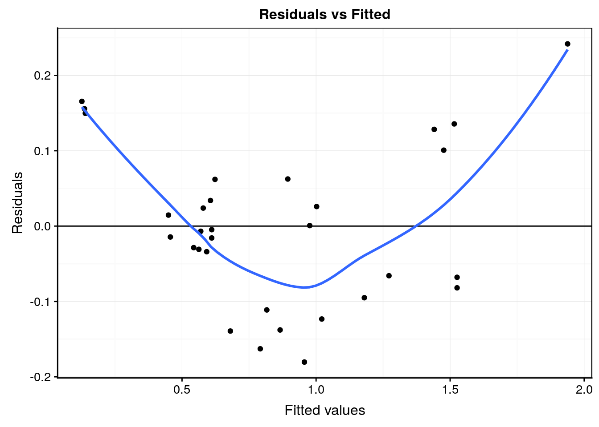
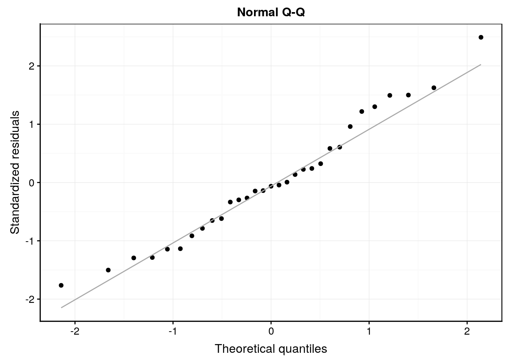
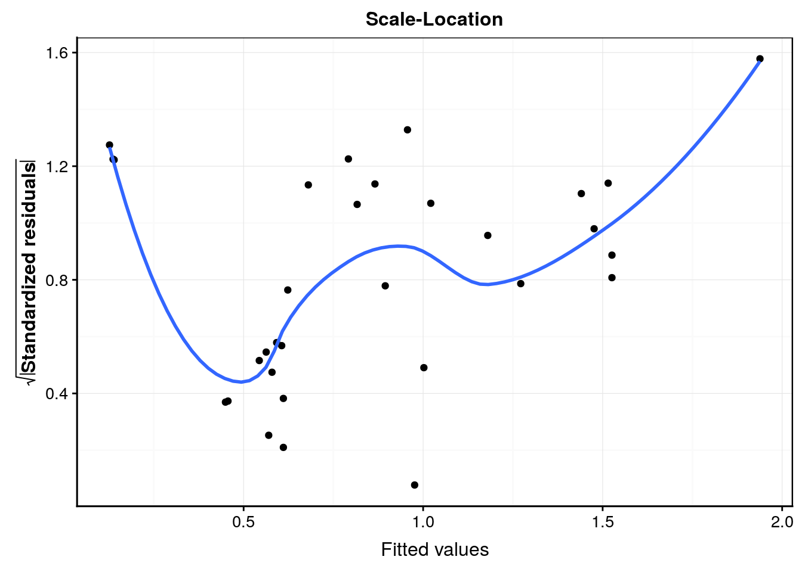
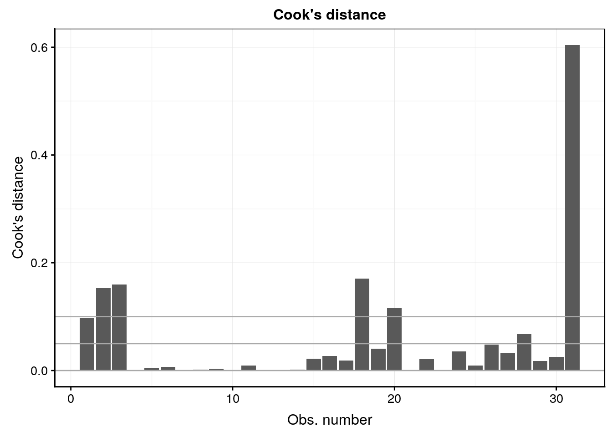

# Régression linéaire II {#lm2}


##### Objectifs {-}

- Savoir utiliser les outils de diagnostic de la régression linéaire correctement, en particulier l'analyse des résidus.

- Appréhender les différentes formes de régressions linéaires par les moindres carrés.

- Choisir sa régression linéaire de manière judicieuse.


##### Prérequis {-}

- Le module précédent est une entrée en matière indispensable qui est complétée par le contenu du présent module.


## Outils de diagnostic (suite)

La régression linéaire est une matière complexe et de nombreux outils existent pour vous aider à déterminer si le modèle que vous ajustez tient la route ou non. Il est très important de le vérifier avant d'utiliser un modèle. **Ajuster un modèle quelconque dans des données est à la portée de tout le monde, mais choisir un modèle pertinent et pouvoir expliquer pourquoi est nettement plus difficile\ !**


### Résumé avec `summary()`(suite)

Reprenons la sortie renvoyée par `summary()` appliqué à un objet `lm`.


```r
trees <- read("trees", package = "datasets", lang = "fr")
lm. <- lm(data = trees, volume ~ diameter)
summary(lm.)
```

```
# 
# Call:
# lm(formula = volume ~ diameter, data = trees)
# 
# Residuals:
#       Min        1Q    Median        3Q       Max 
# -0.231211 -0.087021  0.003533  0.100594  0.271725 
# 
# Coefficients:
#             Estimate Std. Error t value Pr(>|t|)    
# (Intercept) -1.04748    0.09553  -10.96 7.85e-12 ***
# diameter     5.65154    0.27649   20.44  < 2e-16 ***
# ---
# Signif. codes:  0 '***' 0.001 '**' 0.01 '*' 0.05 '.' 0.1 ' ' 1
# 
# Residual standard error: 0.1206 on 29 degrees of freedom
# Multiple R-squared:  0.9351,	Adjusted R-squared:  0.9329 
# F-statistic: 417.8 on 1 and 29 DF,  p-value: < 2.2e-16
```

Nous n'avons pas encore étudié la signification des trois dernières lignes de ce résumé. Voici de quoi il s'agit.

- Residual standard error\ :

Il s'agit de l'écart-type résiduel, considérant que les degrés de liberté du modèle est le nombre d'observations $n$ (ici 31) soustrait du nombre de paramètres à estimer (ici 2, la pente et l'ordonnée à l'origine de la droite). C'est donc une mesure globale de l'importance (c'est-à-dire de l'étendue) des résidus de manière générale.

$$\sqrt{\frac{\sum(y_i - ŷ_i)^2}{n-2}}$$

- Multiple R-squared\ :

Il s'agit de la valeur du **coefficient de détermination** du modèle noté *R^2* de manière générale ou *r^2^* dans le cas d'une régression linéaire simple. Il exprime la fraction de variance exprimée par le modèle. Autrement dit, le *R^2^* quantifie la capacité du modèle à *prédire* la valeur de $y$ connaissant la valeur $x$ pour le même individu. C'est dons une indication du *pouvoir prédictif* de notre modèle autant que de sa **qualité d'ajustement** (*goodness-of-fit* en anglais).

Souvenons-nous que la variance totale respecte la propiété d'additivité. La variance est composée au numérateur d'une somme de carrés, et au dénominateur de degrés de liberté. La somme des carrés totaux (de la variance) peut elle-même être décomposée en une **fraction expliquée** par notre modèle, et la fraction qui ne l'est pas (les **résidus**)\ :

$$SC(total) = SC(rég) + SC(résidus)$$

avec\ :

$$SC(total) = \sum_{i=0}^n(y_i - \bar y_i)^2$$

$$SC(rég) = \sum_{i=0}^n(ŷ_i - \bar y_i)^2$$

$$SC(résidus) = \sum_{i=0}^n(y_i - ŷ_i)^2$$

A partir de la décomposition de ces sommes de carrés, le coefficient *R^2^* (ou *r^2^*) se définit comme\ :

$$R^2 = \frac{SC(rég)}{SC(total)} = 1 - \frac{SC(résidus)}{SC(total)}$$

La valeur du *R^2^* est comprise entre 0 (lorsque le modèle est très mauvais et n'explique rien) et 1 (lorsque le modèle est parfait et "capture" toute la variance des données\ ; dans ce cas, tous les résidus valent zéro). Donc, **plus le coefficient *R^2^* se rapproche de un, plus le modèle explique bien les données et aura un bon pouvoir de prédiction**.

\BeginKnitrBlock{warning}<div class="warning">
Dans R, le *R^2^* multiple se réfère simplement au *R^2^* (ou au *r^2^* pour les régressions linéaires simples) calculé de cette façon. L'adjectif **multiple** indique simplement que le calcul est valable pour une régression **multiple** telle que nous verrons plus loin.

Par contre, le terme au dénominateur considère en fait la somme des carrés totale **par rapport à un modèle de référence** lorsque la variable dépendante $y$ ne *dépend pas* de la ou des variables indépendantes $x_i$. Les équations indiquées plus haut sont valables lorsque l'ordonnée à l'origine *n'est pas* figée ($y = a \ x + b$). Dans ce cas, la valeur de référence pour $y$ est bien sa moyenne, $\bar y$.

D'un autre côté, si l'ordonnée à l'origine est fixée à zéro dans le modèle simplifié $y = a \ x$ (avec $b = 0$ obtenu en indiquant la formule `y ~ x + 0` ou `y ~ x - 1`), alors le zéro sur l'axe $y$ est considéré comme une valeur appartenant d'office au modèle et devient valeur de référence. Ainsi, dans les équations ci-dessus il faut remplacer $\bar y$ par 0 partout. Le *R^2^* est alors calculé différemment, et sa valeur peut brusquement augmenter si le nuage de points est très éloigné du zéro sur l'axe y. **Ne comparez donc jamais les *R^2^* obtenus avec et sans forçage à zéro de l'ordonnée à l'origine\ !**
</div>\EndKnitrBlock{warning}

- Adjusted R-squared\ :

La valeur du coefficient *R^2^* **ajustée**, noté $\bar{R^2}$ n'est pas utile dans le cadre de la régression linéaire simple, mais est indispensable avec la régression multiple. En effet, à chaque fois que vous rendez votre modèle plus complexe en ajoutant une ou plusieurs variables indépendantes, le modèle s'ajustera de mieux en mieux dans les données, même par pur hasard. C'est un phénomène que l'on appelle l'**inflation du *R^2^***. A la limite, si nous ajoutons une nouvelle variable fortement corrélée avec les précédentes^[La corrélation entre les prédicteurs dans un modèle linéaire multiple est un gros problème et doit être évité le plus possible. Cela s'appelle la **colinéarité** ou encore **multicollinéairité**. Ainsi, il est toujours préférable de choisir un ensemble de variables indépendantes peu corrélées entre elles dans un même modèle, mais ce n'est pas toujours possible.], l'apport en terme d'information nouvelle sera négligeable, mais le *R^2^* augmentera malgré tout un tout petit peu. Alors dans quel cas l'ajout d'une nouvelle variable est-il pertinent ou non\ ? Le *R^2^* ajusté apporte l'information désirée ici. Sa valeur n'augmentera pour l'ajout d'un nouveau prédicteur *que si l'ajustement est meilleur que ce que l'on obtiendrait par le pur hasard*. Le *R^2^* ajusté se calcule comme suit (il n'est pas nécessaire de retenir cette formule, mais juste de constater que l'ajustement fait intervenir *p*, le nombre de paramètres du modèle et *n*, la taille de l'échantillon)\ :

$$
\bar{R^2} = 1 - (1 - R^2) \frac{n - 1}{n - p - 1}
$$

- F-statistic\ :

Tout comme pour l'ANOVA, le test de la significativité de la régression car  $MS(rég)/MS(résidus)$ suit une distribution *F* à respectivement 1 et $n-2$ degré de liberté, avec $MS$ les carrés moyens, c'est-à-dire les sommes des carrés $SC$ divisés par leurs degrés de liberté respectifs.

- p-value\ : 

Il s'agit de la valeur *p* associé à la statistique de *F*, donc à l'ANOVA associée à la régression linéaire. Pour cette ANOVA particulière, l'hypothèse nulle est que la droite n'apporte pas plus d'explication des valeurs de *y* à partir des valeurs de *x* que la valeur moyenne de *y* (ou zéro, dans le cas paerticulier d'un modèle dont l'ordonnée à l'origine est forcé à zéro). L'hypothèse alternative est donc que le modèle est significatif au seuil $\alpha$ considéré. **Donc, notre objectif est de rejetter *H~0~* pour cet test ANOVA** pour que le modèle ait un sens (valeur *p* plus petite quez le seuil $\alpha$ choisi).

Le tableau complet de l'ANOVA associée au modèle peut aussi être obtenu à l'aide de la fonction `anova()`\ :


```r
anova(lm.)
```

```
# Analysis of Variance Table
# 
# Response: volume
#           Df Sum Sq Mean Sq F value    Pr(>F)    
# diameter   1 6.0762  6.0762   417.8 < 2.2e-16 ***
# Residuals 29 0.4218  0.0145                      
# ---
# Signif. codes:  0 '***' 0.001 '**' 0.01 '*' 0.05 '.' 0.1 ' ' 1
```

On y retrouve les mêmes informations, fortement résumées en une ligne à la fin de la sortie de `summary()`, mais ici sous une forme plus classique de tableau de l'analyse de la variance.


### Comparaison de régressions

Vous pouvez à présent comparer ces résultats avec un tableau et les six graphiques d'analyse des résidus sans la valeur supérieure à 0.5m de diamètre. **Attention, On ne peut supprimer une valeur sans raison valable.** La suppression de points aberrants doit en principe être faite avant de débuter l'analyse. La raison de la suppression de ce point est liée au fait qu'il soit seul et unique point supérieur à 0.5m de diamètre. Nous le faisons ici à titre de comparaison.


```r
trees_red <- filter(trees, diameter < 0.5)
lm1 <- lm(data = trees_red, volume ~ diameter)

chart(trees, volume ~ diameter) +
  geom_point() + 
  geom_abline(
    aes(intercept = lm.$coefficients[1], slope = lm.$coefficients[2]), 
    color = "red", size = 1.5) +
  labs( color = "Modèle")  +
  scale_color_viridis_c(direction = -1) +
  geom_abline(
    aes(intercept = lm1$coefficients[1], slope = lm1$coefficients[2]), 
    color = "blue", size = 1.5)
```


La droite en bleu correspond à la régression sans utiliser l'arbre de diamètre supérieur à 0,5m. Tentez d'analyser le tableau de notre régression en bleu (astuce\ : comparez avec ce que la régeression précédente donnait).


```r
summary(lm1)
```

```
# 
# Call:
# lm(formula = volume ~ diameter, data = trees_red)
# 
# Residuals:
#       Min        1Q    Median        3Q       Max 
# -0.215129 -0.068502 -0.001149  0.070522  0.181398 
# 
# Coefficients:
#             Estimate Std. Error t value Pr(>|t|)    
# (Intercept) -0.94445    0.09309  -10.15 6.98e-11 ***
# diameter     5.31219    0.27540   19.29  < 2e-16 ***
# ---
# Signif. codes:  0 '***' 0.001 '**' 0.01 '*' 0.05 '.' 0.1 ' ' 1
# 
# Residual standard error: 0.1082 on 28 degrees of freedom
# Multiple R-squared:   0.93,	Adjusted R-squared:  0.9275 
# F-statistic: 372.1 on 1 and 28 DF,  p-value: < 2.2e-16
```

Tentez d'analyser également les graphiques d'analyse des résidus ci-dessous.


```r
#plot(lm1, which = 1)
lm1 %>.%
  chart(broom::augment(.), .resid ~ .fitted) +
  geom_point() +
  geom_hline(yintercept = 0) +
  geom_smooth(se = FALSE, method = "loess", formula = y ~ x) +
  labs(x = "Fitted values", y = "Residuals") +
  ggtitle("Residuals vs Fitted") 
```


```r
#plot(lm1, which = 2)
lm1 %>.%
  chart(broom::augment(.), aes(sample = .std.resid)) +
  geom_qq() +
  geom_qq_line(colour = "darkgray") +
  labs(x = "Theoretical quantiles", y = "Standardized residuals") +
  ggtitle("Normal Q-Q") 
```


```r
#plot(lm1, which = 3)
lm1 %>.%
  chart(broom::augment(.), sqrt(abs(.std.resid)) ~ .fitted) +
  geom_point() +
  geom_smooth(se = FALSE, method = "loess", formula = y ~ x) +
  labs(x = "Fitted values",
    y = expression(bold(sqrt(abs("Standardized residuals"))))) +
  ggtitle("Scale-Location") 
```


```r
#plot(lm1, which = 4)
lm1 %>.%
  chart(broom::augment(.), .cooksd ~ seq_along(.cooksd)) +
  geom_bar(stat = "identity") +
  geom_hline(yintercept = seq(0, 0.1, by = 0.05), colour = "darkgray") +
  labs(x = "Obs. number", y = "Cook's distance") +
  ggtitle("Cook's distance") 
```


```r
#plot(lm1, which = 5)
lm1 %>.%
  chart(broom::augment(.), .std.resid ~ .hat %size=% .cooksd) +
  geom_point() +
  geom_smooth(se = FALSE, size = 0.5, method = "loess", formula = y ~ x) +
  geom_vline(xintercept = 0) +
  geom_hline(yintercept = 0) +
  labs(x = "Leverage", y = "Standardized residuals") +
  ggtitle("Residuals vs Leverage")
```


```r
#plot(lm1, which = 6)
lm1 %>.%
  chart(broom::augment(.), .cooksd ~ .hat %size=% .cooksd) +
  geom_point() +
  geom_vline(xintercept = 0, colour = NA) +
  geom_abline(slope = seq(0, 3, by = 0.5), colour = "darkgray") +
  geom_smooth(se = FALSE, size = 0.5, method = "loess", formula = y ~ x) +
  labs(x = expression("Leverage h"[ii]), y = "Cook's distance") +
  ggtitle(expression("Cook's dist vs Leverage h"[ii] / (1 - h[ii])))
```


Au travers de cet exemple, nous constatons que la comparaison de modèles, dans le but de choisir le meilleur est un travail utile. Cela apparaitra d'autant plus utile que la situation va passablement se complexifier (dans le bon sens) avec l'introduction de la régression multiple et polynomiale ci-dessous. Heureusement, nous terminerons ce module avec la découverte d'une métrique qui va nous permettre d'effectuer le choix du meilleur modèle de manière fiable\ : le critère d'Akaike.


##### A vous de jouer ! {-}

Réalisez une nouvelle assignation individuelle :


\BeginKnitrBlock{bdd}<div class="bdd">
Vous avez à votre disposition une assignation GitHub Classroom : 
  
- <https://classroom.github.com/a/jkh3ruyX>
  </div>\EndKnitrBlock{bdd}

## Régression linéaire multiple 

Dans le cas de la régression linéaire simple, nous considèrions le modèle stqatistique suivant (avec $\epsilon$ représentant les résidus, terme statistique dans l'équation)\ :

$$y = a \ x + b + \epsilon $$ 

Dans le cas de la régression, nous introduirons *plusieurs* variables indépendantes notés $x_1$, $x_2$, ..., $x_n$\ :

$$y = a_1 \ x_1 + a_2 \ x_2 + ... + a_n \ x_n + b + \epsilon $$ 

La bonne nouvelle, c'est que tous les calculs, les métriques et les tests d'hypothèses relatifs à la régression linéaire simple se généraliser simplement et naturellement, tout comme nous sommes passés dans le cours SDD 1 de l'ANOVA à 1 facteur à un modèle plus complexe à 2 ou plusoieurs facteurs. Voyons tout de suite ce que cela donne si nous voulions utiliser **à la fois** le diamètree et la hauteur des cerisiers noirs pour prédire leur volume de bois\ :


```r
summary(lm2 <- lm(data = trees, volume ~ diameter + height))
```

```
# 
# Call:
# lm(formula = volume ~ diameter + height, data = trees)
# 
# Residuals:
#       Min        1Q    Median        3Q       Max 
# -0.180423 -0.074919 -0.006874  0.062244  0.241801 
# 
# Coefficients:
#             Estimate Std. Error t value Pr(>|t|)    
# (Intercept) -1.63563    0.24462  -6.686 2.95e-07 ***
# diameter     5.25643    0.29594  17.762  < 2e-16 ***
# height       0.03112    0.01209   2.574   0.0156 *  
# ---
# Signif. codes:  0 '***' 0.001 '**' 0.01 '*' 0.05 '.' 0.1 ' ' 1
# 
# Residual standard error: 0.1104 on 28 degrees of freedom
# Multiple R-squared:  0.9475,	Adjusted R-squared:  0.9438 
# F-statistic: 252.7 on 2 and 28 DF,  p-value: < 2.2e-16
```

D'un point de vue pratique, nous voyons que la formule qui spécifie le modèle peut très bien comporter plusieurs variables séparées par des `+`. Nous avons ici trois paramètres dans notre modèle\ : l'ordonnée à l'origine qui vaut -1,63, la pente relative au diamètre de 5,25, et la pente relative à la hauteur de 0,031. Le modèle `lm2` sera donc paramétré comme suit\ : volume de bois = 5,25 . diamètre + 0,031 . hauteur - 1,63.

Notons que la pente relative à la hauteur (0,031) n'est pas significativement différente de zéro au seuil $\alpha$ de 5% (mais l'est seulement pour $\alpha$ = 1%). En effet, la valeur *t* du test de Student associé (H~0~\ : le paramètre vaut zéro, H~1~\ : le paramètre est différent de zéro) vaut 2,574. Cela correspond à une valeur *p* du test de 0,0156, une valeur moyennement significative donc, matérialisée par une seule astérisque à la droite du tableau. Cela dénote un plus faible pouvoir de prédiction du volume de bois via la hauteur que via le diamètre de l'arbre. Nous l'avions déjà observé sur le graphique matrice de nuages de points réalisé initialement, ainsi que via les coefficients de correlation respectifs.

La représentation de cette régression nécessite un graphique à trois dimensions (diamètre, hauteur et volume) et le modèle représente en fait le meilleur **plan** dans cet espace à 3 dimensions. Pour un modèle comportant plus de deux variables indépendantes, il n'est plus possible de représenter graphiquement la régression.


```r
library(rgl)
knitr::knit_hooks$set(webgl = hook_webgl)
```


```r
car::scatter3d(data = trees, volume ~ diameter + height, fit = "linear",
  residuals = TRUE, bg = "white", axis.scales = TRUE, grid = TRUE,
  ellipsoid = FALSE)
```

```
# Loading required namespace: mgcv
```

```r
rgl::rglwidget(width = 800, height = 800)
```

<!--html_preserve--><div id="rgl75612" style="width:800px;height:800px;" class="rglWebGL html-widget"></div>
<script type="application/json" data-for="rgl75612">{"x":{"material":{"color":["#00FFFF","#00FFFF","#00FFFF","#00FFFF","#00FFFF","#00FFFF","#00FFFF","#00FFFF","#FF00FF","#FF00FF","#FF00FF","#FF00FF","#FF00FF","#FF00FF","#FF00FF","#FF00FF","#00FFFF","#00FFFF","#FF00FF","#FF00FF","#00FFFF","#00FFFF","#FF00FF","#FF00FF","#FF00FF","#FF00FF","#00FFFF","#00FFFF","#FF00FF","#FF00FF","#FF00FF","#FF00FF","#00FFFF","#00FFFF","#FF00FF","#FF00FF","#FF00FF","#FF00FF","#FF00FF","#FF00FF","#00FFFF","#00FFFF","#FF00FF","#FF00FF","#00FFFF","#00FFFF","#FF00FF","#FF00FF","#FF00FF","#FF00FF","#00FFFF","#00FFFF","#00FFFF","#00FFFF","#00FFFF","#00FFFF","#FF00FF","#FF00FF","#FF00FF","#FF00FF","#00FFFF","#00FFFF"],"alpha":1,"lit":true,"ambient":"#000000","specular":"#FFFFFF","emission":"#000000","shininess":50,"smooth":true,"front":"filled","back":"filled","size":3,"lwd":1,"fog":true,"point_antialias":false,"line_antialias":false,"texture":null,"textype":"rgb","texmipmap":false,"texminfilter":"linear","texmagfilter":"linear","texenvmap":false,"depth_mask":true,"depth_test":"less","isTransparent":false,"polygon_offset":[0,0]},"rootSubscene":1,"objects":{"10":{"id":10,"type":"text","material":{"lit":false},"vertices":[[0,-0.0500000007450581,0]],"colors":[[0.545098066329956,0,0.545098066329956,1]],"texts":[["0.2"]],"cex":[[1]],"adj":[[0.5,0.5]],"centers":[[0,-0.0500000007450581,0]],"family":[["sans"]],"font":[[1]],"ignoreExtent":false,"flags":2064},"11":{"id":11,"type":"text","material":{"lit":false},"vertices":[[0.928792595863342,-0.0500000007450581,0]],"colors":[[0.545098066329956,0,0.545098066329956,1]],"texts":[["0.5"]],"cex":[[1]],"adj":[[0.5,0.5]],"centers":[[0.928792595863342,-0.0500000007450581,0]],"family":[["sans"]],"font":[[1]],"ignoreExtent":false,"flags":2064},"12":{"id":12,"type":"text","material":{"lit":false},"vertices":[[0,-0.100000001490116,0.0740740746259689]],"colors":[[0,0.545098066329956,0.545098066329956,1]],"texts":[["20"]],"cex":[[1]],"adj":[[0.5,0.5]],"centers":[[0,-0.100000001490116,0.0740740746259689]],"family":[["sans"]],"font":[[1]],"ignoreExtent":false,"flags":2064},"13":{"id":13,"type":"text","material":{"lit":false},"vertices":[[0,-0.100000001490116,1]],"colors":[[0,0.545098066329956,0.545098066329956,1]],"texts":[["30"]],"cex":[[1]],"adj":[[0.5,0.5]],"centers":[[0,-0.100000001490116,1]],"family":[["sans"]],"font":[[1]],"ignoreExtent":false,"flags":2064},"14":{"id":14,"type":"text","material":{"lit":false},"vertices":[[-0.0500000007450581,0.00581702822819352,-0.0500000007450581]],"colors":[[0,0,0,1]],"texts":[["0.3"]],"cex":[[1]],"adj":[[0.5,0.5]],"centers":[[-0.0500000007450581,0.00581702822819352,-0.0500000007450581]],"family":[["sans"]],"font":[[1]],"ignoreExtent":false,"flags":2064},"15":{"id":15,"type":"text","material":{"lit":false},"vertices":[[-0.0500000007450581,0.904812276363373,-0.0500000007450581]],"colors":[[0,0,0,1]],"texts":[["2"]],"cex":[[1]],"adj":[[0.5,0.5]],"centers":[[-0.0500000007450581,0.904812276363373,-0.0500000007450581]],"family":[["sans"]],"font":[[1]],"ignoreExtent":false,"flags":2064},"16":{"id":16,"type":"spheres","material":{},"vertices":[[0.0340557284653187,0.00158646213822067,0.194444447755814],[0.0557275526225567,0.00158646213822067,0.0555555559694767],[0.0743034034967422,0,0],[0.207430347800255,0.0925436243414879,0.25],[0.222910210490227,0.128503441810608,0.509259283542633],[0.229102164506912,0.142252773046494,0.564814805984497],[0.244582042098045,0.0809095725417137,0.0833333358168602],[0.244582042098045,0.119513481855392,0.342592597007751],[0.253869980573654,0.185616075992584,0.481481492519379],[0.260061919689178,0.144896879792213,0.342592597007751],[0.269349843263626,0.209413006901741,0.453703701496124],[0.278637766838074,0.161819145083427,0.370370358228683],[0.278637766838074,0.167636170983315,0.370370358228683],[0.300309598445892,0.16604970395565,0.16666667163372],[0.325077384710312,0.133262827992439,0.342592597007751],[0.396284818649292,0.179799050092697,0.314814805984497],[0.396284818649292,0.35325226187706,0.620370388031006],[0.427244573831558,0.257535696029663,0.648148119449615],[0.458204329013824,0.232152298092842,0.222222223877907],[0.467492252588272,0.219989418983459,0.0277777779847383],[0.482972145080566,0.363828659057617,0.425925940275192],[0.498452007770538,0.322051823139191,0.481481492519379],[0.520123839378357,0.390798509120941,0.314814805984497],[0.637770891189575,0.420941293239594,0.25],[0.662538707256317,0.484928607940674,0.398148149251938],[0.739938080310822,0.676890552043915,0.509259283542633],[0.755417943000793,0.681121110916138,0.537037014961243],[0.789473712444305,0.720253825187683,0.481481492519379],[0.795665621757507,0.618191421031952,0.481481492519379],[0.795665621757507,0.610787928104401,0.481481492519379],[1,1,0.67592591047287]],"colors":[[1,1,0,1]],"radii":[[0.022163450717926]],"centers":[[0.0340557284653187,0.00158646213822067,0.194444447755814],[0.0557275526225567,0.00158646213822067,0.0555555559694767],[0.0743034034967422,0,0],[0.207430347800255,0.0925436243414879,0.25],[0.222910210490227,0.128503441810608,0.509259283542633],[0.229102164506912,0.142252773046494,0.564814805984497],[0.244582042098045,0.0809095725417137,0.0833333358168602],[0.244582042098045,0.119513481855392,0.342592597007751],[0.253869980573654,0.185616075992584,0.481481492519379],[0.260061919689178,0.144896879792213,0.342592597007751],[0.269349843263626,0.209413006901741,0.453703701496124],[0.278637766838074,0.161819145083427,0.370370358228683],[0.278637766838074,0.167636170983315,0.370370358228683],[0.300309598445892,0.16604970395565,0.16666667163372],[0.325077384710312,0.133262827992439,0.342592597007751],[0.396284818649292,0.179799050092697,0.314814805984497],[0.396284818649292,0.35325226187706,0.620370388031006],[0.427244573831558,0.257535696029663,0.648148119449615],[0.458204329013824,0.232152298092842,0.222222223877907],[0.467492252588272,0.219989418983459,0.0277777779847383],[0.482972145080566,0.363828659057617,0.425925940275192],[0.498452007770538,0.322051823139191,0.481481492519379],[0.520123839378357,0.390798509120941,0.314814805984497],[0.637770891189575,0.420941293239594,0.25],[0.662538707256317,0.484928607940674,0.398148149251938],[0.739938080310822,0.676890552043915,0.509259283542633],[0.755417943000793,0.681121110916138,0.537037014961243],[0.789473712444305,0.720253825187683,0.481481492519379],[0.795665621757507,0.618191421031952,0.481481492519379],[0.795665621757507,0.610787928104401,0.481481492519379],[1,1,0.67592591047287]],"ignoreExtent":false,"flags":3},"17":{"id":17,"type":"lines","material":{"lit":false},"vertices":[[0,0,0],[1,0,0]],"colors":[[0.545098066329956,0,0.545098066329956,1]],"centers":[[0.5,0,0]],"ignoreExtent":false,"flags":64},"18":{"id":18,"type":"lines","material":{"lit":false},"vertices":[[0,0,0],[0,1,0]],"colors":[[0,0,0,1]],"centers":[[0,0.5,0]],"ignoreExtent":false,"flags":64},"19":{"id":19,"type":"lines","material":{"lit":false},"vertices":[[0,0,0],[0,0,1]],"colors":[[0,0.545098066329956,0.545098066329956,1]],"centers":[[0,0,0.5]],"ignoreExtent":false,"flags":64},"20":{"id":20,"type":"text","material":{"lit":false},"vertices":[[1,0,0]],"colors":[[0.545098066329956,0,0.545098066329956,1]],"texts":[["diameter"]],"cex":[[1]],"adj":[[1,0.5]],"centers":[[1,0,0]],"family":[["sans"]],"font":[[1]],"ignoreExtent":false,"flags":2064},"21":{"id":21,"type":"text","material":{"lit":false},"vertices":[[0,1.04999995231628,0]],"colors":[[0,0,0,1]],"texts":[["volume"]],"cex":[[1]],"adj":[[1,0.5]],"centers":[[0,1.04999995231628,0]],"family":[["sans"]],"font":[[1]],"ignoreExtent":false,"flags":2064},"22":{"id":22,"type":"text","material":{"lit":false},"vertices":[[0,0,1]],"colors":[[0,0.545098066329956,0.545098066329956,1]],"texts":[["height"]],"cex":[[1]],"adj":[[1,0.5]],"centers":[[0,0,1]],"family":[["sans"]],"font":[[1]],"ignoreExtent":false,"flags":2064},"23":{"id":23,"type":"surface","material":{"alpha":0.498039215803146,"lit":false,"isTransparent":true},"vertices":[[0,-0.145856902003288,0],[0.0399999991059303,-0.10994303971529,0],[0.0799999982118607,-0.0740291774272919,0],[0.119999997317791,-0.0381153225898743,0],[0.159999996423721,-0.00220146565698087,0],[0.200000002980232,0.0337123908102512,0],[0.239999994635582,0.0696262493729591,0],[0.280000001192093,0.105540104210377,0],[0.319999992847443,0.141453966498375,0],[0.360000014305115,0.177367821335793,0],[0.400000005960464,0.21328167617321,0],[0.439999997615814,0.249195531010628,0],[0.479999989271164,0.285109400749207,0],[0.519999980926514,0.321023255586624,0],[0.560000002384186,0.356937110424042,0],[0.600000023841858,0.392850965261459,0],[0.639999985694885,0.428764820098877,0],[0.680000007152557,0.464678674936295,0],[0.720000028610229,0.500592529773712,0],[0.759999990463257,0.536506414413452,0],[0.800000011920929,0.572420239448547,0],[0.839999973773956,0.608334124088287,0],[0.879999995231628,0.644247949123383,0],[0.920000016689301,0.680161833763123,0],[0.959999978542328,0.716075658798218,0],[1,0.751989543437958,0],[0,-0.138747170567513,0.0399999991059303],[0.0399999991059303,-0.102833315730095,0.0399999991059303],[0.0799999982118607,-0.0669194608926773,0.0399999991059303],[0.119999997317791,-0.0310056004673243,0.0399999991059303],[0.159999996423721,0.00490825669839978,0.0399999991059303],[0.200000002980232,0.0408221147954464,0.0399999991059303],[0.239999994635582,0.0767359733581543,0.0399999991059303],[0.280000001192093,0.112649828195572,0.0399999991059303],[0.319999992847443,0.14856368303299,0.0399999991059303],[0.360000014305115,0.184477537870407,0.0399999991059303],[0.400000005960464,0.220391407608986,0.0399999991059303],[0.439999997615814,0.256305247545242,0.0399999991059303],[0.479999989271164,0.29221910238266,0.0399999991059303],[0.519999980926514,0.3281329870224,0.0399999991059303],[0.560000002384186,0.364046841859818,0.0399999991059303],[0.600000023841858,0.399960696697235,0.0399999991059303],[0.639999985694885,0.435874551534653,0.0399999991059303],[0.680000007152557,0.47178840637207,0.0399999991059303],[0.720000028610229,0.507702231407166,0.0399999991059303],[0.759999990463257,0.543616116046906,0.0399999991059303],[0.800000011920929,0.579530000686646,0.0399999991059303],[0.839999973773956,0.615443825721741,0.0399999991059303],[0.879999995231628,0.651357710361481,0.0399999991059303],[0.920000016689301,0.687271535396576,0.0399999991059303],[0.959999978542328,0.723185420036316,0.0399999991059303],[1,0.759099245071411,0.0399999991059303],[0,-0.131637454032898,0.0799999982118607],[0.0399999991059303,-0.0957235917448997,0.0799999982118607],[0.0799999982118607,-0.0598097369074821,0.0799999982118607],[0.119999997317791,-0.0238958783447742,0.0799999982118607],[0.159999996423721,0.0120179792866111,0.0799999982118607],[0.200000002980232,0.0479318350553513,0.0799999982118607],[0.239999994635582,0.0838456973433495,0.0799999982118607],[0.280000001192093,0.119759552180767,0.0799999982118607],[0.319999992847443,0.155673414468765,0.0799999982118607],[0.360000014305115,0.191587269306183,0.0799999982118607],[0.400000005960464,0.2275011241436,0.0799999982118607],[0.439999997615814,0.263414978981018,0.0799999982118607],[0.479999989271164,0.299328833818436,0.0799999982118607],[0.519999980926514,0.335242688655853,0.0799999982118607],[0.560000002384186,0.371156543493271,0.0799999982118607],[0.600000023841858,0.407070398330688,0.0799999982118607],[0.639999985694885,0.442984253168106,0.0799999982118607],[0.680000007152557,0.478898137807846,0.0799999982118607],[0.720000028610229,0.514811992645264,0.0799999982118607],[0.759999990463257,0.550725817680359,0.0799999982118607],[0.800000011920929,0.586639702320099,0.0799999982118607],[0.839999973773956,0.622553527355194,0.0799999982118607],[0.879999995231628,0.658467411994934,0.0799999982118607],[0.920000016689301,0.694381296634674,0.0799999982118607],[0.959999978542328,0.730295121669769,0.0799999982118607],[1,0.766209006309509,0.0799999982118607],[0,-0.124527730047703,0.119999997317791],[0.0399999991059303,-0.0886138677597046,0.119999997317791],[0.0799999982118607,-0.052700012922287,0.119999997317791],[0.119999997317791,-0.0167861543595791,0.119999997317791],[0.159999996423721,0.0191277023404837,0.119999997317791],[0.200000002980232,0.0550415590405464,0.119999997317791],[0.239999994635582,0.090955413877964,0.119999997317791],[0.280000001192093,0.126869276165962,0.119999997317791],[0.319999992847443,0.16278313100338,0.119999997317791],[0.360000014305115,0.198696985840797,0.119999997317791],[0.400000005960464,0.234610840678215,0.119999997317791],[0.439999997615814,0.270524710416794,0.119999997317791],[0.479999989271164,0.306438565254211,0.119999997317791],[0.519999980926514,0.342352420091629,0.119999997317791],[0.560000002384186,0.378266274929047,0.119999997317791],[0.600000023841858,0.414180129766464,0.119999997317791],[0.639999985694885,0.450093984603882,0.119999997317791],[0.680000007152557,0.486007839441299,0.119999997317791],[0.720000028610229,0.521921694278717,0.119999997317791],[0.759999990463257,0.557835578918457,0.119999997317791],[0.800000011920929,0.593749403953552,0.119999997317791],[0.839999973773956,0.629663288593292,0.119999997317791],[0.879999995231628,0.665577113628387,0.119999997317791],[0.920000016689301,0.701490998268127,0.119999997317791],[0.959999978542328,0.737404823303223,0.119999997317791],[1,0.773318707942963,0.119999997317791],[0,-0.117418006062508,0.159999996423721],[0.0399999991059303,-0.0815041437745094,0.159999996423721],[0.0799999982118607,-0.0455902889370918,0.159999996423721],[0.119999997317791,-0.00967643223702908,0.159999996423721],[0.159999996423721,0.0262374244630337,0.159999996423721],[0.200000002980232,0.0621512830257416,0.159999996423721],[0.239999994635582,0.0980651378631592,0.159999996423721],[0.280000001192093,0.133978992700577,0.159999996423721],[0.319999992847443,0.169892847537994,0.159999996423721],[0.360000014305115,0.205806717276573,0.159999996423721],[0.400000005960464,0.241720572113991,0.159999996423721],[0.439999997615814,0.277634412050247,0.159999996423721],[0.479999989271164,0.313548296689987,0.159999996423721],[0.519999980926514,0.349462151527405,0.159999996423721],[0.560000002384186,0.385376006364822,0.159999996423721],[0.600000023841858,0.42128986120224,0.159999996423721],[0.639999985694885,0.457203716039658,0.159999996423721],[0.680000007152557,0.493117570877075,0.159999996423721],[0.720000028610229,0.529031455516815,0.159999996423721],[0.759999990463257,0.56494528055191,0.159999996423721],[0.800000011920929,0.60085916519165,0.159999996423721],[0.839999973773956,0.636772990226746,0.159999996423721],[0.879999995231628,0.672686874866486,0.159999996423721],[0.920000016689301,0.708600699901581,0.159999996423721],[0.959999978542328,0.744514584541321,0.159999996423721],[1,0.780428409576416,0.159999996423721],[0,-0.110308282077312,0.200000002980232],[0.0399999991059303,-0.0743944272398949,0.200000002980232],[0.0799999982118607,-0.038480568677187,0.200000002980232],[0.119999997317791,-0.00256670988164842,0.200000002980232],[0.159999996423721,0.0333471484482288,0.200000002980232],[0.200000002980232,0.0692610070109367,0.200000002980232],[0.239999994635582,0.105174861848354,0.200000002980232],[0.280000001192093,0.141088724136353,0.200000002980232],[0.319999992847443,0.17700257897377,0.200000002980232],[0.360000014305115,0.212916433811188,0.200000002980232],[0.400000005960464,0.248830288648605,0.200000002980232],[0.439999997615814,0.284744143486023,0.200000002980232],[0.479999989271164,0.320657998323441,0.200000002980232],[0.519999980926514,0.356571853160858,0.200000002980232],[0.560000002384186,0.392485707998276,0.200000002980232],[0.600000023841858,0.428399562835693,0.200000002980232],[0.639999985694885,0.464313447475433,0.200000002980232],[0.680000007152557,0.500227272510529,0.200000002980232],[0.720000028610229,0.536141157150269,0.200000002980232],[0.759999990463257,0.572054982185364,0.200000002980232],[0.800000011920929,0.607968866825104,0.200000002980232],[0.839999973773956,0.643882691860199,0.200000002980232],[0.879999995231628,0.679796576499939,0.200000002980232],[0.920000016689301,0.715710461139679,0.200000002980232],[0.959999978542328,0.751624286174774,0.200000002980232],[1,0.787538170814514,0.200000002980232],[0,-0.103198558092117,0.239999994635582],[0.0399999991059303,-0.0672847032546997,0.239999994635582],[0.0799999982118607,-0.0313708446919918,0.239999994635582],[0.119999997317791,0.00454301247373223,0.239999994635582],[0.159999996423721,0.0404568687081337,0.239999994635582],[0.200000002980232,0.0763707235455513,0.239999994635582],[0.239999994635582,0.112284585833549,0.239999994635582],[0.280000001192093,0.148198440670967,0.239999994635582],[0.319999992847443,0.184112295508385,0.239999994635582],[0.360000014305115,0.220026150345802,0.239999994635582],[0.400000005960464,0.255940020084381,0.239999994635582],[0.439999997615814,0.291853874921799,0.239999994635582],[0.479999989271164,0.327767729759216,0.239999994635582],[0.519999980926514,0.363681584596634,0.239999994635582],[0.560000002384186,0.399595439434052,0.239999994635582],[0.600000023841858,0.435509294271469,0.239999994635582],[0.639999985694885,0.471423149108887,0.239999994635582],[0.680000007152557,0.507337033748627,0.239999994635582],[0.720000028610229,0.543250858783722,0.239999994635582],[0.759999990463257,0.579164743423462,0.239999994635582],[0.800000011920929,0.615078568458557,0.239999994635582],[0.839999973773956,0.650992453098297,0.239999994635582],[0.879999995231628,0.686906278133392,0.239999994635582],[0.920000016689301,0.722820162773132,0.239999994635582],[0.959999978542328,0.758733987808228,0.239999994635582],[1,0.794647872447968,0.239999994635582],[0,-0.0960888341069221,0.280000001192093],[0.0399999991059303,-0.0601749792695045,0.280000001192093],[0.0799999982118607,-0.0242611225694418,0.280000001192093],[0.119999997317791,0.0116527350619435,0.280000001192093],[0.159999996423721,0.0475665926933289,0.280000001192093],[0.200000002980232,0.0834804475307465,0.280000001192093],[0.239999994635582,0.119394309818745,0.280000001192093],[0.280000001192093,0.155308157205582,0.280000001192093],[0.319999992847443,0.19122202694416,0.280000001192093],[0.360000014305115,0.227135881781578,0.280000001192093],[0.400000005960464,0.263049721717834,0.280000001192093],[0.439999997615814,0.298963606357574,0.280000001192093],[0.479999989271164,0.334877461194992,0.280000001192093],[0.519999980926514,0.37079131603241,0.280000001192093],[0.560000002384186,0.406705170869827,0.280000001192093],[0.600000023841858,0.442619025707245,0.280000001192093],[0.639999985694885,0.478532880544662,0.280000001192093],[0.680000007152557,0.51444673538208,0.280000001192093],[0.720000028610229,0.55036062002182,0.280000001192093],[0.759999990463257,0.586274445056915,0.280000001192093],[0.800000011920929,0.622188329696655,0.280000001192093],[0.839999973773956,0.65810215473175,0.280000001192093],[0.879999995231628,0.69401603937149,0.280000001192093],[0.920000016689301,0.729929864406586,0.280000001192093],[0.959999978542328,0.765843749046326,0.280000001192093],[1,0.801757574081421,0.280000001192093],[0,-0.0889791175723076,0.319999992847443],[0.0399999991059303,-0.0530652552843094,0.319999992847443],[0.0799999982118607,-0.0171513985842466,0.319999992847443],[0.119999997317791,0.0187624581158161,0.319999992847443],[0.159999996423721,0.054676316678524,0.319999992847443],[0.200000002980232,0.0905901715159416,0.319999992847443],[0.239999994635582,0.12650403380394,0.319999992847443],[0.280000001192093,0.162417888641357,0.319999992847443],[0.319999992847443,0.198331743478775,0.319999992847443],[0.360000014305115,0.234245598316193,0.319999992847443],[0.400000005960464,0.27015945315361,0.319999992847443],[0.439999997615814,0.306073307991028,0.319999992847443],[0.479999989271164,0.341987162828445,0.319999992847443],[0.519999980926514,0.377901017665863,0.319999992847443],[0.560000002384186,0.413814902305603,0.319999992847443],[0.600000023841858,0.449728757143021,0.319999992847443],[0.639999985694885,0.485642611980438,0.319999992847443],[0.680000007152557,0.521556437015533,0.319999992847443],[0.720000028610229,0.557470321655273,0.319999992847443],[0.759999990463257,0.593384146690369,0.319999992847443],[0.800000011920929,0.629298031330109,0.319999992847443],[0.839999973773956,0.665211915969849,0.319999992847443],[0.879999995231628,0.701125741004944,0.319999992847443],[0.920000016689301,0.737039625644684,0.319999992847443],[0.959999978542328,0.772953450679779,0.319999992847443],[1,0.808867335319519,0.319999992847443],[0,-0.0818693935871124,0.360000014305115],[0.0399999991059303,-0.0459555350244045,0.360000014305115],[0.0799999982118607,-0.0100416764616966,0.360000014305115],[0.119999997317791,0.0258721802383661,0.360000014305115],[0.159999996423721,0.0617860369384289,0.360000014305115],[0.200000002980232,0.0976998955011368,0.360000014305115],[0.239999994635582,0.133613750338554,0.360000014305115],[0.280000001192093,0.169527605175972,0.360000014305115],[0.319999992847443,0.20544146001339,0.360000014305115],[0.360000014305115,0.241355329751968,0.360000014305115],[0.400000005960464,0.277269184589386,0.360000014305115],[0.439999997615814,0.313183039426804,0.360000014305115],[0.479999989271164,0.349096894264221,0.360000014305115],[0.519999980926514,0.385010749101639,0.360000014305115],[0.560000002384186,0.420924603939056,0.360000014305115],[0.600000023841858,0.456838458776474,0.360000014305115],[0.639999985694885,0.492752313613892,0.360000014305115],[0.680000007152557,0.528666198253632,0.360000014305115],[0.720000028610229,0.564580023288727,0.360000014305115],[0.759999990463257,0.600493907928467,0.360000014305115],[0.800000011920929,0.636407732963562,0.360000014305115],[0.839999973773956,0.672321617603302,0.360000014305115],[0.879999995231628,0.708235442638397,0.360000014305115],[0.920000016689301,0.744149327278137,0.360000014305115],[0.959999978542328,0.780063211917877,0.360000014305115],[1,0.815977036952972,0.360000014305115],[0,-0.0747596696019173,0.400000005960464],[0.0399999991059303,-0.0388458110392094,0.400000005960464],[0.0799999982118607,-0.00293195433914661,0.400000005960464],[0.119999997317791,0.0329819023609161,0.400000005960464],[0.159999996423721,0.0688957571983337,0.400000005960464],[0.200000002980232,0.104809619486332,0.400000005960464],[0.239999994635582,0.14072348177433,0.400000005960464],[0.280000001192093,0.176637336611748,0.400000005960464],[0.319999992847443,0.212551191449165,0.400000005960464],[0.360000014305115,0.248465046286583,0.400000005960464],[0.400000005960464,0.284378916025162,0.400000005960464],[0.439999997615814,0.320292770862579,0.400000005960464],[0.479999989271164,0.356206625699997,0.400000005960464],[0.519999980926514,0.392120480537415,0.400000005960464],[0.560000002384186,0.428034335374832,0.400000005960464],[0.600000023841858,0.46394819021225,0.400000005960464],[0.639999985694885,0.499862045049667,0.400000005960464],[0.680000007152557,0.535775899887085,0.400000005960464],[0.720000028610229,0.571689784526825,0.400000005960464],[0.759999990463257,0.60760360956192,0.400000005960464],[0.800000011920929,0.64351749420166,0.400000005960464],[0.839999973773956,0.679431319236755,0.400000005960464],[0.879999995231628,0.715345203876495,0.400000005960464],[0.920000016689301,0.751259028911591,0.400000005960464],[0.959999978542328,0.787172913551331,0.400000005960464],[1,0.823086738586426,0.400000005960464],[0,-0.0676499456167221,0.439999997615814],[0.0399999991059303,-0.0317360907793045,0.439999997615814],[0.0799999982118607,0.00417776824906468,0.439999997615814],[0.119999997317791,0.0400916263461113,0.439999997615814],[0.159999996423721,0.0760054811835289,0.439999997615814],[0.200000002980232,0.111919343471527,0.439999997615814],[0.239999994635582,0.147833198308945,0.439999997615814],[0.280000001192093,0.183747053146362,0.439999997615814],[0.319999992847443,0.21966090798378,0.439999997615814],[0.360000014305115,0.255574762821198,0.439999997615814],[0.400000005960464,0.291488617658615,0.439999997615814],[0.439999997615814,0.327402472496033,0.439999997615814],[0.479999989271164,0.36331632733345,0.439999997615814],[0.519999980926514,0.39923021197319,0.439999997615814],[0.560000002384186,0.435144066810608,0.439999997615814],[0.600000023841858,0.471057921648026,0.439999997615814],[0.639999985694885,0.506971776485443,0.439999997615814],[0.680000007152557,0.542885601520538,0.439999997615814],[0.720000028610229,0.578799486160278,0.439999997615814],[0.759999990463257,0.614713370800018,0.439999997615814],[0.800000011920929,0.650627195835114,0.439999997615814],[0.839999973773956,0.686541080474854,0.439999997615814],[0.879999995231628,0.722454905509949,0.439999997615814],[0.920000016689301,0.758368790149689,0.439999997615814],[0.959999978542328,0.794282615184784,0.439999997615814],[1,0.830196499824524,0.439999997615814],[0,-0.0605402253568172,0.479999989271164],[0.0399999991059303,-0.0246263667941093,0.479999989271164],[0.0799999982118607,0.011287490837276,0.479999989271164],[0.119999997317791,0.0472013466060162,0.479999989271164],[0.159999996423721,0.0831152051687241,0.479999989271164],[0.200000002980232,0.119029060006142,0.479999989271164],[0.239999994635582,0.154942914843559,0.479999989271164],[0.280000001192093,0.190856784582138,0.479999989271164],[0.319999992847443,0.226770639419556,0.479999989271164],[0.360000014305115,0.262684494256973,0.479999989271164],[0.400000005960464,0.298598349094391,0.479999989271164],[0.439999997615814,0.334512203931808,0.479999989271164],[0.479999989271164,0.370426058769226,0.479999989271164],[0.519999980926514,0.406339913606644,0.479999989271164],[0.560000002384186,0.442253768444061,0.479999989271164],[0.600000023841858,0.478167623281479,0.479999989271164],[0.639999985694885,0.514081478118896,0.479999989271164],[0.680000007152557,0.549995362758636,0.479999989271164],[0.720000028610229,0.585909187793732,0.479999989271164],[0.759999990463257,0.621823072433472,0.479999989271164],[0.800000011920929,0.657736897468567,0.479999989271164],[0.839999973773956,0.693650782108307,0.479999989271164],[0.879999995231628,0.729564666748047,0.479999989271164],[0.920000016689301,0.765478491783142,0.479999989271164],[0.959999978542328,0.801392376422882,0.479999989271164],[1,0.837306201457977,0.479999989271164],[0,-0.0534305013716221,0.519999980926514],[0.0399999991059303,-0.0175166428089142,0.519999980926514],[0.0799999982118607,0.0183972138911486,0.519999980926514],[0.119999997317791,0.0543110705912113,0.519999980926514],[0.159999996423721,0.0902249291539192,0.519999980926514],[0.200000002980232,0.126138791441917,0.519999980926514],[0.239999994635582,0.162052646279335,0.519999980926514],[0.280000001192093,0.197966501116753,0.519999980926514],[0.319999992847443,0.23388035595417,0.519999980926514],[0.360000014305115,0.269794225692749,0.519999980926514],[0.400000005960464,0.305708080530167,0.519999980926514],[0.439999997615814,0.341621935367584,0.519999980926514],[0.479999989271164,0.377535790205002,0.519999980926514],[0.519999980926514,0.413449645042419,0.519999980926514],[0.560000002384186,0.449363499879837,0.519999980926514],[0.600000023841858,0.485277354717255,0.519999980926514],[0.639999985694885,0.521191239356995,0.519999980926514],[0.680000007152557,0.55710506439209,0.519999980926514],[0.720000028610229,0.59301894903183,0.519999980926514],[0.759999990463257,0.628932774066925,0.519999980926514],[0.800000011920929,0.664846658706665,0.519999980926514],[0.839999973773956,0.70076048374176,0.519999980926514],[0.879999995231628,0.7366743683815,0.519999980926514],[0.920000016689301,0.772588193416595,0.519999980926514],[0.959999978542328,0.808502078056335,0.519999980926514],[1,0.844415903091431,0.519999980926514],[0,-0.0463207773864269,0.560000002384186],[0.0399999991059303,-0.0104069206863642,0.560000002384186],[0.0799999982118607,0.0255069360136986,0.560000002384186],[0.119999997317791,0.0614207945764065,0.560000002384186],[0.159999996423721,0.0973346531391144,0.560000002384186],[0.200000002980232,0.133248507976532,0.560000002384186],[0.239999994635582,0.16916236281395,0.560000002384186],[0.280000001192093,0.205076217651367,0.560000002384186],[0.319999992847443,0.240990087389946,0.560000002384186],[0.360000014305115,0.276903927326202,0.560000002384186],[0.400000005960464,0.31281778216362,0.560000002384186],[0.439999997615814,0.34873166680336,0.560000002384186],[0.479999989271164,0.384645521640778,0.560000002384186],[0.519999980926514,0.420559376478195,0.560000002384186],[0.560000002384186,0.456473231315613,0.560000002384186],[0.600000023841858,0.49238708615303,0.560000002384186],[0.639999985694885,0.528300940990448,0.560000002384186],[0.680000007152557,0.564214766025543,0.560000002384186],[0.720000028610229,0.600128650665283,0.560000002384186],[0.759999990463257,0.636042535305023,0.560000002384186],[0.800000011920929,0.671956360340118,0.560000002384186],[0.839999973773956,0.707870244979858,0.560000002384186],[0.879999995231628,0.743784070014954,0.560000002384186],[0.920000016689301,0.779697954654694,0.560000002384186],[0.959999978542328,0.815611779689789,0.560000002384186],[1,0.851525664329529,0.560000002384186],[0,-0.0392110571265221,0.600000023841858],[0.0399999991059303,-0.00329719856381416,0.600000023841858],[0.0799999982118607,0.0326166599988937,0.600000023841858],[0.119999997317791,0.0685305148363113,0.600000023841858],[0.159999996423721,0.10444437712431,0.600000023841858],[0.200000002980232,0.140358224511147,0.600000023841858],[0.239999994635582,0.176272094249725,0.600000023841858],[0.280000001192093,0.212185949087143,0.600000023841858],[0.319999992847443,0.248099803924561,0.600000023841858],[0.360000014305115,0.284013658761978,0.600000023841858],[0.400000005960464,0.319927513599396,0.600000023841858],[0.439999997615814,0.355841368436813,0.600000023841858],[0.479999989271164,0.391755223274231,0.600000023841858],[0.519999980926514,0.427669078111649,0.600000023841858],[0.560000002384186,0.463582932949066,0.600000023841858],[0.600000023841858,0.499496817588806,0.600000023841858],[0.639999985694885,0.535410642623901,0.600000023841858],[0.680000007152557,0.571324527263641,0.600000023841858],[0.720000028610229,0.607238352298737,0.600000023841858],[0.759999990463257,0.643152236938477,0.600000023841858],[0.800000011920929,0.679066061973572,0.600000023841858],[0.839999973773956,0.714979946613312,0.600000023841858],[0.879999995231628,0.750893831253052,0.600000023841858],[0.920000016689301,0.786807656288147,0.600000023841858],[0.959999978542328,0.822721540927887,0.600000023841858],[1,0.858635365962982,0.600000023841858],[0,-0.0321013331413269,0.639999985694885],[0.0399999991059303,0.00381252402439713,0.639999985694885],[0.0799999982118607,0.0397263802587986,0.639999985694885],[0.119999997317791,0.0756402388215065,0.639999985694885],[0.159999996423721,0.111554093658924,0.639999985694885],[0.200000002980232,0.147467955946922,0.639999985694885],[0.239999994635582,0.18338181078434,0.639999985694885],[0.280000001192093,0.219295665621758,0.639999985694885],[0.319999992847443,0.255209535360336,0.639999985694885],[0.360000014305115,0.291123390197754,0.639999985694885],[0.400000005960464,0.327037245035172,0.639999985694885],[0.439999997615814,0.362951099872589,0.639999985694885],[0.479999989271164,0.398864954710007,0.639999985694885],[0.519999980926514,0.434778809547424,0.639999985694885],[0.560000002384186,0.470692664384842,0.639999985694885],[0.600000023841858,0.50660651922226,0.639999985694885],[0.639999985694885,0.542520403862,0.639999985694885],[0.680000007152557,0.578434228897095,0.639999985694885],[0.720000028610229,0.614348113536835,0.639999985694885],[0.759999990463257,0.65026193857193,0.639999985694885],[0.800000011920929,0.68617582321167,0.639999985694885],[0.839999973773956,0.722089648246765,0.639999985694885],[0.879999995231628,0.758003532886505,0.639999985694885],[0.920000016689301,0.7939173579216,0.639999985694885],[0.959999978542328,0.82983124256134,0.639999985694885],[1,0.86574512720108,0.639999985694885],[0,-0.0249916110187769,0.680000007152557],[0.0399999991059303,0.0109222466126084,0.680000007152557],[0.0799999982118607,0.0468361042439938,0.680000007152557],[0.119999997317791,0.0827499628067017,0.680000007152557],[0.159999996423721,0.118663817644119,0.680000007152557],[0.200000002980232,0.154577672481537,0.680000007152557],[0.239999994635582,0.190491527318954,0.680000007152557],[0.280000001192093,0.226405397057533,0.680000007152557],[0.319999992847443,0.26231923699379,0.680000007152557],[0.360000014305115,0.298233091831207,0.680000007152557],[0.400000005960464,0.334146976470947,0.680000007152557],[0.439999997615814,0.370060831308365,0.680000007152557],[0.479999989271164,0.405974686145782,0.680000007152557],[0.519999980926514,0.4418885409832,0.680000007152557],[0.560000002384186,0.477802395820618,0.680000007152557],[0.600000023841858,0.513716220855713,0.680000007152557],[0.639999985694885,0.549630105495453,0.680000007152557],[0.680000007152557,0.585543990135193,0.680000007152557],[0.720000028610229,0.621457815170288,0.680000007152557],[0.759999990463257,0.657371699810028,0.680000007152557],[0.800000011920929,0.693285524845123,0.680000007152557],[0.839999973773956,0.729199409484863,0.680000007152557],[0.879999995231628,0.765113234519958,0.680000007152557],[0.920000016689301,0.801027119159698,0.680000007152557],[0.959999978542328,0.836940944194794,0.680000007152557],[1,0.872854828834534,0.680000007152557],[0,-0.0178818870335817,0.720000028610229],[0.0399999991059303,0.018031969666481,0.720000028610229],[0.0799999982118607,0.0539458282291889,0.720000028610229],[0.119999997317791,0.0898596867918968,0.720000028610229],[0.159999996423721,0.125773534178734,0.720000028610229],[0.200000002980232,0.161687403917313,0.720000028610229],[0.239999994635582,0.19760125875473,0.720000028610229],[0.280000001192093,0.233515113592148,0.720000028610229],[0.319999992847443,0.269428968429565,0.720000028610229],[0.360000014305115,0.305342823266983,0.720000028610229],[0.400000005960464,0.341256678104401,0.720000028610229],[0.439999997615814,0.377170532941818,0.720000028610229],[0.479999989271164,0.413084387779236,0.720000028610229],[0.519999980926514,0.448998242616653,0.720000028610229],[0.560000002384186,0.484912127256393,0.720000028610229],[0.600000023841858,0.520825982093811,0.720000028610229],[0.639999985694885,0.556739807128906,0.720000028610229],[0.680000007152557,0.592653691768646,0.720000028610229],[0.720000028610229,0.628567516803741,0.720000028610229],[0.759999990463257,0.664481401443481,0.720000028610229],[0.800000011920929,0.700395286083221,0.720000028610229],[0.839999973773956,0.736309111118317,0.720000028610229],[0.879999995231628,0.772222995758057,0.720000028610229],[0.920000016689301,0.808136820793152,0.720000028610229],[0.959999978542328,0.844050705432892,0.720000028610229],[1,0.879964530467987,0.720000028610229],[0,-0.0107721649110317,0.759999990463257],[0.0399999991059303,0.025141691789031,0.759999990463257],[0.0799999982118607,0.0610555484890938,0.759999990463257],[0.119999997317791,0.0969694033265114,0.759999990463257],[0.159999996423721,0.13288326561451,0.759999990463257],[0.200000002980232,0.168797120451927,0.759999990463257],[0.239999994635582,0.204710975289345,0.759999990463257],[0.280000001192093,0.240624830126762,0.759999990463257],[0.319999992847443,0.276538699865341,0.759999990463257],[0.360000014305115,0.312452554702759,0.759999990463257],[0.400000005960464,0.348366409540176,0.759999990463257],[0.439999997615814,0.384280264377594,0.759999990463257],[0.479999989271164,0.420194119215012,0.759999990463257],[0.519999980926514,0.456107974052429,0.759999990463257],[0.560000002384186,0.492021828889847,0.759999990463257],[0.600000023841858,0.527935683727264,0.759999990463257],[0.639999985694885,0.563849568367004,0.759999990463257],[0.680000007152557,0.5997633934021,0.759999990463257],[0.720000028610229,0.63567727804184,0.759999990463257],[0.759999990463257,0.671591103076935,0.759999990463257],[0.800000011920929,0.707504987716675,0.759999990463257],[0.839999973773956,0.74341881275177,0.759999990463257],[0.879999995231628,0.77933269739151,0.759999990463257],[0.920000016689301,0.81524658203125,0.759999990463257],[0.959999978542328,0.851160407066345,0.759999990463257],[1,0.887074291706085,0.759999990463257],[0,-0.00366244278848171,0.800000011920929],[0.0399999991059303,0.032251413911581,0.800000011920929],[0.0799999982118607,0.0681652724742889,0.800000011920929],[0.119999997317791,0.104079127311707,0.800000011920929],[0.159999996423721,0.139992982149124,0.800000011920929],[0.200000002980232,0.175906836986542,0.800000011920929],[0.239999994635582,0.211820706725121,0.800000011920929],[0.280000001192093,0.247734561562538,0.800000011920929],[0.319999992847443,0.283648401498795,0.800000011920929],[0.360000014305115,0.319562286138535,0.800000011920929],[0.400000005960464,0.355476140975952,0.800000011920929],[0.439999997615814,0.39138999581337,0.800000011920929],[0.479999989271164,0.427303850650787,0.800000011920929],[0.519999980926514,0.463217705488205,0.800000011920929],[0.560000002384186,0.499131560325623,0.800000011920929],[0.600000023841858,0.535045444965363,0.800000011920929],[0.639999985694885,0.570959270000458,0.800000011920929],[0.680000007152557,0.606873154640198,0.800000011920929],[0.720000028610229,0.642786979675293,0.800000011920929],[0.759999990463257,0.678700864315033,0.800000011920929],[0.800000011920929,0.714614689350128,0.800000011920929],[0.839999973773956,0.750528573989868,0.800000011920929],[0.879999995231628,0.786442399024963,0.800000011920929],[0.920000016689301,0.822356283664703,0.800000011920929],[0.959999978542328,0.858270108699799,0.800000011920929],[1,0.894183993339539,0.800000011920929],[0,0.00344727979972959,0.839999973773956],[0.0399999991059303,0.0393611378967762,0.839999973773956],[0.0799999982118607,0.0752749964594841,0.839999973773956],[0.119999997317791,0.111188851296902,0.839999973773956],[0.159999996423721,0.1471027135849,0.839999973773956],[0.200000002980232,0.183016568422318,0.839999973773956],[0.239999994635582,0.218930423259735,0.839999973773956],[0.280000001192093,0.254844278097153,0.839999973773956],[0.319999992847443,0.29075813293457,0.839999973773956],[0.360000014305115,0.326671987771988,0.839999973773956],[0.400000005960464,0.362585842609406,0.839999973773956],[0.439999997615814,0.398499697446823,0.839999973773956],[0.479999989271164,0.434413582086563,0.839999973773956],[0.519999980926514,0.470327436923981,0.839999973773956],[0.560000002384186,0.506241261959076,0.839999973773956],[0.600000023841858,0.542155146598816,0.839999973773956],[0.639999985694885,0.578068971633911,0.839999973773956],[0.680000007152557,0.613982856273651,0.839999973773956],[0.720000028610229,0.649896740913391,0.839999973773956],[0.759999990463257,0.685810565948486,0.839999973773956],[0.800000011920929,0.721724450588226,0.839999973773956],[0.839999973773956,0.757638275623322,0.839999973773956],[0.879999995231628,0.793552160263062,0.839999973773956],[0.920000016689301,0.829465985298157,0.839999973773956],[0.959999978542328,0.865379869937897,0.839999973773956],[1,0.901293694972992,0.839999973773956],[0,0.0105570023879409,0.879999995231628],[0.0399999991059303,0.0464708581566811,0.879999995231628],[0.0799999982118607,0.0823847204446793,0.879999995231628],[0.119999997317791,0.118298575282097,0.879999995231628],[0.159999996423721,0.154212430119514,0.879999995231628],[0.200000002980232,0.190126284956932,0.879999995231628],[0.239999994635582,0.22604013979435,0.879999995231628],[0.280000001192093,0.261954009532928,0.879999995231628],[0.319999992847443,0.297867864370346,0.879999995231628],[0.360000014305115,0.333781719207764,0.879999995231628],[0.400000005960464,0.369695574045181,0.879999995231628],[0.439999997615814,0.405609428882599,0.879999995231628],[0.479999989271164,0.441523283720016,0.879999995231628],[0.519999980926514,0.477437138557434,0.879999995231628],[0.560000002384186,0.513351023197174,0.879999995231628],[0.600000023841858,0.549264848232269,0.879999995231628],[0.639999985694885,0.585178732872009,0.879999995231628],[0.680000007152557,0.621092557907104,0.879999995231628],[0.720000028610229,0.657006442546844,0.879999995231628],[0.759999990463257,0.69292026758194,0.879999995231628],[0.800000011920929,0.72883415222168,0.879999995231628],[0.839999973773956,0.764747977256775,0.879999995231628],[0.879999995231628,0.800661861896515,0.879999995231628],[0.920000016689301,0.836575746536255,0.879999995231628],[0.959999978542328,0.87248957157135,0.879999995231628],[1,0.90840345621109,0.879999995231628],[0,0.0176667254418135,0.920000016689301],[0.0399999991059303,0.0535805821418762,0.920000016689301],[0.0799999982118607,0.0894944369792938,0.920000016689301],[0.119999997317791,0.125408291816711,0.920000016689301],[0.159999996423721,0.16132216155529,0.920000016689301],[0.200000002980232,0.197236016392708,0.920000016689301],[0.239999994635582,0.233149871230125,0.920000016689301],[0.280000001192093,0.269063740968704,0.920000016689301],[0.319999992847443,0.304977595806122,0.920000016689301],[0.360000014305115,0.340891450643539,0.920000016689301],[0.400000005960464,0.376805305480957,0.920000016689301],[0.439999997615814,0.412719160318375,0.920000016689301],[0.479999989271164,0.448633015155792,0.920000016689301],[0.519999980926514,0.48454686999321,0.920000016689301],[0.560000002384186,0.520460724830627,0.920000016689301],[0.600000023841858,0.556374609470367,0.920000016689301],[0.639999985694885,0.592288434505463,0.920000016689301],[0.680000007152557,0.628202319145203,0.920000016689301],[0.720000028610229,0.664116144180298,0.920000016689301],[0.759999990463257,0.700030028820038,0.920000016689301],[0.800000011920929,0.735943853855133,0.920000016689301],[0.839999973773956,0.771857738494873,0.920000016689301],[0.879999995231628,0.807771563529968,0.920000016689301],[0.920000016689301,0.843685448169708,0.920000016689301],[0.959999978542328,0.879599273204803,0.920000016689301],[1,0.915513157844543,0.920000016689301],[0,0.0247764475643635,0.959999978542328],[0.0399999991059303,0.0606903061270714,0.959999978542328],[0.0799999982118607,0.096604160964489,0.959999978542328],[0.119999997317791,0.132518023252487,0.959999978542328],[0.159999996423721,0.168431878089905,0.959999978542328],[0.200000002980232,0.204345732927322,0.959999978542328],[0.239999994635582,0.24025958776474,0.959999978542328],[0.280000001192093,0.276173442602158,0.959999978542328],[0.319999992847443,0.312087297439575,0.959999978542328],[0.360000014305115,0.348001152276993,0.959999978542328],[0.400000005960464,0.38391500711441,0.959999978542328],[0.439999997615814,0.41982889175415,0.959999978542328],[0.479999989271164,0.455742746591568,0.959999978542328],[0.519999980926514,0.491656601428986,0.959999978542328],[0.560000002384186,0.527570426464081,0.959999978542328],[0.600000023841858,0.563484311103821,0.959999978542328],[0.639999985694885,0.599398136138916,0.959999978542328],[0.680000007152557,0.635312020778656,0.959999978542328],[0.720000028610229,0.671225905418396,0.959999978542328],[0.759999990463257,0.707139730453491,0.959999978542328],[0.800000011920929,0.743053615093231,0.959999978542328],[0.839999973773956,0.778967440128326,0.959999978542328],[0.879999995231628,0.814881324768066,0.959999978542328],[0.920000016689301,0.850795149803162,0.959999978542328],[0.959999978542328,0.886709034442902,0.959999978542328],[1,0.922622859477997,0.959999978542328],[0,0.0318861715495586,1],[0.0399999991059303,0.0678000301122665,1],[0.0799999982118607,0.103713884949684,1],[0.119999997317791,0.139627739787102,1],[0.159999996423721,0.175541594624519,1],[0.200000002980232,0.211455449461937,1],[0.239999994635582,0.247369319200516,1],[0.280000001192093,0.283283174037933,1],[0.319999992847443,0.319197028875351,1],[0.360000014305115,0.355110883712769,1],[0.400000005960464,0.391024738550186,1],[0.439999997615814,0.426938593387604,1],[0.479999989271164,0.462852448225021,1],[0.519999980926514,0.498766303062439,1],[0.560000002384186,0.534680187702179,1],[0.600000023841858,0.570594012737274,1],[0.639999985694885,0.606507897377014,1],[0.680000007152557,0.642421722412109,1],[0.720000028610229,0.678335607051849,1],[0.759999990463257,0.714249432086945,1],[0.800000011920929,0.750163316726685,1],[0.839999973773956,0.786077201366425,1],[0.879999995231628,0.82199102640152,1],[0.920000016689301,0.85790491104126,1],[0.959999978542328,0.893818736076355,1],[1,0.929732620716095,1]],"colors":[[0,0,1,0.498039215803146]],"dim":[[26,26]],"centers":[[0.0199999995529652,-0.124345108866692,0.0199999995529652],[0.0599999986588955,-0.0884312391281128,0.0199999995529652],[0.0999999940395355,-0.0525173917412758,0.0199999995529652],[0.140000000596046,-0.0166035331785679,0.0199999995529652],[0.179999992251396,0.01931032538414,0.0199999995529652],[0.219999998807907,0.0552241839468479,0.0199999995529652],[0.259999990463257,0.0911380425095558,0.0199999995529652],[0.300000011920929,0.127051889896393,0.0199999995529652],[0.340000003576279,0.16296574473381,0.0199999995529652],[0.379999995231628,0.198879599571228,0.0199999995529652],[0.420000016689301,0.234793454408646,0.0199999995529652],[0.459999978542328,0.270707309246063,0.0199999995529652],[0.5,0.306621193885803,0.0199999995529652],[0.539999961853027,0.342535048723221,0.0199999995529652],[0.580000042915344,0.378448903560638,0.0199999995529652],[0.620000004768372,0.414362758398056,0.0199999995529652],[0.659999966621399,0.450276613235474,0.0199999995529652],[0.700000047683716,0.486190468072891,0.0199999995529652],[0.740000009536743,0.522104322910309,0.0199999995529652],[0.779999971389771,0.558018207550049,0.0199999995529652],[0.819999992847443,0.593932032585144,0.0199999995529652],[0.860000014305115,0.629845917224884,0.0199999995529652],[0.899999976158142,0.665759742259979,0.0199999995529652],[0.939999997615814,0.701673626899719,0.0199999995529652],[0.980000019073486,0.737587511539459,0.0199999995529652],[0.0199999995529652,-0.117235384881496,0.0599999986588955],[0.0599999986588955,-0.0813215300440788,0.0599999986588955],[0.0999999940395355,-0.0454076677560806,0.0599999986588955],[0.140000000596046,-0.00949381105601788,0.0599999986588955],[0.179999992251396,0.0264200456440449,0.0599999986588955],[0.219999998807907,0.0623339042067528,0.0599999986588955],[0.259999990463257,0.098247766494751,0.0599999986588955],[0.300000011920929,0.134161621332169,0.0599999986588955],[0.340000003576279,0.170075476169586,0.0599999986588955],[0.379999995231628,0.205989331007004,0.0599999986588955],[0.420000016689301,0.241903185844421,0.0599999986588955],[0.459999978542328,0.277817040681839,0.0599999986588955],[0.5,0.313730895519257,0.0599999986588955],[0.539999961853027,0.349644750356674,0.0599999986588955],[0.580000042915344,0.385558634996414,0.0599999986588955],[0.620000004768372,0.421472460031509,0.0599999986588955],[0.659999966621399,0.457386344671249,0.0599999986588955],[0.700000047683716,0.493300199508667,0.0599999986588955],[0.740000009536743,0.529214024543762,0.0599999986588955],[0.779999971389771,0.565127909183502,0.0599999986588955],[0.819999992847443,0.601041793823242,0.0599999986588955],[0.860000014305115,0.636955618858337,0.0599999986588955],[0.899999976158142,0.672869503498077,0.0599999986588955],[0.939999997615814,0.708783328533173,0.0599999986588955],[0.980000019073486,0.744697213172913,0.0599999986588955],[0.0199999995529652,-0.110125660896301,0.100000001490116],[0.0599999986588955,-0.0742118060588837,0.100000001490116],[0.0999999940395355,-0.0382979474961758,0.100000001490116],[0.140000000596046,-0.002384087536484,0.100000001490116],[0.179999992251396,0.03352976962924,0.100000001490116],[0.219999998807907,0.0694436207413673,0.100000001490116],[0.259999990463257,0.105357483029366,0.100000001490116],[0.300000011920929,0.141271352767944,0.100000001490116],[0.340000003576279,0.177185192704201,0.100000001490116],[0.379999995231628,0.21309906244278,0.100000001490116],[0.420000016689301,0.249012917280197,0.100000001490116],[0.459999978542328,0.284926772117615,0.100000001490116],[0.5,0.320840626955032,0.100000001490116],[0.539999961853027,0.35675448179245,0.100000001490116],[0.580000042915344,0.392668336629868,0.100000001490116],[0.620000004768372,0.428582191467285,0.100000001490116],[0.659999966621399,0.464496046304703,0.100000001490116],[0.700000047683716,0.50040990114212,0.100000001490116],[0.740000009536743,0.53632378578186,0.100000001490116],[0.779999971389771,0.572237610816956,0.100000001490116],[0.819999992847443,0.608151495456696,0.100000001490116],[0.860000014305115,0.644065320491791,0.100000001490116],[0.899999976158142,0.679979205131531,0.100000001490116],[0.939999997615814,0.715893030166626,0.100000001490116],[0.980000019073486,0.751806914806366,0.100000001490116],[0.0199999995529652,-0.103015936911106,0.139999985694885],[0.0599999986588955,-0.0671020746231079,0.139999985694885],[0.0999999940395355,-0.0311882235109806,0.139999985694885],[0.140000000596046,0.00472563505172729,0.139999985694885],[0.179999992251396,0.0406394936144352,0.139999985694885],[0.219999998807907,0.0765533447265625,0.139999985694885],[0.259999990463257,0.112467207014561,0.139999985694885],[0.300000011920929,0.148381054401398,0.139999985694885],[0.340000003576279,0.184294924139977,0.139999985694885],[0.379999995231628,0.220208778977394,0.139999985694885],[0.420000016689301,0.256122618913651,0.139999985694885],[0.459999978542328,0.292036503553391,0.139999985694885],[0.5,0.327950358390808,0.139999985694885],[0.539999961853027,0.363864213228226,0.139999985694885],[0.580000042915344,0.399778068065643,0.139999985694885],[0.620000004768372,0.435691922903061,0.139999985694885],[0.659999966621399,0.471605777740479,0.139999985694885],[0.700000047683716,0.507519662380219,0.139999985694885],[0.740000009536743,0.543433487415314,0.139999985694885],[0.779999971389771,0.579347372055054,0.139999985694885],[0.819999992847443,0.615261197090149,0.139999985694885],[0.860000014305115,0.651175081729889,0.139999985694885],[0.899999976158142,0.687088906764984,0.139999985694885],[0.939999997615814,0.723002791404724,0.139999985694885],[0.980000019073486,0.758916616439819,0.139999985694885],[0.0199999995529652,-0.0959062203764915,0.179999992251396],[0.0599999986588955,-0.059992354363203,0.179999992251396],[0.0999999940395355,-0.0240784995257854,0.179999992251396],[0.140000000596046,0.0118353571742773,0.179999992251396],[0.179999992251396,0.0477492138743401,0.179999992251396],[0.219999998807907,0.0836630761623383,0.179999992251396],[0.259999990463257,0.119576930999756,0.179999992251396],[0.300000011920929,0.155490785837173,0.179999992251396],[0.340000003576279,0.191404655575752,0.179999992251396],[0.379999995231628,0.227318495512009,0.179999992251396],[0.420000016689301,0.263232350349426,0.179999992251396],[0.459999978542328,0.299146205186844,0.179999992251396],[0.5,0.335060060024261,0.179999992251396],[0.539999961853027,0.370973914861679,0.179999992251396],[0.580000042915344,0.406887799501419,0.179999992251396],[0.620000004768372,0.442801654338837,0.179999992251396],[0.659999966621399,0.478715479373932,0.179999992251396],[0.700000047683716,0.514629364013672,0.179999992251396],[0.740000009536743,0.550543189048767,0.179999992251396],[0.779999971389771,0.586457073688507,0.179999992251396],[0.819999992847443,0.622370958328247,0.179999992251396],[0.860000014305115,0.658284783363342,0.179999992251396],[0.899999976158142,0.694198668003082,0.179999992251396],[0.939999997615814,0.730112493038177,0.179999992251396],[0.980000019073486,0.766026377677917,0.179999992251396],[0.0199999995529652,-0.0887964963912964,0.219999998807907],[0.0599999986588955,-0.0528826378285885,0.219999998807907],[0.0999999940395355,-0.0169687774032354,0.219999998807907],[0.140000000596046,0.0189450792968273,0.219999998807907],[0.179999992251396,0.0548589378595352,0.219999998807907],[0.219999998807907,0.0907727926969528,0.219999998807907],[0.259999990463257,0.12668664753437,0.219999998807907],[0.300000011920929,0.162600517272949,0.219999998807907],[0.340000003576279,0.198514357209206,0.219999998807907],[0.379999995231628,0.234428226947784,0.219999998807907],[0.420000016689301,0.270342081785202,0.219999998807907],[0.459999978542328,0.30625593662262,0.219999998807907],[0.5,0.342169791460037,0.219999998807907],[0.539999961853027,0.378083646297455,0.219999998807907],[0.580000042915344,0.413997501134872,0.219999998807907],[0.620000004768372,0.44991135597229,0.219999998807907],[0.659999966621399,0.48582524061203,0.219999998807907],[0.700000047683716,0.521739065647125,0.219999998807907],[0.740000009536743,0.557652950286865,0.219999998807907],[0.779999971389771,0.59356677532196,0.219999998807907],[0.819999992847443,0.6294806599617,0.219999998807907],[0.860000014305115,0.665394484996796,0.219999998807907],[0.899999976158142,0.701308369636536,0.219999998807907],[0.939999997615814,0.737222254276276,0.219999998807907],[0.980000019073486,0.773136079311371,0.219999998807907],[0.0199999995529652,-0.0816867649555206,0.259999990463257],[0.0599999986588955,-0.045772910118103,0.259999990463257],[0.0999999940395355,-0.00985905528068542,0.259999990463257],[0.140000000596046,0.0260548032820225,0.259999990463257],[0.179999992251396,0.0619686581194401,0.259999990463257],[0.219999998807907,0.097882516682148,0.259999990463257],[0.259999990463257,0.133796364068985,0.259999990463257],[0.300000011920929,0.169710233807564,0.259999990463257],[0.340000003576279,0.205624088644981,0.259999990463257],[0.379999995231628,0.241537943482399,0.259999990463257],[0.420000016689301,0.277451813220978,0.259999990463257],[0.459999978542328,0.313365668058395,0.259999990463257],[0.5,0.349279522895813,0.259999990463257],[0.539999961853027,0.385193377733231,0.259999990463257],[0.580000042915344,0.421107232570648,0.259999990463257],[0.620000004768372,0.457021087408066,0.259999990463257],[0.659999966621399,0.492934942245483,0.259999990463257],[0.700000047683716,0.528848826885223,0.259999990463257],[0.740000009536743,0.564762651920319,0.259999990463257],[0.779999971389771,0.600676536560059,0.259999990463257],[0.819999992847443,0.636590361595154,0.259999990463257],[0.860000014305115,0.672504246234894,0.259999990463257],[0.899999976158142,0.708418071269989,0.259999990463257],[0.939999997615814,0.744331955909729,0.259999990463257],[0.980000019073486,0.780245840549469,0.259999990463257],[0.0199999995529652,-0.0745770484209061,0.300000011920929],[0.0599999986588955,-0.0386631898581982,0.300000011920929],[0.0999999940395355,-0.00274933222681284,0.300000011920929],[0.140000000596046,0.0331645235419273,0.300000011920929],[0.179999992251396,0.0690783858299255,0.300000011920929],[0.219999998807907,0.104992240667343,0.300000011920929],[0.259999990463257,0.140906095504761,0.300000011920929],[0.300000011920929,0.176819950342178,0.300000011920929],[0.340000003576279,0.212733820080757,0.300000011920929],[0.379999995231628,0.248647660017014,0.300000011920929],[0.420000016689301,0.284561514854431,0.300000011920929],[0.459999978542328,0.320475369691849,0.300000011920929],[0.5,0.356389224529266,0.300000011920929],[0.539999961853027,0.392303079366684,0.300000011920929],[0.580000042915344,0.428216964006424,0.300000011920929],[0.620000004768372,0.464130818843842,0.300000011920929],[0.659999966621399,0.500044643878937,0.300000011920929],[0.700000047683716,0.535958528518677,0.300000011920929],[0.740000009536743,0.571872353553772,0.300000011920929],[0.779999971389771,0.607786238193512,0.300000011920929],[0.819999992847443,0.643700122833252,0.300000011920929],[0.860000014305115,0.679613947868347,0.300000011920929],[0.899999976158142,0.715527772903442,0.300000011920929],[0.939999997615814,0.751441657543182,0.300000011920929],[0.980000019073486,0.787355542182922,0.300000011920929],[0.0199999995529652,-0.0674673244357109,0.340000003576279],[0.0599999986588955,-0.0315534695982933,0.340000003576279],[0.0999999940395355,0.00436039082705975,0.340000003576279],[0.140000000596046,0.0402742475271225,0.340000003576279],[0.179999992251396,0.0761881023645401,0.340000003576279],[0.219999998807907,0.112101972103119,0.340000003576279],[0.259999990463257,0.148015812039375,0.340000003576279],[0.300000011920929,0.183929681777954,0.340000003576279],[0.340000003576279,0.219843536615372,0.340000003576279],[0.379999995231628,0.255757391452789,0.340000003576279],[0.420000016689301,0.291671246290207,0.340000003576279],[0.459999978542328,0.327585101127625,0.340000003576279],[0.5,0.363498955965042,0.340000003576279],[0.539999961853027,0.39941281080246,0.340000003576279],[0.580000042915344,0.435326665639877,0.340000003576279],[0.620000004768372,0.471240550279617,0.340000003576279],[0.659999966621399,0.507154405117035,0.340000003576279],[0.700000047683716,0.54306823015213,0.340000003576279],[0.740000009536743,0.57898211479187,0.340000003576279],[0.779999971389771,0.614895939826965,0.340000003576279],[0.819999992847443,0.650809824466705,0.340000003576279],[0.860000014305115,0.686723709106445,0.340000003576279],[0.899999976158142,0.722637534141541,0.340000003576279],[0.939999997615814,0.758551359176636,0.340000003576279],[0.980000019073486,0.794465243816376,0.340000003576279],[0.0199999995529652,-0.0603576004505157,0.379999995231628],[0.0599999986588955,-0.024443743750453,0.379999995231628],[0.0999999940395355,0.0114701129496098,0.379999995231628],[0.140000000596046,0.0473839715123177,0.379999995231628],[0.179999992251396,0.0832978263497353,0.379999995231628],[0.219999998807907,0.119211688637733,0.379999995231628],[0.259999990463257,0.155125543475151,0.379999995231628],[0.300000011920929,0.191039398312569,0.379999995231628],[0.340000003576279,0.226953253149986,0.379999995231628],[0.379999995231628,0.262867122888565,0.379999995231628],[0.420000016689301,0.298780977725983,0.379999995231628],[0.459999978542328,0.3346948325634,0.379999995231628],[0.5,0.370608687400818,0.379999995231628],[0.539999961853027,0.406522542238235,0.379999995231628],[0.580000042915344,0.442436397075653,0.379999995231628],[0.620000004768372,0.478350251913071,0.379999995231628],[0.659999966621399,0.514264106750488,0.379999995231628],[0.700000047683716,0.550177991390228,0.379999995231628],[0.740000009536743,0.586091816425323,0.379999995231628],[0.779999971389771,0.622005701065063,0.379999995231628],[0.819999992847443,0.657919526100159,0.379999995231628],[0.860000014305115,0.693833410739899,0.379999995231628],[0.899999976158142,0.729747235774994,0.379999995231628],[0.939999997615814,0.765661120414734,0.379999995231628],[0.980000019073486,0.801574945449829,0.379999995231628],[0.0199999995529652,-0.0532478801906109,0.420000016689301],[0.0599999986588955,-0.017334021627903,0.420000016689301],[0.0999999940395355,0.0185798369348049,0.420000016689301],[0.140000000596046,0.0544936954975128,0.420000016689301],[0.179999992251396,0.0904075503349304,0.420000016689301],[0.219999998807907,0.126321405172348,0.420000016689301],[0.259999990463257,0.162235260009766,0.420000016689301],[0.300000011920929,0.198149114847183,0.420000016689301],[0.340000003576279,0.234062984585762,0.420000016689301],[0.379999995231628,0.269976824522018,0.420000016689301],[0.420000016689301,0.305890709161758,0.420000016689301],[0.459999978542328,0.341804534196854,0.420000016689301],[0.5,0.377718418836594,0.420000016689301],[0.539999961853027,0.413632273674011,0.420000016689301],[0.580000042915344,0.449546128511429,0.420000016689301],[0.620000004768372,0.485459983348846,0.420000016689301],[0.659999966621399,0.521373808383942,0.420000016689301],[0.700000047683716,0.557287693023682,0.420000016689301],[0.740000009536743,0.593201577663422,0.420000016689301],[0.779999971389771,0.629115402698517,0.420000016689301],[0.819999992847443,0.665029287338257,0.420000016689301],[0.860000014305115,0.700943112373352,0.420000016689301],[0.899999976158142,0.736856997013092,0.420000016689301],[0.939999997615814,0.772770822048187,0.420000016689301],[0.980000019073486,0.808684706687927,0.420000016689301],[0.0199999995529652,-0.046138159930706,0.46000000834465],[0.0599999986588955,-0.010224299505353,0.46000000834465],[0.0999999940395355,0.0256895571947098,0.46000000834465],[0.140000000596046,0.0616034157574177,0.46000000834465],[0.179999992251396,0.097517266869545,0.46000000834465],[0.219999998807907,0.133431136608124,0.46000000834465],[0.259999990463257,0.169344991445541,0.46000000834465],[0.300000011920929,0.205258846282959,0.46000000834465],[0.340000003576279,0.241172701120377,0.46000000834465],[0.379999995231628,0.277086555957794,0.46000000834465],[0.420000016689301,0.313000410795212,0.46000000834465],[0.459999978542328,0.348914265632629,0.46000000834465],[0.5,0.384828120470047,0.46000000834465],[0.539999961853027,0.420741975307465,0.46000000834465],[0.580000042915344,0.456655830144882,0.46000000834465],[0.620000004768372,0.492569714784622,0.46000000834465],[0.659999966621399,0.52848356962204,0.46000000834465],[0.700000047683716,0.564397394657135,0.46000000834465],[0.740000009536743,0.600311279296875,0.46000000834465],[0.779999971389771,0.63622510433197,0.46000000834465],[0.819999992847443,0.67213898897171,0.46000000834465],[0.860000014305115,0.70805287361145,0.46000000834465],[0.899999976158142,0.743966698646545,0.46000000834465],[0.939999997615814,0.779880583286285,0.46000000834465],[0.980000019073486,0.815794408321381,0.46000000834465],[0.0199999995529652,-0.0390284322202206,0.5],[0.0599999986588955,-0.0031145759858191,0.5],[0.0999999940395355,0.0327992811799049,0.5],[0.140000000596046,0.0687131360173225,0.5],[0.179999992251396,0.104626998305321,0.5],[0.219999998807907,0.140540853142738,0.5],[0.259999990463257,0.176454707980156,0.5],[0.300000011920929,0.212368562817574,0.5],[0.340000003576279,0.248282432556152,0.5],[0.379999995231628,0.28419628739357,0.5],[0.420000016689301,0.320110142230988,0.5],[0.459999978542328,0.356024026870728,0.5],[0.5,0.391937851905823,0.5],[0.539999961853027,0.42785170674324,0.5],[0.580000042915344,0.463765561580658,0.5],[0.620000004768372,0.499679416418076,0.5],[0.659999966621399,0.535593271255493,0.5],[0.700000047683716,0.571507155895233,0.5],[0.740000009536743,0.607420980930328,0.5],[0.779999971389771,0.643334865570068,0.5],[0.819999992847443,0.679248690605164,0.5],[0.860000014305115,0.715162515640259,0.5],[0.899999976158142,0.751076459884644,0.5],[0.939999997615814,0.786990284919739,0.5],[0.980000019073486,0.822904169559479,0.5],[0.0199999995529652,-0.0319187119603157,0.539999961853027],[0.0599999986588955,0.0039951466023922,0.539999961853027],[0.0999999940395355,0.0399090051651001,0.539999961853027],[0.140000000596046,0.0758228600025177,0.539999961853027],[0.179999992251396,0.111736722290516,0.539999961853027],[0.219999998807907,0.147650569677353,0.539999961853027],[0.259999990463257,0.183564424514771,0.539999961853027],[0.300000011920929,0.219478294253349,0.539999961853027],[0.340000003576279,0.255392134189606,0.539999961853027],[0.379999995231628,0.291305989027023,0.539999961853027],[0.420000016689301,0.327219873666763,0.539999961853027],[0.459999978542328,0.363133728504181,0.539999961853027],[0.5,0.399047613143921,0.539999961853027],[0.539999961853027,0.434961438179016,0.539999961853027],[0.580000042915344,0.470875293016434,0.539999961853027],[0.620000004768372,0.506789147853851,0.539999961853027],[0.659999966621399,0.542702972888947,0.539999961853027],[0.700000047683716,0.578616857528687,0.539999961853027],[0.740000009536743,0.614530742168427,0.539999961853027],[0.779999971389771,0.650444567203522,0.539999961853027],[0.819999992847443,0.686358451843262,0.539999961853027],[0.860000014305115,0.722272276878357,0.539999961853027],[0.899999976158142,0.758186101913452,0.539999961853027],[0.939999997615814,0.794099986553192,0.539999961853027],[0.980000019073486,0.830013871192932,0.539999961853027],[0.0199999995529652,-0.0248089879751205,0.580000042915344],[0.0599999986588955,0.0111048687249422,0.580000042915344],[0.0999999940395355,0.047018725425005,0.580000042915344],[0.140000000596046,0.0829325839877129,0.580000042915344],[0.179999992251396,0.118846446275711,0.580000042915344],[0.219999998807907,0.154760301113129,0.580000042915344],[0.259999990463257,0.190674155950546,0.580000042915344],[0.300000011920929,0.226588010787964,0.580000042915344],[0.340000003576279,0.262501865625381,0.580000042915344],[0.379999995231628,0.298415720462799,0.580000042915344],[0.420000016689301,0.334329575300217,0.580000042915344],[0.459999978542328,0.370243459939957,0.580000042915344],[0.5,0.406157284975052,0.580000042915344],[0.539999961853027,0.442071139812469,0.580000042915344],[0.580000042915344,0.477984994649887,0.580000042915344],[0.620000004768372,0.513898849487305,0.580000042915344],[0.659999966621399,0.549812734127045,0.580000042915344],[0.700000047683716,0.58572655916214,0.580000042915344],[0.740000009536743,0.62164044380188,0.580000042915344],[0.779999971389771,0.657554268836975,0.580000042915344],[0.819999992847443,0.693468153476715,0.580000042915344],[0.860000014305115,0.729382038116455,0.580000042915344],[0.899999976158142,0.76529586315155,0.580000042915344],[0.939999997615814,0.801209688186646,0.580000042915344],[0.980000019073486,0.837123572826385,0.580000042915344],[0.0199999995529652,-0.0176992677152157,0.620000004768372],[0.0599999986588955,0.0182145908474922,0.620000004768372],[0.0999999940395355,0.0541284456849098,0.620000004768372],[0.140000000596046,0.0900423005223274,0.620000004768372],[0.179999992251396,0.125956162810326,0.620000004768372],[0.219999998807907,0.161870017647743,0.620000004768372],[0.259999990463257,0.197783887386322,0.620000004768372],[0.300000011920929,0.23369774222374,0.620000004768372],[0.340000003576279,0.269611597061157,0.620000004768372],[0.379999995231628,0.305525451898575,0.620000004768372],[0.420000016689301,0.341439306735992,0.620000004768372],[0.459999978542328,0.377353191375732,0.620000004768372],[0.5,0.413267016410828,0.620000004768372],[0.539999961853027,0.449180871248245,0.620000004768372],[0.580000042915344,0.485094726085663,0.620000004768372],[0.620000004768372,0.521008610725403,0.620000004768372],[0.659999966621399,0.556922435760498,0.620000004768372],[0.700000047683716,0.592836320400238,0.620000004768372],[0.740000009536743,0.628750145435333,0.620000004768372],[0.779999971389771,0.664664030075073,0.620000004768372],[0.819999992847443,0.700577855110168,0.620000004768372],[0.860000014305115,0.736491739749908,0.620000004768372],[0.899999976158142,0.772405624389648,0.620000004768372],[0.939999997615814,0.808319449424744,0.620000004768372],[0.980000019073486,0.844233274459839,0.620000004768372],[0.0199999995529652,-0.0105895437300205,0.660000026226044],[0.0599999986588955,0.0253243148326874,0.660000026226044],[0.0999999940395355,0.0612381733953953,0.660000026226044],[0.140000000596046,0.0971520319581032,0.660000026226044],[0.179999992251396,0.13306587934494,0.660000026226044],[0.219999998807907,0.168979734182358,0.660000026226044],[0.259999990463257,0.204893589019775,0.660000026226044],[0.300000011920929,0.240807443857193,0.660000026226044],[0.340000003576279,0.276721298694611,0.660000026226044],[0.379999995231628,0.312635183334351,0.660000026226044],[0.420000016689301,0.348549038171768,0.660000026226044],[0.459999978542328,0.384462893009186,0.660000026226044],[0.5,0.420376777648926,0.660000026226044],[0.539999961853027,0.456290602684021,0.660000026226044],[0.580000042915344,0.492204457521439,0.660000026226044],[0.620000004768372,0.528118312358856,0.660000026226044],[0.659999966621399,0.564032196998596,0.660000026226044],[0.700000047683716,0.599946022033691,0.660000026226044],[0.740000009536743,0.635859906673431,0.660000026226044],[0.779999971389771,0.671773731708527,0.660000026226044],[0.819999992847443,0.707687616348267,0.660000026226044],[0.860000014305115,0.743601441383362,0.660000026226044],[0.899999976158142,0.779515326023102,0.660000026226044],[0.939999997615814,0.815429151058197,0.660000026226044],[0.980000019073486,0.851343035697937,0.660000026226044],[0.0199999995529652,-0.00347982067614794,0.699999988079071],[0.0599999986588955,0.0324340350925922,0.699999988079071],[0.0999999940395355,0.0683478936553001,0.699999988079071],[0.140000000596046,0.104261755943298,0.699999988079071],[0.179999992251396,0.140175610780716,0.699999988079071],[0.219999998807907,0.176089465618134,0.699999988079071],[0.259999990463257,0.212003320455551,0.699999988079071],[0.300000011920929,0.247917175292969,0.699999988079071],[0.340000003576279,0.283831030130386,0.699999988079071],[0.379999995231628,0.319744884967804,0.699999988079071],[0.420000016689301,0.355658769607544,0.699999988079071],[0.459999978542328,0.391572624444962,0.699999988079071],[0.5,0.427486449480057,0.699999988079071],[0.539999961853027,0.463400334119797,0.699999988079071],[0.580000042915344,0.499314188957214,0.699999988079071],[0.620000004768372,0.53522801399231,0.699999988079071],[0.659999966621399,0.57114189863205,0.699999988079071],[0.700000047683716,0.607055723667145,0.699999988079071],[0.740000009536743,0.642969608306885,0.699999988079071],[0.779999971389771,0.678883492946625,0.699999988079071],[0.819999992847443,0.71479731798172,0.699999988079071],[0.860000014305115,0.75071120262146,0.699999988079071],[0.899999976158142,0.786625027656555,0.699999988079071],[0.939999997615814,0.822538912296295,0.699999988079071],[0.980000019073486,0.85845273733139,0.699999988079071],[0.0199999995529652,0.00362990237772465,0.740000009536743],[0.0599999986588955,0.0395437590777874,0.740000009536743],[0.0999999940395355,0.0754576176404953,0.740000009536743],[0.140000000596046,0.111371472477913,0.740000009536743],[0.179999992251396,0.147285327315331,0.740000009536743],[0.219999998807907,0.183199182152748,0.740000009536743],[0.259999990463257,0.219113051891327,0.740000009536743],[0.300000011920929,0.255026906728745,0.740000009536743],[0.340000003576279,0.290940761566162,0.740000009536743],[0.379999995231628,0.32685461640358,0.740000009536743],[0.420000016689301,0.362768471240997,0.740000009536743],[0.459999978542328,0.398682355880737,0.740000009536743],[0.5,0.434596180915833,0.740000009536743],[0.539999961853027,0.47051003575325,0.740000009536743],[0.580000042915344,0.506423890590668,0.740000009536743],[0.620000004768372,0.542337775230408,0.740000009536743],[0.659999966621399,0.578251600265503,0.740000009536743],[0.700000047683716,0.614165484905243,0.740000009536743],[0.740000009536743,0.650079309940338,0.740000009536743],[0.779999971389771,0.685993194580078,0.740000009536743],[0.819999992847443,0.721907019615173,0.740000009536743],[0.860000014305115,0.757820844650269,0.740000009536743],[0.899999976158142,0.793734788894653,0.740000009536743],[0.939999997615814,0.829648613929749,0.740000009536743],[0.980000019073486,0.865562498569489,0.740000009536743],[0.0199999995529652,0.0107396245002747,0.779999971389771],[0.0599999986588955,0.0466534830629826,0.779999971389771],[0.0999999940395355,0.0825673341751099,0.779999971389771],[0.140000000596046,0.118481196463108,0.779999971389771],[0.179999992251396,0.154395043849945,0.779999971389771],[0.219999998807907,0.190308913588524,0.779999971389771],[0.259999990463257,0.226222768425941,0.779999971389771],[0.300000011920929,0.262136608362198,0.779999971389771],[0.340000003576279,0.298050493001938,0.779999971389771],[0.379999995231628,0.333964347839355,0.779999971389771],[0.420000016689301,0.369878202676773,0.779999971389771],[0.459999978542328,0.405792057514191,0.779999971389771],[0.5,0.441705942153931,0.779999971389771],[0.539999961853027,0.477619767189026,0.779999971389771],[0.580000042915344,0.513533651828766,0.779999971389771],[0.620000004768372,0.549447476863861,0.779999971389771],[0.659999966621399,0.585361361503601,0.779999971389771],[0.700000047683716,0.621275186538696,0.779999971389771],[0.740000009536743,0.657189071178436,0.779999971389771],[0.779999971389771,0.693102896213531,0.779999971389771],[0.819999992847443,0.729016780853271,0.779999971389771],[0.860000014305115,0.764930605888367,0.779999971389771],[0.899999976158142,0.800844430923462,0.779999971389771],[0.939999997615814,0.836758375167847,0.779999971389771],[0.980000019073486,0.872672200202942,0.779999971389771],[0.0199999995529652,0.0178493484854698,0.819999992847443],[0.0599999986588955,0.0537632033228874,0.819999992847443],[0.0999999940395355,0.0896770656108856,0.819999992847443],[0.140000000596046,0.125590920448303,0.819999992847443],[0.179999992251396,0.161504775285721,0.819999992847443],[0.219999998807907,0.1974186450243,0.819999992847443],[0.259999990463257,0.233332484960556,0.819999992847443],[0.300000011920929,0.269246339797974,0.819999992847443],[0.340000003576279,0.305160194635391,0.819999992847443],[0.379999995231628,0.341074049472809,0.819999992847443],[0.420000016689301,0.376987934112549,0.819999992847443],[0.459999978542328,0.412901788949966,0.819999992847443],[0.5,0.448815643787384,0.819999992847443],[0.539999961853027,0.484729528427124,0.819999992847443],[0.580000042915344,0.520643353462219,0.819999992847443],[0.620000004768372,0.556557178497314,0.819999992847443],[0.659999966621399,0.592471063137054,0.819999992847443],[0.700000047683716,0.628384947776794,0.819999992847443],[0.740000009536743,0.66429877281189,0.819999992847443],[0.779999971389771,0.70021265745163,0.819999992847443],[0.819999992847443,0.736126482486725,0.819999992847443],[0.860000014305115,0.772040367126465,0.819999992847443],[0.899999976158142,0.80795419216156,0.819999992847443],[0.939999997615814,0.843868017196655,0.819999992847443],[0.980000019073486,0.879781901836395,0.819999992847443],[0.0199999995529652,0.0249590687453747,0.860000014305115],[0.0599999986588955,0.0608729310333729,0.860000014305115],[0.0999999940395355,0.0967867821455002,0.860000014305115],[0.140000000596046,0.132700636982918,0.860000014305115],[0.179999992251396,0.168614506721497,0.860000014305115],[0.219999998807907,0.204528346657753,0.860000014305115],[0.259999990463257,0.240442216396332,0.860000014305115],[0.300000011920929,0.276356071233749,0.860000014305115],[0.340000003576279,0.312269926071167,0.860000014305115],[0.379999995231628,0.348183780908585,0.860000014305115],[0.420000016689301,0.384097635746002,0.860000014305115],[0.459999978542328,0.420011520385742,0.860000014305115],[0.5,0.45592537522316,0.860000014305115],[0.539999961853027,0.491839230060577,0.860000014305115],[0.580000042915344,0.527753055095673,0.860000014305115],[0.620000004768372,0.563666939735413,0.860000014305115],[0.659999966621399,0.599580764770508,0.860000014305115],[0.700000047683716,0.635494649410248,0.860000014305115],[0.740000009536743,0.671408474445343,0.860000014305115],[0.779999971389771,0.707322359085083,0.860000014305115],[0.819999992847443,0.743236184120178,0.860000014305115],[0.860000014305115,0.779150068759918,0.860000014305115],[0.899999976158142,0.815063953399658,0.860000014305115],[0.939999997615814,0.850977778434753,0.860000014305115],[0.980000019073486,0.886891603469849,0.860000014305115],[0.0199999995529652,0.0320687927305698,0.900000035762787],[0.0599999986588955,0.0679826512932777,0.900000035762787],[0.0999999940395355,0.103896506130695,0.900000035762787],[0.140000000596046,0.139810368418694,0.900000035762787],[0.179999992251396,0.175724223256111,0.900000035762787],[0.219999998807907,0.211638078093529,0.900000035762787],[0.259999990463257,0.247551947832108,0.900000035762787],[0.300000011920929,0.283465802669525,0.900000035762787],[0.340000003576279,0.319379657506943,0.900000035762787],[0.379999995231628,0.35529351234436,0.900000035762787],[0.420000016689301,0.391207367181778,0.900000035762787],[0.459999978542328,0.427121222019196,0.900000035762787],[0.5,0.463035106658936,0.900000035762787],[0.539999961853027,0.498948931694031,0.900000035762787],[0.580000042915344,0.534862816333771,0.900000035762787],[0.620000004768372,0.570776641368866,0.900000035762787],[0.659999966621399,0.606690526008606,0.900000035762787],[0.700000047683716,0.642604351043701,0.900000035762787],[0.740000009536743,0.678518235683441,0.900000035762787],[0.779999971389771,0.714432060718536,0.900000035762787],[0.819999992847443,0.750345945358276,0.900000035762787],[0.860000014305115,0.786259770393372,0.900000035762787],[0.899999976158142,0.822173655033112,0.900000035762787],[0.939999997615814,0.858087539672852,0.900000035762787],[0.980000019073486,0.894001364707947,0.900000035762787],[0.0199999995529652,0.0391785129904747,0.939999997615814],[0.0599999986588955,0.0750923752784729,0.939999997615814],[0.0999999940395355,0.111006230115891,0.939999997615814],[0.140000000596046,0.146920084953308,0.939999997615814],[0.179999992251396,0.182833939790726,0.939999997615814],[0.219999998807907,0.218747809529305,0.939999997615814],[0.259999990463257,0.254661649465561,0.939999997615814],[0.300000011920929,0.290575534105301,0.939999997615814],[0.340000003576279,0.326489359140396,0.939999997615814],[0.379999995231628,0.362403213977814,0.939999997615814],[0.420000016689301,0.398317098617554,0.939999997615814],[0.459999978542328,0.434230953454971,0.939999997615814],[0.5,0.470144808292389,0.939999997615814],[0.539999961853027,0.506058692932129,0.939999997615814],[0.580000042915344,0.541972517967224,0.939999997615814],[0.620000004768372,0.577886343002319,0.939999997615814],[0.659999966621399,0.613800227642059,0.939999997615814],[0.700000047683716,0.649714112281799,0.939999997615814],[0.740000009536743,0.685627996921539,0.939999997615814],[0.779999971389771,0.721541821956635,0.939999997615814],[0.819999992847443,0.75745564699173,0.939999997615814],[0.860000014305115,0.79336953163147,0.939999997615814],[0.899999976158142,0.829283356666565,0.939999997615814],[0.939999997615814,0.865197241306305,0.939999997615814],[0.980000019073486,0.9011110663414,0.939999997615814],[0.0199999995529652,0.0462882407009602,0.980000019073486],[0.0599999986588955,0.0822020918130875,0.980000019073486],[0.0999999940395355,0.118115961551666,0.980000019073486],[0.140000000596046,0.154029801487923,0.980000019073486],[0.179999992251396,0.189943671226501,0.980000019073486],[0.219999998807907,0.225857526063919,0.980000019073486],[0.259999990463257,0.261771380901337,0.980000019073486],[0.300000011920929,0.297685235738754,0.980000019073486],[0.340000003576279,0.333599090576172,0.980000019073486],[0.379999995231628,0.369512945413589,0.980000019073486],[0.420000016689301,0.405426800251007,0.980000019073486],[0.459999978542328,0.441340684890747,0.980000019073486],[0.5,0.477254539728165,0.980000019073486],[0.539999961853027,0.513168394565582,0.980000019073486],[0.580000042915344,0.549082219600677,0.980000019073486],[0.620000004768372,0.584996104240417,0.980000019073486],[0.659999966621399,0.620909929275513,0.980000019073486],[0.700000047683716,0.656823813915253,0.980000019073486],[0.740000009536743,0.692737638950348,0.980000019073486],[0.779999971389771,0.728651523590088,0.980000019073486],[0.819999992847443,0.764565408229828,0.980000019073486],[0.860000014305115,0.800479233264923,0.980000019073486],[0.899999976158142,0.836393117904663,0.980000019073486],[0.939999997615814,0.872306942939758,0.980000019073486],[0.980000019073486,0.908220827579498,0.980000019073486]],"ignoreExtent":false,"flags":42},"24":{"id":24,"type":"surface","material":{"alpha":0.498039215803146,"lit":false,"front":"lines","back":"lines","isTransparent":true},"vertices":[[0,-0.145856902003288,0],[0.0399999991059303,-0.10994303971529,0],[0.0799999982118607,-0.0740291774272919,0],[0.119999997317791,-0.0381153225898743,0],[0.159999996423721,-0.00220146565698087,0],[0.200000002980232,0.0337123908102512,0],[0.239999994635582,0.0696262493729591,0],[0.280000001192093,0.105540104210377,0],[0.319999992847443,0.141453966498375,0],[0.360000014305115,0.177367821335793,0],[0.400000005960464,0.21328167617321,0],[0.439999997615814,0.249195531010628,0],[0.479999989271164,0.285109400749207,0],[0.519999980926514,0.321023255586624,0],[0.560000002384186,0.356937110424042,0],[0.600000023841858,0.392850965261459,0],[0.639999985694885,0.428764820098877,0],[0.680000007152557,0.464678674936295,0],[0.720000028610229,0.500592529773712,0],[0.759999990463257,0.536506414413452,0],[0.800000011920929,0.572420239448547,0],[0.839999973773956,0.608334124088287,0],[0.879999995231628,0.644247949123383,0],[0.920000016689301,0.680161833763123,0],[0.959999978542328,0.716075658798218,0],[1,0.751989543437958,0],[0,-0.138747170567513,0.0399999991059303],[0.0399999991059303,-0.102833315730095,0.0399999991059303],[0.0799999982118607,-0.0669194608926773,0.0399999991059303],[0.119999997317791,-0.0310056004673243,0.0399999991059303],[0.159999996423721,0.00490825669839978,0.0399999991059303],[0.200000002980232,0.0408221147954464,0.0399999991059303],[0.239999994635582,0.0767359733581543,0.0399999991059303],[0.280000001192093,0.112649828195572,0.0399999991059303],[0.319999992847443,0.14856368303299,0.0399999991059303],[0.360000014305115,0.184477537870407,0.0399999991059303],[0.400000005960464,0.220391407608986,0.0399999991059303],[0.439999997615814,0.256305247545242,0.0399999991059303],[0.479999989271164,0.29221910238266,0.0399999991059303],[0.519999980926514,0.3281329870224,0.0399999991059303],[0.560000002384186,0.364046841859818,0.0399999991059303],[0.600000023841858,0.399960696697235,0.0399999991059303],[0.639999985694885,0.435874551534653,0.0399999991059303],[0.680000007152557,0.47178840637207,0.0399999991059303],[0.720000028610229,0.507702231407166,0.0399999991059303],[0.759999990463257,0.543616116046906,0.0399999991059303],[0.800000011920929,0.579530000686646,0.0399999991059303],[0.839999973773956,0.615443825721741,0.0399999991059303],[0.879999995231628,0.651357710361481,0.0399999991059303],[0.920000016689301,0.687271535396576,0.0399999991059303],[0.959999978542328,0.723185420036316,0.0399999991059303],[1,0.759099245071411,0.0399999991059303],[0,-0.131637454032898,0.0799999982118607],[0.0399999991059303,-0.0957235917448997,0.0799999982118607],[0.0799999982118607,-0.0598097369074821,0.0799999982118607],[0.119999997317791,-0.0238958783447742,0.0799999982118607],[0.159999996423721,0.0120179792866111,0.0799999982118607],[0.200000002980232,0.0479318350553513,0.0799999982118607],[0.239999994635582,0.0838456973433495,0.0799999982118607],[0.280000001192093,0.119759552180767,0.0799999982118607],[0.319999992847443,0.155673414468765,0.0799999982118607],[0.360000014305115,0.191587269306183,0.0799999982118607],[0.400000005960464,0.2275011241436,0.0799999982118607],[0.439999997615814,0.263414978981018,0.0799999982118607],[0.479999989271164,0.299328833818436,0.0799999982118607],[0.519999980926514,0.335242688655853,0.0799999982118607],[0.560000002384186,0.371156543493271,0.0799999982118607],[0.600000023841858,0.407070398330688,0.0799999982118607],[0.639999985694885,0.442984253168106,0.0799999982118607],[0.680000007152557,0.478898137807846,0.0799999982118607],[0.720000028610229,0.514811992645264,0.0799999982118607],[0.759999990463257,0.550725817680359,0.0799999982118607],[0.800000011920929,0.586639702320099,0.0799999982118607],[0.839999973773956,0.622553527355194,0.0799999982118607],[0.879999995231628,0.658467411994934,0.0799999982118607],[0.920000016689301,0.694381296634674,0.0799999982118607],[0.959999978542328,0.730295121669769,0.0799999982118607],[1,0.766209006309509,0.0799999982118607],[0,-0.124527730047703,0.119999997317791],[0.0399999991059303,-0.0886138677597046,0.119999997317791],[0.0799999982118607,-0.052700012922287,0.119999997317791],[0.119999997317791,-0.0167861543595791,0.119999997317791],[0.159999996423721,0.0191277023404837,0.119999997317791],[0.200000002980232,0.0550415590405464,0.119999997317791],[0.239999994635582,0.090955413877964,0.119999997317791],[0.280000001192093,0.126869276165962,0.119999997317791],[0.319999992847443,0.16278313100338,0.119999997317791],[0.360000014305115,0.198696985840797,0.119999997317791],[0.400000005960464,0.234610840678215,0.119999997317791],[0.439999997615814,0.270524710416794,0.119999997317791],[0.479999989271164,0.306438565254211,0.119999997317791],[0.519999980926514,0.342352420091629,0.119999997317791],[0.560000002384186,0.378266274929047,0.119999997317791],[0.600000023841858,0.414180129766464,0.119999997317791],[0.639999985694885,0.450093984603882,0.119999997317791],[0.680000007152557,0.486007839441299,0.119999997317791],[0.720000028610229,0.521921694278717,0.119999997317791],[0.759999990463257,0.557835578918457,0.119999997317791],[0.800000011920929,0.593749403953552,0.119999997317791],[0.839999973773956,0.629663288593292,0.119999997317791],[0.879999995231628,0.665577113628387,0.119999997317791],[0.920000016689301,0.701490998268127,0.119999997317791],[0.959999978542328,0.737404823303223,0.119999997317791],[1,0.773318707942963,0.119999997317791],[0,-0.117418006062508,0.159999996423721],[0.0399999991059303,-0.0815041437745094,0.159999996423721],[0.0799999982118607,-0.0455902889370918,0.159999996423721],[0.119999997317791,-0.00967643223702908,0.159999996423721],[0.159999996423721,0.0262374244630337,0.159999996423721],[0.200000002980232,0.0621512830257416,0.159999996423721],[0.239999994635582,0.0980651378631592,0.159999996423721],[0.280000001192093,0.133978992700577,0.159999996423721],[0.319999992847443,0.169892847537994,0.159999996423721],[0.360000014305115,0.205806717276573,0.159999996423721],[0.400000005960464,0.241720572113991,0.159999996423721],[0.439999997615814,0.277634412050247,0.159999996423721],[0.479999989271164,0.313548296689987,0.159999996423721],[0.519999980926514,0.349462151527405,0.159999996423721],[0.560000002384186,0.385376006364822,0.159999996423721],[0.600000023841858,0.42128986120224,0.159999996423721],[0.639999985694885,0.457203716039658,0.159999996423721],[0.680000007152557,0.493117570877075,0.159999996423721],[0.720000028610229,0.529031455516815,0.159999996423721],[0.759999990463257,0.56494528055191,0.159999996423721],[0.800000011920929,0.60085916519165,0.159999996423721],[0.839999973773956,0.636772990226746,0.159999996423721],[0.879999995231628,0.672686874866486,0.159999996423721],[0.920000016689301,0.708600699901581,0.159999996423721],[0.959999978542328,0.744514584541321,0.159999996423721],[1,0.780428409576416,0.159999996423721],[0,-0.110308282077312,0.200000002980232],[0.0399999991059303,-0.0743944272398949,0.200000002980232],[0.0799999982118607,-0.038480568677187,0.200000002980232],[0.119999997317791,-0.00256670988164842,0.200000002980232],[0.159999996423721,0.0333471484482288,0.200000002980232],[0.200000002980232,0.0692610070109367,0.200000002980232],[0.239999994635582,0.105174861848354,0.200000002980232],[0.280000001192093,0.141088724136353,0.200000002980232],[0.319999992847443,0.17700257897377,0.200000002980232],[0.360000014305115,0.212916433811188,0.200000002980232],[0.400000005960464,0.248830288648605,0.200000002980232],[0.439999997615814,0.284744143486023,0.200000002980232],[0.479999989271164,0.320657998323441,0.200000002980232],[0.519999980926514,0.356571853160858,0.200000002980232],[0.560000002384186,0.392485707998276,0.200000002980232],[0.600000023841858,0.428399562835693,0.200000002980232],[0.639999985694885,0.464313447475433,0.200000002980232],[0.680000007152557,0.500227272510529,0.200000002980232],[0.720000028610229,0.536141157150269,0.200000002980232],[0.759999990463257,0.572054982185364,0.200000002980232],[0.800000011920929,0.607968866825104,0.200000002980232],[0.839999973773956,0.643882691860199,0.200000002980232],[0.879999995231628,0.679796576499939,0.200000002980232],[0.920000016689301,0.715710461139679,0.200000002980232],[0.959999978542328,0.751624286174774,0.200000002980232],[1,0.787538170814514,0.200000002980232],[0,-0.103198558092117,0.239999994635582],[0.0399999991059303,-0.0672847032546997,0.239999994635582],[0.0799999982118607,-0.0313708446919918,0.239999994635582],[0.119999997317791,0.00454301247373223,0.239999994635582],[0.159999996423721,0.0404568687081337,0.239999994635582],[0.200000002980232,0.0763707235455513,0.239999994635582],[0.239999994635582,0.112284585833549,0.239999994635582],[0.280000001192093,0.148198440670967,0.239999994635582],[0.319999992847443,0.184112295508385,0.239999994635582],[0.360000014305115,0.220026150345802,0.239999994635582],[0.400000005960464,0.255940020084381,0.239999994635582],[0.439999997615814,0.291853874921799,0.239999994635582],[0.479999989271164,0.327767729759216,0.239999994635582],[0.519999980926514,0.363681584596634,0.239999994635582],[0.560000002384186,0.399595439434052,0.239999994635582],[0.600000023841858,0.435509294271469,0.239999994635582],[0.639999985694885,0.471423149108887,0.239999994635582],[0.680000007152557,0.507337033748627,0.239999994635582],[0.720000028610229,0.543250858783722,0.239999994635582],[0.759999990463257,0.579164743423462,0.239999994635582],[0.800000011920929,0.615078568458557,0.239999994635582],[0.839999973773956,0.650992453098297,0.239999994635582],[0.879999995231628,0.686906278133392,0.239999994635582],[0.920000016689301,0.722820162773132,0.239999994635582],[0.959999978542328,0.758733987808228,0.239999994635582],[1,0.794647872447968,0.239999994635582],[0,-0.0960888341069221,0.280000001192093],[0.0399999991059303,-0.0601749792695045,0.280000001192093],[0.0799999982118607,-0.0242611225694418,0.280000001192093],[0.119999997317791,0.0116527350619435,0.280000001192093],[0.159999996423721,0.0475665926933289,0.280000001192093],[0.200000002980232,0.0834804475307465,0.280000001192093],[0.239999994635582,0.119394309818745,0.280000001192093],[0.280000001192093,0.155308157205582,0.280000001192093],[0.319999992847443,0.19122202694416,0.280000001192093],[0.360000014305115,0.227135881781578,0.280000001192093],[0.400000005960464,0.263049721717834,0.280000001192093],[0.439999997615814,0.298963606357574,0.280000001192093],[0.479999989271164,0.334877461194992,0.280000001192093],[0.519999980926514,0.37079131603241,0.280000001192093],[0.560000002384186,0.406705170869827,0.280000001192093],[0.600000023841858,0.442619025707245,0.280000001192093],[0.639999985694885,0.478532880544662,0.280000001192093],[0.680000007152557,0.51444673538208,0.280000001192093],[0.720000028610229,0.55036062002182,0.280000001192093],[0.759999990463257,0.586274445056915,0.280000001192093],[0.800000011920929,0.622188329696655,0.280000001192093],[0.839999973773956,0.65810215473175,0.280000001192093],[0.879999995231628,0.69401603937149,0.280000001192093],[0.920000016689301,0.729929864406586,0.280000001192093],[0.959999978542328,0.765843749046326,0.280000001192093],[1,0.801757574081421,0.280000001192093],[0,-0.0889791175723076,0.319999992847443],[0.0399999991059303,-0.0530652552843094,0.319999992847443],[0.0799999982118607,-0.0171513985842466,0.319999992847443],[0.119999997317791,0.0187624581158161,0.319999992847443],[0.159999996423721,0.054676316678524,0.319999992847443],[0.200000002980232,0.0905901715159416,0.319999992847443],[0.239999994635582,0.12650403380394,0.319999992847443],[0.280000001192093,0.162417888641357,0.319999992847443],[0.319999992847443,0.198331743478775,0.319999992847443],[0.360000014305115,0.234245598316193,0.319999992847443],[0.400000005960464,0.27015945315361,0.319999992847443],[0.439999997615814,0.306073307991028,0.319999992847443],[0.479999989271164,0.341987162828445,0.319999992847443],[0.519999980926514,0.377901017665863,0.319999992847443],[0.560000002384186,0.413814902305603,0.319999992847443],[0.600000023841858,0.449728757143021,0.319999992847443],[0.639999985694885,0.485642611980438,0.319999992847443],[0.680000007152557,0.521556437015533,0.319999992847443],[0.720000028610229,0.557470321655273,0.319999992847443],[0.759999990463257,0.593384146690369,0.319999992847443],[0.800000011920929,0.629298031330109,0.319999992847443],[0.839999973773956,0.665211915969849,0.319999992847443],[0.879999995231628,0.701125741004944,0.319999992847443],[0.920000016689301,0.737039625644684,0.319999992847443],[0.959999978542328,0.772953450679779,0.319999992847443],[1,0.808867335319519,0.319999992847443],[0,-0.0818693935871124,0.360000014305115],[0.0399999991059303,-0.0459555350244045,0.360000014305115],[0.0799999982118607,-0.0100416764616966,0.360000014305115],[0.119999997317791,0.0258721802383661,0.360000014305115],[0.159999996423721,0.0617860369384289,0.360000014305115],[0.200000002980232,0.0976998955011368,0.360000014305115],[0.239999994635582,0.133613750338554,0.360000014305115],[0.280000001192093,0.169527605175972,0.360000014305115],[0.319999992847443,0.20544146001339,0.360000014305115],[0.360000014305115,0.241355329751968,0.360000014305115],[0.400000005960464,0.277269184589386,0.360000014305115],[0.439999997615814,0.313183039426804,0.360000014305115],[0.479999989271164,0.349096894264221,0.360000014305115],[0.519999980926514,0.385010749101639,0.360000014305115],[0.560000002384186,0.420924603939056,0.360000014305115],[0.600000023841858,0.456838458776474,0.360000014305115],[0.639999985694885,0.492752313613892,0.360000014305115],[0.680000007152557,0.528666198253632,0.360000014305115],[0.720000028610229,0.564580023288727,0.360000014305115],[0.759999990463257,0.600493907928467,0.360000014305115],[0.800000011920929,0.636407732963562,0.360000014305115],[0.839999973773956,0.672321617603302,0.360000014305115],[0.879999995231628,0.708235442638397,0.360000014305115],[0.920000016689301,0.744149327278137,0.360000014305115],[0.959999978542328,0.780063211917877,0.360000014305115],[1,0.815977036952972,0.360000014305115],[0,-0.0747596696019173,0.400000005960464],[0.0399999991059303,-0.0388458110392094,0.400000005960464],[0.0799999982118607,-0.00293195433914661,0.400000005960464],[0.119999997317791,0.0329819023609161,0.400000005960464],[0.159999996423721,0.0688957571983337,0.400000005960464],[0.200000002980232,0.104809619486332,0.400000005960464],[0.239999994635582,0.14072348177433,0.400000005960464],[0.280000001192093,0.176637336611748,0.400000005960464],[0.319999992847443,0.212551191449165,0.400000005960464],[0.360000014305115,0.248465046286583,0.400000005960464],[0.400000005960464,0.284378916025162,0.400000005960464],[0.439999997615814,0.320292770862579,0.400000005960464],[0.479999989271164,0.356206625699997,0.400000005960464],[0.519999980926514,0.392120480537415,0.400000005960464],[0.560000002384186,0.428034335374832,0.400000005960464],[0.600000023841858,0.46394819021225,0.400000005960464],[0.639999985694885,0.499862045049667,0.400000005960464],[0.680000007152557,0.535775899887085,0.400000005960464],[0.720000028610229,0.571689784526825,0.400000005960464],[0.759999990463257,0.60760360956192,0.400000005960464],[0.800000011920929,0.64351749420166,0.400000005960464],[0.839999973773956,0.679431319236755,0.400000005960464],[0.879999995231628,0.715345203876495,0.400000005960464],[0.920000016689301,0.751259028911591,0.400000005960464],[0.959999978542328,0.787172913551331,0.400000005960464],[1,0.823086738586426,0.400000005960464],[0,-0.0676499456167221,0.439999997615814],[0.0399999991059303,-0.0317360907793045,0.439999997615814],[0.0799999982118607,0.00417776824906468,0.439999997615814],[0.119999997317791,0.0400916263461113,0.439999997615814],[0.159999996423721,0.0760054811835289,0.439999997615814],[0.200000002980232,0.111919343471527,0.439999997615814],[0.239999994635582,0.147833198308945,0.439999997615814],[0.280000001192093,0.183747053146362,0.439999997615814],[0.319999992847443,0.21966090798378,0.439999997615814],[0.360000014305115,0.255574762821198,0.439999997615814],[0.400000005960464,0.291488617658615,0.439999997615814],[0.439999997615814,0.327402472496033,0.439999997615814],[0.479999989271164,0.36331632733345,0.439999997615814],[0.519999980926514,0.39923021197319,0.439999997615814],[0.560000002384186,0.435144066810608,0.439999997615814],[0.600000023841858,0.471057921648026,0.439999997615814],[0.639999985694885,0.506971776485443,0.439999997615814],[0.680000007152557,0.542885601520538,0.439999997615814],[0.720000028610229,0.578799486160278,0.439999997615814],[0.759999990463257,0.614713370800018,0.439999997615814],[0.800000011920929,0.650627195835114,0.439999997615814],[0.839999973773956,0.686541080474854,0.439999997615814],[0.879999995231628,0.722454905509949,0.439999997615814],[0.920000016689301,0.758368790149689,0.439999997615814],[0.959999978542328,0.794282615184784,0.439999997615814],[1,0.830196499824524,0.439999997615814],[0,-0.0605402253568172,0.479999989271164],[0.0399999991059303,-0.0246263667941093,0.479999989271164],[0.0799999982118607,0.011287490837276,0.479999989271164],[0.119999997317791,0.0472013466060162,0.479999989271164],[0.159999996423721,0.0831152051687241,0.479999989271164],[0.200000002980232,0.119029060006142,0.479999989271164],[0.239999994635582,0.154942914843559,0.479999989271164],[0.280000001192093,0.190856784582138,0.479999989271164],[0.319999992847443,0.226770639419556,0.479999989271164],[0.360000014305115,0.262684494256973,0.479999989271164],[0.400000005960464,0.298598349094391,0.479999989271164],[0.439999997615814,0.334512203931808,0.479999989271164],[0.479999989271164,0.370426058769226,0.479999989271164],[0.519999980926514,0.406339913606644,0.479999989271164],[0.560000002384186,0.442253768444061,0.479999989271164],[0.600000023841858,0.478167623281479,0.479999989271164],[0.639999985694885,0.514081478118896,0.479999989271164],[0.680000007152557,0.549995362758636,0.479999989271164],[0.720000028610229,0.585909187793732,0.479999989271164],[0.759999990463257,0.621823072433472,0.479999989271164],[0.800000011920929,0.657736897468567,0.479999989271164],[0.839999973773956,0.693650782108307,0.479999989271164],[0.879999995231628,0.729564666748047,0.479999989271164],[0.920000016689301,0.765478491783142,0.479999989271164],[0.959999978542328,0.801392376422882,0.479999989271164],[1,0.837306201457977,0.479999989271164],[0,-0.0534305013716221,0.519999980926514],[0.0399999991059303,-0.0175166428089142,0.519999980926514],[0.0799999982118607,0.0183972138911486,0.519999980926514],[0.119999997317791,0.0543110705912113,0.519999980926514],[0.159999996423721,0.0902249291539192,0.519999980926514],[0.200000002980232,0.126138791441917,0.519999980926514],[0.239999994635582,0.162052646279335,0.519999980926514],[0.280000001192093,0.197966501116753,0.519999980926514],[0.319999992847443,0.23388035595417,0.519999980926514],[0.360000014305115,0.269794225692749,0.519999980926514],[0.400000005960464,0.305708080530167,0.519999980926514],[0.439999997615814,0.341621935367584,0.519999980926514],[0.479999989271164,0.377535790205002,0.519999980926514],[0.519999980926514,0.413449645042419,0.519999980926514],[0.560000002384186,0.449363499879837,0.519999980926514],[0.600000023841858,0.485277354717255,0.519999980926514],[0.639999985694885,0.521191239356995,0.519999980926514],[0.680000007152557,0.55710506439209,0.519999980926514],[0.720000028610229,0.59301894903183,0.519999980926514],[0.759999990463257,0.628932774066925,0.519999980926514],[0.800000011920929,0.664846658706665,0.519999980926514],[0.839999973773956,0.70076048374176,0.519999980926514],[0.879999995231628,0.7366743683815,0.519999980926514],[0.920000016689301,0.772588193416595,0.519999980926514],[0.959999978542328,0.808502078056335,0.519999980926514],[1,0.844415903091431,0.519999980926514],[0,-0.0463207773864269,0.560000002384186],[0.0399999991059303,-0.0104069206863642,0.560000002384186],[0.0799999982118607,0.0255069360136986,0.560000002384186],[0.119999997317791,0.0614207945764065,0.560000002384186],[0.159999996423721,0.0973346531391144,0.560000002384186],[0.200000002980232,0.133248507976532,0.560000002384186],[0.239999994635582,0.16916236281395,0.560000002384186],[0.280000001192093,0.205076217651367,0.560000002384186],[0.319999992847443,0.240990087389946,0.560000002384186],[0.360000014305115,0.276903927326202,0.560000002384186],[0.400000005960464,0.31281778216362,0.560000002384186],[0.439999997615814,0.34873166680336,0.560000002384186],[0.479999989271164,0.384645521640778,0.560000002384186],[0.519999980926514,0.420559376478195,0.560000002384186],[0.560000002384186,0.456473231315613,0.560000002384186],[0.600000023841858,0.49238708615303,0.560000002384186],[0.639999985694885,0.528300940990448,0.560000002384186],[0.680000007152557,0.564214766025543,0.560000002384186],[0.720000028610229,0.600128650665283,0.560000002384186],[0.759999990463257,0.636042535305023,0.560000002384186],[0.800000011920929,0.671956360340118,0.560000002384186],[0.839999973773956,0.707870244979858,0.560000002384186],[0.879999995231628,0.743784070014954,0.560000002384186],[0.920000016689301,0.779697954654694,0.560000002384186],[0.959999978542328,0.815611779689789,0.560000002384186],[1,0.851525664329529,0.560000002384186],[0,-0.0392110571265221,0.600000023841858],[0.0399999991059303,-0.00329719856381416,0.600000023841858],[0.0799999982118607,0.0326166599988937,0.600000023841858],[0.119999997317791,0.0685305148363113,0.600000023841858],[0.159999996423721,0.10444437712431,0.600000023841858],[0.200000002980232,0.140358224511147,0.600000023841858],[0.239999994635582,0.176272094249725,0.600000023841858],[0.280000001192093,0.212185949087143,0.600000023841858],[0.319999992847443,0.248099803924561,0.600000023841858],[0.360000014305115,0.284013658761978,0.600000023841858],[0.400000005960464,0.319927513599396,0.600000023841858],[0.439999997615814,0.355841368436813,0.600000023841858],[0.479999989271164,0.391755223274231,0.600000023841858],[0.519999980926514,0.427669078111649,0.600000023841858],[0.560000002384186,0.463582932949066,0.600000023841858],[0.600000023841858,0.499496817588806,0.600000023841858],[0.639999985694885,0.535410642623901,0.600000023841858],[0.680000007152557,0.571324527263641,0.600000023841858],[0.720000028610229,0.607238352298737,0.600000023841858],[0.759999990463257,0.643152236938477,0.600000023841858],[0.800000011920929,0.679066061973572,0.600000023841858],[0.839999973773956,0.714979946613312,0.600000023841858],[0.879999995231628,0.750893831253052,0.600000023841858],[0.920000016689301,0.786807656288147,0.600000023841858],[0.959999978542328,0.822721540927887,0.600000023841858],[1,0.858635365962982,0.600000023841858],[0,-0.0321013331413269,0.639999985694885],[0.0399999991059303,0.00381252402439713,0.639999985694885],[0.0799999982118607,0.0397263802587986,0.639999985694885],[0.119999997317791,0.0756402388215065,0.639999985694885],[0.159999996423721,0.111554093658924,0.639999985694885],[0.200000002980232,0.147467955946922,0.639999985694885],[0.239999994635582,0.18338181078434,0.639999985694885],[0.280000001192093,0.219295665621758,0.639999985694885],[0.319999992847443,0.255209535360336,0.639999985694885],[0.360000014305115,0.291123390197754,0.639999985694885],[0.400000005960464,0.327037245035172,0.639999985694885],[0.439999997615814,0.362951099872589,0.639999985694885],[0.479999989271164,0.398864954710007,0.639999985694885],[0.519999980926514,0.434778809547424,0.639999985694885],[0.560000002384186,0.470692664384842,0.639999985694885],[0.600000023841858,0.50660651922226,0.639999985694885],[0.639999985694885,0.542520403862,0.639999985694885],[0.680000007152557,0.578434228897095,0.639999985694885],[0.720000028610229,0.614348113536835,0.639999985694885],[0.759999990463257,0.65026193857193,0.639999985694885],[0.800000011920929,0.68617582321167,0.639999985694885],[0.839999973773956,0.722089648246765,0.639999985694885],[0.879999995231628,0.758003532886505,0.639999985694885],[0.920000016689301,0.7939173579216,0.639999985694885],[0.959999978542328,0.82983124256134,0.639999985694885],[1,0.86574512720108,0.639999985694885],[0,-0.0249916110187769,0.680000007152557],[0.0399999991059303,0.0109222466126084,0.680000007152557],[0.0799999982118607,0.0468361042439938,0.680000007152557],[0.119999997317791,0.0827499628067017,0.680000007152557],[0.159999996423721,0.118663817644119,0.680000007152557],[0.200000002980232,0.154577672481537,0.680000007152557],[0.239999994635582,0.190491527318954,0.680000007152557],[0.280000001192093,0.226405397057533,0.680000007152557],[0.319999992847443,0.26231923699379,0.680000007152557],[0.360000014305115,0.298233091831207,0.680000007152557],[0.400000005960464,0.334146976470947,0.680000007152557],[0.439999997615814,0.370060831308365,0.680000007152557],[0.479999989271164,0.405974686145782,0.680000007152557],[0.519999980926514,0.4418885409832,0.680000007152557],[0.560000002384186,0.477802395820618,0.680000007152557],[0.600000023841858,0.513716220855713,0.680000007152557],[0.639999985694885,0.549630105495453,0.680000007152557],[0.680000007152557,0.585543990135193,0.680000007152557],[0.720000028610229,0.621457815170288,0.680000007152557],[0.759999990463257,0.657371699810028,0.680000007152557],[0.800000011920929,0.693285524845123,0.680000007152557],[0.839999973773956,0.729199409484863,0.680000007152557],[0.879999995231628,0.765113234519958,0.680000007152557],[0.920000016689301,0.801027119159698,0.680000007152557],[0.959999978542328,0.836940944194794,0.680000007152557],[1,0.872854828834534,0.680000007152557],[0,-0.0178818870335817,0.720000028610229],[0.0399999991059303,0.018031969666481,0.720000028610229],[0.0799999982118607,0.0539458282291889,0.720000028610229],[0.119999997317791,0.0898596867918968,0.720000028610229],[0.159999996423721,0.125773534178734,0.720000028610229],[0.200000002980232,0.161687403917313,0.720000028610229],[0.239999994635582,0.19760125875473,0.720000028610229],[0.280000001192093,0.233515113592148,0.720000028610229],[0.319999992847443,0.269428968429565,0.720000028610229],[0.360000014305115,0.305342823266983,0.720000028610229],[0.400000005960464,0.341256678104401,0.720000028610229],[0.439999997615814,0.377170532941818,0.720000028610229],[0.479999989271164,0.413084387779236,0.720000028610229],[0.519999980926514,0.448998242616653,0.720000028610229],[0.560000002384186,0.484912127256393,0.720000028610229],[0.600000023841858,0.520825982093811,0.720000028610229],[0.639999985694885,0.556739807128906,0.720000028610229],[0.680000007152557,0.592653691768646,0.720000028610229],[0.720000028610229,0.628567516803741,0.720000028610229],[0.759999990463257,0.664481401443481,0.720000028610229],[0.800000011920929,0.700395286083221,0.720000028610229],[0.839999973773956,0.736309111118317,0.720000028610229],[0.879999995231628,0.772222995758057,0.720000028610229],[0.920000016689301,0.808136820793152,0.720000028610229],[0.959999978542328,0.844050705432892,0.720000028610229],[1,0.879964530467987,0.720000028610229],[0,-0.0107721649110317,0.759999990463257],[0.0399999991059303,0.025141691789031,0.759999990463257],[0.0799999982118607,0.0610555484890938,0.759999990463257],[0.119999997317791,0.0969694033265114,0.759999990463257],[0.159999996423721,0.13288326561451,0.759999990463257],[0.200000002980232,0.168797120451927,0.759999990463257],[0.239999994635582,0.204710975289345,0.759999990463257],[0.280000001192093,0.240624830126762,0.759999990463257],[0.319999992847443,0.276538699865341,0.759999990463257],[0.360000014305115,0.312452554702759,0.759999990463257],[0.400000005960464,0.348366409540176,0.759999990463257],[0.439999997615814,0.384280264377594,0.759999990463257],[0.479999989271164,0.420194119215012,0.759999990463257],[0.519999980926514,0.456107974052429,0.759999990463257],[0.560000002384186,0.492021828889847,0.759999990463257],[0.600000023841858,0.527935683727264,0.759999990463257],[0.639999985694885,0.563849568367004,0.759999990463257],[0.680000007152557,0.5997633934021,0.759999990463257],[0.720000028610229,0.63567727804184,0.759999990463257],[0.759999990463257,0.671591103076935,0.759999990463257],[0.800000011920929,0.707504987716675,0.759999990463257],[0.839999973773956,0.74341881275177,0.759999990463257],[0.879999995231628,0.77933269739151,0.759999990463257],[0.920000016689301,0.81524658203125,0.759999990463257],[0.959999978542328,0.851160407066345,0.759999990463257],[1,0.887074291706085,0.759999990463257],[0,-0.00366244278848171,0.800000011920929],[0.0399999991059303,0.032251413911581,0.800000011920929],[0.0799999982118607,0.0681652724742889,0.800000011920929],[0.119999997317791,0.104079127311707,0.800000011920929],[0.159999996423721,0.139992982149124,0.800000011920929],[0.200000002980232,0.175906836986542,0.800000011920929],[0.239999994635582,0.211820706725121,0.800000011920929],[0.280000001192093,0.247734561562538,0.800000011920929],[0.319999992847443,0.283648401498795,0.800000011920929],[0.360000014305115,0.319562286138535,0.800000011920929],[0.400000005960464,0.355476140975952,0.800000011920929],[0.439999997615814,0.39138999581337,0.800000011920929],[0.479999989271164,0.427303850650787,0.800000011920929],[0.519999980926514,0.463217705488205,0.800000011920929],[0.560000002384186,0.499131560325623,0.800000011920929],[0.600000023841858,0.535045444965363,0.800000011920929],[0.639999985694885,0.570959270000458,0.800000011920929],[0.680000007152557,0.606873154640198,0.800000011920929],[0.720000028610229,0.642786979675293,0.800000011920929],[0.759999990463257,0.678700864315033,0.800000011920929],[0.800000011920929,0.714614689350128,0.800000011920929],[0.839999973773956,0.750528573989868,0.800000011920929],[0.879999995231628,0.786442399024963,0.800000011920929],[0.920000016689301,0.822356283664703,0.800000011920929],[0.959999978542328,0.858270108699799,0.800000011920929],[1,0.894183993339539,0.800000011920929],[0,0.00344727979972959,0.839999973773956],[0.0399999991059303,0.0393611378967762,0.839999973773956],[0.0799999982118607,0.0752749964594841,0.839999973773956],[0.119999997317791,0.111188851296902,0.839999973773956],[0.159999996423721,0.1471027135849,0.839999973773956],[0.200000002980232,0.183016568422318,0.839999973773956],[0.239999994635582,0.218930423259735,0.839999973773956],[0.280000001192093,0.254844278097153,0.839999973773956],[0.319999992847443,0.29075813293457,0.839999973773956],[0.360000014305115,0.326671987771988,0.839999973773956],[0.400000005960464,0.362585842609406,0.839999973773956],[0.439999997615814,0.398499697446823,0.839999973773956],[0.479999989271164,0.434413582086563,0.839999973773956],[0.519999980926514,0.470327436923981,0.839999973773956],[0.560000002384186,0.506241261959076,0.839999973773956],[0.600000023841858,0.542155146598816,0.839999973773956],[0.639999985694885,0.578068971633911,0.839999973773956],[0.680000007152557,0.613982856273651,0.839999973773956],[0.720000028610229,0.649896740913391,0.839999973773956],[0.759999990463257,0.685810565948486,0.839999973773956],[0.800000011920929,0.721724450588226,0.839999973773956],[0.839999973773956,0.757638275623322,0.839999973773956],[0.879999995231628,0.793552160263062,0.839999973773956],[0.920000016689301,0.829465985298157,0.839999973773956],[0.959999978542328,0.865379869937897,0.839999973773956],[1,0.901293694972992,0.839999973773956],[0,0.0105570023879409,0.879999995231628],[0.0399999991059303,0.0464708581566811,0.879999995231628],[0.0799999982118607,0.0823847204446793,0.879999995231628],[0.119999997317791,0.118298575282097,0.879999995231628],[0.159999996423721,0.154212430119514,0.879999995231628],[0.200000002980232,0.190126284956932,0.879999995231628],[0.239999994635582,0.22604013979435,0.879999995231628],[0.280000001192093,0.261954009532928,0.879999995231628],[0.319999992847443,0.297867864370346,0.879999995231628],[0.360000014305115,0.333781719207764,0.879999995231628],[0.400000005960464,0.369695574045181,0.879999995231628],[0.439999997615814,0.405609428882599,0.879999995231628],[0.479999989271164,0.441523283720016,0.879999995231628],[0.519999980926514,0.477437138557434,0.879999995231628],[0.560000002384186,0.513351023197174,0.879999995231628],[0.600000023841858,0.549264848232269,0.879999995231628],[0.639999985694885,0.585178732872009,0.879999995231628],[0.680000007152557,0.621092557907104,0.879999995231628],[0.720000028610229,0.657006442546844,0.879999995231628],[0.759999990463257,0.69292026758194,0.879999995231628],[0.800000011920929,0.72883415222168,0.879999995231628],[0.839999973773956,0.764747977256775,0.879999995231628],[0.879999995231628,0.800661861896515,0.879999995231628],[0.920000016689301,0.836575746536255,0.879999995231628],[0.959999978542328,0.87248957157135,0.879999995231628],[1,0.90840345621109,0.879999995231628],[0,0.0176667254418135,0.920000016689301],[0.0399999991059303,0.0535805821418762,0.920000016689301],[0.0799999982118607,0.0894944369792938,0.920000016689301],[0.119999997317791,0.125408291816711,0.920000016689301],[0.159999996423721,0.16132216155529,0.920000016689301],[0.200000002980232,0.197236016392708,0.920000016689301],[0.239999994635582,0.233149871230125,0.920000016689301],[0.280000001192093,0.269063740968704,0.920000016689301],[0.319999992847443,0.304977595806122,0.920000016689301],[0.360000014305115,0.340891450643539,0.920000016689301],[0.400000005960464,0.376805305480957,0.920000016689301],[0.439999997615814,0.412719160318375,0.920000016689301],[0.479999989271164,0.448633015155792,0.920000016689301],[0.519999980926514,0.48454686999321,0.920000016689301],[0.560000002384186,0.520460724830627,0.920000016689301],[0.600000023841858,0.556374609470367,0.920000016689301],[0.639999985694885,0.592288434505463,0.920000016689301],[0.680000007152557,0.628202319145203,0.920000016689301],[0.720000028610229,0.664116144180298,0.920000016689301],[0.759999990463257,0.700030028820038,0.920000016689301],[0.800000011920929,0.735943853855133,0.920000016689301],[0.839999973773956,0.771857738494873,0.920000016689301],[0.879999995231628,0.807771563529968,0.920000016689301],[0.920000016689301,0.843685448169708,0.920000016689301],[0.959999978542328,0.879599273204803,0.920000016689301],[1,0.915513157844543,0.920000016689301],[0,0.0247764475643635,0.959999978542328],[0.0399999991059303,0.0606903061270714,0.959999978542328],[0.0799999982118607,0.096604160964489,0.959999978542328],[0.119999997317791,0.132518023252487,0.959999978542328],[0.159999996423721,0.168431878089905,0.959999978542328],[0.200000002980232,0.204345732927322,0.959999978542328],[0.239999994635582,0.24025958776474,0.959999978542328],[0.280000001192093,0.276173442602158,0.959999978542328],[0.319999992847443,0.312087297439575,0.959999978542328],[0.360000014305115,0.348001152276993,0.959999978542328],[0.400000005960464,0.38391500711441,0.959999978542328],[0.439999997615814,0.41982889175415,0.959999978542328],[0.479999989271164,0.455742746591568,0.959999978542328],[0.519999980926514,0.491656601428986,0.959999978542328],[0.560000002384186,0.527570426464081,0.959999978542328],[0.600000023841858,0.563484311103821,0.959999978542328],[0.639999985694885,0.599398136138916,0.959999978542328],[0.680000007152557,0.635312020778656,0.959999978542328],[0.720000028610229,0.671225905418396,0.959999978542328],[0.759999990463257,0.707139730453491,0.959999978542328],[0.800000011920929,0.743053615093231,0.959999978542328],[0.839999973773956,0.778967440128326,0.959999978542328],[0.879999995231628,0.814881324768066,0.959999978542328],[0.920000016689301,0.850795149803162,0.959999978542328],[0.959999978542328,0.886709034442902,0.959999978542328],[1,0.922622859477997,0.959999978542328],[0,0.0318861715495586,1],[0.0399999991059303,0.0678000301122665,1],[0.0799999982118607,0.103713884949684,1],[0.119999997317791,0.139627739787102,1],[0.159999996423721,0.175541594624519,1],[0.200000002980232,0.211455449461937,1],[0.239999994635582,0.247369319200516,1],[0.280000001192093,0.283283174037933,1],[0.319999992847443,0.319197028875351,1],[0.360000014305115,0.355110883712769,1],[0.400000005960464,0.391024738550186,1],[0.439999997615814,0.426938593387604,1],[0.479999989271164,0.462852448225021,1],[0.519999980926514,0.498766303062439,1],[0.560000002384186,0.534680187702179,1],[0.600000023841858,0.570594012737274,1],[0.639999985694885,0.606507897377014,1],[0.680000007152557,0.642421722412109,1],[0.720000028610229,0.678335607051849,1],[0.759999990463257,0.714249432086945,1],[0.800000011920929,0.750163316726685,1],[0.839999973773956,0.786077201366425,1],[0.879999995231628,0.82199102640152,1],[0.920000016689301,0.85790491104126,1],[0.959999978542328,0.893818736076355,1],[1,0.929732620716095,1]],"colors":[[0,0,0,0.498039215803146]],"dim":[[26,26]],"centers":[[0.0199999995529652,-0.124345108866692,0.0199999995529652],[0.0599999986588955,-0.0884312391281128,0.0199999995529652],[0.0999999940395355,-0.0525173917412758,0.0199999995529652],[0.140000000596046,-0.0166035331785679,0.0199999995529652],[0.179999992251396,0.01931032538414,0.0199999995529652],[0.219999998807907,0.0552241839468479,0.0199999995529652],[0.259999990463257,0.0911380425095558,0.0199999995529652],[0.300000011920929,0.127051889896393,0.0199999995529652],[0.340000003576279,0.16296574473381,0.0199999995529652],[0.379999995231628,0.198879599571228,0.0199999995529652],[0.420000016689301,0.234793454408646,0.0199999995529652],[0.459999978542328,0.270707309246063,0.0199999995529652],[0.5,0.306621193885803,0.0199999995529652],[0.539999961853027,0.342535048723221,0.0199999995529652],[0.580000042915344,0.378448903560638,0.0199999995529652],[0.620000004768372,0.414362758398056,0.0199999995529652],[0.659999966621399,0.450276613235474,0.0199999995529652],[0.700000047683716,0.486190468072891,0.0199999995529652],[0.740000009536743,0.522104322910309,0.0199999995529652],[0.779999971389771,0.558018207550049,0.0199999995529652],[0.819999992847443,0.593932032585144,0.0199999995529652],[0.860000014305115,0.629845917224884,0.0199999995529652],[0.899999976158142,0.665759742259979,0.0199999995529652],[0.939999997615814,0.701673626899719,0.0199999995529652],[0.980000019073486,0.737587511539459,0.0199999995529652],[0.0199999995529652,-0.117235384881496,0.0599999986588955],[0.0599999986588955,-0.0813215300440788,0.0599999986588955],[0.0999999940395355,-0.0454076677560806,0.0599999986588955],[0.140000000596046,-0.00949381105601788,0.0599999986588955],[0.179999992251396,0.0264200456440449,0.0599999986588955],[0.219999998807907,0.0623339042067528,0.0599999986588955],[0.259999990463257,0.098247766494751,0.0599999986588955],[0.300000011920929,0.134161621332169,0.0599999986588955],[0.340000003576279,0.170075476169586,0.0599999986588955],[0.379999995231628,0.205989331007004,0.0599999986588955],[0.420000016689301,0.241903185844421,0.0599999986588955],[0.459999978542328,0.277817040681839,0.0599999986588955],[0.5,0.313730895519257,0.0599999986588955],[0.539999961853027,0.349644750356674,0.0599999986588955],[0.580000042915344,0.385558634996414,0.0599999986588955],[0.620000004768372,0.421472460031509,0.0599999986588955],[0.659999966621399,0.457386344671249,0.0599999986588955],[0.700000047683716,0.493300199508667,0.0599999986588955],[0.740000009536743,0.529214024543762,0.0599999986588955],[0.779999971389771,0.565127909183502,0.0599999986588955],[0.819999992847443,0.601041793823242,0.0599999986588955],[0.860000014305115,0.636955618858337,0.0599999986588955],[0.899999976158142,0.672869503498077,0.0599999986588955],[0.939999997615814,0.708783328533173,0.0599999986588955],[0.980000019073486,0.744697213172913,0.0599999986588955],[0.0199999995529652,-0.110125660896301,0.100000001490116],[0.0599999986588955,-0.0742118060588837,0.100000001490116],[0.0999999940395355,-0.0382979474961758,0.100000001490116],[0.140000000596046,-0.002384087536484,0.100000001490116],[0.179999992251396,0.03352976962924,0.100000001490116],[0.219999998807907,0.0694436207413673,0.100000001490116],[0.259999990463257,0.105357483029366,0.100000001490116],[0.300000011920929,0.141271352767944,0.100000001490116],[0.340000003576279,0.177185192704201,0.100000001490116],[0.379999995231628,0.21309906244278,0.100000001490116],[0.420000016689301,0.249012917280197,0.100000001490116],[0.459999978542328,0.284926772117615,0.100000001490116],[0.5,0.320840626955032,0.100000001490116],[0.539999961853027,0.35675448179245,0.100000001490116],[0.580000042915344,0.392668336629868,0.100000001490116],[0.620000004768372,0.428582191467285,0.100000001490116],[0.659999966621399,0.464496046304703,0.100000001490116],[0.700000047683716,0.50040990114212,0.100000001490116],[0.740000009536743,0.53632378578186,0.100000001490116],[0.779999971389771,0.572237610816956,0.100000001490116],[0.819999992847443,0.608151495456696,0.100000001490116],[0.860000014305115,0.644065320491791,0.100000001490116],[0.899999976158142,0.679979205131531,0.100000001490116],[0.939999997615814,0.715893030166626,0.100000001490116],[0.980000019073486,0.751806914806366,0.100000001490116],[0.0199999995529652,-0.103015936911106,0.139999985694885],[0.0599999986588955,-0.0671020746231079,0.139999985694885],[0.0999999940395355,-0.0311882235109806,0.139999985694885],[0.140000000596046,0.00472563505172729,0.139999985694885],[0.179999992251396,0.0406394936144352,0.139999985694885],[0.219999998807907,0.0765533447265625,0.139999985694885],[0.259999990463257,0.112467207014561,0.139999985694885],[0.300000011920929,0.148381054401398,0.139999985694885],[0.340000003576279,0.184294924139977,0.139999985694885],[0.379999995231628,0.220208778977394,0.139999985694885],[0.420000016689301,0.256122618913651,0.139999985694885],[0.459999978542328,0.292036503553391,0.139999985694885],[0.5,0.327950358390808,0.139999985694885],[0.539999961853027,0.363864213228226,0.139999985694885],[0.580000042915344,0.399778068065643,0.139999985694885],[0.620000004768372,0.435691922903061,0.139999985694885],[0.659999966621399,0.471605777740479,0.139999985694885],[0.700000047683716,0.507519662380219,0.139999985694885],[0.740000009536743,0.543433487415314,0.139999985694885],[0.779999971389771,0.579347372055054,0.139999985694885],[0.819999992847443,0.615261197090149,0.139999985694885],[0.860000014305115,0.651175081729889,0.139999985694885],[0.899999976158142,0.687088906764984,0.139999985694885],[0.939999997615814,0.723002791404724,0.139999985694885],[0.980000019073486,0.758916616439819,0.139999985694885],[0.0199999995529652,-0.0959062203764915,0.179999992251396],[0.0599999986588955,-0.059992354363203,0.179999992251396],[0.0999999940395355,-0.0240784995257854,0.179999992251396],[0.140000000596046,0.0118353571742773,0.179999992251396],[0.179999992251396,0.0477492138743401,0.179999992251396],[0.219999998807907,0.0836630761623383,0.179999992251396],[0.259999990463257,0.119576930999756,0.179999992251396],[0.300000011920929,0.155490785837173,0.179999992251396],[0.340000003576279,0.191404655575752,0.179999992251396],[0.379999995231628,0.227318495512009,0.179999992251396],[0.420000016689301,0.263232350349426,0.179999992251396],[0.459999978542328,0.299146205186844,0.179999992251396],[0.5,0.335060060024261,0.179999992251396],[0.539999961853027,0.370973914861679,0.179999992251396],[0.580000042915344,0.406887799501419,0.179999992251396],[0.620000004768372,0.442801654338837,0.179999992251396],[0.659999966621399,0.478715479373932,0.179999992251396],[0.700000047683716,0.514629364013672,0.179999992251396],[0.740000009536743,0.550543189048767,0.179999992251396],[0.779999971389771,0.586457073688507,0.179999992251396],[0.819999992847443,0.622370958328247,0.179999992251396],[0.860000014305115,0.658284783363342,0.179999992251396],[0.899999976158142,0.694198668003082,0.179999992251396],[0.939999997615814,0.730112493038177,0.179999992251396],[0.980000019073486,0.766026377677917,0.179999992251396],[0.0199999995529652,-0.0887964963912964,0.219999998807907],[0.0599999986588955,-0.0528826378285885,0.219999998807907],[0.0999999940395355,-0.0169687774032354,0.219999998807907],[0.140000000596046,0.0189450792968273,0.219999998807907],[0.179999992251396,0.0548589378595352,0.219999998807907],[0.219999998807907,0.0907727926969528,0.219999998807907],[0.259999990463257,0.12668664753437,0.219999998807907],[0.300000011920929,0.162600517272949,0.219999998807907],[0.340000003576279,0.198514357209206,0.219999998807907],[0.379999995231628,0.234428226947784,0.219999998807907],[0.420000016689301,0.270342081785202,0.219999998807907],[0.459999978542328,0.30625593662262,0.219999998807907],[0.5,0.342169791460037,0.219999998807907],[0.539999961853027,0.378083646297455,0.219999998807907],[0.580000042915344,0.413997501134872,0.219999998807907],[0.620000004768372,0.44991135597229,0.219999998807907],[0.659999966621399,0.48582524061203,0.219999998807907],[0.700000047683716,0.521739065647125,0.219999998807907],[0.740000009536743,0.557652950286865,0.219999998807907],[0.779999971389771,0.59356677532196,0.219999998807907],[0.819999992847443,0.6294806599617,0.219999998807907],[0.860000014305115,0.665394484996796,0.219999998807907],[0.899999976158142,0.701308369636536,0.219999998807907],[0.939999997615814,0.737222254276276,0.219999998807907],[0.980000019073486,0.773136079311371,0.219999998807907],[0.0199999995529652,-0.0816867649555206,0.259999990463257],[0.0599999986588955,-0.045772910118103,0.259999990463257],[0.0999999940395355,-0.00985905528068542,0.259999990463257],[0.140000000596046,0.0260548032820225,0.259999990463257],[0.179999992251396,0.0619686581194401,0.259999990463257],[0.219999998807907,0.097882516682148,0.259999990463257],[0.259999990463257,0.133796364068985,0.259999990463257],[0.300000011920929,0.169710233807564,0.259999990463257],[0.340000003576279,0.205624088644981,0.259999990463257],[0.379999995231628,0.241537943482399,0.259999990463257],[0.420000016689301,0.277451813220978,0.259999990463257],[0.459999978542328,0.313365668058395,0.259999990463257],[0.5,0.349279522895813,0.259999990463257],[0.539999961853027,0.385193377733231,0.259999990463257],[0.580000042915344,0.421107232570648,0.259999990463257],[0.620000004768372,0.457021087408066,0.259999990463257],[0.659999966621399,0.492934942245483,0.259999990463257],[0.700000047683716,0.528848826885223,0.259999990463257],[0.740000009536743,0.564762651920319,0.259999990463257],[0.779999971389771,0.600676536560059,0.259999990463257],[0.819999992847443,0.636590361595154,0.259999990463257],[0.860000014305115,0.672504246234894,0.259999990463257],[0.899999976158142,0.708418071269989,0.259999990463257],[0.939999997615814,0.744331955909729,0.259999990463257],[0.980000019073486,0.780245840549469,0.259999990463257],[0.0199999995529652,-0.0745770484209061,0.300000011920929],[0.0599999986588955,-0.0386631898581982,0.300000011920929],[0.0999999940395355,-0.00274933222681284,0.300000011920929],[0.140000000596046,0.0331645235419273,0.300000011920929],[0.179999992251396,0.0690783858299255,0.300000011920929],[0.219999998807907,0.104992240667343,0.300000011920929],[0.259999990463257,0.140906095504761,0.300000011920929],[0.300000011920929,0.176819950342178,0.300000011920929],[0.340000003576279,0.212733820080757,0.300000011920929],[0.379999995231628,0.248647660017014,0.300000011920929],[0.420000016689301,0.284561514854431,0.300000011920929],[0.459999978542328,0.320475369691849,0.300000011920929],[0.5,0.356389224529266,0.300000011920929],[0.539999961853027,0.392303079366684,0.300000011920929],[0.580000042915344,0.428216964006424,0.300000011920929],[0.620000004768372,0.464130818843842,0.300000011920929],[0.659999966621399,0.500044643878937,0.300000011920929],[0.700000047683716,0.535958528518677,0.300000011920929],[0.740000009536743,0.571872353553772,0.300000011920929],[0.779999971389771,0.607786238193512,0.300000011920929],[0.819999992847443,0.643700122833252,0.300000011920929],[0.860000014305115,0.679613947868347,0.300000011920929],[0.899999976158142,0.715527772903442,0.300000011920929],[0.939999997615814,0.751441657543182,0.300000011920929],[0.980000019073486,0.787355542182922,0.300000011920929],[0.0199999995529652,-0.0674673244357109,0.340000003576279],[0.0599999986588955,-0.0315534695982933,0.340000003576279],[0.0999999940395355,0.00436039082705975,0.340000003576279],[0.140000000596046,0.0402742475271225,0.340000003576279],[0.179999992251396,0.0761881023645401,0.340000003576279],[0.219999998807907,0.112101972103119,0.340000003576279],[0.259999990463257,0.148015812039375,0.340000003576279],[0.300000011920929,0.183929681777954,0.340000003576279],[0.340000003576279,0.219843536615372,0.340000003576279],[0.379999995231628,0.255757391452789,0.340000003576279],[0.420000016689301,0.291671246290207,0.340000003576279],[0.459999978542328,0.327585101127625,0.340000003576279],[0.5,0.363498955965042,0.340000003576279],[0.539999961853027,0.39941281080246,0.340000003576279],[0.580000042915344,0.435326665639877,0.340000003576279],[0.620000004768372,0.471240550279617,0.340000003576279],[0.659999966621399,0.507154405117035,0.340000003576279],[0.700000047683716,0.54306823015213,0.340000003576279],[0.740000009536743,0.57898211479187,0.340000003576279],[0.779999971389771,0.614895939826965,0.340000003576279],[0.819999992847443,0.650809824466705,0.340000003576279],[0.860000014305115,0.686723709106445,0.340000003576279],[0.899999976158142,0.722637534141541,0.340000003576279],[0.939999997615814,0.758551359176636,0.340000003576279],[0.980000019073486,0.794465243816376,0.340000003576279],[0.0199999995529652,-0.0603576004505157,0.379999995231628],[0.0599999986588955,-0.024443743750453,0.379999995231628],[0.0999999940395355,0.0114701129496098,0.379999995231628],[0.140000000596046,0.0473839715123177,0.379999995231628],[0.179999992251396,0.0832978263497353,0.379999995231628],[0.219999998807907,0.119211688637733,0.379999995231628],[0.259999990463257,0.155125543475151,0.379999995231628],[0.300000011920929,0.191039398312569,0.379999995231628],[0.340000003576279,0.226953253149986,0.379999995231628],[0.379999995231628,0.262867122888565,0.379999995231628],[0.420000016689301,0.298780977725983,0.379999995231628],[0.459999978542328,0.3346948325634,0.379999995231628],[0.5,0.370608687400818,0.379999995231628],[0.539999961853027,0.406522542238235,0.379999995231628],[0.580000042915344,0.442436397075653,0.379999995231628],[0.620000004768372,0.478350251913071,0.379999995231628],[0.659999966621399,0.514264106750488,0.379999995231628],[0.700000047683716,0.550177991390228,0.379999995231628],[0.740000009536743,0.586091816425323,0.379999995231628],[0.779999971389771,0.622005701065063,0.379999995231628],[0.819999992847443,0.657919526100159,0.379999995231628],[0.860000014305115,0.693833410739899,0.379999995231628],[0.899999976158142,0.729747235774994,0.379999995231628],[0.939999997615814,0.765661120414734,0.379999995231628],[0.980000019073486,0.801574945449829,0.379999995231628],[0.0199999995529652,-0.0532478801906109,0.420000016689301],[0.0599999986588955,-0.017334021627903,0.420000016689301],[0.0999999940395355,0.0185798369348049,0.420000016689301],[0.140000000596046,0.0544936954975128,0.420000016689301],[0.179999992251396,0.0904075503349304,0.420000016689301],[0.219999998807907,0.126321405172348,0.420000016689301],[0.259999990463257,0.162235260009766,0.420000016689301],[0.300000011920929,0.198149114847183,0.420000016689301],[0.340000003576279,0.234062984585762,0.420000016689301],[0.379999995231628,0.269976824522018,0.420000016689301],[0.420000016689301,0.305890709161758,0.420000016689301],[0.459999978542328,0.341804534196854,0.420000016689301],[0.5,0.377718418836594,0.420000016689301],[0.539999961853027,0.413632273674011,0.420000016689301],[0.580000042915344,0.449546128511429,0.420000016689301],[0.620000004768372,0.485459983348846,0.420000016689301],[0.659999966621399,0.521373808383942,0.420000016689301],[0.700000047683716,0.557287693023682,0.420000016689301],[0.740000009536743,0.593201577663422,0.420000016689301],[0.779999971389771,0.629115402698517,0.420000016689301],[0.819999992847443,0.665029287338257,0.420000016689301],[0.860000014305115,0.700943112373352,0.420000016689301],[0.899999976158142,0.736856997013092,0.420000016689301],[0.939999997615814,0.772770822048187,0.420000016689301],[0.980000019073486,0.808684706687927,0.420000016689301],[0.0199999995529652,-0.046138159930706,0.46000000834465],[0.0599999986588955,-0.010224299505353,0.46000000834465],[0.0999999940395355,0.0256895571947098,0.46000000834465],[0.140000000596046,0.0616034157574177,0.46000000834465],[0.179999992251396,0.097517266869545,0.46000000834465],[0.219999998807907,0.133431136608124,0.46000000834465],[0.259999990463257,0.169344991445541,0.46000000834465],[0.300000011920929,0.205258846282959,0.46000000834465],[0.340000003576279,0.241172701120377,0.46000000834465],[0.379999995231628,0.277086555957794,0.46000000834465],[0.420000016689301,0.313000410795212,0.46000000834465],[0.459999978542328,0.348914265632629,0.46000000834465],[0.5,0.384828120470047,0.46000000834465],[0.539999961853027,0.420741975307465,0.46000000834465],[0.580000042915344,0.456655830144882,0.46000000834465],[0.620000004768372,0.492569714784622,0.46000000834465],[0.659999966621399,0.52848356962204,0.46000000834465],[0.700000047683716,0.564397394657135,0.46000000834465],[0.740000009536743,0.600311279296875,0.46000000834465],[0.779999971389771,0.63622510433197,0.46000000834465],[0.819999992847443,0.67213898897171,0.46000000834465],[0.860000014305115,0.70805287361145,0.46000000834465],[0.899999976158142,0.743966698646545,0.46000000834465],[0.939999997615814,0.779880583286285,0.46000000834465],[0.980000019073486,0.815794408321381,0.46000000834465],[0.0199999995529652,-0.0390284322202206,0.5],[0.0599999986588955,-0.0031145759858191,0.5],[0.0999999940395355,0.0327992811799049,0.5],[0.140000000596046,0.0687131360173225,0.5],[0.179999992251396,0.104626998305321,0.5],[0.219999998807907,0.140540853142738,0.5],[0.259999990463257,0.176454707980156,0.5],[0.300000011920929,0.212368562817574,0.5],[0.340000003576279,0.248282432556152,0.5],[0.379999995231628,0.28419628739357,0.5],[0.420000016689301,0.320110142230988,0.5],[0.459999978542328,0.356024026870728,0.5],[0.5,0.391937851905823,0.5],[0.539999961853027,0.42785170674324,0.5],[0.580000042915344,0.463765561580658,0.5],[0.620000004768372,0.499679416418076,0.5],[0.659999966621399,0.535593271255493,0.5],[0.700000047683716,0.571507155895233,0.5],[0.740000009536743,0.607420980930328,0.5],[0.779999971389771,0.643334865570068,0.5],[0.819999992847443,0.679248690605164,0.5],[0.860000014305115,0.715162515640259,0.5],[0.899999976158142,0.751076459884644,0.5],[0.939999997615814,0.786990284919739,0.5],[0.980000019073486,0.822904169559479,0.5],[0.0199999995529652,-0.0319187119603157,0.539999961853027],[0.0599999986588955,0.0039951466023922,0.539999961853027],[0.0999999940395355,0.0399090051651001,0.539999961853027],[0.140000000596046,0.0758228600025177,0.539999961853027],[0.179999992251396,0.111736722290516,0.539999961853027],[0.219999998807907,0.147650569677353,0.539999961853027],[0.259999990463257,0.183564424514771,0.539999961853027],[0.300000011920929,0.219478294253349,0.539999961853027],[0.340000003576279,0.255392134189606,0.539999961853027],[0.379999995231628,0.291305989027023,0.539999961853027],[0.420000016689301,0.327219873666763,0.539999961853027],[0.459999978542328,0.363133728504181,0.539999961853027],[0.5,0.399047613143921,0.539999961853027],[0.539999961853027,0.434961438179016,0.539999961853027],[0.580000042915344,0.470875293016434,0.539999961853027],[0.620000004768372,0.506789147853851,0.539999961853027],[0.659999966621399,0.542702972888947,0.539999961853027],[0.700000047683716,0.578616857528687,0.539999961853027],[0.740000009536743,0.614530742168427,0.539999961853027],[0.779999971389771,0.650444567203522,0.539999961853027],[0.819999992847443,0.686358451843262,0.539999961853027],[0.860000014305115,0.722272276878357,0.539999961853027],[0.899999976158142,0.758186101913452,0.539999961853027],[0.939999997615814,0.794099986553192,0.539999961853027],[0.980000019073486,0.830013871192932,0.539999961853027],[0.0199999995529652,-0.0248089879751205,0.580000042915344],[0.0599999986588955,0.0111048687249422,0.580000042915344],[0.0999999940395355,0.047018725425005,0.580000042915344],[0.140000000596046,0.0829325839877129,0.580000042915344],[0.179999992251396,0.118846446275711,0.580000042915344],[0.219999998807907,0.154760301113129,0.580000042915344],[0.259999990463257,0.190674155950546,0.580000042915344],[0.300000011920929,0.226588010787964,0.580000042915344],[0.340000003576279,0.262501865625381,0.580000042915344],[0.379999995231628,0.298415720462799,0.580000042915344],[0.420000016689301,0.334329575300217,0.580000042915344],[0.459999978542328,0.370243459939957,0.580000042915344],[0.5,0.406157284975052,0.580000042915344],[0.539999961853027,0.442071139812469,0.580000042915344],[0.580000042915344,0.477984994649887,0.580000042915344],[0.620000004768372,0.513898849487305,0.580000042915344],[0.659999966621399,0.549812734127045,0.580000042915344],[0.700000047683716,0.58572655916214,0.580000042915344],[0.740000009536743,0.62164044380188,0.580000042915344],[0.779999971389771,0.657554268836975,0.580000042915344],[0.819999992847443,0.693468153476715,0.580000042915344],[0.860000014305115,0.729382038116455,0.580000042915344],[0.899999976158142,0.76529586315155,0.580000042915344],[0.939999997615814,0.801209688186646,0.580000042915344],[0.980000019073486,0.837123572826385,0.580000042915344],[0.0199999995529652,-0.0176992677152157,0.620000004768372],[0.0599999986588955,0.0182145908474922,0.620000004768372],[0.0999999940395355,0.0541284456849098,0.620000004768372],[0.140000000596046,0.0900423005223274,0.620000004768372],[0.179999992251396,0.125956162810326,0.620000004768372],[0.219999998807907,0.161870017647743,0.620000004768372],[0.259999990463257,0.197783887386322,0.620000004768372],[0.300000011920929,0.23369774222374,0.620000004768372],[0.340000003576279,0.269611597061157,0.620000004768372],[0.379999995231628,0.305525451898575,0.620000004768372],[0.420000016689301,0.341439306735992,0.620000004768372],[0.459999978542328,0.377353191375732,0.620000004768372],[0.5,0.413267016410828,0.620000004768372],[0.539999961853027,0.449180871248245,0.620000004768372],[0.580000042915344,0.485094726085663,0.620000004768372],[0.620000004768372,0.521008610725403,0.620000004768372],[0.659999966621399,0.556922435760498,0.620000004768372],[0.700000047683716,0.592836320400238,0.620000004768372],[0.740000009536743,0.628750145435333,0.620000004768372],[0.779999971389771,0.664664030075073,0.620000004768372],[0.819999992847443,0.700577855110168,0.620000004768372],[0.860000014305115,0.736491739749908,0.620000004768372],[0.899999976158142,0.772405624389648,0.620000004768372],[0.939999997615814,0.808319449424744,0.620000004768372],[0.980000019073486,0.844233274459839,0.620000004768372],[0.0199999995529652,-0.0105895437300205,0.660000026226044],[0.0599999986588955,0.0253243148326874,0.660000026226044],[0.0999999940395355,0.0612381733953953,0.660000026226044],[0.140000000596046,0.0971520319581032,0.660000026226044],[0.179999992251396,0.13306587934494,0.660000026226044],[0.219999998807907,0.168979734182358,0.660000026226044],[0.259999990463257,0.204893589019775,0.660000026226044],[0.300000011920929,0.240807443857193,0.660000026226044],[0.340000003576279,0.276721298694611,0.660000026226044],[0.379999995231628,0.312635183334351,0.660000026226044],[0.420000016689301,0.348549038171768,0.660000026226044],[0.459999978542328,0.384462893009186,0.660000026226044],[0.5,0.420376777648926,0.660000026226044],[0.539999961853027,0.456290602684021,0.660000026226044],[0.580000042915344,0.492204457521439,0.660000026226044],[0.620000004768372,0.528118312358856,0.660000026226044],[0.659999966621399,0.564032196998596,0.660000026226044],[0.700000047683716,0.599946022033691,0.660000026226044],[0.740000009536743,0.635859906673431,0.660000026226044],[0.779999971389771,0.671773731708527,0.660000026226044],[0.819999992847443,0.707687616348267,0.660000026226044],[0.860000014305115,0.743601441383362,0.660000026226044],[0.899999976158142,0.779515326023102,0.660000026226044],[0.939999997615814,0.815429151058197,0.660000026226044],[0.980000019073486,0.851343035697937,0.660000026226044],[0.0199999995529652,-0.00347982067614794,0.699999988079071],[0.0599999986588955,0.0324340350925922,0.699999988079071],[0.0999999940395355,0.0683478936553001,0.699999988079071],[0.140000000596046,0.104261755943298,0.699999988079071],[0.179999992251396,0.140175610780716,0.699999988079071],[0.219999998807907,0.176089465618134,0.699999988079071],[0.259999990463257,0.212003320455551,0.699999988079071],[0.300000011920929,0.247917175292969,0.699999988079071],[0.340000003576279,0.283831030130386,0.699999988079071],[0.379999995231628,0.319744884967804,0.699999988079071],[0.420000016689301,0.355658769607544,0.699999988079071],[0.459999978542328,0.391572624444962,0.699999988079071],[0.5,0.427486449480057,0.699999988079071],[0.539999961853027,0.463400334119797,0.699999988079071],[0.580000042915344,0.499314188957214,0.699999988079071],[0.620000004768372,0.53522801399231,0.699999988079071],[0.659999966621399,0.57114189863205,0.699999988079071],[0.700000047683716,0.607055723667145,0.699999988079071],[0.740000009536743,0.642969608306885,0.699999988079071],[0.779999971389771,0.678883492946625,0.699999988079071],[0.819999992847443,0.71479731798172,0.699999988079071],[0.860000014305115,0.75071120262146,0.699999988079071],[0.899999976158142,0.786625027656555,0.699999988079071],[0.939999997615814,0.822538912296295,0.699999988079071],[0.980000019073486,0.85845273733139,0.699999988079071],[0.0199999995529652,0.00362990237772465,0.740000009536743],[0.0599999986588955,0.0395437590777874,0.740000009536743],[0.0999999940395355,0.0754576176404953,0.740000009536743],[0.140000000596046,0.111371472477913,0.740000009536743],[0.179999992251396,0.147285327315331,0.740000009536743],[0.219999998807907,0.183199182152748,0.740000009536743],[0.259999990463257,0.219113051891327,0.740000009536743],[0.300000011920929,0.255026906728745,0.740000009536743],[0.340000003576279,0.290940761566162,0.740000009536743],[0.379999995231628,0.32685461640358,0.740000009536743],[0.420000016689301,0.362768471240997,0.740000009536743],[0.459999978542328,0.398682355880737,0.740000009536743],[0.5,0.434596180915833,0.740000009536743],[0.539999961853027,0.47051003575325,0.740000009536743],[0.580000042915344,0.506423890590668,0.740000009536743],[0.620000004768372,0.542337775230408,0.740000009536743],[0.659999966621399,0.578251600265503,0.740000009536743],[0.700000047683716,0.614165484905243,0.740000009536743],[0.740000009536743,0.650079309940338,0.740000009536743],[0.779999971389771,0.685993194580078,0.740000009536743],[0.819999992847443,0.721907019615173,0.740000009536743],[0.860000014305115,0.757820844650269,0.740000009536743],[0.899999976158142,0.793734788894653,0.740000009536743],[0.939999997615814,0.829648613929749,0.740000009536743],[0.980000019073486,0.865562498569489,0.740000009536743],[0.0199999995529652,0.0107396245002747,0.779999971389771],[0.0599999986588955,0.0466534830629826,0.779999971389771],[0.0999999940395355,0.0825673341751099,0.779999971389771],[0.140000000596046,0.118481196463108,0.779999971389771],[0.179999992251396,0.154395043849945,0.779999971389771],[0.219999998807907,0.190308913588524,0.779999971389771],[0.259999990463257,0.226222768425941,0.779999971389771],[0.300000011920929,0.262136608362198,0.779999971389771],[0.340000003576279,0.298050493001938,0.779999971389771],[0.379999995231628,0.333964347839355,0.779999971389771],[0.420000016689301,0.369878202676773,0.779999971389771],[0.459999978542328,0.405792057514191,0.779999971389771],[0.5,0.441705942153931,0.779999971389771],[0.539999961853027,0.477619767189026,0.779999971389771],[0.580000042915344,0.513533651828766,0.779999971389771],[0.620000004768372,0.549447476863861,0.779999971389771],[0.659999966621399,0.585361361503601,0.779999971389771],[0.700000047683716,0.621275186538696,0.779999971389771],[0.740000009536743,0.657189071178436,0.779999971389771],[0.779999971389771,0.693102896213531,0.779999971389771],[0.819999992847443,0.729016780853271,0.779999971389771],[0.860000014305115,0.764930605888367,0.779999971389771],[0.899999976158142,0.800844430923462,0.779999971389771],[0.939999997615814,0.836758375167847,0.779999971389771],[0.980000019073486,0.872672200202942,0.779999971389771],[0.0199999995529652,0.0178493484854698,0.819999992847443],[0.0599999986588955,0.0537632033228874,0.819999992847443],[0.0999999940395355,0.0896770656108856,0.819999992847443],[0.140000000596046,0.125590920448303,0.819999992847443],[0.179999992251396,0.161504775285721,0.819999992847443],[0.219999998807907,0.1974186450243,0.819999992847443],[0.259999990463257,0.233332484960556,0.819999992847443],[0.300000011920929,0.269246339797974,0.819999992847443],[0.340000003576279,0.305160194635391,0.819999992847443],[0.379999995231628,0.341074049472809,0.819999992847443],[0.420000016689301,0.376987934112549,0.819999992847443],[0.459999978542328,0.412901788949966,0.819999992847443],[0.5,0.448815643787384,0.819999992847443],[0.539999961853027,0.484729528427124,0.819999992847443],[0.580000042915344,0.520643353462219,0.819999992847443],[0.620000004768372,0.556557178497314,0.819999992847443],[0.659999966621399,0.592471063137054,0.819999992847443],[0.700000047683716,0.628384947776794,0.819999992847443],[0.740000009536743,0.66429877281189,0.819999992847443],[0.779999971389771,0.70021265745163,0.819999992847443],[0.819999992847443,0.736126482486725,0.819999992847443],[0.860000014305115,0.772040367126465,0.819999992847443],[0.899999976158142,0.80795419216156,0.819999992847443],[0.939999997615814,0.843868017196655,0.819999992847443],[0.980000019073486,0.879781901836395,0.819999992847443],[0.0199999995529652,0.0249590687453747,0.860000014305115],[0.0599999986588955,0.0608729310333729,0.860000014305115],[0.0999999940395355,0.0967867821455002,0.860000014305115],[0.140000000596046,0.132700636982918,0.860000014305115],[0.179999992251396,0.168614506721497,0.860000014305115],[0.219999998807907,0.204528346657753,0.860000014305115],[0.259999990463257,0.240442216396332,0.860000014305115],[0.300000011920929,0.276356071233749,0.860000014305115],[0.340000003576279,0.312269926071167,0.860000014305115],[0.379999995231628,0.348183780908585,0.860000014305115],[0.420000016689301,0.384097635746002,0.860000014305115],[0.459999978542328,0.420011520385742,0.860000014305115],[0.5,0.45592537522316,0.860000014305115],[0.539999961853027,0.491839230060577,0.860000014305115],[0.580000042915344,0.527753055095673,0.860000014305115],[0.620000004768372,0.563666939735413,0.860000014305115],[0.659999966621399,0.599580764770508,0.860000014305115],[0.700000047683716,0.635494649410248,0.860000014305115],[0.740000009536743,0.671408474445343,0.860000014305115],[0.779999971389771,0.707322359085083,0.860000014305115],[0.819999992847443,0.743236184120178,0.860000014305115],[0.860000014305115,0.779150068759918,0.860000014305115],[0.899999976158142,0.815063953399658,0.860000014305115],[0.939999997615814,0.850977778434753,0.860000014305115],[0.980000019073486,0.886891603469849,0.860000014305115],[0.0199999995529652,0.0320687927305698,0.900000035762787],[0.0599999986588955,0.0679826512932777,0.900000035762787],[0.0999999940395355,0.103896506130695,0.900000035762787],[0.140000000596046,0.139810368418694,0.900000035762787],[0.179999992251396,0.175724223256111,0.900000035762787],[0.219999998807907,0.211638078093529,0.900000035762787],[0.259999990463257,0.247551947832108,0.900000035762787],[0.300000011920929,0.283465802669525,0.900000035762787],[0.340000003576279,0.319379657506943,0.900000035762787],[0.379999995231628,0.35529351234436,0.900000035762787],[0.420000016689301,0.391207367181778,0.900000035762787],[0.459999978542328,0.427121222019196,0.900000035762787],[0.5,0.463035106658936,0.900000035762787],[0.539999961853027,0.498948931694031,0.900000035762787],[0.580000042915344,0.534862816333771,0.900000035762787],[0.620000004768372,0.570776641368866,0.900000035762787],[0.659999966621399,0.606690526008606,0.900000035762787],[0.700000047683716,0.642604351043701,0.900000035762787],[0.740000009536743,0.678518235683441,0.900000035762787],[0.779999971389771,0.714432060718536,0.900000035762787],[0.819999992847443,0.750345945358276,0.900000035762787],[0.860000014305115,0.786259770393372,0.900000035762787],[0.899999976158142,0.822173655033112,0.900000035762787],[0.939999997615814,0.858087539672852,0.900000035762787],[0.980000019073486,0.894001364707947,0.900000035762787],[0.0199999995529652,0.0391785129904747,0.939999997615814],[0.0599999986588955,0.0750923752784729,0.939999997615814],[0.0999999940395355,0.111006230115891,0.939999997615814],[0.140000000596046,0.146920084953308,0.939999997615814],[0.179999992251396,0.182833939790726,0.939999997615814],[0.219999998807907,0.218747809529305,0.939999997615814],[0.259999990463257,0.254661649465561,0.939999997615814],[0.300000011920929,0.290575534105301,0.939999997615814],[0.340000003576279,0.326489359140396,0.939999997615814],[0.379999995231628,0.362403213977814,0.939999997615814],[0.420000016689301,0.398317098617554,0.939999997615814],[0.459999978542328,0.434230953454971,0.939999997615814],[0.5,0.470144808292389,0.939999997615814],[0.539999961853027,0.506058692932129,0.939999997615814],[0.580000042915344,0.541972517967224,0.939999997615814],[0.620000004768372,0.577886343002319,0.939999997615814],[0.659999966621399,0.613800227642059,0.939999997615814],[0.700000047683716,0.649714112281799,0.939999997615814],[0.740000009536743,0.685627996921539,0.939999997615814],[0.779999971389771,0.721541821956635,0.939999997615814],[0.819999992847443,0.75745564699173,0.939999997615814],[0.860000014305115,0.79336953163147,0.939999997615814],[0.899999976158142,0.829283356666565,0.939999997615814],[0.939999997615814,0.865197241306305,0.939999997615814],[0.980000019073486,0.9011110663414,0.939999997615814],[0.0199999995529652,0.0462882407009602,0.980000019073486],[0.0599999986588955,0.0822020918130875,0.980000019073486],[0.0999999940395355,0.118115961551666,0.980000019073486],[0.140000000596046,0.154029801487923,0.980000019073486],[0.179999992251396,0.189943671226501,0.980000019073486],[0.219999998807907,0.225857526063919,0.980000019073486],[0.259999990463257,0.261771380901337,0.980000019073486],[0.300000011920929,0.297685235738754,0.980000019073486],[0.340000003576279,0.333599090576172,0.980000019073486],[0.379999995231628,0.369512945413589,0.980000019073486],[0.420000016689301,0.405426800251007,0.980000019073486],[0.459999978542328,0.441340684890747,0.980000019073486],[0.5,0.477254539728165,0.980000019073486],[0.539999961853027,0.513168394565582,0.980000019073486],[0.580000042915344,0.549082219600677,0.980000019073486],[0.620000004768372,0.584996104240417,0.980000019073486],[0.659999966621399,0.620909929275513,0.980000019073486],[0.700000047683716,0.656823813915253,0.980000019073486],[0.740000009536743,0.692737638950348,0.980000019073486],[0.779999971389771,0.728651523590088,0.980000019073486],[0.819999992847443,0.764565408229828,0.980000019073486],[0.860000014305115,0.800479233264923,0.980000019073486],[0.899999976158142,0.836393117904663,0.980000019073486],[0.939999997615814,0.872306942939758,0.980000019073486],[0.980000019073486,0.908220827579498,0.980000019073486]],"ignoreExtent":false,"flags":42},"25":{"id":25,"type":"lines","material":{"lit":false},"vertices":[[0.0340557284653187,0.00158646213822067,0.194444447755814],[0.0340557284653187,-0.0807189270853996,0.194444447755814],[0.0557275526225567,0.00158646213822067,0.0555555559694767],[0.0557275526225567,-0.0859474912285805,0.0555555559694767],[0.0743034034967422,0,0],[0.0743034034967422,-0.0791438445448875,0],[0.207430347800255,0.0925436243414879,0.25],[0.207430347800255,0.0848194658756256,0.25],[0.222910210490227,0.128503441810608,0.509259283542633],[0.222910210490227,0.144799545407295,0.509259283542633],[0.229102164506912,0.142252773046494,0.564814805984497],[0.229102164506912,0.160233587026596,0.564814805984497],[0.244582042098045,0.0809095725417137,0.0833333358168602],[0.244582042098045,0.0885521396994591,0.0833333358168602],[0.244582042098045,0.119513481855392,0.342592597007751],[0.244582042098045,0.134633675217628,0.342592597007751],[0.253869980573654,0.185616075992584,0.481481492519379],[0.253869980573654,0.167659342288971,0.481481492519379],[0.260061919689178,0.144896879792213,0.342592597007751],[0.260061919689178,0.148532226681709,0.342592597007751],[0.269349843263626,0.209413006901741,0.453703701496124],[0.269349843263626,0.176620587706566,0.453703701496124],[0.278637766838074,0.161819145083427,0.370370358228683],[0.278637766838074,0.17014779150486,0.370370358228683],[0.278637766838074,0.167636170983315,0.370370358228683],[0.278637766838074,0.17014779150486,0.370370358228683],[0.300309598445892,0.16604970395565,0.16666667163372],[0.300309598445892,0.153398856520653,0.16666667163372],[0.325077384710312,0.133262827992439,0.342592597007751],[0.325077384710312,0.206906139850616,0.342592597007751],[0.396284818649292,0.179799050092697,0.314814805984497],[0.396284818649292,0.265902161598206,0.314814805984497],[0.396284818649292,0.35325226187706,0.620370388031006],[0.396284818649292,0.320212543010712,0.620370388031006],[0.427244573831558,0.257535696029663,0.648148119449615],[0.427244573831558,0.35294696688652,0.648148119449615],[0.458204329013824,0.232152298092842,0.222222223877907],[0.458204329013824,0.305038690567017,0.222222223877907],[0.467492252588272,0.219989418983459,0.0277777779847383],[0.467492252588272,0.278816670179367,0.0277777779847383],[0.482972145080566,0.363828659057617,0.425925940275192],[0.482972145080566,0.363483279943466,0.425925940275192],[0.498452007770538,0.322051823139191,0.481481492519379],[0.498452007770538,0.387256473302841,0.481481492519379],[0.520123839378357,0.390798509120941,0.314814805984497],[0.520123839378357,0.377090603113174,0.314814805984497],[0.637770891189575,0.420941293239594,0.25],[0.637770891189575,0.471199184656143,0.25],[0.662538707256317,0.484928607940674,0.398148149251938],[0.662538707256317,0.519769191741943,0.398148149251938],[0.739938080310822,0.676890552043915,0.509259283542633],[0.739938080310822,0.609011173248291,0.509259283542633],[0.755417943000793,0.681121110916138,0.537037014961243],[0.755417943000793,0.627847015857697,0.537037014961243],[0.789473712444305,0.720253825187683,0.481481492519379],[0.789473712444305,0.648549258708954,0.481481492519379],[0.795665621757507,0.618191421031952,0.481481492519379],[0.795665621757507,0.654108643531799,0.481481492519379],[0.795665621757507,0.610787928104401,0.481481492519379],[0.795665621757507,0.654108643531799,0.481481492519379],[1,1,0.67592591047287],[1,0.872130692005157,0.67592591047287]],"colors":[[0,1,1,1],[0,1,1,1],[0,1,1,1],[0,1,1,1],[0,1,1,1],[0,1,1,1],[0,1,1,1],[0,1,1,1],[1,0,1,1],[1,0,1,1],[1,0,1,1],[1,0,1,1],[1,0,1,1],[1,0,1,1],[1,0,1,1],[1,0,1,1],[0,1,1,1],[0,1,1,1],[1,0,1,1],[1,0,1,1],[0,1,1,1],[0,1,1,1],[1,0,1,1],[1,0,1,1],[1,0,1,1],[1,0,1,1],[0,1,1,1],[0,1,1,1],[1,0,1,1],[1,0,1,1],[1,0,1,1],[1,0,1,1],[0,1,1,1],[0,1,1,1],[1,0,1,1],[1,0,1,1],[1,0,1,1],[1,0,1,1],[1,0,1,1],[1,0,1,1],[0,1,1,1],[0,1,1,1],[1,0,1,1],[1,0,1,1],[0,1,1,1],[0,1,1,1],[1,0,1,1],[1,0,1,1],[1,0,1,1],[1,0,1,1],[0,1,1,1],[0,1,1,1],[0,1,1,1],[0,1,1,1],[0,1,1,1],[0,1,1,1],[1,0,1,1],[1,0,1,1],[1,0,1,1],[1,0,1,1],[0,1,1,1],[0,1,1,1]],"centers":[[0.0340557284653187,-0.039566233754158,0.194444447755814],[0.0557275526225567,-0.0421805158257484,0.0555555559694767],[0.0743034034967422,-0.0395719222724438,0],[0.207430347800255,0.088681548833847,0.25],[0.222910210490227,0.136651486158371,0.509259283542633],[0.229102164506912,0.151243180036545,0.564814805984497],[0.244582042098045,0.0847308561205864,0.0833333358168602],[0.244582042098045,0.127073585987091,0.342592597007751],[0.253869980573654,0.176637709140778,0.481481492519379],[0.260061919689178,0.146714553236961,0.342592597007751],[0.269349843263626,0.193016797304153,0.453703701496124],[0.278637766838074,0.165983468294144,0.370370358228683],[0.278637766838074,0.168891981244087,0.370370358228683],[0.300309598445892,0.159724280238152,0.16666667163372],[0.325077384710312,0.170084476470947,0.342592597007751],[0.396284818649292,0.222850605845451,0.314814805984497],[0.396284818649292,0.336732387542725,0.620370388031006],[0.427244573831558,0.305241346359253,0.648148119449615],[0.458204329013824,0.268595486879349,0.222222223877907],[0.467492252588272,0.249403044581413,0.0277777779847383],[0.482972145080566,0.363655984401703,0.425925940275192],[0.498452007770538,0.354654133319855,0.481481492519379],[0.520123839378357,0.383944571018219,0.314814805984497],[0.637770891189575,0.44607025384903,0.25],[0.662538707256317,0.502348899841309,0.398148149251938],[0.739938080310822,0.642950892448425,0.509259283542633],[0.755417943000793,0.654484033584595,0.537037014961243],[0.789473712444305,0.684401512145996,0.481481492519379],[0.795665621757507,0.636150002479553,0.481481492519379],[0.795665621757507,0.632448315620422,0.481481492519379],[1,0.936065316200256,0.67592591047287]],"ignoreExtent":false,"flags":64},"5":{"id":5,"type":"light","vertices":[[0,0,1]],"colors":[[1,1,1,1],[1,1,1,1],[1,1,1,1]],"viewpoint":true,"finite":false},"4":{"id":4,"type":"background","material":{},"colors":[[0.298039227724075,0.298039227724075,0.298039227724075,1]],"centers":[[0,0,0]],"sphere":false,"fogtype":"none","flags":0},"6":{"id":6,"type":"background","material":{"lit":false,"back":"lines","fog":false},"colors":[[1,1,1,1]],"centers":[[0,0,0]],"sphere":false,"fogtype":"none","flags":0},"9":{"id":9,"type":"background","material":{"back":"lines"},"colors":[[1,1,1,1]],"centers":[[0,0,0]],"sphere":false,"fogtype":"exp2","flags":0},"1":{"id":1,"type":"subscene","par3d":{"antialias":0,"FOV":60,"ignoreExtent":false,"listeners":1,"mouseMode":{"left":"trackball","right":"zoom","middle":"fov","wheel":"pull"},"observer":[0,0,1.91888177394867],"modelMatrix":[[1,0,0,-0.486081689596176],[0,0.965925812721252,-0.258819043636322,-0.313728511333466],[0,0.258819043636322,0.965925812721252,-2.49470138549805],[0,0,0,1]],"projMatrix":[[1.73205089569092,0,0,0],[0,1.73205089569092,0,0],[0,0,-2.00000023841858,-2.87832283973694],[0,0,-1,0]],"skipRedraw":false,"userMatrix":[[1,0,0,0],[0,0.965925812721252,-0.258819043636322,0],[0,0.258819043636322,0.965925812721252,0],[0,0,0,1]],"userProjection":[[1,0,0,0],[0,1,0,0],[0,0,1,0],[0,0,0,1]],"scale":[1,1,1],"viewport":{"x":0,"y":0,"width":1,"height":1},"zoom":1,"bbox":[-0.0500000007450581,1.02216339111328,-0.145856902003288,1.04999995231628,-0.0500000007450581,1],"windowRect":[713,446,969,702],"family":"sans","font":1,"cex":1,"useFreeType":true,"fontname":"/usr/local/lib/R/site-library/rgl/fonts/FreeSans.ttf","maxClipPlanes":6,"glVersion":2.09999990463257,"activeSubscene":0},"embeddings":{"viewport":"replace","projection":"replace","model":"replace","mouse":"replace"},"objects":[9,10,11,12,13,14,15,16,17,18,19,20,21,22,23,24,25,5],"subscenes":[],"flags":2683},"32":{"id":32,"type":"linestrip","material":{"alpha":0.498039215803146,"lit":false,"depth_test":"always","isTransparent":true},"vertices":[[0,0,-0.999000012874603],[1,0,-0.999000012874603],[1,1,-0.999000012874603],[0,1,-0.999000012874603],[0,0,-0.999000012874603]],"colors":[[0,0,0,0.498039215803146]],"centers":[[0,0,-0.999000012874603],[1,0,-0.999000012874603],[1,1,-0.999000012874603],[0,1,-0.999000012874603],[0,0,-0.999000012874603]],"ignoreExtent":false,"flags":32864}},"crosstalk":{"key":[null],"group":"","id":0,"options":[null]},"width":800,"height":800,"brushId":32,"sphereVerts":{"vb":[[0,0,0,0,0,0,0,0,0,0,0,0,0,0,0,0,0,0,0.0746578340503426,0.146446609406726,0.212607523691814,0.270598050073099,0.318189645143208,0.353553390593274,0.375330277517865,0.38268343236509,0.375330277517865,0.353553390593274,0.318189645143208,0.270598050073099,0.212607523691814,0.146446609406726,0.0746578340503426,0,0,0.137949689641472,0.270598050073099,0.392847479193551,0.5,0.587937801209679,0.653281482438188,0.693519922661074,0.707106781186547,0.693519922661074,0.653281482438188,0.587937801209679,0.5,0.392847479193551,0.270598050073099,0.137949689641472,0,0,0.180239955501737,0.353553390593274,0.513279967159337,0.653281482438188,0.768177756711416,0.853553390593274,0.906127446352888,0.923879532511287,0.906127446352888,0.853553390593274,0.768177756711416,0.653281482438188,0.513279967159337,0.353553390593274,0.180239955501737,0,0,0.195090322016128,0.38268343236509,0.555570233019602,0.707106781186548,0.831469612302545,0.923879532511287,0.98078528040323,1,0.98078528040323,0.923879532511287,0.831469612302545,0.707106781186548,0.555570233019602,0.38268343236509,0.195090322016128,0,0,0.180239955501737,0.353553390593274,0.513279967159337,0.653281482438188,0.768177756711416,0.853553390593274,0.906127446352888,0.923879532511287,0.906127446352888,0.853553390593274,0.768177756711416,0.653281482438188,0.513279967159337,0.353553390593274,0.180239955501737,0,0,0.137949689641472,0.270598050073099,0.392847479193551,0.5,0.587937801209679,0.653281482438188,0.693519922661074,0.707106781186548,0.693519922661074,0.653281482438188,0.587937801209679,0.5,0.392847479193551,0.270598050073099,0.137949689641472,0,0,0.0746578340503427,0.146446609406726,0.212607523691814,0.270598050073099,0.318189645143209,0.353553390593274,0.375330277517865,0.38268343236509,0.375330277517865,0.353553390593274,0.318189645143209,0.270598050073099,0.212607523691814,0.146446609406726,0.0746578340503427,0,0,0,0,0,0,0,0,0,0,0,0,0,0,0,0,0,0,-0,-0.0746578340503427,-0.146446609406726,-0.212607523691814,-0.270598050073099,-0.318189645143209,-0.353553390593274,-0.375330277517865,-0.38268343236509,-0.375330277517865,-0.353553390593274,-0.318189645143209,-0.270598050073099,-0.212607523691814,-0.146446609406726,-0.0746578340503427,-0,-0,-0.137949689641472,-0.270598050073099,-0.392847479193551,-0.5,-0.587937801209679,-0.653281482438188,-0.693519922661074,-0.707106781186548,-0.693519922661074,-0.653281482438188,-0.587937801209679,-0.5,-0.392847479193551,-0.270598050073099,-0.137949689641472,-0,-0,-0.180239955501737,-0.353553390593274,-0.513279967159337,-0.653281482438188,-0.768177756711416,-0.853553390593274,-0.906127446352888,-0.923879532511287,-0.906127446352888,-0.853553390593274,-0.768177756711416,-0.653281482438188,-0.513279967159337,-0.353553390593274,-0.180239955501737,-0,-0,-0.195090322016128,-0.38268343236509,-0.555570233019602,-0.707106781186548,-0.831469612302545,-0.923879532511287,-0.98078528040323,-1,-0.98078528040323,-0.923879532511287,-0.831469612302545,-0.707106781186548,-0.555570233019602,-0.38268343236509,-0.195090322016128,-0,-0,-0.180239955501737,-0.353553390593274,-0.513279967159337,-0.653281482438188,-0.768177756711416,-0.853553390593274,-0.906127446352888,-0.923879532511287,-0.906127446352888,-0.853553390593274,-0.768177756711416,-0.653281482438188,-0.513279967159337,-0.353553390593274,-0.180239955501737,-0,-0,-0.137949689641472,-0.270598050073099,-0.392847479193551,-0.5,-0.587937801209679,-0.653281482438188,-0.693519922661074,-0.707106781186547,-0.693519922661074,-0.653281482438188,-0.587937801209679,-0.5,-0.392847479193551,-0.270598050073099,-0.137949689641472,-0,-0,-0.0746578340503426,-0.146446609406726,-0.212607523691814,-0.270598050073099,-0.318189645143208,-0.353553390593274,-0.375330277517865,-0.38268343236509,-0.375330277517865,-0.353553390593274,-0.318189645143208,-0.270598050073099,-0.212607523691814,-0.146446609406726,-0.0746578340503426,-0,0,0,0,0,0,0,0,0,0,0,0,0,0,0,0,0,0],[-1,-0.98078528040323,-0.923879532511287,-0.831469612302545,-0.707106781186547,-0.555570233019602,-0.38268343236509,-0.195090322016128,0,0.195090322016128,0.38268343236509,0.555570233019602,0.707106781186547,0.831469612302545,0.923879532511287,0.98078528040323,1,-1,-0.98078528040323,-0.923879532511287,-0.831469612302545,-0.707106781186547,-0.555570233019602,-0.38268343236509,-0.195090322016128,0,0.195090322016128,0.38268343236509,0.555570233019602,0.707106781186547,0.831469612302545,0.923879532511287,0.98078528040323,1,-1,-0.98078528040323,-0.923879532511287,-0.831469612302545,-0.707106781186547,-0.555570233019602,-0.38268343236509,-0.195090322016128,0,0.195090322016128,0.38268343236509,0.555570233019602,0.707106781186547,0.831469612302545,0.923879532511287,0.98078528040323,1,-1,-0.98078528040323,-0.923879532511287,-0.831469612302545,-0.707106781186547,-0.555570233019602,-0.38268343236509,-0.195090322016128,0,0.195090322016128,0.38268343236509,0.555570233019602,0.707106781186547,0.831469612302545,0.923879532511287,0.98078528040323,1,-1,-0.98078528040323,-0.923879532511287,-0.831469612302545,-0.707106781186547,-0.555570233019602,-0.38268343236509,-0.195090322016128,0,0.195090322016128,0.38268343236509,0.555570233019602,0.707106781186547,0.831469612302545,0.923879532511287,0.98078528040323,1,-1,-0.98078528040323,-0.923879532511287,-0.831469612302545,-0.707106781186547,-0.555570233019602,-0.38268343236509,-0.195090322016128,0,0.195090322016128,0.38268343236509,0.555570233019602,0.707106781186547,0.831469612302545,0.923879532511287,0.98078528040323,1,-1,-0.98078528040323,-0.923879532511287,-0.831469612302545,-0.707106781186547,-0.555570233019602,-0.38268343236509,-0.195090322016128,0,0.195090322016128,0.38268343236509,0.555570233019602,0.707106781186547,0.831469612302545,0.923879532511287,0.98078528040323,1,-1,-0.98078528040323,-0.923879532511287,-0.831469612302545,-0.707106781186547,-0.555570233019602,-0.38268343236509,-0.195090322016128,0,0.195090322016128,0.38268343236509,0.555570233019602,0.707106781186547,0.831469612302545,0.923879532511287,0.98078528040323,1,-1,-0.98078528040323,-0.923879532511287,-0.831469612302545,-0.707106781186547,-0.555570233019602,-0.38268343236509,-0.195090322016128,0,0.195090322016128,0.38268343236509,0.555570233019602,0.707106781186547,0.831469612302545,0.923879532511287,0.98078528040323,1,-1,-0.98078528040323,-0.923879532511287,-0.831469612302545,-0.707106781186547,-0.555570233019602,-0.38268343236509,-0.195090322016128,0,0.195090322016128,0.38268343236509,0.555570233019602,0.707106781186547,0.831469612302545,0.923879532511287,0.98078528040323,1,-1,-0.98078528040323,-0.923879532511287,-0.831469612302545,-0.707106781186547,-0.555570233019602,-0.38268343236509,-0.195090322016128,0,0.195090322016128,0.38268343236509,0.555570233019602,0.707106781186547,0.831469612302545,0.923879532511287,0.98078528040323,1,-1,-0.98078528040323,-0.923879532511287,-0.831469612302545,-0.707106781186547,-0.555570233019602,-0.38268343236509,-0.195090322016128,0,0.195090322016128,0.38268343236509,0.555570233019602,0.707106781186547,0.831469612302545,0.923879532511287,0.98078528040323,1,-1,-0.98078528040323,-0.923879532511287,-0.831469612302545,-0.707106781186547,-0.555570233019602,-0.38268343236509,-0.195090322016128,0,0.195090322016128,0.38268343236509,0.555570233019602,0.707106781186547,0.831469612302545,0.923879532511287,0.98078528040323,1,-1,-0.98078528040323,-0.923879532511287,-0.831469612302545,-0.707106781186547,-0.555570233019602,-0.38268343236509,-0.195090322016128,0,0.195090322016128,0.38268343236509,0.555570233019602,0.707106781186547,0.831469612302545,0.923879532511287,0.98078528040323,1,-1,-0.98078528040323,-0.923879532511287,-0.831469612302545,-0.707106781186547,-0.555570233019602,-0.38268343236509,-0.195090322016128,0,0.195090322016128,0.38268343236509,0.555570233019602,0.707106781186547,0.831469612302545,0.923879532511287,0.98078528040323,1,-1,-0.98078528040323,-0.923879532511287,-0.831469612302545,-0.707106781186547,-0.555570233019602,-0.38268343236509,-0.195090322016128,0,0.195090322016128,0.38268343236509,0.555570233019602,0.707106781186547,0.831469612302545,0.923879532511287,0.98078528040323,1,-1,-0.98078528040323,-0.923879532511287,-0.831469612302545,-0.707106781186547,-0.555570233019602,-0.38268343236509,-0.195090322016128,0,0.195090322016128,0.38268343236509,0.555570233019602,0.707106781186547,0.831469612302545,0.923879532511287,0.98078528040323,1],[0,0.195090322016128,0.38268343236509,0.555570233019602,0.707106781186548,0.831469612302545,0.923879532511287,0.98078528040323,1,0.98078528040323,0.923879532511287,0.831469612302545,0.707106781186548,0.555570233019602,0.38268343236509,0.195090322016128,0,0,0.180239955501737,0.353553390593274,0.513279967159337,0.653281482438188,0.768177756711416,0.853553390593274,0.906127446352888,0.923879532511287,0.906127446352888,0.853553390593274,0.768177756711416,0.653281482438188,0.513279967159337,0.353553390593274,0.180239955501737,0,0,0.137949689641472,0.270598050073099,0.392847479193551,0.5,0.587937801209679,0.653281482438188,0.693519922661074,0.707106781186548,0.693519922661074,0.653281482438188,0.587937801209679,0.5,0.392847479193551,0.270598050073099,0.137949689641472,0,0,0.0746578340503426,0.146446609406726,0.212607523691814,0.270598050073099,0.318189645143209,0.353553390593274,0.375330277517865,0.38268343236509,0.375330277517865,0.353553390593274,0.318189645143209,0.270598050073099,0.212607523691814,0.146446609406726,0.0746578340503426,0,0,0,0,0,0,0,0,0,0,0,0,0,0,0,0,0,0,-0,-0.0746578340503426,-0.146446609406726,-0.212607523691814,-0.270598050073099,-0.318189645143208,-0.353553390593274,-0.375330277517865,-0.38268343236509,-0.375330277517865,-0.353553390593274,-0.318189645143208,-0.270598050073099,-0.212607523691814,-0.146446609406726,-0.0746578340503426,-0,-0,-0.137949689641472,-0.270598050073099,-0.392847479193551,-0.5,-0.587937801209679,-0.653281482438188,-0.693519922661074,-0.707106781186547,-0.693519922661074,-0.653281482438188,-0.587937801209679,-0.5,-0.392847479193551,-0.270598050073099,-0.137949689641472,-0,-0,-0.180239955501737,-0.353553390593274,-0.513279967159337,-0.653281482438188,-0.768177756711416,-0.853553390593274,-0.906127446352888,-0.923879532511287,-0.906127446352888,-0.853553390593274,-0.768177756711416,-0.653281482438188,-0.513279967159337,-0.353553390593274,-0.180239955501737,-0,-0,-0.195090322016128,-0.38268343236509,-0.555570233019602,-0.707106781186548,-0.831469612302545,-0.923879532511287,-0.98078528040323,-1,-0.98078528040323,-0.923879532511287,-0.831469612302545,-0.707106781186548,-0.555570233019602,-0.38268343236509,-0.195090322016128,-0,-0,-0.180239955501737,-0.353553390593274,-0.513279967159337,-0.653281482438188,-0.768177756711416,-0.853553390593274,-0.906127446352888,-0.923879532511287,-0.906127446352888,-0.853553390593274,-0.768177756711416,-0.653281482438188,-0.513279967159337,-0.353553390593274,-0.180239955501737,-0,-0,-0.137949689641472,-0.270598050073099,-0.392847479193551,-0.5,-0.58793780120968,-0.653281482438188,-0.693519922661074,-0.707106781186548,-0.693519922661074,-0.653281482438188,-0.58793780120968,-0.5,-0.392847479193551,-0.270598050073099,-0.137949689641472,-0,-0,-0.0746578340503427,-0.146446609406726,-0.212607523691814,-0.270598050073099,-0.318189645143209,-0.353553390593274,-0.375330277517866,-0.38268343236509,-0.375330277517866,-0.353553390593274,-0.318189645143209,-0.270598050073099,-0.212607523691814,-0.146446609406726,-0.0746578340503427,-0,0,0,0,0,0,0,0,0,0,0,0,0,0,0,0,0,0,0,0.0746578340503427,0.146446609406726,0.212607523691814,0.270598050073099,0.318189645143209,0.353553390593274,0.375330277517865,0.38268343236509,0.375330277517865,0.353553390593274,0.318189645143209,0.270598050073099,0.212607523691814,0.146446609406726,0.0746578340503427,0,0,0.137949689641472,0.270598050073098,0.392847479193551,0.5,0.587937801209679,0.653281482438188,0.693519922661074,0.707106781186547,0.693519922661074,0.653281482438188,0.587937801209679,0.5,0.392847479193551,0.270598050073098,0.137949689641472,0,0,0.180239955501737,0.353553390593274,0.513279967159337,0.653281482438188,0.768177756711416,0.853553390593274,0.906127446352888,0.923879532511287,0.906127446352888,0.853553390593274,0.768177756711416,0.653281482438188,0.513279967159337,0.353553390593274,0.180239955501737,0,0,0.195090322016128,0.38268343236509,0.555570233019602,0.707106781186548,0.831469612302545,0.923879532511287,0.98078528040323,1,0.98078528040323,0.923879532511287,0.831469612302545,0.707106781186548,0.555570233019602,0.38268343236509,0.195090322016128,0]],"it":[[0,1,2,3,4,5,6,7,8,9,10,11,12,13,14,15,17,18,19,20,21,22,23,24,25,26,27,28,29,30,31,32,34,35,36,37,38,39,40,41,42,43,44,45,46,47,48,49,51,52,53,54,55,56,57,58,59,60,61,62,63,64,65,66,68,69,70,71,72,73,74,75,76,77,78,79,80,81,82,83,85,86,87,88,89,90,91,92,93,94,95,96,97,98,99,100,102,103,104,105,106,107,108,109,110,111,112,113,114,115,116,117,119,120,121,122,123,124,125,126,127,128,129,130,131,132,133,134,136,137,138,139,140,141,142,143,144,145,146,147,148,149,150,151,153,154,155,156,157,158,159,160,161,162,163,164,165,166,167,168,170,171,172,173,174,175,176,177,178,179,180,181,182,183,184,185,187,188,189,190,191,192,193,194,195,196,197,198,199,200,201,202,204,205,206,207,208,209,210,211,212,213,214,215,216,217,218,219,221,222,223,224,225,226,227,228,229,230,231,232,233,234,235,236,238,239,240,241,242,243,244,245,246,247,248,249,250,251,252,253,255,256,257,258,259,260,261,262,263,264,265,266,267,268,269,270,0,1,2,3,4,5,6,7,8,9,10,11,12,13,14,15,17,18,19,20,21,22,23,24,25,26,27,28,29,30,31,32,34,35,36,37,38,39,40,41,42,43,44,45,46,47,48,49,51,52,53,54,55,56,57,58,59,60,61,62,63,64,65,66,68,69,70,71,72,73,74,75,76,77,78,79,80,81,82,83,85,86,87,88,89,90,91,92,93,94,95,96,97,98,99,100,102,103,104,105,106,107,108,109,110,111,112,113,114,115,116,117,119,120,121,122,123,124,125,126,127,128,129,130,131,132,133,134,136,137,138,139,140,141,142,143,144,145,146,147,148,149,150,151,153,154,155,156,157,158,159,160,161,162,163,164,165,166,167,168,170,171,172,173,174,175,176,177,178,179,180,181,182,183,184,185,187,188,189,190,191,192,193,194,195,196,197,198,199,200,201,202,204,205,206,207,208,209,210,211,212,213,214,215,216,217,218,219,221,222,223,224,225,226,227,228,229,230,231,232,233,234,235,236,238,239,240,241,242,243,244,245,246,247,248,249,250,251,252,253,255,256,257,258,259,260,261,262,263,264,265,266,267,268,269,270],[17,18,19,20,21,22,23,24,25,26,27,28,29,30,31,32,34,35,36,37,38,39,40,41,42,43,44,45,46,47,48,49,51,52,53,54,55,56,57,58,59,60,61,62,63,64,65,66,68,69,70,71,72,73,74,75,76,77,78,79,80,81,82,83,85,86,87,88,89,90,91,92,93,94,95,96,97,98,99,100,102,103,104,105,106,107,108,109,110,111,112,113,114,115,116,117,119,120,121,122,123,124,125,126,127,128,129,130,131,132,133,134,136,137,138,139,140,141,142,143,144,145,146,147,148,149,150,151,153,154,155,156,157,158,159,160,161,162,163,164,165,166,167,168,170,171,172,173,174,175,176,177,178,179,180,181,182,183,184,185,187,188,189,190,191,192,193,194,195,196,197,198,199,200,201,202,204,205,206,207,208,209,210,211,212,213,214,215,216,217,218,219,221,222,223,224,225,226,227,228,229,230,231,232,233,234,235,236,238,239,240,241,242,243,244,245,246,247,248,249,250,251,252,253,255,256,257,258,259,260,261,262,263,264,265,266,267,268,269,270,272,273,274,275,276,277,278,279,280,281,282,283,284,285,286,287,18,19,20,21,22,23,24,25,26,27,28,29,30,31,32,33,35,36,37,38,39,40,41,42,43,44,45,46,47,48,49,50,52,53,54,55,56,57,58,59,60,61,62,63,64,65,66,67,69,70,71,72,73,74,75,76,77,78,79,80,81,82,83,84,86,87,88,89,90,91,92,93,94,95,96,97,98,99,100,101,103,104,105,106,107,108,109,110,111,112,113,114,115,116,117,118,120,121,122,123,124,125,126,127,128,129,130,131,132,133,134,135,137,138,139,140,141,142,143,144,145,146,147,148,149,150,151,152,154,155,156,157,158,159,160,161,162,163,164,165,166,167,168,169,171,172,173,174,175,176,177,178,179,180,181,182,183,184,185,186,188,189,190,191,192,193,194,195,196,197,198,199,200,201,202,203,205,206,207,208,209,210,211,212,213,214,215,216,217,218,219,220,222,223,224,225,226,227,228,229,230,231,232,233,234,235,236,237,239,240,241,242,243,244,245,246,247,248,249,250,251,252,253,254,256,257,258,259,260,261,262,263,264,265,266,267,268,269,270,271,273,274,275,276,277,278,279,280,281,282,283,284,285,286,287,288],[18,19,20,21,22,23,24,25,26,27,28,29,30,31,32,33,35,36,37,38,39,40,41,42,43,44,45,46,47,48,49,50,52,53,54,55,56,57,58,59,60,61,62,63,64,65,66,67,69,70,71,72,73,74,75,76,77,78,79,80,81,82,83,84,86,87,88,89,90,91,92,93,94,95,96,97,98,99,100,101,103,104,105,106,107,108,109,110,111,112,113,114,115,116,117,118,120,121,122,123,124,125,126,127,128,129,130,131,132,133,134,135,137,138,139,140,141,142,143,144,145,146,147,148,149,150,151,152,154,155,156,157,158,159,160,161,162,163,164,165,166,167,168,169,171,172,173,174,175,176,177,178,179,180,181,182,183,184,185,186,188,189,190,191,192,193,194,195,196,197,198,199,200,201,202,203,205,206,207,208,209,210,211,212,213,214,215,216,217,218,219,220,222,223,224,225,226,227,228,229,230,231,232,233,234,235,236,237,239,240,241,242,243,244,245,246,247,248,249,250,251,252,253,254,256,257,258,259,260,261,262,263,264,265,266,267,268,269,270,271,273,274,275,276,277,278,279,280,281,282,283,284,285,286,287,288,1,2,3,4,5,6,7,8,9,10,11,12,13,14,15,16,18,19,20,21,22,23,24,25,26,27,28,29,30,31,32,33,35,36,37,38,39,40,41,42,43,44,45,46,47,48,49,50,52,53,54,55,56,57,58,59,60,61,62,63,64,65,66,67,69,70,71,72,73,74,75,76,77,78,79,80,81,82,83,84,86,87,88,89,90,91,92,93,94,95,96,97,98,99,100,101,103,104,105,106,107,108,109,110,111,112,113,114,115,116,117,118,120,121,122,123,124,125,126,127,128,129,130,131,132,133,134,135,137,138,139,140,141,142,143,144,145,146,147,148,149,150,151,152,154,155,156,157,158,159,160,161,162,163,164,165,166,167,168,169,171,172,173,174,175,176,177,178,179,180,181,182,183,184,185,186,188,189,190,191,192,193,194,195,196,197,198,199,200,201,202,203,205,206,207,208,209,210,211,212,213,214,215,216,217,218,219,220,222,223,224,225,226,227,228,229,230,231,232,233,234,235,236,237,239,240,241,242,243,244,245,246,247,248,249,250,251,252,253,254,256,257,258,259,260,261,262,263,264,265,266,267,268,269,270,271]],"material":[],"normals":null,"texcoords":[[0,0,0,0,0,0,0,0,0,0,0,0,0,0,0,0,0,0.0625,0.0625,0.0625,0.0625,0.0625,0.0625,0.0625,0.0625,0.0625,0.0625,0.0625,0.0625,0.0625,0.0625,0.0625,0.0625,0.0625,0.125,0.125,0.125,0.125,0.125,0.125,0.125,0.125,0.125,0.125,0.125,0.125,0.125,0.125,0.125,0.125,0.125,0.1875,0.1875,0.1875,0.1875,0.1875,0.1875,0.1875,0.1875,0.1875,0.1875,0.1875,0.1875,0.1875,0.1875,0.1875,0.1875,0.1875,0.25,0.25,0.25,0.25,0.25,0.25,0.25,0.25,0.25,0.25,0.25,0.25,0.25,0.25,0.25,0.25,0.25,0.3125,0.3125,0.3125,0.3125,0.3125,0.3125,0.3125,0.3125,0.3125,0.3125,0.3125,0.3125,0.3125,0.3125,0.3125,0.3125,0.3125,0.375,0.375,0.375,0.375,0.375,0.375,0.375,0.375,0.375,0.375,0.375,0.375,0.375,0.375,0.375,0.375,0.375,0.4375,0.4375,0.4375,0.4375,0.4375,0.4375,0.4375,0.4375,0.4375,0.4375,0.4375,0.4375,0.4375,0.4375,0.4375,0.4375,0.4375,0.5,0.5,0.5,0.5,0.5,0.5,0.5,0.5,0.5,0.5,0.5,0.5,0.5,0.5,0.5,0.5,0.5,0.5625,0.5625,0.5625,0.5625,0.5625,0.5625,0.5625,0.5625,0.5625,0.5625,0.5625,0.5625,0.5625,0.5625,0.5625,0.5625,0.5625,0.625,0.625,0.625,0.625,0.625,0.625,0.625,0.625,0.625,0.625,0.625,0.625,0.625,0.625,0.625,0.625,0.625,0.6875,0.6875,0.6875,0.6875,0.6875,0.6875,0.6875,0.6875,0.6875,0.6875,0.6875,0.6875,0.6875,0.6875,0.6875,0.6875,0.6875,0.75,0.75,0.75,0.75,0.75,0.75,0.75,0.75,0.75,0.75,0.75,0.75,0.75,0.75,0.75,0.75,0.75,0.8125,0.8125,0.8125,0.8125,0.8125,0.8125,0.8125,0.8125,0.8125,0.8125,0.8125,0.8125,0.8125,0.8125,0.8125,0.8125,0.8125,0.875,0.875,0.875,0.875,0.875,0.875,0.875,0.875,0.875,0.875,0.875,0.875,0.875,0.875,0.875,0.875,0.875,0.9375,0.9375,0.9375,0.9375,0.9375,0.9375,0.9375,0.9375,0.9375,0.9375,0.9375,0.9375,0.9375,0.9375,0.9375,0.9375,0.9375,1,1,1,1,1,1,1,1,1,1,1,1,1,1,1,1,1],[0,0.0625,0.125,0.1875,0.25,0.3125,0.375,0.4375,0.5,0.5625,0.625,0.6875,0.75,0.8125,0.875,0.9375,1,0,0.0625,0.125,0.1875,0.25,0.3125,0.375,0.4375,0.5,0.5625,0.625,0.6875,0.75,0.8125,0.875,0.9375,1,0,0.0625,0.125,0.1875,0.25,0.3125,0.375,0.4375,0.5,0.5625,0.625,0.6875,0.75,0.8125,0.875,0.9375,1,0,0.0625,0.125,0.1875,0.25,0.3125,0.375,0.4375,0.5,0.5625,0.625,0.6875,0.75,0.8125,0.875,0.9375,1,0,0.0625,0.125,0.1875,0.25,0.3125,0.375,0.4375,0.5,0.5625,0.625,0.6875,0.75,0.8125,0.875,0.9375,1,0,0.0625,0.125,0.1875,0.25,0.3125,0.375,0.4375,0.5,0.5625,0.625,0.6875,0.75,0.8125,0.875,0.9375,1,0,0.0625,0.125,0.1875,0.25,0.3125,0.375,0.4375,0.5,0.5625,0.625,0.6875,0.75,0.8125,0.875,0.9375,1,0,0.0625,0.125,0.1875,0.25,0.3125,0.375,0.4375,0.5,0.5625,0.625,0.6875,0.75,0.8125,0.875,0.9375,1,0,0.0625,0.125,0.1875,0.25,0.3125,0.375,0.4375,0.5,0.5625,0.625,0.6875,0.75,0.8125,0.875,0.9375,1,0,0.0625,0.125,0.1875,0.25,0.3125,0.375,0.4375,0.5,0.5625,0.625,0.6875,0.75,0.8125,0.875,0.9375,1,0,0.0625,0.125,0.1875,0.25,0.3125,0.375,0.4375,0.5,0.5625,0.625,0.6875,0.75,0.8125,0.875,0.9375,1,0,0.0625,0.125,0.1875,0.25,0.3125,0.375,0.4375,0.5,0.5625,0.625,0.6875,0.75,0.8125,0.875,0.9375,1,0,0.0625,0.125,0.1875,0.25,0.3125,0.375,0.4375,0.5,0.5625,0.625,0.6875,0.75,0.8125,0.875,0.9375,1,0,0.0625,0.125,0.1875,0.25,0.3125,0.375,0.4375,0.5,0.5625,0.625,0.6875,0.75,0.8125,0.875,0.9375,1,0,0.0625,0.125,0.1875,0.25,0.3125,0.375,0.4375,0.5,0.5625,0.625,0.6875,0.75,0.8125,0.875,0.9375,1,0,0.0625,0.125,0.1875,0.25,0.3125,0.375,0.4375,0.5,0.5625,0.625,0.6875,0.75,0.8125,0.875,0.9375,1,0,0.0625,0.125,0.1875,0.25,0.3125,0.375,0.4375,0.5,0.5625,0.625,0.6875,0.75,0.8125,0.875,0.9375,1]]},"context":{"shiny":false,"rmarkdown":null},"players":[],"webGLoptions":{"preserveDrawingBuffer":true}},"evals":[],"jsHooks":[]}</script><!--/html_preserve-->

Utilisez la souris pour zoomer (molette) et pour retourner le graphique (cliquez et déplacer la souris en maintenant le bouton enfoncé) pour comprendre ce graphique 3D. La régression est matérialisée par un plan en bleu. Les observations sont les boules jaunes et les résidus sont des traits cyans lorsqu'ils sont positifs et magenta lorsqu'ils sont négatifs.

Les graphes d'analyse des résidus sont toujours disponibles (nous ne représentons ici que les quatre premiers)\ :


```r
#plot(lm2, which = 1)
lm2 %>.%
  chart(broom::augment(.), .resid ~ .fitted) +
  geom_point() +
  geom_hline(yintercept = 0) +
  geom_smooth(se = FALSE, method = "loess", formula = y ~ x) +
  labs(x = "Fitted values", y = "Residuals") +
  ggtitle("Residuals vs Fitted") 
```



```r
#plot(lm2, which = 2)
lm2 %>.%
  chart(broom::augment(.), aes(sample = .std.resid)) +
  geom_qq() +
  geom_qq_line(colour = "darkgray") +
  labs(x = "Theoretical quantiles", y = "Standardized residuals") +
  ggtitle("Normal Q-Q") 
```



```r
#plot(lm2, which = 3)
lm2 %>.%
  chart(broom::augment(.), sqrt(abs(.std.resid)) ~ .fitted) +
  geom_point() +
  geom_smooth(se = FALSE, method = "loess", formula = y ~ x) +
  labs(x = "Fitted values",
    y = expression(bold(sqrt(abs("Standardized residuals"))))) +
  ggtitle("Scale-Location") 
```



```r
#plot(lm2, which = 4)
lm2 %>.%
  chart(broom::augment(.), .cooksd ~ seq_along(.cooksd)) +
  geom_bar(stat = "identity") +
  geom_hline(yintercept = seq(0, 0.1, by = 0.05), colour = "darkgray") +
  labs(x = "Obs. number", y = "Cook's distance") +
  ggtitle("Cook's distance") 
```



Est-ce que ce modèle est préférable à celui n'utilisant que le diamètre\ ? Le *R^2^ ajusté* est passé de 0,933 avec le modèle simple `lm.` utilisant uniquement le diamètre à 0,944 dans le présent modèle `lm2` utilisant le diamètre et la hauteur. Cela semble une amélioration, mais le test de significativité de la pente pour la hauteur ne nous indique pas un résultat très significatif. De plus, cela a un coût en pratique de devoir mesurer deux variables au lieu d'une seule pour estimer le volume de bois. Cela en vaut-il la peine\ ? Nous sommes encore une fois confrontés à la question de comparer deux modèles, cette fois-ci ayant une complexité croissante.

Dans le cas particulier de modèles **imbriqués** (un modèle *contient* l'autre, mais rajoute un ou plusieurs termes), une ANOVA est possible en décomposant la variance selon les composantes reprises respectivement par chacun des deux modèles. La fonction `anova()` est programmée pour faire ce calcul en lui indiquant chacun des deux objets contenant les modèles à comparer\ :


```r
anova(lm., lm2)
```

```
# Analysis of Variance Table
# 
# Model 1: volume ~ diameter
# Model 2: volume ~ diameter + height
#   Res.Df     RSS Df Sum of Sq      F  Pr(>F)  
# 1     29 0.42176                              
# 2     28 0.34104  1  0.080721 6.6274 0.01562 *
# ---
# Signif. codes:  0 '***' 0.001 '**' 0.01 '*' 0.05 '.' 0.1 ' ' 1
```

Notez que dans le cas de l'ajout d'*un seul* terme, la valeur *p* de cette ANOVA est identique à la valeur *p* de test de significativité du paramètre (ici, cette valeur *p* est de 0,0156 dans les deux cas). Donc, le choix peut se faire directement à partir de `summary()` pour ce terme unique. La conclusion est similaire\ : l'ANOVA donne un résultat seulement moyennent significatif entre les 2 modèles. Dans un cas plus complexe, la fonction `anova()` de comparaison pourra être utile. Enfin, tous les modèles ne sont pas nécessairement imbriqués. Dans ce cas, il nous faudra un autre moyen de les départager, ... mais avant d'aborder cela, étudions une variante intéressante de la régression multiple\ : la régression polynomiale.

##### A vous de jouer ! {-}

Réalisez une nouvelle assignation individuelle :


\BeginKnitrBlock{bdd}<div class="bdd">Démarrez la SciViews Box et RStudio. Dans la fenêtre **Console** de RStudio, entrez l'instruction suivante suivie de la touche `Entrée` pour ouvrir le tutoriel concernant les bases de R\ :

    BioDataScience2::run("02a_reg_multi")

N’oubliez pas d’appuyer sur la touche `ESC` pour reprendre la main dans R à la fin d’un tutoriel dans la console R.</div>\EndKnitrBlock{bdd}


## Régression linéaire polynomiale

Pour rappel, un polynome est une expression mathématique du type (*notez la ressemblance avec l'équation de la régression multiple*)\ :

$$
a_0 + a_1 . x + a_2 . x^2 + ... + a_n . x^n
$$

Un polynome d'ordre 2 (terme jusqu'au $x^2$) correspond à une parabole dans le plan *xy*. Que se passe-t-il si nous calculons une variable `diametre2` qui est le carré du diamètre et que nous prétendons faire une régression multiple en utilisant à la fois `diamètre` et `diamètre2`/ ?


```r
trees %>.%
  mutate(., diameter2 = diameter^2) -> trees
summary(lm(data = trees, volume ~ diameter + diameter2))
```

```
# 
# Call:
# lm(formula = volume ~ diameter + diameter2, data = trees)
# 
# Residuals:
#       Min        1Q    Median        3Q       Max 
# -0.157938 -0.068324 -0.009027  0.060611  0.214988 
# 
# Coefficients:
#             Estimate Std. Error t value Pr(>|t|)    
# (Intercept)   0.3111     0.3180   0.978 0.336293    
# diameter     -2.3718     1.8381  -1.290 0.207489    
# diameter2    11.2363     2.5563   4.396 0.000144 ***
# ---
# Signif. codes:  0 '***' 0.001 '**' 0.01 '*' 0.05 '.' 0.1 ' ' 1
# 
# Residual standard error: 0.09441 on 28 degrees of freedom
# Multiple R-squared:  0.9616,	Adjusted R-squared:  0.9589 
# F-statistic: 350.5 on 2 and 28 DF,  p-value: < 2.2e-16
```

Il semble que R ait pu réaliser cette analyse. Cette fois-ci, nous n'avons cependant pas une droite ou un plan ajusté, mais par ce subterfuge, nous avons pu ajuster une **courbe** dans les données\ ! Nous pourrions augmenter le degré du polynome (ajouter un terme en `diameter^3`, voire encore des puissance supérieures). Dans ce cas, nous obtiendrons une courbe de plus en plus flexible, toujours dans le plan `xy`. Ceci illustre parfaitement d'ailleurs l'ambiguité de la complexité du modèle qui s'ajuste de mieux en mieux dans les données, mais qui ce faisant, perd également progressivement son pouvoir explicatif. En effet, on sait qu'il existe toujours une droite qui passe entre deux points dans le plan. De même, il existe toujours une parabole qui passe par 3 points quelconques dans le plan. Et par extension, il existe une courbe correspondant à un polynome d'ordre *n* - 1 qui passe par n'importe quel ensemble de *n* points dans le plan. Un modèle construit à l'aide d'un tel polynome aura **toujours** un *R^2^* égal à un, ... mais en même temps ce modèle ne sera d'**aucune** utilité car il ne contient plus aucune information pertinente. C'est ce qu'on appelle le **surajustement** (overfitting en anglais). La figure ci-dessous (issue d'un article écrit par Anup Bhande [ici](https://medium.com/greyatom/what-is-underfitting-and-overfitting-in-machine-learning-and-how-to-deal-with-it-6803a989c76)) illuste bien ce phénomène.


Devoir calculer les différentes puissance des variables au préalable devient rapidement fastidieux. Heureusement, R autorise de glisser ce cacul *directement dans la formule*, mais à condition de lui indiquer qu'il ne s'agit pas du nom d'une variable `diameter^2`, mais d'un calcul effectué sur `diameter` en utilisant la fonction, d'identité `I()`. Ainsi, sans rien calculer au préalable, nous pouvons utiliser la formule `volume ~ diameter + I(diameter^2)`. Un snippet est d'ailleurs disponible pour ajuster un polynome d'ordre 2 ou d'ordre 3, et il est accompagné du code nécessaire pour représenter également graphiquement cette régression polynomiale. Le code ci-dessous qui construit le modèle `lm3` l'utilise.


```r
summary(lm3 <- lm(data = trees,
  volume ~  diameter + I(diameter^2)))
```

```
# 
# Call:
# lm(formula = volume ~ diameter + I(diameter^2), data = trees)
# 
# Residuals:
#       Min        1Q    Median        3Q       Max 
# -0.157938 -0.068324 -0.009027  0.060611  0.214988 
# 
# Coefficients:
#               Estimate Std. Error t value Pr(>|t|)    
# (Intercept)     0.3111     0.3180   0.978 0.336293    
# diameter       -2.3718     1.8381  -1.290 0.207489    
# I(diameter^2)  11.2363     2.5563   4.396 0.000144 ***
# ---
# Signif. codes:  0 '***' 0.001 '**' 0.01 '*' 0.05 '.' 0.1 ' ' 1
# 
# Residual standard error: 0.09441 on 28 degrees of freedom
# Multiple R-squared:  0.9616,	Adjusted R-squared:  0.9589 
# F-statistic: 350.5 on 2 and 28 DF,  p-value: < 2.2e-16
```

```r
lm3 %>.% (function(lm, model = lm[["model"]], vars = names(model))
  chart(model, aes_string(x = vars[2], y = vars[1])) +
  geom_point() +
  stat_smooth(method = "lm", formula = y ~ x + I(x^2)))(.)
```


Remarquez sur le graphique comment, à présent, la courbe s'ajuste bien mieux dans le nuage de point et comme l'arbre le plus grand avec un diamètre supérieur à 0,5m est à présent presque parfaitement ajusté par le modèle. **Faites donc très attention que des points influents ou extrêmes peuvent apparaitre également comme tel à cause d'un mauvais choix de modèle\ !**

L'analyse des résidus nous montre aussi un comportement plus sain.


```r
#plot(lm3, which = 1)
lm3 %>.%
  chart(broom::augment(.), .resid ~ .fitted) +
  geom_point() +
  geom_hline(yintercept = 0) +
  geom_smooth(se = FALSE, method = "loess", formula = y ~ x) +
  labs(x = "Fitted values", y = "Residuals") +
  ggtitle("Residuals vs Fitted") 
```


```r
#plot(lm3, which = 2)
lm3 %>.%
  chart(broom::augment(.), aes(sample = .std.resid)) +
  geom_qq() +
  geom_qq_line(colour = "darkgray") +
  labs(x = "Theoretical quantiles", y = "Standardized residuals") +
  ggtitle("Normal Q-Q") 
```


```r
#plot(lm3, which = 3)
lm3 %>.%
  chart(broom::augment(.), sqrt(abs(.std.resid)) ~ .fitted) +
  geom_point() +
  geom_smooth(se = FALSE, method = "loess", formula = y ~ x) +
  labs(x = "Fitted values",
    y = expression(bold(sqrt(abs("Standardized residuals"))))) +
  ggtitle("Scale-Location") 
```


```r
#plot(lm3, which = 4)
lm3 %>.%
  chart(broom::augment(.), .cooksd ~ seq_along(.cooksd)) +
  geom_bar(stat = "identity") +
  geom_hline(yintercept = seq(0, 0.1, by = 0.05), colour = "darkgray") +
  labs(x = "Obs. number", y = "Cook's distance") +
  ggtitle("Cook's distance") 
```


Revenons un instant sur le résumé de ce modèle.


```r
summary(lm3)
```

```
# 
# Call:
# lm(formula = volume ~ diameter + I(diameter^2), data = trees)
# 
# Residuals:
#       Min        1Q    Median        3Q       Max 
# -0.157938 -0.068324 -0.009027  0.060611  0.214988 
# 
# Coefficients:
#               Estimate Std. Error t value Pr(>|t|)    
# (Intercept)     0.3111     0.3180   0.978 0.336293    
# diameter       -2.3718     1.8381  -1.290 0.207489    
# I(diameter^2)  11.2363     2.5563   4.396 0.000144 ***
# ---
# Signif. codes:  0 '***' 0.001 '**' 0.01 '*' 0.05 '.' 0.1 ' ' 1
# 
# Residual standard error: 0.09441 on 28 degrees of freedom
# Multiple R-squared:  0.9616,	Adjusted R-squared:  0.9589 
# F-statistic: 350.5 on 2 and 28 DF,  p-value: < 2.2e-16
```

La pente relative au `diameter` nécessite quelques éléments d'explication. En effet, que signifie une pente pour une courbe dont la dérivée première ("pente locale") change constamment\ ? En fait, il faut comprendre ce paramètre comme étant la pente de la courbe au point *x* = 0.

Si le modèle est très nettement significatif (ANOVA, valeur *p* <<< 0,001), et si le *R^2^* ajusté grimpe maintenant à 0,959, seul le paramètre relatif au diamètre^2^ est significatif cette fois-ci. Ce résultat suggère que ce modèle pourrait êtrte simplifié en considérant que l'ordonnée à l'origine et la pente pour le terme `diameter` valent zéro. Cela peut être tenté, mais **à condition de refaire l'analyse**. On ne peut jamais laisser tomber un paramètre dans une analyse et considérer que les autres sont utilisable tels quels. tous les paramètres caculés sont interconnectés.

Voyons ce que cela donne (la formule devient `volume ~ I(diameter^2) - 1`  ou `volume ~ I(diameter^2) + 0`, ce qui est identique)\ :


```r
summary(lm4 <- lm(data = trees, volume ~  I(diameter^2) - 1))
```

```
# 
# Call:
# lm(formula = volume ~ I(diameter^2) - 1, data = trees)
# 
# Residuals:
#      Min       1Q   Median       3Q      Max 
# -0.19474 -0.07234 -0.04120  0.04522  0.18240 
# 
# Coefficients:
#               Estimate Std. Error t value Pr(>|t|)    
# I(diameter^2)   7.3031     0.1397   52.26   <2e-16 ***
# ---
# Signif. codes:  0 '***' 0.001 '**' 0.01 '*' 0.05 '.' 0.1 ' ' 1
# 
# Residual standard error: 0.1027 on 30 degrees of freedom
# Multiple R-squared:  0.9891,	Adjusted R-squared:  0.9888 
# F-statistic:  2731 on 1 and 30 DF,  p-value: < 2.2e-16
```

Notez bien que quand on réajuste un modèle simplifié, les paramètres restants doivent être recalculés. En effet, le paramètre relatif au diamètre^2^ vallait 11,2 dans le modèle `lm3` plus haut. Un fois les autres termes éliminés, ce paramètre devient 7,30 dans ce modèle `lm4` simplifié.

Le modèle `lm4` revient aussi (autre point de vue) à transformer d'abord le diamètre en diamètre^2^ et à effectuer ensuite une régression linéaire simple entre deux variables, `volume` et `diametre2`\ :


```r
summary(lm4bis <- lm(data = trees, volume ~ diameter2 - 1))
```

```
# 
# Call:
# lm(formula = volume ~ diameter2 - 1, data = trees)
# 
# Residuals:
#      Min       1Q   Median       3Q      Max 
# -0.19474 -0.07234 -0.04120  0.04522  0.18240 
# 
# Coefficients:
#           Estimate Std. Error t value Pr(>|t|)    
# diameter2   7.3031     0.1397   52.26   <2e-16 ***
# ---
# Signif. codes:  0 '***' 0.001 '**' 0.01 '*' 0.05 '.' 0.1 ' ' 1
# 
# Residual standard error: 0.1027 on 30 degrees of freedom
# Multiple R-squared:  0.9891,	Adjusted R-squared:  0.9888 
# F-statistic:  2731 on 1 and 30 DF,  p-value: < 2.2e-16
```

Notez qu'on obtient bien évidemment exactement les mêmes résultats si nous transformons *d'abord* les données ou si nous intégrons le calcul à l'intérieur de la formule qui décrit le modèle.

Faites bien attention de ne pas comparer le *R^2^* acvec ordonnée à l'origine fixée à zéro ici dans notre modèle `lm4` avec les *R^2^* des modèles `lm.` ou `lm3` qui ont ce paramètre estimé. Rappelez-vous que le *R^2^* est calculé différemment dans les deux cas\ ! Donc, nous voilà une fois de plus face à un nouveau modèle pour lequel il nous est difficile de décider s'il est meilleur que les précédents. Avant de comparer, élaborons un tout dernier modèle, le plus complexe, qui reprend à la fois notre régression polynomiale d'ordre 2 sur le diamètre **et** la hauteur. Autrement dit, une régression à la fois multiple et polynomiale.


```r
summary(lm5 <- lm(data = trees, volume ~  diameter + I(diameter^2) + height))
```

```
# 
# Call:
# lm(formula = volume ~ diameter + I(diameter^2) + height, data = trees)
# 
# Residuals:
#      Min       1Q   Median       3Q      Max 
# -0.12169 -0.04806 -0.00237  0.05156  0.12559 
# 
# Coefficients:
#                Estimate Std. Error t value Pr(>|t|)    
# (Intercept)   -0.267097   0.284895  -0.938 0.356798    
# diameter      -3.281421   1.463401  -2.242 0.033354 *  
# I(diameter^2) 11.891724   2.019252   5.889 2.83e-06 ***
# height         0.034788   0.008169   4.259 0.000223 ***
# ---
# Signif. codes:  0 '***' 0.001 '**' 0.01 '*' 0.05 '.' 0.1 ' ' 1
# 
# Residual standard error: 0.07436 on 27 degrees of freedom
# Multiple R-squared:  0.977,	Adjusted R-squared:  0.9745 
# F-statistic: 382.8 on 3 and 27 DF,  p-value: < 2.2e-16
```

Ah ha, ceci est bizarre\ ! Le *R^2^* ajusté nous indique que le modèle serait très bon puisqu'il grimpe à 0,975. Le terme en diamètre^2^ reste très significatif, ... mais la pente relative à la hauteur est maintenant elle aussi très significative alors que dans le modèle multiple `lm2` ce n'était pas le cas. De plus, la pente à l'origine en face du diamètre semble devenir un peu plus significative. Bienvenue dans les instabilités liées aux intercorrelations entre paramètres dans les modèles linéaires complexes.


## RMSE & critère d'Akaike

Le *R^2^* (ajusté) n'est pas la seule mesure d'ajustement d'un modèle. Il existe d'autres indicateurs. Par exemple, l'**erreur quadratique moyenne**, (root mean square error, ou RMSE en anglais) est la racine carrée de la moyenne des résidus au carré. Elle représente en quelque sorte la distance "typique" des résidus. Comme cette distance est exprimée dans les mêmes unités que l'axe *y*, cette mesure est particulièrement parlante. Nous pouvons l'obtenir par exemple comme ceci\ :


```r
modelr::rmse(lm., trees)
```

```
# [1] 0.1166409
```

Cela signifie que l'on peut s'attendre à ce que, en moyenne, les valeurs prédites de volume de bois s'écartent (dans un sens ou dans l'autre) de 0,117 m^3^ de la valeur effectivement observée. Evidemment, plus un modèle est bon, plus le RMSE est **faible**, contrairement au *R^2^* qui lui doit être **élevé**.

Si le *R^2^* comme le RMSE sont utiles pour quantifier la qualité d'ajustement d'*une* régression, ces mesures sont peu adaptées pour la comparaison de modèles entre eux. En effet, nous avons vu que plus le modèle est complexe, mieux il s'ajuste dans les données. Le *R^2^ ajusté* tente de remédier partiellement à ce problème, mais cette métrique reste peu fiable pour comparer des modèles très différents. Le **critère d'Akaike**, du nom du statisticien japonais qui l'a conçu, est une métrique plus adaptée à de telles comparaisons. Elle se base au départ sur encore une autre mesure de la qualité d'ajustement d'un modèle\ : la **log-vraisemblance**. Les explications relatives à cette mesure sont obligatoirement complexes d'un point de vue mathématique et nous vous proposons ici d'en retenir la définition sur un plan purement conceptuel. Un **estimateur de maximum de vraisemblance** est une mesure qui permet d'inférer le meilleur ajustement possible d'une loi de probabilité par rapport à des données. Dans le cas de la régression par les moindres carrés, la distribution de probabilité à ajuster est celle des résidus (pour rappel, il s'agit d'une distribution Normale de moyenne nulle et d'écart type constant $\sigma$). La **log-vraisemblance**, pour des raisons purement techniques est souvent préféré au maximum de vraissemblance. Il s'agit simplement du logarithme de sa valeur.

Donc, plus la log-vraisemblance est grande, mieux les données sont compatibles avec le modèle probabiliste considéré. **Pour un même jeu de données**, ces valeurs sont comparables entre elles... même pour des modèles très différents. Mais cela ne règle pas la question de la complexité du modèle. C'est ici qu'Akaike entre en piste. Il propose le critère suivant\ :

$$
\textrm{AIC} = -2 . \textrm{log-vraisemblance} + 2 . \textrm{nbrpar}
$$

- où **nbrpar** est le nombre de paramètres à estimer dans le modèle. Donc ici, nous prenons comme point de départ moins deux fois la log-vraisemblance, une valeur *a priori* à **minimiser**, mais nous lui ajoutons le second terme de **pénalisation** en fonction de la complexité du modèle valant 2 fois le nombre de paramètres du modèle. Notons d'ailleurs que le terme multiplicateur 2 ici est modifiable. Si nous voulons un modèle le moins complexe possible, nous pourrions très bien multiplier par 3 ou 4 pour pénaliser encore plus. Et si nous voulons être moins restrictifs, nous pouvons aussi diminuer ce facteur multiplicatif. Dans la pratique, le facteur 2 est quand même très majoritairement adapté par les praticiens, mais la possibilité de changer l'impact de complexité du modèle est inclue dans le calcul *de facto*.

Dès lors que ce critère peut être calculé (et R le fait pour pratiquement tous les modèles qu'il propose), une comparaison est possible avec pour objectif de sélectionner le, ou un des modèles qui a l'AIC **la plus faible**. N'oubliez toutefois pas de comparer *visuellement* les différents modèles ajustés et d'interpréter les graphiques d'analyse des résidus respectifs en plus des valeurs d'AIC. **C'est l'ensemble de ces outils qui vous orientent vers le meilleur modèle, pas l'AIC seul\ !**

Calculons maintenant les critères d'Akaike pour nos 6 modèles `lm.` à `lm5`...


```r
AIC(lm.) # Linéaire diamètre
```

```
# [1] -39.24246
```

```r
AIC(lm2) # Multiple diamètre et hauteur
```

```
# [1] -43.82811
```

```r
AIC(lm3) # Polynomial diamètre
```

```
# [1] -53.50964
```

```r
AIC(lm4) # Diamètre^2
```

```
# [1] -50.15027
```

```r
AIC(lm5) # Multiple et polynomial
```

```
# [1] -67.4391
```

D'après ce critère, le modèle linéaire est le moins bon, et le dernier modèle le plus complexe serait le meilleur. Notez toutefois que la différence est relativement minime (en regard du gain total) entre le modèle polynomial complet `lm3` et la version simplifié au seul terme diamètre^2^ en `lm4`, ce qui permet de penser que cette simplification est justifiée.

Dans l'hypothèse où nous déciderions de conserver le modèle `lm5`, en voici l'analyse des résidus qui est bonne dans l'ensemble\ :


```r
#plot(lm5, which = 1)
lm5 %>.%
  chart(broom::augment(.), .resid ~ .fitted) +
  geom_point() +
  geom_hline(yintercept = 0) +
  geom_smooth(se = FALSE, method = "loess", formula = y ~ x) +
  labs(x = "Fitted values", y = "Residuals") +
  ggtitle("Residuals vs Fitted") 
```


```r
#plot(lm5, which = 2)
lm5 %>.%
  chart(broom::augment(.), aes(sample = .std.resid)) +
  geom_qq() +
  geom_qq_line(colour = "darkgray") +
  labs(x = "Theoretical quantiles", y = "Standardized residuals") +
  ggtitle("Normal Q-Q") 
```


```r
#plot(lm5, which = 3)
lm5 %>.%
  chart(broom::augment(.), sqrt(abs(.std.resid)) ~ .fitted) +
  geom_point() +
  geom_smooth(se = FALSE, method = "loess", formula = y ~ x) +
  labs(x = "Fitted values",
    y = expression(bold(sqrt(abs("Standardized residuals"))))) +
  ggtitle("Scale-Location") 
```


```r
#plot(lm5, which = 4)
lm5 %>.%
  chart(broom::augment(.), .cooksd ~ seq_along(.cooksd)) +
  geom_bar(stat = "identity") +
  geom_hline(yintercept = seq(0, 0.1, by = 0.05), colour = "darkgray") +
  labs(x = "Obs. number", y = "Cook's distance") +
  ggtitle("Cook's distance") 
```


Naturellement, même si c'est le cas ici, ce n'est pas toujours le modèle le plus complexe qui "gagne" toujours. Même ici, nous pourrions nous demander si le modèle polynomial utilisant uniquement le diamètre ne serait pas plus intéressant en pratique car son ajustement est tout de même relativement bon (même si son critère d'Akaike est nettement moins en sa faveur), mais d'un point de vue pratique, il nous dispense de devoir mesurer la hauteur des arbres pour prédire le volume de bois. Ce n'est peut-être pas négligeable comme gain, pour une erreur de prédiction légèrement supérieure si on compare les valeurs de RMSE.


```r
modelr::rmse(lm5, trees) # Multiple et polynomial
```

```
# [1] 0.06939391
```

```r
modelr::rmse(lm3, trees) # Polynomial diamètre
```

```
# [1] 0.08972287
```

L'erreur moyenne d'estimation du volume de bois passe de 0,07 m^3^ pour le modèle le plus complexe `lm5` utilisant à la fois le diamètre et la hauteur à 0,09 m^3^. C'est à l'exploitant qu'il appartient de déterminer si le gain de précision vaut la peine de devoir effectuer deux mesures au lieu d'une seule. Mais au moins, nous sommes capables, en qualité de scientifiques des données, de lui proposer les alternatives possible et d'en quantifier les effets respectifs.

<!-- TODO: discuter également le cas du jeu de données ANSCOMBE pour montrer les biais qui peuvent apparaitre si on ne visualise pas l'ajustement du modèle sur un graphique-->

<center>

.](https://imgs.xkcd.com/comics/curve_fitting.png)

</center>

##### A vous de jouer ! {-}

Après cette longue lecture avec énormément de nouvelles matières, nous vous proposons les exercices suivants\ :

- Répondez aux questions d'un learnr afin de vérifier vos acquis.

\BeginKnitrBlock{bdd}<div class="bdd">Démarrez la SciViews Box et RStudio. Dans la fenêtre **Console** de RStudio, entrez l'instruction suivante suivie de la touche `Entrée` pour ouvrir le tutoriel concernant les bases de R\ :

    BioDataScience2::run("02b_reg_poly")

N’oubliez pas d’appuyer sur la touche `ESC` pour reprendre la main dans R à la fin d’un tutoriel dans la console R.</div>\EndKnitrBlock{bdd}

- Réalisez un carnet de laboratoire sur la biométrie des oursins avec l'assignation ci-dessous.

\BeginKnitrBlock{bdd}<div class="bdd">
Vous avez à votre disposition une assignation GitHub Classroom : 
  
- <https://classroom.github.com/a/5hI-HSOv>
  </div>\EndKnitrBlock{bdd}

- Réalisez un rapport scientifique sur la croissance des escargots géants d'Afrique.

\BeginKnitrBlock{bdd}<div class="bdd">
Vous avez à votre disposition une assignation GitHub Classroom : 
  
- <https://classroom.github.com/a/_wJZDbNp>
  </div>\EndKnitrBlock{bdd}

