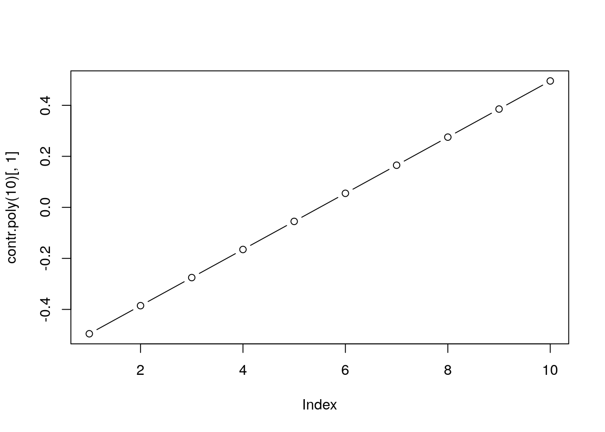
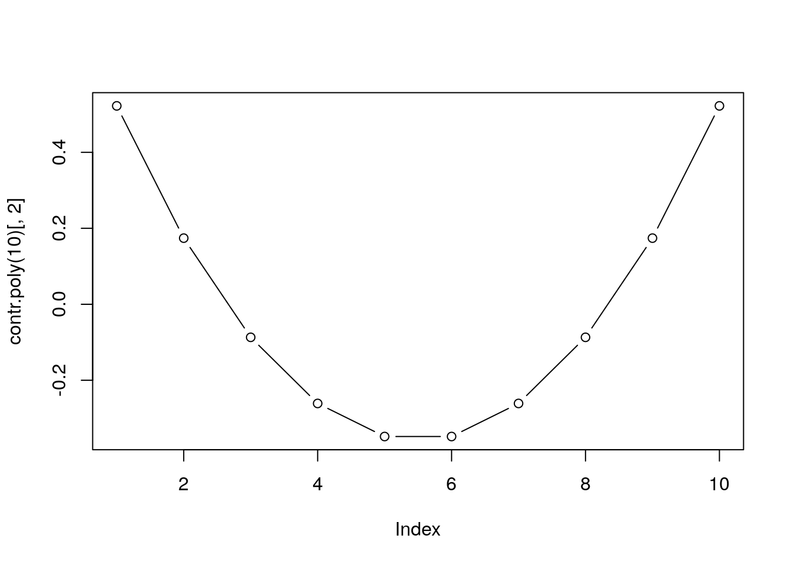
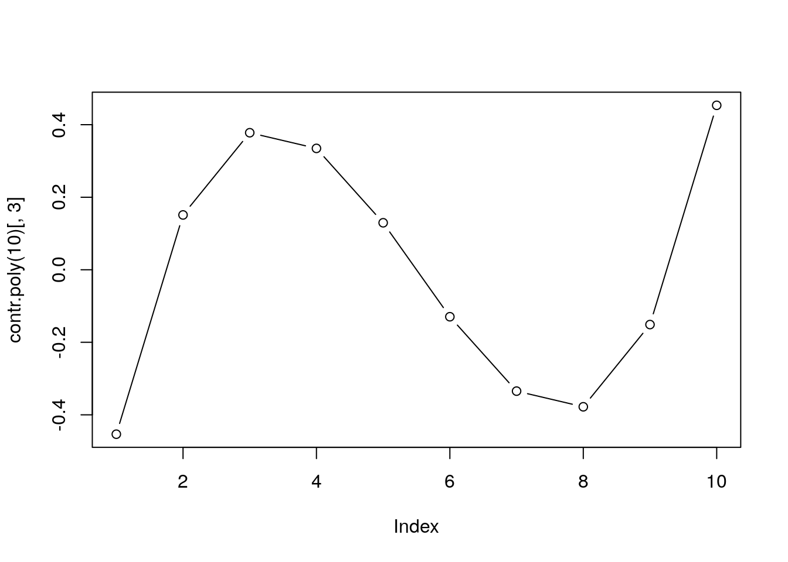
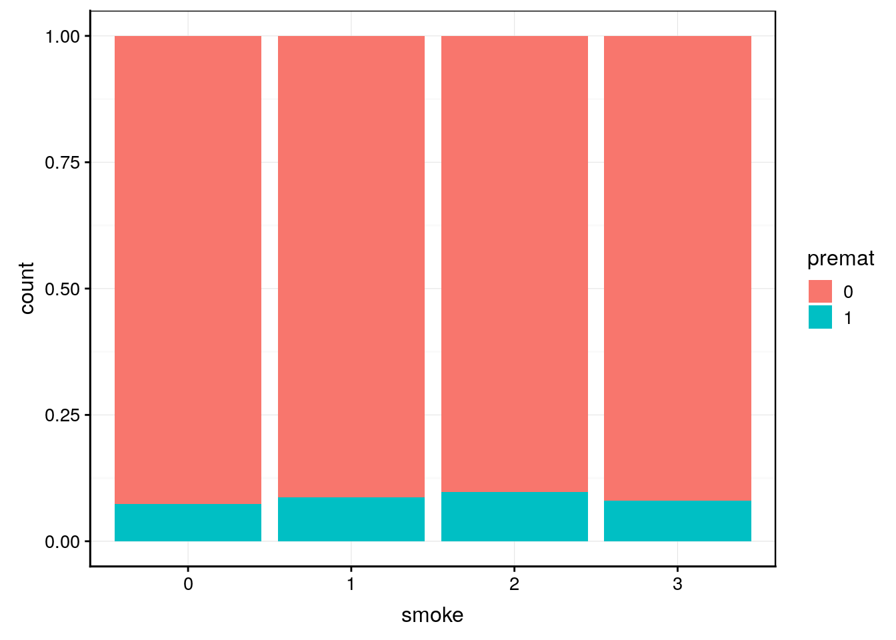
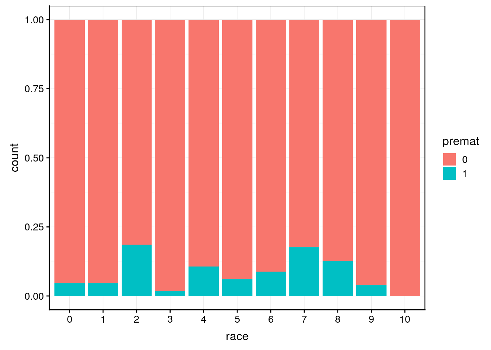
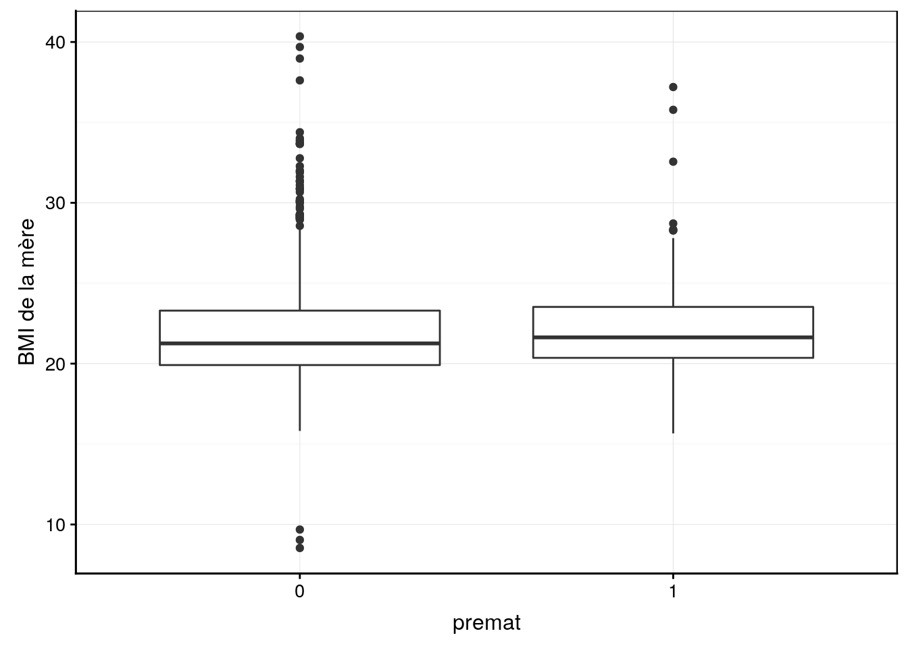
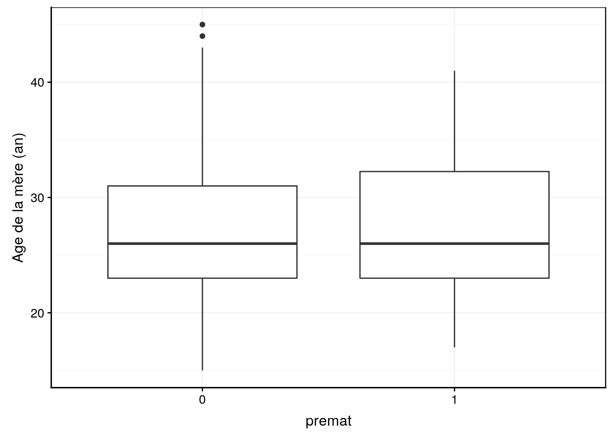

# Modèle linéaire {#mod-lineaire}


##### Objectifs {-}

- Comprendre le modèle linéaire (ANOVA et régression linéaire tout en un)

- Appréhender la logique des matrices de contraste

- Découvrir l'ANCOVA

- Comprendre le mécanisme du modèle linéaire généralisé


##### Prérequis {-}

- L'ANOVA (modules 10 & 11 du cours [SDD 1](http://biodatascience-course.sciviews.org/sdd-umons/)), ainsi que la régression linéaires (modules 1 et 2 du présent cours) doivent être maitrisés avant d'aborder cette matière.


## Variables numériques ou facteurs

L'ANOVA analyse une **variable dépendante numérique** en fonction d'une ou plusieurs **variables indépendantes qualitatives**. Ces variables sont dites "facteurs" non ordonnés (objets de classe `factor`), ou "facteurs" ordonnés (objets de classe `ordered`) dans R. 

La régression linéaire analyse une **variable dépendante numérique** en fonction d'une ou plusieurs **variables indépendantes numérique** (quantitatives) également. Ce sont des objets de classe `numeric` (ou éventuellement `integer`, mais assimilé à `numeric` concrètement) dans R.

Donc, la principale différence entre ANOVA et régression linéaire telles que nous les avnos abordés jusqu'ici réside dans la **nature** de la ou des variables indépendantes, c'est-à-dire, leur type. Pour rappel, il existe deux grandes catégories de variables\ : quantitatives et qualitatives, et deux sous-catégories pour chacune d'elle. Cela donne quatyre types principaux de variables, formant plus de 90% des cas rencontrés\ :

- variables quantitatives continues représentables par des nombres réels (`numeric` dans R),

- variables quantitatives discrètes pour des dénombrements d'événements finis par exemple, et représentables par des nombres entiers (`integer` dans R),

- variables qualitatives ordonnées pour des variables prenant un petit nombre de valeurs, mais pouvant être ordonnées de la plus petite à la plus grande (`ordered` dans R),

- variables qualitatives non ordonnées prenant également un petit nombre de valeurs possibles, mais sans ordre particulier (`factor` dans R).

\BeginKnitrBlock{warning}<div class="warning">
Par la suite, un encodage correct des variables sera *indispensable* afin de distinguer correctement ces différentes situations. En effet, R considèrera automatiquement comment mener l'analyse en fonction de la classe des variables fournies. Donc, si la classe est incorrecte, l'analyse le sera aussi\ ! Si vous avez des doutes concernant les types de variables, relisez la section [type de variables](http://biodatascience-course.sciviews.org/sdd-umons/types-de-variables.html) avant de continuer ici. 
</div>\EndKnitrBlock{warning}


## ANOVA et régression linéaire

Avez-vous remarqué une ressemblance particulière entre la régression linéaire que nous avons réalisé précédement et l'analyse de variance (ANOVA)\ ? Les plus observateurs auront mis en avant que la fonction de base dans R est la même dans les deux cas\ : `lm()`. Cette fonction est donc capable de traiter aussi bien des variables réponses qualitatives que quantitatives, et effectue alors une ANOVA dans un cas ou une régression linéaire dans l'autre.

Par ailleurs, nous avons vu que l’ANOVA et la régression linéaire se représentent par des modèles semblables\ :

- $y  = \mu + \tau_i + \epsilon$ pour l’ANOVA et

- $y = \beta_1 + \beta_2 x + \epsilon$ pour la régression linéaire, avec

- $\epsilon \sim \mathcal{N}(0, \sigma)$ dans les deux cas.

Donc, nous retrouvons bien au niveau du modèle mathématique sous-jacent la différence principale entre les deux qui réside dans le type de variable indépendante (ou explicative)\ :

- Variable **qualitative** pour l’ANOVA,
- Variable **quantitative** pour la régression linéaire.

Le calcul est, en réalité, identique en interne. Il est donc possible de généraliser ces deux approches en une seule appelée **modèle linéaire**, mais à condition d'utiliser une astuce pour modifier nos modèles afin qu'ils soient intercompatibles.


### Modèle linéaire commun

Le nœud du problème revient donc à transformer nos modèles mathématiques pour qu'ils puissent être fusionnés en un seul. Comment homogénéiser ces deux modèles\ ?

- $y = \mu + \tau_i + \epsilon$ pour l’ANOVA et

- $y = \beta_1 + \beta_2 x + \epsilon$ pour la régression linéaire.

Avant de poursuivre, réfléchisser un peu par vous-même. Quelles sont les différences qu'il faut contourner\ ? Est-il possible d'effectuer une ou plusieurs transformations des variables pour qu'elles se comportent de manière similaire dans les deux cas\ ?


### Réencodage des variables de l'ANOVA

Considérons dans un premier temps, un cas très simple\ : une ANOVA à un facteur avec une variable indépendante qualitative (`factor`) à deux niveaux^[Concrètement, un cas aussi simple se traite habituellement à l'aide d'un test *t* de Student, mais pour notre démonstration, nous allons considérer ici utiliser une ANOVA à un facteur plutôt.]. Nous pouvons écrire\ :

$$
y = \mu + \tau_1 I_1 + \tau_2 I_2 + \epsilon
$$

avec $I_i$, une variable dite **indicatrice** créée de toute pièce qui prend la valeur 1 lorsque le niveau
correspond à _i_, et 0 dans tous les autres cas. Vous pouvez vérifier par vous-même que l'équation ci-dessus fonctionnera exactement de la même manière que le modèle utilisé jusqu'ici pour l'ANOVA. En effet, poiur un individu de la population 1, $I_1$ vaut 1 et $\tau_1$ est utilisé, alors que comme $I_2$ vaut 0, $\tau_2$ est annulé dans l'équation car $\tau_2 I_2$ vaut également 0. Et c'est exactement l'inverse qui se produit pour un individu de la population 2, de sorte que c'est $\tau_2$ qui est utilisé cette fois-ci.

Notez que notre nouvelle formulation, à l'aide de variables indicatrices ressemble fortement à la régression linéaire. La seule différence par rapport à cette dernière est que nos variables $I_i$ ne peuvent prendre que des valeurs 0 ou 1 (en tous cas, pour l'instant), alors que les $x_i$ dans la régression linéaire multiple sont des variables quantitatives qui peuvent prendre une infinité de valeurs différentes (nombres réels).

Nouys pouvons encore réécrire notre équation comme suit pour qu'elle se rapproche encore plus de celle de la régression linéaire simple. Passons par l'introduction de deux termes identiques $\tau_1 I_2$ additionné et soustrait, ce qui revient au même qu'en leur absence\ :

$$
y = \mu + \tau_1 I_1 + \tau_1 I_2 - \tau_1 I_2 + \tau_2 I_2 + \epsilon
$$

- En considérant $\beta_2 = \tau_2 - \tau_1$, cela donne\ :

$$
y = \mu + \tau_1 I_1 + \tau_1 I_2 + \beta_2 I_2 + \epsilon
$$

- En considérant $\beta_1 = \mu + \tau_1 = \mu + \tau_1 I_1 + \tau_1 I_2$ (car quelle que soit la population à laquelle notre individu appartient, il n'y a jamais qu'une seule des deux valeurs $I_1$ ou $I_2$ non nulle et dans tous les cas le résultat est donc égal à $\tau_1$), on obtient\ :

$$
y = \beta_1 + \beta_2 I_2 + \epsilon
$$

Cette dernière formulation est strictement équivalente au modèle de la régression linéaire simple dans laquelle la variable $x$ a simplement été remplacée par notre variable indicatrice $I_2$. Ceci se généralise pour une variable indépendante à $k$ niveaux, avec $k - 1$ variables indicatrices au final.

\BeginKnitrBlock{note}<div class="note">
En prenant soin de réencoder le modèle de l'ANOVA relatif aux variables indépendantes qualitatives, nous pouvons à présent mélanger les termes des deux modèles en un seul\ : notre fameux modèle linéaire. Nous aurons donc, quelque chose du genre (avec les $x_i$ correspondant aux variables quantitatives et les $I_j$ des variables indicatrices pour les différents niveaux des variables qualitatives)\ :

$$
y = \beta_1 + \beta_2 x_1 + \beta_3 x_2 + ... + \beta_n I_1 + \beta_{n+1} I_2 ... + \epsilon  
$$
</div>\EndKnitrBlock{note}


## Matrice de contraste

La version que nous avons étudié jusqu'ici pour nos variables indicatrices, à savoir, une seule prend la valeur 1 lorsque toutes les autres prend une valeur zéro, n'est qu'un cas particulier de ce qu'on appelle les **contrastes** appliqués à ces variables indicatrices. En réalité, nous pouvons leurs donner bien d'autres valeurs (on parle de **poids**), et cela permettra de considérer dses contrastes différents, eux-mêmes représentatifs de situations différentes.

Afin de mieux comprendre les contrastes appliqués à nos modèles linéaires, les statisticiens ont inventé les **matrices de contrastes**. Ce sont des tableaux à deux entrées indiquant pour chaque niveau de la variable indépendante qualitative quelles sont les valeurs utilisées pour les différentes variables indicatrices présentées en colonne.

Dans le cas de notre version simplifiée du modèle mathématique où nous avons fait disparaitre $I_1$ en l'assimilant à la moyenne $\mu$ pour obteniur $\beta_1$. Dans le cas où notre variable qualitative a quatre niveaux, nous avons donc le modèle suivant\ :

$$
y = \beta_1 + \beta_2 I_2 + \beta_3 I_3 + \beta_4 I_4 + \epsilon
$$

Cela revient à considérer le premier niveau comme **niveau de référence** et à établir tous les contrastes par rapport à ce niveau de référence. C'est une situation que l'on rencontre fréquemment lorsque nos testons l'effet de différents médicaments ou de différents traitement par rapport à un **contrôle** (pas de traitement, ou placébo). La matrice de contrastes correspondante, dans un cas où on aurait trois traitements en plus du contrôle (donc, notre variable `factor` à quatre niveaux) s'obteint facilement dans R à l'aide de la fonction `contr.treatment()`\ :


```r
contr.treatment(4)
```

```
#   2 3 4
# 1 0 0 0
# 2 1 0 0
# 3 0 1 0
# 4 0 0 1
```

Les lignes de cette matrice sobnt numérotées de 1 à 4. Elles correspondent aux quatres niveaux de notre variable `factor`, avec **le niveau 1 qui doit nécessairement correspondre à la situation de référtence, donc au contrôle**.

Les colonnes de cette matrice correspondent aux trois variables indicatrices $I_1$, $I_2$ et $I_3$ de l'équation au dessus. Nous voyons que pour une individu contrôle, de niveau 1, les trois $I_i$ prennent la valeur 0. Nous sommes bien dans la situation de référence. En d'autres terme, le modèle de base est ajusté sur la moyenne des individus contrôle. Notre modèle se réduit à\ : $y = \beta_1 + \epsilon$. Donc, seule la moyenne des individus contrôles, $\beta_1$ est considérée, en plus des résidus $\epsilon$ bien sûr.

Pour le niveau deux, nous observons que $I_2$ vaut 1 et les deux autres $I_i$ valent 0. Donc, cela revient à considérer un décalage constant $\beta_2$ appliqué par rapport au modèle de référence matérialisé par $\beta_1$. En effezt, notre équation se réduit dans ce cas à\ : $y = \beta_1 + \beta_2 + \epsilon$.

Le même raisonnement peut être fait pour les niveaux 3 et 4, avec des décalages constants par rapport à la situation cxontrôle de respectivement $\beta_3$ et $\beta_4$.

En d'autres termes, les contrastes qui sont construits ici *font tous référence au contrôle*, et chaque médicament est explicitement comparté au contrôle (mais les médicaments ne sont pas comparés entre eux). Nous voyons donc que les variables indicatrices etr la matrice de contrastes permet de spécifier quelles sont les contrastes pertinents et éliminent ceux qui ne le sont pas (nous n'utilisons donc pas systématiquement toutes les comparaisons deux à deux des différents niveaux^[Attention\ : le fait d'utiliser une matrtice de contraste qui restreint ceux utilisés dans le modèle est indépendant des tests *post hoc* de comparaisons multiples, qui restent utilisables par après. Les comparaisons deux à deux des médicaments restent donc accessibles, mais ils ne sont tout simplement pas mis en évidence dans le modèle de base.]).


### Contraste orthogonaux

Les contrastes doivent être de préférence **orthogonaux par rapport à l’ordonnée à l’origine**, ce qui signifie que la somme de leurs pondérations doit être nulle pour tous les contrastes définis (*donc, en colonnes*). Bien que n'étant pas obligatoire, cela confère des propriétés intéressantes au modèle (l'explication et la démonstration sortent du cadre de ce cours). Or, les contrastes de type traitement ne sont *pas* orthogonaux puisque toutes les sommes par colonnes vaut un.


### Autres matrices de contrastes courantes

- Somme à zéro. Ces constraste, toujours pour une variable à quatre niveaux, se définissen t comme suit en utilisant la fonction `contr.sum()` dans R\ :


```r
contr.sum(4)
```

```
#   [,1] [,2] [,3]
# 1    1    0    0
# 2    0    1    0
# 3    0    0    1
# 4   -1   -1   -1
```

Ici nous avons bien des contrastes orthogonaux puisque toutes les sommes par colonnes valeur zéro. Dans le cas présent, aucun niveau n'est considéré comme référence, mais les *n* - 1 niveaux sont systématiquement **contrastés** avec le dernier et *n*îème^ niveau. Ainsi, un contraste entre deux niveaux particuliers peut s'élaborer en indiquant une pondération de 1 pour le premier niveau à comparer, une pondération de -1 pour le second à comparer et une pondération de 0 pour tous les autres.

- Matrice de contrastes de Helmert\ : chaque niveau est comparé à la
moyenne des niveaux précédents. La matrice de constrastes correspondant pour une variable à quatre niveaux s'obtient à l'aide de la fonction R `contr.helmert()`\ :


```r
contr.helmert(4)
```

```
#   [,1] [,2] [,3]
# 1   -1   -1   -1
# 2    1   -1   -1
# 3    0    2   -1
# 4    0    0    3
```

Cette matrice est également orthogonale avec toutes les sommes par colonnes qui valent zéro. Ici, nous découvrons qu'il est possible de créer un contrastye entre un niveau et la moyenne de plusieurs autres niveaux en mettant le poids du premier à m (le nombre de populations à comparer de l'autre côté du contraste), et les poids des autres populations tous à -1. Ainsi, la colonne 4 compare le niveau quatre avec pondération 3 aux trois autres niveaux qui reçoivent tous une pondération -1.

- Matrice de contrastes polynomiaux\ : adapté aux facteurs ordonnés (`ordered` dans R) pourvlesquels on s’attend à une certaine évolution du modèle du niveau le
plus petit au plus grand. Donc ici aussi une comparaison deux à deux de tous les niveaux n'est pas souhaitable, mais une progression d'un effet qui se propage de manière graduelle du plus petit niveau au plus grand. *A priori* cela parait difficile à métérialiser dans une matrice de contraste... et pourtant, c'est parfaitement possible\ ! Il s'agit de constrastes polynomiaux où nous ajustons de polynomes de degré croissant comme pondération des différents contrastes étudiés. La fonction `contr.poly()` permet d'obtenir ce type de contraste dans R. Pour une variable ordonnée à quatre niveaux, cela donne\ :


```r
contr.poly(4)
```

```
#              .L   .Q         .C
# [1,] -0.6708204  0.5 -0.2236068
# [2,] -0.2236068 -0.5  0.6708204
# [3,]  0.2236068 -0.5 -0.6708204
# [4,]  0.6708204  0.5  0.2236068
```

Ici, les pondérations sont plus difficiles à expliquer rien qu'en observant la matrice de contrastes. De plus, les colonnes portent ici des noms particuliers `.L` pour un contraste linéaire (polynome d'ordre 1), `.Q` pour un contraste quadratique (polynome d'ordre 2), et `.C` pour un contraste conique (ou polynome d'ordre 3). Les pondérations appliquées se comprennent mieux lorsqu'on augmente le nombre de niveaux etr que l'on représente graphiquement la valeur des pondérations choisées. Par exemple, pour une variable facteur ordonnée à dix niveaux, nous représentrons graphiquement les 3 premeirs contrastes (linéaire, quadratique et conique) comme suit\ :


```r
plot(contr.poly(10)[, 1], type = "b")
```



```r
plot(contr.poly(10)[, 2], type = "b")
```



```r
plot(contr.poly(10)[, 3], type = "b")
```



Sur le graphique, l'axe X nommé `index` correspiond en réalité à la succession des 10 niveaux de la variable présentés dans l'ordre du plus petit au plus grand. Nous voyons maintenant clairement comment les contrastes sont construits ici. Pour le conbtraste linéaire, on contraste les petits niveaux avec les grands, et ce, de manière proportionnelle par rapport à la progression d'un niveau à l'autre (polynome d'ordre un = droite). Pour le contraste quadratique, on place "dans le même sac" les petits et greand niveaux qui sont contrastés avec les niveaux moyens (nous avons une parabole ou polynome d'ordre 2). Pour le troisième graphique, la situation se complexifie en encore un peu plus avec un polynome d'ordre 3, et ainsi de suite pour des polynomes d'ordres croissants jusqu'à remplir complètement la matrice de contrastes. 

\BeginKnitrBlock{note}<div class="note">
R utilise par défaut des **contrastes de traitement pour les facteurs non ordonnés** et des **contrastes polynomiaux pour des facteurs ordonnés**. Ces valeurs par défaut sont stockées dans l'option `contrasts` que l'on peut lire à l'aide de `getOption()`.

Bien  sûr, il est possible de changer ces contrastes, tant au niveau global qu'au niveau de la construction d'un modèle en particulier.
</div>\EndKnitrBlock{note}


```r
getOption("contrasts")
```

```
#         unordered           ordered 
# "contr.treatment"      "contr.poly"
```


## ANCOVA

Avant l'apparition du modèle linéaire, une version particulière d'un mélange de régression linéaire et d'une ANOVA avec une variable indépendante quantitative et une autre variable indépendante qualitative s'appelait une ANCOVA (ANalyse de la COVariance). Un tel modèle d'ANCOVA peut naturellement également se résoudre à l'aide de la fonction `lm()` qui, en outre, peut faire bien plus. Nous allons maintenant ajuster un tel modèle à titre de première application concrète de tout ce que nous venons de voir sur le modèle linéaire et sur les matrices de contrastes associées.


### Bébés à la naissance

Nous étudions la masse de nouveaux nés en fonction du poids de la mère et du fait qu’elle fume ou non. Cette analyse s'inspire de @verzani2005. Nous avons donc ici une variable dépendante `wt`, la masse des bébés qui est quantitative, et deux variables indépendantes ou prédictives `wt1`, la masse de la mère, et `smoke` le fait que la mère fume ou non. Or la première de ces variables explicatives est quantitative (`wt1`)  et l'autre (`smoke`) est une variable facteur à quatre niveaux (0 = la mère n'a jamais fumé, 1 = elle fume y compris pendant la grossesse, 2 = elle fumait mais a arrêté à la grossesses, et 3 = la mère a fumé, mais a arrêté, et ce, bien avant la grossesse. Un dernier niveau 9 = inconnu encode de manière non orthodoxe les valeurs manquantes dans notre tableau de données (valeurs que nous éliminerons). De même les masses des nouveaux nés et des mères sont des des unités impériales (américaines) respectivement en "onces" et en "livres". Enfin, nous devons prendre soin de bien encoder la variable `smoke` comme une variable `factor` (ici nous ne considèrerons pas qu'il s'agit d'un facteur ordonné et nous voulons faire un contraste de type traitement avec comparaison à des mères qui n'ont jamais fumé). **Un reminement soigneux des données est donc nécessaire avant de pouvoir appliquer notre modèle\ !**


```r
SciViews::R
babies <- read("babies", package = "UsingR")
knitr::kable(head(babies))
```


  id   pluralty   outcome   date   gestation   sex    wt   parity   race   age   ed   ht   wt1   drace   dage   ded   dht   dwt   marital   inc   smoke   time   number
----  ---------  --------  -----  ----------  ----  ----  -------  -----  ----  ---  ---  ----  ------  -----  ----  ----  ----  --------  ----  ------  -----  -------
  15          5         1   1411         284     1   120        1      8    27    5   62   100       8     31     5    65   110         1     1       0      0        0
  20          5         1   1499         282     1   113        2      0    33    5   64   135       0     38     5    70   148         1     4       0      0        0
  58          5         1   1576         279     1   128        1      0    28    2   64   115       5     32     1    99   999         1     2       1      1        1
  61          5         1   1504         999     1   123        2      0    36    5   69   190       3     43     4    68   197         1     8       3      5        5
  72          5         1   1425         282     1   108        1      0    23    5   67   125       0     24     5    99   999         1     1       1      1        5
 100          5         1   1673         286     1   136        4      0    25    2   62    93       3     28     2    64   130         1     4       2      2        2

Ce tableau est "brut de décoffrage". Voyez `help("babies", package = "UsingR")` pour de plus amples informations. Nous allons maintenant remanier tout cela correctement.


```r
# wt = masse du bébé à la naissance en onces et 999 = valeur manquante
# wt1 = masse de la mère à la naissance en livres et 999 = valeur manquante
# smoke = 0 (non), = 1 (oui), = 2 (jusqu'à grossesse),
#       = 3 (plus depuis un certain temps) and = 9 (inconnu)
babies %>.% select(., wt, wt1, smoke) %>.% # Garder seulement wt, wt1 & smoke
  filter(., wt1 < 999, wt < 999, smoke < 9) %>.% # Eliminer les valeurs manquantes
  mutate(., wt = wt * 0.02835) %>.% # Transformer le poids en kg
  mutate(., wt1 = wt1 * 0.4536) %>.% # Idem
  mutate(., smoke = as.factor(smoke)) -> # S'assurer d'avoir une variable factor
  Babies # Enregistrer le résultat dans Babies

knitr::kable(head(Babies))
```

      wt       wt1  smoke 
--------  --------  ------
 3.40200   45.3600  0     
 3.20355   61.2360  0     
 3.62880   52.1640  1     
 3.48705   86.1840  3     
 3.06180   56.7000  1     
 3.85560   42.1848  2     

Description des données\ :


```r
skimr::skim(Babies)
```

```
# Skim summary statistics
#  n obs: 1190 
#  n variables: 3 
# 
# ── Variable type:factor ──────────────────────────────────────────────────────────────────────────────────────────────────────────────────────────
#  variable missing complete    n n_unique                    top_counts
#     smoke       0     1190 1190        4 0: 531, 1: 465, 3: 102, 2: 92
#  ordered
#    FALSE
# 
# ── Variable type:numeric ─────────────────────────────────────────────────────────────────────────────────────────────────────────────────────────
#  variable missing complete    n  mean   sd    p0   p25  p50   p75   p100
#        wt       0     1190 1190  3.39 0.52  1.56  3.06  3.4  3.71   4.99
#       wt1       0     1190 1190 58.3  9.49 39.46 51.82 56.7 62.6  113.4 
#      hist
#  ▁▁▂▆▇▅▁▁
#  ▂▇▆▂▁▁▁▁
```


```r
chart(data = Babies, wt ~ wt1 %col=% smoke) +
  geom_point() +
  xlab("Masse de la mère [kg]") +
  ylab("Masse du bébé [kg]")
```


```r
chart(data = Babies, wt ~ smoke) +
  geom_boxplot() +
  ylab("Masse du bébé [kg]")
```


```r
chart(data = Babies, wt1 ~ smoke) +
  geom_boxplot() +
  ylab("Masse de la mère [kg]")
```


Visuellement, nous ne voyons pas d'effet marquant. Peut-être la condition 1 de `smoke` (mère qui fume pendant la grossesse) mène-t-il à des bébés moins gros, mais est-ce significatif\ ? Pour cela, ajustons notre modèle ANCOVA avec matrice traitement (choix par défaut pour une la variable `factor` `smoke`). Comme nous savons déjà utiliser `lm()`, c'est très simple. Cela fonctionne exactement comme avant^[Pour rappel, on utilise le signe `+` pour indiquer un modèle sans interactions et un signe `*`pour spécifier un modèle complet avec interactions entre les variables.].


```r
# ANCOVA
Babies_lm <- lm(data = Babies, wt ~ smoke * wt1)
summary(Babies_lm)
```

```
# 
# Call:
# lm(formula = wt ~ smoke * wt1, data = Babies)
# 
# Residuals:
#     Min      1Q  Median      3Q     Max 
# -1.9568 -0.3105  0.0133  0.3136  1.4989 
# 
# Coefficients:
#              Estimate Std. Error t value Pr(>|t|)    
# (Intercept)  3.000663   0.128333  23.382  < 2e-16 ***
# smoke1      -0.303614   0.196930  -1.542 0.123405    
# smoke2       0.901888   0.371393   2.428 0.015314 *  
# smoke3      -0.035502   0.371379  -0.096 0.923858    
# wt1          0.008117   0.002149   3.777 0.000167 ***
# smoke1:wt1   0.001153   0.003346   0.345 0.730444    
# smoke2:wt1  -0.015340   0.006390  -2.401 0.016523 *  
# smoke3:wt1   0.001177   0.006147   0.191 0.848258    
# ---
# Signif. codes:  0 '***' 0.001 '**' 0.01 '*' 0.05 '.' 0.1 ' ' 1
# 
# Residual standard error: 0.4992 on 1182 degrees of freedom
# Multiple R-squared:  0.08248,	Adjusted R-squared:  0.07705 
# F-statistic: 15.18 on 7 and 1182 DF,  p-value: < 2.2e-16
```

```r
anova(Babies_lm)
```

```
# Analysis of Variance Table
# 
# Response: wt
#             Df  Sum Sq Mean Sq F value    Pr(>F)    
# smoke        3  18.659  6.2197 24.9636 1.158e-15 ***
# wt1          1   6.162  6.1621 24.7325 7.559e-07 ***
# smoke:wt1    3   1.653  0.5511  2.2117   0.08507 .  
# Residuals 1182 294.497  0.2492                      
# ---
# Signif. codes:  0 '***' 0.001 '**' 0.01 '*' 0.05 '.' 0.1 ' ' 1
```

L'analyse de variance montre que la masse de la mère a un effet significatif au seuil alpha de 5%, de même si la mère fume. Par contre, il n'y a pas d'**interactions** entre les deux. Le fait de pouvoir meurer des interactions entre variables qualitatives et quantitatives est ici bien évidemment un plus du modèle linéaire par rapport à ce qu'on pouvait faire avant\ !

Le résumé de l'analyse nous montre que la régression de la masse des bébés en fonction de la masse de la mère (ligne `wt1` dans le tableau des coefficients), bien qu'étant significative, n'explique que 8% de la variance totale (le $R^2$). Les termes `smoke1`, `smoke2` et `smoke3` sont les contrastes appliqués par rapport au contrôle (`smoke == 0`). On voit ici qu'aucun de ces contrastes n'est significatif au seuil alpha de 5%. Cela signifie que le seul effet significatif est celui lié à une ordonnée à l'origine non nulle `(Intercept)` matérialisant la condition `smoke == 0`. Cela signifie que des mères de masse nulle n'ayant jamais fumé engendreraient des bébés pesant environ 3kg. Dans le contexte présent, cette constatation n'a bien sûr aucun sens, et l'interprétation  de l'ordonnée à l'origine ne doit pas être faite. Donc, le modèle linéaire, en offrant plus de contrôle dans notre ajustement et une définition de contrastes "utiles" matérialisés par les lignes `smoke1`, `smoke2` et `smoke3` du tableau nous permet de faire des tests plus utiles dans le contexte de notre analyse.

N'oublions pas non plus la possibilité de déterminer si des interactions entre `smoke` et `wt1` existent pour ces différents contrastes, interactions testées respectivements aux lignes `smoke1:wt1`, `smoke2:wt1`, et `smoke3:wt1`du tableau des coefficients. Dans le cas présent, aucune de ces interactions n'est siginificative au seuil alpha de 5%.

Pour comprendre à quoi tout cela fait référence, il faut considérer le modèle de base comme une droite de régression ajustée entre `wt` et `wt1` pour la population de référence `smoke == 0`. Ainsi, si nous faisons\ :


```r
summary(lm(data = Babies, wt ~ wt1, subset = smoke == 0))
```

```
# 
# Call:
# lm(formula = wt ~ wt1, data = Babies, subset = smoke == 0)
# 
# Residuals:
#      Min       1Q   Median       3Q      Max 
# -1.95685 -0.25825  0.01476  0.25464  1.49890 
# 
# Coefficients:
#             Estimate Std. Error t value Pr(>|t|)    
# (Intercept) 3.000663   0.123572  24.283  < 2e-16 ***
# wt1         0.008117   0.002069   3.922 9.92e-05 ***
# ---
# Signif. codes:  0 '***' 0.001 '**' 0.01 '*' 0.05 '.' 0.1 ' ' 1
# 
# Residual standard error: 0.4806 on 529 degrees of freedom
# Multiple R-squared:  0.02826,	Adjusted R-squared:  0.02642 
# F-statistic: 15.38 on 1 and 529 DF,  p-value: 9.924e-05
```

Nous voyons en effet que les pentes et ordonnées à l'origine sont ici parfaitement identiques au modèle ANCOVA complet (mais pas les tests associés).

Maintenant plus difficile\ : à quoi correspond une régression entre `wt` et `wt1` pour `smoke == 1`\ ?


```r
summary(lm(data = Babies, wt ~ wt1, subset = smoke == 1))
```

```
# 
# Call:
# lm(formula = wt ~ wt1, data = Babies, subset = smoke == 1)
# 
# Residuals:
#      Min       1Q   Median       3Q      Max 
# -1.70870 -0.35089  0.01034  0.33576  1.39420 
# 
# Coefficients:
#             Estimate Std. Error t value Pr(>|t|)    
# (Intercept) 2.697048   0.153270  17.597  < 2e-16 ***
# wt1         0.009270   0.002632   3.522 0.000471 ***
# ---
# Signif. codes:  0 '***' 0.001 '**' 0.01 '*' 0.05 '.' 0.1 ' ' 1
# 
# Residual standard error: 0.5122 on 463 degrees of freedom
# Multiple R-squared:  0.02609,	Adjusted R-squared:  0.02399 
# F-statistic:  12.4 on 1 and 463 DF,  p-value: 0.0004711
```

Nous avons une ordonnées à l'origine qui vaut 2,70 ici. Notons que cela correspond aussi à `(Intercept)` + `smoke1` = 3,00 - 0,30 = 2,70. Donc, l'ordonnées à l'origine pour `smoke == 1` est bien la valeur de référence additionnée de la valeur fournie à la ligne `smoke1` dans l'ANCOVA. Cela se vérifie aussi pour les deux autres droites pour `smoke2` et `smoke3`.

Maintenant, la pente pour notre droite ajustée sur la population `smoke == 1` uniquement vaut 0,00927. Dans l'ANCOVA, nous avions une pente `wt1` de 0,00812 et une interaction `smoke1:wt1` claculée comme 0,00115. Notez alors que la pente de la droite seule 0,00927 = 0,00812 + 0,00115. Donc, tout comme `smoke1` correspond au décalage de l'ordonnée à l'origine du modèle de référence, les interactions `smoke1:wt1` correspondent au décalage de la pente par rapport au modèle de référence. Cela se vérifie également pour `smoke2:wt1` et `smoke3:wt1`.

Donc, notre modèle complet ne fait rien d'autre que d'ajuster les quatre droites correspondant aux relations linéaires entre `wt` et `wt1`, **mais en décompose les effets, niveau par niveau de la variable qualitative `smoke`** en fonction de la matrice de contraste que l'on a choisie. En bonnus, nous avons la possibilité de tester si chacune des composantes (tableau coefficient de `summary()`) ou si globalement chacune des variables (tableau obtenu avec `anova()`) a un effet significatif ou non dans le modèle.

Le graphique correspondant est le même que si nous avions ajusté les 4 régressions linéaires indépendamment l'une de l'autre (mais les tests et les enveloppes de confiance diffèrent).


```r
chart(data = Babies, wt ~ wt1 %col=% smoke) +
  geom_point() +
  stat_smooth(method = "lm", formula = y ~ x) +
  xlab("Masse de la mère [kg]") +
  ylab("Masse du bébé [kg]")
```


```r
chart(data = Babies, wt ~ wt1 | smoke) +
  geom_point() +
  stat_smooth(method = "lm", formula = y ~ x) +
  xlab("Masse de la mère [kg]") +
  ylab("Masse du bébé [kg]")
```


Comme toujours, lorsqu'un effet n'est pas siugnificatif, nous pouvons décider de *simplifier* le modèle. **Mais attention\ ! Toujours considérer que les composantes sont interdépendantes.** Donc, éliminer une composante du modèle peut avoir des effets parfois surprenants sur les autres.

Voyons ce que cela donne si nous éliminons les interactions. Dans ce cas, nous ajustons des droites toutes parallèles avec uniquement un décalage de leur ordonnée à l'origine matérialisé par `smoke1`, `smoke2` et `smoke3` par rapport au modèle de référence ajusté pour la population `smoke == 0` (notez l'utilisation, du signe `+` dans la formuile, là où nous utilisions le signe `*` dans la modèle précédent).


```r
# ANCOVA
Babies_lm2 <- lm(data = Babies, wt ~ smoke + wt1)
summary(Babies_lm2)
```

```
# 
# Call:
# lm(formula = wt ~ smoke + wt1, data = Babies)
# 
# Residuals:
#      Min       1Q   Median       3Q      Max 
# -1.95453 -0.30780  0.01289  0.31108  1.49443 
# 
# Coefficients:
#              Estimate Std. Error t value Pr(>|t|)    
# (Intercept)  3.030052   0.092861  32.630  < 2e-16 ***
# smoke1      -0.237938   0.031816  -7.478 1.46e-13 ***
# smoke2       0.022666   0.056508   0.401    0.688    
# smoke3       0.035486   0.054068   0.656    0.512    
# wt1          0.007617   0.001534   4.966 7.85e-07 ***
# ---
# Signif. codes:  0 '***' 0.001 '**' 0.01 '*' 0.05 '.' 0.1 ' ' 1
# 
# Residual standard error: 0.4999 on 1185 degrees of freedom
# Multiple R-squared:  0.07733,	Adjusted R-squared:  0.07422 
# F-statistic: 24.83 on 4 and 1185 DF,  p-value: < 2.2e-16
```

```r
anova(Babies_lm2)
```

```
# Analysis of Variance Table
# 
# Response: wt
#             Df  Sum Sq Mean Sq F value    Pr(>F)    
# smoke        3  18.659  6.2197  24.887 1.285e-15 ***
# wt1          1   6.162  6.1621  24.657 7.853e-07 ***
# Residuals 1185 296.150  0.2499                      
# ---
# Signif. codes:  0 '***' 0.001 '**' 0.01 '*' 0.05 '.' 0.1 ' ' 1
```

Hé, ça c'est intéressant\ ! Maintenant que nous avons éliminé les interactions qui apparaissent non pertinentes ici, nous avons toujours une régression significative entre `wt` et `wt1` (mais avec un $R^2$  très faible de 7,7%, attention), mais maintenant, nous faisons apparaitre un effet signicfication du contraste avec `smoke1` au seuil alpha de 5%. Et du coup, les effets des deux variables deviennent plus clairs dans notre tableau de l'ANOVA. 

Le graphique correspondant est l'ajustement de droites parallèles les unes aux autres pour les 4 sous-populations en fonction de `smoke`. Ce graphique est difficile à réaliser. Il faut ruser, et les détails du code vont au delà de ce cours (il n'est pas nécessaire de les comprendre à ce stade).


```r
cols <- iterators::iter(scales::hue_pal()(4)) # Get colors for lines
chart(data = Babies, wt ~ wt1) +
  geom_point(aes(col = smoke)) +
  lapply(c(0, -0.238, 0.0227, 0.0355), function(offset)
    geom_smooth(method = lm, formula = y + offset ~ x,
      col = iterators::nextElem(cols))) +
  xlab("Masse de la mère [kg]") +
  ylab("Masse du bébé [kg]")
```


Voyons ce que donne l'analyse *post hoc* des comparaisons multiples (nous utilisons ici simplement le snippet disponible à partir de `...` -> `hypothesis tests` -> `hypothesis tests: means` -> `hmanovamult : anova - multiple comparaisons [multcomp]`) que nous avons déjà employé et qui reste valable ici.


```r
summary(anovaComp. <- confint(multcomp::glht(Babies_lm2,
  linfct = multcomp::mcp(smoke = "Tukey"))))
```

```
# 
# 	 Simultaneous Tests for General Linear Hypotheses
# 
# Multiple Comparisons of Means: Tukey Contrasts
# 
# 
# Fit: lm(formula = wt ~ smoke + wt1, data = Babies)
# 
# Linear Hypotheses:
#            Estimate Std. Error t value Pr(>|t|)    
# 1 - 0 == 0 -0.23794    0.03182  -7.478   <1e-05 ***
# 2 - 0 == 0  0.02267    0.05651   0.401    0.977    
# 3 - 0 == 0  0.03549    0.05407   0.656    0.908    
# 2 - 1 == 0  0.26060    0.05704   4.568    3e-05 ***
# 3 - 1 == 0  0.27342    0.05478   4.991   <1e-05 ***
# 3 - 2 == 0  0.01282    0.07199   0.178    0.998    
# ---
# Signif. codes:  0 '***' 0.001 '**' 0.01 '*' 0.05 '.' 0.1 ' ' 1
# (Adjusted p values reported -- single-step method)
```

```r
.oma <- par(oma = c(0, 5.1, 0, 0)); plot(anovaComp.); par(.oma); rm(.oma)
```


Ici, comme nous testons tous les contrastes, nous pouvons dire que la population des mères qui ont fumé pendant la grossesse `smoke == 1` donne des bébés significativement moins gros au seuil alpha de 5%, et ce, en comparaison de tous les autres niveaux (mère n'ayant jamais fumé, ou ayant fumé mais arrêté avant la grossesse, que ce soit longtemps avant ou juste avant).

Il semble évident maintenant qu'il n'est pas utile de préciser si la mère a fumé ou non avant sa grossesse. L'élément déterminant est uniquement le fait de fumer *pendant* la grossesse ou non. Nous pouvons le montrer également en utilisant des contrastes de Helmert, à condition de recoder `smoke` avec des niveaux de "gravité" croissants ("0" = n'a jamais fumé, "1" = a arrêté il y a longtemps, "2" = a arrêté juste avant la grossesse et finalement, "1" = a continué à fumé à la grossesse). Il faut donc intervertir les cas "1" et "3". Nous pouvons utiliser `recode()` pour cela, mais attention, nous avons ici une variable `factor`, donc, ce ne sont pas des nombres mais des chaines de caractères (à placer entre guillements). Une fois le recodage réalisé, il faut aussi retrier les niveaux en appelant `factor(..., levels = c("0", "1", "2", "3"))` sinon l'ancien ordre est conservé.


```r
Babies %>.%
  mutate(., smoke = recode(smoke, "0" = "0", "1" = "3", "2" = "2", "3" = "1")) %>.%
  mutate(., smoke = factor(smoke, levels = c("0", "1", "2", "3"))) ->
  Babies2
```

Si cela semble trop compliqué, vous pouvez aussi utiliser l'addins de réencodage dans R (`QUESTIONR` -> `Levels Recoding` or `Levels Ordering`). A présent que l'encodage de `smoke` est corrigé dans `Babies2`, nous pouvons modéliser à nouveau, mais cette fois-ci avec des contrastes de Helmert (notez la façon particulière de spécifier des contrastes différents de la valeur pas défaut pour une variable `factor`)\ :


```r
Babies_lm3 <- lm(data = Babies2, wt ~ smoke + wt1,
  contrasts = list(smoke = "contr.helmert"))
summary(Babies_lm3)
```

```
# 
# Call:
# lm(formula = wt ~ smoke + wt1, data = Babies2, contrasts = list(smoke = "contr.helmert"))
# 
# Residuals:
#      Min       1Q   Median       3Q      Max 
# -1.95453 -0.30780  0.01289  0.31108  1.49443 
# 
# Coefficients:
#              Estimate Std. Error t value Pr(>|t|)    
# (Intercept)  2.985106   0.091695  32.555  < 2e-16 ***
# smoke1       0.017743   0.027034   0.656    0.512    
# smoke2       0.001641   0.019599   0.084    0.933    
# smoke3      -0.064330   0.008540  -7.533 9.82e-14 ***
# wt1          0.007617   0.001534   4.966 7.85e-07 ***
# ---
# Signif. codes:  0 '***' 0.001 '**' 0.01 '*' 0.05 '.' 0.1 ' ' 1
# 
# Residual standard error: 0.4999 on 1185 degrees of freedom
# Multiple R-squared:  0.07733,	Adjusted R-squared:  0.07422 
# F-statistic: 24.83 on 4 and 1185 DF,  p-value: < 2.2e-16
```

```r
anova(Babies_lm3)
```

```
# Analysis of Variance Table
# 
# Response: wt
#             Df  Sum Sq Mean Sq F value    Pr(>F)    
# smoke        3  18.659  6.2197  24.887 1.285e-15 ***
# wt1          1   6.162  6.1621  24.657 7.853e-07 ***
# Residuals 1185 296.150  0.2499                      
# ---
# Signif. codes:  0 '***' 0.001 '**' 0.01 '*' 0.05 '.' 0.1 ' ' 1
```

Ici les valeurs estimées pour `smoke1-3` sont à interpréter en fonction des contrastes utilisés, soit\ :


```r
contr.helmert(4)
```

```
#   [,1] [,2] [,3]
# 1   -1   -1   -1
# 2    1   -1   -1
# 3    0    2   -1
# 4    0    0    3
```


- `smoke1` est le décalage de l'ordonnée à l'origine entre la modèle moyen établi avec les données `smoke == 0` et `smoke == 1` et celui pour `smoke == 1` (non significatif au seuil alpha de 5%),
- `smoke2` est le décalage de l'ordonnée à l'origine pour `smoke == 2` _par rapport au modèle ajusté sur `smoke == 0`, `smoke == 1` **et** `smoke == 2` avec des pondérations respectives de -1, -1, et 2_ (non significatif au seuil alpha de 5%),
- `smoke3` est le décalage de l'ordonnée à l'origine par rapport au modèle ajusté sur l'ensemble des autres observations, donc, avec `smoke` valant 0, 1, ou 2, et des pondérations respectives comme dans la dernière colonne de la matrice de contraste.. Donc, ce dernier contraste est celui qui nous intéresse car il compare les cas où la mère n'a pas fumé pendant la grossesse avec le cas `smoke == 3` où la mère a fumé pendant la grossesse, et il est significatif au seuil alpha de 5%. L'interprétation des vlauers estimées est plus complexe ici. Comparer ce résultat avec le modèle ajusté avec les contrastes traitement par défaut avec `smoke` réencodé\ :


```r
summary(lm(data = Babies2, wt ~ smoke + wt1))
```

```
# 
# Call:
# lm(formula = wt ~ smoke + wt1, data = Babies2)
# 
# Residuals:
#      Min       1Q   Median       3Q      Max 
# -1.95453 -0.30780  0.01289  0.31108  1.49443 
# 
# Coefficients:
#              Estimate Std. Error t value Pr(>|t|)    
# (Intercept)  3.030052   0.092861  32.630  < 2e-16 ***
# smoke1       0.035486   0.054068   0.656    0.512    
# smoke2       0.022666   0.056508   0.401    0.688    
# smoke3      -0.237938   0.031816  -7.478 1.46e-13 ***
# wt1          0.007617   0.001534   4.966 7.85e-07 ***
# ---
# Signif. codes:  0 '***' 0.001 '**' 0.01 '*' 0.05 '.' 0.1 ' ' 1
# 
# Residual standard error: 0.4999 on 1185 degrees of freedom
# Multiple R-squared:  0.07733,	Adjusted R-squared:  0.07422 
# F-statistic: 24.83 on 4 and 1185 DF,  p-value: < 2.2e-16
```

Les conclusions sont les mêmes, mais la valeurs estimées pour `smoke1`, `smoke2` et `smoke3` diffèrent. Par exemple, dans ce dernier cas, `smoke1` est double de la valeur avec les contrastes Helmert, ce qui est logique puisque la référence est ici la droite ajustée pour la sous-population `smoke == 0` là où dans le modèle avec les contrastes de Helmert, le décalage est mesuré par rapport au modèle moyen (donc à "mi-chemin" entre les deux droites pour `smoke == 0` et `smoke == 1`).

Naturellement, nous pouvons aussi considérer la variable `smoke` réencodée dans `Babies2` comme une variable facteur ordonné (`ordered`). Dans ce cas, c'est les contrastes polynomiaux qui sont utilisés\ :


```r
Babies2 %>.%
  mutate(., smoke = as.ordered(smoke)) ->
  Babies3
summary(lm(data = Babies3, wt ~ smoke + wt1))
```

```
# 
# Call:
# lm(formula = wt ~ smoke + wt1, data = Babies3)
# 
# Residuals:
#      Min       1Q   Median       3Q      Max 
# -1.95453 -0.30780  0.01289  0.31108  1.49443 
# 
# Coefficients:
#              Estimate Std. Error t value Pr(>|t|)    
# (Intercept)  2.985106   0.091695  32.555  < 2e-16 ***
# smoke.L     -0.162480   0.026780  -6.067 1.75e-09 ***
# smoke.Q     -0.148045   0.039294  -3.768 0.000173 ***
# smoke.C     -0.044605   0.048790  -0.914 0.360787    
# wt1          0.007617   0.001534   4.966 7.85e-07 ***
# ---
# Signif. codes:  0 '***' 0.001 '**' 0.01 '*' 0.05 '.' 0.1 ' ' 1
# 
# Residual standard error: 0.4999 on 1185 degrees of freedom
# Multiple R-squared:  0.07733,	Adjusted R-squared:  0.07422 
# F-statistic: 24.83 on 4 and 1185 DF,  p-value: < 2.2e-16
```

Notez comment R est capable d'utiliser automatiquement les contrasts adéquats (polynomiaux) lorsque la variable facteur `smoke` est encodée en `ordered`. Nous voyons ici que des contrastes tenant compte d'une variation le long des successions croissante de niveaux de "gravité" de la variable `smoke` sont maintenant calculés. La ligne `smoke.L` du tableau `Coefficients` indique une variation linéaire (significative au seuil alpha de 5%), `smoke.Q` est une variation quadratique (également significative) et enfin `smoke.C` est une variation cubique. Voyez la présentation des matrices de contrastes plus haut pour bien comprendre ce qui est calculé ici.

Au final, l'élément important relatif à la variable `smoke` est en définitive le fait de fumer **pendant** la grossesse ou non, pas l'histoire de la mère avant sa grossesse en matière de tabocologie\ ! En modélisation, nous avons toujours intérêt à choisir le **modèle le plus simple**. Donc ici, cela vaut le coup de simplifier `smoke` à une variable à deux niveaux `smoke_preg` qui indique uniquement si la mère fume ou non pendant la grossesse. Ensuite, nous ajustons à nouveau un modèle plus simple avec cette nouvelle variable.


```r
Babies %>.%
  mutate(., smoke_preg = recode(smoke, "0" = "0", "1" = "1", "2" = "0", "3" = "0")) %>.%
  mutate(., smoke_preg = factor(smoke_preg, levels = c("0", "1"))) ->
  Babies
Babies_lm4 <- lm(data = Babies, wt ~ smoke_preg + wt1)
summary(Babies_lm4)
```

```
# 
# Call:
# lm(formula = wt ~ smoke_preg + wt1, data = Babies)
# 
# Residuals:
#      Min       1Q   Median       3Q      Max 
# -1.96243 -0.30708  0.01208  0.31051  1.48662 
# 
# Coefficients:
#              Estimate Std. Error t value Pr(>|t|)    
# (Intercept)  3.037508   0.091896  33.054  < 2e-16 ***
# smoke_preg1 -0.245797   0.029747  -8.263 3.76e-16 ***
# wt1          0.007624   0.001531   4.981 7.25e-07 ***
# ---
# Signif. codes:  0 '***' 0.001 '**' 0.01 '*' 0.05 '.' 0.1 ' ' 1
# 
# Residual standard error: 0.4996 on 1187 degrees of freedom
# Multiple R-squared:  0.07692,	Adjusted R-squared:  0.07537 
# F-statistic: 49.46 on 2 and 1187 DF,  p-value: < 2.2e-16
```

```r
anova(Babies_lm4)
```

```
# Analysis of Variance Table
# 
# Response: wt
#              Df  Sum Sq Mean Sq F value    Pr(>F)    
# smoke_preg    1  18.497 18.4971  74.106 < 2.2e-16 ***
# wt1           1   6.193  6.1934  24.813 7.253e-07 ***
# Residuals  1187 296.281  0.2496                      
# ---
# Signif. codes:  0 '***' 0.001 '**' 0.01 '*' 0.05 '.' 0.1 ' ' 1
```

A présent, tous les termes de notre modèle sont significatifs au seuil alpha de 5%. La ligne `smoke_preg1` est le décalage de l'ordonnée à l'origine du poids des bébés issus de mères fumant pendant la grossesse. Il donne donc directement la perte moyenne de poids du à la tabacologie. La représentation graphique de ce dernier modèle est la suivante\ :


```r
cols <- iterators::iter(scales::hue_pal()(2)) # Get colors for lines
chart(data = Babies, wt ~ wt1) +
  geom_point(aes(col = smoke_preg)) +
  lapply(c(0, -0.246), function(offset)
    geom_smooth(method = lm, formula = y + offset ~ x,
      col = iterators::nextElem(cols))) +
  xlab("Masse de la mère [kg]") +
  ylab("Masse du bébé [kg]")
```


Enfin, n'oublions pas que notre modèle n'est valide que si les conditions d'application sont rencontrées, en particulier, une distribution normale des résidus et une homoscédasticité (même variance pour les résidus). Nous vérifions cela visuellement toujours avec les graphiques d'analyse des résidus. En voici les plus importants (pensez à utiliser les snippets pour récupérer le template du code)\ :


```r
#plot(Babies_lm4, which = 1)
Babies_lm4 %>.%
  chart(broom::augment(.), .resid ~ .fitted) +
  geom_point() +
  geom_hline(yintercept = 0) +
  geom_smooth(se = FALSE, method = "loess", formula = y ~ x) +
  labs(x = "Fitted values", y = "Residuals") +
  ggtitle("Residuals vs Fitted")
```


```r
#plot(Babies_lm4, which = 2)
Babies_lm4 %>.%
  chart(broom::augment(.), aes(sample = .std.resid)) +
  geom_qq() +
  geom_qq_line(colour = "darkgray") +
  labs(x = "Theoretical quantiles", y = "Standardized residuals") +
  ggtitle("Normal Q-Q")
```


```r
#plot(Babies_lm4, which = 3)
Babies_lm4 %>.%
  chart(broom::augment(.), sqrt(abs(.std.resid)) ~ .fitted) +
  geom_point() +
  geom_smooth(se = FALSE, method = "loess", formula = y ~ x) +
  labs(x = "Fitted values",
    y = expression(bold(sqrt(abs("Standardized residuals"))))) +
  ggtitle("Scale-Location")
```


```r
#plot(Babies_lm4, which = 4)
Babies_lm4 %>.%
  chart(broom::augment(.), .cooksd ~ seq_along(.cooksd)) +
  geom_bar(stat = "identity") +
  geom_hline(yintercept = seq(0, 0.1, by = 0.05), colour = "darkgray") +
  labs(x = "Obs. number", y = "Cook's distance") +
  ggtitle("Cook's distance")
```


Ici le comportement des résidus est sain. Des petits écarts de la normalité sur le graphique quantile-quantile s'observent peut-être, mais ce n'est pas dramatique et le modèle linéaire est rabuste à ce genre de petis changements d'autant plus qu'ils apparaissent relativement symétriques en haut et et en bas de la distribution. En conclusion de cette analyse, nous pouvons dire que la masse du bébé dépend de la masse de la mère, mais assez faiblement (seulement 7,7% de la variance totale expliquée). Par contre, nous pouvons aussi dire que le fait de fumer pendant la grossesse a un effet significatif sur la réduction de la masse du bébé à la naissance (en moyenne cette réduction est de 0,246kg pour une masse moyenne à la naissance de 3,038kg, soit une réduction de 0,246 / 3,034 * 100 = 8%).

Voilà, nous venons d'analyser et d'interpréter notre premier modèle linéaire sous forme d'une ANCOVA.


##### A vous de jouer ! {-}

Après cette longue lecture avec énormément de nouvelles matières, nous vous proposons les exercices suivants\ :

- Répondez aux questions d'un learnr afin de vérifier vos acquis.

\BeginKnitrBlock{bdd}<div class="bdd">Démarrez la SciViews Box et RStudio. Dans la fenêtre **Console** de RStudio, entrez l'instruction suivante suivie de la touche `Entrée` pour ouvrir le tutoriel concernant les bases de R\ :

    BioDataScience2::run("03a_mod_lin")

N’oubliez pas d’appuyer sur la touche `ESC` pour reprendre la main dans R à la fin d’un tutoriel dans la console R.</div>\EndKnitrBlock{bdd}


- Poursuivez l'analyse des données sur la biométrie des oursins en y intégrant vos nouvelles notions sur le modèle linéaire

\BeginKnitrBlock{bdd}<div class="bdd">
Reprenez votre travail sur la biométrie des oursins et appliquer les nouvelles notions vues
</div>\EndKnitrBlock{bdd}


## Modèle linéaire généralisé

Le modèle linéaire nous a permis de combiner différent types de **variables indépendantes ou explicatives ** dans un même modèle. Cependant la **variable dépendante ou réponse** à la gauche de l'équation doit *absolument*  être numérique et une distribution normale est exigée pour la composante statistique du modèle exprimée dans les résidus $\epsilon$. Donc, si nous voulons modéliser une variable dépendante qui ne répond pas à ces caractéristiques, nous sommes dans l'impasse avec la fonction `lm()`. Dans certains cas, une transformation des données peut résoudre le problème. Par exemple, prendre le logarithme d'une variable qui a une distribution log-normale. Dans d'autres cas, il semble qu'il n'y ait pas de solution... C'est ici que la **modèle linéaire _généralisé_** vient nous sauver la mise.

Le modèle linéaire généralisé se représente comme suit\ :

$$
f(y) = \beta_1 + \beta_2 I_2 + \beta_3 I_3 + ... + \beta_k I_k + \beta_l x_1 + \beta_m x_2 + ... + \epsilon
$$

La différence par rapport au modèle linéaire, c'est que notre variable dépendante $y$ est **transformée** à l'aide d'une fonction $f(y)$ que l'on appelle **fonction de lien**. Cette fonction de lien est choisie soigneusement pour transformer une variable qui a une distribution non-normale vers une distribution normale ou quasi-normale. Du coup, il ne faut rien changer à la droite du signe égal par rapport au modèle linéaire, et les outils existants peuvent être réemployés.

Toute la difficulté ici tient donc à la définition des fonctions de liens pertinentes par rapport à la distribution de $y$. Le tableau suivant reprend les principales situations prises en compte par la fonction `glm()` dans R qui calcule le modèle linéaire généralisé.

| Distribution de Y     | Fonction de lien           | Code R                           |
|:----------------------|:---------------------------|:---------------------------------|
| Gaussienne (Normale)  | identité (pas de transfo.) | `glm(..., family = gaussian(link = "identity"))`  |
| Log-Normale           |  log                       | `glm(..., family = gaussian(link = "log"))`  |
| Binomiale             | logit                      | `glm(..., family = binomial(link = logit))`  |
| Binomiale             | probit (alternative)       | `glm(..., family = binomial(link = probit))`  |
| Poisson               | log                        | `glm(..., family = poisson(link = log))`  |

Il en existe bien d'autres. Voyez l'aide de `?family` pour plus de détails. Par exemple, pour une variable réponse binaire acceptant seulement deux valeurs possibles et ayant une distribution binomiale, avec une réponse de type logistique (une variation croissante d'une ou plusieurs variables indépendantes fait passer la proportion des individus appartenant au second état selon une courbe logistique en S), une fonction de type **logit** est à utiliser.

$$
y = 1/(1 + e^{- \beta x})
$$

La transformation **logit** calcule alors\ : $\ln(y / (1 - y)) = \beta x$. Les situations correspondant à ce cas de figure concernent par exemple des variables de type (vivant *versus* mort) par rapport à une situation potentiellement léthale, ou alors, le développement d'une maladie lors d'une épidémie (sain *versus* malade). 


### Exemple

Continuons à analyser nos données concernant les bébés à la naissance. Un bébé prématuré est un bébé qui nait avant 37 semaines de grossesse. Dans notre jeu de données `Babies`, nous pouvons déterminer si un enfant est prématuré ou non (variable binaire) à partir de la variable `gestation`(en jours). Transformons nos données pour obtenir les variables d'intérêt.


```r
SciViews::R
babies <- read("babies", package = "UsingR")
babies %>.% select(., gestation, smoke, wt1, ht, race, age) %>.%
  # Eliminer les valeurs manquantes
  filter(., gestation < 999, smoke < 9, wt1 < 999, ht < 999, race < 99, age < 99) %>.%
  # Transformer wt1 en kg et ht en cm
  mutate(., wt1 = wt1 * 0.4536) %>.%
  mutate(., ht = ht / 39.37) %>.%
  # Transformer smoke en variable facteur
  mutate(., smoke = as.factor(smoke)) %>.%
  # Idem pour race
  mutate(., race = as.factor(race)) %>.%
  # Déterminer si un bébé est prématuré ou non (en variable facteur)
  mutate(., premat = as.factor(as.numeric(gestation < 7*37))) %>.%
  # Calculer le BMI comme meilleur index d'embonpoint des mères que leur masse
  mutate(., bmi = wt1 / ht^2) ->
  Babies_prem
```

Comment se répartissent les enfants entre prématurés et nés à terme\ ?


```r
table(Babies_prem$premat)
```

```
# 
#    0    1 
# 1080   96
```

Nous avons un nombre relativement faible de prématurés dans l'ensemble. C'était à prévoir. Attention à un plan très mal balancé ici\ : c'est défavorable à une bonne analyse, mais pas rédhibitoire. Décrivons ces données.


```r
Babies_table <- table(Babies_prem$premat, Babies_prem$smoke)
knitr::kable(addmargins(Babies_table))
```

         0     1    2    3    Sum
----  ----  ----  ---  ---  -----
0      486   420   83   91   1080
1       39    40    9    8     96
Sum    525   460   92   99   1176

Ce tableau de contingence ne nous donne pas encore l'idée de la répartition de prématurés en fonction de statut de fumeuse de la mère, mais le graphique suivant nous le montre.


```r
chart(data = Babies_prem, ~smoke %fill=% premat) +
  geom_bar(position = "fill")
```



Il ne semble pas y avoir un effet flagrant, même si le niveau `smoke == 2` semble contenir une plus forte proportion de prématurés. Qu'en est-il en fonction de l'éthnicité (voir `help(babies, packahge = "UsingR")` pour le détail sur les variétés éthniques considérées) de la mère (variable `race`)\ ?


```r
Babies_table <- table(Babies_prem$premat, Babies_prem$race)
knitr::kable(addmargins(Babies_table))
```

         0    1    2    3    4     5    6     7    8    9   10    Sum
----  ----  ---  ---  ---  ---  ----  ---  ----  ---  ---  ---  -----
0      491   42   22   58   50   124   31   192   34   24   12   1080
1       24    2    5    1    6     8    3    41    5    1    0     96
Sum    515   44   27   59   56   132   34   233   39   25   12   1176


```r
chart(data = Babies_prem, ~race %fill=% premat) +
  geom_bar(position = "fill")
```



Ici, nous voyons déjà un effet semble-t-il plus marqué. Qu'en est-il du BMI\ ?


```r
chart(data = Babies_prem, bmi ~ premat) +
  geom_boxplot() +
  ylab("BMI de la mère")
```



Sur ce graphique, il ne semble pas y avoir d'influence du BMI sur le fait d'avoir un enfant prématuré ou non. Enfin, l'âge de la mère influence-t-il également\ ?


```r
chart(data = Babies_prem, age ~ premat) +
  geom_boxplot() +
  ylab("Age de la mère (an)")
```



Il ne sembnle pas y avoir un effet flagrant. Voyons ce que donne le modèle (nous ne considérons pas les interactions possibles ici, mais cela doit être fait dans le cas de plusieurs effets significatifs au moins). Avec 4 variables explicatives, le modèle est déjà très complexe sans interactions. Nous serions trop ambitieux de vouloir ici ajuster un modèle complet\ !


```r
# Modèle linéaire généralisé avec fonction de lien de type logit
Babies_glm <- glm(data = Babies_prem, premat ~ smoke + race + bmi + age,
  family = binomial(link = logit))
summary(Babies_glm)
```

```
# 
# Call:
# glm(formula = premat ~ smoke + race + bmi + age, family = binomial(link = logit), 
#     data = Babies_prem)
# 
# Deviance Residuals: 
#     Min       1Q   Median       3Q      Max  
# -0.6875  -0.4559  -0.3228  -0.2857   2.8199  
# 
# Coefficients:
#               Estimate Std. Error z value Pr(>|z|)    
# (Intercept)  -3.349082   0.860945  -3.890  0.00010 ***
# smoke1        0.247161   0.244442   1.011  0.31196    
# smoke2        0.247474   0.401007   0.617  0.53715    
# smoke3        0.245883   0.417970   0.588  0.55634    
# race1        -0.037501   0.754621  -0.050  0.96037    
# race2         1.510254   0.539895   2.797  0.00515 ** 
# race3        -1.017780   1.030541  -0.988  0.32334    
# race4         0.891191   0.481411   1.851  0.06414 .  
# race5         0.303990   0.421363   0.721  0.47064    
# race6         0.750868   0.644376   1.165  0.24391    
# race7         1.495166   0.280313   5.334 9.61e-08 ***
# race8         1.155898   0.531592   2.174  0.02967 *  
# race9        -0.123997   1.043118  -0.119  0.90538    
# race10      -13.513140 691.812473  -0.020  0.98442    
# bmi          -0.001689   0.032621  -0.052  0.95871    
# age           0.007806   0.019119   0.408  0.68307    
# ---
# Signif. codes:  0 '***' 0.001 '**' 0.01 '*' 0.05 '.' 0.1 ' ' 1
# 
# (Dispersion parameter for binomial family taken to be 1)
# 
#     Null deviance: 665.00  on 1175  degrees of freedom
# Residual deviance: 618.84  on 1160  degrees of freedom
# AIC: 650.84
# 
# Number of Fisher Scoring iterations: 15
```

Nous voyons que le résumé de l'objet `glm` est très similaire à celui d'un objet `lm`, notamment avec un tableau des `Coefficients` identique et qui s'interprète de la même manière. Ici, nous pouvons confirmer que ni le fait de fumer, ni l'âge, ni le BMI de la mère n'a d'incidence sur les bébés prématurés au seuil alpha de 5%. En revanche, certaines éthnies sont significativement plus susceptibles d'accoucher avant terme. Cela suggère soit un facteur génétique, soit un facteur environnmental/culturel lié à ces éthnies. Naturellement, il faudrait ici simplifier le modèle qui se ramène en fin de compte à l'équivalent d'une ANOVA à un facteur, mais en version `glm()` une fois que les variables non significatives sont éliminées. De même, on pourrait légitimement se demander si la variable `premat` ne pourrait pas aussi être modélisée avec une autre fonction de lien en considérant une distribution de Poisson par exemple. A vous de voir...


##### A vous de jouer ! {-}

- Réalisez un rapport scientifique sur la maturation d'ovocytes, en définissant un modèle linéaire généralisé le plus pertinent pour ces données.

\BeginKnitrBlock{bdd}<div class="bdd">
Vous avez à votre disposition une assignation GitHub Classroom : 
  
- <https://classroom.github.com/a/mXAIu4Ir>

Lisez le README afin de prendre connaissance de l'exercice
</div>\EndKnitrBlock{bdd}

- Réalisez un rapport scientifique sur la biométrie humaine

\BeginKnitrBlock{bdd}<div class="bdd">
Vous avez à votre disposition une assignation GitHub Classroom : 
  
- <https://classroom.github.com/a/hS069etL>

Lisez le README afin de prendre connaissance de l'exercice
</div>\EndKnitrBlock{bdd}


