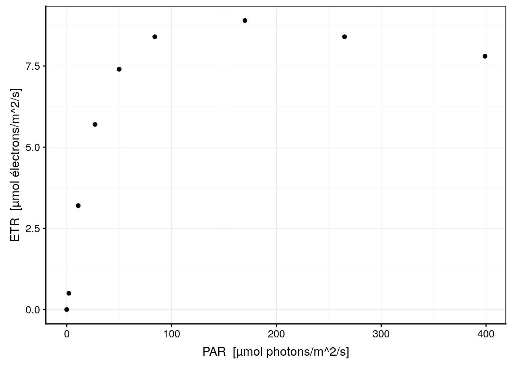
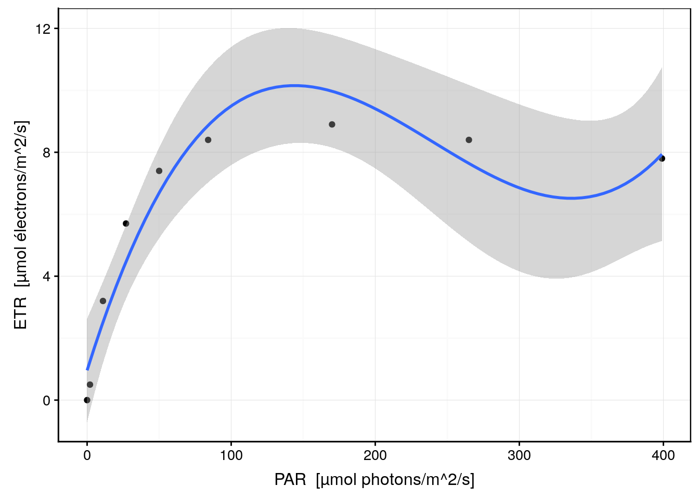
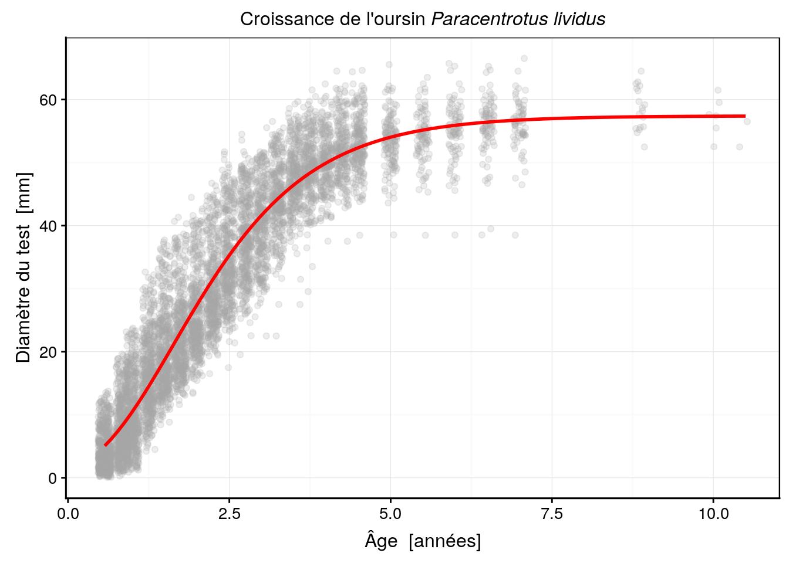
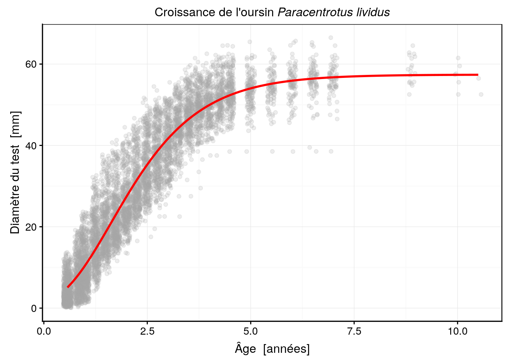
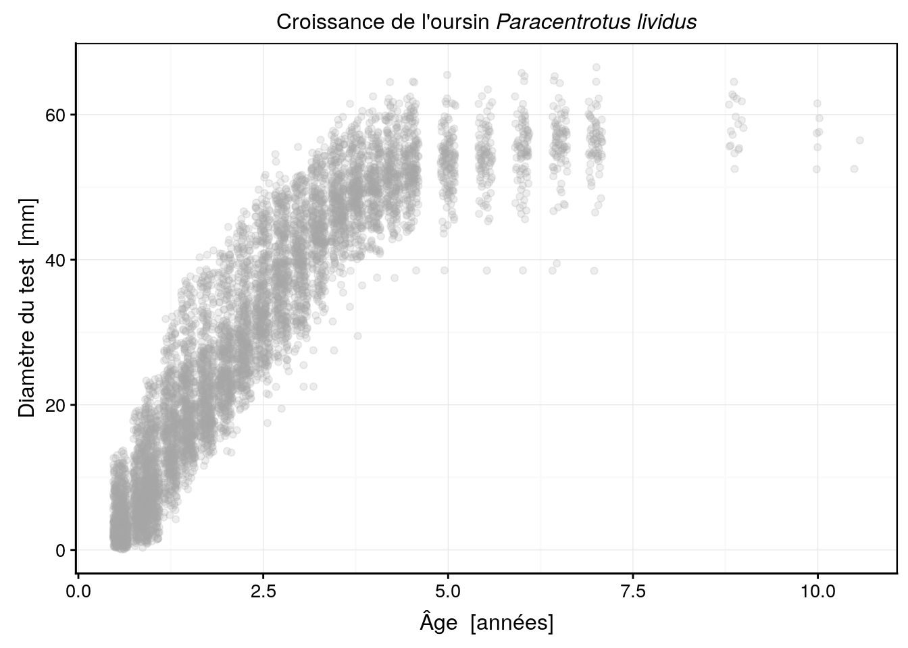
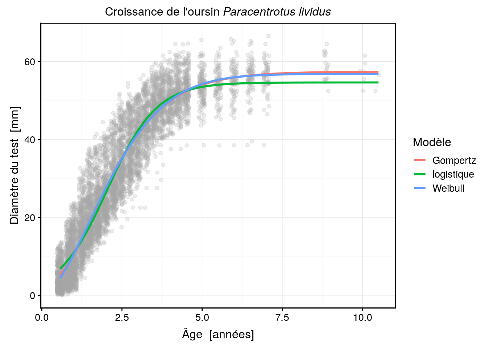
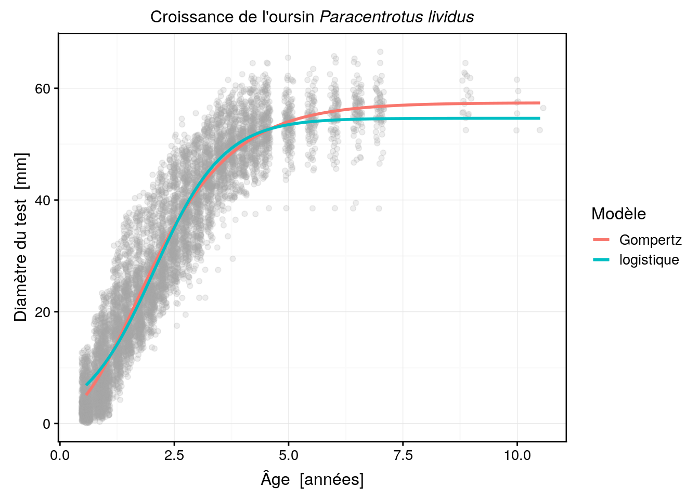
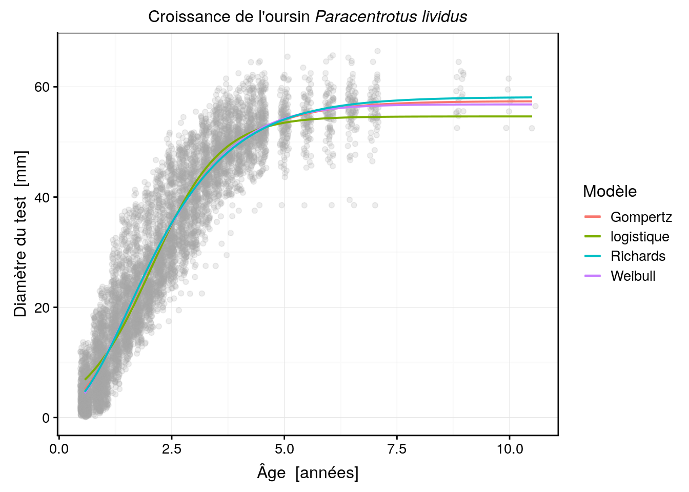

# Régression non linéaire {#reg-non-lin}


##### Objectifs {-}

- Comprendre comment ajuster une courbe dans un nuage de points à l'aide de la régression non linéaire par les moindres carrés
 
- Apprendre à réaliser une régression non linéaire dans R, éventuellement en utilisant des modèles "self-start"

- Comparer les modèles à l'aide du coefficient d'Akaike

- Connaitre quelques unes des courbes mathématiques les plus utilisées en biologie


##### Prérequis {-}

- Les modules 1 & 2 du présent cours concernant la régression linéaire sont une en trée en matière indispensable puisque la régression va être abordée ici comme une extension de ce qui a déjà été vu.


## Rendement photosynthétique

Afin d'avoir un premier aperçu de ce qu'est une régression non linéaire par les moindres carrés et comment on la calcule dans R, nous allons résoudre un exemple concret. La posidonie (*Posidonia oceanica* (L.) Delile (1813)) est une plante à fleur marine qui forme des herbiers denses en mer Méditerranée. Ses feuilles sont particulièrement adaptées à l'utilisation de la lumière qui règne à quelques mètres en dessous de la surface où elle prospère en herbiers denses. (un mémoire sur la portant sur l'[étude du diméthylsulfoniopropionate et du diméthylsulfoxyde chez *Posidonia oceanica* (L.) Delile (1813)](http://di.umons.ac.be/details.aspx?pub=82f7743a-4343-4aa3-84b1-ff92c6e4e4c3) a été réalisé au sein du service d'écologie numérique des milieux aquatiques)

](images/sdd2_04/posido.png)


Pour étudier le rendement de sa photosynthèse, c'est-à-dire la part du rayonnement lumineux reçu qui est effectivement utilisé pour initier la chaîne de transport d'électrons au sein de son photosystème II, nous pouvons utiliser un appareil spécialisé\ : le diving PAM.

TODO: diving PAM

Cet appareil est capable de déterminer le taux de transfert des électrons (ETR en µmol électrons/m^2^/s) par l'analyse de la fluorescence réémise par la plante lorsque ses photosites sont excités par une lumière monochromatique pulsée [@diving_pam2018]. Une façon de déterminer la réponse de la plante en rendement photosynthétique en fonction de l'intensité de la lumière reçue est de mesurer successivement l'ETR pour différentes intensités de lumière. En anglais cela s'appelle la "Rapid Light Curve" ou RLC en abbrégé. Comme toutes les longueurs d'ondes lumineuses ne sont pas utilisables par la chlorophylle, l'intensité lumineuse est exprimé dans une unité particulière, le "PAR" ou "Photosynthetically Active Radiation" en µmol photons/m^2^/s. Une RLC represente donc la variation de l'ERT en fonction des PAR. Une RLC typique commence par une relation quasi-linéaire aux faibles intensités, pour s'infléchir et atteindre un plateau de rendement maximum. Au delà, si l'intensité lumineuse augmente encore, des phénomènes de photoinhibition appraissent et le rendement diminue dans une troisième phase. Voici une RLC mesurée à l'aide du diving PAM sur une feuille de *P. oceanica*.


```r
rlc <- tribble(
  ~etr, ~par,
  0.0,  0,
  0.5,  2,
  3.2,  11,
  5.7,  27,
  7.4,  50,
  8.4,  84,
  8.9,  170,
  8.4,  265,
  7.8,  399
)
rlc <- labelise(rlc, self = FALSE,
  label = list(etr = "ETR", par = "PAR"),
  units = list(etr = "µmol électrons/m^2/s", par = "µmol photons/m^2/s")
)
chart(data = rlc, etr ~ par) +
  geom_point()
```



Les trois phases successives sont bien visibles ici. Naturellement, une régression linéaire dans ces données n'a pas de sens. Une régression polynomiale d'ordre trois donnerait ceci (code issu du snippet correspondant)\ :


```r
rlc_lm <- lm(data = rlc, etr ~  par + I(par^2) + I(par^3))
rlc_lm %>.%
  (function(lm, model = lm[["model"]], vars = names(model))
    chart(model, aes_string(x = vars[2], y = vars[1])) +
    geom_point() +
    stat_smooth(method = "lm", formula = y ~ x + I(x^2) + I(x^3)))(.)
```



La régression polynomiale tente maladroitement de s'ajuster dans les données mais est incapable de retranscrire les trois phases correctement. En particulier, la troisième est incorrecte puisque le modèle semble indiquer une reprise du rendement aux intensités les plus élevées. **Une représentation incorrecte est à craindre lorsque le modèle mathématique utilisé ne représente pas les différentes caractéristiques du phénomène étudié.** De plus ici, aucune transformation monotone croissante ou décroissante ne peut linéariser ce type de données puisque la courbe monte d'abord pour s'infléchir ensuite.

Les spécialistes de la photosynthèse ont mis au point différents modèles pour représenter les RLC. Platt, Gallegos et Harrison (1980) [TODO: référence complète] ont proposé une formulation mathématique des phénomènes mis en jeu ici. Leur équation est la suivante\ :

$$ETR = ETR_{max} \cdot (1 - e^{-PAR \cdot \alpha/ETR_{max}}) \cdot e^{-\beta \cdot PAR/ETR_{max}}$$

avec $PAR$ la variable indépendante, $ETR$, la variable dépendante, et $ETR_{max}$, $\alpha$ et $\beta$, les trois paramètres du modèle. $ETR_{max}$ est le rendement maximum possible, $\alpha$ est le coefficient d'infléchissement avant le maximum et $\beta$ est le coefficient de photoinhibition.

<div class="note">
<p>En matière de régression non linéaire, il est tout aussi important de bien comprendre les propriétés mathématiques de la fonction utilisée que de faire un choix judicieux du modèle. En particulier, il faut s’attacher à bien comprendre la signification (biologique) des paramètres du modèle. Non seulement, cela aide à en définir des valeurs intiales plausibles, mais c’est aussi indispensable pour pouvoir ensuite bien interpréter les résultats obtenus.</p>
</div>

Nous pouvons facilement créer une fonction dans R qui représente ce modèle\ :


```r
pgh_model <- function(x, etr_max, alpha, beta)
  etr_max * (1 - exp(-x * alpha/etr_max)) * (exp(-beta * x/etr_max))
```

Le premier argument de la fonction *doit* être la variable indépendante (notée de manière générique `x`, mais n'importe quel nom fait l'affaire ici) et les autres arguments correspondent aux paramètres du modèle, donc `etr_max`, `alpha` et `beta`. Ce modèle peut être ajusté dans R à l'aide de la fonction `nls()` pour "Nonlinear Least Squares" (regression). Par contre, nous devons fournir une information supplémentaire (l'explication sera détaillée plus loin)\ : des valeurs approximatives de départ pour les paramètres. Nous voyons sur le graphique que `etr_max = 9` est une estimation plausible, mais il est difficile de déterminer `alpha` et `beta` rien qu'en regardant le graphique. Nous allons fixer `alpha = 1` pour indiquer qu'il y a bien inflexion, et partir d'un modèle sans photoinhibition en utilisant `beta = 0`. Voici comment la régression non linéaire par les moindre carrés avec notre fonction `pgh_model` peut être calculée\ :


```r
rlc_nls <- nls(data = rlc, etr ~ pgh_model(par, etr_max, alpha, beta),
  start = list(etr_max = 9, alpha = 1, beta = 0))
summary(rlc_nls)
```

```
# 
# Formula: etr ~ pgh_model(par, etr_max, alpha, beta)
# 
# Parameters:
#         Estimate Std. Error t value Pr(>|t|)    
# etr_max 9.351064   0.261969  35.695 3.22e-08 ***
# alpha   0.327385   0.013416  24.402 3.11e-07 ***
# beta    0.003981   0.001084   3.673   0.0104 *  
# ---
# Signif. codes:  0 '***' 0.001 '**' 0.01 '*' 0.05 '.' 0.1 ' ' 1
# 
# Residual standard error: 0.1729 on 6 degrees of freedom
# 
# Number of iterations to convergence: 7 
# Achieved convergence tolerance: 3.619e-06
```

La dernière ligne, "achieved convergence" indique que le modèle a pu être calculé. Nous avons un tableau des paramètres qui ressemble très fort à celui de la régression linéaire, y compris les tests *t* de Student sur chacun des paramètres. Nous obtenons `etr_max = 9.3`, `alpha = 0.33` et `beta = 0.0040`, mais d'après le test de Student ce dernier paramètre n'est **pas** significativement différent de zéro. Pour l'instant, nous allons conserver ce modèle tel quel. Notre modèle paramétré donne donc\ :

$$ETR = 9.3 \cdot (1 - e^{-PAR \cdot 0.33/9.3}) \cdot e^{-0.0040 \cdot PAR/9.3}$$

Voyons ce que cela donne sur le graphique. Nous utiliserons pour ce faire une petite astuce qui consiste à transformer l'objet `nls` obtenu en une fonction utilisable par `stat_function()` pour le graphique `ggplot2` réalisé à l'aide de `chart()`^[Il est également possible de l'utiliser avec `curve()` pour une graphique de base dans R.].


```r
as.function.nls <- function(x, ...) {
  nls_model <- x
  name_x <- names(nls_model$dataClasses)
  stopifnot(length(name_x) == 1)
  function(x) predict(nls_model, newdata = structure(list(x), names = name_x))
}
```

Maintenant, nous allons pouvoir ajouter la courbe correspondant à notre modèle comme ceci\ :


```r
chart(data = rlc, etr ~ par) +
  geom_point() +
  stat_function(fun = as.function(rlc_nls))
```


Ce modèle représente bien mieux le phénomène étudié, et il s'ajuste d'ailleurs beaucoup mieux également dans les données que notre polynome. Une comparaison sur base du critère d'Akaïke est également en faveur de ce dernier modèle non linéaire (pour rappel, plus la valeur est faible, mieux c'est)\ :


```r
AIC(rlc_lm, rlc_nls)
```

```
#         df       AIC
# rlc_lm   5 31.834047
# rlc_nls  4 -1.699078
```


### Quand passer à la régression non linéaire ?

Nous pouvons être amenés à utiliser une régression non linéaire pour l'une de ces deux raisons, voire les deux en même temps\ :

- Lorsque le nuage de points est **curvilinéaire**, évidemment, mais après avoir tenté de le **linéariser** (et de résoudre un problème éventuel d’hétéroscédasticité ou de non-normalité des résidus) par **transformation** sans succès,

- En fonction de nos connaissances _a priori_ du phénomène. Tout phénomène issu d'un mécanisme dont nous connaissons le mode de fonctionnement menant à une équation mathématique non linéaire. Cela se rencontre fréquemment en physique, en chimie, et même en biologie (courbes de croissance, effet de modifications environmentales, etc.)


### Principe : fonction objective et calcul itératif

- Le principe général est toujours le même :

1. Choisir une fonction mathématique à ajuster dans les données
2. Choisir une fonction objective à minimiser. Pour une régression par les moindres carrés des résidus :

    $$fo(p_{1},p_{2},...,p_{k})=\sum_{i=1}^{n}(y_{i}-f(x_{i,}p_{1},p_{2},...,p_{k}))^{2}=\sum_{i}(y_{i}-\hat{{y_{i}}})^{2}$$

3. Choisir des valeurs de départ pour les paramètres
4. Minimiser la fonction objective de manière itérative en changeant un ou plusieurs paramètres


### Algorithmes de convergence

Le choix des nouveaux paramètres à tester à chaque itération ne se fait naturellement pas au hasard. Un algorithme d’optimisation est utilisé ici. Ceux disponibles dans R par défaut (fonction `nls()`) sont :

- **Gauss-Newton** : utilise la dérivée de la courbe et son expansion en série de Taylor pour estimer les valeurs plausibles des paramètres sur une série de termes additifs (par régression linéaire)
- **Golub-Pereyra Plinear** : sépare les paramètres linéaires des non linéaires, et n’itère que sur ces derniers. Les paramètres linéaires sont ensuite déterminés par régression linéaire classique
- **Port** : cet algorithme, contrairement aux deux premiers, permet de définir des bornes inférieures et supérieures à ne pas dépasser pour l’estimation des paramètres


### Pièges et difficultés

- Convergence lente
- Singularité de la fonction à ajuster, discontinuités, fonction non définie sur une partie du domaine, etc.
- Difficultés de calcul (division par zéro, courbe ou paramètre tendant vers l’infini, ...)
- Minimum local


### Les fonctions "self-start"

- Les fonctions "self-start" sont particulières à R
- Plus qu’une fonction, il s’agit en réalité d’un programme complet qui contient :
    * La fonction elle-même
    * La résolution analytique de la dérivée première de la fonction en chaque point (utilisée par l’algorithme de convergence pour déterminer l’écart à apporter aux paramètres à l’itération suivante)
    * Du code optimisé pour choisir les valeurs initiales idéales (proches du minimum global pour la *fo*) automatiquement
    * Du code pour optimiser la convergence, éventuellement


### Modèles non linéaires courants en biologie

- Michaelis-Menten : `SSmicmen()`

- Modèle de croissance exponentielle

- Fonction logistique : `SSlogis()` et `SSflp()`

- Modèle de Gompertz : `SSgompertz()`

- Modèles de von Bertalanffy : `SSasymp()`, `SSasympOff()` et `SSasympOrig()`

- Modèle de Richards

- Modèle de Weibull : `SSweibull()`

- Autres...


## Principe

La régression non linéaire consiste à modéliser la variation d'une variable (dite variable réponse ou dépendante) par rapport à la variation d'une ou plusieurs autres variables (dites explicatives ou indépendantes). Le modèle utilisé pour représenter cette relation est une fonction mathématique de forme quelconque. Ceci constitue une généralisation de la régression linéaire où la fonction mathématique était nécessaire une droite ($y = a x + b$ dans le cas de la régression linéaire simple). La fonction est, dans la technique la plus courante, ajustée en minimisant la somme des carrés des résidus (écart entre les observations $y_i$ et les valeurs prédites par la droite, notées $\hat{y_i}$).

Lorsque le nuage de point ne s'étire pas le long d'une droite, nous pouvons tenter de transformer les données afin de les linéariser. Malheureusement, il existe de nombreux cas où la relation n'est pas linéarisable. Nous allons étudier quelques uns de ces cas et nous verrons comment nous pouvons ajuster une fonction quelconque (non linéaire) sur ces données.

<div class="note">
<p>Il existe, en réalité, une autre raison pour laquelle nous pourrions être amené à ne pas transformer les données pour les linéariser. Il s’agit du cas où les résidus ont une distribution correcte avec les données non transformées (distribution normale, et variance homogène -homoscédasticité-) lorsqu’on utilise un modèle non linéaire. Dans ce cas précis, une transformation pour linéariser les données devrait permettre d’utiliser une régression linéaire. Mais ce faisant, on rend alors les résidus non normaux et/ou on perd la propriété d’homoscédasticité, ce qui constitue une violation des conditions d’application de la régression par les moindres carrés que nous utilisons ici. Ainsi, dans ce cas-là, il vaut alors mieux ne pas transformer et utiliser plutôt une régression non linéaire à la place d’une régression linéaire pourtant plus simple d’emploi.</p>
</div>


### Fonction objective

Nous appelons "fonction objective" la fonction qui quantifie la qualité de l'ajustement de sorte que plus le nombre renvoyé par cette fonction est petit, meilleur est l'ajustement. Cette fonction objective peut être définie librement, mais dans de nombreux cas, il s'agit du même critère que pour la régression linéaire par les moindres carrés, à savoir\ :

$$f_{obj} = \sum_i{(y_i - \hat{y_i})^2}$$

L'ajustement d'une courbe quelconque, notée $y = f(x)$ peut se faire de manière itérative, en testant différentes valeurs des paramètres de la fonction, et en retenant au final la combinaison qui minimise le mieux la fonction objective. Par exemple, si notre courbe à ajuster est: $y = a x^b$, nous devrons estimer conjointement la valeur des deux paramètres ($a$ et $b$) de la courbe. Bien qu'il s'agisse effectivement de la technique employée pour ajuster une courbe dans un nuage de point, il faut considérer divers problèmes potentiels.

* Le premier de ces problèmes est l'optimisation de la recherche des valeurs idéales des paramètres. Une recherche en aveugle est très peu efficace, évidemment. Il existe donc différentes approches. Leurs descriptions et développements mathématiques sort du cadre de ce cours. Je renvoie le lecteur intéressé à l'annexe C de Sen & Srivastava, (1990). Les algorithmes utilisés dans la fonction `nls()` de R qui effectue cette régression non linéaire, et que nous utiliserons ici sont\ : **Gauss-Newton**, (par défaut), un algorithme utilisant la différentiation de la courbe et une expansion en série de Taylor pour approximer cette courbe par une série de termes additifs dont la solution peut être trouvée par régression linéaire multiple. L'algorithme **plinear** de **Golub-Pereyra**, bien que peu répandu, est également implémenté. Il est utile en ce sens qu'il sépare les paramètres en deux sous-groupes\ : ceux qui sont linéaires dans la fonction (coefficients multiplicateurs de termes additifs) et ceux qui ne le sont pas. La recherche itérative ne se fait que sur les seconds. Les premiers étant estimés par régression linéaire. Ainsi, lorsque la fonction ne comporte que peu de paramètres non linéaires, l'algorithme converge beaucoup plus rapidement. Enfin, un troisième algorithme, nommé **Port** est également implémenté dans `nls()`. Il a la particularité, contrairement aux deux précédents, de permettre de définir des limites supérieures et inférieures acceptables pour chaque paramètres. Cela limite la recherche dans un domaine de validité, lorsque celui-ci peut être défini.

* La recherche de la solution optimale nécessite de partir de valeurs de départ plausibles pour les paramètres du modèle (c'est-à-dire, un ensemble de valeurs pour les paramètres telle que la courbe initiale est probablement proche de la solution recherchée). Définir les valeurs initiales n'est pas toujours chose aisée, et de plus, le résultat final peut dépendre fortement de ces valeurs initiales, à savoir que, si l'on choisi des valeurs initiales trop éloignées de la solution recherchée, on peut très bien se trouver enfermé dans une fausse solution (un minimum local de la fonction objective qui est moins bas que le minimum absolu que l'on recherche).

* Le troisième problème est éventuellement lié à la complexité de la fonction non linéaire que l'on cherche à ajuster. Les propriétés mathématique de la courbe choisie peut très bien faire que cette courbe ne soit pas définie pour certaines valeurs des paramètres, ou qu'elle ait un comportement spécial dans un certain domaine (par exemple, courbe tendant vers l'infini). Ces cas sont difficilement traités par la plupart des algorithmes de minimisation de la fonction objective, et des erreurs de calcul de type "division par zéro", ou "résultat non défini" peuvent apparaître. Dans les meilleures implémentations (`nls()` en est une), des gardes-fous ont été ajoutés dans le code de la fonction pour éviter les erreurs dans pareils cas. Toutefois, il n'est pas possible de traiter tous les cas d'erreur passibles. Ainsi, il arrive parfois que le modèle choisi ne soit pas ajustable sur les données.

* Enfin, le dernier problème que l'on peut rencontrer, c'est une convergence trop lente, ou pas de convergence du tout vers la solution qui minimise la fonction objective. Ceci est fortement dépendant des trois autres points précédents\ : choix de l'algorithme, choix des valeurs de départ pour les paramètres, et choix de la courbe à ajuster. En cas de non convergence, il faut essayer d'autres combinaisons avant de conclure que la courbe ne peut pas être ajustée sur les données.

Au final, l'ajustement d'un modèle non linéaire par les moindres carrés est une opération beaucoup plus délicate que l'ajustement par les moindres carrés d'un modèle linéaire sur les mêmes données. Dans le cas linéaire, la solution est trouvée de manière immédiate grâce à un petit calcul matriciel simple. Dans le cas non linéaire, il n'existe souvent pas de solution miracle, et le meilleur ajustement doit être recherché de manière itérative, et souvent à l'aveuglette. Nous verrons ci-dessous que R propose, pour certains modèles appelés 'SelfStart' une solution élégante pour calculer automatiquement les valeurs initiales et pour converger très rapidement vers la solution recherchée, mais la plupart du temps, il faut souvent tâtonner pour ajuster sa courbe.


### Modèles 'selfStart' dans R

Dans certains cas, il existe des petites astuces de calcul pour converger directement vers la solution, ou du moins, pour calculer des valeurs de départ très proches de la solution recherchée de sorte que l'algorithme de recherche pourra converger très rapidement. Par exemple, lorsqu'il est possible de linéariser le modèle en transformant les données. Dans ce cas, une bonne estimation des valeurs de départ des paramètres peut être obtenue en linéarisant la relation et en calculant les paramètres par régression linéaire. Ensuite, les paramètres obtenus sont retransformés dans leur forme initiale, et ils sont utilisés comme valeurs de départ.

Par exemple, si nous décidons d'ajuster un modèle allométrique de Huxley, de type $y = a x^b$, nous pouvons linéariser la relation en transformant les deux variables en logarithmes. En effet, $\log(y) = \log(a x^b)$, ce qui est équivalent à une droite en développant\: $\log(y) = b \log(x) + \log(a)$. Le paramètre $b$ devient donc la pente de la droite, et $\log(a)$ devient l'ordonnée à l'origine dans le modèle linéaire transformé. Une fois la droite ajustée, on a directement la valeur de $b$, et il suffit de calculer l'exponentielle de l'ordonnée à l'origine pour obtenir $a$. Toutefois, comme les résidus sont différents dans la relation non transformée initiale, il ne s'agit pas de la solution recherchée mais d'une bon point de départ très proche de cette solution. Ainsi, on prendra les valeurs de $a$ et de $b$ ainsi calculées par la droite en double log comme point de départ, et on laissera l'algorithme de recherche du minimum terminer le travail. En fait, c'est exactement de cette façon que les modèles dits 'selfStart' fonctionnent dans R.


## Modèles courants en biologie

Les domaines les plus courants où des modèles non linéaires sont utilisés en biologie concernent les cinétiques de réactions (chimiques, biochimiques), les courbes de type dose-réponse, les courbes de survie et les modèles de croissance. Nous verrons principalement divers modèles de croissance dans la section suivante. Certains de ces modèles, comme le modèle exponentiel, celui de Gompertz ou de Weibull sont aussi utilisés comme courbes de survie. De plus, la courbe logistique est un modèle classique de type dose-réponse. Ainsi, les différentes courbes de croissances recouvrent également une majorité des modèles utilisés dans d'autres domaines des biostatistiques. Nous mentionnerons ici un autre modèle courant qui n'est pourtant pas utilisé comme modèle de croissance\ : le modèle de Michaelis-Menten, fréquemment utilisé pour modéliser la cinétique de réactions chimiques, enzymatiques, en particulier.

TODO: grphique de la courbe Michaelis-Menten avec légende : Exemple de courbe cinétique de type Michaelis-Menten. La vitesse de la réaction augmente à un rythme donné par KM pour atteindre une vitesse maximale asymptotique Vmax.

Dans R, il existe un modèle 'selfStart' facile à utiliser pour ajuster une courbe de type Michaelis-Menten. Il s'agit de la fonction `SSmicmen()`.


### Modèles de croissance

Parmi les phénomènes biologiques courants qui sont essentiellement non linéaires, les modèles de croissance occupent une part importante. Il s'agit de phénomènes complexes, résultat d'un ensemble de processus, eux-même très complexes\ : l'anabolisme, ou élaboration de  matière organique et le catabolisme qui la détruit pour la transformer en énergie, en ce qui concerne la croissance somatique individuelle. Un modèle typique de croissance individuelle est le modèle de von Bertalanffy (von Bertalanffy, 1938, 1957).

Il existe un autre type de modèle de croissance\ : la croissance des populations. Ce type de modèle décrit l'évolution du nombre d'individus dans une population au cours du temps. Dans ce cas particulier, il s'agit également du résultat de plusieurs processus\ : la natalité, la mortalité et, éventuellement, les migrations. Une courbe type de modèle de croissance de population est la courbe logistique. Un autre modèle couramment utilisé est celui de Weibull pour décrire un nombre décroissant d'individus suite à une mortalité prédominante dans celle-ci.

Il existe de nombreux modèles de croissance différents. Certains sont exclusivement des modèles de croissance individuelle, d'autres sont exclusivement des modèles de croissance de populations, mais beaucoup peuvent être utilisés indifféremment dans les deux cas. Tous ont comme particularité d'être l'une ou l'autre forme de modèle exponentiel, exprimant ainsi le fait que la croissance est fondamentalement un processus exponentiel (comprenez que l'augmentation de masse ou du nombre d'individus est proportionnelle à la masse ou au nombre préexistant à chaque incrément temporel).

Nous allons décrire ci-dessous quelques un des modèles de croissance principaux. Ensuite, nous les utiliserons pour ajuster une courbe de croissance dans un jeu de donnée réel.


####  Courbe exponentielle

En 1798, Thomas Malthus a décrit un modèle de croissance applicable pour décrire la croissance de la population humaine. Cependant, d'après Murray (1993), ce modèle a été suggéré en premier lieu par Euler. Quoi qu'il en soit, ce modèle n'est plus guère utilisé actuellement, mais son importance historique ne doit pas être négligée. Il s'agit, en effet, de la première modélisation mathématique d'une des caractéristiques les plus fondamentales de la croissance\ : son caractère exponentiel (positive ou négative). Malthus a observé que la population des Etat-Unis double tous les 25 ans. Il suggère alors que les populations humaines augmentent d'une proportion fixe $r$ sur un intervalle de temps donné, lorsqu'elles ne sont pas affectées de contraintes environnementales ou sociales. Cette proportion $r$ est par ailleurs indépendante de la taille initiale de la population\ :

$$y_{t+1} = (1+r) \ y_t = k \ y_t$$

Une forme continue du modèle précédent (intervalle de temps infinitésimal) donne une équation différentielle\ :

$$\frac{d y(t)}{dt} = y'(t) = k \ y(t)$$

Cette équation différentielle admet la solution suivante\ :

$$y(t) = y_0 \ e^{k \ t}$$

avec $y_0$, la taille initiale de la population au temps $t = 0$. Ce modèle à deux paramètres est également intéressant parce qu'il montre une bonne manière de construire un modèle de croissance. Il suffit de décrire la croissance pour un accroissement infinitésimal de temps par le biais d'une équation différentielle, et ensuite de la résoudre (modélisation dynamique). Presque tous les modèles de croissance existants ont été élaborés de cette manière. Ainsi, la quasi-totalité des modèles de croissance correspondent en fait à une équation différentielle relativement simple.

Dans R, nous pourrons utiliser la fonction suivante\ :


```r
exponent <- function(x, y0, k)
  y0 * exp(k * x)
```

Voici un exemple d'un modèle de croissance exponentiel avec $y_0 = 1,5$ et $k = 0,9$. Le paramètre $y_0$ est indiqué sur le graphique.


```r
# Graphique avec y0 = 1.5 et k = 0.9
exponent_data <- tibble(
  t = seq(0, 3, by = 0.1),
  y = exponent(t, y0 = 1.5, k = 0.9)
)
chart(data = exponent_data, y ~ t) +
  geom_line() +
  geom_vline(xintercept = 0, col = "darkgray") +
  annotate("text", label = "y0", x = -0.05, y = 1.5)
```


TODO: exemple d'ajustement dans des données...


#### Courbe logistique

Le modèle exponentiel décrit une croissance infinie sans aucunes contraintes. Ce n'est pas une hypothèse réaliste. En pratique, la croissance est limitée par les ressources disponibles. Verhulst (1838), en travaillant aussi sur la croissance de populations, propose un modèle qui contient un terme d'auto-limitation $[y_\infty – y (t)] / y_\infty$ qui représente une quelconque limite théorique des ressources disponibles\ :

$$\frac{dy(t)}{dt} = k \ \frac{y_\infty - y(t)}{y_\infty} \ y(t) = - \frac{k}{y_\infty} \ y(t)^2 + k \ y(t)$$

Lorsque l'on résout et simplifie cette équation différentielle, on obtient \:

$$y(t) = \frac{y_\infty}{1 + e^{-k \ (t - t_0)}}$$

Ceci est une des formes de la courbe logistique. Cette fonction a deux asymptotes horizontales en $y(t) = 0$ et $y(t) = y_\infty$ (voir schéma ci-dessous) et c'est une sigmoïde symétrique autour du point d'inflexion (les deux courbes du S sont identiques). Le modèle 'selfStart' correspondant dans R s'appelle `SSlogis()`. Ses paramètres sont `Asym` (= $y_\infty$), `xmid` (= $t_0$), et `scal` (= $k$).

Voici le graphique d'une courbe logistique avec $y_\infty = 0,95$, $t_0 = 5$ et $k = 1$.


```r
logis_data <- tibble(
  t = seq(0, 10, by = 0.1),
  y = SSlogis(t, Asym = 0.95, xmid = 5, scal = 1)
)
chart(data = logis_data, y ~ t) +
  geom_line() +
  geom_vline(xintercept = 0, col = "darkgray") +
  geom_hline(yintercept = c(0, 0.95/2, 0.95), col = "gray", linetype = "dashed") +
  geom_vline(xintercept = 5, col = "gray", linetype = "dashed") +
  annotate("text", label = "Asym", x = -0.4, y = 0.95) +
  annotate("text", label = "Asym/2", x = -0.5, y = 0.95/2) +
  annotate("text", label = "xmid", x = 5.4, y = 0.03) +
  annotate("text", label = "point d'inflexion", x = 6, y = 0.45)
```


Cette courbe sigmoïdale est asymptotique en 0 et $y_\infty$, et elle est également symétrique autour de son point d'inflexion situé à ${t_0, y_\infty / 2}$.

Il est possible de généraliser ce modèle en définissant une courbe logistique dont l'asymptote basse peut se situer n'importe où ailleurs qu'en 0. Si cette asymptote se situe en $y_0$, nous obtenons l'équation\ :

$$y(t) = y_0 + \frac{y_\infty - y_0}{1 + e^{-k \ (t - t_0)}}$$

Ceci est le modèle logistique généralisé à quatre paramètres (modèle 'selfSart' `SSfpl()` dans R, pour **f**our-**p**arameters **l**ogistic). Les arguments sont `A`, la première asymptote horizontale (= $y_0$), `B`, la seconde asymptote horizontale (= $y_\infty$), `xmid` (= $t_0$) et `scal` (= $k$).

Le graphie ressemble très fort à celui de la fonction logistique, mais la première asymptote n'est plus nécessairement à 0 (ici, $y_0$ = 0.05).


```r
fpl_data <- tibble(
  t = seq(0, 10, by = 0.1),
  y = SSfpl(t, A = 0.05, B = 0.95, xmid = 5, scal = 1)
)
chart(data = fpl_data, y ~ t) +
  geom_line() +
  geom_vline(xintercept = 0, col = "darkgray") +
  geom_hline(yintercept = c(0.05, 0.9/2 + 0.05, 0.95), col = "gray", linetype = "dashed") +
  geom_vline(xintercept = 5, col = "gray", linetype = "dashed") +
  annotate("text", label = "A", x = -0.4, y = 0.05) +
  annotate("text", label = "B", x = -0.4, y = 0.95) +
   annotate("text", label = "xmid", x = 5.4, y = 0.03) +
  annotate("text", label = "point d'inflexion", x = 6, y = 0.47)
```



TODO: exemple d'application sur des données réelles dans R.


#### Modèle de Gompertz

Gompertz (1825) a observé de manière empirique que le taux de survie décroît souvent de manière proportionnelle au logarithme du nombre d'animaux qui survivent. Bien que ce modèle reste utilisé pour décrire des courbes de survie, elle trouve de nombreuses applications pour décrire également des données de croissance. L'équation différentielle du modèle de Gompertz est\ :

$$\frac{dy(t)}{dt} = k \ [ \ln y_\infty - \ln y(t)] \ y(t)$$

qui se résout et se simplifie en\ :

$$y(t) = y_\infty \ e^{-k \ (t - t_0)} = y_\infty \ a^{e^{-k \ t}} = y_\infty \ a^{b^t}$$

La dernière forme apparaît plus simple et est le plus souvent utilisée. La première forme est directement dérivée de l'équation différentielle et donne une meilleure comparaison avec la courbe logistique, puisque $t_0$ correspond aussi à l'abscisse du point d'inflexion, qui n'est plus en position symétrique ici (voir figure ci-dessous). Le modèle 'selfStart' correspondant dans R s'appelle `SSgompertz()`.

TODO: figure de gompertz annotée avec légende: Exemple d'une courbe de Gompertz avec $k = 1$, $y_\infty = 0,95$, $t_0 = 1,5$. Le point d'inflexion $i$, à ${t_0, y_\infty / e}$, est plus bas que pour la courbe logistique.


#### Modèles de von Bertalanffy

Le modèle de von Bertalanffy, parfois appelé Brody-Bertalanffy (d'après les travaux de von Bertalanffy et Brody) ou modèle de Pütter (dans Ricker, 1979 notamment), est la première courbe de croissance qui a été élaborée spécifiquement pour décrire la croissance somatique individuelle. Il est basé sur une analyse bioénergétique simple. Un individu est vu comme un simple réacteur biochimique dynamique où les entrées (anabolisme) sont en compétition avec les sorties (catabolisme). Le résultat de ces deux flux étant la croissance. L'anabolisme est plus ou moins proportionnel à la respiration et la respiration est proportionnelle à une surface pour beaucoup d'animaux (la surface développée des poumons ou des branchies), soit encore, les 2/3 de la masse. Le catabolisme est toujours proportionnel à la masse. Ces relations mécanistiques sont rassemblées dans l'équation différentielle suivante où $y(t)$ mesure l'évolution d'un volume ou d'un poids au cours du temps\ :

$$\frac{dy(t)}{dt} = a \ y(t)^{2/3} - b \ y(t)$$

En résolvant cette équation, nous obtenons le modèle de croissance pondérale de von Bertalanffy\ :

$$y(t) = y_\infty \ (1 - e^{-k \ (t - t_0)})^3$$

La forme la plus simple de ce modèle est obtenue lorsque nous mesurons des dimensions linéaires pour quantifier la taille de l'organisme, car une dimension linéaire est, en première approximation, la racine cubique d'une masse, proportionnelle au volume à densité constante (sans prendre en compte une possible allométrie). Le modèle de von Bertalanffy pour des mesures linéaires est alors simplement \ :

$$y(t) = y_\infty \ (1 - e^{-k \ (t - t_0)})$$

Un graphique des deux modèles est présenté ci-dessous. Le modèle de von Bertalanffy pour mesures linéaire n'a pas de point d'inflexion. La croissance est la plus rapide à la naissance et ne fait que diminuer avec le temps pour finalement atteindre zéro lorsque la taille maximale asymptotique est atteinte. Avec ce modèle, la croissance est donc déterminée et elle ne peut dépasser cette asymptote horizontale située en $y(t)= y_\infty$. A cause de la puissance cubique de la forme pondérale du modèle von Bertalanffy, cette dernière est une sigmoïde asymétrique, comme l'est le modèle de Gompertz également. Trois modèles 'selfStart' existent dans R, selon que la courbe passe par 0 ou non sur l'un des deux axes, voire sur les deux\ : `SSasymp()`, `SSasympOff()` et `SSasympOrig()`.

TODO: figure exemple £VB avec légende: Exemples de modèles de croissance de von Bertalanffy linéaire (courbe en gras) et pondérale (courbe en trait fin) avec $k = 1$, $y_\infty = 0,95$ et $t_0 = 0$. Les deux modèles décrivent une croissance asymptotique, mais la première courbe n'a pas de point d'inflexion alors que la seconde est sigmoïdale.


#### Modèle de Richards

La forme généralisée du modèle de von Bertalanffy est\ :

$$y(t) = y_\infty \ (1 - e^{-k \ (t - t_0)})^m$$

Von Bertalanffy (1938, 1957) a fixé $m$ à 1 ou à 3. Richards (1959) permet à $m$ de varier librement, et donc son modèle a un paramètre de plus. Cette dernière courbe est très flexible (voir schéma ci-dessous) et il est possible de démontrer que plusieurs autres modèles de croissance ne sont que des cas particuliers de ce modèle généraliste avec différentes valeurs de $m$. Nous avons déjà observé que le modèle de Richards se réduit aux deux modèles de von Bertalanffy quand $m = 1$ et $m = 3$. Il se réduit aussi à une courbe logistique lorsque $m = -1$ et il est possible de montrer qu'il converge vers le modèle de Gompertz lorsque $|m| \rightarrow \infty$. Il n'existe aucun modèle 'selfStart' pour la courbe de Richards dans R. Par ailleurs, il s'agit d'un modèle particulièrement délicat à ajuster, comme nous le verrons dans un exemple concret plus loin.

TODO: graphique avec légende: Allure de différentes courbes de Richards en fonction de la valeur de $m$. De gauche à droite: $m$ = 0,5, 1, 3, 6 et 10; avec $k = 0,5$, $y_\infty = 0,95$ et $t_0 = 0$ pour toutes les courbes. La courbe en gras, avec $m = 1$, est équivalente au modèle de von Bertalanffy linéaire.


#### Modèle de Weibull

Depuis son introduction en 1951 par Weibull, ce modèle est présenté comme polyvalent. Il a été décrit à l'origine comme une distribution statistique. Il trouve de nombreuses applications en croissance de population (éventuellement négative), et il est utilisé également pour décrire la courbe de survie en cas de maladie ou dans des études de dynamique de populations. Il a parfois été utilisé comme un modèle de croissance. La forme la plus générale de ce modèle est \ :

$$y(t) = y_\infty - d \ e^{-k \ t^m}$$

avec $d = y_\infty - y_0$. Un modèle à trois paramètres est également utilisé où $y_0 = 0$. La fonction est sigmoïdale lorsque $m > 1$, sinon elle ne possède pas de point d'inflexion (voir graphique ci-dessous). Dans R, le modèle 'selfStart' s'appelle `SSweibull()`.

TODO: figure avec légende: Exemples de courbes de Weibull pour respectivement $m$ = 5, 2, 1 et 0,5, avec $k = 0,6$,
$y_\infty = 0,95$ et $y_0= 0,05$. En gras, la courbe avec $m = 1$, équivalente à un modèle de von Bertalanffy linéaire. Toutes les courbes démarrent en $y_0$ et passent par $y_\infty - d \ e^{-k}$ qui est également le point d'inflexion pour les sigmoïdes lorsque $m > 1$.


#### Courbe de Jolicoeur

Une autre courbe qui est tantôt sigmoïdale, tantôt non est le modèle de Jolicoeur (1985). Elle est dérivée d'une courbe logistique, mais en utilisant le logarithme du temps au lieu du temps lui-même dans l'équation différentielle de départ\ :

$$y(t) = \frac{y_\infty}{1 + b \ t^{-m}}$$

Comme la fonction de Weibull, elle est sigmoïdale lorsque $m > 1$, mais avec l'asymétrie entre les deux courbures de part et d'autre du point d'inflexion qui peuvent varier indépendamment l'une de l'autre, en fonction de la valeur du paramètre $b$. Lorsque $m \leq 1$, il n'y a aucun point d'inflexion (voir schéma ci-dessous).

TODO figure avec légende: Exemples de courbes de Jolicoeur avec $m$ = 3, 1 (trait gras) et 0,5 respectivement depuis la courbe supérieure vers la courbe inférieure; $y_\infty = 0,95$ et $b = 0,9$. Lorsque $m > 1$, la courbe est sigmoïdale.


#### Modèle de Johnson

La courbe de croissance de Johnson (voir Ricker, 1979) utilise $1/t$ à la place de $t$\ :

$$y(t) = y_\infty \ e^{1/k \ (t - t_0)}$$

TODO figure avec légende: Exemple d'une courbe de Johnson, avec $k = 0,7$, $y_\infty = 0,95$ et $t_0 = 0$.

Ce modèle est sigmoïdal également mais une asymétrie tellement forte que le point d'inflexion est très bas, presque à 0 sur l'axe des ordonnées (il est donc difficilement visible sur le graphe). Cette courbe ressemble donc à une courbe de croissance non sigmoïdale, mais pour laquelle on observerait un petit temps de latence avant le début de la croissance sur l'axe temporel.


#### Modèle Preece-Baines 1

Preece et Baines (1978) ont décrit plusieurs modèles spécifiques à la croissance humaine. Ces modèles combinent deux phases de croissance exponentielle pour représenter la croissance graduelle d'enfants suivie par une courte phase de croissance accélérée à l'adolescence, mais qui atteint rapidement un plateau correspondant à la taille adulte définitive (voir graphique ci-dessous). Ce type de modèle est naturellement très utile pour tous les mammifères, mais certains, comme le modèle 1, ont aussi été utilisés dans d'autres circonstances, profitant de sa grande flexibilité. Son équation est\ :

$$y(t) = y_\infty - \frac{2 (y_\infty - d)}{e^{k1 \ (t - t_0)} + e^{k2 \ (t - t_0)}}$$

TODO figure avec légende: Exemple d'une courbe Preece-Baines 1 avec $k1 = 0,19$, $k2 = 2,5$, $y_\infty = 0,95$, $d = 0,8$ et $t_0 = 6$.


#### Modèle de Tanaka

Tous les modèles précédents sont asymptotiques, à l'exception de la courbe exponentielle (mais cette dernière ne modélise valablement que la phase de croissance initiale). Tous ces modèles décrivent donc une **croissance déterminée** qui n'excédera jamais une taille maximale représentée par une asymptote horizontale en $y(t) = y_\infty$. Knight (1968) s'est demandé s'il s'agit d'une réalité biologique ou simplement d'un artefact mathématique. Dans le second cas, la croissance n'apparaîtrait déterminée que parce que les modèles choisis pour la représenter sont asymptotiques. Pour s'affranchir d'une telle contrainte, Tanaka (1982, 1988) a élaboré un nouveau modèle de croissance qui décrit une croissance non déterminée\ :

$$y(t) = \frac{1}{\sqrt{b}} \ \ln |2 \ b \ (t - t_0) + 2 \ \sqrt{b^2 \ (t - t_0)^2 + a \ b}| + d$$

Ce modèle complexe à quatre paramètres a une période initiale de croissance lente, suivie d'une période de croissance exponentielle qui se poursuit par une croissance continue mais plus faible tout au long de la vie de l'animal (voir graphique ci-dessous).

TODO figure avec légende: Exemple d'une courbe de Tanaka avec $a = 3$, $b = 2,5$, $d = -0,2$ et $t_0 = 2$.


## Choix du modèle

Le choix d'un modèle non linéaire fait intervenir des critères identiques à ceux d'un modèle linéaire (qualité d'ajustement évaluée par l'AIC, inspection visuelle de l'ajustement dans le nuage de points), mais il fait aussi intervenir une dimension supplémentaire\ : le choix de la fonction marthématique à ajuster. Comme nous venons de le voir au travers de quelques modèles courants en biologie, le nombre de fonctions mathématiques résultat en des formes similaire, par exemple de type sigmoïde, est grand. Ainsi, le choix de la meilleure fonction à utiliser dans un cas particulier est rendu plus difficile.

Nous allons illustrer l'ajustement d'une courbe non linéaire par le choix et l'ajustement d'un modèle de croissance dans un jeu de données en modélisant la croissance somatique de l'oursin *Paracentrotus lividus* (voir Grosjean 2001). Ce jeu de données est disponible dans le package `data.io`, sous le nom `urchin_growth`.


```r
SciViews::R
urchins <- read("urchin_growth", package = "data.io", lang = "fr")
chart(data = urchins, diameter ~ age) +
  geom_point()
```



Comme vous pouvez le voir, différents oursins ont été mesurés via le diamètre à l'ambitus du test (zone la plus large) en mm à différents âges (en années). Les mesures ont été effectuées tous les 6 mois pendant 7 ans, ce qui donne un bon aperçu de la croissance de cet animal y compris la taille maximale asymptotique qui est atteinte vers les 4 à 5 ans (pour ce genre de modèle, il est très important de continuer à mesurer les animaux afin de bien quantifier cette taille maximale asymptotique). Pour les individus survivants, dès mesures ont également été réalisées jusqu'à 10,5 ans. Ainsi, l'examen du graphique nous permet d'emblée de choisir un modèle à croissance finie (pas le modèle de Tanaka, donc), et de forme sigmoïdale. Les modèles logistique, Weibull ou Gompertz pourraient convenir par exemple. Nous pouvons à ce stade, essayer différents modèles et choisir celui qui nous semble le plus adapté.

Le choix du meilleur modèle se fait grâce à deux critères\ :

1. Les connaissances théoriques et *a priori* du modèle que l'on ajuste. En effet, il n'existe qu'un seul modèle linéaire, mais une infinité de modèles curvilinéaires qui peuvent s'ajuster dans les données. Le choix du meilleur modèle se fait en fonction de considérations sur le phénomène sous-jacent qui doivent se refléter dans les propriétés mathématiques de la courbe choisie. Par exemple, si on sait que la croissance est asymptotique vers une taille maximale, nous devrons choisir une courbe mathématique qui présente une asymptote horizontale à son maximum pour représente au mieux le phénomène étudié.

2. Le coefficient de détermination $R^2$ n'est pas calculé par R pour une régression non linéaire car sa validité est sujette à discussion entre les statisticiens (d'autres logiciels statistiques le calculent). Nous n'avons donc pas d'estimation de la qualité de l'ajustement par ce biais, comme dans le cas de la régression linéaire. Par contre, il est possible de calculer un autre critère plus fiable que nous avons déjà utilisé\ : le **critère d'Akaïke** (fonction `AIC()` dans R). Ce critère tient compte à la fois de la qualité d'ajustement et de la complexité du modèle, exprimée par le nombre de paramètres qu'il faut estimer. Plus le modèle est complexe, plus on peut s'attendre à ce qu'il s'ajuste bien aux données car il est plus flexible. Cependant, en ce domaine, la complexité n'est pas forcément un gage de qualité. On recherche plutôt un compromis entre meilleur ajustement et simplicité. Le critère d'information d'Akaiké quantifie précisément ce compromis, c'est-à-dire que le modèle qui a un AIC le plus faible est considéré comme le meilleur. Appliquons donc ce concept pour sélectionner le meilleur modèle de croissance pour décrire la croissance somatique de nos oursins après avoir sélectionné les modèles candidats les plus judicieux (modèle sigmoïdal avec asymptote horizontale au maximum).

Notons toutefois que, comme les animaux sont mesurés aux mêmes âges, tous les six mois, certains points se superposent. Afin d'afficher tous les points, il est utile d'utiliser la fonction `geom_jitter()` à la place de `geom_point()` qui décale les points d'une valeur aléatoire pour éviter ces superpositions (l'argument `width =` indique le décalage maximum à appliquer). Voici ce que cela donne (en ajoutant également un titre avec formattage correct du nom en latin) \ :


```r
urchins_plot <- chart(data = urchins, diameter ~ age) +
  geom_jitter(width = 0.1, alpha = 0.2, color = "darkgrey") +
  ggtitle(expression(paste("Croissance de l'oursin ", italic("Paracentrotus lividus"))))
urchins_plot
```



Nous avons ici également représenté les points de manière semi-transparent avec `alpha = 0.2`(transparence de 20%) pour encore mieux mettre en évidence les points de mesures qui se superposent.

Ajustons maintenant un modèle de Gompertz (modèle 'SelfStart')\ :


```r
urchins_gomp <- nls(data = urchins, diameter ~ SSgompertz(age, Asym, b2, b3))
summary(urchins_gomp)
```

```
# 
# Formula: diameter ~ SSgompertz(age, Asym, b2, b3)
# 
# Parameters:
#       Estimate Std. Error t value Pr(>|t|)    
# Asym 57.403687   0.257588  222.85   <2e-16 ***
# b2    3.901916   0.046354   84.18   <2e-16 ***
# b3    0.434744   0.003852  112.86   <2e-16 ***
# ---
# Signif. codes:  0 '***' 0.001 '**' 0.01 '*' 0.05 '.' 0.1 ' ' 1
# 
# Residual standard error: 5.49 on 7021 degrees of freedom
# 
# Number of iterations to convergence: 3 
# Achieved convergence tolerance: 2.655e-06
```

Pour ajouter cette courbe sur le graphique, nous allons utiliser une petite fonction personnalisée qui va transformer notre objet `nls` en une fonction utlisable par `stat_function()` pour aller tracer la courbe dans un graphique de type `ggplot2` obtenu à l'aide de `chart()`.


```r
as.function.nls <- function(x, ...) {
  nls_model <- x
  name_x <- names(nls_model$dataClasses)
  stopifnot(length(name_x) == 1)
  function(x) predict(nls_model, newdata = structure(list(x), names = name_x))
}
```

A présent, nous pouvons faire ceci\ :


```r
urchins_plot +
  stat_function(fun = as.function(urchins_gomp), color = "red", size = 1)
```



L'ajustement de cette fonction semble très bon, à l'oeil. Voyons ce qu'il en est d'autres modèles\ :


```r
urchins_logis <- nls(data = urchins, diameter ~ SSlogis(age, Asym, xmid, scal))
summary(urchins_logis)
```

```
# 
# Formula: diameter ~ SSlogis(age, Asym, xmid, scal)
# 
# Parameters:
#       Estimate Std. Error t value Pr(>|t|)    
# Asym 54.628069   0.202985   269.1   <2e-16 ***
# xmid  2.055285   0.009568   214.8   <2e-16 ***
# scal  0.764830   0.007355   104.0   <2e-16 ***
# ---
# Signif. codes:  0 '***' 0.001 '**' 0.01 '*' 0.05 '.' 0.1 ' ' 1
# 
# Residual standard error: 5.6 on 7021 degrees of freedom
# 
# Number of iterations to convergence: 4 
# Achieved convergence tolerance: 1.079e-06
```

Et voici le graphique avec les deux modèles superposés\ :


```r
urchins_plot +
  stat_function(fun = as.function(urchins_gomp), aes(color = "Gompertz"), size = 1) +
  stat_function(fun = as.function(urchins_logis), aes(color = "logistique"), size = 1) +
  labs(color = "Modèle")
```



Notez que ici, la couleur a été incluse dans le "mapping" (argument `mapping = `) de `stat_function()` en l'incluant dans `aes()`. Cela change fondamentalement la façon dont la couler est perçue par `ggplot2`. Dans ce cas-ci, la valeur est interprétée non comme une couleur à proprement parler, mais comme un niveau (une couche) à inclure dans le graphique et à reporter via une légende. Ensuite, à l'aide de `labs()` on chaznge le titre de la légende relatif à la couleur par un nom plus explicite\ : "Modèle".

Nous pouvons comparer ces modèles à l'aide du critère d'Akaïke.


```r
AIC(urchins_gomp, urchins_logis)
```

```
#               df      AIC
# urchins_gomp   4 43861.73
# urchins_logis  4 44139.13
```

Comme on peut le voir clairement sur le graphe, la courbe logistique donne une autre solution, cette dernière est à peine moins bonne que le modèle de Gompertz, selon le critère d'Akaiké. Pourtant, la courbe est assez bien démarquée de celle de Gompertz. Essayons maintenant un modèle de Weibull. Ce modèle est plus complexe car il a quatre paramètres au lieu de trois pour les deux modèles précédents\ :


```r
urchins_weib <- nls(data = urchins, diameter ~ SSweibull(age, Asym, Drop, lrc, pwr))
summary(urchins_weib)
```

```
# 
# Formula: diameter ~ SSweibull(age, Asym, Drop, lrc, pwr)
# 
# Parameters:
#      Estimate Std. Error t value Pr(>|t|)    
# Asym 56.80491    0.32704  173.69   <2e-16 ***
# Drop 56.81320    0.59393   95.66   <2e-16 ***
# lrc  -1.57392    0.02865  -54.94   <2e-16 ***
# pwr   1.67880    0.02960   56.72   <2e-16 ***
# ---
# Signif. codes:  0 '***' 0.001 '**' 0.01 '*' 0.05 '.' 0.1 ' ' 1
# 
# Residual standard error: 5.47 on 7020 degrees of freedom
# 
# Number of iterations to convergence: 3 
# Achieved convergence tolerance: 2.532e-06
```

Ajoutons ce nouveau modèle sur le graphique\ :


```r
urchins_plot +
  stat_function(fun = as.function(urchins_gomp), aes(color = "Gompertz"), size = 1) +
  stat_function(fun = as.function(urchins_logis), aes(color = "logistique"), size = 1) +
  stat_function(fun = as.function(urchins_weib), aes(color = "Weibull"), size = 1) +
  labs(color = "Modèle")
```


... et comparons à l'aide du critère d'Akaïke\ :


```r
AIC(urchins_gomp, urchins_logis, urchins_weib)
```

```
#               df      AIC
# urchins_gomp   4 43861.73
# urchins_logis  4 44139.13
# urchins_weib   5 43810.72
```
Ce modèle fait presque jeu égal avec le modèle de Gompertz en terme de critère d'Akaiké; juste un tout petit peu mieux. En fait, les deux courbes sont pratiquement superposées l'une à l'autre, mais le modèle de Weibull à un démarrage de croissance plus lent au début, ce qui se reflète dans les données. Par contre, il est pénalisé par le fait que c'est un modèle plus complexe qui possède un paramètre de plus. L'un dans l'autre, le critère d'information d'Akaiké considère donc les deux modèles sur pratiquement sur le même plan du point de vue de la qualité de leurs ajustements respectifs.

A ce stade, nous voudrions également essayer un autre modèle flexible à quatre paramètres\ : le modèle de Richards. Malheureusement, il n'existe pas de fonction 'SelfStart' dans R pour ce modèle. Nous sommes donc réduit "à mettre les mains dans le cambouis", à définir la fonction nous même, à trouver de bonnes valeurs de départ, etc. Voici comment définir la fonction\ :


```r
richards <- function(x, Asym, k, x0, m) Asym*(1 - exp(-k * (x - x0)))^m
```

Pour les valeurs de départ, là ce n'est pas facile. `Asym` est l' asymptote horizontale à la taille maximum. On voit qu'elle se situe aux environ de 55 mm sur le graphique. Pour les autres paramètres, c'est plus difficile à évaluer. Prenons par exemple 1 comme valeur de départ pour les trois autres paramètres, ce qui donne (les valeurs de départ sonty obligatoires ici puisque ce n'est pas un modèle 'SelfStart')\ :


```r
urchins_rich <- nls(data = urchins, diameter ~ richards(age, Asym, k, x0, m),
  start = c(Asym = 55, k = 1, x0 = 1, m = 1))
```

```
# Error in numericDeriv(form[[3L]], names(ind), env): Missing value or an infinity produced when evaluating the model
```

... et voilà\ ! Un excellent exemple de plantage de l'algorithme de minimisation de la fonction objective suite à un comportement inadéquat de la fonction avec les valeurs testées. Ici, la fonction renvoie l'infini et l'algorithme ne peut donc effectuer la minimisation. La fonction de Richards est effectivement connue pour être difficile à ajuster pour cette raison.

Il nous faut donc soit tester d'autres valeurs de départ, soit utiliser un autre algorithme de minimisation, soit les deux. Après différents essais il apparaît que le changement des valeurs de départ suffit dans le cas présent\ :


```r
urchins_rich <- nls(data = urchins, diameter ~ richards(age, Asym, k, x0, m),
  start = c(Asym = 55, k = 0.5, x0 = 0, m = 1))
summary(urchins_rich)
```

```
# 
# Formula: diameter ~ richards(age, Asym, k, x0, m)
# 
# Parameters:
#      Estimate Std. Error t value Pr(>|t|)    
# Asym 58.14344    0.37772 153.935  < 2e-16 ***
# k     0.75886    0.02392  31.723  < 2e-16 ***
# x0   -0.87553    0.28467  -3.076 0.002109 ** 
# m     6.20757    1.82374   3.404 0.000668 ***
# ---
# Signif. codes:  0 '***' 0.001 '**' 0.01 '*' 0.05 '.' 0.1 ' ' 1
# 
# Residual standard error: 5.487 on 7020 degrees of freedom
# 
# Number of iterations to convergence: 11 
# Achieved convergence tolerance: 4.346e-06
```

Ajoutons ce dernière modèle sur notre graphique (avec des traits un peu plus fins pour mieux distinguer les modèles les uns des autres)\ :


```r
urchins_plot +
  stat_function(fun = as.function(urchins_gomp), aes(color = "Gompertz"), size = 0.7) +
  stat_function(fun = as.function(urchins_logis), aes(color = "logistique"), size = 0.7) +
  stat_function(fun = as.function(urchins_weib), aes(color = "Weibull"), size = 0.7) +
  stat_function(fun = as.function(urchins_rich), aes(color = "Richards"), size = 0.7) +
  labs(color = "Modèle")
```



... et comparons à l'aide du critère d'Akaïke\ :


```r
AIC(urchins_gomp, urchins_logis, urchins_weib, urchins_rich)
```

```
#               df      AIC
# urchins_gomp   4 43861.73
# urchins_logis  4 44139.13
# urchins_weib   5 43810.72
# urchins_rich   5 43854.53
```


La courbe est très proche des modèles de Gompertz et Weibull aux jeunes âges, mais l'asymptote maximale est légèrement plus haute que pour les deux autres modèles (58 mm au lieu de 57 mm). Les trois courbes sont très, très proches l'une de l'autre. Le critère d'information d'Akaiké est un peu moins bon pour le modèle de Richards que pour celui de Weibull, mais est tout juste meilleur que celui de Gompertz. En outre l'écart type pour le paramètre `x0` est plus conséquent en comparaison de sa valeur, ce qui démontre une certaine instabilité de la fonction par rapport à ce paramètre, et par conséquent, une incertitude dans son estimation. Pour toutes ces raisons, le modèle de Richards sera écarté dans notre cas, au benefice du modèle de Weibull, voire de celui de Gompertz plus simple.

Le choix final entre Gompertz ou Weibull dépend de l'usage que l'on veut faire du modèle. Si la simplicité du modèle est primordiale, nous garderons Gompertz. Si la croissance des petits oursins est un aspect important de l'analyse, nous garderons Weibull qui semble mieux s'ajuster aux données à ce niveau.


### Bibliographie (à remanier)

Brostaux, Y. Introduction à l’environnement de programmation statistique R. 22 pp. [en ligne\ : http://cran.r-project.org].

Chambers, J. M., 1998. Programming with data. A guide to the S language. Springer, New York. 469 pp.

Dalgaard, P., 2002. Introductory statistics with R. Springer, New York. 267 pp.

Fox, J., 2003. R Commander [en ligne\ : http://cran.r-project.org]

Grosjean, Ph., 2001. Growth model of the reared sea urchin Paracentrotus lividus (Lamarck, 1816). Thèse de doctorat en Sciences Agronomiques et Ingénierie Biologique, ULB, Bruxelles, 285pp (http://www.sciviews.org/_phgrosjean/These.pdf).

Ihaka R. & R. Gentleman, 1996. R\ : a language for data analysis and graphics. J. Comput. Graphic. Stat., 5:299-314.

Legendre, L. & P. Legendre, 1984. Ecologie numérique. Tome 2: La structure des données écologiques. Masson, Paris. 335 pp.

Paradis, E. R pour débutants. [en ligne\ : http://cran.r-project.org]

Pinhero, J. C. & D. M. Bates, 2000. Mixed-effects models in S and S-PLUS. Srpinger,  New York. 528 pp.

Sen, A. & M. Srivastava, 1990. Regression analysis. Theory, methods, and applications. Springer-Verlag, New York, 348pp.

Sokal, R.R. & F.J. Rohlf, 1981. Biometry. Freeman & Co, San Francisco. 860 pp.

Venables W.N. & B.D. Ripley, 2000. S programming. Springer, New York, 264 pp.

Venables W.N. & B.D. Ripley, 2002. Modern applied statistics with S-PLUS (4th ed.). Springer, New York, 495 pp.

Verzani, J., 2005. Using R for introductory statistics. Chapman & Hall, London. 414\ pp.
