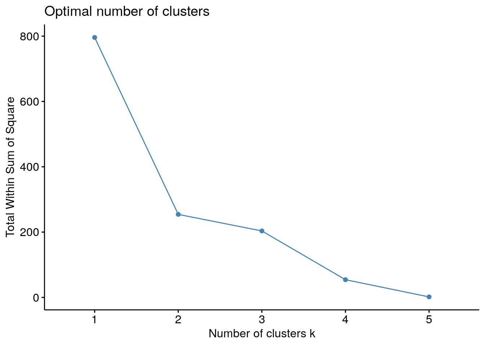
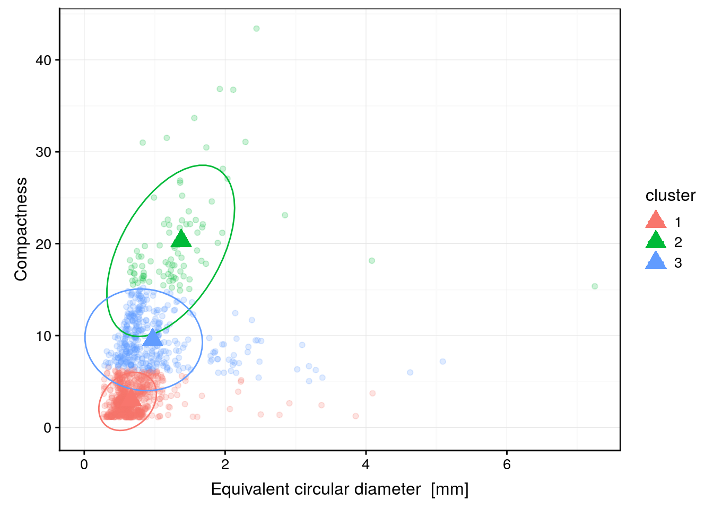
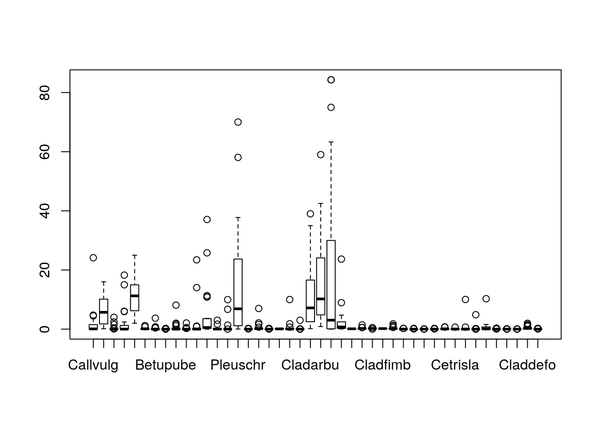
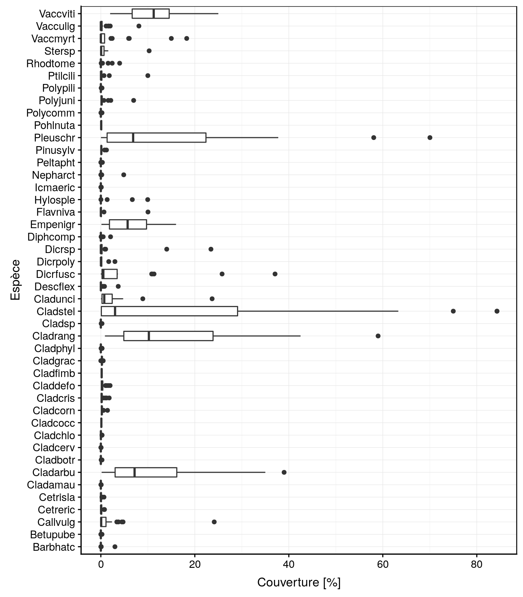
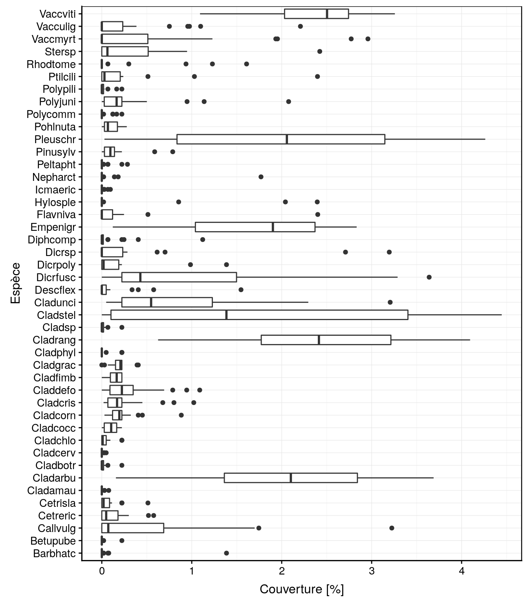
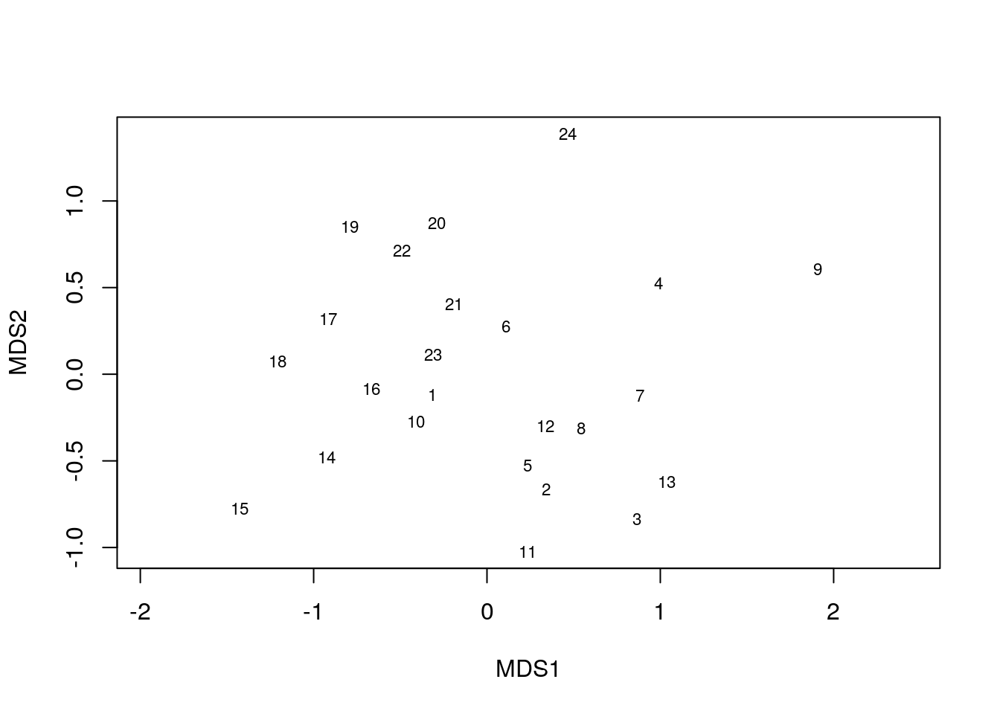
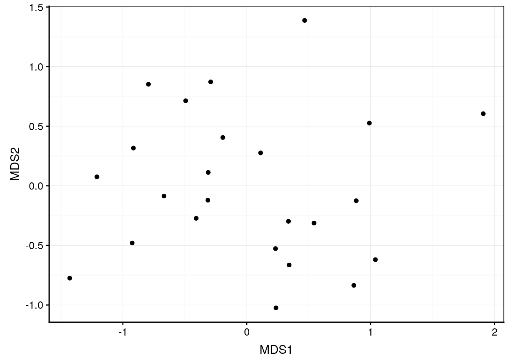
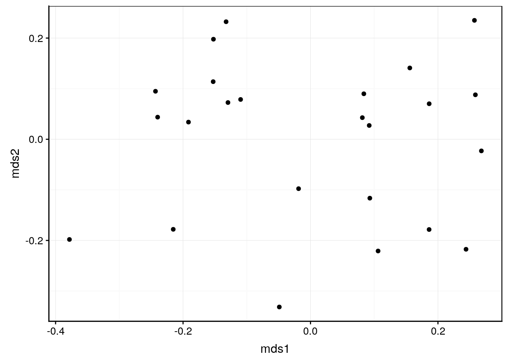
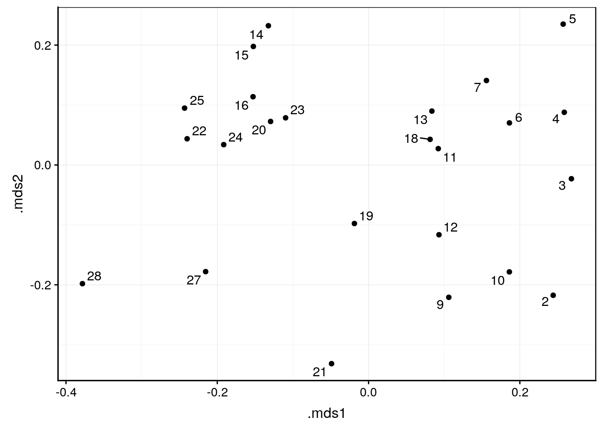

# K-moyenne, MDS & SOM {#k-moyenne-mds-som}


##### Objectifs {-}

- Maîtriser la technique de classification par les k-moyennes comme alternative à la CAH pour les gros jeux de données.
- Comprendre la représentation d'une matrice de distances sur un carte (ordination) et la réduction de dimensions via le positionnement multidimensionnel MDS.
- Être capable de créer des cartes auto-adaptatives ou SOM, de les interpréter et de les utiliser comme autre technique de classification.

##### Prérequis {-}

Ces techniques étant basées sur des matrices de distances et complémentaires à la classification ascendante hiérarchique, le module \@ref(hierarchique) doit être assimilé avant de s'attaquer au présent module.


## K-moyennes

Les k-moyennes (ou "k-means" en anglais) représentent une autre façon de regrouper les individus d'un tableau multivarié. Par rapport à la CAH, cette technique est généralement moins efficace, mais elle a l'avantage de permettre le regroupement d'un très grand nombre d'individus (gros jeu de données), là où la CAH nécessiterait trop de temps de calcul et de mémoire vive. Il est donc utile de connaitre cette seconde technique à utiliser comme solution de secours lorsque le dendrogramme de la CAH devient illisible sur de très gros jeux de données.

Le principe des k-moyennes est très simple^[En pratique, différents algorithmes avec diverses optimisations existent. Le plus récent et le plus sophistiqué est celui de Hartigan-Wong. Il est utilisé par défaut par la fonction `kmeans()`. En pratique, il y a peu de raison d'en changer.]\ :

- L'utilisateur choisi le nombre de groupes *k* qu'il veut obtenir à l'avance.
- La position des *k* centres est choisie au hasard au début.
- Les individus sont attribués aux *k* groupes en fonction de leurs distances aux centres (attribution au groupe de centre le plus proche).
- Les *k* centres sont replacés au centre de gravité des groupes ainsi obtenus.
- Les individus sont réaffectés en fonction de leurs distances à ces nouveaux centres.
- Si au moins un individu a changé de groupe, le calcul est réitéré. Sinon, nous considérons avoir atteint la configuration finale.

La technique est superbement expliquée et illustrée dans la vidéo suivante\ :

<!--html_preserve--><iframe src="https://www.youtube.com/embed/Aic2gHm9lt0" width="770" height="433" frameborder="0" allowfullscreen=""></iframe><!--/html_preserve-->

Essayez par vous même via l'application ci-dessous qui utilise le célèbre jeu de données `iris`. Notez que vous devez utiliser des variables **numériques**. Par exemple, `Species` étant une variable qualitative, vous verrez que cela ne fonctionne pas dans ce cas.

<iframe src="https://jjallaire.shinyapps.io/shiny-kmeans/?showcase=0" width="100%" height="600px" style="border: none;"></iframe>

### Exemple simple

Afin de comparer la classification par k-moyennes à celle par CAH, nous reprendrons ici le même jeu de données `zooplankton`.


```r
zoo <- read("zooplankton", package = "data.io")
zoo
```

```
# # A tibble: 1,262 x 20
#      ecd  area perimeter feret major minor  mean  mode   min   max std_dev
#    <dbl> <dbl>     <dbl> <dbl> <dbl> <dbl> <dbl> <dbl> <dbl> <dbl>   <dbl>
#  1 0.770 0.465      4.45 1.32  1.16  0.509 0.363 0.036 0.004 0.908   0.231
#  2 0.700 0.385      2.32 0.728 0.713 0.688 0.361 0.492 0.024 0.676   0.183
#  3 0.815 0.521      4.15 1.33  1.11  0.598 0.308 0.032 0.008 0.696   0.204
#  4 0.785 0.484      4.44 1.78  1.56  0.394 0.332 0.036 0.004 0.728   0.218
#  5 0.361 0.103      1.71 0.739 0.694 0.188 0.153 0.016 0.008 0.452   0.110
#  6 0.832 0.544      5.27 1.66  1.36  0.511 0.371 0.02  0.004 0.844   0.268
#  7 1.23  1.20      15.7  3.92  1.37  1.11  0.217 0.012 0.004 0.784   0.214
#  8 0.620 0.302      3.98 1.19  1.04  0.370 0.316 0.012 0.004 0.756   0.246
#  9 1.19  1.12      15.3  3.85  1.34  1.06  0.176 0.012 0.004 0.728   0.172
# 10 1.04  0.856      7.60 1.89  1.66  0.656 0.404 0.044 0.004 0.88    0.264
# # … with 1,252 more rows, and 9 more variables: range <dbl>, size <dbl>,
# #   aspect <dbl>, elongation <dbl>, compactness <dbl>, transparency <dbl>,
# #   circularity <dbl>, density <dbl>, class <fct>
```

Commençons par l'exemple simplissime de la réalisation de deux groupes à partir de six individus issus de ce jeu de données, comme nous l'avons fait avec la CAH\ :


```r
zoo %>.%
  select(., -class) %>.% # Elimination de la colonne class
  slice(., 13:18) -> zoo6      # Récupération des lignes 13 à 18

zoo6_kmeans <- kmeans(zoo6, centers = 2)
zoo6_kmeans
```

```
# K-means clustering with 2 clusters of sizes 3, 3
# 
# Cluster means:
#         ecd      area perimeter    feret    major     minor      mean
# 1 1.1926500 1.1279667 10.346667 2.201133 1.677067 0.8596333 0.3217333
# 2 0.6292647 0.3188667  3.224133 1.159200 1.096433 0.4023333 0.1871667
#        mode        min       max   std_dev     range      size    aspect
# 1 0.3533333 0.00400000 0.8986667 0.2620000 0.8946667 1.2683500 0.5149422
# 2 0.1026667 0.01066667 0.5400000 0.1166667 0.5293333 0.7493833 0.4753843
#   elongation compactness transparency circularity    density
# 1  23.046713    7.987806   0.06173831   0.1357000 0.37630000
# 2   6.333315    2.727708   0.14732060   0.4900333 0.06943333
# 
# Clustering vector:
# [1] 2 1 2 1 1 2
# 
# Within cluster sum of squares by cluster:
# [1] 200.03837  54.18647
#  (between_SS / total_SS =  68.1 %)
# 
# Available components:
# 
# [1] "cluster"      "centers"      "totss"        "withinss"    
# [5] "tot.withinss" "betweenss"    "size"         "iter"        
# [9] "ifault"
```

Nous voyons que la fonction `kmeans()` effectue notre classification. Nous lui fournissons le tableau de départ et spécifions le nombre *k* de groupes souhaités via l'argument `centers =`. Ne pas oublier d'assigner le résultat du calcul à une nouvelle variable, ici `zoo6_kmeans`, pour pouvoir l'inspecter et l'utiliser par la suite. L'impression du contenu de l'objet nous donne plein d'information dont\ :

- le nombre d'individus dans chaque groupe (ici 3 et 3),
- la position des centres pour les *k* groupes dans `Cluster means`,
- l'appartenance aux groupes dans `Cluster vectors` (dans le même ordre que les lignes du tableau de départ),
- la sommes des carrés des distances entre les individus et la moyenne au sein de chaque groupe dans `Within cluster sum of squares`\ ; le calcul `between_SS / total_SS` est à mettre en parallèle avec le $R^2$ de la régression linéaire\ : c'est une mesure de la qualité de regroupement des données (plus la valeur est proche de 100% mieux c'est, mais attention que cette valeur augmente d'office en même temps que *k*),
- et enfin, la liste des composants accessibles via l'opérateur `$`\ ; par exemple, pour obtenir les groupes (opération similaire à `cutree()` pour la CAH), nous ferons\ :


```r
zoo6_kmeans$cluster
```

```
# [1] 2 1 2 1 1 2
```

Le package `broom` contient trois fonctions complémentaires qui nous seront utiles\ : `tidy()`, `augment()` et `glance()`. `broom::glance()` retourne un `data.frame` avec les statistiques permettant d'évaluer la qualité de la classification obtenue\ :


```r
broom::glance(zoo6_kmeans)
```

```
# # A tibble: 1 x 4
#   totss tot.withinss betweenss  iter
#   <dbl>        <dbl>     <dbl> <int>
# 1  796.         254.      542.     1
```

De plus, le package `factoextra` propose une fonction `fviz_nbclust()` qui réalise un graphique pour aider au choix optimal de *k*\ :


```r
factoextra::fviz_nbclust(zoo6, kmeans, method = "wss", k.max = 5)
```



Le graphique obtenu montre la décroissance de la somme des carrés des distances intra-groupes en fonction de *k*. Avec *k* = 1, nous considérons toutes les données dans leur ensemble et nous avons simplement la somme des carrés des distances euclidiennes entre tous les individus et le centre de gravité du nuage de points dont les coordonnées sont les moyennes de chaque variable. C'est le point de départ qui nous indique de combien les données sont dispersées (la valeur absolue de ce nombre n'est pas importante).

Ensuite, avec *k* croissant, notre objectif est de faire des regroupement qui diminuent la variance intra-groupe autant que possible, ce que nous notons par la diminution de la somme des carrés intra-groupes (la variance du groupe est, en effet, la somme des carrés des distances enclidiennes entre les points et le centre du groupe, divisée par les degrés de liberté).

Nous recherchons ici des sauts importants dans la décroissance de la somme des carrés, tout comme dans le dendrogramme obtenu par la CAH nous recherchions des sauts importants dans les regroupements (hauteur des barres verticales du dendrogramme). Nous observons ici un saut important pour *k* = 2, puis une diminution moins forte de *k* = 3 à *k* = 5. Ceci *suggère* que nous pourrions considérer deux groupes.

\BeginKnitrBlock{note}<div class="note">Le nombre de groupes proposé par `factoextra::fviz_nbclust()` n'est qu'indicatif\ ! Si vous avez par ailleurs d'autres informations qui vous suggèrent un regroupement différent, ou si vous voulez essayer un regroupement plus ou moins détaillé par rapport à ce qui est proposé, c'est tout aussi correct.

La fonction `factoextra::fviz_nbclust()` propose d'ailleurs deux autres méthodes pour déterminer le nombre optimal de groupes *k*, avec `method = "silhouette"` ou `method = "gap_stat"`. Voyez l'aide en ligne de cette fonction `?factoextra::fviz_nbclust`. Ces différentes méthodes peuvent d'ailleurs suggérer des regroupements différents pour les mêmes données... preuve qu'il n'y a pas *une et une seule* solution optimale\ !</div>\EndKnitrBlock{note}

A ce stade, nous pouvons collecter les groupes et les ajouter à notre tableau de données. Pour la CAH, vous avez déjà remarqué que rajouter ces groupes dans le *tableau de départ* peut mener à des effets surprenants si nous relançons ensuite l'analyse sur le tableau ainsi complété^[Nous vous avons proposé exprès de rajouter les groupes dans le tableau de départ pour que vous soyez confronté à ce problème. Ici, nous proposons donc une autre façon de travailler qui l'évite en assignant le résultat dans une *autre* variable.]. Donc, nous prendrons soin de placer les données ainsi complétées de la colonne `cluster` dans un tableau différent nommé `zoo6b`. Pour se faire, nous pouvons utiliser `broom::augment()`.


```r
broom::augment(zoo6_kmeans, zoo6) %>.%
  rename(., cluster = .cluster) -> zoo6b
names(zoo6b)
```

```
#  [1] "ecd"          "area"         "perimeter"    "feret"       
#  [5] "major"        "minor"        "mean"         "mode"        
#  [9] "min"          "max"          "std_dev"      "range"       
# [13] "size"         "aspect"       "elongation"   "compactness" 
# [17] "transparency" "circularity"  "density"      "cluster"
```

Comme vous pouvez le constater, une nouvelle colonne nommée `.cluster` a été ajoutée au tableau en dernière position, que nous avons renommée immédiatement en `cluster` ensuite (c'est important pour le graphique plus loin). Elle contient ceci\ :


```r
zoo6b$cluster
```

```
# [1] 2 1 2 1 1 2
# Levels: 1 2
```

C'est le contenu de `zoo6_kmeans$cluster`, mais transformé en variable `factor`.


```r
class(zoo6b$cluster)
```

```
# [1] "factor"
```

Nous pouvons enfin utiliser `broom::tidy()` pour obtenir un tableau avec les coordonnées des *k* centres. Nous l'enregistrerons dans la variable `zoo6_centers`, en ayant bien pris soin de nommer les variables du même nom que dans le tableau original `zoo6` (argument `col.names = names(zoo6)`, cela sera important pour le graphique ci-dessous)\ :


```r
zoo6_centers <- broom::tidy(zoo6_kmeans, col.names = names(zoo6))
zoo6_centers
```

```
# # A tibble: 2 x 21
#     ecd  area perimeter feret major minor  mean  mode    min   max std_dev
#   <dbl> <dbl>     <dbl> <dbl> <dbl> <dbl> <dbl> <dbl>  <dbl> <dbl>   <dbl>
# 1 1.19  1.13      10.3   2.20  1.68 0.860 0.322 0.353 0.004  0.899   0.262
# 2 0.629 0.319      3.22  1.16  1.10 0.402 0.187 0.103 0.0107 0.540   0.117
# # … with 10 more variables: range <dbl>, size <int>, aspect <dbl>,
# #   elongation <dbl>, compactness <dbl>, transparency <dbl>,
# #   circularity <dbl>, density <dbl>, withinss <dbl>, cluster <fct>
```

La dernière colonne de ce tableau est également nommée `cluster`. C'est le lien entre le tableau `zoo6b` augmenté et `zoo6_centers`. Nous avons maintenant tout ce qu'il faut pour représenter graphiquement les regroupements effectués par les k-moyennes en colorant les points en fonction de la nouvelle variable `cluster`.


```r
chart(data = zoo6b, area ~ circularity %col=% cluster) +
  geom_point() + # Affiche les points représentant les individus
  geom_point(data = zoo6_centers, size = 5, shape = 17) # Ajoute les centres
```


Comparez avec le graphique équivalent au module précédent consacré à la CAH. Outre que l'ordre des groupes est inversé et que les données n'ont pas été standardisées ici, un point est classé dans un groupe différent par les deux méthodes. Il s'agit du point ayant environ 0.25 de circularité et 0.5 de surface. Comme nous connaissons par ailleurs la classe à laquelle appartient chaque individu, nous pouvons la récupérer comme colonne supplémentaire du tableau `zoo6b` et ajouter cette information sur notre graphique.


```r
zoo6b$class <- zoo$class[13:18]
zoo6_centers$class <- "" # Ceci est nécessaire pour éviter le label des centres
chart(data = zoo6b, area ~ circularity %col=% cluster %label=% class) +
  geom_point() +
  ggrepel::geom_text_repel() + # Ajoute les labels intelligemment
  geom_point(data = zoo6_centers, size = 5, shape = 17)
```


Nous constatons que le point classé différemment est un "Poecilostomatoïd". Or, l'autre groupe des k-moyennes contient aussi un individu de la même classe. Donc, CAH a mieux classé notre plancton que les k-moyennes dans le cas présent. Ce n'est pas forcément toujours le cas, mais souvent.

Un dernier point est important à mentionner. Comme les k-moyennes partent d'une position aléatoire des *k* centres, le résultat final peut varier et n'est pas forcément optimal. Pour éviter cela, nous pouvons indiquer à `kmeans()` d'essayer différentes situations de départ via l'argument `nstart =`. Par défaut, nous prenons une seule situation aléatoire de départ `nstart = 1`, mais en indiquant une valeur plus élevée pour cet argument, il est possible d'essayer plusieurs situations de départ et ne garder que le meilleur résultat final. Cela donne une analyse plus robuste et plus reproductible... mais le calcul est naturellement plus long.


```r
kmeans(zoo6, centers = 2, nstart = 50) # 50 positions de départ différentes
```

```
# K-means clustering with 2 clusters of sizes 3, 3
# 
# Cluster means:
#         ecd      area perimeter    feret    major     minor      mean
# 1 0.6292647 0.3188667  3.224133 1.159200 1.096433 0.4023333 0.1871667
# 2 1.1926500 1.1279667 10.346667 2.201133 1.677067 0.8596333 0.3217333
#        mode        min       max   std_dev     range      size    aspect
# 1 0.1026667 0.01066667 0.5400000 0.1166667 0.5293333 0.7493833 0.4753843
# 2 0.3533333 0.00400000 0.8986667 0.2620000 0.8946667 1.2683500 0.5149422
#   elongation compactness transparency circularity    density
# 1   6.333315    2.727708   0.14732060   0.4900333 0.06943333
# 2  23.046713    7.987806   0.06173831   0.1357000 0.37630000
# 
# Clustering vector:
# [1] 1 2 1 2 2 1
# 
# Within cluster sum of squares by cluster:
# [1]  54.18647 200.03837
#  (between_SS / total_SS =  68.1 %)
# 
# Available components:
# 
# [1] "cluster"      "centers"      "totss"        "withinss"    
# [5] "tot.withinss" "betweenss"    "size"         "iter"        
# [9] "ifault"
```

Dans ce cas simple, cela ne change pas grand chose. Mais avec un plus gros jeu de données plus complexe, cela peut être important.


### Classification du zooplancton

Maintenant que nous savons utiliser `kmeans()` et les fonctions annexes, nous pouvons classer le jeu de données `zoo` tout entier.


```r
zoo %>.%
  select(., -class) %>.%
  factoextra::fviz_nbclust(., kmeans, method = "wss", k.max = 10)
```


Nous observons un saut maximal pour *k* = 2, mais le saut pour *k* = 3 est encore conséquent. Afin de comparer avec ce que nous avons fait par CAH, nous utiliserons donc *k* = 3. Enfin, comme un facteur aléatoire intervient, qui définira au final le numéro des groupes, nous utilisons `set.seed()` pour rendre l'analyse reproductible. Pensez à donner une valeur différente à cette fonction pour chaque utilisation\ ! Et pensez aussi à éliminer les colonnes non numériques à l'aide de `select()`.


```r
set.seed(562)
zoo_kmeans <- kmeans(select(zoo, -class), centers = 3, nstart = 50)
zoo_kmeans
```

```
# K-means clustering with 3 clusters of sizes 786, 91, 385
# 
# Cluster means:
#         ecd     area perimeter    feret     major     minor      mean
# 1 0.6664955 0.431915  3.575374 1.134705 0.9744768 0.4780780 0.2388065
# 2 1.3774670 1.998097 19.653860 4.063837 2.1465758 0.9602846 0.1488495
# 3 0.9715857 1.009902  9.197299 2.668022 1.8468984 0.6194652 0.1723774
#         mode         min       max   std_dev     range      size    aspect
# 1 0.09256997 0.007094148 0.7269109 0.1842660 0.7198168 0.7262774 0.5372808
# 2 0.02470330 0.004000000 0.7013187 0.1472286 0.6973187 1.5534302 0.5362249
# 3 0.04455065 0.004207792 0.6315844 0.1512922 0.6273766 1.2331818 0.5349924
#   elongation compactness transparency circularity    density
# 1   7.184451    3.002093   0.07385014  0.42917214 0.09349338
# 2  61.837019   20.325398   0.09737903  0.05186813 0.31140879
# 3  27.898079    9.529156   0.11719954  0.11197351 0.16938468
# 
# Clustering vector:
#    [1] 1 1 1 1 1 1 2 1 2 1 1 3 1 3 1 3 3 1 2 1 1 1 1 3 3 1 1 3 1 1 1 1 1 1
#   [35] 3 1 3 1 1 1 1 1 1 1 1 1 1 1 1 1 1 1 1 1 1 1 1 3 1 1 3 1 1 3 1 3 3 1
#   [69] 3 1 1 1 1 2 1 1 1 1 1 3 1 1 1 1 1 2 1 1 3 1 1 3 1 2 1 1 1 1 1 1 1 1
#  [103] 1 1 3 1 1 1 1 1 1 1 1 1 1 1 1 1 1 1 1 1 1 1 1 1 1 1 3 1 1 1 1 1 1 1
#  [137] 1 1 1 1 1 3 1 1 2 3 2 3 1 1 1 1 1 3 3 3 3 3 1 2 1 1 1 1 1 1 1 3 1 1
#  [171] 1 1 1 1 1 1 1 1 1 1 1 1 1 3 1 1 1 1 1 1 1 1 3 1 1 1 1 1 1 1 1 1 1 1
#  [205] 1 3 1 1 1 1 1 1 1 1 1 3 1 1 1 1 1 1 1 1 1 1 1 1 1 1 1 1 1 1 1 1 1 1
#  [239] 1 1 1 1 1 3 1 1 1 1 1 1 1 3 1 1 1 1 1 1 1 1 1 1 1 1 1 1 1 1 2 2 2 3
#  [273] 3 2 1 1 3 1 3 3 1 3 1 1 2 1 1 2 3 2 3 3 1 1 1 1 3 3 2 1 3 1 3 3 1 3
#  [307] 3 3 2 1 3 3 2 1 3 2 2 1 2 3 3 3 1 1 3 1 1 3 1 1 1 1 1 3 1 2 1 1 1 3
#  [341] 1 1 1 1 1 1 3 3 3 1 3 3 1 1 1 1 1 1 3 1 1 1 1 1 1 1 1 3 1 3 1 1 1 1
#  [375] 3 1 1 1 1 1 1 3 3 1 1 1 1 1 3 3 1 1 3 1 3 3 1 3 3 1 1 1 1 1 1 1 1 3
#  [409] 1 1 1 3 3 1 1 1 1 1 1 1 3 3 3 2 1 3 3 1 1 1 3 3 3 1 1 1 1 2 1 1 3 3
#  [443] 2 1 3 1 3 1 3 1 3 1 1 3 1 3 1 3 3 1 1 1 1 1 3 1 1 3 1 1 1 3 1 1 3 1
#  [477] 1 1 3 1 1 1 1 1 1 1 1 3 1 3 3 3 1 3 1 3 1 3 3 3 1 1 1 1 1 1 1 1 3 3
#  [511] 1 3 2 3 1 2 1 1 3 3 3 1 3 1 1 1 2 1 2 2 3 1 3 1 1 1 3 1 1 1 1 3 3 1
#  [545] 1 1 3 3 1 1 3 1 3 1 1 3 2 3 1 1 1 1 2 1 3 1 1 1 1 1 1 1 1 1 1 1 1 1
#  [579] 1 2 3 3 3 2 1 2 3 3 2 1 3 3 3 1 1 3 3 2 1 1 1 1 1 1 1 1 1 3 1 3 3 1
#  [613] 1 1 1 1 1 1 2 1 1 1 1 1 3 3 2 3 1 3 2 3 1 3 1 3 3 1 1 1 1 3 3 3 3 3
#  [647] 3 3 1 1 3 1 1 1 1 1 1 1 3 3 3 3 3 3 1 2 3 3 3 3 1 1 3 3 1 1 1 1 3 3
#  [681] 3 1 1 1 1 1 1 3 1 1 1 3 1 1 3 3 3 3 3 1 1 2 1 1 2 3 1 3 1 1 3 2 2 3
#  [715] 1 1 2 3 1 2 3 3 3 2 3 1 3 2 1 3 1 1 2 3 1 2 1 2 3 3 3 1 2 1 3 3 2 3
#  [749] 3 1 1 3 1 3 3 1 1 1 1 1 3 3 3 1 1 1 1 3 3 3 1 1 1 1 3 1 1 1 3 1 1 3
#  [783] 1 3 1 1 1 3 1 1 3 1 1 3 1 1 3 1 1 1 3 1 3 2 3 1 1 3 3 2 1 3 1 1 3 3
#  [817] 3 1 1 1 3 1 1 1 1 1 1 1 1 1 3 1 3 3 1 1 1 3 1 3 3 1 3 1 1 1 1 1 1 1
#  [851] 3 3 3 1 1 3 3 3 1 1 1 1 1 1 3 1 3 2 3 1 3 1 3 1 1 2 1 2 1 3 3 3 3 3
#  [885] 3 3 1 1 3 1 1 1 3 2 1 3 1 1 1 1 3 1 3 1 1 1 3 3 1 3 1 1 3 1 1 3 1 2
#  [919] 1 3 3 1 1 3 3 1 1 1 2 3 2 3 2 3 3 3 2 1 3 2 3 3 3 1 3 3 3 3 3 3 2 3
#  [953] 3 1 3 1 1 1 1 1 1 3 1 1 1 1 1 1 3 1 1 2 1 2 1 1 1 1 3 3 3 3 1 1 1 2
#  [987] 2 1 3 3 1 2 1 3 3 2 3 3 3 3 1 3 2 3 2 3 2 1 3 1 1 1 1 3 3 1 3 1 2 3
# [1021] 1 1 3 3 3 3 3 1 3 3 3 1 1 3 3 1 2 3 3 3 2 1 3 2 1 3 3 2 1 1 3 1 1 1
# [1055] 3 1 1 1 1 1 1 1 1 3 3 3 3 3 2 3 3 3 3 1 3 3 3 1 3 2 1 3 3 3 2 3 1 1
# [1089] 1 1 1 2 1 3 3 1 2 2 3 1 1 3 3 1 1 2 3 3 3 3 3 1 1 1 2 1 1 1 1 1 1 1
# [1123] 3 1 1 1 3 1 3 3 1 1 3 1 1 1 1 1 1 3 3 1 3 3 3 3 2 1 1 1 1 3 1 1 1 1
# [1157] 1 1 1 1 1 1 1 1 1 1 1 3 3 3 3 3 1 1 3 3 1 1 1 3 1 1 1 1 3 1 1 1 1 1
# [1191] 1 1 1 1 1 1 1 1 1 1 3 1 1 1 1 1 1 1 1 1 1 1 1 1 1 1 3 1 1 1 1 1 1 1
# [1225] 1 1 1 1 1 1 1 1 1 1 1 1 1 1 1 1 1 1 3 1 1 1 1 1 1 1 1 1 1 1 1 1 1 3
# [1259] 3 3 3 3
# 
# Within cluster sum of squares by cluster:
# [1] 24356.96 43792.25 39813.31
#  (between_SS / total_SS =  77.0 %)
# 
# Available components:
# 
# [1] "cluster"      "centers"      "totss"        "withinss"    
# [5] "tot.withinss" "betweenss"    "size"         "iter"        
# [9] "ifault"
```

Récupérons les clusters dans `zoob`


```r
broom::augment(zoo_kmeans, zoo) %>.%
  rename(., cluster = .cluster) -> zoob
```

Et enfin, effectuons un graphique similaire à celui réalisé pour la CAH au module précédent. À noter que nous pouvons ici choisir n'importe quelle paire de variables quantitatives pour représenter le nuage de points. Nous ajoutons des ellipses pour matérialiser les groupes à l'aide de `stat_ellipse()`. Elles contiennent 95% des points du groupe à l'exclusion des extrêmes. Enfin, comme il y a beaucoup de points, nous choisissons de les rendre semi-transparents avec l'argument `alpha = 0.2` pour plus de lisibilité du graphique.


```r
chart(data = zoob, compactness ~ ecd %col=% cluster) +
  geom_point(alpha = 0.2) +
  stat_ellipse() +
  geom_point(data = broom::tidy(zoo_kmeans, col.names = names(zoo6)), size = 5, shape = 17)
```



Nous observons ici un regroupement beaucoup plus simple qu'avec la CAH, essentiellement stratifié de bas en haut en fonction de la compacité des points (`Compactness`). La tabulation des clusters en fonction des classes connues par ailleurs montre aussi que les k-moyennes les séparent moins bien que ce qu'a pu faire la CAH\ :


```r
table(zoob$class, zoob$cluster)
```

```
#                   
#                      1   2   3
#   Annelid           38   6   6
#   Appendicularian   21   0  15
#   Calanoid          82  41 165
#   Chaetognath        6   0  45
#   Cirriped          14   0   8
#   Cladoceran        50   0   0
#   Cnidarian         13   3   6
#   Cyclopoid          5   5  40
#   Decapod          117   0   9
#   Egg_elongated     50   0   0
#   Egg_round         49   0   0
#   Fish              50   0   0
#   Gastropod         50   0   0
#   Harpacticoid       1   9  29
#   Malacostracan     54  26  41
#   Poecilostomatoid 143   1  14
#   Protist           43   0   7
```

Le cluster numéro 2 n'est pas vraiment défini en terme des classes de plancton car aucune classe ne s'y trouve de manière majoritaire. Le groupe numéro 1 contient la majorité des items de diverses classes, alors que le groupe 3 a une majorité de calanoïdes et d'harpacticoïdes (différents copépodes). Globalement, le classement a un sens, mais est moins bien corrélé avec les classes de plancton que ce que la CAH nous a fourni. Notez que, si nous avions standardisé les données avant d'effectuer les k-moyennes comme nous l'avons fait pour la CAH, nous aurions obtenu d'autres résultats. **La transformation des variables préalablement à l'analyse reste une approche intéressante pour moduler l'importance des différentes variables entre elles dans leur impact sur le calcul des distances, et donc, des regroupements réalisés**. Nous vous laissons réaliser les k-moyennes sur les données `zoo standardisées à l'aide de la fonction `scale()` comme pour la CAH comme exercice.


##### A vous de jouer ! {-}

- Réalisez le tutoriel afin de vérifier votre bonne compréhension de la méthode des k-moyennes.

\BeginKnitrBlock{bdd}<div class="bdd">Démarrez la SciViews Box et RStudio. Dans la fenêtre **Console** de RStudio, entrez l'instruction suivante suivie de la touche `Entrée` pour ouvrir le tutoriel concernant les bases de R\ :

    BioDataScience2::run("06a_kmeans")

N’oubliez pas d’appuyer sur la touche `ESC` pour reprendre la main dans R à la fin d’un tutoriel dans la console R.</div>\EndKnitrBlock{bdd}

- Complétez votre carnet de note par binôme sur le transect entre Nice et Calvi débuté lors du module 5. Lisez attentivement le README (Ce dernier a été mis à jour).

\BeginKnitrBlock{bdd}<div class="bdd">
Completez votre projet. Lisez attentivement le README.

La dernière version du README est disponible via le lien suivant\ :
  
- <https://github.com/BioDataScience-Course/spatial_distribution_zooplankton_ligurian_sea></div>\EndKnitrBlock{bdd}


##### Pour en savoir plus {-}

Il existe une approche mixte qui mèle la CAH et les k-moyennes. Cette approche est intéressante pour les gros jeux de données. Le problématique est expliquée [ici](https://lovelyanalytics.com/2017/11/18/cah-methode-mixte/), et l'implémentation dans la fonction `factoextra::hkmeans()` est détaillée [ici (en anglais)](https://www.datanovia.com/en/lessons/hierarchical-k-means-clustering-optimize-clusters/).

Cet [article](https://www.r-bloggers.com/the-complete-guide-to-clustering-analysis-k-means-and-hierarchical-clustering-by-hand-and-in-r/) explique dans le détail `kmeans()` et `hclust()` dans R, et montre aussi comment on peut calculer les k-moyennes à la main pour bien en comprendre la logique (en anglais).


## Positionnement multidimensionnel (MDS)

Le positionnement multidimensionnel, ou "multidimensional scaling" en anglais, d'où son acronyme fréquemment utilisé en français également\ : le MDS, est une autre façon de représenter clairement l'information contenue dans une matrice de distances. Ici, l'objectif n'est pas de **regrouper** ou de **classifier** les individus du tableau, mais de les **ordonner** sur un graphique en nuage de points en deux ou trois dimensions. Ce graphique s'appelle une "carte", et la technique qui la réalise est une **méthode d'ordination**.

Au départ, nous avons *p* colonnes et *n* lignes dans le tableau cas par variables, c'est-à-dire, *p* variables quantitatives mesurées sur *n* individus distincts. Nous voulons déterminer les similitudes ou différences de ces *n* individus en les visualisant sur une carte où la distance d'un individu à l'autre représente cette similitude. Plus deux individus sont proches, plus ils sont semblables. Plus les individus sont éloignés, plus ils diffèrent. Ces distances entre paires d'individus, nous les avons déjà calculées dans la matrice de distances. Mais comment les représenter\ ? En effet, une représentation exacte ne peut se faire que dans un espace à *p* dimensions (même nombre de dimensions que de variables initiales). Donc, afin de réduire les dimensions à seulement 2 ou 3, nous allons devoir "tordre" les données et accepter de perdre un peu d'information. Ce que nous allons faire avec la MDS correspond exactement à cela\ : nous allons littéralement "écraser" les données dans un plan (deux dimensions) ou dans un espace à trois dimensions. C'est donc ce qu'on appelle une technique de **réduction de dimensions**.


Il existe, en réalité, plusieurs techniques de MDS. Elle répondent toutes au schéma suivant\ :

- A partir d'un tableau multivarié de *n* lignes et *p* colonnes, nous calculons une matrice de distances (le choix de la transformation initiale éventuelle et de la métrique de distance utilisée sont totalement libres ici^[Chaque métrique de distance offre un éclairage différent sur les données. Elles agissent comme autant de filtres différents à votre disposition pour explorer vos données multivariées.]).
- Nous souhaitons représenter une carte (nuage de points) à *m* dimensions (*m* = 2, éventuellement *m* = 3) où les *n* individus seront placés de telle façon que les proximités exprimées par des valeurs faibles dans la matrice de dissimilarité soient respectées *autant que possible* entre tous les points.
- Pour y arriver les points sont placés successivement sur la carte et réajustés afin de minimiser une **fonction de coût**, encore appelée **fonction de stress** qui quantifie de combien nous avons dû "tordre" le réseau à *p* dimensions initial représentant les distances entre toutes les paires. C'est en adoptant différentes fonctions de stress que nous aboutissons aux différentes variantes de MDS. La fonction de stress est représentée graphiquement (voir ci-dessous) pour diagnostiquer le traitement réaliser et décider si la représentation est utilisable (pas trop tordue) ou non.
- Le positionnement des points faisant intervenir un facteur aléatoire (choix des points à placer en premier, réorganisation ensuite pour minimiser la fonction de stress), le résutat final peut varier d'une fois à l'autre sur les mêmes données. Il faut en être conscient.

Nous vous épargnons ici les développements mathématiques qui mènent à la définition de la fonction de stress. Nous nous concentrerons sur les principales techniques et sur leurs propriétés utiles en pratique.


### MDS classique ou PCoA

La forme classique, aussi appelée **analyse en coordonnées principales** (Principal Coordinates Analysis en anglais ou PCoA), va *projetter* le nuage de points à *p* dimensions dans un espace réduit à *k* = 2 dimensions (voire éventuellement à 3 dimensions). Cette projection est comme l'ombre chinoise projettée d'un objet tridimensionnel sur une surface place en deux dimensions.


Partant d'une matrice de distance, élaborée à l'aide de la métrique de votre choix (euclidienne, Manhattan, Bray-Curtis, Canberra, ...) la projection est calculée à l'aide de la fonction `cmdscale()`. Appliqué aux données `iris`, cela donne\ :

Considérons un relevé de couverture végétale en 24 stations concernant 44 plantes répertoriées sur le site de l'étude, par exemple, `Callvulg` est *[Calluna vulgaris](https://www.tela-botanica.org/bdtfx-nn-12262-synthese)*, `Empenigr` est *[Empetrum nigrum](https://www.tela-botanica.org/bdtfx-nn-23935-synthese)*, etc. Les valeurs sont les couvertures végétales observées pour chaque plante sur le site, expérimées en pourcents. La première colonne nommée `rownames` contient les identifiants des stations. Nous allons les enlever du tableau après les avoir transférés dans la variable `stations`.


```r
veg <- read("varespec", package = "vegan")
veg
```

```
# # A tibble: 24 x 45
#    rownames Callvulg Empenigr Rhodtome Vaccmyrt Vaccviti Pinusylv Descflex
#    <chr>       <dbl>    <dbl>    <dbl>    <dbl>    <dbl>    <dbl>    <dbl>
#  1 18           0.55    11.1      0        0       17.8      0.07     0   
#  2 15           0.67     0.17     0        0.35    12.1      0.12     0   
#  3 24           0.1      1.55     0        0       13.5      0.25     0   
#  4 27           0       15.1      2.42     5.92    16.0      0        3.7 
#  5 23           0       12.7      0        0       23.7      0.03     0   
#  6 19           0        8.92     0        2.42    10.3      0.12     0.02
#  7 22           4.73     5.12     1.55     6.05    12.4      0.1      0.78
#  8 16           4.47     7.33     0        2.15     4.33     0.1      0   
#  9 28           0        1.63     0.35    18.3      7.13     0.05     0.4 
# 10 13          24.1      1.9      0.07     0.22     5.3      0.12     0   
# # … with 14 more rows, and 37 more variables: Betupube <dbl>,
# #   Vacculig <dbl>, Diphcomp <dbl>, Dicrsp <dbl>, Dicrfusc <dbl>,
# #   Dicrpoly <dbl>, Hylosple <dbl>, Pleuschr <dbl>, Polypili <dbl>,
# #   Polyjuni <dbl>, Polycomm <dbl>, Pohlnuta <dbl>, Ptilcili <dbl>,
# #   Barbhatc <dbl>, Cladarbu <dbl>, Cladrang <dbl>, Cladstel <dbl>,
# #   Cladunci <dbl>, Cladcocc <dbl>, Cladcorn <dbl>, Cladgrac <dbl>,
# #   Cladfimb <dbl>, Cladcris <dbl>, Cladchlo <dbl>, Cladbotr <dbl>,
# #   Cladamau <dbl>, Cladsp <dbl>, Cetreric <dbl>, Cetrisla <dbl>,
# #   Flavniva <dbl>, Nepharct <dbl>, Stersp <dbl>, Peltapht <dbl>,
# #   Icmaeric <dbl>, Cladcerv <dbl>, Claddefo <dbl>, Cladphyl <dbl>
```

```r
# La première colonne nommée 'rownames' est l'identifiant des stations
# Enregistrons ces données dans 'stations' et éliminons-là de 'veg'
stations <- veg$rownames
veg <- select(veg, -rownames)
```

Typiquement ce genre de données ne contient pas d'information constructive lorsque deux plantes sont simultanément absentes (double zéros). Donc, les métriques de type euclidienne ou Manhazttan ne conviennent pas ici. Nous devons choisir entre distance de Bray-Curtis ou Canberra en fonction de l'importance que nous souhaitons donner aux plantes les plus rares (avec couverture végétale faible et/ou absentes de la majorité des stations). Résumons d'abord les donnes selon ces deux points de vue pour déterminer si notre jeu de données contient beeaucoup d'espères rares ou non.


```r
boxplot(veg)
```




```r
veg %>.%
  gather(., key = "espèce", value = "couverture") %>.% # Tableau en format long nécessaire
  chart(., couverture ~ espèce) +
    geom_boxplot() + # Boite de dispersion
    labs(x = "Espèce", y = "Couverture [%]") +
    coord_flip() # Labels plus lisibles si sur l'axe Y
```



Comme nous pouvions nous y attendre, 7 ou 8 espèces dominent la couverture végétales et les autres données sont complètement écrasées à zéro sur l'axe.


```r
veg %>.%
  gather(., key = "espèce", value = "couverture") %>.%
  chart(., log1p(couverture) ~ espèce) + # Transformation log(courveture + 1)
    geom_boxplot() +
    labs(x = "Espèce", y = "Couverture [%]") +
    coord_flip()
```




Ensuite, le but étant de visualiser le résultat, nous effectons immédiatement un graphique comme suit\ :

A noter que la PCoA sur matrice euclidienne après stadardisation ou non est équivalement à une **Analyse en Composantes Principales** (ACP) que nous étudierons dans le module suivante, ... mais avec un calcul nettement moins efficace. Dans ce contexte, la PCoA n'a donc pas grand intérêt. Elle est surtout utile lorsque vous voulez représenter des métriques de distances *différentes* de la distance euclidienne.

Restez toujours attentif à la taille du jeu de données que vous utilisez pour réaliser une MDS. Quelques centaines de lignes, ça dois passer, plusieurs dizaines de milleirs, voire plus, ça ne passera pas\ ! La limite dépend bien sûr de la puissance de votre ordinateur, et notamment de la quantité de méoire vive disponible.


```r
veg_dist <- vegan::vegdist(log1p(veg))
veg_mds <- vegan::monoMDS(veg_dist)
plot(veg_mds)
```



```r
chart(as_tibble(veg_mds$points), MDS2 ~ MDS1) +
  geom_point()
```




```r
vegan::stressplot(veg_mds)
```




```r
veg_sh <- Shepard(veg_dist, veg_mds$points)
nmR2 <- 1 - sum(vegan::goodness(veg_mds)^2)
mR2 <- cor(veg_sh$y, veg_sh$yf)^2
chart(as_tibble(veg_sh), y ~ x) +
  geom_point(alpha = 0.5) +
  geom_step(f_aes(yf ~ x), direction = "vh", col = "red", lwd = 1) +
  labs(x = "Dissimilarités observées", y = "Distances sur la carte",
    caption = glue::glue("R² métrique = {round(mR2, 3)}, R² non métrique = {round(nmR2, 3)}"))
```




```r
cor(veg_sh$y, veg_sh$yf)^2
```

```
# [1] 0.9179788
```


```r
1- sum(vegan::goodness(veg_mds)^2)
```

```
# [1] 0.9840648
```


```r
lm(data = as_tibble(veg_sh), yf ~ x) %>.% 
  summary(.)
```

```
# 
# Call:
# lm(formula = yf ~ x, data = as_tibble(veg_sh))
# 
# Residuals:
#      Min       1Q   Median       3Q      Max 
# -0.20320 -0.05639 -0.01554  0.04667  0.50675 
# 
# Coefficients:
#             Estimate Std. Error t value Pr(>|t|)    
# (Intercept) -0.91292    0.02238  -40.79   <2e-16 ***
# x            5.01374    0.04900  102.33   <2e-16 ***
# ---
# Signif. codes:  0 '***' 0.001 '**' 0.01 '*' 0.05 '.' 0.1 ' ' 1
# 
# Residual standard error: 0.09778 on 274 degrees of freedom
# Multiple R-squared:  0.9745,	Adjusted R-squared:  0.9744 
# F-statistic: 1.047e+04 on 1 and 274 DF,  p-value: < 2.2e-16
```


### MDS métrique


### MDS non métrique

La version non métrique a été proposée par Kruskal (on parle aussi du positionnement multidimensionnel de Kruskal) considère les rangs des distances et non les distances elle-mêmes. Il faut comprendre qu'ici seul l'*ordre* des points sur la carte est prise en compte, mais pas la valeur de la distance elle-même. Cette méthode est utile lorsque des points extrêmes exhibent des dissimilarités particulièrement dilatées par rapport à l'ensemble des autres individus.


## Cartes auto-adaptatives (SOM)

Le positionnement multidimensionnel faisant appel à une matrice de distances entre tous les individus, les calculs deviennent vite pénalisants au fur et à mesure que le eju de données augmente en taille. En général, les calculs sont assez lents. Nous verrons au module suivant que l'**analyse en composantes principales** apporte une réponse intéressante à ce problème, mais nous contraint à étudier des corrélations linéaires et des distances de typer euclidiennes.


Une approche radicalement différente est la méthode des cartes auto-adaptatives, ou encore, cartes de Kohonen du nom de son auteur se désigne par "self-organizing map" en anglais. L'acronyme SOM est fréquemment utilisé, même en français. Cette technique va encore une fois exploiter une matrice de distances dans le but de représenter les individus sur une carte. Cette fois-ci, la carte contient un certain nombre de cellules qui forment une grille, ou mieux, une disposition en nid d'abeille (nous verrons plus loin pourquoi cette disposition particulière est intéressante). De manière similaire au MDS, nous allons faire en sorte que des individus similaires soient proches sur la carte, et des individus différents soient éloignés. La division de la carte en différentes cellules permet de regrouper les individus. Ceci permet une classification comme pour la CAH ou les k-moyennes. Les SOM apparaissent donc comme une technique hybride entre **ordination** (représentation sur des cartes) et **classification** (regroupement des individus).

La théorie et les calculs derrière les SOM sont très complexes. Elles font appel aux **réseaux de neurones adaptatifs** et leur fonctionnement est inspiré de celui du cerveau humain. Tout comme notre cerveau, les SOM vont utiliser l'information en entrée pour aller assigner une zone de traitement de l'information (pour notre cerveau) ou une cellule dans la carte (pour les SOM). Etant donné la complexité du calcul, les développement mathématiques n'ont pas leur place dans ce cours. Ce qui importe, c'est de comprendre le concept, et d'être ensuite capable d'utiliser les SOM à bon escient. Uniquement pour ceux d'entre vous qui désirent comprendre les détails du calcul, vous pouvez visionner la vidéo suivante **(facultative et en anglais)**\ :

<!--html_preserve--><iframe src="https://www.youtube.com/embed/0qtvb_Nx2tA?end=266" width="770" height="433" frameborder="0" allowfullscreen=""></iframe><!--/html_preserve-->
