# ACP & AFC {#acp-afc}


##### Objectifs {-}

- Apprendre à réaliser une ordination de données quantitatives à l'aide de l'ACP.

- Savoir ordiner des variables qualitatives sous forme de tableaux cas par variables ou de tables de contingences à double entrée à l'aide de l'AFC.

- Appréhender l'accès aux bases de données depuis R et RStudio, en particulier via des requêtes SQL simples ou avec dbplyr.


##### Prérequis {-}

- Le module 6, et en particulier la partie sur le MDS doivent être assimilés avant d'attaquer le présent module.

##### A vous de jouer ! {-}

En lien avec ce module vous avez une série d’exercices à réaliser. Vous avez à :

- Réaliser un projet spécifique et dédié uniquement au module 07. Ce module couvre l'ensemble de la matière du module 7. 

\BeginKnitrBlock{bdd}<div class="bdd">Ce projet individuel est accessible via le lien suivant : 
Suite à la lecture de l’AcC, completez ce projet individuel pour appliquer vos nouvelles connaissances.

- <https://classroom.github.com/a/sWXOnhcQ>

*Ce projet doit être terminé à la fin de ce module*</div>\EndKnitrBlock{bdd}

## Analyse en composantes principales

Notre première approche d'ordination avec le MDS dans le précédent module nous a permis de comprendre l'intérêt de représenter des données multivariées sur des **cartes**. Malheureusement, les techniques itératives et basées sur les matrices de distances du MDS rendent cette technique peu propice pour analyser des gros jeux de données. En effet, le temps de calcul et le besoin en mémoire vive grandissent de manière exponentielle avec la taille des jeux de données. Heureusement, il existe aussi des techniques d'ordination qui se calculent plus facilement et plus rapidement sur de très gros jeux de données. L'**Analyse en Composantes Principales** ou ACP ("Principal Component Analysis" ou PCA en anglais) est une méthode de base qu'il est indispensable de connaitre et de comprendre. La plupart des autres techniques d'ordination plus sophistiquées sont des variante de l'ACP.

- Des **relations linéaires** sont suspectées entres les variables  (si elles ne sont pas linéaires, penser à transformer les données auparavant pour les linéairser).

- Ces relations conduisent à une répartition des individus (le nuage de points) qui forme une **structure que l’on cherchera à interpréter**.

- Pour **visualiser** cette structure, les données sont simplifiées (réduites) de **N variables à n (n < N et n = 2 ou 3 généralement)**. La représentation sous forme d'un nuage de points s'appelle une **carte**.

- La réduction des dimensions se fait avec une perte minimale d'information au sens de la variance des données.


### ACP dans SciViews::R

L'ACP est facilitée dans `SciViews::R`, mais au stade actuel, tout le code nécessaire (en particulier pour réaliser les graphiques avec `chart()`) n'est pas encore complètement intégré dans les packages. Ainsi, vous pouvez copier-coller le code du chunk suivant au début de vos scripts ou dans un chunk de `setup` dans vos documenbts R Markdown/Notebook.


```r
SciViews::R()
library(broom)

# broom implements only methods for prcomp objects, not princomp, while pcomp
# is compatible with princomp... but prcomp is simpler. So, conversion is easy
as.prcomp <- function(x, ...)
  UseMethod("as.prcomp")

as.prcomp.default <- function(x, ...)
  stop("No method to convert this object into a 'prcomp'")

as.prcomp.prcomp <- function(x, ...)
  x

as.prcomp.princomp <- function(x, ...)
  structure(list(sdev = as.numeric(x$sdev), rotation = unclass(x$loadings),
    center = x$center, scale = x$scale, x = as.matrix(x$scores)),
    class = "prcomp")

# Comparison of pcomp() -> as.prcomp() with prcomp() directly
# Almost the same, only no rownames for x (is it important?)
#iris_prcomp_pcomp <- as.prcomp(pcomp(iris[, -5], scale = TRUE))
#iris_prcomp <- prcomp(iris[, -5], scale = TRUE)

# Now, broom methods can be defined simply by converting into prcomp objects
augment.princomp <- function(x, data = NULL, newdata, ...)
  if (missing(newdata)) {
  augment(as.prcomp(x), data = data, ...)
  } else {
    augment(as.prcomp(x), data = data, newdata = newdata, ...)
  }

tidy.princomp <- function(x, matrix = "u", ...)
  tidy(as.prcomp(x), matrix = matrix, ...)

# There is no glance.prcomp() method

# There is a problem with pcomp() that returns a data.frame in scores,
# while it is a matrix in the original princomp object. pca() corrects this
pca <- function(x, ...) {
  res <- SciViews::pcomp(x, ...)
  # Change scores into a matrix
  res$scores <- as.matrix(res$scores)
  res
}

scale_axes <- function(data, aspect.ratio = 1) {
  range_x <- range(data[, 1])
  span_x <- abs(max(range_x) - min(range_x))
  range_y <- range(data[, 2])
  span_y <- abs(max(range_y) - min(range_y))
  if ((span_y / aspect.ratio) > span_x) {
    # Adjust range_x
    span_x_2 <- span_y / aspect.ratio / 2
    range_x_mid <- sum(range_x) / 2
    range_x <- c(range_x_mid - span_x_2, range_x_mid + span_x_2)
  } else {
    # Adjust range_y
    span_y_2 <- span_x * aspect.ratio / 2
    range_y_mid <- sum(range_y) / 2
    range_y <- c(range_y_mid - span_y_2, range_y_mid + span_y_2)
  }
  list(x = range_x, y = range_y)
}

autoplot.pcomp <- function(object,
type = c("screeplot", "altscreeplot", "loadings", "correlations", "scores", "biplot"),
choices = 1L:2L, name = deparse(substitute(object)), ar.length = 0.1,
circle.col = "gray", col = "black", fill = "gray", scale = 1, aspect.ratio = 1,
repel = FALSE, labels, title, xlab, ylab, ...) {
  type = match.arg(type)

  if (missing(title))
    title <- paste(name, type, sep = " - ")

  contribs <- paste0(names(object$sdev), " (",
    round((object$sdev^2/object$totdev^2) * 100, digits = 1), "%)")[choices]

  scores <- as.data.frame(object$scores[, choices])
  names(scores) <- c("x", "y")
  if (!missing(labels)) {
    if (length(labels) != nrow(scores))
      stop("You must provide a character vector of length ", nrow(scores),
        " for 'labels'")
    scores$labels <- labels
  } else {# Default labels are row numbers
    scores$labels <- 1:nrow(scores)
  }

  lims <- scale_axes(scores, aspect.ratio = aspect.ratio)

  if (!missing(col)) {
    if (length(col) != nrow(scores))
      stop("You must provide a vector of length ", nrow(scores), " for 'col'")
    scores$color <- col
    scores_formula <- y ~ x %col=% color %label=% labels
  } else {
    if (missing(labels)) {
      scores_formula <- y ~ x %label=% labels
    } else {
      scores_formula <- y ~ x %col=% labels %label=% labels
    }
  }

  res <- switch(type,
    screeplot = object %>.% # Classical screeplot
      tidy(., "pcs") %>.%
      chart(data = ., std.dev^2 ~ PC) +
      geom_col(col = col, fill = fill) +
      labs(y = "Variances", title = title),

    altscreeplot = object %>.% # screeplot represented by dots and lines
      tidy(., "pcs") %>.%
      chart(data = ., std.dev^2 ~ PC) +
      geom_line(col = col) +
      geom_point(col = "white", fill = col, size = 2, shape = 21, stroke = 3) +
      labs(y = "Variances", title = title),

    loadings = object %>.% # Plots of the variables
      tidy(., "variables") %>.%
      spread(., key = PC, value = value) %>.%
      #rename_if(., is.numeric, function(x) paste0("PC", x)) %>.%
      select(., c(1, choices + 1)) %>.%
      set_names(., c("labels", "x", "y")) %>.%
      chart(data = ., y ~ x %xend=% 0 %yend=% 0 %label=% labels) +
        annotate("path", col = circle.col,
          x = cos(seq(0, 2*pi, length.out = 100)),
          y = sin(seq(0, 2*pi, length.out = 100))) +
        geom_hline(yintercept = 0, col = circle.col) +
        geom_vline(xintercept = 0, col = circle.col) +
        geom_segment(arrow = arrow(length = unit(ar.length, "inches"),
          ends = "first")) +
        ggrepel::geom_text_repel(hjust = "outward", vjust = "outward") +
        coord_fixed(ratio = 1) +
        labs(x = contribs[1], y = contribs[2], title = title),

    correlations = object %>.% # Correlations plot
      Correlation(.) %>.%
      as_tibble(., rownames = "labels") %>.%
      select(., c(1, choices + 1)) %>.%
      set_names(., c("labels", "x", "y")) %>.%
      chart(data = ., y ~ x %xend=% 0 %yend=% 0 %label=% labels) +
      annotate("path", col = circle.col,
        x = cos(seq(0, 2*pi, length.out = 100)),
        y = sin(seq(0, 2*pi, length.out = 100))) +
      geom_hline(yintercept = 0, col = circle.col) +
      geom_vline(xintercept = 0, col = circle.col) +
      geom_segment(arrow = arrow(length = unit(ar.length, "inches"),
        ends = "first")) +
      ggrepel::geom_text_repel(hjust = "outward", vjust = "outward") +
      coord_fixed(ratio = 1) +
      labs(x = contribs[1], y = contribs[2], title = title),

    scores = scores %>.% # Plot of the individuals
      chart(data = ., scores_formula) +
      geom_hline(yintercept = 0, col = circle.col) +
      geom_vline(xintercept = 0, col = circle.col) +
      coord_fixed(ratio = 1, xlim = lims$x, ylim = lims$y, expand = TRUE) +
      labs(x = contribs[1], y = contribs[2], title = title) +
      theme(legend.position = "none"),

    biplot = object %>.% # Biplot using ggfortify function
      as.prcomp(.) %>.%
      ggfortify:::autoplot.prcomp(., x = choices[1], y = choices[2],
        scale = scale, size = -1, label = TRUE, loadings = TRUE,
        loadings.label = TRUE) +
      geom_hline(yintercept = 0, col = circle.col) +
      geom_vline(xintercept = 0, col = circle.col) +
      theme_sciviews() +
      labs(x = contribs[1], y = contribs[2], title = title),

    stop("Unrecognized type, must be 'screeplot', 'altscreeplot', loadings', 'correlations', 'scores' or 'biplot'")
  )

  if (type == "scores") {
    if (isTRUE(repel)) {
      res <- res + geom_point() + ggrepel::geom_text_repel()
    } else {# Use text
      res <- res + geom_text()
    }
  }

  if (!missing(xlab))
    res <- res + xlab(xlab)
  if (!missing(ylab))
    res <- res + ylab(ylab)
  res
}

chart.pcomp <- function(data, choices = 1L:2L, name = deparse(substitute(data)),
..., type = NULL, env = parent.frame())
  autoplot.pcomp(data, choices = choices, name = name, ..., type = type, env = env)
class(chart.pcomp) <- c("function", "subsettable_type")
```

### Indiens diabétiques

Les indiens Pimas sont des amérindiens originaires du nord du Mexique qui sont connus pour compter le plus haut pourcentage d'obèses et de diabétiques de toutes les éthnies. Ils ont fait l'objet de plusieurs études scientifiques d'autant plus que les Pimas en Arizona développent principalement cette obésité et ce diabète, alors que les Pimas mexicains les ont plus rarement. Il est supposé que leur mode de vie différent aux Etats_Units pourrait en être la raison. Voici un jeu de données qui permet d'explorer un peu ceci\ :


```r
pima <- read("PimaIndiansDiabetes2", package = "mlbench")
pima
```

```
# # A tibble: 768 x 9
#    pregnant glucose pressure triceps insulin  mass pedigree   age diabetes
#       <dbl>   <dbl>    <dbl>   <dbl>   <dbl> <dbl>    <dbl> <dbl> <fct>   
#  1        6     148       72      35      NA  33.6    0.627    50 pos     
#  2        1      85       66      29      NA  26.6    0.351    31 neg     
#  3        8     183       64      NA      NA  23.3    0.672    32 pos     
#  4        1      89       66      23      94  28.1    0.167    21 neg     
#  5        0     137       40      35     168  43.1    2.29     33 pos     
#  6        5     116       74      NA      NA  25.6    0.201    30 neg     
#  7        3      78       50      32      88  31      0.248    26 pos     
#  8       10     115       NA      NA      NA  35.3    0.134    29 neg     
#  9        2     197       70      45     543  30.5    0.158    53 pos     
# 10        8     125       96      NA      NA  NA      0.232    54 pos     
# # … with 758 more rows
```

Ce jeu de données contient des vlaeurs manquantes. Le graphique suivant permet de [visualiser l'importance des "dégâts"](https://cran.r-project.org/web/packages/naniar/vignettes/naniar-visualisation.html)\ :


```r
naniar::vis_miss(pima)
```

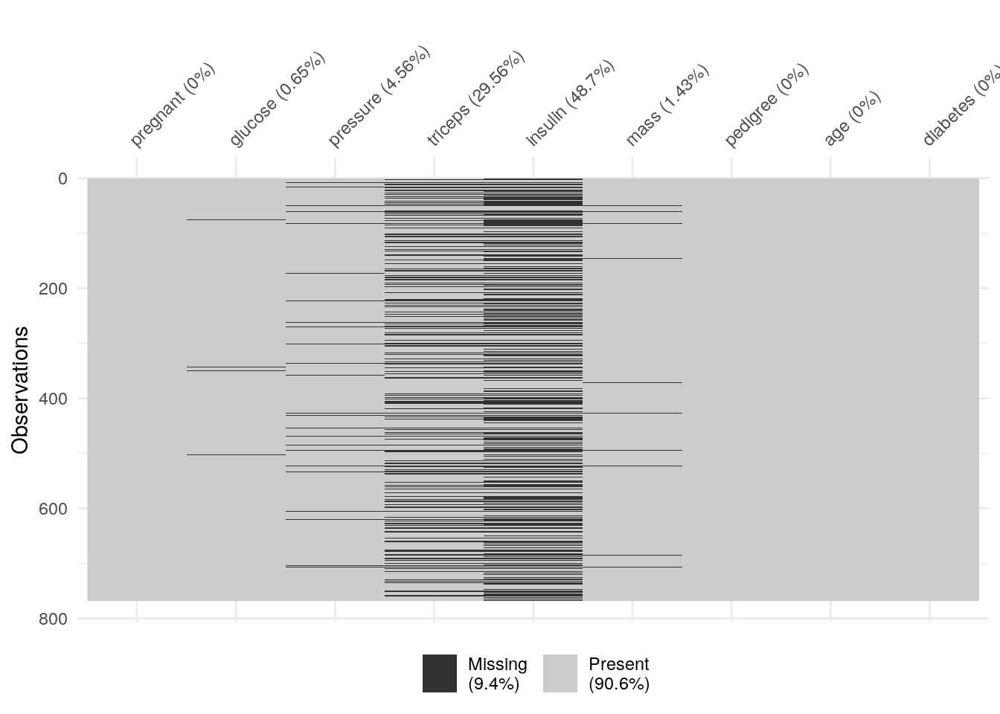

Moins de 10% des données sont manquantes, et c'est principalement dans les variables `insulin` et `triceps`. Si nous souhaitons un tableau sans variables manquantes, nous pouvons décider d'éliminer des lignes et ou des colonnes (variables), mais ici nous souhaitons garder toutes les variables et réduisons donc uniquement le nombre de lignes avec la fonction `drop_na()`.


```r
pima <- drop_na(pima)
pima
```

```
# # A tibble: 392 x 9
#    pregnant glucose pressure triceps insulin  mass pedigree   age diabetes
#       <dbl>   <dbl>    <dbl>   <dbl>   <dbl> <dbl>    <dbl> <dbl> <fct>   
#  1        1      89       66      23      94  28.1    0.167    21 neg     
#  2        0     137       40      35     168  43.1    2.29     33 pos     
#  3        3      78       50      32      88  31      0.248    26 pos     
#  4        2     197       70      45     543  30.5    0.158    53 pos     
#  5        1     189       60      23     846  30.1    0.398    59 pos     
#  6        5     166       72      19     175  25.8    0.587    51 pos     
#  7        0     118       84      47     230  45.8    0.551    31 pos     
#  8        1     103       30      38      83  43.3    0.183    33 neg     
#  9        1     115       70      30      96  34.6    0.529    32 pos     
# 10        3     126       88      41     235  39.3    0.704    27 neg     
# # … with 382 more rows
```

Notre tableau est presque amputé de la moitié, mais il nous reste tout de même encore 392 cas, soit assez pour notre analyse. Avant de nous lancer dans une ACP, nous devons décrire les données, repérer les variables quantitatives d'intérêt, et synthétiser les corrélations linéaires (coefficients de corrélation de Pearson) entre ces variables.


```r
skimr::skim(pima)
```

```
# Skim summary statistics
#  n obs: 392 
#  n variables: 9 
# 
# ── Variable type:factor ──────────────────────────────────────────────────────────────────────────────
#  variable missing complete   n n_unique                top_counts ordered
#  diabetes       0      392 392        2 neg: 262, pos: 130, NA: 0   FALSE
# 
# ── Variable type:numeric ─────────────────────────────────────────────────────────────────────────────
#  variable missing complete   n   mean     sd     p0   p25    p50    p75
#       age       0      392 392  30.86  10.2  21     23     27     36   
#   glucose       0      392 392 122.63  30.86 56     99    119    143   
#   insulin       0      392 392 156.06 118.84 14     76.75 125.5  190   
#      mass       0      392 392  33.09   7.03 18.2   28.4   33.2   37.1 
#  pedigree       0      392 392   0.52   0.35  0.085  0.27   0.45   0.69
#  pregnant       0      392 392   3.3    3.21  0      1      2      5   
#  pressure       0      392 392  70.66  12.5  24     62     70     78   
#   triceps       0      392 392  29.15  10.52  7     21     29     37   
#    p100     hist
#   81    ▇▂▂▁▁▁▁▁
#  198    ▁▅▇▆▅▃▂▂
#  846    ▇▆▂▁▁▁▁▁
#   67.1  ▂▆▇▅▂▁▁▁
#    2.42 ▇▆▃▁▁▁▁▁
#   17    ▇▃▂▁▁▁▁▁
#  110    ▁▁▂▆▇▆▁▁
#   63    ▃▆▇▇▆▃▁▁
```

Nous avons une variable facteur `diabetes` à exclure de l'analyse, mais la variable `pregnant`, est une variable numérique discrète (nombre d'enfants portés). Nous l'éliminerons aussi de l'analyse.

La fonction `correlation()` du package `SciViews` nous permet d'inspecter les corrélations entre les variables choisies (donc toutes à l'exception de `pregnant` et `diabetes` qui ne sont pas quantitatives continues)\ :


```r
pima_cor <- correlation(pima[, 2:8])
knitr::kable(pima_cor, digits = 2)
```

            glucose   pressure   triceps   insulin   mass   pedigree    age
---------  --------  ---------  --------  --------  -----  ---------  -----
glucose        1.00       0.21      0.20      0.58   0.21       0.14   0.34
pressure       0.21       1.00      0.23      0.10   0.30      -0.02   0.30
triceps        0.20       0.23      1.00      0.18   0.66       0.16   0.17
insulin        0.58       0.10      0.18      1.00   0.23       0.14   0.22
mass           0.21       0.30      0.66      0.23   1.00       0.16   0.07
pedigree       0.14      -0.02      0.16      0.14   0.16       1.00   0.09
age            0.34       0.30      0.17      0.22   0.07       0.09   1.00

```r
plot(pima_cor)
```

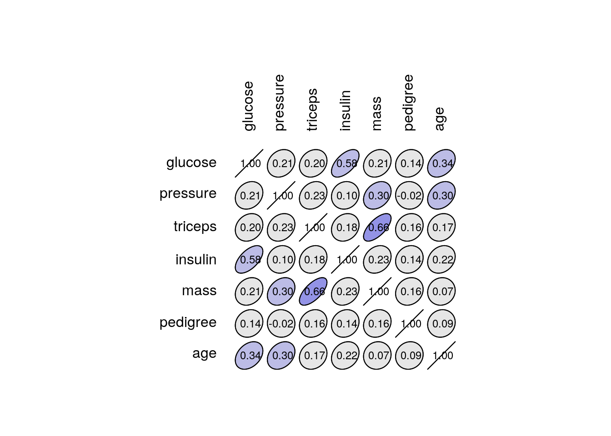

Quelques corrélations positives d'intensités moyennes se dégagent ici, notamment entre `mass` et `triceps` (épaisseur du pli cutané au niveau du triceps), ainsi qu'entre `glucose` (taux de glucose dans le sang), `insulin` (taux d'insuline dans le sang) et `age`. Par contre, la pression artérielle (`pressure`) et le `pedigree` (variable qui quantifie la susceptibilité au diabète en fonction de la parenté) semblent peu corrélés avec les autres variables.

L'ACP est en fait équivalente à une Analyse en Coordonnées Principales sur une matrice de distances euclidiennes (MDS métrique), mais en plus efficace en terme de calculs. Nous pouvons donc nous lancer dans l'analyse et en comprendre les résultats en gardant ceci à l'esprit.

Nous utiliserons la fonction `pca()` qui prend un argument `data =` et une formule du type `~ var1 + var2 + .... + varn`, ou plus simplement, directement un tableau contenant uniquement les variables à analyser comme argument unique. Comme les différentes variables sont mesurées dans des unités différentes, nous devons les standardiser (écart type ramené à un pour toutes). Ceci est réalisé par la fonction `pca()` en lui indiquant `scale = TRUE`. Donc\ :


```r
pima_pca <- pca(data = pima, ~ glucose + pressure + triceps + insulin + mass +
  pedigree + age, scale = TRUE)
```

Ou alors, nous sélectionnons les variables d'intérêt avec `select()` et appliquons `pca()` directement sur ce tableau, ce qui donnera le même résultat.


```r
pima %>.%
  select(., glucose:age) %>.%
  pca(., scale = TRUE) -> pima_pca
```

Le nuage de points dans l'espace initial à sept dimensions a été centré (origine ramenée au centre de gravité du nuage de points = moyenne des variables) par l'ACP. Ensuite une rotation des axes a été réalisée pour orienter son plus grand axe selon un premier **axe principal 1** ou **PC1** . Ensuite **PC2** est construit orthogonal au premier et dans la seconde direction de plus grande variabilité du nuage de points, et ainsi de suite pour les autres axes. Ainsi les axes PC1, PC2, PC3, ... représentent une **part de variance** de plus en plus faible par rapport à la variance totale du jeu de données. Ceci est présenté dans le résumé\ :


```r
summary(pima_pca)
```

```
# Importance of components (eigenvalues):
#                          PC1   PC2   PC3   PC4    PC5   PC6    PC7
# Variance               2.412 1.288 1.074 0.878 0.6389 0.399 0.3098
# Proportion of Variance 0.345 0.184 0.153 0.126 0.0913 0.057 0.0443
# Cumulative Proportion  0.345 0.529 0.682 0.807 0.8988 0.956 1.0000
# 
# Loadings (eigenvectors, rotation matrix):
#          PC1    PC2    PC3    PC4    PC5    PC6    PC7   
# glucose   0.441 -0.455        -0.198         0.736       
# pressure  0.329  0.101 -0.613  0.206  0.654        -0.171
# triceps   0.439  0.488               -0.367        -0.644
# insulin   0.402 -0.418  0.263 -0.388  0.123 -0.642 -0.129
# mass      0.446  0.506        -0.181                0.711
# pedigree  0.198         0.625  0.711  0.251              
# age       0.325 -0.337 -0.384  0.471 -0.592 -0.168  0.179
```

Le premier tableau `Importance of components (eigenvalues):` montre la part de variance présentée sur chacun des sept axes de l'ACP (PC1, PC2, ..., PC7). Le fait qu'il s'agit de *valeurs propres* (*eigenvalues* en anglais) apparaitra plus clair lorsque vous aurez lu les explications détaillées plus bas. Ces parts de variance s'additionnent pour donner la variance totale du nuage de points dans les sept dimensions (propriété d'additivité des variances). Pour facilité la lecture, la `Proportion de Variance` en %  est reprise également, ainsi que les proportions cumulées. Ainsi, les deux premiers axes de l'ACP capturent ici 53% de la variance totale. Et il faudrait considérer les cinq premiers axes pour capturer 90% de la variance totale. Cependant, les trois premiers axes cumulent tout de même plus des 2/3 de la variance. Nous pouvons restreindre notre analyse à ces trois axes-là.

Le second tableau `Loadings (eigenvectors, rotation matrix):` est la matrice de transformation des coordonnées initiales sur les lignes en coordonnées PC1 à PC7 en colonnes. Nous pouvons y lire l'**importante** des variables initiales sur les axes de l'ACP. Par exemple, l'axe PC3 contraste essentiellement `pressure` et `pedigree`.

Le **graphique des éboulis** sert à visualiser la "chute" de la variance d'un axe principal à l'autre, et aide à choisir le nombre d'axes à conserver (espace à dimensions réduites avec perte minimale d'information). Deux variantes en diagramme en barres versticales `chart$screeplot()` ou `chart$scree()` ou sous forme d'une ligne brisée `chart$altscree()` sont disponibles\ :


```r
chart$scree(pima_pca, fill = "cornsilk")
```

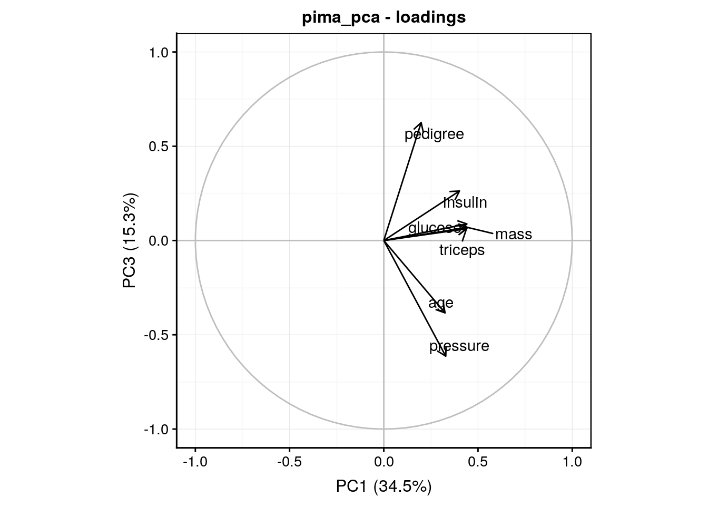


```r
chart$altscree(pima_pca)
```

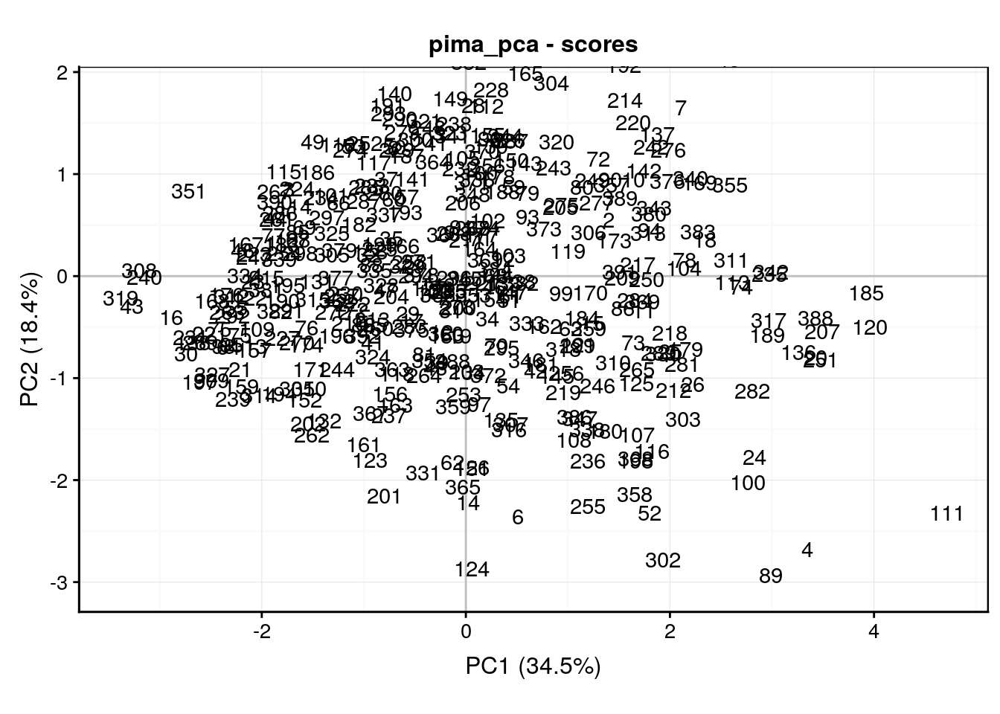

La diminution est importante entre le premier et le second axe, mais plus progressive ensuite. Ceci traduit une structure plus complexe dans les données qui ne se réduit pas facilement à un très petit nombre d'axes. Nous pouvons visualiser le **premier plan principal** constitué par PC1 et PC2, tout en gardant à l'esprit que seulement 53% de la variance totale y est capturée. Donc, nous pouvons nous attendre à des déformations non négligeables des données dans ce plan, et d'autres aspects qui n'y sont pas (correctement) représentés. Nous verrons qu'il est porteur, toutefois, d'information utile.

Deux types de représentations peuvent être réalisées à partir d'ici\ : la représentation dans **l'espace des variables**, et la représentation complémentaire dans **l'espace des individus**. Ces deux représentations sont complémentaires et s'analysent conjointement. L'espace des variables représente les axes initiaux projettés comme des ombres dans le plan choisi de l'ACP (rappelez-vous l'analogie avec les ombres chinoises). Il se réalise à l'aide de `chart$loadings()`. Par exemple pour PC1 et PC2 nous indiquons `choices = c(1, 2)` (ou rien du tout, puisque ce sont les valeurs par défaut))\ :


```r
chart$loadings(pima_pca, choices = c(1, 2))
```

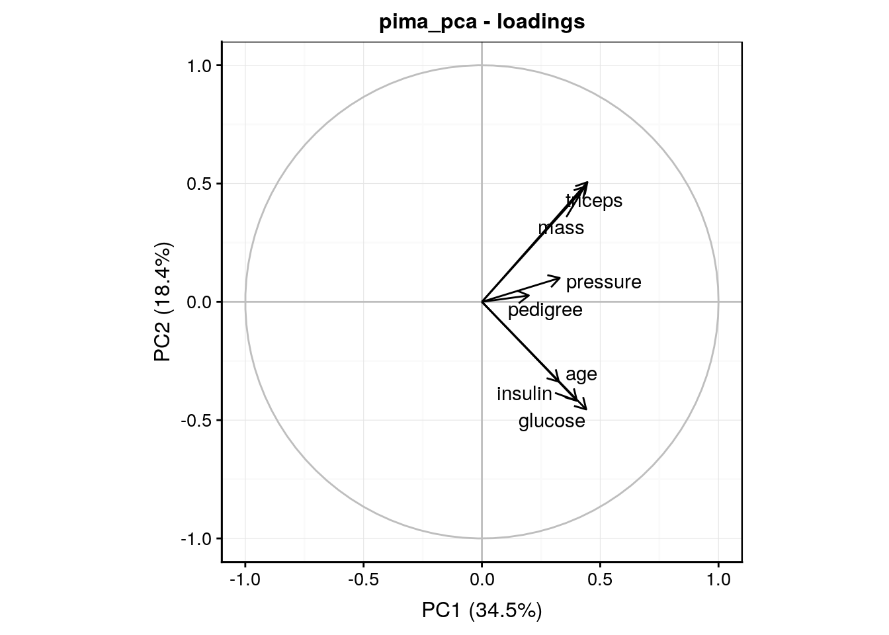

Ce graphique s'interpète comme suit\ :

- Plus la norme (longueur) du vecteur qui représente une variable est grande et se rapporche de un (matérialisé par le cer cle gris), plus la variable est bien représentée dans le plan choisi. On évitera d'interpréter ici les variables qui ont des normes petites, comme `pedigree` ou `pressure`.

- Des vecteurs qui pointent dans la même direction représentent des variables **directement corrélés** entre elles. C'est le cas de `glucose`, `insulin` et `age`d'une part, et par ailleurs aussi de `mass` et `triceps`.

- Des vecteurs qui pointent en directions opposées représentent des variables **inversément proportionnelles**. Il n'y en a pas ici.

- Des vecteurs orthogonaux représentent des variables **non corrélées** entre elles. ainsi le groupoe `glucose`/`insulin`/`age` n'est pas corrélé avec le groupe `mass`/`triceps`

- Les PCs sont orientés en fonction des variables initiales, ou à défaut, les zones du graphique sont orientés. Ici, les gros sont dans le haut à droite du graphique, alors que ceux qui sont agés, et ont beaucoup de sucre et d'insuline dans le sang sont en bas à droite. A l'opposé, on trouve les plus maigres en bas à gauche et les jeunes ayant moins de glucose et d'insuline dans le sang en haut à gauche du graphique.

Cela donne déjà une vision synthétique des différentes corrélations entre la variables. Naturellement, on peut très bien choisir d'autres axes, pour peu qu'ils représentent une part de variance relativement importante. Par exemple, ici, nous pouvons représente le plan constitué par PC1 et PC3, puisque nous avons décidé de retenir les 3 premiers axes\ :


```r
chart$loadings(pima_pca, choices = c(1, 3))
```

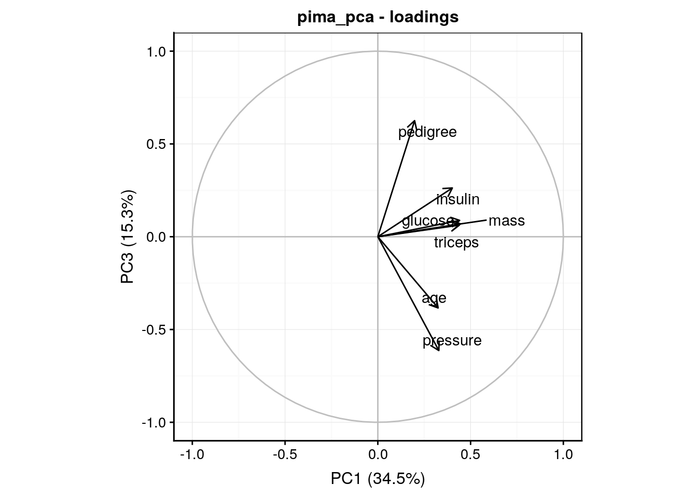

Nous voyons que `pedigree` et `pressure` (inversément proportionnels) sont bien mieux représentés le long de PC3. Ici l'axe PC3 est plus facile à orienter\ : en haut les pédigrées élevés et les pressions qartérielles basses, et en bas le contraire. Nous avons déjà lu cette informatioin dans le tableau des vecteurs propres de `summary()`.

Le graphice entre PC2 et PC3 complète l'analyse, mais n'apportant rien de plus, il peut être typiquement éliminé de votre rapport.


```r
chart$loadings(pima_pca, choices = c(2, 3))
```

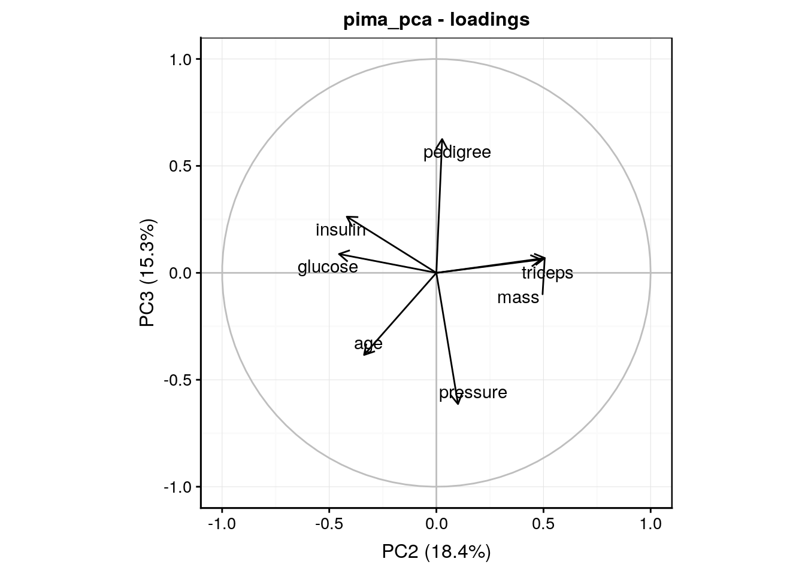

La seconde représentation se fait dans **l'espace des individus**. Ici, nous allons projeter les points relatifs à chaque individu dans le plan de l'ACP choisi. Cela se réalise à l'aide de `chart$scores()` (l'aspect ratio est le rapport hauteur/largeur peut s'adapter)\ :


```r
chart$scores(pima_pca, choices = c(1, 2), aspect.ratio = 3/5)
```

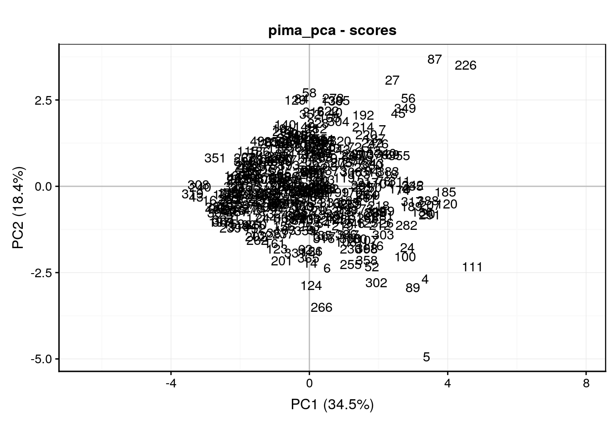

Ce graphique est peu lisible tel quel. Généralement, nous représentons d'autres informations utiles sous forme de labels et ou de couleurs différentes. Nous pouvons ainsi contraster les individus qui ont le diabète de ceux qui ne l'ont pas sur ce graphique et aussi ajouter des ellipses de confiance à 95% autour des deux groupes pour aider à la cerner à l'aide de `stat_ellipse()`\ :


```r
chart$scores(pima_pca, choices = c(1, 2),
  labels = pima$diabetes) +
  stat_ellipse()
```

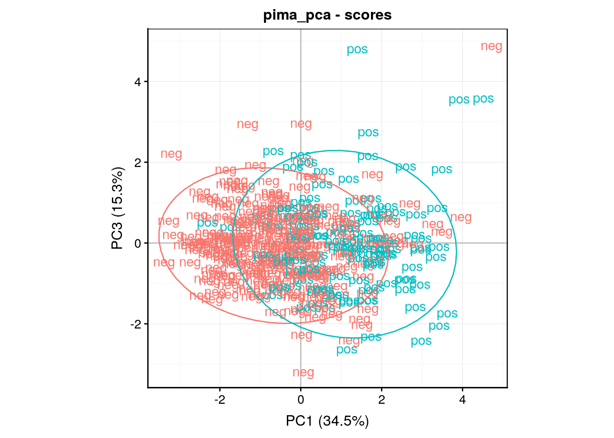

Ce graphique est nettement plus intéressant. Il s'interprète comme suit\ :

- Nous savons que les individus plus âgés et ayant plus de glucose et d'insuline dans le sang sont dans le bas à droite du graphique. Or le groupe des diabétique, s'il ne se détache pas complètement tend à s'étaler plus dans cette région.

- A l'inverse, le groupe des non diabétiques s'étale vers la gauche, c'est-à-dire dans une région reprenant les individus les plus jeunes et les moins gros.

Le graphique entre PC1 et PC3 (analyse du troisième axe) donne ceci\ :


```r
chart$scores(pima_pca, choices = c(1, 3),
  labels = pima$diabetes) +
  stat_ellipse()
```

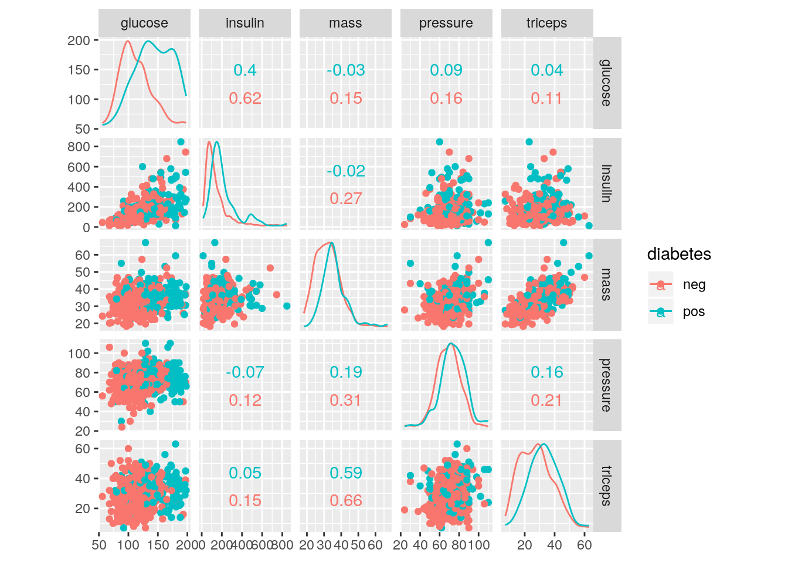

Ici, la séparation se fait essentiellement sur l'axe horizontal (PC1). Donc, les différentes de pédigrée (élevé dans le haut du graphique) et de pression artérielle (élevée dans le bas du graphique) semblent être moins liés au diabète. Le graphique PC3 _versus_ PC2 peut aussi être réalisé, mais il n'apporte rien de plus (et en pratique, nous l'éliminerions d'un rapport).


```r
chart$scores(pima_pca, choices = c(2, 3),
  labels = pima$diabetes) +
  stat_ellipse()
```

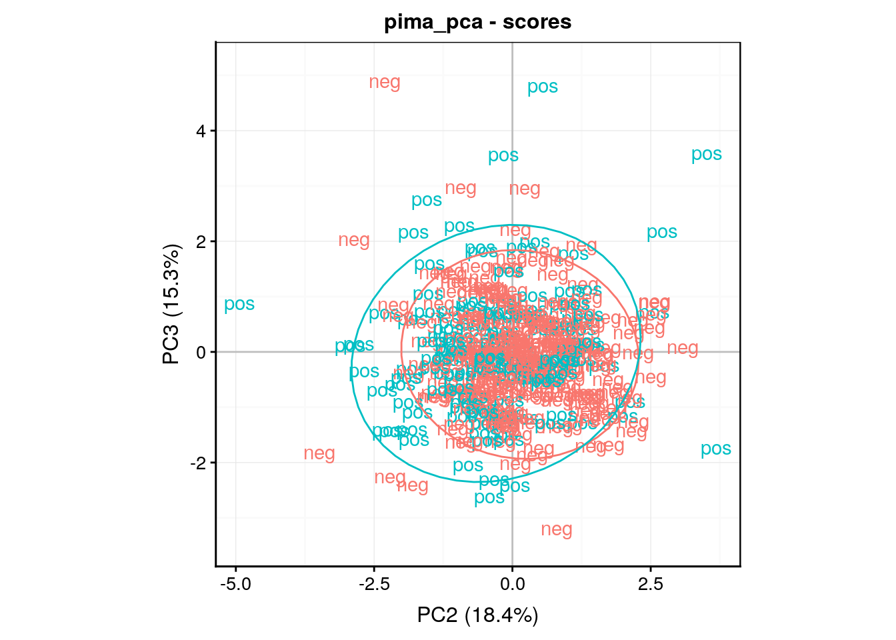

Etant donné que les deux graphiques (variables et individus) s'interprètent conjointement, nous pourrions être tentés de les superposer, cela s'appelle un **biplot**. Mais se pose alors un problème\ : celui de mettre à l'échelle les deux représentations pour qu'elles soient cohérentes entre elles. Ceci n'est pas facile et différentes représentations coexistent. L'argument `scale =` de la fonction `chart$biplot()` permet d'utiliser différentes mises à l'échelle. Enfin, ce type de graphique tend à être souvent bien trop encombré. Il est donc plus difficile à lire que les deux graphiques des variables et individus séparés. Voici ce que cela donne pour notre jeu de données exemple\ :


```r
chart$biplot(pima_pca)
```


Bien moins lisible, en effet\ !


### Biométrie d'oursin

Analysons à présent un autre jeu de données qui nous montrera l'importance de la transformation (linéarisation), du choix de réduire ou non (argument `scale =`), et l'effet d'un **effet saturant**, et comment s'en débarrasser. Il s'agit de la biométrie effectuée sur deux populations de l'oursin violet *Paracentrotus lividus*, une en élevage et une oautre provenant du milieu naturel. Nous avons abondamment utilisé ce jeu de données en SDD I dans la section visualisation. Nous le connaissons bien, mais reprenons certains éléments essentiels ici...


```r
urchin <- read("urchin_bio", package = "data.io", lang = "FR")
urchin
```

```
# # A tibble: 421 x 19
#    origin diameter1 diameter2 height buoyant_weight weight solid_parts
#    <fct>      <dbl>     <dbl>  <dbl>          <dbl>  <dbl>       <dbl>
#  1 Pêche…       9.9      10.2    5               NA  0.522       0.478
#  2 Pêche…      10.5      10.6    5.7             NA  0.642       0.589
#  3 Pêche…      10.8      10.8    5.2             NA  0.734       0.677
#  4 Pêche…       9.6       9.3    4.6             NA  0.370       0.344
#  5 Pêche…      10.4      10.7    4.8             NA  0.610       0.559
#  6 Pêche…      10.5      11.1    5               NA  0.610       0.551
#  7 Pêche…      11        11      5.2             NA  0.672       0.605
#  8 Pêche…      11.1      11.2    5.7             NA  0.703       0.628
#  9 Pêche…       9.4       9.2    4.6             NA  0.413       0.375
# 10 Pêche…      10.1       9.5    4.7             NA  0.449       0.398
# # … with 411 more rows, and 12 more variables: integuments <dbl>,
# #   dry_integuments <dbl>, digestive_tract <dbl>,
# #   dry_digestive_tract <dbl>, gonads <dbl>, dry_gonads <dbl>,
# #   skeleton <dbl>, lantern <dbl>, test <dbl>, spines <dbl>,
# #   maturity <int>, sex <fct>
```

Ici aussi nous avons des valeurs manquantes\ :


```r
naniar::vis_miss(urchin)
```


Ces valeurs manquantes sont rassemblées essentiellement dans les variables `buoyant_weight`, `dry_integuments`, les mesures relatives au squelette (`skeleton`, `lantern`, `test` et `spines`), et surtout au niveau de `sex` (impossible de déterminer le sexe des individus les plus jeunes). Si nous éliminons purement et simplement les lignes qui ont au moins une valeur manquante, nous perdons tous les individus jeunes, et c'est dommage. Nous allons donc d'abord éliminer les variables `sex`, ainsi que les quatres variables liées au squelette. Dans un second temps, nous appliquerons `drop_na()` sur ce qui reste\ :


```r
urchin %>.%
  select(., -(skeleton:spines), -sex) %>.%
  drop_na(.) -> urchin2
urchin2
```

```
# # A tibble: 319 x 14
#    origin diameter1 diameter2 height buoyant_weight weight solid_parts
#    <fct>      <dbl>     <dbl>  <dbl>          <dbl>  <dbl>       <dbl>
#  1 Pêche…      16.7      16.8    8.4          0.588   2.58        2.04
#  2 Pêche…      19.9      20      9.2          1.10    4.26        3.66
#  3 Pêche…      19.9      19.2    8.5          0.629   2.93        2.43
#  4 Pêche…      19.3      19.8   10.2          0.781   3.71        3.09
#  5 Pêche…      18.8      20      9.3          0.761   3.59        2.99
#  6 Pêche…      21.5      20.9    9.6          1.13    4.98        4.42
#  7 Pêche…      17.4      16.5    7.8          0.477   2.33        1.97
#  8 Pêche…      21        21.2   10.8          1.23    5.4         4.55
#  9 Pêche…      17.8      18.8    8.6          0.548   2.58        2.07
# 10 Pêche…      19.7      19.6    9.7          0.862   3.59        3.08
# # … with 309 more rows, and 7 more variables: integuments <dbl>,
# #   dry_integuments <dbl>, digestive_tract <dbl>,
# #   dry_digestive_tract <dbl>, gonads <dbl>, dry_gonads <dbl>,
# #   maturity <int>
```

Il nous reste 319 lignes des 421 initiales. Nous n'avons perdu qu'un quart des données, tout en nous privant seulement de quatres variables quantitatives liées au squelette (`sex`étant une variable qualitative, elle ne peut de toutes façons pas être introduite dans l'analyse, mais elle aurait pu servir pour colorer les individus).


```r
skimr::skim(urchin2)
```

```
# Skim summary statistics
#  n obs: 319 
#  n variables: 14 
# 
# ── Variable type:factor ──────────────────────────────────────────────────────────────────────────────
#  variable missing complete   n n_unique                top_counts ordered
#    origin       0      319 319        2 Cul: 188, Pêc: 131, NA: 0   FALSE
# 
# ── Variable type:integer ─────────────────────────────────────────────────────────────────────────────
#  variable missing complete   n mean   sd p0 p25 p50 p75 p100     hist
#  maturity       0      319 319 0.37 0.71  0   0   0   0    2 ▇▁▁▁▁▁▁▂
# 
# ── Variable type:numeric ─────────────────────────────────────────────────────────────────────────────
#             variable missing complete   n  mean    sd     p0    p25   p50
#       buoyant_weight       0      319 319  4.27  3.84  0.31   1.35   3.18
#            diameter1       0      319 319 32.78 11.71 14.6   23.25  31.5 
#            diameter2       0      319 319 32.71 11.67 15     23.45  31.6 
#      digestive_tract       0      319 319  1.9   2.03  0.034  0.45   1.21
#  dry_digestive_tract       0      319 319  0.23  0.21  0.015  0.075  0.17
#           dry_gonads       0      319 319  0.51  0.82  0      0.029  0.17
#      dry_integuments       0      319 319  7.16  6.3   0.58   2.22   5.42
#               gonads       0      319 319  1.72  2.65  0      0.1    0.63
#               height       0      319 319 16.78  6.25  7.3   11.1   16.2 
#          integuments       0      319 319 12.32 10.64  1.09   4      9.4 
#          solid_parts       0      319 319 16.52 15.27  1.46   4.96  11.73
#               weight       0      319 319 21.8  21.37  1.61   6.08  15.25
#    p75   p100     hist
#   5.67  17.73 ▇▃▂▂▁▁▁▁
#  39.65  65.6  ▆▇▆▆▃▃▂▁
#  39.6   65.6  ▇▇▆▆▃▃▂▁
#   2.54  10.37 ▇▃▂▁▁▁▁▁
#   0.31   1.02 ▇▅▂▁▁▁▁▁
#   0.64   5    ▇▂▁▁▁▁▁▁
#   9.42  28.8  ▇▃▂▂▁▁▁▁
#   2.2   15.93 ▇▂▁▁▁▁▁▁
#  21.5   32.2  ▇▆▆▆▅▃▂▁
#  16.07  47.22 ▇▃▃▁▁▁▁▁
#  21.69  73.14 ▇▅▂▂▁▁▁▁
#  28.14 100.51 ▇▅▁▁▁▁▁▁
```

Nous avons 12 variables quatitatives continues. Notez la distribution très asymétrique et similaire (voir colonne `hist`) de toutes ces variables. les variables `origin` et `maturity` ne pourront pas être utilisées, mais seront éventuellement utiles pour colorer les points dans nos graphiques. Qu'en est-il des corrélations entre les 12 variables\ ?


```r
urchin2_cor <- correlation(urchin2[, 2:13])
knitr::kable(urchin2_cor, digits = 2)
```

                       diameter1   diameter2   height   buoyant_weight   weight   solid_parts   integuments   dry_integuments   digestive_tract   dry_digestive_tract   gonads   dry_gonads
--------------------  ----------  ----------  -------  ---------------  -------  ------------  ------------  ----------------  ----------------  --------------------  -------  -----------
diameter1                   1.00        1.00     0.98             0.95     0.96          0.96          0.97              0.96              0.91                  0.93     0.80         0.79
diameter2                   1.00        1.00     0.97             0.95     0.96          0.96          0.97              0.96              0.91                  0.93     0.80         0.79
height                      0.98        0.97     1.00             0.93     0.92          0.93          0.94              0.93              0.88                  0.91     0.76         0.75
buoyant_weight              0.95        0.95     0.93             1.00     0.99          0.99          0.99              1.00              0.92                  0.94     0.88         0.87
weight                      0.96        0.96     0.92             0.99     1.00          0.99          0.99              0.99              0.95                  0.96     0.88         0.87
solid_parts                 0.96        0.96     0.93             0.99     0.99          1.00          0.99              0.99              0.95                  0.95     0.91         0.90
integuments                 0.97        0.97     0.94             0.99     0.99          0.99          1.00              1.00              0.93                  0.95     0.87         0.85
dry_integuments             0.96        0.96     0.93             1.00     0.99          0.99          1.00              1.00              0.92                  0.94     0.87         0.86
digestive_tract             0.91        0.91     0.88             0.92     0.95          0.95          0.93              0.92              1.00                  0.98     0.81         0.81
dry_digestive_tract         0.93        0.93     0.91             0.94     0.96          0.95          0.95              0.94              0.98                  1.00     0.82         0.82
gonads                      0.80        0.80     0.76             0.88     0.88          0.91          0.87              0.87              0.81                  0.82     1.00         0.99
dry_gonads                  0.79        0.79     0.75             0.87     0.87          0.90          0.85              0.86              0.81                  0.82     0.99         1.00

```r
plot(urchin2_cor)
```


Toutes les corrélations sont positives, et certaines sont très élevées. Cela indique que plusieurs variables sont (pratiquement complètement)  redondantes, par exemple, `diameter1` et `diameter2`. Un effet principal semble dominer.

Si nous refaisons quelques graphiques, nous nous rappelons que les relations *ne sont pas* linéaires, par exemple, entre `diameter1` et `weight`\ :


```r
chart(data = urchin2, weight ~ diameter1) +
  geom_point()
```

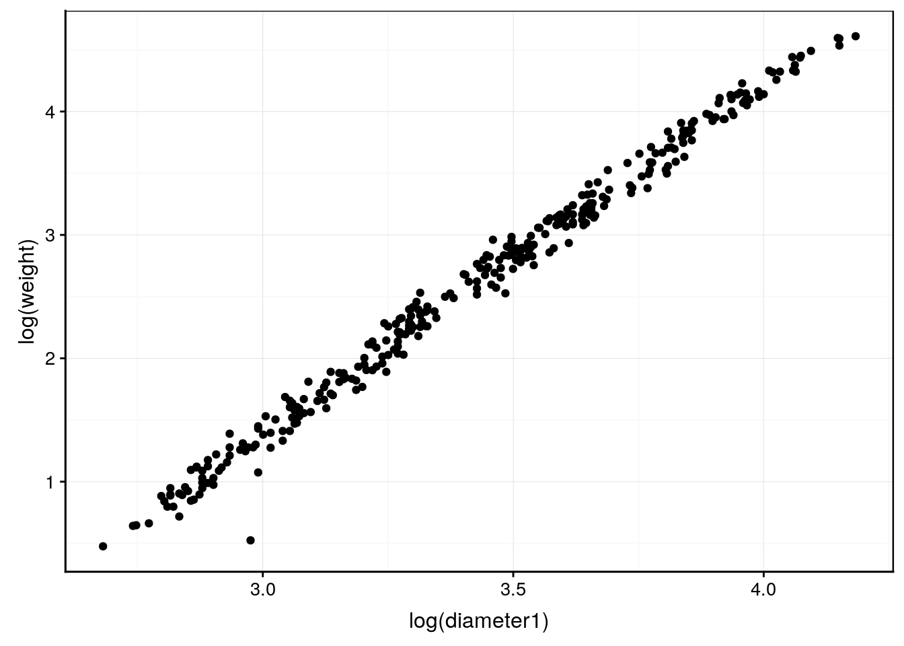

Ce type de relation, dite allométrique se linéarise très bien en effectuant une transformation double-log, comme nous pouvons le constater sur le graphique suivant\ :


```r
chart(data = urchin2, log(weight) ~ log(diameter1)) +
  geom_point()
```


\BeginKnitrBlock{warning}<div class="warning">Il est crucial de bien nettoyer son jeu de données avant une ACP, et aussi, de vérifier que les relations sont linéaires. Sinon il faut transformer les données de manière appropriée. Rappelez-vous que l'ACP s'intéresse aux corrélations **linéaires** entre vos variables. </div>\EndKnitrBlock{warning}

Attention toutefois à la transformation logarithmique appliquée sur des données qui peuvent contenir des zéros (par exemple, `gonads` ou `dry_gonads`). Dans ce cas, la transformartion logarithme(x + 1) réalisée avec la fonction `log1p()` est plus indiquée. Nous allons ici trtansformer **toutes** les variables en log(x + 1). C'est assez fastidieux à faire avec `mutate()`, mais nous pouvons l'utiliser directemnt sur le tableau entier réduit aux variables quantitatives continues seules lors de l'appel à `pca()` comme suit\ :


```r
urchin2 %>.%
  select(., -origin, -maturity) %>.% # Elimine les variables non quantitatives
  log1p(.) %>.% # Transforme toutes les autres en log(x + 1)
  pca(., scale = TRUE) -> urchin2_pca # Effectue l'ACP après standardisation
```

Nous avons standardisé les données puisqu'elles sont mesurées dans des unités différentes (longueurs en mm, masses en g). Voici ce que donne notre ACP\ :


```r
summary(urchin2_pca)
```

```
# Importance of components (eigenvalues):
#                           PC1    PC2    PC3     PC4     PC5     PC6
# Variance               11.219 0.5010 0.1813 0.03862 0.02601 0.01657
# Proportion of Variance  0.935 0.0418 0.0151 0.00322 0.00217 0.00138
# Cumulative Proportion   0.935 0.9767 0.9918 0.99503 0.99720 0.99858
#                            PC7     PC8     PC9    PC10    PC11    PC12
# Variance               0.00931 0.00336 0.00210 0.00108 0.00082 0.00034
# Proportion of Variance 0.00078 0.00028 0.00017 0.00009 0.00007 0.00003
# Cumulative Proportion  0.99936 0.99964 0.99981 0.99990 0.99997 1.00000
# 
# Loadings (eigenvectors, rotation matrix):
#                     PC1    PC2    PC3    PC4    PC5    PC6    PC7   
# diameter1            0.295 -0.162        -0.441  0.237 -0.174  0.177
# diameter2            0.295 -0.166        -0.449  0.249 -0.178  0.157
# height               0.291 -0.218  0.154 -0.106 -0.902              
# buoyant_weight       0.296         0.120  0.509  0.124              
# weight               0.296 -0.149                                   
# solid_parts          0.297 -0.106  0.127                0.234       
# integuments          0.296 -0.159  0.157  0.153  0.125              
# dry_integuments      0.296 -0.115  0.160  0.455  0.114              
# digestive_tract      0.288        -0.571 -0.187         0.485 -0.519
# dry_digestive_tract  0.283        -0.702  0.217        -0.278  0.513
# gonads               0.271  0.568  0.226                0.575  0.430
# dry_gonads           0.259  0.697        -0.104        -0.465 -0.453
#                     PC8    PC9    PC10   PC11   PC12  
# diameter1            0.242 -0.706                     
# diameter2            0.124  0.688  0.263              
# height                                                
# buoyant_weight       0.530                0.265 -0.504
# weight              -0.145  0.116 -0.912              
# solid_parts         -0.594         0.216  0.638       
# integuments         -0.396         0.148 -0.702 -0.371
# dry_integuments      0.105         0.128 -0.133  0.774
# digestive_tract      0.201                            
# dry_digestive_tract -0.161                            
# gonads               0.143                            
# dry_gonads          -0.111
```

Whaaa\ ! Plus de 93% de la variance représentée sur le premier axe. Ça parait parfait\ ! Voici le graphique des éboulis\ :


```r
chart$scree(urchin2_pca)
```

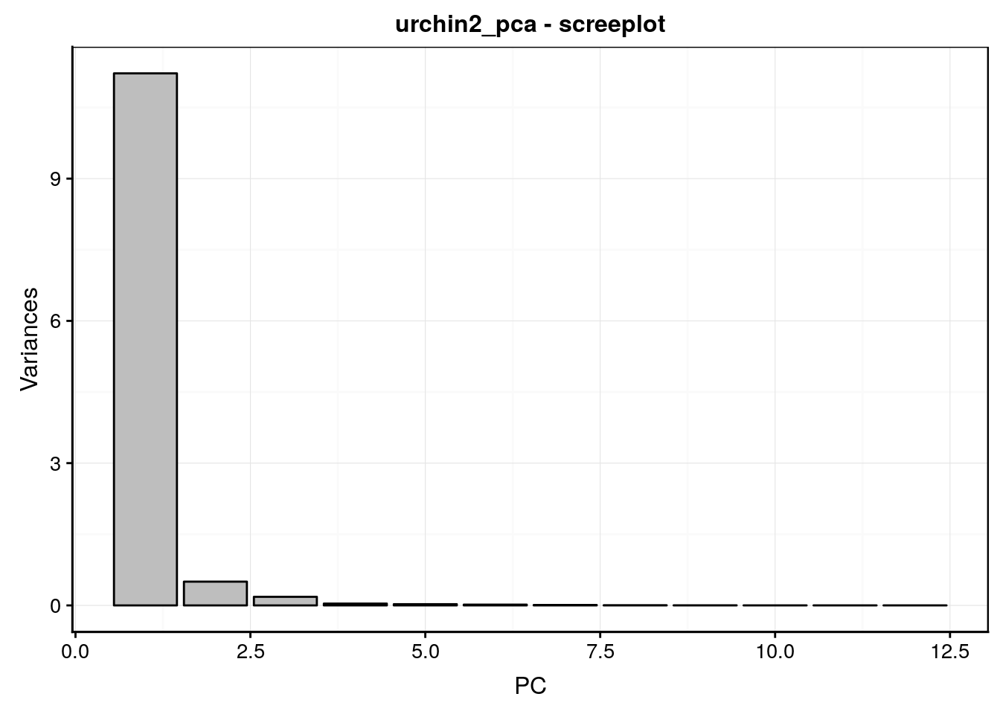

Ne vous réjousissez pas trop vite. Nous avons ici un **effet saturant** lié au fait que toutes les variables sont positivement corrélées entre elles. Cet effet est évident. Ici, c'est la taille. Nous allons conclure que plus un oursin est gros, plus ses dimensions et ses masses sont importante. **C'est trivial et d'un intérêt très limité**, avouons-le.

\BeginKnitrBlock{warning}<div class="warning">Puisque l'ACP optimise la variance sur le premier axe, un effet saturant aura tendance à occulter d'autres effets intéressants. Nous pouvons nous en débarrasser en identifiant une des variables représentant le mieux cet effet, et en calculant les ratios entre toutes les autres variables et celle-là. Ainsi, nous passons de quantification de la taille sur toutes les variables à des ratios qui quantifient beaucoup mieux des effets de forme plus subtils.</div>\EndKnitrBlock{warning}

Notez aussi les valeurs relativement faibles, mais homogènes de toutes les variables sur l'axe PC1 dans le tableau des vecteurs propres, avec des valeurs comprises entre 0,26 et 0,30. Le graphique des variables est également très moche dans le premier plan de l'ACP, même si un effet différent relatif aux gonades apparait tout de même sur l'axe PC2, il ne compte que pour 4,2% de la variance totale\ :


```r
chart$loadings(urchin2_pca)
```

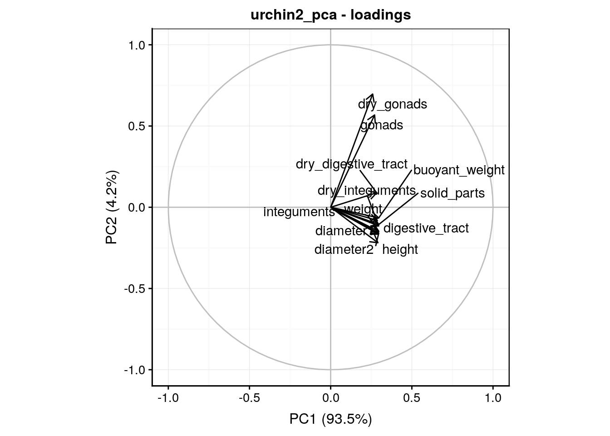

Recommençons tout de suite l'analyse en éliminant l'effet saturant. Nous pourrons considérer comme référence de la taille, par exemple, la masse immergée (`buoyant weight`) connue comme étant une mesure pouvant être mesurée très précisément. **Elle fait partie des variables les mieux corrélées sur l'axe PC1, représentant ainsi très bien cet effet saturant que nous voulons éliminer.** Voici notre calcul\ :


```r
urchin2 %>.%
  select(., -origin, -maturity, -buoyant_weight) %>.% # Elimination des variables inutiles
  (. / urchin2$buoyant_weight) %>.% # Division par buoyant_weight
  log1p(.) -> urchin3 # Transformation log(x + 1)
head(urchin3)
```

```
#   diameter1 diameter2   height   weight solid_parts integuments
# 1  3.380877  3.386644 2.726760 1.683990    1.497119    1.388714
# 2  2.953357  2.958109 2.240741 1.587131    1.468302    1.345385
# 3  3.485925  3.451231 2.675524 1.733496    1.582091    1.478861
# 4  3.247200  3.271795 2.643585 1.749467    1.600897    1.441601
# 5  3.247291  3.306831 2.582396 1.744070    1.595668    1.424509
# 6  3.000850  2.973973 2.254397 1.690963    1.594759    1.406850
#   dry_integuments digestive_tract dry_digestive_tract      gonads
# 1        1.030481       0.1039141          0.02667720 0.009140213
# 2        1.022630       0.1806157          0.04368131 0.040178983
# 3        1.051165       0.1683868          0.03608357 0.000000000
# 4        1.049797       0.2061975          0.04764294 0.023167059
# 5        1.048737       0.3154008          0.06613980 0.028901124
# 6        1.034084       0.3464496          0.05538973 0.016565715
#    dry_gonads
# 1 0.001529182
# 2 0.007821777
# 3 0.000000000
# 4 0.002174887
# 5 0.004984271
# 6 0.003104904
```

Refaisons notre ACP sur `urchin3` ainsi calculé\ :


```r
urchin3_pca <- pca(urchin3, scale = TRUE)
summary(urchin3_pca)
```

```
# Importance of components (eigenvalues):
#                          PC1   PC2   PC3    PC4    PC5    PC6     PC7
# Variance               4.687 3.353 1.273 0.9666 0.3668 0.1724 0.10547
# Proportion of Variance 0.426 0.305 0.116 0.0879 0.0333 0.0157 0.00959
# Cumulative Proportion  0.426 0.731 0.847 0.9345 0.9678 0.9835 0.99308
#                            PC8     PC9    PC10    PC11
# Variance               0.04761 0.01943 0.00834 0.00068
# Proportion of Variance 0.00433 0.00177 0.00076 0.00006
# Cumulative Proportion  0.99741 0.99918 0.99994 1.00000
# 
# Loadings (eigenvectors, rotation matrix):
#                     PC1    PC2    PC3    PC4    PC5    PC6    PC7   
# diameter1           -0.425         0.145 -0.297               -0.101
# diameter2           -0.425 -0.101  0.143 -0.296               -0.103
# height              -0.427         0.131 -0.300                     
# weight               0.189 -0.428         0.216  0.497 -0.672 -0.145
# solid_parts                -0.495  0.254 -0.117         0.335 -0.245
# integuments         -0.142 -0.463  0.152  0.283  0.165  0.345  0.667
# dry_integuments     -0.259 -0.242  0.173  0.533 -0.669 -0.161 -0.277
# digestive_tract      0.214 -0.370 -0.448 -0.102         0.388 -0.462
# dry_digestive_tract        -0.360 -0.485 -0.401 -0.429 -0.338  0.382
# gonads               0.374         0.438 -0.257 -0.223              
# dry_gonads           0.371         0.440 -0.269 -0.162 -0.122       
#                     PC8    PC9    PC10   PC11  
# diameter1            0.101         0.400  0.714
# diameter2                          0.425 -0.700
# height               0.141  0.197 -0.790       
# weight                      0.109              
# solid_parts         -0.662 -0.223              
# integuments          0.266                     
# dry_integuments                                
# digestive_tract      0.468  0.148              
# dry_digestive_tract -0.155                     
# gonads                      0.725  0.130       
# dry_gonads           0.446 -0.589
```


```r
chart$scree(urchin3_pca)
```

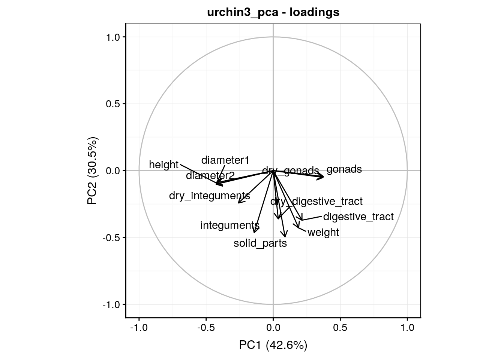

Maintenant que l'effet saturant est éliminé, la répartition des variances sur les axes se fait mieux. L'axe PC1 contraste les diamètres avec les gonades, l'axe PC2 représente les masses somatiques (dans l'ordre inverse), et l'axe PC3 contraste de manière intéressante les masses du tube digestif avec celles des gonades (le tout en ratios sur la masse immergée, ne l'oublions pas). Les deux premiers axes reprennent 73% de la variance, mais il semble qu'un effet intéressant se marque également sur PC3 avec 85% de la variance totale sur les trois premiers axes.

Tout ceci est également visible sur les graphiques dans l'espace des variables (plans PC1 - PC2 et PC2 - PC3 représentés ici).


```r
chart$loadings(urchin3_pca, choices = c(1, 2))
```

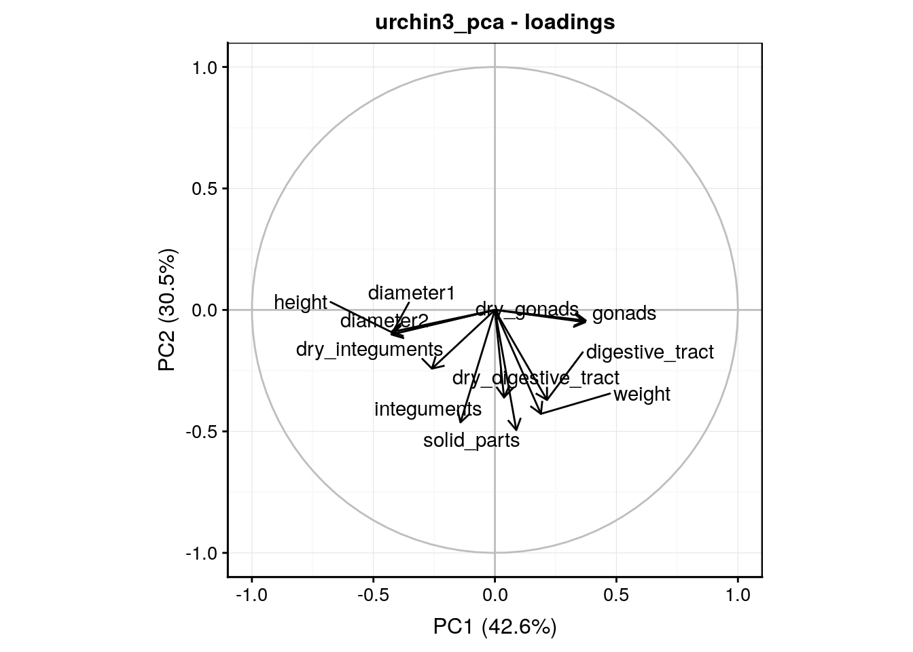


```r
chart$loadings(urchin3_pca, choices = c(2, 3))
```

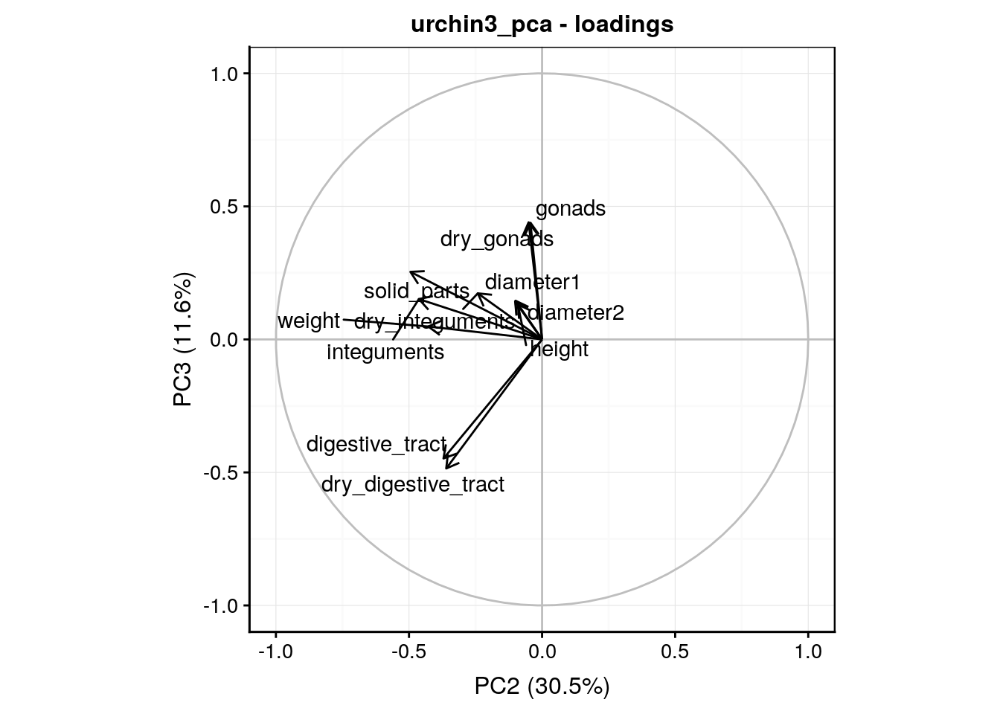

Enfin, dans l'espace des individus, avec l'origine reprise en couleur, nous observons ceci dans le prmeier plan de l'ACP\ :


```r
chart$scores(urchin3_pca, choices = c(1, 2),
  col = urchin2$origin, labels = urchin2$maturity, aspect.ratio = 3/5) +
  theme(legend.position = "right") +
  stat_ellipse()
```

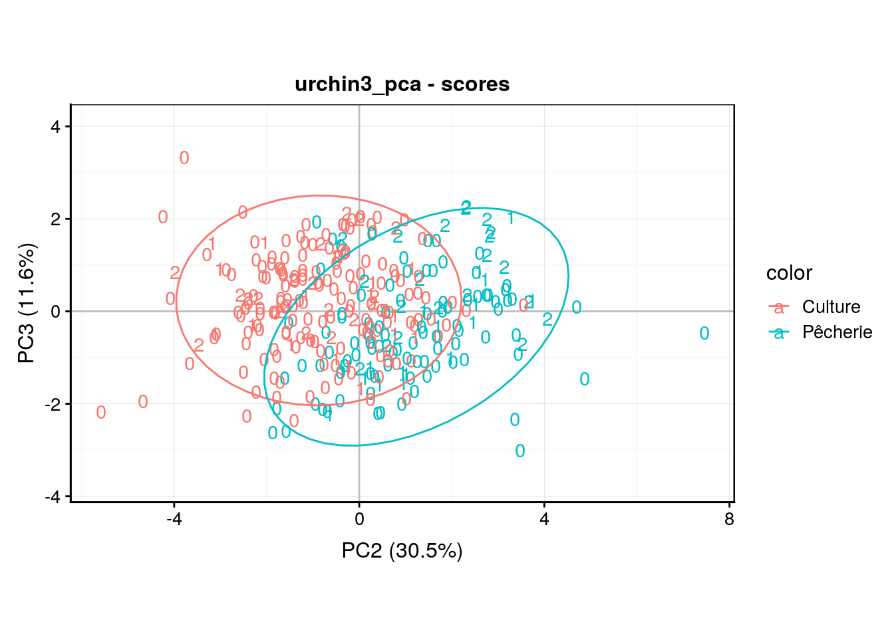

Et pour le plan PC2 - PC3\ :


```r
chart$scores(urchin3_pca, choices = c(2, 3),
  col = urchin2$origin, labels = urchin2$maturity, aspect.ratio = 3/5) +
  theme(legend.position = "right") +
  stat_ellipse()
```

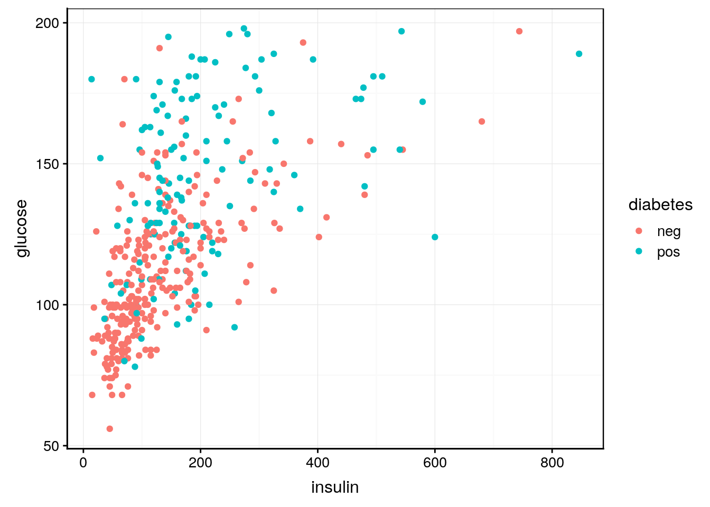

Vous devriez pouvoir interpréter ces résultats par vous-même maintenant.


### Visualisation de données quantitatives

#### Deux dimensions

**Le nuage de points** est le graphe idéal pour visualiser la distribution des données bivariées pour deux vaeriavbles quantitatives. Il permet de visualiser également une **association** entre deux variables. Il permet aussi de visualiser comment deux ou plusieurs groupes peuvent être séparés en fonction de ces deux variables.


```r
chart(data = pima, glucose ~ insulin %col=% diabetes) +
  geom_point()
```


#### Trois dimensions

**Le nuage de points en pseudo-3D** est l’équivalent pour visualiser trois variables quantitatives simultanément. Il est nécessaire de rendre l’effet de la **troisième dimension** (perspective, variation de taille des objets, ...).  La possibilité de **faire tourner l’objet 3D virtuel** est indispensable pour concrétiser l’effet 3D et pour le visionner sous différents angles

Le package `rgl` permet de réaliser ce genre de graphique 3D interactif (que vous pouvez faire tourner dans l'orientation que vous voulez à la souris)\ :


```r
rgl::plot3d(pima$insulin, pima$glucose, pima$triceps,
  col = as.integer(pima$diabetes))
```

<!--html_preserve--><div id="rgl1293" style="width:800px;height:800px;" class="rglWebGL html-widget"></div>
<script type="application/json" data-for="rgl1293">{"x":{"material":{"color":"#000000","alpha":1,"lit":true,"ambient":"#000000","specular":"#FFFFFF","emission":"#000000","shininess":50,"smooth":true,"front":"filled","back":"filled","size":3,"lwd":1,"fog":false,"point_antialias":false,"line_antialias":false,"texture":null,"textype":"rgb","texmipmap":false,"texminfilter":"linear","texmagfilter":"linear","texenvmap":false,"depth_mask":true,"depth_test":"less","isTransparent":false,"polygon_offset":[0,0]},"rootSubscene":1,"objects":{"7":{"id":7,"type":"points","material":{"lit":false},"vertices":[[94,89,23],[168,137,35],[88,78,32],[543,197,45],[846,189,23],[175,166,19],[230,118,47],[83,103,38],[96,115,30],[235,126,41],[146,143,33],[115,125,26],[140,97,15],[110,145,19],[245,158,36],[54,88,11],[192,103,33],[207,111,47],[70,180,25],[240,171,24],[82,103,11],[36,101,15],[23,88,21],[300,176,34],[342,150,42],[304,187,39],[110,100,60],[142,105,41],[128,141,34],[38,95,13],[100,146,27],[90,100,20],[140,139,35],[270,129,20],[71,83,26],[125,110,29],[71,100,25],[110,136,32],[176,123,15],[48,81,40],[64,142,18],[228,144,27],[76,71,18],[64,93,30],[220,122,51],[40,81,18],[152,126,29],[140,144,28],[18,83,31],[36,95,25],[135,171,33],[495,155,26],[37,89,34],[175,160,32],[51,99,15],[100,162,56],[100,107,30],[99,88,42],[135,120,30],[94,118,36],[145,117,24],[168,173,14],[225,170,37],[49,96,13],[140,125,20],[50,100,26],[92,93,25],[325,105,29],[63,108,26],[284,154,31],[119,106,35],[204,136,50],[155,156,28],[485,153,42],[94,99,15],[135,109,21],[53,88,19],[114,163,41],[105,102,40],[285,114,34],[156,104,18],[78,111,12],[130,134,23],[48,79,42],[55,75,24],[130,179,42],[130,129,46],[92,119,18],[495,181,36],[58,128,41],[114,109,39],[160,139,35],[94,123,44],[210,158,41],[48,107,13],[99,109,44],[318,148,27],[44,99,16],[190,103,32],[280,196,29],[87,96,27],[130,140,26],[175,112,32],[271,151,40],[129,109,41],[120,125,30],[478,177,29],[190,142,33],[56,100,15],[32,87,27],[744,197,39],[53,117,31],[370,134,37],[37,79,25],[45,74,28],[192,181,21],[88,91,32],[176,119,22],[194,146,35],[680,165,33],[402,124,33],[55,90,14],[258,92,7],[375,193,16],[150,155,28],[130,191,15],[67,96,18],[56,108,32],[45,71,50],[57,100,52],[116,104,23],[278,108,10],[122,129,28],[155,133,15],[135,136,26],[545,155,44],[220,119,39],[49,96,17],[75,108,43],[40,78,29],[74,107,30],[182,128,37],[194,128,45],[120,151,31],[360,146,38],[215,126,29],[184,100,25],[135,144,33],[42,77,41],[105,120,37],[132,161,23],[148,137,14],[180,128,19],[205,124,28],[148,106,37],[96,155,17],[85,113,10],[94,112,22],[64,99,11],[140,115,39],[231,129,12],[29,152,33],[168,157,21],[156,122,32],[120,102,36],[68,105,32],[52,87,16],[58,95,18],[255,165,43],[171,152,34],[105,130,13],[73,95,21],[108,126,36],[83,139,19],[74,99,19],[43,90,12],[167,125,40],[54,88,40],[249,196,36],[325,189,33],[293,147,25],[83,99,28],[66,81,16],[140,133,28],[465,173,48],[66,84,22],[94,105,40],[158,122,43],[325,140,43],[84,98,15],[75,87,37],[72,93,39],[82,107,30],[182,109,8],[59,90,18],[110,125,24],[50,119,13],[285,144,26],[81,100,23],[196,100,29],[415,131,14],[87,116,12],[275,127,24],[115,96,34],[88,136,41],[165,123,32],[579,172,49],[176,112,30],[310,143,23],[61,143,22],[167,138,35],[474,173,33],[115,129,29],[170,119,41],[76,94,18],[78,102,46],[210,151,32],[277,184,39],[180,181,30],[145,135,46],[180,95,25],[85,89,16],[60,80,11],[50,83,23],[120,117,27],[14,180,63],[70,100,12],[92,95,45],[64,104,37],[63,120,18],[95,82,13],[210,91,32],[105,100,28],[71,86,28],[237,148,48],[60,134,33],[56,120,22],[49,74,40],[105,124,13],[36,74,10],[100,97,36],[140,154,41],[191,105,45],[110,114,17],[75,126,38],[328,158,30],[49,85,22],[125,84,31],[250,135,42],[480,139,41],[265,173,32],[66,83,28],[122,125,18],[76,81,15],[145,195,33],[193,154,32],[71,117,19],[79,94,25],[90,180,26],[170,130,23],[76,84,23],[210,139,17],[86,99,19],[105,163,18],[165,145,34],[326,129,7],[66,68,32],[130,124,33],[82,97,19],[105,116,15],[188,117,31],[106,122,18],[65,86,52],[56,77,30],[210,127,37],[155,129,49],[215,100,40],[190,128,25],[56,84,23],[76,88,29],[225,186,35],[207,187,27],[166,131,21],[67,164,43],[106,84,30],[44,88,24],[115,84,23],[215,124,33],[274,198,32],[77,87,34],[54,99,19],[88,95,14],[18,99,30],[126,92,32],[126,154,29],[165,121,30],[44,111,31],[120,98,17],[330,143,30],[63,119,47],[130,108,20],[600,124,24],[156,176,27],[140,112,50],[115,82,22],[230,123,45],[185,188,14],[25,89,19],[120,109,18],[126,150,29],[293,181,42],[41,92,25],[272,152,39],[182,111,13],[158,106,21],[194,174,22],[321,168,42],[144,138,26],[15,68,13],[160,112,42],[115,94,27],[54,90,47],[90,102,40],[183,128,17],[66,94,18],[91,97,32],[46,100,12],[105,102,17],[152,103,30],[440,157,35],[144,167,17],[159,179,36],[130,136,35],[100,91,25],[106,117,23],[77,123,40],[135,106,28],[540,155,27],[90,101,35],[200,120,48],[70,80,31],[231,167,46],[130,145,46],[132,112,45],[190,98,33],[100,154,30],[168,165,26],[49,68,23],[240,123,35],[265,101,17],[45,56,28],[105,95,39],[205,129,26],[180,140,26],[180,144,46],[95,121,32],[125,129,49],[480,142,24],[125,169,19],[155,127,11],[200,122,27],[100,110,20],[335,127,21],[160,93,32],[387,158,13],[22,126,27],[291,134,20],[392,187,33],[185,173,39],[178,108,46],[200,114,36],[127,149,29],[105,117,30],[180,116,29],[79,130,23],[120,174,37],[165,106,27],[120,126,27],[160,99,17],[150,120,37],[94,102,20],[116,109,18],[140,153,37],[105,100,33],[57,81,41],[200,187,22],[74,121,39],[510,181,44],[110,128,39],[16,88,26],[180,101,48],[112,121,23]],"colors":[[0,0,0,1],[1,0,0,1],[1,0,0,1],[1,0,0,1],[1,0,0,1],[1,0,0,1],[1,0,0,1],[0,0,0,1],[1,0,0,1],[0,0,0,1],[1,0,0,1],[1,0,0,1],[0,0,0,1],[0,0,0,1],[1,0,0,1],[0,0,0,1],[0,0,0,1],[1,0,0,1],[0,0,0,1],[1,0,0,1],[0,0,0,1],[0,0,0,1],[0,0,0,1],[1,0,0,1],[0,0,0,1],[1,0,0,1],[0,0,0,1],[0,0,0,1],[0,0,0,1],[0,0,0,1],[0,0,0,1],[1,0,0,1],[0,0,0,1],[0,0,0,1],[0,0,0,1],[0,0,0,1],[0,0,0,1],[1,0,0,1],[0,0,0,1],[0,0,0,1],[0,0,0,1],[0,0,0,1],[0,0,0,1],[0,0,0,1],[1,0,0,1],[0,0,0,1],[0,0,0,1],[0,0,0,1],[0,0,0,1],[1,0,0,1],[1,0,0,1],[1,0,0,1],[0,0,0,1],[1,0,0,1],[0,0,0,1],[1,0,0,1],[0,0,0,1],[1,0,0,1],[0,0,0,1],[0,0,0,1],[1,0,0,1],[1,0,0,1],[1,0,0,1],[0,0,0,1],[0,0,0,1],[0,0,0,1],[0,0,0,1],[0,0,0,1],[0,0,0,1],[0,0,0,1],[0,0,0,1],[0,0,0,1],[1,0,0,1],[0,0,0,1],[0,0,0,1],[0,0,0,1],[0,0,0,1],[1,0,0,1],[0,0,0,1],[0,0,0,1],[1,0,0,1],[0,0,0,1],[1,0,0,1],[0,0,0,1],[0,0,0,1],[1,0,0,1],[1,0,0,1],[0,0,0,1],[1,0,0,1],[1,0,0,1],[1,0,0,1],[1,0,0,1],[0,0,0,1],[1,0,0,1],[1,0,0,1],[1,0,0,1],[1,0,0,1],[0,0,0,1],[0,0,0,1],[1,0,0,1],[0,0,0,1],[1,0,0,1],[1,0,0,1],[1,0,0,1],[1,0,0,1],[0,0,0,1],[1,0,0,1],[0,0,0,1],[0,0,0,1],[0,0,0,1],[0,0,0,1],[0,0,0,1],[1,0,0,1],[0,0,0,1],[0,0,0,1],[1,0,0,1],[0,0,0,1],[1,0,0,1],[0,0,0,1],[0,0,0,1],[0,0,0,1],[0,0,0,1],[1,0,0,1],[0,0,0,1],[1,0,0,1],[0,0,0,1],[0,0,0,1],[0,0,0,1],[0,0,0,1],[0,0,0,1],[0,0,0,1],[0,0,0,1],[0,0,0,1],[0,0,0,1],[0,0,0,1],[0,0,0,1],[1,0,0,1],[0,0,0,1],[0,0,0,1],[0,0,0,1],[1,0,0,1],[1,0,0,1],[1,0,0,1],[0,0,0,1],[1,0,0,1],[0,0,0,1],[1,0,0,1],[1,0,0,1],[0,0,0,1],[0,0,0,1],[1,0,0,1],[0,0,0,1],[1,0,0,1],[1,0,0,1],[0,0,0,1],[1,0,0,1],[0,0,0,1],[0,0,0,1],[0,0,0,1],[0,0,0,1],[0,0,0,1],[1,0,0,1],[0,0,0,1],[1,0,0,1],[1,0,0,1],[0,0,0,1],[0,0,0,1],[0,0,0,1],[0,0,0,1],[1,0,0,1],[0,0,0,1],[0,0,0,1],[0,0,0,1],[0,0,0,1],[0,0,0,1],[0,0,0,1],[1,0,0,1],[0,0,0,1],[1,0,0,1],[1,0,0,1],[0,0,0,1],[0,0,0,1],[0,0,0,1],[1,0,0,1],[1,0,0,1],[0,0,0,1],[0,0,0,1],[0,0,0,1],[1,0,0,1],[0,0,0,1],[0,0,0,1],[0,0,0,1],[0,0,0,1],[0,0,0,1],[0,0,0,1],[0,0,0,1],[0,0,0,1],[1,0,0,1],[0,0,0,1],[0,0,0,1],[0,0,0,1],[0,0,0,1],[0,0,0,1],[0,0,0,1],[1,0,0,1],[0,0,0,1],[1,0,0,1],[0,0,0,1],[0,0,0,1],[0,0,0,1],[1,0,0,1],[1,0,0,1],[1,0,0,1],[0,0,0,1],[0,0,0,1],[0,0,0,1],[1,0,0,1],[1,0,0,1],[1,0,0,1],[0,0,0,1],[1,0,0,1],[0,0,0,1],[0,0,0,1],[0,0,0,1],[0,0,0,1],[1,0,0,1],[0,0,0,1],[0,0,0,1],[1,0,0,1],[0,0,0,1],[0,0,0,1],[0,0,0,1],[0,0,0,1],[0,0,0,1],[1,0,0,1],[0,0,0,1],[0,0,0,1],[0,0,0,1],[0,0,0,1],[0,0,0,1],[0,0,0,1],[0,0,0,1],[1,0,0,1],[0,0,0,1],[0,0,0,1],[1,0,0,1],[0,0,0,1],[0,0,0,1],[1,0,0,1],[0,0,0,1],[0,0,0,1],[0,0,0,1],[1,0,0,1],[0,0,0,1],[1,0,0,1],[0,0,0,1],[0,0,0,1],[0,0,0,1],[1,0,0,1],[0,0,0,1],[0,0,0,1],[0,0,0,1],[0,0,0,1],[1,0,0,1],[1,0,0,1],[0,0,0,1],[0,0,0,1],[0,0,0,1],[0,0,0,1],[0,0,0,1],[0,0,0,1],[0,0,0,1],[0,0,0,1],[0,0,0,1],[0,0,0,1],[1,0,0,1],[1,0,0,1],[1,0,0,1],[0,0,0,1],[0,0,0,1],[1,0,0,1],[1,0,0,1],[0,0,0,1],[0,0,0,1],[0,0,0,1],[0,0,0,1],[0,0,0,1],[0,0,0,1],[1,0,0,1],[0,0,0,1],[0,0,0,1],[0,0,0,1],[0,0,0,1],[0,0,0,1],[0,0,0,1],[1,0,0,1],[0,0,0,1],[0,0,0,1],[0,0,0,1],[0,0,0,1],[0,0,0,1],[1,0,0,1],[1,0,0,1],[0,0,0,1],[0,0,0,1],[0,0,0,1],[1,0,0,1],[0,0,0,1],[0,0,0,1],[1,0,0,1],[1,0,0,1],[0,0,0,1],[0,0,0,1],[0,0,0,1],[0,0,0,1],[1,0,0,1],[1,0,0,1],[1,0,0,1],[0,0,0,1],[0,0,0,1],[0,0,0,1],[0,0,0,1],[0,0,0,1],[0,0,0,1],[0,0,0,1],[1,0,0,1],[0,0,0,1],[0,0,0,1],[0,0,0,1],[0,0,0,1],[1,0,0,1],[1,0,0,1],[1,0,0,1],[0,0,0,1],[0,0,0,1],[0,0,0,1],[0,0,0,1],[1,0,0,1],[0,0,0,1],[0,0,0,1],[1,0,0,1],[1,0,0,1],[1,0,0,1],[0,0,0,1],[0,0,0,1],[0,0,0,1],[0,0,0,1],[0,0,0,1],[0,0,0,1],[0,0,0,1],[0,0,0,1],[0,0,0,1],[0,0,0,1],[0,0,0,1],[1,0,0,1],[0,0,0,1],[1,0,0,1],[1,0,0,1],[1,0,0,1],[0,0,0,1],[0,0,0,1],[0,0,0,1],[0,0,0,1],[1,0,0,1],[0,0,0,1],[0,0,0,1],[0,0,0,1],[1,0,0,1],[1,0,0,1],[0,0,0,1],[0,0,0,1],[1,0,0,1],[0,0,0,1],[0,0,0,1],[1,0,0,1],[1,0,0,1],[0,0,0,1],[0,0,0,1],[0,0,0,1],[1,0,0,1],[0,0,0,1],[0,0,0,1],[0,0,0,1],[0,0,0,1],[0,0,0,1],[1,0,0,1],[0,0,0,1],[1,0,0,1],[1,0,0,1],[0,0,0,1],[0,0,0,1],[0,0,0,1]],"centers":[[94,89,23],[168,137,35],[88,78,32],[543,197,45],[846,189,23],[175,166,19],[230,118,47],[83,103,38],[96,115,30],[235,126,41],[146,143,33],[115,125,26],[140,97,15],[110,145,19],[245,158,36],[54,88,11],[192,103,33],[207,111,47],[70,180,25],[240,171,24],[82,103,11],[36,101,15],[23,88,21],[300,176,34],[342,150,42],[304,187,39],[110,100,60],[142,105,41],[128,141,34],[38,95,13],[100,146,27],[90,100,20],[140,139,35],[270,129,20],[71,83,26],[125,110,29],[71,100,25],[110,136,32],[176,123,15],[48,81,40],[64,142,18],[228,144,27],[76,71,18],[64,93,30],[220,122,51],[40,81,18],[152,126,29],[140,144,28],[18,83,31],[36,95,25],[135,171,33],[495,155,26],[37,89,34],[175,160,32],[51,99,15],[100,162,56],[100,107,30],[99,88,42],[135,120,30],[94,118,36],[145,117,24],[168,173,14],[225,170,37],[49,96,13],[140,125,20],[50,100,26],[92,93,25],[325,105,29],[63,108,26],[284,154,31],[119,106,35],[204,136,50],[155,156,28],[485,153,42],[94,99,15],[135,109,21],[53,88,19],[114,163,41],[105,102,40],[285,114,34],[156,104,18],[78,111,12],[130,134,23],[48,79,42],[55,75,24],[130,179,42],[130,129,46],[92,119,18],[495,181,36],[58,128,41],[114,109,39],[160,139,35],[94,123,44],[210,158,41],[48,107,13],[99,109,44],[318,148,27],[44,99,16],[190,103,32],[280,196,29],[87,96,27],[130,140,26],[175,112,32],[271,151,40],[129,109,41],[120,125,30],[478,177,29],[190,142,33],[56,100,15],[32,87,27],[744,197,39],[53,117,31],[370,134,37],[37,79,25],[45,74,28],[192,181,21],[88,91,32],[176,119,22],[194,146,35],[680,165,33],[402,124,33],[55,90,14],[258,92,7],[375,193,16],[150,155,28],[130,191,15],[67,96,18],[56,108,32],[45,71,50],[57,100,52],[116,104,23],[278,108,10],[122,129,28],[155,133,15],[135,136,26],[545,155,44],[220,119,39],[49,96,17],[75,108,43],[40,78,29],[74,107,30],[182,128,37],[194,128,45],[120,151,31],[360,146,38],[215,126,29],[184,100,25],[135,144,33],[42,77,41],[105,120,37],[132,161,23],[148,137,14],[180,128,19],[205,124,28],[148,106,37],[96,155,17],[85,113,10],[94,112,22],[64,99,11],[140,115,39],[231,129,12],[29,152,33],[168,157,21],[156,122,32],[120,102,36],[68,105,32],[52,87,16],[58,95,18],[255,165,43],[171,152,34],[105,130,13],[73,95,21],[108,126,36],[83,139,19],[74,99,19],[43,90,12],[167,125,40],[54,88,40],[249,196,36],[325,189,33],[293,147,25],[83,99,28],[66,81,16],[140,133,28],[465,173,48],[66,84,22],[94,105,40],[158,122,43],[325,140,43],[84,98,15],[75,87,37],[72,93,39],[82,107,30],[182,109,8],[59,90,18],[110,125,24],[50,119,13],[285,144,26],[81,100,23],[196,100,29],[415,131,14],[87,116,12],[275,127,24],[115,96,34],[88,136,41],[165,123,32],[579,172,49],[176,112,30],[310,143,23],[61,143,22],[167,138,35],[474,173,33],[115,129,29],[170,119,41],[76,94,18],[78,102,46],[210,151,32],[277,184,39],[180,181,30],[145,135,46],[180,95,25],[85,89,16],[60,80,11],[50,83,23],[120,117,27],[14,180,63],[70,100,12],[92,95,45],[64,104,37],[63,120,18],[95,82,13],[210,91,32],[105,100,28],[71,86,28],[237,148,48],[60,134,33],[56,120,22],[49,74,40],[105,124,13],[36,74,10],[100,97,36],[140,154,41],[191,105,45],[110,114,17],[75,126,38],[328,158,30],[49,85,22],[125,84,31],[250,135,42],[480,139,41],[265,173,32],[66,83,28],[122,125,18],[76,81,15],[145,195,33],[193,154,32],[71,117,19],[79,94,25],[90,180,26],[170,130,23],[76,84,23],[210,139,17],[86,99,19],[105,163,18],[165,145,34],[326,129,7],[66,68,32],[130,124,33],[82,97,19],[105,116,15],[188,117,31],[106,122,18],[65,86,52],[56,77,30],[210,127,37],[155,129,49],[215,100,40],[190,128,25],[56,84,23],[76,88,29],[225,186,35],[207,187,27],[166,131,21],[67,164,43],[106,84,30],[44,88,24],[115,84,23],[215,124,33],[274,198,32],[77,87,34],[54,99,19],[88,95,14],[18,99,30],[126,92,32],[126,154,29],[165,121,30],[44,111,31],[120,98,17],[330,143,30],[63,119,47],[130,108,20],[600,124,24],[156,176,27],[140,112,50],[115,82,22],[230,123,45],[185,188,14],[25,89,19],[120,109,18],[126,150,29],[293,181,42],[41,92,25],[272,152,39],[182,111,13],[158,106,21],[194,174,22],[321,168,42],[144,138,26],[15,68,13],[160,112,42],[115,94,27],[54,90,47],[90,102,40],[183,128,17],[66,94,18],[91,97,32],[46,100,12],[105,102,17],[152,103,30],[440,157,35],[144,167,17],[159,179,36],[130,136,35],[100,91,25],[106,117,23],[77,123,40],[135,106,28],[540,155,27],[90,101,35],[200,120,48],[70,80,31],[231,167,46],[130,145,46],[132,112,45],[190,98,33],[100,154,30],[168,165,26],[49,68,23],[240,123,35],[265,101,17],[45,56,28],[105,95,39],[205,129,26],[180,140,26],[180,144,46],[95,121,32],[125,129,49],[480,142,24],[125,169,19],[155,127,11],[200,122,27],[100,110,20],[335,127,21],[160,93,32],[387,158,13],[22,126,27],[291,134,20],[392,187,33],[185,173,39],[178,108,46],[200,114,36],[127,149,29],[105,117,30],[180,116,29],[79,130,23],[120,174,37],[165,106,27],[120,126,27],[160,99,17],[150,120,37],[94,102,20],[116,109,18],[140,153,37],[105,100,33],[57,81,41],[200,187,22],[74,121,39],[510,181,44],[110,128,39],[16,88,26],[180,101,48],[112,121,23]],"ignoreExtent":false,"flags":4096},"9":{"id":9,"type":"text","material":{"lit":false},"vertices":[[430,31.9309997558594,-2.49200010299683]],"colors":[[0,0,0,1]],"texts":[["pima$insulin"]],"cex":[[1]],"adj":[[0.5,0.5]],"centers":[[430,31.9309997558594,-2.49200010299683]],"family":[["sans"]],"font":[[1]],"ignoreExtent":true,"flags":2064},"10":{"id":10,"type":"text","material":{"lit":false},"vertices":[[-127.024002075195,127,-2.49200010299683]],"colors":[[0,0,0,1]],"texts":[["pima$glucose"]],"cex":[[1]],"adj":[[0.5,0.5]],"centers":[[-127.024002075195,127,-2.49200010299683]],"family":[["sans"]],"font":[[1]],"ignoreExtent":true,"flags":2064},"11":{"id":11,"type":"text","material":{"lit":false},"vertices":[[-127.024002075195,31.9309997558594,35]],"colors":[[0,0,0,1]],"texts":[["pima$triceps"]],"cex":[[1]],"adj":[[0.5,0.5]],"centers":[[-127.024002075195,31.9309997558594,35]],"family":[["sans"]],"font":[[1]],"ignoreExtent":true,"flags":2064},"5":{"id":5,"type":"light","vertices":[[0,0,1]],"colors":[[1,1,1,1],[1,1,1,1],[1,1,1,1]],"viewpoint":true,"finite":false},"4":{"id":4,"type":"background","material":{"fog":true},"colors":[[0.298039227724075,0.298039227724075,0.298039227724075,1]],"centers":[[0,0,0]],"sphere":false,"fogtype":"none","flags":0},"6":{"id":6,"type":"background","material":{"lit":false,"back":"lines"},"colors":[[1,1,1,1]],"centers":[[0,0,0]],"sphere":false,"fogtype":"none","flags":0},"8":{"id":8,"type":"bboxdeco","material":{"front":"lines","back":"lines"},"vertices":[[200,"NA","NA"],[400,"NA","NA"],[600,"NA","NA"],[800,"NA","NA"],["NA",100,"NA"],["NA",150,"NA"],["NA","NA",10],["NA","NA",20],["NA","NA",30],["NA","NA",40],["NA","NA",50],["NA","NA",60]],"colors":[[0,0,0,1]],"draw_front":true,"newIds":[19,20,21,22,23,24,25]},"1":{"id":1,"type":"subscene","par3d":{"antialias":0,"FOV":30,"ignoreExtent":false,"listeners":1,"mouseMode":{"left":"trackball","right":"zoom","middle":"fov","wheel":"pull"},"observer":[0,0,2069.89453125],"modelMatrix":[[0.586986541748047,0,0,-252.404205322266],[0,1.1762912273407,8.19500637054443,-436.214233398438],[0,-3.23183345794678,2.98273849487305,-1763.84753417969],[0,0,0,1]],"projMatrix":[[3.73205089569092,0,0,0],[0,3.73205089569092,0,0],[0,0,-3.86370348930359,-7461.73046875],[0,0,-1,0]],"skipRedraw":false,"userMatrix":[[1,0,0,0],[0,0.342020143325668,0.939692620785909,0],[0,-0.939692620785909,0.342020143325668,0],[0,0,0,1]],"userProjection":[[1,0,0,0],[0,1,0,0],[0,0,1,0],[0,0,0,1]],"scale":[0.586986541748047,3.43924522399902,8.72094345092773],"viewport":{"x":0,"y":0,"width":1,"height":1},"zoom":1,"bbox":[14,846,56,198,7,63],"windowRect":[385,305,641,561],"family":"sans","font":1,"cex":1,"useFreeType":true,"fontname":"/usr/local/lib/R/site-library/rgl/fonts/FreeSans.ttf","maxClipPlanes":6,"glVersion":2.09999990463257,"activeSubscene":0},"embeddings":{"viewport":"replace","projection":"replace","model":"replace","mouse":"replace"},"objects":[6,8,7,9,10,11,5,19,20,21,22,23,24,25],"subscenes":[],"flags":6736},"19":{"id":19,"type":"lines","material":{"lit":false},"vertices":[[200,53.8699989318848,6.15999984741211],[800,53.8699989318848,6.15999984741211],[200,53.8699989318848,6.15999984741211],[200,50.2135009765625,4.71799993515015],[400,53.8699989318848,6.15999984741211],[400,50.2135009765625,4.71799993515015],[600,53.8699989318848,6.15999984741211],[600,50.2135009765625,4.71799993515015],[800,53.8699989318848,6.15999984741211],[800,50.2135009765625,4.71799993515015]],"colors":[[0,0,0,1]],"centers":[[500,53.8699989318848,6.15999984741211],[200,52.041748046875,5.43900012969971],[400,52.041748046875,5.43900012969971],[600,52.041748046875,5.43900012969971],[800,52.041748046875,5.43900012969971]],"ignoreExtent":true,"origId":8,"flags":64},"20":{"id":20,"type":"text","material":{"lit":false},"vertices":[[200,42.9005012512207,1.83399999141693],[400,42.9005012512207,1.83399999141693],[600,42.9005012512207,1.83399999141693],[800,42.9005012512207,1.83399999141693]],"colors":[[0,0,0,1]],"texts":[["200"],["400"],["600"],["800"]],"cex":[[1]],"adj":[[0.5,0.5]],"centers":[[200,42.9005012512207,1.83399999141693],[400,42.9005012512207,1.83399999141693],[600,42.9005012512207,1.83399999141693],[800,42.9005012512207,1.83399999141693]],"family":[["sans"]],"font":[[1]],"ignoreExtent":true,"origId":8,"flags":2064},"21":{"id":21,"type":"lines","material":{"lit":false},"vertices":[[1.51999998092651,100,6.15999984741211],[1.51999998092651,150,6.15999984741211],[1.51999998092651,100,6.15999984741211],[-19.9039993286133,100,4.71799993515015],[1.51999998092651,150,6.15999984741211],[-19.9039993286133,150,4.71799993515015]],"colors":[[0,0,0,1]],"centers":[[1.51999998092651,125,6.15999984741211],[-9.1919994354248,100,5.43900012969971],[-9.1919994354248,150,5.43900012969971]],"ignoreExtent":true,"origId":8,"flags":64},"22":{"id":22,"type":"text","material":{"lit":false},"vertices":[[-62.7519989013672,100,1.83399999141693],[-62.7519989013672,150,1.83399999141693]],"colors":[[0,0,0,1]],"texts":[["100"],["150"]],"cex":[[1]],"adj":[[0.5,0.5]],"centers":[[-62.7519989013672,100,1.83399999141693],[-62.7519989013672,150,1.83399999141693]],"family":[["sans"]],"font":[[1]],"ignoreExtent":true,"origId":8,"flags":2064},"23":{"id":23,"type":"lines","material":{"lit":false},"vertices":[[1.51999998092651,53.8699989318848,10],[1.51999998092651,53.8699989318848,60],[1.51999998092651,53.8699989318848,10],[-19.9039993286133,50.2135009765625,10],[1.51999998092651,53.8699989318848,20],[-19.9039993286133,50.2135009765625,20],[1.51999998092651,53.8699989318848,30],[-19.9039993286133,50.2135009765625,30],[1.51999998092651,53.8699989318848,40],[-19.9039993286133,50.2135009765625,40],[1.51999998092651,53.8699989318848,50],[-19.9039993286133,50.2135009765625,50],[1.51999998092651,53.8699989318848,60],[-19.9039993286133,50.2135009765625,60]],"colors":[[0,0,0,1]],"centers":[[1.51999998092651,53.8699989318848,35],[-9.1919994354248,52.041748046875,10],[-9.1919994354248,52.041748046875,20],[-9.1919994354248,52.041748046875,30],[-9.1919994354248,52.041748046875,40],[-9.1919994354248,52.041748046875,50],[-9.1919994354248,52.041748046875,60]],"ignoreExtent":true,"origId":8,"flags":64},"24":{"id":24,"type":"text","material":{"lit":false},"vertices":[[-62.7519989013672,42.9005012512207,10],[-62.7519989013672,42.9005012512207,20],[-62.7519989013672,42.9005012512207,30],[-62.7519989013672,42.9005012512207,40],[-62.7519989013672,42.9005012512207,50],[-62.7519989013672,42.9005012512207,60]],"colors":[[0,0,0,1]],"texts":[["10"],["20"],["30"],["40"],["50"],["60"]],"cex":[[1]],"adj":[[0.5,0.5]],"centers":[[-62.7519989013672,42.9005012512207,10],[-62.7519989013672,42.9005012512207,20],[-62.7519989013672,42.9005012512207,30],[-62.7519989013672,42.9005012512207,40],[-62.7519989013672,42.9005012512207,50],[-62.7519989013672,42.9005012512207,60]],"family":[["sans"]],"font":[[1]],"ignoreExtent":true,"origId":8,"flags":2064},"25":{"id":25,"type":"lines","material":{"lit":false},"vertices":[[1.51999998092651,53.8699989318848,6.15999984741211],[1.51999998092651,200.130004882812,6.15999984741211],[1.51999998092651,53.8699989318848,63.8400001525879],[1.51999998092651,200.130004882812,63.8400001525879],[1.51999998092651,53.8699989318848,6.15999984741211],[1.51999998092651,53.8699989318848,63.8400001525879],[1.51999998092651,200.130004882812,6.15999984741211],[1.51999998092651,200.130004882812,63.8400001525879],[1.51999998092651,53.8699989318848,6.15999984741211],[858.47998046875,53.8699989318848,6.15999984741211],[1.51999998092651,53.8699989318848,63.8400001525879],[858.47998046875,53.8699989318848,63.8400001525879],[1.51999998092651,200.130004882812,6.15999984741211],[858.47998046875,200.130004882812,6.15999984741211],[1.51999998092651,200.130004882812,63.8400001525879],[858.47998046875,200.130004882812,63.8400001525879],[858.47998046875,53.8699989318848,6.15999984741211],[858.47998046875,200.130004882812,6.15999984741211],[858.47998046875,53.8699989318848,63.8400001525879],[858.47998046875,200.130004882812,63.8400001525879],[858.47998046875,53.8699989318848,6.15999984741211],[858.47998046875,53.8699989318848,63.8400001525879],[858.47998046875,200.130004882812,6.15999984741211],[858.47998046875,200.130004882812,63.8400001525879]],"colors":[[0,0,0,1]],"centers":[[1.51999998092651,127,6.15999984741211],[1.51999998092651,127,63.8400001525879],[1.51999998092651,53.8699989318848,35],[1.51999998092651,200.130004882812,35],[430,53.8699989318848,6.15999984741211],[430,53.8699989318848,63.8400001525879],[430,200.130004882812,6.15999984741211],[430,200.130004882812,63.8400001525879],[858.47998046875,127,6.15999984741211],[858.47998046875,127,63.8400001525879],[858.47998046875,53.8699989318848,35],[858.47998046875,200.130004882812,35]],"ignoreExtent":true,"origId":8,"flags":64},"32":{"id":32,"type":"linestrip","material":{"alpha":0.498039215803146,"lit":false,"depth_test":"always","isTransparent":true},"vertices":[[0,0,-0.999000012874603],[1,0,-0.999000012874603],[1,1,-0.999000012874603],[0,1,-0.999000012874603],[0,0,-0.999000012874603]],"colors":[[0,0,0,0.498039215803146]],"centers":[[0,0,-0.999000012874603],[1,0,-0.999000012874603],[1,1,-0.999000012874603],[0,1,-0.999000012874603],[0,0,-0.999000012874603]],"ignoreExtent":false,"flags":32864}},"crosstalk":{"key":[null],"group":"","id":0,"options":[null]},"width":800,"height":800,"brushId":32,"sphereVerts":{"vb":[[0,0,0,0,0,0,0,0,0,0,0,0,0,0,0,0,0,0,0.0746578340503426,0.146446609406726,0.212607523691814,0.270598050073099,0.318189645143208,0.353553390593274,0.375330277517865,0.38268343236509,0.375330277517865,0.353553390593274,0.318189645143208,0.270598050073099,0.212607523691814,0.146446609406726,0.0746578340503426,0,0,0.137949689641472,0.270598050073099,0.392847479193551,0.5,0.587937801209679,0.653281482438188,0.693519922661074,0.707106781186547,0.693519922661074,0.653281482438188,0.587937801209679,0.5,0.392847479193551,0.270598050073099,0.137949689641472,0,0,0.180239955501737,0.353553390593274,0.513279967159337,0.653281482438188,0.768177756711416,0.853553390593274,0.906127446352888,0.923879532511287,0.906127446352888,0.853553390593274,0.768177756711416,0.653281482438188,0.513279967159337,0.353553390593274,0.180239955501737,0,0,0.195090322016128,0.38268343236509,0.555570233019602,0.707106781186548,0.831469612302545,0.923879532511287,0.98078528040323,1,0.98078528040323,0.923879532511287,0.831469612302545,0.707106781186548,0.555570233019602,0.38268343236509,0.195090322016128,0,0,0.180239955501737,0.353553390593274,0.513279967159337,0.653281482438188,0.768177756711416,0.853553390593274,0.906127446352888,0.923879532511287,0.906127446352888,0.853553390593274,0.768177756711416,0.653281482438188,0.513279967159337,0.353553390593274,0.180239955501737,0,0,0.137949689641472,0.270598050073099,0.392847479193551,0.5,0.587937801209679,0.653281482438188,0.693519922661074,0.707106781186548,0.693519922661074,0.653281482438188,0.587937801209679,0.5,0.392847479193551,0.270598050073099,0.137949689641472,0,0,0.0746578340503427,0.146446609406726,0.212607523691814,0.270598050073099,0.318189645143209,0.353553390593274,0.375330277517865,0.38268343236509,0.375330277517865,0.353553390593274,0.318189645143209,0.270598050073099,0.212607523691814,0.146446609406726,0.0746578340503427,0,0,0,0,0,0,0,0,0,0,0,0,0,0,0,0,0,0,-0,-0.0746578340503427,-0.146446609406726,-0.212607523691814,-0.270598050073099,-0.318189645143209,-0.353553390593274,-0.375330277517865,-0.38268343236509,-0.375330277517865,-0.353553390593274,-0.318189645143209,-0.270598050073099,-0.212607523691814,-0.146446609406726,-0.0746578340503427,-0,-0,-0.137949689641472,-0.270598050073099,-0.392847479193551,-0.5,-0.587937801209679,-0.653281482438188,-0.693519922661074,-0.707106781186548,-0.693519922661074,-0.653281482438188,-0.587937801209679,-0.5,-0.392847479193551,-0.270598050073099,-0.137949689641472,-0,-0,-0.180239955501737,-0.353553390593274,-0.513279967159337,-0.653281482438188,-0.768177756711416,-0.853553390593274,-0.906127446352888,-0.923879532511287,-0.906127446352888,-0.853553390593274,-0.768177756711416,-0.653281482438188,-0.513279967159337,-0.353553390593274,-0.180239955501737,-0,-0,-0.195090322016128,-0.38268343236509,-0.555570233019602,-0.707106781186548,-0.831469612302545,-0.923879532511287,-0.98078528040323,-1,-0.98078528040323,-0.923879532511287,-0.831469612302545,-0.707106781186548,-0.555570233019602,-0.38268343236509,-0.195090322016128,-0,-0,-0.180239955501737,-0.353553390593274,-0.513279967159337,-0.653281482438188,-0.768177756711416,-0.853553390593274,-0.906127446352888,-0.923879532511287,-0.906127446352888,-0.853553390593274,-0.768177756711416,-0.653281482438188,-0.513279967159337,-0.353553390593274,-0.180239955501737,-0,-0,-0.137949689641472,-0.270598050073099,-0.392847479193551,-0.5,-0.587937801209679,-0.653281482438188,-0.693519922661074,-0.707106781186547,-0.693519922661074,-0.653281482438188,-0.587937801209679,-0.5,-0.392847479193551,-0.270598050073099,-0.137949689641472,-0,-0,-0.0746578340503426,-0.146446609406726,-0.212607523691814,-0.270598050073099,-0.318189645143208,-0.353553390593274,-0.375330277517865,-0.38268343236509,-0.375330277517865,-0.353553390593274,-0.318189645143208,-0.270598050073099,-0.212607523691814,-0.146446609406726,-0.0746578340503426,-0,0,0,0,0,0,0,0,0,0,0,0,0,0,0,0,0,0],[-1,-0.98078528040323,-0.923879532511287,-0.831469612302545,-0.707106781186547,-0.555570233019602,-0.38268343236509,-0.195090322016128,0,0.195090322016128,0.38268343236509,0.555570233019602,0.707106781186547,0.831469612302545,0.923879532511287,0.98078528040323,1,-1,-0.98078528040323,-0.923879532511287,-0.831469612302545,-0.707106781186547,-0.555570233019602,-0.38268343236509,-0.195090322016128,0,0.195090322016128,0.38268343236509,0.555570233019602,0.707106781186547,0.831469612302545,0.923879532511287,0.98078528040323,1,-1,-0.98078528040323,-0.923879532511287,-0.831469612302545,-0.707106781186547,-0.555570233019602,-0.38268343236509,-0.195090322016128,0,0.195090322016128,0.38268343236509,0.555570233019602,0.707106781186547,0.831469612302545,0.923879532511287,0.98078528040323,1,-1,-0.98078528040323,-0.923879532511287,-0.831469612302545,-0.707106781186547,-0.555570233019602,-0.38268343236509,-0.195090322016128,0,0.195090322016128,0.38268343236509,0.555570233019602,0.707106781186547,0.831469612302545,0.923879532511287,0.98078528040323,1,-1,-0.98078528040323,-0.923879532511287,-0.831469612302545,-0.707106781186547,-0.555570233019602,-0.38268343236509,-0.195090322016128,0,0.195090322016128,0.38268343236509,0.555570233019602,0.707106781186547,0.831469612302545,0.923879532511287,0.98078528040323,1,-1,-0.98078528040323,-0.923879532511287,-0.831469612302545,-0.707106781186547,-0.555570233019602,-0.38268343236509,-0.195090322016128,0,0.195090322016128,0.38268343236509,0.555570233019602,0.707106781186547,0.831469612302545,0.923879532511287,0.98078528040323,1,-1,-0.98078528040323,-0.923879532511287,-0.831469612302545,-0.707106781186547,-0.555570233019602,-0.38268343236509,-0.195090322016128,0,0.195090322016128,0.38268343236509,0.555570233019602,0.707106781186547,0.831469612302545,0.923879532511287,0.98078528040323,1,-1,-0.98078528040323,-0.923879532511287,-0.831469612302545,-0.707106781186547,-0.555570233019602,-0.38268343236509,-0.195090322016128,0,0.195090322016128,0.38268343236509,0.555570233019602,0.707106781186547,0.831469612302545,0.923879532511287,0.98078528040323,1,-1,-0.98078528040323,-0.923879532511287,-0.831469612302545,-0.707106781186547,-0.555570233019602,-0.38268343236509,-0.195090322016128,0,0.195090322016128,0.38268343236509,0.555570233019602,0.707106781186547,0.831469612302545,0.923879532511287,0.98078528040323,1,-1,-0.98078528040323,-0.923879532511287,-0.831469612302545,-0.707106781186547,-0.555570233019602,-0.38268343236509,-0.195090322016128,0,0.195090322016128,0.38268343236509,0.555570233019602,0.707106781186547,0.831469612302545,0.923879532511287,0.98078528040323,1,-1,-0.98078528040323,-0.923879532511287,-0.831469612302545,-0.707106781186547,-0.555570233019602,-0.38268343236509,-0.195090322016128,0,0.195090322016128,0.38268343236509,0.555570233019602,0.707106781186547,0.831469612302545,0.923879532511287,0.98078528040323,1,-1,-0.98078528040323,-0.923879532511287,-0.831469612302545,-0.707106781186547,-0.555570233019602,-0.38268343236509,-0.195090322016128,0,0.195090322016128,0.38268343236509,0.555570233019602,0.707106781186547,0.831469612302545,0.923879532511287,0.98078528040323,1,-1,-0.98078528040323,-0.923879532511287,-0.831469612302545,-0.707106781186547,-0.555570233019602,-0.38268343236509,-0.195090322016128,0,0.195090322016128,0.38268343236509,0.555570233019602,0.707106781186547,0.831469612302545,0.923879532511287,0.98078528040323,1,-1,-0.98078528040323,-0.923879532511287,-0.831469612302545,-0.707106781186547,-0.555570233019602,-0.38268343236509,-0.195090322016128,0,0.195090322016128,0.38268343236509,0.555570233019602,0.707106781186547,0.831469612302545,0.923879532511287,0.98078528040323,1,-1,-0.98078528040323,-0.923879532511287,-0.831469612302545,-0.707106781186547,-0.555570233019602,-0.38268343236509,-0.195090322016128,0,0.195090322016128,0.38268343236509,0.555570233019602,0.707106781186547,0.831469612302545,0.923879532511287,0.98078528040323,1,-1,-0.98078528040323,-0.923879532511287,-0.831469612302545,-0.707106781186547,-0.555570233019602,-0.38268343236509,-0.195090322016128,0,0.195090322016128,0.38268343236509,0.555570233019602,0.707106781186547,0.831469612302545,0.923879532511287,0.98078528040323,1,-1,-0.98078528040323,-0.923879532511287,-0.831469612302545,-0.707106781186547,-0.555570233019602,-0.38268343236509,-0.195090322016128,0,0.195090322016128,0.38268343236509,0.555570233019602,0.707106781186547,0.831469612302545,0.923879532511287,0.98078528040323,1],[0,0.195090322016128,0.38268343236509,0.555570233019602,0.707106781186548,0.831469612302545,0.923879532511287,0.98078528040323,1,0.98078528040323,0.923879532511287,0.831469612302545,0.707106781186548,0.555570233019602,0.38268343236509,0.195090322016128,0,0,0.180239955501737,0.353553390593274,0.513279967159337,0.653281482438188,0.768177756711416,0.853553390593274,0.906127446352888,0.923879532511287,0.906127446352888,0.853553390593274,0.768177756711416,0.653281482438188,0.513279967159337,0.353553390593274,0.180239955501737,0,0,0.137949689641472,0.270598050073099,0.392847479193551,0.5,0.587937801209679,0.653281482438188,0.693519922661074,0.707106781186548,0.693519922661074,0.653281482438188,0.587937801209679,0.5,0.392847479193551,0.270598050073099,0.137949689641472,0,0,0.0746578340503426,0.146446609406726,0.212607523691814,0.270598050073099,0.318189645143209,0.353553390593274,0.375330277517865,0.38268343236509,0.375330277517865,0.353553390593274,0.318189645143209,0.270598050073099,0.212607523691814,0.146446609406726,0.0746578340503426,0,0,0,0,0,0,0,0,0,0,0,0,0,0,0,0,0,0,-0,-0.0746578340503426,-0.146446609406726,-0.212607523691814,-0.270598050073099,-0.318189645143208,-0.353553390593274,-0.375330277517865,-0.38268343236509,-0.375330277517865,-0.353553390593274,-0.318189645143208,-0.270598050073099,-0.212607523691814,-0.146446609406726,-0.0746578340503426,-0,-0,-0.137949689641472,-0.270598050073099,-0.392847479193551,-0.5,-0.587937801209679,-0.653281482438188,-0.693519922661074,-0.707106781186547,-0.693519922661074,-0.653281482438188,-0.587937801209679,-0.5,-0.392847479193551,-0.270598050073099,-0.137949689641472,-0,-0,-0.180239955501737,-0.353553390593274,-0.513279967159337,-0.653281482438188,-0.768177756711416,-0.853553390593274,-0.906127446352888,-0.923879532511287,-0.906127446352888,-0.853553390593274,-0.768177756711416,-0.653281482438188,-0.513279967159337,-0.353553390593274,-0.180239955501737,-0,-0,-0.195090322016128,-0.38268343236509,-0.555570233019602,-0.707106781186548,-0.831469612302545,-0.923879532511287,-0.98078528040323,-1,-0.98078528040323,-0.923879532511287,-0.831469612302545,-0.707106781186548,-0.555570233019602,-0.38268343236509,-0.195090322016128,-0,-0,-0.180239955501737,-0.353553390593274,-0.513279967159337,-0.653281482438188,-0.768177756711416,-0.853553390593274,-0.906127446352888,-0.923879532511287,-0.906127446352888,-0.853553390593274,-0.768177756711416,-0.653281482438188,-0.513279967159337,-0.353553390593274,-0.180239955501737,-0,-0,-0.137949689641472,-0.270598050073099,-0.392847479193551,-0.5,-0.58793780120968,-0.653281482438188,-0.693519922661074,-0.707106781186548,-0.693519922661074,-0.653281482438188,-0.58793780120968,-0.5,-0.392847479193551,-0.270598050073099,-0.137949689641472,-0,-0,-0.0746578340503427,-0.146446609406726,-0.212607523691814,-0.270598050073099,-0.318189645143209,-0.353553390593274,-0.375330277517866,-0.38268343236509,-0.375330277517866,-0.353553390593274,-0.318189645143209,-0.270598050073099,-0.212607523691814,-0.146446609406726,-0.0746578340503427,-0,0,0,0,0,0,0,0,0,0,0,0,0,0,0,0,0,0,0,0.0746578340503427,0.146446609406726,0.212607523691814,0.270598050073099,0.318189645143209,0.353553390593274,0.375330277517865,0.38268343236509,0.375330277517865,0.353553390593274,0.318189645143209,0.270598050073099,0.212607523691814,0.146446609406726,0.0746578340503427,0,0,0.137949689641472,0.270598050073098,0.392847479193551,0.5,0.587937801209679,0.653281482438188,0.693519922661074,0.707106781186547,0.693519922661074,0.653281482438188,0.587937801209679,0.5,0.392847479193551,0.270598050073098,0.137949689641472,0,0,0.180239955501737,0.353553390593274,0.513279967159337,0.653281482438188,0.768177756711416,0.853553390593274,0.906127446352888,0.923879532511287,0.906127446352888,0.853553390593274,0.768177756711416,0.653281482438188,0.513279967159337,0.353553390593274,0.180239955501737,0,0,0.195090322016128,0.38268343236509,0.555570233019602,0.707106781186548,0.831469612302545,0.923879532511287,0.98078528040323,1,0.98078528040323,0.923879532511287,0.831469612302545,0.707106781186548,0.555570233019602,0.38268343236509,0.195090322016128,0]],"it":[[0,1,2,3,4,5,6,7,8,9,10,11,12,13,14,15,17,18,19,20,21,22,23,24,25,26,27,28,29,30,31,32,34,35,36,37,38,39,40,41,42,43,44,45,46,47,48,49,51,52,53,54,55,56,57,58,59,60,61,62,63,64,65,66,68,69,70,71,72,73,74,75,76,77,78,79,80,81,82,83,85,86,87,88,89,90,91,92,93,94,95,96,97,98,99,100,102,103,104,105,106,107,108,109,110,111,112,113,114,115,116,117,119,120,121,122,123,124,125,126,127,128,129,130,131,132,133,134,136,137,138,139,140,141,142,143,144,145,146,147,148,149,150,151,153,154,155,156,157,158,159,160,161,162,163,164,165,166,167,168,170,171,172,173,174,175,176,177,178,179,180,181,182,183,184,185,187,188,189,190,191,192,193,194,195,196,197,198,199,200,201,202,204,205,206,207,208,209,210,211,212,213,214,215,216,217,218,219,221,222,223,224,225,226,227,228,229,230,231,232,233,234,235,236,238,239,240,241,242,243,244,245,246,247,248,249,250,251,252,253,255,256,257,258,259,260,261,262,263,264,265,266,267,268,269,270,0,1,2,3,4,5,6,7,8,9,10,11,12,13,14,15,17,18,19,20,21,22,23,24,25,26,27,28,29,30,31,32,34,35,36,37,38,39,40,41,42,43,44,45,46,47,48,49,51,52,53,54,55,56,57,58,59,60,61,62,63,64,65,66,68,69,70,71,72,73,74,75,76,77,78,79,80,81,82,83,85,86,87,88,89,90,91,92,93,94,95,96,97,98,99,100,102,103,104,105,106,107,108,109,110,111,112,113,114,115,116,117,119,120,121,122,123,124,125,126,127,128,129,130,131,132,133,134,136,137,138,139,140,141,142,143,144,145,146,147,148,149,150,151,153,154,155,156,157,158,159,160,161,162,163,164,165,166,167,168,170,171,172,173,174,175,176,177,178,179,180,181,182,183,184,185,187,188,189,190,191,192,193,194,195,196,197,198,199,200,201,202,204,205,206,207,208,209,210,211,212,213,214,215,216,217,218,219,221,222,223,224,225,226,227,228,229,230,231,232,233,234,235,236,238,239,240,241,242,243,244,245,246,247,248,249,250,251,252,253,255,256,257,258,259,260,261,262,263,264,265,266,267,268,269,270],[17,18,19,20,21,22,23,24,25,26,27,28,29,30,31,32,34,35,36,37,38,39,40,41,42,43,44,45,46,47,48,49,51,52,53,54,55,56,57,58,59,60,61,62,63,64,65,66,68,69,70,71,72,73,74,75,76,77,78,79,80,81,82,83,85,86,87,88,89,90,91,92,93,94,95,96,97,98,99,100,102,103,104,105,106,107,108,109,110,111,112,113,114,115,116,117,119,120,121,122,123,124,125,126,127,128,129,130,131,132,133,134,136,137,138,139,140,141,142,143,144,145,146,147,148,149,150,151,153,154,155,156,157,158,159,160,161,162,163,164,165,166,167,168,170,171,172,173,174,175,176,177,178,179,180,181,182,183,184,185,187,188,189,190,191,192,193,194,195,196,197,198,199,200,201,202,204,205,206,207,208,209,210,211,212,213,214,215,216,217,218,219,221,222,223,224,225,226,227,228,229,230,231,232,233,234,235,236,238,239,240,241,242,243,244,245,246,247,248,249,250,251,252,253,255,256,257,258,259,260,261,262,263,264,265,266,267,268,269,270,272,273,274,275,276,277,278,279,280,281,282,283,284,285,286,287,18,19,20,21,22,23,24,25,26,27,28,29,30,31,32,33,35,36,37,38,39,40,41,42,43,44,45,46,47,48,49,50,52,53,54,55,56,57,58,59,60,61,62,63,64,65,66,67,69,70,71,72,73,74,75,76,77,78,79,80,81,82,83,84,86,87,88,89,90,91,92,93,94,95,96,97,98,99,100,101,103,104,105,106,107,108,109,110,111,112,113,114,115,116,117,118,120,121,122,123,124,125,126,127,128,129,130,131,132,133,134,135,137,138,139,140,141,142,143,144,145,146,147,148,149,150,151,152,154,155,156,157,158,159,160,161,162,163,164,165,166,167,168,169,171,172,173,174,175,176,177,178,179,180,181,182,183,184,185,186,188,189,190,191,192,193,194,195,196,197,198,199,200,201,202,203,205,206,207,208,209,210,211,212,213,214,215,216,217,218,219,220,222,223,224,225,226,227,228,229,230,231,232,233,234,235,236,237,239,240,241,242,243,244,245,246,247,248,249,250,251,252,253,254,256,257,258,259,260,261,262,263,264,265,266,267,268,269,270,271,273,274,275,276,277,278,279,280,281,282,283,284,285,286,287,288],[18,19,20,21,22,23,24,25,26,27,28,29,30,31,32,33,35,36,37,38,39,40,41,42,43,44,45,46,47,48,49,50,52,53,54,55,56,57,58,59,60,61,62,63,64,65,66,67,69,70,71,72,73,74,75,76,77,78,79,80,81,82,83,84,86,87,88,89,90,91,92,93,94,95,96,97,98,99,100,101,103,104,105,106,107,108,109,110,111,112,113,114,115,116,117,118,120,121,122,123,124,125,126,127,128,129,130,131,132,133,134,135,137,138,139,140,141,142,143,144,145,146,147,148,149,150,151,152,154,155,156,157,158,159,160,161,162,163,164,165,166,167,168,169,171,172,173,174,175,176,177,178,179,180,181,182,183,184,185,186,188,189,190,191,192,193,194,195,196,197,198,199,200,201,202,203,205,206,207,208,209,210,211,212,213,214,215,216,217,218,219,220,222,223,224,225,226,227,228,229,230,231,232,233,234,235,236,237,239,240,241,242,243,244,245,246,247,248,249,250,251,252,253,254,256,257,258,259,260,261,262,263,264,265,266,267,268,269,270,271,273,274,275,276,277,278,279,280,281,282,283,284,285,286,287,288,1,2,3,4,5,6,7,8,9,10,11,12,13,14,15,16,18,19,20,21,22,23,24,25,26,27,28,29,30,31,32,33,35,36,37,38,39,40,41,42,43,44,45,46,47,48,49,50,52,53,54,55,56,57,58,59,60,61,62,63,64,65,66,67,69,70,71,72,73,74,75,76,77,78,79,80,81,82,83,84,86,87,88,89,90,91,92,93,94,95,96,97,98,99,100,101,103,104,105,106,107,108,109,110,111,112,113,114,115,116,117,118,120,121,122,123,124,125,126,127,128,129,130,131,132,133,134,135,137,138,139,140,141,142,143,144,145,146,147,148,149,150,151,152,154,155,156,157,158,159,160,161,162,163,164,165,166,167,168,169,171,172,173,174,175,176,177,178,179,180,181,182,183,184,185,186,188,189,190,191,192,193,194,195,196,197,198,199,200,201,202,203,205,206,207,208,209,210,211,212,213,214,215,216,217,218,219,220,222,223,224,225,226,227,228,229,230,231,232,233,234,235,236,237,239,240,241,242,243,244,245,246,247,248,249,250,251,252,253,254,256,257,258,259,260,261,262,263,264,265,266,267,268,269,270,271]],"material":[],"normals":null,"texcoords":[[0,0,0,0,0,0,0,0,0,0,0,0,0,0,0,0,0,0.0625,0.0625,0.0625,0.0625,0.0625,0.0625,0.0625,0.0625,0.0625,0.0625,0.0625,0.0625,0.0625,0.0625,0.0625,0.0625,0.0625,0.125,0.125,0.125,0.125,0.125,0.125,0.125,0.125,0.125,0.125,0.125,0.125,0.125,0.125,0.125,0.125,0.125,0.1875,0.1875,0.1875,0.1875,0.1875,0.1875,0.1875,0.1875,0.1875,0.1875,0.1875,0.1875,0.1875,0.1875,0.1875,0.1875,0.1875,0.25,0.25,0.25,0.25,0.25,0.25,0.25,0.25,0.25,0.25,0.25,0.25,0.25,0.25,0.25,0.25,0.25,0.3125,0.3125,0.3125,0.3125,0.3125,0.3125,0.3125,0.3125,0.3125,0.3125,0.3125,0.3125,0.3125,0.3125,0.3125,0.3125,0.3125,0.375,0.375,0.375,0.375,0.375,0.375,0.375,0.375,0.375,0.375,0.375,0.375,0.375,0.375,0.375,0.375,0.375,0.4375,0.4375,0.4375,0.4375,0.4375,0.4375,0.4375,0.4375,0.4375,0.4375,0.4375,0.4375,0.4375,0.4375,0.4375,0.4375,0.4375,0.5,0.5,0.5,0.5,0.5,0.5,0.5,0.5,0.5,0.5,0.5,0.5,0.5,0.5,0.5,0.5,0.5,0.5625,0.5625,0.5625,0.5625,0.5625,0.5625,0.5625,0.5625,0.5625,0.5625,0.5625,0.5625,0.5625,0.5625,0.5625,0.5625,0.5625,0.625,0.625,0.625,0.625,0.625,0.625,0.625,0.625,0.625,0.625,0.625,0.625,0.625,0.625,0.625,0.625,0.625,0.6875,0.6875,0.6875,0.6875,0.6875,0.6875,0.6875,0.6875,0.6875,0.6875,0.6875,0.6875,0.6875,0.6875,0.6875,0.6875,0.6875,0.75,0.75,0.75,0.75,0.75,0.75,0.75,0.75,0.75,0.75,0.75,0.75,0.75,0.75,0.75,0.75,0.75,0.8125,0.8125,0.8125,0.8125,0.8125,0.8125,0.8125,0.8125,0.8125,0.8125,0.8125,0.8125,0.8125,0.8125,0.8125,0.8125,0.8125,0.875,0.875,0.875,0.875,0.875,0.875,0.875,0.875,0.875,0.875,0.875,0.875,0.875,0.875,0.875,0.875,0.875,0.9375,0.9375,0.9375,0.9375,0.9375,0.9375,0.9375,0.9375,0.9375,0.9375,0.9375,0.9375,0.9375,0.9375,0.9375,0.9375,0.9375,1,1,1,1,1,1,1,1,1,1,1,1,1,1,1,1,1],[0,0.0625,0.125,0.1875,0.25,0.3125,0.375,0.4375,0.5,0.5625,0.625,0.6875,0.75,0.8125,0.875,0.9375,1,0,0.0625,0.125,0.1875,0.25,0.3125,0.375,0.4375,0.5,0.5625,0.625,0.6875,0.75,0.8125,0.875,0.9375,1,0,0.0625,0.125,0.1875,0.25,0.3125,0.375,0.4375,0.5,0.5625,0.625,0.6875,0.75,0.8125,0.875,0.9375,1,0,0.0625,0.125,0.1875,0.25,0.3125,0.375,0.4375,0.5,0.5625,0.625,0.6875,0.75,0.8125,0.875,0.9375,1,0,0.0625,0.125,0.1875,0.25,0.3125,0.375,0.4375,0.5,0.5625,0.625,0.6875,0.75,0.8125,0.875,0.9375,1,0,0.0625,0.125,0.1875,0.25,0.3125,0.375,0.4375,0.5,0.5625,0.625,0.6875,0.75,0.8125,0.875,0.9375,1,0,0.0625,0.125,0.1875,0.25,0.3125,0.375,0.4375,0.5,0.5625,0.625,0.6875,0.75,0.8125,0.875,0.9375,1,0,0.0625,0.125,0.1875,0.25,0.3125,0.375,0.4375,0.5,0.5625,0.625,0.6875,0.75,0.8125,0.875,0.9375,1,0,0.0625,0.125,0.1875,0.25,0.3125,0.375,0.4375,0.5,0.5625,0.625,0.6875,0.75,0.8125,0.875,0.9375,1,0,0.0625,0.125,0.1875,0.25,0.3125,0.375,0.4375,0.5,0.5625,0.625,0.6875,0.75,0.8125,0.875,0.9375,1,0,0.0625,0.125,0.1875,0.25,0.3125,0.375,0.4375,0.5,0.5625,0.625,0.6875,0.75,0.8125,0.875,0.9375,1,0,0.0625,0.125,0.1875,0.25,0.3125,0.375,0.4375,0.5,0.5625,0.625,0.6875,0.75,0.8125,0.875,0.9375,1,0,0.0625,0.125,0.1875,0.25,0.3125,0.375,0.4375,0.5,0.5625,0.625,0.6875,0.75,0.8125,0.875,0.9375,1,0,0.0625,0.125,0.1875,0.25,0.3125,0.375,0.4375,0.5,0.5625,0.625,0.6875,0.75,0.8125,0.875,0.9375,1,0,0.0625,0.125,0.1875,0.25,0.3125,0.375,0.4375,0.5,0.5625,0.625,0.6875,0.75,0.8125,0.875,0.9375,1,0,0.0625,0.125,0.1875,0.25,0.3125,0.375,0.4375,0.5,0.5625,0.625,0.6875,0.75,0.8125,0.875,0.9375,1,0,0.0625,0.125,0.1875,0.25,0.3125,0.375,0.4375,0.5,0.5625,0.625,0.6875,0.75,0.8125,0.875,0.9375,1]]},"context":{"shiny":false,"rmarkdown":null},"players":[],"webGLoptions":{"preserveDrawingBuffer":true}},"evals":[],"jsHooks":[]}</script><!--/html_preserve-->


#### Plus de trois dimensions

Déjà à trois dimensions la visualisation devient délicate, mais au delà, cela devient pratiquement mission impossible. La **matrice de nuages de points** peut rendre service ici, mais dans certaines limites (tous les angles de vue ne sont pas accessibles).


```r
GGally::ggscatmat(pima, 2:6, color = "diabetes")
```


Nous voyons qu'ici nous atteignons les limites des possibilités. C'est pour cela que, pour des données multivariées comportant beaucoup de variables quantitatives, les techniques de réduction des dimensions comme l'ACP sont indispensables.


### ACP : mécanisme

Nous allons partir d'un exemple presque trivial pour illuster le principe de l'ACP. Comment réduire un tableau bivarié en une représentation des individus en une seule dimension (classement sur une droite) avec perte minimale d'information\ ? Par exemple, en partant de ces données fictives\ :

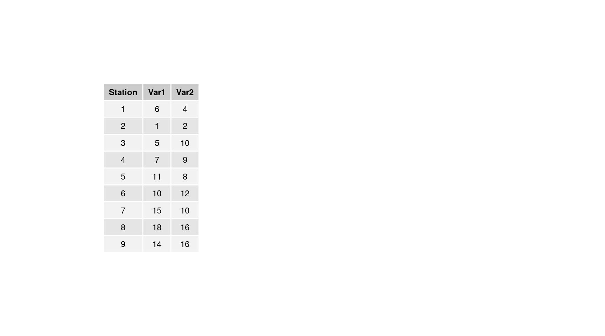

Voic une représentation graphique 2D de ces données\ :


Si nous réduisons à une seule dimension en laissant tomber une des deux variables, voici ce que cela donne (ici on ne garde que `Var1`, donc, on projette les points sur l'axe des abscisses).


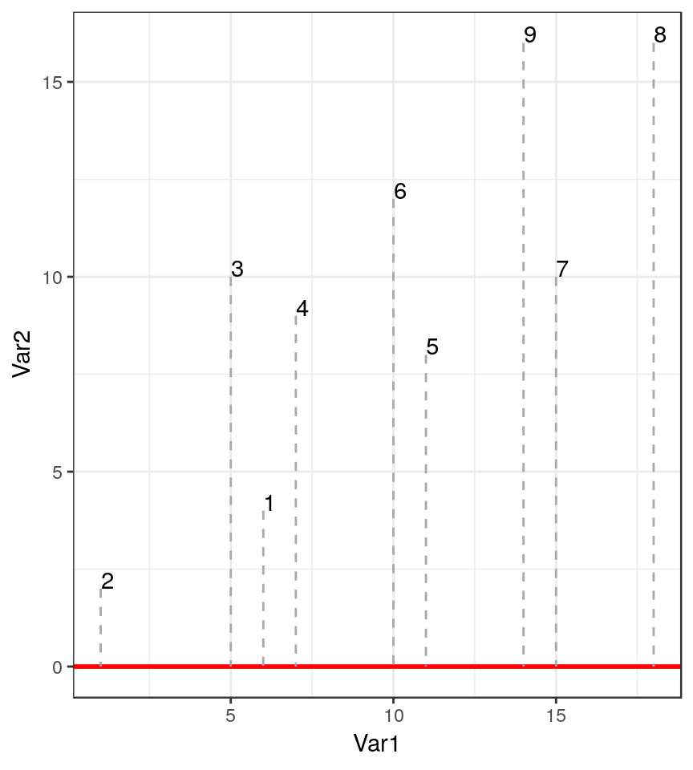

Au final, nous avons ordonné nos individus en une dimension comme suit\ :

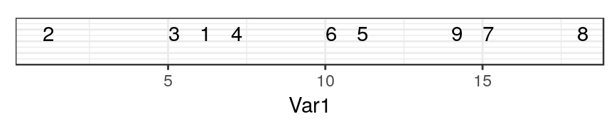

C'est une mauvaise solution car il y a trop de perte d'information. Regardez l'écart entre 7 et 9 sur le graphqie en deux dimensions et dans celui à une dimension\ : les points sont trop près. Comparez sur les deux graphiques les distances 7 - 9 avec  9 - 8 et 1 - 2 *versus* 1 - 3. Tout cela est très mal représenté en une seule dimension.

Une autre solution serait de projeter le long de la droite de "tendance générale", c'est-à-dire le long de l'axe de plus grand allongement du nuage de points.


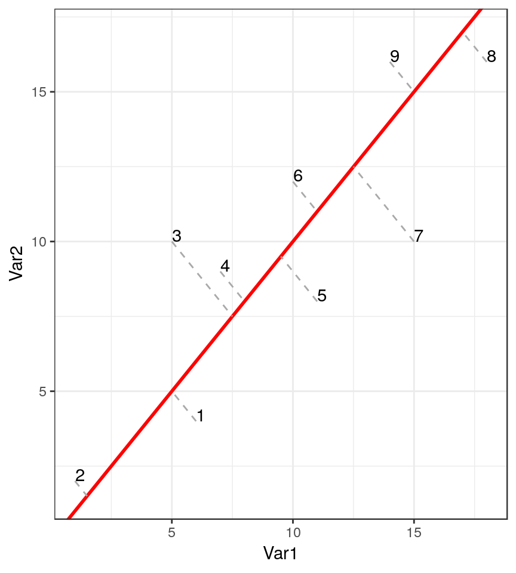

Cela donne ceci en une seule dimension\ :

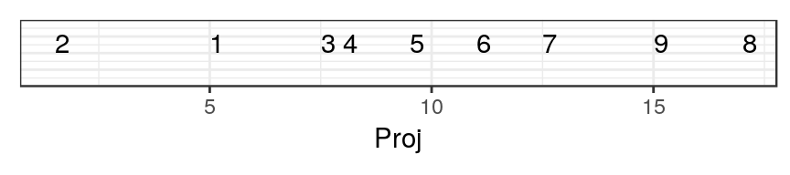

C'est une bien meilleure solution car la perte d'information est ici minimale. Regardez à nouveau la distance entre 7 et 9 sur le graphique initial à deux dimensions et sur le nouveau graphique réduit à une dimension\ : c'est mieux qu'avant. Comparez aussi les distances respectives entre les paires 7 - 9 et 9 - 8, ainsi que 1 - 2 par rapport à 1 - 3. Tout cela est bien pieux représenté à présent.

**L’ACP effectue précisément la projection que nous venons d’imaginer.**

- La droite de projection est appelée **composante principale 1**. La composante principale 1 présente la plus grande variabilité possible sur un seul axe.

- Ensuite on calcule la composante 2 comme étant orthogonale (i.e., perpendiculaire) à PC1 et présentant la plus grande variabilité non encore capturée par la composante 1.

- Le mécanisme revient à projeter les points sur des axes orientés différemment dans l'e plan'espace à N dimensions (pour N variables intiales). En effet, mathématiquement ce mécanisme se généralise facilement à trois, puis à N dimensions.


### Calcul matriciel ACP

La rotation optimale des axes vers les PC1 à PCN se résoud par un calcul matriciel. Nous allons maintenant le détailler. Mais auparavant, nous devons nous rafraîchir l'esprit concernant quelques notions.

- Multiplication matricielle\ : $\begin{pmatrix}
2 & 3\\
2 & 1
\end{pmatrix}
\times
\begin{pmatrix}
1\\
3
\end{pmatrix}
=
\begin{pmatrix}
11\\
5
\end{pmatrix}$ 

- Vecteurs propres et valeurs propres (il en existe autant qu’il y a de colonnes dans la matrice de départ) :

$$
\begin{pmatrix}
2 & 3\\
2 & 1
\end{pmatrix}
\times
\begin{pmatrix}
3\\
2
\end{pmatrix}
=
\begin{pmatrix}
12\\
8
\end{pmatrix}
= 4 \times
\begin{pmatrix}
3\\
2
\end{pmatrix}
$$

- La constante (4) est une **valeur propre** et la matrice multipliée (à droite) est la matrice des **vecteurs propres**.

- La rotation d'un système d'axes à deux dimensions d'un angle $\alpha$ peut se représenter sous forme d'un calcul matriciel\ :


$$
\begin{pmatrix}
\cos \alpha & \sin \alpha\\
-\sin \alpha & \cos \alpha
\end{pmatrix}
\times
\begin{pmatrix}
x\\
y
\end{pmatrix}
=
\begin{pmatrix}
x'\\
y'
\end{pmatrix}
$$

Dans le cas particulier de l’ACP, la matrice de transformation qui effectue la rotation voulue pour obtenir les axes principaux est **la matrice rassemblant tous les vecteurs propres calculés après diagonalisation de la matrice de corrélation ou de variance/covariance** (réduction ou non, respectivement). Le schéma suivant visualise la rotation depuis les axes initiaux X et Y (variables de départ) en bleu royal vers les PC1, PC2 en rouge. Un individu p est représenté par les coordonnées {x, y} dans le système d'axes initial XY. Les nouvelles coordonnées {x', y'} sont recalculées par projection sur les nouveaux axes PC1-PC2. Les flèches bleues sont représentées dans l'espace des variables, tandis que les points reprojettés sur PC1-PC2 sont représentés dans l'espace des individus selon les coordonnées primes en rouge.


#### Résolution numérique simple

Effectuons une ACP sur matrice var/covar sans réduction des données (mais calcul très similaire lorsque les données sont réduites) sur un exemple numérique simple.

- Étape 1\ :  centrage des données

$$
\mathop{\begin{pmatrix}
2 & 1 \\
3 & 4 \\
5 & 0 \\
7 & 6 \\
9 & 2
\end{pmatrix}}_{\text{Tableau brut}}
\xrightarrow{\phantom{---}\text{centrage}\phantom{---}}
\mathop{\begin{pmatrix}
-3.2 & -1.8 \\
-2.2 & \phantom{-}1.4 \\
-0.2 & -2.6 \\
\phantom{-}1.8 & \phantom{-}3.4 \\
\phantom{-}3.8 & -0.6
\end{pmatrix}}_{\text{Tableau centré (X)}}
$$

- Étape 2\ :  calcul de la matrice de variance/covariance

$$
\mathop{\begin{pmatrix}
-3.2 & -1.8 \\
-2.2 & \phantom{-}1.4 \\
-0.2 & -2.6 \\
\phantom{-}1.8 & \phantom{-}3.4 \\
\phantom{-}3.8 & -0.6
\end{pmatrix}}_{\text{Tableau centré (X)}}
\xrightarrow{\phantom{---}\text{var/covar}\phantom{---}}
\mathop{\begin{pmatrix}
8.2 & 1.6 \\
1.6 & 5.8
\end{pmatrix}}_{\text{Matrice carrée (A)}}
$$

- Étape 3\ : diagonalisation de la matrice var/covar

$$
\mathop{\begin{pmatrix}
8.2 & 1.6 \\
1.6 & 5.8
\end{pmatrix}}_{\text{Matrice carrée (A)}}
\xrightarrow{\phantom{---}\text{diagonalisation}\phantom{---}}
\mathop{\begin{pmatrix}
9 & 0 \\
0 & 5
\end{pmatrix}}_{\text{Matrice diagonalisée (B)}}
$$

- La **trace** des deux matrices A et B (somme des éléments sur la diagonale) est égale à : 8.2 + 5.8 = 14 = 9 + 5.
- 8.2 est la **part de variance** exprimée sur le premier axe initial (X)
- 5.8 est la **part de variance** exprimée sur le second axe initial (Y)
- 14 est la **variance totale** du jeu de données
- La matrice diagonale B est la solution exprimant **la plus grande part de variance possible sur le premier axe de l’ACP**\ : 9, soit 64,3% de la variance totale.
- Les éléments sur la diagonale sont les valeurs propres $\lambda_i$\ ! Vous vous rappelez les fameuses "eigenvalues" dans la sortie de `summary(pima_pca)`.


- Étape 4\ : calcul de la matrice de rotation des axes (en utilisant la propriété des valeurs propres $\text{A}.\text{U} = \text{B}.\text{U}$).

$$
\mathop{\begin{pmatrix}
8.2 & 1.6 \\
1.6 & 5.8
\end{pmatrix}}_{\text{Matrice A}}
\times
\text{U}
=
\mathop{\begin{pmatrix}
9 & 0 \\
0 & 5
\end{pmatrix}}_{\text{Matrice B}}
\times
\text{U}
\rightarrow
\text{U}
=
\mathop{\begin{pmatrix}
\phantom{-}0.894 & -0.447 \\
\phantom{-}0.447 & \phantom{-}0.894
\end{pmatrix}}_{\text{Matrice des vecteur propres (U)}}
$$

- La **matrice des vecteurs propres (U)** ("eigenvectors" en anglais) effectue la transformation (**rotation des axes**) pour obtenir les **composantes principales**.
- L'angle de rotation se déduit en considérant que cette matrice contient des sin et cos d'angles de rotation des axes\ :

$$
\begin{pmatrix}
\phantom{-}0.894 & -0.447 \\
\phantom{-}0.447 & \phantom{-}0.894
\end{pmatrix}
=
\begin{pmatrix}
\phantom{-}\cos(-26.6°) & \phantom{-}\sin(-26.6°) \\
-\sin(-26.6°) & \phantom{-}\cos(-26.6°)
\end{pmatrix}
$$

- Étape 5\ : représentation dans l'espace des variables. C'est une représentation dans un cercle de la matrice des vecteurs propres U sous forme de vecteurs.

- Étape 6\ : représentation dans l'espace des individus. On recalcule les coordonnées des individus dans le système d'axe après rotation.

$$
\mathop{\begin{pmatrix}
-3.2 & -1.8 \\
-2.2 & \phantom{-}1.4 \\
-0.2 & -2.6 \\
\phantom{-}1.8 & \phantom{-}3.4 \\
\phantom{-}3.8 & -0.6
\end{pmatrix}}_{\text{Tableau centré (X)}}
\times
\mathop{\begin{pmatrix}
\phantom{-}0.894 & -0.447 \\
\phantom{-}0.447 & \phantom{-}0.894
\end{pmatrix}}_{\text{Matrice des vecteur propres (U)}}
\xrightarrow{\phantom{---}\text{X}.\text{U} = \text{X'}\phantom{---}}
\mathop{\begin{pmatrix}
-3.58 & \phantom{-}0.00 \\
-1.34 & \phantom{-}2.24 \\
-1.34 & -2.24 \\
\phantom{-}3.13 & \phantom{-}2.24 \\
\phantom{-}3.13 & -2.24
\end{pmatrix}}_{\text{Tableau avec rotation (X')}}
$$

- Ensuite, on représente ces individus à l'aide d'un graphique en nuage de points.


Tout ces calculs se généralisent facilement à trois, puis à N dimensions.


##### Pour aller plus loin {-}

- N'hésitez pas à **combiner** plusieurs techniques. Par exemple, vous pouvez représenter les groupes créés par classification ascendante hiérarchiques sur un graphique de l'ACP dans l'espace des individus en faisant varier les couleurs ou les labels des individus en fonction des groupes de la CAH.

- Une [autre explication de l'ACP](http://www.sthda.com/english/articles/31-principal-component-methods-in-r-practical-guide/112-pca-principal-component-analysis-essentials/) en utilsant quelques autres fonctions de R pour visualiser le résultat

- Une [explication détaillée de la PCA en anglais](http://staff.ustc.edu.cn/~zwp/teach/MVA/abdi-awPCA2010.pdf).

- Une page qui reprend [une série de vidéos](http://www.sthda.com/english/articles/21-courses/65-principal-component-analysis-course-using-factominer/) qui présentent les différentes facettes de l'ACP (en franglais).

##### A vous de jouer ! {-}

- Réalisez le début du projet spécifique lié au module 7. Ce module couvre la matière entière du module 7. 

\BeginKnitrBlock{bdd}<div class="bdd">**Le lien pour réaliser ce projet se trouve en début du module 7**

*Ce projet doit être terminé à la fin de ce module*</div>\EndKnitrBlock{bdd}

- Complétez votre projet sur le transect entre Nice et Calvi débuté lors du module 5. Lisez attentivement le README (Ce dernier a été mis à jour).

\BeginKnitrBlock{bdd}<div class="bdd">Complétez votre projet. Lisez attentivement le README.

La dernière version du README est disponible via le lien suivant\ :
  
- <https://github.com/BioDataScience-Course/spatial_distribution_zooplankton_ligurian_sea/blob/master/README.md>
  
*Le README est un rappel des consignes, il ne s'agit aucunement du lien pour débuter le travail*</div>\EndKnitrBlock{bdd}

## Analyse factorielle des correspondances

Comme l'ACP s'intéresse à des corrélations linéaires entre variables quantitatives, elle n'est absolument pas utilisable pour traiter des variables qualitatives. L'**Analyse Factorielle des Correspondances** sera utile dans ce dernier cas (AFC, ou en anglais "Correspondence Analysis" ou CA).


### AFC dans SciViews::R

L'AFC utilises la fonction `ca()` du package `ca` dans `SciViews::R`, mais au stade actuel, tout le code nécessaire (en particulier pour réaliser les graphiques avec `chart()`) n'est pas encore complètement intégré dans les packages. Ainsi, vous pouvez copier-coller le code du chunk suivant au début de vos scripts ou dans un chunk de `setup` dans vos documents R Markdown/Notebook.


```r
SciViews::R()
library(broom)

# Au lieu de MASS::corresp(, nf = 2), nous préférons ca::ca()
ca <- ca::ca

scale_axes <- function(data, aspect.ratio = 1) {
  range_x <- range(data[, 1])
  span_x <- abs(max(range_x) - min(range_x))
  range_y <- range(data[, 2])
  span_y <- abs(max(range_y) - min(range_y))
  if ((span_y / aspect.ratio) > span_x) {
    # Adjust range_x
    span_x_2 <- span_y / aspect.ratio / 2
    range_x_mid <- sum(range_x) / 2
    range_x <- c(range_x_mid - span_x_2, range_x_mid + span_x_2)
  } else {
    # Adjust range_y
    span_y_2 <- span_x * aspect.ratio / 2
    range_y_mid <- sum(range_y) / 2
    range_y <- c(range_y_mid - span_y_2, range_y_mid + span_y_2)
  }
  list(x = range_x, y = range_y)
}

plot3d <- rgl::plot3d
plot3d.ca <- ca:::plot3d.ca

autoplot.ca <- function(object, choices = 1L:2L,
type = c("screeplot", "altscreeplot", "biplot"), col = "black", fill = "gray",
aspect.ratio = 1, repel = FALSE, ...) {
  type = match.arg(type)

  res <- switch(type,
    screeplot = object %>.% # Classical screeplot
      `[[`(., "sv") %>.%
      tibble(Dimension = 1:length(.), sv = .) %>.%
      chart(data = ., sv^2 ~ Dimension) +
      geom_col(col = col, fill = fill) +
      labs(y = "Inertia"),

    altscreeplot = object %>.% # screeplot represented by dots and lines
      `[[`(., "sv") %>.%
      tibble(Dimension = 1:length(.), sv = .) %>.%
      chart(data = ., sv^2 ~ Dimension) +
      geom_line(col = col) +
      geom_point(col = "white", fill = col, size = 2, shape = 21, stroke = 3) +
      labs(y = "Inertia"),

    biplot = {
      # We want to use the function plot.ca(), but without plotting the base plot
      # So, we place it in a specific environment where all base plot functions are
      # fake and do nothing (we just want to collect points coordinates at the end)
      env <- new.env()
      env$plot_ca <- ca:::plot.ca
      environment(env$plot_ca) <- env
      env$plot <- function(...) NULL
      env$box <- function(...) NULL
      env$abline <- function(...) NULL
      env$axis <- function(...) NULL
      env$par <- function(...) NULL
      env$points <- function(...) NULL
      env$lines <- function(...) NULL
      env$.arrows <- function(...) NULL
      env$text <- function(...) NULL
      env$strwidth <- function(...) NULL
      env$strheight <- function(...) NULL

      contribs <- paste0("Dimension ", 1:length(object$sv), " (",
        round(object$sv^2 / sum(object$sv^2) * 100, 1), "%)")[choices]

      res <- env$plot_ca(object, dim = choices, ...)

      rows <- as.data.frame(res$rows)
      rows$Type <- "rows"
      rows$Labels <- object$rownames
      cols <- as.data.frame(res$cols)
      cols$Type <- "cols"
      cols$Labels <- object$colnames
      res <- bind_rows(rows, cols)
      names(res) <- c("x", "y", "type", "labels")

      lims <- scale_axes(res, aspect.ratio = aspect.ratio)
      nudge <- (lims$x[2] - lims$x[1]) / 100

      res <- chart(data = res, y ~ x %col=% type %label=% labels) +
        geom_hline(yintercept = 0, col = "gray") +
        geom_vline(xintercept = 0, col = "gray") +
        coord_fixed(ratio = 1, xlim = lims$x, ylim = lims$y, expand = TRUE) +
        theme(legend.position = "none") +
        labs(x = contribs[1], y = contribs[2])

      if (isTRUE(repel)) {
        res <- res + geom_point() + ggrepel::geom_text_repel()
      } else {# Use text
        res <- res + geom_point() +
          geom_text(hjust = 0, vjust = 0, nudge_x = nudge, nudge_y = nudge)
      }
      res
    }
  )
  res
}
chart.ca <- function(data, choices = 1L:2L, ...,
type = c("screeplot", "altscreeplot", "boiplot"), env = parent.frame())
  autoplot.ca(data, choices = choices, ..., type = type, env = env)
class(chart.ca) <- c("function", "subsettable_type")
```


### Enquête sur la science

L'idée de départ de l'AFC est de pouvoir travailler sur des données qualitatives en les transformant en variables quantitatives via une astuce de calcul, et ensuite de réaliser une ACP sur ce tableau quantitatif pour en représenter l'information visuellement sur une carte. Les enquêtes (mais pas seulement) génèrent souvent des quantités importantes de variables qualitatives qu'il faut ensuite analyser. En effet, des sondage proposent la plupart du temps d'évaluer une question sur une échelle de plusieurs niveaux du genre "tout-à-fait d'accord", "d'accord", "pas d'accord", "pas du tout d'accord", ce qui donnerait une variable facteur à quatre niveaux ordonnés.

Une grande enquête mondiale a été réalisée en 1993 pour déterminer (entre autre) ce que la population pense de la science en général. Quatre questions sont posées (section 4 de [ce questionnaire](https://dbk.gesis.org/dbksearch/download.asp?db=E&id=7987), voir aussi [ici](https://dbk.gesis.org/dbksearch/sdesc2.asp?no=2450&search=issp%201993&search2=&field=all&field2=&DB=e&tab=0&notabs=&nf=1&af=&ll=10))\ :

A. Les gens croient trop souvent à la science, et pas assez aux sentiments et à la foi

B. En général, la science moderne fait plus de mal que de bien

C. Tout changement dans la nature apporté par les êtres humains risque d'empirer les choses

D. La science moderne va résoudre nos problèmes relatifs à l'environement sans faire de grands changements à notre mode de vie

Les réponses possibles sont\ : 1 = tout-à-fait d'accord à 5 = pas du tout d'accord. Le jeu de données `wg93` du package `ca` reprend les réponses données par les allemands de l'ouest à ces questions. De plus, les caractéristiques suivantes des répondants sont enregistrées\ :

- le sexe (1 = homme, 2 = femme),
- l'âge (1 = 18-24, 2 = 25-34, 3 = 35-44, 4 = 45-54, 5 = 55-64, 6 = 65+)
- le niveau d'éducation (1 = primaire, 2 = second. partim, 3 = secondaire, 4 = univ. partim, 5 = univ. cycle 1, 6 = univ. cycle 2+)


```r
wg <- read("wg93", package = "ca")
wg
```

```
# # A tibble: 871 x 7
#    A     B     C     D     sex   age   edu  
#    <fct> <fct> <fct> <fct> <fct> <fct> <fct>
#  1 2     3     4     3     2     2     3    
#  2 3     4     2     3     1     3     4    
#  3 2     3     2     4     2     3     2    
#  4 2     2     2     2     1     2     3    
#  5 3     3     3     3     1     5     2    
#  6 3     4     4     5     1     3     2    
#  7 3     4     2     4     2     5     2    
#  8 3     4     4     2     1     3     3    
#  9 3     2     2     1     1     3     2    
# 10 3     3     2     2     1     3     2    
# # … with 861 more rows
```

Ceci est un tableau cas par variables avec sept variables facteurs et 871 cas. Nous commençons par réencoder les niveaux des variables pour plus de clarté\ :


```r
wg %>.%
  mutate(.,
    A = recode(A, `1` = "++", `2` = "+", `3` = "0", `4` = "-", `5` = "--"),
    B = recode(B, `1` = "++", `2` = "+", `3` = "0", `4` = "-", `5` = "--"),
    C = recode(C, `1` = "++", `2` = "+", `3` = "0", `4` = "-", `5` = "--"),
    D = recode(D, `1` = "++", `2` = "+", `3` = "0", `4` = "-", `5` = "--"),
    sex = recode(sex, `1` = "H", `2`= "F"),
    age = recode(age, `1` = "18-24", `2` = "25-34", `3` = "35-44",
      `4` = "45-54", `5` = "55-64", `6` = "65+"),
    edu = recode(edu, `1` = "primaire", `2` = "sec. part", `3` = "secondaire",
      `4` = "univ. part", `5` = "univ. cycle 1", `6` = "univ. cycle 2")
  ) -> wg
wg
```

```
# # A tibble: 871 x 7
#    A     B     C     D     sex   age   edu       
#    <fct> <fct> <fct> <fct> <fct> <fct> <fct>     
#  1 +     0     -     0     F     25-34 secondaire
#  2 0     -     +     0     H     35-44 univ. part
#  3 +     0     +     -     F     35-44 sec. part 
#  4 +     +     +     +     H     25-34 secondaire
#  5 0     0     0     0     H     55-64 sec. part 
#  6 0     -     -     --    H     35-44 sec. part 
#  7 0     -     +     -     F     55-64 sec. part 
#  8 0     -     -     +     H     35-44 secondaire
#  9 0     +     +     ++    H     35-44 sec. part 
# 10 0     0     +     +     H     35-44 sec. part 
# # … with 861 more rows
```

Par exemple, si nous nous posons la question de l'impact de l'éducation sur l'impression que la science est néfaste (question B), nous pourrons faire l'analyse suivante\ :

- **Étape 1\ :** calcul du tableau de contingence à double entrée croisant les réponses à la question B avec le niveau d'éducation des répondants\ :


```r
table(wg$B, wg$edu)
```

```
#     
#      primaire sec. part secondaire univ. part univ. cycle 1 univ. cycle 2
#   ++        6        34         19          6             4             2
#   +        10        93         47         12             5             7
#   0        11        95         55         18            11            15
#   -         7       112         82         37            16            27
#   --        4        44         39         21            13            19
```

- **Étape 2\ :** test de Chi^2^ d'indépendance, voir [section 8.2 du cours de SDD I](http://biodatascience-course.sciviews.org/sdd-umons/test-dhypothese.html#test-chi2-dindependance). L'hypothèse nulle du test est quel les deux variables sont indépendantes l'une de l'autre. L'hypothèse alternative est qu'une dépendance existe. Si la réponse aux questions est indépendante du niveau d'éducation (pas de rejet de H~0~), notre analyse est terminée. Sinon, il faut approfondir... Choisissons notre seuil $\alpha$ à 5% avant de réaliser notre test.


```r
chisq.test(wg$B, wg$edu)
```

```
# Warning in chisq.test(wg$B, wg$edu): Chi-squared approximation may be
# incorrect
```

```
# 
# 	Pearson's Chi-squared test
# 
# data:  wg$B and wg$edu
# X-squared = 42.764, df = 20, p-value = 0.002196
```

L'avertissement nous prévient qu'une approximation a du être réalisée, mais le test reste utilisable si la valeur est loin du seuil $/alpha$. La valeur *p* de 0,2% est très inférieure à $\alpha$. Nous rejettons H~0~. Il y a dépendance entre le niveau d'éducation et la réponse à la question B. OK, mais comment se fait cette dépendance\ ? C'est ici que l'AFC nous vient en aide.


-**Étape 3\ :** Si l'hypothèse nulle est rejettée, il faut analyser plus en profondeur. L'AFC va présenter la dépendance de manière claire. La fonction `ca()` accepte un jeu de données dans l'argument `data =` et une formule qui spécifie dans le terme de droite les deux variables à croiser séparées par un signe + (`~ fact1 + fact2`). Donc\ :


```r
wg_b_edu <- ca(data = wg, ~ B + edu)
wg_b_edu
```

```
# 
#  Principal inertias (eigenvalues):
#            1        2        3        4    
# Value      0.043989 0.004191 0.000914 4e-06
# Percentage 89.59%   8.54%    1.86%    0.01%
# 
# 
#  Rows:
#                ++         +         0        -        --
# Mass     0.081515  0.199770  0.235362 0.322618  0.160735
# ChiDist  0.286891  0.274685  0.095627 0.141176  0.341388
# Inertia  0.006709  0.015073  0.002152 0.006430  0.018733
# Dim. 1  -1.140162 -1.293374 -0.406059 0.591115  1.593838
# Dim. 2  -2.211930  0.641674 -0.409771 0.976000 -1.034695
# 
# 
#  Columns:
#          primaire sec. part secondaire univ. part univ. cycle 1
# Mass     0.043628  0.433984   0.277842   0.107922      0.056257
# ChiDist  0.427367  0.164446   0.036882   0.279471      0.341163
# Inertia  0.007968  0.011736   0.000378   0.008429      0.006548
# Dim. 1  -1.722505 -0.773101   0.115183   1.302120      1.428782
# Dim. 2  -3.523982  0.381160   0.336612   0.235984     -2.516238
#         univ. cycle 2
# Mass         0.080367
# ChiDist      0.417941
# Inertia      0.014038
# Dim. 1       1.962905
# Dim. 2       0.135512
```

Nous retrouvons les valeurs propres (`eigenvalues`) qui représentent l'inertie exprimée sur les différents axes, avec le pourcentage juste en dessous. Les deux tableaux suivants détaillent les calculs. Il n'est pas indispensable de comprendre tout ce qui s'y trouve, mais notez que les composantes du calcul du Chi^2^ pour chaque niveau des variables sont reprises à la ligne `ChiDist`. Nous y reviendrons. La méthode `summary()` ainsi que le graphique des éboulis via `chart$scree()` nous donnent une information plus claire sur la contribution de la variabilité totale sur les différents axes. Cela nous aide à décider si le plan réduit aux deux premiers axes que nous utiliserons ensuite est adéquat ou non (pourcentage suffisant = données bien représentées dans ce plan).


```r
summary(wg_b_edu, scree = TRUE, rows = FALSE, columns = FALSE)
```

```
# 
# Principal inertias (eigenvalues):
# 
#  dim    value      %   cum%   scree plot               
#  1      0.043989  89.6  89.6  **********************   
#  2      0.004191   8.5  98.1  **                       
#  3      0.000914   1.9 100.0                           
#  4      4e-06000   0.0 100.0                           
#         -------- -----                                 
#  Total: 0.049097 100.0
```


```r
chart$scree(wg_b_edu)
```

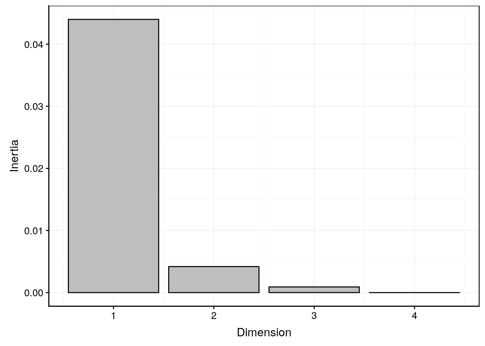

Ici, les deux premiers axes cumulent plus de 98% de la variation totale. Nous pouvons donc continuer en toute confiance. Le **biplot** va ici projetter les individus sur la carte (les individus étant en fait les différents niveaux des deux variables, obtenus après réalisation de deux ACP, l'une sur les colonnes et l'autre sur les lignes). Les deux groupes sont représentés par des couleurs différentes, mais sur une même carte. C'erst la fonction `chart$biplot()` qui réalise ce graphique.


```r
chart$biplot(wg_b_edu, choices = c(1, 2))
```

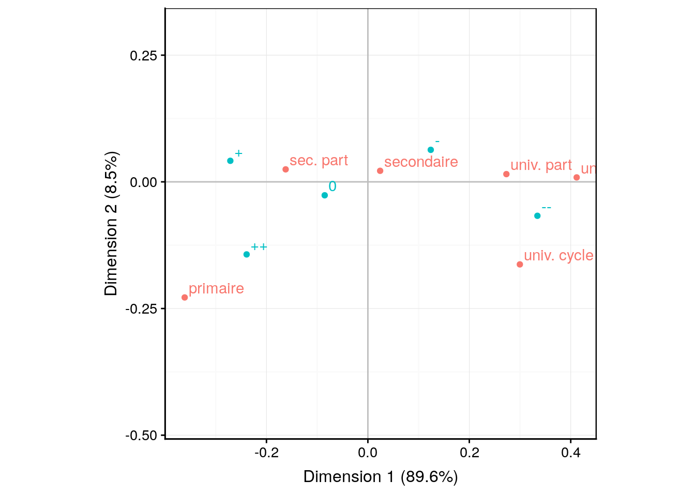

L'interprétation se fait d'abord sur les points d'une couleur (niveau de la première variable), puis sur ceux de l'autre (niveaux de la seconde variable), et enfin, conjointement. Voici ce que cela donne ici\ :

- Les niveaux d'éducation en rouge sont globalement représentés essentiellement de gauche à droite dans un ordre croissant de "études primaires" jusqu'à "études universitaires de 2^éme^ cycle ou plus".

- Les réponses à la question B (en bleu turquoise) sont également rangés globalement de gauche à droite (avec une légère inversion entre `+` et `++`) depuis ceux qui sont tout-à-fait d'accord que la science moderne est néfaste à la gauche jusqu'à ceux qui ne le sont pas du tout à la droite.

- Conjointement, on va comparer les points rouges et les bleus et regarder ceux qui se situent dans une direction similaire par rapport au centre d'inertie à la coordonnée {0, 0} matérialisée par la croix grise^[Attention\ : les valeurs sur les axes ne sont pas à interpréter quantitativement. Elles ne portent pas une information utile ici.]. Ainsi, nous constatons que ceux qui ont le niveau éducatif le plus faible (niveau primaire) ont globalement plutôt répondu qu'ils sont tout-à-fait d'accord (`++`), alors qu'à l'opposé, les universitaires ne sont pas du tous d'accord avec l'affirmation (`--`).

L'essentiel se lit ici effectivement sur un seul axe (dimension 1) qui capture environ 90% de la variation totale. Le second axe vient moduler légèrement ce classement avec 8,5% de variabilité, mais sans tout bouleverser.

Ici la lecture de la carte générée par l'AFC est limpide... Et manifestement, nous pouvions légitimement conclure à l'époque qu'un effort éducatif et d'information était nécessaire auprès de la population la moins éduquée pour leur faire prendre conscience de l'intérêt de la science moderne (à moins que cette dernière remarque ne soit un parti pris... d'un universtaire :-).


### Des acariens sinon rien

Un deuxième exemple illustre une utilisation légèrement différente de l'AFC. Il s'agit des tableaux de type "espèces par stations". Ces tableaux contiennent différentes espèces ou autres groupes taxonomiques dénombrés dans plusieurs échantillons prélevés à des stations différentes. Le dénombrement des espèces peut être quantitatif (nombre d'individus observés par unité de surface ou de volume), semi-quantitatif (peu, moyen, beaucoup), ou même binaire (présence ou absence de l'espèce). Ces tableaux sont assimilables, en réalité, à des tableaux de contingence à double entrée qui croisent deux variables qualitatives "espèce" et "station". C'est comme si la première étape avait déjà été réalisée dans l'analyse précédente du jeu de données `wg`.

Naturellement, comme il ne s'agit pas réellement d'un tableau de contingence, nous ne réaliserons pas le test Chi^2^ d'indépendance ici, et nous passerons directement à l'étape de l'AFC. L'exemple choisi concerne des populations d'acariens dans de la litière (acarien se dit "mite" en anglais, d'où le nom du jeu de données issu du package `vegan`).


```r
mite <- read("mite", package = "vegan")
skimr::skim(mite)
```

```
# Skim summary statistics
#  n obs: 70 
#  n variables: 35 
# 
# ── Variable type:integer ─────────────────────────────────────────────────────────────────────────────
#  variable missing complete  n  mean    sd p0  p25  p50   p75 p100     hist
#    Brachy       0       70 70  8.73 10.08  0 3     4.5 11.75   42 ▇▂▁▂▁▁▁▁
#  Ceratoz1       0       70 70  1.29  1.46  0 0     1    2       5 ▇▆▁▃▁▁▁▁
#  Ceratoz3       0       70 70  1.3   2.2   0 0     0    2       9 ▇▁▁▁▁▁▁▁
#  Eupelops       0       70 70  0.64  0.99  0 0     0    1       4 ▇▃▁▁▁▁▁▁
#      FSET       0       70 70  1.86  3.18  0 0     0    2      12 ▇▂▁▁▁▁▁▁
#  Galumna1       0       70 70  0.96  1.73  0 0     0    1       8 ▇▁▁▁▁▁▁▁
#      HMIN       0       70 70  4.91  8.47  0 0     0    4.75   36 ▇▁▁▁▁▁▁▁
#     HMIN2       0       70 70  1.96  3.92  0 0     0    2.75   20 ▇▂▁▁▁▁▁▁
#      HPAV       0       70 70  8.51  7.56  0 4     6.5 12      37 ▇▇▃▃▁▁▁▁
#      HRUF       0       70 70  0.23  0.62  0 0     0    0       3 ▇▁▁▁▁▁▁▁
#      LCIL       0       70 70 35.26 88.85  0 1.25 13   44     723 ▇▁▁▁▁▁▁▁
#  Lepidzts       0       70 70  0.17  0.54  0 0     0    0       3 ▇▁▁▁▁▁▁▁
#      LRUG       0       70 70 10.43 12.66  0 0     4.5 17.75   57 ▇▂▂▁▁▁▁▁
#      MEGR       0       70 70  2.19  3.62  0 0     1    3      17 ▇▂▁▁▁▁▁▁
#  Miniglmn       0       70 70  0.24  0.79  0 0     0    0       5 ▇▁▁▁▁▁▁▁
#      MPRO       0       70 70  0.16  0.47  0 0     0    0       2 ▇▁▁▁▁▁▁▁
#      NCOR       0       70 70  1.13  1.65  0 0     0.5  1.75    7 ▇▃▂▂▁▁▁▁
#      NPRA       0       70 70  1.89  2.37  0 0     1    2.75   10 ▇▂▂▁▁▁▁▁
#      ONOV       0       70 70 17.27 18.05  0 5    10.5 24.25   73 ▇▃▂▁▁▁▁▁
#  Oppiminu       0       70 70  1.11  1.84  0 0     0    1.75    9 ▇▁▁▁▁▁▁▁
#  Oribatl1       0       70 70  1.89  3.43  0 0     0    2.75   17 ▇▁▁▁▁▁▁▁
#      PHTH       0       70 70  1.27  2.17  0 0     0    2       8 ▇▁▁▁▁▁▁▁
#     PLAG2       0       70 70  0.8   1.79  0 0     0    1       9 ▇▁▁▁▁▁▁▁
#      PPEL       0       70 70  0.17  0.54  0 0     0    0       3 ▇▁▁▁▁▁▁▁
#   Protopl       0       70 70  0.37  1.61  0 0     0    0      13 ▇▁▁▁▁▁▁▁
#      PWIL       0       70 70  1.09  1.71  0 0     0    1       8 ▇▁▁▁▁▁▁▁
#      RARD       0       70 70  1.21  2.78  0 0     0    1      13 ▇▂▁▁▁▁▁▁
#      SLAT       0       70 70  0.4   1.23  0 0     0    0       8 ▇▁▁▁▁▁▁▁
#      SSTR       0       70 70  0.31  0.97  0 0     0    0       6 ▇▁▁▁▁▁▁▁
#  Stgncrs2       0       70 70  0.73  1.83  0 0     0    0       9 ▇▁▁▁▁▁▁▁
#      SUCT       0       70 70 16.96 13.89  0 7.25 13.5 24      63 ▇▇▆▅▂▁▁▁
#  Trhypch1       0       70 70  2.61  6.14  0 0     0    2      29 ▇▁▁▁▁▁▁▁
#  Trimalc2       0       70 70  2.07  5.79  0 0     0    0      33 ▇▁▁▁▁▁▁▁
#      TVEL       0       70 70  9.06 10.93  0 0     3   19      42 ▇▁▁▂▁▁▁▁
#      TVIE       0       70 70  0.83  1.47  0 0     0    1       7 ▇▁▁▁▁▁▁▁
```

35 espèces d'acariens sont dénombrés en 70 stations différentes, et il n'y a aucunes valeurs manquantes. Comme il ne peut y avoir aucun total de ligne ou de colonne égal à zéro pour le calcul des Chi^2^ (sinon, on aurait une division par zéro), nous vérifions cela de la façon suivante\ :


```r
rowSums(mite)
```

```
#  [1] 140 268 186 286 199 209 162 126 123 166 216 213 177 269 100  97  90
# [18] 118 118 184 117 172  81  80 123 120 173 111 111  96 130  93 136 194
# [35] 111 133 139 189  94 157  81 140 148  60 158 154 121 113 107 148  91
# [52] 112 145  49  58 108   8 121  90 127  42  13  86  88 112 116 781 111
# [69] 184 121
```

```r
colSums(mite)
```

```
#   Brachy     PHTH     HPAV     RARD     SSTR  Protopl     MEGR     MPRO 
#      611       89      596       85       22       26      153       11 
#     TVIE     HMIN    HMIN2     NPRA     TVEL     ONOV     SUCT     LCIL 
#       58      344      137      132      634     1209     1187     2468 
# Oribatl1 Ceratoz1     PWIL Galumna1 Stgncrs2     HRUF Trhypch1     PPEL 
#      132       90       76       67       51       16      183       12 
#     NCOR     SLAT     FSET Lepidzts Eupelops Miniglmn     LRUG    PLAG2 
#       79       28      130       12       45       17      730       56 
# Ceratoz3 Oppiminu Trimalc2 
#       91       78      145
```

De plus, l'AFC est très sensible à la présence de valeurs extrêmes. Il faut être particulièrement attentif à ne pas avoir trop de disparité, surtout en présence d'espèces très abondantes *versus* d'autres très rares. Si quelques échantillons contiennent une quantité particulièrement large d'items, cela peut aussi être problématique. Pour des dénombrements ou du semi-quantitatif à plus d'une dizaine de niveaux, la boite de dispersion parallèle est un bon graphique, mais nous devons tronsformer le tableau de données en format long avec `gather()` pour pouvoir le faire, et ensuite, nous présentons les espèces sur l'axe des ordonnées avec `coord_flip()`\ :


```r
mite %>.%
  gather(., key = "species", value = "n") %>.%
  chart(., n ~ species) +
    geom_boxplot() +
  coord_flip()
```


Aïe\ ! Nous avons ici une magnifique valeur extrême, ainsi que des différences trop nettes entre les espèces les plus abondantes et les plus rares. Nous devons y remédier avant de faire notre AFC. Deux solutions sont possibles\ :

(1) Soit nous dégradons l'information vers du semi-quantitatif en définissant des niveaux d'abondance, du genre 0, 1-10, 10-20, 20-30, 31+. Nous pouvons réaliser cela avec la fonction `cut()` illustrée ici sur un exemple fictif.


```r
sample <- c(0, 12, 500, 25, 5)
cut(sample, breaks = c(-1, 0, 10, 20, 30, Inf))
```

```
# [1] (-1,0]   (10,20]  (30,Inf] (20,30]  (0,10]  
# Levels: (-1,0] (0,10] (10,20] (20,30] (30,Inf]
```

Nous voyons que `cut()` a ici remplacé nos données quantitatives dans `sample()` en une variable qualitative à cinq niveaux clairement libellés. Notez l'astuce du groupe `(-1,0]` pour capturer les valeurs nulles dans un groupe séparé.

(2) Autre solution, nous transformons les données pour réduire l'écart entre les extrêmes. Typiquement, une transformation $log(x + 1)$ est efficace pour cela, et fonctionne bien en présence de valeurs nulles aussi. Nous utiliserons cette dernière technique pour notre jeu de données `mite`. Enfin, nous nous assurons que les station sont bien numérotées de 1 à 70 en lignes (`rownames()`).


```r
mite2 <- log1p(as.data.frame(mite))
# Ajouter le numéro des stations explicitement
rownames(mite2) <- 1:nrow(mite2)
```

Le graphique boite de dispersion parallèle montre plus d'homogénéité maintenant\ :


```r
mite2 %>.%
  gather(., key = "species", value = "log_n_1") %>.%
  chart(., log_n_1 ~ species) +
  geom_boxplot() + coord_flip()
```


A noter que ce type de graphique ne convient pas pour les données semi-quantitatives ou qualitatives. Nous pouvons réaliser le graphique suivant à la place dans ce cas pour visualiser la distribution des espèces dans les différentes stations (qui fonctionne aussi en quantitatif)\ :


```r
mite2 %>.%
  gather(., key = "species", value = "n") %>.%
  mutate(., station = rep(1:nrow(mite), ncol(mite))) %>.%
  chart(., species ~ station %fill=% n) +
  geom_raster()
```

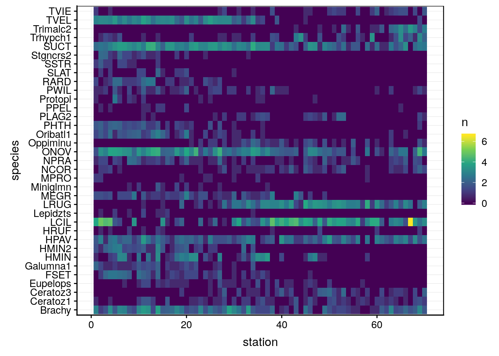

Maintenant que nos données sont vérifiées, nettoyées (phase de préparation), et décrites correctement (phase descriptive), nous pouvons réaliser notre AFC et explorer les particularités de ce jeu de données en vue d'une étude plus approfondie ultérieure (phase exploratoire). L'utilisation de `ca()` sur un tableau de type contingence à double entrée déjà prêt est ultra-simple. Il suffit de fournir le tableau en question comme seul argument à la fonction.


```r
mite2_ca <- ca(mite2)
```

Examinons la variabilité sur les différents axes, numériquement et à l'aide du graphe des éboulis\ :


```r
summary(mite2_ca, scree = TRUE, rows = FALSE, columns = FALSE)
```

```
# 
# Principal inertias (eigenvalues):
# 
#  dim    value      %   cum%   scree plot               
#  1      0.366209  31.5  31.5  ********                 
#  2      0.132783  11.4  42.9  ***                      
#  3      0.072315   6.2  49.1  **                       
#  4      0.065787   5.7  54.7  *                        
#  5      0.055872   4.8  59.5  *                        
#  6      0.048122   4.1  63.7  *                        
#  7      0.041834   3.6  67.3  *                        
#  8      0.039072   3.4  70.6  *                        
#  9      0.032183   2.8  73.4  *                        
#  10     0.031300   2.7  76.1  *                        
#  11     0.028809   2.5  78.6  *                        
#  12     0.026949   2.3  80.9  *                        
#  13     0.024701   2.1  83.0  *                        
#  14     0.022729   2.0  84.9                           
#  15     0.020618   1.8  86.7                           
#  16     0.018029   1.5  88.3                           
#  17     0.016836   1.4  89.7                           
#  18     0.014850   1.3  91.0                           
#  19     0.014217   1.2  92.2                           
#  20     0.012553   1.1  93.3                           
#  21     0.010879   0.9  94.2                           
#  22     0.010412   0.9  95.1                           
#  23     0.009703   0.8  96.0                           
#  24     0.008187   0.7  96.7                           
#  25     0.007294   0.6  97.3                           
#  26     0.006689   0.6  97.9                           
#  27     0.005343   0.5  98.3                           
#  28     0.004576   0.4  98.7                           
#  29     0.004020   0.3  99.1                           
#  30     0.003828   0.3  99.4                           
#  31     0.002732   0.2  99.6                           
#  32     0.001955   0.2  99.8                           
#  33     0.001656   0.1  99.9                           
#  34     0.000776   0.1 100.0                           
#         -------- -----                                 
#  Total: 1.163821 100.0
```


```r
chart$scree(mite2_ca, fill = "cornsilk")
```


La variabilité décroit rapidement sur les deux premiers axes, et ensuite plus lentement. Les deux premières dimensions ne capturent qu'environ 43% de la variabilité totale. Toutefois, la variation moins brutale par après justifie de ne garder que deux axes. Malgré la représentativité relativement faible dans ce plan, nous verrons que l'AFC reste interprétable et peut fournir des informations utiles, même dans ce cas. Voici la carte (biplot)\ :


```r
chart$biplot(mite2_ca, choices = c(1, 2))
```

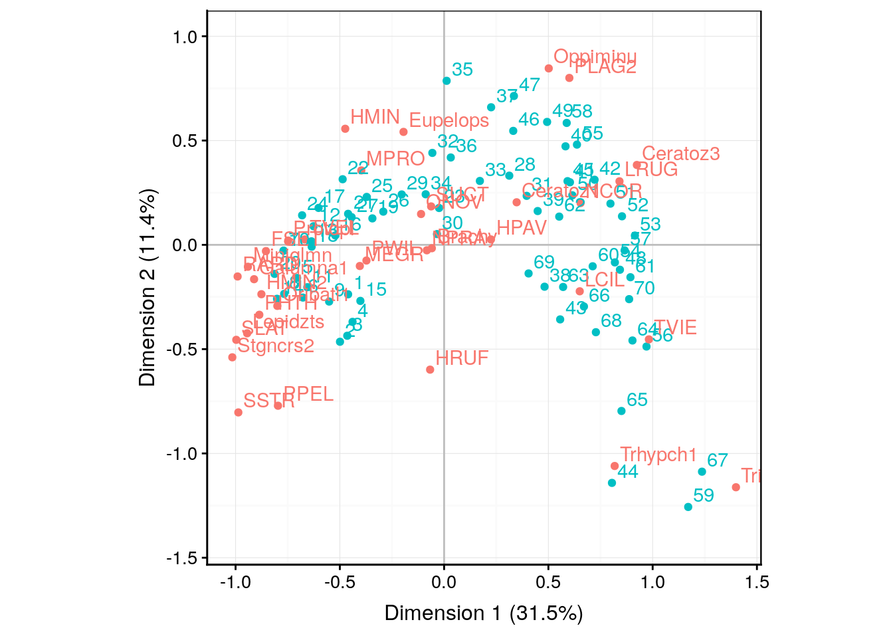

Nous observons une forme en fer à cheval de la distribution des points. Attention\ ! Ceci est un artéfact lié au fait que la distance du Chi^2^ a tendance à rapprocher les extrêmes ("qui se ressemblent dans la différence", en quelque sorte) alors que notre souhait aurait plutôt été de les placer aux extrémités du graphique. Il faut donc analyser les données comme une transition progressive d'un état A vers un état B le long de la forme en fer à cheval.

Lorsqu'il y a beaucoup de points, ce graphique tend à être très encombré et illisible. L'argument `repel = TRUE` vient parfois aider en allant placer les labels de telle façon qu'ils se chevauchent le moins possible. Par contre, la forme du nuage de point est du coup un peu moins visible.


```r
chart$biplot(mite2_ca, choices = c(1, 2), repel = TRUE)
```

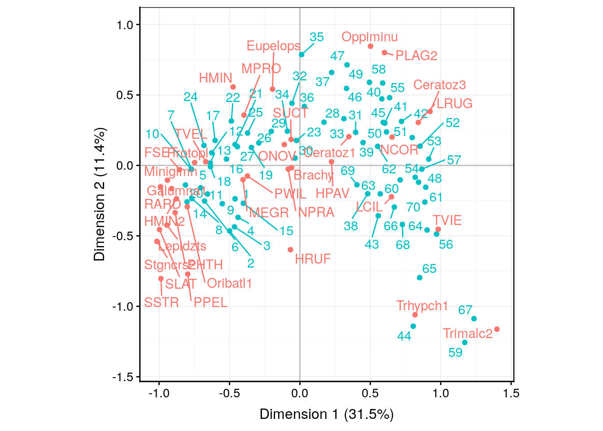

Nous vous laissons le soin d'effectuer l'analyse complète des points bleus (stations) entre eux, ensuite les points rouges (espèces) entre eux et enfin, conjointement. Notez les stations 44, 59, 65 et 67 qui se détachent et qui sont caractérisées par des espèces qu'on trouve préférentiellement là-bas\ : `Trhypch1` et `Trimalc2`. Les espèces et station proches du centre d'inertie, au contraire, ne montrent aucune particularité.


### Principe de l'AFC

Maintenant que nous avons découvert la façon de réaliser et d'interpréter une AFC, il est temps d'en comprendre les rouages. Rappelez-vous que la distance du Chi^2^ quantifie l'écart entre des effectifs observés $a_i$ et des effectifs théoriques $\alpha_i$ comme\ :

$$\chi^2=\sum{\frac{(a_i - \alpha_i)^2}{\alpha_i}}$$

Il y a un terme par cellule du tableau de contingence (que nous appelerons les *contributions* au Chi^2^), et par ailleurs, sous l'hypothèse nulle d'indépendance des variables, les $\alpha_i$ sont connus et dépendent uniquement des sommes des lignes et des colonnes du tableau. En effet, nous avons\ :

$$\alpha_i = \frac{\textrm{total ligne} . \textrm{total colonne}}{\textrm{total général}}$$

Donc, lors du calcul du Chi^2^, nous passons par une étape de transformation du tableau de contingence à double entrée où nous substituons les effectifs observés (des entiers, donc du quantitatif discret) par les contributions respectives au Chi^2^. Or ces contributions sont des valeurs réelles (continues) nulles ou positives. Nous obtenons donc un tableau contenant des *valeurs numériques continues* qui peut être traité par une ACP classique.

L'ACP va reprojetter les lignes du tableau (qui, rappelons-le, sont les différents niveaux d'une des deux variables qualitative étudiée) dans un espace réduit. Dans ce contexte, le graphique représentant les variables n'a pas grand intérêt, puique ces variables sont en réalité fictives, ou si vous préférez, "bricolées". Par contre, la position des individus les uns par rapport aux autres, et par rapport au centre d'inertie du graphique a une signification importante et interprétable.

Enfin, comme il n'y a aucune raison *a priori* d'utiliser une variable en ligne et l'autre en colonne, nous pouvons également transposer la table de contingence (les lignes deviennent les colonnes et *vice versa*). Si nous réalisons une nouvelle ACP sur ce tableau transposé, nous allons reprojetter les niveaux de l'*autre* variable qualitative sur un autre espace réduit.

Si nous prenons le même nombre de composantes principales des deux côtés, nous aurons la même part de variance reprise dans les deux projections. De plus, nous pouvons *superposer* les deux représentations en faisant coïncider les deux centres d'inertie en {0, 0}. La difficulté, comme pour tout biplot, est d'arriver à mettre à l'échelle les points d'une représentation par rapport à ceux de l'autre. Cette mise à l'échelle permet d'interpréter les points de couleurs différentes conjointement\ : des points proches sur le biplot dénotent des *correspondances* entre les niveaux respectifs des deux variables étudiées, d'où le nom de la méthode, analyse factorielle des *correspondances*.

Au final, l'AFC apparait donc comme une variante de l'ACP qui utilise la distance du Chi^2^ à la place de la distance euclidienne dans l'ACP classique, et qui reflète la symétrie du tableau de contingence (lignes/colonnes *versus* colonnes/lignes). Il en résulte la possiblité d'analyser ainsi des données qualitatives pour lesquelles la distance et la statistique du Chi^2^ ont précisément été inventées.


##### Pour en savoir plus {-}

- Une courte introduction de l'AFC en [vidéo](https://www.youtube.com/watch?v=tEc5cmlQVdI) avec résolution d'un exemple volontairement simpliste pour faire comprendre la signification du graphique obtenu et la façon de l'interpréter.

- Une [autre explication](http://www.sthda.com/french/articles/38-methodes-des-composantes-principales-dans-r-guide-pratique/74-afc-analyse-factorielle-des-correspondances-avec-r-l-essentiel/) qui utilise les packages `FactoMineR` et `factoextra` et qui va plus loin dans les concepts (notamment la qualité de la représentation des points via leur "cos^2^", les différents types de biplots, et l'ajout de données supplémentaires).

##### A vous de jouer ! {-}

- Réalisez le début du projet spécifique lié au module 7. Ce module couvre la matière entière du module 7. 

\BeginKnitrBlock{bdd}<div class="bdd">**Le lien pour réaliser ce projet se trouve en début du module 7**

*Ce projet doit être terminé à la fin de ce module*</div>\EndKnitrBlock{bdd}

- Complétez votre projet sur le transect entre Nice et Calvi débuté lors du module 5. Lisez attentivement le README (Ce dernier a été mis à jour).

\BeginKnitrBlock{bdd}<div class="bdd">Complétez votre projet. Lisez attentivement le README.

La dernière version du README est disponible via le lien suivant\ :
  
- <https://github.com/BioDataScience-Course/spatial_distribution_zooplankton_ligurian_sea/blob/master/README.md>
  
*Le README est un rappel des consignes, il ne s'agit aucunement du lien pour débuter le travail*</div>\EndKnitrBlock{bdd}

## Accès aux bases de données

Puisque nous traitons de jeux de données multivariés potentiellement très gros, il devient important de pouvoir accéder aux données stockées de manière plus structurée que dans un fichier au format CSV ou Excel, par exemple. Les bases de données, et notamment les **bases de données relationnelles**, sont prévue pour stocker de grandes quantités de données de manière structurée et pour pouvoir en extraire la partie qui nous intéresse à l'aide de **requêtes**. Nous allons ici étudier les rudiments indispensables pour nous permettre de réaliser de telles requêtes depuis R.

\BeginKnitrBlock{note}<div class="note">SQL est un langage dédié aux requêtes et la manipulation de bases de données relationnelles, constituées de tables (équivalent à des tableaux cas par variables en statistiques) reliées entre elles par une ou plusieurs *clés*. Par exemple, le champ `auteur` d'une liste de livres dans la table `Livres` renvoie (est lié à) vers le champs `nom` d'une autre table `Ecrivains` qui fournit plus de détails sur chaque auteur de livres.</div>\EndKnitrBlock{note}

Il existe différents moteurs de bases de données relationnelles. Les plus courants sont\ : SQLite, MySQL/MariaDB, PosgreSQL, SQL Server, Oracle, ... La plupart de ces solutions nécessitent d'installer un **serveur** de base de données centralisé. Cependant, SQLite, est une solution légère qui permet d'explorer le language SQL ([prononcez "S.Q.L." ou "Sequel"](https://www.vertabelo.com/blog/notes-from-the-lab/sql-or-sequel)), y compris avec des petites bases de données test en mémoire ou contenues dans un fichier.


### Installation de SQLite

Dans la SciViews Box, les drivers SQLite pour la version 2 et la version 3 sont préinstallés. Sous R, vous pouvez utiliser le package `RSQLite` pour accéder à des bases de données qui sont de simples fichiers sur le disque. Cependant, l'onglet **Connections** dans RStudio n'est pas compatible avec `RSQLite`. Il fonctionne, par contre avec les **drivers odbc** qui sont un format commun de drivers pour différentes bases de donnes dont SQLite. Les drivers SQLite, MySQL et PosgreSQL sont préinstallés dans la SciViews Box. Nous utiliserons également une interfaces graphique vers SQLite\ : **DB Browser for SQLite** disponible depuis le menu principal `Applications`, dans la section `Development`.


### Base de données en mémoire

La simplicité de SQLite tient au fait qu'il n'est pas nécessaire d'installer un serveur de bases de données pour l'utiliser. La version la plus simple permet même de travailler directement en mémoire. Ainsi, nous pouvons facilement placer le contenu d'un jeu de données comme `mtcars` et tester ensuite des **requêtes SQL** (l'équivalent des fonctions d'extraction et de remaniement de tableau dans `dplyr`) sur ces données en mémoire.

Voici un petit aperçu qui vous montre comment créer, et puis manipuler une base de données SQLite en mémoire depuis R.


```r
library('RSQLite')

# Base de données en mémoire
con <- dbConnect(RSQLite::SQLite(), dbname = ":memory:")

# Ne contient encore rien
dbListTables(con)
```

```
# character(0)
```

```r
# Ajoute une table
dbWriteTable(con, "mtcars", mtcars)
dbListTables(con)
```

```
# [1] "mtcars"
```

```r
# Que contient cette table?
dbListFields(con, "mtcars")
```

```
#  [1] "mpg"  "cyl"  "disp" "hp"   "drat" "wt"   "qsec" "vs"   "am"   "gear"
# [11] "carb"
```

```r
# Lire toute la table
dbReadTable(con, "mtcars")
```

```
#     mpg cyl  disp  hp drat    wt  qsec vs am gear carb
# 1  21.0   6 160.0 110 3.90 2.620 16.46  0  1    4    4
# 2  21.0   6 160.0 110 3.90 2.875 17.02  0  1    4    4
# 3  22.8   4 108.0  93 3.85 2.320 18.61  1  1    4    1
# 4  21.4   6 258.0 110 3.08 3.215 19.44  1  0    3    1
# 5  18.7   8 360.0 175 3.15 3.440 17.02  0  0    3    2
# 6  18.1   6 225.0 105 2.76 3.460 20.22  1  0    3    1
# 7  14.3   8 360.0 245 3.21 3.570 15.84  0  0    3    4
# 8  24.4   4 146.7  62 3.69 3.190 20.00  1  0    4    2
# 9  22.8   4 140.8  95 3.92 3.150 22.90  1  0    4    2
# 10 19.2   6 167.6 123 3.92 3.440 18.30  1  0    4    4
# 11 17.8   6 167.6 123 3.92 3.440 18.90  1  0    4    4
# 12 16.4   8 275.8 180 3.07 4.070 17.40  0  0    3    3
# 13 17.3   8 275.8 180 3.07 3.730 17.60  0  0    3    3
# 14 15.2   8 275.8 180 3.07 3.780 18.00  0  0    3    3
# 15 10.4   8 472.0 205 2.93 5.250 17.98  0  0    3    4
# 16 10.4   8 460.0 215 3.00 5.424 17.82  0  0    3    4
# 17 14.7   8 440.0 230 3.23 5.345 17.42  0  0    3    4
# 18 32.4   4  78.7  66 4.08 2.200 19.47  1  1    4    1
# 19 30.4   4  75.7  52 4.93 1.615 18.52  1  1    4    2
# 20 33.9   4  71.1  65 4.22 1.835 19.90  1  1    4    1
# 21 21.5   4 120.1  97 3.70 2.465 20.01  1  0    3    1
# 22 15.5   8 318.0 150 2.76 3.520 16.87  0  0    3    2
# 23 15.2   8 304.0 150 3.15 3.435 17.30  0  0    3    2
# 24 13.3   8 350.0 245 3.73 3.840 15.41  0  0    3    4
# 25 19.2   8 400.0 175 3.08 3.845 17.05  0  0    3    2
# 26 27.3   4  79.0  66 4.08 1.935 18.90  1  1    4    1
# 27 26.0   4 120.3  91 4.43 2.140 16.70  0  1    5    2
# 28 30.4   4  95.1 113 3.77 1.513 16.90  1  1    5    2
# 29 15.8   8 351.0 264 4.22 3.170 14.50  0  1    5    4
# 30 19.7   6 145.0 175 3.62 2.770 15.50  0  1    5    6
# 31 15.0   8 301.0 335 3.54 3.570 14.60  0  1    5    8
# 32 21.4   4 121.0 109 4.11 2.780 18.60  1  1    4    2
```

```r
# Effectuer une requête SQL sur la table
res <- dbSendQuery(con, "SELECT * FROM mtcars WHERE cyl = 4")
dbFetch(res)
```

```
#     mpg cyl  disp  hp drat    wt  qsec vs am gear carb
# 1  22.8   4 108.0  93 3.85 2.320 18.61  1  1    4    1
# 2  24.4   4 146.7  62 3.69 3.190 20.00  1  0    4    2
# 3  22.8   4 140.8  95 3.92 3.150 22.90  1  0    4    2
# 4  32.4   4  78.7  66 4.08 2.200 19.47  1  1    4    1
# 5  30.4   4  75.7  52 4.93 1.615 18.52  1  1    4    2
# 6  33.9   4  71.1  65 4.22 1.835 19.90  1  1    4    1
# 7  21.5   4 120.1  97 3.70 2.465 20.01  1  0    3    1
# 8  27.3   4  79.0  66 4.08 1.935 18.90  1  1    4    1
# 9  26.0   4 120.3  91 4.43 2.140 16.70  0  1    5    2
# 10 30.4   4  95.1 113 3.77 1.513 16.90  1  1    5    2
# 11 21.4   4 121.0 109 4.11 2.780 18.60  1  1    4    2
```

```r
dbClearResult(res)

# On peut aussi récupérer les données morceau par morceau
res <- dbSendQuery(con, "SELECT * FROM mtcars WHERE cyl = 4")
while (!dbHasCompleted(res)) {
  chunk <- dbFetch(res, n = 5)
  print(nrow(chunk))
}
```

```
# [1] 5
# [1] 5
# [1] 1
```

```r
dbClearResult(res)

# Se déconnecter de la base de données
dbDisconnect(con)
```


### Base de données dans un fichier

La SciViews Box contient une base de données test dans `/home/sv/shared/database.sqlite`. Vous pouvez facilement vous connecter dessus via l'onglet `Connections` de RStudio. Vous pouvez également vous y connecter via du code R directement. Notez que la même syntaxe est utilisée pour **créer une nouvelle base de données** si le fichier n'existe pas encore au moment de la connexion.


```r
library('RSQLite')
con <- dbConnect(SQLite(),
  dbname = "/home/sv/shared/database.sqlite")
```

Voici quelques instructions typiques pour interroger cette base de données depuis R\ :


```r
# Liste les tables présentes dans la base de données
dbListTables(con)
```

```
# [1] "iris"       "mtcars"     "versicolor"
```

```r
# Extraction de données à l'aide d'une requête SQL
(setosa <- dbGetQuery(con, "SELECT * FROM iris WHERE Species is 'setosa'"))
```

```
#    Sepal.Length Sepal.Width Petal.Length Petal.Width Species
# 1           5.1         3.5          1.4         0.2  setosa
# 2           4.9         3.0          1.4         0.2  setosa
# 3           4.7         3.2          1.3         0.2  setosa
# 4           4.6         3.1          1.5         0.2  setosa
# 5           5.0         3.6          1.4         0.2  setosa
# 6           5.4         3.9          1.7         0.4  setosa
# 7           4.6         3.4          1.4         0.3  setosa
# 8           5.0         3.4          1.5         0.2  setosa
# 9           4.4         2.9          1.4         0.2  setosa
# 10          4.9         3.1          1.5         0.1  setosa
# 11          5.4         3.7          1.5         0.2  setosa
# 12          4.8         3.4          1.6         0.2  setosa
# 13          4.8         3.0          1.4         0.1  setosa
# 14          4.3         3.0          1.1         0.1  setosa
# 15          5.8         4.0          1.2         0.2  setosa
# 16          5.7         4.4          1.5         0.4  setosa
# 17          5.4         3.9          1.3         0.4  setosa
# 18          5.1         3.5          1.4         0.3  setosa
# 19          5.7         3.8          1.7         0.3  setosa
# 20          5.1         3.8          1.5         0.3  setosa
# 21          5.4         3.4          1.7         0.2  setosa
# 22          5.1         3.7          1.5         0.4  setosa
# 23          4.6         3.6          1.0         0.2  setosa
# 24          5.1         3.3          1.7         0.5  setosa
# 25          4.8         3.4          1.9         0.2  setosa
# 26          5.0         3.0          1.6         0.2  setosa
# 27          5.0         3.4          1.6         0.4  setosa
# 28          5.2         3.5          1.5         0.2  setosa
# 29          5.2         3.4          1.4         0.2  setosa
# 30          4.7         3.2          1.6         0.2  setosa
# 31          4.8         3.1          1.6         0.2  setosa
# 32          5.4         3.4          1.5         0.4  setosa
# 33          5.2         4.1          1.5         0.1  setosa
# 34          5.5         4.2          1.4         0.2  setosa
# 35          4.9         3.1          1.5         0.2  setosa
# 36          5.0         3.2          1.2         0.2  setosa
# 37          5.5         3.5          1.3         0.2  setosa
# 38          4.9         3.6          1.4         0.1  setosa
# 39          4.4         3.0          1.3         0.2  setosa
# 40          5.1         3.4          1.5         0.2  setosa
# 41          5.0         3.5          1.3         0.3  setosa
# 42          4.5         2.3          1.3         0.3  setosa
# 43          4.4         3.2          1.3         0.2  setosa
# 44          5.0         3.5          1.6         0.6  setosa
# 45          5.1         3.8          1.9         0.4  setosa
# 46          4.8         3.0          1.4         0.3  setosa
# 47          5.1         3.8          1.6         0.2  setosa
# 48          4.6         3.2          1.4         0.2  setosa
# 49          5.3         3.7          1.5         0.2  setosa
# 50          5.0         3.3          1.4         0.2  setosa
```

La dernière instruction nécessite quelques explications supplémentaires. La fonction `dbGetQuery()` envoie une requête sur la base en langage SQL. Ici, nous indiquons les colonnes que nous souhaitons récupérer avec le mot clé `SELECT`. L'utilisation de `*` indique que nous voulons toutes les colonnes, sinon, on nomme celles que l'on veut à la place. Ensuite, le mot clé `FROM` nous indique depuis qulle table, ici celle nommée `iris`, et enfin, le mot clé `WHERE` introduit une expression de condition qui va *filtrer* les lignes de la table à récupérer, par exemple `'Sepal.Length' > 1.5` ou comme ici `Species is 'setosa'`.

Il est également possible d'effectuer une requête SQL directement dans un chunk. A la place d'indiquer ```` ```{r} ````, on indiquera ```` ```{sql, connection=con} ````, et nous pourrons alors directement indiquer la requête SQL dans le chunk\ :


```sql
SELECT * FROM iris WHERE Species is 'setosa'
```


<div class="knitsql-table">


Table: (\#tab:setosa-direct)Displaying records 1 - 10

 Sepal.Length   Sepal.Width   Petal.Length   Petal.Width  Species 
-------------  ------------  -------------  ------------  --------
          5.1           3.5            1.4           0.2  setosa  
          4.9           3.0            1.4           0.2  setosa  
          4.7           3.2            1.3           0.2  setosa  
          4.6           3.1            1.5           0.2  setosa  
          5.0           3.6            1.4           0.2  setosa  
          5.4           3.9            1.7           0.4  setosa  
          4.6           3.4            1.4           0.3  setosa  
          5.0           3.4            1.5           0.2  setosa  
          4.4           2.9            1.4           0.2  setosa  
          4.9           3.1            1.5           0.1  setosa  

</div>

Par défaut, cette requête est imprimée dans le document, et son résultat est perdu ensuite. Il est cependant possible de l'enregistrer sous un nom avec l'option de chunk `output.var=`. Dans ce cas, rien n'est imprimé, mais comme le résultat de la requête est contenu dans l'objet créé, il est facile de le manipuler dans R ensuite plus loin dans notre document.


```sql
SELECT * FROM iris WHERE Species is 'virginica'
```

Ensuite, dans un chunk R, vous pouvez manipuler la table contenue dans `virginica`\ :


```r
nrow(virginica)
```

```
# [1] 50
```

```r
summary(virginica)
```

```
#   Sepal.Length    Sepal.Width     Petal.Length    Petal.Width   
#  Min.   :4.900   Min.   :2.200   Min.   :4.500   Min.   :1.400  
#  1st Qu.:6.225   1st Qu.:2.800   1st Qu.:5.100   1st Qu.:1.800  
#  Median :6.500   Median :3.000   Median :5.550   Median :2.000  
#  Mean   :6.588   Mean   :2.974   Mean   :5.552   Mean   :2.026  
#  3rd Qu.:6.900   3rd Qu.:3.175   3rd Qu.:5.875   3rd Qu.:2.300  
#  Max.   :7.900   Max.   :3.800   Max.   :6.900   Max.   :2.500  
#    Species         
#  Length:50         
#  Class :character  
#  Mode  :character  
#                    
#                    
# 
```

Ne pas oublier de se déconnecter de la base de données une fois terminé.


```r
dbDisconnect(con)
```


### Driver ODBC dans RStudio

RStudio facilite l'utilisation de bases de données à condition d'utiliser un driver "compatible". Nous avons installé un tel driver ODBC pour les bases de données SQLite. Pour nous connecter à `/home/sv/shared/database.sqlite` depuis RStudio, nous entrons dans l'onglet **Connections** et nous cliquons sur le bouton `New Connection`, ou nous cliquons sur la connection correspondante si elle est déjà créée dans la liste.


Pour créer une nouvelle connection, sélectionnons **SQLite3**. Ensuite, nous rentrons `Database=/home/sv/shared/database.sqlite` comme paramètre dans la fenêtre suivante.


Le bouton **Test** permet de vérifier que R/RStudio peut se connecter à cette base de données. Ensuite, dans **Connect from:**, vous pouvez choisir où vous voulez placer l'instruction de connexion. L'option `Clipboard` est intéressante. Elle place l'instruction dans le presse-papier et vous pouvez alors décider vous-même où la placer. Nous la placerons dans un chunk R dans notre notebook.


```r
library(odbc)
con <- dbConnect(odbc::odbc(), .connection_string = "Driver={SQLite3};Database=/home/sv/shared/database.sqlite")
```

Une fois connecté, vous pouvez voir le contenu de la base de données dans l'onglet **Connections**. Pour ajouter une table que nous remplissons à partir des données issues du jeu de données `mtcars`, nous écririons dans R\ :


```r
dbWriteTable(con, "mtcars", mtcars)
```

A partir de ce moment, vous pouvez voir votre table `mtcars` (il faut peut être cliquer sur le bouton en forme de flèche qui se mord la queue pour rafraichir l'affichage). Comme dans **Environnement**, si vous cliquez sur la flèche dans un rond bleu devant le nom de la table, vous pouvez voir les colonnes qu'elle contient. En cliquant sur l'icône tableau à droite, vous visualisez la table directement dans RStudio.


A part cela, vous travaillez avec cette base de données dans R en utilisant l'objet `con` comme d'habitude, et vous pouvez aussi utiliser directement des chunks sql.


### Utilisation de DB Browser

Lancez **DB Browser**. Connectez-vous à `/home/sv/shared/database.sqlite` Vous avez un accès visuel à votre base de données. Explorez les différentes possibilités du logiciel.


### Utilisation de dplyr


Les fonctions du package `dplyr` fonctionnent aussi très bien sur des bases de données. Les commandes sont converties en interne en requêtes SQL. Il suffit d'utiliser `collect()` à la fin pour exécuter la requête.


```r
dbfile <- "/home/sv/shared/database.sqlite"
my_db <- src_sqlite(dbfile) # Utiliser create = TRUE pour la créer
my_db
```

```
# src:  sqlite 3.22.0 [/media/sf_shared/database.sqlite]
# tbls: iris, mtcars, versicolor
```

```r
my_table <- tbl(my_db, sql("SELECT * FROM iris"))
(df2 <- collect(my_table))
```

```
# # A tibble: 150 x 5
#    Sepal.Length Sepal.Width Petal.Length Petal.Width Species
#           <dbl>       <dbl>        <dbl>       <dbl> <chr>  
#  1          5.1         3.5          1.4         0.2 setosa 
#  2          4.9         3            1.4         0.2 setosa 
#  3          4.7         3.2          1.3         0.2 setosa 
#  4          4.6         3.1          1.5         0.2 setosa 
#  5          5           3.6          1.4         0.2 setosa 
#  6          5.4         3.9          1.7         0.4 setosa 
#  7          4.6         3.4          1.4         0.3 setosa 
#  8          5           3.4          1.5         0.2 setosa 
#  9          4.4         2.9          1.4         0.2 setosa 
# 10          4.9         3.1          1.5         0.1 setosa 
# # … with 140 more rows
```

Voici maintenant ce que cela donne en utilisant les verbes de `dplyr`. La fonction `explain()` permet d'expliquer ce qui est fait.


```r
# Sélectionner des variables
select(my_table, Sepal.Width, Petal.Length:Species)
```

```
# # Source:   lazy query [?? x 4]
# # Database: sqlite 3.22.0 [/media/sf_shared/database.sqlite]
#    Sepal.Width Petal.Length Petal.Width Species
#          <dbl>        <dbl>       <dbl> <chr>  
#  1         3.5          1.4         0.2 setosa 
#  2         3            1.4         0.2 setosa 
#  3         3.2          1.3         0.2 setosa 
#  4         3.1          1.5         0.2 setosa 
#  5         3.6          1.4         0.2 setosa 
#  6         3.9          1.7         0.4 setosa 
#  7         3.4          1.4         0.3 setosa 
#  8         3.4          1.5         0.2 setosa 
#  9         2.9          1.4         0.2 setosa 
# 10         3.1          1.5         0.1 setosa 
# # … with more rows
```

```r
# Filtrer les fleurs à gros pétales
filter(my_table, Petal.Length > 1.5)
```

```
# # Source:   lazy query [?? x 5]
# # Database: sqlite 3.22.0 [/media/sf_shared/database.sqlite]
#    Sepal.Length Sepal.Width Petal.Length Petal.Width Species
#           <dbl>       <dbl>        <dbl>       <dbl> <chr>  
#  1          5.4         3.9          1.7         0.4 setosa 
#  2          4.8         3.4          1.6         0.2 setosa 
#  3          5.7         3.8          1.7         0.3 setosa 
#  4          5.4         3.4          1.7         0.2 setosa 
#  5          5.1         3.3          1.7         0.5 setosa 
#  6          4.8         3.4          1.9         0.2 setosa 
#  7          5           3            1.6         0.2 setosa 
#  8          5           3.4          1.6         0.4 setosa 
#  9          4.7         3.2          1.6         0.2 setosa 
# 10          4.8         3.1          1.6         0.2 setosa 
# # … with more rows
```

```r
# Réarranger les lignes par longueur de pétale croissante et largeur de sépale décroissant
arrange(my_table, Petal.Length, desc(Sepal.Width))
```

```
# # Source:     SQL [?? x 5]
# # Database:   sqlite 3.22.0 [/media/sf_shared/database.sqlite]
# # Ordered by: Petal.Length, desc(Sepal.Width)
#    Sepal.Length Sepal.Width Petal.Length Petal.Width Species
#           <dbl>       <dbl>        <dbl>       <dbl> <chr>  
#  1          4.6         3.6          1           0.2 setosa 
#  2          4.3         3            1.1         0.1 setosa 
#  3          5.8         4            1.2         0.2 setosa 
#  4          5           3.2          1.2         0.2 setosa 
#  5          5.4         3.9          1.3         0.4 setosa 
#  6          5.5         3.5          1.3         0.2 setosa 
#  7          5           3.5          1.3         0.3 setosa 
#  8          4.7         3.2          1.3         0.2 setosa 
#  9          4.4         3.2          1.3         0.2 setosa 
# 10          4.4         3            1.3         0.2 setosa 
# # … with more rows
```

```r
# Créer une nouvelle variables
mutate(my_table, logPL = log10(Petal.Length))
```

```
# # Source:   lazy query [?? x 6]
# # Database: sqlite 3.22.0 [/media/sf_shared/database.sqlite]
#    Sepal.Length Sepal.Width Petal.Length Petal.Width Species logPL
#           <dbl>       <dbl>        <dbl>       <dbl> <chr>   <dbl>
#  1          5.1         3.5          1.4         0.2 setosa  0.146
#  2          4.9         3            1.4         0.2 setosa  0.146
#  3          4.7         3.2          1.3         0.2 setosa  0.114
#  4          4.6         3.1          1.5         0.2 setosa  0.176
#  5          5           3.6          1.4         0.2 setosa  0.146
#  6          5.4         3.9          1.7         0.4 setosa  0.230
#  7          4.6         3.4          1.4         0.3 setosa  0.146
#  8          5           3.4          1.5         0.2 setosa  0.176
#  9          4.4         2.9          1.4         0.2 setosa  0.146
# 10          4.9         3.1          1.5         0.1 setosa  0.176
# # … with more rows
```

```r
# Résumer les données
explain(summarise(my_table, taille = median(Petal.Length)))
```

```
# <SQL>
# SELECT MEDIAN(`Petal.Length`) AS `taille`
# FROM (SELECT * FROM iris)
```

```
# 
```

```
# <PLAN>
#    addr       opcode p1 p2 p3        p4 p5 comment
# 1     0         Init  0 12  0           00      NA
# 2     1         Null  0  1  2           00      NA
# 3     2     OpenRead  1  3  0         5 00      NA
# 4     3       Rewind  1  8  0           00      NA
# 5     4       Column  1  2  3           00      NA
# 6     5 RealAffinity  3  0  0           00      NA
# 7     6     AggStep0  0  3  1 median(1) 01      NA
# 8     7         Next  1  4  0           01      NA
# 9     8     AggFinal  1  1  0 median(1) 00      NA
# 10    9         Copy  1  4  0           00      NA
# 11   10    ResultRow  4  1  0           00      NA
# 12   11         Halt  0  0  0           00      NA
# 13   12  Transaction  0  0 45         0 01      NA
# 14   13         Goto  0  1  0           00      NA
```

Il est possible de réaliser des choses plus complexes\ ! On peut naturellement chainer tout cela avec le pipe `%>.%`, ou combiner les requêtes comme on veut. Rien n'est fait avant de `collect()`er les résultats.


```r
my_table %>.%
  filter(., Petal.Length > 1.5) %>.%
  select(., Petal.Length, Sepal.Width, Species) %>.%
  mutate(., logPL = log10(Petal.Length)) -> query1
query2 <- arrange(query1, Petal.Length, desc(Sepal.Width))
query2
```

```
# # Source:     lazy query [?? x 4]
# # Database:   sqlite 3.22.0 [/media/sf_shared/database.sqlite]
# # Ordered by: Petal.Length, desc(Sepal.Width)
#    Petal.Length Sepal.Width Species logPL
#           <dbl>       <dbl> <chr>   <dbl>
#  1          1.6         3.8 setosa  0.204
#  2          1.6         3.5 setosa  0.204
#  3          1.6         3.4 setosa  0.204
#  4          1.6         3.4 setosa  0.204
#  5          1.6         3.2 setosa  0.204
#  6          1.6         3.1 setosa  0.204
#  7          1.6         3   setosa  0.204
#  8          1.7         3.9 setosa  0.230
#  9          1.7         3.8 setosa  0.230
# 10          1.7         3.4 setosa  0.230
# # … with more rows
```

```r
# Récupérer le résultat
res <- collect(query2)
res
```

```
# # A tibble: 113 x 4
#    Petal.Length Sepal.Width Species logPL
#           <dbl>       <dbl> <chr>   <dbl>
#  1          1.6         3.8 setosa  0.204
#  2          1.6         3.5 setosa  0.204
#  3          1.6         3.4 setosa  0.204
#  4          1.6         3.4 setosa  0.204
#  5          1.6         3.2 setosa  0.204
#  6          1.6         3.1 setosa  0.204
#  7          1.6         3   setosa  0.204
#  8          1.7         3.9 setosa  0.230
#  9          1.7         3.8 setosa  0.230
# 10          1.7         3.4 setosa  0.230
# # … with 103 more rows
```

Enfin, la fonction `sql_translate()` du package `dbplyr` va indiquer comment une instruction R est convertie en code SQL équivalent. **C'est très pratique aussi pour apprendre SQL quand on connait R\ !**


```r
dbplyr::translate_sql(x^3 < 15 || y > 20)
```

```
# <SQL> POWER("x", 3.0) < 15.0 OR "y" > 20.0
```

```r
dbplyr::translate_sql(mean(x))
```

```
# Warning: Missing values are always removed in SQL.
# Use `avg(x, na.rm = TRUE)` to silence this warning
```

```
# <SQL> avg("x") OVER ()
```

```r
dbplyr::translate_sql(mean(x, na.rm = TRUE))
```

```
# <SQL> avg("x") OVER ()
```

```r
# Tout ne fonctionne pas, car R offre plus de possibilités que SQL
dbplyr::translate_sql(plot(x)) #???
```

```
# <SQL> PLOT("x")
```

```r
dbplyr::translate_sql(mean(x, trim = TRUE))
```

```
# Error in mean(x, trim = TRUE): unused argument (trim = TRUE)
```

Voilà pour ce très rapide tour d'horizon des différentes façons de manipuler des bases de données avec R et RStudio. En pratique, revenez sur cette section, et approfondissez vos connaissances via les ressources proposées ci-dessous lorsque vous serez confrontés "en vrai" à des données présentées dans une base de données relationnelle.


##### Pour en savoir plus {-}

- [RStudio et bases de données](https://db.rstudio.com)\ : tout un site web dédié à l'accès aux bases de données depuis RStudio (en anglais).

- La [documentation](https://github.com/sqlitebrowser/sqlitebrowser/wiki) de DB Browser for SQLite (en anglais).

- Une introduction des [requêtes SQL dans R](http://dept.stat.lsa.umich.edu/~jerrick/courses/stat701/notes/sql.html) un peu plus développée (en anglais).

- Un [tutorial SQL](https://www.w3schools.com/sql/) avec des exercices (en anglais).

- Un [cours en ligne sur SQL](https://fr.khanacademy.org/computing/computer-programming/sql/sql-basics/v/welcome-to-sql) par vidéos par la Kahn Academy (en anglais).

- Un autre [tutorial complet sur SQL](http://blog.paumard.org/cours/sql/). Remarquez qu'il en existe beaucoup. Faites une recherche via Google et choisissez le tutorial qui vous plait le plus.

- Les [dix commandements d'une base de données réussie](https://thinkr.fr/base-de-donnees-reussie/). Il s'agit ici plutôt de la création d'une base de données que de la requête sur une base de données existante... mais tôt ou tard, vous créerez vos propres bases de données et ces conseils vous seront alors utiles.


##### A vous de jouer ! {-}

- Réalisez le début du projet spécifique lié au module 7. Ce module couvre la matière entière du module 7. 

\BeginKnitrBlock{bdd}<div class="bdd">**Le lien pour réaliser ce projet se trouve en début du module 7**

*Ce projet doit être terminé à la fin de ce module*</div>\EndKnitrBlock{bdd}

